# 第七章：*第六章*：使用 Seaborn 绘图及定制技巧

在上一章中，我们学习了如何使用`matplotlib`和`pandas`在宽格式数据上创建多种不同的可视化。在本章中，我们将看到如何使用`seaborn`从长格式数据中制作可视化，并如何定制我们的图表以提高它们的可解释性。请记住，人类大脑擅长在视觉表示中发现模式；通过制作清晰且有意义的数据可视化，我们可以帮助他人（更不用说我们自己）理解数据所传达的信息。

Seaborn 能够绘制我们在上一章中创建的许多相同类型的图表；然而，它也可以快速处理长格式数据，使我们能够使用数据的子集将额外的信息编码到可视化中，如不同类别的面板和/或颜色。我们将回顾上一章中的一些实现，展示如何使用`seaborn`使其变得更加简便（或更加美观），例如热图和配对图（`seaborn`的散点矩阵图等价物）。此外，我们将探索`seaborn`提供的一些新图表类型，以解决其他图表类型可能面临的问题。

之后，我们将转换思路，开始讨论如何定制我们数据可视化的外观。我们将逐步讲解如何创建注释、添加参考线、正确标注图表、控制使用的调色板，并根据需求调整坐标轴。这是我们使可视化准备好呈现给他人的最后一步。

在本章中，我们将涵盖以下主题：

+   利用 seaborn 进行更高级的绘图类型

+   使用 matplotlib 格式化图表

+   定制可视化

# 本章材料

本章的资料可以在 GitHub 上找到，网址是[`github.com/stefmolin/Hands-On-Data-Analysis-with-Pandas-2nd-edition/tree/master/ch_06`](https://github.com/stefmolin/Hands-On-Data-Analysis-with-Pandas-2nd-edition/tree/master/ch_06)。我们将再次使用三个数据集，所有数据集都可以在`data/`目录中找到。在`fb_stock_prices_2018.csv`文件中，我们有 Facebook 在 2018 年所有交易日的股价数据。这些数据包括 OHLC 数据（开盘价、最高价、最低价和收盘价），以及成交量。这些数据是通过`stock_analysis`包收集的，我们将在*第七章*中构建该包，*金融分析 - 比特币与股市*。股市在周末休市，因此我们只有交易日的数据。

`earthquakes.csv` 文件包含从 `mag` 列提取的地震数据，包括它的震级（`magType` 列）、发生时间（`time` 列）和地点（`place` 列）；我们还包含了 `parsed_place` 列，表示地震发生的州或国家（我们在 *第二章*《使用 Pandas 数据框架》时添加了这个列）。其他不必要的列已被删除。

在 `covid19_cases.csv` 文件中，我们有一个来自**欧洲疾病预防控制中心**（**ECDC**）提供的 *全球各国每日新增 COVID-19 报告病例数* 数据集的导出，数据集可以在 [`www.ecdc.europa.eu/en/publications-data/download-todays-data-geographic-distribution-covid-19-cases-worldwide`](https://www.ecdc.europa.eu/en/publications-data/download-todays-data-geographic-distribution-covid-19-cases-worldwide) 找到。为了实现此数据的脚本化或自动化收集，ECDC 提供了当天的 CSV 文件下载链接：[`opendata.ecdc.europa.eu/covid19/casedistribution/csv`](https://opendata.ecdc.europa.eu/covid19/casedistribution/csv)。我们将使用的快照是 2020 年 9 月 19 日收集的，包含了 2019 年 12 月 31 日至 2020 年 9 月 18 日的每个国家新增 COVID-19 病例数，并包含部分 2020 年 9 月 19 日的数据。在本章中，我们将查看 2020 年 1 月 18 日至 2020 年 9 月 18 日这 8 个月的数据。

在本章中，我们将使用三个 Jupyter 笔记本。它们按使用顺序进行编号。我们将首先在 `1-introduction_to_seaborn.ipynb` 笔记本中探索 `seaborn` 的功能。接下来，我们将在 `2-formatting_plots.ipynb` 笔记本中讨论如何格式化和标记我们的图表。最后，在 `3-customizing_visualizations.ipynb` 笔记本中，我们将学习如何添加参考线、阴影区域、包括注释，并自定义我们的可视化效果。文本会提示我们何时切换笔记本。

提示

附加的 `covid19_cases_map.ipynb` 笔记本通过一个示例演示了如何使用全球 COVID-19 病例数据在地图上绘制数据。它可以帮助你入门 Python 中的地图绘制，并在一定程度上构建了我们将在本章讨论的格式化内容。

此外，我们有两个 Python（`.py`）文件，包含我们将在本章中使用的函数：`viz.py` 和 `color_utils.py`。让我们首先通过探索 `seaborn` 开始。

# 使用 seaborn 进行高级绘图

如我们在上一章中看到的，`pandas` 提供了大多数我们想要创建的可视化实现；然而，还有一个库 `seaborn`，它提供了更多的功能，可以创建更复杂的可视化，并且比 `pandas` 更容易处理长格式数据的可视化。这些可视化通常比 `matplotlib` 生成的标准可视化效果要好看得多。

本节内容我们将使用 `1-introduction_to_seaborn.ipynb` notebook。首先，我们需要导入 `seaborn`，通常将其别名为 `sns`：

```py
>>> import seaborn as sns
```

我们还需要导入 `numpy`、`matplotlib.pyplot` 和 `pandas`，然后读取 Facebook 股票价格和地震数据的 CSV 文件：

```py
>>> %matplotlib inline
>>> import matplotlib.pyplot as plt
>>> import numpy as np
>>> import pandas as pd 
>>> fb = pd.read_csv(
...     'data/fb_stock_prices_2018.csv',
...     index_col='date', 
...     parse_dates=True
... )
>>> quakes = pd.read_csv('data/earthquakes.csv')
```

虽然 `seaborn` 提供了许多我们在上一章中讨论的图表类型的替代方案，但大多数情况下，我们将仅介绍 `seaborn` 使得可能的新的图表类型，其余的学习可以作为练习。更多使用 `seaborn` API 的可用函数可以参考 [`seaborn.pydata.org/api.html`](https://seaborn.pydata.org/api.html)。

## 类别数据

2018 年 9 月 28 日，印尼发生了一次毁灭性的海啸；它是在印尼帕卢附近发生了 7.5 级地震后发生的 ([`www.livescience.com/63721-tsunami-earthquake-indonesia.html`](https://www.livescience.com/63721-tsunami-earthquake-indonesia.html))。让我们创建一个可视化图表，了解印尼使用了哪些震级类型，记录的震级范围，以及有多少地震伴随了海啸。为此，我们需要一种方法来绘制一个变量是类别型（`magType`），另一个是数值型（`mag`）的关系图。

重要提示

有关不同震级类型的信息，请访问 [`www.usgs.gov/natural-hazards/earthquake-hazards/science/magnitude-types`](https://www.usgs.gov/natural-hazards/earthquake-hazards/science/magnitude-types)。

当我们在*第五章*“使用 Pandas 和 Matplotlib 可视化数据”中讨论散点图时，我们限制了两个变量都必须是数值型；然而，使用 `seaborn`，我们可以使用另外两种图表类型，使得一个变量是类别型，另一个是数值型。第一个是 `stripplot()` 函数，它将数据点绘制成代表各类别的条带。第二个是 `swarmplot()` 函数，我们稍后会看到。

让我们使用 `stripplot()` 创建这个可视化。我们将发生在印尼的地震子集传递给 `data` 参数，并指定将 `magType` 放置在 *x* 轴（`x`），将震级放置在 *y* 轴（`y`），并根据地震是否伴随海啸（`hue`）为数据点上色：

```py
>>> sns.stripplot(
...     x='magType', 
...     y='mag', 
...     hue='tsunami',
...     data=quakes.query('parsed_place == "Indonesia"')
... )
```

通过查看生成的图表，我们可以看到该地震是 `mww` 列中最高的橙色点（如果没有使用提供的 Jupyter Notebook，别忘了调用 `plt.show()`）：

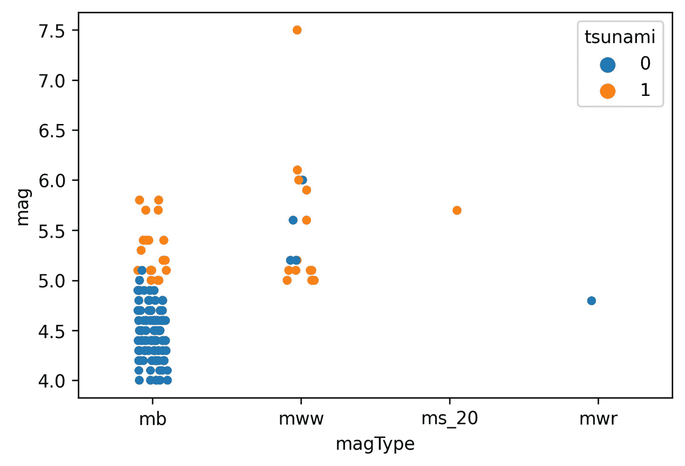

图 6.1 – Seaborn 的条形图

大部分情况下，海啸发生在较高震级的地震中，正如我们所预期的那样；然而，由于在较低震级区域有大量点的集中，我们无法清晰地看到所有的点。我们可以尝试调整 `jitter` 参数，它控制要添加多少随机噪声来减少重叠，或者调整 `alpha` 参数以控制透明度，正如我们在上一章所做的那样；幸运的是，还有一个函数 `swarmplot()`，它会尽可能减少重叠，因此我们将使用这个函数：

```py
>>> sns.swarmplot(
...     x='magType', 
...     y='mag', 
...     hue='tsunami',
...     data=quakes.query('parsed_place == "Indonesia"'),
...     size=3.5 # point size
... )
```

`mb` 列：

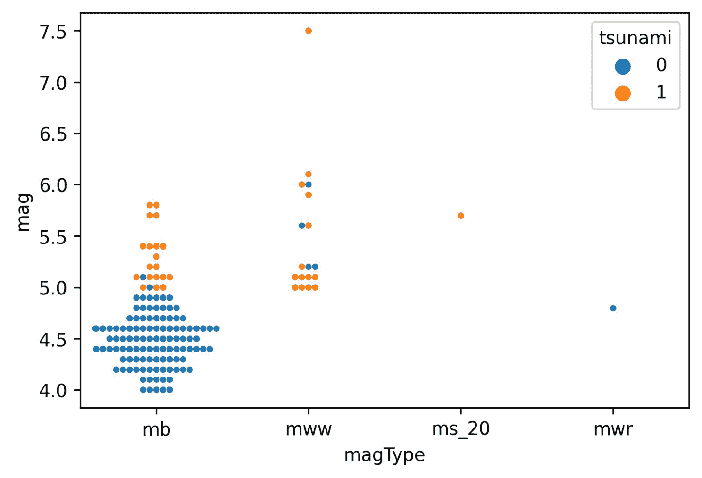

图 6.2 – Seaborn 的蜂群图

在上一章的 *使用 pandas 绘图* 部分中，我们讨论了如何可视化分布，并介绍了箱形图。Seaborn 为大数据集提供了增强型箱形图，它展示了更多的分位数，以便提供关于分布形状的更多信息，特别是尾部部分。让我们使用增强型箱形图来比较不同震级类型的地震震中，就像我们在 *第五章* 中所做的那样，*使用 Pandas 和 Matplotlib 可视化数据*：

```py
>>> sns.boxenplot(
...     x='magType', y='mag', data=quakes[['magType', 'mag']]
... )
>>> plt.title('Comparing earthquake magnitude by magType')
```

这将产生以下图表：

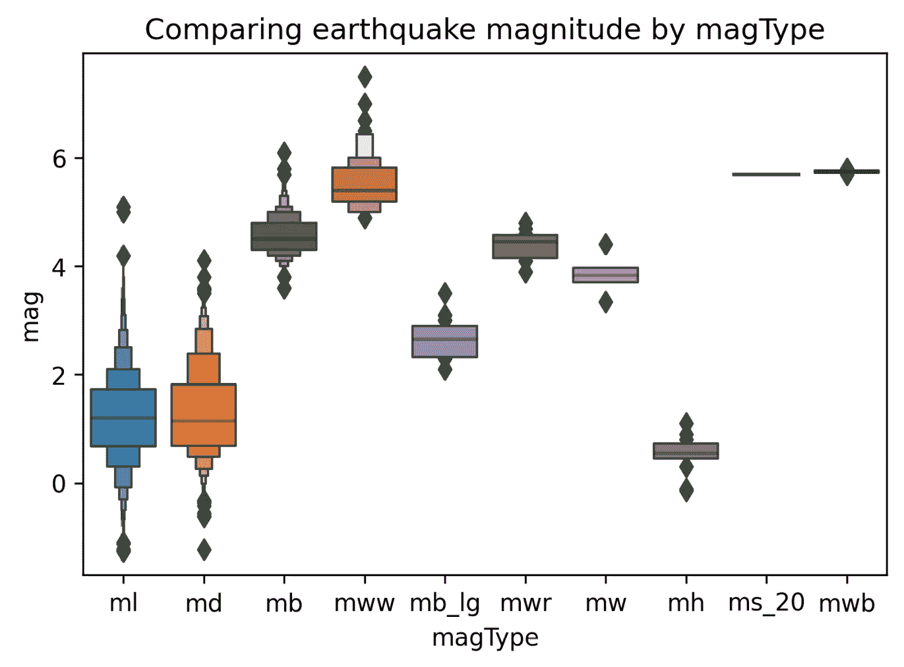

图 6.3 – Seaborn 的增强型箱形图

提示

增强型箱形图首次出现在 Heike Hofmann、Karen Kafadar 和 Hadley Wickham 合著的论文 *Letter-value plots: Boxplots for large data* 中，您可以在 [`vita.had.co.nz/papers/letter-value-plot.html`](https://vita.had.co.nz/papers/letter-value-plot.html) 找到该文。

箱形图非常适合可视化数据的分位数，但我们失去了关于分布的信息。正如我们所见，增强型箱形图是解决这个问题的一种方法——另一种策略是使用小提琴图，它结合了核密度估计（即基础分布的估计）和箱形图：

```py
>>> fig, axes = plt.subplots(figsize=(10, 5))
>>> sns.violinplot(
...     x='magType', y='mag', data=quakes[['magType', 'mag']], 
...     ax=axes, scale='width' # all violins have same width
... )
>>> plt.title('Comparing earthquake magnitude by magType')
```

箱形图部分穿过每个小提琴图的中心；然后，在以箱形图作为 *x* 轴的基础上，分别在两侧绘制 **核密度估计**（**KDE**）。由于它是对称的，我们可以从箱形图的任一侧读取 KDE：

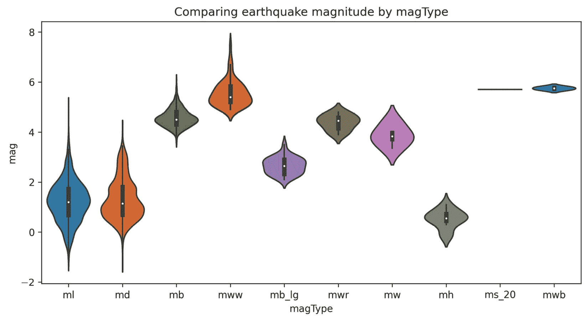

图 6.4 – Seaborn 的小提琴图

`seaborn` 文档还根据绘图数据类型列出了不同的绘图函数；完整的分类图表列表可以在[`seaborn.pydata.org/api.html#categorical-plots`](https://seaborn.pydata.org/api.html#categorical-plots)找到。一定要查看 `countplot()` 和 `barplot()` 函数，它们是我们在上一章使用 `pandas` 创建条形图的变体。

## 相关性和热图

如约定的那样，今天我们将学习一个比在 *第五章* 中使用 Pandas 和 Matplotlib 可视化数据时更简单的热图生成方法。这一次，我们将使用 `seaborn`，它提供了 `heatmap()` 函数，帮助我们更轻松地生成这种可视化图表：

```py
>>> sns.heatmap(
...     fb.sort_index().assign(
...         log_volume=np.log(fb.volume), 
...         max_abs_change=fb.high - fb.low
...     ).corr(), 
...     annot=True, 
...     center=0, 
...     vmin=-1, 
...     vmax=1
... )
```

提示

在使用 `seaborn` 时，我们仍然可以使用 `matplotlib` 中的函数，如 `plt.savefig()` 和 `plt.tight_layout()`。请注意，如果 `plt.tight_layout()` 存在问题，可以改为将 `bbox_inches='tight'` 传递给 `plt.savefig()`。

我们传入 `center=0`，这样 `seaborn` 会将 `0`（无相关性）放置在它使用的色图的中心。为了将色标的范围设置为相关系数的范围，我们还需要提供 `vmin=-1` 和 `vmax=1`。注意，我们还传入了 `annot=True`，这样每个框内会显示相关系数——我们可以通过一次函数调用，既获得数值数据又获得可视化数据：

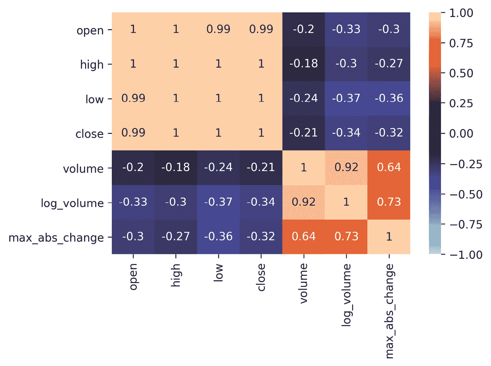

图 6.5 – Seaborn 的热图

Seaborn 还为我们提供了 `pandas.plotting` 模块中提供的 `scatter_matrix()` 函数的替代方案，叫做 `pairplot()`。我们可以使用这个函数将 Facebook 数据中各列之间的相关性以散点图的形式展示，而不是热图：

```py
>>> sns.pairplot(fb)
```

这个结果使我们能够轻松理解 OHLC 各列之间在热图中几乎完美的正相关关系，同时还展示了沿对角线的每一列的直方图：

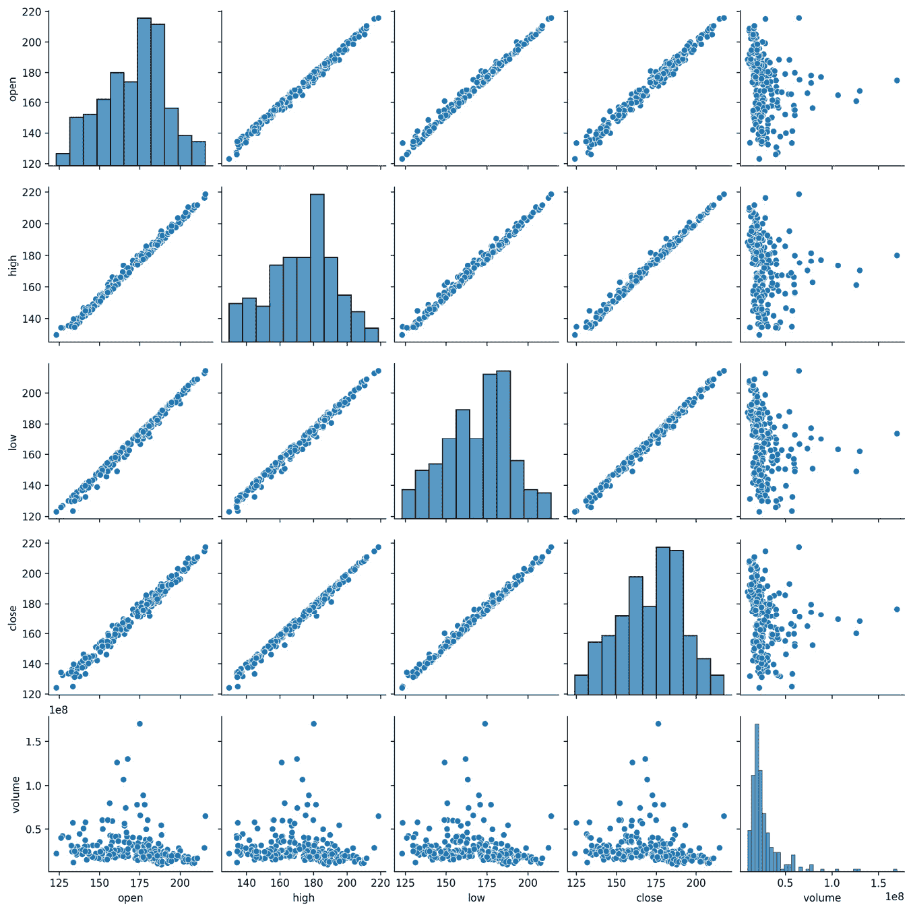

图 6.6 – Seaborn 的配对图

Facebook 在 2018 年下半年表现显著不如上半年，因此我们可能想了解数据在每个季度的分布变化情况。与 `pandas.plotting.scatter_matrix()` 函数类似，我们可以使用 `diag_kind` 参数来指定对角线的处理方式；然而，与 `pandas` 不同的是，我们可以轻松地通过 `hue` 参数基于其他数据为图形着色。为此，我们只需要添加 `quarter` 列，并将其提供给 `hue` 参数：

```py
>>> sns.pairplot(
...     fb.assign(quarter=lambda x: x.index.quarter), 
...     diag_kind='kde', hue='quarter'
... )
```

我们现在可以看到，OHLC 各列的分布在第一季度的标准差较小（因此方差也较小），而股价在第四季度大幅下跌（分布向左偏移）：

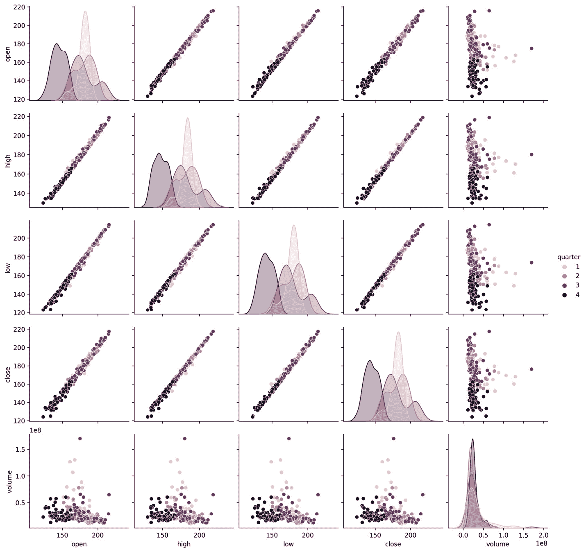

图 6.7 – 利用数据来确定绘图颜色

提示

我们还可以将 `kind='reg'` 传递给 `pairplot()` 来显示回归线。

如果我们只想比较两个变量，可以使用`jointplot()`，它会给我们一个散点图，并在两侧展示每个变量的分布。让我们再次查看交易量的对数与 Facebook 股票的日内最高价和最低价差异之间的关联，就像我们在*第五章*中所做的那样，*使用 Pandas 和 Matplotlib 可视化数据*：

```py
>>> sns.jointplot(
...     x='log_volume', 
...     y='max_abs_change', 
...     data=fb.assign(
...         log_volume=np.log(fb.volume), 
...         max_abs_change=fb.high - fb.low
...     )
... )
```

使用`kind`参数的默认值，我们会得到分布的直方图，并在中心显示一个普通的散点图：

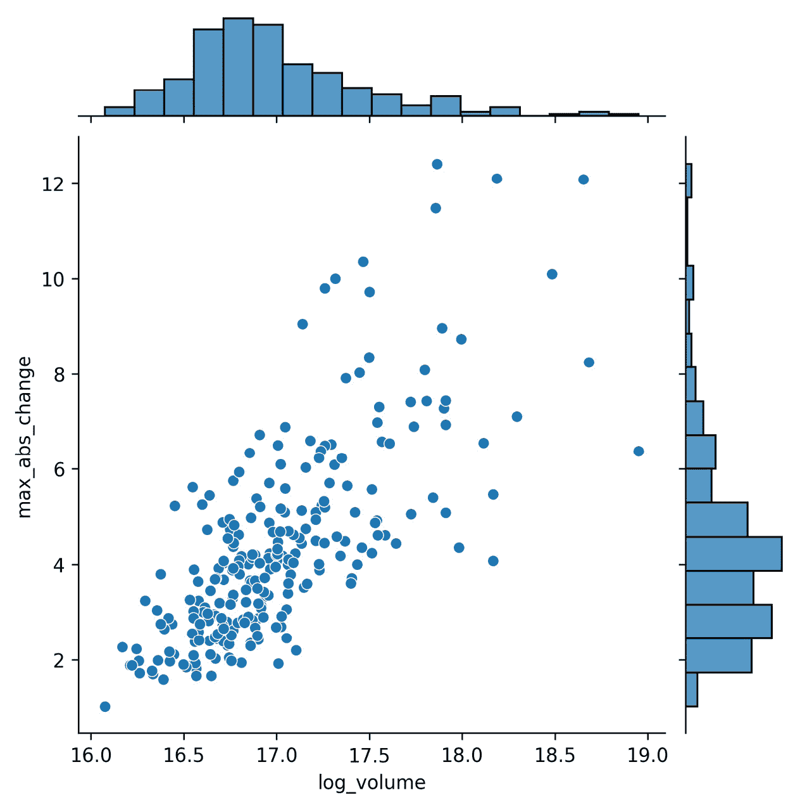

图 6.8 – Seaborn 的联合图

Seaborn 为`kind`参数提供了许多替代选项。例如，我们可以使用 hexbins，因为当我们使用散点图时，会有显著的重叠：

```py
>>> sns.jointplot(
...     x='log_volume', 
...     y='max_abs_change', 
...     kind='hex',
...     data=fb.assign(
...         log_volume=np.log(fb.volume), 
...         max_abs_change=fb.high - fb.low
...     )
... )
```

我们现在可以看到左下角有大量的点集中：

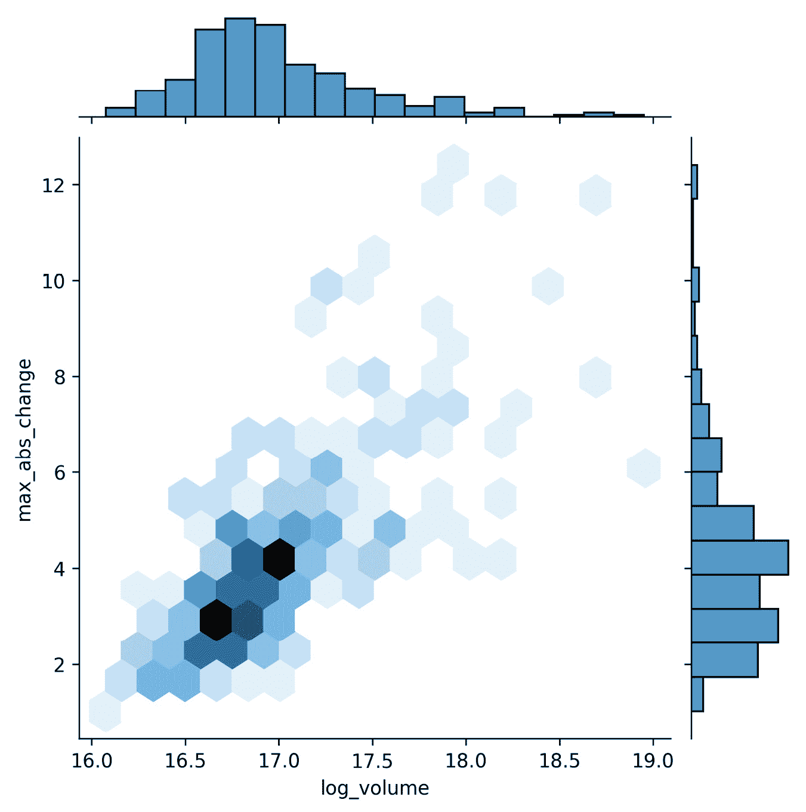

图 6.9 – 使用 hexbins 的联合图

另一种查看值集中度的方法是使用`kind='kde'`，这会给我们一个**等高线图**，以表示联合密度估计，并同时展示每个变量的 KDEs：

```py
>>> sns.jointplot(
...     x='log_volume', 
...     y='max_abs_change', 
...     kind='kde',
...     data=fb.assign(
...         log_volume=np.log(fb.volume), 
...         max_abs_change=fb.high - fb.low
...     )
... )
```

等高线图中的每条曲线包含给定密度的点：

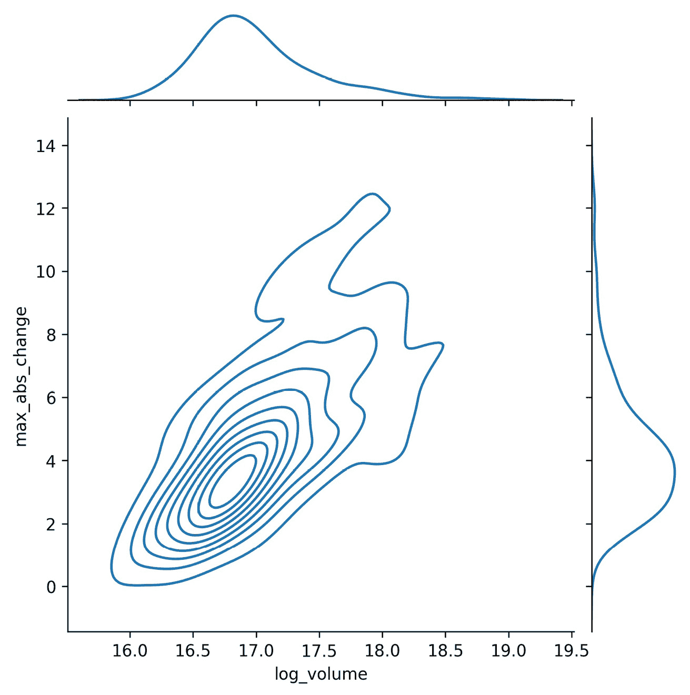

图 6.10 – 联合分布图

此外，我们还可以在中心绘制回归图，并在两侧获得 KDEs 和直方图：

```py
>>> sns.jointplot(
...     x='log_volume', 
...     y='max_abs_change', 
...     kind='reg',
...     data=fb.assign(
...         log_volume=np.log(fb.volume), 
...         max_abs_change=fb.high - fb.low
...     )
... )
```

这导致回归线通过散点图绘制，并且在回归线周围绘制了一个较浅颜色的置信带：

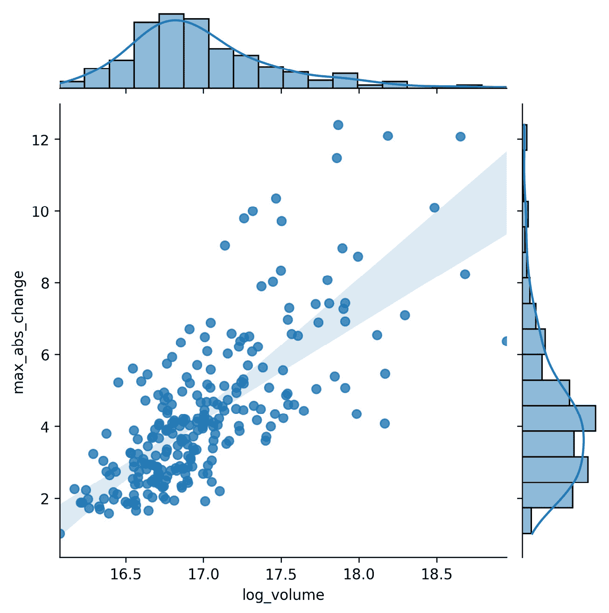

图 6.11 – 带有线性回归和 KDEs 的联合图

关系看起来是线性的，但我们应该查看`kind='resid'`：

```py
>>> sns.jointplot(
...     x='log_volume', 
...     y='max_abs_change', 
...     kind='resid',
...     data=fb.assign(
...         log_volume=np.log(fb.volume), 
...         max_abs_change=fb.high - fb.low
...     )
... )
# update y-axis label (discussed next section)
>>> plt.ylabel('residuals')
```

注意，随着交易量的增加，残差似乎越来越远离零，这可能意味着这不是建模这种关系的正确方式：

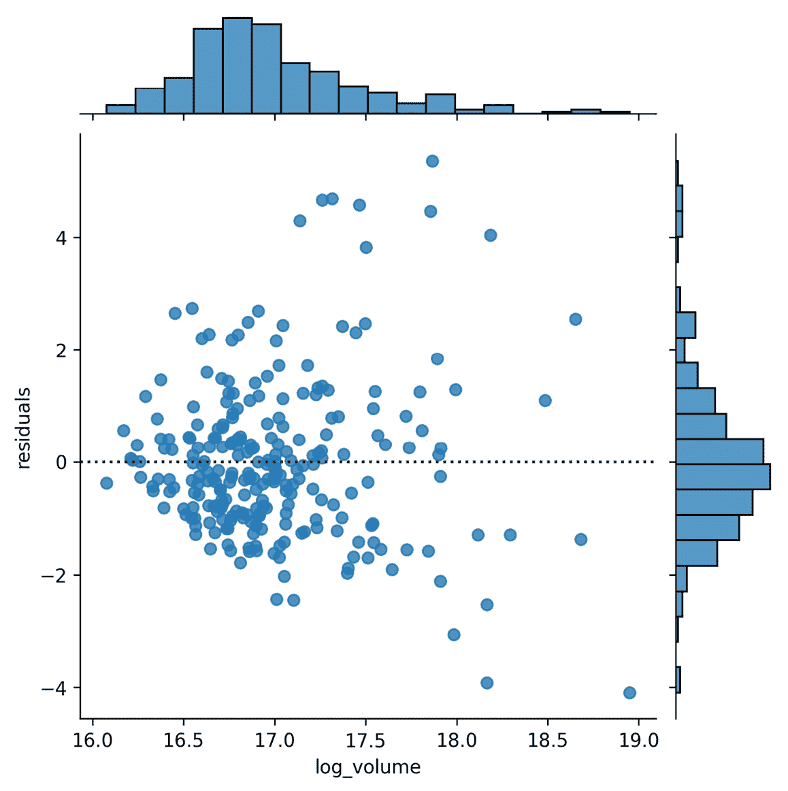

图 6.12 – 显示线性回归残差的联合图

我们刚刚看到，我们可以使用`jointplot()`来生成回归图或残差图；自然，`seaborn`提供了直接生成这些图形的函数，无需创建整个联合图。接下来我们来讨论这些。

## 回归图

`regplot()`函数会计算回归线并绘制它，而`residplot()`函数会计算回归并仅绘制残差。我们可以编写一个函数将这两者结合起来，但首先需要一些准备工作。

我们的函数将绘制任意两列的所有排列（与组合不同，排列的顺序很重要，例如，`(open, close)`不等同于`(close, open)`）。这使我们能够将每一列作为回归变量和因变量来看待；由于我们不知道关系的方向，因此在调用函数后让查看者自行决定。这会生成许多子图，因此我们将创建一个只包含来自 Facebook 数据的少数几列的新数据框。

我们将查看交易量的对数（`log_volume`）和 Facebook 股票的日最高价与最低价之间的差异（`max_abs_change`）。我们使用`assign()`来创建这些新列，并将它们保存在一个名为`fb_reg_data`的新数据框中：

```py
>>> fb_reg_data = fb.assign(
...     log_volume=np.log(fb.volume), 
...     max_abs_change=fb.high - fb.low
... ).iloc[:,-2:]
```

接下来，我们需要导入`itertools`，它是 Python 标准库的一部分（[`docs.python.org/3/library/itertools.html`](https://docs.python.org/3/library/itertools.html)）。在编写绘图函数时，`itertools`非常有用；它可以非常轻松地创建高效的迭代器，用于排列、组合和无限循环或重复等操作：

```py
>>> import itertools
```

**可迭代对象**是可以被迭代的对象。当我们启动一个循环时，会从可迭代对象中创建一个**迭代器**。每次迭代时，迭代器提供它的下一个值，直到耗尽；这意味着，一旦我们完成了一次对所有项的迭代，就没有剩余的元素，它不能再次使用。迭代器是可迭代对象，但并非所有可迭代对象都是迭代器。不是迭代器的可迭代对象可以被重复使用。

使用`itertools`时返回的迭代器只能使用一次：

```py
>>> iterator = itertools.repeat("I'm an iterator", 1)
>>> for i in iterator:
...     print(f'-->{i}')
-->I'm an iterator
>>> print(
...     'This printed once because the iterator '
...     'has been exhausted'
... )
This printed once because the iterator has been exhausted
>>> for i in iterator:
...     print(f'-->{i}')
```

另一方面，列表是一个可迭代对象；我们可以编写一个循环遍历列表中的所有元素，之后仍然可以得到一个列表用于后续使用：

```py
>>> iterable = list(itertools.repeat("I'm an iterable", 1))
>>> for i in iterable:
...     print(f'-->{i}')
-->I'm an iterable
>>> print('This prints again because it\'s an iterable:')
This prints again because it's an iterable:
>>> for i in iterable:
...     print(f'-->{i}')
-->I'm an iterable
```

现在我们对`itertools`和迭代器有了一些了解，接下来我们来编写回归和残差排列图的函数：

```py
def reg_resid_plots(data):
    """
    Using `seaborn`, plot the regression and residuals plots 
    side-by-side for every permutation of 2 columns in data.
    Parameters:
        - data: A `pandas.DataFrame` object
    Returns:
        A matplotlib `Axes` object.
    """
    num_cols = data.shape[1]
    permutation_count = num_cols * (num_cols - 1)
    fig, ax = \
        plt.subplots(permutation_count, 2, figsize=(15, 8))
    for (x, y), axes, color in zip(
        itertools.permutations(data.columns, 2), 
        ax,
        itertools.cycle(['royalblue', 'darkorange'])
    ):
        for subplot, func in zip(
            axes, (sns.regplot, sns.residplot)
        ):
            func(x=x, y=y, data=data, ax=subplot, color=color)
            if func == sns.residplot:
                subplot.set_ylabel('residuals')
    return fig.axes
```

在这个函数中，我们可以看到到目前为止本章以及上一章中涉及的所有内容都已融合在一起；我们计算需要多少个子图，并且由于每种排列会有两个图表，我们只需要排列的数量来确定行数。我们利用了`zip()`函数，它可以一次性从多个可迭代对象中获取值并以元组形式返回，再通过元组解包轻松地遍历排列元组和二维的`Axes`对象数组。花些时间确保你理解这里发生了什么；本章末尾的*进一步阅读*部分也有关于`zip()`和元组解包的资源。

重要提示

如果我们提供不同长度的可迭代对象给`zip()`，我们将只得到与最短长度相等数量的元组。因此，我们可以使用无限迭代器，如使用`itertools.repeat()`时获得的，它会无限次重复相同的值（当我们没有指定重复次数时），以及`itertools.cycle()`，它会在所有提供的值之间无限循环。

调用我们的函数非常简单，只需要一个参数：

```py
>>> from viz import reg_resid_plots
>>> reg_resid_plots(fb_reg_data)
```

第一行的子集是我们之前在联合图中看到的，而第二行则是翻转`x`和`y`变量时的回归：

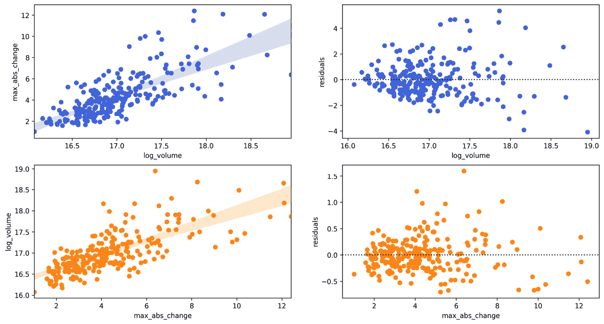

图 6.13 – Seaborn 线性回归和残差图

提示

`regplot()`函数通过`order`和`logistic`参数分别支持多项式回归和逻辑回归。

Seaborn 还使得在数据的不同子集上绘制回归变得简单，我们可以使用`lmplot()`来分割回归图。我们可以使用`hue`、`col`和`row`来分割回归图，分别通过给定列的值进行着色、为每个值创建一个新列以及为每个值创建一个新行。

我们看到 Facebook 的表现因每个季度而异，因此让我们使用 Facebook 股票数据计算每个季度的回归，使用交易量和每日最高与最低价格之间的差异，看看这种关系是否也发生变化：

```py
>>> sns.lmplot(
...     x='log_volume', 
...     y='max_abs_change', 
...     col='quarter',
...     data=fb.assign(
...         log_volume=np.log(fb.volume), 
...         max_abs_change=fb.high - fb.low,
...         quarter=lambda x: x.index.quarter
...     )
... )
```

请注意，第四季度的回归线比前几个季度的斜率要陡得多：

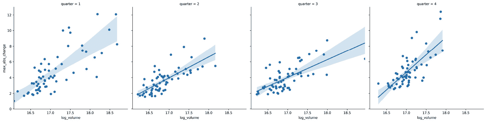

图 6.14 – Seaborn 带有子集的线性回归图

请注意，运行`lmplot()`的结果是一个`FacetGrid`对象，这是`seaborn`的一个强大功能。接下来，我们将讨论如何在其中直接使用任何图形进行绘制。

## 分面

分面允许我们在子图上绘制数据的子集（分面）。我们已经通过一些`seaborn`函数看到了一些分面；然而，我们也可以轻松地为自己制作分面，以便与任何绘图函数一起使用。让我们创建一个可视化，比较印尼和巴布亚新几内亚的地震震级分布，看看是否发生了海啸。

首先，我们使用将要使用的数据创建一个`FacetGrid`对象，并通过`row`和`col`参数定义如何对子集进行划分：

```py
>>> g = sns.FacetGrid(
...     quakes.query(
...         'parsed_place.isin('
...         '["Indonesia", "Papua New Guinea"]) '
...         'and magType == "mb"'
...     ),   
...     row='tsunami',
...     col='parsed_place',
...     height=4
... )
```

然后，我们使用`FacetGrid.map()`方法对每个子集运行绘图函数，并传递必要的参数。我们将使用`sns.histplot()`函数为位置和海啸数据子集制作带有 KDE 的直方图：

```py
>>> g = g.map(sns.histplot, 'mag', kde=True)
```

对于这两个位置，我们可以看到，当地震震级达到 5.0 或更大时，发生了海啸：

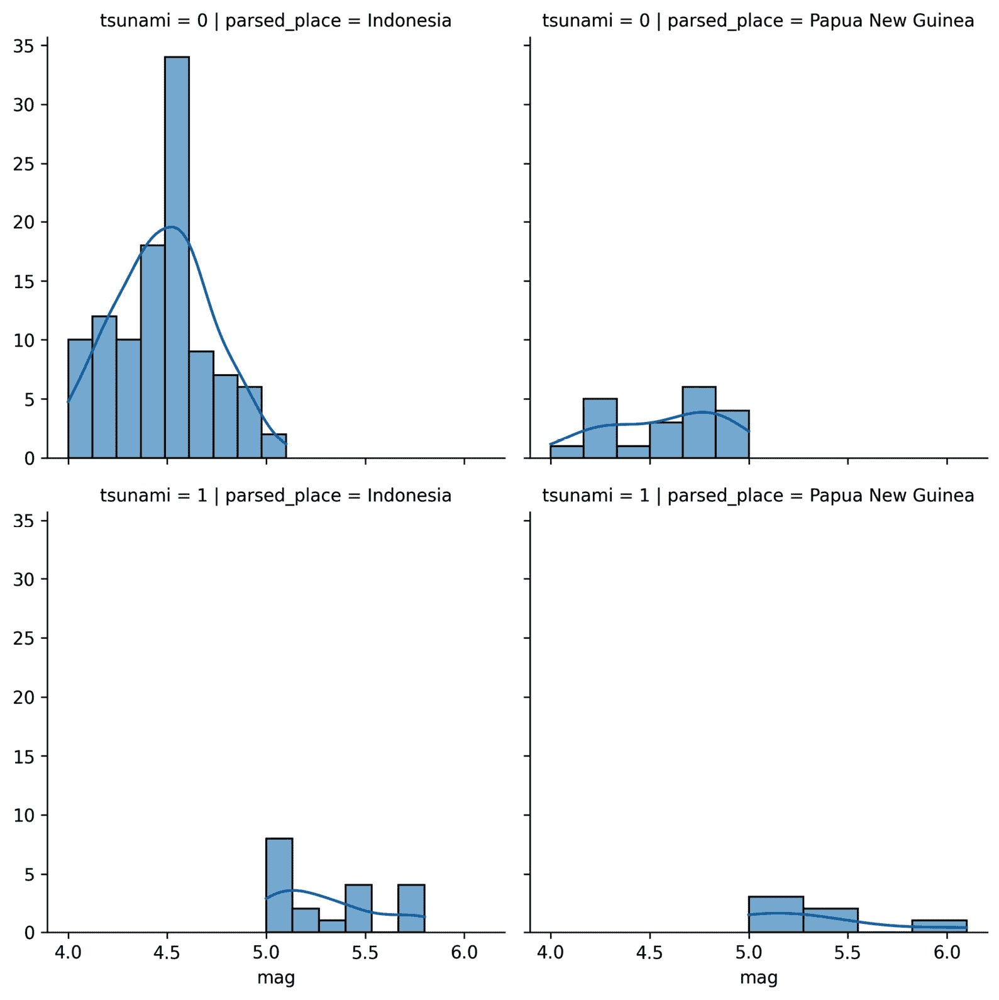

图 6.15 – 使用分面网格绘图

这结束了我们关于`seaborn`绘图功能的讨论；不过，我鼓励你查看 API（[`seaborn.pydata.org/api.html`](https://seaborn.pydata.org/api.html)）以了解更多功能。此外，在绘制数据时，务必查阅*附录*中的*选择合适的可视化方式*部分作为参考。

# 使用 matplotlib 格式化图表

使我们的可视化图表具有表现力的一个重要部分是选择正确的图表类型，并且为其添加清晰的标签，以便易于解读。通过精心调整最终的可视化外观，我们使其更容易阅读和理解。

现在，让我们转到`2-formatting_plots.ipynb`笔记本，运行设置代码导入所需的包，并读取 Facebook 股票数据和 COVID-19 每日新增病例数据：

```py
>>> %matplotlib inline
>>> import matplotlib.pyplot as plt
>>> import numpy as np
>>> import pandas as pd 
>>> fb = pd.read_csv(
...     'data/fb_stock_prices_2018.csv', 
...     index_col='date', 
...     parse_dates=True
... ) 
>>> covid = pd.read_csv('data/covid19_cases.csv').assign(
...     date=lambda x: \
...         pd.to_datetime(x.dateRep, format='%d/%m/%Y')
... ).set_index('date').replace(
...     'United_States_of_America', 'USA'
... ).sort_index()['2020-01-18':'2020-09-18']
```

在接下来的几个章节中，我们将讨论如何为图表添加标题、坐标轴标签和图例，以及如何自定义坐标轴。请注意，本节中的所有内容需要在运行`plt.show()`之前调用，或者如果使用`%matplotlib inline`魔法命令，则需要在同一个 Jupyter Notebook 单元格中调用。

## 标题和标签

迄今为止，我们创建的某些可视化图表没有标题或坐标轴标签。我们知道图中的内容，但如果我们要向他人展示这些图表，可能会引起一些混淆。为标签和标题提供明确的说明是一种良好的做法。

我们看到，当使用`pandas`绘图时，可以通过将`title`参数传递给`plot()`方法来添加标题，但我们也可以通过`matplotlib`的`plt.title()`来实现这一点。请注意，我们可以将`x`/`y`值传递给`plt.title()`以控制文本的位置。我们还可以更改字体及其大小。为坐标轴添加标签也同样简单；我们可以使用`plt.xlabel()`和`plt.ylabel()`。让我们绘制 Facebook 的收盘价，并使用`matplotlib`添加标签：

```py
>>> fb.close.plot()
>>> plt.title('FB Closing Price')
>>> plt.xlabel('date')
>>> plt.ylabel('price ($)')
```

这将导致以下图表：

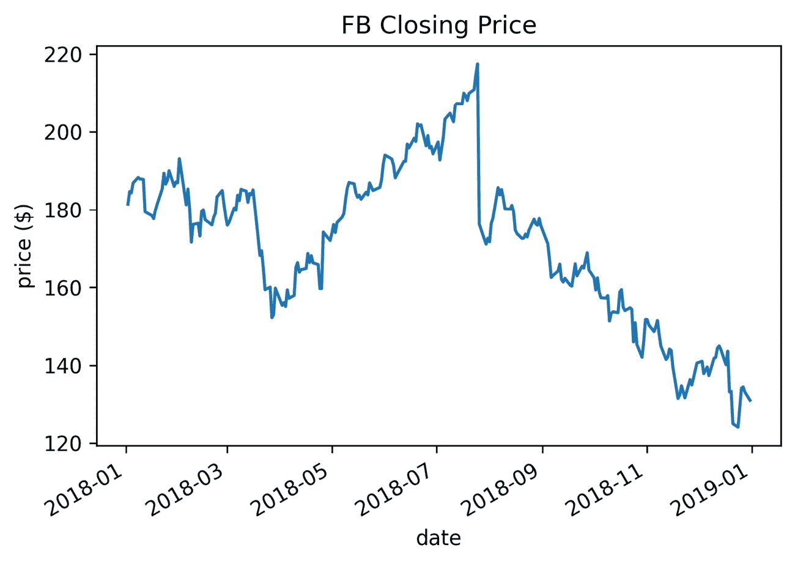

图 6.16 – 使用 matplotlib 为图表添加标签

在处理子图时，我们需要采取不同的方法。为了直观地了解这一点，让我们绘制 Facebook 股票的 OHLC 数据的子图，并使用`plt.title()`为整个图表添加标题，同时使用`plt.ylabel()`为每个子图的*y*-轴添加标签：

```py
>>> fb.iloc[:,:4]\
...     .plot(subplots=True, layout=(2, 2), figsize=(12, 5))
>>> plt.title('Facebook 2018 Stock Data')
>>> plt.ylabel('price ($)')
```

使用`plt.title()`将标题放置在最后一个子图上，而不是像我们预期的那样为整个图表添加标题。*y*-轴标签也会出现同样的问题：

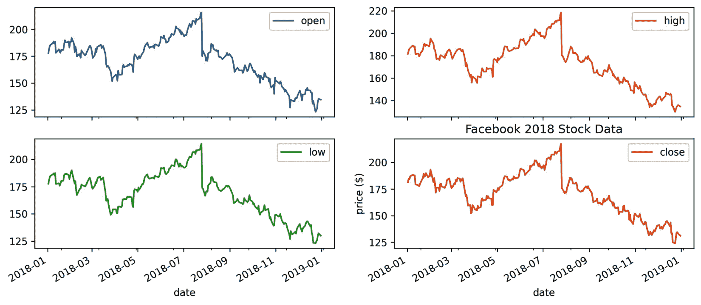

图 6.17 – 为子图添加标签可能会引起混淆

在子图的情况下，我们希望给整个图表添加标题；因此，我们使用 `plt.suptitle()`。相反，我们希望给每个子图添加 *y*-轴标签，因此我们在 `plot()` 返回的每个 `Axes` 对象上使用 `set_ylabel()` 方法。请注意，`Axes` 对象会以与子图布局相同维度的 NumPy 数组返回，因此为了更方便地迭代，我们调用 `flatten()`：

```py
>>> axes = fb.iloc[:,:4]\
...     .plot(subplots=True, layout=(2, 2), figsize=(12, 5))
>>> plt.suptitle('Facebook 2018 Stock Data')
>>> for ax in axes.flatten():
...     ax.set_ylabel('price ($)')
```

这样会为整个图表添加一个标题，并为每个子图添加*y*-轴标签：

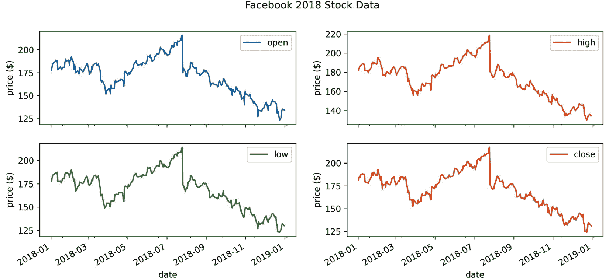

图 6.18 – 标注子图

请注意，`Figure` 类也有一个 `suptitle()` 方法，而 `Axes` 类的 `set()` 方法允许我们标注坐标轴、设置图表标题等，所有这些都可以通过一次调用来完成，例如，`set(xlabel='…', ylabel='…', title='…', …)`。根据我们想做的事情，我们可能需要直接调用 `Figure` 或 `Axes` 对象的方法，因此了解这些方法很重要。

## 图例

Matplotlib 使得可以通过 `plt.legend()` 函数和 `Axes.legend()` 方法控制图例的许多方面。例如，我们可以指定图例的位置，并格式化图例的外观，包括自定义字体、颜色等。`plt.legend()` 函数和 `Axes.legend()` 方法也可以用于在图表最初没有图例的情况下显示图例。以下是一些常用参数的示例：

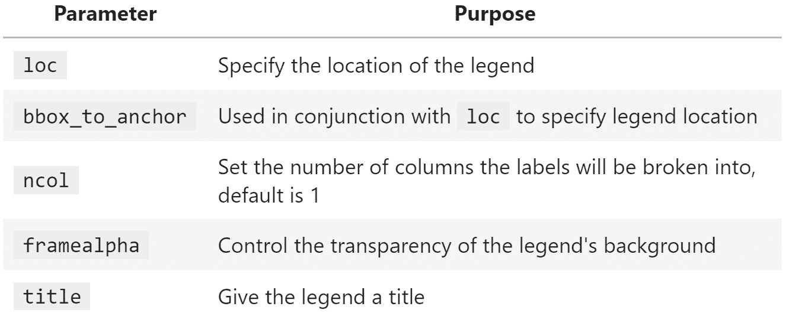

图 6.19 – 图例格式化的有用参数

图例将使用每个绘制对象的标签。如果我们不希望某个对象显示图例，可以将它的标签设置为空字符串。但是，如果我们只是想修改某个对象的显示名称，可以通过 `label` 参数传递它的显示名称。我们来绘制 Facebook 股票的收盘价和 20 天移动平均线，使用 `label` 参数为图例提供描述性名称：

```py
>>> fb.assign(
...     ma=lambda x: x.close.rolling(20).mean()
... ).plot(
...     y=['close', 'ma'], 
...     title='FB closing price in 2018',
...     label=['closing price', '20D moving average'],
...     style=['-', '--']
... )
>>> plt.legend(loc='lower left')
>>> plt.ylabel('price ($)')
```

默认情况下，`matplotlib` 会尝试为图表找到最佳位置，但有时它会遮挡图表的部分内容，就像在这个例子中一样。因此，我们选择将图例放在图表的左下角。请注意，图例中的文本是我们在 `plot()` 的 `label` 参数中提供的内容：

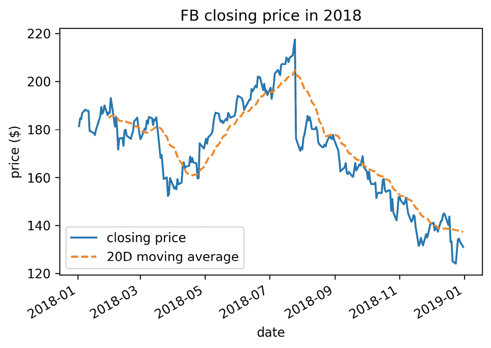

图 6.20 – 移动图例

请注意，我们传递了一个字符串给 `loc` 参数来指定图例的位置；我们也可以传递代码作为整数或元组，表示图例框左下角的 `(x, y)` 坐标。下表包含了可能的位置信息字符串：

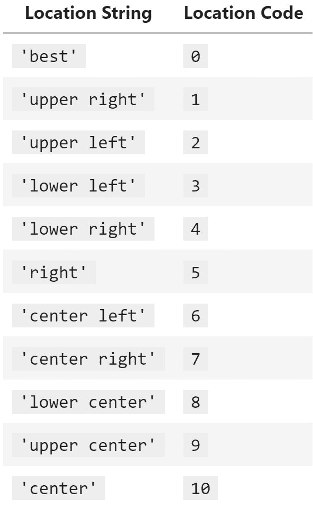

图 6.21 – 常见图例位置

现在我们来看看如何使用 `framealpha`、`ncol` 和 `title` 参数来设置图例的样式。我们将绘制 2020 年 1 月 18 日至 2020 年 9 月 18 日期间，巴西、中国、意大利、西班牙和美国的世界每日新增 COVID-19 病例占比。此外，我们还会移除图表的顶部和右侧框线，使其看起来更简洁：

```py
>>> new_cases = covid.reset_index().pivot(
...     index='date',
...     columns='countriesAndTerritories',
...     values='cases'
... ).fillna(0)
>>> pct_new_cases = new_cases.apply(
...     lambda x: x / new_cases.apply('sum', axis=1), axis=0
... )[
...     ['Italy', 'China', 'Spain', 'USA', 'India', 'Brazil']
... ].sort_index(axis=1).fillna(0)
>>> ax = pct_new_cases.plot(
...     figsize=(12, 7),
...     style=['-'] * 3 + ['--', ':', '-.'],
...     title='Percentage of the World\'s New COVID-19 Cases'
...           '\n(source: ECDC)'
... )
>>> ax.legend(title='Country', framealpha=0.5, ncol=2)
>>> ax.set_xlabel('')
>>> ax.set_ylabel('percentage of the world\'s COVID-19 cases')
>>> for spine in ['top', 'right']:
...     ax.spines[spine].set_visible(False)
```

我们的图例已整齐地排列为两列，并且包含了一个标题。我们还增加了图例边框的透明度：

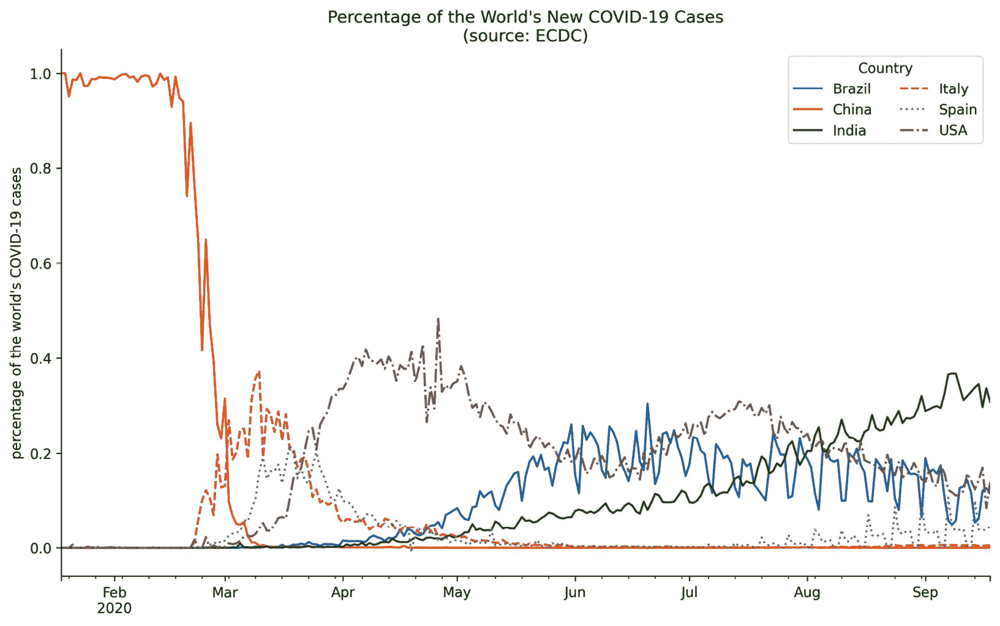

图 6.22 – 格式化图例

提示

不要被试图记住所有可用选项而感到不知所措。如果我们不试图学习每一种可能的自定义，而是根据需要查找与我们视觉化目标相匹配的功能，反而会更容易。

## 格式化轴

在*第一章*《数据分析简介》中，我们讨论了如果我们不小心，轴的限制可能会导致误导性的图表。我们可以通过将轴的限制作为元组传递给 `xlim`/`ylim` 参数来使用 `pandas` 的 `plot()` 方法。或者，使用 `matplotlib` 时，我们可以通过 `plt.xlim()`/`plt.ylim()` 函数或 `Axes` 对象上的 `set_xlim()`/`set_ylim()` 方法调整每个轴的限制。我们分别传递最小值和最大值；如果我们想保持自动生成的限制，可以传入 `None`。让我们修改之前的图表，将世界各国每日新增 COVID-19 病例的百分比的 *y* 轴从零开始：

```py
>>> ax = pct_new_cases.plot(
...     figsize=(12, 7),
...     style=['-'] * 3 + ['--', ':', '-.'],
...     title='Percentage of the World\'s New COVID-19 Cases'
...           '\n(source: ECDC)'
... )
>>> ax.legend(framealpha=0.5, ncol=2)
>>> ax.set_xlabel('')
>>> ax.set_ylabel('percentage of the world\'s COVID-19 cases')
>>> ax.set_ylim(0, None)
>>> for spine in ['top', 'right']:
...     ax.spines[spine].set_visible(False)
```

请注意，*y* 轴现在从零开始：

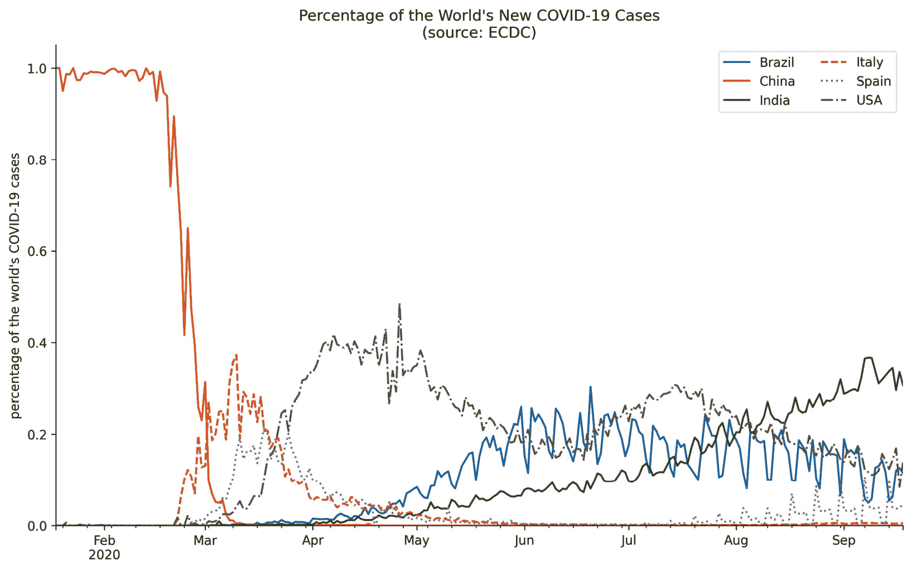

图 6.23 – 使用 matplotlib 更新轴限制

如果我们想改变轴的刻度，可以使用 `plt.xscale()`/`plt.yscale()` 并传入我们想要的刻度类型。例如，`plt.yscale('log')` 将会为 *y* 轴使用对数刻度；我们在前一章中已经学过如何使用 `pandas` 实现这一点。

我们还可以通过将刻度位置和标签传递给 `plt.xticks()` 或 `plt.yticks()` 来控制显示哪些刻度线以及它们的标签。请注意，我们也可以调用这些函数来获取刻度位置和标签。例如，由于我们的数据从每个月的 18 日开始和结束，让我们将前一个图表中的刻度线移到每个月的 18 日，然后相应地标记刻度：

```py
>>> ax = pct_new_cases.plot(
...     figsize=(12, 7),
...     style=['-'] * 3 + ['--', ':', '-.'],
...     title='Percentage of the World\'s New COVID-19 Cases'
...           '\n(source: ECDC)'
... )
>>> tick_locs = covid.index[covid.index.day == 18].unique()
>>> tick_labels = \
...     [loc.strftime('%b %d\n%Y') for loc in tick_locs]
>>> plt.xticks(tick_locs, tick_labels)
>>> ax.legend(framealpha=0.5, ncol=2)
>>> ax.set_xlabel('')
>>> ax.set_ylabel('percentage of the world\'s COVID-19 cases')
>>> ax.set_ylim(0, None)
>>> for spine in ['top', 'right']:
...     ax.spines[spine].set_visible(False)
```

移动刻度线后，图表的第一个数据点（2020 年 1 月 18 日）和最后一个数据点（2020 年 9 月 18 日）都有刻度标签：

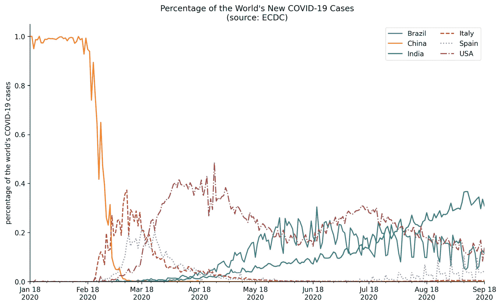

图 6.24 – 编辑刻度标签

我们当前将百分比表示为小数，但可能希望将标签格式化为使用百分号。请注意，不需要使用`plt.yticks()`函数来做到这一点；相反，我们可以使用`matplotlib.ticker`模块中的`PercentFormatter`类：

```py
>>> from matplotlib.ticker import PercentFormatter
>>> ax = pct_new_cases.plot(
...     figsize=(12, 7),
...     style=['-'] * 3 + ['--', ':', '-.'],
...     title='Percentage of the World\'s New COVID-19 Cases'
...           '\n(source: ECDC)'
... )
>>> tick_locs = covid.index[covid.index.day == 18].unique()
>>> tick_labels = \
...     [loc.strftime('%b %d\n%Y') for loc in tick_locs]
>>> plt.xticks(tick_locs, tick_labels)
>>> ax.legend(framealpha=0.5, ncol=2)
>>> ax.set_xlabel('')
>>> ax.set_ylabel('percentage of the world\'s COVID-19 cases')
>>> ax.set_ylim(0, None)
>>> ax.yaxis.set_major_formatter(PercentFormatter(xmax=1))
>>> for spine in ['top', 'right']:
...     ax.spines[spine].set_visible(False)
```

通过指定`xmax=1`，我们表示我们的值应该先除以 1（因为它们已经是百分比），然后乘以 100 并附加百分号。这将导致*y*轴上显示百分比：

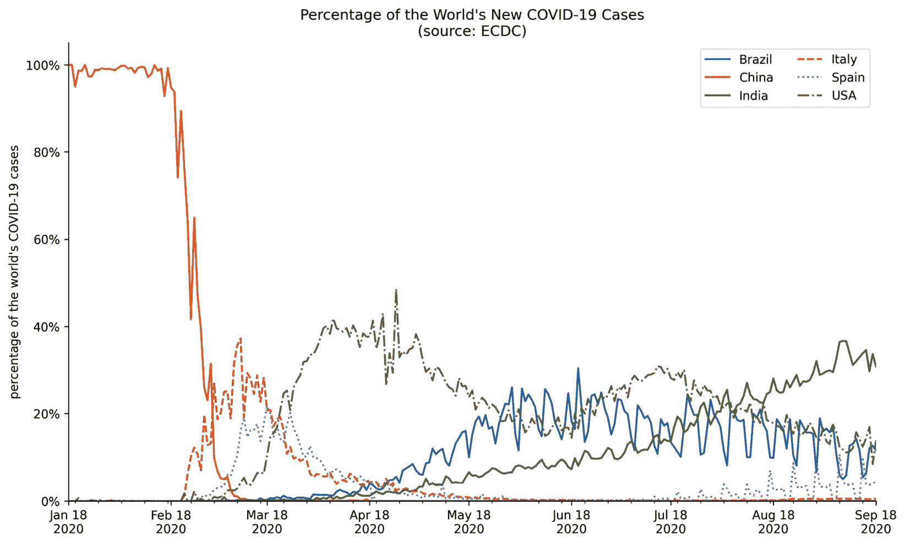

图 6.25 – 将刻度标签格式化为百分比

另一个有用的格式化器是`EngFormatter`类，它会自动将数字格式化为千位、百万位等，采用**工程计数法**。让我们用它来绘制每个大洲的累计 COVID-19 病例（单位：百万）：

```py
>>> from matplotlib.ticker import EngFormatter
>>> ax = covid.query('continentExp != "Other"').groupby([
...     'continentExp', pd.Grouper(freq='1D')
... ]).cases.sum().unstack(0).apply('cumsum').plot(
...     style=['-', '-', '--', ':', '-.'],
...     title='Cumulative COVID-19 Cases per Continent'
...           '\n(source: ECDC)'
... )
>>> ax.legend(title='', loc='center left')
>>> ax.set(xlabel='', ylabel='total COVID-19 cases')
>>> ax.yaxis.set_major_formatter(EngFormatter())
>>> for spine in ['top', 'right']:
...     ax.spines[spine].set_visible(False)
```

请注意，我们不需要将累计病例数除以 100 万来得到这些数字——我们传递给`set_major_formatter()`的`EngFormatter`对象自动计算出应该使用百万（M）单位来表示数据：

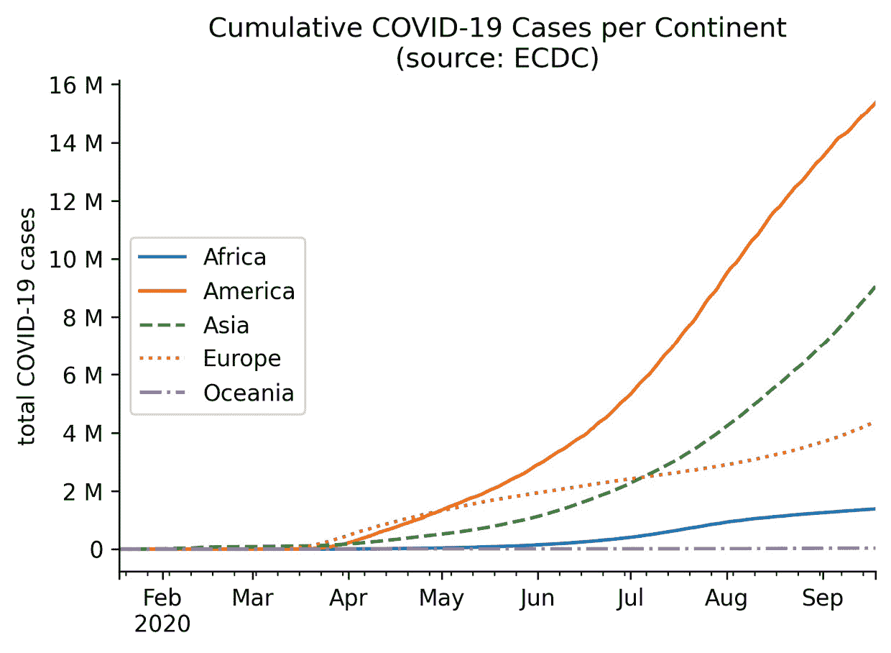

图 6.26 – 使用工程计数法格式化刻度标签

`PercentFormatter`和`EngFormatter`类都可以格式化刻度标签，但有时我们希望更改刻度的位置，而不是格式化它们。实现这一点的一种方法是使用`MultipleLocator`类，它可以轻松地将刻度设置为我们选择的倍数。为了演示我们如何使用它，来看一下 2020 年 4 月 18 日至 2020 年 9 月 18 日新西兰的每日新增 COVID-19 病例：

```py
>>> ax = new_cases.New_Zealand['2020-04-18':'2020-09-18'].plot(
...     title='Daily new COVID-19 cases in New Zealand'
...           '\n(source: ECDC)'
... )
>>> ax.set(xlabel='', ylabel='new COVID-19 cases')
>>> for spine in ['top', 'right']:
...     ax.spines[spine].set_visible(False)
```

如果不干预刻度位置，`matplotlib`将以 2.5 为间隔显示刻度。我们知道没有半个病例，因此最好以整数刻度显示该数据：

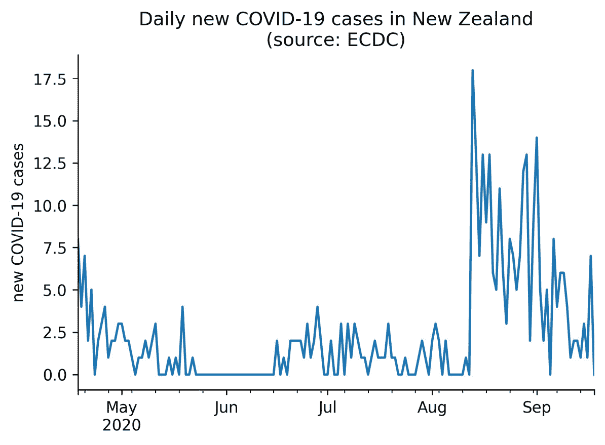

图 6.27 – 默认刻度位置

我们通过使用`MultipleLocator`类来修正这个问题。在这里，我们并没有格式化轴标签，而是控制显示哪些标签；因此，我们必须调用`set_major_locator()`方法，而不是`set_major_formatter()`：

```py
>>> from matplotlib.ticker import MultipleLocator
>>> ax = new_cases.New_Zealand['2020-04-18':'2020-09-18'].plot(
...     title='Daily new COVID-19 cases in New Zealand'
...           '\n(source: ECDC)'
... )
>>> ax.set(xlabel='', ylabel='new COVID-19 cases') 
>>> ax.yaxis.set_major_locator(MultipleLocator(base=3))
>>> for spine in ['top', 'right']:
...     ax.spines[spine].set_visible(False)
```

由于我们传入了`base=3`，因此我们的*y*轴现在包含每隔三的整数：

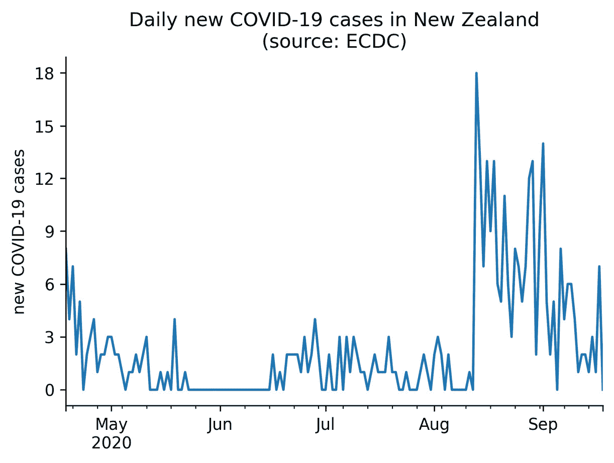

图 6.28 – 使用整数刻度位置

这些只是`matplotlib.ticker`模块提供的三个功能，因此我强烈建议你查看文档以获取更多信息。在本章末尾的*进一步阅读*部分中也有相关链接。

# 自定义可视化

到目前为止，我们学到的所有创建数据可视化的代码都是为了制作可视化本身。现在我们已经打下了坚实的基础，准备学习如何添加参考线、控制颜色和纹理，以及添加注释。

在`3-customizing_visualizations.ipynb`笔记本中，让我们处理导入库并读取 Facebook 股票价格和地震数据集：

```py
>>> %matplotlib inline
>>> import matplotlib.pyplot as plt
>>> import pandas as pd
>>> fb = pd.read_csv(
...     'data/fb_stock_prices_2018.csv', 
...     index_col='date', 
...     parse_dates=True
... )
>>> quakes = pd.read_csv('data/earthquakes.csv')
```

提示

更改绘图样式是改变其外观和感觉的一种简单方法，无需单独设置每个方面。要设置`seaborn`的样式，可以使用`sns.set_style()`。对于`matplotlib`，我们可以使用`plt.style.use()`来指定我们要使用的样式表。这些样式会应用于该会话中创建的所有可视化。如果我们只想为某个单一图表设置样式，可以使用`sns.set_context()`或`plt.style.context()`。可以在前述函数的文档中找到`seaborn`的可用样式，或在`matplotlib`中查看`plt.style.available`中的值。

## 添加参考线

很常见，我们希望在图表上突出显示某个特定的值，可能是一个边界或转折点。我们可能关心这条线是否被突破，或是否作为一个分界线。在金融领域，可能会在股票价格的折线图上绘制水平参考线，标记出支撑位和阻力位。

**支撑位**是一个预期下行趋势将会反转的价格水平，因为股票此时处于一个买家更倾向于购买的价格区间，推动价格向上并远离此点。相对地，**阻力位**是一个预期上行趋势将会反转的价格水平，因为该价格是一个吸引人的卖出点；因此，价格会下跌并远离此点。当然，这并不意味着这些水平永远不会被突破。由于我们有 Facebook 的股票数据，让我们在收盘价的折线图上添加支撑位和阻力位参考线。

重要提示

计算支撑位和阻力位的方法超出了本章的范围，但在*第七章*，*财务分析——比特币与股票市场*中，将包括一些使用枢轴点计算这些的代码。此外，请务必查看*进一步阅读*部分，以获得关于支撑位和阻力位的更深入介绍。

我们的两条水平参考线将分别位于支撑位$124.46 和阻力位$138.53。这两个数字是通过使用`stock_analysis`包计算得出的，我们将在*第七章*，*财务分析——比特币与股票市场*中构建该包。我们只需要创建`StockAnalyzer`类的一个实例来计算这些指标：

```py
>>> from stock_analysis import StockAnalyzer
>>> fb_analyzer = StockAnalyzer(fb)
>>> support, resistance = (
...     getattr(fb_analyzer, stat)(level=3)
...     for stat in ['support', 'resistance']
... )
>>> support, resistance
(124.4566666666667, 138.5266666666667)
```

我们将使用 `plt.axhline()` 函数来完成这项任务，但请注意，这也适用于 `Axes` 对象。记住，我们提供给 `label` 参数的文本将会出现在图例中：

```py
>>> fb.close['2018-12']\
...     .plot(title='FB Closing Price December 2018')
>>> plt.axhline(
...     y=resistance, color='r', linestyle='--',
...     label=f'resistance (${resistance:,.2f})'
... )
>>> plt.axhline(
...     y=support, color='g', linestyle='--',
...     label=f'support (${support:,.2f})'
... )
>>> plt.ylabel('price ($)')
>>> plt.legend()
```

我们应该已经熟悉之前章节中的 f-string 格式，但请注意这里在变量名之后的额外文本（`:,.2f`）。支持位和阻力位分别以浮动点存储在 `support` 和 `resistance` 变量中。冒号（`:`）位于 `format_spec` 前面，它告诉 Python 如何格式化该变量；在这种情况下，我们将其格式化为小数（`f`），以逗号作为千位分隔符（`,`），并且小数点后保留两位精度（`.2`）。这种格式化也适用于 `format()` 方法，在这种情况下，它将类似于 `'{:,.2f}'.format(resistance)`。这种格式化使得图表中的图例更加直观：

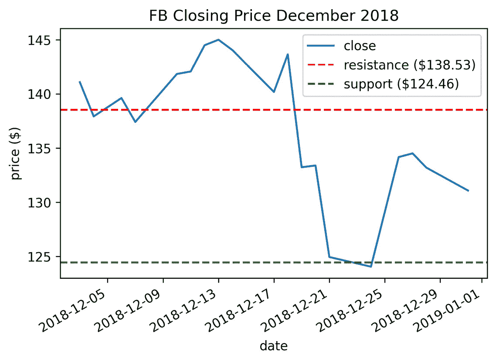

图 6.29 – 使用 matplotlib 创建水平参考线

重要提示

拥有个人投资账户的人在寻找基于股票达到某一价格点来下限价单或止损单时，可能会发现一些关于支撑位和阻力位的文献，因为这些可以帮助判断目标价格的可行性。此外，交易者也可能使用这些参考线来分析股票的动能，并决定是否是时候买入/卖出股票。

回到地震数据，我们将使用 `plt.axvline()` 绘制垂直参考线，用于表示印尼地震震级分布中的标准差个数。位于 GitHub 仓库中 `viz.py` 模块的 `std_from_mean_kde()` 函数使用 `itertools` 来轻松生成我们需要绘制的颜色和值的组合：

```py
import itertools
def std_from_mean_kde(data):
    """
    Plot the KDE along with vertical reference lines
    for each standard deviation from the mean.
    Parameters:
        - data: `pandas.Series` with numeric data
    Returns:
        Matplotlib `Axes` object.
    """
    mean_mag, std_mean = data.mean(), data.std()
    ax = data.plot(kind='kde')
    ax.axvline(mean_mag, color='b', alpha=0.2, label='mean')
    colors = ['green', 'orange', 'red']
    multipliers = [1, 2, 3]
    signs = ['-', '+']
    linestyles = [':', '-.', '--']
    for sign, (color, multiplier, style) in itertools.product(
        signs, zip(colors, multipliers, linestyles)
    ):
        adjustment = multiplier * std_mean
        if sign == '-':
            value = mean_mag – adjustment
            label = '{} {}{}{}'.format(
                r'$\mu$', r'$\pm$', multiplier, r'$\sigma$'
            )
        else:
            value = mean_mag + adjustment
            label = None # label each color only once
        ax.axvline(
            value, color=color, linestyle=style, 
            label=label, alpha=0.5
        )
    ax.legend()
    return ax
```

`itertools` 中的 `product()` 函数将为我们提供来自任意数量可迭代对象的所有组合。在这里，我们将颜色、乘数和线型打包在一起，因为我们总是希望乘数为 1 时使用绿色虚线；乘数为 2 时使用橙色点划线；乘数为 3 时使用红色虚线。当 `product()` 使用这些元组时，我们得到的是正负符号的所有组合。为了避免图例过于拥挤，我们仅使用 ± 符号为每种颜色标注一次。由于在每次迭代中字符串和元组之间有组合，我们在 `for` 语句中解包元组，以便更容易使用。

提示

我们可以使用 LaTeX 数学符号（[`www.latex-project.org/`](https://www.latex-project.org/)）为我们的图表标注，只要我们遵循一定的模式。首先，我们必须通过在字符串前加上 `r` 字符来将其标记为 `raw`。然后，我们必须用 `$` 符号将 LaTeX 包围。例如，我们在前面的代码中使用了 `r'$\mu$'` 来表示希腊字母 μ。

我们将使用`std_from_mean_kde()`函数，看看印度尼西亚地震震级的估算分布中哪些部分位于均值的一个、两个或三个标准差内：

```py
>>> from viz import std_from_mean_kde
>>> ax = std_from_mean_kde(
...     quakes.query(
...         'magType == "mb" and parsed_place == "Indonesia"'
...     ).mag
... )
>>> ax.set_title('mb magnitude distribution in Indonesia')
>>> ax.set_xlabel('mb earthquake magnitude')
```

请注意，KDE 呈右偏分布——右侧的尾部更长，均值位于众数的右侧：

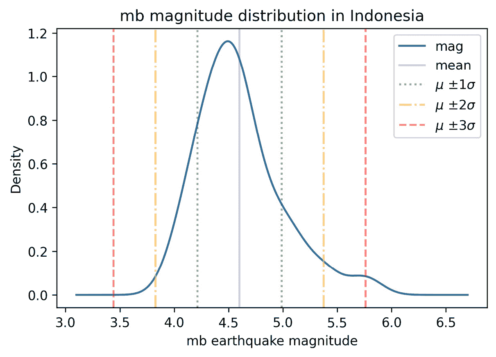

图 6.30 – 包含垂直参考线

小提示

要绘制任意斜率的直线，只需将线段的两个端点作为两个`x`值和两个`y`值（例如，`[0, 2]` 和 `[2, 0]`）传递给`plt.plot()`，使用相同的`Axes`对象。对于非直线，`np.linspace()`可以用来创建在`start, stop)`区间内均匀分布的点，这些点可以作为`x`值并计算相应的`y`值。作为提醒，指定范围时，方括号表示包含端点，圆括号表示不包含端点，因此[0, 1)表示从 0 到接近 1 但不包括 1。我们在使用`pd.cut()`和`pd.qcut()`时，如果不命名桶，就会看到这种情况。

## 填充区域

在某些情况下，参考线本身并不那么有趣，但两条参考线之间的区域更有意义；为此，我们有`axvspan()`和`axhspan()`。让我们重新审视 Facebook 股票收盘价的支撑位和阻力位。我们可以使用`axhspan()`来填充两者之间的区域：

```py
>>> ax = fb.close.plot(title='FB Closing Price')
>>> ax.axhspan(support, resistance, alpha=0.2)
>>> plt.ylabel('Price ($)')
```

请注意，阴影区域的颜色由`facecolor`参数决定。在这个例子中，我们接受了默认值：

![图 6.31 – 添加一个水平阴影区域


图 6.31 – 添加一个水平阴影区域

当我们感兴趣的是填充两条曲线之间的区域时，可以使用`plt.fill_between()`和`plt.fill_betweenx()`函数。`plt.fill_between()`函数接受一组`x`值和两组`y`值；如果需要相反的效果，可以使用`plt.fill_betweenx()`。让我们使用`plt.fill_between()`填充 Facebook 每个交易日的高价和低价之间的区域：

```py
>>> fb_q4 = fb.loc['2018-Q4']
>>> plt.fill_between(fb_q4.index, fb_q4.high, fb_q4.low)
>>> plt.xticks([
...     '2018-10-01', '2018-11-01', '2018-12-01', '2019-01-01'
... ])
>>> plt.xlabel('date')
>>> plt.ylabel('price ($)')
>>> plt.title(
...     'FB differential between high and low price Q4 2018'
... )
```

这能让我们更清楚地了解某一天价格的波动情况；垂直距离越高，波动越大：

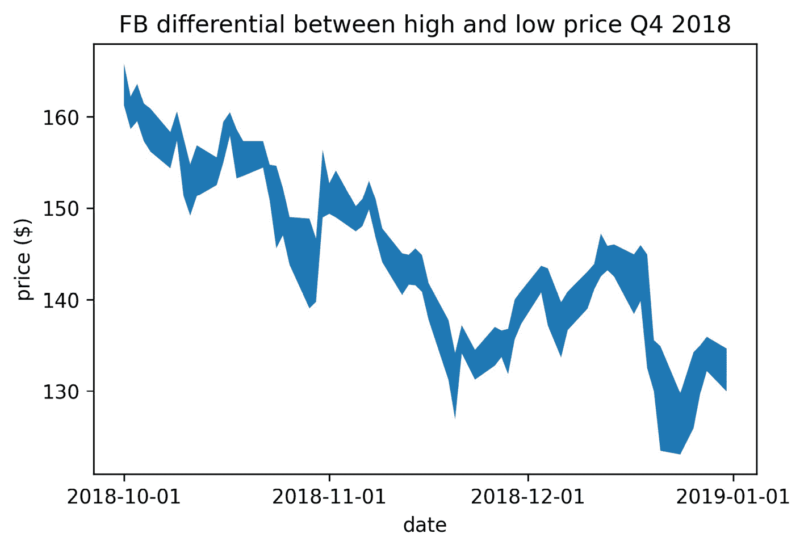

图 6.32 – 在两条曲线之间填充阴影

通过为`where`参数提供布尔掩码，我们可以指定何时填充曲线之间的区域。让我们只填充上一个例子中的 12 月。我们将在整个时间段内为高价曲线和低价曲线添加虚线，以便查看发生了什么：

```py
>>> fb_q4 = fb.loc['2018-Q4']
>>> plt.fill_between(
...     fb_q4.index, fb_q4.high, fb_q4.low, 
...     where=fb_q4.index.month == 12, 
...     color='khaki', label='December differential'
... )
>>> plt.plot(fb_q4.index, fb_q4.high, '--', label='daily high')
>>> plt.plot(fb_q4.index, fb_q4.low, '--', label='daily low') 
>>> plt.xticks([
...     '2018-10-01', '2018-11-01', '2018-12-01', '2019-01-01'
... ])
>>> plt.xlabel('date')
>>> plt.ylabel('price ($)')
>>> plt.legend()
>>> plt.title(
...     'FB differential between high and low price Q4 2018'
... )
```

这将产生以下图表：

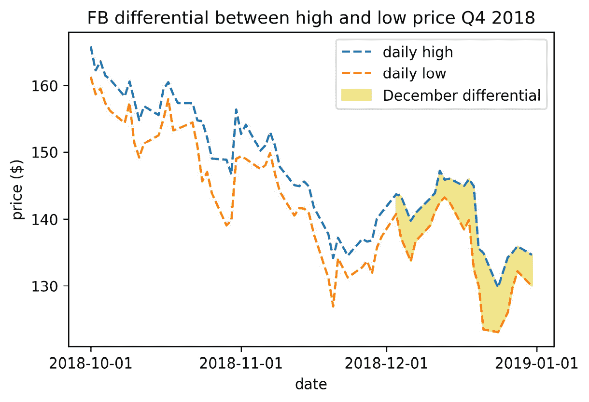

图 6.33 – 在两条曲线之间选择性地填充阴影

通过参考线和阴影区域，我们能够引起对特定区域的注意，甚至可以在图例中标注它们，但在用文字解释这些区域时，我们的选择有限。现在，让我们讨论如何为我们的图表添加更多的上下文注释。

## 注释

我们经常需要在可视化中标注特定的点，以便指出事件，例如 Facebook 股票因某些新闻事件而下跌的日期，或者标注一些重要的值以供比较。例如，让我们使用 `plt.annotate()` 函数标注支撑位和阻力位：

```py
>>> ax = fb.close.plot(
...     title='FB Closing Price 2018',
...     figsize=(15, 3)
... )
>>> ax.set_ylabel('price ($)')
>>> ax.axhspan(support, resistance, alpha=0.2)
>>> plt.annotate(
...     f'support\n(${support:,.2f})',
...     xy=('2018-12-31', support),
...     xytext=('2019-01-21', support),
...     arrowprops={'arrowstyle': '->'}
... )
>>> plt.annotate(
...     f'resistance\n(${resistance:,.2f})',
...     xy=('2018-12-23', resistance)
... ) 
>>> for spine in ['top', 'right']:
...     ax.spines[spine].set_visible(False)
```

请注意，注释有所不同；当我们注释阻力位时，只提供了注释文本和通过 `xy` 参数注释的点的坐标。然而，当我们注释支撑位时，我们还为 `xytext` 和 `arrowprops` 参数提供了值；这使得我们可以将文本放置在不同于数据出现位置的地方，并添加箭头指示数据出现的位置。通过这种方式，我们避免了将标签遮挡在最后几天的数据上：

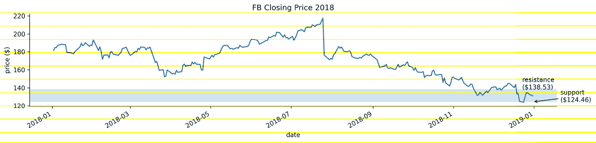

图 6.34 – 包含注释

`arrowprops` 参数为我们提供了相当多的定制选项，可以选择我们想要的箭头类型，尽管要做到完美可能有些困难。举个例子，让我们用百分比的下降幅度标注出 Facebook 在七月价格的大幅下跌：

```py
>>> close_price = fb.loc['2018-07-25', 'close']
>>> open_price = fb.loc['2018-07-26', 'open']
>>> pct_drop = (open_price - close_price) / close_price
>>> fb.close.plot(title='FB Closing Price 2018', alpha=0.5)
>>> plt.annotate(
...     f'{pct_drop:.2%}', va='center',
...     xy=('2018-07-27', (open_price + close_price) / 2),
...     xytext=('2018-08-20', (open_price + close_price) / 2),
...     arrowprops=dict(arrowstyle='-,widthB=4.0,lengthB=0.2')
... )
>>> plt.ylabel('price ($)')
```

请注意，我们能够通过在 f-string 的格式说明符中使用 `.2%` 将 `pct_drop` 变量格式化为具有两位精度的百分比。此外，通过指定 `va='center'`，我们告诉 `matplotlib` 将我们的注释垂直居中显示在箭头的中间：

)。要改变颜色，只需在 `color` 参数中传递所需的颜色。我们还可以通过 `fontsize`、`fontweight`、`fontfamily` 和 `fontstyle` 参数分别控制字体大小、粗细、家族和样式。

## 颜色

为了保持一致性，我们制作的可视化图表应该遵循一个颜色方案。公司和学术机构通常会为演示文稿制定定制的调色板。我们也可以轻松地在可视化中采用相同的调色板。

到目前为止，我们要么使用单个字符名称为 `color` 参数提供颜色，例如 `'b'` 表示蓝色，`'k'` 表示黑色，或者使用它们的名称（`'blue'` 或 `'black'`）。我们还看到 `matplotlib` 有许多可以用名称指定的颜色；完整列表可以在文档中找到，地址是 [`matplotlib.org/examples/color/named_colors.html`](https://matplotlib.org/examples/color/named_colors.html)。

重要提示

请记住，如果我们使用 `style` 参数提供颜色，我们只能使用具有单个字符缩写的颜色。

另外，我们可以提供一个十六进制的颜色码来指定我们想要的颜色；那些之前在 HTML 或 CSS 中工作过的人无疑会熟悉这种方式，它可以精确指定颜色（无论不同的地方称其为何种颜色）。对于不熟悉十六进制颜色码的人来说，它指定了用于制作所需颜色的红色、绿色和蓝色的数量，格式为 `#RRGGBB`。黑色是 `#000000`，白色是 `#FFFFFF`（大小写不敏感）。这可能会令人困惑，因为 `F` 显然不是一个数字；但这些是十六进制数（基数为 16，而不是我们传统使用的十进制数），其中 `0-9` 仍然表示 `0-9`，但 `A-F` 表示 `10-15`。

Matplotlib 将十六进制码作为字符串接受到 `color` 参数中。为了说明这一点，让我们以 `#8000FF` 绘制 Facebook 的开盘价：

```py
>>> fb.plot(
...     y='open',
...     figsize=(5, 3),
...     color='#8000FF',
...     legend=False,
...     title='Evolution of FB Opening Price in 2018'
... )
>>> plt.ylabel('price ($)')
```

这导致了一个紫色线图：

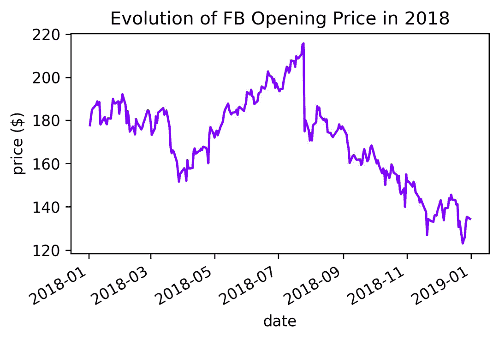

图 6.36 – 改变线条颜色

或者，我们可以将值以 RGB 或 `color` 参数的元组给出。如果我们不提供 alpha 值，默认值为不透明的 `1`。这里需要注意的一件事是，虽然这些数值以 [0, 255] 范围呈现，但 `matplotlib` 要求它们在 [0, 1] 范围内，因此我们必须将每个值除以 255。以下代码与前面的示例相同，只是我们使用 RGB 元组而不是十六进制码：

```py
fb.plot(
    y='open',
    figsize=(5, 3),
    color=(128 / 255, 0, 1),
    legend=False,
    title='Evolution of FB Opening Price in 2018'
)
plt.ylabel('price ($)')
```

在前一章中，我们看到了几个示例，我们在绘制变化数据时需要许多不同的颜色，但这些颜色从哪里来？嗯，`matplotlib` 有许多颜色映射用于此目的。

### 颜色映射

而不是必须预先指定我们要使用的所有颜色，`matplotlib` 可以使用一个颜色映射并循环遍历其中的颜色。在前一章中讨论热图时，我们考虑了根据给定任务使用适当的颜色映射类别的重要性。以下表格显示了三种类型的颜色映射，每种都有其自己的用途：

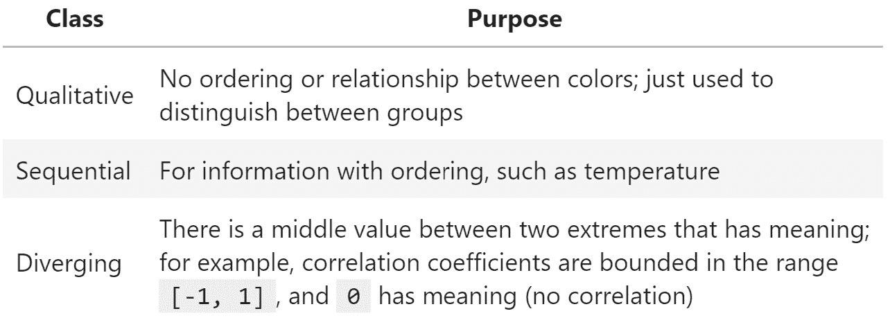

图 6.37 – 颜色映射类型

提示

浏览颜色名称、十六进制和 RGB 值，请访问 [`www.color-hex.com/`](https://www.color-hex.com/)，并在 [`matplotlib.org/gallery/color/colormap_reference.html`](https://matplotlib.org/gallery/color/colormap_reference.html) 上找到颜色映射的完整颜色光谱。

在 Python 中，我们可以通过运行以下代码获取所有可用色图的列表：

```py
>>> from matplotlib import cm
>>> cm.datad.keys()
dict_keys(['Blues', 'BrBG', 'BuGn', 'BuPu', 'CMRmap', 'GnBu', 
           'Greens', 'Greys', 'OrRd', 'Oranges', 'PRGn', 
           'PiYG', 'PuBu', 'PuBuGn', 'PuOr', 'PuRd', 'Purples', 
           'RdBu', 'RdGy', 'RdPu', 'RdYlBu', 'RdYlGn', 
           'Reds', ..., 'Blues_r', 'BrBG_r', 'BuGn_r', ...])
```

注意，有些色图出现了两次，其中一个是反向的，名称后缀带有 `_r`。这非常有用，因为我们无需将数据反转，就能将值映射到我们想要的颜色。Pandas 接受这些色图作为字符串或 `matplotlib` 色图，可以通过 `plot()` 方法的 `colormap` 参数传入 `'coolwarm_r'`、`cm.get_cmap('coolwarm_r')` 或 `cm.coolwarm_r`，得到相同的结果。

让我们使用 `coolwarm_r` 色图来展示 Facebook 股票的收盘价如何在 20 天滚动最小值和最大值之间波动：

```py
>>> ax = fb.assign(
...     rolling_min=lambda x: x.low.rolling(20).min(),
...     rolling_max=lambda x: x.high.rolling(20).max()
... ).plot(
...     y=['rolling_max', 'rolling_min'], 
...     colormap='coolwarm_r', 
...     label=['20D rolling max', '20D rolling min'],
...     style=[':', '--'],
...     figsize=(12, 3),
...     title='FB closing price in 2018 oscillating between '
...           '20-day rolling minimum and maximum price'
... )
>>> ax.plot(
...     fb.close, 'purple', alpha=0.25, label='closing price'
... )
>>> plt.legend()
>>> plt.ylabel('price ($)')
```

注意，使用反转的色图将红色表示为热性能（滚动最大值），蓝色表示为冷性能（滚动最小值）是多么简单，而不是试图确保 `pandas` 首先绘制滚动最小值：

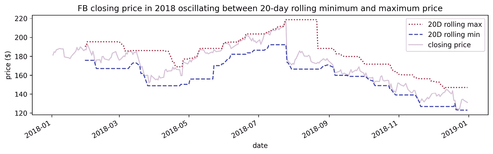

图 6.38 – 使用色图

`colormap` 对象是一个可调用的，这意味着我们可以传递[0, 1]范围内的值，它会告诉我们该点在色图上的 RGBA 值，我们可以将其用于 `color` 参数。这使得我们能更精确地控制从色图中使用的颜色。我们可以使用这种技巧来控制色图如何在我们的数据上展开。例如，我们可以请求 `ocean` 色图的中点，并将其用于 `color` 参数：

```py
>>> cm.get_cmap('ocean')(.5)
(0.0, 0.2529411764705882, 0.5019607843137255, 1.0)
```

提示

在 `covid19_cases_map.ipynb` 笔记本中有一个示例，展示了如何将色图作为可调用对象使用，在该示例中，COVID-19 的病例数被映射到颜色上，颜色越深表示病例数越多。

尽管有大量的色图可供选择，我们可能还是需要创建自己的色图。也许我们有自己喜欢使用的颜色调色板，或者有某些需求需要使用特定的色彩方案。我们可以使用 `matplotlib` 创建自己的色图。让我们创建一个混合色图，它从紫色（`#800080`）到黄色（`#FFFF00`），中间是橙色（`#FFA500`）。我们所需要的所有功能都在 `color_utils.py` 中。如果我们从与该文件相同的目录运行 Python，我们可以这样导入这些函数：

```py
>>> import color_utils
```

首先，我们需要将这些十六进制颜色转换为 RGB 等效值，这正是 `hex_to_rgb_color_list()` 函数所做的。请注意，这个函数还可以处理当 RGB 值的两个数字使用相同的十六进制数字时的简写十六进制代码（例如，`#F1D` 是 `#FF11DD` 的简写形式）：

```py
import re
def hex_to_rgb_color_list(colors):
    """
    Take color or list of hex code colors and convert them 
    to RGB colors in the range [0,1].
    Parameters:
        - colors: Color or list of color strings as hex codes
    Returns:
        The color or list of colors in RGB representation.
    """
    if isinstance(colors, str):
        colors = [colors]
    for i, color in enumerate(
        [color.replace('#', '') for color in colors]
    ):
        hex_length = len(color)
        if hex_length not in [3, 6]:
            raise ValueError(
                'Colors must be of the form #FFFFFF or #FFF'
            )
        regex = '.' * (hex_length // 3)
        colors[i] = [
            int(val * (6 // hex_length), 16) / 255
            for val in re.findall(regex, color)
        ]
    return colors[0] if len(colors) == 1 else colors
```

提示

看一下 `enumerate()` 函数；它允许我们在迭代时获取索引和值，而不必在循环中查找值。另外，注意 Python 如何通过 `int()` 函数指定基数，轻松地将十进制数转换为十六进制数。（记住 `//` 是整数除法——我们必须这样做，因为 `int()` 期望的是整数，而不是浮点数。）

我们需要的下一个函数是将这些 RGB 颜色转换为色图值的函数。此函数需要执行以下操作：

1.  创建一个具有 256 个槽位的 4D NumPy 数组用于颜色定义。请注意，我们不想改变透明度，因此我们将保持第四维（alpha）不变。

1.  对于每个维度（红色、绿色和蓝色），使用 `np.linspace()` 函数在目标颜色之间创建均匀过渡（即，从颜色 1 的红色分量过渡到颜色 2 的红色分量，再到颜色 3 的红色分量，以此类推，然后重复此过程处理绿色分量，最后是蓝色分量）。

1.  返回一个 `ListedColormap` 对象，我们可以在绘图时使用它。

这就是 `blended_cmap()` 函数的功能：

```py
from matplotlib.colors import ListedColormap
import numpy as np
def blended_cmap(rgb_color_list):
    """
    Create a colormap blending from one color to the other.
    Parameters:
        - rgb_color_list: List of colors represented as 
          [R, G, B] values in the range [0, 1], like 
          [[0, 0, 0], [1, 1, 1]], for black and white.
    Returns: 
        A matplotlib `ListedColormap` object
    """
    if not isinstance(rgb_color_list, list):
        raise ValueError('Colors must be passed as a list.')
    elif len(rgb_color_list) < 2:
        raise ValueError('Must specify at least 2 colors.')
    elif (
        not isinstance(rgb_color_list[0], list)
        or not isinstance(rgb_color_list[1], list)
    ) or (
        (len(rgb_color_list[0]) != 3 
        or len(rgb_color_list[1]) != 3)
    ):
        raise ValueError(
            'Each color should be a list of size 3.'
        )
    N, entries = 256, 4 # red, green, blue, alpha
    rgbas = np.ones((N, entries))
    segment_count = len(rgb_color_list) – 1
    segment_size = N // segment_count
    remainder = N % segment_count # need to add this back later
    for i in range(entries - 1): # we don't alter alphas
        updates = []
        for seg in range(1, segment_count + 1):
            # handle uneven splits due to remainder
            offset = 0 if not remainder or seg > 1 \
                     else remainder
            updates.append(np.linspace(
                start=rgb_color_list[seg - 1][i], 
                stop=rgb_color_list[seg][i], 
                num=segment_size + offset
            ))
        rgbas[:,i] = np.concatenate(updates)
    return ListedColormap(rgbas)
```

我们可以使用 `draw_cmap()` 函数绘制色条，帮助我们可视化我们的色图：

```py
import matplotlib.pyplot as plt
def draw_cmap(cmap, values=np.array([[0, 1]]), **kwargs):
    """
    Draw a colorbar for visualizing a colormap.
    Parameters:
        - cmap: A matplotlib colormap
        - values: Values to use for the colormap
        - kwargs: Keyword arguments to pass to `plt.colorbar()`
    Returns:
        A matplotlib `Colorbar` object, which you can save 
        with: `plt.savefig(<file_name>, bbox_inches='tight')`
    """
    img = plt.imshow(values, cmap=cmap)
    cbar = plt.colorbar(**kwargs)
    img.axes.remove()
    return cbar
```

这个函数使我们可以轻松地为任何可视化添加一个带有自定义色图的色条；`covid19_cases_map.ipynb` 笔记本中有一个示例，展示了如何使用 COVID-19 病例在世界地图上绘制。现在，让我们使用这些函数来创建并可视化我们的色图。我们将通过导入模块来使用它们（我们之前已经做过了）：

```py
>>> my_colors = ['#800080', '#FFA500', '#FFFF00']
>>> rgbs = color_utils.hex_to_rgb_color_list(my_colors)
>>> my_cmap = color_utils.blended_cmap(rgbs)
>>> color_utils.draw_cmap(my_cmap, orientation='horizontal')
```

这将导致显示我们的色图的色条：

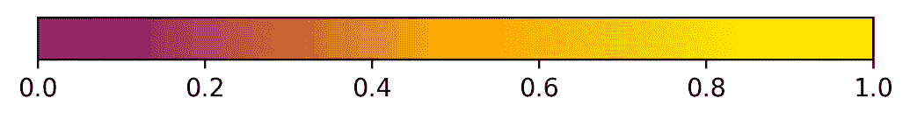

图 6.39 – 自定义混合色图

提示

Seaborn 还提供了额外的颜色调色板，以及一些实用工具，帮助用户选择色图并交互式地为 `matplotlib` 创建自定义色图，可以在 Jupyter Notebook 中使用。更多信息请查看 *选择颜色调色板* 教程（[`seaborn.pydata.org/tutorial/color_palettes.html`](https://seaborn.pydata.org/tutorial/color_palettes.html)），该笔记本中也包含了一个简短的示例。

正如我们在创建的色条中看到的，这些色图能够显示不同的颜色渐变，以捕捉连续值。如果我们仅希望每条线在折线图中显示为不同的颜色，我们很可能希望在不同的颜色之间进行循环。为此，我们可以使用 `itertools.cycle()` 与一个颜色列表；它们不会被混合，但我们可以无限循环，因为它是一个无限迭代器。我们在本章早些时候使用了这种技术来为回归残差图定义自己的颜色：

```py
>>> import itertools
>>> colors = itertools.cycle(['#ffffff', '#f0f0f0', '#000000'])
>>> colors
<itertools.cycle at 0x1fe4f300>
>>> next(colors)
'#ffffff'
```

更简单的情况是，我们在某个地方有一个颜色列表，但与其将其放入我们的绘图代码并在内存中存储另一个副本，不如写一个简单的 `return`，它使用 `yield`。以下代码片段展示了这种情况的一个模拟示例，类似于 `itertools` 解决方案；然而，它并不是无限的。这只是说明了我们可以在 Python 中找到多种方式来做同一件事；我们必须找到最适合我们需求的实现：

```py
from my_plotting_module import master_color_list
def color_generator():
    yield from master_color_list
```

使用`matplotlib`时，另一种选择是实例化一个`ListedColormap`对象，并传入颜色列表，同时为`N`定义一个较大的值，以确保颜色足够多次重复（如果不提供，它将只经过一次颜色列表）：

```py
>>> from matplotlib.colors import ListedColormap
>>> red_black = ListedColormap(['red', 'black'], N=2000)
>>> [red_black(i) for i in range(3)]
[(1.0, 0.0, 0.0, 1.0), 
 (0.0, 0.0, 0.0, 1.0), 
 (1.0, 0.0, 0.0, 1.0)]
```

注意，我们还可以使用`matplotlib`团队的`cycler`，它通过允许我们定义颜色、线条样式、标记、线宽等的组合来增加额外的灵活性，能够循环使用这些组合。API 文档详细介绍了可用功能，您可以在[`matplotlib.org/cycler/`](https://matplotlib.org/cycler/)找到。我们将在*第七章*《金融分析——比特币与股市》中看到一个例子。

### 条件着色

颜色映射使得根据数据中的值变化颜色变得简单，但如果我们只想在特定条件满足时使用特定颜色该怎么办？在这种情况下，我们需要围绕颜色选择构建一个函数。

我们可以编写一个生成器，根据数据确定绘图颜色，并且仅在请求时计算它。假设我们想要根据年份（从 1992 年到 200018 年，没错，这不是打字错误）是否为闰年来分配颜色，并区分哪些年份不是闰年（例如，我们希望为那些能被 100 整除但不能被 400 整除的年份指定特殊颜色，因为它们不是闰年）。显然，我们不想在内存中保留如此庞大的列表，所以我们创建一个生成器按需计算颜色：

```py
def color_generator():
    for year in range(1992, 200019): # integers [1992, 200019)
        if year % 100 == 0 and year % 400 != 0: 
            # special case (divisible by 100 but not 400)
            color = '#f0f0f0'
        elif year % 4 == 0:
            # leap year (divisible by 4)
            color = '#000000'
        else:
            color = '#ffffff'
        yield color
```

重要提示

**取余运算符**（%）返回除法操作的余数。例如，4 % 2 等于 0，因为 4 可以被 2 整除。然而，由于 4 不能被 3 整除，4 % 3 不为 0，它是 1，因为我们可以将 3 放入 4 一次，剩下 1（4 - 3）。取余运算符可以用来检查一个数字是否能被另一个数字整除，通常用于判断数字是奇数还是偶数。这里，我们使用它来查看是否满足闰年的条件（这些条件依赖于能否被整除）。

由于我们将`year_colors`定义为生成器，Python 将记住我们在此函数中的位置，并在调用`next()`时恢复执行：

```py
>>> year_colors = color_generator()
>>> year_colors
<generator object color_generator at 0x7bef148dfed0>
>>> next(year_colors)
'#000000'
```

更简单的生成器可以通过**生成器表达式**来编写。例如，如果我们不再关心特殊情况，可以使用以下代码：

```py
>>> year_colors = (
...     '#ffffff'
...     if (not year % 100 and year % 400) or year % 4
...     else '#000000' for year in range(1992, 200019)
... )
>>> year_colors
<generator object <genexpr> at 0x7bef14415138>
>>> next(year_colors)
'#000000'
```

对于不来自 Python 的人来说，我们之前代码片段中的布尔条件实际上是数字（`year % 400` 的结果是一个整数），这可能会让人感到奇怪。这是利用了 Python 的*真值*/*假值*，即具有零值（例如数字`0`）或为空（如`[]`或`''`）的值被视为*假值*。因此，在第一个生成器中，我们写了 `year % 400 != 0` 来准确显示发生了什么，而 `year % 400` 的更多含义是：如果没有余数（即结果为 0），语句将被评估为 `False`，反之亦然。显然，在某些时候，我们必须在可读性和 Pythonic 之间做出选择，但了解如何编写 Pythonic 代码是很重要的，因为它通常会更高效。

提示

在 Python 中运行 `import this` 来查看**Python 之禅**，它给出了关于如何写 Pythonic 代码的一些思路。

现在我们已经了解了一些在 `matplotlib` 中使用颜色的方法，让我们考虑另一种让数据更突出的方法。根据我们要绘制的内容或可视化的使用场景（例如黑白打印），使用纹理与颜色一起或代替颜色可能会更有意义。

## 纹理

除了定制我们在可视化中使用的颜色，`matplotlib` 还使得在各种绘图函数中包含纹理成为可能。这是通过 `hatch` 参数实现的，`pandas` 会为我们传递该参数。让我们绘制一个 2018 年 Q4 Facebook 股票每周交易量的条形图，并使用纹理条形图：

```py
>>> weekly_volume_traded = fb.loc['2018-Q4']\
...     .groupby(pd.Grouper(freq='W')).volume.sum()
>>> weekly_volume_traded.index = \
...     weekly_volume_traded.index.strftime('W %W')
>>> ax = weekly_volume_traded.plot(
...     kind='bar',
...     hatch='*',
...     color='lightgray',
...     title='Volume traded per week in Q4 2018'
... )
>>> ax.set(
...     xlabel='week number', 
...     ylabel='volume traded'
... )
```

使用 `hatch='*'`，我们的条形图将填充星号。请注意，我们还为每个条形图设置了颜色，因此这里有很多灵活性：

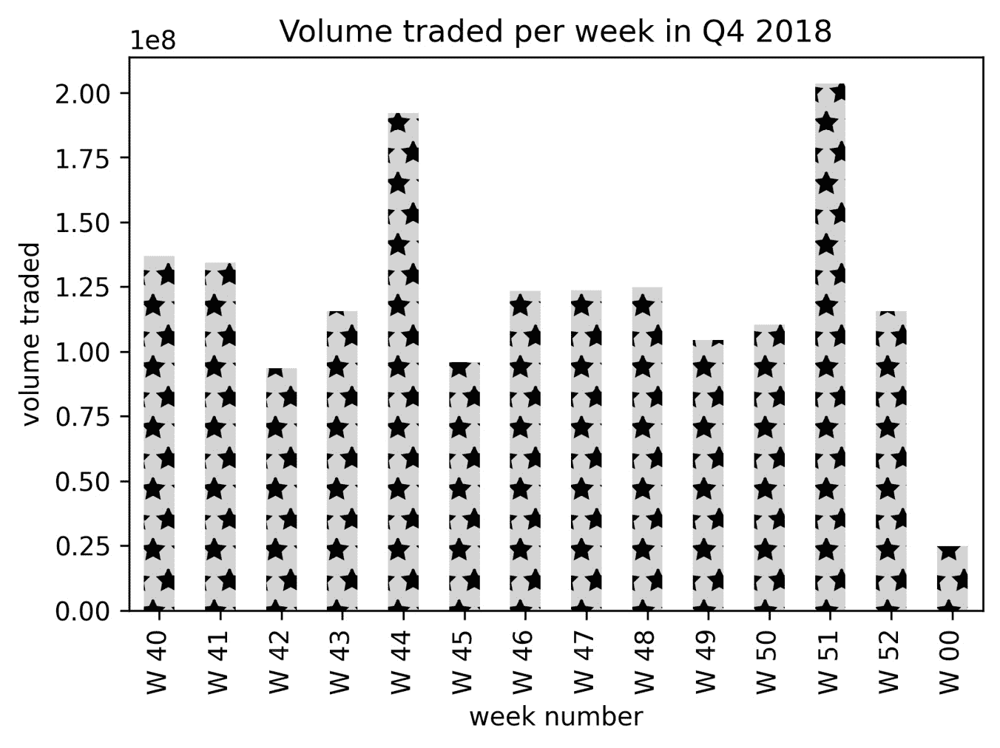

图 6.40 – 使用纹理条形图

纹理还可以组合起来形成新的图案，并通过重复来增强效果。让我们回顾一下 `plt.fill_between()` 的示例，其中我们仅为 12 月部分上色（*图 6.33*）。这次我们将使用纹理来区分每个月，而不仅仅是为 12 月添加阴影；我们将用环形纹理填充 10 月，用斜线填充 11 月，用小点填充 12 月：

```py
>>> import calendar
>>> fb_q4 = fb.loc['2018-Q4']
>>> for texture, month in zip(
...     ['oo', '/\\/\\', '...'], [10, 11, 12]
... ):
...     plt.fill_between(
...         fb_q4.index, fb_q4.high, fb_q4.low,
...         hatch=texture, facecolor='white',
...         where=fb_q4.index.month == month,
...         label=f'{calendar.month_name[month]} differential'
...     )
>>> plt.plot(fb_q4.index, fb_q4.high, '--', label='daily high')
>>> plt.plot(fb_q4.index, fb_q4.low, '--', label='daily low')
>>> plt.xticks([
...     '2018-10-01', '2018-11-01', '2018-12-01', '2019-01-01'
... ])
>>> plt.xlabel('date')
>>> plt.ylabel('price ($)')
>>> plt.title(
...     'FB differential between high and low price Q4 2018'
... )
>>> plt.legend()
```

使用 `hatch='o'` 会生成细环，因此我们使用 `'oo'` 来为 10 月生成更粗的环形纹理。对于 11 月，我们希望得到交叉图案，因此我们结合了两个正斜杠和两个反斜杠（我们实际上用了四个反斜杠，因为它们需要转义）。为了在 12 月实现小点纹理，我们使用了三个句点——添加得越多，纹理就越密集：

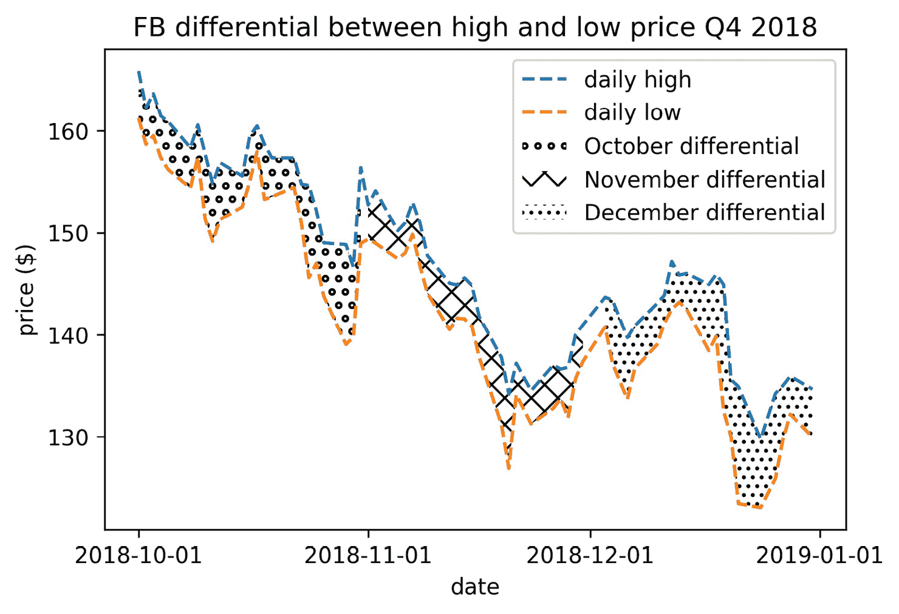

图 6.41 – 结合纹理

这就是我们对图表定制化的讨论总结。这并非完整的讨论，因此请确保探索 `matplotlib` API，了解更多内容。

# 总结

呼，真多啊！我们学习了如何使用`matplotlib`、`pandas`和`seaborn`创建令人印象深刻且自定义的可视化图表。我们讨论了如何使用`seaborn`绘制其他类型的图表，并清晰地展示一些常见图表。现在，我们可以轻松地创建自己的颜色映射、标注图表、添加参考线和阴影区域、调整坐标轴/图例/标题，并控制可视化外观的大部分方面。我们还体验了使用`itertools`并创建我们自己的生成器。

花些时间练习我们讨论的内容，完成章节末的练习。在下一章中，我们将把所学的知识应用到金融领域，创建自己的 Python 包，并将比特币与股票市场进行比较。

# 练习

使用我们迄今为止在本书中学到的知识和本章的数据，创建以下可视化图表。确保为图表添加标题、轴标签和图例（适当时）。

1.  使用`seaborn`创建热图，显示地震震级与是否发生海啸之间的相关系数，地震测量使用`mb`震级类型。

1.  创建一个 Facebook 交易量和收盘价格的箱线图，并绘制 Tukey 围栏范围的参考线，乘数为 1.5。边界将位于*Q*1 *− 1.5 × IQR*和*Q*3 *+ 1.5 × IQR*。确保使用数据的`quantile()`方法以简化这一过程。（选择你喜欢的图表方向，但确保使用子图。）

1.  绘制全球累计 COVID-19 病例的变化趋势，并在病例超过 100 万的日期上添加一条虚线。确保*y*轴的刻度标签相应地格式化。

1.  使用`axvspan()`在收盘价的折线图中，从`'2018-07-25'`到`'2018-07-31'`标记 Facebook 价格的大幅下降区域。

1.  使用 Facebook 股价数据，在收盘价的折线图上标注以下三个事件：

    a) **2018 年 7 月 25 日收盘后宣布用户增长令人失望**

    b) **剑桥分析公司丑闻爆发** 2018 年 3 月 19 日（当时影响了市场）

    c) **FTC 启动调查** 2018 年 3 月 20 日

1.  修改`reg_resid_plots()`函数，使用`matplotlib`的颜色映射，而不是在两种颜色之间循环。记住，在这种情况下，我们应该选择定性颜色映射或创建自己的颜色映射。

# 进一步阅读

查看以下资源，了解更多关于本章所涉及主题的信息：

+   *选择颜色映射（Colormaps）*: [`matplotlib.org/tutorials/colors/colormaps.html`](https://matplotlib.org/tutorials/colors/colormaps.html)

+   *控制图形美学（seaborn）*: [`seaborn.pydata.org/tutorial/aesthetics.html`](https://seaborn.pydata.org/tutorial/aesthetics.html)

+   *使用样式表和 rcParams 自定义 Matplotlib*: [`matplotlib.org/tutorials/introductory/customizing.html`](https://matplotlib.org/tutorials/introductory/customizing.html)

+   *格式化字符串语法*： [`docs.python.org/3/library/string.html#format-string-syntax`](https://docs.python.org/3/library/string.html#format-string-syntax)

+   *生成器表达式（PEP 289）*： [`www.python.org/dev/peps/pep-0289/`](https://www.python.org/dev/peps/pep-0289/)

+   *信息仪表板设计：用于一目了然监控的数据展示（第二版），Stephen Few 著*： [`www.amazon.com/Information-Dashboard-Design-At-Glance/dp/1938377001/`](https://www.amazon.com/Information-Dashboard-Design-At-Glance/dp/1938377001/)

+   *Matplotlib 命名颜色*： [`matplotlib.org/examples/color/named_colors.html`](https://matplotlib.org/examples/color/named_colors.html)

+   *多重赋值和元组拆包提高 Python 代码可读性*： [`treyhunner.com/2018/03/tuple-unpacking-improves-python-code-readability/`](https://treyhunner.com/2018/03/tuple-unpacking-improves-python-code-readability/)

+   *Python: range 不是一个迭代器!*： [`treyhunner.com/2018/02/python-range-is-not-an-iterator/`](https://treyhunner.com/2018/02/python-range-is-not-an-iterator/)

+   *Python zip() 函数*： [`www.journaldev.com/15891/python-zip-function`](https://www.journaldev.com/15891/python-zip-function)

+   *Seaborn API 参考*： [`seaborn.pydata.org/api.html`](https://seaborn.pydata.org/api.html)

+   *给我看数字：设计表格和图表以便一目了然，Stephen Few 著*： [`www.amazon.com/gp/product/0970601972/`](https://www.amazon.com/gp/product/0970601972/)

+   *样式表参考（Matplotlib）*： [`matplotlib.org/gallery/style_sheets/style_sheets_reference.html`](https://matplotlib.org/gallery/style_sheets/style_sheets_reference.html)

+   *支撑位与阻力位基础知识*： [`www.investopedia.com/trading/support-and-resistance-basics/`](https://www.investopedia.com/trading/support-and-resistance-basics/)

+   *迭代器协议：Python 中 "for 循环" 是如何工作的*： [`treyhunner.com/2016/12/python-iterator-protocol-how-for-loops-work/`](https://treyhunner.com/2016/12/python-iterator-protocol-how-for-loops-work/)

+   *定量信息的视觉展示，Edward R. Tufte 著*： [`www.amazon.com/Visual-Display-Quantitative-Information/dp/1930824130`](https://www.amazon.com/Visual-Display-Quantitative-Information/dp/1930824130)

+   *刻度格式化器*： [`matplotlib.org/gallery/ticks_and_spines/tick-formatters.html`](https://matplotlib.org/gallery/ticks_and_spines/tick-formatters.html)

+   *什么是 Pythonic?*： [`stackoverflow.com/questions/25011078/what-does-pythonic-mean`](https://stackoverflow.com/questions/25011078/what-does-pythonic-mean)
