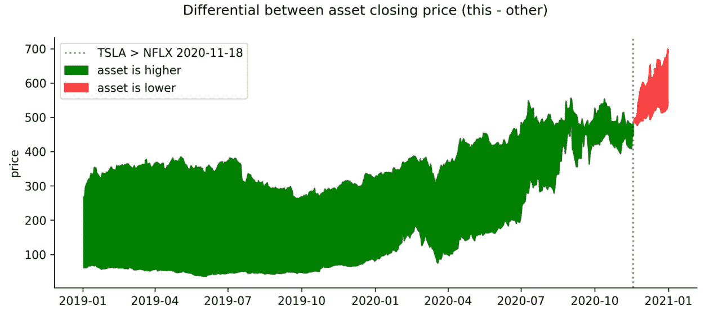
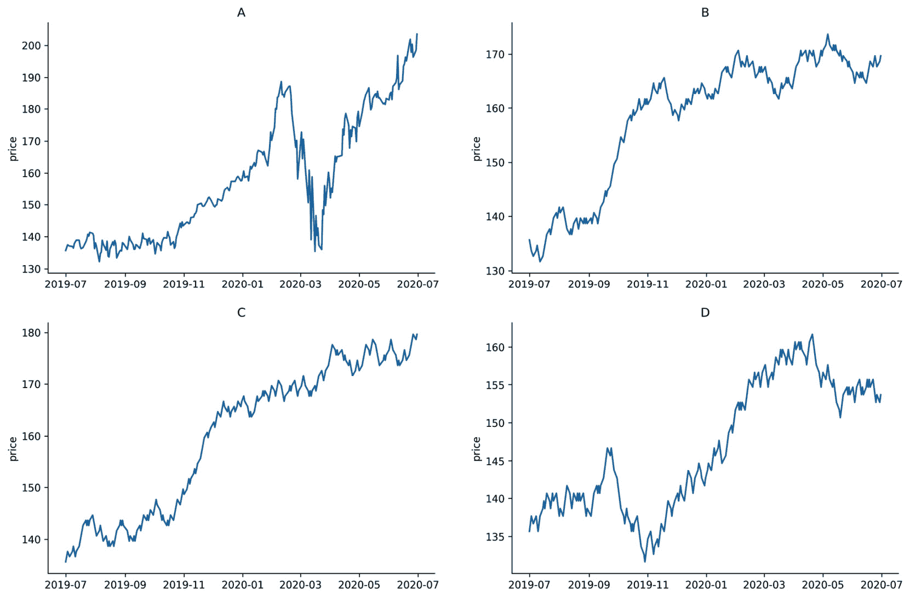

# 第八章：*第七章*：金融分析——比特币与股票市场

是时候转变思路并开始开发一个应用程序了。在本章中，我们将通过分析比特币和股票市场来探索一个金融应用。 本章将建立在我们迄今为止学到的所有知识基础上——我们将从互联网提取数据；进行一些探索性数据分析；使用`pandas`、`seaborn`和`matplotlib`创建可视化；计算分析金融工具性能的关键指标；并初步体验模型构建。请注意，我们这里并不是要学习金融分析，而是通过介绍如何将本书中学到的技能应用于金融分析。

本章也是本书中标准工作流程的一次突破。到目前为止，我们一直将 Python 作为一种功能性编程语言来使用。然而，Python 也支持面向对象编程，例如`StockReader`类（用于获取数据）、`Visualizer`类（用于可视化金融资产）、`StockAnalyzer`类（用于计算金融指标）以及`StockModeler`类（用于建模金融数据）。由于我们需要大量代码来使分析过程简洁且易于复现，我们将构建一个 Python 包来存放这些类。代码将在文中展示并逐步解释；然而，我们不需要自己键入或运行它——确保阅读本章的*本章材料*部分，正确设置环境。

本章将具有一定挑战性，可能需要多读几遍；然而，它将教会你最佳实践，并且在这里学到的技能将大大提高你的编程能力，这些技能会迅速带来回报。一个主要的收获应该是，面向对象编程（OOP）在打包分析任务方面非常有帮助。每个类应该有一个单一的目标，并且要有良好的文档。如果我们有许多类，应该将它们分布到不同的文件中，创建一个包。这样，其他人就能很容易地安装/使用它们，我们也能标准化在整个项目中执行某些任务的方式。举个例子，我们不应该让项目中的每个合作者都写自己的数据库连接函数。标准化且良好文档化的代码将节省很多后续麻烦。

本章将涵盖以下主题：

+   构建一个 Python 包

+   收集金融数据

+   进行探索性数据分析

+   对金融工具进行技术分析

+   使用历史数据建模性能

# 本章材料

本章中，我们将创建自己的股票分析包。这使得我们非常容易分发我们的代码，并且其他人也能使用我们的代码。该包的最终产品已上传至 GitHub：[`github.com/stefmolin/stock-analysis/tree/2nd_edition`](https://github.com/stefmolin/stock-analysis/tree/2nd_edition)。Python 的包管理工具 `pip` 可以从 GitHub 安装包，也可以本地构建包；因此，我们可以选择以下任意方式继续操作：

+   如果我们不打算修改源代码以供个人使用，可以从 GitHub 安装。

+   Fork 并克隆仓库，然后在本地机器上安装它，以便修改代码。

如果我们希望直接从 GitHub 安装，这里不需要做任何操作，因为在*第一章*中设置环境时已经完成了安装，*数据分析入门*；不过，作为参考，我们可以执行以下操作来从 GitHub 安装包：

```py
(book_env) $ pip3 install \
git+https://github.com/stefmolin/stock-analysis.git@2nd_edition
```

小贴士

URL 中的`@2nd_edition`部分告诉`pip`安装标记为`2nd_edition`的版本。要安装特定分支上的版本，只需将其替换为`@<branch_name>`。例如，如果我们希望安装在名为`dev`的分支上开发的代码，可以使用`@dev`。当然，务必先检查该分支是否存在。我们还可以使用提交哈希值以相同方式抓取特定的提交。有关更多信息，请访问[`pip.pypa.io/en/latest/reference/pip_install/#git`](https://pip.pypa.io/en/latest/reference/pip_install/#git)。

若要在可编辑模式下本地安装—即任何更改会自动在本地反映，而无需重新安装—我们使用`-e`标志。请在我们在*第一章*中创建的虚拟环境的命令行中运行以下命令。请注意，这将克隆该包的最新版本，可能与书中的版本不同（即带有`2nd_edition`标签的版本）：

```py
(book_env) $ git clone \
git@github.com:stefmolin/stock-analysis.git
(book_env) $ pip3 install -r stock-analysis/requirements.txt
(book_env) $ pip3 install -e stock-analysis
```

重要提示

本示例使用的是通过 SSH 克隆`git clone`；如果尚未设置 SSH 密钥，请改为通过 HTTPS 克隆，使用如下 URL：`https://github.com/stefmolin/stock-analysis.git`。或者，可以按照 GitHub 上的说明首先生成 SSH 密钥。如果你有兴趣只克隆带有`2nd_edition`标签的版本，请参考这个 Stack Overflow 贴文：[`stackoverflow.com/questions/20280726/how-to-git-clone-a-specific-tag`](https://stackoverflow.com/questions/20280726/how-to-git-clone-a-specific-tag)。

我们将在本章中使用此包。本书仓库中本章的目录包含我们实际分析时将使用的`financial_analysis.ipynb`笔记本，地址为[`github.com/stefmolin/Hands-On-Data-Analysis-with-Pandas-2nd-edition/tree/master/ch_07`](https://github.com/stefmolin/Hands-On-Data-Analysis-with-Pandas-2nd-edition/tree/master/ch_07)。`data/`文件夹包含备份文件，以防数据源自发布以来有所更改，或使用`StockReader`类收集数据时出现错误；如果发生这种情况，只需读取 CSV 文件并按照本章剩余内容进行操作。同样，`exercises/`文件夹也包含练习的备份文件。

重要说明

如果我们在使用 Jupyter Notebook 时修改了一个以可编辑模式安装的包中的文件，我们需要重新启动内核或打开一个新的 Python shell 并重新导入该包。这是因为 Python 会在导入后缓存它。其他选项包括使用`importlib.reload()`或 IPython 的`autoreload`扩展（[`ipython.readthedocs.io/en/stable/config/extensions/autoreload.html`](https://ipython.readthedocs.io/en/stable/config/extensions/autoreload.html)）。

# 构建一个 Python 包

构建包被视为良好的编码实践，因为它允许编写模块化代码并实现重用。使用`matplotlib`绘制图形时，我们不需要知道我们调用的函数内部到底在做什么——只需了解输入和输出是什么，就足以在其基础上进行构建。

## 包结构

`window_calc.py`来自*第四章*，*聚合 Pandas DataFrame*，以及`viz.py`来自*第六章*，*使用 Seaborn 绘图与自定义技巧*，这两个都是模块。**包**是由组织成目录的模块集合。包也可以被导入，但当我们导入一个包时，我们可以访问其中的某些模块，这样就不必单独导入每一个模块。这还允许我们构建可以相互导入的模块，而不必维护一个非常大的模块。

为了将模块转化为包，我们按照以下步骤进行：

1.  创建一个名为包的目录（本章使用`stock_analysis`）。

1.  将模块放置在上述目录中。

1.  添加一个`__init__.py`文件，其中包含导入包时要执行的任何 Python 代码（这个文件可以为空，也经常是空的）。

1.  在包的顶层目录（此处为`stock_analysis`）的同级别创建一个`setup.py`文件，它将向`pip`提供有关如何安装该包的指令。有关创建此文件的详细信息，请参见*进一步阅读*部分。

一旦上述步骤完成，可以使用 `pip` 安装该包。请注意，尽管我们的包仅包含一个目录，但我们可以根据需要构建包含多个子包的包。这些子包的创建与创建包时类似，唯一不同的是它们不需要 `setup.py` 文件：

1.  在主包目录（或某个其他子包内）创建一个子包目录。

1.  将子包的模块放入该目录。

1.  添加 `__init__.py` 文件，其中包含当导入子包时应执行的代码（此文件可以为空）。

一个包含单个子包的包的目录层次结构大致如下所示：

```py
repo_folder
|-- <package_name>
|   |-- __init__.py
|   |-- some_module.py
|   `-- <subpackage_name>
|       |-- __init__.py
|       |-- another_module.py
|       `-- last_module.py
`-- setup.py
```

构建包时需要注意的其他事项包括以下内容：

+   为仓库编写**README**文件，以便他人了解它包含的内容（见：[`www.makeareadme.com/`](https://www.makeareadme.com/)）。

+   `pylint` 包，网址：[`www.pylint.org/`](https://www.pylint.org/))。

+   添加测试，确保代码修改不会破坏任何功能，并且代码能够按预期工作（请查看 `pytest` 包，网址：[`docs.pytest.org/en/latest/`](https://docs.pytest.org/en/latest/)）。

## stock_analysis 包概述

在本章中，我们将使用迄今为止讨论的各种 Python 包以及 Python 标准库，创建一个名为 `stock_analysis` 的 Python 包。该包位于 `stock-analysis` 仓库中（[`github.com/stefmolin/stock-analysis`](https://github.com/stefmolin/stock-analysis)），其结构如下：


图 7.1 – stock-analysis 仓库的结构

我们包中的模块将包含用于进行资产技术分析的自定义类。**类**应为单一目的而设计，这样有助于构建、使用和调试，特别是当出现问题时。因此，我们将构建多个类，以覆盖财务分析的各个方面。我们需要为以下每个目的创建一个类：


图 7.2 – stock_analysis 包的主要主题和类

可视化包中模块之间的交互及每个类所提供的功能是很有帮助的。为此，我们可以构建**统一建模语言**（**UML**）图。

## UML 图

`utils.py` 用于工具函数：


图 7.3 – stock_analysis 包的模块依赖关系

提示

`pylint`包附带了`pyreverse`，它可以生成 UML 图。如果已安装`graphviz`（[`www.graphviz.org/download/`](http://www.graphviz.org/download/)），从命令行运行以下命令可以生成 PNG 文件，显示模块之间的关系以及类的 UML 图（前提是已克隆代码库并安装了`pylint`）：`pyreverse -o png stock_analysis`

`stock_analysis`包中类的 UML 图如下所示：


图 7.4 – `stock_analysis`包中类的 UML 图

每个框的顶部部分包含类名；中间部分包含该类的属性；底部部分包含该类中定义的任何方法。注意从`AssetGroupVisualizer`和`StockVisualizer`类指向`Visualizer`类的箭头吗？这意味着这两个类都是`Visualizer`的一种类型。对于`AssetGroupVisualizer`和`StockVisualizer`类所显示的方法，它们在这些类中与`Visualizer`类中的定义不同。我们将在*探索性数据分析*部分更深入地探讨这一点。在本章的其余部分，我们将更详细地讨论`stock_analysis`包中的每个类，并利用它们的功能对金融资产进行技术分析。

# 收集金融数据

在*第二章*《使用 Pandas DataFrame》中，以及*第三章*《使用 Pandas 进行数据清洗》中，我们使用 API 收集数据；然而，还有其他方式可以从互联网上收集数据。我们可以使用`pandas`提供的`pd.read_html()`函数，它会为页面上找到的每个 HTML 表格返回一个 DataFrame。对于经济和金融数据，另一种选择是`pandas_datareader`包，它被`stock_analysis`包中的`StockReader`类用于收集金融数据。

重要说明

如果本章使用的数据源发生了变化，或者在使用`StockReader`类收集数据时遇到错误，可以读取`data/`文件夹中的 CSV 文件作为替代，以便继续跟随文本进行操作；例如：

`pd.read_csv('data/bitcoin.csv', index_col='date',` `parse_dates=True)`

## StockReader 类

由于我们将在相同的日期范围内收集各种资产的数据，创建一个隐藏所有实现细节的类是有意义的，因此避免大量复制粘贴（以及潜在的错误）。为此，我们将建立`StockReader`类，它将使得收集比特币、股票和股票市场指数的数据变得更容易。我们可以简单地通过提供我们分析所需的日期范围创建`StockReader`类的实例，然后使用它提供的方法获取任何我们喜欢的数据。以下的 UML 图表提供了实现的高层次概述：


图 7.5 – StockReader 类的 UML 图表

UML 图表告诉我们`StockReader`类提供了一个可用股票代码（`available_tickers`）的属性，并且可以执行以下操作：

+   使用`get_bitcoin_data()`方法以所需货币拉取比特币数据。

+   使用`get_forex_rates()`方法拉取每日外汇汇率数据。

+   使用`get_index_data()`方法拉取股票市场上特定指数（如标准普尔 500 指数）的数据。

+   使用`get_index_ticker()`方法查找特定指数的股票市场符号（例如，在 Yahoo! Finance 上的标准普尔 500 指数的^GSPC）。

+   使用`get_risk_free_rate_of_return()`方法收集无风险收益率。

+   使用`get_ticker_data()`方法拉取股票市场上特定股票（比如 Netflix 的 NFLX）的数据。

现在我们理解了为什么需要这门课程，并对其结构有了高层次的概述，我们可以继续查看代码。由于在`stock_analysis/stock_reader.py`模块中有大量代码需要审查，我们将逐个部分地分解这个文件。请注意，这可能会改变缩进级别，因此请查看文件本身以获取完整版本。

模块的第一行是关于模块本身的`help()`，它将出现在顶部附近。这描述了我们模块的目的。接着是我们将需要的任何导入：

```py
"""Gather select stock data."""
import datetime as dt
import re
import pandas as pd
import pandas_datareader.data as web
from .utils import label_sanitizer
```

注意，`import`语句按照**PEP 8**（Python 风格指南，网址为 https://www.python.org/dev/peps/pep-0008/）进行了三组组织，规定它们应按以下顺序排列：

1.  标准库导入（`datetime`和`re`）

1.  第三方库（`pandas`和`pandas_datareader`）

1.  来自`stock_analysis`包中另一个模块的相对导入（`.utils`）

在我们的导入之后，我们定义了`StockReader`类。首先，我们创建一个字典，将指数的股票代码映射到描述性名称`_index_tickers`中。注意，我们的类还有一个文档字符串，定义了它的目的。在这里，我们只会列出一些可用的股票代码：

```py
class StockReader:
    """Class for reading financial data from websites."""
    _index_tickers = {'S&P 500': '^GSPC', 'Dow Jones': '^DJI',
                      'NASDAQ': '^IXIC'}
```

在构建类时，有许多**特殊方法**（俗称*dunder 方法*，因为它们的名称以双下划线开头和结尾），我们可以提供这些方法来定制类在与语言操作符一起使用时的行为：

+   初始化对象（`__init__()`）。

+   使对象可以进行排序比较（`__eq__()`、`__lt__()`、`__gt__()`等）。

+   执行对象的算术运算（`__add__()`、`__sub__()`、`__mul__()`等）。

+   能够使用内建的 Python 函数，例如`len()`（`__len__()`）。

+   获取对象的字符串表示，用于`print()`函数（`__repr__()`和`__str__()`）。

+   支持迭代和索引（`__getitem__()`、`__iter__()`和`__next__()`）。

幸运的是，我们不需要每次创建类时都编写所有这些功能。在大多数情况下，我们只需要`__init__()`方法，它会在我们创建对象时执行。（有关特殊方法的更多信息，请访问[`dbader.org/blog/python-dunder-methods`](https://dbader.org/blog/python-dunder-methods)和[`docs.python.org/3/reference/datamodel.html#special-method-names.`](https://docs.python.org/3/reference/datamodel.html#special-method-names.))

`StockReader`类的对象持有数据采集的开始和结束日期，因此我们将其放入`__init__()`方法中。我们解析调用者传入的日期，以便允许使用任何日期分隔符；例如，我们将能够处理 Python `datetime`对象的输入；形如`'YYYYMMDD'`的字符串；或使用任何与非数字正则表达式（`\D`）匹配的分隔符表示日期的字符串，例如`'YYYY|MM|DD'`或`'YYYY/MM/DD'`。如果有分隔符，我们将其替换为空字符串，以便在我们的方法中使用`'YYYYMMDD'`格式构建日期时间。此外，如果调用者给定的开始日期等于或晚于结束日期，我们将引发`ValueError`：

```py
    def __init__(self, start, end=None):
        """
        Create a `StockReader` object for reading across 
        a given date range.
        Parameters:
            - start: The first date to include, as a datetime 
              object or a string in the format 'YYYYMMDD'.
            - end: The last date to include, as a datetime
              object or string in the format 'YYYYMMDD'.
              Defaults to today if not provided.
        """
        self.start, self.end = map(
            lambda x: x.strftime('%Y%m%d')\
                if isinstance(x, dt.date)\
                else re.sub(r'\D', '', x),
            [start, end or dt.date.today()]
        )
        if self.start >= self.end:
            raise ValueError('`start` must be before `end`')
```

请注意，我们没有在`__init__()`方法中定义`_index_tickers`，该方法在对象创建时被调用，因为我们只需要为从这个类创建的所有对象保留一份该信息。`_index_tickers`类属性是私有的（按约定，前面有一个下划线），这意味着，除非该类的用户知道它的名称，否则他们不会轻易找到它（请注意，方法也可以是私有的）。这样做的目的是为了保护它（尽管不能完全保证）并且因为用户并不需要直接访问它（它是为了类的内部工作）。相反，我们将提供一个**属性**，我们可以像访问属性一样访问它，还会提供一个类方法，用于获取映射到字典中给定键的值。

提示

**类方法**是可以在类本身上使用的方法，无需事先创建类的实例。这与我们到目前为止看到的实例方法相对。**实例方法**是与类的实例一起使用的，用于特定于该实例的操作。我们通常不需要类方法，但如果我们有共享于所有实例的数据，创建类方法比实例方法更有意义。

由于`_index_tickers`是私有的，我们希望为类的用户提供查看可用项的简便方法。因此，我们将为`_index_tickers`的键创建一个属性。为此，我们使用`@property`装饰器。`@property`和`@classmethod`）装饰器，并编写我们自己的装饰器以清理并标准化跨方法收集数据的结果（`@label_sanitizer`）。要使用装饰器，我们将其放在函数或方法定义之上：

```py
    @property
    def available_tickers(self):
        """Indices whose tickers are supported."""
        return list(self._index_tickers.keys())
```

此外，我们通过类方法提供获取股票代码的方式，因为我们的股票代码存储在类变量中。按照惯例，类方法将`cls`作为第一个参数，而实例方法将`self`作为第一个参数：

```py
    @classmethod
    def get_index_ticker(cls, index):
        """
        Get the ticker of the specified index, if known.
        Parameters:
            - index: The name of the index; check 
              `available_tickers` for full list which includes:
                - 'S&P 500' for S&P 500,
                - 'Dow Jones' for Dow Jones Industrial Average,
                - 'NASDAQ' for NASDAQ Composite Index
        Returns: 
            The ticker as a string if known, otherwise `None`.
        """
        try:
            index = index.upper()
        except AttributeError:
            raise ValueError('`index` must be a string')
        return cls._index_tickers.get(index, None)
```

提示

如果我们想要禁止代码中的某些操作，我们可以检查并根据需要`raise`错误；这允许我们提供更具信息性的错误消息，或者在重新引发错误之前，简单地附加一些额外的操作（通过`raise`没有表达式）。如果我们希望在某些事情出错时运行特定代码，则使用`try...except`块：我们将可能出问题的代码放在`try`中，并将遇到问题时该做的事情放在`except`子句中。

当我们进入*金融工具的技术分析*部分时，我们将需要无风险回报率来计算一些指标。这是指没有金融损失风险的投资回报率；在实际操作中，我们使用 10 年期美国国债收益率。由于这个利率会依赖于我们分析的日期范围，因此我们将把这个功能添加到`StockReader`类中，避免自己查找。我们将使用`pandas_datareader`包从圣路易斯联邦储备银行收集数据（[`fred.stlouisfed.org/series/DGS10`](https://fred.stlouisfed.org/series/DGS10)），提供选择返回我们研究的日期范围的每日利率（用于分析数据本身），或者仅返回最后一个利率（如果我们需要单一值进行计算）：

```py
    def get_risk_free_rate_of_return(self, last=True):
        """
        Get risk-free rate of return w/ 10-year US T-bill 
        from FRED (https://fred.stlouisfed.org/series/DGS10)
        Parameter:
            - last: If `True`, return the rate on the last
              date in the date range else, return a `Series` 
              object for the rate each day in the date range.
        Returns:
            A single value or a `pandas.Series` object.
        """
        data = web.DataReader(
            'DGS10', 'fred', start=self.start, end=self.end
        )
        data.index.rename('date', inplace=True)
        data = data.squeeze()
        return data.asof(self.end) \
            if last and isinstance(data, pd.Series) else data
```

剩余的方法代码用`pass`替代，表示告诉 Python 什么都不做（并提醒我们稍后更新），以便代码可以按原样运行。我们将在下一节编写以下方法：

```py
    @label_sanitizer
    def get_ticker_data(self, ticker):
        pass    
    def get_index_data(self, index):
        pass
    def get_bitcoin_data(self, currency_code):
        pass
    @label_sanitizer 
    def get_forex_rates(self, from_currency, to_currency,
                        **kwargs):
        pass
```

重要提示

由于我们不会查看外汇汇率，本章不涉及`get_forex_rates()`方法；然而，这个方法提供了如何使用`pandas_datareader`包的另一个示例，因此我鼓励你看看它。请注意，为了使用这个方法，你需要从 AlphaVantage 获取一个免费的 API 密钥，网址是[`www.alphavantage.co/support/#api-key`](https://www.alphavantage.co/support/#api-key)。

`get_ticker_data()`和`get_forex_rates()`方法都使用了`@label_sanitizer`装饰器，这样可以将我们从不同来源收到的数据统一为相同的列名，从而避免我们后续清理数据。`@label_sanitizer`装饰器定义在`stock_analysis/utils.py`模块中。和之前一样，我们首先来看一下`utils`模块的文档字符串和导入：

```py
"""Utility functions for stock analysis."""
from functools import wraps
import re
import pandas as pd
```

接下来，我们有`_sanitize_label()`函数，它将清理单个标签。请注意，我们在函数名前加了下划线，因为我们不打算让包的用户直接使用它——它是为我们的装饰器使用的：

```py
def _sanitize_label(label):
    """
    Clean up a label by removing non-letter, non-space 
    characters and putting in all lowercase with underscores
    replacing spaces.
    Parameters:
        - label: The text you want to fix.
    Returns: 
        The sanitized label.
    """
    return re.sub(r'[^\w\s]', '', label)\
        .lower().replace(' ', '_')
```

最后，我们定义了`@label_sanitizer`装饰器，它是一个清理我们从互联网上获得的数据的列名和索引名的函数。没有这个装饰器，我们收集的数据中的列名可能会有一些意外的字符，比如星号或空格，使得数据难以使用。通过使用这个装饰器，方法将始终返回一个清理过列名的数据框，省去了我们的一步：

```py
def label_sanitizer(method):
    """
    Decorator around a method that returns a dataframe to
    clean up all labels in said dataframe (column names and 
    index name) by using `_sanitize_label()`.
    Parameters:
        - method: The method to wrap.
    Returns: 
        A decorated method or function.
    """
    @wraps(method) # keep original docstring for help()
    def method_wrapper(self, *args, **kwargs):
        df = method(self, *args, **kwargs)
        # fix the column names
        df.columns = [
            _sanitize_label(col) for col in df.columns
        ]
        # fix the index name
        df.index.rename(
            _sanitize_label(df.index.name), inplace=True
        )
        return df
    return method_wrapper
```

请注意，`label_sanitizer()`函数的定义中也有一个装饰器。来自标准库`functools`模块的`@wraps`装饰器会将装饰过的函数/方法的文档字符串与原始文档字符串相同；这是必要的，因为装饰操作实际上会创建一个新函数/方法，从而使得`help()`函数变得无效，除非我们进行干预。

小贴士

使用`@label_sanitizer`语法的方式是`method = label_sanitizer(method)`。不过，两者都是有效的。

现在我们已经理解了装饰器，准备好完成`StockReader`类的构建。请注意，我们还将为`stock_analysis`包中的其他类使用并创建附加的装饰器，因此在继续之前，请确保你对这些装饰器已经足够熟悉。

## 从 Yahoo! Finance 收集历史数据

我们的数据收集的基础将是`get_ticker_data()`方法。它使用`pandas_datareader`包从 Yahoo! Finance 获取数据：

```py
@label_sanitizer
def get_ticker_data(self, ticker):
    """
    Get historical OHLC data for given date range and ticker.
    Parameter:
        - ticker: The stock symbol to lookup as a string.
    Returns: A `pandas.DataFrame` object with the stock data.
    """
    return web.get_data_yahoo(ticker, self.start, self.end)
```

重要提示

过去，`pandas_datareader`和 Yahoo! Finance API 曾出现过一些问题，导致`pandas_datareader`开发者通过`web.DataReader()`函数（[`pandas-datareader.readthedocs.io/en/latest/whatsnew.html#v0-6-0-january-24-2018`](https://pandas-datareader.readthedocs.io/en/latest/whatsnew.html#v0-6-0-january-24-2018)）弃用了对它的支持；因此，我们必须使用他们的替代方法：`web.get_data_yahoo()`。

要收集股票市场指数的数据，我们可以使用`get_index_data()`方法，该方法首先查找指数的股票代码，然后调用我们刚刚定义的`get_ticker_data()`方法。请注意，由于`get_ticker_data()`方法使用了`@label_sanitizer`装饰器，因此`get_index_data()`方法不需要使用`@label_sanitizer`装饰器：

```py
def get_index_data(self, index):
    """
    Get historical OHLC data from Yahoo! Finance
    for the chosen index for given date range.
    Parameter:
        - index: String representing the index you want
          data for, supported indices include:
            - 'S&P 500' for S&P 500,
            - 'Dow Jones' for Dow Jones Industrial Average,
            - 'NASDAQ' for NASDAQ Composite Index
    Returns: 
        A `pandas.DataFrame` object with the index data.
    """
    if index not in self.available_tickers:
        raise ValueError(
            'Index not supported. Available tickers'
            f"are: {', '.join(self.available_tickers)}"
        )
    return self.get_ticker_data(self.get_index_ticker(index))
```

Yahoo! Finance 也提供比特币的数据；然而，我们必须选择一个货币来使用。`get_bitcoin_data()`方法接受一个货币代码来创建 Yahoo! Finance 搜索的符号（例如，BTC-USD 表示以美元计价的比特币数据）。实际的数据收集仍然由`get_ticker_data()`方法处理：

```py
def get_bitcoin_data(self, currency_code):
    """
    Get bitcoin historical OHLC data for given date range. 
    Parameter:
        - currency_code: The currency to collect the bitcoin
          data in, e.g. USD or GBP.
    Returns: 
        A `pandas.DataFrame` object with the bitcoin data.
    """
    return self\
        .get_ticker_data(f'BTC-{currency_code}')\
        .loc[self.start:self.end] # clip dates
```

此时，`StockReader`类已经可以使用，因此让我们在`financial_analysis.ipynb`笔记本中开始工作，并导入将用于本章其余部分的`stock_analysis`包：

```py
>>> import stock_analysis
```

当我们导入`stock_analysis`包时，Python 会运行`stock_analysis/__init__.py`文件：

```py
"""Classes for making technical stock analysis easier."""
from .stock_analyzer import StockAnalyzer, AssetGroupAnalyzer
from .stock_modeler import StockModeler
from .stock_reader import StockReader
from .stock_visualizer import \
    StockVisualizer, AssetGroupVisualizer
```

重要提示

`stock_analysis/__init__.py`文件中的代码使我们更容易访问包中的类——例如，我们不需要运行`stock_analysis.stock_reader.StockReader()`，只需运行`stock_analysis.StockReader()`即可创建一个`StockReader`对象。

接下来，我们将通过提供数据收集的开始日期和（可选的）结束日期，创建`StockReader`类的实例。我们将使用 2019-2020 年的数据。请注意，当我们运行此代码时，Python 会调用`StockReader.__init__()`方法：

```py
>>> reader = \
...     stock_analysis.StockReader('2019-01-01', '2020-12-31')
```

现在，我们将收集**Facebook、Apple、Amazon、Netflix 和 Google**（**FAANG**）、S&P 500 和比特币数据。由于我们使用的所有股票的价格都是以美元计价的，因此我们会请求以美元计价的比特币数据。请注意，我们使用了生成器表达式和多重赋值来获取每个 FAANG 股票的数据框：

```py
>>> fb, aapl, amzn, nflx, goog = (
...     reader.get_ticker_data(ticker)
...     for ticker in ['FB', 'AAPL', 'AMZN', 'NFLX', 'GOOG']
... )
>>> sp = reader.get_index_data('S&P 500')
>>> bitcoin = reader.get_bitcoin_data('USD') 
```

提示

确保运行`help(stock_analysis.StockReader)`或`help(reader)`，以查看所有已定义的方法和属性。输出会清楚地标明哪些方法是类方法，并将属性列在底部的`data descriptors`部分。这是熟悉新代码的重要步骤。

# 探索性数据分析

现在我们有了数据，我们想要熟悉它。正如我们在*第五章*《使用 Pandas 和 Matplotlib 进行数据可视化》和*第六章*《使用 Seaborn 绘图与自定义技巧》中看到的，创建好的可视化需要了解`matplotlib`，并且——根据数据格式和可视化的最终目标——还需要了解`seaborn`。就像我们在`StockReader`类中做的那样，我们希望让用户更容易地可视化单个资产和资产组，因此，我们不会指望我们包的用户（以及可能的合作者）精通`matplotlib`和`seaborn`，而是将围绕这些功能创建包装器。这意味着用户只需能够使用`stock_analysis`包来可视化他们的财务数据。此外，我们能够为可视化的外观设定标准，避免在进行每次新分析时复制和粘贴大量代码，从而带来一致性和效率的提升。

为了使这一切成为可能，我们在`stock_analysis/stock_visualizer.py`中有`Visualizer`类。这个文件中有三个类：

+   `Visualizer`：这是定义`Visualizer`对象功能的基类。大多数方法是**抽象的**，这意味着从这个父类继承的子类（子类）需要重写这些方法并实现代码；这些方法定义了对象应该做什么，但不涉及具体细节。

+   `StockVisualizer`：这是我们将用来可视化单个资产的子类。

+   `AssetGroupVisualizer`：这是我们将用来通过`groupby()`操作可视化多个资产的子类。

在讨论这些类的代码之前，让我们先来看一下`stock_analysis/utils.py`文件中的一些附加函数，这些函数将帮助我们创建这些资产组并为 EDA 目的描述它们。对于这些函数，我们需要导入`pandas`：

```py
import pandas as pd
```

`group_stocks()`函数接受一个字典，字典将资产的名称映射到该资产的数据框，并输出一个新的数据框，包含输入数据框的所有数据以及一列新数据，标明数据属于哪个资产：

```py
def group_stocks(mapping):
    """
    Create a new dataframe with many assets and a new column 
    indicating the asset that row's data belongs to.
    Parameters:
        - mapping: A key-value mapping of the form 
                   {asset_name: asset_df}
    Returns: 
        A new `pandas.DataFrame` object
    """
    group_df = pd.DataFrame()
    for stock, stock_data in mapping.items():
        df = stock_data.copy(deep=True)
        df['name'] = stock
        group_df = group_df.append(df, sort=True)
    group_df.index = pd.to_datetime(group_df.index)
    return group_df
```

由于在整个包中，我们将有许多方法和函数期望它们的数据框具有特定格式，因此我们将构建一个新的装饰器：`@validate_df`。这个装饰器检查传递给给定方法或函数的输入是否为`DataFrame`类型的对象，并且至少包含装饰器`columns`参数指定的列。我们将以`set`对象的形式提供这些列。这样我们就可以检查我们需要的列与输入数据中的列之间的集合差异（参见*第四章*，*聚合 Pandas 数据框*，了解集合操作）。如果数据框包含我们要求的列（至少），那么集合差异将为空，这意味着数据框通过了测试。如果违反了这些条件，装饰器将抛出`ValueError`。

让我们来看一下在`stock_analysis/utils.py`文件中是如何定义的：

```py
def validate_df(columns, instance_method=True):
    """
    Decorator that raises a `ValueError` if input isn't a
    `DataFrame` or doesn't contain the proper columns. Note 
    the `DataFrame` must be the first positional argument
    passed to this method.
    Parameters:
        - columns: A set of required column names.
          For example, {'open', 'high', 'low', 'close'}.
        - instance_method: Whether or not the item being
          decorated is an instance method. Pass `False` to 
          decorate static methods and functions.
    Returns:
        A decorated method or function.
    """
    def method_wrapper(method):
        @wraps(method)
        def validate_wrapper(self, *args, **kwargs):
            # functions and static methods don't pass self so
            # self is the 1st positional argument in that case
            df = (self, *args)[0 if not instance_method else 1]
            if not isinstance(df, pd.DataFrame):
                raise ValueError(
                    'Must pass in a pandas `DataFrame`'
                )
            if columns.difference(df.columns):
                raise ValueError(
                    'Dataframe must contain the following'
                    f' columns: {columns}'
                )
            return method(self, *args, **kwargs)
        return validate_wrapper
    return method_wrapper
```

使用`group_stocks()`函数创建的组可以通过`describe_group()`函数在一个输出中进行描述。`group_stocks()`函数添加了一个名为`name`的列，而`describe_group()`会查找这个列，因此我们使用`@validate_df`装饰器确保格式正确，然后再尝试运行该函数：

```py
@validate_df(columns={'name'}, instance_method=False)
def describe_group(data):
    """
    Run `describe()` on the asset group.
    Parameters:
        - data: Grouped data resulting from `group_stocks()`
    Returns: 
        The transpose of the grouped description statistics.
    """
    return data.groupby('name').describe().T
```

让我们使用`group_stocks()`函数为我们的分析创建一些资产组：

```py
>>> from stock_analysis.utils import \
...     group_stocks, describe_group
>>> faang = group_stocks({
...     'Facebook': fb, 'Apple': aapl, 'Amazon': amzn, 
...     'Netflix': nflx, 'Google': goog
... })
>>> faang_sp = group_stocks({
...     'Facebook': fb, 'Apple': aapl, 'Amazon': amzn, 
...     'Netflix': nflx, 'Google': goog, 'S&P 500': sp
... })
>>> all_assets = group_stocks({
...     'Bitcoin': bitcoin, 'S&P 500': sp, 'Facebook': fb, 
...     'Apple': aapl, 'Amazon': amzn, 'Netflix': nflx, 
...     'Google': goog
... })
```

使用这些组，`describe()`的输出在比较时要比分别对每个数据框运行它更有信息量。`describe_group()`函数通过`groupby()`来运行`describe()`。这使得查看不同资产的收盘价汇总更加方便：

```py
>>> describe_group(all_assets).loc['close',]
```

一眼看去，我们可以看到比特币的数据比其他资产更多。这是因为比特币的价格每天都会变化，而股票数据只包含交易日的数据。我们还可以从中得出一个结论，即比特币不仅波动性大，而且价值远高于其他资产：

![图 7.6 – 各金融工具的收盘价汇总统计]

](img/Figure_7.6_B16834.jpg)

图 7.6 – 各金融工具的收盘价汇总统计

如果我们不想单独查看每个资产，我们可以将它们组合成一个投资组合，视其为一个单一资产。`stock_analysis/utils.py`中的`make_portfolio()`函数按日期对数据进行分组并对所有列求和，从而得出我们投资组合的总股价和交易量：

```py
@validate_df(columns=set(), instance_method=False)
def make_portfolio(data, date_level='date'):
    """
    Make a portfolio of assets by grouping by date and 
    summing all columns.
    Note: the caller is responsible for making sure the 
    dates line up across assets and handling when they don't.
    """
    return data.groupby(level=date_level).sum()
```

该函数假设资产是以相同的频率进行交易的。比特币每天交易，而股市则不是。因此，如果我们的投资组合是比特币和股市的混合体，在使用此函数之前，我们需要决定如何处理这一差异；请参考我们在*第三章*中关于重新索引的讨论，*使用 Pandas 进行数据清洗*，以寻找可能的策略。我们将在本章末尾的练习中使用此函数，构建一个由 FAANG 股票组成的投资组合，这些股票的交易频率相同，以便观察盘后交易对整个 FAANG 股票的影响。

## 可视化器类族

正如我们从前几章中了解到的那样，可视化将使我们的分析变得更加轻松，因此让我们开始讨论 `stock_analysis/stock_visualizer.py` 中的 `Visualizer` 类。首先，我们将定义我们的基础类 `Visualizer`。以下的 UML 图告诉我们这是我们的基础类，因为它有箭头指向它，这些箭头来自子类（`AssetGroupVisualizer` 和 `StockVisualizer`）：


图 7.7 – 可视化器类层次结构

*图 7.7* 还告诉我们将为本节中的每个类定义哪些方法。这包括可视化盘后交易影响（`after_hours_trades()`）和资产价格随时间变化（`evolution_over_time()`）的方法，我们将用它们来进行资产的可视化比较。

我们以文档字符串和导入开始模块。对于我们的可视化，我们将需要 `matplotlib`、`numpy`、`pandas` 和 `seaborn`，以及 `mplfinance`（一个用于金融可视化的 `matplotlib` 派生包）：

```py
"""Visualize financial instruments."""
import math
import matplotlib.pyplot as plt
import mplfinance as mpf
import numpy as np
import pandas as pd
import seaborn as sns
from .utils import validate_df
```

接下来，我们开始定义 `Visualizer` 类。这个类将保存将用于可视化的数据，因此我们将其放入 `__init__()` 方法中：

```py
class Visualizer:
    """Base visualizer class not intended for direct use."""
    @validate_df(columns={'open', 'high', 'low', 'close'})
    def __init__(self, df):
        """Store the input data as an attribute."""
        self.data = df
```

该基础类将为我们提供调用 `matplotlib` 函数所需的功能；静态方法不依赖于类的数据。我们使用 `@staticmethod` 装饰器定义 `add_reference_line()` 方法，用于添加水平或垂直线（以及介于两者之间的任何内容）；注意，我们没有将 `self` 或 `cls` 作为第一个参数：

```py
    @staticmethod
    def add_reference_line(ax, x=None, y=None, **kwargs):
        """
        Static method for adding reference lines to plots.
        Parameters:
            - ax: `Axes` object to add the reference line to.
            - x, y: The x, y value to draw the line at as a 
              single value or numpy array-like structure.
                - For horizontal: pass only `y`
                - For vertical: pass only `x`
                - For AB line: pass both `x` and `y`
            - kwargs: Additional keyword args. to pass down.
        Returns:
            The matplotlib `Axes` object passed in.
        """
        try:
            # numpy array-like structures -> AB line
            if x.shape and y.shape:
                ax.plot(x, y, **kwargs)
        except:
            # error triggers if x or y isn't array-like
            try:
                if not x and not y:
                    raise ValueError(
                        'You must provide an `x` or a `y`'
                    )
                elif x and not y:
                    ax.axvline(x, **kwargs) # vertical line
                elif not x and y:
                    ax.axhline(y, **kwargs) # horizontal line
            except:
                raise ValueError(
                    'If providing only `x` or `y`, '
                    'it must be a single value'
                )
        ax.legend()
        return ax
```

提示

有关类方法、静态方法和抽象方法的更多信息，请参见*进一步阅读*部分。

`shade_region()` 静态方法用于向图表添加阴影区域，它类似于 `add_reference_line()` 静态方法：

```py
    @staticmethod
    def shade_region(ax, x=tuple(), y=tuple(), **kwargs):
        """
        Static method for shading a region on a plot.
        Parameters:
            - ax: `Axes` object to add the shaded region to.
            - x: Tuple with the `xmin` and `xmax` bounds for 
              the rectangle drawn vertically.
            - y: Tuple with the `ymin` and `ymax` bounds for 
              the rectangle drawn horizontally.
            - kwargs: Additional keyword args. to pass down.
        Returns: 
            The matplotlib `Axes` object passed in.
        """
        if not x and not y:
            raise ValueError(
                'You must provide an x or a y min/max tuple'
            )
        elif x and y:
            raise ValueError('You can only provide x or y.')
        elif x and not y:
            ax.axvspan(*x, **kwargs) # vertical region
        elif not x and y:
            ax.axhspan(*y, **kwargs) # horizontal region
        return ax
```

由于我们希望我们的绘图功能具有灵活性，我们将定义一个静态方法，使得我们可以轻松地绘制一个或多个项目，而无需事先检查项目的数量。这将在我们使用 `Visualizer` 类作为基础构建的类中得到应用：

```py
    @staticmethod
    def _iter_handler(items):
        """
        Static method for making a list out of an item if 
        it isn't a list or tuple already.
        Parameters:
            - items: The variable to make sure it is a list.
        Returns: The input as a list or tuple.
        """
        if not isinstance(items, (list, tuple)):
            items = [items]
        return items
```

我们希望支持单一资产和资产组的窗口函数；然而，这一实现会有所不同，因此我们将在超类中定义一个**抽象方法**（一个没有实现的方法），子类将重写它以提供具体实现：

```py
    def _window_calc(self, column, periods, name, func, 
                     named_arg, **kwargs):
        """
        To be implemented by subclasses. Defines how to add 
        lines resulting from window calculations.
        """
        raise NotImplementedError('To be implemented by '
                                  'subclasses.')
```

这样我们就可以定义依赖于`_window_calc()`的功能，但不需要知道具体实现，只需要知道结果。`moving_average()`方法使用`_window_calc()`将移动平均线添加到图表中：

```py
    def moving_average(self, column, periods, **kwargs):
        """
        Add line(s) for the moving average of a column.
        Parameters:
            - column: The name of the column to plot.
            - periods: The rule or list of rules for 
              resampling, like '20D' for 20-day periods.
            - kwargs: Additional arguments to pass down.
        Returns: A matplotlib `Axes` object.
        """
        return self._window_calc(
            column, periods, name='MA', named_arg='rule',
            func=pd.DataFrame.resample, **kwargs
        )
```

类似地，我们定义了`exp_smoothing()`方法，它将使用`_window_calc()`将指数平滑的移动平均线添加到图表中：

```py
    def exp_smoothing(self, column, periods, **kwargs):
        """
        Add line(s) for the exponentially smoothed moving 
        average of a column.
        Parameters:
            - column: The name of the column to plot.
            - periods: The span or list of spans for,
              smoothing like 20 for 20-day periods.
            - kwargs: Additional arguments to pass down.
        Returns: 
            A matplotlib `Axes` object.
        """
        return self._window_calc(
            column, periods, name='EWMA',
            func=pd.DataFrame.ewm, named_arg='span', **kwargs
        )
```

请注意，虽然我们有方法可以将移动平均和指数平滑移动平均添加到列的图表中，但它们都调用了`_window_calc()`，该方法在此处未定义。这是因为每个子类都会有自己的`_window_calc()`实现，而它们将继承顶层方法，无需重写`moving_average()`或`exp_smoothing()`。

重要提示

请记住，以单个下划线（`_`）开头的方法是 Python 对该类对象的`help()`版本。我们将`_window_calc()`作为私有方法创建，因为`Visualizer`类的用户只需要调用`moving_average()`和`exp_smoothing()`。

最后，我们将为所有子类添加占位符方法。这些是抽象方法，将由每个子类单独定义，因为实现会根据我们是可视化单一资产还是资产组而有所不同。为了简洁，以下是该类中定义的一部分抽象方法：

```py
    def evolution_over_time(self, column, **kwargs):
        """Creates line plots."""
        raise NotImplementedError('To be implemented by '
                                  'subclasses.')
    def after_hours_trades(self):
        """Show the effect of after-hours trading."""
        raise NotImplementedError('To be implemented by '
                                  'subclasses.')
    def pairplot(self, **kwargs):
        """Create pairplots."""
        raise NotImplementedError('To be implemented by '
                                  'subclasses.')
```

子类还将定义它们特有的方法，并/或根据需要重写`Visualizer`类的实现。它们没有重写的方法将会继承。通过使用`Visualizer`来定义所有`Visualizers`应做的事情，然后提供更具体的版本，例如仅处理单一资产的`StockVisualizer`类。

## 可视化股票

我们将通过继承`Visualizer`类来开始实现`StockVisualizer`类；我们选择不重写`__init__()`方法，因为`StockVisualizer`类只会有一个数据框作为属性。相反，我们将为需要添加（该类特有的）或重写的方法提供实现。

重要提示

为了简洁起见，我们只涵盖一部分功能；然而，我强烈建议你阅读完整的代码库并在笔记本中测试功能。

我们将重写的第一个方法是`evolution_over_time()`，它将创建一个随着时间变化的列的折线图：

```py
class StockVisualizer(Visualizer):
    """Visualizer for a single stock."""
    def evolution_over_time(self, column, **kwargs):
        """
        Visualize the evolution over time of a column.
        Parameters:
            - column: The name of the column to visualize.
            - kwargs: Additional arguments to pass down.
        Returns:
            A matplotlib `Axes` object.
        """
        return self.data.plot.line(y=column, **kwargs)
```

接下来，我们将使用 `mplfinance` 创建一个**蜡烛图**，这是一种将 OHLC 数据一起可视化的方法。每一行 OHLC 时间序列将被绘制为一根蜡烛。当蜡烛图为黑色时，资产的收盘价低于开盘价（表示亏损）；当蜡烛图为白色时，资产的收盘价高于开盘价，如下图所示：


图 7.8 – 理解蜡烛图

`candlestick()` 方法还提供了重新采样数据、显示交易量和绘制特定日期范围的选项：

```py
    def candlestick(self, date_range=None, resample=None, 
                    volume=False, **kwargs):
        """
        Create a candlestick plot for the OHLC data.
        Parameters:
            - date_range: String or `slice()` of dates to 
              pass to `loc[]`, if `None` the plot will be 
              for the full range of the data.
            - resample: The offset to use for resampling 
              the data, if desired.
            - volume: Whether to show a bar plot for volume 
              traded under the candlesticks
            - kwargs: Keyword args for `mplfinance.plot()`
        """
        if not date_range:
            date_range = slice(
                self.data.index.min(), self.data.index.max()
            )
        plot_data = self.data.loc[date_range]
        if resample:
            agg_dict = {
                'open': 'first', 'close': 'last',
                'high': 'max', 'low': 'min', 'volume': 'sum'
            }
            plot_data = plot_data.resample(resample).agg({
                col: agg_dict[col] for col in plot_data.columns
                if col in agg_dict
            })
        mpf.plot(
            plot_data, type='candle', volume=volume, **kwargs
        )
```

现在，我们添加 `after_hours_trades()` 方法，帮助我们可视化盘后交易对单个资产的影响，亏损部分用红色条形图表示，盈利部分用绿色条形图表示：

```py
    def after_hours_trades(self):
        """
        Visualize the effect of after-hours trading.
        Returns: A matplotlib `Axes` object.
        """
        after_hours = self.data.open - self.data.close.shift()
        monthly_effect = after_hours.resample('1M').sum()
        fig, axes = plt.subplots(1, 2, figsize=(15, 3))
        after_hours.plot(
            ax=axes[0],
            title='After-hours trading\n'
                  '(Open Price - Prior Day\'s Close)'
        ).set_ylabel('price')
        monthly_effect.index = \
            monthly_effect.index.strftime('%Y-%b')
        monthly_effect.plot(
            ax=axes[1], kind='bar', rot=90,
            title='After-hours trading monthly effect',
            color=np.where(monthly_effect >= 0, 'g', 'r')
        ).axhline(0, color='black', linewidth=1)
        axes[1].set_ylabel('price')
        return axes
```

接下来，我们将添加一个静态方法，让我们可以填充两条曲线之间的区域。`fill_between()` 方法将使用 `plt.fill_between()` 根据哪条曲线较高来为区域上色，绿色或红色：

```py
    @staticmethod
    def fill_between(y1, y2, title, label_higher, label_lower, 
                     figsize, legend_x):
        """
        Visualize the difference between assets.
        Parameters:
            - y1, y2: Data to plot, filling y2 - y1.
            - title: The title for the plot.
            - label_higher: Label for when y2 > y1.
            - label_lower: Label for when y2 <= y1.
            - figsize: (width, height) for the plot dimensions.
            - legend_x: Where to place legend below the plot.
        Returns: A matplotlib `Axes` object.
        """
        is_higher = y2 - y1 > 0
        fig = plt.figure(figsize=figsize)
        for exclude_mask, color, label in zip(
            (is_higher, np.invert(is_higher)),
            ('g', 'r'),
            (label_higher, label_lower)
        ):
            plt.fill_between(
                y2.index, y2, y1, figure=fig,
                where=exclude_mask, color=color, label=label
            )
        plt.suptitle(title)
        plt.legend(
            bbox_to_anchor=(legend_x, -0.1),
            framealpha=0, ncol=2
        )
        for spine in ['top', 'right']:
            fig.axes[0].spines[spine].set_visible(False)
        return fig.axes[0]
```

`open_to_close()` 方法将帮助我们通过 `fill_between()` 静态方法可视化每日开盘价与收盘价之间的差异。如果收盘价高于开盘价，我们会将区域涂成绿色；如果相反，则涂成红色：

```py
    def open_to_close(self, figsize=(10, 4)):
        """
        Visualize the daily change in price from open to close.
        Parameters:
            - figsize: (width, height) of plot
        Returns:
            A matplotlib `Axes` object.
        """
        ax = self.fill_between(
            self.data.open, self.data.close, 
            figsize=figsize, legend_x=0.67,
            title='Daily price change (open to close)',
            label_higher='price rose', label_lower='price fell'
        )
        ax.set_ylabel('price')
        return ax
```

除了可视化单个资产的开盘价与收盘价之间的差异外，我们还希望比较不同资产之间的价格。`fill_between_other()` 方法将帮助我们可视化我们为某个资产创建的可视化工具与另一个资产之间的差异，再次使用 `fill_between()`。当可视化工具中的资产价格高于另一个资产时，我们会将差异部分标为绿色，低于另一个资产时则标为红色：

```py
    def fill_between_other(self, other_df, figsize=(10, 4)):
        """
        Visualize difference in closing price between assets.
        Parameters:
            - other_df: The other asset's data.
            - figsize: (width, height) for the plot.
        Returns: 
            A matplotlib `Axes` object.
        """
        ax = self.fill_between(
            other_df.open, self.data.close, figsize=figsize, 
            legend_x=0.7, label_higher='asset is higher', 
            label_lower='asset is lower', 
            title='Differential between asset price '
                  '(this - other)'
        )
        ax.set_ylabel('price')
        return ax
```

终于到了重写 `_window_calc()` 方法的时候，它定义了如何根据单个资产的窗口计算来添加参考线。注意，我们如何能够使用 `pipe()` 方法（在 *第四章* 中介绍，*聚合 Pandas DataFrame*）使我们的窗口计算图与不同的函数兼容，以及如何使用 `_iter_handler()` 方法使我们的循环在不检查是否有多个参考线需要绘制的情况下工作：

```py
    def _window_calc(self, column, periods, name, func, 
                     named_arg, **kwargs):
        """
        Helper method for plotting a series and adding
        reference lines using a window calculation.
        Parameters:
            - column: The name of the column to plot.
            - periods: The rule/span or list of them to pass 
              to the resampling/smoothing function, like '20D'
              for 20-day periods (resampling) or 20 for a 
              20-day span (smoothing)
            - name: The name of the window calculation (to 
              show in the legend).
            - func: The window calculation function.
            - named_arg: The name of the argument `periods` 
              is being passed as.
            - kwargs: Additional arguments to pass down.
        Returns:
            A matplotlib `Axes` object.
        """
        ax = self.data.plot(y=column, **kwargs)
        for period in self._iter_handler(periods):
            self.data[column].pipe(
                func, **{named_arg: period}
            ).mean().plot(
                ax=ax, linestyle='--',
                label=f"""{period if isinstance(
                    period, str
                ) else str(period) + 'D'} {name}"""
            )
        plt.legend()
        return ax
```

到目前为止，每个可视化都涉及单一资产的数据；然而，有时我们希望能够可视化资产之间的关系，因此我们将围绕 `seaborn` 的 `jointplot()` 函数构建一个封装器：

```py
    def jointplot(self, other, column, **kwargs):
        """
        Generate a seaborn jointplot for given column in 
        this asset compared to another asset.
        Parameters:
            - other: The other asset's dataframe.
            - column: Column to use for the comparison.
            - kwargs: Keyword arguments to pass down.
        Returns: A seaborn jointplot
        """
        return sns.jointplot(
            x=self.data[column], y=other[column], **kwargs
        )
```

观察资产之间关系的另一种方式是相关矩阵。`DataFrame` 对象有一个 `corrwith()` 方法，可以计算每列与另一个数据框中相同列（按名称）的相关系数。这并不能填充热图所需的矩阵，正如我们在前几章所看到的；它实际上是对角线。`correlation_heatmap()` 方法创建一个矩阵供 `sns.heatmap()` 函数使用，并用相关系数填充对角线；然后，它通过遮罩确保仅显示对角线。此外，在计算相关性时，我们将使用每列的每日百分比变化，以处理规模差异（例如，苹果股票价格与亚马逊股票价格之间的差异）：

```py
    def correlation_heatmap(self, other):
        """
        Plot the correlations between this asset and another
        one with a heatmap.
        Parameters:
            - other: The other dataframe.
        Returns: A seaborn heatmap
        """
        corrs = \
            self.data.pct_change().corrwith(other.pct_change())
        corrs = corrs[~pd.isnull(corrs)]
        size = len(corrs)
        matrix = np.zeros((size, size), float)
        for i, corr in zip(range(size), corrs):
            matrix[i][i] = corr
        # create mask to only show diagonal
        mask = np.ones_like(matrix)
        np.fill_diagonal(mask, 0)
        return sns.heatmap(
            matrix, annot=True, center=0, vmin=-1, vmax=1,
            mask=mask, xticklabels=self.data.columns, 
            yticklabels=self.data.columns
        )
```

现在我们已经了解了 `StockVisualizer` 类的一些功能，我们可以开始进行探索性分析。让我们创建一个 `StockVisualizer` 对象，对 Netflix 股票数据进行一些 EDA：

```py
>>> %matplotlib inline
>>> import matplotlib.pyplot as plt
>>> netflix_viz = stock_analysis.StockVisualizer(nflx)
```

一旦我们用 Netflix 数据框初始化了 `StockVisualizer` 对象，我们就可以生成许多不同类型的图表。我们不会一一举例说明这个对象可以做什么（这留给你自己去实验），但让我们看看随时间变化的收盘价与一些移动平均线，以研究趋势：

```py
>>> ax = netflix_viz.moving_average('close', ['30D', '90D'])
>>> netflix_viz.shade_region(
...     ax, x=('2019-10-01', '2020-07-01'), 
...     color='blue', alpha=0.1
... )
>>> ax.set(title='Netflix Closing Price', ylabel='price ($)')
```

这些移动平均线给我们提供了股价曲线的平滑版本。请注意，在阴影区域内，90 日移动平均线像是股票价格的天花板：


](img/Figure_7.9_B16834.jpg)

图 7.9 – Netflix 股票价格与移动平均线

交易者根据手头任务的不同，尝试使用不同周期的移动平均线，例如预测股价上涨（股价上涨）并在股价下跌前做出计划性退出（股价下跌）。其他用途包括通过找到支撑线和阻力线来自动计算**支撑位**和**阻力位**（我们在 *第六章* ，*使用 Seaborn 进行绘图与自定义技巧* 中首次看到），通过找到支撑线支撑数据的部分，或找到作为数据天花板的部分。当股价接近支撑位时，价格通常会足够吸引人，促使人们买入，从而推动股价上涨（从支撑位向阻力位移动）。然而，当股价达到阻力位时，通常会促使人们卖出，导致股价下跌（从阻力位远离，向支撑位靠近）。

*图 7.10* 展示了支撑位（绿色）和阻力位（红色）如何分别作为股票价格的下限和上限；一旦价格触及这些边界之一，它通常会因为股票买卖双方的行动而反弹到相反方向：


](img/Figure_7.10_B16834.jpg)

图 7.10 – 2018 年 Netflix 股票的支撑位和阻力位示例

通常，**指数加权移动平均线**（**EWMA**）可以提供更好的趋势，因为我们可以对最近的值给予更多的权重。让我们来看看对数据进行指数平滑处理的效果：

```py
>>> ax = netflix_viz.exp_smoothing('close', [30, 90]) 
>>> netflix_viz.shade_region(
...     ax, x=('2020-04-01', '2020-10-01'),
...     color='blue', alpha=0.1
... )
>>> ax.set(title='Netflix Closing Price', ylabel='price ($)')
```

90 天的 EWMA 看起来在阴影区域内充当了支撑位：


图 7.11 – Netflix 股票价格与 EWMAs

提示

该笔记本包含了一个用于交互式可视化移动平均线和指数加权移动平均线（EWMA）的单元格。我们可以使用这些类型的可视化来确定计算的最佳窗口。请注意，使用此单元格可能需要一些额外的设置，但相关设置已在单元格上方标明。

在 *第五章*《使用 Pandas 和 Matplotlib 可视化数据》的练习中，我们编写了生成可视化图表的代码，展示了盘后交易对 Facebook 的影响；`StockVisualizer` 类也具备这个功能。我们使用 `after_hours_trades()` 方法来查看 Netflix 的盘后交易表现：

```py
>>> netflix_viz.after_hours_trades()
```

Netflix 在 2019 年第三季度的盘后交易表现不佳：


图 7.12 – 可视化盘后交易对 Netflix 股票的影响

我们可以使用蜡烛图来研究 OHLC 数据。我们将使用 `candlestick()` 方法为 Netflix 创建一个蜡烛图，并同时绘制交易量的条形图。我们还将把数据重新采样为 2 周的时间间隔，以便更清晰地展示蜡烛图：

```py
>>> netflix_viz.candlestick(
...     resample='2W', volume=True, xrotation=90, 
...     datetime_format='%Y-%b –'
... )
```

从 *图 7.8* 中记得，当蜡烛图的实体为白色时，意味着股票价值上涨。请注意，大多数情况下，交易量的尖峰伴随着股票价值的上涨：


图 7.13 – 带有交易量的蜡烛图

提示

交易者使用蜡烛图来寻找并分析资产表现中的模式，这些模式可以帮助做出交易决策。查看这篇文章，了解蜡烛图以及交易者常见的分析模式：[`www.investopedia.com/trading/candlestick-charting-what-is-it/`](https://www.investopedia.com/trading/candlestick-charting-what-is-it/)。

在继续之前，我们需要重置图表的样式。`mplfinance` 包提供了许多可用的样式选项，因此我们暂时返回到我们熟悉的样式：

```py
>>> import matplotlib as mpl
>>> mpl.rcdefaults()
>>> %matplotlib inline
```

在之前的章节中，我们已经单独看过一只股票（Facebook），所以我们接下来将从另一个角度进行比较，把 Netflix 和其他股票做对比。我们使用 `jointplot()` 方法来看 Netflix 与标普 500 的对比：

```py
>>> netflix_viz.jointplot(sp, 'close')
```

如果我们看一下图表，它们似乎有较弱的正相关关系。在金融分析中，我们可以计算一个叫做**beta**的指标，表示某个资产与一个指数（例如 S&P 500）之间的相关性。我们将在本章后面的*金融工具的技术分析*部分计算 beta：


图 7.14 – 将 Netflix 与 S&P 500 进行比较

我们可以使用`correlation_heatmap()`方法，将 Netflix 和 Amazon 之间的相关性可视化为热力图，使用每列的日百分比变化：

```py
>>> netflix_viz.correlation_heatmap(amzn)
```

Netflix 和 Amazon 之间存在弱正相关，但仅在 OHLC 数据中：


图 7.15 – Netflix 与 Amazon 的相关性热力图

最后，我们可以使用`fill_between_other()`方法查看另一项资产与 Netflix 相比在价格上的增长（或下降）。在这里，我们将 Netflix 与特斯拉进行比较，看看一个股票超过另一个股票的例子：

```py
>>> tsla = reader.get_ticker_data('TSLA')
>>> change_date = (tsla.close > nflx.close).idxmax()
>>> ax = netflix_viz.fill_between_other(tsla)
>>> netflix_viz.add_reference_line(
...     ax, x=change_date, color='k', linestyle=':', alpha=0.5,
...     label=f'TSLA > NFLX {change_date:%Y-%m-%d}'
... )
```

请注意，随着阴影区域接近参考线，其高度逐渐缩小——这表示 Netflix 股票和特斯拉股票之间的差异随着时间的推移而减小。在 2020 年 11 月 11 日，当特斯拉超过 Netflix 时，阴影区域的颜色发生变化（从绿色变为红色），并开始增高，因为特斯拉拉大了差距：



图 7.16 – Netflix 与特斯拉的股票价格差异

到目前为止，我们讨论了如何可视化单一资产——在这种情况下是 Netflix——接下来我们将继续，看看如何使用`AssetGroupVisualizer`类在资产组之间进行一些 EDA 分析。

## 可视化多个资产

就像之前那样，我们将从`Visualizer`类继承并编写我们的文档字符串。请注意，`AssetGroupVisualizer`类还会跟踪用于`groupby()`操作的列，因此我们会重写`__init__()`方法；由于这个更改是对已有代码的补充，因此我们也会调用父类的`__init__()`方法：

```py
class AssetGroupVisualizer(Visualizer):
    """Visualizes groups of assets in a single dataframe."""
    # override for group visuals
    def __init__(self, df, group_by='name'):
        """This object keeps track of the group by column."""
        super().__init__(df)
        self.group_by = group_by
```

接下来，我们定义`evolution_over_time()`方法，以便在单个图中绘制资产组中所有资产的相同列，进行对比分析。由于我们的数据形状不同，这次我们将使用`seaborn`：

```py
    def evolution_over_time(self, column, **kwargs):
        """
        Visualize the evolution over time for all assets.
        Parameters:
            - column: The name of the column to visualize.
            - kwargs: Additional arguments to pass down.
        Returns: A matplotlib `Axes` object.
        """
        if 'ax' not in kwargs:
            fig, ax = plt.subplots(1, 1, figsize=(10, 4))
        else:
            ax = kwargs.pop('ax')
        return sns.lineplot(
            x=self.data.index, y=column, hue=self.group_by,
            data=self.data, ax=ax, **kwargs
        )
```

当使用`seaborn`或仅绘制单个资产时，我们不需要担心子图的布局；然而，对于一些其他资产组的可视化，我们需要一种方法来自动确定合理的子图布局。为此，我们将添加`_get_layout()`方法，该方法将为给定数量的子图生成所需的`Figure`和`Axes`对象（由资产组中唯一资产的数量决定）：

```py
    def _get_layout(self):
        """
        Helper method for getting an autolayout of subplots.
        Returns: `Figure` and `Axes` objects to plot with.
        """
        subplots_needed = self.data[self.group_by].nunique()
        rows = math.ceil(subplots_needed / 2)
        fig, axes = \
            plt.subplots(rows, 2, figsize=(15, 5 * rows))
        if rows > 1:
            axes = axes.flatten()
        if subplots_needed < len(axes):
            # remove excess axes from autolayout
            for i in range(subplots_needed, len(axes)):
                # can't use comprehension here
                fig.delaxes(axes[i])
        return fig, axes
```

现在，我们需要定义 `_window_calc()` 如何与资产组一起工作。我们需要使用 `_get_layout()` 方法为组中的每个资产构建子图：

```py
    def _window_calc(self, column, periods, name, func,  
                     named_arg, **kwargs):
        """
        Helper method for plotting a series and adding
        reference lines using a window calculation.
        Parameters:
            - column: The name of the column to plot.
            - periods: The rule/span or list of them to pass 
              to the resampling/smoothing function, like '20D' 
              for 20-day periods (resampling) or 20 for a 
              20-day span (smoothing)
            - name: The name of the window calculation (to 
              show in the legend).
            - func: The window calculation function.
            - named_arg: The name of the argument `periods` 
              is being passed as.
            - kwargs: Additional arguments to pass down.
        Returns: 
            A matplotlib `Axes` object.
        """
        fig, axes = self._get_layout()
        for ax, asset_name in zip(
            axes, self.data[self.group_by].unique()
        ):
            subset = self.data.query(
                f'{self.group_by} == "{asset_name}"'
            )
            ax = subset.plot(
                y=column, ax=ax, label=asset_name, **kwargs
            )
            for period in self._iter_handler(periods):
                subset[column].pipe(
                    func, **{named_arg: period}
                ).mean().plot(
                    ax=ax, linestyle='--',
                    label=f"""{period if isinstance(
                        period, str
                    ) else str(period) + 'D'} {name}"""
                )
            ax.legend()
         plt.tight_layout()
         return ax
```

我们可以重写 `after_hours_trades()` 来可视化盘后交易对资产组的影响，方法是使用子图并遍历组中的资产：

```py
    def after_hours_trades(self):
        """
        Visualize the effect of after-hours trading.
        Returns: A matplotlib `Axes` object.
        """
        num_categories = self.data[self.group_by].nunique()
        fig, axes = plt.subplots(
            num_categories, 2, figsize=(15, 3 * num_categories)
        )
        for ax, (name, data) in zip(
            axes, self.data.groupby(self.group_by)
        ):
            after_hours = data.open - data.close.shift()
            monthly_effect = after_hours.resample('1M').sum()
            after_hours.plot(
                ax=ax[0], 
                title=f'{name} Open Price - Prior Day\'s Close'
            ).set_ylabel('price')
            monthly_effect.index = \
                monthly_effect.index.strftime('%Y-%b')
            monthly_effect.plot(
                ax=ax[1], kind='bar', rot=90,
                color=np.where(monthly_effect >= 0, 'g', 'r'),
                title=f'{name} after-hours trading '
                      'monthly effect'
            ).axhline(0, color='black', linewidth=1)
            ax[1].set_ylabel('price')
        plt.tight_layout()
        return axes
```

使用 `StockVisualizer` 类，我们能够生成两只资产收盘价之间的联合图，但在这里我们可以重写 `pairplot()`，以便查看资产组中资产之间收盘价的关系：

```py
    def pairplot(self, **kwargs):
        """
        Generate a seaborn pairplot for this asset group.
        Parameters:
            - kwargs: Keyword arguments to pass down.
        Returns: A seaborn pairplot
        """
        return sns.pairplot(
            self.data.pivot_table(
                values='close', index=self.data.index, 
                columns=self.group_by
            ), diag_kind='kde', **kwargs
        )
```

最后，我们添加 `heatmap()` 方法，它生成所有资产组中收盘价之间相关性的热图：

```py
    def heatmap(self, pct_change=True, **kwargs):
        """
        Generate a heatmap for correlations between assets.
        Parameters:
            - pct_change: Whether to show the correlations 
              of the daily percent change in price.
            - kwargs: Keyword arguments to pass down.
        Returns: A seaborn heatmap
        """
        pivot = self.data.pivot_table(
            values='close', index=self.data.index, 
            columns=self.group_by
        )
        if pct_change:
            pivot = pivot.pct_change()
        return sns.heatmap(
            pivot.corr(), annot=True, center=0, 
            vmin=-1, vmax=1, **kwargs
        )
```

我们可以使用 `heatmap()` 方法查看资产之间的日变化百分比对比。这将处理资产间的规模差异（谷歌和亚马逊的股价远高于 Facebook 和苹果，这意味着几美元的涨幅对 Facebook 和苹果来说影响更大）：

```py
>>> all_assets_viz = \
...     stock_analysis.AssetGroupVisualizer(all_assets)
>>> all_assets_viz.heatmap()
```

苹果与标准普尔 500 指数、Facebook 与谷歌之间有最强的相关性，而比特币与任何资产都没有相关性：


图 7.17 – 资产价格之间的相关性

为了简洁起见，避免展示所有可视化资产组的方法（这些方法会生成大量图形），我将把这部分留给你在笔记本中查看并尝试。不过，让我们结合这些 `Visualizers` 来看看所有资产随时间的演变：

```py
>>> faang_sp_viz = \
...     stock_analysis.AssetGroupVisualizer(faang_sp)
>>> bitcoin_viz = stock_analysis.StockVisualizer(bitcoin)
>>> fig, axes = plt.subplots(1, 2, figsize=(15, 5))
>>> faang_sp_viz.evolution_over_time(
...     'close', ax=axes[0], style=faang_sp_viz.group_by
... )
>>> bitcoin_viz.evolution_over_time(
...     'close', ax=axes[1], label='Bitcoin'
... )
```

请注意，比特币在 2020 年底大幅上涨（查看 *y* 轴的刻度），而亚马逊在 2020 年也经历了显著增长：


图 7.18 – 资产价格随时间的变化

现在我们对数据有了充分的了解，我们可以开始查看一些指标了。请注意，虽然我们只查看并使用了部分代码，我鼓励你在本章的笔记本中尝试所有 `Visualizer` 类的方法；练习题也将提供额外的机会来使用它们。

# 金融工具的技术分析

在资产的技术分析中，计算一些指标（如累计回报和波动率）来比较不同资产之间的差异。与本章前两部分一样，我们将编写一个包含类的模块来帮助我们。我们将需要 `StockAnalyzer` 类来分析单一资产的技术指标，和 `AssetGroupAnalyzer` 类来分析资产组的技术指标。这些类位于 `stock_analysis/stock_analyzer.py` 文件中。

与其他模块一样，我们将从文档字符串和导入开始：

```py
"""Classes for technical analysis of assets."""
import math
from .utils import validate_df
```

## StockAnalyzer 类

对于单个资产的分析，我们将构建 `StockAnalyzer` 类来计算给定资产的指标。下图 UML 显示了它提供的所有指标：


图 7.19 – StockAnalyzer 类的结构

`StockAnalyzer` 实例将使用我们希望进行技术分析的资产数据进行初始化。这意味着我们的 `__init__()` 方法需要接受数据作为参数：

```py
class StockAnalyzer:
    """Provides metrics for technical analysis of a stock."""
    @validate_df(columns={'open', 'high', 'low', 'close'})
    def __init__(self, df):
        """Create a `StockAnalyzer` object with OHLC data"""
        self.data = df
```

我们的大部分技术分析计算将依赖于股票的收盘价，因此，为了避免在所有方法中都写 `self.data.close`，我们将创建一个属性，使我们能够通过 `self.close` 访问它。这使得我们的代码更加简洁和易于理解：

```py
    @property
    def close(self):
        """Get the close column of the data."""
        return self.data.close
```

一些计算还需要 `close` 列的百分比变化，因此我们将为其创建一个属性，方便访问：

```py
    @property
    def pct_change(self):
        """Get the percent change of the close column."""
        return self.close.pct_change()
```

由于我们将使用**枢轴点**来计算支撑和阻力水平，枢轴点是数据中最后一天的最高价、最低价和收盘价的平均值，因此我们也会为它创建一个属性：

```py
    @property
    def pivot_point(self):
        """Calculate the pivot point."""
        return (self.last_close + self.last_high
                + self.last_low) / 3
```

请注意，我们还使用了其他属性——`self.last_close`、`self.last_high` 和 `self.last_low`——这些属性通过在数据上使用 `last()` 方法定义，然后选择相应的列并使用 `iat[]` 获取对应的价格：

```py
    @property
    def last_close(self):
        """Get the value of the last close in the data."""
        return self.data.last('1D').close.iat[0]
    @property
    def last_high(self):
        """Get the value of the last high in the data."""
        return self.data.last('1D').high.iat[0]
    @property
    def last_low(self):
        """Get the value of the last low in the data."""
        return self.data.last('1D').low.iat[0]
```

现在，我们拥有了计算支撑和阻力所需的一切。我们将在三个不同的水平上计算每个值，其中第一个水平离收盘价最近，第三个水平最远。因此，第一个水平是最具限制性的水平，第三个水平则是最不具限制性的。我们将 `resistance()` 方法定义如下，允许调用者指定计算的级别：

```py
    def resistance(self, level=1):
        """Calculate the resistance at the given level."""
        if level == 1:
            res = (2 * self.pivot_point) - self.last_low
        elif level == 2:
            res = self.pivot_point \
                  + (self.last_high - self.last_low)
        elif level == 3:
            res = self.last_high \
                  + 2 * (self.pivot_point - self.last_low)
        else:
            raise ValueError('Not a valid level.')
        return res
```

`support()` 方法的定义方式类似：

```py
    def support(self, level=1):
        """Calculate the support at the given level."""
        if level == 1:
            sup = (2 * self.pivot_point) - self.last_high
        elif level == 2:
            sup = self.pivot_point \
                  - (self.last_high - self.last_low)
        elif level == 3:
            sup = self.last_low \
                  - 2 * (self.last_high - self.pivot_point)
        else:
            raise ValueError('Not a valid level.')
        return sup
```

接下来，我们将创建用于分析资产波动性的方法。首先，我们将计算收盘价百分比变化的日标准差，计算时需要指定交易期数。为了确保我们不会使用超出数据中期数的交易期数，我们将定义一个属性，其中包含可以用于此参数的最大值：

```py
    @property
    def _max_periods(self):
        """Get the number of trading periods in the data."""
        return self.data.shape[0]
```

现在我们已经得到了最大值，我们可以定义 `daily_std()` 方法，该方法计算每日百分比变化的日标准差：

```py
    def daily_std(self, periods=252):
        """
        Calculate daily standard deviation of percent change.
        Parameters:
            - periods: The number of periods to use for the
              calculation; default is 252 for the trading days 
              in a year. Note if you provide a number greater  
              than the number of trading periods in the data,
              `self._max_periods` will be used instead.
        Returns: The standard deviation
        """
        return self.pct_change\
            [min(periods, self._max_periods) * -1:].std()
```

虽然 `daily_std()` 本身很有用，但我们可以更进一步，通过将日标准差乘以一年中交易期数的平方根来计算年化波动性，我们假设一年有 252 个交易日：

```py
    def annualized_volatility(self):
        """Calculate the annualized volatility."""
        return self.daily_std() * math.sqrt(252)
```

此外，我们可以使用 `rolling()` 方法来查看滚动波动性：

```py
    def volatility(self, periods=252):
        """Calculate the rolling volatility.
        Parameters:
            - periods: The number of periods to use for the 
              calculation; default is 252 for the trading  
              days in a year. Note if you provide a number  
              greater than the number of trading periods in the
              data, `self._max_periods` will be used instead.
        Returns: A `pandas.Series` object.
        """
        periods = min(periods, self._max_periods)
        return self.close.rolling(periods).std()\
               / math.sqrt(periods)
```

我们经常需要比较不同资产，因此我们提供了 `corr_with()` 方法，使用每日百分比变化来计算它们之间的相关性：

```py
    def corr_with(self, other):
        """Calculate the correlations between dataframes.
        Parameters:
            - other: The other dataframe.
        Returns: A `pandas.Series` object
        """
        return \
            self.data.pct_change().corrwith(other.pct_change())
```

接下来，我们定义一些用于比较资产分散程度的指标。在*第一章*《数据分析入门》中，我们讨论了变异系数（`cv()`方法）和分位数离散系数（`qcd()`方法），我们可以利用这些指标来实现此目标，接下来我们将添加这两者：

```py
    def cv(self):
        """
        Calculate the coefficient of variation for the asset.
        The lower this is, the better the risk/return tradeoff.
        """
        return self.close.std() / self.close.mean()
    def qcd(self):
        """Calculate the quantile coefficient of dispersion."""
        q1, q3 = self.close.quantile([0.25, 0.75])
        return (q3 - q1) / (q3 + q1) 
```

此外，我们还希望有一种方法来量化资产相对于指数的波动性，例如标准普尔 500 指数（S&P 500），为此我们计算`beta()`方法，允许用户指定用作基准的指数：

```py
    def beta(self, index):
        """
        Calculate the beta of the asset.
        Parameters:
            - index: The data for the index to compare to.
        Returns: 
            Beta, a float.
        """
        index_change = index.close.pct_change()
        beta = self.pct_change.cov(index_change)\
               / index_change.var()
        return beta
```

接下来，我们定义一个方法来计算资产的累积回报率，作为一个系列。这被定义为一加上收盘价百分比变化的累积乘积：

```py
    def cumulative_returns(self):
        """Calculate cumulative returns for plotting."""
        return (1 + self.pct_change).cumprod()
```

接下来我们需要支持的几个指标要求计算投资组合的回报。为了简化问题，我们假设每股没有分红，因此投资组合的回报是从起始价格到结束价格的百分比变化，覆盖的数据时间段内。我们将其定义为静态方法，因为我们需要为一个指数计算该值，而不仅仅是`self.data`中存储的数据：

```py
    @staticmethod
    def portfolio_return(df):
        """
        Calculate return assuming no distribution per share.
        Parameters:
            - df: The asset's dataframe.
        Returns: The return, as a float.
        """
        start, end = df.close[0], df.close[-1]
        return (end - start) / start
```

虽然 beta 可以让我们将资产的波动性与指数进行比较，但**alpha**使我们能够将资产的回报与指数的回报进行比较。为此，我们还需要无风险回报率，即没有财务损失风险的投资的回报率；在实际操作中，我们通常使用美国国债作为参考。计算 alpha 需要计算指数和资产的投资组合回报以及 beta：

```py
    def alpha(self, index, r_f):
        """
        Calculates the asset's alpha.
        Parameters:
            - index: The index to compare to.
            - r_f: The risk-free rate of return.
        Returns: Alpha, as a float.
        """
        r_f /= 100
        r_m = self.portfolio_return(index)
        beta = self.beta(index)
        r = self.portfolio_return(self.data)
        alpha = r - r_f - beta * (r_m - r_f)
        return alpha
```

提示

```py
r_f by 100 before storing the result back in r_f. It's shorthand for r_f = r_f / 100. Python also has these operators for other arithmetic functions—for example, +=, -=, *=, and %=.
```

我们还希望添加一些方法，告诉我们资产是否处于**熊市**或**牛市**，即在过去 2 个月内，股票价格分别下跌或上涨了 20％以上：

```py
    def is_bear_market(self):
        """
        Determine if a stock is in a bear market, meaning its
        return in the last 2 months is a decline of 20% or more
        """
        return \
            self.portfolio_return(self.data.last('2M')) <= -.2
    def is_bull_market(self):
        """
        Determine if a stock is in a bull market, meaning its
        return in the last 2 months is an increase of >= 20%.
        """
        return \
            self.portfolio_return(self.data.last('2M')) >= .2
```

最后，我们将添加一个方法来计算**夏普比率**，该比率告诉我们在承担投资波动性时，相对于无风险回报率，我们所获得的超额回报：

```py
    def sharpe_ratio(self, r_f):
        """
        Calculates the asset's Sharpe ratio.
        Parameters:
            - r_f: The risk-free rate of return.
        Returns: 
            The Sharpe ratio, as a float.
        """
        return (
            self.cumulative_returns().last('1D').iat[0] - r_f
        ) / self.cumulative_returns().std()
```

花些时间消化本模块中的代码，因为我们将在之前讨论的基础上继续构建。我们不会使用所有这些指标进行技术分析，但我鼓励你在本章的笔记本中尝试这些方法。

## `AssetGroupAnalyzer`类

本节中我们将使用的所有计算都定义在`StockAnalyzer`类中；然而，为了避免对每个要比较的资产都进行计算，我们还将创建`AssetGroupAnalyzer`类（在同一个模块中），该类能够为一组资产提供这些指标。

`StockAnalyzer`和`AssetGroupAnalyzer`类将共享它们的大部分功能，这为它们的继承设计提供了强有力的论据；然而，有时——如在这种情况下——组合设计更有意义。当对象包含其他类的实例时，这就是`AssetGroupAnalyzer`类的情况：


图 7.20 – AssetGroupAnalyzer 类的结构

我们通过提供资产的数据框和分组列的名称（如果不是 `name`）来创建 `AssetGroupAnalyzer` 实例。初始化时，会调用 `_composition_handler()` 方法来创建 `StockAnalyzer` 对象的字典（每个资产一个）：

```py
class AssetGroupAnalyzer:
    """Analyzes many assets in a dataframe."""
    @validate_df(columns={'open', 'high', 'low', 'close'})
    def __init__(self, df, group_by='name'):
        """
        Create an `AssetGroupAnalyzer` object with a 
        dataframe of OHLC data and column to group by.
        """
        self.data = df 
        if group_by not in self.data.columns:
            raise ValueError(
                f'`group_by` column "{group_by}" not in df.'
) 
        self.group_by = group_by
        self.analyzers = self._composition_handler()
    def _composition_handler(self):
        """
        Create a dictionary mapping each group to its analyzer,
        taking advantage of composition instead of inheritance.
        """
        return {
            group: StockAnalyzer(data)
            for group, data in self.data.groupby(self.group_by)
        }
```

`AssetGroupAnalyzer` 类只有一个公共方法，`analyze()`—所有实际的计算都委托给存储在 `analyzers` 属性中的 `StockAnalyzer` 对象：

```py
    def analyze(self, func_name, **kwargs):
        """
        Run a `StockAnalyzer` method on all assets.
        Parameters:
            - func_name: The name of the method to run.
            - kwargs: Additional arguments to pass down.
        Returns: 
            A dictionary mapping each asset to the result 
            of the calculation of that function.
        """
        if not hasattr(StockAnalyzer, func_name):
            raise ValueError(
                f'StockAnalyzer has no "{func_name}" method.'
            )
        if not kwargs:
            kwargs = {}
        return {
            group: getattr(analyzer, func_name)(**kwargs)
            for group, analyzer in self.analyzers.items()
        }
```

使用继承时，在这种情况下，所有方法都必须被重写，因为它们无法处理 `groupby()` 操作。相反，使用组合时，只需要为每个资产创建 `StockAnalyzer` 对象，并使用字典推导式来进行计算。另一个很棒的地方是，使用 `getattr()` 时，无需在 `AssetGroupAnalyzer` 类中镜像方法，因为 `analyze()` 可以通过名称使用 `StockAnalyzer` 对象来抓取方法。

## 比较资产

让我们使用 `AssetGroupAnalyzer` 类来比较我们收集的所有资产数据。与之前的章节一样，我们不会在这里使用 `StockAnalyzer` 类中的所有方法，因此请务必自己尝试：

```py
>>> all_assets_analyzer = \
...     stock_analysis.AssetGroupAnalyzer(all_assets)
```

记住在*第一章*《数据分析导论》中提到，**变异系数**（**CV**）是标准差与均值的比率；这有助于我们比较资产收盘价的变化程度，即使它们的均值差异较大（例如，亚马逊和苹果）。CV 还可以用来比较投资的波动性与预期回报，并量化风险与回报的权衡。让我们使用 CV 来查看哪种资产的收盘价波动最大：

```py
>>> all_assets_analyzer.analyze('cv')
{'Amazon': 0.2658012522278963,
 'Apple': 0.36991905161737615,
 'Bitcoin': 0.43597652683008137,
 'Facebook': 0.19056336194852783,
 'Google': 0.15038618497328074,
 'Netflix': 0.20344854330432688,
 'S&P 500': 0.09536374658108937}
```

比特币有着最广泛的价格波动，这应该不是什么惊讶的事。与其使用收盘价，不如使用每日的百分比变化来计算年化波动率。这涉及到计算过去一年中百分比变化的标准差，并将其乘以一年中交易日数量的平方根（代码假设为 252）。通过使用百分比变化，相对于资产价格的较大价格波动会受到更严厉的惩罚。使用年化波动率时，Facebook 看起来比我们使用 CV 时波动性更大（尽管仍然不是最波动的资产）：

```py
>>> all_assets_analyzer.analyze('annualized_volatility')
{'Amazon': 0.3851099077041784,
 'Apple': 0.4670809643500882,
 'Bitcoin': 0.4635140114227397,
 'Facebook': 0.45943066572169544,
 'Google': 0.3833720603377728,
 'Netflix': 0.4626772090887299,
 'S&P 500': 0.34491195196047003}
```

鉴于所有资产在数据集末尾都获得了增值，接下来让我们检查这些资产是否进入了**牛市**，即在过去 2 个月内，资产的回报增长达到了 20% 或更高：

```py
>>> all_assets_analyzer.analyze('is_bull_market')
{'Amazon': False,
 'Apple': True,
 'Bitcoin': True,
 'Facebook': False,
 'Google': False,
 'Netflix': False,
 'S&P 500': False}
```

看起来苹果和比特币在 2020 年 11 月和 12 月表现相当突出。其他资产的表现似乎不太好；然而，它们都没有进入熊市（我们可以通过将 `'is_bear_market'` 传递给 `analyze()` 来确认这一点）。另一种分析波动性的方法是通过计算**贝塔值**来将资产与指数进行比较。大于 1 的正值表示波动性高于该指数，而小于-1 的负值则表示与该指数的反向关系：

```py
>>> all_assets_analyzer.analyze('beta', index=sp)
{'Amazon': 0.7563691182389207,
 'Apple': 1.173273501105916,
 'Bitcoin': 0.3716024282483362,
 'Facebook': 1.024592821854751,
 'Google': 0.98620762504024,
 'Netflix': 0.7408228073823271,
 'S&P 500': 1.0000000000000002}
```

使用之前结果中的贝塔值，我们可以看到与标准普尔 500 指数相比，苹果的波动性最大，这意味着如果这是我们的投资组合（暂时不考虑比特币），添加苹果股票会增加投资组合的风险。然而，我们知道比特币与标准普尔 500 指数之间没有相关性（请参见*图 7.17*中的相关性热图），所以这个低贝塔值是具有误导性的。

我们将要查看的最后一个指标是 `r_f`）；我们通常使用美国国债的回报率作为这个数字。利率可以在[`www.treasury.gov/resource-center/data-chart-center/interest-rates/pages/TextView.aspx?data=yield`](https://www.treasury.gov/resource-center/data-chart-center/interest-rates/pages/TextView.aspx?data=yield)上查找；或者，我们可以使用 `StockReader` 对象（`reader`）来为我们收集这个数据。让我们使用标准普尔 500 指数作为基准，比较这些资产的阿尔法值：

```py
>>> r_f = reader.get_risk_free_rate_of_return() # 0.93
>>> all_assets_analyzer.analyze('alpha', index=sp, r_f=r_f)
{'Amazon': 0.7383391908270172,
 'Apple': 1.7801122522388666,
 'Bitcoin': 6.355297988074054,
 'Facebook': 0.5048625273190841,
 'Google': 0.18537197824248092,
 'Netflix': 0.6500392764754642,
 'S&P 500': -1.1102230246251565e-16}
```

所有资产的表现都超过了标准普尔 500 指数，而标准普尔 500 作为一个由 500 只股票组成的投资组合，其风险较低、回报较低，这是由于`Cycler`对象的存在（[`matplotlib.org/cycler/`](https://matplotlib.org/cycler/))，该对象改变颜色和线条样式：

```py
>>> from cycler import cycler
>>> bw_viz_cycler = (
...     cycler(color=[plt.get_cmap('tab10')(x/10)
...                   for x in range(10)])
...     + cycler(linestyle=['dashed', 'solid', 'dashdot',
...                         'dotted', 'solid'] * 2))
>>> fig, axes = plt.subplots(1, 2, figsize=(15, 5))
>>> axes[0].set_prop_cycle(bw_viz_cycler)
>>> cumulative_returns = \
...     all_assets_analyzer.analyze('cumulative_returns')
>>> for name, data in cumulative_returns.items():
...     data.plot(
...         ax=axes[1] if name == 'Bitcoin' else axes[0], 
...         label=name, legend=True
...     )
>>> fig.suptitle('Cumulative Returns')
```

尽管 2020 年初面临困境，但所有资产都获得了价值。请注意，比特币子图的 *y* 轴范围是从 0 到 7（右侧子图），而股市子图（左侧）的范围则覆盖了该范围的一半：


图 7.21 – 所有资产的累计回报

现在我们已经对如何分析金融工具有了良好的理解，接下来我们来尝试预测未来的表现。

# 使用历史数据建模表现

本节的目标是让我们了解如何构建一些模型；因此，以下示例并不意味着是最佳模型，而是为了学习目的的简单且相对快速的实现。再次提醒，`stock_analysis` 包中有一个适用于本节任务的类：`StockModeler`。

重要提示

要完全理解本节的统计元素和建模一般原理，我们需要对统计学有一个扎实的理解；然而，本讨论的目的是展示如何将建模技术应用于金融数据，而不深入探讨背后的数学原理。

## StockModeler 类

`StockModeler` 类将使我们更容易构建和评估一些简单的金融模型，而无需直接与 `statsmodels` 包进行交互。此外，我们将减少生成模型所需的步骤。以下 UML 图显示这是一个相当简单的类。请注意，我们没有属性，因为 `StockModeler` 是一个**静态类**（意味着我们不实例化它）：


图 7.22 – StockModeler 类的结构

`StockModeler` 类定义在 `stock_analysis/stock_modeler.py` 中，并具有构建模型和进行一些初步性能分析的方法。像往常一样，我们以文档字符串和导入开始模块：

```py
"""Simple time series modeling for stocks."""
import matplotlib.pyplot as plt
import pandas as pd
from statsmodels.tsa.arima.model import ARIMA
from statsmodels.tsa.seasonal import seasonal_decompose
import statsmodels.api as sm
from .utils import validate_df
```

接下来，我们将开始 `StockModeler` 类，并在有人尝试实例化它时引发错误：

```py
class StockModeler:
    """Static methods for modeling stocks."""
    def __init__(self):
        raise NotImplementedError(
            "This class must be used statically: " 
            "don't instantiate it."
        )
```

我们希望这个类支持的任务之一是时间序列分解，我们在*第一章*《数据分析简介》中讨论过这个内容。我们从 `statsmodels` 导入了 `seasonal_decompose()` 函数，所以我们只需在 `decompose()` 方法中对收盘价调用它：

```py
    @staticmethod
    @validate_df(columns={'close'}, instance_method=False)
    def decompose(df, period, model='additive'):
        """
        Decompose the closing price of the stock into 
        trend, seasonal, and remainder components.
        Parameters:
            - df: The dataframe containing the stock closing
              price as `close` and with a time index.
            - period: The number of periods in the frequency.
            - model: How to compute the decomposition
              ('additive' or 'multiplicative')
        Returns:
            A `statsmodels` decomposition object.
        """
        return seasonal_decompose(
            df.close, model=model, period=period
        )
```

请注意，我们对 `decompose()` 方法有两个装饰器。最上面的装饰器应用于它下面装饰器的结果。在这个例子中，我们有以下内容：

```py
staticmethod(
    validate_df(
        decompose, columns={'close'}, instance_method=False
    )
)
```

此外，我们还希望支持创建 ARIMA 模型，我们在*第一章*《数据分析简介》中也讨论过这一点。ARIMA 模型使用 *ARIMA(p, d, q)* 符号，其中 *p* 是 AR 模型的时间滞后数（或阶数），*d* 是从数据中减去的过去值的数量（即 I 模型），*q* 是 MA 模型中使用的周期数。因此，*ARIMA(1, 1, 1)* 是一个包含一个自回归部分时间滞后、数据差分一次以及一个 1 期的移动平均的模型。如果我们有任何阶数为零的情况，可以去掉它们——例如，*ARIMA(1, 0, 1)* 等同于 *ARMA(1, 1)*，而 *ARIMA(0, 0, 3)* 等同于 *MA(3)*。季节性 ARIMA 模型写作 *ARIMA(p, d, q)(P, D, Q)*m，其中 *m* 是季节性模型中的周期数，*P*、*D* 和 *Q* 是季节性 ARIMA 模型的阶数。`StockModeler.arima()` 方法不支持季节性组件（为了简化）并且接收 *p*、*d* 和 *q* 作为参数，但为了避免混淆，我们会根据它们所代表的 ARIMA 特性给它们命名——例如，`ar` 代表自回归（*p*）。此外，我们还将使我们的静态方法在返回之前提供拟合模型的选项：

```py
    @staticmethod
    @validate_df(columns={'close'}, instance_method=False)
    def arima(df, *, ar, i, ma, fit=True, freq='B'):
        """
        Create an ARIMA object for modeling time series.
        Parameters:
            - df: The dataframe containing the stock closing
              price as `close` and with a time index.
            - ar: The autoregressive order (p).
            - i: The differenced order (q).
            - ma: The moving average order (d).
            - fit: Whether to return the fitted model
            - freq: Frequency of the time series
        Returns: 
            A `statsmodels` ARIMA object which you can use 
            to fit and predict.
        """
        arima_model = ARIMA(
            df.close.asfreq(freq).fillna(method='ffill'), 
            order=(ar, i, ma)
        )
        return arima_model.fit() if fit else arima_model
```

提示

注意方法签名（`df, *, ar, i, ma, ...`）中有一个星号（`*`）。这强制要求在调用方法时，列出的参数必须作为关键字参数传递。这是一种确保使用者明确表达他们需求的好方式。

为了配合这一点，我们需要一种评估 ARIMA 模型预测结果的方法，因此我们将添加 `arima_predictions()` 静态方法。我们还将提供将预测结果返回为 `Series` 对象或图表的选项：

```py
    @staticmethod
    @validate_df(columns={'close'}, instance_method=False)
    def arima_predictions(df, arima_model_fitted, start, end,       
                          plot=True, **kwargs):
        """
        Get ARIMA predictions as a `Series` object or plot.
        Parameters:
            - df: The dataframe for the stock.
            - arima_model_fitted: The fitted ARIMA model.
            - start: The start date for the predictions.
            - end: The end date for the predictions.
            - plot: Whether to plot the result, default is
              `True` meaning the plot is returned instead of
              the `Series` object containing the predictions.
            - kwargs: Additional arguments to pass down.
        Returns: 
            A matplotlib `Axes` object or predictions 
            depending on the value of the `plot` argument.
        """
        predictions = \
            arima_model_fitted.predict(start=start, end=end)
        if plot:
            ax = df.close.plot(**kwargs)
            predictions.plot(
                ax=ax, style='r:', label='arima predictions'
            )
            ax.legend()
        return ax if plot else predictions
```

类似于我们为 ARIMA 模型构建的内容，我们还将提供 `regression()` 方法，用于构建以 1 的滞后期为基础的收盘价线性回归模型。为此，我们将再次使用 `statsmodels`（在 *第九章*《在 Python 中入门机器学习》中，我们将使用 `scikit-learn` 进行线性回归）：

```py
    @staticmethod
    @validate_df(columns={'close'}, instance_method=False)
    def regression(df):
        """
        Create linear regression of time series with lag=1.
        Parameters:
            - df: The dataframe with the stock data.
        Returns: 
            X, Y, and the fitted model
        """
        X = df.close.shift().dropna()
        Y = df.close[1:]
        return X, Y, sm.OLS(Y, X).fit()
```

与 `arima_predictions()` 方法类似，我们希望提供一种方式来查看模型的预测结果，可以选择以 `Series` 对象或图表的形式呈现。与 ARIMA 模型不同，它每次只预测一个值。因此，我们将从最后一个收盘价后的第二天开始进行预测，并通过迭代使用前一个预测值来预测下一个值。为了处理这一切，我们将编写 `regression_predictions()` 方法：

```py
    @staticmethod
    @validate_df(columns={'close'}, instance_method=False)
    def regression_predictions(df, model, start, end, 
                               plot=True, **kwargs):
        """
        Get linear regression predictions as a `pandas.Series`
        object or plot.
        Parameters:
            - df: The dataframe for the stock.
            - model: The fitted linear regression model.
            - start: The start date for the predictions.
            - end: The end date for the predictions.
            - plot: Whether to plot the result, default is
              `True` meaning the plot is returned instead of
              the `Series` object containing the predictions.
            - kwargs: Additional arguments to pass down.
        Returns: 
            A matplotlib `Axes` object or predictions 
            depending on the value of the `plot` argument.
        """
        predictions = pd.Series(
            index=pd.date_range(start, end), name='close'
        )
        last = df.last('1D').close
        for i, date in enumerate(predictions.index):
            if not i:
                pred = model.predict(last)
            else:
                pred = model.predict(predictions.iloc[i - 1])
            predictions.loc[date] = pred[0]
        if plot:
            ax = df.close.plot(**kwargs)
            predictions.plot(
                ax=ax, style='r:', 
                label='regression predictions'
            )
            ax.legend()
        return ax if plot else predictions
```

最后，对于 ARIMA 和线性回归模型，我们都希望可视化预测中的误差，或者 `resid` 属性，它将给出残差；我们只需要将它们绘制为散点图来检查其方差，并使用 KDE 检查其均值。为此，我们将添加 `plot_residuals()` 方法：

```py
    @staticmethod
    def plot_residuals(model_fitted, freq='B'):
        """
        Visualize the residuals from the model.
        Parameters:
            - model_fitted: The fitted model
            - freq: Frequency that the predictions were 
              made on. Default is 'B' (business day).
        Returns: 
            A matplotlib `Axes` object.
        """
        fig, axes = plt.subplots(1, 2, figsize=(15, 5))
        residuals = pd.Series(
            model_fitted.resid.asfreq(freq), name='residuals'
        )
        residuals.plot(
            style='bo', ax=axes[0], title='Residuals'
        )
        axes[0].set(xlabel='Date', ylabel='Residual')
        residuals.plot(
            kind='kde', ax=axes[1], title='Residuals KDE'
        )
        axes[1].set_xlabel('Residual')
        return axes
```

现在，让我们使用 Netflix 数据再次体验一下 `StockModeler` 类。

## 时间序列分解

如在 *第一章*《数据分析简介》中提到的，时间序列可以利用指定的频率分解为趋势、季节性和剩余成分。这可以通过 `statsmodels` 包实现，`StockModeler.decompose()` 正在使用该包：

```py
>>> from stock_analysis import StockModeler
>>> decomposition = StockModeler.decompose(nflx, 20)
>>> fig = decomposition.plot()
>>> fig.suptitle(
...     'Netflix Stock Price Time Series Decomposition', y=1
... )
>>> fig.set_figheight(6)
>>> fig.set_figwidth(10)
>>> fig.tight_layout()
```

这将返回 Netflix 股票价格的分解图，频率为 20 个交易日：


图 7.23 – Netflix 股票价格随时间变化的时间序列分解

对于更复杂的模型，我们可以先进行分解，然后围绕这些组成部分构建我们的模型。然而，这超出了本章的范围，因此我们将继续讨论 ARIMA 模型。

## ARIMA

正如我们在*第一章*《数据分析导论》中讨论的那样，ARIMA 模型包含自回归、差分和滑动平均部分。它们也可以使用`statsmodels`包来构建，`StockModeler.arima()`方法正是利用这个包；此方法会根据提供的规格返回一个拟合的 ARIMA 模型。这里，我们将使用`%%capture`魔法命令来避免显示 ARIMA 模型拟合过程中产生的任何警告，因为我们正在构建一个简单的模型来探索其功能：

```py
>>> %%capture
>>> arima_model = StockModeler.arima(nflx, ar=10, i=1, ma=5)
```

提示

我们选择这些值是因为它们在合理的时间内运行。实际上，我们可以使用在*第五章*《使用 Pandas 和 Matplotlib 进行数据可视化》中介绍的`pandas.plotting`模块中的`autocorrelation_plot()`函数，帮助找到一个合适的`ar`值。

一旦模型拟合完成，我们可以通过模型的`summary()`方法获取相关信息：

```py
>>> print(arima_model.summary())
```

该摘要相当全面，我们在解释时应参考文档；然而，本文可能是更易理解的入门介绍：[`medium.com/analytics-vidhya/interpreting-arma-model-results-in-statsmodels-for-absolute-beginners-a4d22253ad1c`](https://medium.com/analytics-vidhya/interpreting-arma-model-results-in-statsmodels-for-absolute-beginners-a4d22253ad1c)。需要注意的是，解释此摘要需要扎实的统计学基础：


图 7.24 – ARIMA 模型的摘要

为了分析这个模型，我们可以用一种更简单的方法，通过查看`StockModeler.plot_residuals()`方法来帮助我们可视化地检查残差：

```py
>>> StockModeler.plot_residuals(arima_model)
```

尽管残差的均值为 0（右侧子图），它们是**异方差的**——注意到它们的方差随时间增加（左侧子图）：


图 7.25 – 评估我们 ARIMA 模型的残差

提示

当我们查看*图 7.24*中的模型摘要时，`statsmodels`使用默认显著性水平 0.05 进行了异方差性的统计检验。检验统计量标记为**异方差性（H）**，p 值标记为**Prob(H)（双侧）**。需要注意的是，结果在统计上是显著的（p 值小于或等于显著性水平），这意味着我们的残差不太可能是同方差的。

作为构建 ARIMA 模型的替代方案，`StockModeler`类还提供了使用线性回归来模拟金融工具收盘价的选项。

## 使用 statsmodels 进行线性回归

`StockModeler.regression()`方法使用`statsmodels`构建一个以前一天收盘价为自变量的线性回归模型，预测收盘价：

```py
>>> X, Y, lm = StockModeler.regression(nflx)
>>> print(lm.summary())
```

再次，`summary()`方法会给我们模型拟合的统计信息：


图 7.26 – 我们的线性回归模型总结

提示

查看这篇文章以获取如何解读总结的指导：[`medium.com/swlh/interpreting-linear-regression-through-statsmodels-summary-4796d359035a`](https://medium.com/swlh/interpreting-linear-regression-through-statsmodels-summary-4796d359035a)。

调整后的 R²使得这个模型看起来非常好，因为它接近 1（在*第九章*，《Python 机器学习入门》中，我们将进一步讨论这个指标）；然而，我们知道这只是因为股票数据高度自相关，所以让我们再次查看残差：

```py
>>> StockModeler.plot_residuals(lm)
```

这个模型也存在异方差性问题：


图 7.27 – 评估我们线性回归模型的残差

现在让我们看看 ARIMA 模型和线性回归模型在预测 Netflix 股票收盘价方面，哪一个表现更好。

## 比较模型

为了比较我们的模型，我们需要在一些新的数据上测试它们的预测。让我们收集 2021 年 1 月前两周 Netflix 股票的每日收盘价，并使用`StockModeler`类中的预测方法来可视化我们的模型预测与现实的对比：

```py
>>> import datetime as dt
>>> start = dt.date(2021, 1, 1)
>>> end = dt.date(2021, 1, 14)
>>> jan = stock_analysis.StockReader(start, end)\
...     .get_ticker_data('NFLX')
>>> fig, axes = plt.subplots(1, 2, figsize=(15, 5))
>>> arima_ax = StockModeler.arima_predictions(
...     nflx, arima_model, start=start, end=end, 
...     ax=axes[0], title='ARIMA', color='b'
... )
>>> jan.close.plot(
...     ax=arima_ax, style='b--', label='actual close'
... )
>>> arima_ax.legend()
>>> arima_ax.set_ylabel('price ($)')
>>> linear_reg = StockModeler.regression_predictions(
...     nflx, lm, start=start, end=end,
...     ax=axes[1], title='Linear Regression', color='b'
... )
>>> jan.close.plot(
...     ax=linear_reg, style='b--', label='actual close'
... )
>>> linear_reg.legend()
>>> linear_reg.set_ylabel('price ($)')
```

ARIMA 模型的预测看起来更符合我们预期的模式，但鉴于股市的不可预测性，两个模型都远离了 2021 年 1 月前两周实际发生的情况：


图 7.28 – 模型预测与现实对比

正如我们所看到的，预测股票表现并不容易，即使是短短几天的预测也很困难。有许多数据没有被这些模型捕捉到，比如新闻报道、法规以及管理层的变化等。无论模型看起来拟合得多好，都要小心相信这些预测，因为它们仅仅是外推，而且有很多随机性没有被考虑在内。

为了进一步说明这一点，请看以下通过随机游走和股票数据生成的一组图表。只有一组是真实数据，但是哪一组呢？答案会在图表之后出现，所以在查看之前一定要猜一下：



图 7.29 – 真实还是伪造的股票数据？

这些时间序列都来源于同一个点（2019 年 7 月 1 日微软的收盘价），但只有**A**是真实的股票数据——**B**、**C**和**D**都是随机游走。很难（或者不可能）分辨，对吧？

# 总结

在这一章中，我们看到构建 Python 包来进行分析应用程序的开发，可以让其他人非常容易地进行他们自己的分析并复现我们的结果，同时也让我们为未来的分析创建可重复的工作流程。

我们在本章创建的`stock_analysis`包包含了多个类，用于从互联网收集股票数据（`StockReader`）；可视化单个资产或它们的组合（`Visualizer`家族）；计算单个资产或它们组合的指标以进行比较（分别为`StockAnalyzer`和`AssetGroupAnalyzer`）；以及使用分解、ARIMA 和线性回归进行时间序列建模（`StockModeler`）。我们还首次了解了如何在`StockModeler`类中使用`statsmodels`包。本章展示了我们迄今为止在本书中学习的`pandas`、`matplotlib`、`seaborn`和`numpy`功能如何结合在一起，以及这些库如何与其他包协同工作以实现自定义应用。我强烈建议你重新阅读`stock_analysis`包中的代码，并测试一些我们在本章中未涵盖的方法，以确保你掌握了相关概念。

在下一章中，我们将进行另一个应用案例，学习如何构建一个登录尝试的模拟器，并尝试基于规则的异常检测。

# 练习

使用`stock_analysis`包完成以下练习。除非另有说明，数据应使用 2019 年到 2020 年末的数据。如果使用`StockReader`类收集数据时遇到问题，可以在`exercises/`目录中找到备份的 CSV 文件：

1.  使用`StockAnalyzer`和`StockVisualizer`类，计算并绘制 Netflix 收盘价的三个支撑位和阻力位。

1.  使用`StockVisualizer`类，查看盘后交易对 FAANG 股票的影响：

    a) 作为单独的股票

    b) 使用来自`stock_analysis.utils`模块的`make_portfolio()`函数作为组合

1.  使用`StockVisualizer.open_to_close()`方法，创建一个图表，显示 FAANG 股票每个交易日的开盘价和收盘价之间的区域：如果价格下降，用红色填充；如果价格上涨，用绿色填充。作为附加任务，对比特币和 S&P 500 的组合也做同样的操作。

1.  共同基金和`AssetGroupAnalyzer`类。

1.  编写一个函数，返回一个包含以下列的单行数据框：`alpha`、`beta`、`sharpe_ratio`、`annualized_volatility`、`is_bear_market`和`is_bull_market`，这些列分别包含通过`StockAnalyzer`类对给定股票运行相应方法的结果。在`AssetGroupAnalyzer.analyze()`方法中使用的字典推导式和`getattr()`函数将会很有用。

1.  使用`StockModeler`类，在 2019 年 1 月 1 日至 2020 年 11 月 30 日的 S&P 500 数据上构建 ARIMA 模型，并使用该模型预测 2020 年 12 月的表现。务必检查残差，并将预测表现与实际表现进行比较。

1.  请求 AlphaVantage 的 API 密钥 ([`www.alphavantage.co/support/#api-key`](https://www.alphavantage.co/support/#api-key))，并使用你之前为收集数据创建的 `StockReader` 对象，通过 `get_forex_rates()` 方法收集从 USD 到 JPY 的每日外汇汇率。使用 2019 年 2 月到 2020 年 1 月的数据，构建一个蜡烛图，并将数据重采样为每周一次。提示：查看标准库中的 `slice()` 函数（[`docs.python.org/3/library/functions.html#slice`](https://docs.python.org/3/library/functions.html#slice)），以提供日期范围。

# 深入阅读

查看以下资源，以获取更多关于本章内容的信息：

+   *Python 函数装饰器指南*: [`www.thecodeship.com/patterns/guide-to-python-function-decorators/`](https://www.thecodeship.com/patterns/guide-to-python-function-decorators/)

+   *Alpha*: [`www.investopedia.com/terms/a/alpha.asp`](https://www.investopedia.com/terms/a/alpha.asp)

+   *Python 中的类和继承入门*: [`www.jesshamrick.com/2011/05/18/an-introduction-to-classes-and-inheritance-in-python/`](http://www.jesshamrick.com/2011/05/18/an-introduction-to-classes-and-inheritance-in-python/)

+   *Beta*: [`www.investopedia.com/terms/b/beta.asp`](https://www.investopedia.com/terms/b/beta.asp)

+   *变异系数（CV）*: [`www.investopedia.com/terms/c/coefficientofvariation.asp`](https://www.investopedia.com/terms/c/coefficientofvariation.asp)

+   *类（Python 文档）*: [`docs.python.org/3/tutorial/classes.html`](https://docs.python.org/3/tutorial/classes.html)

+   *盘后交易如何影响股票价格*: [`www.investopedia.com/ask/answers/05/saleafterhours.asp`](https://www.investopedia.com/ask/answers/05/saleafterhours.asp)

+   *如何创建一个 Python 包*: [`www.pythoncentral.io/how-to-create-a-python-package/`](https://www.pythoncentral.io/how-to-create-a-python-package/)

+   *如何在 Python 中创建 ARIMA 模型进行时间序列预测*: [`machinelearningmastery.com/arima-for-time-series-forecasting-with-python/`](https://machinelearningmastery.com/arima-for-time-series-forecasting-with-python/)

+   *使用 statsmodels 的线性回归（Python）*: [`datatofish.com/statsmodels-linear-regression/`](https://datatofish.com/statsmodels-linear-regression/)

+   *面向对象编程*: [`python.swaroopch.com/oop.html`](https://python.swaroopch.com/oop.html)

+   *随机游走*: [`en.wikipedia.org/wiki/Random_walk`](https://en.wikipedia.org/wiki/Random_walk)

+   *股票分析*: [`www.investopedia.com/terms/s/stock-analysis.asp`](https://www.investopedia.com/terms/s/stock-analysis.asp)

+   *支撑和阻力基础知识*: [`www.investopedia.com/trading/support-and-resistance-basics/`](https://www.investopedia.com/trading/support-and-resistance-basics/)

+   *技术分析*: [`www.investopedia.com/technical-analysis-4689657`](https://www.investopedia.com/technical-analysis-4689657)

+   *如何在 Python 中使用静态方法、类方法或抽象方法的权威指南*: [`julien.danjou.info/guide-python-static-class-abstract-methods/`](https://julien.danjou.info/guide-python-static-class-abstract-methods/)

+   *编写设置脚本*: [`docs.python.org/3/distutils/setupscript.html`](https://docs.python.org/3/distutils/setupscript.html)
