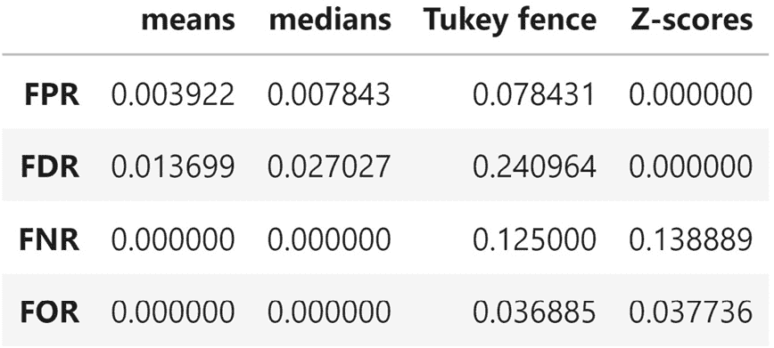

# 第九章：*第八章*：基于规则的异常检测

是时候抓住一些试图通过**暴力破解攻击**访问网站的黑客了——他们通过尝试一堆用户名和密码组合，直到成功登录为止。这种攻击非常嘈杂，因此为我们提供了大量的数据点用于**异常检测**，即寻找由与我们认为典型活动不同的过程产生的数据。黑客将被模拟，并不会像现实中那样狡猾，但这将为我们提供良好的异常检测实践机会。

我们将创建一个包，处理登录尝试的模拟，以便生成本章的数据。知道如何进行模拟是我们工具箱中一个至关重要的技能。有时，用精确的数学解法解决问题很困难；然而，定义系统中小组件如何工作可能比较容易。在这种情况下，我们可以模拟小组件并模拟整个系统的行为。模拟结果为我们提供了一个近似解，这可能足以满足我们的目的。

我们将利用基于规则的异常检测来识别模拟数据中的可疑活动。在本章结束时，我们将了解如何使用从各种概率分布生成的随机数来模拟数据，进一步了解 Python 标准库，积累更多构建 Python 包的经验，练习进行探索性数据分析，并初步接触异常检测。

本章将涵盖以下主题：

+   模拟登录尝试以创建本章的数据集

+   执行探索性数据分析以理解模拟数据

+   使用规则和基准线进行异常检测

# 本章材料

我们将构建一个模拟包来生成本章的数据；该包在 GitHub 上的地址是 [`github.com/stefmolin/login-attempt-simulator/tree/2nd_edition`](https://github.com/stefmolin/login-attempt-simulator/tree/2nd_edition)。在我们设置环境时，这个包已从 GitHub 安装，相关内容在*第一章*，*数据分析导论*中有提及；然而，你也可以按照*第七章*，*金融分析——比特币与股市*中的说明，安装一个可以编辑的版本。

本章节的代码库可以在[`github.com/stefmolin/Hands-On-Data-Analysis-with-Pandas-2nd-edition/tree/master/ch_08`](https://github.com/stefmolin/Hands-On-Data-Analysis-with-Pandas-2nd-edition/tree/master/ch_08)找到，包含了我们实际分析中使用的笔记本（`anomaly_detection.ipynb`）、我们将在`logs/`文件夹中处理的数据文件、用于模拟的数据（位于`user_data/`文件夹），以及包含 Python 脚本的`simulate.py`文件，我们可以在命令行运行该脚本来模拟本章节的数据。

# 模拟登录尝试

由于我们很难从泄露数据中找到登录尝试数据（通常因为其敏感性不予共享），我们将进行模拟。模拟需要对统计建模有深入的理解，能够估计某些事件的概率，并根据需要识别适当的假设进行简化。为了运行模拟，我们将构建一个 Python 包（`login_attempt_simulator`）来模拟登录过程，要求正确的用户名和密码（没有任何额外的身份验证措施，如双重身份验证），以及一个可以在命令行运行的脚本（`simulate.py`），我们将在本节中讨论这两个内容。

## 假设

在我们进入处理模拟的代码之前，需要理解一些假设。进行模拟时不可能控制所有可能的变量，因此我们必须确定一些简化假设以便开始。

模拟器对网站有效用户做出以下假设：

+   有效用户按照**泊松过程**到达，小时的到达率取决于星期几和一天中的时间。泊松过程将每单位时间内的到达（我们的模拟将使用小时）建模为一个均值为λ（lambda）的泊松分布。到达时间服从指数分布，均值为 1/λ。

+   有效用户从 1 到 3 个 IP 地址（每个连接到互联网的设备的唯一标识符）连接，这些 IP 地址由 4 个随机整数组成，范围为[0, 255]，并由句点分隔。尽管极为不可能，但两个有效用户可能会共享一个 IP 地址。

+   有效用户在输入凭证时不太可能犯很多错误。

    重要提示

    到达时间具有**无记忆性**特性，这意味着两个连续到达之间的时间不会影响随后的到达时间。

模拟器对黑客做出以下假设：

+   黑客试图避免账户锁定，只测试少量的用户名和密码组合，而不是进行全面的**字典攻击**（对于每个用户，尝试黑客在字典中所有可能的密码）。然而，他们在尝试之间不会添加延迟。

+   由于黑客不想造成拒绝服务攻击，他们限制攻击的频率，每次只进行一次尝试。

+   黑客知道系统中存在的账户数量，并且对用户名的格式有一定了解，但他们只能猜测具体的用户名。他们会选择尝试猜测所有 133 个用户名，或者其中的某些子集。

+   每次攻击都是独立的，也就是说每次攻击都是由单个黑客执行的，而且一个黑客从不进行多次攻击。

+   黑客不会共享哪些用户名-密码组合是正确的。

+   攻击是随机发生的。

+   每个黑客将使用一个唯一的 IP 地址，该地址与有效用户的 IP 地址生成方式相同。然而，我们的模拟器能够改变这个 IP 地址，这是我们将在*第十一章*《机器学习异常检测》中探讨的功能，目的是让这个场景变得更具挑战性。

+   虽然可能性极小，但黑客的 IP 地址可能与有效用户相同，甚至黑客可能是有效用户。

我们也在抽象化密码猜测的一些复杂性；相反，我们使用随机数字来决定密码是否被猜测正确——这意味着我们没有考虑网站如何存储密码，可能是明文（希望不是）、哈希值（对明文密码进行不可逆转换，使得无需存储实际密码即可进行验证）或加盐哈希值（有关这方面的文章请参见*进一步阅读*部分）。实际上，黑客可能会获取存储的密码并离线破解它们（请参阅*进一步阅读*部分结尾处关于彩虹表的文章），在这种情况下，本章讨论的技术可能不会很有帮助，因为日志中不会记录他们的尝试。请记住，本次模拟中的黑客非常显眼。

## `login_attempt_simulator` 包

这个包比上一章中的`stock_analysis`包要轻量得多；我们只有三个文件：

```py
login_attempt_simulator
|-- __init__.py
|-- login_attempt_simulator.py
`-- utils.py
```

接下来，我们将在以下章节中逐一讲解这些文件。请注意，部分文档字符串已被删除以简洁起见；请查看文件本身以获取完整的文档。

### 辅助函数

让我们从`utils.py`函数开始讨论，它们是我们模拟器类的辅助工具。首先，我们为模块创建文档字符串，并处理导入：

```py
"""Utility functions for the login attempt simulator."""
import ipaddress
import itertools
import json
import random
import string
```

接下来，我们定义`make_user_base()`函数，它为我们的 Web 应用程序创建用户库。该函数通过将英语字母表中的一个小写字母与函数内列表中的每个姓氏结合，来创建一个包含用户名的文件，并添加一些管理员账户；这样就形成了一个包含 133 个账户的用户库。通过写入文件，我们确保每次运行模拟时不需要重新生成，而是可以简单地从中读取数据以便将来进行模拟：

```py
def make_user_base(out_file):
    """Generate a user base and save it to a file."""
    with open(out_file, 'w') as user_base:
        for first, last in itertools.product(
            string.ascii_lowercase, 
            ['smith', 'jones', 'kim', 'lopez', 'brown']
        ): # makes 130 accounts
            user_base.write(first + last + '\n')
        # adds 3 more accounts
        for account in ['admin', 'master', 'dba']: 
            user_base.write(account + '\n')
```

由于我们需要在模拟器中使用这个用户库，我们还写了一个函数来读取用户库文件并将其转化为列表。`get_valid_users()` 函数将由 `make_user_base()` 函数写入的文件重新读取到 Python 列表中：

```py
def get_valid_users(user_base_file):
    """Read in users from the user base file."""
    with open(user_base_file, 'r') as file:
        return [user.strip() for user in file.readlines()]
```

`random_ip_generator()` 函数生成随机的 IP 地址，格式为 `xxx.xxx.xxx.xxx`，其中 `x` 是 [0, 255] 范围内的整数。我们使用 Python 标准库中的 `ipaddress` 模块（[`docs.python.org/3/library/ipaddress.html`](https://docs.python.org/3/library/ipaddress.html)）来避免分配私有 IP 地址：

```py
def random_ip_generator():
    """Randomly generate a fake IP address."""
    try:
        ip_address = ipaddress.IPv4Address('%d.%d.%d.%d' %
            tuple(random.randint(0, 255) for _ in range(4))
        )
    except ipaddress.AddressValueError:
        ip_address = random_ip_generator()
    return str(ip_address) if ip_address.is_global \
        else random_ip_generator()
```

每个用户将有几个尝试登录的 IP 地址。`assign_ip_addresses()` 函数为每个用户映射 1 到 3 个随机 IP 地址，创建一个字典：

```py
def assign_ip_addresses(user_list):
    """Assign users 1-3 fake IP addresses."""
    return {
        user: [
            random_ip_generator()
            for _ in range(random.randint(1, 3))
        ] for user in user_list
    }
```

`save_user_ips()` 和 `read_user_ips()` 函数分别将用户-IP 地址映射保存到 JSON 文件中，并将其重新读取到字典文件中：

```py
def save_user_ips(user_ip_dict, file):
    """Save the user-IP address mapping to a JSON file."""
    with open(file, 'w') as file:
        json.dump(user_ip_dict, file)
def read_user_ips(file):
    """Read in the JSON file of the user-IP address mapping."""
    with open(file, 'r') as file:
        return json.loads(file.read())
```

提示

Python 标准库有许多有用的模块，尽管我们可能不常用，但它们绝对值得了解。在这里，我们使用 `json` 模块将字典保存到 JSON 文件，并稍后读取它们。我们使用 `ipaddress` 模块处理 IP 地址，使用 `string` 模块获取字母表中的字符，而不需要一一输入。

### LoginAttemptSimulator 类

`login_attempt_simulator.py` 文件中的 `LoginAttemptSimulator` 类负责执行模拟的重负荷工作，包含所有随机数生成逻辑。像往常一样，我们从模块的文档字符串和导入语句开始：

```py
"""Simulator of login attempts from valid users and hackers."""
import calendar
import datetime as dt
from functools import partial
import math
import random
import string
import numpy as np
import pandas as pd
from .utils import random_ip_generator, read_user_ips
```

接下来，我们开始定义 `LoginAttemptSimulator` 类及其文档字符串，同时为存储常量定义一些类变量。我们这样做是为了避免使用魔法数字（即代码中看似没有意义的数字）以及避免在多个地方使用字符串时出现拼写错误。请注意，这些信息仅用于我们的日志；Web 应用程序不会向最终用户显示认证尝试失败的原因（也不应该显示）：

```py
class LoginAttemptSimulator:
    """Simulate login attempts from valid users + attackers."""
    ATTEMPTS_BEFORE_LOCKOUT = 3
    ACCOUNT_LOCKED = 'error_account_locked'
    WRONG_USERNAME = 'error_wrong_username'
    WRONG_PASSWORD = 'error_wrong_password'
```

重要提示

请注意我们如何使用类变量来存储常量，例如错误信息，这样就不会在代码中犯拼写错误。这样，每次使用这些错误信息时，文本都会保持一致，从而保持数据的整洁。在 Python 中，常量通常采用全大写字母形式（[`www.python.org/dev/peps/pep-0008/#constants`](https://www.python.org/dev/peps/pep-0008/#constants)）。

`__init__()` 方法将处理模拟器的设置，例如从指定的文件读取用户库、初始化日志、存储成功概率，并根据需要确定模拟的开始和结束日期：

```py
    def __init__(self, user_base_json_file, start, end=None, *,
                 attacker_success_probs=[.25, .45],
                 valid_user_success_probs=[.87, .93, .95],
                 seed=None):
        # user, ip address dictionary
        self.user_base = read_user_ips(user_base_json_file)
        self.users = [user for user in self.user_base.keys()]
        self.start = start
        self.end = end if end else self.start + \
            dt.timedelta(days=random.uniform(1, 50))
        self.hacker_success_likelihoods = \
            attacker_success_probs
        self.valid_user_success_likelihoods = \
            valid_user_success_probs
        self.log = pd.DataFrame(columns=[
            'datetime', 'source_ip', 'username',
            'success', 'failure_reason'
        ])
        self.hack_log = \
            pd.DataFrame(columns=['start', 'end', 'source_ip'])
        self.locked_accounts = []
        # set seeds for random numbers from random and numpy:
        random.seed(seed)
        np.random.seed(seed)
```

`_record()` 方法将每次尝试的结果追加到日志中，记录其来源的 IP 地址、用户名、时间、是否成功以及失败的原因（如果有的话）：

```py
    def _record(self, when, source_ip, username, success, 
                failure_reason):
        """
        Record the outcome of a login attempt.
        Parameters:
            - when: The datetime of the event.
            - source_ip: IP address the attempt came from.
            - username: The username used in the attempt.
            - success: Whether the attempt succeeded (Boolean).
            - failure_reason: Reason for the failure.
        Returns: 
            None, the `log` attribute is updated.
        """
        self.log = self.log.append({
            'datetime': when, 
            'source_ip': source_ip, 
            'username': username, 
            'success': success, 
            'failure_reason': failure_reason
        }, ignore_index=True)
```

`_attempt_login()` 方法处理判断登录尝试是否成功的逻辑：


图 8.1 – 模拟逻辑

我们提供输入正确用户名的概率（`username_accuracy`）以及每次尝试成功输入密码的概率（`success_likelihoods`）。尝试次数是允许的最大尝试次数与成功概率列表长度（`success_likelihoods`）中的最小值。每次尝试的结果会通过 `functools` 传递给 `_record()`，它允许我们创建函数，将某些参数固定为特定值（这样就不必不断传递相同的值）：

```py
    def _attempt_login(self, when, source_ip, username,
                       username_accuracy, success_likelihoods):
        """
        Simulates a login attempt, allowing for account
        lockouts, and recording the results.
        Parameters:
            - when: The datetime to start trying.
            - source_ip: IP address the attempt came from. 
            - username: The username being used in the attempt.
            - username_accuracy: Prob. username is correct.
            - success_likelihoods: List of probabilities that 
              password is correct (one per attempt).
        Returns:
            The datetime after trying.
        """
        current = when
        recorder = partial(self._record, source_ip=source_ip)
        if random.random() > username_accuracy:
            correct_username = username
            username = self._distort_username(username)
        if username not in self.locked_accounts:
            tries = len(success_likelihoods)
            for i in range(
                min(tries, self.ATTEMPTS_BEFORE_LOCKOUT)
            ):
                current += dt.timedelta(seconds=1)
                if username not in self.users:
                    recorder(
                        when=current, username=username, 
                        success=False,
                        failure_reason=self.WRONG_USERNAME
                    )
                    if random.random() <= username_accuracy:
                        username = correct_username
                    continue
                if random.random() <= success_likelihoods[i]:
                    recorder(
                        when=current, username=username,
                        success=True, failure_reason=None
                    )
                    break
                else:
                    recorder(
                        when=current, username=username, 
                        success=False,
                        failure_reason=self.WRONG_PASSWORD
                    )
            else:
                if tries >= self.ATTEMPTS_BEFORE_LOCKOUT \
                and username in self.users:
                    self.locked_accounts.append(username)
        else:
            recorder(
                when=current, username=username, success=False,
                failure_reason=self.ACCOUNT_LOCKED
            )
            if random.random() >= .5: # unlock account randomly
                self.locked_accounts.remove(username)
        return current
```

`_valid_user_attempts_login()` 和 `_hacker_attempts_login()` 方法是围绕 `_attempt_login()` 方法的封装，分别处理有效用户和黑客的概率调整。注意，尽管两者都使用高斯（正态）分布来确定用户名的准确性，但有效用户的分布具有更高的均值和更低的标准差，这意味着他们在尝试登录时更有可能提供正确的用户名。这是因为，虽然有效用户可能会打错字（偶尔发生），但黑客则是在猜测：

```py
    def _hacker_attempts_login(self, when, source_ip,
                               username):
        """Simulates a login attempt from an attacker."""
        return self._attempt_login(
            when=when, source_ip=source_ip, username=username,
            username_accuracy=random.gauss(mu=0.35, sigma=0.5),
            success_likelihoods=self.hacker_success_likelihoods
        )
    def _valid_user_attempts_login(self, when, username):
        """Simulates a login attempt from a valid user."""
        return self._attempt_login(
            when=when, username=username,
            source_ip=random.choice(self.user_base[username]),
            username_accuracy=\
                random.gauss(mu=1.01, sigma=0.01),
            success_likelihoods=\
                self.valid_user_success_likelihoods
        )
```

当模拟器判断用户名无法正确提供时，它会调用 `_distort_username()` 方法，该方法会随机决定从有效用户名中省略一个字母或将一个字母替换为另一个字母。虽然黑客因猜测而输入错误的用户名（而不是由于打字错误），我们在这里抽象化处理这一细节，以便使用一个统一的函数来为有效用户和黑客引入用户名错误：

```py
    @staticmethod
    def _distort_username(username):
        """
        Alters the username to allow for wrong username login 
        failures. Randomly removes a letter or replaces a 
        letter in a valid username.
        """
        username = list(username)
        change_index = random.randint(0, len(username) - 1)
        if random.random() < .5: # remove random letter
            username.pop(change_index)
        else: # randomly replace a single letter
            username[change_index] = \
                random.choice(string.ascii_lowercase)
        return ''.join(username)
```

我们使用 `_valid_user_arrivals()` 方法来生成给定小时内到达的用户数量和使用泊松分布和指数分布生成的到达间隔时间：

```py
    @staticmethod
    def _valid_user_arrivals(when):
        """
        Static method for simulating Poisson process of 
        arrivals (users wanting to log in). Lambda for the 
        Poisson varies depending upon the day and time of week.
        """
        is_weekday = when.weekday() not in (
            calendar.SATURDAY, calendar.SUNDAY
        )
        late_night = when.hour < 5 or when.hour >= 11
        work_time = is_weekday \
                    and (when.hour >= 9 or when.hour <= 17)
        if work_time:
# hours 9-5 on work days get higher lambda 
            poisson_lambda = random.triangular(1.5, 5, 2.75)
        elif late_night:
            # hours in middle of night get lower lambda
            poisson_lambda = random.uniform(0.0, 5.0)
        else:
            poisson_lambda = random.uniform(1.5, 4.25)
        hourly_arrivals = np.random.poisson(poisson_lambda)
        interarrival_times = np.random.exponential(
            1/poisson_lambda, size=hourly_arrivals
        )
        return hourly_arrivals, interarrival_times
```

重要提示

我们使用 `numpy` 而不是 `random` 来从指数分布中生成随机数，因为我们可以一次请求多个值（每个值对应泊松过程确定的每小时到达数）。此外，`random` 不提供泊松分布，因此我们需要 `numpy`。

我们的模拟使用了多种不同的分布，因此查看它们的样子可能会有所帮助。以下子图展示了我们使用的每种分布的示例。注意，泊松分布的绘制方式不同。这是因为泊松分布是离散的。因此，我们通常用它来模拟到达情况——在这里，我们用它来模拟尝试登录的用户到达情况。离散分布有一个**概率质量函数**（**PMF**），而不是**概率密度函数**（**PDF**）：


图 8.2 – 模拟中使用的分布

`_hack()` 方法为黑客生成一个随机的 IP 地址，并对给定的用户列表进行暴力攻击：

```py
    def _hack(self, when, user_list, vary_ips):
        """
        Simulate an attack by a random hacker.
        Parameters:
            - when: The datetime to start the attack.
            - user_list: The list of users to try to hack.
            - vary_ips: Whether or not to vary the IP address.
        Returns:
            Initial IP address and the end time for recording.
        """
        hacker_ip = random_ip_generator()
        random.shuffle(user_list)
        for user in user_list:
            when = self._hacker_attempts_login(
                when=when, username=user,
                source_ip=random_ip_generator() if vary_ips \
                    else hacker_ip
            )
        return hacker_ip, when
```

现在我们已经具备了执行仿真主要部分的功能，我们编写 `simulate()` 方法将所有内容整合在一起：

```py
    def simulate(self, *, attack_prob, try_all_users_prob,
                 vary_ips):
        """
        Simulate login attempts.
        Parameters:
            - attack_probs: Probability of attack in given hour
            - try_all_users_prob: Prob. hacker will try to 
              guess credentials for all users vs random subset.
            - vary_ips: Whether to vary the IP address.
        """
        hours_in_date_range = math.floor(
            (self.end - self.start).total_seconds() / 60 / 60
        )
        for offset in range(hours_in_date_range + 1):
            current = self.start + dt.timedelta(hours=offset)
            # simulate hacker
            if random.random() < attack_prob:
                attack_start = current \
                    + dt.timedelta(hours=random.random())
                source_ip, end_time = self._hack(
                    when=attack_start,
                    user_list=self.users if \
                        random.random() < try_all_users_prob \
                        else random.sample(
self.users, 
                            random.randint(0, len(self.users))
                    ),
                    vary_ips=vary_ips
                )
                self.hack_log = self.hack_log.append(
                    dict(
                        start=attack_start, end=end_time, 
                        source_ip=source_ip
                    ), ignore_index=True
                )
            # simulate valid users
            hourly_arrivals, interarrival_times = \
                self._valid_user_arrivals(current)
            random_user = random.choice(self.users)
            random_ip = \
                random.choice(self.user_base[random_user])
            for i in range(hourly_arrivals):
                current += \
                    dt.timedelta(hours=interarrival_times[i])
                current = self._valid_user_attempts_login(
                    current, random_user
                )
```

我们希望将日志保存为 CSV 文件，因此我们将 `_save()` 方法作为静态方法添加，以减少两个保存方法中的代码重复。`save_log()` 方法将保存登录尝试，而 `save_hack_log()` 方法将保存攻击记录：

```py
    @staticmethod
    def _save(data, filename, sort_column):
        """Sort data by the datetime and save to a CSV file."""
        data.sort_values(sort_column)\
            .to_csv(filename, index=False)
    def save_log(self, filename):
        """Save the login attempts log to a CSV file."""
        self._save(self.log, filename, 'datetime')
    def save_hack_log(self, filename):
        """Save the record of the attacks to a CSV file."""
        self._save(self.hack_log, filename, 'start')
```

注意到这个类中有很多私有方法，这是因为该类的用户只需要能够创建该类的实例（`__init__()`），按小时进行仿真（`simulate()`），并保存输出（`save_log()` 和 `save_hack_log()`）——所有其他方法仅供该类的对象内部使用。后台的这些方法将处理大部分工作。

最后，我们有 `__init__.py` 文件，这使得这个目录变成一个包，同时也为我们提供了一种更容易的方式来导入主类：

```py
"""Package for simulating login data."""
from .login_attempt_simulator import LoginAttemptSimulator
```

现在我们已经了解了仿真器是如何工作的，接下来我们将讨论如何运行仿真以收集登录尝试的数据。

## 从命令行进行仿真

我们可以将模拟登录尝试的代码包装成一个可以轻松通过命令行运行的脚本，而不是每次都写代码。Python 标准库中有 `argparse` 模块（[`docs.python.org/3/library/argparse.html`](https://docs.python.org/3/library/argparse.html)），允许我们为脚本指定可以从命令行提供的参数。

让我们来看看 `simulate.py` 文件，看看如何做到这一点。我们从导入开始：

```py
"""Script for simulating login attempts."""
import argparse
import datetime as dt
import os
import logging
import random
import login_attempt_simulator as sim
```

为了在命令行中使用时提供状态更新，我们将使用标准库中的 `logging` 模块设置日志消息（[`docs.python.org/3/library/logging.html`](https://docs.python.org/3/library/logging.html)）：

```py
# Logging configuration
FORMAT = '[%(levelname)s] [ %(name)s ] %(message)s'
logging.basicConfig(level=logging.INFO, format=FORMAT)
logger = logging.getLogger(os.path.basename(__file__))
```

接下来，我们定义了一些实用函数，用于生成我们在仿真过程中读取和写入数据时需要的文件路径：

```py
def get_simulation_file_path(path_provided, directory,
                             default_file):
    """Get filepath, make directory if necessary."""
    if path_provided:
        file = path_provided
    else:
        if not os.path.exists(directory):
            os.mkdir(directory)
        file = os.path.join(directory, default_file)
    return file
def get_user_base_file_path(path_provided, default_file):
    """Get the path for a user_data directory file."""
    return get_simulation_file_path(
        path_provided, 'user_data', default_file
    )
def get_log_file_path(path_provided, default_file):
    """Get the path for a logs directory file."""
    return get_simulation_file_path(
        path_provided, 'logs', default_file
    )
```

这个脚本的最大部分定义了可以传递的命令行参数——我们将允许用户指定是否要创建一个新的用户基础，设置种子，仿真开始时间，仿真时长，以及保存所有文件的位置。实际的仿真通过我们构建的包在几行代码内完成。这个部分只有在运行该模块时才会执行，而不是在导入时：

```py
if __name__ == '__main__':
    # command-line argument parsing
    parser = argparse.ArgumentParser()
    parser.add_argument(
        'days', type=float,
        help='number of days to simulate from start'
    )
    parser.add_argument(
        'start_date', type=str,
        help="datetime to start in the form 'YYYY-MM-DD(...)'"
    )
    parser.add_argument(
'-m', '--make', action='store_true', 
        help='make user base'
    )
    parser.add_argument(
'-s', '--seed', type=int, 
        help='set a seed for reproducibility'
    )
    parser.add_argument(
'-u', '--userbase', 
        help='file to write the user base to'
    )
    parser.add_argument(
'-i', '--ip', 
        help='file to write user-IP address map to'
    )
    parser.add_argument(
        '-l', '--log', help='file to write the attempt log to'
    )
    parser.add_argument(
'-hl', '--hacklog', 
        help='file to write the hack log to'
    )
```

提示

`if __name__ == '__main__'` 块中放置的代码只有在该模块作为脚本运行时才会被执行。这样，我们就可以在不运行仿真的情况下导入模块中定义的函数。

定义好参数后，我们需要解析它们才能使用：

```py
    args = parser.parse_args()
```

一旦我们解析了命令行参数，就检查是否需要生成用户基础数据或读取它：

```py
    user_ip_mapping_file = \
        get_user_base_file_path(args.ip, 'user_ips.json')
    if args.make:
        logger.warning(
            'Creating new user base, mapping IP addresses.'
        )
        user_base_file = get_user_base_file_path(
            args.userbase, 'user_base.txt'
        )
        # seed the creation of user base
        random.seed(args.seed)
        # create usernames and write to file
        sim.utils.make_user_base(user_base_file)
        # create 1 or more IP addresses per user, save mapping 
        valid_users = sim.utils.get_valid_users(user_base_file)
        sim.utils.save_user_ips(
            sim.utils.assign_ip_addresses(valid_users), 
            user_ip_mapping_file
        )
```

之后，我们从命令行参数中解析起始日期，并通过将持续时间添加到起始日期来确定结束日期：

```py
    try:
        start = \
            dt.datetime(*map(int, args.start_date.split('-')))
    except TypeError:
        logger.error('Start date must be in "YYYY-MM-DD" form')
        raise
    except ValueError:
        logger.warning(
            f'Could not interpret {args.start_date}, '
            'using January 1, 2020 at 12AM as start instead'
        )
        start = dt.datetime(2020, 1, 1)
    end = start + dt.timedelta(days=args.days)
```

提示

```py
try clause and multiple except clauses. We can specify how to handle specific errors occurring during code execution (called except clause. In this case, we have the logger object print a more helpful message for the user, and then re-raise the same exception (because we don't intend to handle it) by simply writing raise. This ends the program—the user can then try again with valid input. Try triggering this exception to see how much more useful this is. One thing to keep in mind, though, is that order matters—be sure to handle specific exceptions before having a general except clause; otherwise, the code specific to each exception type will never trigger. Also, note that using except without providing a specific exception will catch everything, even exceptions not meant to be caught.
```

最后，我们运行实际的模拟并将结果写入指定的文件（或默认路径）。我们将某一小时内发生攻击的概率设置为 10%（`attack_prob`），黑客尝试猜测所有用户名的概率设置为 20%（`try_all_users_prob`），并让黑客在所有尝试中使用相同的 IP 地址（`vary_ips`）：

```py
    try:
        logger.info(f'Simulating {args.days} days...')
        simulator = sim.LoginAttemptSimulator(
            user_ip_mapping_file, start, end, seed=args.seed
        )
        simulator.simulate(
            attack_prob=0.1, try_all_users_prob=0.2, 
            vary_ips=False
        )
        # save logs
        logger.info('Saving logs')
        simulator.save_hack_log(
            get_log_file_path(args.hacklog, 'attacks.csv')
        )
        simulator.save_log(
            get_log_file_path(args.log, 'log.csv')
        )
        logger.info('All done!')
    except:
        logger.error('Oops! Something went wrong...')
        raise
```

提示

请注意，我们使用了`logger`对象在脚本中打印有用的信息到屏幕；这将帮助脚本用户了解进程进行到什么阶段。这些信息有不同的严重级别（我们在这里使用的是`INFO`、`WARNING`和`ERROR`），允许它们用于调试（`DEBUG`级别），并且在代码进入生产阶段后，打印的最小级别可以提高到`INFO`，这样就不会再打印`DEBUG`信息。这比简单的`print()`语句要强大得多，因为我们不需要担心在进入生产环境时删除它们，或者在开发继续进行时再将这些信息加回去。

现在让我们来看看如何运行这个脚本。我们知道`simulate.py`可以在命令行上运行，但我们如何查看需要传递哪些参数呢？很简单——我们只需在调用时添加帮助标志（`-h`或`--help`）：

```py
(book_env) $ python3 simulate.py -h
usage: simulate.py [-h] [-m] [-s SEED] [-u USERBASE] [-i IP] 
                   [-l LOG] [-hl HACKLOG]
                   days start_date
positional arguments:
  days                  number of days to simulate from start
  start_date            datetime to start in the form 
                        'YYYY-MM-DD' or 'YYYY-MM-DD-HH'
optional arguments:
  -h, --help            show this help message and exit
  -m, --make            make user base
  -s SEED, --seed SEED  set a seed for reproducibility
  -u USERBASE, --userbase USERBASE
                        file to write the user base to
  -i IP, --ip IP        file to write the user-IP address 
                        map to
  -l LOG, --log LOG     file to write the attempt log to
  -hl HACKLOG, --hacklog HACKLOG
                        file to write the hack log to
```

重要提示

请注意，当我们使用`argparse`添加其他参数时，并没有指定`help`参数；它是由`argparse`自动创建的。

一旦我们知道可以传递哪些参数，并决定了我们想要提供哪些参数，我们就可以运行模拟了。让我们模拟从 2018 年 11 月 1 日 12 点开始的 30 天，并让脚本创建所需的用户基础和 IP 地址映射：

```py
(book_env) $ python3 simulate.py -ms 0 30 '2018-11-01'
[WARNING] [ simulate.py ] Creating new user base and mapping IP addresses to them.
[INFO] [ simulate.py ] Simulating 30.0 days...
[INFO] [ simulate.py ] Saving logs
[INFO] [ simulate.py ] All done!
```

提示

由于我们设置了种子（`-s 0`），因此此模拟的输出是可重现的。只需移除种子或更改它，就可以得到不同的结果。

Python 模块也可以作为脚本运行。与导入模块不同，当我们将模块作为脚本运行时，`if __name__ == '__main__'`下方的任何代码也会被执行，这意味着我们不总是需要编写单独的脚本。我们构建的大多数模块只定义了函数和类，因此作为脚本运行并不会有任何效果；然而，我们在*第一章*《数据分析简介》中创建虚拟环境时，正是这种方式。前面的代码块因此等同于以下命令：

```py
# leave off the .py
(book_env) $ python3 -m simulate -ms 0 30 "2018-11-01"
```

现在我们已经有了模拟数据，开始进行分析吧。

# 探索性数据分析

在这种情况下，我们有幸可以访问标记数据（`logs/attacks.csv`），并将其用于研究如何区分合法用户和攻击者。然而，这种情况在我们离开研究阶段并进入应用阶段时往往无法实现。在*第十一章*《机器学习异常检测》中，我们将重新审视这一场景，但从没有标记数据开始，以增加挑战。像往常一样，我们先进行导入并读取数据：

```py
>>> %matplotlib inline
>>> import matplotlib.pyplot as plt
>>> import numpy as np
>>> import pandas as pd
>>> import seaborn as sns
>>> log = pd.read_csv(
...     'logs/log.csv', index_col='datetime', parse_dates=True
... )
```

登录尝试数据框（`log`）包含了每次尝试的日期和时间（`datetime`列）、来源的 IP 地址（`source_ip`）、使用的用户名（`username`）、是否成功（`success`）以及如果失败的话失败原因（`failure_reason`）：


图 8.3 – 登录尝试数据示例

在处理这些数据时，我们需要思考什么是正常活动，什么是黑客活动。两者之间的任何显著差异都可能被用来识别黑客。我们预计合法用户的成功率较高，最常见的失败原因是密码错误。我们预计用户会从不同的 IP 地址登录（手机、家用电脑、工作电脑以及其他可能的设备），并且有可能人们共享设备。由于我们不了解该网络应用程序的性质，我们不能说多次登录是否正常。我们也不知道这些数据的时区，因此不能对登录时间做出任何推断。理论上，我们可以查看这些 IP 地址来自哪些国家，但由于有方法可以隐藏 IP 地址，因此我们不会走这条路。基于现有数据，我们可以选择以下几种可行的方式：

+   调查登录尝试和失败的任何异常波动（无论是总体还是按 IP 地址统计）。

+   检查失败原因是用户名错误的情况。

+   查看每个 IP 地址的失败率。

+   查找尝试使用多个不同用户名登录的 IP 地址。

另一个需要注意的点是，我们希望尽早标记异常行为，而不是等到最后。等待一个月才标记某个行为的价值较低（随着时间推移，价值迅速下降），因此我们需要找到更早标记异常的方式；例如，使用每小时的频率。由于我们处于研究阶段，可以使用一些标记数据：

```py
>>> attacks = pd.read_csv(
...     'logs/attacks.csv',
...     converters={
...         'start': np.datetime64, 
...         'end': np.datetime64
...     }
... ) # make start and end columns datetimes but not the index
```

这些数据是针对网络应用程序（`attacks`）的攻击记录。它包含了攻击开始的日期和时间（`start`）、攻击结束的日期和时间（`end`）以及与攻击相关的 IP 地址（`source_ip`）：


图 8.4 – 标记数据示例

使用`shape`属性，我们可以看到 72 次攻击和 12,836 次来自有效用户和恶意用户的登录尝试，使用`nunique()`，我们看到 22%的 IP 地址与攻击相关：

```py
>>> attacks.shape, log.shape
((72, 3), (12836, 4))
>>> attacks.source_ip.nunique() / log.source_ip.nunique()
0.22018348623853212
```

重要提示

通常情况下，仅凭这些数据很难知道攻击发生的具体时间——攻击可以在不被发现的情况下持续很长时间，即使是这样，也并不容易将攻击者的行为与正常用户的行为区分开来。

我们的数据相当干净（毕竟我们就是为这个目的设计的），所以让我们看看通过执行一些**探索性数据分析**（**EDA**）是否能发现有趣的东西。首先，让我们看看每小时的登录尝试数量：

```py
>>> log.assign(attempts=1).attempts.resample('1H').sum()\
...     .plot(figsize=(15, 5), title='hourly attempts')\
...     .set(xlabel='datetime', ylabel='attempts')
```

几个小时的登录尝试出现了非常大的峰值，这可能是攻击发生的时间。使用这张图，我们可以报告登录尝试活动较高的小时数，但仅此而已：


图 8.5 – 每小时登录尝试

另一个有趣的探索方向是查看每个 IP 地址的尝试次数。我们可以通过运行以下命令来实现这一点：

```py
>>> log.source_ip.value_counts().describe()
count    327.000000
mean      39.253823
std       69.279330
min        1.000000
25%        5.000000
50%       10.000000
75%       22.500000
max      257.000000
Name: source_ip, dtype: float64
```

这些数据显然有一些异常值，它们将每个 IP 地址的尝试次数拉得很高。让我们创建一些图表来更好地评估这一点：

```py
>>> fig, axes = plt.subplots(1, 2, figsize=(15, 5))
>>> log.source_ip.value_counts()\
...     .plot(kind='box', ax=axes[0]).set_ylabel('attempts')
>>> log.source_ip.value_counts()\
...     .plot(kind='hist', bins=50, ax=axes[1])\
...     .set_xlabel('attempts')
>>> fig.suptitle('Attempts per IP Address')
```

每个 IP 地址的尝试分布是有效用户和攻击者分布的总和。直方图显示这个分布是双峰的，但仅凭这张图我们无法确定所有高尝试次数的 IP 地址是否都是黑客：


图 8.6 – 每个 IP 地址的登录尝试分布

由于我们可以访问每次攻击的详细信息，我们可以检查直方图的右侧部分是否是黑客的分布。根据尝试次数，黑客的 IP 地址占前列 IP 地址的 88.9%：

```py
>>> num_hackers = attacks.source_ip.nunique()
>>> log.source_ip.value_counts().index[:num_hackers]\
...     .isin(attacks.source_ip).sum() / num_hackers
0.8888888888888888
```

我们可以在此停止，并标记出每个月尝试次数最多的 IP 地址列表，但我们更可能需要一个更具鲁棒性的解决方案，因为黑客每次都可能更改 IP 地址来避免检测。理想情况下，我们还希望在不等待完整一个月的数据的情况下就能检测到攻击。然而，通过查看每个 IP 地址的每小时尝试次数，遗憾的是，似乎并没有提供太多信息：

```py
>>> log.assign(attempts=1).groupby('source_ip').attempts\
...     .resample('1H').sum().unstack().mean()\
...     .plot(
...         figsize=(15, 5), 
...         title='average hourly attempts per IP address'
...     ).set_ylabel('average hourly attempts per IP address')
```

请回想一下来自*第一章*的内容，*数据分析简介*，其中提到均值对异常值不具鲁棒性。如果攻击者进行了多次尝试，异常值会将每个 IP 地址的平均每小时登录尝试次数拉高。我们可以在这条线图中看到几个大的峰值，但注意到它们中的许多只有两到三次。我们真的能期望一个用户只通过一个 IP 地址访问 Web 应用程序吗？这很可能不是一个现实的假设：


图 8.7 – 每个 IP 地址的平均每小时登录尝试次数

所以，如果我们不能仅依赖 IP 地址（毕竟，黑客可能足够聪明，能够将攻击分布到多个不同的地址上），我们还能尝试什么呢？或许黑客在成功登录方面遇到了更多困难：

```py
>>> log[log.source_ip.isin(attacks.source_ip)]\
...     .success.value_counts(normalize=True)
False    0.831801
True     0.168199
Name: success, dtype: float64
```

黑客成功的概率只有 17%，但合法用户的成功率有多高呢？这些信息对于确定网站正常行为的基准值非常重要。正如我们所预期的，合法用户的成功率要高得多：

```py
>>> log[~log.source_ip.isin(attacks.source_ip)]\
...     .success.value_counts(normalize=True)
True     0.873957
False    0.126043
Name: success, dtype: float64
```

由于日志中包含了登录失败的原因，我们可以使用交叉表来查看黑客和合法用户未能成功登录的原因。这里的任何差异都可能帮助我们区分这两组用户：

```py
>>> pd.crosstab(
...     index=pd.Series(
...         log.source_ip.isin(attacks.source_ip),
...         name='is_hacker'
...     ), columns=log.failure_reason
... )
```

合法用户有时会输入错误的密码或用户名，但黑客在同时输入正确的用户名和密码时会遇到更多问题：


图 8.8 – 登录失败尝试的原因

合法用户在输入凭证时不会犯太多错误，因此如果黑客尝试登录的次数很多，并且涉及多个用户，我们可以标记这种行为。为了确认这一点，我们可以查看每个用户的平均每小时尝试次数：

```py
>>> log.assign(attempts=1).groupby('username').attempts\
...     .resample('1H').sum().unstack().mean()\
...     .plot(figsize=(15, 5),
...           title='average hourly attempts per user')\
...     .set_ylabel('average hourly attempts per user')
```

大多数情况下，每个用户名每小时的尝试次数不到一次。这个指标的波动也不能保证就是攻击的迹象。或许是网站正在进行闪购活动；在这种情况下，我们很可能会看到由合法用户引起的这个指标的激增：


图 8.9 – 每个用户名的平均每小时登录尝试次数

根据我们的发现，错误率似乎是检测攻击的最有用指标，因此我们将研究错误率高的 IP 地址。为此，我们可以创建一个透视表来计算一些有用的指标：

```py
>>> pivot = log.pivot_table(
...     values='success', index=log.source_ip, 
...     columns=log.failure_reason.fillna('success'), 
...     aggfunc='count', fill_value=0
... )
>>> pivot.insert(0, 'attempts', pivot.sum(axis=1))
>>> pivot = pivot.sort_values('attempts', ascending=False)\
...     .assign(
...         success_rate=lambda x: x.success / x.attempts,
...         error_rate=lambda x: 1 - x.success_rate
...     )
>>> pivot.head()
```

提示

`insert()`方法允许我们将新创建的`attempts`列插入到当前数据框的特定位置，并且是就地操作。我们创建了`attempts`列，它是错误和成功的总和（我们将`failure_reason`列中的`NaN`值用`success`填充，以便在此处进行计数），通过在`axis=1`方向上进行求和。

这生成了以下按尝试次数排序的透视表（从最多到最少）：


图 8.10 – 每个 IP 地址的度量

我们知道某些 IP 地址正在进行多次尝试，因此值得调查每个 IP 地址尝试登录的用户名数量；我们预计合法用户只会从少数几个 IP 地址登录，并且不会与许多其他用户共享他们的 IP 地址。这可以通过分组和聚合来确定：

```py
>>> log.groupby('source_ip').agg(dict(username='nunique'))\
...     .username.value_counts().describe()
count     53.000000
mean       6.169811
std       34.562505
min        1.000000
25%        1.000000
50%        1.000000
75%        2.000000
max      253.000000
Name: username, dtype: float64
```

这看起来确实是隔离恶意用户的好策略。大多数 IP 地址由两名或更少的用户使用，但最大值为 253 个。虽然这个标准可能有助于我们识别一些攻击者，但如果黑客足够聪明，可以在攻击过程中不断更换 IP 地址，这个标准就无法起到作用了。

在我们继续讨论异常检测方法之前，先看看我们是否能通过视觉识别出黑客。让我们为每个 IP 地址的成功次数和尝试次数绘制散点图：

```py
>>> pivot.plot(
...     kind='scatter', x='attempts', y='success', alpha=0.25,
...     title='successes vs. attempts by IP address' 
... )
```

似乎有几个明显的聚类。在图的左下角，我们看到一些点形成了一条成功与尝试呈一对一关系的线。右上部分则包含一个较为稀疏的聚类，尝试次数较高，成功次数适中。由于我们使用了`alpha`参数来控制透明度，我们可以看到，似乎连接这两个聚类的点迹并不密集。即便没有坐标轴的比例尺，我们也能预测左下角的聚类是普通用户，右上角的聚类是黑客（因为我们假设普通用户比黑客多，而且普通用户的成功率较高）。然而，中间的点则更难判断：


图 8.11 – 每个 IP 地址的成功与尝试的散点图

在不做任何假设的情况下，我们可以绘制一条边界线，将中间的点与其最近的聚类分组：

```py
>>> ax = pivot.plot(
...     kind='scatter', x='attempts', y='success', alpha=0.25, 
...     title='successes vs. attempts by IP address'
... )
>>> plt.axvline(
...     125, label='sample boundary',
...     color='red', linestyle='--'
... )
>>> plt.legend(loc='lower right')
```

当然，在缺乏标注数据的情况下，评估这个决策边界的有效性是困难的：


图 8.12 – 可视化决策边界

幸运的是，我们有黑客使用的 IP 地址数据，因为我们已经获得了标注数据来进行研究，所以我们可以使用`seaborn`来实际看到这种分离：

```py
>>> fig, axes = plt.subplots(1, 2, figsize=(15, 5))
>>> for ax in axes:
...     sns.scatterplot(
...         y=pivot.success, x=pivot.attempts, 
...         hue=pivot.assign(
...             is_hacker=\
...                 lambda x: x.index.isin(attacks.source_ip)
...         ).is_hacker,
...         ax=ax, alpha=0.5
...     ) 
...     for spine in ['top', 'right']: # make less boxy
...         ax.spines[spine].set_visible(False)
>>> axes[1].set_xscale('log')
>>> plt.suptitle('successes vs. attempts by IP address')
```

我们关于存在两个明显聚类的直觉完全正确。然而，中间区域的判断则要复杂得多。左侧的蓝色（较深）点似乎呈向上排列，而左侧的橙色（较浅）点则跟随一条通向橙色聚类的线条。通过绘制尝试次数的对数，我们能更好地将橙色中间点和蓝色点分开：


图 8.13 – 使用标注数据来验证我们的直觉

记住，我们还可以使用箱型图来检查是否存在异常值，异常值会显示为点。让我们看看每个 IP 地址的成功与尝试分布情况：

```py
>>> pivot[['attempts', 'success']].plot(
...     kind='box', subplots=True, figsize=(10, 3),
...     title='stats per IP address'
... )
```

被标记为离群值的点与我们之前绘制的散点图右上角的点重合：


图 8.14 – 检查异常值

现在我们已经对数据有了充分的了解，我们准备学习如何实现一些简单的异常检测策略。

# 实现基于规则的异常检测

是时候抓住那些黑客了。在前一节的 EDA（探索性数据分析）之后，我们已经对如何进行此操作有了一定的了解。实际上，这要困难得多，因为它涉及更多的维度，但我们在这里简化了处理过程。**我们希望找到那些尝试次数过多但成功率较低的 IP 地址，以及那些使用比我们认为正常的更多独特用户名进行登录尝试的 IP 地址（异常行为）**。为了实现这一点，我们将采用基于阈值的规则作为我们进行异常检测的第一步；接下来，在*第十一章*《机器学习异常检测》中，我们将探讨一些机器学习技术，并重新审视这一场景。

由于我们有兴趣标记可疑的 IP 地址，我们将安排数据，以便每个 IP 地址有每小时的聚合数据（如果该小时内有活动）：

```py
>>> hourly_ip_logs = log.assign(
...     failures=lambda x: np.invert(x.success)
... ).groupby('source_ip').resample('1H').agg({
...     'username': 'nunique', 'success': 'sum', 
...     'failures': 'sum'
... }).assign(
...     attempts=lambda x: x.success + x.failures,
...     success_rate=lambda x: x.success / x.attempts,
...     failure_rate=lambda x: 1 - x.success_rate
... ).dropna().reset_index()
```

提示

`np.invert()`函数是一个轻松翻转布尔值的方法。它将`True`转换为`False`，将`False`转换为`True`，适用于 NumPy 数组结构。

聚合后的数据如下所示：


图 8.15 – 每个 IP 地址的每小时聚合数据

最简单的基于规则的异常检测方法是计算阈值，并检查数据是否超出该阈值。这可能意味着值低于某个下限阈值，或超过某个上限阈值。由于我们关注的是登录尝试，我们对高于正常水平的值感兴趣。因此，我们将计算上限阈值，并将其与我们的数据进行比较。

## 百分比差异

假设我们对网站上正常的登录尝试活动（排除黑客的影响）有一定了解，我们可以通过某个百分比的偏差来标记那些与此偏离的值。为了计算这个基准，我们可以随机抽取一些 IP 地址（每小时重复抽取），并计算它们的平均登录尝试次数。由于数据量较少（每个小时大约有 50 个独特的 IP 地址可供选择），我们采用自助法（bootstrap）。

为了实现这一点，我们可以编写一个函数，该函数接受我们刚刚创建的聚合数据框，并传入每一列的数据统计名称作为计算阈值的起始点：

```py
>>> def get_baselines(hourly_ip_logs, func, *args, **kwargs):
...     """
...     Calculate hourly bootstrapped statistic per column.
...
...     Parameters:
...         - hourly_ip_logs: Data to sample from.
...         - func: Statistic to calculate.
...         - args: Additional positional arguments for `func`
...         - kwargs: Additional keyword arguments for `func`
...
...     Returns: 
...         `DataFrame` of hourly bootstrapped statistics
...     """
...     if isinstance(func, str):
...         func = getattr(pd.DataFrame, func)
...
...     return hourly_ip_logs.assign(
...         hour=lambda x: x.datetime.dt.hour
...     ).groupby('hour').apply(
...         lambda x: x\
...             .sample(10, random_state=0, replace=True)\
...             .pipe(func, *args, **kwargs, numeric_only=True)
...     )
```

重要提示

```py
random_state is used with sample() for reproducibility; however, in practice, we will probably not want to always pick the same rows.
```

请注意，如果我们在`apply()`内使用`sample()`，在按我们想要抽样的列分组后，我们可以为所有组（这里是小时）获得大小相等的样本。这意味着我们在每小时对每列进行有放回的抽样，选择 10 行。我们必须按小时进行抽样，因为如果进行简单的随机抽样，可能会没有每小时的统计数据。让我们使用`get_baselines()`通过均值计算列基准：

```py
>>> averages = get_baselines(hourly_ip_logs, 'mean')
>>> averages.shape
(24, 7)
```

提示

如果我们想进行分层随机抽样，可以将`get_baselines()`函数中的`10`替换为`x.shape[0] * pct`，其中`pct`是我们希望从每个组中抽取的百分比。

每列都包含通过随机选择的 10 个 IP 地址估算正常行为的每小时均值。然而，这种方法并不能保证我们不会将黑客活动混入基准计算中。例如，我们来看一下故障率基准值最高的六个小时：

```py
>>> averages.nlargest(6, 'failure_rate')
```

我们可能会发现很难在**19**、**23**或**14**点钟时标记任何活动为异常，因为这些小时的故障率和尝试过的独特用户名都很高：


图 8.16 – 使用均值计算的每小时基准

为了应对这个问题，我们可以通过让排名前* x *%的值在基准计算中无效来修剪我们的摘要统计信息。我们将从每个小时的数据中移除超过第 95 百分位的数据。首先，我们编写一个函数，用于修剪某个小时内超出给定分位数的行：

```py
>>> def trim(x, quantile):
...     """
...     Remove rows with entries for the username, attempts, 
...     or failure_rate columns above a given quantile.
...     """
...     mask = (
...         (x.username <= x.username.quantile(quantile)) &
...         (x.attempts <= x.attempts.quantile(quantile)) &
...         (x.failure_rate
...          <= x.failure_rate.quantile(quantile))
...     )
...     return x[mask]
```

接下来，我们将按小时对 IP 地址数据进行分组，并应用我们的修剪函数。由于我们将使用自举函数，因此需要清理一些由此操作产生的多余列，所以我们删除`hour`列，重置索引，然后移除分组列和旧的索引：

```py
>>> trimmed_hourly_logs = hourly_ip_logs\
...     .assign(hour=lambda x: x.datetime.dt.hour)\
...     .groupby('hour').apply(lambda x: trim(x, 0.95))\
...     .drop(columns='hour').reset_index().iloc[:,2:]
```

现在，我们可以使用`get_baselines()`函数，通过平均值和修剪后的数据来获取我们的基准：

```py
>>> averages = get_baselines(trimmed_hourly_logs, 'mean')
>>> averages.iloc[[19, 23, 3, 11, 14, 16]]
```

经过修剪后的基准在**19**、**23**和**14**小时与*图 8.16*相比有了显著变化：


图 8.17 – 使用均值修剪后的每小时基准

现在我们已经有了基准，接下来我们来写一个函数，负责从基准和每列的百分比差异中计算阈值，并返回被标记为黑客的 IP 地址：

```py
>>> def pct_change_threshold(hourly_ip_logs, baselines,
...                          pcts=None):
...     """
...     Return flagged IP addresses based on thresholds.
...
...     Parameters:
...         - hourly_ip_logs: Aggregated data per IP address.
...         - baselines: Hourly baselines per column in data.
...         - pcts: Dictionary of custom percentages per column 
...           for calculating upper bound thresholds
...           (baseline * pct). If not provided, pct will be 1
...
...     Returns: `Series` containing the IP addresses flagged.
...     """
...     pcts = {} if not pcts else pcts
...
...     return hourly_ip_logs.assign(
...         hour=lambda x: x.datetime.dt.hour
...     ).join(
...         baselines, on='hour', rsuffix='_baseline'
...     ).assign(
...         too_many_users=lambda x: x.username_baseline \
...             * pcts.get('username', 1) <= x.username,
...         too_many_attempts=lambda x: x.attempts_baseline \
...             * pcts.get('attempts', 1) <= x.attempts,
...         high_failure_rate=lambda x: \
...             x.failure_rate_baseline \
...             * pcts.get('failure_rate', 1) <= x.failure_rate
...     ).query(
...         'too_many_users and too_many_attempts '
...         'and high_failure_rate'
...     ).source_ip.drop_duplicates()
```

`pct_change_threshold()`函数使用一系列链式操作来返回被标记的 IP 地址：

1.  首先，它将基准与`hour`列上的每小时 IP 地址日志连接。由于所有基准列的名称与每小时 IP 地址日志相同，并且我们不希望根据这些名称进行连接，因此我们在列名后添加`'_baseline'`后缀。

1.  之后，所有需要检查是否超出阈值的数据都在同一个数据框中。我们使用`assign()`方法创建三个新的布尔列，表示我们每个条件（过多用户、过多尝试和高失败率）是否被违反。

1.  然后，我们链式调用`query()`方法，这样我们就可以轻松选择所有布尔列值为`True`的行（注意我们无需显式地写出`<column> == True`）。

1.  最后，我们确保只返回 IP 地址，并删除任何重复项，以防相同的 IP 地址在多个小时内被标记。

为了使用这个函数，我们需要选择每个基线的百分比差异。默认情况下，这将是基线的 100%，而基线作为平均值，可能会标记出过多的 IP 地址。因此，让我们选择将每个标准的 IP 地址提高 25%的阈值：

```py
>>> pct_from_mean_ips = pct_change_threshold(
...     hourly_ip_logs, averages, 
...     {key: 1.25 for key in [
...         'username', 'attempts', 'failure_rate'
...     ]}
... )
```

提示

我们使用的百分比存储在字典中，字典的键是对应列名，值是百分比。如果函数调用者没有提供这些值，我们会使用默认的 100%，因为我们使用`get()`方法从字典中选择。

这些规则标记了 73 个 IP 地址：

```py
>>> pct_from_mean_ips.nunique()
73
```

重要提示

在实际操作中，我们可能不会对用于计算基线的条目运行此规则，因为它们的行为会影响基线的定义。

## Tukey fence

正如我们在*第一章*《数据分析简介》中讨论的那样，均值对离群值并不稳健。如果我们觉得有很多离群值影响了我们的基线，我们可以返回到百分比差异，尝试使用中位数，或考虑使用**Tukey fence**。记住，在之前的章节中，我们提到 Tukey fence 的边界来自第一四分位数和第三四分位数，以及**四分位间距**（**IQR**）。因为我们只关心超出上限的值，这就解决了均值的问题，前提是离群值占数据量的比例小于 25%。我们可以使用以下公式来计算上限：


我们的`get_baselines()`函数仍然会帮助我们，但我们需要做一些额外的处理。我们将编写一个函数来计算 Tukey fence 的上限，并让我们测试不同的乘数（`k`）值。注意，我们在这里也可以选择使用 Tukey fence 的百分比：

```py
>>> def tukey_fence_test(trimmed_data, logs, k, pct=None):
...     """
...     See which IP addresses get flagged with a Tukey fence 
...     with multiplier k and optional percent differences.
...  
...     Parameters: 
...         - trimmed_data: Data for calculating the baselines
...         - logs: The data to test
...         - k: The multiplier for the IQR
...         - pct: Dictionary of percentages per column for use 
...                with `pct_change_threshold()`
...
...     Returns: 
...         `pandas.Series` of flagged IP addresses
...     """
...     q3 = get_baselines(trimmed_data, 'quantile', .75)\
...         .drop(columns=['hour'])
...
...     q1 = get_baselines(trimmed_data, 'quantile', .25)\
...         .drop(columns=['hour'])
...
...     iqr = q3 - q1
...     upper_bound = (q3 + k * iqr).reset_index()
...
...     return pct_change_threshold(logs, upper_bound, pct)
```

让我们使用`tukey_fence_test()`函数，利用`3`的 IQR 乘数，抓取超出 Tukey fence 上限的 IP 地址：

```py
>>> tukey_fence_ips = tukey_fence_test(
...     trimmed_hourly_logs, hourly_ip_logs, k=3
... )
```

使用这种方法，我们标记了 83 个 IP 地址：

```py
>>> tukey_fence_ips.nunique()
83
```

重要提示

我们在这里使用了 3 的乘数。然而，根据应用场景，我们可能会看到使用 1.5，以便更加宽松。实际上，我们可以使用任何数字；找到最佳值可能需要一些试错过程。

## Z 得分

记住，在*第一章*《数据分析导论》中，我们还可以计算 Z 分数，并标记距离均值一定标准差的 IP 地址。我们之前写的`pct_change_threshold()`函数在这种情况下不适用，因为我们不仅仅是在与基线进行比较。相反，我们需要从所有值中减去基线的均值，并除以基线的标准差，因此我们必须重新设计我们的方法。

让我们编写一个新函数`z_score_test()`，通过任何标准差数量的均值上方作为截断值来执行 Z 分数测试。首先，我们将使用`get_baselines()`函数，通过修剪后的数据计算每小时的基线标准差。然后，我们将标准差和均值合并，添加后缀。这样，我们就可以将`pct_change_threshold()`的逻辑应用于这个任务：

```py
>>> def z_score_test(trimmed_data, logs, cutoff):
...     """
...     See which IP addresses get flagged with a Z-score
...     greater than or equal to a cutoff value.
...
...     Parameters: 
...         - trimmed_data: Data for calculating the baselines
...         - logs: The data to test
...         - cutoff: Flag row when z_score >= cutoff
...
...     Returns: 
...         `pandas.Series` of flagged IP addresses
...     """
...     std_dev = get_baselines(trimmed_data, 'std')\
...         .drop(columns=['hour'])
...     averages = get_baselines(trimmed_data, 'mean')\
...         .drop(columns=['hour'])
...
...     return logs.assign(hour=lambda x: x.datetime.dt.hour)\
...         .join(std_dev.join(
...             averages, lsuffix='_std', rsuffix='_mean'
...         ), on='hour')\
...         .assign(
...             too_many_users=lambda x: (
...                 x.username - x.username_mean
...             )/x.username_std >= cutoff,
...             too_many_attempts=lambda x: (
...                 x.attempts - x.attempts_mean
...             )/x.attempts_std >= cutoff,
...             high_failure_rate=lambda x: (
...                 x.failure_rate - x.failure_rate_mean
...             )/x.failure_rate_std >= cutoff
...         ).query(
...             'too_many_users and too_many_attempts '
...             'and high_failure_rate'
...         ).source_ip.drop_duplicates()
```

让我们使用一个截断值为距离均值三倍标准差或更多的函数：

```py
>>> z_score_ips = \
...     z_score_test(trimmed_hourly_logs, hourly_ip_logs, 3)
```

使用此方法，我们标记了 62 个 IP 地址：

```py
>>> z_score_ips.nunique()
62
```

重要提示

在实际应用中，Z 分数的截断值也是我们需要调整的一个参数。

## 性能评估

因此，我们现在有一系列的 IP 地址，分别对应于每组规则，但我们希望了解每种方法的效果如何（假设我们可以实际检查）。在这种情况下，我们拥有用于研究的攻击者 IP 地址，因此可以查看每种方法标记了多少个正确的地址——这在实践中并不简单；相反，我们可以标记过去发现的恶意地址，并在未来关注类似的行为。

这是一个包含两类的分类问题；我们希望将每个 IP 地址分类为有效用户或恶意用户。这使得我们有四种可能的结果，可以通过**混淆矩阵**来可视化：


图 8.18 – 混淆矩阵

在此应用中，这些结果的含义如下：

+   **真正例 (TP)**：我们的方法标记它为恶意的，且它确实是恶意的。

+   **真负例 (TN)**：我们的方法没有标记它，而且它不是恶意的。

+   **假正例 (FP)**：我们的方法标记它为恶意的，但它其实不是恶意的。

+   **假负例 (FN)**：我们的方法没有标记它，但它实际上是恶意的。

真正例和真负例表明我们的方法效果不错，但假正例和假负例是可能需要改进的地方（请记住，这永远不会是完美的）。现在让我们编写一个函数，帮助我们确定每种方法的表现：

```py
>>> def evaluate(alerted_ips, attack_ips, log_ips):
...     """
...     Calculate true positives (TP), false positives (FP),
...     true negatives (TN), and false negatives (FN) for 
...     IP addresses flagged as suspicious.
...
...     Parameters:
...         - alerted_ips: `Series` of flagged IP addresses
...         - attack_ips: `Series` of attacker IP addresses
...         - log_ips: `Series` of all IP addresses seen
...
...     Returns:
...         Tuple of the form (TP, FP, TN, FN)
...     """
...     tp = alerted_ips.isin(attack_ips).sum()
...     tn = np.invert(np.isin(
...         log_ips[~log_ips.isin(alerted_ips)].unique(),
...         attack_ips
...     )).sum()
...     fp = np.invert(alerted_ips.isin(attack_ips)).sum()
...     fn = np.invert(attack_ips.isin(alerted_ips)).sum()
...     return tp, fp, tn, fn
```

在我们开始计算指标之前，先写一个部分函数，这样我们就不需要不断传递攻击者 IP 地址（`attacks.source_ip`）和日志中的 IP 地址（`pivot.index`）。记住，部分函数允许我们固定某些参数的值，然后稍后调用该函数：

```py
>>> from functools import partial
>>> scores = partial(
...     evaluate, attack_ips=attacks.source_ip,
...     log_ips=pivot.index
... )
```

现在，让我们使用这个来计算一些指标以衡量我们的表现。一个常见的指标是**假阳性率**（**FPR**），它告诉我们**假警报率**。它是通过将假阳性与实际为负的所有情况的比例计算得出的：


**假发现率**（**FDR**）是另一种看待假警报的方式，它告诉我们不正确的正例的百分比：


让我们来看看我们使用与均值差异百分比的方法计算的假阳性率（FPR）和假发现率（FDR）：

```py
>>> tp, fp, tn, fn = scores(pct_from_mean_ips)
>>> fp / (fp + tn), fp / (fp + tp)
(0.00392156862745098, 0.0136986301369863)
```

另一个感兴趣的指标是**假阴性率**（**FNR**），它告诉我们我们未能检测到的内容（**漏检率**）。它通过将假阴性与实际为正的所有情况的比例计算得出：


观察假阴性的一种替代方式是**假遗漏率**（**FOR**），它告诉我们错误标记为负例的案例百分比：


我们的均值差异百分比方法没有假阴性，因此 FNR 和 FOR 都是零：

```py
>>> fn / (fn + tp), fn / (fn + tn)
(0.0, 0.0)
```

这里通常存在一个权衡——我们是否想尽可能捕捉到更多的黑客活动，并冒着标记有效用户的风险（通过关注 FNR/FOR），还是我们希望避免给有效用户带来不便，冒着错过黑客活动的风险（通过最小化 FPR/FDR）？这些问题很难回答，将取决于具体领域，因为假阳性的代价不一定等于（甚至远低于）假阴性的代价。

提示

我们将在*第九章*中讨论更多可以用于评估我们性能的指标，*《Python 中的机器学习入门》*。

现在让我们编写一个函数来处理所有这些计算：

```py
>>> def classification_stats(tp, fp, tn, fn):
...     """Calculate metrics"""
...     return {
...         'FPR': fp / (fp + tn), 'FDR': fp / (fp + tp),
...         'FNR': fn / (fn + tp), 'FOR': fn / (fn + tn)
...     }
```

我们现在可以使用`evaluate()`函数的结果来计算我们的指标。对于均值差异百分比的方法，我们得到以下输出：

```py
>>> classification_stats(tp, fp, tn, fn)
{'FPR': 0.00392156862745098, 'FDR': 0.0136986301369863,
 'FNR': 0.0, 'FOR': 0.0}
```

看起来我们的三个标准表现得相当不错。如果我们担心在计算基准时会选择黑客 IP 地址，但又不想修剪数据，我们本可以使用中位数代替均值来运行：

```py
>>> medians = get_baselines(hourly_ip_logs, 'median')
>>> pct_from_median_ips = pct_change_threshold(
...     hourly_ip_logs, medians, 
...     {key: 1.25 for key in
...      ['username', 'attempts', 'failure_rate']}
... )
```

使用中位数时，我们达到了与均值相似的表现。然而，在这种情况下，我们不需要提前修剪数据。这是因为中位数对离群值具有鲁棒性，意味着选择某个小时内的单个黑客 IP 地址并不会像均值那样影响该小时的基准：

```py
>>> tp, fp, tn, fn = scores(pct_from_median_ips)
>>> classification_stats(tp, fp, tn, fn)
{'FPR': 0.00784313725490196, 'FDR': 0.02702702702702703,
 'FNR': 0.0, 'FOR': 0.0}
```

为了比较讨论过的每种方法，我们可以使用字典推导式来填充一个`DataFrame`对象，包含性能指标：

```py
>>> pd.DataFrame({
...     method: classification_stats(*scores(ips))
...     for method, ips in {
...         'means': pct_from_mean_ips,
...         'medians': pct_from_median_ips,
...         'Tukey fence': tukey_fence_ips,
...         'Z-scores': z_score_ips
...     }.items()
... })
```

提示

`scores()`函数返回一个元组`(tp, fp, tn, fn)`，但`classification_stats()`函数期望四个参数。然而，由于`score()`以`classification_stats()`期望的顺序返回这些值，我们可以使用`*`来解包元组并将这些值作为四个位置参数传递。

均值受异常值的影响，但一旦我们对数据进行修剪，它就成了一个可行的方法。我们不需要修剪数据就能处理中位数；中位数的有效性取决于数据中异常值的比例低于 50%。Tukey 围栏法进一步通过使用第三四分位数，并假设数据中异常值的比例低于 25%，将此方法做得更为严格。Z-score 方法也会受到异常值的影响，因为它使用均值；然而，经过修剪的数据使我们能够通过适当的三倍标准差阈值实现良好的性能：



图 8.19 – 性能比较

最终，我们在实际应用中使用哪种方法将取决于假阳性与假阴性带来的成本——是当什么都没有问题时发出警报更糟，还是当有问题时保持沉默更糟？在这种情况下，我们倾向于尽量减少假阴性，因为我们不想错过任何重要信息。

重要提示

异常检测的另一个常见应用是工业环境中的质量或过程控制，例如监控工厂设备的性能和产量。过程控制使用基于阈值和基于模式的规则来判断系统是否失控。这些方法可以用于判断基础数据的分布是否发生了变化，这可能是后续问题的前兆。**西电规则**和**纳尔逊规则**是常见的规则。两者的参考资料可以在本章末的*进一步阅读*部分找到。

# 总结

在我们的第二个应用章节中，我们学习了如何在 Python 中模拟事件，并额外接触了编写包的技巧。我们还学习了如何编写可以从命令行运行的 Python 脚本，这些脚本被用来运行我们的登录尝试数据模拟。接着，我们对模拟数据进行了探索性数据分析（EDA），以查看是否能够找出哪些因素使得黑客活动容易被识别。

这让我们聚焦于每小时每个 IP 地址尝试验证的不同用户名数量，以及尝试次数和失败率。利用这些指标，我们能够绘制出一个散点图，图中显示了两个不同的点群，另外还有一些连接两个点群的点；显然，这些点代表了有效用户和恶意用户群体，其中一些黑客并不像其他人那样显眼。

最后，我们开始制定规则，以标记出因可疑活动而被怀疑为黑客的 IP 地址。首先，我们使用`pandas`将数据按小时汇总成每个 IP 地址的数据。然后，我们编写函数，修剪出大于 95 百分位的数据，并计算每小时给定统计数据的基线，基于与均值和中位数的百分比差异、超出 Tukey 围栏上限以及使用 Z 分数来创建规则。我们发现，制定有效规则取决于仔细调整参数：均值和中位数差异的百分比、Tukey 围栏的乘数以及 Z 分数的阈值。为了确定哪个规则表现最好，我们使用了漏报率、假漏报率、假发现率和误报率。

在接下来的两章中，我们将介绍使用`scikit-learn`进行 Python 中的机器学习，并在*第十一章*《机器学习异常检测》中，我们将回顾这个场景，通过机器学习进行异常检测。

# 练习

完成以下练习以巩固本章所涵盖的概念：

1.  对 2018 年 12 月的数据进行模拟，并将结果保存到新的日志文件中，而无需重新创建用户基础。确保运行`python3 simulate.py -h`来查看命令行参数。将种子值设置为`27`。这些数据将用于剩余的练习。

1.  找出每个 IP 地址的唯一用户名数、尝试次数、成功次数、失败次数，以及成功/失败率，使用的是从练习*1*中模拟的数据。

1.  创建两个子图，左侧是失败次数与尝试次数的关系，右侧是失败率与唯一用户名数的关系。为结果图绘制决策边界。确保按是否为黑客 IP 地址为每个数据点着色。

1.  构建一个基于中位数百分比差异的规则，标记一个 IP 地址，如果其失败次数和尝试次数都为各自中位数的五倍，或者唯一用户名数为中位数的五倍。确保使用一个小时的时间窗口。记得使用`get_baselines()`函数计算基线所需的指标。

1.  使用本章中的`evaluate()`和`classification_stats()`函数计算指标，以评估这些规则的执行效果。

# 进一步阅读

查看以下资源，获取更多关于本章所讨论主题的信息：

+   *引导法温和入门*: [`machinelearningmastery.com/a-gentle-introduction-to-the-bootstrap-method/`](https://machinelearningmastery.com/a-gentle-introduction-to-the-bootstrap-method/)

+   *引导法简介*: [`towardsdatascience.com/an-introduction-to-the-bootstrap-method-58bcb51b4d60`](https://towardsdatascience.com/an-introduction-to-the-bootstrap-method-58bcb51b4d60)

+   *向哈希算法中添加盐：存储密码的更好方式*：[`auth0.com/blog/adding-salt-to-hashing-a-better-way-to-store-passwords/`](https://auth0.com/blog/adding-salt-to-hashing-a-better-way-to-store-passwords/)

+   *暴力破解攻击*：[`en.wikipedia.org/wiki/Brute-force_attack`](https://en.wikipedia.org/wiki/Brute-force_attack)

+   *分类准确率不足：更多可以使用的性能衡量标准*：[`machinelearningmastery.com/classification-accuracy-is-not-enough-more-performance-measures-you-can-use/`](https://machinelearningmastery.com/classification-accuracy-is-not-enough-more-performance-measures-you-can-use/)

+   *字典攻击*：[`en.wikipedia.org/wiki/Dictionary_attack`](https://en.wikipedia.org/wiki/Dictionary_attack)

+   *尼尔森规则*：[`en.wikipedia.org/wiki/Nelson_rules`](https://en.wikipedia.org/wiki/Nelson_rules)

+   *离线密码破解：攻击与最佳防御*：[`www.alpinesecurity.com/blog/offline-password-cracking-the-attack-and-the-best-defense-against-it`](https://www.alpinesecurity.com/blog/offline-password-cracking-the-attack-and-the-best-defense-against-it)

+   *泊松点过程*：[`en.wikipedia.org/wiki/Poisson_point_process`](https://en.wikipedia.org/wiki/Poisson_point_process)

+   *精准度与召回率*：[`en.wikipedia.org/wiki/Precision_and_recall`](https://en.wikipedia.org/wiki/Precision_and_recall)

+   *Python 中的概率分布*：[`www.datacamp.com/community/tutorials/probability-distributions-python`](https://www.datacamp.com/community/tutorials/probability-distributions-python)

+   *彩虹表：你密码的噩梦*：[`www.lifewire.com/rainbow-tables-your-passwords-worst-nightmare-2487288`](https://www.lifewire.com/rainbow-tables-your-passwords-worst-nightmare-2487288)

+   *RFC 1597（私有互联网的地址分配）*：[`www.faqs.org/rfcs/rfc1597.html`](http://www.faqs.org/rfcs/rfc1597.html)

+   *抽样技术*：[`towardsdatascience.com/sampling-techniques-a4e34111d808`](https://towardsdatascience.com/sampling-techniques-a4e34111d808)

+   *修剪估计量*：[`en.wikipedia.org/wiki/Trimmed_estimator`](https://en.wikipedia.org/wiki/Trimmed_estimator)

+   *西电规则*：[`en.wikipedia.org/wiki/Western_Electric_rules`](https://en.wikipedia.org/wiki/Western_Electric_rules)
