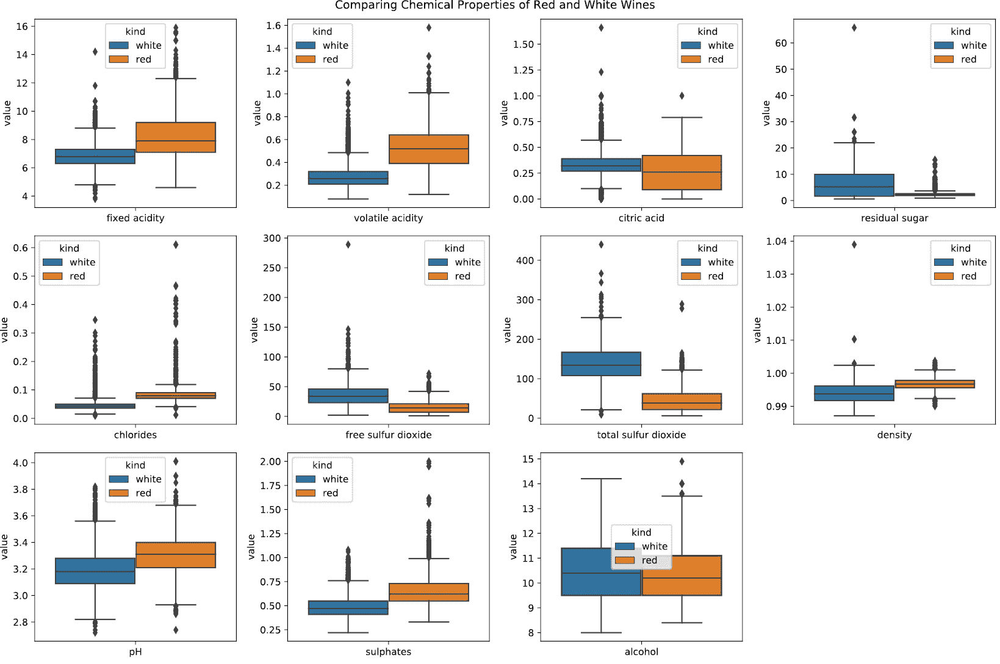
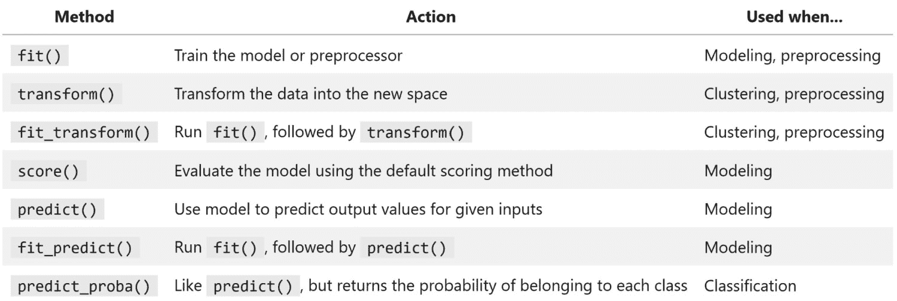

# 第十章：*第九章*：在 Python 中入门机器学习

本章将让我们了解机器学习的术语及其常见任务。之后，我们将学习如何准备数据以供机器学习模型使用。我们已经讨论过数据清洗，但仅限于供人类使用——机器学习模型需要使用`scikit-learn`构建预处理管道，以简化这一过程，因为我们的模型好坏取决于其训练的数据。

接下来，我们将讲解如何使用`scikit-learn`构建模型并评估其表现。Scikit-learn 具有非常友好的 API，因此一旦我们了解如何构建一个模型，就能构建任意数量的模型。我们不会深入探讨模型背后的数学原理，因为这方面有专门的书籍， 本章的目标是作为该主题的入门介绍。到本章结束时，我们将能够识别我们希望解决的是什么问题，以及可以帮助我们的算法类型，并且如何实现它们。

本章将涵盖以下主题：

+   机器学习领域概览

+   使用前几章学习的技能进行探索性数据分析

+   预处理数据以便用于机器学习模型

+   使用聚类帮助理解无标签数据

+   学习回归何时合适以及如何使用 scikit-learn 实现回归

+   理解分类任务并学习如何使用逻辑回归

# 本章材料

在本章中，我们将使用三个数据集。前两个数据集来自于 UCI 机器学习数据集库（[`archive.ics.uci.edu/ml/index.php`](http://archive.ics.uci.edu/ml/index.php)）提供的关于葡萄酒质量的数据，这些数据由 P. Cortez、A. Cerdeira、F. Almeida、T. Matos 和 J. Reis 捐赠，其中包含了不同葡萄酒样本的化学性质信息，以及来自葡萄酒专家盲测小组对其质量的评分。这些文件可以在 GitHub 仓库中本章文件夹下的`data/`文件夹中找到，分别为红葡萄酒和白葡萄酒的`winequality-red.csv`和`winequality-white.csv`。

我们的第三个数据集是使用开放系外行星目录（Open Exoplanet Catalogue）数据库收集的，您可以在[`github.com/OpenExoplanetCatalogue/open_exoplanet_catalogue/`](https://github.com/OpenExoplanetCatalogue/open_exoplanet_catalogue/)找到该数据库。该数据库提供了在`planet_data_collection.ipynb`笔记本中的数据，GitHub 上包含了用于将这些信息解析为 CSV 文件的代码，我们将在本章中使用这些文件；虽然我们不会详细讨论这部分内容，但我鼓励您去查看它。数据文件也可以在`data/`文件夹中找到。我们将在本章中使用`planets.csv`，不过为进行练习和进一步探索，还提供了其他层级的解析数据。这些文件包括`binaries.csv`（包含双星的数据）、`stars.csv`（包含单颗星的数据）和`systems.csv`（包含行星系统的数据）。

我们将使用`red_wine.ipynb`笔记本来预测红酒质量，使用`wine.ipynb`笔记本根据红酒的化学特性将其分类为红酒或白酒，使用`planets_ml.ipynb`笔记本构建回归模型来预测行星的年长度，并进行聚类分析以找到相似的行星群体。我们将使用`preprocessing.ipynb`笔记本进行预处理部分的工作。

回到*第一章*，*数据分析导论*，当我们设置环境时，我们安装了一个来自 GitHub 的名为`ml_utils`的包。这个包包含了我们将在接下来的三章机器学习中使用的工具函数和类。与前两章不同，我们不会讨论如何构建这个包；不过，感兴趣的人可以浏览[`github.com/stefmolin/ml-utils/tree/2nd_edition`](https://github.com/stefmolin/ml-utils/tree/2nd_edition)中的代码，并按照*第七章*，*金融分析——比特币与股市*，中的说明，以可编辑模式安装它。

以下是数据源的参考链接：

+   *开放系外行星目录（Open Exoplanet Catalogue）数据库*，可在[`github.com/OpenExoplanetCatalogue/open_exoplanet_catalogue/#data-structure`](https://github.com/OpenExoplanetCatalogue/open_exoplanet_catalogue/#data-structure)找到。

+   *P. Cortez, A. Cerdeira, F. Almeida, T. Matos 和 J. Reis. 通过数据挖掘物理化学特性来建模葡萄酒偏好. 见《决策支持系统》，Elsevier，47(4):547-553, 2009.* 该文档可在线查看：[`archive.ics.uci.edu/ml/datasets/Wine+Quality`](http://archive.ics.uci.edu/ml/datasets/Wine+Quality)。

+   *Dua, D. 和 Karra Taniskidou, E. (2017). UCI 机器学习库 [*[`archive.ics.uci.edu/ml/index.php`](http://archive.ics.uci.edu/ml/index.php)*]。加利福尼亚州尔湾：加利福尼亚大学信息与计算机科学学院。*

# 机器学习概览

**机器学习**是**人工智能**（**AI**）的一个子集，其中算法可以从输入数据中学习预测值，而无需明确教授规则。这些算法依赖统计学进行推断，并在学习过程中使用所学内容来做出预测。

申请贷款、使用搜索引擎、通过语音命令让机器人吸尘器清洁特定房间——机器学习在我们周围随处可见。这是因为它可以用于许多目的，例如 AI 助手（如 Alexa、Siri 或 Google Assistant）的语音识别、通过探索周围环境绘制楼层图、判断谁会违约贷款、确定哪些搜索结果相关，甚至进行绘画（[`www.boredpanda.com/computer-deep-learning-algorithm-painting-masters/`](https://www.boredpanda.com/computer-deep-learning-algorithm-painting-masters/))。

机器学习模型可以随着时间的推移适应输入的变化，并且在做出决策时，减少每次都需要人工干预的情况。想象一下申请贷款或信用卡额度提升；银行或信用卡公司会依赖机器学习算法，查看申请人的信用评分及历史记录，以确定是否批准申请。很可能，只有当模型预测出申请人有较高的可信度时，银行才会在此时批准申请。如果模型不能做出如此确定的判断，则可以将决策交给人工处理。这减少了员工需要筛选的申请数量，确保只有边缘案例需要人工处理，同时也能为非边缘案例提供更快的响应（处理过程几乎可以瞬时完成）。

这里需要特别提到的一点是，用于贷款批准等任务的模型，根据法律规定，必须具备可解释性。必须有一种方式向申请人解释他们被拒绝的原因——有时，技术之外的原因可能会影响和限制我们使用的方案或数据。

## 机器学习的类型

机器学习通常分为三类：无监督学习、监督学习和强化学习。当我们没有标签数据指示每个数据点应对应的模型输出时，我们使用**无监督学习**。在许多情况下，收集标签数据成本高昂或根本不可行，因此会使用无监督学习。需要注意的是，优化这些模型的性能更为困难，因为我们不知道它们的表现如何。如果我们可以访问标签数据，就可以使用**监督学习**；这使得评估和改进我们的模型变得更加容易，因为我们可以根据模型与真实标签的比较来计算其性能指标。

提示

由于无监督学习旨在从数据中找到意义，而不依赖正确答案，它可以在数据分析过程中或在进行有监督学习之前用于更好地理解数据。

**强化学习**关注的是如何对来自环境的反馈做出反应；这通常用于机器人和游戏中的人工智能等应用。尽管这一部分超出了本书的范围，但在*进一步阅读*部分有相关资源可以获取更多信息。

请注意，并非所有的机器学习方法都可以完全归入上述类别。例如，**深度学习**旨在使用**神经网络**等方法学习数据表示。深度学习方法通常被视为“黑箱”，这使得它们在某些需要可解释模型的领域中的应用受限；然而，它们已被广泛应用于语音识别和图像分类等任务中。深度学习超出了本书的讨论范围，但了解它也是机器学习的一部分是很有帮助的。

重要提示

可解释机器学习是当前一个活跃的研究领域。有关更多信息，请查看*进一步阅读*部分的资源。

## 常见任务

最常见的机器学习任务有聚类、分类和回归。在**聚类**中，我们希望将数据划分为不同的组，目标是确保组内的数据密切相关且组与组之间相互分离。聚类可以以无监督的方式进行，以帮助更好地理解数据，或者以有监督的方式进行，尝试预测数据属于哪个组（本质上是分类）。需要注意的是，聚类也可以用于无监督的预测；然而，我们仍然需要解读每个簇的含义。从聚类中获得的标签甚至可以作为有监督学习的输入，帮助模型学习如何将观察结果映射到各个组，这种方法被称为**半监督学习**。

**分类**，如我们在上一章所讨论的，旨在为数据分配一个类标签，例如*良性*或*恶意*。这听起来像是将数据分配到某个簇中，然而，我们并不关心被标为*良性*的数据之间的相似度，只需要将它们标记为*良性*。由于我们是将数据分配到某个类别或类中，因此这类模型用于预测离散标签。而**回归**则是用于预测数值型数据，例如房价或图书销量；它用于建模变量之间的关系强度和大小。两者都可以作为无监督或有监督学习来进行；然而，有监督模型通常表现得更好。

## Python 中的机器学习

现在我们知道了什么是机器学习，接下来我们需要了解如何构建自己的模型。Python 提供了许多用于构建机器学习模型的包；我们需要关注的一些库包括以下内容：

+   `scikit-learn`：易于使用（也容易学习），它提供了一个一致的 Python 机器学习 API（[`scikit-learn.org/stable/index.html`](https://scikit-learn.org/stable/index.html)）

+   `statsmodels`：一个统计建模库，提供统计测试功能（[`www.statsmodels.org/stable/index.html`](https://www.statsmodels.org/stable/index.html)）

+   `tensorflow`：由 Google 开发的机器学习库，具有更快的计算速度（[`www.tensorflow.org/`](https://www.tensorflow.org/)）

+   `keras`：用于运行深度学习的高级 API，支持如 TensorFlow 等库（[`keras.io/`](https://keras.io/)）

+   `pytorch`：由 Facebook 开发的深度学习库（[`pytorch.org`](https://pytorch.org)）

    提示

    这些库大多数使用了 NumPy 和 SciPy，SciPy 是基于 NumPy 构建的一个库，用于统计学、数学和工程目的。SciPy 可以用于处理线性代数、插值、积分和聚类算法等内容。更多关于 SciPy 的信息可以在[`docs.scipy.org/doc/scipy/reference/tutorial/general.html`](https://docs.scipy.org/doc/scipy/reference/tutorial/general.html)找到。

在本书中，我们将使用`scikit-learn`，因为它的 API 用户友好。在`scikit-learn`中，我们的基类是`fit()`方法。我们使用`transform()`方法—将数据转换为可以由`predict()`方法使用的形式。`score()`方法也是常用的。仅了解这四个方法，我们就能轻松构建`scikit-learn`提供的任何机器学习模型。有关该设计模式的更多信息，请参考[`scikit-learn.org/stable/developers/develop.html`](https://scikit-learn.org/stable/developers/develop.html)。

# 探索性数据分析

正如我们在本书中学到的那样，第一步应该进行一些**探索性数据分析**（**EDA**），以便熟悉我们的数据。为了简洁起见，本节将包括每个笔记本中可用的 EDA 的一个子集—请确保查看相关笔记本，以获取完整版本。

提示

虽然我们将使用`pandas`代码来执行 EDA，但也请查看`pandas-profiling`包（[`github.com/pandas-profiling/pandas-profiling`](https://github.com/pandas-profiling/pandas-profiling)），它可以通过交互式 HTML 报告快速执行数据的初步 EDA。

让我们从导入库开始，这将在本章中我们使用的所有笔记本中保持一致：

```py
>>> %matplotlib inline
>>> import matplotlib.pyplot as plt
>>> import numpy as np
>>> import pandas as pd
>>> import seaborn as sns
```

我们将在进行行星数据分析之前，首先对红酒质量数据进行探索性数据分析（EDA）。

## 红酒质量数据

让我们读取红酒数据并利用本书中学到的技巧进行一些 EDA：

```py
>>> red_wine = pd.read_csv('data/winequality-red.csv')
```

我们有关于红酒的 11 种不同化学属性的数据，以及一个列出参与盲品测试的酒类专家评分的列。我们可以通过观察这些化学属性来预测质量评分：


图 9.1 – 红葡萄酒数据集

让我们看看`quality`列的分布情况：

```py
>>> def plot_quality_scores(df, kind):
...     ax = df.quality.value_counts().sort_index().plot.barh(
...         title=f'{kind.title()} Wine Quality Scores',
...         figsize=(12, 3)
...     ) 
...     ax.axes.invert_yaxis()
...     for bar in ax.patches:
...         ax.text(
...             bar.get_width(),
...             bar.get_y() + bar.get_height()/2,
...             f'{bar.get_width()/df.shape[0]:.1%}',
...             verticalalignment='center'
...         )
...     plt.xlabel('count of wines')
...     plt.ylabel('quality score')
...  
...     for spine in ['top', 'right']:
...         ax.spines[spine].set_visible(False)
... 
...     return ax
>>> plot_quality_scores(red_wine, 'red')
```

数据集中的信息显示`quality`评分从 0（非常差）到 10（非常好）不等；然而，我们的数据中只有这个范围中间的值。对于这个数据集，一个有趣的任务是看我们是否能预测高质量的红葡萄酒（质量评分为 7 或更高）：


](img/Figure_9.2_B16834.jpg)

图 9.2 – 红葡萄酒质量评分分布

所有数据都是数值型数据，所以我们不需要担心处理文本值；并且数据中没有缺失值：

```py
>>> red_wine.info()
<class 'pandas.core.frame.DataFrame'>
RangeIndex: 1599 entries, 0 to 1598
Data columns (total 12 columns):
 #   Column                Non-Null Count  Dtype  
---  ------                --------------  -----  
 0   fixed acidity         1599 non-null   float64
 1   volatile acidity      1599 non-null   float64
 2   citric acid           1599 non-null   float64
 3   residual sugar        1599 non-null   float64
 4   chlorides             1599 non-null   float64
 5   free sulfur dioxide   1599 non-null   float64
 6   total sulfur dioxide  1599 non-null   float64
 7   density               1599 non-null   float64
 8   pH                    1599 non-null   float64
 9   sulphates             1599 non-null   float64
 10  alcohol               1599 non-null   float64
 11  quality               1599 non-null   int64  
dtypes: float64(11), int64(1)
memory usage: 150.0 KB
```

我们可以使用`describe()`来了解每一列数据的尺度：

```py
>>> red_wine.describe()
```

结果表明，如果我们的模型使用任何距离度量方法，我们肯定需要对数据进行缩放，因为我们的各列数据范围不一致：


](img/Figure_9.3_B16834.jpg)

图 9.3 – 红葡萄酒数据集的总结统计

最后，让我们使用`pd.cut()`将高质量的红葡萄酒（大约占数据的 14%）分箱，方便后续使用：

```py
>>> red_wine['high_quality'] = pd.cut(
...     red_wine.quality, bins=[0, 6, 10], labels=[0, 1]
... )
>>> red_wine.high_quality.value_counts(normalize=True)
0    0.86429
1    0.13571
Name: high_quality, dtype: float64
```

重要说明

为了简洁起见，我们在此停止了 EDA（探索性数据分析）；然而，在尝试任何建模之前，我们应该确保充分探索数据，并咨询领域专家。特别需要注意的一点是变量之间的相关性以及我们试图预测的目标（在此案例中是高质量的红酒）。与目标变量（高质量红酒）有强相关性的变量可能是模型中很好的特征。然而，请注意，相关性并不意味着因果关系。我们已经学到了几种使用可视化来查找相关性的方法：我们在*第五章*《使用 Pandas 和 Matplotlib 进行数据可视化》中讨论过的散点矩阵，以及在*第六章*《使用 Seaborn 和定制化技巧绘图》中的热力图和对比图。对比图已包含在`red_wine.ipynb`笔记本中。

## 白葡萄酒和红葡萄酒的化学性质数据

现在，让我们将红葡萄酒和白葡萄酒的数据一起查看。由于数据来自不同的文件，我们需要读取两个文件并将其合并为一个数据框。白葡萄酒文件实际上是分号（`;`）分隔的，因此我们必须在`pd.read_csv()`中提供`sep`参数：

```py
>>> red_wine = pd.read_csv('data/winequality-red.csv')
>>> white_wine = \
...     pd.read_csv('data/winequality-white.csv', sep=';')
```

我们还可以查看白葡萄酒的质量评分，就像我们查看红葡萄酒一样，我们会发现白葡萄酒的评分普遍较高。这可能让我们质疑评委是否更偏好白葡萄酒，从而在评分中产生偏差。就目前而言，所使用的评分系统似乎相当主观：


](img/Figure_9.4_B16834.jpg)

图 9.4 – 白葡萄酒质量评分分布

这两个数据框具有相同的列，因此我们可以直接合并它们。在这里，我们使用`pd.concat()`将白葡萄酒数据叠加在红葡萄酒数据之上，并在添加一个列以标识每个观测所属的葡萄酒类型后进行操作：

```py
>>> wine = pd.concat([
...     white_wine.assign(kind='white'),
...     red_wine.assign(kind='red')
... ])
>>> wine.sample(5, random_state=10)
```

就像我们处理红葡萄酒数据集一样，我们可以运行`info()`来检查是否需要执行类型转换或是否有任何缺失数据；幸运的是，这里我们也不需要。我们的组合葡萄酒数据集如下所示：


图 9.5 – 组合葡萄酒数据集

使用`value_counts()`，我们可以看到数据中白葡萄酒比红葡萄酒多得多：

```py
>>> wine.kind.value_counts()
white    4898
red      1599
Name: kind, dtype: int64
```

最后，让我们使用`seaborn`来查看每种化学性质按葡萄酒类型分组的箱线图。这可以帮助我们识别在建立区分红葡萄酒和白葡萄酒模型时将有帮助的**特征**（模型输入）：

```py
>>> import math
>>> chemical_properties = [col for col in wine.columns
...                        if col not in ['quality', 'kind']]
>>> melted = \
...     wine.drop(columns='quality').melt(id_vars=['kind'])
>>> fig, axes = plt.subplots(
...     math.ceil(len(chemical_properties) / 4), 4, 
...     figsize=(15, 10)
... )
>>> axes = axes.flatten()
>>> for prop, ax in zip(chemical_properties, axes):
...     sns.boxplot(
...         data=melted[melted.variable.isin([prop])], 
...         x='variable', y='value', hue='kind', ax=ax
...     ).set_xlabel('')
>>> for ax in axes[len(chemical_properties):]:
...     ax.remove() # remove the extra subplots
>>> plt.suptitle(
...     'Comparing Chemical Properties of Red and White Wines'
... )
>>> plt.tight_layout()
```

根据以下结果，我们可能会考虑在构建模型时使用固定酸度、挥发性酸度、总二氧化硫和硫酸盐，因为它们在红葡萄酒和白葡萄酒中的分布似乎不同：



图 9.6 – 在化学水平上比较红葡萄酒和白葡萄酒

提示

比较不同类别之间变量的分布可以帮助我们选择模型的特征。如果我们发现某个变量在不同类别之间的分布非常不同，那么这个变量可能非常有用并应该包含在我们的模型中。在进行建模之前，我们必须对数据进行深入探索。一定要使用我们在*第五章*中介绍的可视化工具，*使用 Pandas 和 Matplotlib 可视化数据*，以及*第六章*，*使用 Seaborn 和自定义技术绘图*，因为它们对这个过程非常有价值。

当我们检查模型犯的错误预测时，我们将在*第十章*中回到这个可视化，*做出更好的预测 – 优化模型*。现在，让我们看看我们将要处理的另一个数据集。

## 行星和外行星数据

**外行星**简单地是指绕着我们太阳系之外的恒星运转的行星，因此从现在开始我们将统称它们为**行星**。现在让我们读取我们的行星数据：

```py
>>> planets = pd.read_csv('data/planets.csv')
```

我们可以根据它们的轨道找到相似行星的聚类，并尝试预测轨道周期（行星一年有多长，以地球日计算）：


图 9.7 – 行星数据集

我们可以构建相关矩阵热力图来帮助找到最佳特征：

```py
>>> fig = plt.figure(figsize=(7, 7))
>>> sns.heatmap(
...     planets.drop(columns='discoveryyear').corr(), 
...     center=0, vmin=-1, vmax=1, square=True, annot=True,
...     cbar_kws={'shrink': 0.8}
... )
```

热力图显示，行星轨道的半长轴与其周期的长度高度正相关，这是有道理的，因为半长轴（以及离心率）有助于定义行星围绕恒星的轨道路径：


图 9.8 – 行星数据集特征间的相关性

为了预测`period`，我们可能需要观察`semimajoraxis`、`mass`和`eccentricity`。轨道的离心率量化了轨道与完美圆形的偏离程度：


图 9.9 – 理解离心率

让我们看看我们所拥有的轨道形状：

```py
>>> planets.eccentricity.min(), planets.eccentricity.max()
(0.0, 0.956) # circular and elliptical eccentricities
>>> planets.eccentricity.hist()
>>> plt.xlabel('eccentricity')
>>> plt.ylabel('frequency')
>>> plt.title('Orbit Eccentricities')
```

看起来几乎所有的轨道都是椭圆形的，这是我们预期的，因为这些是行星：


图 9.10 – 轨道离心率的分布

椭圆是一个拉长的圆形，具有两个轴：*长轴*和*短轴*，分别是最长和最短的轴。半长轴是长轴的一半。与圆形相比，轴类似于直径，穿过整个形状，而半轴类似于半径，是直径的一半。以下是当行星围绕一颗位于其椭圆轨道中心的恒星运行时的情况（由于其他天体的引力，实际情况是恒星可以位于轨道路径中的任何位置）：


图 9.11 – 理解半长轴

现在我们理解了这些列的含义，让我们继续进行更多的探索性数据分析（EDA）。这个数据并不像我们的酒类数据那样干净——当我们能够直接接触到数据时，一切显得更加容易。尽管我们知道大部分的`period`值，我们只拥有一小部分行星的`eccentricity`、`semimajoraxis`或`mass`数据：

```py
>>> planets[[
...     'period', 'eccentricity', 'semimajoraxis', 'mass'
... ]].info()
<class 'pandas.core.frame.DataFrame'>
RangeIndex: 4094 entries, 0 to 4093
Data columns (total 4 columns):
 #   Column         Non-Null Count  Dtype  
---  ------         --------------  -----  
 0   period         3930 non-null   float64
 1   eccentricity   1388 non-null   float64
 2   semimajoraxis  1704 non-null   float64
 3   mass           1659 non-null   float64
dtypes: float64(4)
memory usage: 128.1 KB
```

如果我们丢弃任何一个列为空的数据，那么剩下的将只有大约 30%：

```py
>>> planets[[
...     'period', 'eccentricity', 'semimajoraxis', 'mass'
... ]].dropna().shape
(1222, 4)
```

如果我们仅仅是想找到一种预测年份长度的方法（当我们有这些值时），以便更好地了解它们之间的关系，那么我们不一定需要担心丢弃缺失数据。这里的插补可能会对我们的模型造成更大的负面影响。至少所有数据都已正确编码为十进制数（`float64`）；然而，让我们检查是否需要做一些缩放（如果我们的模型对大小差异敏感，缩放将是有益的）：

```py
>>> planets[[
...     'period', 'eccentricity', 'semimajoraxis', 'mass'
... ]].describe()
```

这向我们展示了，根据我们的模型，我们肯定需要做一些缩放，因为`period`列中的值远大于其他列：


图 9.12 – 行星数据集的总结统计

我们还可以查看一些散点图。注意，存在一个`list`列，表示行星所属的组别，如`太阳系`或`有争议`。我们可能希望查看周期（以及与恒星的距离）是否对其产生影响：

```py
>>> sns.scatterplot(
...     x=planets.semimajoraxis, y=planets.period, 
...     hue=planets.list, alpha=0.5
... )
>>> plt.title('period vs. semimajoraxis')
>>> plt.legend(title='') 
```

这些有争议的行星似乎分布在各处，并且它们的半长轴和周期较大。或许它们之所以有争议，是因为它们距离恒星非常远：


图 9.13 – 行星周期与半长轴

不幸的是，我们可以看到`周期`的尺度使得这张图很难阅读，因此我们可以尝试对*y*-轴进行对数变换，以便在左下角更密集的区域中获得更多的分离。我们这次仅标出太阳系中的行星：

```py
>>> fig, ax = plt.subplots(1, 1, figsize=(10, 10))
>>> in_solar_system = (planets.list == 'Solar System')\
...     .rename('in solar system?')
>>> sns.scatterplot(
...     x=planets.semimajoraxis, y=planets.period, 
...     hue=in_solar_system, ax=ax
... )
>>> ax.set_yscale('log')
>>> solar_system = planets[planets.list == 'Solar System']
>>> for planet in solar_system.name:
...     data = solar_system.query(f'name == "{planet}"')
...     ax.annotate(
...         planet, 
...         (data.semimajoraxis, data.period), 
...         (7 + data.semimajoraxis, data.period),
...         arrowprops=dict(arrowstyle='->')
...     )
>>> ax.set_title('log(orbital period) vs. semi-major axis')
```

确实有很多行星藏在图表的左下角。现在，我们可以看到许多行星的年周期比水星的 88 地球年还要短：


图 9.14 – 我们的太阳系与外行星的对比

既然我们对将要使用的数据有了一些了解，让我们学习如何为机器学习模型准备这些数据。

# 数据预处理

在这一部分，我们将在`preprocessing.ipynb`笔记本中工作，然后再返回到用于 EDA 的笔记本。我们将从导入库和读取数据开始：

```py
>>> import numpy as np
>>> import pandas as pd
>>> planets = pd.read_csv('data/planets.csv')
>>> red_wine = pd.read_csv('data/winequality-red.csv')
>>> wine = pd.concat([
...     pd.read_csv(
...         'data/winequality-white.csv', sep=';'
...     ).assign(kind='white'), 
...     red_wine.assign(kind='red')
... ])
```

机器学习模型遵循“垃圾进，垃圾出”的原则。我们必须确保在最优版本的数据上**训练**我们的模型（让它学习）。这意味着什么将取决于我们选择的模型。例如，使用距离度量来计算观测值相似度的模型，如果我们的特征尺度差异很大，容易混淆。除非我们正在处理**自然语言处理**（**NLP**）问题，试图理解单词的意义，否则我们的模型对文本值没有用处——甚至无法解释它们。缺失或无效数据也会造成问题；我们必须决定是丢弃它们还是填补它们。我们在将数据提供给模型学习之前所做的所有调整统称为**数据预处理**。

## 训练集与测试集

到目前为止，机器学习听起来相当不错——我们可以构建一个模型来学习为我们执行任务。那么，应该将所有数据都提供给它，让它学得更好，对吗？不幸的是，事情并没有那么简单。如果我们将所有数据提供给模型，就有可能导致**过拟合**，意味着它将无法很好地推广到新的数据点，因为它是针对样本而不是总体进行拟合的。另一方面，如果我们不给模型足够的数据，它将**欠拟合**，无法捕捉数据中的潜在信息。

提示

当一个模型适应数据中的随机性时，我们称它为适应数据中的**噪声**。

另一个需要考虑的问题是，如果我们用所有数据来训练模型，我们该如何评估其性能呢？如果我们在用于训练的数据上进行测试，我们会高估模型的表现，因为模型总是在训练数据上表现得更好。因此，必须将数据分成**训练集**和**测试集**。为了做到这一点，我们可以将数据框进行洗牌，并选择前 *x*% 的行作为训练集，其余部分作为测试集：

```py
shuffled = \
    planets.reindex(np.random.permutation(planets.index))
train_end_index = int(np.ceil(shuffled.shape[0] * .75))
training = shuffled.iloc[:train_end_index,]
testing = shuffled.iloc[train_end_index:,]
```

这样做是可行的，但每次都要写这么多内容确实有些麻烦。幸运的是，`scikit-learn` 在 `model_selection` 模块中为我们提供了 `train_test_split()` 函数，这是一个更加稳健、易于使用的解决方案。它要求我们事先将输入数据（`X`）和输出数据（`y`）分开。在这里，我们将选择 75% 的数据作为训练集（`X_train`，`y_train`），剩下的 25% 用于测试集（`X_test`，`y_test`）。我们将设置一个随机种子（`random_state=0`），以确保数据拆分是可重复的：

```py
>>> from sklearn.model_selection import train_test_split
>>> X = planets[['eccentricity', 'semimajoraxis', 'mass']]
>>> y = planets.period
>>> X_train, X_test, y_train, y_test = train_test_split(
...     X, y, test_size=0.25, random_state=0
... )
```

虽然没有明确的标准来定义测试集的理想大小，但通常的经验法则是占数据的 10% 到 30%。不过，如果我们的数据量较少，我们会选择 10% 的测试集，以确保有足够的数据用于学习。相反，如果数据量很大，我们可能会选择 30% 作为测试集，因为我们不仅不希望出现过拟合，还希望给模型提供足够的数据来证明它的价值。需要注意的是，这条经验法则有一个重大警告：我们使用的训练数据越多，回报递减越明显。如果我们有大量数据，可能会用不到 70% 的数据进行训练，因为计算成本可能会大幅上升，而改进幅度却微乎其微，甚至可能导致过拟合的风险增加。

重要提示

在构建需要调优的模型时，我们将数据分成训练集、验证集和测试集。我们将在*第十章*中介绍验证集内容，*使预测更准确 - 优化模型*。

现在让我们看看训练集和测试集的维度。由于我们使用了三个特征（`eccentricity`，`semimajoraxis`，和 `mass`），`X_train` 和 `X_test` 将有三列。`y_train` 和 `y_test` 每个将只有一列。训练数据中的 `X` 和 `y` 观察值数量将相等，测试集也是如此：

```py
>>> X.shape, y.shape # original data
((4094, 3), (4094,))
>>> X_train.shape, y_train.shape # training data
((3070, 3), (3070,))
>>> X_test.shape, y_test.shape # testing data
((1024, 3), (1024,))
```

`X_train` 和 `X_test` 被返回为数据框，因为我们传递它们时就是这种格式。如果我们直接处理 NumPy 数据，我们将得到 NumPy 数组或 `ndarray` 格式的数据。我们将在 *数据预处理* 部分使用这些数据进行其他示例演示，因此让我们先来看一下 `X_train` 数据框的前五行。现在不用担心 `NaN` 值；我们将在 *填补缺失值* 部分讨论处理这些值的不同方法：

```py
>>> X_train.head()
      eccentricity  semimajoraxis  mass
1390           NaN            NaN   NaN
2837           NaN            NaN   NaN
3619           NaN         0.0701   NaN
1867           NaN            NaN   NaN
1869           NaN            NaN   NaN
```

`y_train`和`y_test`都是序列，因为这就是我们传递给`train_test_split()`函数的内容。如果我们传入的是 NumPy 数组，那我们将得到的是返回的结果。`y_train`和`y_test`中的行必须与`X_train`和`X_test`中的行分别对齐。让我们通过查看`y_train`的前五行来确认这一点：

```py
>>> y_train.head()
1390     1.434742
2837    51.079263
3619     7.171000
1867    51.111024
1869    62.869161
Name: period, dtype: float64
```

确实，一切如预期的那样对齐。请注意，对于我们的葡萄酒模型，我们需要使用分层采样，这也可以通过在`train_test_split()`中传递用于分层的值来完成。我们将在*分类*部分看到这一点。现在，让我们继续进行剩余的预处理工作。

## 缩放和居中数据

我们已经看到我们的数据框中有具有非常不同尺度的列；如果我们想使用任何计算距离度量的模型（例如我们将在本章讨论的 k-means，或者用于标准化（通过计算 Z 分数进行缩放）和最小-最大缩放（将数据规范化为[0, 1]范围）等的`preprocessing`模块）。

重要提示

我们应该检查我们所构建的模型的要求，以查看数据是否需要缩放。

对于标准化缩放，我们使用`StandardScaler`类。`fit_transform()`方法将`fit()`（它计算出将数据居中和缩放所需的均值和标准差）与`transform()`（它将转换应用于数据）结合起来。请注意，当实例化`StandardScaler`对象时，我们可以选择不减去均值或不除以标准差，通过分别将`False`传递给`with_mean`或`with_std`参数。默认情况下，两者都是`True`：

```py
>>> from sklearn.preprocessing import StandardScaler
>>> standardized = StandardScaler().fit_transform(X_train)
# examine some of the non-NaN values
>>> standardized[~np.isnan(standardized)][:30]
array([-5.43618156e-02,  1.43278593e+00,  1.95196592e+00,
        4.51498477e-03, -1.96265630e-01,  7.79591646e-02, 
        ...,
       -2.25664815e-02,  9.91013258e-01, -7.48808523e-01,
       -4.99260165e-02, -8.59044215e-01, -5.49264158e-02])
```

经过此转换后，数据中的`e`表示小数点移动的位置。对于`+`符号，我们将小数点向右移动指定的位数；对于`-`符号，我们将小数点向左移动。因此，`1.00e+00`等同于`1`，`2.89e-02`等同于`0.0289`，而`2.89e+02`等同于`289`。转换后的行星数据大多介于-3 和 3 之间，因为现在所有数据都是 Z 分数。

其他缩放器可以使用相同的语法。让我们使用`MinMaxScaler`类将行星数据转换为范围[0, 1]：

```py
>>> from sklearn.preprocessing import MinMaxScaler
>>> normalized = MinMaxScaler().fit_transform(X_train)
# examine some of the non-NaN values
>>> normalized[~np.isnan(normalized)][:30]
array([2.28055906e-05, 1.24474091e-01, 5.33472803e-01,
       1.71374569e-03, 1.83543340e-02, 1.77824268e-01, 
       ...,
       9.35966714e-04, 9.56961137e-02, 2.09205021e-02, 
       1.50201619e-04, 0.00000000e+00, 6.59028789e-06])
```

提示

另一种选择是`RobustScaler`类，它使用中位数和 IQR 进行抗异常值缩放。笔记本中有这个的示例。更多预处理类可以在[`scikit-learn.org/stable/modules/classes.html#module-sklearn.preprocessing`](https://scikit-learn.org/stable/modules/classes.html#module-sklearn.preprocessing)找到。

## 编码数据

到目前为止，我们讨论的所有缩放器都处理了数值数据的预处理，但我们该如何处理类别数据呢？我们需要将类别编码为整数值。这里有几个选择，取决于类别代表什么。如果我们的类别是二进制的（例如`0`/`1`、`True`/`False`或`yes`/`no`），那么`0`是一个选项，`1`是另一个选项。我们可以通过`np.where()`函数轻松做到这一点。让我们将葡萄酒数据的`kind`字段编码为红酒为`1`，白酒为`0`：

```py
>>> np.where(wine.kind == 'red', 1, 0)
array([0, 0, 0, ..., 1, 1, 1])
```

这实际上是一个告诉我们酒是否为红酒的列。记住，在我们创建`wine`数据框时，我们将红酒数据拼接到了白酒数据的底部，因此`np.where()`将对顶部行返回零，对底部行返回一，就像我们在之前的结果中看到的那样。

提示

我们还可以使用`scikit-learn`的`LabelBinarizer`类来编码`kind`字段。请注意，如果我们的数据实际上是连续的，但我们希望将其视为二进制类别值，我们可以使用`Binarizer`类并提供一个阈值，或者使用`pd.cut()`/`pd.qcut()`。在笔记本中有这些的示例。

如果我们的类别是有序的，我们可能希望分别使用`0`、`1`和`2`。这样做的好处是我们可以使用回归技术来预测质量，或者可以将其作为模型中的特征来预测其他内容；该模型能够利用“高于中等，中等高于低质量”这一事实。我们可以使用`LabelEncoder`类来实现这一点。请注意，标签将根据字母顺序创建，因此按字母顺序排列的第一个类别将是`0`：

```py
>>> from sklearn.preprocessing import LabelEncoder
>>> pd.Series(LabelEncoder().fit_transform(pd.cut(
...     red_wine.quality, 
...     bins=[-1, 3, 6, 10], 
...     labels=['0-3 (low)', '4-6 (med)', '7-10 (high)']
... ))).value_counts()
1    1372
2     217
0      10
dtype: int64
```

重要说明

Scikit-learn 提供了`OrdinalEncoder`类，但我们的数据格式不正确——它期望的是二维数据（如`DataFrame`或`ndarray`对象），而我们这里使用的是一维的`Series`对象。我们仍然需要确保类别事先是按照正确的顺序排列的。

然而，请注意，序数编码可能会导致潜在的数据问题。在我们的示例中，如果高质量葡萄酒现在是`2`，而中等质量葡萄酒是`1`，模型可能会解释为`2 * med = high`。这实际上在不同质量等级之间隐性地创建了关联，这可能是我们不认同的。

另一种更安全的方法是执行`is_low`和`is_med`，这两个变量仅取`0`或`1`。通过这两个变量，我们可以自动知道酒的质量是否很高（当`is_low` = `is_med` = `0`时）。这些被称为`1`，该行属于该组；在我们关于葡萄酒质量类别的示例中，如果`is_low`为`1`，则该行属于低质量组。这可以通过`pd.get_dummies()`函数和`drop_first`参数来实现，后者会移除冗余列。

让我们使用独热编码对行星数据中的 `list` 列进行编码，因为这些类别没有固有的顺序。在进行任何转换之前，先看一下我们数据中的列表：

```py
>>> planets.list.value_counts()
Confirmed planets                    3972
Controversial                          97
Retracted planet candidate             11
Solar System                            9
Kepler Objects of Interest              4
Planets in binary systems, S-type       1
Name: list, dtype: int64
```

如果我们希望将行星列表包含到我们的模型中，可以使用 `pd.get_dummies()` 函数创建虚拟变量：

```py
>>> pd.get_dummies(planets.list).head()
```

这会将我们的单一序列转换为以下数据框架，其中虚拟变量按数据中出现的顺序创建：


图 9.15 – 独热编码

正如我们之前讨论的那样，这些列中的一个是多余的，因为其余列的值可以用来推断多余列的值。一些模型可能会受到这些列之间高相关性的显著影响（这就是 `drop_first` 参数的作用）：

```py
>>> pd.get_dummies(planets.list, drop_first=True).head()
```

注意到先前结果中的第一列已经被删除，但我们仍然可以确定，除了最后一行外，其他行都在`确认的行星`列表中：


图 9.16 – 在独热编码后删除冗余列

请注意，我们可以通过使用 `LabelBinarizer` 类及其 `fit_transform()` 方法在行星列表上得到类似的结果。这不会删除冗余特征，因此我们再次可以看到第一列属于确认行星列表，在以下结果中以粗体显示：

```py
>>> from sklearn.preprocessing import LabelBinarizer
>>> LabelBinarizer().fit_transform(planets.list)
array([[1, 0, 0, 0, 0, 0],
       [1, 0, 0, 0, 0, 0], 
       [1, 0, 0, 0, 0, 0],
       ..., 
       [1, 0, 0, 0, 0, 0],
       [1, 0, 0, 0, 0, 0],
       [1, 0, 0, 0, 0, 0]])
```

重要说明

Scikit-learn 提供了 `OneHotEncoder` 类，但我们的数据格式不正确——它期望数据以 2D 数组的形式出现，而我们的数据是 1D 的。我们将在*附加转换器*部分看到如何使用这个类的示例。

## 填充

我们已经知道行星数据中有一些缺失值，因此让我们讨论 `scikit-learn` 提供的几种处理缺失值的选项，这些选项可以在 `impute` 模块中找到：用某个值填充（使用常数或汇总统计）、根据相似观察值填充，以及指示缺失的部分。

回到*探索性数据分析*部分，我们对我们计划建模的行星数据使用了 `dropna()`。假设我们不想删除这些数据，而是希望尝试填充缺失值。我们的数据最后几行在 `semimajoraxis` 列上有缺失值：

```py
>>> planets[['semimajoraxis', 'mass', 'eccentricity']].tail()
      semimajoraxis    mass  eccentricity
4089        0.08150  1.9000         0.000
4090        0.04421  0.7090         0.038
4091            NaN  0.3334         0.310
4092            NaN  0.4000         0.270
4093            NaN  0.4200         0.160
```

我们可以使用 `SimpleImputer` 类来填充这些缺失值，默认情况下将使用均值进行填充：

```py
>>> from sklearn.impute import SimpleImputer
>>> SimpleImputer().fit_transform(
...     planets[['semimajoraxis', 'mass', 'eccentricity']]
... )
array([[ 1.29      , 19.4       ,  0.231     ],
       [ 1.54      , 11.2       ,  0.08      ],
       [ 0.83      ,  4.8       ,  0.        ],
       ...,
       [ 5.83796389,  0.3334    ,  0.31      ],
       [ 5.83796389,  0.4       ,  0.27      ],
       [ 5.83796389,  0.42      ,  0.16      ]])
```

平均值似乎不是一个好的策略，因为我们知道的行星可能有一些共同点，显然像行星属于哪个系统及其轨道等特征，可以作为缺失数据点的好指示符。我们可以选择为`strategy`参数提供除均值之外的方法；当前，它可以是`median`（中位数）、`most_frequent`（最频繁值）或`constant`（指定值通过`fill_value`）。这些方法对我们来说都不太合适；然而，`scikit-learn`还提供了`KNNImputer`类，用于基于相似的观察值填充缺失值。默认情况下，它使用五个最近的邻居，并运行 k-NN 算法，我们将在*第十章*《做出更好的预测——优化模型》中讨论这一点，使用那些没有缺失的特征。

```py
>>> from sklearn.impute import KNNImputer
>>> KNNImputer().fit_transform(
...     planets[['semimajoraxis', 'mass', 'eccentricity']]
... )
array([[ 1.29    , 19.4     ,  0.231   ],
       [ 1.54    , 11.2     ,  0.08    ],
       [ 0.83    ,  4.8     ,  0.      ],
       ...,
       [ 0.404726,  0.3334  ,  0.31    ],
       [ 0.85486 ,  0.4     ,  0.27    ],
       [ 0.15324 ,  0.42    ,  0.16    ]])
```

注意，底部三行的每一行现在都有一个唯一的值填充给半长轴。这是因为质量和偏心率被用来找到相似的行星，并基于这些行星来填充半长轴。虽然这比使用`SimpleImputer`类处理行星数据要好，但填充数据仍然存在风险。

在某些情况下，我们可能更关心的是标记缺失数据的位置，并将其作为我们模型中的一个特征，而不是对数据进行填充。这可以通过`MissingIndicator`类来实现：

```py
>>> from sklearn.impute import MissingIndicator
>>> MissingIndicator().fit_transform(
...     planets[['semimajoraxis', 'mass', 'eccentricity']]
... )
array([[False, False, False],
       [False, False, False],
       [False, False, False],
       ...,
       [ True, False, False],
       [ True, False, False],
       [ True, False, False]])
```

当我们关注我们将讨论的最后一组预处理器时，注意到它们都有一个`fit_transform()`方法，以及`fit()`和`transform()`方法。这种 API 设计决策使得我们很容易了解如何使用新类，也是`scikit-learn`如此容易学习和使用的原因之一——它非常一致。

## 额外的转换器

如果我们想进行数学运算，而不是对数据进行缩放或编码，比如取平方根或对数怎么办？`preprocessing`模块也有一些类可以执行此类操作。虽然有一些类执行特定的转换，例如`QuantileTransformer`类，但我们将重点关注`FunctionTransformer`类，它允许我们提供一个任意的函数来使用：

```py
>>> from sklearn.preprocessing import FunctionTransformer
>>> FunctionTransformer(
...     np.abs, validate=True
... ).fit_transform(X_train.dropna())
array([[0.51   , 4.94   , 1.45   ],
       [0.17   , 0.64   , 0.85   ],
       [0.08   , 0.03727, 1.192  ],
       ...,
       [0.295  , 4.46   , 1.8    ],
       [0.34   , 0.0652 , 0.0087 ],
       [0.3    , 1.26   , 0.5    ]])
```

这里，我们取了每个数字的绝对值。注意`validate=True`参数；`FunctionTransformer`类知道`scikit-learn`模型不会接受`NaN`值、无穷大值或缺失值，因此如果返回这些值，它会抛出一个错误。为此，我们在这里也运行了`dropna()`。

注意，对于缩放、编码、填充和转换数据，所有我们传递的数据都被转换了。如果我们有不同数据类型的特征，可以使用`ColumnTransformer`类在一次调用中将转换映射到一个列（或一组列）：

```py
>>> from sklearn.compose import ColumnTransformer 
>>> from sklearn.impute import KNNImputer
>>> from sklearn.preprocessing import (
...     MinMaxScaler, StandardScaler
... )
>>> ColumnTransformer([
...     ('impute', KNNImputer(), [0]),
...     ('standard_scale', StandardScaler(), [1]),
...     ('min_max', MinMaxScaler(), [2])
... ]).fit_transform(X_train)[10:15] 
array([[ 0.17      , -0.04747176,  0.0107594 ],
       [ 0.08      , -0.05475873,  0.01508851],
       [ 0.15585591,         nan,  0.13924042],
       [ 0.15585591,         nan,         nan],
       [ 0.        , -0.05475111,  0.00478471]])
```

还有一个`make_column_transformer()`函数，它会为我们命名转换器。我们来创建一个`ColumnTransformer`对象，它将对分类数据和数值数据进行不同的处理：

```py
>>> from sklearn.compose import make_column_transformer
>>> from sklearn.preprocessing import (
...     OneHotEncoder, StandardScaler
... )
>>> categorical = [
...     col for col in planets.columns
...     if col in [
...         'list', 'name', 'description', 
...         'discoverymethod', 'lastupdate'
...     ]
... ]
>>> numeric = [
...     col for col in planets.columns
...     if col not in categorical
... ]
>>> make_column_transformer(
...     (StandardScaler(), numeric),
...     (OneHotEncoder(sparse=False), categorical)
... ).fit_transform(planets.dropna())
array([[ 3.09267587, -0.2351423 , -0.40487424, ...,  
         0.        ,  0.        ],
       [ 1.432445  , -0.24215395, -0.28360905, ...,  
         0.        ,  0.        ],
       [ 0.13665505, -0.24208849, -0.62800218, ...,  
         0.        ,  0.        ],
       ...,
       [-0.83289954, -0.76197788, -0.84918988, ...,  
         1.        ,  0.        ],
       [ 0.25813535,  0.38683239, -0.92873984, ...,  
         0.        ,  0.        ],
       [-0.26827931, -0.21657671, -0.70076129, ...,  
         0.        ,  1.        ]])
```

提示

我们在实例化`OneHotEncoder`对象时传递`sparse=False`，以便我们能看到结果。实际上，我们不需要这样做，因为`scikit-learn`模型知道如何处理 NumPy 稀疏矩阵。

## 构建数据管道

确实，在预处理数据时似乎涉及了很多步骤，并且它们需要按照正确的顺序应用于训练和测试数据——这非常繁琐。幸运的是，`scikit-learn`提供了创建管道的功能，能够简化预处理过程，并确保训练集和测试集以相同的方式处理。这可以避免例如在标准化时计算所有数据的均值，然后再将数据划分为训练集和测试集的情况，这样会创建一个看起来表现更好的模型，而实际表现可能不如预期。

重要提示

当使用来自训练集外部的信息（例如，使用完整数据集计算均值进行标准化）来训练模型时，称为**数据泄漏**。

我们在构建第一个模型之前学习管道，因为管道确保模型正确构建。管道可以包含所有预处理步骤和模型本身。构建管道就像定义步骤并命名它们一样简单：

```py
>>> from sklearn.pipeline import Pipeline
>>> from sklearn.preprocessing import StandardScaler
>>> from sklearn.linear_model import LinearRegression
>>> Pipeline([
...     ('scale', StandardScaler()), ('lr', LinearRegression())
... ])
Pipeline(steps=[('scale', StandardScaler()), 
                ('lr', LinearRegression())])
```

我们不仅限于在模型中使用管道——它们也可以用于其他`scikit-learn`对象，例如`ColumnTransformer`对象。这使得我们能够首先在半长轴数据（索引为`0`的列）上使用 k-NN 填充，然后标准化结果。然后，我们可以将其作为管道的一部分，从而在构建模型时提供巨大的灵活性：

```py
>>> from sklearn.compose import ColumnTransformer 
>>> from sklearn.impute import KNNImputer
>>> from sklearn.pipeline import Pipeline
>>> from sklearn.preprocessing import (
...     MinMaxScaler, StandardScaler
... )
>>> ColumnTransformer([
...     ('impute', Pipeline([
...         ('impute', KNNImputer()),
...         ('scale', StandardScaler())
...     ]), [0]),
...     ('standard_scale', StandardScaler(), [1]),
...     ('min_max', MinMaxScaler(), [2])
... ]).fit_transform(X_train)[10:15]
array([[ 0.13531604, -0.04747176,  0.0107594 ],
       [-0.7257111 , -0.05475873,  0.01508851],
       [ 0.        ,         nan,  0.13924042],
       [ 0.        ,         nan,         nan],
       [-1.49106856, -0.05475111,  0.00478471]])
```

就像`ColumnTransformer`类一样，我们有一个函数，可以在不必命名步骤的情况下为我们创建管道。让我们再创建一个管道，这次我们将使用`make_pipeline()`函数：

```py
>>> from sklearn.pipeline import make_pipeline
>>> make_pipeline(StandardScaler(), LinearRegression())
Pipeline(steps=[('standardscaler', StandardScaler()),
                ('linearregression', LinearRegression())])
```

请注意，步骤已自动命名为类名的小写版本。正如我们将在下一章看到的那样，命名步骤将使得通过名称优化模型参数变得更容易。`scikit-learn` API 的一致性还将使我们能够使用该管道来拟合模型，并使用相同的对象进行预测，这一点我们将在下一节看到。

# 聚类

我们使用聚类将数据点划分为相似点的组。每个组中的点比其他组中的点更像自己组的成员。聚类通常用于推荐系统（想象一下 Netflix 是如何根据其他观看过相似内容的人推荐你观看的内容）和市场细分等任务。

例如，假设我们在一家在线零售商工作，想要对网站用户进行细分以便进行更有针对性的营销工作；我们可以收集关于在网站上花费的时间、页面访问量、浏览过的产品、购买的产品等数据。然后，我们可以让一个无监督的聚类算法找到具有相似行为的用户群体；如果我们划分为三个群体，可以根据每个群体的行为为其命名：


图 9.17 – 将网站用户聚类为三组

由于我们可以使用聚类进行无监督学习，因此我们需要解释创建的群体，然后尝试为每个群体衍生出一个有意义的名称。如果我们的聚类算法在前述的散点图中识别出了这三个群体，我们可能能够做出以下行为观察：

+   **频繁购买的客户（第 0 组）**：购买很多并查看许多产品。

+   **偶尔购买的客户（第 1 组）**：有过一些购买，但少于最常购买的客户。

+   **浏览者（第 2 组）**：访问了网站，但还没有购买任何东西。

一旦识别出这些群体，营销团队就可以针对每个群体采取不同的营销策略；显然，频繁的客户对盈利有更大的贡献，但如果他们已经购买了很多，也许营销预算更应该用来增加偶尔购买的客户的购买量，或者将浏览者转化为偶尔购买的客户。

重要提示

决定要创建多少个群体显然会影响这些群体后续的解释，这意味着这并不是一个简单的决定。在尝试猜测将数据分成多少个群体之前，我们至少应该可视化我们的数据并获得一些领域知识。

另外，如果我们知道某些数据的群体标签用于训练目的，聚类也可以以有监督的方式使用。假设我们收集了关于登录活动的数据，就像在*第八章*中提到的，*基于规则的异常检测*，但我们有一些关于攻击者活动的样本；我们可以为所有活动收集这些数据点，然后使用聚类算法将其分配到有效用户群体或攻击者群体。由于我们有标签，我们可以调整输入变量和/或使用的聚类算法，以最佳方式将这些群体与其真实群体对齐。

## k-means

`scikit-learn` 提供的聚类算法可以在 `cluster` 模块的文档中找到，地址是 [`scikit-learn.org/stable/modules/classes.html#module-sklearn.cluster`](https://scikit-learn.org/stable/modules/classes.html#module-sklearn.cluster)。我们将查看 **k-means**，它通过距离**质心**（簇的中心点）最近的组来迭代地分配点，形成 *k* 个组。由于该模型使用距离计算，因此我们必须事先了解数据的尺度对结果的影响；然后可以决定是否需要对某些列进行缩放。

重要说明

测量空间中点之间距离的方法有很多种。通常情况下，欧几里得距离或直线距离是默认的度量方法；然而，另一种常见的度量是曼哈顿距离，可以被看作是城市街区距离。

当我们将所有行星的周期与半长轴绘制在一起，并使用周期的对数刻度时，我们看到了行星沿弧线的良好分离。我们将使用 k-means 来找出在这条弧线上具有相似轨道的行星组。

### 根据轨道特征分组行星

正如我们在 *数据预处理* 部分讨论的那样，我们可以构建一个管道来缩放数据并建模。在这里，我们的模型将是一个 `KMeans` 对象，它将行星分为八个簇（对应我们太阳系中的行星数量——抱歉，冥王星）。由于 k-means 算法随机选择其初始质心，除非我们指定种子，否则可能会得到不同的聚类结果。因此，我们还提供了 `random_state=0` 以确保可复现性：

```py
>>> from sklearn.cluster import KMeans
>>> from sklearn.pipeline import Pipeline
>>> from sklearn.preprocessing import StandardScaler
>>> kmeans_pipeline = Pipeline([
...     ('scale', StandardScaler()), 
...     ('kmeans', KMeans(8, random_state=0))
... ])
```

一旦我们有了我们的管道，就可以将其拟合到所有数据上，因为我们不打算进行任何预测（在这种情况下）——我们只是想找出相似的行星：

```py
>>> kmeans_data = planets[['semimajoraxis', 'period']].dropna()
>>> kmeans_pipeline.fit(kmeans_data)
Pipeline(steps=[('scale', StandardScaler()),
                ('kmeans', KMeans(random_state=0))])
```

一旦我们将模型拟合到数据上，就可以使用 `predict()` 方法为每个点获取簇标签（使用的是我们之前使用过的数据）。让我们来看看 k-means 所识别的簇：

```py
>>> fig, ax = plt.subplots(1, 1, figsize=(7, 7))
>>> sns.scatterplot(
...     x=kmeans_data.semimajoraxis, 
...     y=kmeans_data.period, 
...     hue=kmeans_pipeline.predict(kmeans_data),
...     ax=ax, palette='Accent'
... )
>>> ax.set_yscale('log')
>>> solar_system = planets[planets.list == 'Solar System']
>>> for planet in solar_system.name:
...     data = solar_system.query(f'name == "{planet}"')
...     ax.annotate(
...         planet, 
...         (data.semimajoraxis, data.period), 
...         (7 + data.semimajoraxis, data.period),
...         arrowprops=dict(arrowstyle='->')
...     )
>>> ax.get_legend().remove()
>>> ax.set_title('KMeans Clusters')
```

水星和金星落入了同一个簇，地球和火星也属于同一簇。木星、土星和天王星分别属于不同的簇，而海王星和冥王星共享一个簇：


图 9.18 – 通过 k-means 算法识别的八个行星簇

我们在这里随意选择了八个聚类，因为这是我们太阳系中的行星数量。理想情况下，我们应该对真实的分组情况有一些领域知识，或者需要选择一个特定的数量。例如，假设我们要将婚礼宾客分配到五张桌子上，以确保他们相处融洽，那么我们的 *k* 就是 5；如果我们可以在用户群体上运行三个营销活动，那么我们的 *k* 就是 3。如果我们无法直观地判断数据中将有多少个组，一条经验法则是尝试观察数的平方根，但这可能会导致不可管理的聚类数量。因此，如果在我们的数据上创建许多 k-means 模型不会太耗时，我们可以使用肘部点方法。

### 用于确定 k 的肘部点方法

**肘部点方法**涉及使用多个不同 *k* 值创建多个模型，并绘制每个模型的**惯性**（**聚类内平方和**）与聚类数量的关系图。我们希望最小化点到其聚类中心的平方距离总和，同时避免创建过多的聚类。

`ml_utils.elbow_point` 模块包含我们的 `elbow_point()` 函数，已在此处复现：

```py
import matplotlib.pyplot as plt
def elbow_point(data, pipeline, kmeans_step_name='kmeans',    
                k_range=range(1, 11), ax=None):
    """
    Plot the elbow point to find an appropriate k for
    k-means clustering.
    Parameters:
        - data: The features to use
        - pipeline: The scikit-learn pipeline with `KMeans`
        - kmeans_step_name: Name of `KMeans` step in pipeline
        - k_range: The values of `k` to try
        - ax: Matplotlib `Axes` to plot on.
    Returns: 
        A matplotlib `Axes` object
    """
    scores = []
    for k in k_range:
        pipeline.named_steps[kmeans_step_name].n_clusters = k
        pipeline.fit(data)
        # score is -1*inertia so we multiply by -1 for inertia
        scores.append(pipeline.score(data) * -1)
    if not ax:
        fig, ax = plt.subplots()
    ax.plot(k_range, scores, 'bo-')
    ax.set_xlabel('k')
    ax.set_ylabel('inertias')
    ax.set_title('Elbow Point Plot')
    return ax
```

让我们使用肘部点方法来找到一个合适的 *k* 值：

```py
>>> from ml_utils.elbow_point import elbow_point
>>> ax = elbow_point(
...     kmeans_data, 
...     Pipeline([
...         ('scale', StandardScaler()), 
...         ('kmeans', KMeans(random_state=0))
...     ])
... )
>>> ax.annotate(
...     'possible appropriate values for k', xy=(2, 900), 
...     xytext=(2.5, 1500), arrowprops=dict(arrowstyle='->')
... )
>>> ax.annotate(
...     '', xy=(3, 3480), xytext=(4.4, 1450), 
...     arrowprops=dict(arrowstyle='->')
... )
```

我们看到收益递减的点是一个合适的*k*值，在这里可能是二或三：


图 9.19 – 解释肘部点图

如果我们只创建两个聚类，我们将行星分为一组包含大多数行星（橙色），另一组位于右上方只有少数几个（蓝色），这些可能是离群点：


图 9.20 – 通过 k-means 方法识别的两个行星聚类

请注意，虽然这可能是一个合适的聚类数量，但它没有提供像之前的尝试那么多的信息。如果我们想了解与我们太阳系中每个行星相似的行星，我们需要使用更大的*k*。

### 解释质心并可视化聚类空间

由于在聚类之前我们已经标准化了数据，因此可以查看模型的`cluster_centers_`属性。蓝色聚类的中心位于(18.9, 20.9)，以（半长轴，周期）格式表示；请记住，这些是 Z 分数，因此这些值与其余数据相差较远。另一方面，橙色聚类的中心位于(-0.035, -0.038)。

让我们构建一个可视化，展示标定输入数据的质心位置以及聚类距离空间（其中点表示到其聚类中心的距离）。首先，我们将在一个更大的图表中设置一个较小的子图布局：

```py
>>> fig = plt.figure(figsize=(8, 6))
>>> outside = fig.add_axes([0.1, 0.1, 0.9, 0.9])
>>> inside = fig.add_axes([0.6, 0.2, 0.35, 0.35])
```

接下来，我们获取输入数据的缩放版本，以及这些数据点与它们所属聚类的质心之间的距离。我们可以使用`transform()`和`fit_transform()`（即先调用`fit()`再调用`transform()`）方法将输入数据转换到聚类距离空间。返回的是 NumPy 的`ndarrays`，其中外部数组中的每个值表示一个点的坐标：

```py
>>> scaled = kmeans_pipeline_2.named_steps['scale']\ 
...     .fit_transform(kmeans_data) 
>>> cluster_distances = kmeans_pipeline_2\
...     .fit_transform(kmeans_data)
```

由于我们知道外部数组中的每个数组将以半长轴作为第一个元素，周期作为第二个元素，因此我们使用`[:,0]`来选择所有半长轴值，使用`[:,1]`来选择所有周期值。这些将作为我们散点图的 *x* 和 *y*。请注意，我们实际上不需要调用`predict()`来获取数据的聚类标签，因为我们想要的是我们用来训练模型的数据的标签；这意味着我们可以使用`KMeans`对象的`labels_`属性：

```py
>>> for ax, data, title, axes_labels in zip(
...     [outside, inside], [scaled, cluster_distances], 
...     ['Visualizing Clusters', 'Cluster Distance Space'], 
...     ['standardized', 'distance to centroid']
... ):
...     sns.scatterplot(
...         x=data[:,0], y=data[:,1], ax=ax, alpha=0.75, s=100,
...         hue=kmeans_pipeline_2.named_steps['kmeans'].labels_
...     )
... 
...     ax.get_legend().remove()
...     ax.set_title(title)
...     ax.set_xlabel(f'semimajoraxis ({axes_labels})')
...     ax.set_ylabel(f'period ({axes_labels})')
...     ax.set_ylim(-1, None)
```

最后，我们在外部图中标注了质心的位置，图中显示了缩放后的数据：

```py
>>> cluster_centers = kmeans_pipeline_2\
...     .named_steps['kmeans'].cluster_centers_
>>> for color, centroid in zip(
...     ['blue', 'orange'], cluster_centers
... ):
...     outside.plot(*centroid, color=color, marker='x')
...     outside.annotate(
...         f'{color} center', xy=centroid, 
...         xytext=centroid + [0, 5], 
...         arrowprops=dict(arrowstyle='->')
...     )
```

在结果图中，我们可以清楚地看到，三个蓝色点与其他点有明显不同，它们是第二个聚类的唯一成员：


图 9.21 – 可视化聚类距离空间中的行星

到目前为止，我们一直在使用`transform()`或组合方法（如`fit_predict()`或`fit_transform()`），但并不是所有模型都支持这些方法。在*回归*和*分类*部分，我们将看到一个略有不同的工作流程。通常，大多数`scikit-learn`对象将根据它们的用途支持以下方法：



图 9.22 – scikit-learn 模型 API 的通用参考

现在我们已经构建了一些模型，准备进行下一步：量化它们的表现。`scikit-learn`中的`metrics`模块包含了用于评估聚类、回归和分类任务的各种度量指标；可以在[`scikit-learn.org/stable/modules/classes.html#module-sklearn.metrics`](https://scikit-learn.org/stable/modules/classes.html#module-sklearn.metrics)查看 API 中列出的函数。接下来我们讨论如何评估一个无监督聚类模型。

## 评估聚类结果

评估我们聚类结果的最重要标准是它们对我们所要做的事情有用；我们使用肘部法则选择了一个合适的*k*值，但这并不像原始模型中的八个聚类那样对我们有用。也就是说，在量化表现时，我们需要选择与我们所做学习类型相匹配的度量指标。

当我们知道数据的真实聚类时，我们可以检查聚类模型是否将数据点正确地归类到真实聚类中。我们模型所给出的聚类标签可能与真实标签不同——唯一重要的是，真实聚类中的点也应该被归为同一聚类。一个这样的指标是**Fowlkes-Mallows 指数**，我们将在章节末的练习中看到它。

在行星数据集上，我们进行了无监督聚类，因为我们没有每个数据点的标签，因此无法评估模型与这些标签的匹配情况。这意味着我们必须使用评估聚类本身方面的指标，比如它们之间的距离和聚类内点的紧密度。我们可以比较多个指标，获得对性能的更全面评估。

一种这样的方法是称为**轮廓系数**，它有助于量化聚类分离度。其计算方法是将聚类中每两点之间距离的均值（*a*）与给定聚类与最接近的不同聚类之间的点距离的均值（*b*）相减，再除以两者中的最大值：


该指标返回的值范围为[-1, 1]，其中-1 表示最差（聚类分配错误），1 表示最佳；值接近 0 则表示聚类重叠。这个数字越高，聚类越明确（分离度越大）：

```py
>>> from sklearn.metrics import silhouette_score
>>> silhouette_score(
...     kmeans_data, kmeans_pipeline.predict(kmeans_data)
... )
0.7579771626036678
```

另一个我们可以用来评估聚类结果的评分是**聚类内距离**（同一聚类内点之间的距离）与**聚类间距离**（不同聚类间点之间的距离）之比，这被称为**Davies-Bouldin 评分**。值越接近零，表示聚类间的分离越好：

```py
>>> from sklearn.metrics import davies_bouldin_score
>>> davies_bouldin_score(
...     kmeans_data, kmeans_pipeline.predict(kmeans_data)
... )
0.4632311032231894 
```

我们将在这里讨论的最后一个无监督聚类指标是**Calinski 和 Harabasz 评分**，或称**方差比准则**，它是聚类内的离散度与聚类间离散度的比值。较高的值表示聚类更为明确（更为分离）：

```py
>>> from sklearn.metrics import calinski_harabasz_score
>>> calinski_harabasz_score(
...     kmeans_data, kmeans_pipeline.predict(kmeans_data)
... )
21207.276781867335
```

要查看`scikit-learn`提供的完整聚类评估指标列表（包括监督聚类）以及何时使用它们，请查阅他们指南中的*聚类性能评估*部分，网址：[`scikit-learn.org/stable/modules/clustering.html#clustering-evaluation`](https://scikit-learn.org/stable/modules/clustering.html#clustering-evaluation)。

# 回归

在行星数据集中，我们希望预测年份的长度，这是一个数值型的变量，因此我们将使用回归。正如本章开头所提到的，回归是一种用于建模自变量（我们的`X`数据）与因变量（通常称为`y`数据）之间关系的强度和大小的技术，我们希望通过这种技术来进行预测。

## 线性回归

Scikit-learn 提供了许多可以处理回归任务的算法，从决策树到线性回归，根据各种算法类别分布在不同模块中。然而，通常最好的起点是线性回归，它可以在`linear_model`模块中找到。在**简单线性回归**中，我们将数据拟合到以下形式的直线上：


这里，epsilon (*ε*)是误差项，betas (*β*)是系数。

重要说明

我们从模型中得到的系数是那些最小化**代价函数**的系数，即最小化观察值(*y*)与模型预测值(*ŷ*，发音为*y-hat*)之间的误差。我们的模型给出了这些系数的估计值，我们将其表示为 （发音为*beta-hat*）。

然而，如果我们想要建模其他关系，我们需要使用**多元线性回归**，它包含多个回归变量：


`scikit-learn`中的线性回归使用**最小二乘法**（**OLS**），该方法得到的系数最小化平方误差之和（即*y*与*ŷ*之间的距离）。这些系数可以通过闭式解法找到，或者通过优化方法估计，例如**梯度下降法**，后者使用负梯度（通过偏导数计算的最陡上升方向）来确定下一个要尝试的系数（有关更多信息，请参见*进一步阅读*部分中的链接）。我们将在*第十一章*中使用梯度下降法，主题为*机器学习中的异常检测*。

重要说明

线性回归对数据做出了一些假设，我们在选择使用这种技术时必须牢记这些假设。它假设残差服从正态分布且同方差，并且没有多重共线性（回归变量之间的高度相关性）。

现在我们对线性回归的工作原理有了些了解，让我们建立一个模型来预测行星的轨道周期。

### 预测行星的年长度

在我们建立模型之前，我们必须从用于预测的列（`semimajoraxis`、`mass`和`eccentricity`）中分离出要预测的列（`period`）：

```py
>>> data = planets[
...     ['semimajoraxis', 'period', 'mass', 'eccentricity']
... ].dropna()
>>> X = data[['semimajoraxis', 'mass', 'eccentricity']]
>>> y = data.period
```

这是一个监督任务。我们希望能够通过行星的半长轴、质量和轨道偏心率来预测一个行星的年长度，并且我们已有大多数行星的周期数据。让我们将数据按 75/25 的比例分为训练集和测试集，以便评估该模型对年长度的预测效果：

```py
>>> from sklearn.model_selection import train_test_split
>>> X_train, X_test, y_train, y_test = train_test_split(
...     X, y, test_size=0.25, random_state=0
... )
```

一旦我们将数据分成训练集和测试集，我们就可以创建并拟合模型：

```py
>>> from sklearn.linear_model import LinearRegression
>>> lm = LinearRegression().fit(X_train, y_train)
```

这个拟合模型可以用来检查估计的系数，也可以用来预测给定一组自变量时因变量的值。我们将在接下来的两节中讨论这两种使用情况。

### 解释线性回归方程

从线性回归模型中得出的方程给出了系数，用以量化变量之间的关系。在尝试解释这些系数时，必须小心，如果我们处理的是多个回归变量的情况。对于多重共线性，我们无法解释这些系数，因为我们无法保持所有其他回归变量不变，以便检查单个回归变量的影响。

幸运的是，我们用于行星数据的回归变量是没有相关性的，正如我们在*探索性数据分析*部分（*图 9.8*）中通过相关矩阵热图所看到的那样。那么，让我们从拟合的线性模型对象中获取截距和系数：

```py
# get intercept
>>> lm.intercept_
-622.9909910671811 
# get coefficients
>>> [(col, coef) for col, coef in 
...  zip(X_train.columns, lm.coef_)]
[('semimajoraxis', 1880.4365990440929),
 ('mass', -90.18675916509196),
 ('eccentricity', -3201.078059333091)] 
```

这给出了我们行星年长度的线性回归模型方程：


为了更完整地解释这一点，我们需要了解所有单位是什么：

+   `period`（年长度）：地球日

+   `semimajoraxis`：**天文单位**（**AUs**）

+   `mass`：木星质量（行星质量除以木星质量）

+   `eccentricity`：无

    提示

    一个天文单位是地球与太阳之间的平均距离，约为 149,597,870,700 米。

这个特定模型中的截距没有任何意义：如果行星的半长轴为零，质量为零，且偏心率为完美圆形，则它的一年将是-623 个地球日。一个行星必须具有非负、非零的周期、半长轴和质量，因此这显然没有意义。然而，我们可以解释其他系数。方程告诉我们，在保持质量和偏心率不变的情况下，增加一个天文单位（AU）到半长轴距离将使一年长度增加 1,880 个地球日。在保持半长轴和偏心率不变的情况下，每增加一个木星质量将使一年长度减少 90.2 个地球日。

从一个完美的圆形轨道（`eccentricity=0`）到一个几乎是抛物线逃逸轨道（`eccentricity=1`），将使一年长度减少 3,201 个地球日；注意，这些数值对于这个项来说是近似值，因为对于抛物线逃逸轨道，行星将永远不会回来，因此这个方程就没有意义了。实际上，如果我们试图在偏心率大于或等于 1 的情况下使用这个方程，我们将进行外推，因为训练数据中没有这样的值。这是外推不起作用的一个明确例子。方程告诉我们，偏心率越大，一年就越短，但一旦偏心率达到 1 或更大，行星就永远不再回来（它们已经达到逃逸轨道），因此一年是无限的。

训练数据中的所有偏心率值都在 0, 1)范围内，因此我们正在进行插值（使用训练数据中的范围预测周期值）。这意味着，只要我们想要预测的行星的偏心率也在[0, 1)范围内，我们就可以使用这个模型进行预测。

### 做出预测

现在我们大致了解了每个回归器的效果，让我们使用模型对测试集中的行星进行年限预测：

```py
>>> preds = lm.predict(X_test)
```

让我们通过绘制实际值和预测值来可视化我们的表现：

```py
>>> fig, axes = plt.subplots(1, 1, figsize=(5, 3))
>>> axes.plot(
...     X_test.semimajoraxis, y_test, 'ob',
...     label='actuals', alpha=0.5
... )
>>> axes.plot(
...     X_test.semimajoraxis, preds, 'or', 
...     label='predictions', alpha=0.5
... )
>>> axes.set(xlabel='semimajoraxis', ylabel='period')
>>> axes.legend()
>>> axes.set_title('Linear Regression Results')
```

预测值似乎与实际值非常接近，并遵循类似的模式：

![图 9.23 – 预测值与实际值


图 9.23 – 预测值与实际值

提示

尝试仅使用`semimajoraxis`回归器来运行此回归。数据可能需要进行一些重塑，但这将展示随着我们添加`eccentricity`和`mass`，性能的改善。在实践中，我们通常需要构建多个模型版本，直到找到一个我们满意的。

我们可以检查它们的相关性，看看我们的模型与真实关系的契合度：

```py
>>> np.corrcoef(y_test, preds)[0][1]
0.9692104355988059
```

我们的预测值与实际值的相关性非常强（相关系数为 0.97）。需要注意的是，相关系数可以告诉我们模型与实际数据是否同步变化；但它无法告诉我们在数量级上是否存在偏差。为此，我们将使用下一节讨论的度量标准。

## 评估回归结果

在评估回归模型时，我们关注的是模型能够捕捉到数据方差的程度，以及预测的准确性。我们可以结合度量标准和可视化方法来评估模型在这两个方面的表现。

### 分析残差

每当我们使用线性回归时，都应当可视化我们的**残差**，即实际值与模型预测值之间的差异；正如我们在*第七章*《金融分析——比特币与股市》中学到的那样，残差应围绕零居中且具有同方差性（即整个数据的方差相似）。我们可以使用核密度估计来评估残差是否围绕零居中，并使用散点图来检查它们是否具有同方差性。

让我们看一下`ml_utils.regression`中的工具函数，它将创建这些子图来检查残差：

```py
import matplotlib.pyplot as plt
import numpy as np
def plot_residuals(y_test, preds):
    """
    Plot residuals to evaluate regression.
    Parameters:
        - y_test: The true values for y
        - preds: The predicted values for y
    Returns:
        Subplots of residual scatter plot and residual KDE
    """
    residuals = y_test – preds
    fig, axes = plt.subplots(1, 2, figsize=(15, 3))
    axes[0].scatter(np.arange(residuals.shape[0]), residuals)
    axes[0].set(xlabel='Observation', ylabel='Residual')
    residuals.plot(kind='kde', ax=axes[1])
    axes[1].set_xlabel('Residual')
    plt.suptitle('Residuals')
    return axes
```

现在，让我们查看这次线性回归的残差：

```py
>>> from ml_utils.regression import plot_residuals
>>> plot_residuals(y_test, preds)
```

看起来我们的预测值没有明显的模式（左侧子图），这是好事；然而，它们并没有完全围绕零对称，且分布有负偏（右侧子图）。这些负残差出现在预测年份长于实际年份时：


图 9.24 – 检查残差

提示

如果我们在残差中发现模式，说明我们的数据不是线性的，这时可视化残差可能会帮助我们规划下一步的操作。这可能意味着需要采用多项式回归或对数据进行对数变换等策略。

### 度量标准

除了检查残差外，我们还应该计算一些指标来评估回归模型。或许最常见的指标是**R²**（读作*R 方*），也叫**决定系数**，它量化了我们能从自变量中预测的因变量方差的比例。它通过从 1 中减去残差平方和与总平方和的比值来计算：


提示

西格玛（*Σ*）表示总和。*y*值的平均值表示为*ȳ*（读作*y-bar*）。预测值表示为*ŷ*（读作*y-hat*）。

该值将在[0, 1]范围内，值越高越好。`scikit-learn`中的`LinearRegression`类对象使用 R2 作为评分方法。因此，我们可以简单地使用`score()`方法来计算它：

```py
>>> lm.score(X_test, y_test)
0.9209013475842684 
```

我们也可以通过`metrics`模块获取 R2 值：

```py
>>> from sklearn.metrics import r2_score
>>> r2_score(y_test, preds)
0.9209013475842684 
```

该模型具有非常好的 R2 值；然而，记住有许多因素会影响周期，比如恒星和其他行星，它们会对相关行星施加引力。尽管有这样的抽象简化，我们的简化方法表现得相当不错，因为行星的轨道周期在很大程度上由必须行驶的距离决定，我们通过使用半长轴数据来考虑这一点。

但是，R2 存在一个问题；我们可以不断增加回归变量，这会使我们的模型变得越来越复杂，同时也会提高 R2 值。我们需要一个可以惩罚模型复杂度的指标。为此，我们有**调整后的 R2**，它只有在新增的回归变量比随机预期的更好时，才会增加：


不幸的是，`scikit-learn`没有提供这个指标；然而，我们可以很容易地自己实现。`ml_utils.regression`模块包含一个计算调整后的 R2 值的函数。让我们来看一下：

```py
from sklearn.metrics import r2_score
def adjusted_r2(model, X, y):
    """
    Calculate the adjusted R².
    Parameters:
        - model: Estimator object with a `predict()` method
        - X: The values to use for prediction.
        - y: The true values for scoring.
    Returns: 
        The adjusted R² score.
    """
    r2 = r2_score(y, model.predict(X))
    n_obs, n_regressors = X.shape
    adj_r2 = \
        1 - (1 - r2) * (n_obs - 1)/(n_obs - n_regressors - 1)
    return adj_r2
```

调整后的 R2 值总是低于 R2 值。通过使用`adjusted_r2()`函数，我们可以看到调整后的 R2 值略低于 R2 值：

```py
>>> from ml_utils.regression import adjusted_r2
>>> adjusted_r2(lm, X_test, y_test)
0.9201155993814631 
```

不幸的是，R2（以及调整后的 R2）值并不能告诉我们关于预测误差的信息，甚至无法告诉我们是否正确地指定了模型。回想一下我们在*第一章*中讨论过的安斯科姆四重奏，*数据分析导论*。这四个不同的数据集具有相同的汇总统计值。尽管其中一些数据集并未呈现线性关系，它们在使用线性回归线拟合时 R2 值也相同（0.67）：


图 9.25 – R2 可能会误导

另一个由`scikit-learn`提供的指标是**解释方差得分**，它告诉我们模型所解释的方差百分比。我们希望这个值尽可能接近 1：


我们可以看到，模型解释了 92%的方差：

```py
>>> from sklearn.metrics import explained_variance_score
>>> explained_variance_score(y_test, preds)
0.9220144218429371 
```

在评估回归模型时，我们不仅限于观察方差；我们还可以查看误差本身的大小。本节接下来讨论的所有其他度量标准都以我们用于预测的相同单位（这里是地球日）来表示误差，因此我们可以理解误差大小的含义。

**平均绝对误差**（**MAE**）告诉我们模型在两个方向上所犯的平均误差。其值范围从 0 到∞（无穷大），值越小越好：


通过使用`scikit-learn`函数，我们可以看到我们的平均绝对误差（MAE）为 1,369 地球日：

```py
>>> from sklearn.metrics import mean_absolute_error
>>> mean_absolute_error(y_test, preds)
1369.441817073533 
```

**均方根误差**（**RMSE**）允许对差的预测进行进一步惩罚：


Scikit-learn 提供了**均方误差**（**MSE**）函数，它是前述方程中平方根部分的计算结果；因此，我们只需对结果取平方根即可。我们会在不希望出现大误差的情况下使用此度量：

```py
>>> from sklearn.metrics import mean_squared_error
>>> np.sqrt(mean_squared_error(y_test, preds))
3248.499961928374 
```

这些基于均值的度量方法的替代是**中位数绝对误差**，即残差的中位数。当我们的残差中有少量异常值时，可以使用此方法，旨在更准确地描述大部分误差。请注意，对于我们的数据，这个值比 MAE 要小：

```py
>>> from sklearn.metrics import median_absolute_error
>>> median_absolute_error(y_test, preds)
759.8613358335442 
```

还有一个`mean_squared_log_error()`函数，它只能用于非负值。当某些预测值为负时，这会使我们无法使用此函数。负预测值的出现是因为半长轴非常小（小于 1），这是回归方程中唯一带有正系数的部分。如果半长轴不足以平衡方程的其余部分，预测值将为负，从而自动成为错误的预测。有关`scikit-learn`提供的回归度量标准的完整列表，请查看[`scikit-learn.org/stable/modules/classes.html#regression-metrics`](https://scikit-learn.org/stable/modules/classes.html#regression-metrics)。

# 分类

分类的目标是通过一组离散标签来确定如何标记数据。这听起来可能与有监督聚类相似；然而，在这种情况下，我们不关心组内成员在空间上有多接近。相反，我们关注的是如何为它们分配正确的类别标签。记住，在*第八章*，*基于规则的异常检测*中，当我们将 IP 地址分类为有效用户或攻击者时，我们并不关心 IP 地址的聚类是否定义得很好——我们只关心找到攻击者。

就像回归问题一样，`scikit-learn` 提供了许多用于分类任务的算法。这些算法分布在不同的模块中，但通常会在分类任务的名称后加上 *Classifier*，而回归任务则加上 *Regressor*。一些常见的方法有逻辑回归、**支持向量机**（**SVM**）、k-NN、决策树和随机森林；这里我们将讨论逻辑回归。

## 逻辑回归

逻辑回归是一种使用线性回归来解决分类任务的方法。它使用逻辑 sigmoid 函数返回在 [0, 1] 范围内的概率，这些概率可以映射到类别标签：


图 9.26 – 逻辑 sigmoid 函数

让我们使用逻辑回归将红酒分为高质量或低质量，并根据其化学性质将酒分为红酒或白酒。我们可以像处理前一节中的线性回归一样使用逻辑回归，使用 `scikit-learn` 的 `linear_model` 模块。就像线性回归问题一样，我们将使用监督学习方法，因此需要将数据划分为测试集和训练集。

提示

虽然本节讨论的示例都是二分类问题（两类），`scikit-learn` 同样支持多分类问题。构建多分类模型的过程与二分类几乎相同，但可能需要传递一个额外的参数，以便模型知道有多个类别。你将在本章末的练习中有机会构建一个多分类模型。

### 预测红酒质量

我们在本章开始时创建了 `high_quality` 列，但请记住，红酒中的高质量比例严重失衡。因此，在划分数据时，我们将按该列进行分层抽样，确保训练集和测试集保持数据中高质量和低质量酒的比例（大约 14% 是高质量）：

```py
>>> from sklearn.model_selection import train_test_split
>>> red_y = red_wine.pop('high_quality')
>>> red_X = red_wine.drop(columns='quality')
>>> r_X_train, r_X_test, \
... r_y_train, r_y_test = train_test_split(
...     red_X, red_y, test_size=0.1, random_state=0,
...     stratify=red_y
... )
```

让我们创建一个管道，首先标准化所有数据，然后构建一个逻辑回归模型。我们将提供种子（`random_state=0`）以确保结果可复现，并将 `class_weight='balanced'` 传递给 `scikit-learn`，让它计算类别的权重，因为我们有类别不平衡问题：

```py
>>> from sklearn.preprocessing import StandardScaler
>>> from sklearn.pipeline import Pipeline
>>> from sklearn.linear_model import LogisticRegression
>>> red_quality_lr = Pipeline([
...     ('scale', StandardScaler()), 
...     ('lr', LogisticRegression(
...         class_weight='balanced', random_state=0
...     ))
... ])
```

类别权重决定了模型对每个类别错误预测的惩罚程度。通过选择平衡的权重，对较小类别的错误预测将承担更大的权重，且权重与该类别在数据中的频率成反比。这些权重用于正则化，我们将在 *第十章* 中进一步讨论，*优化模型以做出更好的预测*。

一旦我们有了管道，就可以通过 `fit()` 方法将其拟合到数据上：

```py
>>> red_quality_lr.fit(r_X_train, r_y_train)
Pipeline(steps=[('scale', StandardScaler()),
                ('lr', LogisticRegression(
                     class_weight='balanced',
                     random_state=0))])
```

最后，我们可以使用我们在训练数据上拟合的模型来预测测试数据中的红酒质量：

```py
>>> quality_preds = red_quality_lr.predict(r_X_test)
```

提示

Scikit-learn 使得切换模型变得容易，因为我们可以依赖它们拥有相同的方法，例如`score()`、`fit()`和`predict()`。在某些情况下，我们还可以使用`predict_proba()`来获得概率，或者使用`decision_function()`来评估通过模型推导出的方程点，而不是使用`predict()`。

在我们继续评估该模型的性能之前，让我们使用完整的葡萄酒数据集构建另一个分类模型。

### 通过化学属性确定葡萄酒类型

我们想知道是否仅通过化学属性就能区分红酒和白酒。为了测试这一点，我们将构建第二个逻辑回归模型，它将预测葡萄酒是红酒还是白酒。首先，让我们将数据分为测试集和训练集：

```py
>>> from sklearn.model_selection import train_test_split 
>>> wine_y = np.where(wine.kind == 'red', 1, 0)
>>> wine_X = wine.drop(columns=['quality', 'kind'])
>>> w_X_train, w_X_test, \
... w_y_train, w_y_test = train_test_split(
...     wine_X, wine_y, test_size=0.25, 
...     random_state=0, stratify=wine_y
... )
```

我们将再次在管道中使用逻辑回归：

```py
>>> from sklearn.linear_model import LogisticRegression
>>> from sklearn.pipeline import Pipeline
>>> from sklearn.preprocessing import StandardScaler
>>> white_or_red = Pipeline([
...     ('scale', StandardScaler()), 
...     ('lr', LogisticRegression(random_state=0))
... ]).fit(w_X_train, w_y_train)
```

最后，我们将保存对测试集中每个观察值的葡萄酒类型预测结果：

```py
>>> kind_preds = white_or_red.predict(w_X_test)
```

现在我们已经得到了两个逻辑回归模型的预测结果，使用它们各自的测试集，我们准备好评估它们的性能了。

## 评估分类结果

我们通过查看每个类别在数据中被模型预测得多好来评估分类模型的性能。**正类**是我们感兴趣的类别，所有其他类别被视为**负类**。在我们的红酒分类中，正类是高质量，负类是低质量。尽管我们的问题只是二分类问题，但本节中讨论的指标也适用于多分类问题。

### 混淆矩阵

正如我们在*第八章*中讨论的，*基于规则的异常检测*，可以通过将预测标签与实际标签进行比较来使用**混淆矩阵**评估分类问题：


图 9.27 – 使用混淆矩阵评估分类结果

每个预测结果可以有四种可能的结果，基于它与实际值的匹配情况：

+   **真正类（TP）**：正确预测为正类

+   **假阳性（FP）**：错误地预测为正类

+   **真负类（TN）**：正确预测为非正类

+   **假阴性（FN）**：错误地预测为非正类

    重要提示

    假阳性也被称为**I 型错误**，而假阴性则是**II 型错误**。对于某一特定分类器，减少一种错误会导致另一种错误的增加。

Scikit-learn 提供了`confusion_matrix()`函数，我们可以将其与`seaborn`中的`heatmap()`函数结合，用来可视化我们的混淆矩阵。在`ml_utils.classification`模块中，`confusion_matrix_visual()`函数为我们处理了这个操作：

```py
import matplotlib.pyplot as plt
import numpy as np
import seaborn as sns
from sklearn.metrics import confusion_matrix
def confusion_matrix_visual(y_true, y_pred, class_labels, 
                            normalize=False, flip=False, 
                            ax=None, title=None, **kwargs):
    """
    Create a confusion matrix heatmap
    Parameters:
        - y_test: The true values for y
        - preds: The predicted values for y
        - class_labels: What to label the classes.
        - normalize: Whether to plot the values as percentages.
        - flip: Whether to flip the confusion matrix. This is 
          helpful to get TP in the top left corner and TN in 
          the bottom right when dealing with binary 
          classification with labels True and False.
        - ax: The matplotlib `Axes` object to plot on.
        - title: The title for the confusion matrix
        - kwargs: Additional keyword arguments to pass down.
    Returns: A matplotlib `Axes` object.
    """
    mat = confusion_matrix(y_true, y_pred)
    if normalize:
        fmt, mat = '.2%', mat / mat.sum()
    else:
        fmt = 'd'
    if flip:
        class_labels = class_labels[::-1]
        mat = np.flip(mat)
    axes = sns.heatmap(
        mat.T, square=True, annot=True, fmt=fmt,
        cbar=True, cmap=plt.cm.Blues, ax=ax, **kwargs
    )
    axes.set(xlabel='Actual', ylabel='Model Prediction')
    tick_marks = np.arange(len(class_labels)) + 0.5
    axes.set_xticks(tick_marks)
    axes.set_xticklabels(class_labels)
    axes.set_yticks(tick_marks)
    axes.set_yticklabels(class_labels, rotation=0)
    axes.set_title(title or 'Confusion Matrix')
    return axes
```

让我们调用混淆矩阵可视化函数，看看我们在每个分类模型中的表现如何。首先，我们将看看模型如何识别高质量的红葡萄酒：

```py
>>> from ml_utils.classification import confusion_matrix_visual
>>> confusion_matrix_visual(
...     r_y_test, quality_preds, ['low', 'high']
... )
```

使用混淆矩阵，我们可以看到模型在持续准确地找到高质量红葡萄酒时遇到了困难（底行）：


图 9.28 – 红葡萄酒质量模型的结果

现在，让我们看看`white_or_red`模型预测葡萄酒类型的效果：

```py
>>> from ml_utils.classification import confusion_matrix_visual
>>> confusion_matrix_visual(
...     w_y_test, kind_preds, ['white', 'red']
... )
```

看起来这个模型的表现要容易得多，几乎没有错误预测：

`


图 9.29 – 白葡萄酒或红葡萄酒模型的结果

现在我们理解了混淆矩阵的组成，可以利用它来计算其他的性能指标。

### 分类指标

使用混淆矩阵中的值，我们可以计算一些指标来帮助评估分类器的性能。最佳指标取决于我们构建模型的目标以及类别是否平衡。本节中的公式是从我们从混淆矩阵中得到的数据推导出来的，其中*TP*表示真正例数，*TN*表示真反例数，依此类推。

#### 准确率和错误率

当我们的类别大致相同时，可以使用**准确率**，它会给出正确分类值的百分比：


`sklearn.metrics`中的`accuracy_score()`函数会根据公式计算准确率；然而，我们模型的`score()`方法也会给出准确率（但并非总是如此，正如我们将在*第十章*中看到的，*做出更好的预测 – 优化模型*）：

```py
>>> red_quality_lr.score(r_X_test, r_y_test)
0.775
```

由于准确率是我们正确分类的百分比（即我们的**成功率**），因此我们的**错误率**（即错误分类的百分比）可以通过以下方式计算：


我们的准确率分数告诉我们，红葡萄酒中有 77.5%被正确分类到相应的质量等级。相反，`zero_one_loss()`函数给出了误分类的百分比，对于红葡萄酒质量模型来说是 22.5%：

```py
>>> from sklearn.metrics import zero_one_loss
>>> zero_one_loss(r_y_test, quality_preds)
0.22499999999999998
```

请注意，虽然这两个指标都容易计算和理解，但它们需要一个阈值。默认情况下，阈值是 50%，但我们可以在使用`scikit-learn`中的`predict_proba()`方法预测类别时，使用任何我们希望的概率作为截止值。此外，在类别不平衡的情况下，准确率和错误率可能会产生误导。

#### 精确度和召回率

当我们存在**类别不平衡**时，准确率可能成为衡量性能的一个不可靠指标。例如，如果我们有一个 99/1 的两类分布，其中稀有事件 B 是我们的正类，我们可以通过将所有数据都分类为 A 来构建一个 99% 准确率的模型。这一问题源于真正负类数量非常大，并且它们会出现在分子（以及分母）中，使得结果看起来比实际情况更好。显然，如果模型根本没有识别 B 类的功能，我们就不应该费心构建该模型；因此，我们需要不同的指标来避免这种行为。为此，我们使用精度和召回率而不是准确率。**精度**是指真阳性与所有被标记为阳性的结果的比率：


**召回率**给出了**真正阳性率**（**TPR**），即真阳性与所有实际为阳性的样本的比率：


在 A 类和 B 类 99/1 分布的情况下，如果模型将所有数据都分类为 A，则对正类 B 的召回率为 0%（精度将无法定义——0/0）。精度和召回率在类别不平衡的情况下提供了更好的评估模型性能的方法。它们能正确告诉我们模型对我们使用场景的价值很低。

Scikit-learn 提供了 `classification_report()` 函数，可以为我们计算精度和召回率。除了为每个类别标签计算这些指标外，它还计算了**宏观**平均值（各类别之间的无权平均）和**加权**平均值（根据每个类别的观察数加权后的平均值）。**支持**列表示使用标记数据属于每个类别的观察数量。

分类报告表明，我们的模型在找到低质量红酒方面表现良好，但在高质量红酒的表现上则不尽如人意：

```py
>>> from sklearn.metrics import classification_report
>>> print(classification_report(r_y_test, quality_preds))
              precision    recall  f1-score   support
           0       0.95      0.78      0.86       138
           1       0.35      0.73      0.47        22
    accuracy                           0.78       160
   macro avg       0.65      0.75      0.66       160
weighted avg       0.86      0.78      0.80       160
```

鉴于质量评分是非常主观的，并不一定与化学性质相关，因此这个简单模型的表现不佳也就不足为奇。另一方面，红酒和白酒之间的化学性质不同，因此这些信息对于 `white_or_red` 模型来说更加有用。正如我们可以想象的，基于 `white_or_red` 模型的混淆矩阵，评估指标表现良好：

```py
>>> from sklearn.metrics import classification_report
>>> print(classification_report(w_y_test, kind_preds))
              precision    recall  f1-score   support
           0       0.99      1.00      0.99      1225
           1       0.99      0.98      0.98       400
    accuracy                           0.99      1625
   macro avg       0.99      0.99      0.99      1625
weighted avg       0.99      0.99      0.99      1625
```

就像准确率一样，精度和召回率也容易计算和理解，但需要设定阈值。此外，精度和召回率各自只考虑了混淆矩阵的一半：


图 9.30 – 精度和召回率的混淆矩阵覆盖

通常，在最大化召回率和最大化精度之间存在权衡，我们必须决定哪个对我们更为重要。这种偏好可以通过 F 分数来量化。

#### F 分数

分类报告还包括**F**1 **得分**，它帮助我们通过**调和均值**平衡精度和召回率：


重要提示

调和均值是算术均值的倒数，通常用于处理比率，能够得到比算术均值更准确的平均值（相比于算术均值的比率）。精度和召回率都是在[0, 1]范围内的比例，我们可以将其视为比率。

**F**β **得分**，发音为*F-beta*，是 F 得分的更一般化公式。通过调整β值，我们可以更重视精度（β介于 0 和 1 之间）或召回率（β大于 1），其中β表示召回率相对于精度的重要性：


一些常用的β值如下：

+   **F**0.5 **得分**：精度是召回率的两倍重要

+   **F**1 **得分**：调和均值（同等重要）

+   **F**2 **得分**：召回率是精度的两倍重要

F 得分也很容易计算，且依赖于阈值。然而，它并不考虑真正的负类，且由于精度和召回率之间的权衡关系，优化起来较为困难。请注意，在处理大类不平衡时，我们通常更关心正确预测正类样本，这意味着我们可能对真正负类不那么感兴趣，因此使用忽略它们的指标通常不是问题。

提示

精度、召回率、F1 得分和 Fβ得分的函数可以在`sklearn.metrics`模块中找到。

#### 敏感度和特异度

在精度与召回率的权衡关系中，我们还有另一对可以用来说明我们在分类问题中力求实现的微妙平衡的指标：敏感度和特异度。

**敏感度**是真正的正类率，或者叫召回率，我们之前提到过。而**特异度**是**真正的负类率**，即将所有应被分类为负类的样本中，真正负类所占的比例：


请注意，敏感度和特异度一起考虑了完整的混淆矩阵：


图 9.31 – 敏感度和特异度的混淆矩阵覆盖率

我们希望同时最大化敏感度和特异度；然而，我们可以通过减少将样本分类为正类的次数来轻松最大化特异度，这样会导致敏感度降低。Scikit-learn 没有提供特异度作为评估指标—它更偏向精度和召回率—然而，我们可以通过编写函数或使用`scikit-learn`中的`make_scorer()`函数轻松自定义这个指标。我们在这里讨论它们，是因为它们构成了敏感度-特异度图或 ROC 曲线的基础，ROC 曲线是接下来章节的主题。

### ROC 曲线

除了使用指标评估分类问题外，我们还可以借助可视化。通过绘制真正率（*敏感度*）与假正率（*1 - 特异性*）的关系，我们得到了`scikit-learn`中的`predict_proba()`方法。假设我们将阈值设为 60%——我们需要`predict_proba()`返回大于或等于 0.6 的值来预测正类（`predict()`方法使用 0.5 作为切割点）。

`scikit-learn`中的`roc_curve()`函数通过模型确定的观察值属于给定类别的概率，在从 0 到 100% 的阈值下计算假正率和真正率。然后我们可以绘制这个曲线，目标是最大化**曲线下的面积**（**AUC**），其范围在 [0, 1] 之间；低于 0.5 的值比猜测还差，而良好的分数则大于 0.8。请注意，当提到 ROC 曲线下的面积时，AUC 也可以写作**AUROC**。AUROC 总结了模型在各个阈值下的表现。

以下是一些良好的 ROC 曲线示例。虚线代表随机猜测（没有预测价值），用作基准；低于虚线的表示比猜测更差。我们希望处于左上角：


图 9.32 – 比较 ROC 曲线

`ml_utils.classification`模块包含一个绘制 ROC 曲线的函数。让我们来看看它：

```py
import matplotlib.pyplot as plt
from sklearn.metrics import auc, roc_curve
def plot_roc(y_test, preds, ax=None):
    """
    Plot ROC curve to evaluate classification.
    Parameters:
        - y_test: The true values for y
        - preds: The predicted values for y as probabilities
        - ax: The `Axes` object to plot on
    Returns: 
        A matplotlib `Axes` object.
    """
    if not ax:
        fig, ax = plt.subplots(1, 1)
    fpr, tpr, thresholds = roc_curve(y_test, preds)
    ax.plot(
        [0, 1], [0, 1], color='navy', lw=2, 
        linestyle='--', label='baseline'
    )
    ax.plot(fpr, tpr, color='red', lw=2, label='model')
    ax.legend(loc='lower right')
    ax.set_title('ROC curve')
    ax.set_xlabel('False Positive Rate (FPR)')
    ax.set_ylabel('True Positive Rate (TPR)')
    ax.annotate(
        f'AUC: {auc(fpr, tpr):.2}', xy=(0.5, 0),
        horizontalalignment='center'
    )
    return ax
```

正如我们所想，我们的`white_or_red`模型会有一个非常好的 ROC 曲线。让我们通过调用`plot_roc()`函数来看看它的效果。因为我们需要传递每个条目属于正类的概率，所以我们需要使用`predict_proba()`方法而不是`predict()`。这样我们就能得到每个观察值属于各类的概率。

在这里，对于`w_X_test`中的每一行，我们得到一个 NumPy 数组`[P(white), P(red)]`。因此，我们使用切片来选择红酒的概率用于 ROC 曲线（`[:,1]`）：

```py
>>> from ml_utils.classification import plot_roc
>>> plot_roc(
...     w_y_test, white_or_red.predict_proba(w_X_test)[:,1]
... )
```

正如我们所预期的那样，`white_or_red`模型的 ROC 曲线非常好，AUC 接近 1：


图 9.33 – 白酒或红酒模型的 ROC 曲线

根据我们观察过的其他指标，我们不期望红酒质量预测模型有很好的 ROC 曲线。让我们调用函数来看看红酒质量模型的 ROC 曲线长什么样：

```py
>>> from ml_utils.classification import plot_roc
>>> plot_roc(
...     r_y_test, red_quality_lr.predict_proba(r_X_test)[:,1]
... )
```

这个 ROC 曲线不如前一个好，正如预期的那样：


图 9.34 – 红酒质量模型的 ROC 曲线

我们的 AUROC 是 0.85；然而，请注意，AUROC 在类别不平衡的情况下提供乐观的估计（因为它考虑了真正负类）。因此，我们还应该查看精准率-召回率曲线。

### 精准率-召回率曲线

当面临类别不平衡时，我们使用**精确度-召回率曲线**而不是 ROC 曲线。该曲线显示了在不同概率阈值下的精确度与召回率的关系。基线是数据中属于正类的百分比的水平线。我们希望我们的曲线位于这条线之上，且**精确度-召回率曲线下的面积**（**AUPR**）大于该百分比（值越高越好）。

`ml_utils.classification`模块包含`plot_pr_curve()`函数，用于绘制精确度-召回率曲线并提供 AUPR：

```py
import matplotlib.pyplot as plt
from sklearn.metrics import (
    auc, average_precision_score, precision_recall_curve
)
def plot_pr_curve(y_test, preds, positive_class=1, ax=None):
    """
    Plot precision-recall curve to evaluate classification.
    Parameters:
        - y_test: The true values for y
        - preds: The predicted values for y as probabilities
        - positive_class: Label for positive class in the data
        - ax: The matplotlib `Axes` object to plot on
    Returns: A matplotlib `Axes` object.
    """
    precision, recall, thresholds = \
        precision_recall_curve(y_test, preds)
    if not ax:
        fig, ax = plt.subplots()
    ax.axhline(
        sum(y_test == positive_class) / len(y_test), 
        color='navy', lw=2, linestyle='--', label='baseline'
    )
    ax.plot(
        recall, precision, color='red', lw=2, label='model'
    )
    ax.legend()
    ax.set_title(
        'Precision-recall curve\n'
        f"""AP: {average_precision_score(
            y_test, preds, pos_label=positive_class
        ):.2} | """
        f'AUC: {auc(recall, precision):.2}'
    )
    ax.set(xlabel='Recall', ylabel='Precision')
    ax.set_xlim(-0.05, 1.05)
    ax.set_ylim(-0.05, 1.05)
    return ax
```

由于`scikit-learn`中 AUC 计算的实现使用了插值方法，可能会给出过于乐观的结果，因此我们的函数还计算了**平均精确度**（**AP**），它将精确度-召回率曲线总结为在各个阈值下实现的精确度得分（*P*n）的加权平均值。加权值来源于一个阈值和下一个阈值之间召回率（*R*n）的变化。值的范围在 0 到 1 之间，值越高越好：


让我们来看看红酒质量模型的精确度-召回率曲线：

```py
>>> from ml_utils.classification import plot_pr_curve
>>> plot_pr_curve(
...     r_y_test, red_quality_lr.predict_proba(r_X_test)[:,1]
... )
```

这仍然表明我们的模型优于随机猜测的基线；然而，我们在这里获得的性能读数似乎更符合我们在分类报告中看到的平庸表现。我们还可以看到，从召回率 0.2 到 0.4 的过程中，模型的精确度大幅下降。在这里，精确度和召回率之间的权衡是显而易见的，我们很可能会选择优化其中一个：


图 9.35 – 红酒质量模型的精确度-召回率曲线

由于我们在高质量和低质量红酒之间存在类别不平衡（高质量红酒少于 14%），我们必须选择优化精确度还是召回率。我们的选择将取决于我们在葡萄酒行业中所服务的对象。如果我们以生产高质量红酒而闻名，并且我们要为评论家提供酒样进行评审，我们希望确保挑选出最好的酒，并宁愿错过一些好酒（假阴性），也不愿让低质量的酒被模型误分类为高质量酒（假阳性）影响我们的声誉。然而，如果我们的目标是从销售酒品中获得最佳利润，我们就不希望以低质量酒的价格出售高质量酒（假阴性），因此我们宁愿为一些低质量酒定高价（假阳性）。

请注意，我们本可以轻松地将所有内容分类为低质量，以免让人失望，或者将其分类为高质量，以最大化销售利润；然而，这并不太实际。显然，我们需要在假阳性和假阴性之间找到一个可接受的平衡。为此，我们需要量化这两极之间的权衡，以确定哪些对我们更重要。然后，我们可以使用精度-召回曲线找到一个符合我们精度和召回率目标的阈值。在*第十一章*，*机器学习异常检测*中，我们将通过一个示例来讲解这一点。

现在，让我们来看一下白酒或红酒分类器的精度-召回曲线：

```py
>>> from ml_utils.classification import plot_pr_curve
>>> plot_pr_curve(
...     w_y_test, white_or_red.predict_proba(w_X_test)[:,1]
... )
```

请注意，这条曲线位于右上角。使用这个模型，我们可以实现高精度和高召回率：


图 9.36 – 白酒或红酒模型的精度-召回曲线

正如我们在红酒质量模型中看到的，AUPR 在类别不平衡时表现非常好。然而，它无法跨数据集进行比较，计算成本高，且难以优化。请注意，这只是我们可以用来评估分类问题的指标的一个子集。所有`scikit-learn`提供的分类指标可以在[`scikit-learn.org/stable/modules/classes.html#classification-metrics`](https://scikit-learn.org/stable/modules/classes.html#classification-metrics)找到。

# 总结

本章作为 Python 机器学习的入门介绍。我们讨论了常用的学习类型和任务术语。接着，我们使用本书中学到的技能进行了 EDA，了解了酒类和行星数据集。这为我们构建模型提供了一些思路。在尝试构建模型之前，彻底探索数据是至关重要的。

接下来，我们学习了如何为机器学习模型准备数据，以及在建模之前将数据拆分为训练集和测试集的重要性。为了高效准备数据，我们在`scikit-learn`中使用了管道，将从预处理到模型的所有步骤进行打包。

我们使用无监督的 k-means 算法，基于行星的半长轴和周期对行星进行聚类；我们还讨论了如何使用肘部法则来找到合适的*k*值。接着，我们转向有监督学习，构建了一个线性回归模型，利用行星的半长轴、轨道偏心率和质量来预测其周期。我们学习了如何解释模型系数以及如何评估模型的预测结果。最后，我们进入了分类问题，识别高质量的红酒（存在类别不平衡），并根据它们的化学特性区分红酒和白酒。通过使用精确度、召回率、F1 得分、混淆矩阵、ROC 曲线和精确度-召回率曲线，我们讨论了如何评估分类模型。

需要记住的是，机器学习模型对底层数据做出假设，尽管本章没有深入讨论机器学习的数学原理，但我们应当理解，违反这些假设会带来一定的后果。在实际操作中，构建模型时，我们需要对统计学和领域知识有充分的理解。我们看到，评估模型的指标有很多，每个指标都有其优缺点，具体哪种指标更好取决于问题的类型；我们必须小心选择适合当前任务的评估指标。

在下一章中，我们将学习如何调优我们的模型以提升其性能，因此，在继续之前，确保完成这些练习以巩固本章内容。

# 练习

练习使用`scikit-learn`构建和评估机器学习模型，完成以下练习：

1.  构建一个聚类模型，通过化学特性区分红酒和白酒：

    a) 合并红酒和白酒数据集（分别是`data/winequality-red.csv`和`data/winequality-white.csv`），并添加一个表示酒的种类（红酒或白酒）的列。

    b) 执行一些初步的 EDA（探索性数据分析）。

    c) 构建并拟合一个管道（pipeline），对数据进行标准化处理，然后使用 k-means 聚类算法将数据分成两个聚类。注意不要使用`quality`列。

    d) 使用 Fowlkes-Mallows 指数（`fowlkes_mallows_score()`函数在`sklearn.metrics`中）评估 k-means 算法在区分红酒和白酒时的效果。

    e) 找出每个聚类的中心。

1.  预测恒星温度：

    a) 使用`data/stars.csv`文件，执行一些初步的 EDA，然后构建一个线性回归模型，对所有数值列进行分析，以预测恒星的温度。

    b) 使用初始数据的 75%来训练模型。

    c) 计算模型的 R2 和 RMSE（均方根误差）。

    d) 找出每个回归器的系数和线性回归方程的截距。

    e) 使用`ml_utils.regression`模块中的`plot_residuals()`函数可视化残差。

1.  分类那些年比地球更短的行星：

    a) 使用`data/planets.csv`文件，构建一个逻辑回归模型，将`eccentricity`、`semimajoraxis`和`mass`列作为回归变量。你需要创建一个新的列作为*y*（比地球年份短）。

    b) 找出准确率分数。

    c) 使用`scikit-learn`中的`classification_report()`函数查看每个类别的精度、召回率和 F1 分数。

    d) 使用`ml_utils.classification`模块中的`plot_roc()`函数绘制 ROC 曲线。

    e) 使用`ml_utils.classification`模块中的`confusion_matrix_visual()`函数创建混淆矩阵。

1.  白葡萄酒质量的多类别分类：

    a) 使用`data/winequality-white.csv`文件，对白葡萄酒数据进行初步的 EDA。一定要查看每种质量评分的葡萄酒数量。

    b) 构建一个管道以标准化数据并拟合一个多类别的逻辑回归模型。将`multi_class='multinomial'`和`max_iter=1000`传递给`LogisticRegression`构造函数。

    c) 查看你模型的分类报告。

    d) 使用`ml_utils.classification`模块中的`confusion_matrix_visual()`函数创建混淆矩阵。这对于多类别分类问题可以直接使用。

    e) 扩展`plot_roc()`函数以支持多个类别标签。为此，你需要为每个类别标签（这里是质量分数）创建一个 ROC 曲线，其中真正例是正确预测该质量分数，假正例是预测任何其他质量分数。请注意，`ml_utils`已有此功能，但你可以尝试自己实现。

    f) 扩展`plot_pr_curve()`函数以支持多个类别标签，方法类似于*e)*部分。但为每个类别创建单独的子图。请注意，`ml_utils`已有此功能，但你可以尝试自己实现。

1.  我们已经看到`scikit-learn` API 的易用性，使得切换我们模型中使用的算法变得轻松。使用支持向量机（SVM）重建本章中创建的红酒质量模型，而不是使用逻辑回归。我们虽然没有讨论这个模型，但你仍然可以在`scikit-learn`中使用它。可以参考*进一步阅读*部分的链接，了解更多关于该算法的信息。以下是本练习的一些指导：

    a) 你需要使用`scikit-learn`中的`SVC`（支持向量分类器）类，详情请见[`scikit-learn.org/stable/modules/generated/sklearn.svm.SVC.html`](https://scikit-learn.org/stable/modules/generated/sklearn.svm.SVC.html)。

    b) 在`SVC`构造函数中使用`C=5`作为参数。

    c) 在`SVC`构造函数中传递`probability=True`，以便使用`predict_proba()`方法。

    d) 首先使用`StandardScaler`类构建管道，然后使用`SVC`类。

    e) 确保查看模型的分类报告、精度-召回率曲线和混淆矩阵。

# 进一步阅读

查看以下资源，获取有关本章所涵盖主题的更多信息：

+   *深度强化学习入门指南*: [`pathmind.com/wiki/deep-reinforcement-learning`](https://pathmind.com/wiki/deep-reinforcement-learning)

+   *梯度下降和线性回归简介*: [`spin.atomicobject.com/2014/06/24/gradient-descent-linear-regression/`](https://spin.atomicobject.com/2014/06/24/gradient-descent-linear-regression/)

+   *多元线性回归的假设*: [`www.statisticssolutions.com/assumptions-of-multiple-linear-regression/`](https://www.statisticssolutions.com/assumptions-of-multiple-linear-regression/)

+   *聚类*: [`scikit-learn.org/stable/modules/clustering.html`](https://scikit-learn.org/stable/modules/clustering.html)

+   *广义线性模型*: [`scikit-learn.org/stable/modules/linear_model.html`](https://scikit-learn.org/stable/modules/linear_model.html)

+   *可解释的机器学习指南 – 破解深度学习黑箱迷思的技巧*: [`towardsdatascience.com/guide-to-interpretable-machine-learning-d40e8a64b6cf`](https://towardsdatascience.com/guide-to-interpretable-machine-learning-d40e8a64b6cf)

+   *深入讲解: k-Means*: [`jakevdp.github.io/PythonDataScienceHandbook/05.11-k-means.html`](https://jakevdp.github.io/PythonDataScienceHandbook/05.11-k-means.html)

+   *可解释的机器学习 – 使黑箱模型可解释的指南*: [`christophm.github.io/interpretable-ml-book/`](https://christophm.github.io/interpretable-ml-book/)

+   *可解释的机器学习 – 从任何机器学习模型中提取人类可理解的洞察*: [`towardsdatascience.com/interpretable-machine-learning-1dec0f2f3e6b`](https://towardsdatascience.com/interpretable-machine-learning-1dec0f2f3e6b)

+   *MAE 和 RMSE – 哪个指标更好?*: [`medium.com/human-in-a-machine-world/mae-and-rmse-which-metric-is-better-e60ac3bde13d`](https://medium.com/human-in-a-machine-world/mae-and-rmse-which-metric-is-better-e60ac3bde13d)

+   *模型评估：量化预测质量*: [`scikit-learn.org/stable/modules/model_evaluation.html`](https://scikit-learn.org/stable/modules/model_evaluation.html)

+   *数据预处理*: [`scikit-learn.org/stable/modules/preprocessing.html`](https://scikit-learn.org/stable/modules/preprocessing.html)

+   *Scikit-learn 常见术语和 API 元素词汇表*: [`scikit-learn.org/stable/glossary.html#glossary`](https://scikit-learn.org/stable/glossary.html#glossary)

+   *Scikit-learn 用户指南*: [`scikit-learn.org/stable/user_guide.html`](https://scikit-learn.org/stable/user_guide.html)

+   *Seeing Theory* *第六章**: 回归分析*: [`seeing-theory.brown.edu/index.html#secondPage/chapter6`](https://seeing-theory.brown.edu/index.html#secondPage/chapter6)

+   *简单的强化学习入门指南及其实现*：[`www.analyticsvidhya.com/blog/2017/01/introduction-to-reinforcement-learning-implementation/`](https://www.analyticsvidhya.com/blog/2017/01/introduction-to-reinforcement-learning-implementation/)

+   *支持向量机——机器学习算法简介*：[`towardsdatascience.com/support-vector-machine-introduction-to-machine-learning-algorithms-934a444fca47`](https://towardsdatascience.com/support-vector-machine-introduction-to-machine-learning-algorithms-934a444fca47)

+   *数据科学家需要了解的 5 种聚类算法*：[`towardsdatascience.com/the-5-clustering-algorithms-data-scientists-need-to-know-a36d136ef68`](https://towardsdatascience.com/the-5-clustering-algorithms-data-scientists-need-to-know-a36d136ef68)
