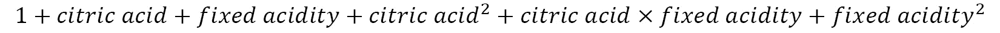
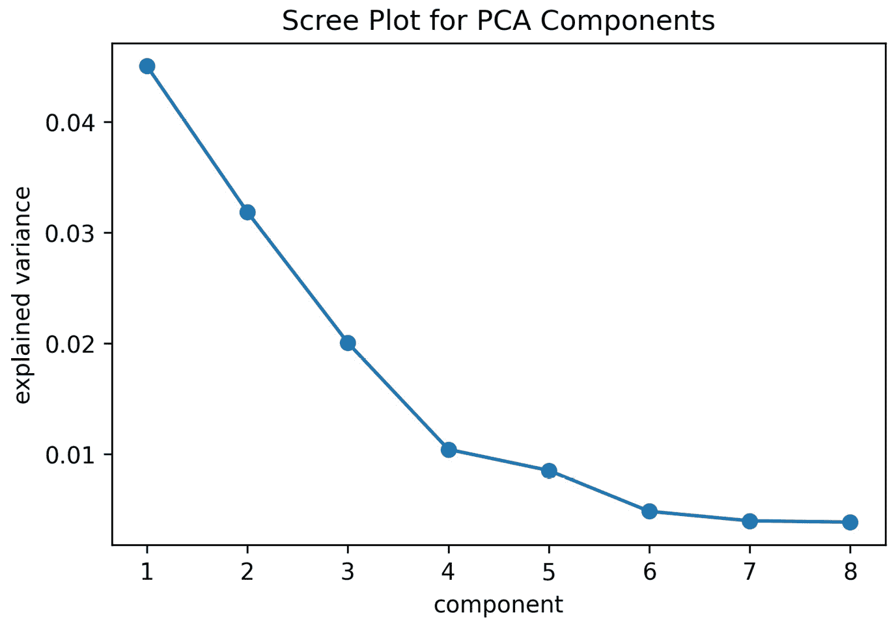

# 第十一章：*第十章*：做出更好的预测——优化模型

在前一章中，我们学习了如何构建和评估机器学习模型。然而，我们没有涉及如果我们想要提高模型性能时可以做些什么。当然，我们可以尝试使用不同的模型，看看它是否表现更好——除非有法律要求或需要能够解释其工作原理的要求，必须使用特定的方法。我们希望确保使用我们能做到的最佳版本的模型，为此，我们需要讨论如何调整我们的模型。

本章将介绍使用`scikit-learn`优化机器学习模型性能的技术，作为*第九章*《Python 中的机器学习入门》的延续。然而，需要注意的是，优化并非万能药。我们完全有可能尝试所有能想到的方法，仍然得到一个预测能力较差的模型；这正是建模的特点。

不过不要灰心——如果模型不起作用，考虑一下收集到的数据是否足够回答问题，以及所选择的算法是否适合当前任务。通常，学科领域的专业知识在构建机器学习模型时至关重要，因为它帮助我们确定哪些数据点是相关的，并利用已知的变量之间的相互作用。

特别地，将涵盖以下主题：

+   使用网格搜索进行超参数调整

+   特征工程

+   构建集成模型，结合多个估计器

+   检查分类预测置信度

+   解决类别不平衡问题

+   使用正则化惩罚高回归系数

# 本章资料

在本章中，我们将使用三个数据集。前两个数据集来自 P. Cortez、A. Cerdeira、F. Almeida、T. Matos 和 J. Reis 捐赠给 UCI 机器学习数据仓库的关于葡萄酒质量的数据（[`archive.ics.uci.edu/ml/index.php`](http://archive.ics.uci.edu/ml/index.php)）。数据包含了各种葡萄酒样本的化学属性信息，以及来自一组葡萄酒专家盲品评审会对其质量的评分。这些文件可以在本章的 GitHub 仓库中的`data/`文件夹下找到，文件名为`winequality-red.csv`和`winequality-white.csv`，分别对应红葡萄酒和白葡萄酒。

我们的第三个数据集是使用开放系外行星目录数据库收集的，网址是：[`github.com/OpenExoplanetCatalogue/open_exoplanet_catalogue/`](https://github.com/OpenExoplanetCatalogue/open_exoplanet_catalogue/)，该数据库提供 XML 格式的数据。解析后的行星数据可以在`data/planets.csv`文件中找到。对于练习，我们还将使用来自*第九章*的恒星温度数据，*Python 中的机器学习入门*，可以在`data/stars.csv`文件中找到。

作为参考，以下数据源被使用：

+   *开放系外行星目录数据库*，可在[`github.com/OpenExoplanetCatalogue/open_exoplanet_catalogue/#data-structure`](https://github.com/OpenExoplanetCatalogue/open_exoplanet_catalogue/#data-structure)找到。

+   *P. Cortez, A. Cerdeira, F. Almeida, T. Matos 和 J. Reis. 通过物理化学性质的数据挖掘建模葡萄酒偏好。在《决策支持系统》，Elsevier，47(4):547-553，2009 年。* 可在线获取：[`archive.ics.uci.edu/ml/datasets/Wine+Quality`](http://archive.ics.uci.edu/ml/datasets/Wine+Quality)。

+   *Dua, D. 和 Karra Taniskidou, E. (2017). UCI 机器学习库 (*[`archive.ics.uci.edu/ml/index.php`](http://archive.ics.uci.edu/ml/index.php)*)。加利福尼亚州尔湾市：加利福尼亚大学信息与计算机科学学院。*

我们将使用`red_wine.ipynb`笔记本来预测红葡萄酒的质量，使用`wine.ipynb`根据葡萄酒的化学性质来区分红白葡萄酒，使用`planets_ml.ipynb`笔记本构建回归模型来预测行星的年份长度（以地球日为单位）。

在开始之前，让我们处理导入并读取数据：

```py
>>> %matplotlib inline
>>> import matplotlib.pyplot as plt
>>> import numpy as np
>>> import pandas as pd
>>> import seaborn as sns
>>> planets = pd.read_csv('data/planets.csv') 
>>> red_wine = pd.read_csv('data/winequality-red.csv')
>>> white_wine = \
...     pd.read_csv('data/winequality-white.csv', sep=';') 
>>> wine = pd.concat([
...     white_wine.assign(kind='white'),
...     red_wine.assign(kind='red')
... ])
>>> red_wine['high_quality'] = pd.cut(
...     red_wine.quality, bins=[0, 6, 10], labels=[0, 1]
... )
```

让我们也为红葡萄酒质量、葡萄酒类型通过化学性质以及行星模型创建训练和测试集：

```py
>>> from sklearn.model_selection import train_test_split
>>> red_y = red_wine.pop('high_quality')
>>> red_X = red_wine.drop(columns='quality')
>>> r_X_train, r_X_test, \
... r_y_train, r_y_test = train_test_split(
...     red_X, red_y, test_size=0.1, random_state=0,
...     stratify=red_y
... )
>>> wine_y = np.where(wine.kind == 'red', 1, 0)
>>> wine_X = wine.drop(columns=['quality', 'kind'])
>>> w_X_train, w_X_test, \
... w_y_train, w_y_test = train_test_split(
...     wine_X, wine_y, test_size=0.25, 
...     random_state=0, stratify=wine_y
... )
>>> data = planets[
...     ['semimajoraxis', 'period', 'mass', 'eccentricity']
... ].dropna()
>>> planets_X = data[
...     ['semimajoraxis', 'mass', 'eccentricity']
... ]
>>> planets_y = data.period
>>> pl_X_train, pl_X_test, \
... pl_y_train, pl_y_test = train_test_split(
...     planets_X, planets_y, test_size=0.25, random_state=0
... )
```

重要提示

请记住，我们将在每个数据集对应的专用笔记本中工作，因此，虽然设置代码都在同一个代码块中，以便在书中更容易跟随，但请确保在与相应数据相关的笔记本中工作。

# 使用网格搜索进行超参数调优

毋庸置疑，您已经注意到我们在实例化模型类时可以提供各种参数。这些模型参数不是由数据本身派生出来的，而是被称为**超参数**。其中一些示例是正则化项，我们将在本章后面讨论，另一些是权重。通过**模型调优**的过程，我们希望通过调整这些超参数来优化模型的性能。

我们如何知道自己选择的是优化模型性能的最佳值呢？一种方法是使用一种称为 **网格搜索** 的技术来调优这些超参数。网格搜索允许我们定义一个搜索空间，并测试该空间中所有超参数的组合，保留那些导致最佳模型的组合。我们定义的评分标准将决定最佳模型。

还记得我们在 *第九章* 中讨论的肘部法则吗？用于寻找 k-means 聚类中 *k* 的一个合适值？我们可以使用类似的可视化方法来找到最佳的超参数值。这将涉及将训练数据拆分成 `train_test_split()`。在这里，我们将使用红酒质量数据集：

```py
>>> from sklearn.model_selection import train_test_split
>>> r_X_train_new, r_X_validate,\
... r_y_train_new, r_y_validate = train_test_split(
...     r_X_train, r_y_train, test_size=0.3, 
...     random_state=0, stratify=r_y_train
... )
```

接下来，我们可以对所有想要测试的超参数值多次构建模型，并根据我们最关心的指标对它们进行评分。让我们尝试找到 `C` 的一个合适值，`C` 是正则化强度的倒数，它决定了逻辑回归中惩罚项的权重，并将在本章末的 *正则化* 部分进行更深入的讨论；我们调节这个超参数来减少过拟合：

```py
>>> from sklearn.linear_model import LogisticRegression
>>> from sklearn.metrics import f1_score
>>> from sklearn.pipeline import Pipeline
>>> from sklearn.preprocessing import MinMaxScaler
# we will try 10 values from 10^-1 to 10¹ for C
>>> inv_regularization_strengths = \
...     np.logspace(-1, 1, num=10)
>>> scores = []
>>> for inv_reg_strength in inv_regularization_strengths:
...     pipeline = Pipeline([
...         ('scale', MinMaxScaler()),
...         ('lr', LogisticRegression(
...             class_weight='balanced', random_state=0,
...             C=inv_reg_strength
...         ))
...     ]).fit(r_X_train_new, r_y_train_new)
...     scores.append(f1_score(
...         pipeline.predict(r_X_validate), r_y_validate
...     ))
```

提示

在这里，我们使用 `np.logspace()` 来获得我们要尝试的 `C` 的取值范围。要使用此函数，我们提供起始和停止的指数，并与基数（默认值为 10）一起使用。所以 `np.logspace(-1, 1, num=10)` 会给我们 10 个均匀分布的数字，范围从 10^-1 到 10¹。

然后，结果绘制如下：

```py
>>> plt.plot(inv_regularization_strengths, scores, 'o-')
>>> plt.xscale('log')
>>> plt.xlabel('inverse of regularization strength (C)')
>>> plt.ylabel(r'$F_1$ score')
>>> plt.title(
...     r'$F_1$ score vs. '
...     'Inverse of Regularization Strength'
... )
```

使用生成的图表，我们可以选择最大化我们性能的值：


图 10.1 – 寻找最佳超参数

Scikit-learn 提供了 `GridSearchCV` 类，该类位于 `model_selection` 模块中，可以更轻松地执行这种全面的搜索。以 *CV* 结尾的类利用 **交叉验证**，这意味着它们将训练数据划分为子集，其中一些子集将作为验证集来评分模型（在模型拟合之前无需使用测试数据）。

一种常见的交叉验证方法是 **k 折交叉验证**，它将训练数据划分为 *k* 个子集，并将模型训练 *k* 次，每次留下一个子集作为验证集。模型的得分将是 *k* 个验证集的平均值。我们最初的尝试是 1 折交叉验证。当 *k*=3 时，这个过程如下图所示：


图 10.2 – 理解 k 折交叉验证

提示

在处理分类问题时，`scikit-learn`将实现分层 k 折交叉验证。这确保了每个类的样本百分比将在折叠之间得到保持。如果没有分层，可能会出现某些验证集看到某个类的样本数量不成比例（过低或过高），这会扭曲结果。

`GridSearchCV`使用交叉验证来找到搜索空间中的最佳超参数，无需使用测试数据。请记住，测试数据不应以任何方式影响训练过程——无论是在训练模型时，还是在调整超参数时——否则模型将无法很好地进行泛化。这是因为我们可能会选择在测试集上表现最好的超参数，从而无法在未见过的数据上进行测试，并高估我们的性能。

为了使用`GridSearchCV`，我们需要提供一个模型（或管道）和一个搜索空间，搜索空间将是一个字典，将要调优的超参数（按名称）映射到要尝试的值的列表。可选地，我们还可以提供要使用的评分指标，以及要用于交叉验证的折叠数。我们可以通过在超参数名称前加上步骤名称并用两个下划线分隔来调优管道中的任何步骤。例如，如果我们有一个名为`lr`的逻辑回归步骤，并且想要调优`C`，我们在搜索空间字典中使用`lr__C`作为键。请注意，如果我们的模型有任何预处理步骤，必须使用管道。

让我们使用`GridSearchCV`进行红酒质量的逻辑回归搜索，看看是否需要为我们的模型添加截距项，并寻找正则化强度的逆（`C`）的最佳值。我们将使用 F1 得分宏平均作为评分指标。请注意，由于 API 的一致性，`GridSearchCV`可以像基础模型一样使用相同的方法进行评分、拟合和预测。默认情况下，网格搜索将按顺序进行，但`GridSearchCV`能够并行执行多个搜索，从而大大加速这一过程：

```py
>>> from sklearn.linear_model import LogisticRegression
>>> from sklearn.model_selection import GridSearchCV
>>> from sklearn.pipeline import Pipeline
>>> from sklearn.preprocessing import MinMaxScaler
>>> pipeline = Pipeline([
...     ('scale', MinMaxScaler()),
...     ('lr', LogisticRegression(class_weight='balanced',
...                               random_state=0))
... ])
>>> search_space = {
...     'lr__C': np.logspace(-1, 1, num=10),
...     'lr__fit_intercept': [True, False]
... }
>>> lr_grid = GridSearchCV(
...     pipeline, search_space, scoring='f1_macro', cv=5
... ).fit(r_X_train, r_y_train)
```

一旦网格搜索完成，我们可以通过`best_params_`属性从搜索空间中提取最佳超参数。请注意，这一结果与我们 1 折交叉验证的尝试不同，因为每个折叠的结果已经被平均起来，以找到整体最佳的超参数，而不仅仅是针对单一折叠的超参数：

```py
# best values of `C` and `fit_intercept` in search space
>>> lr_grid.best_params_
{'lr__C': 3.593813663804626, 'lr__fit_intercept': True}
```

提示

我们还可以通过`best_estimator_`属性从网格搜索中检索最佳版本的管道。如果我们想查看最佳估计器（模型）的得分，可以从`best_score_`属性中获取；请注意，这将是我们在`scoring`参数中指定的得分。

我们的 F1 得分宏平均值现在已经高于我们在*第九章*，*用 Python 进行机器学习入门*中取得的成绩：

```py
>>> from sklearn.metrics import classification_report
>>> print(classification_report(
...     r_y_test, lr_grid.predict(r_X_test)
... ))
              precision    recall  f1-score   support
           0       0.94      0.80      0.87       138
           1       0.36      0.68      0.47        22
    accuracy                           0.79       160
   macro avg       0.65      0.74      0.67       160
weighted avg       0.86      0.79      0.81       160
```

请注意，`cv`参数不一定非得是整数——如果我们希望使用除默认的 k 折回归交叉验证或分类分层 k 折交叉验证之外的方法，我们可以提供在[`scikit-learn.org/stable/modules/classes.html#splitter-classes`](https://scikit-learn.org/stable/modules/classes.html#splitter-classes)中提到的分割器类。例如，在处理时间序列时，我们可以使用`TimeSeriesSplit`作为交叉验证对象，以处理连续样本并避免打乱顺序。Scikit-learn 在[`scikit-learn.org/stable/auto_examples/model_selection/plot_cv_indices.html`](https://scikit-learn.org/stable/auto_examples/model_selection/plot_cv_indices.html)展示了交叉验证类的比较。

让我们在红酒质量模型上测试`RepeatedStratifiedKFold`，而不是默认的`StratifiedKFold`，它会默认重复进行 10 次分层 k 折交叉验证。我们要做的就是将第一个`GridSearchCV`示例中传递的`cv`参数改为`RepeatedStratifiedKFold`对象。请注意——尽管使用的是相同的管道、搜索空间和评分指标——由于交叉验证过程的变化，我们的`best_params_`值不同：

```py
>>> from sklearn.model_selection import RepeatedStratifiedKFold
>>> lr_grid = GridSearchCV(
...     pipeline, search_space, scoring='f1_macro', 
...     cv=RepeatedStratifiedKFold(random_state=0)
... ).fit(r_X_train, r_y_train)
>>> print('Best parameters (CV score=%.2f):\n    %s' % (
...     lr_grid.best_score_, lr_grid.best_params_
... )) # f1 macro score
Best parameters (CV score=0.69): 
    {'lr__C': 5.994842503189409, 'lr__fit_intercept': True}
```

除了交叉验证，`GridSearchCV`还允许我们通过`scoring`参数指定我们希望优化的指标。这可以是一个字符串，表示评分的名称（如前面代码块中的做法），前提是它在[`scikit-learn.org/stable/modules/model_evaluation.html#common-cases-predefined-values`](https://scikit-learn.org/stable/modules/model_evaluation.html#common-cases-predefined-values)的列表中；否则，我们可以直接传递函数本身，或者使用`sklearn.metrics`中的`make_scorer()`函数自定义评分函数。我们甚至可以为网格搜索提供一个评分函数字典（格式为`{name: function}`），只要我们通过`refit`参数指定我们希望用来优化的评分函数的名称。因此，我们可以使用网格搜索来找到能够最大化我们在上一章讨论的指标上的性能的超参数。

重要提示

训练模型所需的时间也是我们需要评估并优化的因素。如果我们需要两倍的训练时间才能获得一个额外的正确分类，可能就不值得这么做。如果我们有一个叫做`grid`的`GridSearchCV`对象，我们可以通过运行`grid.cv_results_['mean_fit_time']`来查看平均拟合时间。

我们可以使用`GridSearchCV`在管道中的任何步骤上搜索最佳参数。例如，我们可以在行星数据集上使用预处理和线性回归的管道进行网格搜索（类似于我们在*第九章*，*《Python 机器学习入门》*中建立行星年长度模型时的做法），同时最小化**平均绝对误差**（**MAE**），而不是默认的 R2：

```py
>>> from sklearn.linear_model import LinearRegression
>>> from sklearn.metrics import \
...     make_scorer, mean_squared_error
>>> from sklearn.model_selection import GridSearchCV
>>> from sklearn.pipeline import Pipeline
>>> from sklearn.preprocessing import StandardScaler
>>> model_pipeline = Pipeline([
...     ('scale', StandardScaler()),
...     ('lr', LinearRegression())
... ])
>>> search_space = {
...     'scale__with_mean': [True, False],
...     'scale__with_std': [True, False],
...     'lr__fit_intercept': [True, False], 
...     'lr__normalize': [True, False]
... }
>>> grid = GridSearchCV(
...     model_pipeline, search_space, cv=5,
...     scoring={
...         'r_squared': 'r2',
...         'mse': 'neg_mean_squared_error',
...         'mae': 'neg_mean_absolute_error',
...         'rmse': make_scorer(
...             lambda x, y: \
...                 -np.sqrt(mean_squared_error(x, y))
...         )
...     }, refit='mae'
... ).fit(pl_X_train, pl_y_train)
```

请注意，我们正在使用除 R2 外所有指标的负值。这是因为`GridSearchCV`将尝试最大化得分，而我们希望最小化错误。让我们检查此网格中缩放和线性回归的最佳参数：

```py
>>> print('Best parameters (CV score=%.2f):\n%s' % (
...     grid.best_score_, grid.best_params_
... )) # MAE score * -1
Best parameters (CV score=-1215.99):
{'lr__fit_intercept': False, 'lr__normalize': True, 
 'scale__with_mean': False, 'scale__with_std': True}
```

调整后模型的 MAE 比《Python 机器学习入门》第九章中的 MAE 减少了 120 个地球日：

```py
>>> from sklearn.metrics import mean_absolute_error
>>> mean_absolute_error(pl_y_test, grid.predict(pl_X_test))
1248.3690943844194
```

需要注意的是，虽然模型可能训练速度很快，但我们不应创建大而精细的搜索空间；在实践中，最好从几个不同的分布值开始，然后检查结果，看哪些区域值得进行更深入的搜索。例如，假设我们要调整`C`超参数。在第一次尝试中，我们可以查看`np.logspace(-1, 1)`的结果。如果我们发现`C`的最佳值在极端值之一，我们可以再查看该值以上/以下的值。如果最佳值在范围内，我们可以查看该值周围的几个值。可以迭代执行此过程，直到不再看到额外的改进。或者，我们可以使用`RandomizedSearchCV`，它将在搜索空间中尝试 10 个随机组合（默认情况下），并找到最佳估算器（模型）。我们可以使用`n_iter`参数更改此数字。

重要说明

由于调整超参数的过程要求我们多次训练模型，我们必须考虑模型的时间复杂度。训练时间长的模型在使用交叉验证时将非常昂贵。这可能会导致我们缩小搜索空间。

# 特征工程

当我们试图提高性能时，我们也可以考虑通过**特征工程**的过程向模型提供最佳**特征**（模型输入）。在《Python 机器学习入门》第九章的*数据预处理*部分，当我们对数据进行缩放、编码和填充时，介绍了**特征转换**。不幸的是，特征转换可能会使我们想在模型中使用的数据元素变得不那么显著，比如特定特征的未缩放平均值。针对这种情况，我们可以创建一个具有此值的新特征；这些以及其他新特征是在**特征构建**（有时称为**特征创建**）过程中添加的。

**特征选择**是确定哪些特征用于训练模型的过程。这可以通过手动操作或通过其他过程，如机器学习来完成。当我们选择模型的特征时，我们希望选择对因变量有影响的特征，同时避免不必要地增加问题的复杂性。使用许多特征构建的模型增加了复杂性，但不幸的是，这些模型更容易拟合噪声，因为我们的数据在高维空间中是稀疏的。这被称为**维度灾难**。当模型学到了训练数据中的噪声时，它会很难对未见过的数据进行泛化；这称为**过拟合**。通过限制模型使用的特征数量，特征选择有助于解决过拟合问题。

**特征提取**是我们可以解决维度灾难的另一种方式。在特征提取过程中，我们通过变换构造特征的组合，从而减少数据的维度。这些新特征可以替代原始特征，从而减少问题的维度。这个过程称为**降维**，它还包括一些技术，利用少量的成分（比原始特征少）来解释数据中大部分的方差。特征提取通常用于图像识别问题，因为任务的维度是图像中的像素总数。例如，网站上的方形广告是 350x350 像素（这是最常见的尺寸之一），因此，使用该尺寸图像进行的图像识别任务具有 122,500 个维度。

提示

彻底的探索性数据分析（EDA）和领域知识是特征工程的必备条件。

特征工程是整本书的主题；然而，由于它是一个更为高级的话题，我们在本节中仅介绍几种技巧。在*进一步阅读*部分有一本关于该主题的好书，它还涉及使用机器学习进行特征学习。

## 交互项和多项式特性

我们在*第九章*的*数据预处理*部分讨论了虚拟变量的使用；然而，我们仅仅考虑了该变量单独的影响。在我们尝试使用化学特性预测红葡萄酒质量的模型中，我们分别考虑了每个特性。然而，考虑这些特性之间的相互作用是否会产生影响也很重要。也许当柠檬酸和固定酸度都较高或都较低时，葡萄酒的质量与其中一个较高、另一个较低时会有所不同。为了捕捉这种影响，我们需要添加一个**交互项**，即特性之间的乘积。

我们还可能希望通过特征构造来增加某个特征在模型中的作用；我们可以通过添加**多项式特征**来实现这一点，这些特征是由该特征构造的。这涉及到添加原始特征的更高阶次，所以我们可以在模型中拥有*柠檬酸*、*柠檬酸*²、*柠檬酸*³，依此类推。

提示

我们可以通过使用交互项和多项式特征来推广线性模型，因为它们允许我们对非线性项的线性关系建模。由于线性模型在存在多个或非线性决策边界（分隔类别的表面或超表面）时往往表现不佳，这可以提高模型的性能。

Scikit-learn 提供了`preprocessing`模块中的`PolynomialFeatures`类，用于轻松创建交互项和多项式特征。在构建包含类别特征和连续特征的模型时，这非常有用。只需指定度数，我们就可以得到所有小于或等于该度数的特征组合。较高的度数会大幅增加模型的复杂度，并可能导致过拟合。

如果我们使用`degree=2`，我们可以将*柠檬酸*和*固定酸度*转换为以下内容，其中*1*是可以作为模型截距项使用的偏置项：



通过在`PolynomialFeatures`对象上调用`fit_transform()`方法，我们可以生成这些特征：

```py
>>> from sklearn.preprocessing import PolynomialFeatures
>>> PolynomialFeatures(degree=2).fit_transform(
...     r_X_train[['citric acid', 'fixed acidity']]
... )
array([[1.000e+00, 5.500e-01, 9.900e+00, 3.025e-01, 
        5.445e+00, 9.801e+01],
       [1.000e+00, 4.600e-01, 7.400e+00, 2.116e-01, 
        3.404e+00, 5.476e+01],
       [1.000e+00, 4.100e-01, 8.900e+00, 1.681e-01, 
        3.649e+00, 7.921e+01],
       ...,
       [1.000e+00, 1.200e-01, 7.000e+00, 1.440e-02, 
        8.400e-01, 4.900e+01],
       [1.000e+00, 3.100e-01, 7.600e+00, 9.610e-02, 
        2.356e+00, 5.776e+01],
       [1.000e+00, 2.600e-01, 7.700e+00, 6.760e-02, 
        2.002e+00, 5.929e+01]])
```

让我们分析前面代码块中数组的第一行（加粗部分），以了解我们是如何得到这些值的：


图 10.3 – 检查所创建的交互项和多项式特征

如果我们只对交互变量（此处为*柠檬酸 × 固定酸度*）感兴趣，可以指定`interaction_only=True`。在这种情况下，我们还不希望有偏置项，因此也指定`include_bias=False`。这将为我们提供原始变量及其交互项：

```py
>>> PolynomialFeatures(
...     degree=2, include_bias=False, interaction_only=True
... ).fit_transform(
...     r_X_train[['citric acid', 'fixed acidity']]
... )
array([[0.55 , 9.9  , 5.445],
       [0.46 , 7.4  , 3.404],
       [0.41 , 8.9  , 3.649],
       ...,
       [0.12 , 7.   , 0.84 ],
       [0.31 , 7.6  , 2.356],
       [0.26 , 7.7  , 2.002]])
```

我们可以将这些多项式特征添加到我们的管道中：

```py
>>> from sklearn.linear_model import LogisticRegression
>>> from sklearn.model_selection import GridSearchCV
>>> from sklearn.pipeline import Pipeline
>>> from sklearn.preprocessing import (
...     MinMaxScaler, PolynomialFeatures
... )
>>> pipeline = Pipeline([
...     ('poly', PolynomialFeatures(degree=2)),
...     ('scale', MinMaxScaler()),
...     ('lr', LogisticRegression(
...         class_weight='balanced', random_state=0
...     ))
... ]).fit(r_X_train, r_y_train)
```

请注意，这个模型比我们在*第九章*《在 Python 中入门机器学习》使用的模型稍微更好，因为我们添加了这些额外的项：

```py
>>> from sklearn.metrics import classification_report
>>> preds = pipeline.predict(r_X_test)
>>> print(classification_report(r_y_test, preds))
              precision    recall  f1-score   support
           0       0.95      0.79      0.86       138
           1       0.36      0.73      0.48        22
    accuracy                           0.78       160
   macro avg       0.65      0.76      0.67       160
weighted avg       0.87      0.78      0.81       160
```

添加多项式特征和交互项会增加我们数据的维度，这可能并不理想。有时，与其寻找创造更多特征的方法，我们更倾向于寻找合并特征并减少数据维度的方式。

## 降维

**降维**是减少训练模型时所用特征数量的过程。这是为了在不大幅牺牲性能的情况下，降低训练模型的计算复杂度。我们可以选择仅在特征的子集上进行训练（特征选择）；然而，如果我们认为这些特征中存在一些有价值的信息，即便这些信息很小，我们也可以寻找提取所需信息的方法。

一种常见的特征选择策略是丢弃方差较低的特征。这些特征不太具有信息性，因为它们在数据中大部分值相同。Scikit-learn 提供了`VarianceThreshold`类，用于根据最小方差阈值进行特征选择。默认情况下，它会丢弃方差为零的特征；但是，我们可以提供自己的阈值。我们将在预测葡萄酒是红酒还是白酒的模型上进行特征选择，基于其化学成分。由于我们没有方差为零的特征，我们将选择保留方差大于 0.01 的特征：

```py
>>> from sklearn.feature_selection import VarianceThreshold
>>> from sklearn.linear_model import LogisticRegression
>>> from sklearn.pipeline import Pipeline
>>> from sklearn.preprocessing import StandardScaler
>>> white_or_red_min_var = Pipeline([
...     ('feature_selection',
...VarianceThreshold(threshold=0.01)), 
...     ('scale', StandardScaler()), 
...     ('lr', LogisticRegression(random_state=0))
... ]).fit(w_X_train, w_y_train)
```

这移除了两个方差较低的特征。我们可以通过`VarianceThreshold`对象的`get_support()`方法返回的布尔掩码来获取它们的名称，该掩码指示了保留下来的特征：

```py
>>> w_X_train.columns[
...     ~white_or_red_min_var.named_steps[
...         'feature_selection'
...     ].get_support()
... ]
Index(['chlorides', 'density'], dtype='object')
```

仅使用 11 个特征中的 9 个，我们的表现几乎没有受到影响：

```py
>>> from sklearn.metrics import classification_report
>>> print(classification_report(
...     w_y_test, white_or_red_min_var.predict(w_X_test)
... ))
              precision    recall  f1-score   support
           0       0.98      0.99      0.99      1225
           1       0.98      0.95      0.96       400
    accuracy                           0.98      1625
   macro avg       0.98      0.97      0.97      1625
weighted avg       0.98      0.98      0.98      1625
```

提示

查看`feature_selection`模块中其他特征选择的选项，地址为[`scikit-learn.org/stable/modules/classes.html#module-sklearn.feature_selection`](https://scikit-learn.org/stable/modules/classes.html#module-sklearn.feature_selection)。

如果我们认为所有特征都有价值，我们可以选择使用特征提取，而不是完全丢弃它们。**主成分分析**（**PCA**）通过将高维数据投影到低维空间，从而进行特征提取，降低维度。作为回报，我们得到最大化解释方差的*n*个组件。由于这对数据的尺度非常敏感，因此我们需要事先进行一些预处理。

让我们看看`ml_utils.pca`模块中的`pca_scatter()`函数，它可以帮助我们在降至二维时可视化数据：

```py
import matplotlib.pyplot as plt
from sklearn.decomposition import PCA
from sklearn.pipeline import Pipeline
from sklearn.preprocessing import MinMaxScaler
def pca_scatter(X, labels, cbar_label, cmap='brg'):
    """
    Create a 2D scatter plot from 2 PCA components of X
    Parameters:
        - X: The X data for PCA
        - labels: The y values
        - cbar_label: The label for the colorbar
        - cmap: Name of the colormap to use.
    Returns:
        Matplotlib `Axes` object
    """
    pca = Pipeline([
        ('scale', MinMaxScaler()),
        ('pca', PCA(2, random_state=0))
    ]).fit(X)
    data, classes = pca.transform(X), np.unique(labels)
    ax = plt.scatter(
        data[:, 0], data[:, 1],
        c=labels, edgecolor='none', alpha=0.5,
        cmap=plt.cm.get_cmap(cmap, classes.shape[0])
    )
    plt.xlabel('component 1')
    plt.ylabel('component 2')
    cbar = plt.colorbar()
    cbar.set_label(cbar_label)
    cbar.set_ticks(classes)
    plt.legend([
        'explained variance\n'
        'comp. 1: {:.3}\ncomp. 2: {:.3}'.format(
           *pca.named_steps['pca'].explained_variance_ratio_
        ) 
    ])
    return ax
```

让我们用两个 PCA 组件来可视化葡萄酒数据，看看是否能找到将红酒与白酒分开的方法：

```py
>>> from ml_utils.pca import pca_scatter
>>> pca_scatter(wine_X, wine_y, 'wine is red?')
>>> plt.title('Wine Kind PCA (2 components)')
```

大多数红酒位于顶部的亮绿色点块中，而白酒则位于底部的蓝色点块中。从视觉上来看，我们可以看到如何分开它们，但仍然有一些重叠：


图 10.4 – 使用两个 PCA 组件按类型分离葡萄酒

提示

PCA 组件将是线性无关的，因为它们是通过正交变换（垂直扩展到更高维度）得到的。线性回归假设回归变量（输入数据）之间没有相关性，因此这有助于解决多重共线性问题。

注意从之前图表的图例中得到的每个组件的解释方差——这些组件解释了葡萄酒数据中超过 50%的方差。接下来，我们来看看使用三维是否能改善分离效果。`ml_utils.pca`模块中的`pca_scatter_3d()`函数使用了`mpl_toolkits`，这是`matplotlib`中用于 3D 可视化的工具包：

```py
import matplotlib.pyplot as plt
from mpl_toolkits.mplot3d import Axes3D
from sklearn.decomposition import PCA
from sklearn.pipeline import Pipeline
from sklearn.preprocessing import MinMaxScaler
def pca_scatter_3d(X, labels, cbar_label, cmap='brg', 
                   elev=10, azim=15):
    """
    Create a 3D scatter plot from 3 PCA components of X
    Parameters:
        - X: The X data for PCA
        - labels: The y values
        - cbar_label: The label for the colorbar
        - cmap: Name of the colormap to use.
        - elev: The degrees of elevation to view the plot from. 
        - azim: The azimuth angle on the xy plane (rotation 
                around the z-axis).
    Returns:
        Matplotlib `Axes` object
    """
    pca = Pipeline([
        ('scale', MinMaxScaler()),
        ('pca', PCA(3, random_state=0))
    ]).fit(X)
    data, classes = pca.transform(X), np.unique(labels)
    fig = plt.figure()
    ax = fig.add_subplot(111, projection='3d')
    p = ax.scatter3D(
        data[:, 0], data[:, 1], data[:, 2],
        alpha=0.5, c=labels,
        cmap=plt.cm.get_cmap(cmap, classes.shape[0])
    )
    ax.view_init(elev=elev, azim=azim)
    ax.set_xlabel('component 1')
    ax.set_ylabel('component 2')
    ax.set_zlabel('component 3')
    cbar = fig.colorbar(p, pad=0.1)
    cbar.set_ticks(classes)
    cbar.set_label(cbar_label)
    plt.legend([
        'explained variance\ncomp. 1: {:.3}\n'
        'comp. 2: {:.3}\ncomp. 3: {:.3}'.format(
            *pca.named_steps['pca'].explained_variance_ratio_
        ) 
    ])
    return ax
```

让我们再次使用 3D 可视化函数查看酒类数据，看看使用三个 PCA 组件时白酒和红酒是否更容易分开：

```py
>>> from ml_utils.pca import pca_scatter_3d
>>> pca_scatter_3d(
...     wine_X, wine_y, 'wine is red?', elev=20, azim=-10
... )
>>> plt.suptitle('Wine Type PCA (3 components)')
```

从这个角度看，我们似乎可以从绿色（右侧）点集划分出一部分，尽管仍然有一些点在错误的区域：


图 10.5 – 使用三个 PCA 组件按类型区分酒类

重要提示

PCA 执行线性降维。可以查看 t-SNE 和 Isomap 进行流形学习以实现非线性降维。

我们可以使用 `ml_utils.pca` 模块中的 `pca_explained_variance_plot()` 函数来可视化随着 PCA 组件数量变化的累积解释方差：

```py
import matplotlib.pyplot as plt
import numpy as np
def pca_explained_variance_plot(pca_model, ax=None):
    """
    Plot the cumulative explained variance of PCA components.
    Parameters:
        - pca_model: The PCA model that has been fit already
        - ax: Matplotlib `Axes` object to plot on.
    Returns:
        A matplotlib `Axes` object
    """
    if not ax:
        fig, ax = plt.subplots()
    ax.plot(
        np.append(
            0, pca_model.explained_variance_ratio_.cumsum()
        ), 'o-'
    )
    ax.set_title(
        'Total Explained Variance Ratio for PCA Components'
    )
    ax.set_xlabel('PCA components used')
    ax.set_ylabel('cumulative explained variance ratio')
    return ax
```

我们可以将管道中的 PCA 部分传递给此函数，以查看累积解释方差：

```py
>>> from sklearn.decomposition import PCA
>>> from sklearn.pipeline import Pipeline
>>> from sklearn.preprocessing import MinMaxScaler
>>> from ml_utils.pca import pca_explained_variance_plot
>>> pipeline = Pipeline([
...     ('normalize', MinMaxScaler()),
...     ('pca', PCA(8, random_state=0))
... ]).fit(w_X_train, w_y_train) 
>>> pca_explained_variance_plot(pipeline.named_steps['pca'])
```

前四个 PCA 组件解释了约 80% 的方差：


图 10.6 – PCA 组件的解释方差

我们还可以使用肘部法则来找到适合的 PCA 组件数量，就像在 *第九章*《Python 机器学习入门》中使用 k-means 一样。为此，我们需要确保 `ml_utils.pca` 模块包含 `pca_scree_plot()` 函数来创建这个可视化：

```py
import matplotlib.pyplot as plt
import numpy as np
def pca_scree_plot(pca_model, ax=None):
    """
    Plot explained variance of each consecutive PCA component.
    Parameters:
        - pca_model: The PCA model that has been fit already
        - ax: Matplotlib `Axes` object to plot on.
    Returns: A matplotlib `Axes` object
    """
    if not ax:
        fig, ax = plt.subplots()
    values = pca_model.explained_variance_
    ax.plot(np.arange(1, values.size + 1), values, 'o-')
    ax.set_title('Scree Plot for PCA Components')
    ax.set_xlabel('component')
    ax.set_ylabel('explained variance')
    return ax
```

我们可以将管道中的 PCA 部分传递给此函数，以查看每个 PCA 组件解释的方差：

```py
>>> from sklearn.decomposition import PCA
>>> from sklearn.pipeline import Pipeline
>>> from sklearn.preprocessing import MinMaxScaler
>>> from ml_utils.pca import pca_scree_plot
>>> pipeline = Pipeline([
...     ('normalize', MinMaxScaler()),
...     ('pca', PCA(8, random_state=0))
... ]).fit(w_X_train, w_y_train)
>>> pca_scree_plot(pipeline.named_steps['pca'])
```

螺旋图告诉我们应该尝试四个 PCA 组件，因为之后的组件回报递减：



图 10.7 – 每增加一个 PCA 组件后回报递减（第四个组件之后）

我们可以在这些四个 PCA 特征上建立一个模型，这个过程叫做 **元学习**，即管道中的最后一个模型是基于其他模型的输出而非原始数据进行训练：

```py
>>> from sklearn.decomposition import PCA
>>> from sklearn.pipeline import Pipeline
>>> from sklearn.preprocessing import MinMaxScaler
>>> from sklearn.linear_model import LogisticRegression
>>> pipeline = Pipeline([
...     ('normalize', MinMaxScaler()),
...     ('pca', PCA(4, random_state=0)),
...     ('lr', LogisticRegression(
...         class_weight='balanced', random_state=0
...     ))
... ]).fit(w_X_train, w_y_train)
```

我们的新模型表现几乎与使用 11 个特征的原始逻辑回归一样好，只用了通过 PCA 制作的 4 个特征：

```py
>>> from sklearn.metrics import classification_report
>>> preds = pipeline.predict(w_X_test)
>>> print(classification_report(w_y_test, preds))
              precision    recall  f1-score   support
           0       0.99      0.99      0.99      1225
           1       0.96      0.96      0.96       400
    accuracy                           0.98      1625
   macro avg       0.98      0.98      0.98      1625
weighted avg       0.98      0.98      0.98      1625
```

在进行降维处理后，我们不再拥有最初的所有特征——毕竟，减少特征数量就是目的。然而，我们可能希望对特征子集应用不同的特征工程技术；为了实现这一点，我们需要理解特征联合。

## 特征联合

我们可能希望在来自各种来源的特征上建立模型，例如 PCA，以及选择特征的子集。为此，`scikit-learn` 提供了 `pipeline` 模块中的 `FeatureUnion` 类。这还允许我们一次执行多个特征工程技术，例如特征提取后跟特征变换，当我们将其与管道结合时。

创建 `FeatureUnion` 对象就像创建一个管道一样，但我们传递的是要进行的变换，而不是按顺序传递步骤。这些变换将在结果中并排堆叠。让我们使用交互项的特征联合，并选择方差大于 0.01 的特征来预测红酒质量：

```py
>>> from sklearn.feature_selection import VarianceThreshold
>>> from sklearn.pipeline import FeatureUnion, Pipeline
>>> from sklearn.preprocessing import (
...     MinMaxScaler, PolynomialFeatures
... )
>>> from sklearn.linear_model import LogisticRegression
>>> combined_features = FeatureUnion([
...     ('variance', VarianceThreshold(threshold=0.01)),
...     ('poly', PolynomialFeatures(
...         degree=2, include_bias=False, interaction_only=True
...     ))
... ])
>>> pipeline = Pipeline([
...     ('normalize', MinMaxScaler()),
...     ('feature_union', combined_features),
...     ('lr', LogisticRegression(
...         class_weight='balanced', random_state=0
...     ))
... ]).fit(r_X_train, r_y_train)
```

为了说明发生的变换，让我们检查一下红酒质量数据集训练集的第一行，在 `FeatureUnion` 对象进行变换后的结果。由于我们看到方差阈值结果产生了九个特征，我们知道它们是结果 NumPy 数组中的前九项，剩下的是交互项：

```py
>>> pipeline.named_steps['feature_union']\
...     .transform(r_X_train)[0]
array([9.900000e+00, 3.500000e-01, 5.500000e-01, 5.000000e+00,
       1.400000e+01, 9.971000e-01, 3.260000e+00, 1.060000e+01,
       9.900000e+00, 3.500000e-01, 5.500000e-01, 2.100000e+00,
       6.200000e-02, 5.000000e+00, 1.400000e+01, 9.971000e-01,
       ..., 3.455600e+01, 8.374000e+00])
```

我们还可以查看分类报告，看到 F1 分数有了微小的提升：

```py
>>> from sklearn.metrics import classification_report
>>> preds = pipeline.predict(r_X_test)
>>> print(classification_report(r_y_test, preds))
              precision    recall  f1-score   support
           0       0.94      0.80      0.87       138
           1       0.36      0.68      0.47        22
    accuracy                           0.79       160
   macro avg       0.65      0.74      0.67       160
weighted avg       0.86      0.79      0.81       160
```

在这个例子中，我们选择了具有大于 0.01 方差的特征，假设如果特征没有许多不同的值，它可能不会那么有用。我们可以使用机器学习模型来帮助确定哪些特征是重要的，而不是仅仅做出这个假设。

## 特征重要性

**决策树**递归地对数据进行划分，决定每次划分时使用哪些特征。它们是**贪婪学习者**，意味着它们每次都寻找可以进行的最大划分；这并不一定是查看树输出时的最佳划分。我们可以使用决策树来评估**特征重要性**，这决定了树在决策节点上如何划分数据。这些特征重要性可以帮助我们进行特征选择。请注意，特征重要性加起来会等于 1，值越大越好。让我们使用决策树来看看如何在化学层面上将红酒和白酒分开：

```py
>>> from sklearn.tree import DecisionTreeClassifier
>>> dt = DecisionTreeClassifier(random_state=0).fit(
...     w_X_train, w_y_train
... )
>>> pd.DataFrame([(col, coef) for col, coef in zip(
...     w_X_train.columns, dt.feature_importances_
... )], columns=['feature', 'importance']
... ).set_index('feature').sort_values(
...     'importance', ascending=False
... ).T
```

这表明，在区分红酒和白酒时，最重要的化学特性是总二氧化硫和氯化物：


图 10.8 – 在预测酒的类型时，每种化学特性的重要性

提示

使用由特征重要性指示的最重要特征，我们可以尝试构建一个更简单的模型（通过使用更少的特征）。如果可能，我们希望简化我们的模型，而不牺牲太多性能。有关示例，请参见 `wine.ipynb` 笔记本。

如果我们训练另一棵最大深度为二的决策树，我们可以可视化树的顶部（如果不限制深度，树太大而无法可视化）：

```py
>>> from sklearn.tree import export_graphviz
>>> import graphviz
>>> graphviz.Source(export_graphviz(
...     DecisionTreeClassifier(
...         max_depth=2, random_state=0
...     ).fit(w_X_train, w_y_train),
...     feature_names=w_X_train.columns
... ))
```

重要提示

需要安装 Graphviz 软件（如果尚未安装）以可视化树结构。可以在[`graphviz.gitlab.io/download/`](https://graphviz.gitlab.io/download/)下载，安装指南在[`graphviz.readthedocs.io/en/stable/manual.html#installation`](https://graphviz.readthedocs.io/en/stable/manual.html#installation)。请注意，在安装后需要重新启动内核。否则，将`out_file='tree.dot'`传递给`export_graphviz()`函数，然后在命令行中运行`dot -T png tree.dot -o tree.png`生成 PNG 文件。作为替代，`scikit-learn`提供了`plot_tree()`函数，它使用`matplotlib`；请参考笔记本中的示例。

这导致以下树形结构，首先在总二氧化硫上进行分割（具有最高的特征重要性），然后在第二级上进行氯化物分割。每个节点上的信息告诉我们分割的标准（顶部行），成本函数的值（**gini**），该节点处的样本数目（**samples**），以及每个类别中的样本数目（**values**）：


图 10.9 – 基于化学性质预测葡萄酒类型的决策树

我们还可以将决策树应用于回归问题。让我们使用`DecisionTreeRegressor`类来查找行星数据的特征重要性：

```py
>>> from sklearn.tree import DecisionTreeRegressor
>>> dt = DecisionTreeRegressor(random_state=0).fit(
...     pl_X_train, pl_y_train
... )
>>> [(col, coef) for col, coef in zip(
...     pl_X_train.columns, dt.feature_importances_
... )]
[('semimajoraxis', 0.9969449557611615),
 ('mass', 0.0015380986260574154),
 ('eccentricity', 0.0015169456127809738)]
```

基本上，半长轴是周期长度的主要决定因素，这一点我们已经知道，但是如果我们可视化一棵树，我们就能看到为什么。前四个分割都基于半长轴：


图 10.10 – 预测行星周期的决策树

决策树可以使用`scikit-learn`文档提供的提示来解决决策树使用时的过拟合和其他潜在问题，参见[`scikit-learn.org/stable/modules/tree.html#tips-on-practical-use`](https://scikit-learn.org/stable/modules/tree.html#tips-on-practical-use)。在讨论集成方法时，请记住这一点。

# 集成方法

**集成方法**结合了许多模型（通常是弱模型），创建一个更强的模型，可以最小化观察和预测值之间的平均误差（**偏差**），或者改进其对未见数据的泛化能力（最小化**方差**）。我们必须在可能增加方差的复杂模型之间取得平衡，因为它们倾向于过拟合，并且可能具有高偏差的简单模型之间取得平衡，因为这些倾向于欠拟合。这被称为**偏差-方差权衡**，在以下子图中有所说明：


图 10.11 – 偏差-方差权衡

集成方法可以分为三类：**提升**、**装袋**和**堆叠**。**提升**训练许多弱学习器，它们从彼此的错误中学习，减少偏差，从而使学习器更强。另一方面，**装袋**使用**自助聚合**方法，在数据的自助样本上训练多个模型，并将结果聚合在一起（分类时使用投票，回归时使用平均值），从而减少方差。我们还可以通过投票将不同类型的模型组合在一起。**堆叠**是一种集成技术，其中我们将多种不同的模型类型结合在一起，使用某些模型的输出作为其他模型的输入；这样做是为了提高预测的准确性。我们在本章的*降维*部分中，结合了 PCA 和逻辑回归，这就是堆叠的一个例子。

## 随机森林

决策树容易过拟合，尤其是当我们没有设置限制以控制树的生长深度（使用`max_depth`和`min_samples_leaf`参数）时。我们可以通过`oob_score`参数来解决这个过拟合问题。

重要提示

`min_samples_leaf`参数要求树的最终节点（或叶子）上有最少的样本数；这可以防止决策树过度拟合，直到每个叶子只有一个观测值。

每棵树还会得到特征的子集（随机特征选择），其默认值为特征数量的平方根（即`max_features`参数）。这有助于解决维度灾难。然而，作为后果，随机森林不如构成它的决策树那样容易解释。然而，我们仍然可以像在决策树中一样，从随机森林中提取特征重要性。

我们可以使用`ensemble`模块中的`RandomForestClassifier`类来构建一个随机森林（其中包含`n_estimators`棵树），用于高质量红酒的分类：

```py
>>> from sklearn.ensemble import RandomForestClassifier
>>> from sklearn.model_selection import GridSearchCV
>>> rf = RandomForestClassifier(
...     n_estimators=100, random_state=0
... )
>>> search_space = {
...     'max_depth': [4, 8], # keep trees small
...     'min_samples_leaf': [4, 6]
... }
>>> rf_grid = GridSearchCV(
...     rf, search_space, cv=5, scoring='precision'
... ).fit(r_X_train, r_y_train)
>>> rf_grid.score(r_X_test, r_y_test)
0.6
```

请注意，我们使用随机森林的精度已经远远超过了*第九章*中我们得到的 0.35 精度，*Python 中的机器学习入门*。随机森林对离群点具有鲁棒性，并且能够建模非线性决策边界以分隔类别，这可能解释了这种显著改进的部分原因。

## 梯度提升

提升方法旨在改进前一模型的错误。实现这一点的一种方式是沿着损失函数下降最快的方向移动。由于**梯度**（导数的多变量推广）是最陡的上升方向，因此可以通过计算负梯度来实现这一点，这样就得到了最陡的下降方向，也就是当前结果的损失函数中最佳的改进方向。这种技术称为**梯度下降**。

重要提示

尽管梯度下降听起来不错，但它也存在一些潜在问题。可能会陷入局部最小值（在某一地区的损失函数最小值）；算法会停止，认为我们找到了最优解，实际上我们并没有找到，因为我们希望得到全局最小值（整个区域的最小值）。

Scikit-learn 的 `ensemble` 模块提供了 `GradientBoostingClassifier` 和 `GradientBoostingRegressor` 类，用于通过决策树实现梯度提升。这些树将通过梯度下降来提高性能。请注意，梯度提升树对噪声训练数据比随机森林更敏感。此外，我们必须考虑到，构建所有树所需的额外时间是线性串行的，而不像随机森林那样可以并行训练。

让我们使用网格搜索和梯度提升来训练另一个模型，用于对红葡萄酒质量数据进行分类。除了搜索 `max_depth` 和 `min_samples_leaf` 参数的最佳值外，我们还将搜索 `learning_rate` 参数的最佳值，这个参数决定了每棵树在最终估计器中的贡献：

```py
>>> from sklearn.ensemble import GradientBoostingClassifier
>>> from sklearn.model_selection import GridSearchCV
>>> gb = GradientBoostingClassifier(
...     n_estimators=100, random_state=0
... )
>>> search_space = {
...     'max_depth': [4, 8], # keep trees small
...     'min_samples_leaf': [4, 6],
...     'learning_rate': [0.1, 0.5, 1]
... }
>>> gb_grid = GridSearchCV(
...     gb, search_space, cv=5, scoring='f1_macro'
... ).fit(r_X_train, r_y_train)
```

我们通过梯度提升获得的 F1 宏观评分优于在 *第九章* *《Python 机器学习入门》* 中使用逻辑回归得到的 0.66 分：

```py
>>> gb_grid.score(r_X_test, r_y_test)
0.7226024272287617
```

无论是袋装方法还是提升方法，都给我们带来了比逻辑回归模型更好的表现；然而，我们可能会发现这些模型并不总是达成一致，且通过让模型投票再做最终预测，我们有可能进一步提升性能。

## 投票

在尝试不同的分类模型时，使用 Cohen's kappa 评分来衡量它们的一致性可能会很有趣。我们可以使用 `sklearn.metrics` 模块中的 `cohen_kappa_score()` 函数来实现这一点。该评分从完全不一致（-1）到完全一致（1）。我们的提升和袋装预测有很高的一致性：

```py
>>> from sklearn.metrics import cohen_kappa_score
>>> cohen_kappa_score(
...     rf_grid.predict(r_X_test), gb_grid.predict(r_X_test)
... )
0.7185929648241206
```

有时，我们找不到一个适用于所有数据的单一模型，因此我们可能需要找到一种方法，将各种模型的意见结合起来做出最终决策。Scikit-learn 提供了 `VotingClassifier` 类，用于聚合分类任务中的模型意见。我们可以选择指定投票类型，其中 `hard` 代表多数规则，而 `soft` 将预测具有最高概率总和的类别。

举个例子，让我们为每种投票类型创建一个分类器，使用本章中的三种估计器（模型）——逻辑回归、随机森林和梯度提升。由于我们将运行 `fit()`，我们传入每次网格搜索中得到的最佳估计器（`best_estimator_`）。这样可以避免不必要地重新运行每次网格搜索，也能加速模型训练：

```py
>>> from sklearn.ensemble import VotingClassifier
>>> majority_rules = VotingClassifier(
...     [('lr', lr_grid.best_estimator_),
...      ('rf', rf_grid.best_estimator_), 
...      ('gb', gb_grid.best_estimator_)],
...     voting='hard'
... ).fit(r_X_train, r_y_train)
>>> max_probabilities = VotingClassifier(
...     [('lr', lr_grid.best_estimator_), 
...      ('rf', rf_grid.best_estimator_), 
...      ('gb', gb_grid.best_estimator_)],
...     voting='soft'
... ).fit(r_X_train, r_y_train)
```

我们的`majority_rules`分类器要求至少有三个模型中的两个达成一致，而`max_probabilities`分类器则让每个模型根据其预测的概率进行投票。我们可以使用`classification_report()`函数来衡量它们在测试数据上的表现，该函数告诉我们，`majority_rules`在精确度方面稍优于`max_probabilities`，而这两个分类器都比我们尝试的其他模型表现得更好：

```py
>>> from sklearn.metrics import classification_report
>>> print(classification_report(
...     r_y_test, majority_rules.predict(r_X_test)
... ))
              precision    recall  f1-score   support
           0       0.92      0.95      0.93       138
           1       0.59      0.45      0.51        22
    accuracy                           0.88       160
   macro avg       0.75      0.70      0.72       160
weighted avg       0.87      0.88      0.87       160
>>> print(classification_report(
...     r_y_test, max_probabilities.predict(r_X_test)
... ))
              precision    recall  f1-score   support
           0       0.92      0.93      0.92       138
           1       0.52      0.50      0.51        22
    accuracy                           0.87       160
   macro avg       0.72      0.71      0.72       160
weighted avg       0.87      0.87      0.87       160
```

`VotingClassifier`类中的另一个重要选项是`weights`参数，它允许我们在投票时对某些估计器给予更多或更少的重视。例如，如果我们将`weights=[1, 2, 2]`传递给`majority_rules`，我们就给随机森林和梯度提升估计器的预测赋予了更多的权重。为了确定哪些模型（如果有的话）应该给予更多的权重，我们可以查看单个模型的表现和预测信心水平。

# 检查分类预测的信心水平

正如我们在集成方法中所看到的，当我们了解模型的优缺点时，可以采用策略来尝试提升性能。我们可能有两个模型来对某些事物进行分类，但它们很可能不会对所有事情达成一致。然而，假设我们知道其中一个在边缘情况上表现更好，而另一个在常见情况下更为准确。在这种情况下，我们很可能会希望研究一个投票分类器来提高我们的性能。那么，我们怎么知道模型在不同情况下的表现呢？

通过查看模型预测的观察值属于某一类别的概率，我们可以深入了解模型在正确预测和出错时的信心程度。我们可以运用`pandas`数据处理技能来快速完成这项任务。让我们来看一下我们在*第九章*，*Python 机器学习入门*中，原始`white_or_red`模型在预测时的信心水平：

```py
>>> prediction_probabilities = pd.DataFrame(
...     white_or_red.predict_proba(w_X_test), 
...     columns=['prob_white', 'prob_red']
... ).assign(
...     is_red=w_y_test == 1,
...     pred_white=lambda x: x.prob_white >= 0.5,
...     pred_red=lambda x: np.invert(x.pred_white),
...     correct=lambda x: (np.invert(x.is_red) & x.pred_white)
...                        | (x.is_red & x.pred_red)
... )
```

提示

我们可以通过使用`predict_proba()`方法，而不是`predict()`，来调整模型预测的概率阈值。这将为我们提供观察值属于每个类别的概率。然后我们可以将其与我们的自定义阈值进行比较。例如，我们可以使用 75%的阈值：`white_or_red.predict_proba(w_X_test)[:,1] >= .75`。

确定这一阈值的一种方法是确定我们可以接受的假阳性率，然后使用`sklearn.metrics`模块中的`roc_curve()`函数中的数据，找到导致该假阳性率的阈值。另一种方法是找到精确度-召回率曲线上的一个满意点，然后从`precision_recall_curve()`函数中得到该阈值。我们将在*第十一章*，《机器学习异常检测》中详细讨论一个例子。

让我们使用 `seaborn` 绘制一个图，展示模型正确时与错误时预测概率的分布。`displot()` 函数使得绘制 **核密度估计** (**KDE**) 并叠加在直方图上变得非常简单。在这里，我们还将添加一个 **地毯图**，它显示了每个预测的具体位置：

```py
>>> g = sns.displot(
...     data=prediction_probabilities, x='prob_red', 
...     rug=True, kde=True, bins=20, col='correct',
...     facet_kws={'sharey': True} 
... )
>>> g.set_axis_labels('probability wine is red', None) 
>>> plt.suptitle('Prediction Confidence', y=1.05)
```

正确预测的 KDE 是双峰的，峰值分别接近 0 和接近 1，这意味着模型在正确时非常有信心，而由于它大多数时候是正确的，所以总体上它是非常自信的。正确预测的 KDE 在 0 处的峰值远高于在 1 处的峰值，因为数据中白葡萄酒远多于红葡萄酒。请注意，KDE 显示的概率可能小于零或大于一。因此，我们添加了直方图来确认我们看到的形状是有意义的。正确预测的直方图在分布的中间部分没有多少数据，因此我们加入了**地毯图**，以更好地观察哪些概率被预测出来。错误的预测数据点不多，但似乎分布很广，因为当模型预测错误时，错得很离谱：


图 10.12 – 模型正确与错误时的预测置信度

这个结果告诉我们，可能需要研究那些被错误分类的酒的化学属性。它们可能是异常值，因此才会欺骗模型。我们可以修改第九章中 *Python 机器学习入门* 部分的 *探索性数据分析* 章节中的酒类箱线图，看看是否有什么特别之处（*图 9.6*）。

首先，我们隔离错误分类酒的化学属性：

```py
>>> incorrect = w_X_test.assign(is_red=w_y_test).iloc[
...     prediction_probabilities.query('not correct').index
... ]
```

接着，我们在 `Axes` 对象上添加一些 `scatter()` 调用，将这些酒标记在之前的箱线图上：

```py
>>> import math
>>> chemical_properties = [col for col in wine.columns
...                        if col not in ['quality', 'kind']]
>>> melted = \
...     wine.drop(columns='quality').melt(id_vars=['kind'])
>>> fig, axes = plt.subplots(
...     math.ceil(len(chemical_properties) / 4), 4,
...     figsize=(15, 10)
... )
>>> axes = axes.flatten()
>>> for prop, ax in zip(chemical_properties, axes):
...     sns.boxplot(
...         data=melted[melted.variable.isin([prop])], 
...         x='variable', y='value', hue='kind', ax=ax,
...         palette={'white': 'lightyellow', 'red': 'orchid'},
...         saturation=0.5, fliersize=2
...     ).set_xlabel('')
...     for _, wrong in incorrect.iterrows():
...         # _ is convention for collecting info we won't use
...         x_coord = -0.2 if not wrong['is_red'] else 0.2
...         ax.scatter(
...             x_coord, wrong[prop], marker='x',
...             color='red', s=50
...         )
>>> for ax in axes[len(chemical_properties):]:
...     ax.remove()
>>> plt.suptitle(
...     'Comparing Chemical Properties of Red and White Wines'
...     '\n(classification errors are red x\'s)'
... )
>>> plt.tight_layout() # clean up layout
```

这导致每个被错误分类的酒都被标记为红色 **X**。在每个子图中，左边箱线图上的点是白葡萄酒，右边箱线图上的点是红葡萄酒。似乎其中一些可能是因为某些特征的异常值—比如高残糖或二氧化硫的红葡萄酒，以及高挥发酸的白葡萄酒：


图 10.13 – 检查错误预测是否为异常值

尽管数据中白葡萄酒远多于红葡萄酒，我们的模型仍然能够很好地区分它们。这并非总是如此。有时，为了提高性能，我们需要处理类别不平衡问题。

# 处理类别不平衡

当我们面临数据中的类别不平衡问题时，可能希望在构建模型之前尝试平衡训练数据。为此，我们可以使用以下其中一种不平衡抽样技术：

+   对少数类进行上采样。

+   对多数类进行下采样。

在**上采样**的情况下，我们从少数类中挑选出更多的样本，以便接近多数类的样本数量；这可能涉及到自助法（bootstrapping）或生成与现有数据中值相似的新数据（使用机器学习算法，如最近邻）。另一方面，**下采样**则通过减少从多数类中采样的数量，来减少整体数据量。是否使用上采样或下采样将取决于我们最初的数据量，有时还需要考虑计算成本。实际上，在尝试使用任何这些方法之前，我们应该先尝试在类别不平衡的情况下构建模型。重要的是不要过早进行优化；更何况，通过先构建模型，我们可以将我们的不平衡抽样尝试与其作为基线进行比较。

重要提示

如果我们数据中的少数类不能真正代表整体人群的全貌，可能会出现巨大的性能问题。因此，最初收集数据的方法应该是我们熟知的，并在进行建模之前经过仔细评估。如果我们不小心，可能会轻易构建出无法对新数据进行泛化的模型，无论我们如何处理类别不平衡问题。

在我们探索任何不平衡抽样技术之前，让我们使用**k-最近邻**（**k-NN**）分类器创建一个基线模型，它会根据数据在 n 维空间中 k 个最近邻的类别来对观察结果进行分类（我们的红酒质量数据是 11 维的）。为了便于比较，本节中的所有模型将使用相同数量的邻居；然而，采样技术可能会导致不同的值表现更好。我们将使用 5 个邻居：

```py
>>> from sklearn.neighbors import KNeighborsClassifier
>>> knn = KNeighborsClassifier(n_neighbors=5).fit(
...     r_X_train, r_y_train
... )
>>> knn_preds = knn.predict(r_X_test)
```

我们的 k-NN 模型训练速度很快，因为它是一个`%%timeit`魔法命令，用于估算训练所需的平均时间。请注意，这将多次训练模型，因此对于计算密集型模型来说，这可能不是最好的计时策略：

```py
>>> %%timeit
>>> from sklearn.neighbors import KNeighborsClassifier
>>> knn = KNeighborsClassifier(n_neighbors=5).fit(
...     r_X_train, r_y_train
... )
3.24 ms ± 599 µs per loop 
(mean ± std. dev. of 7 runs, 100 loops each)
```

让我们将这个结果与训练**支持向量机**（**SVM**）进行比较，SVM 将数据投影到更高维度，以寻找能够分隔类别的**超平面**。超平面是 n 维空间中平面的等价物，就像平面是二维空间中直线的等价物一样。SVM 通常对异常值具有鲁棒性，并且可以建模非线性决策边界；然而，SVM 的训练速度很慢，因此这将是一个很好的比较：

```py
>>> %%timeit
>>> from sklearn.svm import SVC
>>> svc = SVC(gamma='auto').fit(r_X_train, r_y_train)
153 ms ± 6.7 ms per loop 
(mean ± std. dev. of 7 runs, 1 loop each)
```

现在我们有了基线模型，并且对它的工作方式有了了解，让我们看看基线 k-NN 模型的表现：

```py
>>> from sklearn.metrics import classification_report
>>> print(classification_report(r_y_test, knn_preds))
              precision    recall  f1-score   support
           0       0.91      0.93      0.92       138
           1       0.50      0.41      0.45        22
    accuracy                           0.86       160
   macro avg       0.70      0.67      0.69       160
weighted avg       0.85      0.86      0.86       160
```

使用这个性能基准，我们准备尝试不平衡采样。我们将使用由`scikit-learn`社区提供的`imblearn`包。它提供了使用多种策略进行过采样和欠采样的实现，并且与`scikit-learn`一样容易使用，因为它们遵循相同的 API 约定。相关文档可以在[`imbalanced-learn.readthedocs.io/en/stable/api.html`](https://imbalanced-learn.readthedocs.io/en/stable/api.html)找到。

## 欠采样

正如我们之前提到的，欠采样将减少可用于训练模型的数据量。这意味着只有在我们拥有足够的数据，并且可以接受丢弃部分数据的情况下，才应尝试欠采样。既然我们本就没有太多数据，让我们看看红酒质量数据会发生什么。

我们将使用`imblearn`中的`RandomUnderSampler`类对训练集中的低质量红酒进行随机欠采样：

```py
>>> from imblearn.under_sampling import RandomUnderSampler
>>> X_train_undersampled, y_train_undersampled = \
...     RandomUnderSampler(random_state=0)\
...         .fit_resample(r_X_train, r_y_train)
```

我们将训练数据中约 14%的高质量红酒提高到 50%；然而，请注意，这一变化是以 1,049 个训练样本为代价的（这超过了我们训练数据的一半）：

```py
# before
>>> r_y_train.value_counts() 
0    1244
1     195
Name: high_quality, dtype: int64
# after
>>> pd.Series(y_train_undersampled).value_counts().sort_index()
0    195
1    195
dtype: int64
```

使用欠采样数据拟合模型与之前没有什么不同：

```py
>>> from sklearn.neighbors import KNeighborsClassifier
>>> knn_undersampled = KNeighborsClassifier(n_neighbors=5)\
...     .fit(X_train_undersampled, y_train_undersampled)
>>> knn_undersampled_preds = knn_undersampled.predict(r_X_test)
```

通过分类报告，我们可以看到欠采样绝对不是一种改进——我们几乎没有足够的数据用于这个模型：

```py
>>> from sklearn.metrics import classification_report
>>> print(
...     classification_report(r_y_test, knn_undersampled_preds)
... )
              precision    recall  f1-score   support
           0       0.93      0.65      0.77       138
           1       0.24      0.68      0.35        22
    accuracy                           0.66       160
   macro avg       0.58      0.67      0.56       160
weighted avg       0.83      0.66      0.71       160
```

在数据本就有限的情况下，欠采样显然不可行。在这里，我们失去了超过一半原本已经很少的数据。模型需要足够的数据来进行学习，因此接下来我们尝试对少数类进行过采样。

## 过采样

很明显，在数据集较小的情况下，欠采样不会带来好处。相反，我们可以尝试对少数类（在这种情况下是高质量的红酒）进行过采样。我们不打算使用`RandomOverSampler`类进行随机过采样，而是将使用**合成少数类过采样技术**（**SMOTE**）通过 k-NN 算法生成与高质量红酒相似的*新*（合成）红酒。这样做的前提是假设我们收集到的红酒化学性质数据确实会影响红酒的质量评分。

重要提示

`imblearn`中的 SMOTE 实现来源于这篇论文：

*N. V. Chawla, K. W. Bowyer, L. O.Hall, W. P. Kegelmeyer, SMOTE: 合成少数类过采样技术，人工智能研究期刊，321-357，2002*，可在[`arxiv.org/pdf/1106.1813.pdf`](https://arxiv.org/pdf/1106.1813.pdf)找到。

让我们使用 SMOTE 和五个最近邻来对训练数据中的高质量红酒进行过采样：

```py
>>> from imblearn.over_sampling import SMOTE
>>> X_train_oversampled, y_train_oversampled = SMOTE(
...     k_neighbors=5, random_state=0
... ).fit_resample(r_X_train, r_y_train)
```

由于我们进行了过采样，我们将获得比之前更多的数据，增加了 1,049 个高质量红酒样本：

```py
# before
>>> r_y_train.value_counts()
0    1244
1     195
Name: high_quality, dtype: int64
# after
>>> pd.Series(y_train_oversampled).value_counts().sort_index()
0    1244
1    1244
dtype: int64
```

再次强调，我们将使用过采样数据来拟合一个 k-NN 模型：

```py
>>> from sklearn.neighbors import KNeighborsClassifier
>>> knn_oversampled = KNeighborsClassifier(n_neighbors=5)\ 
...     .fit(X_train_oversampled, y_train_oversampled)
>>> knn_oversampled_preds = knn_oversampled.predict(r_X_test)
```

过采样的表现明显优于欠采样，但除非我们希望最大化召回率，否则最好还是坚持使用原先的 k-NN 策略：

```py
>>> from sklearn.metrics import classification_report
>>> print(
...     classification_report(r_y_test, knn_oversampled_preds)
... )
              precision    recall  f1-score   support
           0       0.96      0.78      0.86       138
           1       0.37      0.82      0.51        22
    accuracy                           0.78       160
   macro avg       0.67      0.80      0.68       160
weighted avg       0.88      0.78      0.81       160
```

由于 SMOTE 生成的是合成数据，我们必须仔细考虑这可能对模型带来的副作用。如果我们不能假设某一类的所有值都能代表整个群体的全面特征，并且这种特征不会随时间改变，那么我们不能期望 SMOTE 会有效。

# 正则化

在进行回归分析时，我们可能会向回归方程中添加一个惩罚项，以减少过拟合，方法是惩罚模型在系数选择上做出的某些决策，这称为**正则化**。我们希望找到能够最小化这个惩罚项的系数。其核心思想是将那些对减少模型误差贡献不大的特征的系数收缩到零。常见的正则化技术有岭回归、LASSO（最小绝对收缩和选择算子）回归和弹性网络回归，后者结合了 LASSO 和岭回归惩罚项。需要注意的是，由于这些技术依赖于系数的大小，因此数据应在使用这些方法前进行缩放。

**岭回归**，也称为 **L2 正则化**，通过将系数的平方和加到代价函数中（回归在拟合时要最小化的目标），来惩罚高系数（），具体表现为以下的惩罚项：


这个惩罚项也会乘以 λ（lambda），它表示惩罚的大小。当 λ 为零时，我们得到的是普通最小二乘回归，如之前所述。

重要提示

还记得 `LogisticRegression` 类中的 `C` 参数吗？默认情况下，`LogisticRegression` 类将使用 L2 惩罚项，其中 `C` 是 1/λ。不过，它也支持 L1 惩罚，但仅在某些求解器中可用。

**LASSO 回归**，也称为 **L1 正则化**，通过将系数的绝对值之和加到代价函数中，将系数压缩为零。与 L2 正则化相比，这种方法更具鲁棒性，因为它对极端值的敏感性较低：


由于 LASSO 回归将某些特征的系数压缩为零（即这些特征不会对模型产生贡献），因此它被认为执行了特征选择。

重要提示

L1 和 L2 惩罚也被称为**L1 和 L2 范数**（对一个向量的数学变换，使其处于区间 0, ∞)内），分别表示为 。

**弹性网络回归**结合了 LASSO 和岭回归惩罚项，形成了以下惩罚项，我们可以通过 α（alpha）来调节惩罚的强度（λ）以及 L1 惩罚所占的比例（从而也决定了 L2 的比例）：


Scikit-learn 实现了岭回归、LASSO 回归和弹性网回归，分别使用`Ridge`、`Lasso`和`ElasticNet`类，它们的使用方式与`LinearRegression`类相同。每种方法都有一个`CV`版本（`RidgeCV`、`LassoCV`和`ElasticNetCV`），具备内置的交叉验证功能。在使用这些模型的所有默认设置时，我们发现 LASSO 在使用行星数据预测地球年长度时表现最佳：

```py
>>> from sklearn.linear_model import Ridge, Lasso, ElasticNet
>>> ridge, lasso, elastic = Ridge(), Lasso(), ElasticNet()
>>> for model in [ridge, lasso, elastic]:
...     model.fit(pl_X_train, pl_y_train)
...     print(
...         f'{model.__class__.__name__}: ' # get model name
...         f'{model.score(pl_X_test, pl_y_test):.4}'
...     )
Ridge: 0.9206
Lasso: 0.9208
ElasticNet: 0.9047
```

请注意，这些`scikit-learn`类具有一个`alpha`参数，它与前面方程中的λ（而不是α）对应。对于`ElasticNet`，方程中的α与`l1_ratio`参数对应，默认值为 50%的 LASSO。在实际应用中，这两个超参数都是通过交叉验证确定的。

# 总结

在本章中，我们回顾了可以用来提升模型性能的各种技术。我们学习了如何使用网格搜索在搜索空间中找到最佳超参数，以及如何使用`GridSearchCV`根据我们选择的评分指标来调整模型。这意味着我们不必接受模型`score()`方法中的默认设置，而可以根据我们的需求进行自定义。

在特征工程的讨论中，我们学习了如何使用 PCA 和特征选择等技术来降低数据的维度。我们看到了如何使用`PolynomialFeatures`类为具有分类和数值特征的模型添加交互项。然后，我们学习了如何使用`FeatureUnion`类将转化后的特征添加到我们的训练数据中。此外，我们还了解了决策树如何通过特征重要性帮助我们理解数据中哪些特征对分类或回归任务的贡献最大。这帮助我们看到了二氧化硫和氯化物在化学层面区分红葡萄酒和白葡萄酒中的重要性，以及行星半长轴在确定其周期中的重要性。

随后，我们研究了随机森林、梯度提升和投票分类器，讨论了集成方法以及它们如何通过装袋、提升和投票策略解决偏差-方差权衡问题。我们还了解了如何使用 Cohen's kappa 评分衡量分类器之间的协议一致性。这样我们就能审视我们`white_or_red`葡萄酒分类器在正确和错误预测中的信心。一旦我们了解了模型表现的细节，就可以尝试通过适当的集成方法来改进模型，以发挥其优势并减少其弱点。

然后，我们学习了如何使用`imblearn`包在面对类别不平衡时实现过采样和欠采样策略。我们尝试使用这种方法来提高预测红酒质量评分的能力。在这个例子中，我们接触了 k-NN 算法以及处理小数据集建模时的问题。最后，我们学习了如何使用正则化来惩罚高系数，并通过岭回归（L2 范数）、LASSO（L1 范数）和弹性网惩罚来减少回归中的过拟合；记住，LASSO 通常作为特征选择的方法，因为它会将系数压缩为零。

在下一章中，我们将重新审视模拟的登录尝试数据，并使用机器学习来检测异常。我们还将看到如何在实践中应用无监督学习和监督学习。

# 练习

完成以下练习，练习本章中涵盖的技能。务必查阅*附录*中的*机器学习工作流*部分，以便回顾构建模型的过程：

1.  使用弹性网线性回归预测恒星温度，如下所示：

    a) 使用`data/stars.csv`文件，构建一个流水线，先使用`MinMaxScaler`对象对数据进行归一化，然后使用所有数字列进行弹性网线性回归，预测恒星的温度。

    b) 在流水线中进行网格搜索，以找到`alpha`、`l1_ratio`和`fit_intercept`在你选择的搜索空间中的最佳值。

    c) 在 75%的初始数据上训练模型。

    d) 计算模型的 R2 值。

    e) 查找每个回归器的系数和截距。

    f) 使用`ml_utils.regression`模块中的`plot_residuals()`函数可视化残差。

1.  使用支持向量机和特征联合执行白葡萄酒质量的多类分类，如下所示：

    a) 使用`data/winequality-white.csv`文件，构建一个流水线来标准化数据，然后在`sklearn.feature_selection`模块中选择一个你喜欢的特征选择方法，接着创建交互项和特征选择方法的特征联合，并使用支持向量机（`SVC`类）。

    b) 在 85%的数据上运行网格搜索，找到`include_bias`参数（`PolynomialFeatures`）和`C`参数（`SVC`）在你选择的搜索空间中的最佳值，`scoring='f1_macro'`。

    c) 查看你模型的分类报告。

    d) 使用`ml_utils.classification`模块中的`confusion_matrix_visual()`函数创建混淆矩阵。

    e) 使用`ml_utils.classification`模块中的`plot_multiclass_pr_curve()`函数绘制多类数据的精度-召回曲线。

1.  使用 k-NN 和过采样执行白葡萄酒质量的多类分类，如下所示：

    a) 使用`data/winequality-white.csv`文件，创建一个包含 85%数据的训练集和测试集。按照`quality`进行分层。

    b) 使用`imblearn`中的`RandomOverSampler`类对少数类质量分数进行过采样。

    c) 构建一个管道来标准化数据并运行 k-NN。

    d) 在你的管道上使用过采样的数据进行网格搜索，选择一个搜索空间，以找到 k-NN 的`n_neighbors`参数的最佳值，并使用`scoring='f1_macro'`。

    e) 查看你的模型的分类报告。

    f) 使用`ml_utils.classification`模块中的`confusion_matrix_visual()`函数创建混淆矩阵。

    g) 使用`ml_utils.classification`模块中的`plot_multiclass_pr_curve()`函数为多类数据绘制精确度-召回率曲线。

1.  葡萄酒类型（红葡萄酒或白葡萄酒）能否帮助确定质量分数？

    a) 使用`data/winequality-white.csv`和`data/winequality-red.csv`文件，创建一个包含连接数据的数据框，并添加一个列，指示数据属于哪种葡萄酒类型（红葡萄酒或白葡萄酒）。

    b) 创建一个测试集和训练集，其中 75%的数据用于训练集。按照`quality`进行分层抽样。

    c) 使用`ColumnTransformer`对象构建一个管道，对数值数据进行标准化，同时对葡萄酒类型列进行独热编码（类似于`is_red`和`is_white`，每个列包含二值），然后训练一个随机森林模型。

    d) 在你的管道上运行网格搜索，选择一个搜索空间，以找到随机森林的`max_depth`参数的最佳值，并使用`scoring='f1_macro'`。

    e) 查看随机森林的特征重要性。

    f) 查看你的模型的分类报告。

    g) 使用`ml_utils.classification`模块中的`plot_multiclass_roc()`函数为多类数据绘制 ROC 曲线。

    h) 使用`ml_utils.classification`模块中的`confusion_matrix_visual()`函数创建混淆矩阵。

1.  创建一个多类分类器，通过以下步骤使用多数规则投票来预测葡萄酒质量：

    a) 使用`data/winequality-white.csv`和`data/winequality-red.csv`文件，创建一个包含连接数据的数据框，并添加一个列，指示数据属于哪种葡萄酒类型（红葡萄酒或白葡萄酒）。

    b) 创建一个测试集和训练集，其中 75%的数据用于训练集。按照`quality`进行分层抽样。

    c) 为以下每个模型构建一个管道：随机森林、梯度提升、k-NN、逻辑回归和朴素贝叶斯（`GaussianNB`）。该管道应使用`ColumnTransformer`对象对数值数据进行标准化，同时对葡萄酒类型列进行独热编码（类似于`is_red`和`is_white`，每个列包含二值），然后构建模型。请注意，我们将在*第十一章*中讨论朴素贝叶斯，*机器学习异常检测*。

    d) 在每个管道上运行网格搜索，除了朴素贝叶斯（对其运行`fit()`即可），在你选择的搜索空间上使用`scoring='f1_macro'`来查找以下参数的最佳值：

    i) `max_depth`

    ii) `max_depth`

    iii) `n_neighbors`

    iv) `C`

    使用`scikit-learn`中的`metrics`模块里的`cohen_kappa_score()`函数找出每对模型之间的一致性水平。请注意，您可以通过 Python 标准库中的`itertools`模块的`combinations()`函数轻松获取所有的组合。

    构建一个投票分类器，使用五个模型并基于多数规则（`voting='hard'`）进行构建，同时将朴素贝叶斯模型的权重设置为其他模型的一半。

    查看模型的分类报告。

    使用来自`ml_utils.classification`模块的`confusion_matrix_visual()`函数创建混淆矩阵。

# 进一步阅读

查阅以下资源以获取更多关于本章涉及主题的信息：

+   *梯度提升算法在机器学习中的温和入门*：[`machinelearningmastery.com/gentle-introduction-gradient-boosting-algorithm-machine-learning/`](https://machinelearningmastery.com/gentle-introduction-gradient-boosting-algorithm-machine-learning/)

+   *Kaggler 实践中的模型堆叠指南*：[`datasciblog.github.io/2016/12/27/a-kagglers-guide-to-model-stacking-in-practice/`](https://datasciblog.github.io/2016/12/27/a-kagglers-guide-to-model-stacking-in-practice/)

+   *选择合适的估算器*：[`scikit-learn.org/stable/tutorial/machine_learning_map/index.html`](https://scikit-learn.org/stable/tutorial/machine_learning_map/index.html)

+   *交叉验证：评估估算器的性能*：[`scikit-learn.org/stable/modules/cross_validation.html`](https://scikit-learn.org/stable/modules/cross_validation.html)

+   *决策树在机器学习中的应用*：[`towardsdatascience.com/decision-trees-in-machine-learning-641b9c4e8052`](https://towardsdatascience.com/decision-trees-in-machine-learning-641b9c4e8052)

+   *集成学习提升机器学习结果*：[`blog.statsbot.co/ensemble-learning-d1dcd548e936`](https://blog.statsbot.co/ensemble-learning-d1dcd548e936)

+   *集成方法*：[`scikit-learn.org/stable/modules/ensemble.html`](https://scikit-learn.org/stable/modules/ensemble.html)

+   *Divya Susarla 和 Sinan Ozdemir 的特征工程简易教程*：[`www.packtpub.com/big-data-and-business-intelligence/feature-engineering-made-easy`](https://www.packtpub.com/big-data-and-business-intelligence/feature-engineering-made-easy)

+   *特征选择*：[`scikit-learn.org/stable/modules/feature_selection.html#feature-selection`](https://scikit-learn.org/stable/modules/feature_selection.html#feature-selection)

+   *梯度提升与随机森林*：`medium.com/@aravanshad/gradient-boosting-versus-random-forest-cfa3fa8f0d80`

+   *机器学习中的超参数优化*: [`www.datacamp.com/community/tutorials/parameter-optimization-machine-learning-models`](https://www.datacamp.com/community/tutorials/parameter-optimization-machine-learning-models)

+   *L1 范数与 L2 范数*: [`www.kaggle.com/residentmario/l1-norms-versus-l2-norms`](https://www.kaggle.com/residentmario/l1-norms-versus-l2-norms)

+   *现代机器学习算法：优势与劣势*: [`elitedatascience.com/machine-learning-algorithms`](https://elitedatascience.com/machine-learning-algorithms)

+   *主成分分析*: [`en.wikipedia.org/wiki/Principal_component_analysis`](https://en.wikipedia.org/wiki/Principal_component_analysis)

+   *机器学习中的正则化*: [`towardsdatascience.com/regularization-in-machine-learning-76441ddcf99a`](https://towardsdatascience.com/regularization-in-machine-learning-76441ddcf99a)

+   *由 Jerome H. Friedman、Robert Tibshirani 和 Trevor Hastie 撰写的统计学习要素*: [`web.stanford.edu/~hastie/ElemStatLearn/`](https://web.stanford.edu/~hastie/ElemStatLearn/)
