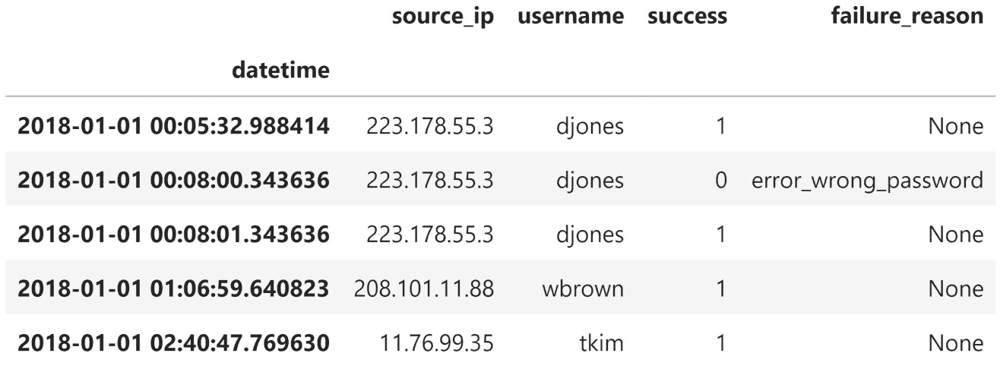
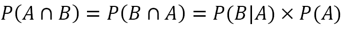

# 第十二章：*第十一章*：机器学习异常检测

对于我们的最终应用章节，我们将重新审视登录尝试中的**异常检测**。假设我们为一家公司工作，该公司在 2018 年初推出了其 Web 应用程序。自推出以来，此 Web 应用程序一直收集所有登录尝试的日志事件。我们知道尝试是从哪个 IP 地址发起的，尝试的结果是什么，何时进行的以及输入了哪个用户名。我们不知道的是尝试是由我们的有效用户之一还是由一个不良方尝试。

我们的公司正在扩展，并且由于数据泄露似乎每天都在新闻中，已创建了一个信息安全部门来监控流量。CEO 看到我们在*第八章*中识别黑客的基于规则的方法，*基于规则的异常检测*，并对我们的举措感到好奇，但希望我们超越使用规则和阈值来执行如此重要的任务。我们被委托开发一个机器学习模型，用于 Web 应用程序登录尝试的异常检测。

由于这将需要大量数据，我们已获得从 2018 年 1 月 1 日至 2018 年 12 月 31 日的所有日志的访问权限。此外，新成立的**安全运营中心**（**SOC**）现在将审核所有这些流量，并根据他们的调查指示哪些时间段包含恶意用户。由于 SOC 成员是专业领域的专家，这些数据对我们来说将非常宝贵。我们将能够利用他们提供的标记数据构建未来使用的监督学习模型；然而，他们需要一些时间来筛选所有的流量，因此在他们为我们准备好之前，我们应该开始一些无监督学习。

在本章中，我们将涵盖以下主题：

+   探索模拟登录尝试数据

+   利用无监督方法进行异常检测

+   实施监督异常检测

+   结合在线学习的反馈循环

# 章节材料

此章节的材料可在[`github.com/stefmolin/Hands-On-Data-Analysis-with-Pandas-2nd-edition/tree/master/ch_11`](https://github.com/stefmolin/Hands-On-Data-Analysis-with-Pandas-2nd-edition/tree/master/ch_11)找到。在本章中，我们将重新审视尝试登录数据；但是，`simulate.py`脚本已更新，以允许附加命令行参数。这次我们不会运行模拟，但请确保查看脚本并查看生成数据文件和为本章创建数据库所遵循的过程，详见`0-simulating_the_data.ipynb`笔记本。`user_data/`目录包含此模拟使用的文件，但在本章中我们不会直接使用它们。

本章将使用的模拟日志数据可以在`logs/`目录下找到。`logs_2018.csv`和`hackers_2018.csv`文件分别是 2018 年所有模拟中的登录尝试日志和黑客活动记录。带有`hackers`前缀的文件被视为我们将从 SOC 接收到的标记数据，因此我们一开始假设没有这些数据。文件名中包含`2019`而非`2018`的文件是模拟 2019 年第一季度的数据，而不是整年的数据。此外，CSV 文件已写入`logs.db` SQLite 数据库。`logs`表包含来自`logs_2018.csv`和`logs_2019.csv`的数据；`attacks`表包含来自`hackers_2018.csv`和`hackers_2019.csv`的数据。

仿真参数每月都不同，在大多数月份中，黑客会针对每个尝试登录的用户名更换 IP 地址。这将使我们在*第八章*中的方法，*基于规则的异常检测*，变得无效，因为我们曾试图寻找那些有大量尝试和高失败率的 IP 地址。如果黑客现在更换他们的 IP 地址，我们就不会有与他们关联的多次尝试。因此，我们将无法用这种策略标记他们，所以我们必须找到另一种方法来应对：


图 11.1 – 仿真参数

重要提示

`merge_logs.py`文件包含合并各个仿真日志的 Python 代码，`run_simulations.sh`包含用于运行整个过程的 Bash 脚本。这些文件提供完整性，但我们不需要使用它们（也不需要关心 Bash）。

本章的工作流程被拆分成几个笔记本，每个笔记本前面都有一个数字，表示它们的顺序。在获得标记数据之前，我们将在`1-EDA_unlabeled_data.ipynb`笔记本中进行一些 EDA 分析，然后转到`2-unsupervised_anomaly_detection.ipynb`笔记本，尝试一些无监督异常检测方法。获得标记数据后，我们将在`3-EDA_labeled_data.ipynb`笔记本中进行一些额外的 EDA 分析，然后转到`4-supervised_anomaly_detection.ipynb`笔记本进行有监督方法的实验。最后，我们将使用`5-online_learning.ipynb`笔记本来讨论在线学习。像往常一样，文本中会指示何时切换笔记本。

# 探索模拟登录尝试数据

我们还没有标签化的数据，但我们仍然可以检查数据，看看是否有一些显著的特点。这些数据与*第八章*中的数据不同，*基于规则的异常检测*。在这个模拟中，黑客更加聪明——他们不总是尝试很多用户，也不会每次都使用相同的 IP 地址。我们来看看是否可以通过在`1-EDA_unlabeled_data.ipynb`笔记本中进行一些 EDA，找出一些有助于异常检测的特征。

像往常一样，我们从导入开始。这些导入在所有笔记本中都是相同的，所以只在这一部分中重复：

```py
>>> %matplotlib inline
>>> import matplotlib.pyplot as plt
>>> import numpy as np
>>> import pandas as pd
>>> import seaborn as sns
```

接下来，我们从 SQLite 数据库中的`logs`表中读取 2018 年的日志：

```py
>>> import sqlite3
>>> with sqlite3.connect('logs/logs.db') as conn:
...     logs_2018 = pd.read_sql(
...         """
...         SELECT * 
...         FROM logs 
...         WHERE
...             datetime BETWEEN "2018-01-01" AND "2019-01-01";
...""", 
...         conn, parse_dates=['datetime'],
...         index_col='datetime'
...     )
```

提示

如果我们正在使用的环境中已安装 SQLAlchemy 包（如我们所用环境），我们可以选择通过`pd.read_sql()`提供数据库，而无需使用`with`语句。在我们的案例中，这将是`sqlite:///logs/logs.db`，其中`sqlite`是方言，`logs/logs.db`是文件的路径。请注意，路径中有三个连续的`/`字符。

我们的数据如下所示：



图 11.2 - 2018 年登录尝试日志

我们的数据类型将与*第八章*中的数据类型相同，*基于规则的异常检测*，唯一的例外是`success`列。SQLite 不支持布尔值，因此这个列在写入数据到数据库时被转换为其原始形式的二进制表示（存储为整数）：

```py
>>> logs_2018.dtypes
source_ip         object
username          object
success            int64
failure_reason    object
dtype: object
```

重要提示

我们在这里使用 SQLite 数据库，因为 Python 标准库已经提供了连接工具（`sqlite3`）。如果我们想使用其他类型的数据库，如 MySQL 或 PostgreSQL，就需要安装 SQLAlchemy（并且可能需要安装其他包，具体取决于数据库方言）。更多信息可以参考[`pandas.pydata.org/pandas-docs/stable/user_guide/io.html#sql-queries`](https://pandas.pydata.org/pandas-docs/stable/user_guide/io.html#sql-queries)。有关 SQLAlchemy 的教程，请查看本章末尾的*进一步阅读*部分。

使用`info()`方法，我们可以看到`failure_reason`是唯一一个包含空值的列。当尝试成功时，这个字段为空。在构建模型时，我们还应该关注数据的内存使用情况。某些模型可能需要增加数据的维度，这可能会迅速导致内存占用过大：

```py
>>> logs_2018.info()
<class 'pandas.core.frame.DataFrame'>
DatetimeIndex: 38700 entries, 
2018-01-01 00:05:32.988414 to 2018-12-31 23:29:42.482166
Data columns (total 4 columns):
 #   Column          Non-Null Count  Dtype 
---  ------          --------------  ----- 
 0   source_ip       38700 non-null  object
 1   username        38700 non-null  object
 2   success         38700 non-null  int64 
 3   failure_reason  11368 non-null  object
dtypes: int64(1), object(3)
memory usage: 1.5+ MB
```

运行 `describe()` 方法告诉我们，失败的最常见原因是提供了错误的密码。我们还可以看到，尝试的独立用户名数量（1,797）远超过我们的用户基数（133），这表明存在可疑活动。最多尝试的 IP 地址进行了 314 次尝试，但由于这不足以每天一次（记住，我们是在看 2018 年的全年数据），所以我们无法做出任何假设：

```py
>>> logs_2018.describe(include='all')
           source_ip username      success       failure_reason
count          38700    38700 38700.000000                11368
unique          4956     1797          NaN                    3
top   168.123.156.81   wlopez          NaN error_wrong_password
freq             314      387          NaN                 6646
mean             NaN      NaN     0.706253                  NaN
std              NaN      NaN     0.455483                  NaN
min              NaN      NaN     0.000000                  NaN
25%              NaN      NaN     0.000000                  NaN
50%              NaN      NaN     1.000000                  NaN
75%              NaN      NaN     1.000000                  NaN
max              NaN      NaN     1.000000                  NaN
```

我们可以查看每个 IP 地址的尝试登录的独立用户名，正如在 *第八章*《基于规则的异常检测》中所示，这显示大多数 IP 地址只有几个用户名，但至少有一个包含了很多：

```py
>>> logs_2018.groupby('source_ip')\
...     .agg(dict(username='nunique'))\
...     .username.describe()
count    4956.000000
mean        1.146287
std         1.916782
min         1.000000
25%         1.000000
50%         1.000000
75%         1.000000
max       129.000000
Name: username, dtype: float64
```

让我们计算每个 IP 地址的指标：

```py
>>> pivot = logs_2018.pivot_table(
...     values='success', index='source_ip', 
...     columns=logs_2018.failure_reason.fillna('success'), 
...     aggfunc='count', fill_value=0
... )
>>> pivot.insert(0, 'attempts', pivot.sum(axis=1))
>>> pivot = pivot\
...     .sort_values('attempts', ascending=False)\
...     .assign(
...         success_rate=lambda x: x.success / x.attempts,
...         error_rate=lambda x: 1 - x.success_rate
...     )
>>> pivot.head()
```

尝试次数最多的前五个 IP 地址似乎是有效用户，因为它们的成功率相对较高：


图 11.3 – 每个 IP 地址的指标

让我们使用这个数据框绘制每个 IP 地址的成功与尝试次数，以查看是否存在我们可以利用的模式来区分有效活动与恶意活动：

```py
>>> pivot.plot(
...     kind='scatter', x='attempts', y='success', 
...     title='successes vs. attempts by IP address',
...     alpha=0.25
... )
```

底部似乎有一些不属于该组的点，但请注意坐标轴的刻度并没有完全对齐。大多数点都沿着一条线分布，这条线的尝试与成功的比例稍微低于 1:1。回想一下，本章的模拟比我们在 *第八章*《基于规则的异常检测》中使用的模拟更具现实性；因此，如果我们将 *图 8.11* 与这个图进行比较，可以观察到在这里将有效活动与恶意活动分开要困难得多：


图 11.4 – 每个 IP 地址的成功与尝试次数散点图

记住，这是一个二分类问题，我们希望找到一种方法来区分有效用户和攻击者的登录活动。我们希望构建一个模型，学习一些决策边界，将有效用户与攻击者分开。由于有效用户更有可能正确输入密码，尝试与成功之间的关系将更接近 1:1，相对于攻击者。因此，我们可以想象分隔边界看起来像这样：


图 11.5 – 可能的决策边界

现在，问题是，这两组中哪个是攻击者？如果更多的 IP 地址是攻击者（因为他们为每个尝试的用户名使用不同的 IP 地址），那么有效用户将被视为异常值，而攻击者将被视为“内点”，并且通过箱型图来看。我们来创建一个看看是否真的是这样：

```py
>>> pivot[['attempts', 'success']].plot(
...     kind='box', subplots=True, figsize=(10, 3), 
...     title='stats per IP address'
... )
```

确实，情况好像是这样。我们的有效用户成功的次数比攻击者更多，因为他们只使用了 1-3 个不同的 IP 地址：


图 11.6 – 使用每个 IP 地址的度量寻找离群值

显然，像这样查看数据并没有太大帮助，所以让我们看看能否通过更细粒度的方式来帮助我们。让我们可视化 2018 年 1 月每分钟内的登录尝试分布、用户名数量和每个 IP 地址的失败次数：

```py
>>> from matplotlib.ticker import MultipleLocator
>>> ax = logs_2018.loc['2018-01'].assign(
...     failures=lambda x: 1 - x.success
... ).groupby('source_ip').resample('1min').agg({
...     'username': 'nunique', 
...     'success': 'sum', 
...     'failures': 'sum'
... }).assign(
...     attempts=lambda x: x.success + x.failures
... ).dropna().query('attempts > 0').reset_index().plot(
...     y=['attempts', 'username', 'failures'], kind='hist',
...     subplots=True, layout=(1, 3), figsize=(20, 3),
...     title='January 2018 distributions of minutely stats'
...           'by IP address'
... )
>>> for axes in ax.flatten():
...     axes.xaxis.set_major_locator(MultipleLocator(1))
```

看起来大多数 IP 地址只有一个用户名关联；不过，也有一些 IP 地址在尝试时出现了多个失败：


图 11.7 – 每分钟每个 IP 地址的度量分布

也许将唯一用户名和失败次数结合起来，能够提供一些不依赖于 IP 地址恒定性的特征。让我们可视化 2018 年每分钟内带有失败的用户名数量：

```py
>>> logs_2018.loc['2018'].assign(
...     failures=lambda x: 1 - x.success
... ).query('failures > 0').resample('1min').agg(
...     {'username': 'nunique', 'failures': 'sum'}
... ).dropna().rename(
...     columns={'username': 'usernames_with_failures'}
... ).usernames_with_failures.plot(
...     title='usernames with failures per minute in 2018', 
...     figsize=(15, 3)
... ).set_ylabel('usernames with failures')
```

这看起来很有前景；我们肯定应该关注带有失败的用户名的峰值。这可能是我们网站的问题，或者是恶意攻击：


图 11.8 – 随时间变化的带有失败的用户名

在对我们将要处理的数据进行了彻底探索后，我们已经有了一些思路，知道在构建机器学习模型时可以使用哪些特征。由于我们还没有标签数据，接下来让我们尝试一些无监督模型。

# 利用无监督的异常检测方法

如果黑客与我们的有效用户显著不同，且容易被识别，使用无监督方法可能会非常有效。在我们获得标签数据之前，或者如果标签数据很难收集或不保证能代表我们希望标记的完整范围时，这是一个很好的起点。请注意，在大多数情况下，我们没有标签数据，因此熟悉一些无监督方法至关重要。

在我们初步的数据探索分析（EDA）中，我们将每分钟内尝试登录失败的用户名数量作为异常检测的特征。接下来，我们将测试一些无监督的异常检测算法，以这个特征为出发点。Scikit-learn 提供了几种这样的算法。在本节中，我们将重点讨论隔离森林（isolation forest）和局部离群因子（local outlier factor）；另一种方法，使用一类**支持向量机**（**SVM**），在*习题*部分有介绍。

在我们尝试这些方法之前，我们需要准备训练数据。由于 SOC 将首先传输 2018 年 1 月的标签数据，我们将仅使用 2018 年 1 月的逐分钟数据进行无监督模型。我们的特征将是星期几（独热编码）、一天中的小时（独热编码）以及失败用户名的数量。如果需要复习独热编码，可以参考《第九章，Python 中的机器学习入门》中的*编码数据*部分。

让我们转到`2-unsupervised_anomaly_detection.ipynb`笔记本，并编写一个实用函数，轻松获取这些数据：

```py
>>> def get_X(log, day):
...     """
...     Get data we can use for the X
...
...     Parameters:
...         - log: The logs dataframe
...         - day: A day or single value we can use as a
...                datetime index slice
...
...     Returns: 
...         A `pandas.DataFrame` object
...     """
...     return pd.get_dummies(
...         log.loc[day].assign(
...             failures=lambda x: 1 - x.success
...         ).query('failures > 0').resample('1min').agg(
...             {'username': 'nunique', 'failures': 'sum'}
...         ).dropna().rename(
...             columns={'username': 'usernames_with_failures'}
...         ).assign(
...             day_of_week=lambda x: x.index.dayofweek, 
...             hour=lambda x: x.index.hour
...         ).drop(columns=['failures']),
...         columns=['day_of_week', 'hour']
...     )
```

现在，我们可以抓取 1 月的数据并将其存储在`X`中：

```py
>>> X = get_X(logs_2018, '2018-01')
>>> X.columns
Index(['usernames_with_failures', 'day_of_week_0',
       'day_of_week_1', 'day_of_week_2', 'day_of_week_3',
       'day_of_week_4', 'day_of_week_5', 'day_of_week_6',
       'hour_0', 'hour_1', ..., 'hour_22', 'hour_23'],
      dtype='object')
```

## 隔离森林

**隔离森林**算法利用分割技术将异常值从其余数据中隔离开来，因此可以用于异常检测。从内部实现来看，它是一个随机森林，其中的分割是在随机选择的特征上进行的。选择该特征在最大值和最小值之间的一个随机值来进行分割。请注意，这个范围是基于树中该节点特征的范围，而不是起始数据的范围。

森林中的一棵树大致如下所示：


图 11.9 – 隔离森林中单棵树的示例

从森林中每棵树的顶部到包含给定点的叶节点的路径长度平均值，用于对点进行异常值或内点的评分。异常值的路径较短，因为它们通常会位于某个分割的某一侧，并且与其他点的相似性较低。相反，具有许多公共维度的点需要更多的分割来将其分开。

重要提示

更多关于此算法的信息，请访问[`scikit-learn.org/stable/modules/outlier_detection.html#isolation-forest`](https://scikit-learn.org/stable/modules/outlier_detection.html#isolation-forest)。

让我们实现一个带有管道的隔离森林模型，首先对我们的数据进行标准化处理：

```py
>>> from sklearn.ensemble import IsolationForest
>>> from sklearn.pipeline import Pipeline
>>> from sklearn.preprocessing import StandardScaler
>>> iso_forest_pipeline = Pipeline([
...     ('scale', StandardScaler()),
...     ('iforest', IsolationForest(
...         random_state=0, contamination=0.05
...     ))
... ]).fit(X)
```

我们需要指定预计为异常值的数据比例（`contamination`），我们估计为 5%；选择这个值会有些困难，因为我们没有标签数据。有一个`auto`选项可以为我们确定一个值，但在这种情况下，它没有给出任何异常值，所以很明显这个值不是我们想要的。实际上，我们可以对数据进行统计分析来确定一个初始值，或者咨询领域专家。

`predict()`方法可用于检查每个数据点是否为异常值。`scikit-learn`中实现的异常检测算法通常会返回`1`或`-1`，分别表示该点为内点或异常值：

```py
>>> isolation_forest_preds = iso_forest_pipeline.predict(X)
>>> pd.Series(np.where(
...     isolation_forest_preds == -1, 'outlier', 'inlier'
... )).value_counts()
inlier     42556
outlier     2001
dtype: int64
```

由于我们还没有标签数据，我们稍后会回来评估；现在，让我们来看一下本章讨论的第二个无监督算法。

## 局部异常因子

虽然内点通常位于数据集的密集区域（这里是 32 维空间），但异常值往往位于稀疏且更为孤立的区域，附近的点较少。**局部异常因子**（**LOF**）算法会寻找这些稀疏的区域来识别异常值。它根据每个点周围密度与其最近邻居的密度比率来对所有点进行评分。被认为是正常的点，其密度与邻居相似；而那些周围点较少的点则被视为异常。

重要说明

有关该算法的更多信息，请访问[`scikit-learn.org/stable/modules/outlier_detection.html#local-outlier-factor`](https://scikit-learn.org/stable/modules/outlier_detection.html#local-outlier-factor)。

我们再构建一个管道，不过将隔离森林换成 LOF。请注意，我们必须猜测`n_neighbors`参数的最佳值，因为如果没有标记数据，`GridSearchCV`没有任何模型评分的依据。我们使用该参数的默认值，即`20`：

```py
>>> from sklearn.neighbors import LocalOutlierFactor
>>> from sklearn.pipeline import Pipeline
>>> from sklearn.preprocessing import StandardScaler
>>> lof_pipeline = Pipeline([
...     ('scale', StandardScaler()),
...     ('lof', LocalOutlierFactor())
... ]).fit(X)
```

现在，让我们看看这次有多少个异常值。LOF 没有`predict()`方法，因此我们必须检查 LOF 对象的`negative_outlier_factor_`属性，查看我们拟合的数据点的评分：

```py
>>> lof_preds = lof_pipeline.named_steps['lof']\
...     .negative_outlier_factor_ 
>>> lof_preds
array([-1.33898756e+10, -1.00000000e+00, -1.00000000e+00, ...,
       -1.00000000e+00, -1.00000000e+00, -1.11582297e+10])
```

LOF 和隔离森林之间还有另一个区别：`negative_outlier_factor_`属性的值不是严格的`-1`或`1`。事实上，它们可以是任何数字——看一下前一个结果中的第一个和最后一个值，你会发现它们远小于`-1`。这意味着我们不能像使用隔离森林时那样，使用方法来计算内点和异常值。相反，我们需要将`negative_outlier_factor_`属性与 LOF 模型的`offset_`属性进行比较，后者告诉我们在训练过程中（使用`contamination`参数）由 LOF 模型确定的截断值：

```py
>>> pd.Series(np.where(
...     lof_preds < lof_pipeline.named_steps['lof'].offset_, 
...     'outlier', 'inlier'
... )).value_counts()
inlier     44248
outlier      309
dtype: int64
```

现在我们有了两个无监督模型，我们需要比较它们，看看哪个对我们的利益相关者更有益。

## 比较模型

与隔离森林相比，LOF 表示的异常值较少，但它们可能并不完全一致。正如我们在*第十章*《做出更好的预测 – 优化模型》中学到的那样，我们可以使用`sklearn.metrics`中的`cohen_kappa_score()`函数来检查它们的一致性水平：

```py
>>> from sklearn.metrics import cohen_kappa_score
>>> is_lof_outlier = np.where(
...     lof_preds < lof_pipeline.named_steps['lof'].offset_, 
...     'outlier', 'inlier'
... )
>>> is_iso_outlier = np.where(
...     isolation_forest_preds == -1, 'outlier', 'inlier'
... )
>>> cohen_kappa_score(is_lof_outlier, is_iso_outlier)
0.25862517997335677
```

它们的一致性水平较低，表明哪些数据点是异常值并不是显而易见的。然而，没有标记数据，我们真的无法判断哪个更好。我们需要与结果的使用者合作，确定哪个模型能提供最有用的数据。幸运的是，SOC 刚刚发送了 2018 年 1 月的标记数据，因此我们可以确定哪个模型更好，并让他们开始使用，直到我们准备好监督学习模型。

首先，我们将读取他们写入数据库的标记数据，位于`attacks`表，并添加一些列，指示攻击开始的分钟、持续时间以及攻击结束的时间：

```py
>>> with sqlite3.connect('logs/logs.db') as conn:
...     hackers_jan_2018 = pd.read_sql(
...         """
...         SELECT * 
...         FROM attacks 
...         WHERE start BETWEEN "2018-01-01" AND "2018-02-01";
...         """, conn, parse_dates=['start', 'end']
...     ).assign(
...         duration=lambda x: x.end - x.start,
...         start_floor=lambda x: x.start.dt.floor('min'),
...         end_ceil=lambda x: x.end.dt.ceil('min')
...     )
>>> hackers_jan_2018.shape
(7, 6)
```

请注意，SOC 只有每次攻击涉及的单一 IP 地址，因此我们不再依赖它。相反，SOC 希望我们告诉他们在何时有可疑活动，以便他们进一步调查。还请注意，尽管攻击持续时间短，但我们按分钟的数据意味着每次攻击都会触发许多警报：


Figure 11.10 – 用于评估我们模型的标记数据

使用`start_floor`和`end_ceil`列，我们可以创建一个时间范围，并检查我们标记为异常值的数据是否落在该范围内。为此，我们将使用以下函数：

```py
>>> def get_y(datetimes, hackers, resolution='1min'):
...     """
...     Get data we can use for the y (whether or not a
...     hacker attempted a log in during that time).
...
...     Parameters:
...         - datetimes: The datetimes to check for hackers
...         - hackers: The dataframe indicating when the 
...                    attacks started and stopped
...         - resolution: The granularity of the datetime. 
...                       Default is 1 minute.
...
...     Returns: `pandas.Series` of Booleans.
...     """
...     date_ranges = hackers.apply(
...         lambda x: pd.date_range(
...             x.start_floor, x.end_ceil, freq=resolution
...         ), 
...         axis=1
...     )
...     dates = pd.Series(dtype='object')
...     for date_range in date_ranges:
...         dates = pd.concat([dates, date_range.to_series()])
...     return datetimes.isin(dates)
```

现在，让我们找出`X`数据中发生黑客活动的时间：

```py
>>> is_hacker = \
...     get_y(X.reset_index().datetime, hackers_jan_2018)
```

我们现在拥有了制作分类报告和混淆矩阵所需的一切。由于我们将频繁传入`is_hacker`系列，我们将制作一些部分函数，以减少打字量：

```py
>>> from functools import partial
>>> from sklearn.metrics import classification_report
>>> from ml_utils.classification import confusion_matrix_visual
>>> report = partial(classification_report, is_hacker)
>>> conf_matrix = partial(
...     confusion_matrix_visual, is_hacker, 
...     class_labels=[False, True]
... )
```

我们从分类报告开始，它们表明隔离森林在召回率方面要好得多：

```py
>>> iso_forest_predicts_hacker = isolation_forest_preds == - 1
>>> print(report(iso_forest_predicts_hacker)) # iso. forest
              precision    recall  f1-score   support
       False       1.00      0.96      0.98     44519
        True       0.02      0.82      0.03        38
    accuracy                           0.96     44557
   macro avg       0.51      0.89      0.50     44557
weighted avg       1.00      0.96      0.98     44557
>>> lof_predicts_hacker = \
...     lof_preds < lof_pipeline.named_steps['lof'].offset_ 
>>> print(report(lof_predicts_hacker)) # LOF
              precision    recall  f1-score   support
       False       1.00      0.99      1.00     44519
        True       0.03      0.26      0.06        38
    accuracy                           0.99     44557
   macro avg       0.52      0.63      0.53     44557
weighted avg       1.00      0.99      1.00     44557
```

为了更好地理解分类报告中的结果，让我们为我们的无监督方法创建混淆矩阵，并将它们并排放置以进行比较：

```py
>>> fig, axes = plt.subplots(1, 2, figsize=(15, 5))
>>> conf_matrix(
...     iso_forest_predicts_hacker, 
...     ax=axes[0], title='Isolation Forest'
... )
>>> conf_matrix(
...     lof_predicts_hacker, 
...     ax=axes[1], title='Local Outlier Factor'
... )
```

隔离森林的真阳性更多，假阳性也更多，但它的假阴性较少：


Figure 11.11 – 我们的无监督模型的混淆矩阵

SOC 告知我们，假阴性比假阳性更为昂贵。然而，他们希望我们能控制假阳性，以避免因过多的错误警报而影响团队工作。这告诉我们，召回率（**真阳性率**（**TPR**））作为性能指标比精度更为重要。SOC 希望我们把目标定为*至少 70%的召回率*。

由于我们有一个非常大的类别不平衡，**假阳性率**（**FPR**）对我们来说并不会提供太多信息。记住，FPR 是假阳性与假阳性和真阴性之和的比率（即所有属于负类的部分）。由于攻击事件的稀有性，我们将拥有非常多的真阴性，因此 FPR 会保持在一个非常低的水平。因此，SOC 决定的次要指标是达到*85%以上的精度*。

隔离森林模型超出了我们的召回率目标，但精确度过低。由于我们能够获取一些标记数据，现在可以使用监督学习来找到发生可疑活动的分钟数（请注意，这并不总是适用）。让我们看看能否利用这些额外信息更精确地找到感兴趣的分钟。

# 实现监督学习的异常检测

SOC 已经完成了 2018 年数据的标记，因此我们应该重新审视我们的 EDA，确保我们查看每分钟失败用户名数量的计划能有效地区分数据。这部分 EDA 在`3-EDA_labeled_data.ipynb`笔记本中。经过一些数据清洗后，我们成功创建了以下散点图，这表明这一策略确实能够有效地区分可疑活动：


图 11.12 – 确认我们的特征能够帮助形成决策边界

在`4-supervised_anomaly_detection.ipynb`笔记本中，我们将创建一些监督学习模型。这次我们需要读取 2018 年的所有标记数据。请注意，读取日志的代码被省略了，因为它与上一节中的代码相同：

```py
>>> with sqlite3.connect('logs/logs.db') as conn:
...     hackers_2018 = pd.read_sql(
...         """
...         SELECT * 
...         FROM attacks 
...         WHERE start BETWEEN "2018-01-01" AND "2019-01-01";
...         """, conn, parse_dates=['start', 'end']
...     ).assign(
...         duration=lambda x: x.end - x.start,
...         start_floor=lambda x: x.start.dt.floor('min'),
...         end_ceil=lambda x: x.end.dt.ceil('min')
...     )
```

然而，在构建模型之前，让我们创建一个新函数，它可以同时生成`X`和`y`。`get_X_y()`函数将使用我们之前创建的`get_X()`和`get_y()`函数，返回`X`和`y`：

```py
>>> def get_X_y(log, day, hackers):
...     """
...     Get the X, y data to build a model with.
...
...     Parameters:
...         - log: The logs dataframe
...         - day: A day or single value we can use as a 
...                datetime index slice
...         - hackers: The dataframe indicating when the 
...                    attacks started and stopped
...
...     Returns:
...         X, y tuple where X is a `pandas.DataFrame` object
...         and y is a `pandas.Series` object
...     """
...     X = get_X(log, day)
...     y = get_y(X.reset_index().datetime, hackers)
...     return X, y
```

现在，让我们使用 2018 年 1 月的数据创建一个训练集，并使用 2018 年 2 月的数据创建一个测试集，使用我们的新函数：

```py
>>> X_train, y_train = \
...     get_X_y(logs_2018, '2018-01', hackers_2018)
>>> X_test, y_test = \
...     get_X_y(logs_2018, '2018-02', hackers_2018)
```

重要提示

尽管我们面临着非常大的类别不平衡问题，但我们不会直接去平衡训练集。尝试模型时避免过早优化是至关重要的。如果我们构建的模型发现受到了类别不平衡的影响，那么我们可以尝试这些技术。记住，对过采样/欠采样技术要非常小心，因为有些方法对数据做出假设，这些假设并不总是适用或现实的。以 SMOTE 为例——我们真的能指望未来的攻击者和我们数据中的攻击者相似吗？

让我们使用这些数据来构建一些监督异常检测模型。请记住，SOC 已经为我们设定了召回率（至少 70%）和精确度（85%或更高）的性能要求，因此我们将使用这些指标来评估我们的模型。

## 基准化

我们的第一步是构建一些基准模型，以确保我们的机器学习算法优于一些简单的模型，并且具有预测价值。我们将构建两个这样的模型：

+   一个虚拟分类器，它将根据数据中的分层来预测标签。

+   一个朴素贝叶斯模型，它将利用贝叶斯定理预测标签。

### 虚拟分类器

一个虚拟分类器将为我们提供一个与我们在 ROC 曲线中绘制的基准相当的模型。结果将故意很差。我们永远不会使用这个分类器来实际进行预测；而是可以用它来查看我们构建的模型是否比随机猜测策略更好。在 `dummy` 模块中，`scikit-learn` 提供了 `DummyClassifier` 类，正是为了这个目的。

使用 `strategy` 参数，我们可以指定虚拟分类器将如何做出预测。以下是一些有趣的选项：

+   `uniform`: 分类器每次都会猜测观察结果是否属于黑客攻击尝试。

+   `most_frequent`: 分类器将始终预测最频繁的标签，在我们的案例中，这将导致永远不会标记任何内容为恶意。这将达到较高的准确度，但毫无用处，因为少数类才是我们关心的类别。

+   `stratified`: 分类器将使用训练数据中的类别分布，并将这种比例保持在其猜测中。

让我们使用 `stratified` 策略构建一个虚拟分类器：

```py
>>> from sklearn.dummy import DummyClassifier
>>> dummy_model = DummyClassifier(
...     strategy='stratified', random_state=0
... ).fit(X_train, y_train)
>>> dummy_preds = dummy_model.predict(X_test)
```

现在我们已经有了第一个基准模型，接下来让我们衡量其性能以便进行比较。我们将同时使用 ROC 曲线和精度-召回曲线来展示类别不平衡如何让 ROC 曲线对性能过于乐观。为了减少输入，我们将再次创建一些部分：

```py
>>> from functools import partial
>>> from sklearn.metrics import classification_report
>>> from ml_utils.classification import (
...     confusion_matrix_visual, plot_pr_curve, plot_roc
... )
>>> report = partial(classification_report, y_test)
>>> roc = partial(plot_roc, y_test)
>>> pr_curve = partial(plot_pr_curve, y_test)
>>> conf_matrix = partial(
...     confusion_matrix_visual, y_test, 
...     class_labels=[False, True]
... )
```

回想一下我们在 *第九章* 《用 Python 开始机器学习》中最初讨论的 ROC 曲线，斜线代表虚拟模型的随机猜测。如果我们的性能不比这条线好，那么我们的模型就没有预测价值。我们刚刚创建的虚拟模型相当于这条线。让我们使用子图来可视化基准 ROC 曲线、精度-召回曲线和混淆矩阵：

```py
>>> fig, axes = plt.subplots(1, 3, figsize=(20, 5))
>>> roc(dummy_model.predict_proba(X_test)[:,1], ax=axes[0])
>>> conf_matrix(dummy_preds, ax=axes[1])
>>> pr_curve(
...     dummy_model.predict_proba(X_test)[:,1], ax=axes[2]
... )
>>> plt.suptitle('Dummy Classifier with Stratified Strategy')
```

虚拟分类器无法标记任何攻击者。ROC 曲线（TPR 与 FPR）表明，虚拟模型没有预测价值，其 **曲线下面积** (**AUC**) 为 0.5。请注意，精度-召回曲线下的面积几乎为零：


图 11.13 – 使用虚拟分类器进行基准测试

由于我们有非常严重的类别不平衡，分层随机猜测策略应该在少数类上表现糟糕，而在多数类上表现非常好。我们可以通过查看分类报告来观察这一点：

```py
>>> print(report(dummy_preds))
              precision    recall  f1-score   support
       False       1.00      1.00      1.00     39958
        True       0.00      0.00      0.00         5
    accuracy                           1.00     39963
   macro avg       0.50      0.50      0.50     39963
weighted avg       1.00      1.00      1.00     39963
```

### Naive Bayes

我们的最后一个基准模型将是朴素贝叶斯分类器。在我们讨论这个模型之前，我们需要回顾几个概率学的概念。第一个是条件概率。当处理两个事件 *A* 和 *B* 时，事件 *A* 在事件 *B* 发生的条件下发生的概率叫做 **条件概率**，记作 *P(A|B)*。当事件 *A* 和 *B* 是独立的，即 *B* 的发生并不告诉我们 *A* 的发生与否，反之亦然，*P(A|B)* 就等于 *P(A)*。

条件概率被定义为**联合概率**，即 *A* 和 *B* 同时发生的概率（这两个事件的交集），写作 *P(A* *∩* *B)*，除以 *B* 发生的概率（前提是这个概率不为零）：


这个方程可以重新排列如下：


*A* *∩* *B* 的联合概率等同于 *B* *∩* *A*；因此，我们得到以下方程：



由此，我们可以将第一个方程改为使用条件概率而不是联合概率。这给出了**贝叶斯定理**：


在使用前述方程时，*P(A)* 被称为**先验概率**，即事件 *A* 发生的初步信念程度。在考虑事件 *B* 发生后，这个初步信念会被更新；这个更新后的概率表示为 *P(A|B)*，称为**后验概率**。事件 *A* 给定时事件 *B* 的**似然**是 *P(B|A)*。事件 *B* 发生所支持的事件 *A* 发生的信念为：


我们来看一个例子——假设我们正在构建一个垃圾邮件过滤器，并且发现 10%的电子邮件是垃圾邮件。这 10%是我们的先验，或者*P(spam)*。我们想知道在邮件中包含单词*free*的情况下，刚收到的邮件是垃圾邮件的概率——我们想要找的是*P(spam|free)*。为了找到这个概率，我们需要知道在邮件是垃圾邮件的情况下，单词*free*出现在邮件中的概率，或者*P(free|spam)*，以及单词*free*出现在邮件中的概率，或者*P(free)*。

假设我们得知 12%的电子邮件包含单词*free*，而 20%被判定为垃圾邮件的电子邮件包含单词*free*。将这些信息代入前面的方程中，我们可以看到，一旦我们知道一封电子邮件包含单词*free*，我们认为它是垃圾邮件的概率从 10%增加到 16.7%，这就是我们的后验概率：


贝叶斯定理可以在一种称为`X`特征的分类器中得到应用，给定`y`变量（即 *P(x*i*|y,x*1*...x*n*)* 等同于 *P(x*i*|y)*）。它们被称为*朴素*分类器，因为这种假设通常是错误的；然而，这些分类器在构建垃圾邮件过滤器时通常表现良好。

假设我们在电子邮件中也找到了多个美元符号和单词*处方*，我们想知道它是垃圾邮件的概率。虽然这些特征可能相互依赖，但朴素贝叶斯模型会将它们视为条件独立。这意味着我们现在的后验概率方程如下：


假设我们发现 5% 的垃圾邮件包含多个美元符号，55% 的垃圾邮件包含单词 *prescription*，25% 的邮件包含多个美元符号，而单词 *prescription* 在 2% 的邮件中出现。 这意味着，考虑到邮件中有 *free* 和 *prescription* 以及多个美元符号，我们认为它是垃圾邮件的概率从 10% 提升到了 91.7%：


现在我们已经理解了该算法的基础，接下来构建一个 Naive Bayes 分类器。请注意，`scikit-learn` 提供了各种 Naive Bayes 分类器，这些分类器在假定特征似然的分布上有所不同，我们将其定义为 *P(x*i*|y,x*1*...x*n*)*。我们将使用假设特征是正态分布的版本，即 `GaussianNB`：

```py
>>> from sklearn.naive_bayes import GaussianNB
>>> from sklearn.pipeline import Pipeline
>>> from sklearn.preprocessing import StandardScaler
>>> nb_pipeline = Pipeline([
...     ('scale', StandardScaler()),
...     ('nb', GaussianNB())
... ]).fit(X_train, y_train)
>>> nb_preds = nb_pipeline.predict(X_test)
```

我们可以从模型中获取类的先验信息，在这个例子中，告诉我们包含正常活动的分钟数的先验概率为 99.91%，异常活动的先验概率为 0.09%：

```py
>>> nb_pipeline.named_steps['nb'].class_prior_
array([9.99147160e-01, 8.52840182e-04])
```

Naive Bayes 是一个很好的基线模型，因为我们不需要调整任何超参数，而且它训练速度很快。让我们看看它在测试数据上的表现（2018 年 2 月）：

```py
>>> fig, axes = plt.subplots(1, 3, figsize=(20, 5))
>>> roc(nb_pipeline.predict_proba(X_test)[:,1], ax=axes[0])
>>> conf_matrix(nb_preds, ax=axes[1])
>>> pr_curve(
...     nb_pipeline.predict_proba(X_test)[:,1], ax=axes[2]
... )
>>> plt.suptitle('Naive Bayes Classifier')
```

Naive Bayes 分类器找到了所有五个攻击者，并且在 ROC 曲线和精确度-召回曲线中都超过了基线（虚线），这意味着该模型具有一定的预测价值：


图 11.14 – Naive Bayes 分类器的性能

不幸的是，我们触发了大量的假阳性（8,218）。在 2 月份，大约每 1,644 次攻击分类中，就有 1 次确实是攻击。这导致了用户对这些分类变得不敏感。他们可能会选择始终忽略我们的分类，因为这些分类太嘈杂，从而错过了真正的问题。这种权衡可以通过分类报告中的指标来捕捉：

```py
>>> print(report(nb_preds))
              precision    recall  f1-score   support
       False       1.00      0.79      0.89     39958
        True       0.00      1.00      0.00         5
    accuracy                           0.79     39963
   macro avg       0.50      0.90      0.44     39963
weighted avg       1.00      0.79      0.89     39963
```

尽管 Naive Bayes 分类器的表现超过了虚拟分类器，但它未能满足我们利益相关者的要求。由于有大量假阳性，目标类的精确度接近零。召回率高于精确度，因为该模型对于假阴性比假阳性更敏感（因为它不是很挑剔）。这使得 F1 分数为零。现在，让我们尝试超越这些基线模型。

## 逻辑回归

由于逻辑回归是另一个简单的模型，我们接下来试试看。在*第九章*《使用 Python 进行机器学习入门》中，我们已经使用逻辑回归解决了分类问题，因此我们已经知道它是如何工作的。正如我们在*第十章*《做出更好的预测——优化模型》中所学到的，我们将使用网格搜索来在期望的搜索空间中找到正则化超参数的最佳值，并使用`recall_macro`作为评分标准。请记住，假阴性会带来很大的代价，因此我们重点关注召回率。`_macro`后缀表示我们希望计算正负类的召回率的平均值，而不是总体召回率（因为类别不平衡）。

提示

如果我们确切知道召回率对我们来说比精确度更重要，我们可以用`sklearn.metrics`中的`make_scorer()`函数自定义评分器来替代。在我们正在使用的笔记本中有一个示例。

在使用网格搜索时，`scikit-learn`可能会在每次迭代时打印警告。因此，为了避免我们需要滚动查看所有信息，我们将使用`%%capture`魔法命令来捕获所有将被打印的内容，以保持笔记本的整洁：

```py
>>> %%capture
>>> from sklearn.linear_model import LogisticRegression
>>> from sklearn.model_selection import GridSearchCV
>>> from sklearn.pipeline import Pipeline
>>> from sklearn.preprocessing import StandardScaler
>>> lr_pipeline = Pipeline([
...     ('scale', StandardScaler()),
...     ('lr', LogisticRegression(random_state=0))
... ])
>>> search_space = {'lr__C': [0.1, 0.5, 1, 2]}
>>> lr_grid = GridSearchCV(
...     lr_pipeline, search_space, scoring='recall_macro', cv=5
... ).fit(X_train, y_train)
>>> lr_preds = lr_grid.predict(X_test) 
```

提示

使用`%%capture`，所有的错误和输出默认都会被捕获。我们可以选择使用`--no-stderr`仅隐藏错误，使用`--no-stdout`仅隐藏输出。这些选项在`%%capture`后面使用；例如，`%%capture --no-stderr`。

如果我们想要隐藏特定的错误，可以改用`warnings`模块。例如，在从`warnings`模块导入`filterwarnings`后，我们可以运行以下命令来忽略未来的弃用警告：`filterwarnings('ignore', category=DeprecationWarning)`

现在我们已经训练好了逻辑回归模型，让我们检查一下性能：

```py
>>> fig, axes = plt.subplots(1, 3, figsize=(20, 5))
>>> roc(lr_grid.predict_proba(X_test)[:,1], ax=axes[0])
>>> conf_matrix(lr_preds, ax=axes[1])
>>> pr_curve(lr_grid.predict_proba(X_test)[:,1], ax=axes[2])
>>> plt.suptitle('Logistic Regression Classifier')
```

该模型没有假阳性，表现明显优于基准模型。ROC 曲线显著更接近左上角，精确率-召回率曲线也更接近右上角。注意，ROC 曲线对性能的评估略显乐观：


图 11.15 – 使用逻辑回归的性能

该模型满足 SOC 的要求。我们的召回率至少为 70%，精确度至少为 85%：

```py
>>> print(report(lr_preds))
              precision    recall  f1-score   support
       False       1.00      1.00      1.00     39958
        True       1.00      0.80      0.89         5
    accuracy                           1.00     39963
   macro avg       1.00      0.90      0.94     39963
weighted avg       1.00      1.00      1.00     39963
```

SOC 已经为我们提供了 2019 年 1 月和 2 月的数据，他们希望我们更新模型。不幸的是，我们的模型已经训练完毕，因此我们可以选择从头开始重新构建模型，或者忽略这些新数据。理想情况下，我们应该建立一个具有反馈循环的模型，以便能够融入这些（以及未来的）新数据。在下一节中，我们将讨论如何做到这一点。

# 将在线学习与反馈循环相结合

到目前为止，我们构建的模型存在一些重大问题。与我们在*第九章*，*Python 中的机器学习入门*，和 *第十章* ，*优化模型 – 做出更好的预测* 中使用的数据不同，我们不应该期望攻击者的行为随着时间的推移保持静态。同时，我们能够在内存中存储的数据量也有限，这限制了我们可以用来训练模型的数据量。因此，我们现在将构建一个在线学习模型，用于标记每分钟失败次数异常的用户名。**在线学习**模型会不断更新（通过流式传输的近实时更新，或批量更新）。这使得我们能够在新数据到达时进行学习，然后将其丢弃（以保持内存空间）。

此外，模型可以随着时间的推移发展，并适应数据底层分布的变化。我们还将为模型提供反馈，以便它在学习过程中能够确保对攻击者行为的变化保持鲁棒性。这就是`scikit-learn`支持这种行为的原因；因此，我们仅能使用提供`partial_fit()`方法的模型（没有这个方法的模型需要用新数据从头开始训练）。

提示

`scikit-learn`将实现`partial_fit()`方法的模型称为**增量学习器**。更多信息，包括哪些模型支持此方法，可以在[`scikit-learn.org/stable/computing/scaling_strategies.html#incremental-learning`](https://scikit-learn.org/stable/computing/scaling_strategies.html#incremental-learning)中找到。

我们的数据目前是按分钟汇总的，然后传递给模型，因此这将是批量学习，而非流式学习；但是请注意，如果我们将其投入生产环境，我们可以每分钟更新一次模型（如果需要的话）。

## 创建 PartialFitPipeline 子类

我们在*第九章*，*Python 中的机器学习入门*中看到，`Pipeline`类使得简化我们的机器学习流程变得轻而易举，但不幸的是，我们无法在`partial_fit()`方法中使用它。为了绕过这个问题，我们可以创建自己的`PartialFitPipeline`类，它是`Pipeline`类的子类，但支持调用`partial_fit()`。`PartialFitPipeline`类位于`ml_utils.partial_fit_pipeline`模块中。

我们只需从`sklearn.pipeline.Pipeline`继承，并定义一个新的方法——`partial_fit()`——该方法会对除最后一步之外的所有步骤调用`fit_transform()`，并对最后一步调用`partial_fit()`：

```py
from sklearn.pipeline import Pipeline
class PartialFitPipeline(Pipeline):
    """
    Subclass of sklearn.pipeline.Pipeline that supports the 
    `partial_fit()` method.
    """
    def partial_fit(self, X, y):
        """
        Run `partial_fit()` for online learning estimators 
        when used in a pipeline.
        """
        # for all but last step
        for _, step in self.steps[:-1]: # (name, object) tuples
            X = step.fit_transform(X)
        # grab object from tuple position 1 for partial_fit()
        self.steps[-1][1].partial_fit(X, y)
        return self
```

现在我们已经有了`PartialFitPipeline`类，剩下的最后一部分就是选择一个能够进行在线学习的模型。

## 随机梯度下降分类器

我们的逻辑回归模型表现良好——它满足了召回率和精确度的要求。然而，`LogisticRegression` 类不支持在线学习，因为它计算系数的方法是一个封闭解。我们可以选择使用优化算法，如梯度下降，来代替计算系数；这样就可以实现在线学习。

我们可以训练一个新的逻辑回归模型，使用`SGDClassifier`类，而不是使用不同的增量学习器。它使用**随机梯度下降**（**SGD**）来优化我们选择的损失函数。在这个示例中，我们将使用对数损失，它让我们得到一个通过 SGD 找到系数的逻辑回归模型。

与标准梯度下降优化方法需要查看所有样本或批次来估算梯度不同，SGD 通过随机选择样本（随机性）来减少计算成本。模型从每个样本学习的多少取决于**学习率**，早期更新的影响大于后期更新。SGD 的单次迭代过程如下：

1.  洗牌训练数据。

1.  对于训练数据中的每个样本，估计梯度并根据学习率所确定的递减强度更新模型。

1.  重复*步骤 2*，直到所有样本都已使用。

在机器学习中，我们使用**epoch**来表示完整训练集使用的次数。我们刚才概述的 SGD 过程是一个单一的 epoch。当我们训练多个 epoch 时，我们会重复前述步骤，直到达到预定的 epoch 次数，并每次从上次停止的地方继续。

现在我们理解了 SGD 的工作原理，准备好构建我们的模型了。以下是我们在向 SOC 展示之前将遵循的过程概述：


图 11.16 – 准备我们的在线学习模型的过程

现在让我们转到`5-online_learning.ipynb`笔记本，构建我们的在线学习模型。

### 构建我们的初始模型

首先，我们将使用`get_X_y()`函数，利用 2018 年的完整数据获取`X`和`y`训练数据：

```py
>>> X_2018, y_2018 = get_X_y(logs_2018, '2018', hackers_2018)
```

由于我们将以批量更新该模型，我们的测试集将始终是我们当前预测所使用的数据。更新之后，它将成为训练集并用于更新模型。让我们构建一个基于 2018 年标注数据训练的初始模型。请注意，`PartialFitPipeline`对象的创建方式与我们创建`Pipeline`对象的方式相同：

```py
>>> from sklearn.linear_model import SGDClassifier
>>> from sklearn.preprocessing import StandardScaler
>>> from ml_utils.partial_fit_pipeline import \
...     PartialFitPipeline
>>> model = PartialFitPipeline([
...     ('scale', StandardScaler()), 
...     ('sgd', SGDClassifier(
...random_state=10, max_iter=1000, 
...         tol=1e-3, loss='log', average=1000,
...         learning_rate='adaptive', eta0=0.01
...     ))
... ]).fit(X_2018, y_2018)
```

我们的管道首先会对数据进行标准化，然后将其传递给模型。我们使用`fit()`方法开始构建我们的模型，这样我们就能为稍后使用`partial_fit()`进行更新奠定一个良好的起点。`max_iter`参数定义了训练的迭代次数。`tol`参数（容忍度）指定了停止迭代的条件，当当前迭代的损失大于前一次损失减去容忍度时（或者我们已经达到`max_iter`次迭代），迭代就会停止。我们指定了`loss='log'`以使用逻辑回归；然而，损失函数有许多其他选项，包括线性 SVM 的默认值`'hinge'`。

在这里，我们还传入了`average`参数的值，告诉`SGDClassifier`对象在看到 1,000 个样本后将系数存储为结果的平均值；注意，这个参数是可选的，默认情况下不会进行计算。可以通过以下方式检查这些系数：

```py
>>> [(col, coef) for col, coef in 
...  zip(X_2018.columns, model.named_steps['sgd'].coef_[0])]
[('usernames_with_failures', 0.9415581997027198),
 ('day_of_week_0', 0.05040751530926895),
 ...,
 ('hour_23', -0.02176726532333003)]
```

最后，我们传入了`eta0=0.01`作为初始学习率，并指定只有在连续若干个 epoch 内未能改善损失超过容忍度时，才调整学习率（`learning_rate='adaptive'`）。这个连续的 epoch 数量由`n_iter_no_change`参数定义，默认为 5，因为我们没有明确设置它。

### 评估模型

由于我们现在有了 2019 年 1 月和 2 月的标注数据，我们可以评估模型在每个月的表现。首先，我们从数据库中读取 2019 年的数据：

```py
>>> with sqlite3.connect('logs/logs.db') as conn:
...     logs_2019 = pd.read_sql(
...         """
...         SELECT * 
...         FROM logs 
...         WHERE
...             datetime BETWEEN "2019-01-01" AND "2020-01-01";
...         """, 
...         conn, parse_dates=['datetime'],
...         index_col='datetime'
...     )
...     hackers_2019 = pd.read_sql(
...         """
...         SELECT * 
...         FROM attacks 
...         WHERE start BETWEEN "2019-01-01" AND "2020-01-01";
...         """, 
...         conn, parse_dates=['start', 'end']
...     ).assign(
...         start_floor=lambda x: x.start.dt.floor('min'),
...         end_ceil=lambda x: x.end.dt.ceil('min')
...     )
```

接下来，我们将 1 月 2019 年的数据提取出来：

```py
>>> X_jan, y_jan = get_X_y(logs_2019, '2019-01', hackers_2019)
```

分类报告显示这个模型表现得相当不错，但我们对正类的召回率低于目标值：

```py
>>> from sklearn.metrics import classification_report
>>> print(classification_report(y_jan, model.predict(X_jan)))
              precision    recall  f1-score   support
       False       1.00      1.00      1.00     44559
        True       1.00      0.64      0.78        44
    accuracy                           1.00     44603
   macro avg       1.00      0.82      0.89     44603
weighted avg       1.00      1.00      1.00     44603
```

记住，我们的利益相关者已经指定，召回率（TPR）必须至少达到 70%，精确度必须至少达到 85%。让我们写一个函数，展示 ROC 曲线、混淆矩阵和精确度-召回曲线，并指出我们需要达到的区域以及我们当前的位置：

```py
>>> from ml_utils.classification import (
...     confusion_matrix_visual, plot_pr_curve, plot_roc
... )
>>> def plot_performance(model, X, y, threshold=None, 
...                      title=None, show_target=True):
...     """
...     Plot ROC, confusion matrix, and precision-recall curve.
...     
...     Parameters:
...         - model: The model object to use for prediction.
...         - X: The features to pass in for prediction.
...         - y: The actuals to evaluate the prediction.
...         - threshold: Value to use as when predicting 
...                      probabilities.
...         - title: A title for the subplots.
...         - show_target: Whether to show the target regions.
...         
...     Returns: 
...         Matplotlib `Axes` object.
...     """
...     fig, axes = plt.subplots(1, 3, figsize=(20, 5))
...     # plot each visualization
...     plot_roc(y, model.predict_proba(X)[:,1], ax=axes[0])
...     confusion_matrix_visual(
...         y, 
...         model.predict_proba(X)[:,1] >= (threshold or 0.5), 
...         class_labels=[False, True], ax=axes[1]
...     )
...     plot_pr_curve(
...         y, model.predict_proba(X)[:,1], ax=axes[2]
...     )
...
...     # show the target regions if desired
...     if show_target:
...         axes[0]\
...             .axvspan(0, 0.1, color='lightgreen', alpha=0.5)
...         axes[0]\
...             .axhspan(0.7, 1, color='lightgreen', alpha=0.5)
...         axes[0].annotate(
...             'region with acceptable\nFPR and TPR', 
...             xy=(0.1, 0.7), xytext=(0.17, 0.65), 
...             arrowprops=dict(arrowstyle='->')
...         )
...
...         axes[2]\
...             .axvspan(0.7, 1, color='lightgreen', alpha=0.5)
...         axes[2].axhspan(
...             0.85, 1, color='lightgreen', alpha=0.5
...         )
...         axes[2].annotate(
...             'region with acceptable\nprecision and recall', 
...             xy=(0.7, 0.85), xytext=(0.3, 0.6), 
...             arrowprops=dict(arrowstyle='->')
...         )
...
...         # mark the current performance
...         tn, fn, fp, tp = \
...             [int(x.get_text()) for x in axes[1].texts]
...         precision, recall = tp / (tp + fp), tp / (tp + fn)
...         fpr = fp / (fp + tn)
...
...         prefix = 'current performance' if not threshold \
...                  else f'chosen threshold: {threshold:.2%}'
...         axes[0].annotate(
...             f'{prefix}\n- FPR={fpr:.2%}'
...             f'\n- TPR={recall:.2%}',
...             xy=(fpr, recall), xytext=(0.05, 0.45), 
...             arrowprops=dict(arrowstyle='->')
...         )
...         axes[2].annotate(
...             f'{prefix}\n- precision={precision:.2%}'
...             f'\n- recall={recall:.2%}', 
...             xy=(recall, precision), xytext=(0.2, 0.85), 
...             arrowprops=dict(arrowstyle='->')
...         )
...
...     if title: # show the title if specified
...         plt.suptitle(title)
... 
...     return axes
```

现在，让我们调用该函数，看看我们的表现如何：

```py
>>> axes = plot_performance(
...     model, X_jan, y_jan, 
...     title='Stochastic Gradient Descent Classifier '
...           '(Tested on January 2019 Data)'
... )
```

请注意，我们目前没有达到利益相关者的要求；我们的性能没有达到目标区域：


图 11.17 – 使用默认阈值的模型性能

我们的召回率（TPR）为 63.64%，没有达到 70%或更高的目标。默认情况下，当我们使用`predict()`方法时，概率阈值是 50%。如果我们目标是特定的精确度/召回率或 TPR/FPR 区域，可能需要调整阈值并使用`predict_proba()`来获得理想的性能。

`ml_utils.classification`模块包含`find_threshold_roc()`和`find_threshold_pr()`函数，它们分别帮助我们在 ROC 曲线或精确度-召回率曲线上选择阈值。由于我们针对的是特定的精确度/召回率区域，因此我们将使用后者。该函数也使用了`scikit-learn`中的`precision_recall_curve()`函数，但与其绘制精确度和召回率数据不同，我们用它来选择满足我们标准的阈值：

```py
from sklearn.metrics import precision_recall_curve
def find_threshold_pr(y_test, y_preds, *, min_precision,  
                      min_recall):
    """
    Find the threshold to use with `predict_proba()` for 
    classification based on the minimum acceptable precision 
    and the minimum acceptable recall.
    Parameters:
        - y_test: The actual labels.
        - y_preds: The predicted labels.
        - min_precision: The minimum acceptable precision.
        - min_recall: The minimum acceptable recall.
    Returns: The thresholds that meet the criteria.
    """
    precision, recall, thresholds = \
        precision_recall_curve(y_test, y_preds)
    # precision and recall have one extra value at the end 
    # for plotting -- needs to be removed to make a mask 
    return thresholds[
        (precision[:-1] >= min_precision) & 
        (recall[:-1] >= min_recall)
    ]
```

重要提示

该笔记本还展示了一个为 TPR/FPR 目标寻找阈值的例子。我们当前的目标精确度/召回率恰好与目标至少 70%的 TPR（召回率）和最多 10%的 FPR 相同，从而得出了相同的阈值。

让我们使用这个函数找到一个符合我们利益相关者规格的阈值。我们选择位于目标区域内的最大概率值来挑选最不敏感的候选阈值：

```py
>>> from ml_utils.classification import find_threshold_pr
>>> threshold = find_threshold_pr(
...     y_jan, model.predict_proba(X_jan)[:,1], 
...     min_precision=0.85, min_recall=0.7
... ).max()
>>> threshold
0.0051533333839830974
```

这个结果告诉我们，如果我们将有 0.52%机会属于正类的结果标记出来，就可以达到所需的精确度和召回率。毫无疑问，这看起来像是一个非常低的概率，或者模型并不完全自信，但我们可以这样思考：如果模型认为登录活动有任何微小的可能性是可疑的，我们希望知道。让我们看看使用这个阈值时我们的性能表现如何：

```py
>>> axes = plot_performance(
...     model, X_jan, y_jan, threshold=threshold, 
...     title='Stochastic Gradient Descent Classifier '
...           '(Tested on January 2019 Data)'
... )
```

这个阈值使我们的召回率达到了 70.45%，满足了我们的利益相关者要求。我们的精确度也在可接受范围内：


图 11.18 – 使用自定义阈值的模型性能

使用自定义阈值后，我们正确地识别出了另外三个案例，减少了我们的假阴性，这对 SOC 来说是非常昂贵的。在这里，这一改进并没有导致额外的假阳性，但请记住，在减少假阴性（**类型 II 错误**）和减少假阳性（**类型 I 错误**）之间通常存在权衡。在某些情况下，我们对类型 I 错误的容忍度非常低（FPR 必须非常小），而在其他情况下，我们更关心找到所有的正类案例（TPR 必须很高）。在信息安全中，我们对假阴性的容忍度较低，因为它们代价非常高；因此，我们将继续使用自定义阈值。

重要提示

有时，模型性能的要求可能并不现实。与利益相关者保持开放的沟通，解释问题并在必要时讨论放宽标准是非常重要的。

### 更新模型

持续更新将帮助模型适应随着时间推移黑客行为的变化。既然我们已经评估了 1 月的预测结果，就可以使用这些结果来更新模型。为此，我们使用`partial_fit()`方法和 1 月的标注数据，这将对 1 月的数据运行一个训练周期：

```py
>>> model.partial_fit(X_jan, y_jan)
```

我们的模型现在已更新，因此我们可以开始测试它在 2 月数据上的表现。让我们首先获取 2 月的数据：

```py
>>> X_feb, y_feb = get_X_y(logs_2019, '2019-02', hackers_2019)
```

2 月的攻击较少，但我们捕获了更高比例的攻击（80%）：

```py
>>> print(classification_report(
...     y_feb, model.predict_proba(X_feb)[:,1] >= threshold
... ))
              precision    recall  f1-score   support
       False       1.00      1.00      1.00     40248
        True       1.00      0.80      0.89        10
    accuracy                           1.00     40258
   macro avg       1.00      0.90      0.94     40258
weighted avg       1.00      1.00      1.00     40258
```

让我们看看 2 月的性能图，看看它们是如何变化的：

```py
>>> axes = plot_performance(
...     model, X_feb, y_feb, threshold=threshold,
...     title='Stochastic Gradient Descent Classifier '
...           '(Tested on February 2019 Data)'
... )
```

注意，精确度-召回率曲线下的面积有所增加，并且更多的曲线处于目标区域：


图 11.19 – 一次更新后的模型性能

### 展示我们的结果

SOC 已经完成了 3 月数据的处理。他们希望我们将他们对 2 月预测的反馈融入我们的模型中，然后为他们提供 3 月数据的预测，以便他们进行审核。他们将基于每一分钟的表现，使用分类报告、ROC 曲线、混淆矩阵和精确度-召回率曲线来评估我们的表现。现在是时候测试我们的模型了。

首先，我们需要更新 2 月数据的模型：

```py
>>> model.partial_fit(X_feb, y_feb)
```

接下来，我们获取 3 月数据并做出预测，使用 0.52%的阈值：

```py
>>> X_march, y_march = \
...     get_X_y(logs_2019, '2019-03', hackers_2019)
>>> march_2019_preds = \
...     model.predict_proba(X_march)[:,1] >= threshold
```

我们的分类报告看起来不错。我们的召回率为 76%，精确度为 88%，F1 分数也很稳定：

```py
>>> from sklearn.metrics import classification_report
>>> print(classification_report(y_march, march_2019_preds))
              precision    recall  f1-score   support
       False       1.00      1.00      1.00     44154
        True       0.88      0.76      0.81        29
    accuracy                           1.00     44183
   macro avg       0.94      0.88      0.91     44183
weighted avg       1.00      1.00      1.00     44183
```

现在，让我们看看图表的表现：

```py
>>> axes = plot_performance(
...     model, X_march, y_march, threshold=threshold,
...     title='Stochastic Gradient Descent Classifier '
...           '(Tested on March 2019 Data)'
... )
```

现在，ROC 曲线的 AUC 略有上升，而精确度-召回率曲线的 AUC 下降了：


图 11.20 – 两次更新后的模型性能

### 进一步改进

SOC 对我们的结果很满意，现在希望我们每分钟提供一次预测。他们还承诺将在一小时内提供反馈。我们在此不实现这个请求，但我们将简要讨论如何操作。

我们一直在使用批处理更新模型每月的数据；然而，为了提供利益相关者所需的内容，我们需要通过执行以下操作来缩短反馈周期：

+   每分钟运行`predict_proba()`并将预测结果发送给我们的利益相关者。这需要设置一个过程，将日志每分钟传递给预处理函数，然后再传递给模型本身。

+   通过约定的媒介将结果交付给我们的利益相关者。

+   使用`partial_fit()`每小时更新模型，利用我们从利益相关者处收到的反馈（当我们确定如何让他们与我们共享这些信息时）。

在实施上述操作之后，剩下的就是将模型投入生产，并确定每个人需要遵守的更新和预测频率。

# 总结

在实践中，检测攻击者并不容易。现实中的黑客远比本模拟中的更狡猾。攻击事件也更加少见，导致了极大的类别不平衡。建立能够捕获所有攻击的机器学习模型几乎是不可能的。这就是为什么与具有领域知识的人合作如此重要；他们可以通过真正理解数据及其特殊性，帮助我们从模型中挤出更多的性能。无论我们在机器学习领域有多经验丰富，我们都不应该拒绝来自那些经常与相关数据打交道的人的帮助。

我们最初的异常检测尝试是无监督的，因为我们在等待来自领域专家的标注数据。我们使用`scikit-learn`尝试了 LOF 和孤立森林方法。一旦我们收到了标注数据和利益相关者的性能要求，我们确定孤立森林模型更适合我们的数据。

然而，我们并没有止步于此。由于我们刚刚获得了标注数据，我们尝试了监督学习方法。我们学习了如何使用虚拟分类器和朴素贝叶斯构建基准模型。然后，我们重新审视了逻辑回归，看看它是否能帮助我们。我们的逻辑回归模型表现良好；然而，由于它使用封闭式解法来找到系数，我们无法在不重新训练模型的情况下融入反馈循环。

这一限制促使我们构建了一个在线学习模型，该模型不断更新。首先，我们必须创建一个子类，以便让管道使用`partial_fit()`方法。接着，我们尝试了带有对数损失的 SGD 分类。我们能够一次性训练整整一年的数据，然后在收到新的标注数据时更新我们的模型。这使得模型能够随时间调整特征分布的变化。

在下一章，我们将回顾整本书中学到的内容，并介绍一些额外的资源，用于查找数据以及在 Python 中处理数据。

# 练习

完成以下练习，练习机器学习工作流程，并接触一些额外的异常检测策略：

1.  一类 SVM 也是一个可以用于无监督离群点检测的模型。使用默认参数构建一类 SVM，使用一个包含`StandardScaler`对象和`OneClassSVM`对象的管道。就像我们为孤立森林所做的那样，在 2018 年 1 月的数据上训练模型，并对同一数据进行预测。计算该模型识别出的内点和外点的数量。

1.  使用 2018 年的分钟级数据，在对数据进行`StandardScaler`标准化后，构建一个包含两个簇的 k-means 模型。使用 SQLite 数据库（`logs/logs.db`）中`attacks`表的标注数据，查看这个模型是否能够获得一个好的 Fowlkes-Mallows 分数（使用`sklearn.metrics`中的`fowlkes_mallows_score()`函数）。

1.  评估随机森林分类器在监督异常检测中的表现。将`n_estimators`设置为`100`，并使用其余默认设置，包括预测阈值。使用 2018 年 1 月的数据进行训练，使用 2018 年 2 月的数据进行测试。

1.  `partial_fit()`方法在`GridSearchCV`类中不可用。相反，我们可以使用它的`fit()`方法和一个具有`partial_fit()`方法（或`PartialFitPipeline`对象）的模型，在我们的搜索空间中找到最佳超参数。然后，我们可以从网格搜索中获取最佳模型(`best_estimator_`)，并在其上使用`partial_fit()`。尝试使用`sklearn.linear_model`模块中的`PassiveAggressiveClassifier`类和一个`PartialFitPipeline`对象。这个在线学习分类器在做出正确预测时是被动的，但在做出错误预测时会积极纠正自己。无需担心选择自定义阈值。请确保按照以下步骤操作：

    a) 使用 2018 年 1 月的数据进行初始训练并执行网格搜索。

    b) 使用`best_estimator_`属性获取调优后的模型。

    c) 使用 2018 年 2 月的数据评估最佳估计器。

    d) 使用 2018 年 2 月的数据进行更新。

    e) 使用 2018 年 3 月至 6 月的数据评估最终模型。

# 深入阅读

查阅以下资源以获取更多关于本章内容的信息：

+   *大规模部署 scikit-learn 模型*: [`towardsdatascience.com/deploying-scikit-learn-models-at-scale-f632f86477b8`](https://towardsdatascience.com/deploying-scikit-learn-models-at-scale-f632f86477b8)

+   *局部异常因子用于异常检测*: [`towardsdatascience.com/local-outlier-factor-for-anomaly-detection-cc0c770d2ebe`](https://towardsdatascience.com/local-outlier-factor-for-anomaly-detection-cc0c770d2ebe)

+   *模型持久化* (*来自 scikit-learn 用户指南*): [`scikit-learn.org/stable/modules/model_persistence.html`](https://scikit-learn.org/stable/modules/model_persistence.html)

+   *新颖性与异常值检测* (*来自* *scikit-learn 用户指南*): [`scikit-learn.org/stable/modules/outlier_detection.html`](https://scikit-learn.org/stable/modules/outlier_detection.html)

+   *朴素贝叶斯* (*来自 scikit-learn 用户指南*): [`scikit-learn.org/stable/modules/naive_bayes.html`](https://scikit-learn.org/stable/modules/naive_bayes.html)

+   *使用孤立森林进行异常值检测*: [`towardsdatascience.com/outlier-detection-with-isolation-forest-3d190448d45e`](https://towardsdatascience.com/outlier-detection-with-isolation-forest-3d190448d45e)

+   *被动攻击算法* (*视频讲解*): [`www.youtube.com/watch?v=uxGDwyPWNkU`](https://www.youtube.com/watch?v=uxGDwyPWNkU)

+   *Python 上下文管理器与“with”语句*: [`blog.ramosly.com/python-context-managers-and-the-with-statement-8f53d4d9f87`](https://blog.ramosly.com/python-context-managers-and-the-with-statement-8f53d4d9f87)

+   *Seeing Theory –* *第五章**, 贝叶斯推断*: [`seeing-theory.brown.edu/index.html#secondPage/chapter5`](https://seeing-theory.brown.edu/index.html#secondPage/chapter5)

+   *SQLAlchemy — Python 教程*: [`towardsdatascience.com/sqlalchemy-python-tutorial-79a577141a91`](https://towardsdatascience.com/sqlalchemy-python-tutorial-79a577141a91)

+   *随机梯度下降* (*来自 scikit-learn 用户指南*): [`scikit-learn.org/stable/modules/sgd.html`](https://scikit-learn.org/stable/modules/sgd.html)

+   *计算扩展策略：更大的数据* (*来自 scikit-learn 用户指南*): [`scikit-learn.org/stable/computing/scaling_strategies.html`](https://scikit-learn.org/stable/computing/scaling_strategies.html)

+   *不公平硬币贝叶斯模拟*: [`github.com/xofbd/unfair-coin-bayes`](https://github.com/xofbd/unfair-coin-bayes)
