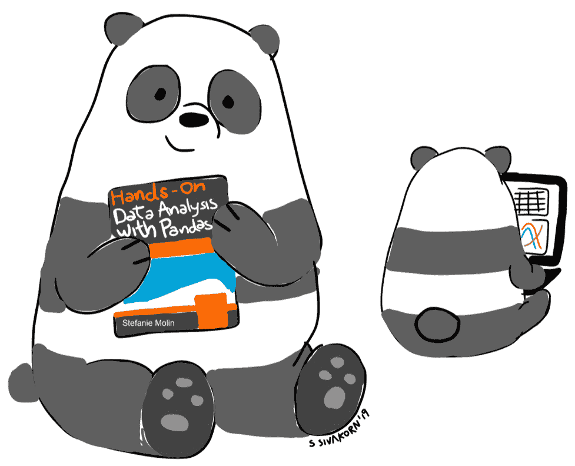

# 第十三章：*第十二章*：未来之路

在本书中，我们已经涵盖了大量的内容，现在你已经能够完全使用 Python 进行数据分析和机器学习任务了。我们从学习一些基础的统计学知识开始，了解如何为数据科学设置 Python 环境。然后，我们学习了如何使用`pandas`的基础知识，以及如何将数据导入 Python。通过这些知识，我们能够使用 API、从文件读取数据以及查询数据库来获取分析所需的数据。

在我们收集完数据后，我们学习了如何进行数据清洗（数据整理），以便清理数据并将其转换为可用格式。接下来，我们学习了如何处理时间序列数据，如何合并来自不同来源的数据并进行聚合。一旦我们掌握了数据整理的技巧，我们就开始了数据可视化的学习，使用`pandas`、`matplotlib`和`seaborn`创建了各种类型的图表，并且我们还学习了如何自定义这些图表。

凭借这些知识，我们能够进行一些真实世界的分析，查看比特币和 FAANG 股票的金融数据，并尝试检测黑客是否通过暴力攻击尝试登录 Web 应用程序。此外，我们还学习了如何构建自己的 Python 包、编写自己的类以及模拟数据。

最后，我们介绍了使用`scikit-learn`进行机器学习的基本概念。我们讨论了如何构建模型流水线，从数据预处理到模型拟合。随后，我们讨论了如何评估模型的性能以及如何改进模型性能。我们的机器学习讨论最终以使用机器学习模型检测黑客通过暴力破解攻击尝试访问 Web 应用程序为高潮。

现在，既然你已经获得了所有这些知识，重要的是要培养它，确保自己能够牢记。也就是说，你必须抓住每一个练习的机会。本章提供了以下资源，帮助你继续你的数据科学之旅：

+   各种主题的数据资源

+   用于练习处理数据的网站和服务

+   提升 Python 技能的编码挑战和教育内容

# 数据资源

和任何技能一样，要提高我们就需要练习，对我们来说，这意味着需要找到数据来进行练习。没有最好的数据集可以用于练习；每个人应该找到自己感兴趣的、想要探索的数据。虽然本节内容并不全面，但它包含了各种主题的数据资源，希望每个人都能找到自己想使用的资源。

小贴士

不确定要寻找什么样的数据？你对某个感兴趣的话题有没有好奇过什么问题？是否有关于该话题的数据已经被收集，并且你可以访问这些数据吗？让你的好奇心引导你。

## Python 包

`seaborn` 和 `scikit-learn` 都提供了内置的示例数据集，你可以用来练习书中所学的内容，并尝试新的技术。这些数据集通常非常干净，因而容易操作。一旦你熟练掌握了这些技术，就可以使用接下来章节中提到的其他资源来寻找数据，这些数据集会更接近实际数据。

### Seaborn

Seaborn 提供了 `load_dataset()` 函数，该函数从一个小型 GitHub 仓库中的 CSV 文件读取数据，这些数据用于 `seaborn` 文档中的示例。因此，值得注意的是，这些数据集可能会有所变化。你可以直接从仓库中获取数据：[`github.com/mwaskom/seaborn-data`](https://github.com/mwaskom/seaborn-data)。

### Scikit-learn

Scikit-learn 包含一个 `datasets` 模块，可以用来生成随机数据集以测试算法，或者导入一些机器学习社区中流行的数据集。请务必查看文档以获取更多信息：

+   **为机器学习任务生成随机数据集**: [`scikit-learn.org/stable/modules/classes.html#samples-generator`](https://scikit-learn.org/stable/modules/classes.html#samples-generator)

+   **加载支持的数据集**: [`scikit-learn.org/stable/modules/classes.html#loaders`](https://scikit-learn.org/stable/modules/classes.html#loaders)

还有 `fetch_openml()` 函数，它位于 `sklearn.datasets` 模块中，可以通过名称从 OpenML ([`www.openml.org/`](https://www.openml.org/)) 获取数据集，OpenML 包含许多免费用于机器学习的数据集。

## 搜索数据

以下是一些你可以用来搜索各种主题数据的地方：

+   **DataHub**: [`datahub.io/search`](https://datahub.io/search)

+   **Google 数据集搜索**: [`datasetsearch.research.google.com/`](https://datasetsearch.research.google.com/)

+   **Amazon Web Services 的开放数据**: [`registry.opendata.aws/`](https://registry.opendata.aws/)

+   **OpenML**: [`www.openml.org`](https://www.openml.org)

+   **斯坦福大学收集的数据集 SNAP 库**: [`snap.stanford.edu/data/index.html`](https://snap.stanford.edu/data/index.html)

+   **UCI 机器学习数据集库**: [`archive.ics.uci.edu/ml/index.php`](http://archive.ics.uci.edu/ml/index.php)

## APIs

我们已经看到，使用 APIs 收集数据是多么方便；以下是一些可能对你有帮助的数据收集 APIs：

+   **Facebook API**: [`developers.facebook.com/docs/graph-api`](https://developers.facebook.com/docs/graph-api)

+   **NOAA 气候数据 API**: [`www.ncdc.noaa.gov/cdo-web/webservices/v2`](https://www.ncdc.noaa.gov/cdo-web/webservices/v2)

+   **NYTimes API**: [`developer.nytimes.com/`](https://developer.nytimes.com/)

+   **OpenWeatherMap API**: [`openweathermap.org/api`](https://openweathermap.org/api)

+   **Twitter API**: [`developer.twitter.com/en/docs`](https://developer.twitter.com/en/docs)

+   **USGS 地震 API**: [`earthquake.usgs.gov/fdsnws/event/1/`](https://earthquake.usgs.gov/fdsnws/event/1/)

## 网站

本节包含了通过网站可以访问的各种主题的精选数据资源。获取数据进行分析可能只需下载 CSV 文件，或者需要使用`pandas`解析 HTML。如果你必须进行网页抓取（确保你已经尝试了本书中讨论的方式），请确保你没有违反该网站的使用条款。

### 金融

在本书中我们多次使用了金融数据。如果你对进一步的金融分析感兴趣，除了我们在*第七章*中讨论的`pandas_datareader`包之外，*金融分析——比特币与股票市场*，可以参考以下资源：

+   **Google Finance**: [`google.com/finance`](https://google.com/finance)

+   **NASDAQ 历史股价**: [`www.nasdaq.com/market-activity/quotes/historical`](https://www.nasdaq.com/market-activity/quotes/historical)

+   **Quandl**: [`www.quandl.com`](https://www.quandl.com)

+   **雅虎财经**: [`finance.yahoo.com`](https://finance.yahoo.com)

### 政府数据

政府数据通常向公众开放。以下资源包含一些政府提供的数据：

+   **欧盟开放数据**: [`data.europa.eu/euodp/en/data`](http://data.europa.eu/euodp/en/data)

+   **NASA**: [`nasa.github.io/data-nasa-gov-frontpage/`](https://nasa.github.io/data-nasa-gov-frontpage/)

+   **纽约市数据**: [`opendata.cityofnewyork.us/data/`](https://opendata.cityofnewyork.us/data/)

+   **英国政府数据**: [`data.gov.uk/`](https://data.gov.uk/)

+   **联合国数据**: [`data.un.org/`](http://data.un.org/)

+   **美国人口普查数据**: [`census.gov/data.html`](https://census.gov/data.html)

+   **美国政府数据**: [`www.data.gov/`](https://www.data.gov/)

### 健康与经济

来自全球的经济、医疗和社会数据可在以下网站上获取：

+   **Gapminder**: [`www.gapminder.org/data/`](https://www.gapminder.org/data/)

+   **健康数据**: [`healthdata.gov/search/type/dataset`](https://healthdata.gov/search/type/dataset)

+   **世界卫生组织**: [`www.who.int/data/gho`](https://www.who.int/data/gho)

以下是有关 COVID-19 大流行的附加数据资源：

+   **美国 COVID-19 数据（NYTimes）**: [`github.com/nytimes/covid-19-data`](https://github.com/nytimes/covid-19-data)

+   **约翰·霍普金斯大学系统科学与工程中心（CSSE）COVID-19 数据存储库**: [`github.com/CSSEGISandData/COVID-19`](https://github.com/CSSEGISandData/COVID-19)

+   **COVID-19 大流行（ECDC）**: [`www.ecdc.europa.eu/en/covid-19-pandemic`](https://www.ecdc.europa.eu/en/covid-19-pandemic)

+   **开放 COVID-19 数据集**: [`researchdata.wisc.edu/open-covid-19-datasets/`](https://researchdata.wisc.edu/open-covid-19-datasets/)

### 社交网络

对于那些对基于文本的数据或图形数据感兴趣的人，可以查看以下社交网络资源：

+   **Twitter 数据资源列表**: [`github.com/shaypal5/awesome-twitter-data`](https://github.com/shaypal5/awesome-twitter-data)

+   **社交网络数据**: [`snap.stanford.edu/data/ego-Facebook.html`](https://snap.stanford.edu/data/ego-Facebook.html)

### 体育

对于体育迷，查看以下网站，这些网站提供所有你最喜欢运动员的统计数据的数据库和网页：

+   **棒球数据库（练习与数据库的操作）**: [`www.seanlahman.com/baseball-archive/statistics/`](http://www.seanlahman.com/baseball-archive/statistics/)

+   **棒球运动员统计数据**: [`www.baseball-reference.com/players/`](https://www.baseball-reference.com/players/)

+   **篮球运动员统计数据**: [`www.basketball-reference.com/players/`](https://www.basketball-reference.com/players/)

+   **橄榄球（美式足球）运动员统计数据**: [`www.pro-football-reference.com/players/`](https://www.pro-football-reference.com/players/)

+   **足球（足球）统计数据**: [`www.whoscored.com/Statistics`](https://www.whoscored.com/Statistics)

+   **冰球运动员统计数据**: [`www.hockey-reference.com/players/`](https://www.hockey-reference.com/players/)

### 杂项

以下资源的主题各异，但如果到目前为止没有任何内容引起你的兴趣，请务必查看这些资源：

+   **Amazon 评论数据**: [`snap.stanford.edu/data/web-Amazon.html`](https://snap.stanford.edu/data/web-Amazon.html)

+   **从维基百科提取的数据**: [`wiki.dbpedia.org/develop/datasets`](https://wiki.dbpedia.org/develop/datasets)

+   **Google 趋势**: [`trends.google.com/trends/`](https://trends.google.com/trends/)

+   **MovieLens 电影数据**: [`grouplens.org/datasets/movielens/`](https://grouplens.org/datasets/movielens/)

+   **Yahoo Webscope（数据集参考库）**: [`webscope.sandbox.yahoo.com/`](https://webscope.sandbox.yahoo.com/)

# 练习与数据的处理

在本书中，我们已经使用了来自不同来源的各种数据集，并提供了逐步的操作指导。然而，这并不意味着到此为止。本节专门介绍了一些可以用于继续指导学习的资源，并最终朝着为预定义问题构建模型的方向努力。

**Kaggle** ([`www.kaggle.com/`](https://www.kaggle.com/)) 提供数据科学学习内容、社区成员共享的数据集以及公司发布的竞赛——或许你对 Netflix 推荐竞赛有些印象 ([`www.kaggle.com/netflix-inc/netflix-prize-data`](https://www.kaggle.com/netflix-inc/netflix-prize-data))？这些竞赛是你练习机器学习技能并在社区中（尤其是潜在雇主面前）增加曝光的绝佳方式。

重要提示

Kaggle 并非唯一可以参与数据科学竞赛的平台。其他一些平台可以参考 [`towardsdatascience.com/top-competitive-data-science-platforms-other-than-kaggle-2995e9dad93c`](https://towardsdatascience.com/top-competitive-data-science-platforms-other-than-kaggle-2995e9dad93c)。

**DataCamp** ([`www.datacamp.com/`](https://www.datacamp.com/))，虽然并非完全免费，提供各种 Python 数据科学课程。课程包括教学视频和填空式编程练习题，帮助你逐步加深对相关主题的理解。

# Python 练习

我们在本书中已经看到，在 Python 中处理数据不仅仅是 `pandas`、`matplotlib` 和 `numpy`；我们可以通过增强 Python 编程能力来改进我们的工作流程。拥有强大的 Python 技能，我们可以使用 Flask 构建 Web 应用程序，向 API 发起请求，高效地遍历组合或排列，并寻找加速代码的方式。虽然本书没有专门关注这些技能的提升，但以下是一些免费的资源，供你练习 Python 并培养编程思维：

+   **HackerRank**: [`www.hackerrank.com`](https://www.hackerrank.com)

+   **Codewars**: [`www.codewars.com`](https://www.codewars.com)

+   **LeetCode**: [`www.leetcode.com`](https://www.leetcode.com)

+   **CodinGame**: [`www.codingame.com`](https://www.codingame.com)

**Python Morsels** ([`www.pythonmorsels.com/`](https://www.pythonmorsels.com/)) 提供每周 Python 练习，帮助你学习编写更 Pythonic 的代码，并更熟悉 Python 标准库。练习的难度不一，但可以根据需要调整难度。

另一个很棒的资源是 **Pramp** ([`www.pramp.com`](https://www.pramp.com))，它可以让你与随机分配的同行一起进行编程面试练习。你的同行会用一个随机问题对你进行面试，并评估你如何处理面试、你的代码以及你如何解释自己。30 分钟后，轮到你去面试你的同行。

**可汗学院** ([`www.khanacademy.org/`](https://www.khanacademy.org/)) 是一个学习某一主题的绝佳资源。如果你想了解计算机科学算法或机器学习算法背后的数学（如线性代数和微积分），那么这里是一个很好的起点。

最后，**LinkedIn 学习平台** ([`www.linkedin.com/learning/`](https://www.linkedin.com/learning/)) 提供了许多关于广泛主题的视频课程，包括 Python、数据科学和机器学习。新用户可以享受一个月的免费试用期。考虑参加*学习 Python 3 标准库*课程 ([`www.linkedin.com/learning/learning-the-python-3-standard-library`](https://www.linkedin.com/learning/learning-the-python-3-standard-library))，提升你的 Python 技能；正如我们在本书中所见，掌握标准库帮助我们编写更简洁高效的代码。

# 总结

本章为你提供了许多可以找到数据集的地方，涵盖了各种主题。此外，你还了解了可以参加课程、完成教程、练习机器学习和提高 Python 技能的各种网站。保持技能的锋利并保持好奇心非常重要，因此，无论你对什么感兴趣，都要寻找数据并进行自己的分析。这些都可以作为你的数据作品集，上传到 GitHub 账户。

感谢你阅读这本书！我希望你能从中获得与这两只数据分析熊猫一样多的收获。

# 练习

本章的练习是开放性的——没有提供解决方案。它们旨在为你提供一些思路，以便你能独立开始：

1.  通过参与 Kaggle 上的 Titanic 挑战（[`www.kaggle.com/c/titanic`](https://www.kaggle.com/c/titanic)），来练习机器学习分类。

1.  通过参与 Kaggle 上的房价挑战（[`www.kaggle.com/c/house-prices-advanced-regression-techniques`](https://www.kaggle.com/c/house-prices-advanced-regression-techniques)），来练习机器学习回归技术。

1.  对你感兴趣的事物进行分析。一些有趣的想法包括以下几个：

    a) *预测 Instagram 上的点赞数*：[`towardsdatascience.com/predict-the-number-of-likes-on-instagram-a7ec5c020203`](https://towardsdatascience.com/predict-the-number-of-likes-on-instagram-a7ec5c020203)

    b) *分析 NJ 交通列车的延误情况*：`medium.com/@pranavbadami/how-data-can-help-fix-nj-transit-c0d15c0660fe`

    c) *利用可视化解决数据科学问题*：[`towardsdatascience.com/solving-a-data-science-challenge-the-visual-way-355cfabcb1c5`](https://towardsdatascience.com/solving-a-data-science-challenge-the-visual-way-355cfabcb1c5)

1.  在本章的*Python 实践*部分的任一网站上完成五个挑战。例如，你可以尝试以下挑战：

    a) *找到两个数，使它们的和恰好为特定值*: [`leetcode.com/problems/two-sum/`](https://leetcode.com/problems/two-sum/)

    b) *验证信用卡号*: [`www.hackerrank.com/challenges/validating-credit-card-number/problem`](https://www.hackerrank.com/challenges/validating-credit-card-number/problem)

# 进一步阅读

你可以查阅以下博客和文章，以保持对 Python 和数据科学的最新了解：

+   *Armin Ronacher 的博客（Flask 作者）*: [`lucumr.pocoo.org/`](http://lucumr.pocoo.org/)

+   *Data Science Central*: [`www.datasciencecentral.com/`](http://www.datasciencecentral.com/)

+   *Medium 上的数据科学专题*: [`medium.com/topic/data-science`](https://medium.com/topic/data-science)

+   *Kaggle 博客*: [`medium.com/kaggle-blog`](https://medium.com/kaggle-blog)

+   *KD Nuggets*: [`www.kdnuggets.com/websites/blogs.html`](http://www.kdnuggets.com/websites/blogs.html)

+   *Medium 上的机器学习专题*: [`medium.com/topic/machine-learning`](https://medium.com/topic/machine-learning)

+   *Planet Python*: [`planetpython.org/`](https://planetpython.org/)

+   *Medium 上的编程专题*: [`medium.com/topic/programming`](https://medium.com/topic/programming)

+   *Python 小贴士*: [`book.pythontips.com/en/latest/index.html`](http://book.pythontips.com/en/latest/index.html)

+   *Python 3 每周模块*: [`pymotw.com/3/`](https://pymotw.com/3/)

+   *Towards Data Science*: [`towardsdatascience.com/`](https://towardsdatascience.com/)

+   *Trey Hunner 的博客（Python Morsels 的创始人）*: [`treyhunner.com/blog/archives/`](https://treyhunner.com/blog/archives/)

以下资源包含了构建自定义`scikit-learn`类的信息：

+   *构建 scikit-learn 转换器*: [`dreisbach.us/articles/building-scikit-learn-compatible-transformers/`](https://dreisbach.us/articles/building-scikit-learn-compatible-transformers/)

+   *在 scikit-learn 中创建自己的估计器*: [`danielhnyk.cz/creating-your-own-estimator-scikit-learn/`](http://danielhnyk.cz/creating-your-own-estimator-scikit-learn/)

+   *Scikit-learn BaseEstimator*: [`scikit-learn.org/stable/modules/generated/sklearn.base.BaseEstimator.html`](https://scikit-learn.org/stable/modules/generated/sklearn.base.BaseEstimator.html)

+   *Scikit-learn 自定义估计器*: [`scikit-learn.org/stable/developers/develop.html#developing-scikit-learn-estimators`](https://scikit-learn.org/stable/developers/develop.html#developing-scikit-learn-estimators)

+   *Scikit-learn TransformerMixin*: [`scikit-learn.org/stable/modules/generated/sklearn.base.TransformerMixin.html#sklearn.base.TransformerMixin`](https://scikit-learn.org/stable/modules/generated/sklearn.base.TransformerMixin.html#sklearn.base.TransformerMixin)

适用于 Python 数据科学栈的编码备忘单可以在这里找到：

+   *Jupyter Notebook 备忘单*： [`s3.amazonaws.com/assets.datacamp.com/blog_assets/Jupyter_Notebook_Cheat_Sheet.pdf`](https://s3.amazonaws.com/assets.datacamp.com/blog_assets/Jupyter_Notebook_Cheat_Sheet.pdf)

+   *Jupyter Notebook 快捷键*： [`www.cheatography.com/weidadeyue/cheat-sheets/jupyter-notebook/pdf_bw/`](https://www.cheatography.com/weidadeyue/cheat-sheets/jupyter-notebook/pdf_bw/)

+   *Matplotlib 备忘单*： [`s3.amazonaws.com/assets.datacamp.com/blog_assets/Python_Matplotlib_Cheat_Sheet.pdf`](https://s3.amazonaws.com/assets.datacamp.com/blog_assets/Python_Matplotlib_Cheat_Sheet.pdf)

+   *NumPy 备忘单*： [`s3.amazonaws.com/assets.datacamp.com/blog_assets/Numpy_Python_Cheat_Sheet.pdf`](https://s3.amazonaws.com/assets.datacamp.com/blog_assets/Numpy_Python_Cheat_Sheet.pdf)

+   *Pandas 备忘单*： [`pandas.pydata.org/Pandas_Cheat_Sheet.pdf`](http://pandas.pydata.org/Pandas_Cheat_Sheet.pdf)

+   *Scikit-Learn 备忘单*： [`s3.amazonaws.com/assets.datacamp.com/blog_assets/Scikit_Learn_Cheat_Sheet_Python.pdf`](https://s3.amazonaws.com/assets.datacamp.com/blog_assets/Scikit_Learn_Cheat_Sheet_Python.pdf)

机器学习算法、数学、概率和统计的备忘单可以在这里找到：

+   *微积分备忘单*： [`ml-cheatsheet.readthedocs.io/en/latest/calculus.html`](https://ml-cheatsheet.readthedocs.io/en/latest/calculus.html)

+   *4 页线性代数*： [`minireference.com/static/tutorials/linear_algebra_in_4_pages.pdf`](https://minireference.com/static/tutorials/linear_algebra_in_4_pages.pdf)

+   *概率与统计备忘单*： [`web.mit.edu/~csvoss/Public/usabo/stats_handout.pdf`](http://web.mit.edu/~csvoss/Public/usabo/stats_handout.pdf)

+   *Python 中的 15 种统计假设检验（备忘单）*： [`machinelearningmastery.com/statistical-hypothesis-tests-in-python-cheat-sheet/`](https://machinelearningmastery.com/statistical-hypothesis-tests-in-python-cheat-sheet/)

若想了解更多机器学习算法、线性代数、微积分、概率和统计的资源，可以参考以下内容：

+   *傅里叶变换互动指南*： [`betterexplained.com/articles/an-interactive-guide-to-the-fourier-transform/`](https://betterexplained.com/articles/an-interactive-guide-to-the-fourier-transform/)

+   *Joseph Blitzstein 和 Jessica Hwang 的《概率导论》*： [`www.amazon.com/Introduction-Probability-Chapman-Statistical-Science/dp/1138369918`](https://www.amazon.com/Introduction-Probability-Chapman-Statistical-Science/dp/1138369918)

+   *Gareth James、Daniela Witten、Trevor Hastie 和 Robert Tibshirani 的《统计学习导论》*： [`www.statlearning.com/`](https://www.statlearning.com/)

+   *傅里叶变换（scipy.fft）*: [`docs.scipy.org/doc/scipy/reference/tutorial/fft.html`](https://docs.scipy.org/doc/scipy/reference/tutorial/fft.html)

+   *用 numpy 的傅里叶变换找到时间序列最可能的周期性？（StackOverflow 问题）*: [`stackoverflow.com/questions/44803225/find-likeliest-periodicity-for-time-series-with-numpys-fourier-transform`](https://stackoverflow.com/questions/44803225/find-likeliest-periodicity-for-time-series-with-numpys-fourier-transform)

+   *数值计算很有趣（GitHub）*: [`github.com/eka-foundation/numerical-computing-is-fun`](https://github.com/eka-foundation/numerical-computing-is-fun)

+   *黑客的概率编程与贝叶斯方法（GitHub）*: [`github.com/CamDavidsonPilon/Probabilistic-Programming-and-Bayesian-Methods-for-Hackers`](https://github.com/CamDavidsonPilon/Probabilistic-Programming-and-Bayesian-Methods-for-Hackers)

+   *理论可视化（概率与统计的视觉介绍）*: [`seeing-theory.brown.edu/index.html`](https://seeing-theory.brown.edu/index.html)

+   *思考统计：Python 中的探索性数据分析*: [`greenteapress.com/thinkstats2/html/index.html`](http://greenteapress.com/thinkstats2/html/index.html)

关于 Python 和编程的一些杂项阅读资料可以在这里找到：

+   *定义自定义魔法命令（IPython）*: [`ipython.readthedocs.io/en/stable/config/custommagics.html`](https://ipython.readthedocs.io/en/stable/config/custommagics.html)

+   *Flask 教程（用 Python 构建 Web 应用程序）*: [`flask.palletsprojects.com/en/1.1.x/tutorial/`](https://flask.palletsprojects.com/en/1.1.x/tutorial/)

+   *IPython 教程*: [`ipython.readthedocs.io/en/stable/interactive/`](https://ipython.readthedocs.io/en/stable/interactive/)

+   *编程最佳实践*: [`thefullstack.xyz/dry-yagni-kiss-tdd-soc-bdfu`](https://thefullstack.xyz/dry-yagni-kiss-tdd-soc-bdfu)

相关的 MOOC 和视频可以在这里找到：

+   *高级优化（哈佛大学）*: [`online-learning.harvard.edu/course/advanced-optimization`](https://online-learning.harvard.edu/course/advanced-optimization)

+   *线性代数——基础到前沿（edX）*: [`www.edx.org/course/linear-algebra-foundations-to-frontiers`](https://www.edx.org/course/linear-algebra-foundations-to-frontiers)

+   *机器学习（与 Andrew Ng 一起的 Coursera 课程）*: [`www.coursera.org/learn/machine-learning`](https://www.coursera.org/learn/machine-learning)

+   *机器学习数学（Coursera）*: [`www.coursera.org/specializations/mathematics-machine-learning`](https://www.coursera.org/specializations/mathematics-machine-learning)

+   *Statistics 110（哈佛大学）在 YouTube 上*: [`www.youtube.com/playlist?list=PL2SOU6wwxB0uwwH80KTQ6ht66KWxbzTIo`](https://www.youtube.com/playlist?list=PL2SOU6wwxB0uwwH80KTQ6ht66KWxbzTIo)

+   *《统计学习（斯坦福）》*: [`online.stanford.edu/courses/sohs-ystatslearning-statistical-learning`](https://online.stanford.edu/courses/sohs-ystatslearning-statistical-learning)

以下书籍对于获取 Python 语言各个方面的经验非常有帮助：

+   *《用 Python 自动化无聊的事情》by Al Sweigart*: [`automatetheboringstuff.com/`](https://automatetheboringstuff.com/)

+   *《Python3 硬核学习》by Zed A. Shaw*: [`learnpythonthehardway.org/python3/preface.html`](https://learnpythonthehardway.org/python3/preface.html)

Python 机器学习书籍和培训资源可以在这里找到：

+   *《动手学机器学习：Scikit-Learn 与 TensorFlow Jupyter 笔记本》*: [`github.com/ageron/handson-ml`](https://github.com/ageron/handson-ml)

+   *《Python 机器学习导论：数据科学家的指南》by Andreas C. Müller 和 Sarah Guido*: [`www.amazon.com/Introduction-Machine-Learning-Python-Scientists/dp/1449369413`](https://www.amazon.com/Introduction-Machine-Learning-Python-Scientists/dp/1449369413)

+   *来自 Scikit-learn 核心开发者 Andreas Müller 的 ML 训练资源（会议上讲授的培训）*: [`github.com/amueller?tab=repositories&q=ml-training&type=&language=&sort=`](https://github.com/amueller?tab=repositories&q=ml-training&type=&language=&sort=)

+   *《Python 机器学习》第三版 by Sebastian Raschka 和 Vahid Mirjalili*: [`www.packtpub.com/product/python-machine-learning-third-edition/9781789955750`](https://www.packtpub.com/product/python-machine-learning-third-edition/9781789955750)

以下资源介绍了机器学习模型中的偏见和公平性概念，以及缓解偏见的工具：

+   *AI 公平性 360（IBM）*: [`developer.ibm.com/technologies/artificial-intelligence/projects/ai-fairness-360/`](https://developer.ibm.com/technologies/artificial-intelligence/projects/ai-fairness-360/)

+   *《数学毁灭武器》by Cathy O'Neil*: [`www.amazon.com/Weapons-Math-Destruction-Increases-Inequality/dp/0553418815`](https://www.amazon.com/Weapons-Math-Destruction-Increases-Inequality/dp/0553418815)

+   *《What-If Tool（Google）》*: [`pair-code.github.io/what-if-tool/`](https://pair-code.github.io/what-if-tool/)

获取关于交互式和动画可视化的资源可以在这里找到：

+   *《Holoviews 入门》*: [`coderzcolumn.com/tutorials/data-science/getting-started-with-holoviews-basic-plotting`](https://coderzcolumn.com/tutorials/data-science/getting-started-with-holoviews-basic-plotting)

+   *《如何在 Python 中创建动画图表》*: [`towardsdatascience.com/how-to-create-animated-graphs-in-python-bb619cc2dec1`](https://towardsdatascience.com/how-to-create-animated-graphs-in-python-bb619cc2dec1)

+   *Python 中的交互式数据可视化与 Bokeh*: [`realpython.com/python-data-visualization-bokeh/`](https://realpython.com/python-data-visualization-bokeh/)

+   *PyViz 教程*: https://pyviz.org/tutorials/index.html
