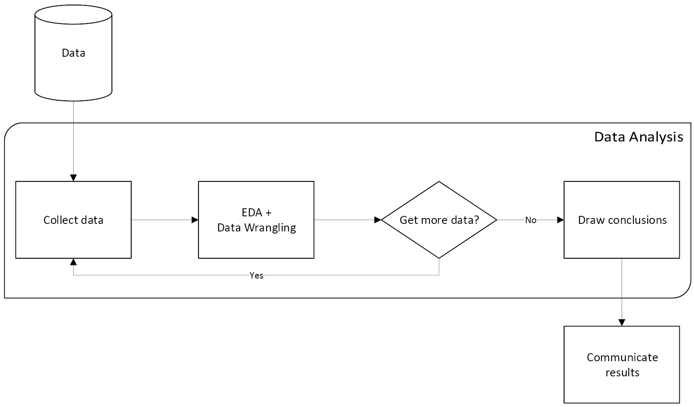
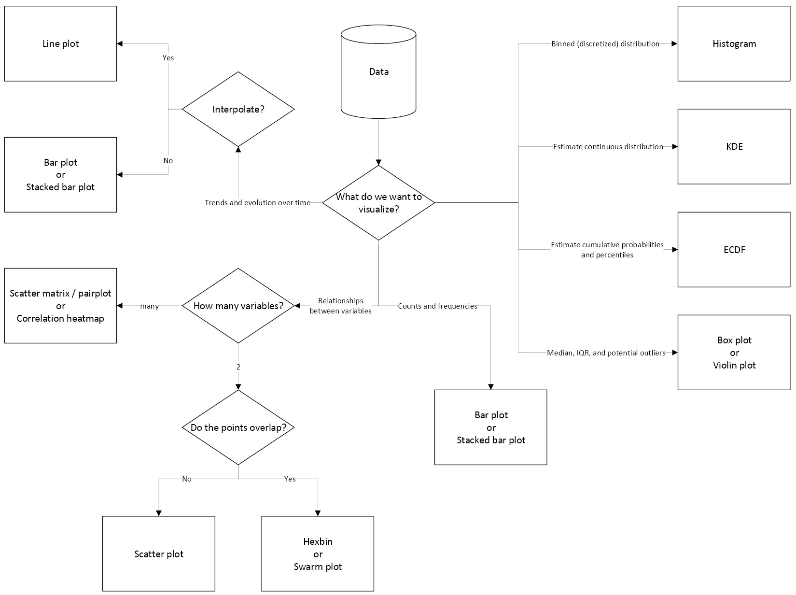
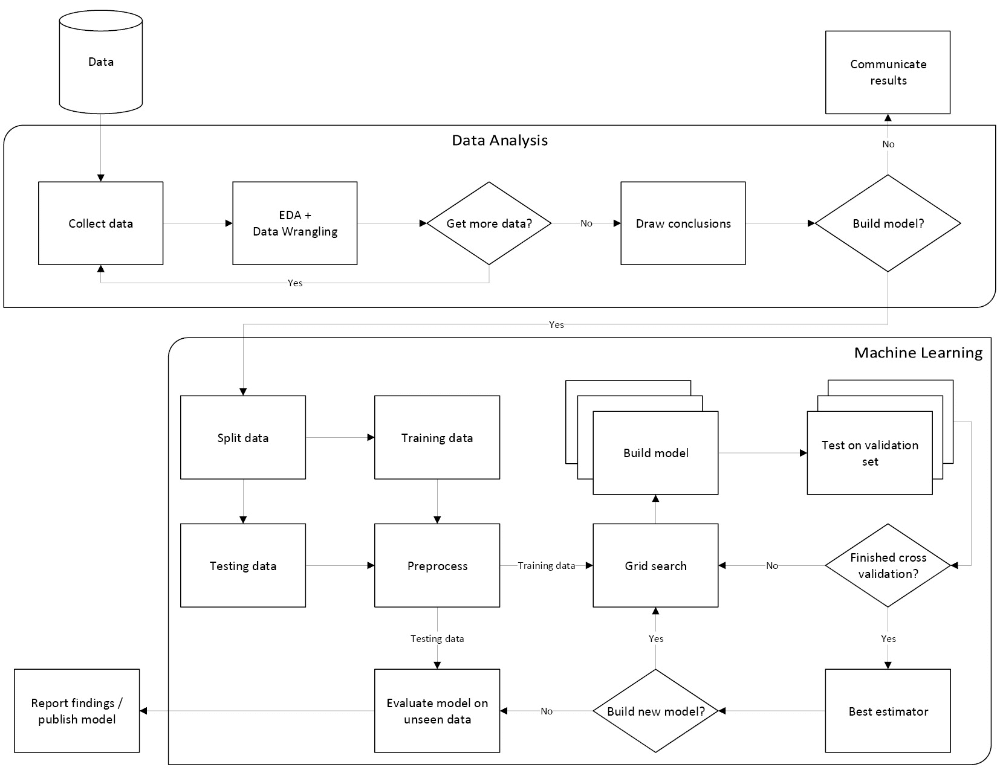

# 附录

# 数据分析工作流程

下图展示了一个通用的数据分析工作流程，从数据收集和处理到得出结论并决定下一步行动：

图 1 – 通用的数据分析工作流程

# 选择适当的可视化方式

在创建数据可视化时，选择适当的图表类型至关重要；以下图示可以帮助选择正确的可视化方式：

图 2 – 选择适当可视化方式的流程图

# 机器学习工作流程

下图总结了从数据收集和数据分析到模型训练与评估的机器学习模型构建工作流程：

图 3 – 构建机器学习模型过程概述
