# 第一章：Anaconda 生态系统

在前言中，我们提到本书是为那些寻求数据科学领域工具的读者设计的。现有的数据分析师和数据科学专业人员希望通过使用多种编程语言的最佳库来提高其数据科学应用的效率，都会发现本书非常有用。本书在各章节中详细讨论的平台是**Anaconda**，计算工具可能是**Python**、**R**、**Julia**或**Octave**。使用这些编程语言的好处在于它们都是开源的，即可以免费下载安装。在本章中，我们从最基础的介绍开始。对于本书，我们假设读者对多种编程语言（如 R 和 Python）有一些基本的了解。市面上有许多相关书籍，例如 McKinney（2013）的《*Python for Data Analysis*》和 Yan（2017）的《*Python for Finance*》。

本章将涵盖以下主题：

+   介绍

+   Miniconda

+   Anaconda Cloud

+   寻找帮助

# 介绍

现在，我们被大量的信息所压倒——参见 Shi、Zhang 和 Khan（2017），或 Fang 和 Zhang（2016）——流行语为大数据。然而，定义它仍然存在争议，因为有许多解释可供参考。Davenport 和 Patil（2012）建议，如果你的组织存储了多个 PB 的数据，如果对你业务最关键的信息以非数字行列的形式存在，或者如果回答你最大的疑问需要结合多个分析工作的结果，那么你就有了一个大数据的机会。

许多数据科学或数据分析的用户正在学习多种编程语言，如 R 和 Python，但他们如何同时使用这两种语言呢？如果 John 使用的是 R，而他的队友使用的是 Python，他们如何互相交流？团队成员如何共享他们的包、程序甚至他们的工作环境？在本书中，我们尽力通过介绍 Anaconda 来提供所有这些挑战性任务的解决方案，因为它具备了许多令人赞叹的特性。

一般来说，*R*是一种用于统计计算和图形的编程语言，由统计计算的 R 基金会支持。*Python*是一种解释型、面向对象的编程语言，类似于 Perl，因为其简洁的语法和良好的可读性而受到了广泛欢迎。*Julia*用于数值计算和广泛的数学函数设计，专为并行计算和云计算而设计，而*Octave*则是用于数值计算和数学为导向的批处理语言。这四种语言，R、Python、Julia 和 Octave，都是免费的。

# 通过 Anaconda 使用 Jupyter 的理由

在数据科学或数据分析中，我们通常在团队中工作。这意味着每个开发者、研究人员或团队成员可能都有自己喜欢的编程语言，如 Python、R、Octave 或 Julia。如果我们能够有一个平台来运行所有这些语言，那就太好了。幸运的是，Jupyter 就是这样一个平台，因为它可以支持超过 40 种语言，包括 Python、R、Julia、Octave 和 Scala。

在第二章《*Anaconda 安装*》中，我们将展示如何通过 Jupyter 运行这四种语言。当然，使用 Anaconda 还有其他好处：我们可能会更少担心已安装包的依赖性，更有效地管理包，并分享我们的程序、项目和工作环境。此外，Jupyter Notebooks 可以通过电子邮件、Dropbox、GitHub 和 Jupyter Notebook Viewer 与他人共享。

# 无需预安装即可使用 Jupyter

在第二章《*Anaconda 安装*》中，我们将讨论如何通过 Anaconda 安装来安装 Jupyter。然而，我们也可以在没有预安装的情况下通过访问[`jupyter.org/try`](https://jupyter.org/try)来偶尔启动 Jupyter：

1.  欢迎屏幕将显示多种尝试不同语言的选项。

1.  例如，通过点击“尝试 Jupyter with Julia”图像，我们将看到以下屏幕：

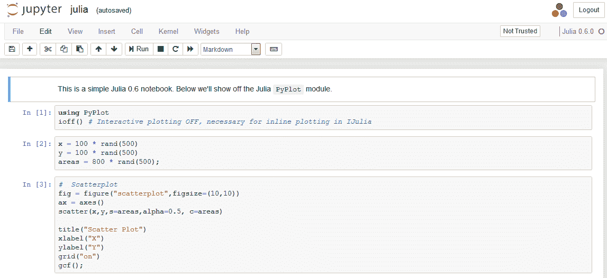

1.  为了节省空间，截图只显示了演示的第一部分。任何读者都可以尝试前面两步来查看完整的演示。此外，如果我们点击“尝试 Jupyter with R”图像，接下来的屏幕将显示：

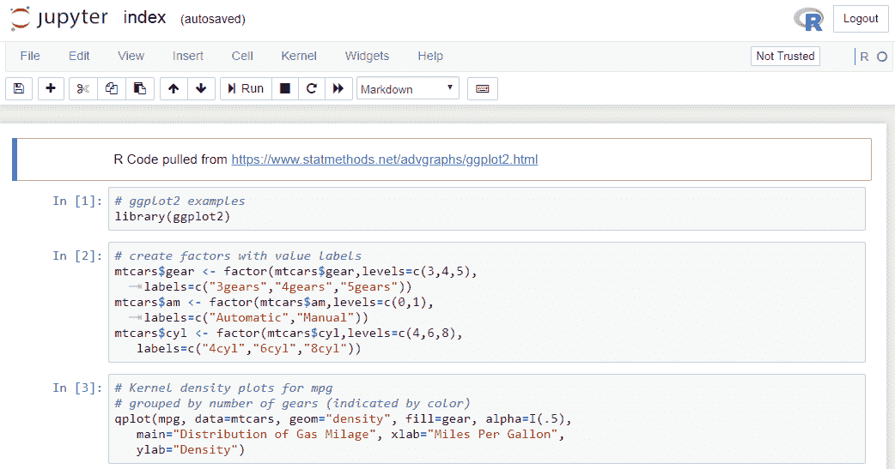

1.  选择“尝试 Jupyter with Python”后，您将看到相应的欢迎屏幕。

1.  接下来，我们将展示如何在 R、Python 和 Julia 中执行一些简单的命令。例如，我们可以使用 R 在该平台上运行几个简单的命令行。在以下示例中，我们输入 `pv=100`、`r=0.1` 和 `n=5`：

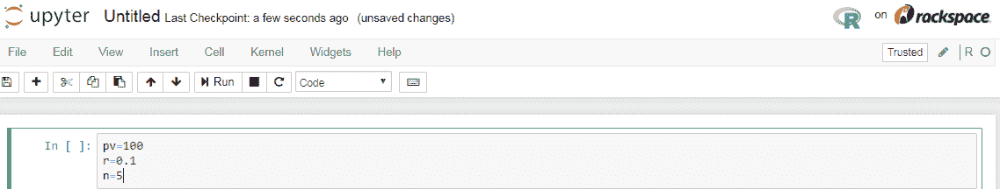

1.  在点击菜单栏上的运行按钮后，我们将这些值赋给三个变量。然后，我们可以估算该现值的未来值，如下所示：

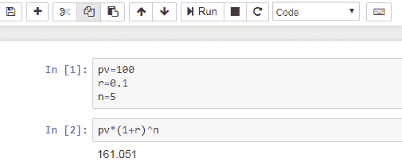

1.  同样，我们可以尝试使用 Python，如下所示：

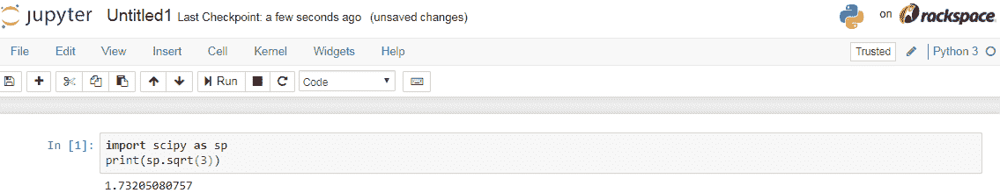

在前面的示例中，我们导入了名为 `scipy` 的 Python 包，并为其取了一个简短的名字 `sp`。虽然可以使用其他简短的名称来表示 `scipy` 包，但使用 `sp` 是一种约定。然后，我们使用 Python 包中包含的 `sqrt()` 函数。

对于 Julia，我们可以尝试以下代码（显示在下面的屏幕截图中）。再次，在菜单上选择文件|新建，选择 Julia 0.6.0。截至 2018 年 5 月 9 日，0.6.0 是 Julia 的当前版本。请注意，您当前的 Julia 版本可能有所不同：

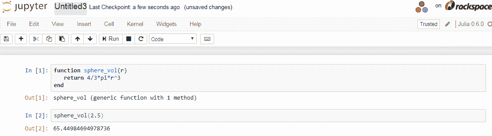

在代码中，我们定义了一个名为`sphere_vol`的函数，只有一个输入值 r（以弧度表示）。对于输入值为`2.5`，答案是 64.45。

# Miniconda

Anaconda 是 Python 的完整发行版，在安装后附带超过 1000 个开源包。因此，总大小超过 3 GB。如果我们打算下载并预安装许多包，Anaconda 非常适合。另一方面，Miniconda 仅包含 Python 和运行 conda 所需的其他必要库。Miniconda 的大小约为 400 MB，比完整版 Anaconda 小得多，因此需要根据需求下载和安装额外的包。

有许多原因说明新用户为什么更喜欢 Anaconda 的精简版本。例如，他们可能不需要那么多的包。另一个原因是用户可能没有足够的空间。这些用户可以在[`conda.io/miniconda.html`](https://conda.io/miniconda.html)下载 Miniconda。再次，在第二章，*Anaconda 安装*，我们将详细讨论如何安装 Anaconda 并运行用不同语言编写的程序，如 Python、R、Julia 和 Octave。

# Anaconda Cloud

在第二章，*Anaconda 安装*，我们将更详细地解释这一点。此功能用于与不同的用户或组成员协作。例如，我们有一个由十个开发人员组成的小组正在开发同一个项目。因此，我们必须共享我们的程序、命令数据集和工作环境，我们可以使用 Anaconda Cloud 来实现。访问[`anaconda.org/`](https://anaconda.org/)后，我们将被引导到 Anaconda 首页。

请注意，用户必须在使用此功能之前在 Anaconda 上注册。例如，其中一位作者有以下链接[`anaconda.org/paulyan/dashboard`](https://anaconda.org/paulyan/dashboard)。注册后，我们可以看到以下内容：

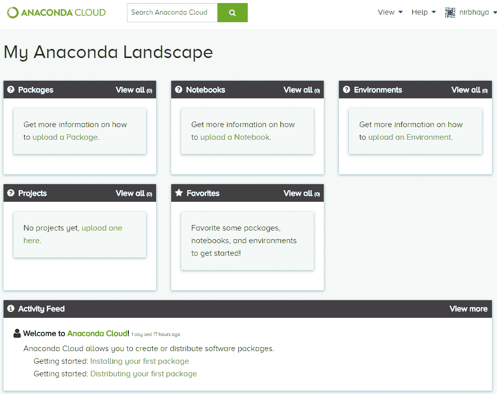

本书后面我们将专门讨论这个问题。

# 搜索帮助

有许多网站可以帮助我们。第一个允许我们查找用户指南，显示在以下链接中：[`docs.anaconda.com/anaconda/user-guide/`](https://docs.anaconda.com/anaconda/user-guide/)。点击链接后，我们将看到四个条目：

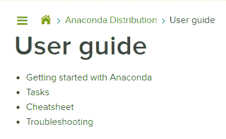

通过选择前面四个条目之一，我们可以找到大量信息。例如，点击 Getting started with Anaconda 后，我们将看到以下信息：

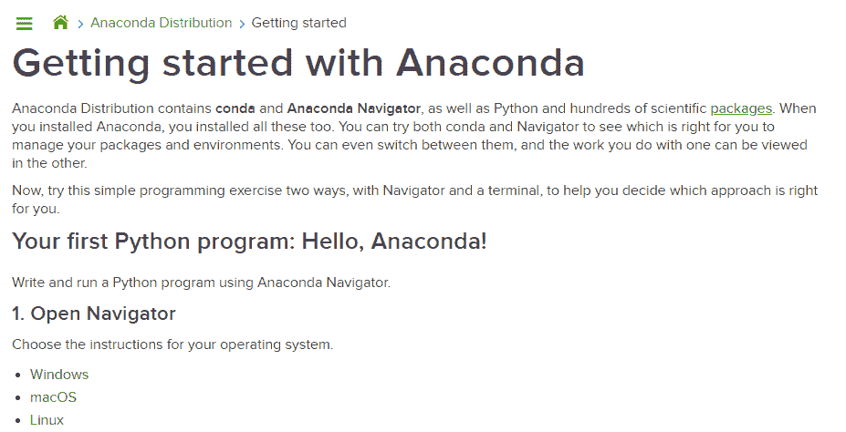

从左侧的导航栏中，我们可以进入 Tasks，然后我们会看到以下内容：

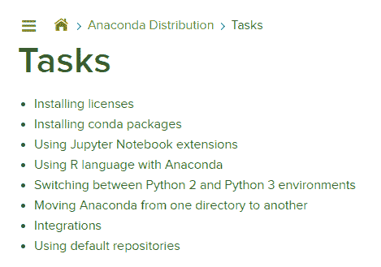

例如，点击“安装 conda 包”后，我们可以看到以下信息（为了节省空间，仅展示文档的第一部分）：

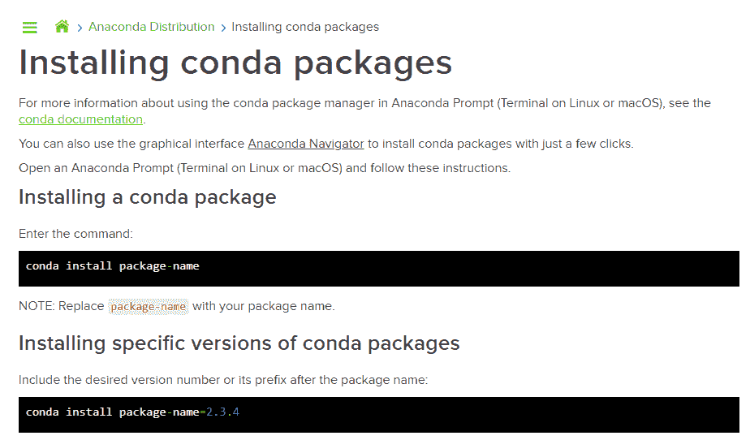

对于开发者，我们提供了以下链接：

+   入门指南：[`conda.io/docs/user-guide/getting-started.html`](https://conda.io/docs/user-guide/getting-started.html)

+   在线文档：[`conda.io/docs`](http://conda.io/docs)

+   开发者博客：[`www.anaconda.com/developer-blog/`](https://www.anaconda.com/developer-blog/)

+   Anaconda 快捷参考卡：[`docs.anaconda.com/anaconda/user-guide/cheatsheet`](https://docs.anaconda.com/anaconda/user-guide/cheatsheet)

# 总结

在本章中，我们介绍了一些基本概念，如使用 Anaconda 的原因，以及使用完整版 Anaconda 和/或其简化版 Miniconda 的优势。接着，我们展示了即使不安装 Anaconda，我们也可以通过访问指定的网站来使用它。我们还可以在该网站上测试一些简单的程序，编写语言包括 R、Python、Julia 或 Octave。

在第二章中，*Anaconda 安装*，我们将展示如何安装 Anaconda，并测试安装是否成功。我们将介绍如何启动 Jupyter，如何启动 Python、Spyder 和 R，以及如何查找相关帮助。大部分概念或过程非常基础，因此对于已经熟悉这些基本概念的读者，可以跳过这一章，第二章 *Anaconda 安装*，直接进入第三章 *数据基础*。

# 复习问题和练习

1.  什么是 Anaconda，如何使用其平台？

1.  Anaconda 附带了多少个开源包？

1.  Anaconda 的主页是什么？

1.  我们如何安装 Anaconda？安装 Anaconda 后，是否需要单独安装 Python？那 R 呢？

1.  完整的 Anaconda 安装包大小是多少？

1.  为什么我们需要关注 Miniconda？

1.  什么是 Jupyter？如何在没有安装的情况下启动它？

1.  使用[`jupyter.org/try`](https://jupyter.org/try)有什么优缺点？

1.  新手可以在哪里找到关于 Anaconda 的更多有用信息？

1.  获取更多关于 Julia 编程语言的信息。

1.  如何通过 Jupyter 编写一个简单的 Julia 程序？

1.  如何通过 Jupyter 编写一个简单的 R 程序？

1.  如何为 Jupyter 查找帮助？

1.  什么是 conda 快捷参考卡，我们可以在哪里下载它？

1.  我们能在没有安装 Anaconda 的情况下运行一个简单的 R 程序吗？

1.  我们能在没有预安装的情况下运行 Anaconda 吗？

1.  尝试以下两行 Python 代码：

```py
import numpy as np
print(np.sqrt(2))
```

1.  尝试以下简单的 R 代码：

```py
x<-1:500
mean(x)
sd(x)
```

1.  尝试以下 Julia 代码：

```py
x=1:500
mean(x)
```

1.  尝试以下 R 代码：

```py
dd<-Sys.Date()
dd+40
```
