# 第二章：Anaconda 安装

本章将讨论如何安装 Anaconda 并使用其各种组件，如 Python、IPython、Jupyter 和 Spyder。在本书中，我们不会教授 R、Python、Julia 或 Octave。因此，我们假设读者已具备与这些编程语言相关的基础知识，特别是 Python 和 R。市面上有许多相关书籍，如 Yan（2017 年，第 2 版）的《Python 金融》以及 Yan（2016 年）的《使用 R 进行金融建模》。

本章将涵盖以下主题：

+   安装 Anaconda

+   测试 Python

+   使用 IPython

+   通过 Jupyter 使用 Python

+   介绍 Spyder

+   通过 Conda 安装 R

+   安装 Julia 并将其与 Jupyter 连接

+   安装 Octave 并将其与 Jupyter 连接

+   寻求帮助

# 安装 Anaconda

首先，访问 [`anaconda.org/`](http://anaconda.org/)。我们可以看到页面右上角的下载 Anaconda。根据个人的操作系统，用户应下载相应的安装包。

根据你偏好的版本，你可以下载 Python 3.6 或 Python 2.7。一般来说，对于新手，下载最新版本（在本例中为 Python 3.6）是个不错的选择。这适用于 Mac 和 Linux 操作系统。

# Windows 版 Anaconda

请参照以下步骤：

1.  对于 PC 用户，在点击 Windows 后，你将看到可以下载的不同版本。

截至 2018 年 5 月 09 日，Anaconda 附带两个版本的 Python，版本 3.6 和版本 2.7。如果没有特别的要求或限制，下载最新版本 3.6 是个不错的选择。此外，还有适用于 64 位和 32 位系统的两个不同下载版本。

如果你的系统是 32 位的，而你尝试安装 64 位版本，你会收到错误消息。

1.  在安装过程中，我们可以选择默认设置。安装完成后，点击所有程序和`Anaconda3 (32-bit)`，我们可以看到以下信息（以 Windows 版本为例）。不过，不同的读者/用户可能会有略微不同的设置：

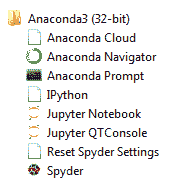

1.  点击 Anaconda Prompt 后，我们可以输入 `conda info` 命令，显示如下：

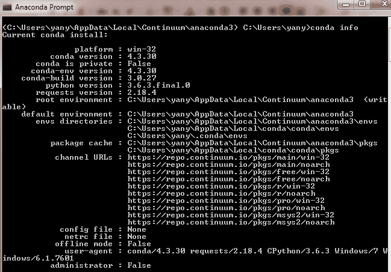

再次提醒，读者/用户的结果会因系统和已安装的软件包的不同而有所差异。

# 测试 Python

测试 Python 的步骤如下：

1.  对于 PC 用户，点击所有程序、Anaconda3.6，再点击 Anaconda Prompt，我们将看到如下画面。

请注意，不同的用户可能会得到不同的路径：

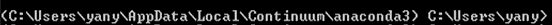

1.  然后，输入 `python`，我们就可以启动 Python，如下所示：

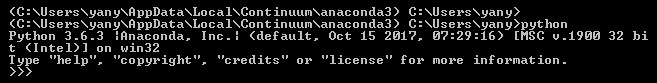

1.  它告诉我们`Python 3.6.3`已正常运行。我们还可以尝试 `import scipy as sp` 来查看它是否已经预安装：

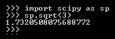

1.  输入`import scipy as sp`后，没有出现错误信息，这表明该包已预安装。命令`sp.sqrt(3)`将给我们`3`的平方根。另一个带相关图表的例子如下：

```py
import scipy as np 
from pylab import * 
x=np.linspace(-np.pi,np.pi,256,endpoint=True) 
c,s=np.cos(x),np.sin(x) 
plot(x,c),plot(x,s) 
show()  
```

之前的代码将会给出如下输出：

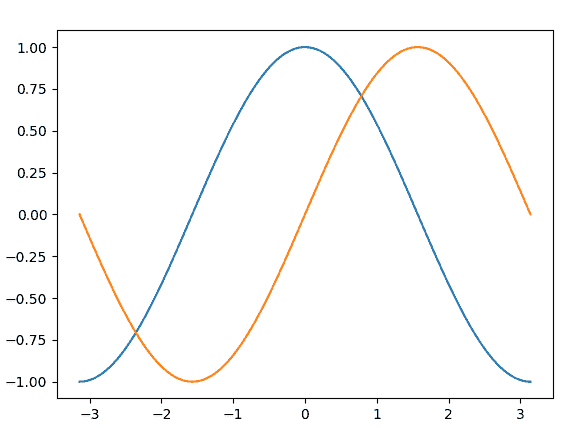

# 使用 IPython

对于 Windows 版本，在从所有程序中导航到 Anaconda3 并点击 IPython 后，我们可以看到如下内容：

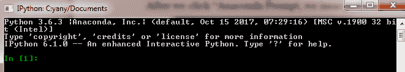

你也可以通过启动 Anaconda Prompt 并输入`ipython`来做到这一点。

这告诉我们`Python`的版本是`3.6.3`，`IPython`的版本是`6.1.0`。我们可以输入一些命令进行测试。例如，如果我们今天投资 100 美元，投资期限为 5 年，年回报率为 10%，那么我们预期的未来价值是多少？给定现值的未来价值公式如下：


其中，*FV*是未来价值，*PV*是现值，*R*是期间回报，*n*是期数：

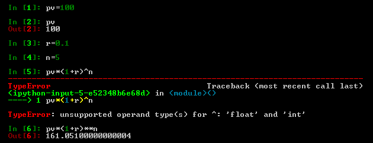

`pv=100`的第一行命令将值`100`赋给了`pv`。对于第五行，我们输入了命令行`pv*(1+r)^n`，然而，我们收到了错误信息`TypeError: unsupported operand type(s) for ^: 'float' and 'int'`。错误信息告诉我们，Python 不识别`^`作为幂运算符。对应的幂运算符是双重乘法符号`**`。还有一个与`**`类似的`power()`函数，示例如下：

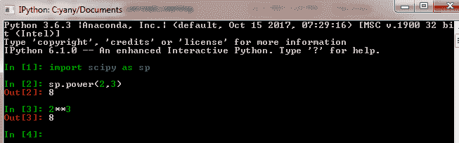

# 使用 Python 通过 Jupyter

在这里，我们展示了如何通过 Jupyter 编写简单的 Python 代码：

1.  从菜单中，点击 Anaconda 后，我们可以找到一个叫做 Jupyter Notebook 的入口。点击该入口后，我们可以看到如下内容：

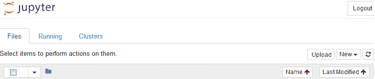

1.  如果我们点击右侧的 New，可以看到几个选项。在选择 Python 3 后，我们将看到以下的起始文件：

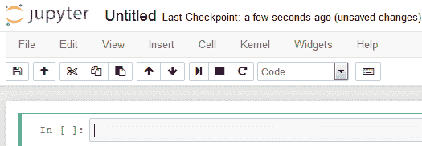

1.  我们现在可以在框中输入 Python 命令。如果你想执行命令，记得按*Shift + Enter*（如图所示）：

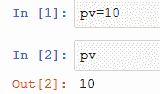

1.  我们还可以输入多个命令并执行它们，如下所示：

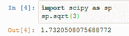

关键词、括号和值的色彩鲜明和独特处理，使我们的编程变得稍微容易了一些。

我们可以通过点击菜单栏中的 File|Save and Checkpoint 来保存程序。同样，我们可以通过点击菜单栏中的 File|Revert to Checkpoint，或在 Jupyter 主页的 Files 下找到并加载我们之前保存的程序。

# 介绍 Spyder

在 Anaconda3 菜单中，最后一个选项是 Spyder。点击它后，我们可以启动 Spyder，如下所示：

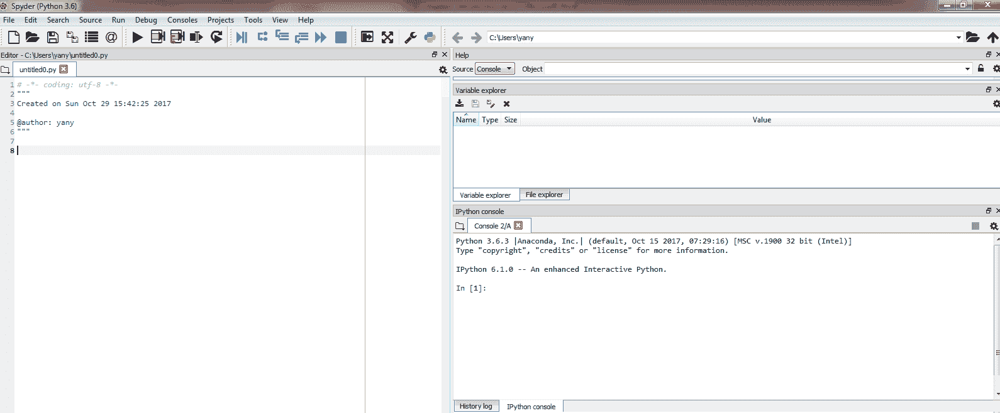

上述截图显示了三个面板。左侧面板用于编写和编辑程序，右下面板用于命令行（我们可以在那里输入简单命令），右上面板用于显示变量。例如，当我们输入 `pv=100` 时，它会显示变量名、类型、大小和数值，如下所示：

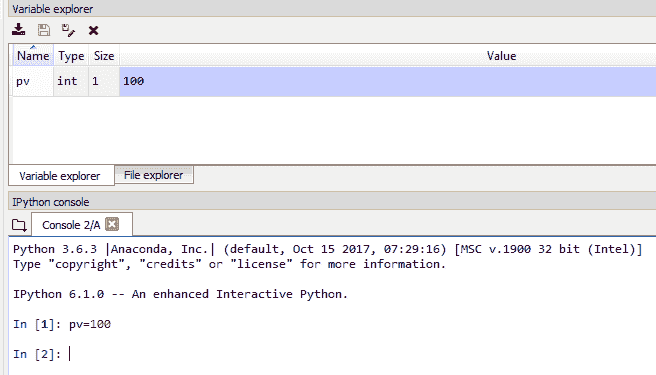

我们也可以编写 Python 程序，并通过左上角面板进行调试和运行。例如，我们可以运行一个包含 `pv_f()` 函数的程序，该函数用于估算单个未来现金流的现值，如下所示：

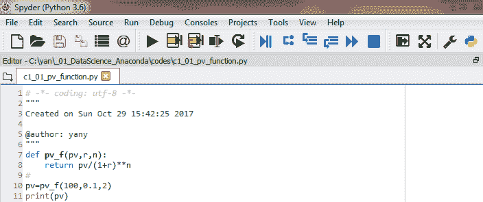

在前面的截图中，绿色的播放按钮用于运行整个 Python 程序，而第二个绿黄相间的按钮用于部分运行程序。这个功能使得我们的调试工作变得稍微简单一些，尤其对于一个长且复杂的程序来说，更加明显。

假设我们打算调试这样的程序。首先，我们将它划分为几个逻辑块。然后，我们高亮第一个块并运行它。在它没有错误之后，我们进入下一个块。我们这样继续，直到调试完整个程序。

# 通过 Conda 安装 R

以下步骤是 R 包安装的流程：

1.  请注意，安装 Anaconda 时并未预安装 R 包，如下所示：

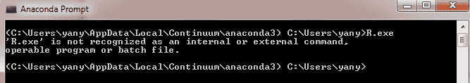

1.  要安装 R 软件，我们必须在点击 Anaconda Prompt 后输入以下命令：

```py
conda install r-essentials
```

1.  安装完成后，我们可以看到以下内容：

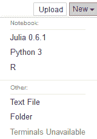

1.  我们可以尝试一些命令。例如，我们首先用关键字 `function` 创建一个名为 `pv_f()` 的 R 函数。这个函数有三个输入值：`fv` 表示未来值，`r` 表示利率，`n` 表示期数：

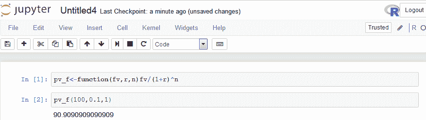

# 安装 Julia 并将其链接到 Jupyter

Julia 的安装步骤如下：

1.  首先，我们前往以下网页下载 Julia：[`julialang.org/downloads/`](https://julialang.org/downloads/)。

1.  与下载 Anaconda 时一样，根据我们的系统，版本有所不同，如下所示：

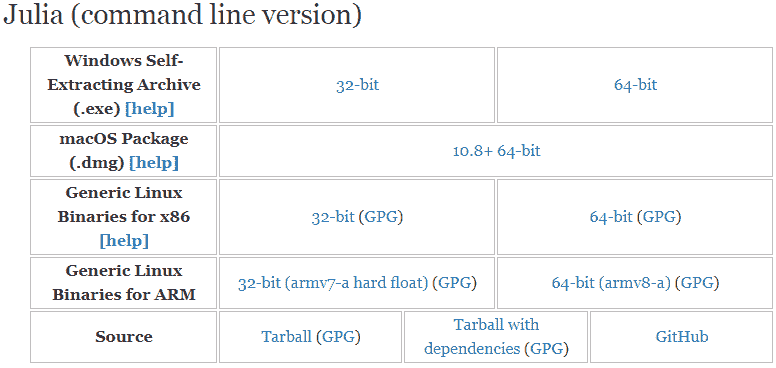

1.  同样，根据你的操作系统（Windows、Mac 或 Linux），选择合适的版本并下载可执行包。

1.  点击可执行文件，我们可以安装包，并且为了启动 Julia，我们只需点击 `Julia.exe`*。

1.  在其中，我们可以输入 `println("Hello World")`，如下所示：

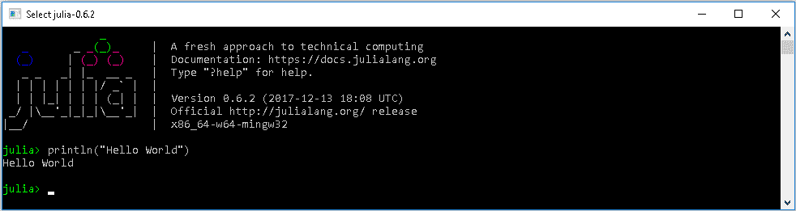

或者，对于 Windows 系统，我们可以点击“所有程序”|“Julia”。我们也可以将 Julia 复制并粘贴到桌面上。

1.  此外，启动 Julia 的另一种方式是通过 DOS 窗口。但是，在此之前，我们必须将包含 `Julia.exe` 的目录路径添加到我们的路径中。例如，为了通过 Jupyter 使用 Julia，我们需要输入以下命令：

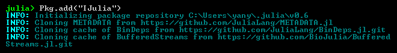

1.  安装名为`IJulia`的包大约需要 10 分钟。安装完成后，我们启动 Jupyter，然后点击“新建”，我们可以看到如下内容：

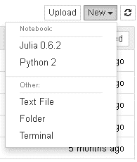

1.  然后我们可以启动 Julia 并在其中输入命令行`println("This is great!")`，如下所示：

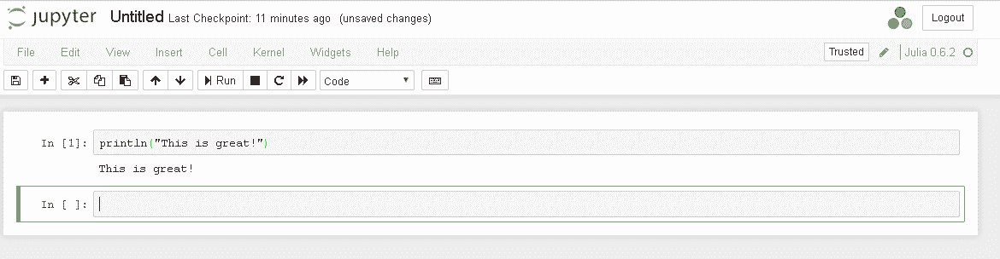

在 Julia 语言方面，在第七章*，Anaconda 中的优化*中，我们使用了一个或两个优化包来解决一些问题。

# 安装 Octave 并将其与 Jupyter 链接

按照以下步骤安装 Octave：

1.  要安装与 Anaconda 链接的 Octavekernel，在 Anaconda Prompt 中，我们通过执行 Anaconda 登录命令进行登录。请注意，要登录，用户必须首先在[`anaconda.org`](https://aconda.org)注册。登录 Anaconda 后，我们可以执行以下命令：

```py
pip install octave_kernel
```

1.  启动 Jupyter 并点击右侧的“新建”后，我们可以看到 Octave 和其他语言：

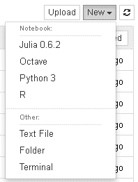

1.  现在我们可以测试一个简单的 Octave 程序：

```py
x=-9:0.1:9; 
y=sin(x); 
plot(x,y) 
```

1.  相关的输出如下所示：

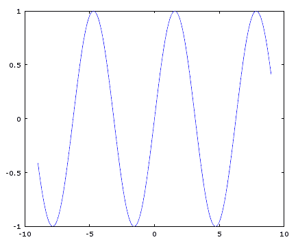

# 寻找帮助

1.  在第一章，*Anaconda 的生态系统*中，我们展示了如何访问链接[`docs.anaconda.com/anaconda/user-guide/`](https://docs.anaconda.com/anaconda/user-guide/)。

1.  点击链接后，我们会看到四个条目，如下所示：

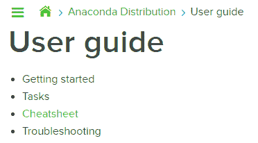

1.  我们可以输入`conda help`来查找有关 Conda 使用的信息。在 Windows 中，点击“所有程序”|“Anaconda”|“Anaconda Prompt”。在命令提示符中，输入`conda help`，如下所示：

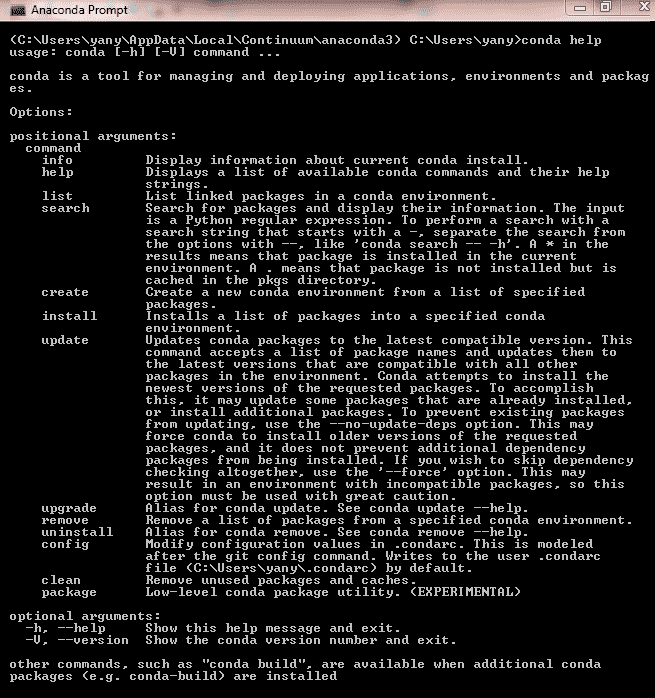

1.  要查找与 Conda 环境关联的所有包，我们可以执行`conda list`命令。

1.  由于包的数量相当庞大，更好的解决方案是生成一个文本文件。我们可以执行`conda list >c:/temp/list.txt`：

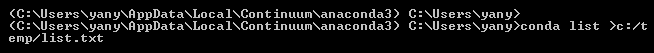

1.  从名为`list.txt`的输出文件中可以看到前几行：

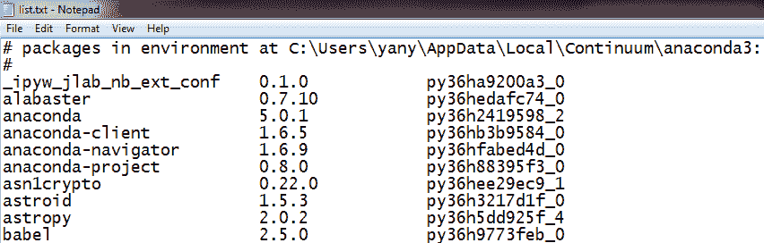

1.  我们可以编写一个 R 程序来读取这个文本文件：

```py
> x<-read.csv('c:/temp/list.txt',skip=2) 
> head(x) 
X_ipyw_jlab_nb_ext_conf....0.1.0............py36ha9200a3_0 
1 alabaster                 0.7.10           py36hedafc74_0   
2 anaconda                  5.0.1            py36h2419598_2   
3 anaconda-client           1.6.5            py36hb3b9584_0   
4 anaconda-navigator        1.6.9            py36hfabed4d_0   
5 anaconda-project          0.8.0            py36h88395f3_0   
6 asn1crypto                0.22.0           py36hee29ec9_1   
> dim(x) 
[1] 380   1
```

1.  要了解如何使用 Jupyter，我们可以在启动 Jupyter 后点击菜单栏上的“帮助”。

1.  在条目列表中，我们可以找到有关 Python 和 IPython 的菜单，以及关于 Python 包`NumPy`、`SciPy`、`Matplotlib`等的信息。

1.  点击“键盘快捷键”后，我们会看到如下内容：

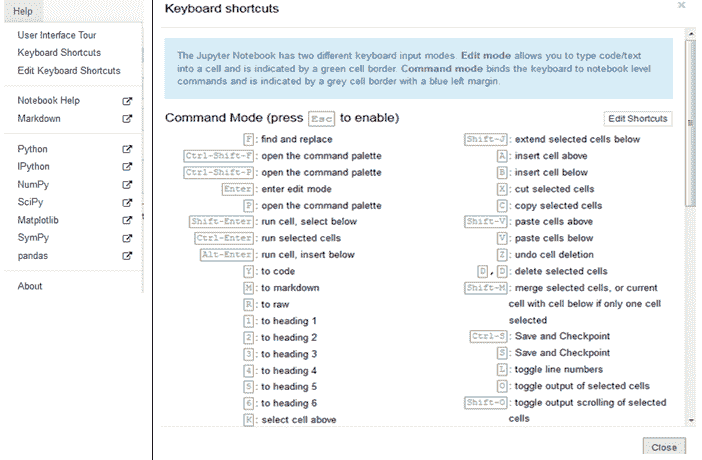

要访问免费的支持小组，请访问[`groups.google.com/a/anaconda.com/forum/#!forum/anaconda`](https://groups.google.com/a/anaconda.com/forum/#!forum/anaconda)。

# 总结

在本章中，我们向你展示了如何安装 Anaconda 并测试安装是否成功。我们看了如何启动 Jupyter 以及如何通过它启动 Python，如何启动 Spyder 和 R，以及如何寻找帮助。大多数这些概念或程序都相当基础，因此对于这些内容非常熟悉的用户可以跳过本章，直接进入 第三章*，数据基础*。

在 第三章*，数据基础* 中，我们首先讨论了开放数据源，例如 UCI（加利福尼亚大学欧文分校）的机器学习库和劳工统计局。然后，我们介绍了 Python 的 Pandas 包。将详细讨论如何处理缺失数据、排序、如何切割和切分数据集、合并不同的数据集以及数据的输入输出等问题。还将介绍和讨论几个相关的数据处理包。

# 复习问题和练习

1.  什么是 Anaconda？我们如何使用它的平台？

1.  Anaconda 的主页是什么？

1.  我们如何安装 Anaconda？

1.  安装 Anaconda 后，我们需要单独安装 Python 吗？那 R 呢？

1.  什么是 Jupyter？我们如何启动它？

1.  我们如何从 Jupyter 启动 Python？

1.  我们如何通过 Jupyter 使用 Python？

1.  什么是 Spyder，我们如何启动它？

1.  编写一个 Python 程序来估算年金的现值，如下公式所示：

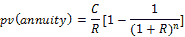

*pv(年金)* 是年金的现值，*C* 是定期支付金额，*R* 是折现率，*n* 是期数。

1.  安装 Anaconda 后，查找有多少个可用的包。（提示：请查看链接 [`docs.anaconda.com/anaconda/packages/pkg-docs`](https://docs.anaconda.com/anaconda/packages/pkg-docs)。）

1.  使用 [`jupyter.org/try`](https://jupyter.org/try) 有哪些优缺点？

1.  新用户可以在哪里找到关于 Anaconda 的更多信息？

1.  什么是 Julia 编程语言？

1.  我们如何安装 Julia，并如何从 Jupyter 调用 Julia？

1.  我们如何安装 Octave 并将其与 Jupyter 连接？

1.  我们如何找到 Jupyter 的帮助？

1.  我们可以在哪里找到大量开放数据？

1.  对于 Python 和 R，计算 2³（2 的三次方）的值。

1.  我们如何独立启动 R？

1.  我们如何使用 Spyder 加载并运行 Python 程序？
