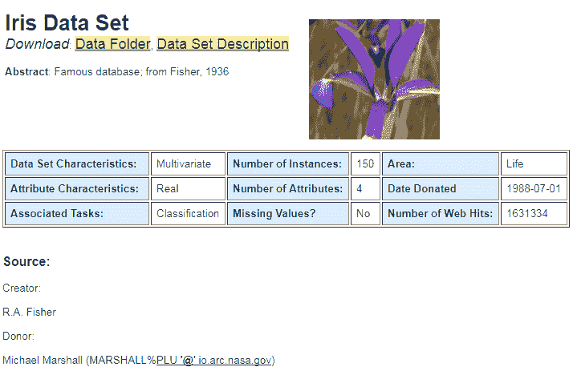
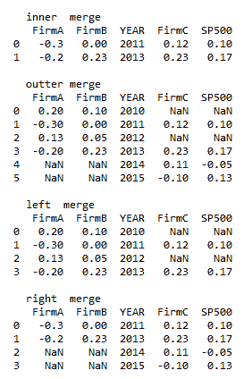
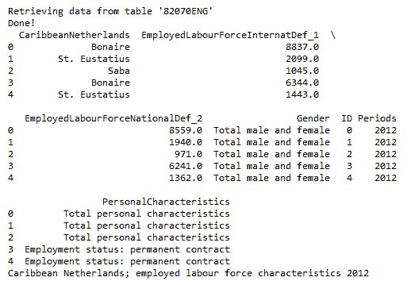

# 第三章：数据基础

在本章中，我们将首先讨论开放数据的来源，其中包括**加利福尼亚大学欧文分校**（**UCI**）机器学习数据存储库、劳工统计局、人口普查局、French 教授的数据图书馆和联邦储备的数据图书馆。然后，我们将展示几种数据输入的方法，如何处理缺失值、排序、选择子集、合并不同数据集以及数据输出。对于不同的编程语言，如 Python、R 和 Julia，我们还将介绍几种与数据处理相关的包，尤其是 Python 的`pandas`包。

本章将涵盖以下主题：

+   数据来源

+   Python pandas 包简介

+   多种输入包的方法

+   Quandl 数据交付平台简介

+   处理缺失数据

+   排序数据，以及如何切片、切块和合并不同的数据集

+   Python 包介绍：`cbsodata`和`datadotword`

+   R 包介绍：`dslabs`、`haven`和`foreign`

+   生成 Python 数据集

+   生成 R 数据集

# 数据来源

对于数据科学和商业分析领域的用户，一个重要的问题是数据的来源，或者简单来说，数据从哪里来。在公司工作时，显而易见的数据来源是公司本身，比如销售数据、原材料成本、管理人员和其他员工的薪资、供应商和客户的相关信息、未来销售的预测、原材料成本等等。找到一些用于学习的数据是个好主意，尤其对全日制学生来说尤其如此。

通常来说，数据分为两类：**公共**和**私有**。私有或专有数据库通常非常昂贵。一个典型的例子是**安全价格研究中心**（**CRSP**）数据库，这是一个由芝加哥大学生成和维护的金融数据库。该数据库包含自 1926 年以来所有在美国证券交易所上市的股票的每日、每周、每月和年度交易数据。

第二类数据是公共或免费的数据。对于各类数据科学或商业分析程序的用户而言，这类数据已经足够。例如，UCI 提供了许多有用的机器学习数据集，供测试和学习使用。这为数据科学领域的新学习者带来了巨大的好处。本章稍后将为数据科学、经济学以及金融和会计领域的学习者提供几个免费数据的列表。

# UCI 机器学习

截至 2018 年 1 月 10 日，UCI 共维护了 413 个用于机器学习的数据集：[`archive.ics.uci.edu/ml/index.php`](http://archive.ics.uci.edu/ml/index.php)。以下截图显示了下载量排名前三的数据集：


对于下载量第一的数据集**鸢尾花**，我们有以下信息：



这些数据集的美妙之处在于它们提供了详细的信息，比如来源、创建者或捐赠者、描述，甚至是引用。

下表展示了数据科学和商业分析领域用户潜在的公共数据来源：

| **名称** | **网页** | **数据类型** |
| --- | --- | --- |
| UCI | [`archive.ics.uci.edu/ml/index.php`](http://archive.ics.uci.edu/ml/index.php) | 机器学习数据 |
| 世界卫生组织 | [`www.who.int/en/`](http://www.who.int/en/) | 医疗数据 |
| 亚马逊云服务 | [`aws.amazon.com/cn/datasets/?nc1=h_ls`](https://aws.amazon.com/cn/datasets/?nc1=h_ls) | 网络使用 |
| Data.gov（美国政府开放数据） | [`www.data.gov/`](https://www.data.gov/) | 农业、气候、消费者等 |
| GitHub | [`github.com/caesar0301/awesome-public-datasets`](https://github.com/caesar0301/awesome-public-datasets) | 个人提供的多个数据集 |
| 开放数据网络 | [`www.opendatanetwork.com/`](https://www.opendatanetwork.com/) | 许多有用的数据集 |
| 政府健康数据 | [`www.healthdata.gov/`](https://www.healthdata.gov/) | 与医疗相关的数据集 |
| 谷歌公共数据 | [`www.google.com/publicdata/directory`](https://www.google.com/publicdata/directory) | 世界发展指标 |

表 3.1：数据科学和商业分析领域潜在的开放数据来源

当我们访问 [`www.data.gov/`](https://www.data.gov/) 时，可以看到以下与**农业**、**气候**、**消费者**、**生态系统**、**教育**等相关的选项：


下一表展示了经济领域用户潜在的开放数据来源：

| **名称** | **网页** | **数据类型** |
| --- | --- | --- |
| 美联储经济数据 | [`www.federalreserve.gov/datadownload/Choose.aspx?rel=H15`](https://www.federalreserve.gov/datadownload/Choose.aspx?rel=H15) | 利率和 AAA/AA 级债券的利率 |
| 人口普查局 | [`www.census.gov/`](http://www.census.gov/) [`www.census.gov/about/index.html`](https://www.census.gov/about/index.html) | 人口普查数据 |
| 美国财政部 | [`www.treas.gov`](http://www.treas.gov) | 美国财政收益 |
| 劳工统计局 | [`www.bls.gov/`](http://www.bls.gov/) [`download.bls.gov/`](http://download.bls.gov/) | 通货膨胀、就业、失业、薪酬和福利等 |
| 经济分析局 | [`www.bea.gov/`](http://www.bea.gov) | GDP、个人收入支出、企业利润等 |
| 国家经济研究局 | [`www.nber.org/`](http://www.nber.org/) | 经济周期、重要统计、总统报告等 |

表 3.2：经济学领域潜在的开放数据来源

进入美联储经济数据后，点击菜单中的数据，我们可以看到以下内容：


下表提供了金融和会计领域用户可以使用的免费数据：

| **名称** | **网页** | **数据类型** |
| --- | --- | --- |
| Yahoo!Finance | [`finance.yahoo.com`](http://finance.yahoo.com) | 历史定价数据、期权、资产负债表和收入报表 |
| Google Finance | [`www.google.com/finance`](http://www.google.com/finance) | 当前及历史交易价格 |
| Marketwatch | [`www.marketwatch.com`](http://www.marketwatch.com) | 财务报表 |
| SEC 文件 | [`www.sec.gov/edgar.shtml`](http://www.sec.gov/edgar.shtml) | 资产负债表、收入报表、持股情况等 |
| 法国教授的数据库 | [`mba.tuck.dartmouth.edu/pages/faculty/ken.french/data_library.html`](http://mba.tuck.dartmouth.edu/pages/faculty/ken.french/data_library.html) | Fama/French 因子、市场指数、无风险利率、行业分类等 |

表 3.3：金融与会计领域的潜在开放数据源

从法国教授的数据库中，我们可以下载著名的 Fama/French 三因子时间序列：

```py
> infile<-"http://canisius.edu/~yany/data/ff3monthly.csv" 
> x<-read.csv(infile,skip=3) 
> head(x,2) 
 Date Mkt.RF  SMB   HML   RF 
1 192607   2.96 -2.3 -2.87 0.22 
2 192608   2.64 -1.4  4.19 0.25 
> tail(x,2) 
 Date Mkt.RF   SMB   HML   RF 
1095 201709   2.51  4.53  3.02 0.09 
1096 201710   2.25 -1.94 -0.09 0.09 
```

在之前的代码中，输入文件`ff3monthly.csv`是经过修改的`*F-F_Research_Data_Factor.csv*`副本，修改内容为移除了年度数据的第二部分，并添加了`Date`作为表头。请注意，`*F-F_Research_Data_Factor.csv*`来自名为`*F-F_Research_Data_Factor_CSV.zip*`的 ZIP 文件。

# Python pandas 包简介

Python 的 pandas 包在处理数据时非常有用。pandas 包是一个非常棒的数据预处理工具，对于数据分析至关重要。有一种幽默的说法来形容数据清洗的重要性：“*数据科学家 80%的时间都在清洗数据，剩下 20%的时间在抱怨清洗数据*”。要测试该包是否已预安装，我们可以在启动 Python 后输入`import pandas as pd`。如果没有出现错误信息，说明该包已预安装。如果出现错误，则可以使用`conda install pandas`来安装该包。要查找所有可用的功能，我们可以使用以下三行 Python 代码：


要了解某个函数的用法或示例，可以使用`help()`函数。例如，对于之前截图底部显示的`to_pickle`功能，我们可以输入`help(pd.to_pickle)`，如下第一行所示：


# 几种数据输入方式

首先，我们来看一下如何输入**逗号分隔值**（**CSV**）文件。输入的数据集是来自 UCI 机器学习数据存储库的最受欢迎的数据集。该数据集的位置是[`archive.ics.uci.edu/ml/machine-learning-databases/iris/bezdekIris.data`](http://archive.ics.uci.edu/ml/machine-learning-databases/iris/bezdekIris.data)；你还可以参考以下的截图：


# 使用 R 输入数据

这里显示了 R 代码：

```py
> path<-"http://archive.ics.uci.edu/ml/machine-learning-databases/" 
> dataSet<-"iris/bezdekIris.data" 
> a<-paste(path,dataSet,sep='') 
> x<-read.csv(a,header=F) 
> colnames(x)<-c("sepalLength","sepalWidth","petalLength","petalWidth","Class") 
```

可以使用`dim()`、`head()`和`tail()`函数查看数据集的大小以及前几个和最后几个观察值，如下所示：

```py
> dim(x) 
 [1] 150   5 
> head(x,2) 
 sepalLength sepalWidth petalLength petalWidth       Class 
1         5.1        3.5         1.4        0.2 Iris-setosa 
2         4.9        3.0         1.4        0.2 Iris-setosa 
> tail(x,2) 
 sepalLength sepalWidth petalLength petalWidth          Class 
149         6.2        3.4         5.4        2.3 Iris-virginica 
150         5.9        3.0         5.1        1.8 Iris-virginica 
```

另外，我们可以使用其他 R 函数从外部数据文件输入数据。这些函数包括`read.table()`、`read.delim()`和`read.fwf()`函数。为了查找所有以`read.`开头的函数，我们可以应用`apropos()`函数，见下方：

```py
> apropos("read.") 
 [1] ".read.xls"        ".readRDS"         "read.csv"         
 [4] "read.csv2"        "read.dcf"         "read.delim"       
 [7] "read.delim2"      "read.DIF"         "read.fortran"     
[10] "read.ftable"      "read.fwf"         "read.lines"       
[13] "read.links"       "read.lynx"        "read.socket"      
[16] "read.table"       "read.w3m"         "read.xls"         
[19] "readBin"          "readChar"         "readCitationFile" 
[22] "readClipboard"    "readline"         "readLines"        
[25] "readRDS"          "readRegistry"     "readRenviron"     
[28] "readSeries"       "spreads"          "spreadSeries"     
[31] "Sys.readlink"    
```

为了查找单个函数的具体用法，我们使用`help()`函数。例如，在输入`help(read.fwf)`后，我们可以找到关于此特定函数的信息，见下图的前几行：


# 使用 Python 输入数据

类似地，我们可以使用 Python 来检索数据，如以下代码所示：

```py
import pandas as pd 
path="http://archive.ics.uci.edu/ml/machine-learning-databases/" 
dataset="iris/bezdekIris.data" 
inFile=path+dataset 
data=pd.read_csv(inFile,header=None) 
data.columns=["sepalLength","sepalWidth","petalLength","petalWidth","Class"] 
```

获取数据后，可以使用`print(data.head(2))`函数查看前两个实例：

```py
> print(data.head(2)) 
 sepalLength  sepalWidth  petalLength  petalWidth        Class
0          5.1         3.5          1.4         0.2  Iris-setosa
1          4.9         3.0          1.4         0.2  Iris-setosa
```

当输入`pd.read.csv()`时，我们可以找到所有输入变量的定义，如下图所示。为了节省空间，仅显示了前几个输入变量：


为了防止未来数据集链接发生变化，我们在作者的网站上有一个备份数据集，以下是相应的 Python 代码：

```py
inFile="http://canisius.edu/~yany/data/bezdekIris.data.txt" 
import pandas as pd 
d=pd.read_csv(inFile,header=None) 
```

以下表格显示了 pandas 包中一些可以用于检索数据的函数：

| **函数** | **描述** |
| --- | --- |
| `read_clipboard` | 从剪贴板读取文本并传递给`read_table` |
| `read_csv` | 将 CSV 文件读取到`DataFrame` |
| `read_excel` | 将 Excel 表格读取到 pandas `DataFrame` |
| `read_feather` | 从文件路径加载一个 feather 格式的对象 |
| `read_fwf` | 读取固定宽度格式的行表格到`DataFrame` |
| `read_gbq` | 从 Google BigQuery 加载数据 |
| `read_hdf` | 检索存储在文件中的 pandas 对象 |
| `read_html` | 将 HTML 表格读取到`DataFrame`对象列表中 |
| `read_json` | 将 JSON 字符串转换为 pandas 对象 |
| `read_msgpack` | 从指定的文件路径加载一个`msgpack` pandas 对象 |
| `read_pickle` | 从指定的文件路径加载一个`pickled` pandas 对象（或任何其他`pickled`对象） |
| `read_sas` | 读取存储为 XPORT 或 SAS7BDAT 格式的 SAS 文件 |
| `read_sql` | 将 SQL 查询或数据库表读取到`DataFrame` |
| `read_sql_query` | 将 SQL 查询读取到`DataFrame` |
| `read_sql_table` | 将 SQL 数据库表读取到`DataFrame` |
| `read_stata` | 将 Stata 文件读取到`DataFrame` |
| `read_table` | 读取一个通用分隔符文件到`DataFrame` |

表 3.4 输入数据时 Python pandas 模块中包含的函数

要获取前面提到的每个函数的详细信息，我们使用`help()`函数。例如，如果我们想了解更多关于`read_sas()`函数的信息，我们可以执行以下命令：

```py
import pandas as pd 
help(pd.read_sas) 
```

相应的输出，仅显示顶部部分，如下所示：


# Quandl 数据交付平台介绍

Quandl 是一个数据交付平台，包含许多免费的数据集。其官网是[`www.quandl.com`](https://www.quandl.com)。以下是一些用 R 或 Python 编写的程序，用于从该平台下载数据。以下程序检索**国际商业机器公司**（**IBM**）最新的`50`个交易日的数据：

```py
> library(Quandl) 
> x<- Quandl.dataset.get("WIKI/ibm", list(rows=50)) 
> head(x,2) 
 Date   Open    High     Low  Close  Volume Ex-Dividend 
1 2018-01-09 163.90 164.530 163.060 163.83 4333418           0 
2 2018-01-08 162.66 163.905 161.701 163.47 5101023           0 
  Split Ratio Adj. Open Adj. High Adj. Low Adj. Close Adj. Volume 
1           1    163.90   164.530  163.060     163.83     4333418 
2           1    162.66   163.905  161.701     163.47     5101023 
```

请注意，我们只需在代码中执行前两行一次。接下来的代码将获取一个中国公司（股票代码为`601628`）的数据。显然，`DY4`代表中国数据：

```py
import Quandl as qd 
y<- Quandl.dataset.get("DY4/601628", list(rows=50)) 
> head(y,2) 
```

相应的输出如下所示：


对于以下的 R 程序，我们假设 Quandl 应用程序密钥保存在`myQuandlKey`变量中。本章后面将解释如何获取 Quandl 应用程序密钥：

```py
> library(Quandl) 
> Quandl.api_key(myQuandlKey) 
> x<- Quandl.dataset.get("WIKI/wmt", list(rows=500)) 
```

对于 Python，我们有以下代码从`Quandl`下载**国内生产总值**（**GDP**）：

```py
import quandl 
x= quandl.get("FRED/GDP") 
x.head() 
 Value 
Date                
1947-01-01  243.080 
1947-04-01  246.267 
1947-07-01  250.115 
1947-10-01  260.309 
1948-01-01  266.173 
```

输出数据集的格式是 pandas 数据框。`Quandl`也可以返回`numpy`数组形式的数据，如下所示：

```py
import quandl 
x=quandl.get("FRED/GDP",returns="pandas")     
y=quandl.get("FRED/GDP",returns="numpy") 
```

下表显示了来自 Quandl 数据平台的不同数据源的模式：

| **模式** | **示例** | **解释** |
| --- | --- | --- |
| WIKI | `WIKI/IBM` | 美国股票收盘价 |
| DY4 | `DYE/60618` | 中国数据 |
| FRED | `FRED/GDP` | 美国联邦储备经济数据 |
| EIA | `EIA/PET_RWTC_D` | 美国能源部 |
| NSE | `NSE/OIL` | 石油价格 |
| ZEP | `ZEP/ibm` | Zacks 股票价格，股息历史（美国） |
| CBOE | `CBOE/VXU2018` | 芝加哥期权交易所 |

表 3.5：Quandl 平台上不同类型/数据源的模式

截至 2017 年 10 月 1 日，按照 Quandl 设置的限制，请参见以下表格。对于免费订阅者，用户需要注册 Quandl 以获取 Quandl 应用程序密钥：

| **用户类型** | **最大调用次数（每 10 分钟）** | **最大每日调用次数** | **并发限制** |
| --- | --- | --- | --- |
| 匿名 | 20 | 50 | 1 次调用 |
| 免费订阅者 | 2,000 | 50,000 | 队列中 1 + 1 |
| 高级会员 | 5,000 | 720,000 | 无限制 |

表 3.6：Quandl 用户每 10 分钟和每天最大调用次数

下一个程序展示了如何为免费订阅者（即拥有 Quandl 应用程序密钥的用户）检索沃尔玛数据。成为免费订阅者意味着你可以在不支付任何费用的情况下注册 Quandl：

```py
import quandl as qd 
quandl.ApiConfig.api_key = 'YOUR_API_KEY'  
y=qd.get("WIKI/WMT") 
y.head(2) 
y.tail(1) 
```

输出如下所示：


`quandl.ApiConfig.api_key = 'YOUR_API_KEY'`的第二行表示用户必须输入其 Quandl 应用程序密钥。

# 处理缺失数据

首先，让我们看看不同语言的缺失代码：

| **语言** | **缺失代码** | **解释或示例** |
| --- | --- | --- |
| R | `NA` | `NA`代表不可用 |
| Python | `nan` | `import scipy as sp``misingCode=sp.nan` |
| Jullia | `missing` | `julia> missing + 5``missing` |
| Octave | `NaN` | MATLAB 也是如此 |

表 3.7：R、Python、Julia 和 Octave 的缺失代码

对于 R，缺失代码是`NA`。以下是几个我们可以使用的函数来删除这些缺失的观察值，示例展示如下：

```py
> head(na_example,20) 
[1]  2  1  3  2  1  3  1  4  3  2  2 NA  2  2  1  4 NA  1  1  2 
> length(na_example) 
[1] 1000 
> x<-na.exclude(na_example) 
> length(x) 
[1] 855 
> head(x,20) 
[1] 2 1 3 2 1 3 1 4 3 2 2 2 2 1 4 1 1 2 1 2 
```

在上一个示例中，我们通过使用 R 中的`na.exclude()`函数删除了 145 个缺失值。我们还可以使用`apropos()`函数查找更多处理缺失代码的函数，如下所示：

```py
 > apropos("^na.") 
 [1] "na.action"              "na.contiguous"          
 [3] "na.exclude"             "na.fail"                
 [5] "na.omit"                "na.pass"                
 [7] "na_example"             "names"                  
 [9] "names.POSIXlt"          "names<-"                
[11] "names<-.POSIXlt"        "namespaceExport"        
[13] "namespaceImport"        "namespaceImportClasses" 
[15] "namespaceImportFrom"    "namespaceImportMethods" 
[17] "napredict"              "naprint"                
[19] "naresid"                "nargs" 

```

对于 Python，我们有以下示例，首先，让我们生成一个名为`z.csv`的数据集，参见接下来的 R 代码。对于该程序，我们生成`100`个零作为缺失值：

```py
set.seed(123)
n=500
x<-rnorm(n)
x2<-x
m=100
y<-as.integer(runif(m)*n)
x[y]<-0
z<-matrix(x,n/5,5)
outFile<-"c:/temp/z.csv"
write.table(z,file=outFile,quote=F,row.names=F,col.names=F,sep=',')
```

以下 Python 程序检查`5`列中的缺失值，并将其替换为`NaN`或每列的平均值：

```py
import scipy as sp
import pandas as pd
path="https://canisius.edu/~yany/data/"
dataSet="z.csv"
infile=path+dataset
#infile=”c:/temp/z.csv”
x=pd.read_csv(infile,header=None)
print(x.head())
print((x[[1,1,2,3,4,5]] ==0).sum())
```

相关输出如下所示：


在此阶段，我们只知道前五列中的零表示缺失值。`print((x[[1,2,3,4,5]] == 0).sum())`的代码显示了五列中零的数量。例如，第一列有五个零。我们可以使用`scipy.NaN`来替换这些零，如下所示：

```py
x2=x
x2[[1,2,3,4,5]] = x2[[1,2,3,4,5]].replace(0, sp.NaN)
print(x2.head())
```

输出中的零已被`sp.NaN`替换，如下所示：


如果我们计划使用均值来替换这些`NaN`，我们可以使用以下代码：

```py
x3=x2
x3.fillna(x3.mean(), inplace=True)
print(x3.head())
```

输出如下所示：


# 数据排序

在 R 中，我们有多种方式进行数据排序。最简单的方式是使用`sort()`函数（请参见用于最简单一维数据的代码）：

```py
> set.seed(123) 
> x<-rnorm(100) 
> head(x) 
[1] -0.56047565 -0.23017749  1.55870831  0.07050839  0.12928774  1.71506499 
> y<-sort(x) 
> head(y) 
[1] -2.309169 -1.966617 -1.686693 -1.548753 -1.265396 -1.265061 
```

让我们看另一种排序数据的方法。使用的数据集叫做`nyseListing`，它包含在 R 包`fImport`中，如下所示：

```py
library(fImport) 
data(nyseListing) 
dim(nyseListing) 
head(nyseListing) 
```

输出如下所示：


总共有`3,387`个观察值，每个观察值有`4`个变量。数据集按`Symbol`排序，就像是各个股票的代码一样。假设我们希望按`Name`排序，如下所示：

```py
> x<-nyseListing[order(nyseListing$Name),] 
> head(x) 
```

输出显示数据集确实是按公司`Name`排序的：


在以下示例中，我们首先按`ID`排序，然后按`RET`排序：

```py
> x<-c(1,3,1, 0.1,0.3,-0.4,100,300,30) 
> y<-data.frame(matrix(x,3,3)) 
> colnames(y)<-c("ID","RET","Data1") 
> y 
```

我们的简单输出数据集如下所示：


为了按`ID`和`RET`排序数据，我们可以使用`order(ID,RET)`，如下所示：

```py
> z<-y[order(y$ID,y$RET),] 
> z 
```

以下截图显示输出数据集已正确排序：


如果我们希望按降序排序，可以添加`decreasing=TRUE`：

```py
> z2<-y[order(y$ID,decreasing = TRUE,y$RET),] 
> z2 
 ID  RET Data1 
2  3  0.3   300 
1  1  0.1   100 
3  1 -0.4    30 
```

要在 Python 中排序数据，参见以下代码：

```py
import pandas as pd 
a = pd.DataFrame([[8,3],[8,2],[1,-1]],columns=['X','Y']) 
print(a) 
# sort by A ascending, then B descending 
b= a.sort_values(['X', 'Y'], ascending=[1, 0]) 
print(b) 
# sort by A and B, both ascending 
c= a.sort_values(['X', 'Y'], ascending=[1, 1]) 
print(c)  
```

输出如下所示：


# 切片和切割数据集

我们的第一个例子是使用一个名为`marketCap.Rdata`的 R 数据集来选取所有在纽约证券交易所上市的股票，代码如下：

```py
> con<-url("http://canisius.edu/~yany/RData/marketCap.RData") 
> load(con) 
> head(.marketCap) 
```

相关输出如下所示：

```py
> head(.marketCap) 
 Symbol                       Name MarketCap Exchange 
1      A Agilent Technologies, Inc. $12,852.3     NYSE 
2     AA                 Alcoa Inc. $28,234.5     NYSE 
3   AA-P                 Alcoa Inc.     $43.6     AMEX 4    AAC       Ableauctions.Com Inc      $4.3     AMEX 
5    AAI     AirTran Holdings, Inc.    $156.9     NYSE 
6    AAP     Advance Auto Parts Inc  $3,507.4     NYSE 
```

我们有多种方法可以选择 R 数据集`.marketCap`的子集。请注意，`.marketCap`前面有一个点：

```py
a<-.marketCap[1]      # choose the 1st column  
b<-.marketCap$SYMBOL  # another way to choose the 1st column  
c<-.marketCap[,1:2]   # choose the first two columns  
d<-subset(.marketCap,.marketCap$EXCHANGE=="NYSE") 
e<-subset(head(.marketCap)) 
f<-subset(.marketCap,.marketCap$MARKET>200 & .marketCap$MARKETCAP<=3000) 
```

可以从[`canisius.edu/~yany/python/marketCap.pkl`](http://canisius.edu/~yany/python/marketCap.pkl)下载一个 Python 数据集。

# 合并不同的数据集

首先，让我们生成一些假设的数据集。然后，我们将尝试根据一定的规则将它们合并。最简单的方法是使用蒙特卡洛模拟来生成这些数据集：

```py
> set.seed(123) 
> nStocks<-4 
> nPeriods<-24 
> x<-runif(nStocks*nPeriods,min=-0.1,max=0.20) 
> a<-matrix(x,nPeriods,nStocks) 
> d1<-as.Date("2000-01-01") 
> d2<-as.Date("2001-12-01") 
> dd<-seq(d1,d2,"months") 
> stocks<-data.frame(dd,a) 
> colnames(stocks)<-c("DATE",paste('stock',1:nStocks,sep=''))  
```

在代码中，第一行设置了一个随机种子，这将保证任何用户如果使用相同的随机种子，都会得到相同的随机数。`runif()`函数用于从均匀分布中生成随机数。从某种意义上讲，前面的代码将生成五只股票的 2 年期回报率。`dim()`和`head()`函数可以用来查看数据集的维度和前几行数据，代码如下：

```py
> dim(stocks) 
[1] 24  5 
> head(stocks) 
 DATE      stock1      stock2      stock3      stock4 
1 2000-01-01 -0.01372674  0.09671174 -0.02020821  0.11305472 
2 2000-02-01  0.13649154  0.11255914  0.15734831 -0.09981257 
3 2000-03-01  0.02269308  0.06321981 -0.08625065  0.04259497 
4 2000-04-01  0.16490522  0.07824261  0.03266002 -0.03396433 
5 2000-05-01  0.18214019 -0.01325208  0.13967745  0.01394496 
6 2000-06-01 -0.08633305 -0.05586591 -0.06343022  0.08383130 
```

类似地，我们可以获取市场回报，代码如下：

```py
> d3<-as.Date("1999-01-01") 
> d4<-as.Date("2010-12-01") 
> dd2<-seq(d3,d4,"months") 
> y<-runif(length(dd2),min=-0.05,max=0.1) 
> market<-data.frame(dd2,y) 
> colnames(market)<-c("DATE","MKT") 
```

为了使合并更有趣，我们故意将市场回报时间延长，代码如下，同时显示其维度和前几行数据：

```py
> dim(market) 
[1] 144   2 
> head(market,2) 
 DATE          MKT 
1 1999-01-01  0.047184022 
2 1999-02-01 -0.002026907 
```

要合并它们，我们有以下代码：

```py
> final<-merge(stocks,market) 
> dim(final) 
[1] 24  6 
> head(final,2) 
 DATE      stock1     stock2      stock3      stock4        MKT 
1 2000-01-01 -0.01372674 0.09671174 -0.02020821  0.11305472 0.05094986 
2 2000-02-01  0.13649154 0.11255914  0.15734831 -0.09981257 0.06056166 
```

要了解更多关于 R 语言`merge()`函数的信息，只需键入`help(merge)`，然后我们可以指定内连接、左连接、右连接和外连接。在前面的例子中，默认设置是内连接，即选择两个数据集中都存在的观察值。

以下 Python 程序清楚地展示了这一概念：

```py
import pandas as pd 
import scipy as sp 
x= pd.DataFrame({'YEAR': [2010,2011, 2012, 2013], 
                 'FirmA': [0.2, -0.3, 0.13, -0.2], 
                 'FirmB': [0.1, 0, 0.05, 0.23]}) 
y = pd.DataFrame({'YEAR': [2011,2013,2014, 2015], 
                 'FirmC': [0.12, 0.23, 0.11, -0.1], 
                 'SP500': [0.1,0.17, -0.05, 0.13]}) 

print("n  inner  merge ") 
print(pd.merge(x,y, on='YEAR')) 
print(" n  outer merge  ") 
print(pd.merge(x,y, on='YEAR',how='outer')) 
print("n  left  merge  ") 
print(pd.merge(x,y, on='YEAR',how='left')) 
print("n  right  merge ") 
print(pd.merge(x,y, on='YEAR',how='right')) 
```

相关输出如下所示：



# 数据输出

在上一节中，我们使用 R 语言生成了一个名为`final`的数据资产。要将其保存为 CSV 文件，我们可以使用`write.csv()`或`write.table()`函数，代码如下：

```py
> write.csv(final,file="c:/temp/t.csv") 
> write.table(final,file="c:/temp/t2.txt",sep=";") 
```

`write.csv()`函数的分隔符是逗号，而我们可以为`write.table()`函数指定自己的分隔符。要查找其他以`write`开头的 R 函数，我们可以使用`apropos()`函数，代码如下：

```py
> apropos("^write") 
 [1] "write"          "write.csv"      "write.csv2"     
 [4] "write.dcf"      "write.ftable"   "write.socket"   
 [7] "write.table"    "writeBin"       "writeChar"      
[10] "writeClipboard" "writeLines"    
```

对于以下 Python 程序，我们将 Fama-French 每月因子导出到三种不同的输出格式：pickle、CSV 和文本文件：

```py
import pandas as pd 
infile="http://canisius.edu/~yany/data/ff3monthly.csv" 
ff3=pd.read_csv(infile,skiprows=3) 
print(ff3.head(2)) 
# output to pickle 
ff3.to_pickle("c:/temp/ff3.pkl") 
# output to a csv file  
outfile=open("c:/temp/ff3.csv","w") 
ff3.to_csv(outfile,index=None) 
outfile.close() 
# output to text file 
outfile2=open("c:/temp/ff3.txt","w") 
ff3.to_csv(outfile2, header=True, index=None, sep=' ', mode='a') 
outfile2.close() 
```

# `cbsodata` Python 包简介

要安装`cbsodata` Python 包，请执行以下步骤：

1.  我们可以使用以下命令之一：

```py
conda install cbsodata 
pip install cbsodata 
```

有关如何安装 Python 包的详细说明，请参见第六章，*管理包*：

1.  下一段程序展示了使用该包的一个示例：

```py
import pandas as pd 
import cbsodata as cb 
name='82070ENG' 
data = pd.DataFrame(cb.get_data(name)) 
print(data.head()) 
info=cb.get_info(name) 
print(info['Title']) 
```

1.  相应的输出如下所示：



截图中的最后一行给出了数据集的名称。在之前的例子中，我们使用的数据集名称为`82070ENG`。

1.  为了找出所有列表的名称，我们使用`get_table_list()`函数；请参见以下代码：

```py
import cbsodata as cb 
list=cb.get_table_list() 
print(list) 
```

# datadotworld Python 包介绍

安装 `datadotworld` Python 包的步骤如下：

1.  首先，我们必须安装该包。为此，我们可以尝试以下其中一行命令：

```py
conda install datadotworld 
pip install datadotworld 
```

1.  包成功安装后，我们可以使用 `dir()` 函数列出该包的所有函数，如下所示：


1.  用户必须在[`data.world/settings/advaned`](https://data.world/settings/advaned)获取一个 APK token 才能运行 Python 程序。如果没有该 token，我们在运行`datadotworld`函数时可能会遇到以下错误信息：


1.  根据错误信息，我们必须运行以下配置命令：


1.  现在我们可以像下面的 Python 程序一样使用 Python 包：

```py
import datadotworld as dw 
name='jonloyens/an-intro-to-dataworld-dataset' 
results = dw.query(name, 
    'SELECT * FROM `DataDotWorldBBallStats`, `DataDotWorldBBallTeam` ' 
    'WHERE DataDotWorldBBallTeam.Name = DataDotWorldBBallStats.Name') 
df = results.dataframe 
print(df) 
```

1.  相关输出如下所示：


# haven 和 foreign R 包介绍

`haven` R 包用于导入和导出 SPSS、Stata 和 SAS 文件。该包是 **标签数据工具函数**（Labelled Data Utility Functions），这是一个处理标签数据的许多小函数集合，例如在 R 与其他统计软件包如 `SAS`、`SPSS` 或 `Stata` 之间读写数据，并处理标签数据。

这包括获取、设置和更改值及变量标签属性的简便方法，转换标签向量为因子或数值（反之亦然），以及处理多个声明的缺失值。以下示例展示了写入几个特定输出：

```py
library(haven)
x<-1:100
y<-matrix(x,50,2)
z<-data.frame(y)
colnames(z)<-c("a","b")
write_sas(z,"c:/temp/tt.sas7bdat")
write_spss(z,"c:/temp/tt.sav")
write_stata(z,"c:/temp/tt.dta")
```

另一个叫做`foreign`的 R 包可以用来读取 SPSS 和 SAS 数据。这里有一个示例。首先，我们下载一个名为`airline_passanges.sav`的 SPSS 数据集，下载地址为[`calcnet.mth.cmich.edu/org/spss/Prj_airlinePassengers.htm`](http://calcnet.mth.cmich.edu/org/spss/Prj_airlinePassengers.htm)。假设相关的 SPCC 数据保存在 `c:/temp` 目录下：

```py
library(foreign) 
x<-read.spss("c:/temp/airline_passengers.sav", to.data.frame=TRUE) 
dim(x) 
[1] 144   1 
```

# dslabs R 包介绍

`dslabs` R 包是 **数据科学实验室**（Data Science Labs）的简称。该包包括多个数据集，例如包含 2010 年美国各州枪支谋杀数据的`murders`数据集：

```py
> library(dslabs) 
> data(murders) 
> head(murders) 
 state abb region population total 
1    Alabama  AL  South    4779736   135 
2     Alaska  AK   West     710231    19 
3    Arizona  AZ   West    6392017   232 
4   Arkansas  AR  South    2915918    93 
5 California  CA   West   37253956  1257 
6   Colorado  CO   West    5029196    65 
```

下表显示了该包中包含的数据集：

| **数据集名称** | **描述** |
| --- | --- |
| [admissions](http://127.0.0.1:23636/library/dslabs/html/admissions.html) | 加州大学伯克利分校研究生入学性别偏见 |
| [divorce_margarine](http://127.0.0.1:23636/library/dslabs/html/divorce_margarine.html) | 离婚率与人造黄油消费数据 |
| [ds_theme_set](http://127.0.0.1:23636/library/dslabs/html/ds_theme_set.html) | dslabs 主题设置 |
| [gapminder](http://127.0.0.1:23636/library/dslabs/html/gapminder.html) | Gapminder 数据 |
| [heights](http://127.0.0.1:23636/library/dslabs/html/heights.html) | 自报身高 |
| [murders](http://127.0.0.1:23636/library/dslabs/html/murders.html) | 2010 年美国各州的枪支谋杀案件 |
| [na_example](http://127.0.0.1:23636/library/dslabs/html/na_example.html) | 包含一些缺失值的计数数据 |
| [oecd](http://127.0.0.1:23636/library/dslabs/html/gapminder.html) | Gapminder 数据 |
| [opec](http://127.0.0.1:23636/library/dslabs/html/gapminder.html) | Gapminder 数据 |
| [outlier_example](http://127.0.0.1:23636/library/dslabs/html/outlier_example.html) | 带有离群值的成年男性身高（英尺） |
| [polls_us_election_2016](http://127.0.0.1:23636/library/dslabs/html/polls_us_election_2016.html) | Fivethirtyeight 2016 年选举民调数据 |
| [raw_data_research_funding_rates](http://127.0.0.1:23636/library/dslabs/html/research_funding_rates.html) | 荷兰研究资金中的性别偏见 |
| [reported_heights](http://127.0.0.1:23636/library/dslabs/html/reported_heights.html) | 自报身高 |
| [research_funding_rates](http://127.0.0.1:23636/library/dslabs/html/research_funding_rates.html) | 荷兰研究资金中的性别偏见 |
| [results_us_election_2016](http://127.0.0.1:23636/library/dslabs/html/polls_us_election_2016.html) | Fivethirtyeight 2016 年选举民调数据 |
| [rfalling_object](http://127.0.0.1:23636/library/dslabs/html/rfalling_object.html) | 模拟的下落物体数据 |
| [take_poll](http://127.0.0.1:23636/library/dslabs/html/take_poll.html) | 从民调中获得的模型结果 |
| [us_contagious_diseases](http://127.0.0.1:23636/library/dslabs/html/us_contagious_diseases.html) | 美国各州的传染病数据 |

表 3.8 包含在 R 包 dslabs 中的数据集

# 生成 Python 数据集

要生成 Python 数据集，我们使用`Pandas to_pickle`功能。我们计划使用的数据集名为`adult.pkl`，如以下截图所示：


相关的 Python 代码如下所示：

```py
import pandas as pd 
path="http://archive.ics.uci.edu/ml/machine-learning-databases/" 
dataSet="adult/adult.data" 
inFile=path+dataSet 
x=pd.read_csv(inFile,header=None) 
adult=pd.DataFrame(x,index=None) 
adult= adult.rename(columns={0:'age',1: 'workclass', 
2:'fnlwgt',3:'education',4:'education-num', 
5:'marital-status',6:'occupation',7:'relationship', 
8:'race',9:'sex',10:'capital-gain',11:'capital-loss', 
12:'hours-per-week',13:'native-country',14:'class'}) 
adult.to_pickle("c:/temp/adult.pkl") 
```

要显示前几行的观察数据，我们使用`x.head()`功能，如以下截图所示：


注意，备份数据集可以从作者网站获取，下载地址为[`canisius.edu/~yany/data/adult.data.txt`](http://canisius.edu/~yany/data/adult.data.txt)。

# 生成 R 数据集

这里，我们展示如何通过使用 R 的`save()`函数生成一个名为`iris.RData`的 R 数据集：

```py
path<-"http://archive.ics.uci.edu/ml/machine-learning-databases/" 
dataSet<-"iris/bezdekIris.data" 
a<-paste(path,dataSet,sep='') 
.iris<-read.csv(a,header=F) 
colnames(.iris)<-c("sepalLength","sepalWidth","petalLength","petalWidth","Class") 
save(iris,file="c:/temp/iris.RData") 
```

要上传该函数，我们使用`load()`函数：

```py
>load("c:/temp/iris.RData") 
> head(.iris) 
 sepalLength sepalWidth petalLength petalWidth       Class 
1         5.1        3.5         1.4        0.2 Iris-setosa 
2         4.9        3.0         1.4        0.2 Iris-setosa 
3         4.7        3.2         1.3        0.2 Iris-setosa 
4         4.6        3.1         1.5        0.2 Iris-setosa 
5         5.0        3.6         1.4        0.2 Iris-setosa 
6         5.4        3.9         1.7        0.4 Iris-setosa 
```

注意，`.RData`扩展名并不是关键。保存 R 数据的第二种方法是使用 R 函数`saveRDS()`，以下代码展示了如何使用：

```py
inFile<-"http://canisius.edu/~yany/data/ff3monthly.csv" 
ff3monthly<-read.csv(inFile,skip=3)
saveRDS(ff3monthly,file="c:/temp/ff3monthly.rds") 
```

加载数据集的相应函数是`readRDS()`。使用 rds 数据集时，另一个重要特性是我们可以为其分配一个更方便的名称，如以下代码所示。在这个例子中，我们将其命名为`abc`而不是`ff3monthly`：

```py
>abc<-readRDS("c:/temp/ff3monthly.rds") 
>head(abc,3) 
 DATE MKT_RF     SMB     HML     RF 
1 1926-07-01 0.0296 -0.0230 -0.0287 0.0022 
2 1926-08-01 0.0264 -0.0140  0.0419 0.0025 
3 1926-09-01 0.0036 -0.0132  0.0001 0.0023 
>head(ff3monthly,3) 
 DATE MKT_RF     SMB     HML     RF 
1 1926-07-01 0.0296 -0.0230 -0.0287 0.0022 
2 1926-08-01 0.0264 -0.0140  0.0419 0.0025 
3 1926-09-01 0.0036 -0.0132  0.0001 0.0023 
```

# 总结

在本章中，我们首先讨论了开放数据的来源，其中包括劳工统计局、人口普查局、French 教授的数据图书馆、联邦储备银行的数据图书馆以及 UCI 机器学习数据仓库。之后，我们展示了如何输入数据；如何处理缺失数据；如何对数据集进行排序、切片和筛选；以及如何合并不同的数据集。数据输出的内容也进行了详细讨论。对于不同的编程语言，如 Python、R 和 Julia，我们介绍并讨论了与数据处理相关的几个包。

在第四章，*数据可视化*，我们将分别讨论 R、Python 和 Julia 中的数据可视化。为了使我们的视觉展示更加引人注目，我们将展示如何生成简单的图形和条形图，以及如何添加趋势线和图例。其他说明将包括如何将图形保存到外部文件，并且我们将讨论与 R、Python 和 Julia 中的数据可视化相关的多个包。

# 复习问题与练习

1.  开放数据和专有数据库之间有什么区别？

1.  对于数据科学领域的学习者来说，使用开放数据是否足够？

1.  我们在哪里可以访问开放的公共数据？

1.  从 UCI 数据仓库，[`archive.ics.uci.edu/ml/index.php`](http://archive.ics.uci.edu/ml/index.php)，下载名为`Wine`的数据集。用 R 编写程序导入该数据集。

1.  从 UCI 数据仓库下载名为`Forest Fire`的数据集。用 Python 编写程序导入该数据集。

1.  从 UCI 数据仓库下载名为`Bank Marketing`的数据集。用 Octave 编写程序导入该数据集。回答以下问题：1）有多少银行？2）成本是多少？

1.  如何找到所有以`read.`开头的 R 函数？（注意`read.`后有一个点）

1.  如何找到更多关于 R 函数`read.xls()`的信息？

1.  解释两个 R 函数：`save()`和`saveRDS()`之间的区别。

1.  查找更多关于 Python pandas 包中`read_clipboard()`函数的信息。

1.  Quandl 平台是什么？我们可以从 Quandl 下载哪些类型的数据？

1.  编写 R 和 Python 程序，从 Quandl 平台下载 GDP（国内生产总值）数据。

1.  在加载 R 数据集时，使用`load()`函数和`readRDS()`函数有什么区别？

1.  上传 Python pandas 包后，解释为什么我们会看到以下错误信息：


1.  首先，下载一个名为`bank-fall.zip`的 ZIP 文件，网址为[`archive.ics.uci.edu/ml/datasets/Bank+Marketing`](http://archive.ics.uci.edu/ml/datasets/Bank+Marketing)。解压文件以获取一个 CSV 文件；请参见以下相关代码：


生成一个名为`bank.Rata`和`bank.rds`的 R 数据集，并回答以下问题：a) 平均年龄是多少？ b) 有多少人已婚？ c) 已婚人士的违约概率是否高于单身人士？

1.  我们如何在 R 中合并两个数据集？

1.  编写一个 Python 程序，从 Quandl 下载 IBM 的每日数据，并将其与 Fama-French 三因子模型数据合并。要获取 Fama-French 每日因子时间序列，我们可以访问[`mba.tuck.dartmouth.edu/pages/faculty/ken.french/data_library.html`](http://mba.tuck.dartmouth.edu/pages/faculty/ken.french/data_library.html)或下载数据集[`canisius.edu/~yany/python/data/ffDaily.pkl`](http://canisius.edu/~yany/python/data/ffDaily.pkl)。

1.  生成 R 和 Python 数据集，包含每月的 Fama-French-Charhart 四因子数据。这两个时间序列可以从 French 教授的数据库下载。

1.  编写一个 Python 程序，将 FRED/GDP 数据与市场指数数据合并。
