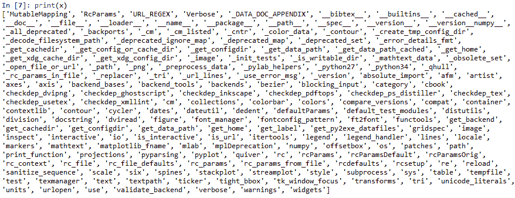

# 第四章：数据可视化

有句话说得好，*一图胜千言*。通过各种图片和图形展示，我们可以更清晰地表达许多抽象概念、理论、数据模式或某些想法。在本章中，我们首先解释为什么我们应该关注数据可视化。然后，我们将讨论在 R、Python 和 Julia 中常用的几种数据可视化技术。还将介绍一些特别的主题，如如何生成图表、饼图和条形图，如何添加标题、趋势线、希腊字母，以及如何输出我们的图表。本章末尾的一个可选主题将讨论动态展示，并介绍如何将其保存为 HTML 文件。

本章将涉及以下主题：

+   数据可视化的重要性

+   R 中的数据可视化

+   Python 中的数据可视化

+   Julia 中的数据可视化

+   绘制简单的图表

+   R、Python 和 Julia 的可视化包

+   动态可视化

# 数据可视化的重要性

对于数据科学和商业分析领域的学习者、用户或研究人员来说，使用各种类型的图表、饼图、条形图及其他视觉手段来展示数据所蕴含的趋势或模式，对于理解数据并帮助研究人员更好地向受众或客户展示他们的数据至关重要。原因有几个。首先，当我们有多个模式或影响因素时，描述我们的发现有时是困难的。通过几个独立的图表和一个综合图表，复杂的关系可以得到更好的理解或解释。

我们可以使用图表或图片来解释某些算法，例如二分法（参见与动态可视化相关的章节，*动态可视化*）。

我们还可以使用不同的大小来表示不同的含义。在金融学中，有一个基本概念叫做**货币的时间价值**（**TVM**）。它意味着 *手中的一只鸟胜过林中的两只鸟*。今天的 100 美元比未来相同金额的现金流更有价值。通过用不同大小的圆圈表示未来不同时刻现金流的现值，学习者可以更清楚地理解这一概念。

最后，我们的数据可能相当杂乱，单纯展示数据点会让观众更感困惑。如果我们能通过一个简单的图表展示数据的主要特征、属性或模式，将会大大帮助理解。

# R 中的数据可视化

首先，让我们看看 R 中最简单的图表。通过以下一行 R 代码，我们可以绘制从 *-2π* 到 *2π* 的余弦函数：

```py
> plot(cos,-2*pi,2*pi) 
```

相关的图表如下所示：


直方图还可以帮助我们理解数据点的分布。前面的图是一个简单的例子。首先，我们生成一组从标准正态分布中抽取的随机数。为了说明，`set.seed()`的第一行实际上是多余的。它的存在可以确保所有用户在使用相同的`seed`（本例中为`333`）时，得到相同的一组随机数。

换句话说，使用相同的输入值，我们的直方图将看起来相同。接下来的代码行中，`rnorm(n)`函数从标准正态分布中抽取*n*个随机数。最后一行使用`hist()`函数生成直方图：

```py
> set.seed(333) 
> data<-rnorm(5000) 
> hist(data) 
```

相关的直方图如下所示：


请注意，`rnorm(5000)`的代码与`rnorm(5000,mean=0,sd=1)`相同，这意味着`mean`的默认值为`0`，`sd`的默认值为`1`。接下来的 R 程序将为标准正态分布的左尾区域加阴影：

```py
x<-seq(-3,3,length=100) 
y<-dnorm(x,mean=0,sd=1) 
title<-"Area under standard normal dist & x less than -2.33" 
yLabel<-"standard normal distribution" 
xLabel<-"x value" 
plot(x,y,type="l",lwd=3,col="black",main=title,xlab=xLabel,ylab=yLabel) 
x<-seq(-3,-2.33,length=100) 
y<-dnorm(x,mean=0,sd=1) 
polygon(c(-4,x,-2.33),c(0,y,0),col="red") 
```

相关图表如下所示：


请注意，依据前图中的最后一行，阴影区域为红色。

在探索各种数据集的属性时，名为`rattle`的 R 包非常有用。如果`rattle`包尚未预安装，我们可以运行以下代码来安装它：

```py
> install.packages("rattle") 
```

然后，我们运行以下代码来启动它；

```py
> library(rattle) 
> rattle() 
```

按下*Enter*键后，我们可以看到以下内容：


作为我们的第一步，我们需要导入某些数据集。对于数据源，我们可以选择七种潜在格式，如文件、ARFF、ODBC、R 数据集和 RData 文件等，然后从中加载我们的数据。

最简单的方式是使用`Library`选项，这将列出`rattle`包中所有内嵌的数据集。在点击 Library 后，我们可以看到一个内嵌数据集的列表。假设我们选择`acme:boot:Monthly Excess Returns`，然后点击左上角的 Execute。接下来，我们会看到以下内容：


现在，我们可以研究数据集的属性。点击 Explore 后，我们可以使用各种图形来查看我们的数据集。假设我们选择了 Distribution 并勾选了 Benford 复选框。接下来，我们可以参考以下截图了解更多细节：


点击 Execute 后，将弹出以下内容。顶部的红线显示了**Benford**定律中 1 到 9 各数字的频率，而底部的蓝线显示了我们数据集的属性。请注意，如果系统中未安装`reshape`包，则此代码将无法运行，或者会请求许可将该包安装到计算机中：


这两条线之间的巨大差异表明我们的数据不符合 Benford 法则所建议的分布。在我们的现实世界中，我们知道许多人、事件和经济活动是相互关联的，使用各种图形展示这样的多节点、相互连接的画面会是一个很好的主意。如果 `qgraph` 包未预安装，用户需要运行以下命令来安装：

```py
> install.packages("qgraph") 
```

下一个程序展示了从 a 到 b、从 a 到 c 等的连接：

```py
library(qgraph) 
stocks<-c("IBM","MSFT","WMT") 
x<-rep(stocks, each = 3) 
y<-rep(stocks, 3) 
correlation<-c(0,10,3,10,0,3,3,3,0) 
data <- as.matrix(data.frame(from =x, to =y, width =correlation)) 
qgraph(data, mode = "direct", edge.color = rainbow(9)) 
```

如果显示数据，程序的意义会更加清晰。相关性展示了这些股票之间的联系。请注意，这些值都是随机选择的，没有实际的意义：

```py
> data 
 from   to     width 
 [1,] "IBM"  "IBM"  " 0"  
 [2,] "IBM"  "MSFT" "10"  
 [3,] "IBM"  "WMT"  " 3"  
 [4,] "MSFT" "IBM"  "10"  
 [5,] "MSFT" "MSFT" " 0"  
 [6,] "MSFT" "WMT"  " 3"  
 [7,] "WMT"  "IBM"  " 3"  
 [8,] "WMT"  "MSFT" " 3"  
 [9,] "WMT"  "WMT"  " 0" 
```

第三个变量的高值意味着更强的相关性。例如，`IBM` 与 `MSFT` 的相关性为 `10`，比它与 `WMT` 的相关性（值为 `3`）要强。以下图表展示了这三只股票的相关性：


以下程序展示了五个因素之间的关系或相互联系：

```py
library(qgraph) 
data(big5) 
data(big5groups) 
title("Correlations among 5 factors",line = 2.5) 
qgraph(cor(big5),minimum = 0.25,cut = 0.4,vsize = 1.5, 
    groups = big5groups,legend = TRUE, borders = FALSE,theme = 'gray') 
```

相关的图形如下所示：


# Python 中的数据可视化

最广泛使用的 Python 图形和图像包是 `matplotlib`。以下程序可以看作是生成图形的最简单 Python 程序，因为它只有三行代码：

```py
import matplotlib.pyplot as plt  
plt.plot([2,3,8,12]) 
plt.show() 
```

第一个命令行会上传一个名为 `matplotlib.pyplot` 的 Python 包，并将其重命名为 `plt`。

请注意，我们甚至可以使用其他简短的名称，但通常约定使用 `plt` 来表示 `matplotlib` 包。第二行绘制了四个点，最后一行结束了整个过程。完成的图形如下所示：


在下一个示例中，我们为 `x` 和 *`y`* 添加了标签，并且添加了标题。该函数是余弦函数，输入值从 *-2π* 到 *2π*：

```py
import scipy as sp 
import matplotlib.pyplot as plt  
x=sp.linspace(-2*sp.pi,2*sp.pi,200,endpoint=True) 
y=sp.cos(x) 
plt.plot(x,y) 
plt.xlabel("x-value") 
plt.ylabel("Cosine function") 
plt.title("Cosine curve from -2pi to 2pi") 
plt.show() 
```

这里展示了一个漂亮的余弦图：


如果我们今天收到了 100 美元，那它比两年后收到的 100 美元更有价值。这个概念被称为货币的时间价值，因为我们今天可以把 100 美元存入银行赚取利息。下面的 Python 程序使用 `size` 来说明这个概念：

```py
import matplotlib.pyplot as plt 
fig = plt.figure(facecolor='white') 
dd = plt.axes(frameon=False) 
dd.set_frame_on(False) 
dd.get_xaxis().tick_bottom() 
dd.axes.get_yaxis().set_visible(False) 
x=range(0,11,2) 
x1=range(len(x),0,-1) 
y = [0]*len(x); 
plt.annotate("$100 received today",xy=(0,0),xytext=(2,0.15),arrowprops=dict(facecolor='black',shrink=2)) 
plt.annotate("$100 received in 2 years",xy=(2,0),xytext=(3.5,0.10),arrowprops=dict(facecolor='black',shrink=2)) 
s = [50*2.5**n for n in x1];
plt.title("Time value of money ") 
plt.xlabel("Time (number of years)") 
plt.scatter(x,y,s=s); 
plt.show() 
```

相关的图形如下所示。不同的大小展示了它们的现值相对值：


# Julia 中的数据可视化

对于以下的 Julia 程序，我们使用一个名为 `Plots` 的包。安装该包的命令是 `Pkg.add("Plots")`。这里，我们通过 Jupyter notebook 运行 Julia 程序。该程序的截图如下：


在菜单栏点击“Kernel”，然后选择“Restart and Run All”，我们得到如下结果：


同样，`srand(123)` 命令保证任何使用相同随机种子的用户都会得到相同的一组随机数。因此，他/她会得到之前显示的相同图形。下一个示例是使用 Julia 包 `PyPlot` 绘制散点图：

```py
using PyPlot 
n=50 
srand(333) 
x = 100*rand(n) 
y = 100*rand(n) 
areas = 800*rand(n) 
fig = figure("pyplot_scatterplot",figsize=(10,10)) 
ax = axes() 
scatter(x,y,s=areas,alpha=0.5) 
title("using PyPlot: Scatter Plot") 
xlabel("X") 
ylabel("Y") 
grid("on") 
```

相关的图形如下所示：


下一个 Julia 程序借鉴自 *Sargent 和 Stachursk*i（2017）：

```py
using QuantEcon: meshgrid 
using PyPlot:surf 
using Plots 
n = 50 
x = linspace(-3, 3, n) 
y = x 
z = Array{Float64}(n, n) 
f(x, y) = cos(x² + y²) / (1 + x² + y²) 
for i in 1:n 
    for j in 1:n 
        z[j, i] = f(x[i], y[j]) 
    end 
end 
xgrid, ygrid = meshgrid(x, y) 
surf(xgrid, ygrid, z',alpha=0.7) 
```

令人印象深刻的图形如下所示：


# 绘制简单图形

最简单的图形将是直线。对于 R，我们有以下示例：

```py
x<-seq(-3,3,by=0.05) 
y<-2+2.5*x 
plot(x,y,type="b") 
```

在这个简单程序中，类型指定了线条的格式，而 `b` 同时指定了点和线。相应的图形如下所示：


类型的可能值在下表中给出：

| **值** | **描述** |
| --- | --- |
| `p` | 代表 **p**oints（点） |
| `l` | 代表 **l**ines（线条） |
| `b` | 代表 **b**oth（两者） |
| `c` | 代表仅用于 `b` 的线条部分 |
| `o` | 代表两者 **o**verplotted（重叠） |
| `h` | 代表 **h**istogram-like（或高密度）垂直线 |
| `s` | 代表楼梯 **s**teps（阶梯） |
| `S` | 代表其他 **s**teps（步骤） *(见以下详细内容)* |
| `n` | 代表不绘图 |

表 4.1 R 函数 plot() 中类型的可能值

对于 Python，我们有以下简单示例，计算未来值，给定现值和利率：

```py
import numpy as np 
import matplotlib.pyplot as plt  
n=np.linspace(0,10,10) 
pv=100 
R=0.1 
fv=pv*(1+R)**n 
plt.plot(n,fv) 
plt.show() 
```

使用的公式如下，其中 *FV* 为未来值，*PV* 为现值，*R* 为利率，*n* 为期数：


相关线条如下所示：


对于 Julia，简单的示例是绘制正弦函数。正弦函数的输入变量从 *0* 到 *2π*：

```py
using PyPlot 
x = linspace(0,2*pi,1000) 
y = sin.(x) 
plot(x, y, color="green", linewidth=2.0) 
```

相应的图形如下所示：


# 各种条形图、饼图和直方图

对于下一个 R 程序，我们展示了基于每个输入值百分比的饼图：

```py
results <- c(10,8,7,4,6) 
names<-c("1st","2nd","3rd","4th","5th") 
pct<-round(results/sum(results)*100) 
pct2<-rev(sort(pct)) 
name<-"Pie Chart of results" 
colors<-seq(0.4, 1.0, length = length(results)) 
pie(results, labels = names, col = gray(colors),main=name) 
```

相关图形如下所示：


下一个 Python 程序展示了标准正态分布的直方图：

```py
import numpy as np 
import matplotlib.pyplot as plt 
data = np.random.RandomState(10)  
n=5000 
n2=1000 
x=data.normal(size=n) 
y=data.normal(loc=5, scale=2,size=n2) 
a=(x,y) 
b = np.hstack(a) 
plt.hist(b, bins='auto')  
plt.title("Histogram with 'auto bins'") 
plt.show() 
```

相关图形如下所示：


# 添加趋势

在以下 R 程序中，我们首先生成一组 `x` 和 `y` 值。然后，通过运行线性回归估计截距和斜率。之后，我们根据线性回归的结果绘制 `(x,y)` 值及趋势线：

```py
x=seq(-4,4,by=0.05) 
n<-length(x) 
y=2+3*x + rnorm(n) 
k<-coef(lm(y~x)) 
intercept<-k[1] 
slope<-k[2] 
y2<-intercept+slope*x 
#
plot(x,y,type="p",col="red") 
lines(x,y2,col="green") 
```

与之前程序相关的图形如下所示：


# 添加图例和其他说明

在以下 Julia 函数中，我们将图例 *y=sin(x)* 添加到输出图形中：

```py
using PyPlot 
x = linspace(0, 10, 100) 
y = sin.(x) 
name=L"$y = sin(x)$"  
fig, ax = subplots() 
ax:plot 
ax:legend 
```

相关图形如下所示：


在 R 程序中，我们向图形中添加了以下公式（正态分布公式）：


给出的 R 代码如下：

```py
set.seed(12345)  
mu=4 
std=2 
nRandom=2000 
x <- rnorm(mean =mu, sd =std, n =nRandom) 
name<- "Normal Probability Density Function" 
curve(dnorm, from = -3, to = 3, n = 1000, main = name) 
formula<-expression(f(x) ==paste(frac(1, sqrt(2 * pi * sigma²))," ",e^{frac(-(x - mu)², 2 * sigma²)})) 
text(2, 0.3, formula, cex = 1.3) 
```

请注意，命令`frac(1,2)`会生成 。当包含在表达式函数中时，sigma 会生成*σ*，`mu`会生成*μ*。从某种意义上说，它们在表达式函数中是保留字。相关图形如下所示：


下列 Python 程序生成著名的**布莱克-斯科尔斯**公式图像：

```py
import matplotlib
import numpy as np
import matplotlib.mathtext as mathtext
import matplotlib.pyplot as plt
matplotlib.rc('image', origin='upper')
parser = mathtext.MathTextParser("Bitmap")
#parser = mathtext.MathTextParser("Black")
#
x1=r'$d_2=\frac{ln(S_0/K)+(r-\sigma²/2)T}{\sigma\sqrt{T}}=d_1-\sigma\sqrt{T}$'
x2=r'$d_1=\frac{ln(S_0/K)+(r+\sigma²/2)T}{\sigma\sqrt{T}}$'
x3=r' $c=S_0N(d_1)- Ke^{-rT}N(d_2)$'
rgba1, depth1 = parser.to_rgba(x1, color='blue',fontsize=12, dpi=200)
rgba2, depth2 = parser.to_rgba(x2, color='blue', fontsize=12, dpi=200)
rgba3, depth3 = parser.to_rgba(x3, color='red',fontsize=14, dpi=200)
fig = plt.figure()
fig.figimage(rgba1.astype(float)/255., 100, 100)
fig.figimage(rgba2.astype(float)/255., 100, 200)
fig.figimage(rgba3.astype(float)/255., 100, 300)
plt.show()
```

相关图像如下所示：


在前面的程序中，`\`反斜杠被多次使用。例如，`\frac{}{}`表示这是一个比例，如下表所示：

| **符号** | **含义（示例）** |
| --- | --- |
| `\frac{a}{b}` |  |
| `\sigma` | σ |
| `\sqrt{T}` |  |
| `a_1` | a1 |
| `s_0` | s0 |

表 4.2 一些符号的含义

# R 的可视化包

要了解一些用 R 编写的包，您可以访问[R 软件的主页](http://r-project.org)，然后点击左侧的 CRAN。接着，您可以选择一个镜像站点（靠近您所在的位置）。点击左侧的 Packages 后，您会看到两个列表。一个按日期排序，另一个按字母顺序排序。要查找有用的包，我们可以同时使用这两个列表。

有许多与数据可视化相关的 R 包（以下是部分列表）：

| **R 包名称** | **描述** |
| --- | --- |
| `showtext` | 更容易在 R 图形中使用字体 |
| `shinyaframe` | 使用 RStudio Shiny 和 Mozilla A-Frame 的 WebVR 数据可视化 |
| `moveVis` | 移动数据可视化 |
| `sjPlot` | 社会科学统计数据可视化 |
| `qgraph` | 图形绘制方法、心理测量数据可视化和图形模型估计 |
| `statquotes` | 关于统计学、数据可视化和科学的名言 |
| `HistData` | 来自统计学和数据可视化历史的数据集 |
| `loon` | 交互式统计数据可视化 |
| `Bdvis` | 生物多样性数据可视化 |
| `Visdat` | 初步数据可视化 |
| `Ggfortify` | 统计分析结果的数据可视化工具 |
| `ggplot2` | 使用图形语法创建优雅的数据可视化 |
| `RcmdrPlugin.KMggplot2` | 用于 ggplot2 数据可视化的 R Commander 插件 |
| `hierarchicalSets` | 使用层次结构的数据集可视化 |
| `Dashboard` | 使用 D3.js 的交互式数据可视化 |
| `Mapplots` | 地图上的数据可视化 |
| `Zoom` | 一种空间数据可视化工具 |

表 4.3 R 包的部分列表

在这里，我们以 `ggplot2` 为例，展示如何获取关于该特定包的信息。请注意，在上传 R 包时，如果我们希望消除包的启动消息，可以使用 `suppressPackageStartupMessages()`。要获取该包的更多信息，可以执行以下两行：

```py
> library(ggplot2) 
> help(package=ggplot2) 
```

第一个 R 命令行会上传该包，而第二个命令行会跳转到与此包相关的特定网站（见下面截图的第一部分）：


# Python 可视化包

最常用的 Python 包是 `matplotlib`。要查找所有的函数，我们可以执行以下三行：

```py
import matplotlib as mat 
x=dir(mat) 
print(x) 
```

输出如下所示：



要了解与数据可视化相关的所有 Python 包，我们可以访问 [`pypi.python.org`](https://pypi.python.org)。下表展示了我们在搜索`data visualization`时出现的前几个包，其中 *W* 表示权重（即流行度）：

| **Package** | **W** | **Description** |
| --- | --- | --- |
| [PyQtDataVisualization 5.9.2](https://pypi.python.org/pypi/PyQtDataVisualization/5.9.2) | 11 | Qt 数据可视化库的 Python 绑定 |
| [data-utilities 1.2.8](https://pypi.python.org/pypi/data-utilities/1.2.8) | 10 | 数据分析和可视化助手模块 |
| [DataEnvironment 0.0.0](https://pypi.python.org/pypi/DataEnvironment/0.0.0) | 10 | 数据环境用于数据分析、可视化和管理 |
| [dataswim 0.4.10](https://pypi.python.org/pypi/dataswim/0.4.10) | 10 | 用于在数据湖中游泳的工具 |
| [datashader 0.4](https://pypi.python.org/pypi/datashader/0.4) | 9 | 基于将数据聚合到网格中的数据可视化工具链 |
| [scikit-data 0.1.3](https://pypi.python.org/pypi/scikit-data/0.1.3) | 9 | 该库的目的是让数据分析过程变得更加简便和自动化 |
| [DataSpyre 0.2.7](https://pypi.python.org/pypi/DataSpyre/0.2.7) | 8 | Spyre 使构建互动式 web 应用变得容易，无需了解 HTML、CSS 或 JavaScript |
| [Khooshe 0.2](https://pypi.python.org/pypi/Khooshe/0.2) | 8 | 大型地理空间数据点可视化工具 |
| [lolviz 1.3.1](https://pypi.python.org/pypi/lolviz/1.3.1) | 8 | 一个简单的 Python 数据结构可视化工具，用于列表的列表、列表和字典 |
| [bitjet 0.2.1](https://pypi.python.org/pypi/bitjet/0.2.1) | 7 | 使用 IPython 小部件进行二进制可视化 |
| [ckanext-wirecloud_view 1.0.0](https://pypi.python.org/pypi/ckanext-wirecloud_view/1.0.0) | 7 | 使用 WireCloud 提供 CKAN 上的可视化仪表板 |
| [Data-viz 0.13](https://pypi.python.org/pypi/Data-viz/0.13) | 7 | 将你的高维数据表示为二维空间，并进行操作 |
| [datapusher 0.0.12](https://pypi.python.org/pypi/datapusher/0.0.12) | 7 | 一个独立的 web 服务，解析 CKAN 网站数据文件的内容并将其推送到 DataStore |
| [datatank_py 0.71](https://pypi.python.org/pypi/datatank_py/0.71) | 7 | 用于读写 DataTank 文件的模块 |
| [gmane 0.1.dev25](https://pypi.python.org/pypi/gmane/0.1.dev25) | 7 | 用于分析 GMANE 邮件列表数据库的工具 |
| [gviz_data_table 1.0.2](https://pypi.python.org/pypi/gviz_data_table/1.0.2) | 7 | Google 可视化的 Python API |
| [lightning-python 1.2.1](https://pypi.python.org/pypi/lightning-python/1.2.1) | 7 | 用于 Lightning 数据可视化服务器的 Python 客户端库 |
| [Orange3-Network 1.3.0](https://pypi.python.org/pypi/Orange3-Network/1.3.0) | 7 | Orange 3 数据挖掘软件包的网络插件 |
| [phovea_data_hdf 0.1.0](https://pypi.python.org/pypi/phovea_data_hdf/0.1.0) | 7 | 用于加载存储在层次数据格式（HDF）中的数据的数据提供插件 |
| [phovea_data_mongo 0.1.0](https://pypi.python.org/pypi/phovea_data_mongo/0.1.0) | 7 | 用于加载存储在 MongoDB 中的图形数据的数据提供插件 |
| [phovea_data_redis 0.1.0](https://pypi.python.org/pypi/phovea_data_redis/0.1.0) | 7 | 用于加载存储在 Redis 内存数据库中的数据的数据提供插件 |
| [phovea_data_sql 0.1.0](https://pypi.python.org/pypi/phovea_data_sql/0.1.0) | 7 | 用于加载存储在 SQLite 数据库中的表格数据的数据提供插件 |
| [psyplot 1.0.0.post1](https://pypi.python.org/pypi/psyplot/1.0.0.post1) | 7 | 用于交互式数据可视化的 Python 包 |
| [scikit-dataaccess 1.9.9](https://pypi.python.org/pypi/scikit-dataaccess/1.9.9) | 7 | 用于访问科学数据集的 Scikit 数据访问包 |

表 4.4 与数据可视化相关的部分 Python 包列表

# Julia 的可视化包

同样，我们可以访问 [`pkg.julialang.org`](https://pkg.julialang.org) 查找所有用 Julia 编写的数据可视化包：

| **Package** | **描述** |
| --- | --- |
| `ExperimentalAnalysis` | 用于创建散点矩阵图和可视化线性模型及数据框的包 |
| `GLBooks` | 将 GLVisualize 用作笔记本 |
| `GLVisualize` | 用 Julia 和 OpenGL 编写的可视化库 |
| `GR` | 基于 GR 的 Julia 绘图框架，适用于可视化应用 |
| `GraphPlot` | 用于 Julia 的图形可视化 |
| `NetworkViz` | 用于可视化图形的 Julia 接口 |
| `Plots` | 强大的 Julia 可视化和数据分析便利工具 |
| `ProfileView` | Julia 性能分析数据的可视化 |
| `D3Trees` | 使用 D3.js 在 Julia 中为大型树形结构提供灵活的交互式可视化 |

表 4.5 部分 Julia 编写的数据可视化包列表

# 动态可视化

动态可视化意味着我们可以像看视频或电影一样生动地看到概念或理论。例如，在蒙特卡洛模拟中，我们可以从某些分布中生成一组随机数，如均匀分布或正态分布。如果我们能够展示粒子在某个范围内如何移动，学习者将更好地理解随机性这一概念。这就像将红色墨水滴入水盆中，观察墨水的扩散。另一个例子与所谓的二分法或二分搜索有关。假设我们有一个数据库，包含超过 5000 只股票的每日交易数据。我们可以通过多种方法检索某只特定股票的信息，其中一种方法是顺序搜索。在顺序搜索中，我们挑选第一只股票并将其与目标进行比较。如果不匹配，我们就去看下一只股票。由于这种方法使用了大量计算资源，效率较低。而二分法则高效得多。

在这一部分，我们将展示一些基于 `animation` R 包的示例。第一个示例是动态展示一种随机运动，称为“布朗运动”，代码如下所示：

```py
library(animation) 
ani.options(interval = 0.05, nmax = 30) 
a<- c(3,3,2,0.5) 
b<-c(2,0.5,0) 
name<-"Brownian Motion" 
par(mar=a,mgp=b,tcl=-0.3,cex.axis=0.8,cex.lab=0.8,cex.main=1) 
brownian.motion(pch=21,cex=5,col="red",bg="yellow",main=name) 
```

这里展示了一张静态图片。再次强调，前面的代码会动态地展示布朗运动（就像观看一部短片一样）：


下一个 R 程序动态展示了二分法的逻辑：

```py
library(animation) 
par(mar = c(4, 4, 1, 2)) 
myFunction<-function(x) x² - 4 
title<-"Bisection method" 
bisection.method(FUN=myFunction,main =title) 
```

由于这是一个动态图像，我们只能向你展示一个图示。请注意，我们使用 *Ctrl + Shift + PrintScrn* 捕捉它：


我们知道，如果我们抛硬币，结果可能是正面或反面。以下 R 程序展示了这个过程：

```py
library(animation) 
myProb<-c(0.5,0.5) 
ani.options(interval=0.2,nmax = ifelse(interactive(), 100, 2)) 
flip.coin(bg = "grey",col=c("black","grey")) 
```

这里展示了一个图示：


# 将图片保存为 pdf

有多种方法可以生成图片。我们可以将它们总结为以下四种方法：

+   方法 #1：使用剪贴工具

+   方法 #2：通过点击保存图片

+   方法 #3：使用 *Ctrl + Shift + PrintScrn* 和 Paint 软件

+   方法 #4：使用我们的程序

保存图片最简单的方法是使用剪贴工具。生成图片后，启动剪贴工具并选择适当的区域进行保存。以下示例展示了将输出保存为 PDF 文件的 R 代码。我们使用前面绘制从 *-2π* 到 *2π* 的余弦函数的示例代码，如下所示：

```py
pdf("c:/temp/myGraph.pdf") 
plot(cos,-2*pi,2*pi) 
dev.off() 
```

# 将动态可视化保存为 HTML 文件

在前一部分中，展示了我们可以使用名为 `animation` 的 R 包生成动态图片，如同 YouTube 视频一样。实际上，我们可以生成 HTML 文件供我们的学生或观众观看，如下所示：

```py
library(animation) 
a<- c(3, 3, 1, 0.5) 
b<- c(2, 0.5, 0) 
part1<-"Random walk on the 2D plane: for each point" 
part2<-"(x, y), x = x + rnorm(1) and y = y + rnorm(1)." 
des<-c(part1,part2) 
titleName<-"Demonstration of Brownian Motion" 
# 
saveHTML({ par(mar =a, mgp =b, tcl = -0.3,cex.axis = 0.8, cex.lab = 0.8, cex.main = 1) 
  ani.options(interval = 0.05, nmax = ifelse(interactive(),150, 10)) 
  brownian.motion(pch = 21, cex = 5, col = "red", bg = "yellow") 
  },description =des,title = titleName) 
```

以下代码用于保存二分法的动态运动：

```py
library(animation) 
a<- c(4, 4, 1, 2) 
part1<-"The bisection method is a root-finding algorithm" 
part2<-"which works by repeatedly dividing an interval in half and then" 
part3<-"selecting the subinterval in which a root exists." 
des<-c(part1,part2,part3) 
titleName<-"The Bisection Method for Root-finding on an Interval" 
# 
saveHTML({ par(mar = a) 
    bisection.method(main = "") 
    },img.name = "bisection.method",htmlfile = "bisection.method.html",  
    ani.height = 400, ani.width = 600, interval = 1,  
    title = titleName, description =des) 
```

网站 [`canisius.edu/~yany/visual/bisection.shtml`](http://canisius.edu/~yany/visual/bisection.shtml) 与前述程序相关，该程序生成了一个动态图像。

# 总结

在本章中，我们讨论了各种类型的可视化呈现，包括使用不同语言（如 R、Python 和 Julia）编写的简单图表、条形图、饼图和直方图。可视化呈现有助于我们的观众更好地理解数据。对于许多复杂的概念或理论，我们可以使用可视化来帮助解释它们的逻辑和复杂性。一个典型的例子是所谓的二分法或二分查找法。

在下一章中，我们将解释许多与统计学相关的重要问题，例如 T 分布、F 分布、T 检验、F 检验以及其他假设检验。我们还将讨论如何进行线性回归、如何处理缺失数据、如何处理异常值、如何检测共线性及其处理方法，以及如何进行多元线性回归。

# 复习问题和练习。

1.  为什么我们要关心数据可视化？

1.  我们在哪里可以找到与数据可视化相关的 R、Python 和 Julia 包的列表？

1.  使用 R 和 Python 绘制以下公式的图形：


1.  基于 R 编程，将以下两张图合并在一起： 

1.  从 [`canisius.edu/~yany/RData/ff3monthly.RData`](http://canisius.edu/~yany/RData/ff3monthly.RData) 下载与 Fama-French 月度因子时间序列相关的 R 数据集。然后，绘制这三个因子的直方图：市场、SMB 和 HML。

1.  编写一个 R 程序，从均匀分布中生成 1,000 个随机数。然后，估计它们的均值和标准差。最后，绘制直方图。注意，绘制 *n* 个均匀分布随机数的 R 函数是 `runif(n)`。

1.  使用 Python 和 Julia 重复之前的练习。

1.  使用 Python 一起绘制正弦和余弦函数。

1.  从 Beta 分布中生成 1,000 个随机数，估计它们的均值和标准差，并绘制直方图。注意，相关的 R 函数是 `rbeta(n)`。

1.  从 Yahoo!Finance（[`finance.yahoo.com`](http://finance.yahoo.com)）下载 Walmart（股票代码：WMT）过去 5 年的月度数据。生成该月度回报的直方图。

1.  查找 `HistData` R 包的更多信息，并通过使用嵌入的函数展示几个典型示例。

1.  查找 `dataswim` Python 包中所有嵌入的函数，并展示包中的几个示例。

1.  对 `GraphPlot` Julia 模块执行与前两个练习相同的操作。

1.  编写一个 R 程序，显示年金现值的以下公式，其中 *PV（年金）* 是年金的现值，*R* 是期率，*n* 是期数：


1.  编写一个 Python 程序，打印以下公式，其中 *FV（增长年金）* 是增长年金的未来价值，*R* 是期率，*n* 是期数，*g* 是每期的增长率：


1.  对于著名的 Black-Scholes 期权定价模型，我们有以下公式，其中 s 是今天的标的资产价格，x 是行使价格，*T*是到期日（以年为单位），r 是连续复利的无风险利率，sigma 是波动率：

```py
bsCall_<-function(s,x,T,r,sigma){ 
   d1 = (log(s/x)+(r+sigma*sigma/2.)*T)/(sigma*sqrt(T)) 
   d2 = d1-sigma*sqrt(T) 
   call<-s*pnorm(d1)-x*exp(-r*T)*pnorm(d2) 
   return(call) 
} 

```

例如，在以下一组数值中，期权的价格为 2.28，来自`bsCall(40,42,0.5,0.1,0.2)`。回答以下两个问题：

+   图形化显示期权价格是波动率的递增函数

+   动态展示如何使用二分法来找到隐含波动率

注意，隐含波动率是由与期权价格相同的一组输入值推算出来的，唯一的例外是最后的 sigma。例如，给定 *s=40, x=42, T=0.5, r=0.1,* 和 *c=3*，其中 c 是我们观察到的市场期权价格，隐含波动率是多少？

1.  从 Yahoo!Finance 下载 IBM、WMT 和 MSFT 的历史月度股票数据，[`finance.yahoo.com`](http://finance.yahoo.com)。估算它们之间的相关性，并展示它们是如何紧密或松散地相互关联的。

1.  找出将以下 R 程序保存为 HTML 的方式：

```py
library(animation) 
myProb<-c(0.45,0.1, 0.45) 
ani.options(interval=0.2,nmax = ifelse(interactive(), 100, 2)) 
flip.coin(bg = "yellow") 
```

1.  找出如何在 R 包`animation`中保存 JPG 文件。

1.  找出如何在 R 包`animation`中运行股票价格模拟。
