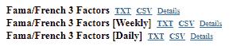

# 第五章：Anaconda 中的统计建模

在本章中，我们将首先介绍最简单的统计模型：单因子线性模型。为了让学习过程更加有趣，我们将讨论该模型的一个应用：著名的金融模型——**资本资产定价模型**（**CAPM**）。在数据处理方面，我们将向你展示如何检测和删除缺失值，以及如何在 R、Python 或 Julia 中用均值或其他值替换缺失值。此外，**异常值**会扭曲我们的统计结果。因此，我们需要知道如何检测并处理异常值。接下来，我们将讨论多因子线性模型。同样，为了使讨论更加有意义，我们将讨论著名的**法马-弗伦奇**3 因子和 5 因子线性模型，以及**法马-弗伦奇-卡哈特**4 因子线性模型。然后，我们将讨论如何对这些不同的模型进行排名，即如何衡量不同模型的表现。本章将涵盖以下内容：

+   线性模型介绍

+   在 R、Python、Julia 和 Octave 中运行线性回归

+   临界值和决策规则

+   F 检验、临界值和决策规则

+   处理缺失数据

+   检测异常值及其处理

+   几个多元线性模型

+   共线性及其解决方案

+   模型的性能衡量

# 线性模型介绍

单因子线性模型是展示两个变量（*y*和*x*）之间关系的最简单方式。换句话说，我们尝试用*x*来解释*y*。单因子线性模型的一般形式如下所示，其中*y[t]*是时间*t*的因变量，*α*是截距，β是斜率，*x[t]*是时间*t*的独立变量的值，*ε[t]*是随机项：


要运行线性回归，我们打算估计截距(*α*)和斜率(*β*)。单因子意味着模型只有一个解释变量，也就是`x`的一个独立变量，线性意味着当根据方程（1）绘制图表时，我们会得到一条直线。通过以下 R 程序，我们可以得到一条线性线：

```py
> x<--10:10
> y<-2+1.5*x
> title<-"A straight line"
> plot(x,y,type='l',main=title)
```

相关图表如下所示：


线性模型的另一个解释是独立变量`x`的幂为`1`。这样的简单单因子线性模型有很多应用。在本章稍后部分，我们将介绍著名的 CAPM，它就是一个单因子线性模型。

# 在 R、Python、Julia 和 Octave 中运行线性回归

以下代码块展示了如何在 R 中运行一个单因子线性回归：

```py
> set.seed(12345)
> x<-1:100
> a<-4
> beta<-5
> errorTerm<-rnorm(100)
> y<-a+beta*x+errorTerm
> lm(y~x)
```

第一行的 `set.seed(12345)` 确保不同的用户在使用相同的 `seed()` 时会得到相同的随机数，这里的 `seed` 值是 `12345`。R 函数 `rnorm(n)` 用于从标准正态分布中生成 *n* 个随机数。同时，`lm()` 函数的两个字母代表线性模型。结果如下所示：

```py
Call: lm(formula = y ~ x)
Coefficients: 
(Intercept) x 
4.114 5.003
```

估计的截距为 `4.11`，估计的斜率为 `5.00`。要获取更多关于该函数的信息，我们可以使用 `summary()` 函数，如下所示：

```py
> summary(lm(y~x))
Call:
lm(formula = y ~ x)

Residuals:
 Min 1Q Median 3Q Max 
-2.6168 -0.8699 0.2071 0.6326 2.1451 
Coefficients:
 Estimate Std. Error t value Pr(>|t|) 
(Intercept) 4.114297 0.225258 18.27 <2e-16 ***
x 5.002592 0.003873 1291.81 <2e-16 ***
---
Signif. codes: 0 ‘***’ 0.001 ‘**’ 0.01 ‘*’ 0.05 ‘.’ 0.1 ‘ ’ 1

Residual standard error: 1.118 on 98 degrees of freedom
Multiple R-squared: 0.9999, Adjusted R-squared: 0.9999 
F-statistic: 1.669e+06 on 1 and 98 DF, p-value: < 2.2e-16
```

截距 alpha 为 `4.11`，并且具有统计学意义。原因在于其 T 值为 `18.27`，如果我们选择 5% 的显著性水平，该值高于 `2`。然而，它在任何显著性水平下都是显著的，表示为三个星号：`***`。另外，我们也可以通过其 P 值来确定显著性。按照相同的逻辑，斜率值为 `5`，同样具有统计学意义。通常，我们有以下两个临界值用于 T 值：


或者，我们有以下 *pValue* 的决策规则：


以下的 Python 代码将运行线性回归：

```py
from scipy import stats 
import scipy as sp
sp.random.seed(31233)
alpha=2.0
beta=3.8
n=1000
x=sp.arange(n)
y=alpha+beta*x+sp.random.rand(n)
(beta, alpha, r_value, p_value, std_err) = stats.linregress(y,x) 
print("Alpha , Beta")
print(alpha,beta) 
print("R-squared=", r_value**2)
print("p-value =", p_value)
```

同样，在以下代码中，对于一组 *x* 和 *y* 值，我们可以在 Julia 中运行线性回归：

```py
using GLM, DataFrames
data = DataFrame(X=[1,2,3], Y=[2,4,7])
OLS = glm(@formula(Y ~ X), data, Normal(), IdentityLink())
```

相关输出如下所示：


请注意，`X` 和 `Y` 没有实际意义，因为它们的值是任意选择的。基于截距和 *β* 的 z 值，我们可以得出结论：截距在统计上与零相同，因为其 `z 值` 为 `-1.09`，而斜率在统计上与零不同，因为其 `z 值` 为 `8.66`。在前面的 Julia 程序中，我们假设已安装 `GLM` 包。如果没有，请参见以下截图安装该包：


换句话说，如果未安装 `DataFrames` Julia 包，我们需要执行命令 `Pkg.add("DataFrames")`。有关如何处理 R、Python 和 Julia 中的各种包，请参见第六章，*管理包*。要在 Octave 中运行线性回归，我们首先生成 `x` 和 `y`：

```py
rand('seed',123) 
n = 50; 
x = sort(rand(n,1)*5-1); 
y = 2+1.5*x + randn(size(x)); 
figure % open a new figure window 
plot(x, y, 'o');
```

相关图表如下所示：


基于之前生成的 `x` 和 `y` 值，我们可以编写以下 Octave 程序来运行线性回归：

```py
n = length(y);  
x2= [ones(n, 1), x];  % Add a column of ones to x 
b = inv(x2'*x2)*x2'*y; 
R = y - (x2 * b);        # residuals 
v = (R'*R)/(4 - 3);      # residual variance 
sigma = v * inv(x2'*x2); # variance covariance matrix 
se = sqrt(diag(sigma));  # std errors of parameters  
The related estimated parameters are shown below.  
>> b 
b = 

   2.5259 
   1.3585 

>> sigma 
sigma = 

   1.01374  -0.37919 
  -0.37919   0.29591 

>> se 
se = 

   1.00685 
   0.54398 

>> 
```

# 临界值和决策规则

T 检验是任何统计假设检验，在零假设下，检验统计量遵循学生的 T 分布。它可以用来判断两组数据是否显著不同。对于单样本*T*检验，假设零假设为均值等于指定值*μ[0]*，我们使用以下统计量，其中*t*为 T 值，为样本均值，*μ[0]*为假设的均值，*σ*为样本标准差，*n*为样本大小，*S.E.*为标准误差：


该检验中使用的自由度为*n - 1*。临界*T*值用于接受或拒绝零假设。决策规则如下：


在前一部分中，我们提到了两个临界值：`2`为 T 值，`0.05`为 P 值。实际上，这两个临界值是相关的。对于 5%的临界 P 值，其相关的临界 T 值大约为`2`。以下函数`qt()`显示了这种关系：

```py
> qt(0.05/2,50)
[1] -2.008559
> qt(1-0.05/2,50)
[1] 2.008559
```

一般函数为：


其中，`qt()`是学生 T 分布，α是显著性水平，如 1%、5%或 10%，*degree_freedom*是自由度（*n-p*），其中*n*为数据点的数量，*p*为回归系数的数量，即独立变量的数量。当我们需要更强的结果时，可以选择`0.01`作为*α*。假设在下面的代码中，我们的自由度为`50`，对应的临界 T 值为`2.68`：

```py
> alpha<-0.01
> degreeFreedom<-50
> qt(1-alpha/2,degreeFreedom)
[1] 2.677793
```

以下 Python 代码将给出双侧检验的临界值：

```py
> from scipy import stats
> alpha=0.05
> print(stats.t.ppf(1-alpha/2, 100))
1.98397151845
```

# F 检验，临界值及决策规则

在前面的例子中，我们看到了整个模型的 F 值。现在，让我们来看一下 F 分布。假设*x[1]*和*x[2]*是两个独立的随机变量，分别服从[卡方分布](http://www.r-tutor.com/node/60)，自由度分别为*df[1]*和*df[2]*。则*x[1]/df[1]*与*x[2]/df[2]*的比值将遵循 F 分布：


下面是一个 R 程序，用于绘制自由度为(10, 2)的 F 分布图：

```py
> d1<-4 
> d2<-2 
> n<-100 
> x = seq(0, 5, length = n) 
> plot(x, df(x = x, df1 = d1, df2 = d2),type='l') 
```

相关图示如下：


以下 R 程序显示了给定α为`0.1`和自由度为(1, 2)时的临界值：

```py
> alpha<-0.1
> d1<-1
> d2<-1
> qf(1-alpha,df1=d1,df2=d2)
[1] 39.86346
```

以下 Python 程序估算临界 F 值：

```py
import scipy as sp
alpha=0.10
d1=1
d2=1
critical=sp.stats.f.ppf(q=1-alpha, dfn=d1, dfd=d2)
prob=sp.stats.f.cdf(critical, dfn=d1, dfd=d2)
print("alpha, d1, d2, critical value, prob")
print(alpha, d1, d2, critical, prob)
alpha, d1, d2, critical value, prob
(0.1, 1, 1, 39.86345818906144, 0.90000000000000002)
```

相关的决策规则是，如果我们的 F 值高于临界值，我们将得出结论，认为整体模型是显著的。

# 线性回归在金融中的应用

在金融学中，著名的单因子线性模型应用之一与 CAPM 相关，该模型于 1960 年代开发；参见*Sharpe*（1964）、*Litner*（1965）和*Mossin*（1966）。直到今天，CAPM 几乎在所有的金融教材中都有讨论，因为它的简便性和实用性。其通用公式如下所示：


其中`E()`是期望值，*R[i]*是股票*i*的回报，R[f]是无风险利率，*E(R[mkt])*是预期的市场回报。通常，我们可以使用 S&P500 指数作为我们的市场指数。方程的斜率，即*β*，是市场风险的衡量指标。对于单个股票，β表示股票预期回报对市场风险溢价的敏感度，即 E(R[mkt])-R[f]。风险溢价表示相对于无风险利率，承担额外风险所需的额外回报。以下公式可以用来估算*β*，其中*β[i]*是股票*i*的贝塔值，*cov(R[i],R[m])*是股票 i 的回报与市场指数回报之间的协方差，*ρ*是股票*i*与市场指数之间的相关性，*σ[i]*是股票*i*的标准差，*σ[m]*是市场指数的标准差：


对于贝塔值，我们可以通过使用历史数据运行 CAPM 的线性回归。下述公式显示了之前公式的另一个变量，其中*R[i,t]*是股票 i 在时间*t*的回报，*R[f,t]*是时间 t 的无风险利率，R[mkt,t]是时间 t 的市场回报，而是一个随机因素：


之前与 CAPM 相关的方程可以用来估算预期的股本成本，即预期的股票回报率，在我们成功估算出贝塔值后。在前述的变式中，一个附加的优点是 CAPM 的逻辑更加清晰。在左侧，我们有单个股票的风险溢价，而在右侧，我们有市场的风险溢价，如下所示：


在本章后面，我们将展示如何使用历史的月度股票数据和*S&P500*数据作为市场指数来运行 CAPM；将提供 R、Python 和 Julia 编写的程序。使用 R 语言，我们可以估算股票的市场风险，即贝塔值。首先，让我们编写一个名为`ret_f()`的函数，用于估算给定输入价格数据集的回报：

```py
ret_f<-function(data){
   ddate<-as.Date(data[,1])
   n<-nrow(data)
   p<-data[,6]
   ret<-p[2:n]/p[1:(n-1)]-1
   final<-data.frame(ddate[2:n],ret,stringsAsFactors=F)
   colnames(final)<-c("DATE","RET")
   return(final)
}
#
x<-read.csv("http://canisius.edu/~yany/data/ibmMonthly.csv")
stock<-ret_f(x)
y<-read.csv("http://canisius.edu/~yany/data/^gspcMonthly.csv")
mkt<-ret_f(y)
colnames(mkt)<-c("DATE","MKTRET")
final<-merge(stock,mkt)
```

在之前的 R 程序中，我们定义了一个名为`ret_f()`的函数。然后，我们调用该函数两次，用于估算下载 IBM 价格数据和 S&P500 月度数据的回报。同样，这两个时间序列可以从 Yahoo!Finance 手动下载，网址为[`finance.yahoo.com`](http://finance.yahoo.com)。最终数据集的前几行如下所示：

```py
> head(final)
 DATE RET MKTRET
1 1962-02-01 -0.009225374 0.016269655
2 1962-03-01 -0.007779475 -0.005860435
3 1962-04-01 -0.147816831 -0.061969875
4 1962-05-01 -0.135463769 -0.085990147
5 1962-06-01 -0.135531661 -0.081838016
6 1962-07-01 0.140751225 0.063561644
```

现在，我们可以应用`lm()`函数，如下所示，并附上相应输出：


根据结果，截距为`0.00277`，且统计上不显著。斜率（或β值）为`0.96`，统计上显著。R2 为 35%，这意味着该模型可以解释因变量变异的 35%。F 统计量是衡量整个模型拟合优度的指标，因其 P 值极小，统计上显著。请注意，对于前面的β估计，我们使用了整个输入数据集，即所有年份的数据，而在实际市场风险（*β*）估计中，研究人员或华尔街的专业人士通常只使用几年的数据，例如 3 年的窗口期。在编写 Python 程序估算股票的β值之前，首先我们需要从`quandl`获取股票数据，程序如下：

```py
import quandl as qd
x=qd.get("WIKI/ibm")
print(x.head(2))
print(x.tail(2))
```

相关输出在以下截图中展示：


从前面的输出中，我们知道数据的频率是日数据。对于月度数据，我们可以使用以下 Python 代码：

```py
import quandl as qd
x=qd.get("WIKI/ibm",collapse='monthly')
```

`quandl`是一个数据交付平台，包含许多免费的数据集，但用户可能需要注册以获取特定数据集（详细讨论请参见第三章，*数据基础*）。以下 Python 程序从`quandl`下载 IBM 的月度数据以及从作者网站下载的 S&P500 市场指数月度数据，并运行线性回归以获得市场风险，即 IBM 的β值：

```py
import quandl as qd
import pandas as pd
from scipy import stats
x=qd.get("WIKI/ibm",collapse='monthly')
#
p=x[['Adj. Close']]
ret=p.diff()/p.shift(1)
stockRet=ret.dropna()
stockRet.columns=['stockRet']
#stockRet.assign(yyyymm=stockRet.index.strftime("%Y%m"))
#
inFile="http://canisius.edu/~yany/data/sp500monthlyEndOfMonthDate.csv"
y=pd.read_csv(inFile,index_col=0)
d=y[['Adj.Close']]
ret2=d.diff()/d.shift(1)
mktRet=ret2.dropna()
mktRet.columns=['mktRet']
df= stockRet.merge(mktRet, how='inner', left_index=True, right_index=True)
(beta,alpha,r_value,p_value,std_err)=stats.linregress(df.stockRet,df.mktRet)
alpha=round(alpha,8)
beta=round(beta,3)
r_value=round(r_value,3)
p_vaue=round(p_value,3)
print("alpha, beta, R2 and P-value")
print(alpha,beta,r_value,p_value)
```

相关输出如下所示：

```py
alpha, beta, R2 and P-value
(0.00408539, 0.322, 0.561, 3.8213963635856179e-38)
```

使用日数据，下面的 Python 程序通过`quandl`下载数据来估算沃尔玛（WMT）的年β值：

```py
import scipy as sp
import pandas as pd
import quandl as qd
from scipy import stats
#
ticker="wmt"
x=qd.get("WIKI/"+ticker)
p=x[['Adj. Close']]
ret=p.diff()/p.shift(1)
stockRet=ret.dropna()
stockRet.columns=['stockRet']
#
inFile="http://canisius.edu/~yany/data/^gspcDaily.csv"
y=pd.read_csv(inFile,index_col=0)
d=y[['Adj Close']]
ret2=d.diff()/d.shift(1)
mktRet=ret2.dropna()
mktRet.columns=['mktRet']

final= stockRet.merge(mktRet, how='inner', left_index=True, right_index=True)
years=pd.unique(final.index.strftime("%Y"))
print(" year, alpha, beta,R_value, P_value")
for i in sp.arange(0,5):
#for i in sp.arange(1,len(years)):
    #print(years[i])
    d=final[final.index.strftime("%Y")==years[i]]                        (beta,alpha,r_value,p_value,std_err)=stats.linregress(d.stockRet,d.mktRet)
    alpha=round(alpha,8)
    beta=round(beta,3)
    r_value=round(r_value,3)
    p_vaue=round(p_value,3)
    print(years[i],alpha,beta,r_value,p_value)
```

相关输出如下所示：


在下面的 Julia 程序中，我们假设从 Yahoo!Finance 下载了两个文件：[`finance.yahoo.com`](http://finance.yahoo.com)。这些输入文件是`ibmMonthly5years.csv`和`sp500Monthly5years.csv`，它们是最新的 5 年期月度历史数据。Julia 程序如下：

```py
using DataFrames,StatsBase,StatsModels,GLM
x = readtable("c:/temp/ibmMonthly5years.txt")
#x = CSV.read("c:/temp/ibmMonthly5years.csv")
p=x[:Adj_Close]
n=length(p)
stockRet=p[2:n]./p[1:(n-1)]-1
y = readtable("c:/temp/sp500Monthly5years.txt")
#y = CSV.read("c:/temp/sp500Monthly5years.csv")
p2=y[:Adj_Close]
n2=length(p2)
mktRet=p2[2:n2]./p2[1:(n2-1)]-1
n3=min(length(stockRet),length(mktRet))
data = DataFrame(X=mktRet[1:n3], Y=stockRet[1:n3])
OLS = glm(@formula(Y ~ X), data, Normal(), IdentityLink())
```

请注意，我们手动删除了第一个观察值，因为它包含了非数值的内容。相关输出如下所示：


# 处理缺失数据

处理缺失记录有很多方法。最简单的一种方法是删除它们。特别是当我们有相对较大的数据集时，这种方法是适用的。一个潜在的问题是，在删除缺失数据后，我们的最终数据集不应该发生根本性的变化。换句话说，如果缺失记录是随机发生的，那么简单删除它们不会产生偏差的结果。

# 删除缺失数据

以下 R 程序使用`na.omit()`函数：

```py
> x<-c(NA,1,2,50,NA) 
> y<-na.omit(x) 
> mean(x) 
[1] NA 
> mean(y) 
[1] 17.66667 
```

另一个 R 函数`na.exclude()`也可以使用。下面的 Python 程序移除了所有`sp.na`代码：

```py
import scipy as sp 
x={2,4,3,sp.nan,6,sp.nan,7} 
print(x) 
x.remove(sp.nan) 
print(x)
```

为简洁起见，我们省略了输出。

# 用另一个值替换缺失数据

在以下数据集中，我们有三个有效值：`*2*`、`*3*` 和 `*4*`。显然，它们的均值是 `3`。由于有两个 NA 值，我们计划用均值替换它们，即在这种情况下用 *3* 替代。以下是实现此操作的 R 代码：

```py
> x<-c(NA,2,3,4,NA) 
> y<-na.omit(x) 
> m<-mean(y) 
> m 
[1] 3 
> x[is.na(x)]<-m 
> x 
[1] 3 2 3 4 3 
> 
```

对于 Python，请参阅以下程序：

```py
import scipy as sp 
import pandas as pd 
df = pd.DataFrame({'A' : [2,sp.nan,3,4]}) 
print(df) 
df.fillna(df.mean(), inplace=True) 
print(df) 
```

相关输出为：

```py
 A 
0  2.0 
1  NaN 
2  3.0 
3  4.0 
     A 
0  2.0 
1  3.0 
2  3.0 
3  4.0
```

# 检测异常值及其处理

首先，提醒一点：一个人的废物可能是另一个人的宝藏，这对于异常值也同样适用。例如，在 2018 年 2 月 5 日至 2018 年 2 月 15 日这一周，**道琼斯工业平均指数**（**DJIA**）遭遇了巨大的亏损。Cheng 和 Hum（2018）展示了该指数在这一期间波动超过 22,000 点，具体数据见下表：

| **工作日** | **点数** |
| --- | --- |
| 星期一 | 5,113 |
| 星期二 | 5,460 |
| 星期三 | 2,886 |
| 星期四 | 3,369 |
| 星期五 | 5,425 |
| 总计 | 22,253 |

表 5.1 道琼斯工业平均指数波动点数

如果我们想研究股票与 DJIA 指数之间的关系，这些观测值可能会被视为异常值。然而，在研究市场对个股影响的课题时，我们应该特别关注这些观测值。换句话说，这些观测值不应被视为异常值。

异常值有许多不同的定义：

+   第一，对于给定的数据集，异常值是指与其他观测值距离异常远的数据点或观测值

+   第二，如果删除某一观测值导致回归模型发生变化，则该观测值将被视为异常值

+   第三，异常值与均值之间的距离至少为三个标准差

假设我们已从 Yahoo!Finance 下载了每周的 S&P500 历史数据，网址为[`finance.yahoo.com/`](https://finance.yahoo.com/)。S&P500 市场指数的股票代码是`^GSPC`。假设数据集保存在`c:/temp`目录下，文件名为`^GSPCweekly.csv`。以下 R 程序展示了满足以下条件的案例数量：与均值相差 *n* 个标准差。在程序中，我们将 `n` 设置为 `3`：

```py
>  distance<-3 
>  x<-read.csv("c:/temp/^GSPCweekly.csv") 
>  p<-x$Adj.Close 
>  ret<-p[2:n]/p[1:(n-1)]-1 
>  m<-mean(ret) 
>  std<-sd(ret) 
>  ret2<-subset(ret,((ret-m)/std)>distance) 
>  n2<-length(ret2)
```

展示一些输出结果是个不错的主意：

```py
> head(x,2)
 Date Open High Low Close Adj.Close Volume
1 1950-01-02 16.66 17.09 16.66 17.09 17.09 9040000
2 1950-01-09 17.08 17.09 16.65 16.65 16.65 14790000
> m
[1] 0.001628357
> std
[1] 0.02051384
> length(ret)
[1] 3554
> n2
[1] 15
```

在`3554`周回报中，如果定义为与均值相差至少三个标准差，则其中的`15`个可以被视为异常值。当然，用户也可以采用其他方式来定义异常值。如何处理这些异常值取决于研究主题。一种方法是删除它们，但最重要的提醒是，研究人员应详细说明他们处理异常值的方法。

# 几个多元线性模型

如我们在本章开头提到的，我们可以展示几个多元线性模型的应用。第一个是三因素线性模型。其一般公式与单因素线性模型类似，如下所示：


定义与之前相同。唯一的区别是我们有三个自变量而不是一个。我们的目标是估算四个参数，一个截距加三个系数：


例如，著名的 Fama-French 三因素模型的方程式如下，其中 *R[i]* 是股票 i 的回报，R[m] 是市场回报。SMB（Small Minus Big）定义为小型投资组合的回报减去大型投资组合的回报，而 HML（High Minus Low）是高账面市值比投资组合的回报减去低账面市值比投资组合的回报。（欲了解更详细的定义，请参见 Ken French 数据库 [`mba.tuck.dartmouth.edu/pages/faculty/ken.french/data_library.html`](http://mba.tuck.dartmouth.edu/pages/faculty/ken.french/data_library.html)）。为了下载这三个因素，我们可以前往 Prof. French 的数据库下载，如下所示：

1.  前往前一个链接。

1.  选择 CSV 格式的月度数据（如下截图中的第一行）：



解压后的 `csv` 文件的前几行如下所示：

```py
This file was created by CMPT_ME_BEME_RETS using the 201712 CRSP database.
The 1-month TBill return is from Ibbotson and Associates, Inc.

,Mkt-RF,SMB,HML,RF
192607, 2.96, -2.30, -2.87, 0.22
192608, 2.64, -1.40, 4.19, 0.25
192609, 0.36, -1.32, 0.01, 0.23
192610, -3.24, 0.04, 0.51, 0.32
192611, 2.53, -0.20, -0.35, 0.31
192612, 2.62, -0.04, -0.02, 0.28
192701, -0.06, -0.56, 4.83, 0.25
192702, 4.18, -0.10, 3.17, 0.26
192703, 0.13, -1.60, -2.67, 0.30
192704, 0.46, 0.43, 0.60, 0.25
```

此文件由 `CMPT_ME_BEME_RETS` 使用 201712 CRSP 数据库创建：

```py
The 1-month TBill return is from Ibbotson and Associates, Inc.

,Mkt-RF,SMB,HML,RF
192607, 2.96, -2.30, -2.87, 0.22
192608, 2.64, -1.40, 4.19, 0.25
192609, 0.36, -1.32, 0.01, 0.23
192610, -3.24, 0.04, 0.51, 0.32
192611, 2.53, -0.20, -0.35, 0.31
192612, 2.62, -0.04, -0.02, 0.28
192701, -0.06, -0.56, 4.83, 0.25
192702, 4.18, -0.10, 3.17, 0.26
192703, 0.13, -1.60, -2.67, 0.30
192704, 0.46, 0.43, 0.60, 0.25
```

在 R 中，我们可以发出以下代码从作者的网站下载它：

```py
> con<-url("http://canisius.edu/~yany/RData/ff3monthly.RData")
> load(con)
> head(.ff3monthly)
 DATE MKT_RF SMB HML RF
1 1926-07-01 0.0296 -0.0230 -0.0287 0.0022
2 1926-08-01 0.0264 -0.0140 0.0419 0.0025
3 1926-09-01 0.0036 -0.0132 0.0001 0.0023
4 1926-10-01 -0.0324 0.0004 0.0051 0.0032
5 1926-11-01 0.0253 -0.0020 -0.0035 0.0031
6 1926-12-01 0.0262 -0.0004 -0.0002 0.0028
```

对于以下的 R 程序，我们可以运行 Fama-French 三因素模型来分析 IBM：

```py
con<-url("http://canisius.edu/~yany/RData/ff3monthly.RData")
load(con)
head(.ff3monthly)
x<-read.csv("http://canisius.edu/~yany/data/ibmMonthly.csv")
stock<-ret_f(x)
final<-merge(stock,.ff3monthly)
y<-final$RET
x<-as.matrix(data.frame(final[,3:5]))
summary(lm(y~x))
```

在前面的代码中，我们假设 `ret_f()` 函数可用（请参阅关于此函数的前述讨论）。输出如下所示：


这是 Fama-French-Carhart 的四因素模型：


为了下载这四个因素（市场、SMB、HML 和动量），我们去教授 Ken French 的数据库下载两个压缩文件：

```py
con<-url("http://canisius.edu/~yany/RData/ffc4monthly.RData") 
load(con) 
head(.ffc4monthly) 
```

相关输出显示如下：

```py
 DATE       MKT_RF  SMB      HML     MOM    RF 
1 1927-01-31 -0.0006 -0.0056  0.0483  0.0044 0.0025 
2 1927-02-28  0.0418 -0.0010  0.0317 -0.0201 0.0026 
3 1927-03-31  0.0013 -0.0160 -0.0267  0.0359 0.0030 
4 1927-04-30  0.0046  0.0043  0.0060  0.0419 0.0025 
5 1927-05-31  0.0544  0.0141  0.0493  0.0301 0.0030 
6 1927-06-30 -0.0234  0.0047 -0.0153  0.0051 0.0026
```

为了节省空间，我们不运行 Fama-French-Carhart 四因素模型，因为它与运行 CAPM 和 Fama-French 三因素模型非常相似。

在 2014 年，Fama 和 French 开发了他们的五因素模型，其形式如下：


在方程中，RMW[t] 是具有强大和弱盈利能力股票组合之间的回报差异，CMA[t] 是低投资和高投资股票组合之间的回报差异。Fama 和 French 将低投资和高投资股票分别称为保守型和激进型。如果对五个因素的敏感度 βi (i=1,2,...,5) 能捕捉所有预期回报的变化，则所有证券和组合 *i* 的截距 α[i] 将为零。以下 R 程序从作者的网站下载 `ff5Monthly.RData` 数据集：

```py
> con<-url("http://canisius.edu/~yany/RData/ff5Monthly.RData") 
> load(con) 
> head(.ff5Monthly) 
```

相关输出显示如下：

```py
 DATE MKT_RF SMB HML RMW CMA                     RF
1 1963-07-01 -0.0039 -0.0046 -0.0082 0.0072 -0.0116 0.0027
2 1963-08-01 0.0507 -0.0081 0.0163 0.0042 -0.0040   0.0025
3 1963-09-01 -0.0157 -0.0048 0.0019 -0.0080 0.0023  0.0027
4 1963-10-01 0.0253 -0.0129 -0.0011 0.0275 -0.0226  0.0029
5 1963-11-01 -0.0085 -0.0084 0.0166 -0.0034 0.0222  0.0027
6 1963-12-01 0.0183 -0.0187 -0.0011 0.0018 -0.0031  0.0029
```

# 共线性及其解决方法

在统计学中，多重共线性（或共线性）是一种现象，其中在多元回归模型中，一个自变量（预测变量）可以通过其他变量以较高的准确度线性预测。共线性往往会膨胀至少一个估计回归系数的方差。这可能导致某些回归系数出现错误的符号。这些问题会使我们的回归结果不可靠。那么，如何检测潜在的问题呢？一种方法是简单地查看每对自变量之间的相关性。如果它们的相关性接近±1，那么我们可能就会遇到这样的问题：

```py
>con<-url("http://canisius.edu/~yany/RData/ff3monthly.RData") 
>load(con) 
> head(.ff3monthly) 
 DATE  MKT_RF     SMB     HML     RF 
1 1926-07-01  0.0296 -0.0230 -0.0287 0.0022 
2 1926-08-01  0.0264 -0.0140  0.0419 0.0025 
3 1926-09-01  0.0036 -0.0132  0.0001 0.0023 
4 1926-10-01 -0.0324  0.0004  0.0051 0.0032 
5 1926-11-01  0.0253 -0.0020 -0.0035 0.0031 
6 1926-12-01  0.0262 -0.0004 -0.0002 0.0028 
```

为了找出每对投资组合之间的相关性，我们可以使用一个名为`cor()`的 R 函数来生成相关矩阵，如下所示：

```py
> cor(.ff3monthly[,2:5]) 
 MKT_RF         SMB        HML          RF 
MKT_RF  1.00000000  0.31850074 0.23995229 -0.06543067 
SMB     0.31850074  1.00000000 0.12240744 -0.05063652 
HML     0.23995229  0.12240744 1.00000000  0.02117111 
RF     -0.06543067 -0.05063652 0.02117111  1.00000000 
```

根据*Martz*（2013 年），我们有以下共线性问题的警告信号：

| **#** | **描述** |
| --- | --- |
| 1 | 一个系数不显著，尽管它应该是显著的 |
| 2 | 在添加/删除`X`变量后，回归系数发生了剧烈变化 |
| 3 | 当事实应该相反时，出现了一个负系数 |
| 4 | 当事实应该相反时，出现了一个正系数 |
| 5 | 输入变量之间有很高的成对相关性 |

表 5.2 共线性警告信号

处理这个问题的方法有很多种。最简单的一种是删除与另一个输入变量高度相关的输入变量。例如，如果两个输入变量之间有很强的相关性，我们可以删除其中一个。第二种方法是使用在将两个变量相互比较后的残差。

# 一个模型的表现衡量标准

本章我们研究了线性模型的几种应用，包括资本资产定价模型（CAPM）、法马-法兰奇三因子线性模型、法马-法兰奇-卡哈特四因子线性模型和法马-法兰奇五因子线性模型。显然，CAPM 是最简单的模型，因为它只涉及一个市场指数作为解释变量。不过，仍然有一个问题：哪个模型是最好的？换句话说，我们如何对这些模型进行排名，并且如何衡量它们的表现？在运行线性回归时，输出将显示 R²和调整后的 R²。比较具有不同自变量个数的模型时，调整后的 R²是一个更好的衡量标准，因为它已根据输入变量的数量进行了调整。然而，请注意，我们不应仅依赖调整后的 R²，因为它是样本内的度量。换句话说，更高的调整后 R²意味着基于这个样本数据集，模型 A 比模型 B 更好。因此，更好的衡量标准是使用样本外预测的表现。

# 总结

在本章中，我们解释了与统计学相关的许多重要问题，如 T 分布、F 分布、T 检验、F 检验及其他假设检验。我们还讨论了线性回归、如何处理缺失数据、如何处理异常值、共线性及其处理方法，以及如何运行多变量线性回归。

在第六章，*管理包*中，我们将讨论包管理的重要性；如何查找 R、Python 和 Julia 中所有可用的包；以及如何查找每个包的手册。此外，我们还将讨论包依赖性问题，以及如何在处理包时让我们的编程更加简单。

# 复习题和练习

1.  单因子线性模型的定义是什么？

1.  单因子模型中有多少个自变量？

1.  什么叫做某个值在统计学上与零有显著差异？

1.  用于判断估计值是否具有统计显著性的临界 T 值和 P 值是什么？

1.  当显著性水平为 1%时，30 个自由度下的临界 T 值是多少？

1.  单边检验和双边检验有什么区别？

1.  R、Python 和 Julia 中缺失数据项的相应缺失值代码是什么？

1.  如果我们的样本很大，如何处理缺失变量？如果我们的样本较小，应该如何处理？

1.  我们通常如何检测异常值并处理它们？

1.  我们如何生成相关的回报序列？例如，编写一个 R 程序，生成两个股票在 5 年内每月的回报数据，且它们之间的相关性为 0.5。

1.  就临界 T 值而言，在显著性水平固定的情况下，单边检验和双边检验的临界 T 值是否相同？

1.  什么是共线性？如果我们的因变量高度相关，可能会造成什么损害？

1.  我们如何检测多重共线性？R、Python 和 Julia 中用于估算相关矩阵的函数是什么？

1.  编写一个 R 程序，使用过去 10 年的微软每日数据，估算微软的年*β*值。（数据来源：[`finance.yahoo.com`](http://finance.yahoo.com)。）

1.  基于以下代码，我们可以下载每月数据。找出每周最后一天是否为交易日（提示：你可以使用一个可以从[`canisius.edu/~yany/RData/tradingDaysM.RData`](http://canisius.edu/~yany/RData/tradingDaysM.RData)下载的 R 数据集）：

```py
import quandl as qd 
x=qd.get("WIKI/ibm",collapse='monthly')  
```

1.  从 Quandl 平台下载沃尔玛的每月价格数据，从 Yahoo!Finance 下载 S&P500 的数据。使用过去 5 年的每月数据估算沃尔玛的*β*值。以下是几行示例代码：

```py
import pandas as pd 
import quandl as qd 
x=qd.get("WIKI/ibm",collapse='monthly') 
inFile="http://canisius.edu/~yany/data/^gspcMonthly.csv.csv" 
y=pd.read_csv(inFile,index_col=0) 
```

1.  编写一个 R 程序，使用过去 10 年的 IBM 每月数据，运行 Fama-French-Carhart 四因素模型。然后，将其与 CAPM 模型进行比较。哪个模型更好？

1.  生成一个类似于以下 R 数据集的 pickle 数据集：

```py
>con<-url("http://canisius.edu/~yany/RData/ff3monthly.RData") 
>load(con) 
> head(.ff3monthly) 
 DATE  MKT_RF     SMB     HML     RF 
1 1926-07-01  0.0296 -0.0230 -0.0287 0.0022 
2 1926-08-01  0.0264 -0.0140  0.0419 0.0025 
3 1926-09-01  0.0036 -0.0132  0.0001 0.0023 
4 1926-10-01 -0.0324  0.0004  0.0051 0.0032 
5 1926-11-01  0.0253 -0.0020 -0.0035 0.0031 
6 1926-12-01  0.0262 -0.0004 -0.0002 0.0028 
```

1.  在估计*β*时，我们可以使用以下公式，其中*βi*是股票*i*的贝塔系数，*Ri*是股票*i*的收益率，*Rm*是市场指数的收益率，且  是市场的方差：


1.  编写一个 R 程序来估计以下五只股票的相关性矩阵：

| **#** | **名称** | **股票代码** |
| --- | --- | --- |
| 1 | 国际商业机器公司 | IBM |
| 2 | 沃尔玛 | WMT |
| 3 | 花旗集团 | CG |
| 4 | 微软 | MSFT |
| 5 | 强生公司 | JNJ |

1.  使用过去十年的月度价格数据，估计基于前五只股票的相关性矩阵（假设这五只股票的收益率遵循正态分布）。

1.  基于相关性矩阵，生成一个收益率矩阵，用来模拟它们未来十年内每月的收益率。

1.  编写 R 或 Python 程序生成类似的 F 表（请参见[`www.socr.ucla.edu/applets.dir/f_table.html`](http://www.socr.ucla.edu/applets.dir/f_table.html)链接）。

1.  本章中，我们有以下 Julia 程序来运行 CAPM（一因子线性模型）。通过编写一个子程序来估计收益率，从而简化程序：

```py
using DataFrames; 
using GLM, StatsModels 
# 
x = readtable("c:/temp/ibmMonthly5years.csv") 
p=x[:Adj_Close] 
n=length(p) 
stockRet=p[2:n]./p[1:(n-1)]-1 
# 
y = readtable("c:/temp/sp500Monthly5years.csv") 
p2=y[:Adj_Close] 
n2=length(p2) 
mktRet=p2[2:n2]./p2[1:(n2-1)]-1 
# 
n3=min(length(stockRet),length(mktRet)) 
data = DataFrame(X=mktRet[1:n3], Y=stockRet[1:n3]) 
OLS = glm(@formula(Y ~ X), data, Normal(), IdentityLink()) 
```
