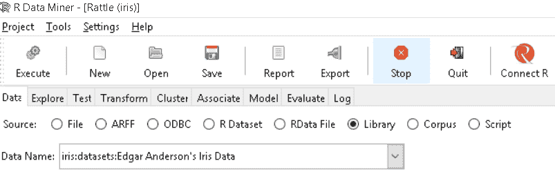
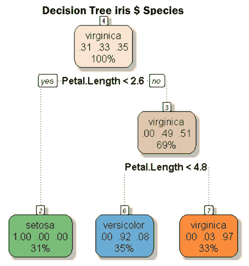
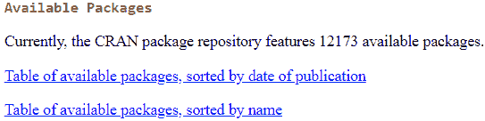
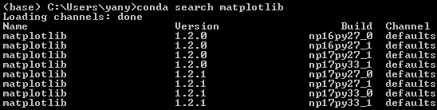

# 第六章：包管理

在前言中，我们提到本书是为那些寻求数据科学领域工具的读者编写的。对于从事数据科学领域研究或实践的人员来说，有几个重要问题。首先，他们需要了解自己的原始数据，比如数据的目的、结构、可靠性和复杂性以及如何收集这些数据。其次，研究人员和实践者应当具备处理数据的良好方法。换句话说，他们应当掌握至少一种计算机语言，如 R、Python 或 Julia。在学习完语言的基础知识后，他们应当转向一些相关的包，因为理解这些包可能决定他们在数据科学领域能够走多远。本章将涵盖以下主题：

+   包、模块或工具箱简介

+   使用包的两个示例

+   查找 R、Python、Julia 和 Octave 中的所有包

+   R 的任务视图

+   查找手册

+   包依赖性

+   R、Python、Julia 和 Octave 中的包管理

+   Conda - 包管理器

+   在 R 和 Python 中创建一组程序

+   查找环境变量

# 包、模块或工具箱简介

多年来，研究人员或用户围绕不同的具体任务为各种编程语言生成了许多包。本书中，我们将*模块*或*工具箱*视为*包*的同义词。在数据科学领域的分析中，使用各种包来实现目标是非常重要的。使用各种包有几个优点。首先，如果我们能够找到某些包中包含的相关程序，就不需要从头开始编写代码。这将节省大量时间。换句话说，我们不必重新发明轮子，尤其对于开发人员来说更是如此。其次，包通常是由在相关领域有一定专长的人开发的。因此，包的质量通常高于由相对较新的用户编写的程序。第三，对于初学者来说，了解打包和相关的技能集将有助于加速他们的学习过程。

# 使用包的两个示例

使用示例来说明理解一些紧密相关的包是多么有用或重要，总是一个好主意。第一个例子非常简单：生成 CNN 网站的二维码。它只有两行代码。注意，如果包没有预先安装，你需要运行`install.packages("qrcode")`：

```py
> library(qrcode) 
> qrcode_gen("https://www.cnn.com") 
```

生成的二维码如下所示。用户可以使用手机上安装的二维码扫描器访问 CNN 网站：


对于第二个例子，我们认为数据科学领域的研究人员和用户最好的示例是一个名为`rattle`的 R 包。如果用户没有预安装该包，可以输入以下 R 代码：

```py
>install.packages("rattle")
```

启动包时，请输入以下两行 R 代码：

```py
>library(rattle) Rattle: A free graphical interface for data science with R
Version 5.1.0 Copyright (c) 2006-2017 Togaware Pty Ltd
Type rattle() to shake, rattle, and roll your data
>rattle()
```

打开应用程序后，按照以下步骤操作：

1.  按下*Enter*键后，屏幕显示以下内容：


这是一个强大的数据科学领域用户工具包。如果我们将项目、工具、设置和帮助选项卡视为第一行，则启动该工具包后，默认位置是在数据选项卡（请参见第三行）。在“数据”下，我们可以看到有八种方法来检索数据。假设我们选择 R 数据集。选择该选项的优点是我们可以生成具有数据框格式的自定义数据集。以下的 R 代码将检索 IBM 的历史数据。用户也可以访问 Yahoo! Finance [`finance.yahoo.com`](https://finance.yahoo.com) 下载更新的数据集：

```py
> x<-read.csv("http://canisius.edu/~yany/data/ibmDaily.csv") 
```

1.  点击“R 数据集”，然后按下数据名称右侧的向下箭头键，我们将看到 x。选择它并点击“执行”——我们将看到以下结果：


1.  点击“探索”后，我们可以看到如何查看这个特定数据集的几个选项。对于数据集的摘要，我们得到了以下结果：


以下是我们的第三个示例。点击数据 | 库，然后选择泰坦尼克号数据集，如下所示：



1.  点击“执行”后，屏幕将显示以下内容：


现在，让我们尝试使用决策树找出**花萼长度**、**花萼宽度**、**花瓣长度**和**花瓣宽度**对**物种**分类的影响。

1.  选择**物种**作为我们的目标变量，如前述截图所示。

1.  点击模型 | 树 | 执行。从中，我们将得到以下结果。为了使我们的展示更清晰，最终输出被分为两部分。顶部部分如下所示：


1.  第二部分如下所示。在前述截图的右侧，我们可以看到“绘制”，它可以用来绘制决策树：


1.  另一方面，我们可以根据之前的结果绘制决策树，点击“绘制”（请参见下图）：



从之前的树中，第一层或问题是**花瓣长度**是否小于**2.6**。从绿色框中我们可以知道，如果是的话，100%是**山鸢尾**。如果答案是**否**（即**花瓣长度**大于**2.6**），我们有另一个问题：**花瓣长度**是否大于**4.8**。

点击“规则”后，我们将看到几层规则，如下所示：

```py
Tree as rules: 

 Rule number: 2 [Species=setosa cover=33 (31%) prob=1.00]
 Petal.Length< 2.6

 Rule number: 7 [Species=virginica cover=35 (33%) prob=0.00]
 Petal.Length>=2.6
 Petal.Length>=4.85

 Rule number: 6 [Species=versicolor cover=37 (35%) prob=0.00]
 Petal.Length>=2.6
 Petal.Length< 4.85

[1] 2 1 5 4 3
```

另一个很棒的功能是，在点击 Log 后，我们可以恢复 R 程序或 R 脚本，以运行之前的决策树模型。为了节省空间，相关的图表和脚本在这里不会显示。相关代码可以在日志文件的底部找到，用户可以保存它或复制粘贴到自己的程序中。读者可以在[`.canisius.edu/~yany/R/iris02.txt`](http://.canisius.edu/~yany/R/iris02.txt)找到它（该链接将在 2018 年 6 月生效）。

# 查找所有 R 包

对于与 R 相关的包，首先访问[`r-project.org`](http://r-project.org)。点击 CRAN 并选择一个镜像位置，然后点击左侧的 Packages。我们可以看到两个列表，如下所示：



截止 2018 年 2 月 22 日，共有 12,173 个 R 包可用。第一个列表包含所有可用的包，并按其发布时间（即更新日期，如果从未更新则显示发布日期）排序。第二个列表按包名称排序。如果我们只想找到相关包，任何一个列表都可以。以下是第一个列表的几行快照：


第一列显示的是包的最后更新时间，如果没有更新则显示发布日期。第二列显示包的名称，而最后一列则简短地描述了每个包的使用方法。我们可以使用关键字来找到我们需要的包。在本章后面，我们将讨论**任务视图**，这是围绕某个主题总结的所有相关 R 包。

# 查找所有 Python 包

要查找所有 Python 包，我们可以访问[`pypi.python.org/`](https://pypi.python.org/)。以下截图显示了该网站的顶部部分。截止 2018 年 2 月 22 日，共有 130,230 个可用的包：


要查找我们需要的包，只需点击 Browse packages 并使用关键字。例如，输入`Data Science`后，我们将看到以下结果：


从之前的截图中，我们可以看到三列：第一列显示包的名称；第二列是 Weight，表示流行度指数；最后一列提供简短的描述。相关的 URL 是[`pypi.python.org/pypi?%3Aaction=search&term=data+science&submit=search`](https://pypi.python.org/pypi?%3Aaction=search&term=data+science&submit=search)。

# 查找所有 Julia 包

对于用 Julia 编写的包，我们可以访问[`pkg.julialang.org/`](https://pkg.julialang.org/)。截止 2018 年 2 月 22 日，共有 1,725 个包可用，如下所示：


同样，我们可以使用关键字搜索这个列表。例如，如果我们使用`data`作为关键字，我们将找到 94 个位置——第一个位置如下图所示：


# 查找所有 Octave 包

在[`octave.sourceforge.io/packages.php`](https://octave.sourceforge.io/packages.php)网站上，我们可以找到所有可用的 Octave 包列表：


同样，我们可以搜索关键字。如果使用了 `data` 这个词，我们会找到 10 个位置——前几个位置如下所示：


# R 的任务视图

任务视图是由一个或多个专家围绕特定主题组成的 R 包集合。例如，对于数据可视化，我们可以选择名为 Graphics 的任务视图。对于文本分析，我们可以选择自然语言分析（NaturalLanguageAnalysis）任务视图。要查找所有这些任务视图的列表，我们可以访问 R 的主页 [`r-project.org`](http://r-project.org)。点击 CRAN 后，选择一个镜像服务器，然后点击左侧的任务视图（Task Views）。将会显示如下界面：


如果我们对数据可视化感兴趣，那么我们可以点击 Graphics（见下图）：


为了节省空间，这里只显示了顶部部分。任务视图提供了许多与**图形显示与可视化**相关的 R 包。另一个很大的好处是通过发出仅三行 R 代码即可安装所有相关的包。假设我们对与金融相关的任务视图感兴趣。我们可以通过以下命令安装任务视图中列出的所有 R 包：

```py
>install.packages("ctv") 
>library("ctv") 
>install.views("Finance") 
```

要更新特定视图，我们使用 R 函数 `update.views()`：

```py
>install.packages("ctv") 
>library("ctv") 
>update.views("Finance")
```

# 查找手册

对于一个 R 包，找到手册的最佳方式是找到已安装 R 包的位置。在下面的示例中，我们以名为`rattle`的 R 包为例：

```py
> library(rattle) 
> path.package('rattle') 
[1] "C:/Users/yany/Documents/R/win-library/3.3/rattle" 
```

请注意，不同的读者会获得不同的路径。我们的结果显示在以下截图中：


PDF 手册和 HTML 手册位于 `doc` 子目录下。探索这些子目录是一个好主意。为了节省空间，我们不展示子目录下的详细文件。第二好的方法是访问 [`r-project.org`](http://r-project.org)，点击 `CRAN`，选择一个附近的镜像位置，然后点击左侧的 packages。接着，从两个列表中搜索所需的包。点击包后，我们可以找到 PDF 文件。对于 Python 文档，我们可以访问两个网站：[`www.python.org/doc/`](https://www.python.org/doc/) 和 [`packaging.python.org/`](https://packaging.python.org/)。第二个网站如下图所示：


要查找 Julia 和 Octave 的相关手册，我们可以访问相关软件包的网站并查找更多信息。再次提示，两个相关网站是[`pkg.julialang.org/`](https://pkg.julialang.org/)和[`octave.sourceforge.io/packages.php`](https://octave.sourceforge.io/packages.php)。

# 软件包依赖关系

软件包依赖关系有两种类型。第一种是软件包依赖于底层软件的版本。例如，Octave 中的`statistics`软件包，地址为[`octave.sourceforge.io/statistics`](https://octave.sourceforge.io/statistics)。在 2018 年 2 月 22 日，它的版本为**1.3.0**，并且需要底层的 Octave 版本至少为**4.0.0**，如下所示的截图的最后一行：


第二类依赖关系是软件包之间的依赖。各种软件包的开发人员使用许多嵌入在其他已开发软件包中的函数。这不仅节省了时间，还意味着他们无需重新发明轮子。从前面截图的最后一行中，我们可以知道这个软件包依赖于另一个名为`io`的 Octave 软件包。

在下面，我们展示了安装过程。首先，我们从[`octave.sourceforge.io/statistics/`](https://octave.sourceforge.io/statistics/)下载 ZIP 文件。在使用正确的路径指向 ZIP 文件后，我们执行以下命令：

```py
>> pkg install statistics-1.3.0.tar.gz
error: the following dependencies were unsatisfied:
 statistics needs io >= 1.0.18
```

`error`消息表示我们需要先安装另一个软件包。安装完`io`软件包后，问题解决了，以下是第二次执行前述命令后的结果：

```py
  >> pkg install statistics-1.3.0.tar.gz
```

要查看`statistics`软件包相对于之前版本的变化，请运行`news statistics`。大多数情况下，用户不需要担心软件包依赖关系，因为许多软件包在我们安装时会自动更新那些依赖的软件包。

# R 中的软件包管理

安装 R 软件包有三种方式。第一种方式是使用`install.packages()`函数。例如，假设我们计划安装一个名为`rattle`的 R 软件包。我们可以使用以下代码来实现：

```py
   >install.packages("rattle")
```

第二种方法是点击菜单栏中的“Packages”，选择一个镜像位置，然后从列表中找到 R 软件包（参见以下截图，显示了列表的顶部部分）：


安装 R 软件包的第三种方式是从本地 ZIP 文件安装。为此，首先手动将 ZIP 文件下载到计算机上。然后点击菜单栏中的“Packages”，选择“Install package(s) from local files...”，如下所示：


要更新软件包，请点击菜单栏中的“Packages”，然后从下拉菜单中选择“Update packages...” （即前面截图中的第五项）。另一种更新方式是使用`update.packages()`函数，如下所示：

```py
 >update.packages("rattle") 
```

以下表格列出了与处理 R 包相关的最常用命令：

| **操作** | **R 命令** |
| --- | --- |
| 加载一个 R 包 | `>library(rattle)``>require(rattle)` |
| 安装一个包 | `>install.packages("rattle")` |
| 更新一个包 | `>update.packages("rattle")` |
| 列出所有已加载的包 | `>search()` |
| 列出所有预安装包 | `>library()` |
| XML 包是否加载 | `>"package:XML" %in% search()` |
| XML 包是否安装 | `>"package:XML" %in% .packages(all.available=T)` |
| 卸载一个包 | `detach(package:rattle)``>detach("package:rattle",unload=TRUE)` |
| 查找更多信息 | `help(package=rattle)``>library(help="rattle")` |

表 6.1 处理包的 R 命令

如前所述，我们可以通过仅仅三行代码来安装在特定任务视图中列出的所有 R 包。由于机器学习是数据科学中最重要的领域之一，我们将以相关的任务视图为例：

```py
>install.packages("ctv") 
>library("ctv") 
>install.views("MachineLearning") 
```

截至 2018 年 2 月 22 日，已有约 168 个 R 包（可以查看[`canisius.edu/~yany/doc/taskViewMachineLearning.txt`](http://canisius.edu/~yany/doc/taskViewMachineLearning.txt)上的列表）。我们还可以更新其特定视图：

```py
>install.packages("ctv") 
>library("ctv") 
>update.views("MachineLearning") 
```

# Python 中的包管理

我们可以使用 conda 来安装与 Python 相关的包（稍后在本章的相关部分中有介绍）。如果我们有多个 Python 编译器，可以轻松安装 Python 包。例如，如果我们使用`Enthought`的 Canopy 编译器，可以使用包管理器，如下所示的截图：


从中我们可以了解到安装了多少包，以及有多少包是可用的。

安装或更新一个包非常简单。例如，要安装一个包，我们只需从列表中选择一个。更新包时也遵循同样的逻辑。要查找包中所有嵌入的函数，我们可以使用以下命令：

```py
>import matplotlib as mat 
>x=dir(mat) 
>print(x) 
```

相关的截图如下所示：


# Julia 中的包管理

要查看已安装包的列表，我们使用`Pkg.status()`函数，如下所示：


为了节省空间，只显示了前几行。或者，我们可以发出`Pkg.installed()`命令，它会返回一个字典，映射已安装的包名到已安装包的版本，如下所示：


要添加或删除一个包，我们使用`Pkg.add()`和`Pkg.rm()`函数，如下例所示：

```py
Julia>Pkg.add("AbstractTable") 
Julia>Pkg.rm("AbstractTable")
```

要获取所有最新版本，我们发出以下命令：

```py
Julia>Pkg.update() 
```

# Octave 中的包管理

我们将使用 Octave 的`statistics`包作为示例。首先，我们在[`octave.sourceforge.io/statistics/`](https://octave.sourceforge.io/statistics/)查找该包的 ZIP 文件，如下图所示：


第二，我们设置路径指向包含先前下载的 ZIP 文件的目录。第三，我们执行 `pkg install package_name`，如下所示：

```py
> pkg install statistics-1.3.0.tar.gz 
```

要了解 `statistics` 包的前一个版本的更改，请运行 `news statistics`。要获取新版本的更多信息，我们输入 `news statistics`，如前所述：


要加载和卸载一个包，我们有以下代码：

```py
>pkg load statistics 
>>pkg unload statistics 
```

至于 `statistics` 包中的所有其他功能，请参见 [`octave.sourceforge.io/statistics/overview.html`](https://octave.sourceforge.io/statistics/overview.html)。

# Conda – 包管理器

启动 Anaconda Prompt 并执行 `conda help` 后，我们将看到以下输出：


从之前的帮助菜单中，我们知道可以安装、更新和卸载包。通常，我们可以使用 `conda` 来安装包。然而，我们也可能会收到错误信息（见下例）：


要更新 conda 本身，我们使用 `conda update -n base conda` 命令，如下所示：


我们可以通过使用搜索功能找到更多关于特定 Python 包的信息，如下所示：



以下表格列出了几个最常用的命令：

| **命令** | **解释** |
| --- | --- |
| `Conda help` `Conda info` | 获取关于 `conda` 用法的帮助 |
| `conda update -n base conda` | 获取有关 `conda` 的信息，如当前版本、基本环境和相关网站 |
| `conda search matplotlib` | 查找所有版本的这个特定 Python 包 |
| `conda install matploblit` | 安装名为 `matplotlib` 的 Python 包 |
| `conda update matploblit` | 更新名为 `matplotlib` 的 Python 包 |
| `conda remove matploblit` | 删除名为 `matplotlib` 的 Python 包 |

表 6.2 最常用的 Conda 命令

# 在 R 和 Python 中创建一组程序

在许多情况下，对于一个特定的研究课题，研究人员会收集许多数据集并编写许多程序。为什么不写一个大型程序呢？有几个原因说明我们不这么做。首先，我们可能需要几个步骤来完成项目。第二，项目可能太复杂，因此我们将整个项目分成几个小部分，每个研究人员负责一个或几个部分。第三，根据整个过程的流程，我们可能希望有几个部分，比如专门用来处理数据的部分，专门运行回归分析的部分，以及总结结果的部分。因此，我们需要一种将所有程序整合在一起的方法。在接下来的示例中，我们将展示如何在 R 和 Python 中实现这一目标。对于 R，假设我们有以下函数：

```py
pv_f<-function(fv,r,n) fv/(1+r)^n 
fv_f<-function(pv,r,n)pv*(1+r)^n 
pv_annuity<-function(c,r,n)c/r*(1-1/(1+r)^n) 
fv_annuity<-function(c,r,n)c/r*((1+r)^n-1) 
pv_perptuity<-function(c,r)c/r 
pv_perptuityDue<-function(c,r)c/r*(1+r) 
```

为了简化任务，我们特意选择了这些单行函数。假设文件名为`financalCalculator.R`，存放在`c:/temp`目录下。我们使用`source()`命令激活它们，并使用`ls()`函数列出所有包含的函数：

```py
> source("c:/temp/financalCalculator.R")
> ls()
  [1] "fv_annuity" "fv_f" "pv_annuity" 
  [4] "pv_f" "pv_perptuity" "pv_perptuityDue"mp/fincalCalculator.R")
```

对于 Python，我们可以生成一个包含所有相关函数的文件。然后，我们可以使用导入函数将其全部加载。首先，下载一个 Python 程序，地址为[`canisius.edu/~yany/python/myPackage.py`](http://canisius.edu/~yany/python/myPackage.py)。假设它保存在`c:/temp/`目录下。我们输入以下两行：

```py
import py_compile
py_compile.compile('c:/temp/myPackage.py')
```

输入这两行后，我们已经生成了一个扩展名为`pyc`的文件，如下所示：


现在，我们可以使用导入函数来导入其中的函数，如下所示：

```py
>>>sys.path.append("c:/temp/")
>>>import myPackage as my
>>>x=dir(my)
>>>print(x)
```

请注意，第一个命令将`c:/temp/`添加到路径中，而第二个命令则导入我们的包。以下截图显示了输出：


# 查找环境变量

对于 R，我们可以使用`Sys.getenv()`函数来查找所有环境变量：


为了节省空间，仅显示顶部部分。同样，不同的用户会得到不同的结果。对于 Python，我们使用以下命令：

```py
import sys
sys.path 
```

输出的顶部部分显示如下：


对于 Julia，我们使用`ENV`函数，如下所示：


对于 Octave，我们可以使用`getenv()`函数，如下所示：

```py
>> getenv('path') 
ans = C:OctaveOctave-4.0.0bin;C:Program FilesSilverfrostFTN95;C:Perlsitebin;C:Perlbin;C:windowssystem32;C:windows;C: 
windowsSystem32Wbem;C:windowsSystem32WindowsPowerShellv1.0;C:Program FilesIntelOpenCL SDK2.0binx86;C:Program Files 
Common FilesRoxio SharedDLLShared;C:Program FilesCommon FilesRoxio Shared10.0DLLShared;C:Program FilesMATLABR2013abin 
;C:Anaconda;C:AnacondaScripts;C:Program FilesWindows Kits8.1Windows Performance Toolkit;C:Program FilesSkypePhone;;C: 
OctaveOctave-4.0.0bin;C:OctaveOctave-4.0.0notepad++;C:OctaveOctave-4.0.0libexecoctave4.0.0siteexeci686-w64-mingw32;C: 
OctaveOctave-4.0.0libexecoctaveapi-v50+siteexeci686-w64-mingw32;C:OctaveOctave-4.0.0libexecoctavesiteexeci686-w64-m 
ingw32;C:OctaveOctave-4.0.0libexecoctave4.0.0execi686-w64-mingw32;C:OctaveOctave-4.0.0bin 
>> 
```

# 总结

在本章中，我们首先讨论了管理包的重要性。然后，我们展示了如何查找 R、Python、Julia 和 Octave 中所有可用的包，如何安装和更新各个包，以及如何查找包的手册。此外，我们解释了包依赖的问题，以及如何在处理包时让编程变得更简单。我们还简要讨论了系统环境的话题。

在第七章中，*Anaconda 中的优化*，我们将讨论多个与优化相关的话题，如优化问题的常见问题及表达不同类型的优化问题（例如，线性规划和二次优化）。我们提供了几个示例来使讨论更具实践性，例如如何选择一个最优的股票投资组合，如何优化财富和资源以促进可持续发展，以及政府应该征收多少税。除此之外，我们还将介绍多个用于优化的包，包括 R、Python、Julia 和 Octave 中的包，如`optimization`、`MlBayesOpt`、`rgenoud`、`colf`和`mize`。

# 复习题和练习

1.  为什么理解各种包很重要？

1.  什么是包依赖？

1.  对于 R、Python、Julia 和 Octave，查找今天每个语言的可用包数量。

1.  如何在 R、Python 和 Julia 中安装包？

1.  如何更新 R、Python 和 Julia 中的包？

1.  什么是 R 的任务视图？

1.  如何安装任务视图中包含的所有 R 包？

1.  安装完 R 包后，如何找到它的相关目录？如何使用命令来查找其相关目录？你可以使用名为`healthcare`的 R 包作为例子。请注意，该包与医疗健康机器学习工具相关。

1.  找到与计量经济学主题相关的任务视图的更多细节。然后安装所有相关的 R 包。一共有多少个？

1.  如何更新一个 R 包？如果是 Octave，应该怎么做？

1.  如何查找一个特定包的手册，包的语言可以是 R、Python、Julia 或 Octave？

1.  选择一个主题，比如图形、数据可视化，找到 R、Python、Julia 和 Octave 语言各自的 10 个相关包。以机器学习为例。

1.  写一个 R 程序来测试一个特定的 R 包是否已加载。如果没有加载但已预安装，则加载该 R 包。同时，如果该 R 包没有安装，提醒用户进行安装。

1.  如何使用 conda 安装一个名为`Matplotlib`的 Python 包？

1.  我们在哪里可以找到一个名为`Matplotlib`的 Python 包的手册？如何找到所有嵌入的函数？

1.  如何查找名为 Stats 的 R 包的手册？

1.  对于 Excel 和 R 之间的数据交换，我们可以使用一个名为`XLConnect`的 R 包。安装该包并执行以下两行代码。请评论你的结果：

```py
>library(XLConnect) 
>vignette("XLConnect") 
```

尝试约十几个 R 包，看看这些包的功能是否对所有包都有效。

1.  如何查找 R、Python、Julia 和 Octave 中的所谓环境变量？

1.  针对某个主题（如文本挖掘），生成二十多个 R 程序并保存在同一个文件中。激活并使用它们。

1.  对 Python 语言重复之前的练习。
