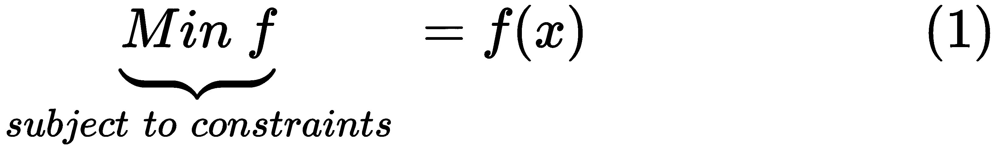
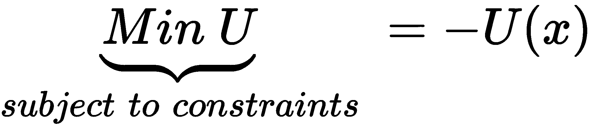
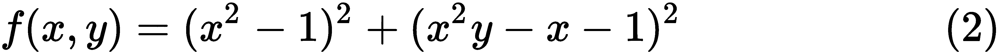
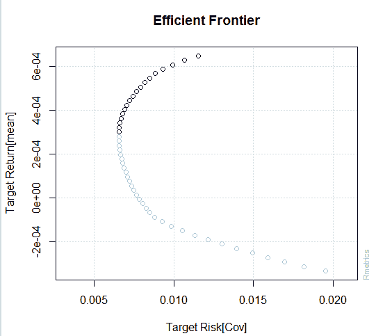

# 第七章：Anaconda 中的优化

优化在数据科学领域中扮演着非常重要的角色。例如，在金融领域，投资者不断寻求风险和回报之间的平衡。为了实现投资多样化，他们希望投资于不同的行业或购买几只股票。那么，如何选择合适的股票，以最小化他们的投资组合风险，从而实现预期的组合回报呢？为此，我们可以应用某种投资组合优化技术。

另一个应用与政府的税收政策相关。我们知道，降低企业税率会鼓励那些考虑进行更多资本投资（即长期投资）的公司，比如设备投资。然而，与此同时，政府的收入可能会减少。如果这一点成立，政府就必须削减许多旨在帮助不幸人群的项目。因此，政府有强烈的动机去寻找一个最优的税率。在这一章中，将涵盖以下主题：

+   为什么优化很重要

+   优化问题的常见问题

+   二次优化

+   示例 #1 – 股票投资组合优化

+   示例 #2 – 最优税收政策

+   R、Python、Octave 和 Julia 中的优化包

# 为什么优化很重要

在我们的生活中，人们面临着各种各样的选择。从某种意义上说，我们有意识地或无意识地执行各种*隐性*优化程序。例如，当一名高中高年级学生在寻找大学时，他们可能会有许多选择，比如好的学校、当地学校、公立学校或私立学校。在做出几个录取选择时，这些高中生通常会有一些目标。这些目标可能包括学校的排名和就读费用、奖学金、项目的声誉和知名度，甚至是橄榄球队的名气。对于公司而言，他们必须做出各种最优或合理的决策。例如，他们应该生产什么类型的产品，生产多少数量，定价多少，以及应该面向谁销售。由于大多数公司资源有限，他们必须在一定的约束条件下做出最优决策。例如，在员工排班中，目标函数是总成本。同时，我们有一定的约束条件，如员工人数、资历、偏好等。

这里是优化问题的一般形式，其中*Min()*是最小化函数，*f(x)*是我们的目标函数：



我们打算通过改变 *x*（一组输入值）来最小化 *f*，并使其满足一定的约束条件。请注意，如果我们计划最大化 *f*，我们可以简单地最小化其负值。在本章后面，我们将引入一个适用于投资者的效用函数，它可以看作是收益（预期投资组合回报）与成本（投资组合风险）之间的权衡。对于投资者而言，他们希望最大化效用函数。这可以等同于最小化其负目标函数；见下式：



其中 *U()* 是效用函数，*x* 将是一组输入变量。下表展示了优化应用的一部分：

| **领域** | **名称** | **描述** |
| --- | --- | --- |
| 经济学 | 效用函数 | 对于许多现实世界中的变量，像幸福感这样的东西很难量化。为此，经济学家们提出了效用函数。为了找到最优解，用户可以通过最大化其效用函数来实现。 |
| 数量、价格与生产 | 一家公司可能会考虑最佳策略来生产、定价和销售其产品。 |
| 福利转移 | 政府可能会考虑许多输入变量，如工作激励、犯罪率以及其他因素。 |
| 最优税收政策 | 最大化 GDP 增长，同时控制可控的通货膨胀率。 |
| 财务 | 投资组合优化 | 对于给定的预期回报组合，选择一组股票以最小化投资组合风险。 |
| 最优投资策略 | 面对多种可能的投资机会和众多约束条件时，如何选择最佳组合以实现最佳结果。 |
| 利润优化 | 对于公司而言，他们希望通过最优选择输入变量来最大化利润。 |
| 高频交易 | 在信号效应与各种买卖报价之间、长期与短期利润之间找到平衡。 |
| 其他 | 调度 | 在一定约束下最小化总成本。 |
| 最小化总成本 | 考虑在一定的利益与成本之间做出各种权衡。 |
| 飞行问题 | 通过访问特定城市来最小化总距离。 |
| 任务安排 | 面对许多任务和潜在的劳动及输入变量时，如何实现最优解。 |

优化的应用

# 优化问题的常见问题

优化问题中有几个关键问题。最重要的是如何选择一个合适的目标函数。对于某些情况，目标函数是显而易见的。不幸的是，对于其他情况，这一点并不那么清晰。由于选择一个好的目标函数取决于具体情况，我们将进一步讨论，但请记住，一个合适的目标函数可能会使我们的任务变得更加简单。

在许多情况下，一个不合适的目标函数可能会导致以下问题：

+   很难找到一个可行的解

+   我们可能会得到一个局部解

+   我们可能会得到一个极值解

+   收敛需要很长时间（也就是说，找到一个好的解决方案需要过多的计算时间）

让我们看一个凸函数；代码和对应的图表如下：

```py
x<-seq(-10,10,0.1) 
a<-4 
b<- -2 
c<-10 
y<-a*x²+b*x+c 
plot(x,y,type='l') 
```

这段代码将提供如下所示的输出：


从几何角度看，如果从任何一点 *(x[1],y[1])* 到另一点 *(x[2],y[2])* 绘制的线段——称为从 *x* 到 *y* 的弦——位于 *f* 的图形上方或与其重合，那么该函数就是凸函数，如下图所示：


该图表及其一条弦的代码如下：

```py
x<-seq(-4,4,0.1) 
a<-1 
b<-2 
c<-3 
myFunction<-function(x)a*x²+b*x+c 
y<-myFunction(x) 
name<-"For a convex function:chord is above" 
plot(x,y,type='l',main=name) 
x1<--2 
y1<-myFunction(x1) 
x2<-3 
y2<-myFunction(x2) 
segments(x1, y1, x2, y2,col = par("fg"), lty = par("lty"), xpd = FALSE) 
```

对于凸函数，找到其最优解是相对容易的。然而，对于非凸函数，找到最优解就没有那么简单了。在这种情况下，我们将面临一些问题：全局解与局部解，无约束与有约束优化，初始输入值，以及转换标准。

全局解是通过使用所有值或可能的输入值来实现目标函数的解。然而，由于某些原因，我们的程序可能无法找到全局解，而只能找到局部解。局部解是指仅对一个小区域的最优解。让我们看一下以下函数：



由于右侧的两个项都是正数，*f(x,y)* 可能有多个最小值。当 *x=-1* 且 *y=0* 时，*f(x,y)* 为零，因此 *(-1,0)* 是一个最小值。另外，当 *x=1* 且 *y=2* 时，*f(x,y)* 也为零，因此 *(1,2)* 也是一个最小值。请注意，如果尚未安装该库，用户需要运行 `install.packages('scatterplot3d')`：

```py
library(scatterplot3d) 
x<-seq(-2,2,0.05) 
y<-seq(-2,2,0.05) 
z<-(x²-1)²+(x²*y-x-1)² 
name<-"3 dimensional graph"  
scatterplot3d(x, y, z, highlight.3d = TRUE, col.axis = "blue", 
col.grid = "lightblue", main =name, pch = 2) 
```

相关的三维图形如下所示：


角点解是最大化或最小化问题的特殊解，其中一个输入变量的数量为零或取极端值。用非技术术语来说，角点解就是选择者既不愿意也无法在收益和成本之间做出权衡。大多数时候，角点解不是可选的，更不用说是全局最优解了。为了避免局部解或角点解，我们有时需要首先找到各个输入变量的输入空间。然后，我们为初始输入值选择一些均匀间隔的区间。以下是一个示例。

信息不对称的 PIN 度量源自 *Easley 和 O'Hara*（1992）以及 *Easley et al*.（1997）提出的市场微观结构模型。从数学角度看，该模型指定了在任意一天，观察到买入交易数量 (*ε[b]*) 和卖出交易数量 (*ε[s]*) 的可能性由以下联合泊松分布 *L* 表示：


*X*、*Y* 和 *Z* 的值定义如下：


其中，*θ=[α,δ,μ,ε[b],ε[s]]* 代表描述每日交易过程的五个结构参数。具体而言，*α* 表示信息事件发生的概率，*δ* 表示坏事件发生的概率，*μ* 是在没有信息事件发生时的泊松参数，*ε[b]* 是当好事件发生时的泊松参数（此时投资者会买入），*ε[s]* 是当坏事件发生时的泊松参数（此时投资者会卖出），*B[i]* 是第 *i* 天由买方发起的交易数量，而 *S[i]* 是由卖方发起的交易数量。

由于这个似然目标函数表现不稳定，有时很难收敛或者会导致角落解。在许多场景中，最优解取决于初始输入值。*Yan 和 Zhang*（2014）首先找出了这五个输入值的范围，然后设计了初始值的均匀分布。结果表明，这种优化设计的初始值会显著减少角落解的出现。

# 将各种优化问题表示为 LPP

LPP 代表**线性规划问题**或线性优化问题。它是一种通过线性关系表示约束条件，在数学模型中达到最佳（最优）结果的方法，例如在给定风险水平下实现最大预期投资组合回报。LPP 具有以下标准形式：


其中，*C^TX* 是我们的目标函数，*Ax≤b* 是一组约束条件，*x≥0* 是另一组约束条件。对于这些约束，我们可以使用多种不同的格式。

# 二次优化

如果最高次幂是 1，那么我们称之为线性模型。另一方面，如果最高次幂是 2，则称之为二次函数。R 的 `optim()` 函数可以用于寻找最小化问题的解。例如，我们有如下目标函数：


由于只有一个变量，我们可以手动解决这个问题。求一阶导数并设其为：

```py
x<-seq(-10,10,0.1) 
a<--2 
b<-10 
c<-5 
y<-a*x²+b*x+c 
plot(x,y,type='l') 
```

相关图表如下：


从图中可以看出，当 *x* 为零时，我们可以得到一个最大的 *y* 值：

```py
y<-20-3.5*x² 
a<--2 
b<-10 
c<-5 
f<-function(x)-(a*x²+b*x+c) 
```

在前面的公式中，我们使用了负函数，因为 R 的 `optim()` 函数会得到最小值而不是最大值：

```py
> optim(0.3,f) 
$par 
[1] 2.500078 
$value 
[1] -17.5 
$counts 
function gradient  
      36       NA  
$convergence 
[1] 0 

$message 
NULL 
```

# R 中的优化

在本节中，我们展示了一个关于 R 的优化示例。第一个示例相当简单，目标是用户效用的最大化，如下所示：


其中*U*是效用函数，*E(x)*是期望函数，*R[p]*是投资组合回报，*A*是表示风险偏好的参数，而是投资组合方差。显然，效用与期望投资组合回报正相关，与投资组合风险（即方差）负相关。请注意，这是一种二次函数。

接下来，我们尝试使用法马和法兰奇提供的价值加权五个行业，看看如何使用优化过程。首先，我们通过以下代码获取数据：

```py
path<-"http://canisius.edu/~yany/RData/ff5industries.RData" 
load(url(path)) 
head(.ff5industries,3)  
```

输出如下所示：


第一列是日期，接下来的五列是价值加权行业组合的回报，最后五列是等权重行业组合的回报。`Cnsmr`代表消费者，`Manuf`代表制造业，`Hlth`代表医疗保健，`Other`代表其他行业。有关更详细的定义，请参见[`mba.tuck.dartmouth.edu/pages/faculty/ken.french/Data_Library/det_5_ind_port.html`](http://mba.tuck.dartmouth.edu/pages/faculty/ken.french/Data_Library/det_5_ind_port.html)中的链接。在以下函数中，我们以价值加权五个行业为例：

```py
retMatrix<-as.matrix(.ff5industries[,2:6]/100)
n1<-ncol(retMatrix)
w<-rep(1/n1,n1)
A<-1.5
bigValue=100
#
utilityFunction<-function(w){
    portfolioRet<-retMatrix%*%w
    x<-portfolioRet
    loss<-(sum(w)-1)²*bigValue
    u=-(mean(x)-0.5*A*var(x))+loss
    return(u)
}
```

在前面的函数中，由于`optim()`函数需要最小化，因此在效用函数中添加了负号。此外，目标函数中添加了一个所谓的损失变量。其值与所有权重之和等于 1 的偏差有关。换句话说，如果权重之和为 1，则该损失变量的值为零。这是添加约束的一种便捷方法。在以下代码中，我们调用了 R 的`optim()`函数：

```py
>optim(w,utilityFunction)
$par
[1] 1.0274904 -0.1901590 0.1474859 0.8867341 -0.8715205
$value
[1] -0.009195987
$counts
function gradient 
 502 NA 
$convergence
[1] 1
$message
NULL
```

这五个行业的权重分别为 103%、-19%、14.7%、88.7%和-87.2%。负权重表示做空。如果我们有下界和上界，我们可以通过以下代码来指定。请注意，相关方法是`method="L-BFGS-B"`：

```py
>optim(w,utilityFunction,lower=-0.1,upper=0.5,method="L-BFGS-B")
$par
[1] 0.50000000 0.01584360 0.08418691 0.50000000 -0.10000000
$value
[1] -0.008587635
$counts
function gradient 
 21 21 
$convergence
[1] 0
$message
[1] "CONVERGENCE: REL_REDUCTION_OF_F <= FACTR*EPSMCH"
```

输出显示该五行业组合的权重应为`(0.5, 0.016, 0.084, 0.5,-0.1)`。要获取更多关于该函数的信息，我们可以输入`help(optim)`；见此处：

```py
optim(par, fn, gr = NULL, ...,
      method = c("Nelder-Mead", "BFGS", "CG", "L-BFGS-B", "SANN",
                 "Brent"),
      lower = -Inf, upper = Inf,
      control = list(), hessian = FALSE)
```

# Python 中的优化

对于优化，最常用的 Python 函数是：

```py
import scipy.optimize as sp
x=dir(sp.optimize)
print(x)
```

输出如下所示：


要查找名为`minimize`的函数的用法，我们可以使用以下代码：

```py
from scipy.optimize import minimize 
help(minimize) 
```

输出如下所示。为节省空间，这里只展示了顶部部分：


下一个示例来自[`scipy.org/`](https://scipy.org/)。目标函数如下所示：


它是一个包含五个输入变量的 Rosenbrock 函数。由于右侧的每一项都是非负的，我们希望找到一组输入变量*(x[1], x[2], x[3], x[4], x[5])*以最小化目标函数：

```py
import numpy as np 
from scipy.optimize import minimize 
def rosen(x): 
    return sum(100.0*(x[1:]-x[:-1]**2.0)**2.0 + (1-x[:-1])**2.0) 
# 
x0 = np.array([1.3, 0.7, 0.8, 1.9, 1.2]) 
solution= minimize(rosen, x0, method='nelder-mead',options={'xtol': 1e-8, 'disp': True}) 
print(solution.x) 
```

`x[1:]`的代码表示从第二项到最后一项的*x*值，而`x[:-1]`的代码表示*x*中除最后一项外的所有值。输出如下所示：


# Julia 中的优化

下一个示例来自网页[`jump.readthedocs.io/en/release-0.2/jump.html`](https://jump.readthedocs.io/en/release-0.2/jump.html)。代码如下：

```py
using JuMP 
using ECOS 
m= Model(solver =ECOSSolver()) 
@variable(m, 0 <= x <= 2 ) 
@variable(m, 0 <= y <= 30 ) 
@setObjective(m, Max, 5x + 3*y ) 
@addConstraint(m, 1x + 5y <= 3.0 ) 
print(m) 
status = solve(m) 
println("Objective value: ", getObjectiveValue(m)) 
println("x = ", getValue(x)) 
println("y = ", getValue(y)) 
```

首先，目标函数在这里显示：


输出如下截图所示：


对于前面程序中的`m=Model(solver=ECOSSolver())`代码，使用了名为`ECOS`的包中的求解器。以下表格显示了嵌入在不同 Julia 包中的各种求解器函数：


Julia 包与求解器

表中的符号在此定义：

+   LP：线性规划

+   SOCP：二阶圆锥规划（包括具有凸二次约束和/或目标的问题）

+   MILP：混合整数线性规划

+   NLP：非线性规划

+   MINLP：混合整数非线性规划

+   SDP：半正定规划

前面表格的来源在这里：[`jump.readthedocs.io/en/latest/installation.html`](http://jump.readthedocs.io/en/latest/installation.html)

现在，考虑以下方程：


以下 Julia 程序用于为前面的函数求解：

```py
using Optim 
f(x) = (1.0 - x[1])² + 200.0 * (x[2] - x[1]²)² 
optimize(f, [0.0, 0.0]) 
```

输出如下截图所示：


下一个示例来自 Julia 的网站，[`julianlsolvers.github.io/Optim.jl/latest/user/minimization/`](http://julianlsolvers.github.io/Optim.jl/latest/user/minimization/)。代码如下：

```py
using Optim 
function g!(s, x) 
 s[1] = -2.0*(1.0-x[1])-400.0*(x[2]-x[1]²)*x[1] 
 s[2] = 200.0*(x[2]-x[1]²) 
end 
lower = [1.25, -2.1] 
upper = [Inf, Inf] 
initial_x = [2.0, 2.0] 
od = OnceDifferentiable(f, g!, initial_x) 
results = optimize(od, initial_x,lower,upper,Fminbox{GradientDescent}()) 
```

输出如下所示：


# Octave 中的优化

名为`Optim`的 Octave 包可以轻松从[`octave.sourceforge.io/optim/`](https://octave.sourceforge.io/optim/)下载。以下截图显示了包的版本。请注意，这是 2018 年 3 月 1 日的版本：


下载并安装包后（请参见第六章*，管理包*，了解如何安装 Octave 包的更多细节），我们可以使用以下命令行查看一些函数：

```py
pkg load optim 
pkg describe -verbose optim 
```

以下截图显示了输出。为了节省空间，仅显示顶部部分：


要查找特定函数的用法，可以使用`help()`函数：

```py
help fminsearch
```

相关输出如下截图所示：


从之前的信息中，我们知道`fminsearch()`函数将以给定的初始值和选项集来最小化我们的目标函数。接下来，我们有两个示例。对于第一个示例，目标函数如下：


代码及相关输出如下所示：

```py
>> fun = @(x)50*(x(1)²-x(2))² + (x(1)-3)²;
>> x0 = [0,0];
>> x = fminsearch(fun,x0)
x 
 3.0000 9.0000
```

对于下一个示例，其目标函数如下：


为了查看每个步骤，我们有以下代码：

```py
OPTIONS = optimset('Display','iter');
function f = fun2(x)
   f = 0;
   for k = -5:5
      f = f + exp(-(x(1)-x(2))² - 2*x(1)²)*cos(x(2))*sin(2*x(2));
   end
endfunction 
x0 = [0.5,-0.5];
[x,fval] = fminsearch(@fun2,x0,OPTIONS)
```

第一行用于设置优化过程。`Display`表示显示所有中间步骤，而`iter`表示集成。输出如下所示。为了节省空间，我们仅展示顶部和底部部分。首先是顶部部分：


这是底部部分：


# 示例 #1 – 股票投资组合优化

有时我们将单周期投资组合优化称为马克维茨投资组合优化。我们的输入数据集包括预期回报率、标准差和财务资产之间的相关矩阵，我们的输出将是由这些资产形成的有效前沿。在本章的其余部分，我们将使用历史回报率代表预期回报率，并使用历史相关性代替预期相关性。

在以下示例中，我们使用一个名为`fPortfolio`的 R 包。我们使用以下代码来安装该包：

```py
install.packages("fPortfolio") 
```

要加载各种嵌入的数据集，我们使用`data()`函数（参见以下示例代码）：

```py
library(fPortfolio)
data(GCCINDEX.RET)
dim(GCCINDEX.RET)
 [1] 824  11 
```

下表列出了嵌入的数据集：

| **#** | **名称** | **维度** | **#** | **名称** | **维度** |
| --- | --- | --- | --- | --- | --- |
| 1 | ECON85 | [1] 304 12 | 7 | SMALLCAP | [1] 60 22 |
| 2 | ECON85LONG | [1] 304 19 | 8 | GCCINDEX.RET | [1] 824 11 |
| 3 | GCCINDEX | [1] 825 11 | 9 | SPISECTOR.RET | [1] 2198 10 |
| 4 | SPISECTOR | [1] 2216 10 | 10 | SWX.RET | [1] 1916 6 |
| 5 | SWX | [1] 1917 6 | 11 | LPP2005.RET | [1] 377 9 |
| 6 | LPP2005 | [1] 377 9 | 12 | SMALLCAP.RET | [1] 60 22 |

fPortfolio R 包中的数据集列表

要获得有效前沿，即所有有效投资组合的连接，我们使用以下代码：

```py
library(fPortfolio) 
data(GCCINDEX.RET) 
retMatrix<-GCCINDEX.RET 
frontier=portfolioFrontier(as.timeSeries(retMatrix)) 
frontierPlot(frontier) 
grid() 
```

在这段代码中，我们首先加载名为`fPotfolio`的 R 包。然后，`data(GCCINDEX.RET)`加载数据集。相关的图示如下所示：



# 示例 #2 – 最优税收政策

另一个例子是 LQ 经济中的最优税收水平。这里，LQ 代表线性二次（模型）。这个例子借自 Thomas J. Sargent 和 John Stachurski。他们的网页可以在 [`lectures.quantecon.org/py/lqramsey.html`](https://lectures.quantecon.org/py/lqramsey.html) 上找到。他们修改了 Robert Lucas 和 Nancy Stokey 的一个著名模型，使得可以应用简化计算的线性二次模型求解公式。该经济中有两类玩家：家庭和仁慈的政府。政府通过与国家条件相关的贷款和对劳动收入的线性税收来资助政府购买的外生流。家庭通过选择消费和劳动的路径来最大化其效用函数，价格和政府的税率与借贷计划是给定的。需要注意的是，为了最大化家庭可以获得的效用，依赖于政府的税收和借贷计划。该程序将选择最佳的竞争性均衡。可以在 [`raw.githubusercontent.com/QuantEcon/QuantEcon.lectures.code/master/lqramsey/lqramsey.py`](https://raw.githubusercontent.com/QuantEcon/QuantEcon.lectures.code/master/lqramsey/lqramsey.py) 下载该 Python 程序。注意，该程序依赖于 `quantecon` Python 包，可以在 [`pypi.python.org/pypi/quantecon/`](https://pypi.python.org/pypi/quantecon/) 下载。

启动几个子程序后，我们可以运行以下主要的 Python 程序。相关的输出在代码之后显示：

```py
import numpy as np 
from numpy import array 
beta= 1 / 1.05 
rho, mg = .7, .35 
A = np.identity(2) 
A[0, :] = rho, mg * (1-rho) 
C = np.zeros((2, 1)) 
C[0,0] = np.sqrt(1 - rho**2) * mg / 10\. 
Sg = array((1, 0)).reshape(1, 2) 
Sd = array((0, 0)).reshape(1, 2) 
Sb = array((0, 2.135)).reshape(1, 2) 
Ss = array((0, 0)).reshape(1, 2) 
economy=Economy(beta=beta,Sg=Sg,Sd=Sd,Sb=Sb,Ss=Ss,discrete=False,proc=(A, C)) 
T = 50 
path = compute_paths(T, economy) 
gen_fig_1(path) 
```


# 用于优化的 R 包

有许多可用于各种类型优化的 R 包，例如 `optimization`、`MlBayesOpt`、`rgenoud`、`colf` 和 `mize`。以下表格列出了部分包：

| **#** | **名称** | **描述** |
| --- | --- | --- |
| 1 | `[dtwclust](https://cran.case.edu/web/packages/dtwclust/index.html)` | 时间序列聚类及动态时间规整距离的优化 |
| 2 | `CVXR` | 严谨的凸优化 |
| 3 | `IROmiss` | 插补正则化优化算法 |
| 4 | `subplex` | 使用 Subplex 算法的无约束优化 |
| 5 | `GPareto` | 用于帕累托前沿估计和优化的高斯过程 |
| 6 | `OOR` | R 中的乐观优化 |
| 7 | `ROI` | R 优化基础设施 |
| 8 | `lbreg` | 具有约束优化的对数-二项回归 |
| 9 | `PEIP` | 地球物理反演理论与优化 |
| 10 | `dfoptim` | 无导数优化 |
| 11 | `SPOT` | 顺序参数优化工具箱 |

R 优化包的部分列表

此外，我们还可以查看与优化相关的任务视图。为此，请按照以下步骤操作：

1.  访问 R 官网 [`r-project.org`](https://r-project.org)

1.  点击 CRAN 下的下载

1.  选择一个靠近你位置的镜像站点

1.  点击左侧的任务视图

1.  点击列表中的优化部分，查看上面部分内容：


前面的任务视图中包含了 100 多个 R 包。要一次性安装所有包，我们可以执行以下命令：

```py
install.packages("ctv") 
library("ctv") 
install.views("Optimization") 
```

# Python 中的优化包

从第六章，*管理包*中，我们了解到，要查找所有 Python 包，可以访问网站[`pypi.python.org/`](https://pypi.python.org/)。以下表格展示了我们输入`Optimization`作为关键词后，相关的 Python 包/模型列表：

| **包** | **Wt*** | **描述** |
| --- | --- | --- |
| `heuristic-optimization 0.4.3` | 7 | 无导数优化的启发式方法 |
| `streams-optimization 1.0.0.dev3` | 7 | LHCb 触发器/剥离流优化库 |
| `adjointShapeOptimizationFlux 1.0` | 6 | `adjointShapeOptimizationFoam`的 Python 前端 |
| `bayesian-optimization 0.6.0` | 6 | 贝叶斯优化包 |
| `emzed_optimizations 0.6.0` | 6 | 用于加速`emzed`的特定优化 |
| `scikits.optimization 0.3` | 6 | 用于数值优化的 Python 模块 |
| `asprin 3.0.2` | 5 | 回答集编程中的定性和定量优化 |
| `bolib 0.19.11` | 5 | 贝叶斯优化的 Python 库 |
| `brent-search 1.0.32` | 5 | 布伦特法用于单变量函数优化 |
| `clientMOE 0.1` | 5 | 度量优化引擎 |
| `cma 2.5.3` | 5 | CMA-ES，协方差矩阵适应进化策略，用于 Python 中的非线性数值优化 |
| `coopr.opt 2.12.2` | 5 | Coopr 通用优化接口 |
| `coopr.os 1.0.4` | 5 | Coopr 到 COIN-OR 优化服务项目的接口 |
| `cro 0.0.5.0` | 5 | **珊瑚礁优化**（**CRO**）算法 |
| `dfoalgos 0.5` | 5 | 无导数优化算法 |
| `dillinger 1.0.0.dev1` | 5 | 用于迭代多臂赌博机实验的贝叶斯优化 |
| `downhill 0.4.0` | 5 | Theano 的随机优化例程 |
| `dy 0.0.1` | 5 | 动态优化/动态规划 |
| `fst-pso 1.3.2` | 5 | 模糊自调节 PSO 全局优化库 |

Python 优化包的部分列表

# Octave 中的优化包

要查找 Octave 中的优化包，我们可以访问网页[`octave.sourceforge.io/packages.php`](https://octave.sourceforge.io/packages.php)。然后，我们可以使用关键词`optimization`搜索这些包；在此截图中可以看到名为`ga`的第一个包：


第二个是`optim`包：


# Julia 中的优化包

同样，对于 Julia 中的优化包，我们可以访问网页[`pkg.julialang.org/`](https://pkg.julialang.org/)。然后，我们可以使用关键词`optimization`搜索这些包；在此截图中可以看到名为`JuMP`的包：


关键字`optimization`大约有 45 个匹配项。为了节省空间，我们不展示其他包。这个网页，标题为*Julia 语言的优化包*，可能会非常有用：[`www.juliaopt.org/`](http://www.juliaopt.org/)。

# 总结

在本章中，我们讨论了与优化相关的几个主题，例如优化问题的常见问题、如何将各种类型的优化问题表示为线性规划问题（LPP）、以及二次优化。我们提供了几个示例，使讨论更具实践性，例如如何选择一个最佳的股票组合，如何优化财富和资源以促进可持续发展，政府应该征收多少税。此外，我们介绍了 R、Python、Julia 和 Octave 中的多个优化包。

在下一章中，我们将讨论无监督学习。特别是，我们将解释层次聚类和 k 均值聚类。对于 R 和 Python，我们将详细解释几个相关的包。对于 R，我们将讨论`Rattle`、`randomUniformForest`和`Rmixmod`。对于 Python，我们将涉及`SciPy`、`Contrastive`、`milk`、`Scikit-learn`和`sklearn`。我们将通过几个实际的例子来展示这些 R 和 Python 包的应用。

# 复习问题与练习

1.  优化是什么意思？

1.  什么是 LPP？它的用途是什么？

1.  全局解与局部解有什么区别？

1.  在什么情况下，我们的 LPP 程序不会收敛？举几个简单的例子，并提供可能的解决方案。

1.  解释为何我们得到以下奇怪的结果：

```py
> f<-function(x)-2*x²+3*x+1 
> optim(13,f) 
$par 
[1] 2.352027e+75 
$value 
[1] -1.106406e+151 
$counts 
function gradient  
     502       NA  
$convergence 
[1] 1 
$message 
NULL
```

1.  什么是二次方程？

1.  我们可以从哪里查找所有针对优化问题的 R 包？

1.  与优化相关的任务视图的用途是什么？

1.  根据相关任务视图，有多少个 R 包与优化相关，我们如何一次性安装它们？

1.  从 Prof. French 数据库下载 10 个行业的收益数据。然后，使用以下效用函数为 A=1、3、5、20 和 100 的五类投资者选择一个最佳投资组合：


其中*U*是效用函数，*E()*是期望函数，*R[p]*是投资组合收益，*A*是表示风险偏好的参数，且是投资组合的方差。请注意数据来源：[`mba.tuck.dartmouth.edu/pages/faculty/ken.french/data_library.html`](http://mba.tuck.dartmouth.edu/pages/faculty/ken.french/data_library.html)。

1.  对于 Octave，找到两个使用`leasqr`（最小二乘）函数的示例。你可以使用以下代码获取该函数的相关信息：

```py
>> pkg describe -verbose optim 
>> help leasqr 
```

1.  我们可以找到多少个与 Octave 包`optim`相关的函数？

1.  对于 Octave，下载一个名为`ga`的包。了解包中包含的几个函数的用途。

1.  在你运行以下三行代码后，安装了多少个 R 包：

```py
>install.packages("ctv") 
>library("ctv") 
>install.views("Optimization") 
```

1.  安装一个名为 `JuMP` 的 Julia 包，并查找一些它的嵌入式函数示例。
