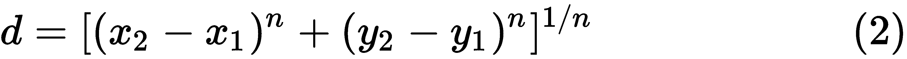
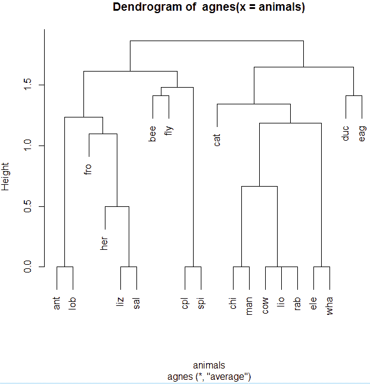
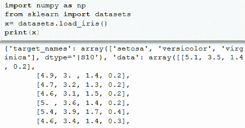
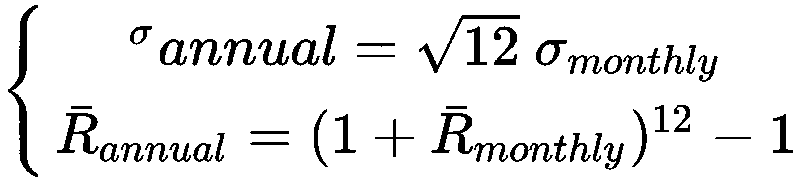
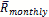

# 第八章：在 Anaconda 中进行无监督学习

在讨论无监督学习之前，可能最好先介绍一下监督学习，因为我们大多数人对前几章讨论的函数会比较熟悉。对于 *y=f(x)* 这样的函数，通常我们有独立变量 *x[1]*，*x[2]*，... *x[n]* 的值以及与之对应的因变量 *y* 的一组值。在前几章中，我们讨论了多种类型的函数，例如单因子线性模型。我们的任务是根据一组输入值来确定函数的形式。对于监督学习，我们有两个数据集：**训练数据**和**测试数据**。对于训练数据集，它包含一组输入变量和相关的输出值（也称为**监督信号**）。监督学习算法分析训练数据并推导出一个推断函数。然后，我们将这个推断函数应用于给定的测试数据集。

与监督学习不同，**无监督学习**中没有 *y*。换句话说，无监督学习用于从包含输入数据但没有标记响应的数据集中推断结论。从某种意义上讲，监督学习有 *x* 和 *y*，而无监督学习只有 *x*。换句话说，对于一种算法，我们有输入和输出，而对于另一种算法，我们只有输入。最常见的无监督学习方法是聚类分析，通常用于探索性数据分析，以发现数据中的隐藏模式或分组。

本章将涵盖以下主题：

+   无监督学习简介

+   层次聚类

+   k-均值聚类

+   Python 包介绍：`scipy`，`contrastive` 和 `sklearn`（scikit-learn）

+   R 包介绍：`rattle`，`randomUniformForest` 和 `Rmixmod`

+   使用 Julia 实现

+   聚类分析的任务视图

# 无监督学习简介

对于无监督学习，我们尝试根据某些特征或属性重新组织数据或将其分类为不同的组。为此，我们可以使用一些规则来对数据集进行分类。例如，我们可以根据投资者的特征，如年龄、教育水平、背景、工作类型、居住城市、职业、薪资水平和房屋所有权，将他们划分为不同的组。例如，他们可以被划分为四种类型的投资者：激进型、厌恶风险型、中性型和极度厌恶风险型。之后，金融机构可以根据不同群体的需求，设计并营销特定的金融产品。

为了制定一个公平的所得税政策，政府可以根据不同的标准（例如收入水平和是否有某些残疾）对潜在纳税人进行分类。然后，他们可以设计不同的税务计划，针对不同社会福利状态的群体。这种税收政策可能比简单的累进税制更为公平。

另一个例子是，投资者可以购买超过 5000 支股票。一个好主意是根据各种基准将它们分组，例如风险性、盈利性、熟悉度、声誉、地域性/国家性/国际性、社会责任和交易成本。之后，金融机构可以形成不同的共同基金，并将其销售给不同的投资者。

以下图示用于总结这一思想：根据某些标准对数据进行分组。数据来自两个具有相同标准差、但均值不同的正态分布。我们将在本章后面展示相关代码：


聚类或分组的逻辑是，同一组内成员之间的距离小于组与组之间的距离。换句话说，每组内部成员的相似度高于组与组之间的相似度。例如，如果我们有许多房屋的邮政编码，我们可以估算每对房屋之间的距离，并将它们划分为不同的社区。对于数值型数据，比如 *(x[1],y[1]), (x[2],y[2])*，它们之间的差异可以通过以下公式定义：


以下代码生成一个图形，显示两个点之间的距离，这也叫做欧几里得距离：

```py
> a<-c(2,5) 
> b<-c(3,7) 
> z<-rbind(a,b) 
> dist(z, method = "euclidean") 
 a 
b 2.236068 
> plot(z,lwd=20) 
```

在之前的代码中，`method="euclidean"` 可以省略，因为它是默认设置。距离为 `2.236`，图形为简洁起见被忽略。方法变量的潜在值包括 `euclidean`、*maximum*、*manhattan*、*canberra*、binary 和 *minkowski*。一般形式称为 Minkowski 距离，如下所示：



显然，当 *n* 取 `2` 的值时，公式（2）与公式（1）相同。另一方面，当 *p = 1* 时，这就等同于曼哈顿距离，如下所示：


当 *x* 和 *y* 在大小上有所不同时，我们可以使用以下公式对其进行缩放：


之前的缩放方法基于*x*和*y*是独立的假设，其中  () 是新数据点 *x (y)*， * ()* 是 *x (y)* 的均值，*()* 是 *x(y)* 的标准差。如果研究人员更看重数据的方向而不是大小，那么可以使用余弦距离。两个非零向量的余弦可以通过欧几里得点积公式推导出来：


其中 *θ* 是这两个向量之间的角度。此外，我们可以将 *cos(θ)* 看作是一个缩放因子，如下所示：

```py
> angles<-seq(0,380,30) 
> y<-cos(angles) 
> y2<-round(y,2) 
> z<-cbind(angles,y2) 
> colnames(z)<-c("ANGLE","cos(angle)") 
> print(z) 
 ANGLE cos(angle) 
 [1,]     0       1.00 
 [2,]    30       0.15 
 [3,]    60      -0.95 
 [4,]    90      -0.45 
 [5,]   120       0.81 
 [6,]   150       0.70 
 [7,]   180      -0.60 
 [8,]   210      -0.88 
 [9,]   240       0.33 
[10,]   270       0.98 
[11,]   300      -0.02 
[12,]   330      -0.99 
[13,]   360      -0.28 
```

显然，当 *x* 和 *y* 向量完全相同方向时，*cos(θ)* 的值为 1。当它们的方向相反时，*cos(θ)* 会变为负值。

给定两个向量 A 和 B，余弦相似度 *cos(θ)* 可通过点积和大小表示，如下所示：


对于类别数据点，由于没有数值化，因此无法进行排序。对于这种情况，我们可以计算以下相似性指数：


其中 *n[matched]* 是匹配的特征数量，*n[total]* 是特征的总数。当我们同时拥有类别数据和数值数据时，我们可以在选择加权最终值时，先估算两种类型的距离：


假设 *d[num]* 是基于数值数据的距离，而 *d[cat]* 是基于类别数据的距离，我们可以得到以下等式：


其中 *w[num]* 是数值的权重。

假设我们有两组数据，*X* 和 *Y*。对于 *X* 集合，我们有 *x[1]*, *x[2]*, ..., *x[n]*，而对于 *Y* 集合，我们有 *y[1]*, *y[2]*, ..., *y[m]*。换句话说，对于 *X*，有 *n* 个观测值，而对于 *Y*，有 *m* 个观测值。对于一对簇，我们有几种方式定义它们的连接方式（请参见下表）：

| **连接方式** | **数学公式** | **描述** |
| --- | --- | --- |
| 单连接 |  | 两个簇中最接近成员之间的最短距离 |
| 完全连接 |  | 最远离的成员之间的最长距离（最不相似） |
| 平均连接 |  | 第一步：计算所有对之间的距离；第二步：计算平均值 |
| 重心法 |  | 第一步：找到均值向量的位置；第二步：计算这两个位置之间的距离 |

表 8.1 两个簇之间的四种连接方式

我们用一些假设的值来看看如何获取这些连接。为了让我们的估算更容易理解，我们仅使用了五个值（请参见下面的代码）：

```py
> data <- rbind(c(180,20), c(160,5), c(60, 150), c(160,60), c(80,120)) 
> plot(data, col = "red", lwd = 20) 
```

请参见以下输出：


对于这两个簇的中心，我们可以推测第一个簇的中心大约在 (65,140)，第二个簇的中心大约在 (170, 40)（请参见下面的输出代码）：

```py
> library(cluster) 
> data <- rbind(c(180,20), c(160,5), c(60, 150), c(160,60), c(80,120)) 
> output<-clara(data,2) 
> output$clustering 
[1] 1 1 2 1 2 
> output$medoids 
 [,1] [,2] 
[1,]  180   20 
[2,]   80  120 
```

# 层次聚类

在层次聚类中，最相似的两个簇会被合并，并继续合并，直到所有对象都在同一个簇中。层次聚类生成一个叫做**树状图**的树形图，展示了簇的层次结构。

为了展示这个概念，首先让我们看看 R 包 `cluster` 中的名为 `animals` 的数据集：

```py
> library(cluster) 
> data(animals) 
> dim(animals) 
[1] 20  6 
> head(animals) 
 war fly ver end gro hai 
ant   1   1   1   1   2   1 
bee   1   2   1   1   2   2 
cat   2   1   2   1   1   2 
cpl   1   1   1   1   1   2 
chi   2   1   2   2   2   2 
cow   2   1   2   1   2   2 
> colnames(animals) 
[1] "war" "fly" "ver" "end" "gro" "hai" 
> apply(animals,2, table) # simple overview 
 war fly ver end gro hai 
1  10  16   6  12   6  11 
2  10   4  14   6  11   9 
```

总共，我们有 20 个观察值，包含 6 个特征：`war`、`fly`、`ver`、`end`、`gro` 和 `hai`，由它们的列名表示。以下表格展示了它们的定义：

| **#** | **名称** | **描述** |
| --- | --- | --- |
| 1 | `war` | 温血动物 |
| 2 | `fly` | 能飞 |
| 3 | `ver` | 脊椎动物 |
| 4 | `end` | 濒危 |
| 5 | `gro` | 群居 |
| 6 | `hai` | 有毛发 |

表 8.2 动物列名的定义

再次，我们有 20 个观察值，每个观察值由 6 个特征描述：

```py
ma <- mona(animals)
ma
```

`mona()` 函数是 **单一分析的二进制变量聚类**，返回一个列表，表示仅包含二进制变量的数据集的分裂层次聚类。相关输出如下：


从之前的输出中可以看出，共有五个组。例如，第一个叫做 `ant` 的观察值属于第 4 组。它的向量是 `[0, 0, 0, 0, 1, 0]`。另一方面，第二个叫做 `bee` 的观察值不属于任何一个组（也就是说，它的组是零）。它的六值二进制向量是 `[0, 1, 0, 0, 1, 1]`。为了直观地展示结果，我们有以下代码：

```py
plot(ma) 
```

输出结果如下截图所示：


从之前的图可以看出，第一个观察值属于第 4 组，而第二个观察值不属于任何一个组。为了绘制名为 `animals` 数据集的树状图，我们有以下代码：

```py
> require(cluster) 
> data(animals) 
> x<-agnes(animals) 
> pltree(x) 
```

请参考下图：



对于下一个示例，我们生成两组来自正态分布的随机数，均值分别为`0`和`80`，标准差相同为`8`：

```py
library(cluster) 
set.seed(123) 
n1<-200; mean1<-0; std1<-8 
n2<-300; mean2<-80; std2<-8 
set1<-cbind(rnorm(n1,mean1,std1), rnorm(n1,mean1,std1)) 
set2<-cbind(rnorm(n2,mean2,std2), rnorm(n2,mean2,std2)) 
x <- rbind(set1,set2) 
data <- clara(x, 2, samples=50) 
plot(data) 
```

输出图如下面的图所示。从中可以看出，这些随机值属于两个不同的组：


还请注意，程序中的 `clara()` 函数具有以下结构：

```py
clara(data, nCluster, metric = "euclidean", stand = FALSE, samples = 5, sampsize = min(n, 40 + 2 * k), trace = 0, medoids.x = TRUE,keep.data = medoids.x, rngR = FALSE, pamLike = FALSE, correct.d = TRUE) 
```

# k-means 聚类

k-means 聚类的目的是将 *n* 个观察值划分为 *k* 个聚类，其中每个观察值属于最近均值的聚类。这导致数据空间被划分为 **Voronoi 图**。在数学中，Voronoi 图是将平面划分为区域，基于与平面中特定子集点的距离。

引自 Priyadarsini ([`www.kaggle.com/maitree/kmeans-unsupervised-learning-using-wine-dataset/data`](https://www.kaggle.com/maitree/kmeans-unsupervised-learning-using-wine-dataset/data))，略微修改的代码如下：

```py
library(readr)  
library(corrplot) 
library(ggplot2) 
# 
path<-"http://canisius.edu/~yany/RData/wine.RData" 
load(url(path)) 
red2<-red 
red2$quality<-NULL 
white2<-white 
white2$quality<-NULL 
red_cor<-cor(red2) 
white_cor<-cor(white2) 
class(red_cor) 
class(white_cor) 
# 
corrplot(red_cor,method="number") 
```

输出结果如下：


这个方阵展示了每种治疗组合之间的相似度。蓝色值表示相似，所有值为正，而红色值表示不相似，为负值。

# Python 包介绍 – scipy

来自`scipy`包的子模块叫做`scipy.cluster`。通过以下代码，我们可以找到所有内嵌的函数。这个子模块的文档可以在这里找到：[`docs.scipy.org/doc/scipy/reference/cluster.hierarchy.html`](https://docs.scipy.org/doc/scipy/reference/cluster.hierarchy.html)：

```py
import scipy.cluster as cluster 
x=dir(cluster) 
print(x) 
```

下一张截图展示了相关的输出：


首先，我们使用`scipy.cluster._hierarchy`函数。这个例子也来自于（[`stackoverflow.com/questions/21638130/tutorial-for-scipy-cluster-hierarchy`](https://stackoverflow.com/questions/21638130/tutorial-for-scipy-cluster-hierarchy)）。代码如下所示：

```py
import numpy as np 
import matplotlib.pyplot as plt 
import scipy.cluster.hierarchy as hac 
a = np.array([[0.11, 2.5],[1.45, 0.40], 
              [0.3,  1.1],[0.9 , 0.8], 
              [0.5,  0.01],[0.1 , 0.5], 
              [0.6,  0.5],[2.6,  2.1], 
              [2.3,  3.2],[3.1,  2.2], 
              [3.2,  1.3]]) 
name='possiblen<- knee point' 
yName='{}ncluster distance' 
title='Screeplot{}' 
t1=['#2200CC','#D9007E','#FF6600','#FFCC00'] 
t2=['#ACE600','#0099CC','#8900CC','#FF0000'] 
t3=['#FF9900' ,'#FFFF00','#00CC01' ,'#0055CC'] 
fig, axes23 = plt.subplots(2, 3) 
for method, axes in zip(['single','complete'], axes23): 
    z = hac.linkage(a, method=method) 
    axes[0].plot(range(1, len(z)+1), z[::-1, 2]) 
    knee = np.diff(z[::-1, 2], 2) 
    axes[0].plot(range(2, len(z)), knee) 
for method, axes in zip(['single','complete'], axes23): 
    z = hac.linkage(a, method=method) 
    axes[0].plot(range(1, len(z)+1), z[::-1, 2]) 
    knee = np.diff(z[::-1, 2], 2) 
    axes[0].plot(range(2, len(z)), knee) 
    num_clust1 = knee.argmax() + 2 
    knee[knee.argmax()] = 0 
    num_clust2 = knee.argmax() + 2 
    axes[0].text(num_clust1, z[::-1, 2][num_clust1-1], name) 
    part1 = hac.fcluster(z, num_clust1, 'maxclust') 
    part2 = hac.fcluster(z, num_clust2, 'maxclust') 
    clr = t1+t2+t3 
    for part,ax in zip([part1, part2], axes[1:]): 
        for cluster in set(part): 
            ax.scatter(a[part==cluster,0],a[part==cluster,1],  
                       color=clr[cluster]) 
    m = 'n(method: {})'.format(method) 
    plt.setp(axes[0 ],title=title.format(m),xlabel='partition', 
             ylabel=yName.format(m)) 
    plt.setp(axes[1], title='{} Clusters'.format(num_clust1)) 
    plt.setp(axes[2], title='{} Clusters'.format(num_clust2)) 
plt.tight_layout() 
plt.show() 
```

相关图表如下所示：


使用的方法是单一的和完整的，用于估算两个点之间的距离。顶部中间的图表展示了两个组的聚类，而顶部右侧的图表展示了五组的聚类。

# Python 包介绍 – 对比

要安装名为`contrastive`的 Python 包，我们在启动 Anaconda 提示符后输入以下命令：

```py
pip install contrastive 
```

以下截图展示了安装的顶部部分：


使用`dir()`和`print()`函数，我们可以找到更多关于 Python 包中函数的信息：

```py
from contrastive import cluster  
x=dir(cluster) 
print(x) 
```

输出如下所示：


# Python 包介绍 – sklearn（scikit-learn）

首先，让我们看一下名为`sklearn`的 Python 包中的函数。代码只有三行：

```py
import sklearn as sk 
x=dir(sk) 
print(x) 
```

相关输出如下所示：


对于一个特定的子模块，它叫做`sklearn.cluster`，如图所示：

```py
from sklearn import cluster 
x=dir(cluster) 
print(x) 
```

输出如下所示：


此外，我们可以使用以下三行 Python 代码展示许多内嵌数据集：

```py
import sklearn.datasets as datasets 
x=dir(datasets) 
print(x) 
```

输出如下所示：


例如，如果我们想使用一个名为`iris`的数据集，可以调用`load_iris()`函数，如下所示：

```py
from sklearn import datasets 
data= datasets.load_iris() 
print(data) 
```

这里展示了前几行：



以下代码是使用该模块的一个示例：

```py
from sklearn import cluster 
from sklearn import datasets 
x=datasets.load_iris() 
iris = datasets.load_iris() 
x = iris.data 
k_means = cluster.KMeans(n_clusters=3) 
k_means.fit(x)  
print(k_means.labels_[::10]) 
[1 1 1 1 1 0 0 0 0 0 2 2 2 2 2] 
```

上一段代码的最后一行显示了它们可能属于的分组。下一个示例来自*Michel, Gramfort 和 Varoquaux*（2010），[`scikit-learn.org/stable/auto_examples/cluster/plot_ward_structured_vs_unstructured.html#sphx-glr-auto-examples-cluster-plot-ward-structured-vs-unstructured-py`](http://scikit-learn.org/stable/auto_examples/cluster/plot_ward_structured_vs_unstructured.html#sphx-glr-auto-examples-cluster-plot-ward-structured-vs-unstructured-py)。输出如下所示：


从之前的图表中，我们可以通过颜色直观地查看分组。例如，左侧的图表显示我们有六个组。下一个示例是关于在数字的 2D 嵌入上进行的聚合聚类。由于程序太长，我们不会在这里包括它。你可以在[`scikit-learn.org/stable/auto_examples/cluster/plot_digits_linkage.html#sphx-glr-auto-examples-cluster-plot-digits-linkage-py`](http://scikit-learn.org/stable/auto_examples/cluster/plot_digits_linkage.html#sphx-glr-auto-examples-cluster-plot-digits-linkage-py)找到该程序。相关的图形输出如下所示。该图显示了基于几种不同的距离定义（链接）分组的情况：


基于**ward**、**average**或**complete**的距离定义，我们有三种方法来生成聚类。对于每种方法，不同的颜色表示不同的聚类。最后一个示例是查看`iris`数据集，该数据集与**主成分分析**（**PCA**）相关。PCA 使用正交变换将可能相关的变量的一组观察值转换为一组线性不相关的变量，称为**主成分**（[`scikit-learn.org/stable/auto_examples/decomposition/plot_pca_iris.html`](http://scikit-learn.org/stable/auto_examples/decomposition/plot_pca_iris.html)）。相关的 3D 图像如下所示。该图显示了这三种类型的分组：


一个有用的链接是[`scikit-learn.org/stable/modules/clustering.html`](http://scikit-learn.org/stable/modules/clustering.html)。

# R 包简介 – rattle

在讨论使用`rattle`的一个或两个示例之前，最好先介绍一个名为`rattle.data`的 R 包。顾名思义，我们可以猜测它包含了`rattle`使用的数据。使用一个小的数据集生成树状图是个不错的主意。对于下一个案例，我们使用一个名为`wine`的数据集中的前`20`个观察值：

```py
library(rattle.data) 
data(wine)  
x<-head(wine,20) 
```

要启动`rattle`，我们需要以下两行：

```py
library(rattle) 
rattle() 
```

对于数据，我们选择 R 数据集，然后选择`x`，如下面的截图所示。为了节省空间，这里只展示了上部分内容：


以下截图显示了我们的选择：


从前面的截图中，我们看到有 14 个观测值。点击 Clusters，默认为`10`个集群，以及树状图。请参见以下截图中的结果：


之前的树状图是用于显示聚类分析关系的树形图。根据距离或关系的定义，我们将闭合相关的一对连接起来。然后，我们向上一层，将这对连接到另一个相邻的点或观测值。这个过程继续进行，直到我们到达最终的步骤，即只有一个组。

# R 包简介 – randomUniformForest

R 包`randomUniformForest`用于分类、回归和无监督学习。随机森林的基本模块是决策树模型。为了改进我们的分类，研究人员添加了一些随机效应。正因为如此，随机森林方法比决策树模型表现得更好。我们可以使用以下代码来安装、加载并获取有关该 R 包的帮助：

```py
> install.packages("randomUniformForest") 
> library(randomUniformForest) 
> help(package=randomUniformForest) 
```

首先，我们来看一个相对简单的程序，它通过使用随机森林方法将不同的植物分为四组：

```py
library(randomUniformForest) 
data(iris) 
shortName<-unsupervised.randomUniformForest 
x =shortName(iris[,-5],mtry=1,nodesize = 2) 
plot(x) 
```

很明显，`unsupervised.randomUniformForest`的函数名非常长。为了使我们的程序更具可读性，我们生成了一个名为`shortName`的简短名称。相关输出如下截图所示，展示了按颜色划分的四个组：


第二个示例展示了根据酒的质量（如酒精浓度、颜色和稀释度）划分的几个组：

```py
library(randomUniformForest) 
data(wineQualityRed) 
x = wineQualityRed[, -ncol(wineQualityRed)] 
# run unsupervised analysis on the first half of dataset  
data1 = 1:floor(nrow(x)/2) 
sf<-unsupervised.randomUniformForest 
model1 =sf(x,subset =data1,depth = 5)  
plot(model1) 
```

这里展示了图表：


# R 包简介 – Rmixmod

这个 R 包用于监督学习、无监督学习和半监督学习的分类，**MIXture MODelling**（MIXMOD 软件接口）。首先，我们来看一个名为`birds`的数据集：

```py
> library(Rmixmod) 
> data(birds)
> head(birds) 
 gender         eyebrow collar sub-caudal border 
1   male poor pronounced dotted      white    few 
2 female            none dotted      black   none 
3 female      pronounced   none      white   none 
4   male      pronounced dotted      white   none 
5   male      pronounced dotted      white   none 
6   male      pronounced dotted      white   none 
> dim(birds) 
[1] 69  5 
```

从前面的输出中，我们知道有`69`个观测值，具有`5`个特征。以下示例代码旨在基于眉毛和衣领绘制条形图：

```py
x <- mixmodCluster(birds,2) 
bb<-barplotCluster 
bb(x["bestResult"], birds) 
bb(x["bestResult"], birds, variables=c(2,3,4)) 
bb(x["bestResult"], birds, variables=c("eyebrow","collar")) 
```

这些图表显示如下：


# 使用 Julia 实现

对于 Julia，我们使用了一个名为`Clustering`的包。下一个示例来自*Lin, Regier, and Arslan*（2016），并做了些微修改（[`github.com/JuliaStats/Clustering.jl/blob/master/test/affprop.jl`](https://github.com/JuliaStats/Clustering.jl/blob/master/test/affprop.jl)）。首先，我们生成一组随机数。然后，将主对角线上的值替换为中位数值。接着，程序将它们分类为不同的组：

```py
using Base.Test 
using Distances 
using Clustering 
# 
srand(12345) 
d = 10 
n = 500 
x = rand(d, n) 
S = -pairwise(Euclidean(), x, x) 
# set diagonal value to median value 
S = S - diagm(diag(S)) + median(S)*eye(size(S,1))  
R = affinityprop(S) 
```

输出如下所示：


根据输出，我们看到了一些组，并了解了哪些数字属于哪个组。

# 聚类分析的任务视图

在前面的章节中，我们讨论了各种任务视图。任务视图是由一位或几位专家围绕某个主题组织的 R 包集合。对于**聚类分析**，[`CRAN.R-project.org/view=Cluster`](https://CRAN.R-project.org/view=Cluster)，其顶部部分如以下截图所示：


正如在*第六章《管理包》中讨论的那样，我们可以使用仅三行 R 代码来安装这些与聚类相关的包：

```py
>install.packages("ctv") 
>library("ctv") 
>install.views("Cluster") 
```

截至 2018 年 3 月 21 日，前一个任务视图**Cluster**中总共包含约 154 个 R 包。

# 总结

在本章中，我们讨论了无监督学习，特别是层次聚类和 k 均值聚类。关于 R 和 Python，我们介绍了几个相关的包：

+   R：`rattle`、`Rmixmod`和`randomUniformForest`

+   Python：`scipy.cluster`、`contrastive`和`sklearn`

还通过多个现实世界的例子详细说明了这些包的应用。

在下一章中，我们将讨论监督学习，如分类、k 最近邻算法、贝叶斯分类器、强化学习以及与 R 和 Python 相关的特定模块，如`RTextTools`和`sklearn`。此外，我们还将讨论通过 R、Python、Julia 和 Octave 的实现方法。

# 复习问题和练习

1.  *无监督学习*是什么意思？

1.  无监督学习和监督学习之间的主要区别是什么？

1.  如何安装 Python 包`sklearn`？

1.  讨论距离与聚类分类之间的关系。

1.  如何定义两个对象之间的距离？

1.  对于非数值类型的值，我们如何定义两个成员之间的距离？

1.  对于 R，我们可以找到一组与无监督学习相关的包，称为`cluster`。Python 中是否有类似的任务视图或超包？

1.  首先，生成以下一组随机数：

```py
>set.seed(12345) 
>n=30 
>nGroup=4 
>x <- matrix(rnorm(n*nGroup),nrow =nGroup) 
```

然后，根据不同的距离定义，估计这四个组之间的距离。

1.  对以下数据集，估计最小值、最大值和平均距离：

```py
> data <- rbind(c(180,20), c(160,5), c(60, 150), c(160,60), c(80,120)) 
```

1.  树状图的用途是什么？

1.  使用所有葡萄酒数据绘制树状图。

1.  从正态分布中生成 20 个随机数，均值为 1.2，标准差为 2。然后绘制树状图。

1.  使用 30 只股票的五年期每月历史价格数据，估算它们的年化标准差和均值，并将它们分类为不同的组。数据来源为 Yahoo!Finance（[`finance.yahoo.com`](http://finance.yahoo.com)）。请注意，以下公式用于计算年化标准差：



其中*σ[annual]*是年化标准差，*σ[monthly]*是基于月度回报的标准差，是年化均值回报，是月度均值回报。

1.  对于名为`cluster`的 R 包，`votes.repub`数据集的含义是什么？使用该数据集进行聚类分析并绘制树状图。

1.  查找有关`linkage_tree()`函数的更多信息，该函数包含在`sklearn.cluster`子模块中。（Python）

1.  对于`rattle`包，我们如何保存一个 R 脚本？
