# 第十一章：Anaconda Cloud

现如今，计算机领域的一个流行词是*云*。最简单的例子是，对于许多用户来说，Google Drive 就是一种云，用户可以在其中保存文件、照片和程序，并与同事、家人或其他人分享。另一个例子是所谓的云计算。根据美国国家标准与技术研究院的定义，云计算是一种模型，使得用户能够便捷、按需地通过网络访问共享的可配置计算资源池（例如，网络、服务器、存储、应用程序和服务），这些资源能够快速配置和释放，且对管理和服务提供者的交互要求最小。古英语中，*岩石、山丘*与云有关。*比喻意义上的雨云，蒸发水的聚集体*大约在 1200 年左右就有了，这源于积云和岩石块的相似性。古英语中表示云的常用词是*weolcan*。在中古英语中，*skie*最初也表示云。在本章中，将涉及以下主题：

+   Anaconda Cloud 介绍

+   深入了解 Jupyter Notebook

+   本地复制他人的环境

+   从 Anaconda 下载一个包

# Anaconda Cloud 介绍

现如今，我们已经使用过或至少听说过“云”这个词。通常，它意味着我们可以将数据保存在其他人的服务器上。对于 Anaconda Cloud，用户可以利用这个平台保存和分享包、笔记本、项目和环境。该过程、平台以及方法使得包管理和协作更加便捷，包括共享他们的包和项目。公开项目和笔记本是免费的。目前，私人计划的起价为每月 7 美元。Anaconda Cloud 允许用户创建或分发软件包。

对于 Windows 版本的 Anaconda，点击“所有程序”|“Anaconda”，然后选择 Anaconda Cloud。

双击 Cloud 后，欢迎屏幕将会出现。

根据欢迎屏幕提供的信息，我们知道在使用 Anaconda 之前需要一个账户。登录后，我们将看到以下界面：

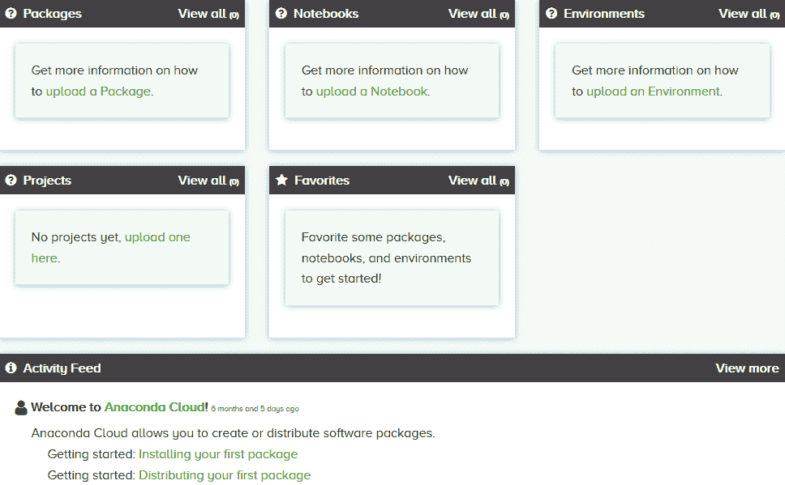

例如，如果你双击“安装你的第一个包”，你将获得更多关于**Anaconda Cloud**的信息。我们无需登录，甚至不需要云账户，就可以搜索、下载和安装公共包。只有在没有令牌的情况下访问私有包或分享包时，我们才需要一个账户。

# 深入了解 Jupyter Notebook

在本节中，许多例子来自以下网页：[`github.com/ipython/ipython-in-depth`](https://github.com/ipython/ipython-in-depth)。如果你有兴趣，可以访问该网页并下载 ZIP 文件。以下截图展示了示例内容：

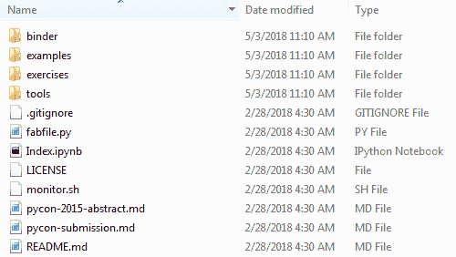

启动 Jupyter Notebook 后，我们可以搜索`example`子目录。例如，我们可以上传一个名为`factoring.ipynb`的笔记本，位于`Interactive Widgets`子目录下（见下图）：

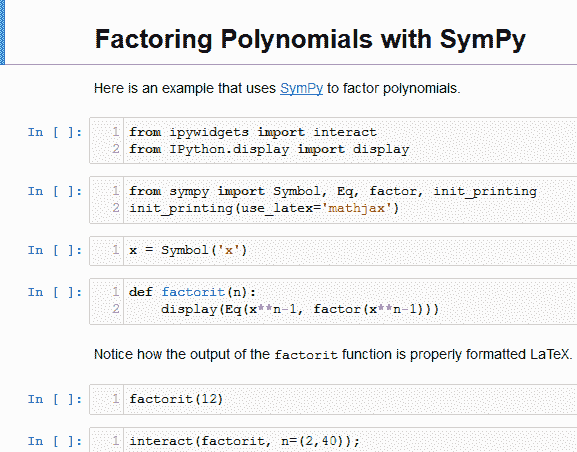

点击运行后，我们可以更改`n`的值（当我们选择变量为`8`时，结果如下）：

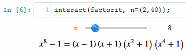

当`n`增加到`20`时，我们得到了相应的输出：


有时，在运行 Jupyter Notebook 并退出登录后，我们需要令牌或密码才能再次登录。我们可以运行以下代码来查找我们的令牌：

```py
Jupyter notebook list 
```

或者，我们可以运行以下代码将令牌保存到文本文件中：

```py
Jupyter notebook list > t.txt 
```

下一个示例展示了如何激活 Jupyter QtConsole，也就是如何使用 QtConsole 连接到现有的 IPython 内核。同样，Jupyter Notebook 也包含在前面的下载中。首先，我们上传名为`Connecting with the Qt Console.ipynb`的笔记本。为了节省空间，这里仅显示前几行：

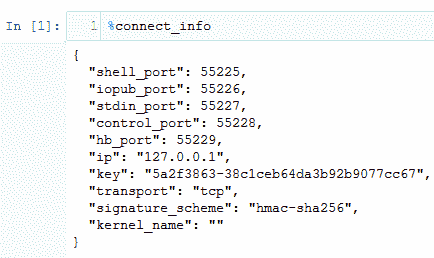

程序运行没有问题后，我们将看到以下窗口：

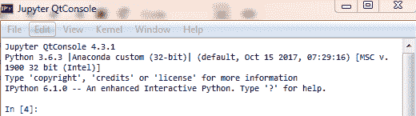

然后，我们在此输入命令。**QtConsole**是一个轻量级应用程序，类似于终端。然而，它提供了只有在图形界面中才能实现的许多增强功能，例如内联图形、带语法高亮的多行编辑和图形化的调用提示。QtConsole 可以使用任何 Jupyter 内核。以下是一个示例：

```py
import numpy as np 
from scipy.special import jn 
import matplotlib.pyplot as plt 
from matplotlib.pyplot import plot 
# 
x=np.linspace(0,3*np.pi) 
for i in range(6): 
    plot(x,jn(i,x)) 
# 
plt.show() 
```

相关图示如下：

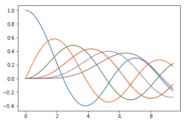

# Jupyter Notebook 格式

在本节中，我们讨论与 Jupyter Notebook 格式相关的问题的核心内容。

若要了解与 Jupyter Notebook 格式相关的更多信息，请参考此处有用的链接：[`nbformat.readthedocs.io/en/latest/`](https://nbformat.readthedocs.io/en/latest/)。首先，让我们看一个最简单的笔记本，`Custom Widget –Spreadsheet.ipynb`。它仅有五行，如下所示：

```py
{ 
 "cells": [], 
 "metadata": {}, 
 "nbformat": 4, 
 "nbformat_minor": 0 
} 
```

整个笔记本代码包含在一对大括号中。在最高层次，Jupyter 笔记本是一个字典，包含以下几个键：

+   `metadata`（`dict`）

+   `nbformat`（`int`）

+   `nbformat_minor`（`int`）

+   `cells`（`list`）

在上面的示例代码块中，`cells`和`metadata`都是空的。笔记本格式的值为`4`。通常情况下，自己生成一个简单程序并保存为 Jupyter Notebook 格式，然后查看其结构是一个好主意。接下来，让我们通过 Jupyter Notebook 生成一个简单的 Python 程序（见下方三行）：

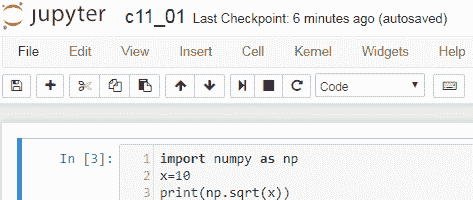

若要下载此程序，只需点击文件 | 下载为，并选择 Notebook（.ipynb）作为格式。以下是前面三行代码相关内容。它的文件名为`c11_01simplePython.ipynb`：

```py
{ 
 "cells": [ 
  { 
   "cell_type": "code", 
   "execution_count": null, 
   "metadata": { 
    "collapsed": true 
   }, 
   "outputs": [], 
   "source": [ 
    "# import numpy as npn", 
    "x=10n", 
    "print(np.sqrt(x))" 
   ] 
  } 
 ], 
 "metadata": { 
  "kernelspec": { 
   "display_name": "Python 3", 
   "language": "python", 
   "name": "python3" 
  }, 
  "language_info": { 
   "codemirror_mode": { 
    "name": "ipython", 
    "version": 3 
   }, 
   "file_extension": ".py", 
   "mimetype": "text/x-python", 
   "name": "python", 
   "nbconvert_exporter": "python", 
   "pygments_lexer": "ipython3", 
   "version": "3.6.3" 
  } 
 }, 
 "nbformat": 4, 
 "nbformat_minor": 2 
} 
```

# 笔记本共享

要共享笔记本或项目，请按照以下步骤操作：

1.  保存你的笔记本。

1.  通过运行 Anaconda 登录命令进行登录。

1.  要将你的笔记本上传到云端，请打开 Anaconda 提示符或终端，并输入以下命令：

```py
anaconda upload my-notebook.ipynb 
```

1.  为了检查，我们可以尝试访问[`notebooks.anaconda.org/<USERNAME>/my-notebook`](http://notebooks.anaconda.org/%3cUSERNAME%3e/my-notebook)链接，其中 USERNAME 是你的用户名。以下展示了一个例子，我们生成了一个简单的 Jupyter 笔记本，使用了之前的代码：

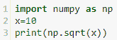

1.  假设我们将其下载为`c11_01.ipynb`*.* 首先，启动 Anaconda 提示符。

1.  移动到包含我们 Jupyter 笔记本的正确子目录。然后输入以下命令：

```py
 Anaconda upload c11_01.jpynb 
```

1.  相应的输出如下所示：

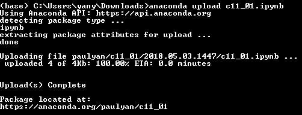

1.  上一张截图中的最后一条指令告诉我们，可以在[`anaconda.org/paulyan/c11_01`](https://anaconda.org/paulyan/c11_01)找到它（见下图）：

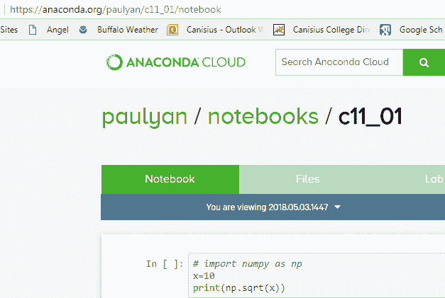

显然，在那之后，我们可以与合作伙伴或共同作者共享该链接。

# 项目共享

首先，让我们看看项目的定义。项目是一个包含`anaconda-project.yml`配置文件的文件夹，文件夹内有脚本（代码）、笔记本、数据集和其他文件。我们可以通过将名为`anaconda-project.yml`的配置文件添加到文件夹中，将文件夹加入到项目中。配置文件可以包括以下部分：命令、变量、服务、下载、包、通道和环境规范。数据科学家可以使用项目来封装数据科学项目并使其易于移植。项目通常会被压缩成`.tar.bz2`文件以便共享和存储。

**Anaconda Project** 自动化了设置步骤，这样你与之共享项目的人只需要以下命令就可以运行你的项目：

```py
anaconda-project run 
```

要安装 Anaconda Project，请键入以下命令：

```py
conda install anaconda-project 
```

Anaconda Project 封装了数据科学项目，使它们易于移植。它自动化了设置步骤，如安装正确的包、下载文件、设置环境变量和运行命令。Project 使得重新制作工作、与他人共享项目以及在不同平台上运行它们变得简单。它还简化了部署到服务器的过程。Anaconda 项目在你的机器上、其他用户的机器上或部署到服务器时运行相同。

传统的构建脚本，如`setup.py`，自动化项目的构建——从源代码到可运行的东西——而 Project 则自动化了运行项目的过程，处理构建产物，并在执行之前进行必要的设置。

我们可以在 Windows、macOS 和 Linux 上使用 Project。Project 是由 Anaconda Inc® 及其贡献者在三条款 BSD 许可证下支持并提供的。项目共享将节省我们大量时间，因为其他开发人员不会在已经完成的工作上浪费过多时间。以下是具体步骤：

1.  构建你的项目

1.  登录到 Anaconda

1.  从计算机上的项目目录中，输入以下命令：

```py
anaconda-project upload 
```

或者，在 Anaconda Navigator 中，在 Projects 标签页下，点击右下角的上传按钮，将项目上传到 Anaconda Cloud。

项目可以是任何代码和资源的目录。例如，项目通常包含笔记本或 Bokeh 应用程序。在这里，我们展示如何生成一个名为`project01`的项目。首先，我们需要进入正确的位置。假设我们选择了`c:/temp/`，关键命令如下所示：

```py
anaconda-project init --directory project01 
```

接下来，两个命令并排显示：

```py
$ cd c:/temp/ 
$ anaconda-project init --directory project01 
Create directory 'c:tempproject01'? y 
Project configuration is in c:tempproject01iris/anaconda-project.yml 
```

对应的输出如下所示：

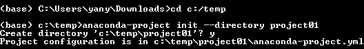

我们还可以通过切换到该目录并运行`anaconda-project init`（不带选项或参数）将任何现有目录转换为项目。我们可以使用 MS Word 打开`anaconda-project.yml`（以下显示的是前几行）：

```py
# This is an Anaconda project file. 
# 
# Here you can describe your project and how to run it. 
# Use `anaconda-project run` to run the project. 
# The file is in YAML format, please see http://www.yaml.org/start.html for more. 
# 
# Set the 'name' key to name your project 
# 
name: project01 
# 
# Set the 'icon' key to give your project an icon 
# 
icon: 
# 
# Set a one-sentence-or-so 'description' key with project details 
# 
description: 
# 
# In the commands section, list your runnable scripts, notebooks, and other code. 
# Use `anaconda-project add-command` to add commands. 
# 
```

有两种方法可以与他人共享我们的项目。首先，我们通过输入以下命令来归档项目：

```py
anaconda-project archive project01.zip 
```

然后，我们将 ZIP 文件通过电子邮件发送给我们的同事或其他人。共享项目的第二种方式是使用 Anaconda Cloud。首先登录到 Anaconda Cloud。从我们计算机上的项目目录中，输入`anaconda-project upload`，或者在 Anaconda Navigator 中，在 Projects 标签页下，点击右下角的上传按钮，将项目上传到 Anaconda Cloud。

# 环境共享

就计算机软件而言，操作环境或集成应用环境是用户可以执行软件的环境。通常，这样的环境由用户界面和 API 组成。在一定程度上，术语*平台*可以看作它的同义词。我们希望与他人共享我们的环境有很多原因。例如，他们可以重现我们做过的测试。为了让他们能够快速重建我们带有所有软件包和版本的环境，可以将你的`environment.yml`文件副本提供给他们。根据操作系统的不同，我们有以下方法导出环境文件。请注意，如果当前目录中已有`environment.yml`文件，执行此任务时它将被覆盖。

根据使用的操作系统，有不同的方法来激活`myenv`环境文件。对于 Windows 用户，在 Anaconda 提示符下输入以下命令：

```py
activate myenv 
```

在 macOS 和 Linux 系统中，在终端窗口输入以下命令：

```py
source activate myenv 
```

请注意，我们将`myenv`替换为环境的名称。要将我们当前活动的环境导出到新文件中，输入以下命令：

```py
conda env export > environment.yml 
```

若要共享，我们可以简单地通过电子邮件或复制导出的 `environment.yml` 文件给对方。另一方面，为了删除一个环境，我们可以在终端窗口或 Anaconda 提示符下运行以下代码：

```py
conda remove --name myenv --all 
```

或者，我们可以像这里一样指定名称：

```py
conda env remove --name myenv 
```

要验证环境是否已被移除，请运行以下命令：

```py
conda info --envs 
```

# 在本地复制他人环境

首先，我们可以通过以下命令导出我们的 Anaconda 环境：

```py
conda env export > myEnv.yml 
```

生成此文件后，可以使用记事本打开它（请参见以下几个输出文件的行）。为了节省空间，仅显示第一行和最后几行：

```py
name: base 
channels: 
  - anaconda 
  - defaults 
dependencies: 
  - bzip2=1.0.6=vc14h31cfb99_1 
  - curl=7.55.1=vc14h8488bd0_3 
  - freetype=2.8=vc14hfa46bb4_0 
  - hdf5=1.10.1=vc14h7c25517_0 
  - icu=58.2=vc14hbe8e9fa_0 
  - jpeg=9b=vc14h39a59fb_1 
  - libiconv=1.15=vc14h61b1384_5 
  - libpng=1.6.32=vc14hf267d31_3 
  - libssh2=1.8.0=vc14h91c0462_2 

  - xlrd=1.1.0=py36he7b893d_1 
  - xlsxwriter=1.0.2=py36hde92fec_0 
  - xlwings=0.11.4=py36h89f095e_0 
  - xlwt=1.3.0=py36hb79324b_0 
  - zict=0.1.3=py36hf291af1_0 
prefix: C:UsersyanyAppDataLocalContinuumanaconda3 
```

然后，接收上述文件的人可以通过以下命令重新创建它：

```py
conda env create -f myEnv.yml 
```

# 从 Anaconda 下载软件包

有时，用户可能会生成自己的软件包并上传到 Anaconda Cloud。对于一个团队项目，团队成员也可以这么做。因此，我们需要了解如何从 Anaconda Cloud 下载软件包。以下是一般的操作步骤：

1.  访问 [`anaconda.org`](http://anaconda.org)

1.  使用关键字或多个关键字搜索软件包，如此示例所示：

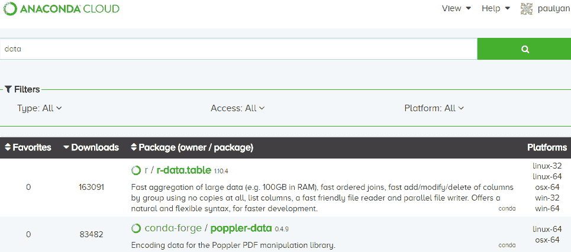

假设我们对 r-data.table 软件包感兴趣。

1.  执行以下命令：

```py
conda install -c r-data.table 
```

有时，我们可以生成一组函数并与他人共享。以下是一个简单示例。假设我们生成了以下带有多个函数的程序：

```py
def pv_f(r,n,fv): 
    """ 
    Objective: estimate present value 
           r : period rate 
           n : number of periods 
          fv : future value 
                           fv 
    formula used : pv = --------       
                        (1+r)**n 
    Example 1: >>>pv_f(0.1,1,100)   # meanings of input variables  
                 90.9090909090909   # based on their input order 
    Example #2 >>>pv_f(r=0.1,fv=100,n=1) # on keywords 
                 90.9090909090909 
    """ 
    return fv/(1+r)**n 
# 
def pvGrowingPerpetuity(c,r,q): 
    return(c/(r-q)) 
# 
def fv_f(pv,r,n): 
    return pv*(1+r)**n 
def fvAnnuity(r,n,c): 
    return c/r*((1+r)**n-1) 
# 
def fvAnnuityDue(r,n,c): 
    return c/r*((1+r)**n-1)*(1+r) 
```

为了节省空间，这里仅展示第一个函数的帮助信息。假设之前的函数叫做 `myfincal.py` 并保存在 `c:/temp` 下。我们可以使用以下命令生成 `myfincal.pyc` 并导入 `py_compile`。

```py
py_compile.compile('c:/temp/myfincal.py') 
```

我们已经生成了一组包含在 `fincal.pyc` 中的函数。如果你有兴趣，可以按照以下步骤下载并导入它：

1.  从 [`canisius.edu/~yany/python/fincal.pyc`](http://canisius.edu/~yany/python/fincal.pyc) 下载它。

1.  启动 Python 并尝试导入它。有几种方法可以使 `fincal.pyc` 可访问：

+   **方法 1**：假设文件保存在 `c:/temp/` 目录下。可以像截图右侧那样更改路径：

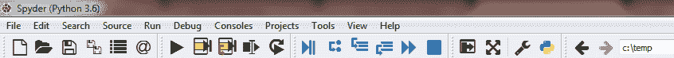

+   **方法 2**：将 `fincal.pyc` 复制到一个可访问的子目录下。要查看所有路径，执行以下代码：

```py
import sys 
sys.path 
```

输出如下所示。不同用户将会有不同的输出：

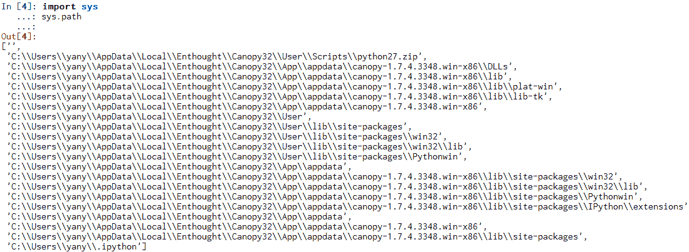

现在，只需将 `fincal.pyc` 复制到上述子目录之一即可。

+   **方法 3**：改为添加路径，见下面的代码：

```py
import sys 
sys.path.append('c:\temp') 
```

我们可以执行 `sys.path` 来检查，见以下截图：

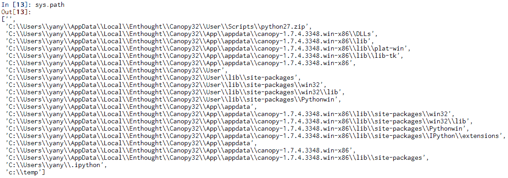

注意，如果我们想删除路径，可以使用以下代码：

```py
import sys 
sys.path.remove('c:\temp') 
```

1.  现在，我们可以导入该模块，见下面的代码：

```py
import fincal 
x=dir(fincal) 
print(x) 
```

相关输出如下所示：

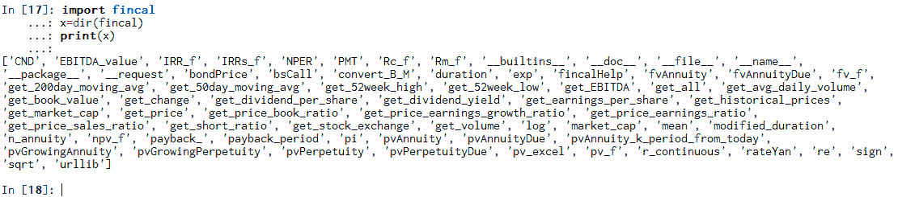

请注意，由于 Yahoo!Finance 和 Google Finance 改变了它们的数据结构，许多与从它们的网站下载数据相关的功能将无法使用。

# 总结

在本章中，我们讨论了 Anaconda Cloud。内容包括深入探讨 Jupyter Notebook，Jupyter Notebook 的不同格式，如何与伙伴共享笔记本，如何在不同平台间共享项目，如何共享工作环境，以及如何在本地复制他人的环境。

在下一章中，我们将讨论分布式计算和 Anaconda Accelerate。当我们的数据或任务变得更加复杂时，我们将需要一个良好的系统或一套工具来处理数据并运行复杂的算法。为此，分布式计算是一个解决方案。具体来说，我们将解释许多概念，例如计算节点、项目附加组件、并行处理、数据并行的高级 Python 等。除此之外，我们还将提供几个示例，展示如何使用分布式计算。

# 复习问题和练习

1.  *云* 是什么意思？

1.  *云计算* 是什么意思？

1.  为什么我们关心与他人共享我们的工作环境？

1.  我们如何在 Anaconda Cloud 上注册？

1.  用户需要账户才能使用 Anaconda Cloud 平台吗？

1.  我们如何将笔记本上传到 Anaconda Cloud？

1.  为什么共享我们的项目很重要？

1.  如何共享你的项目？创建一个项目并与他人共享。

1.  如何重建你伙伴的 Anaconda 环境？

1.  以下两行命令的含义是什么：

```py
conda remove --name myenv -all 
conda info -envs 
```

1.  如何启动 Jupyter QtConsole？

1.  在 `examples/Builtin Extension` 子目录下运行名为 `Octave Maric.ipynb` 的 Jupyter 笔记本。请注意，首先你需要找到方法安装一个名为 `octavemagic` 的包。

1.  与他人共享你的环境，以查看效果。

1.  围绕一个主题生成一组函数，并生成相应的 `.pyc` 文件，与同事或合作伙伴共享。
