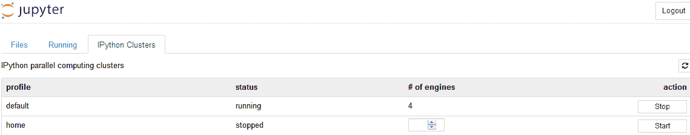

# 第十二章：分布式计算、并行计算和 HPCC

由于我们的社会已经进入数据密集型时代（即大数据时代），我们面临着越来越大的数据集。因此，企业和用户正在考虑在处理数据时可以使用哪些工具来加速过程。一个显而易见的解决方案是增加他们的数据存储容量。不幸的是，这涉及到巨大的成本。其他解决方案包括分布式计算以及一些加速我们的过程的方法。

在本章中，我们将讨论以下主题：

+   分布式计算与并行计算的简介

+   理解 MPI

+   Python 中的并行处理

+   计算节点

+   Anaconda 附加组件

+   HPCC 简介

# 分布式计算与并行计算的简介

分布式计算是计算机科学的一个子领域，研究分布式系统和模型，其中位于网络计算机上的组件通过传递消息进行通信和协调操作。这些组件相互作用，以实现共同的目标。

值得讨论的另一个短语是：并行计算。并行计算与多线程紧密相关，或如何充分利用单个 CPU，而分布式计算则涉及分而治之的概念，在不同的机器上执行子任务，然后合并结果。

由于我们已经进入了所谓的大数据时代，似乎这种区分正在消失。事实上，现在许多系统采用了并行计算和分布式计算的结合方式。

# 并行处理的任务视图

对于 R，存在一个任务视图叫做**使用 R 进行高性能和并行计算**。回顾一下，任务视图是围绕特定主题的一组 R 程序。为了找到**使用 R 进行高性能和并行计算**的任务视图，我们访问 [`r-project.org`](http://r-project.org)，点击左侧的 CRAN，选择一个附近的镜像位置，然后点击 Packages 和 Task Views。

双击任务视图后，我们可以看到以下列表——为了节省空间，仅显示了顶部的任务视图：


双击相关的任务视图（**HighPerformanceComputing**）后，我们可以看到以下截图——为了节省空间，仅显示了顶部几行：

****

上面的任务视图包含了一些包的列表，这些包按照不同的主题进行分组，可能对**高性能计算**（**HPC**）与 R 语言的结合有用。在此背景下，任务视图的维护者将高性能计算的定义相当宽泛，只要是与推动 R 向前发展相关的内容，都会涉及其中：使用编译代码、并行计算（包括显式和隐式模式）、处理大对象以及性能分析。上述任务视图可以在[`CRAN.R-project.org/view=HighPerformanceComputing`](https://CRAN.R-project.org/view=HighPerformanceComputing)下载。如前几章所讨论的，我们可以使用以下命令来安装所有相关的 R 包：

```py
install.packages("ctv") 
library("ctv") 
install.views("HighPerformanceComputing") 
```

2018 年 5 月 14 日，通过运行之前的代码，下载并安装了 217 个相关的 R 包。

# Python 中的示例程序

对于 Python 并行计算程序，我们可以访问*IPython 深入教程*，网址为[`github.com/ipython/ipython-in-depth`](https://github.com/ipython/ipython-in-depth)。下载 ZIP 文件并解压后，我们可以找到与并行计算相关的程序（参考下面的两张截图）：


上面的截图显示了几个子目录，而下面的截图展示了包括 Jupyter Notebook 和 Python 程序在内的 19 个程序：


# 理解 MPI

通常，平行算法需要在不同引擎之间移动数据。做到这一点的一个方法是通过直接视图先进行拉取再推送。然而，这种方法非常缓慢，因为所有数据都必须经过控制器到达客户端，然后再通过控制器返回到最终目标。一个更好的方法是使用消息传递库，比如**消息传递接口**（**MPI**）。IPython 的并行计算架构已经设计成可以与 MPI 集成。要下载并安装 Windows 版本的 MPI，读者可以参考[`msdn.microsoft.com/en-us/library/bb524831%28v=vs.85%29.aspx`](https://msdn.microsoft.com/en-us/library/bb524831%28v=vs.85%29.aspx)。

此外，你还可以安装`mpi4py`包。

# R 包 Rmpi

要找到与`Rmpi`包相关的示例，我们可以执行以下两行代码：

```py
library(Rmpi) 
demo() 
```

按下*Enter*键后，我们将看到以下输出：


对于第一个函数，叫做`cslavePI`，我们知道应该将`cslavePI.c`从 Rmpi 库目录复制到工作目录，并使用`mpicc -o cslavePI cslavePI.c`编译它。要找到 Rmpi 的路径，我们可以执行`find.package()`函数（参考以下代码和结果）：

```py
> find.package("Rmpi") 
[1] "C:/Users/yany/Documents/R/win-library/3.4/Rmpi" 
```

请注意，不同的读者将得到不同的路径。我们可以使用`demo(cslavePI)`来查找它的功能。参考代码和相关的输出，如下所示：


mpicc 软件用于编译和链接用 C 语言编写的 MPI 程序。

# R 包 plyr

`plyr` R 包的目标是实现 R 中的拆分-应用-组合范式。这在数据分析中非常常见：我们通过将一个复杂问题分解为小块，对每个块做一些处理，然后将结果重新合并。以下是一个来自其菜单的示例，经过小幅修改：

```py
library(plyr) 
d1<-c(rep('A', 8), rep('B', 15), rep('C', 6)) 
d2<-sample(c("M", "F"), size = 29, replace = TRUE) 
d3<-runif(n = 29, min = 18, max = 54) 
# 
dfx <- data.frame(group =d1,sex=d2,age=d3) 
# 
ddply(dfx, .(group, sex), summarize, 
 mean = round(mean(age), 2), 
 sd = round(sd(age), 2)) 
# 
ddply(baseball[1:100,], ~ year, nrow) 
ddply(baseball, .(lg), c("nrow", "ncol")) 
rbi<-ddply(baseball, .(year), summarise, 
      mean_rbi=mean(rbi, na.rm = TRUE)) 
plot(mean_rbi~year,type="l",data = rbi) 
base2<-ddply(baseball,.(id),mutate, 
    career_year = year - min(year) + 1 
) 
```

为了节省空间，这里仅显示图形：


`arrange()`函数按数据框的列进行排序（参考以下代码）：

```py
library(datasets) 
library(plyr) 
data(mtcars) 
# 
d1<-mtcars[with(mtcars, order(cyl, disp)), ] 
d2<-arrange(mtcars, cyl, disp) 
myCars = cbind(vehicle=row.names(mtcars), mtcars) 
d3<-arrange(myCars, cyl, disp) 
d4<-arrange(myCars, cyl, desc(disp)) 
```

# R 包 parallel

首先，让我们看一下 R 函数`lapply()`的简单用法（参考以下代码）：

```py
> lapply(1:3,function(x) c(sin(x),x²)) 
[[1]] 
[1] 0.841471 1.000000 
[[2]] 
[1] 0.9092974 4.0000000 
[[3]] 
[1] 0.14112 9.00000 
```

含义很明确：我们有`1`、`2`和`3`这三个输入值，并将它们分配给三个函数。以下示例稍微复杂一些：

```py
myFunctions<-c(sin(x),x²+2,4*x²-x³-2) 
inputValue<-1:10 
output<-lapply(inputValue,function(x) myFunctions) 
```

前几行输出如下所示：


以下示例来自于*Gordon*（2015）：

```py
library(parallel) 
n_cores <- detectCores() - 1 
cl <- makeCluster(n_cores) 
parLapply(cl, 2:4,function(exponent) 2^exponent) 
stopCluster(cl) 
```

在前面的代码中，`makeCluster()`函数将设置集群。`parLapply()`函数调用`lapply()`的并行版本或`parLapply()`函数。输出如下所示：

```py
 [[1]] 
[1] 4 

[[2]] 
[1] 8 

[[3]] 
[1] 16 
```

对于以下代码，我们将看到一个错误信息：

```py
c2<-makeCluster(n_cores) 
base <- 2 
parLapply(c2, 2:4, function(exponent) base^exponent) 
stopCluster(c2) 
```

错误信息如下：

```py
Error in checkForRemoteErrors(val) :  
  3 nodes produced errors; first error: object 'base' not found 
```

为了修正这个问题，将添加基变量（参考以下代码）。

```py
c3<-makeCluster(n_cores) 
base <- 2 
clusterExport(c3, "base") 
parLapply(c3, 2:4, function(exponent)  base^exponent) 
stopCluster(c3) 
```

为了节省空间，输出将在此不显示。以下是另一个示例，展示调用`lapply()`和`mclapply()`函数之间的区别：

```py
library(parallel) 
detectCores() 
myFunction<- function(iter=1,n=5){ 
    x<- rnorm(n, mean=0, sd=1 ) 
    eps <- runif(n,-2,2) 
    y <- 1 + 2*x + eps 
    result<-lm( y ~ x ) 
    final<-cbind(result$coef,confint(result)) 
    return(final)  
} 
# 
m<-5000
n2<-5000
system.time(lapply(1:m,myFunction,n=n2))
system.time(mclapply(1:m,myFunction,n=n2))
```

输出如下所示：

```py
> system.time(lapply(1:n,myFunction,n=n2)) 
 user  system elapsed  
  63.97    3.26   22.49
> system.time(mclapply(1:n,myFunction,n=n2)) 
 user  system elapsed  
  63.33 3.28 22.26 
```

在前面的代码中，使用了`lappy()`和`mclappy()`函数。`mclapply()`函数是`lapply()`函数的并行化版本。它返回一个与`X`长度相同的列表，每个元素都是将`FUN`应用于`X`中相应元素的结果。以下程序来自于[`www.smart-stats.org/wiki/parallel-computing-cluster-using-r`](http://www.smart-stats.org/wiki/parallel-computing-cluster-using-r)，并经过了少量修改。请注意，程序是在 UNIX 上运行的，而不是 PC：

```py
library(snow) 
library(parallel) 
#library(Rmpi) 
myFunction<-function(n) { 
    a<-rnorm(n) 
    final<-log(abs(a))+a³+2*a; 
    return(final) 
} 
nCores=11; 
#Using multicore 
system.time(mclapply(rep(5E6,11),myFunction,mc.cores=nCores)) 
#Using snow via MPI 
system.time(sapply(rep(5E6,11),myFunction)) 
#cl <- getMPIcluster() 
cl <- makeCluster(c("localhost","localhost"), type = "SOCK") 
system.time(parSapply(cl,rep(5E6,11),myFunction)) 
```

相关输出如下所示：

```py
> system.time(mclapply(rep(5E6,11),myFunction,mc.cores=nCores)) user  system elapsed 
  4.440   1.075   1.926 > system.time(sapply(rep(5E6,11),myFunction)) user  system elapsed 
 10.294   0.992  11.286 > system.time(parSapply(cl,rep(5E6,11),myFunction)) user  system elapsed 
  0.655   0.626   7.328 > proc.time() user  system elapsed 
 15.621   2.936  22.134 
```

# R 包 snow

该包用于**简单工作站网络**（**SNOW**）。让我们来看一个与销毁相关的程序：

```py
library(snow) 
cl <- makeSOCKcluster(c("localhost","localhost")) 
clusterApply(cl, 1:2, get("+"), 3) 
clusterEvalQ(cl, library(boot)) 
x<-1 
clusterExport(cl, "x") 
clusterCall(cl, function(y) x + y, 2) 
```

`makeSOCKcluster()` 函数用于启动和停止 `snow` 集群，并设置默认的集群选项。`clusterApply()` 在第一个集群节点上调用该函数，参数为 `seq[[1]] and ...`，在第二个节点上调用 `seq[[2]] and ...`，以此类推。如果 `seq` 的长度大于集群节点的数量，则会回收集群节点。返回一个结果列表；结果列表的长度将等于 `seq` 的长度。`clusterCall()` 在集群 `cl` 中每个节点上使用相同的参数调用函数，并返回结果列表。`clusterEvalQ()` 函数在每个集群节点上评估一个字面表达式。它是 `evalq` 的集群版本，是一个基于 `clusterCall()` 的便捷函数。

# Python 中的并行处理

以下示例关于计算 π 的数字，摘自网站 [`ipyparallel.readthedocs.io/en/latest/demos.html#parallel-examples`](http://ipyparallel.readthedocs.io/en/latest/demos.html#parallel-examples)。由于第一部分需要一个名为 `one_digit_freqs()` 的函数，我们可以运行一个名为 `pidigits.py` 的 Python 程序，该程序包含在 `.../ipython-ipython-in-depth-4d98937\examples\Parallel Computing\pi` 路径下，该路径取决于读者下载并保存文件的位置。

为了完成我们的部分，我们只需将其包含在程序的第一部分，如下所示：

```py
import matplotlib.pyplot as plt
import sympy
import numpy as np 
#
def plot_one_digit_freqs(f1):
    """
    Plot one digit frequency counts using matplotlib.
    """
    ax = plt.plot(f1,'bo-')
    plt.title('Single digit counts in pi')
    plt.xlabel('Digit')
    plt.ylabel('Count')
    return ax
#
def one_digit_freqs(digits, normalize=False):
    """
    Consume digits of pi and compute 1 digit freq. counts.
    """
    freqs = np.zeros(10, dtype='i4')
    for d in digits:
        freqs[int(d)] += 1
    if normalize:
        freqs = freqs/freqs.sum()
    return freqs
#
pi = sympy.pi.evalf(40)
pi
pi = sympy.pi.evalf(10000)
digits = (d for d in str(pi)[2:]) # create a sequence of digits
freqs = one_digit_freqs(digits)
plot_one_digit_freqs(freqs)
plt.show()
```

相关的图表如下所示：


# 词频的并行处理

首先，让我们来看一个简单的 Python 程序，找出输入文本文件中最常用的单词。我们随机选择了《达·芬奇密码》，可以在 [`www.gutenberg.org/files/5000/5000-8.txt`](http://www.gutenberg.org/files/5000/5000-8.txt) 找到。假设下载的小说保存在 `c:/temp/daVinci.txt` 下。以下 Python 代码将列出最常用的前 10 个单词：

```py
text = open("c:/temp/daVinci.txt",'r').read().lower() 
def byFreq(pair): 
    return pair[1] 
for ch in '!"#$%&()*+,-./:;<=>?@[\]^_`{|}~': 
    text = text.replace(ch, ' ') 
    words = text.split() 
counts = {} 
for w in words: 
    counts[w] = counts.get(w,0) + 1 
n = 10   # for the first n most frequetly used words 
words= list(counts.items()) 
words.sort() 
words.sort(key=byFreq, reverse=True) 
for i in range(n): 
    word, count =words[i] 
    print("{0:<15}{1:>5}".format(word, count)) 
```

相关的输出结果如下所示：

```py
the            22989 
of             11232 
and             8434 
in              5750 
to              5313 
a               4725 
is              4273 
it              3071 
that            2902 
which           2545 
```

# 并行蒙特卡洛期权定价

这个示例来自之前讨论的 Python 示例程序。该笔记本展示了如何使用 `ipyparallel` 包进行蒙特卡洛期权定价的并行计算。该笔记本计算了不同执行价格和波动率下大量期权的价格。

为了节省空间，这里只给出了代码的前几行：

```py
%matplotlib inline 
import matplotlib.pyplot as plt 
import sys 
import time 
from ipyparallel import Client 
import numpy as np 
price = 100.0  # Initial price 
rate = 0.05  # Interest rate 
days = 260  # Days to expiration 
paths = 10000  # Number of MC paths 
n_strikes = 6  # Number of strike values 
min_strike = 90.0  # Min strike price 
max_strike = 110.0  # Max strike price 
n_sigmas = 5  # Number of volatility values 
min_sigma = 0.1  # Min volatility 
max_sigma = 0.4  # Max volatility 
# (more ....) 
```

要运行它，点击 IPython Clusters。在右侧点击 IPython Clusters 后，我们将看到以下截图：


我们可以点击“启动”以使用默认设置。引擎数量会显示为 `4`，如下所示：



现在，我们回到我们上传的 Jupyter Notebook，进行并行蒙特卡洛期权定价。总共有四个输出图像。为了节省空间，这里只显示第一个：


请注意，使用股票平均价格作为最终终端价格的亚洲看跌期权的支付函数如下所示，其中 *Put(Asian)* 是亚洲看跌期权，*K* 是执行价格，而  是路径上的平均价格：


# 计算节点

计算节点提供短暂存储、网络、内存和处理资源，这些资源可以被虚拟机实例消耗。云系统支持两种类型的计算节点：**ESX 集群**，其中集群在 VMware vCenter Server 中创建，以及 **KVM 计算节点**，其中 KVM 计算节点是手动创建的。在前一章中，我们提到了云的概念。

在云环境中，这对于更复杂的项目非常有用，计算节点是资源的核心。通常，这些节点提供虚拟机实例所需的处理、内存、网络和存储。当实例被创建时，它会与具有可用资源的计算节点匹配。一个计算节点可以托管多个实例，直到其所有资源被消耗完。

# Anaconda 附加组件

以下信息来自 Anaconda 附加组件开发指南。

Anaconda 附加组件是一个 Python 包，其中包含一个包含 `__init__.py` 文件和其他源目录（子包）的目录。因为 Python 只允许每个包名称导入一次，所以包的顶级目录名称必须是唯一的。同时，名称可以是任意的，因为附加组件会根据名称加载；唯一的要求是它们必须放在特定的目录中。

因此，建议的附加组件命名约定类似于 Java 包或 D-Bus 服务名称：将附加组件名称的前缀设置为贵组织的反向域名，使用下划线（_）代替点号，这样目录名称就是一个有效的 Python 包标识符。根据这些建议的命名约定，附加组件名称示例如 `org_fedora_hello_world`。此命名约定遵循了 Python 包和模块名称的推荐命名方案。感兴趣的读者可以在 [`rhinstaller.github.io/anaconda-addon-development-guide/index.html#sect-anaconda-introduction-addons`](https://rhinstaller.github.io/anaconda-addon-development-guide/index.html#sect-anaconda-introduction-addons) 查找有关 Anaconda 附加组件的更多信息。

# HPCC 简介

HPCC 代表 **高性能计算集群**。它也被称为 **数据分析超级计算机** (**DAS**)，是 LexisNexis Risk Solutions 开发的一个开源、数据密集型计算系统平台。HPCC 平台包含一种在计算集群上实现的软件架构，提供高性能、数据并行处理设计，用于使用大数据的各种应用。HPCC 平台包括支持并行批量数据处理（Thor）和高性能在线查询应用程序（Roxie）的系统配置，这些应用程序使用索引数据文件。HPCC 平台还包括一种数据中心声明式编程语言，用于并行数据处理，称为 ECL。

你可以在 [`research-it.wharton.upenn.edu/documentation/`](https://research-it.wharton.upenn.edu/documentation/) 查看 Wharton HPCC 系统的一个简单示例。Wharton 的 HPC 集群（HPCC）为 Wharton 教职工、教职工合作者、研究助理以及 Wharton 博士生提供先进的计算研究硬件和软件。它旨在通过一组紧密集成的硬件，配备专用的网络和存储，进行简单且并行的处理。

关于硬件的更多信息，请参阅硬件页面。HPCC 用户可以访问多种科学、数学和分析软件，包括 MATLAB、Mathematica、R、Stata 和 SAS。也可以提供 MySQL 服务器访问权限。HPCC 还具备 GNU 和 Intel 版本的 Fortran、C 和 C++ 编译器。以下是连接到 HPCC 平台的简单步骤：

1.  首先，下载并安装 FortClient 和 MobaXterm 软件

1.  通过 FortClient 连接到 Wharton VPN（如下图所示）：


1.  连接后，以下界面将出现：


1.  使用 MobaXterm 软件连接到 Wharton 的 HPCC 平台。这里假设你已经有 Wharton 的账号（参见下图）：


1.  现在，我们可以进行连接，如下图所示：


1.  现在，用户将编写自己的程序，利用 HPCC 加速他们的研究和实验。更多信息，请参考 [`research-it.wharton.upenn.edu/documentation/`](https://research-it.wharton.upenn.edu/documentation/) 上的文档。

# 总结

在本章中，我们讨论了几个 R 包，如 `plyr`、`snow`、`Rmpi` 和 `parallel`，以及 Python 包 `ipyparallel`。此外，我们还提到了计算节点、项目插件、并行处理和 HPCC。

现在，我们已经走到了旅程的尽头。我们祝愿你在未来的冒险中好运，并且能够利用从本书中学到的知识去做一些了不起的事情。

# 回顾问题和练习

1.  什么是分布式计算？它有什么用？

1.  我们可以从哪里获得并行计算的任务视图？

1.  从与并行计算相关的任务视图中，我们可以找到许多 R 包。找出其中的一些包。安装两个并展示使用这两个包的示例。

1.  使用以下方式进行词频分析：亚历山大·仲马的《基督山伯爵》（输入文件在 [`www.gutenberg.org/files/1184/1184-0.txt`](http://www.gutenberg.org/files/1184/1184-0.txt)）。

1.  我们可以从哪里找到更多关于 Anaconda 插件的信息？

1.  什么是 HPCC，它是如何工作的？

1.  我们如何找到已安装的 R 包的路径？

1.  在关于并行蒙特卡洛期权定价的示例 Jupyter 笔记本中，相关的亚洲期权在此定义，其中 `call(Asian)` 是亚洲看跌期权，`Put(Asian)`，*K* 是行使价格，且  是路径上的平均价格：


编写一个 Jupyter 笔记本，使用以下亚洲期权的定义：


1.  在本章中，我们提到可以使用以下三行代码来下载与高性能计算相关的所有 R 包：

```py
install.packages("ctv") 
library("ctv") 
install.views("HighPerformanceComputing") 
```

尝试这个并报告下载了多少个 R 包。

1.  查找与 R 包 `Rmpi` 相关的更多示例。

1.  运行名为 `Using MPI` 的示例 Jupyter 笔记本，文件为 `IPython Parallel.ipynb`。解释其含义。

1.  R 的 `doRNG` 包提供了执行可重现的并行 `foreach` 循环的函数，使用由 `rstream` 包生成的独立随机流，适用于不同的 `foreach` 后端。下载并安装此包及其他相关包。展示一些示例。
