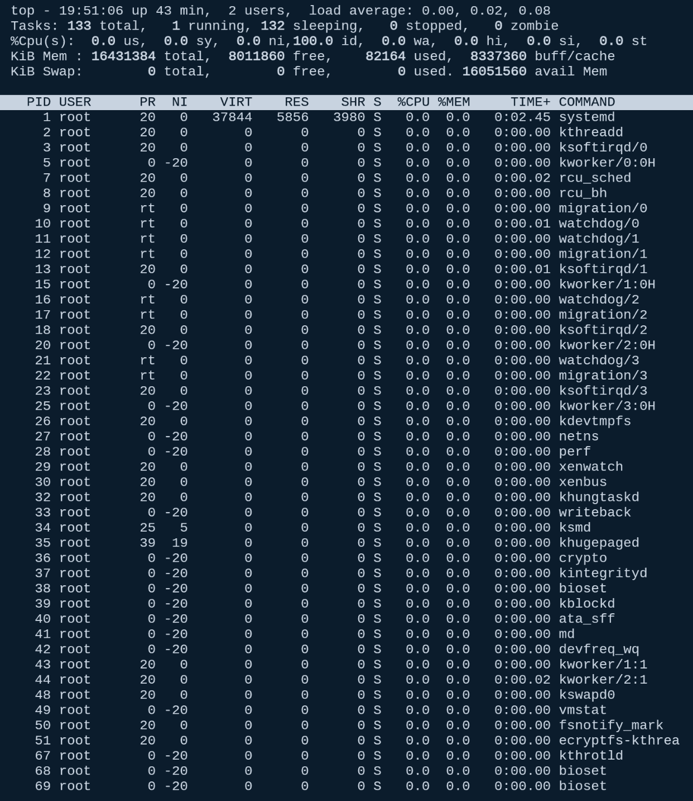
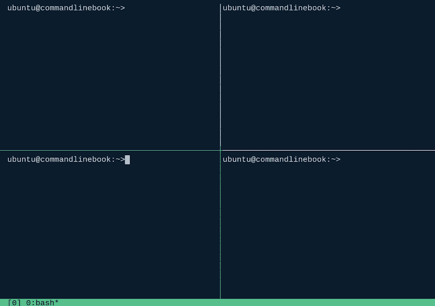

# 第三章：Shell 工作流、数据获取与处理

在这一章中，我们将处理一个实际的数据集并进行一些基本的分析。我们将学习如何从命令行直接下载文件，确定文件类型，并使用多个命令解析数据。我们还将介绍如何执行非交互式的脱离式处理，并回顾一些常见的终端复用器，它们能让我们美化命令行并组织脱离式处理。

在这一章中，我们将涵盖以下主题：

+   如何使用命令行下载数据集

+   使用内建工具检查数据及其类型

+   如何在 bash 中执行字数统计

+   使用一些简单的命令分析数据集

+   脱离式处理

+   终端复用器

# 下载数据

既然我们已经对命令行有了基本了解，那我们来做一些有趣的事情吧！假设我们有一些来自 Amazon 的书评数据集，而我们只想查看关于 Packt 出版社的评论。首先，我们先获取数据（如果你使用的是 Docker 容器，数据位于 `/data`）：

```py
curl -O https://s3.amazonaws.com/amazon-reviews-pds/tsv/amazon_reviews_us_Digital_Ebook_Purchase_v1_00.tsv.gz && curl -O https://s3.amazonaws.com/amazon-reviews-pds/tsv/amazon_reviews_us_Digital_Ebook_Purchase_v1_01.tsv.gz
```

你应该能看到以下内容：


我们在这里介绍了一些新命令和功能来下载文件。首先，我们使用 `curl` 命令来下载文件。你可以运行 `curl --help` 来查看所有可用选项，或者运行 `man curl`，但是我们想下载一个远程文件并保存为原始文件名，因此使用了 `-O` 选项。其次，注意双重与号（`&&`）吗？因为我们想同时下载两个文件（并确保没有错误），双重与号让我们能够将两个命令组合在一起。如果第一个命令失败，第二个命令就不会运行。

现在你可能会问自己，“如果我想运行多个命令，并且不在乎第一个命令是否失败，我希望它仍然执行！”好消息来了！如果你用分号替换双重与号，`ecoh "this isn't a command" ; echo "but this is"`，你应该能看到以下内容：


Ubuntu 自带一个小帮手，如果你输入命令时拼写错误，它会建议你应该输入的命令。如果你在其他系统上运行，可能不会看到这个提示，但你会看到类似 `ecoh: command not found` 的错误信息。

# 使用 file 命令

一旦数据下载完成，让我们来看一下我们得到了什么。运行 `ls -al amazon*` 来确保文件确实下载好了：


如果你在这个目录下还有其他名为 `amazon` 的文件，它们也会显示出来。文件下载完成后，让我们介绍一个新命令，叫做 `file`。接下来运行以下命令 `file amazon*`：


哇，`file`命令在没有任何参数的情况下，竟然能够识别出这是一个压缩档案。你将会经常使用`file`命令来确定你正在处理的文件类型。现在，让我们解压这些文件，这样我们就可以处理它们了。根据你系统的速度，这可能需要一点时间。

为此，执行以下命令：

```py
zcat amazon_reviews_us_Digital_Ebook_Purchase_v1_00.tsv.gz >> amazon_reviews_us_Digital_Ebook_Purchase_v1_00.tsv && zcat amazon_reviews_us_Digital_Ebook_Purchase_v1_01.tsv.gz >> amazon_reviews_us_Digital_Ebook_Purchase_v1_01.tsv
```

再次运行`file`命令来检查新的数据集。注意到什么不同了吗？请查看以下内容：


非常酷！`file`命令成功验证了我们正在处理文本文件，并且这些文件似乎包含了大量长行文本。让我们查看并提取其中一个数据集，看看我们在处理什么。为此，我们可以使用`more`命令：

```py
more amazon_reviews_us_Digital_Ebook_Purchase_v1_01.tsv
```

我们将只取样本中的第一个文件：


的确是非常长的行！你可以不断按空格键来查看文件（不过阅读整个文件可能需要一段时间），如果你想退出，按下*Q*键即可。别忘了执行`man more`以获取更多关于 more 命令的信息。

# 执行词数统计

现在我们有了一些数据来处理，接下来让我们将两个文件合并成一个文件。为此，请执行以下操作：

```py
cat *.tsv > reviews.tsv
```

运行前面的命令后，你应该看到如下内容：


很好。假设我们想统计这个文件中的单词或行数。让我们来介绍一下`wc`命令。`wc`是“word count”（词数统计）的缩写。让我们快速执行`man wc`查看可用选项：


看起来`wc`命令可以统计文件的行数以及单词数。让我们看看这个文件实际上有多少行：

```py
wc -l reviews.tsv
```

运行前面的命令后，你应该看到如下内容：


行数确实不少！那单词数呢？执行以下命令：

```py
wc -w reviews.tsv
```


这个数据集看起来是一个很不错的选择。虽然它并不算大数据，但我们可以做很多有趣的事情。例如，你是否注意到之前文件中的标题？由于屏幕上显示了很多数据，它有点难以看清。让我们只提取标题部分，看看我们得到的是什么：

```py
head -n1 reviews.tsv
```

运行前面的命令后，你应该看到如下内容：


很好，现在我们有了一份可以使用的标题列表。让我们稍微整理一下。如果我们只对`produce_title`、`star_rating`、`review_headline`和`review_body`这几列感兴趣，复制粘贴整个文件将需要花费很长时间。因此，让我们介绍一个新的命令`cut`。

# 剪切命令简介

在你运行命令之前，我们先来分析一下它。`cut` 命令用于删除文件中每行的部分内容。`-d` 参数告诉 `cut` 我们正在处理 **tsv**（**制表符分隔值**），而 `-f` 参数告诉 `cut` 我们感兴趣的字段。由于 `product_title` 是文件中的第六个字段，我们从这里开始：

```py
cut -d$'\t' -f 6,8,13,14 reviews.tsv | more
```

与大多数程序不同，`cut` 从 1 开始，而不是从 0。

让我们看看结果：


好得多！让我们将其保存为一个新文件：

```py
cut -d$'\t' -f 6,8,13,14 reviews.tsv > stripped_reviews.tsv
```

下面是你在运行前述命令后应该看到的内容：


让我们来看一下 `Packt` 这个词在这个数据集中出现了多少次：

```py
grep -i Packt stripped_reviews.tsv | wc -w
```

下面是你在运行前述命令后应该看到的内容：


让我们将 `.tsv` 转换为 `.csv`，这样我们可以获得更多结构化的数据：

```py
cat stripped_reviews.tsv | tr "\\t" "," > all_reviews.csv
```

下面是你在运行前述命令后应该看到的内容：


现在，让我们继续筛选出所有包含 `Packt` 的评论：

```py
cat all_reviews.csv | awk -F ","  '{print $4}' | grep -i Packt
```

下面是你在运行前述命令后应该看到的内容：


有意思！使用你刚学到的命令，接着玩玩这个数据集吧。

我们将在第五章《循环、函数和字符串处理》中进一步讨论`tr`命令；现在，暂时不用担心它。

# 分离处理

分离处理在后台运行一个命令。这意味着终端控制会立即返回给 Shell 进程，而分离的进程则在后台运行。通过作业控制，这些后台进程可以被恢复到前台或直接终止。

# 如何将进程放入后台

还记得我们使用双重和符号来有条件地执行两个命令，命令一个接着一个运行吗？通过使用单个和符号，你可以将一个进程放入后台并让它运行。我们使用该命令将数据保存为新文件并在后台运行：

```py
cat all_reviews.csv | awk -F ","  '{print $4}' | grep -i Packt > background_words.txt &
```

这将会使用前面提到的示例，但会在后台运行，如下所示：


注意 `<output> [1] 1504</output>` 这行输出（避免了所有输出！）显示该作业已经成功在后台运行。你可以运行 `tail -F background_words.txt` 以实时查看后台运行的数据：


要将作业从 **bg**（**后台**）恢复到前台，输入 `fg`，你就能像这样把进程带回前台：


继续运行几个后台命令。你可以使用 `jobs` 命令查看它们。想了解更多选项，可以输入 `man jobs` 查阅 `jobs` 命令的手册。

# 忽略 SIGHUP

默认情况下，命令会附加到它们控制的命令行终端。当命令行终止时，子进程（无论是否在后台运行）会收到一个 SIGHUP 信号并应该终止。假设你想运行一个命令并在退出时保持它继续运行，`nohup` 就派上用场了，尤其是当你在远程系统上工作并需要退出，或者你担心与服务器的连接总是断开（我在看你，Amtrak WiFi）。

继续运行我们之前执行的命令，但在前面加上`nohup`，像这样：

```py
nohup cat all_reviews.csv | awk -F ","  '{print $4}' | grep -i Packt > background_words.txt &
```

现在，通过输入 `logout` 或使用 `control-d` 来退出你的 shell，然后重新打开 shell 并运行 `tail` `-f background_words.txt`。你会注意到，命令仍然在后台运行，文件也在不断更新。你可能尝试通过输入 `fg` 来恢复命令，但会发现它没有生效。记住，`nohup` 命令会一直运行直到完成、失败，或者你用 `kill` 杀掉进程。随时可以查看 `kill` 的手册页面，执行 `man kill`，因为有很多选项可以选择。

# 终端复用器

现在，让我们来看一下 `screen` 命令，它将赋予你做很多不同操作的能力，正如我们在接下来的章节中所看到的那样。

# `screen` 介绍

到目前为止，你已经学会了如何将命令放到后台运行，并且掌握了 `nohup`。现在是时候谈谈 `screen` 命令了。`screen` 让你可以随时附加和分离会话，保持 shell 即使在网络中断的情况下仍然活跃，可以从多个位置断开并重新连接 shell，与你的远程用户共享 shell，甚至在不中断会话的情况下让长时间运行的进程继续运行。

首先，让我们确保你已经安装了 `screen` 和 `tmux`（我们稍后会使用 `tmux`）。在 Ubuntu 中，运行以下命令：

```py
 sudo apt install -y screen tmux
```

你可能已经安装了它（取决于你使用的 Ubuntu 版本），但为了安全起见，我们还是安装一下。现在，让我们启动 `screen`：

```py
screen
```

你应该看到以下内容：


给团队送点比萨和啤酒（真的，这些人太棒了！），然后按空格键继续。你会注意到...嗯，实际上什么也没改变。命令提示符还是原来的样子，只是一些关于版权和发送啤酒钱的信息出现了。现在让我们继续运行一个新命令，叫做 `top`。`top` 命令（进程表）显示了当前正在运行的所有进程。来试试吧！

你的输出看起来会稍有不同。

执行 `top`：

```py
top
```

当 `top` 正在运行时：



欣赏一下 `top` 的强大功能。如果你想知道哪些进程占用了大量系统资源，这是一个很棒的命令。

当 `top` 正在运行时，让我们从 `screen` 中分离出来。输入以下命令：

```py
<key>Ctrl+a</key> d
```

注意到屏幕已经回到干净的 shell 界面：


要检查`screen`会话是否仍然活跃，继续运行`screen -r`。注意，`top`命令并没有死掉——它在一个 screen 会话中运行。最棒的是，你可以从这个会话中退出，重新连接，并像什么都没发生一样附加上`screen`会话。对于在笔记本或任何需要暂时断开连接的地方运行长时间进程，这非常有用。

继续运行多个`screen`会话。你可以通过运行`screen -list`查看它们。

# 在多个用户之间共享屏幕会话

我们都经历过这种情况：在远程排查别人的代码时，无法看到具体情况是一个非常痛苦的过程。用户可以通过以下方式创建一个共享会话：

```py
screen -d -m -S shared_screen
```

当你登录到同一台机器时，继续输入以下内容：

```py
screen -x shared_screen
```

# `tmux`简介

`tmux`是最新的终端复用器，拥有许多很棒的功能，能够增强你的命令行技能，并提供比标准 shell 更多的功能。让我们启动它并查看一下：

```py
tmux
```

当你运行`tmux`时，应该会看到如下内容：


`tmux`命令的输出

需要记住的一件事是，默认情况下，所有`tmux`命令都需要在运行`tmux`命令之前按下*Ctrl* + *B*前缀。例如，让我们试几个命令。一个 shell 窗口很棒，但两个怎么样？


`tmux`命令的输出（带有两个 shell）

那么底部再加两个怎么样？

```py
<key>Ctrl+b</key> “
<key>Ctrl+b</key> <key></key>
<key>Ctrl+b</key> “
```



相当棒吧？继续根据你的喜好定制你的`tmux`会话。可以从`man`页面（`man tmux`）中找到一堆选项。我们个人最喜欢的是`<key>Ctrl+b</key> : setw` `synchronize-panes` on `<key>enter</key>`。现在，继续输入`top`。你有没有注意到所有的窗格都是一样的？当你登录到多个服务器并需要在它们之间手动运行命令时，这个功能非常有用。

# 总结

在本章中，我们仅仅触及了命令行可以做的事情的表面。我们能够下载数据集，保存它，检查文件类型，并进行一些简单的分析。词数统计示例被视为数据科学的“Hello, World”，我们看到了在 bash 中进行操作是多么简单。

然后，我们通过使用终端复用器和后台进程将你的 shell 定制提升到了一个新水平。可以把它想象成使用 IDE，但这是针对命令行的。它会让使用 bash 变得更轻松。

能够控制进程和工作流将提高生产力。分离处理确保程序能够在不中断的情况下完成。终端复用器提供了一种最大化屏幕空间使用的方式，同时提供分离的处理环境，对所有人来说都是双赢。

在下一章，我们将探讨可重用的 shell bash 脚本和函数。
