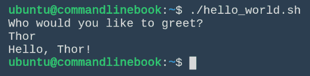
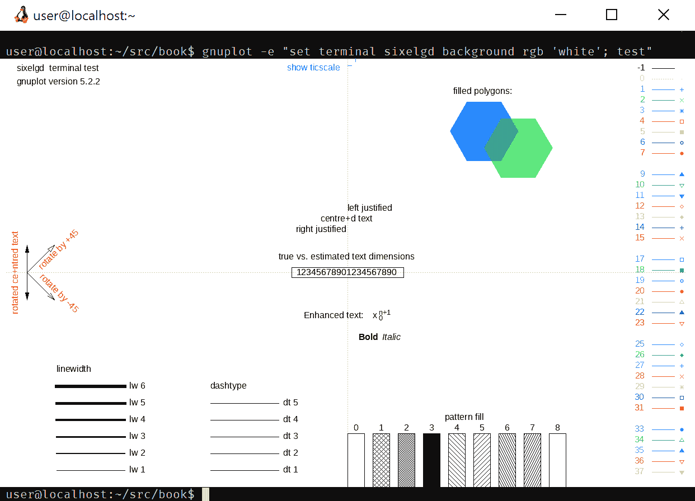
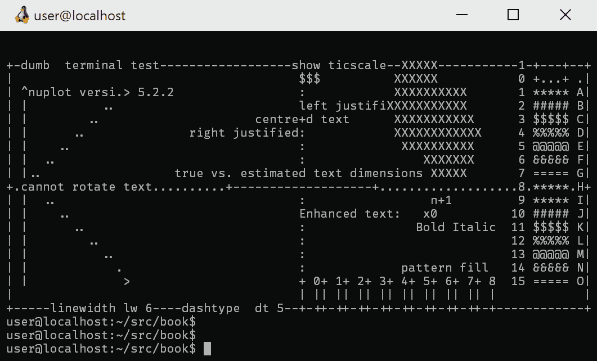
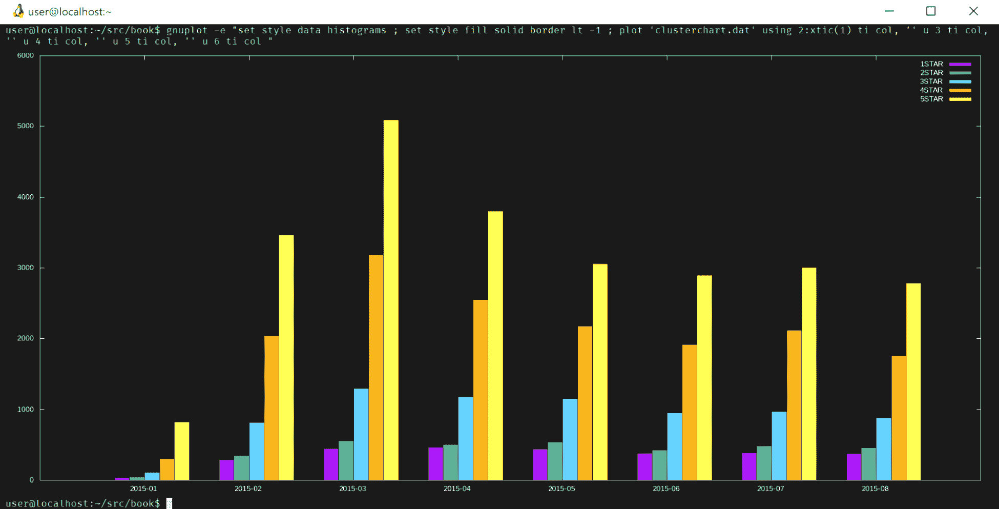
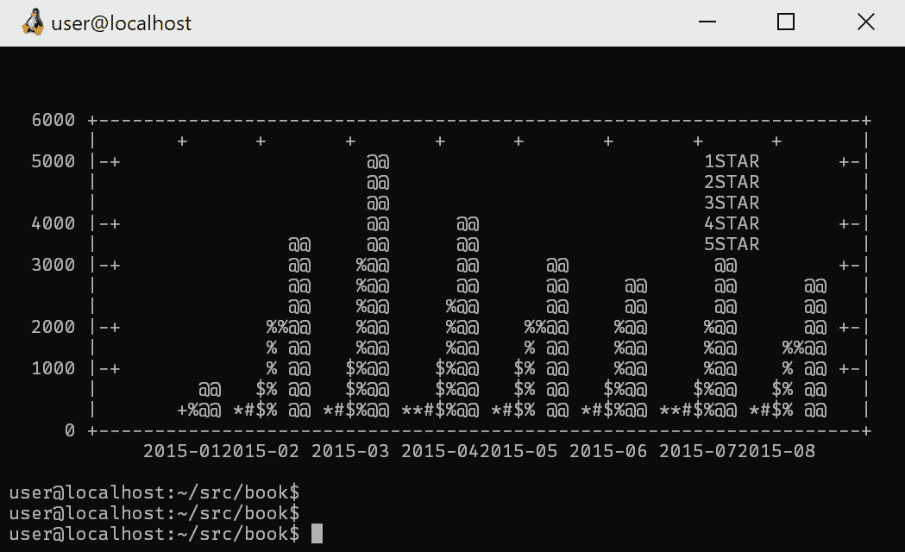
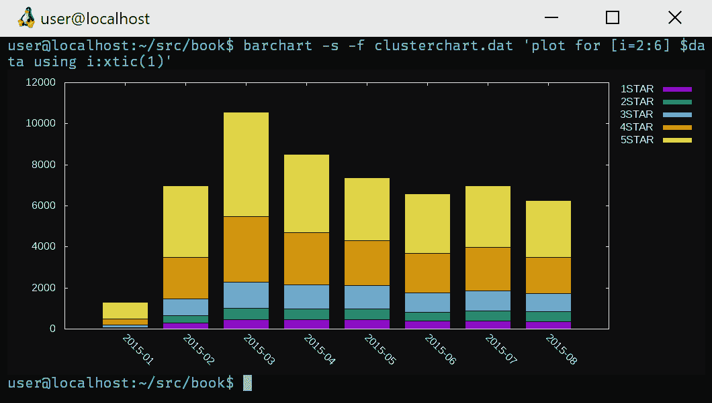
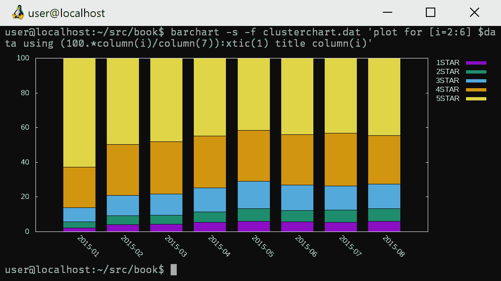

# 第四章：Bash 函数与数据可视化

到目前为止，我们一直在与 bash 交互式工作，并且需要依赖 bash 的 `history` 来回顾我们做过的事情。要是有一个便捷的方式来分享和存储你希望执行的命令，岂不更好？其实，这种功能存在，就是通过包含 shell 函数的 shell 脚本实现的。

我们将扩展在第一章中介绍的历史内容，*命令行中的数据科学及其设置*。终端最初是作为纯文本设备诞生的，并逐步发展为支持简单绘图原语的图形模式，例如渲染表格数据中的封闭单元格。终端图形的巅峰之作是由 DEC 实现的，分别通过 SIXEL 和 REGIS 图形支持画布和矢量图形。随着物理终端逐渐消失，轻量级的终端模拟器退化为仅支持文本的模式。现在，终端模拟器的图形支持正经历一次复兴，alacritty、wsltty、xterm、mlterm、st、iTerm2 和 hterm 等模拟器都在提供图形支持。

我们推荐 Windows 用户使用带有 SIXEL 支持的 wsltty，Linux 用户使用带有 SIXEL 支持的 xterm 或 mlterm，macOS 用户使用支持 PNG 渲染的 iTerm2（未来可能会添加 SIXEL 支持）。

使用推荐的终端模拟器，我们将展示在终端中进行画布样式的图形渲染，当然也包括对 DUMB 终端的文本模式支持。我们只提到存在 ascii-art 库，如 `aalib` (**ascii art lib**)、`libcaca`，以及尝试仅使用字体字符将图形渲染到终端的盲文字体。这里，我们将使用 Linux/Windows 上的 SIXEL 和 macOS 上的 PNG，DUMB 终端输出则留给读者作为所有高级替代方案的冒险。在本章中，我们将介绍以下主题：

+   如何执行脚本

+   函数参数/参数

+   高级 shell 脚本编写

+   如何配置终端以支持图形模式

+   数据挖掘可绘图数据

+   使用 gnuplot 绘制数据图

# 我的第一个 shell 脚本

我们的第一个 shell 脚本将介绍如何告诉计算机运行 shell 脚本的基础知识。

# 她唱得真棒，唱得真棒！

我们并不是在谈论那首热门的 Ricky Martin 歌曲，而是我们在谈论每个 bash 脚本运行所需的内容。如果你曾经使用过其他编程语言，可能会注意到第一个行总是以 `#!` 开头。这告诉系统应该使用哪个解释器。例如，如果你之前使用过 Python，可能已经在脚本中见过 `#!/usr/bin/env python2.7`。对于 bash 来说，也没有什么不同。接下来，我们将创建一个名为 `hello_world.sh` 的新文件，并输入以下内容：

```py
#!/bin/bash
# A function to greet everyone
greet_everyone() {
  echo Hello, World!
}
greet_yourself() {
  echo Hello, ${USER}
}
greet_everyone
greet_yourself
```

文件编辑器是互联网上新的热门争论话题。例如，可以搜索 `vim` 与 `emacs`，或 `nano` 与 `pico`。如果你没有特别喜欢的编辑器，我们不会强迫你选择，但你应该采用一种非常深刻的方法来找到属于你的终极编辑器。

请将此文件保存为`hello_world.sh`，然后使脚本可执行：

```py
chmod +x hello_world.sh
```

现在，你可以这样运行脚本：

```py
./hello_world.sh
```

让我们拆解一下。第一行是我们提到过的 shebang。我们的函数叫做`greet_everyone`和`greet_yourself`。在大括号`{ }`内，我们可以执行任意数量的命令。最后，函数在下面被调用。另请注意脚本中的`${USER}`变量。你可能会想，bash 是如何聪明到在没有你定义的情况下打印出你的用户名的呢？每个 bash 环境都有一组预配置的变量，你可以查看这些变量。请运行`printenv`命令，看看有哪些可用的变量。

如果我们想向全世界问好并使用你的用户名，这样很好。但如果我们想更进一步呢？

# 函数参数、位置参数和 IFS

函数参数、位置参数和**IFS**（**内部字段分隔符**）是 bash 中的高级列表处理机制。我们将依次讲解它们，以确保对 shell 与它们的交互有基本的了解。

# 再来一次，宝贝

我们讨论了如何调用我们的函数，但我们怎么提示用户输入呢？计算机不能读心——它只能读取你的键盘输入！为了让 bash 读取输入，你必须使用（你猜对了）`read`命令。让我们扩展我们函数的能力。请修改你在上一节中的`hello_world.sh`脚本，添加如下内容：

```py
#!/bin/bash
# A function to greet everyone
echo Who would you like to greet?
read name
greet_yourself() {
  echo Hello, ${1:-$USER}!
}
greet_yourself $name
```

我们添加了`read name`代码，将`${USER}`变量替换为`${1:-$USER}`在`greet_yourself`函数中，并将我们的第一个参数添加到`greet_yourself $name`函数调用中。当`$name`被传递到`greet_yourself`函数时，它会被赋值给`$1`变量。那个`${1:-$USER}`魔法变量的意思是展开`$1`；如果为空，则替换为`$USER`，保留原函数的输出行为，如果没有提供用户名，仅按下`enter`键时依然如此。再次运行它，看看结果：



让我们专注于我们的函数。将以下代码粘贴到你的 shell 中：

```py
<<EOF cat >greetlib.sh
greet_yourself() {
  echo Hello, \${1:-\$USER}!
}
EOF
```

这是创建`greetlib.sh`文件的一种高级方式。这里的`<<EOF`是文档重定向，表示我们想将标准输入指定给`cat`，并将其标准输出重定向到`greetlib.sh`。此行之后的所有内容是 shell 解释的内容，会被连接到我们的输出文件末尾，直到读取到`EOF`。Shell 解释的内容意味着变量会被替换为当前 shell 环境中的值，我们使用`\$`转义了 shell 变量，这样它们会被渲染成`$`，而不是被解析为实际的值。最后，我们可以将函数导入当前的 shell 环境并调用它。我们将在下一节练习这个。

# 给函数提供输入！

我们的 shell 函数接受参数，称为位置参数，它们相当于 POSIX C 运行时中的 ARGV。函数参数会根据其数字位置自动分配给变量，格式为：`$1, $2, $3, .., $9`。`$0` 变量存在，但包含用于调用 shell 的名称。一些好奇的人可能会想知道第九个参数之后会发生什么。其实我们需要使用完整的变量解引用语法，对于第十个和第十一个变量，分别是 `${10}` 和 `${11}`。那么这看起来是什么样子呢？来看一下：

```py
greet_yourself() {
  echo Hello, ${1:-$USER}!
}
. ./greetlib.sh
greet_yourself “Joey”
```

`.` 运算符用于在当前执行环境中读取并评估 shell 脚本，就像你将 `greetlib.sh` 的所有内容输入命令行并按下 `enter` 键一样。这会调用 `greet_yourself` 函数，并将第一个位置参数 `"Joey"` 分配给 `$1`。跳到后面，我们有几种位置参数类型：选项（在章节末尾讲解）和参数。选项有短格式和长格式，分别由单个连字符或双连字符标识。短选项是单个字符，长选项是描述要设置的值的完整语义词。如果一个参数的值以连字符开头，它需要通过使用双连字符来与选项区分开来。假设情况如下所示：

```py
greet_yourself --capitalize --name="Joey"
greet_yourself --lowercase -- -RoBoT1
```

这些示例展示了如何将选项和参数传递给函数，因为选项实际上只是位置参数。在第一次问候调用中，我们将 `--capitalize` 分配给第一个位置参数 `$1`，并将 `--name="Joey"` 分配给第二个位置参数 `$2`。在第二次问候调用中，我们将 `--lowercase` 分配给 `$1`，`--` 分配给 `$2`，`-RoBoT1` 分配给 `$3`。我们的函数很基础，无法将 `--capitalize` 和 `--lowercase` 选项作为函数功能处理。我们假装第一次问候调用应输出 `"JOEY"`，第二次问候输出 `-robot1`。有人可能会想知道，命令如何区分以连字符开头的选项和参数，如 `-RoBoT1`。裸双连字符 `--` 表示所有后续位置参数应被视为参数，而不是选项。我们将在章节末尾深入讨论选项处理，但最简单的方式是一次性展示函数调用。

# 深入了解 IFS 和 bash 数组

位置参数是由 shell 脚本、函数或 `set` 命令的参数创建的。将单词分配给位置变量是通过将未加引号的字符串按 IFS 变量中包含的任意定界符拆分来实现的。IFS 变量的默认值是包含空格、制表符和换行符的字符串。由于 IFS 是一个变量，因此可以修改此变量，这在遍历非空格分隔的文本时非常有用：

```py
IFS=:
for P in $PATH ; do
 echo $P
done
unset IFS
```

上述代码展示了如何将最基本的 `/bin:/usr/bin` 组成的 PATH 变量通过冒号分隔符拆分，以便可以操作每个路径段。我们期望读者能够推测出，这种方法如何有助于遍历逗号分隔的列表或类似的简单分隔数据集。

由于修改位置参数的限制，bash 4 引入了数组。如果您的 Shell 脚本变得足够复杂，需要数组的支持，我们建议您考虑升级到一个完整的脚本语言，如 Perl、Python 或 Ruby，这些语言更适合处理 bash 不原生支持的各种列表迭代。深入了解，bash 数组是零索引的，可以使用 `${ARRAY[#]}` 特殊语法进行访问，其中 `#` 符号应替换为整数数组索引或 `@` 或 `*` 的特殊值，这些值表示转换为字符串的引号元素或非引号元素。以下是一个 bash 数组的示例代码：

```py
TMP_PATH=/bin:/usr/bin:/sbin:/usr/sbin
IFS=:
PATH_ARRAY=($TMP_PATH)
unset IFS
echo First element - ${PATH_ARRAY}
echo First element - ${PATH_ARRAY[0]}
echo Second element - ${PATH_ARRAY[1]}
echo All elements - ${PATH_ARRAY[*]}
echo All elements - ${PATH_ARRAY[@]}
```

# 高级 Shell 脚本魔法

这是本章的黑魔法部分。它将通过将前面的课程和特性结合起来，展示高级 Shell 脚本，并将其转换为可以视为一个小程序的形式。

# 此处有龙，谨慎前行

一段简单的入门代码非常适合让你感受语言的风味，但我们将引入一些黑魔法，形式为一些复杂的工具函数，这些函数在日常情况下非常有用。我们将使用 `lineinfile` 函数将任意文本插入到文件中——它不是一个功能完整的应用程序，只是足够确保一些简单的文本被注入到文件中。第二个函数 `ncz` 利用 bash IP 网络功能（是的，bash4 可以支持 IP 网络，与你的发行版相关）执行类似于 `netcat -z` 的套接字测试。此外，它展示了如何通过解析简单的参数标志，使函数表现得像一个命令行程序。

# 文本文件的文本注入

我们将创建一个可以将文本注入到现有文件中的函数。以下是我们的函数：

```py
lineinfile() {
 FILE=$1 ; shift
 LINE=”^$1$” ; shift
 CONTEXT=”$1.*” ; shift
 MODE=${1:-add} ; shift
 case “${MODE}” in
  add)
   grep -s “${LINE}” “${FILE}” || sed -i -e “s/\(${CONTEXT}\)/\1\n${LINE}/” “${FILE}”
   ;;
  del)
   grep -s “${LINE}” “${FILE}” || sed -i -e “/${LINE}/d” “${FILE}”
   ;;
 esac
}
```

预期的用法如下：

```py
lineinfile <filename> <string> <insert-after-context-string> <add | [del]>
```

`lineinfile`从标准的`function() {}`定义模板开始。它将传递给函数的第一个位置参数`$1`读取到`FILE`变量中，并将位置参数向左移动，使得每个参数的索引减少 1，`$2`变为`$1`，`$3`变为`$2`，以此类推。第二个参数被赋值给`LINE`变量，并且我们用正则表达式的行首`^`和行尾`$`定界符为其加上前缀，以指示要插入的字符串必须匹配整行（抱歉，这个简单的函数不支持高级正则表达式）。第三个参数用于查找上下文，以便我们可以在上下文之后插入该行。再次说明，不能指定在上下文之前插入，只能在上下文之后插入（如果存在的话）。第四个参数是我们的`lineinfile`函数的操作模式，可以是`add`（默认行为是添加文本）或者是删除模式（使用`del`模式）。

# Bash 网络，用于娱乐和盈利！

有时，我们需要与网络服务或 API 进行交互。在这里，我们将介绍一些完整的代码，用于测试 TCP 端点，这对于检查 API 服务是否在监听并且可用非常有用。您可以将这段代码粘贴到终端中，或者保存到一个文件中，并使用`.`操作符将其加载到您的 Shell 环境中：

```py
ncz() {
 OPTIND=1 ; while getopts ":hv" opt; do
  case ${opt} in
   v) VERBOSE=true
    ;;
   h|\?) printf "Usage: $0 [-v] <host | host:port>" ; return
    ;;
  esac
 done
 shift $(($OPTIND - 1))
 HOST=${1%:*}
 PORT=${1#*:}
 PORT=${2:-$PORT}
 (exec 6<>/dev/tcp/${HOST}/${PORT} 2>&1)
 RC=$?
 case "${VERBOSE}${RC}" in
  true0) printf "open\n";;
  true*) printf "closed\n";;
 esac
 return $RC
}
```

现在，这段代码有一些小魔法。`getopts`是一个函数，用于解析位置参数，根据 POSIX 处理将其转换为选项，并将下一个选项分配给指定的变量，在这个例子中是 opt。它支持短选项和长选项，并且选项可以有参数；这些参数会被存储在`OPTARG`中。这个例子使用了一个简单的选项字符串`:hv`。冒号字符表示无效的选项标志应该用问号字符`?`表示。`h`选项是我们的帮助标志，`v`用于设置`VERBOSE`标志。`while`循环调用`getopts`函数，它会修改位置参数。当`getopts`函数完成后，必须将已处理的位置信息移除，以便我们将非选项当作函数参数处理。`OPTIND`是最后一个解析的选项的索引，因此从中减去 1 并按该数量移动位置参数，确保我们的位置参数中只剩下正确的参数。

该代码尝试支持接受`host:port`或`host port`形式的参数。对于单参数或双参数的支持通过始终将第二个参数用作端口来处理，如果没有第二个参数，则默认通过使用前缀和后缀删除符号将第一个参数拆分。在`HOST=${1%:*}`赋值中，它尝试通过扩展第一个位置参数，剥离所有尾部字符（`%`为反向替代匹配）直到第一个冒号字符（`host:port`中的分隔符），从而提取出主机部分。如果反向匹配失败，表示没有端口组件，则将未修改的 `$1` 展开并赋值。为了获取端口，我们查看第二个参数。如果不存在第二个参数，则默认从第一个位置参数中提取端口，通过剥离`host:`部分。

真实的黑魔法涉及文件描述符和 Bash 的 IP 网络支持。我们在子 Shell 中打开文件描述符 6。我们将通过`/dev/tcp/$HOST/$PORT`创建的套接字的输入/输出附加到该文件描述符。任何写入该文件描述符的数据将通过 TCP 套接字发送到`tcp://$HOST:$PORT`，并且任何响应都可以从同一文件描述符中读取。由于网络连接可能会出错，我们将套接字打开的返回码捕获到`RC`变量（即返回码的缩写）中。然后，我们评估是否需要根据详细选项标志和返回码的状态输出，按照返回码打印成功/失败。在 C 程序中，返回码为 0 表示成功，因此`true0`表示该函数已被调用以请求详细模式，并且成功地建立了套接字连接。最后，返回码会从函数中返回，以便通过 Shell 管道评估远程套接字的状态。

这是对前述解释的自我解释调用：

```py
ncz google.com:80 && echo "yay!! Interwebz are up!" || echo "booh! No kitties for us!"
```

# 从简单终端到炫酷终端

我们将使用 gnuplot 在终端中渲染简单的文本图形和画布风格的图表。首先，我们需要为 gnuplot 启动一些基本配置。将以下内容放入`~/.gnuplot`中：

```py
set term dumb
```

接下来，我们需要一个围绕 gnuplot 的包装器来获得一些花哨的图形输出。这个包装器查看你当前 shell 的`GNUTERM`环境变量，并对终端的宽度和高度进行一些计算，以便 gnuplot 知道它窗口的大小。该包装器将更新我们的`~/.gnuplot`配置，指定终端的图形能力。我们不会深入研究这个包装器，而是将它作为另一个命令使用。它是这样的：

```py
__gnuplot() {
 SIZE=$(stty size 2>/dev/null)
 SIZE=${SIZE:-$(tput lines) $(tput cols)}
 COLS=${SIZE#* }
 ROWS=${SIZE% *}
 XPX=${XPX:-13}
 YPX=${YPX:-24}
 COLUMNS=${COLUMNS:-${COLS}}
 LINES=$((${LINES:-${ROWS}}-3))
 case "${GNUTERM%% *}" in
 dumb) X=${COLUMNS} ; Y=${LINES} ; DCS_GUARD="cat" ;;
 png) X=$((XPX*COLUMNS)) ; Y=$((YPX*LINES)) ;
DCS_GUARD="imgcat";;
 sixelgd) X=$((XPX*COLUMNS)) ; Y=$((YPX*LINES));;
 esac
 sed -i "s/^set term[[:space:]][^[:space:]]*/set term ${GNUTERM%%
*}/" ~/.gnuplot
 GNUTERM="${GNUTERM} size $X,$Y" \gnuplot "$@" | ${DCS_GUARD:-cat}
}
alias barchart="FUNCNAME=barchart __barchart"
__barchart() {
 local STACKED
 local DATA
 OPTIND=1 ; while getopts ":hf:s" opt; do
 case ${opt} in
 f) [ -r "${OPTARG}" ] && DATA=$(printf '$data <<EOD\n' ; cat "${OPTARG}" ; printf 'EOD\n')
 ;;
 s) STACKED="; set style histogram rowstacked ; set boxwidth 0.75"
 ;;
 h|\?) printf "Usage: ${FUNCNAME} [-s] [-f <file>] <gnuplot commands\n"
 return
 ;;
 esac
 done
 shift $(($OPTIND - 1))
 {
 cat <<-EOF
 $DATA
 set key autotitle columnheader outside
 set style data histograms ${STACKED}
 set style fill solid border lt -1
 set xtics rotate by -45
 EOF
 printf "%s" "$@"
 } | gnuplot
}
```

根据你的操作系统和终端，你需要为终端指定正确的图形后端。

使用 wsltty 的 Windows 用户和使用 mlterm 或 xterm 的 Linux 用户应该设置以下环境变量：

```py
export GNUTERM=sixelgd
```

使用 iTerm2 的 macOS 用户应该使用以下环境变量：

```py
export GNUTERM=png
```

让我们验证我们能够绘制一个图形测试模式。如果您的愚蠢终端不支持图形模式，则随后进行文本模式测试。

对于图形测试，请运行以下命令：

```py
gnuplot -e "set terminal $GNUTERM background rgb 'white'; test"
```

这应该会产生类似以下的终端图形输出：



对于样式化输出图形，快速调用测试输出很重要。图形测试中最右侧的线型简写为`lt`，提供绘制刻度（或点）的视觉标记，例如`*`、`+`和`x`。线宽，简写为`lw`，位于左下角，并设置绘制线条的线条厚度。

如果您的终端不支持图形模式，可以使用文本绘图。调用文本测试：

```py
GNUTERM=dumb \gnuplot
gnuplot> test
gnuplot> exit
```

这应该会产生如下终端输出：



最后，我们需要一个`alias`，以调用我们的函数，并使用设置为可接受的图形后端的`GNUTERM`环境变量。在您的终端中运行以下别名，并设置`GNUTERM`变量以确保正常工作：

```py
alias gnuplot="GNUTERM=$GNUTERM __gnuplot"
```

# 谁、什么、哪里、为什么、如何？

让我们回到我们的书籍数据，并开始将其精简为有趣的部分。让我们只看一小部分我们的数据：

```py
head amazon_reviews_us_Digital_Ebook_Purchase_v1_00.tsv
```

这将输出一堆非常长的数据行。让我们再试一次 —— 或许我们真的只关心标题，所以让我们试试这个：

```py
head -n1 amazon_reviews_us_Digital_Ebook_Purchase_v1_00.tsv
```

由于有大量文本，让我们移除文本字段，只关注数值数据，通过删除`product_title`、`review_headline`和`review_body`，它们对应字段 6、13 和 14。因为我们正在研究伪大数据，让我们获取所有数值或布尔标志字段，并转储所有文本评论（留给自然语言处理专家分析），尝试这个：

```py
cat amazon_reviews_us_Digital_Ebook_Purchase_v1_00.tsv | cut -d $'\t' -f 4,8-12,15 > test.tsv
```

就像这样，我们将数据大小从 6.3 GB 减少到了 383 MB 的修剪后的`test.tsv`数据，这样更易管理。现在，让我们将其导入 SQL 数据库，以便像执行 SQL 查询一样聚合表格数据：

```py
sqlite3 aws-ebook-reviews.sq3 <<EOF
.mode csv
.separator "\t"
.import test.tsv reviews
EOF
```

让我们找出评论最多的产品：

```py
sqlite3 -header -column aws-ebook-reviews.sq3 " select product_id as ID, strftime('%Y-%m', review_date) DATE, star_rating as STAR, count(product_id) as COUNT from reviews group by ID order by COUNT desc limit 10"
```

应显示以下输出（计数可能有所不同）：

```py
ID     DATE STAR    COUNT
---------- ---------- ---------- ----------
B00L9B7IKE 2015-01 5      54534
B005ZOBNOI 2013-09 5      50581
B006LSZECO 2013-09 3      45467
B00BAXFECK 2013-10 5      34253
B003WUYPPG 2013-09 3      30890
B00DPM7TIG 2014-05 4      28234
B00JYWUHO4 2014-10 1      26722
B0089LOG02 2013-09 5      26155
B00CNQ7HAU 2013-10 5      24454
B004CFA9RS 2013-09 5      23677
```

54,000 条评论看起来可以为我们绘制一些有趣的数据，所以让我们专注于产品 ID `B00L9B7IKE`。对于绘图，我们知道我们正在查看哪个产品 ID，所以让我们调整我们的查询，不报告产品 ID，只关注日期、星级评分和计数：

```py
sqlite3 -header -column aws-ebook-reviews.sq3 " select strftime('%Y-%m', review_date) DATE, star_rating as STAR, count(star_rating) as COUNT from reviews where product_id = 'B00L9B7IKE' group by DATE, STAR"
```

将显示以下输出：

```py
DATE    STAR COUNT
---------- ---------- ----------
2015-01   1 30
2015-01   2 44
2015-01   3 108
2015-01   4 304
2015-01   5 822
2015-02   1 290
2015-02   2 352
2015-02   3 818
2015-02   4 2040
2015-02   5 3466
2015-03   1 446
2015-03   2 554
2015-03   3 1294
2015-03   4 3186
2015-03   5 5092
2015-04   1 466
2015-04   2 508
2015-04   3 1178
2015-04   4 2550
2015-04   5 3806
2015-05   1 442
2015-05   2 538
2015-05   3 1152
2015-05   4 2174
2015-05   5 3058
2015-06   1 382
2015-06   2 428
2015-06   3 952
2015-06   4 1920
2015-06   5 2898
2015-07   1 388
2015-07   2 484
2015-07   3 972
2015-07   4 2122
2015-07   5 3004
2015-08   1 374
2015-08   2 458
2015-08   3 884
2015-08   4 1762
2015-08   5 2788
```

如果我看到了一些可绘制的数据，那真是太好了。我们可以通过日或月跟踪评价的数量，当我们绘制时，我们可以寻找异常，例如在一天内有异常数量的五星级评价，而前几天并没有如此突出。

我们的数据仍然不完全正确；为了绘图，我们需要按日期将星级评分分组为单行，因此我们需要对数据进行另一次转换。我们还去掉了`-`列选项，以便得到简洁的输出，并且在准备将数据传递给 gnuplot 时，我们可以通过`tr`来管道这些数据。我们还会将此输出保存到`clusterchart.dat`，这样我们的绘图命令就可以简短而简单：

```py
sqlite3 -header aws-ebook-reviews.sq3 "select DATE, MAX(CASE WHEN STAR='1' THEN COUNT END) as '1STAR', MAX(CASE WHEN STAR='2' THEN COUNT END) as '2STAR', MAX(CASE WHEN STAR='3' THEN COUNT END) as '3STAR', MAX(CASE WHEN STAR='4' THEN COUNT END) as '4STAR', MAX(CASE WHEN STAR='5' THEN COUNT END) as '5STAR', SUM(COUNT) as TOTAL from ( select strftime('%Y-%m', review_date) DATE, star_rating as STAR, count(star_rating) as COUNT from reviews where product_id = 'B00L9B7IKE' group by DATE, STAR) results group by DATE" | tr '|' '\t' > clusterchart.dat
cat clusterchart.dat
```

最后，这就是我们用于绘图的简洁输出，使用 gnuplot 生成图表：

```py
DATE  1STAR 2STAR  3STAR 4STAR 5STAR  TOTAL
2015-01 30   44 108 304   822 1308
2015-02 290   352 818 2040  3466 6966
2015-03 446   554 1294 3186  5092 10572
2015-04 466   508 1178 2550  3806 8508
2015-05 442   538 1152 2174  3058 7364
2015-06 382   428 952 1920  2898 6580
2015-07 388   484 972 2122  3004 6970
2015-08 374   458 884 1762  2788 6266
```

# 进入思维的视野

让我们看看这个效果。运行以下代码：

```py
gnuplot -e "set style data histograms ; set style fill solid border lt -1 ; plot 'clusterchart.dat' using 2:xtic(1) ti col, '' u 3 ti col, '' u 4 ti col, '' u 5 ti col, '' u 6 ti col"
```

这将在终端中产生以下内容：



让我们做同样的操作，但输出`dumb`格式：

```py
GNUTERM=dumb gnuplot -e "set style data histograms ; set style fill solid border lt -1 ; plot 'clusterchart.dat' using 2:xtic(1) ti col, '' u 3 ti col, '' u 4 ti col, '' u 5 ti col, '' u 6 ti col"
```

我们得到一个基于文本的输出：



为了分解我们所做的操作，看看以下代码：

```py
GNUTERM=dumb gnuplot -e "set style data histograms ; set style fill solid border lt -1 ; plot 'clusterchart.dat' using 2:xtic(1) ti col, '' u 3 ti col, '' u 4 ti col, '' u 5 ti col, '' u 6 ti col"
```

第一步是设置`GNUTERM`，它应该默认使用我们在`~/.bash_profile`中设置的内容。这告诉我们的 gnuplot 包装器使用哪个输出后端。对于`GNUTERM=dumb`，它将使用文本后端。接下来的部分是带有`-e`表达式参数的`gnuplot`。表达式是`gnuplot`的语法。我们首先使用`set style data histograms`将图表设置为柱状图，而不是折线图。接下来，我们通过设置为填充填色并使用实线边框来指定柱子的颜色，并使用`-1`作为默认的线条类型。在定义了绘图样式后，我们告诉 gnuplot 用`plot 'clusterchart.dat'`绘制我们的数据。每个逗号分隔的参数表示`clusterchart.dat`中每行数据的绘图列。我们指定图表的第一列应使用第二列的数据，并使用第一列数据作为 x 标签，这通过`2:xtic(1) ti col`来表示。

图表中的第二列使用相同的`clusterchart.dat`作为输入，通过两个连续的单引号来表示相同，并指定使用第三列数据作为刻度数据。第三、第四和第五列采用与第二列相同的表示法，即表示重用`clusterchart.dat`并指定提取 y 轴刻度数据的列。

如果我们想让它更炫酷一些，我们可以使用行堆叠，而不是聚类柱状图，这样我们可以更紧凑地可视化数据。试试看：

```py
barchart -s -f clusterchart.dat 'plot for [i=2:6] $data using i:xtic(1)'
```

我们得到了一个堆叠柱状图：



现在，如果我们想查看百分比，可以在堆叠模式下使用我们的`barchart`包装器。这样可以清晰地看到不同数据段之间的差异。尝试运行以下代码：

```py
barchart -s -f clusterchart.dat 'plot for [i=2:6] $data using (100.*column(i)/column(7)):xtic(1) title column(i)'
```

它会产生如下输出：



这是使用我们的条形图包装器以堆叠模式（`-s`）并指定我们的`clusterchart.dat`输入文件，最后一个参数为 gnuplot 脚本。对于 gnuplot，我们告诉它对`i=2`到`6`进行一次单独的迭代绘图。`$data`变量由条形图包装器设置为`clusterchart.dat`的内容。`using`参数将我们的分数乘以`100`，以为每个元素`i`创建条形图的百分比，这个元素来自第`7`列的总和。`xtic(1)`将`xtic`标记标题设置为每行数据图表中第 1 列的内容。在这个示例中，我们需要添加`column(i)`标题，以便正确设置关键标题为列标题，而不是使用最后引用的`column(7)`标题。

# 总结

通过重用 bash 代码的能力，您可以将一系列脚本组合在一起，从而提高命令行的生产力。并且，通过可视化结果，您可以更快速地分析数据集并执行数据挖掘任务。

在下一章，我们将深入探讨 bash 控制流，以创建更丰富的函数。
