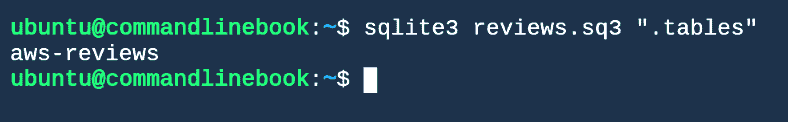

# 第六章：SQL、数学及总结

数据库是存储和访问数据的理想解决方案。它们为开发者提供了一个 API，允许数据的结构化组织、以灵活的方式搜索数据以及存储新数据。当数据库的功能成为必需时，通常没有太多的谈判空间；问题不在于是否使用数据库，而是选择哪个数据库。

尽管如此，Unix 命令行提供了一系列工具，使得开发者可以以多种方式查看流或文件，类似于查看数据库。给定一个或多个包含数据的文件，我们可以使用这些工具查询数据，而无需维护数据库或与之相关的任何内容，如固定的模式。通常，我们可以使用这种方法来处理数据，而不是启动一个数据库服务器并处理与**提取**、**转换**和**加载**（**ETL**）数据到数据库相关的问题。更好的是，我们的管道，以及我们对数据的视图，可以随时间变化，而不像传统数据库的相对静态模式。

经常，你需要在工作流中对数值数据进行计算。命令行有多种工具可以帮助我们完成这一操作。

Bash 本身具备在 shell 脚本中进行一些数学运算的能力。当需要更多功能时，两个命令行工具 `bc` 和 `awk` 能够执行多种类型的计算。

有时候，我们可能需要编程语言和数学包的完整功能，如 Python 和 Pandas。虽然这不是关于如何在 Python 中进行数据科学的教程，但在本章中，我们将看到如何将你的 Python 程序与其他命令行工具接口，并根据需要构建自定义的管道。

我们还将使用本书中看到的许多工具对天气数据进行一些实际分析。

总结一下，在本章中，我们将研究：

+   使用 `cut` 查看数据作为列

+   使用 `grep` 作为 `WHERE` 子句

+   使用 `join` 命令连接不同的数据集

+   使用 `awk` 模拟 `SELECT` 子句

+   学习如何在需要更全面功能的数据库时使用 SQLite

+   Bash 变量赋值

+   基础 Bash 算术和比较

+   使用 `bc` 进行数学计算

+   使用`awk`进行流式计算

+   与 Python 程序进行接口

+   查看一个公开的天气 API 的内容

+   抓取 API 并将结果存储到轻量级数据库中

+   使用前面章节讨论的工具分析我们创建的数据库中的数据

+   得出关于天气预报准确性的结论

# 使用 `cut` 将数据视图化为列

你可能首先需要做的事情是将文件中的数据分割成数据行和数据列。我们在前面的章节中看到了一些转换方法，允许我们逐行处理数据。在本章中，我们假设你的数据行对应文件中的数据行。如果情况并非如此，这可能是你在管道中要做的第一件事。

假设我们在文件或数据流中有一些数据行，我们希望以列的形式查看这些数据，就像传统的数据库一样。我们可以借助`cut`命令来实现这一点。`cut`可以帮助我们通过分隔符将文件中的行切割成列，并选择哪些列传递到输出中。

如果你的数据是以逗号分隔或制表符分隔的文件，`cut` 非常简单：

```py
zcat amazon_reviews_us_Digital_Ebook_Purchase_v1_01.tsv.gz | cut -d$'\t' -f2,8 | head
```

上面的代码产生了以下结果：


在此命令中，我们告诉 `cut` 使用 `-d$'\t'` 作为分隔符。此外，我们使用 `-f2,8` 选项告诉 `cut` 选择哪些列从输入传递到输出。请注意，我们捕获了数据的标题行，这通常是我们不希望的。为了跳过它，可以在管道中添加 `tail -n +2`：

```py
zcat amazon_reviews_us_Digital_Ebook_Purchase_v1_01.tsv.gz | cut -d$'\t' -f2,8 | tail -n +2 | head
```

上面的代码产生了以下结果：


如果你的行比 CSV 或 TSV 更复杂，你可能需要使用 `cut` 多次，或者可能需要使用 `awk` 或 `sed` 进行中间处理。例如，在书籍评论数据集中，假设我们想要输出日期字段，但需要按年-月-日顺序输出。我们可以首先选取日期字段，再将日期字段重新切割成其组成部分，并按所需的顺序输出：

```py
zcat amazon_reviews_us_Digital_Ebook_Purchase_v1_01.tsv.gz | cut -d$'\t' -f15 | cut -d$'-' -f2,3,1 | head
```

上面的代码产生了以下结果：


`cut` 还可以从流中切割特定的字节或字符，如果你有固定宽度的字段：

```py
zcat amazon_reviews_us_Digital_Ebook_Purchase_v1_01.tsv.gz | cut -c1-12 | head
```

上面的代码产生了以下结果：


在书籍数据的情况下，这样做并不太有意义，因为字段是可变宽度的，但有时它正是你所需要的。

以这种方式使用 `cut` 将是你进行 SQL 类似的 `SELECT` 操作，选择每行数据中特定字符的工具。

# WHERE 子句

我们在前一章中讨论的强大 `grep` 正则表达式匹配工具可以帮助我们在文件中执行 `WHERE` 子句。这个子句可能没有 SQL 的 `WHERE` 子句那么直观，但我们可以使用 `grep` 做到与 SQL `WHERE` 子句一样多，甚至更多。例如，假设我们只关心以数字 `3` 开头的账户：

```py
zcat amazon_reviews_us_Digital_Ebook_Purchase_v1_01.tsv.gz | cut -d$'\t' -f2,8 | tail -n +2 | grep "³" | head 
```

以下内容将显示在你的屏幕上：


# Join，连接数据

`join`的工作原理类似于在 SQL 样式数据库中的`INNER JOIN`。两个已排序的文件或流被传递给`join`命令（参见排序部分，了解如何对流进行`sort`）。文件的行必须根据你想要连接的字段进行排序。`join`命令将输出这两个文件的内部连接结果，如果存在匹配字段，它将输出`join`键以及第一个文件的剩余数据行与第二个文件连接后的结果。

比如，我们想要查找同时出现在第一个和第二个评审文件中的用户，以及他们在每个文件中的评审数量。我们可以运行以下`join`命令：

```py
join -j2 <(zcat amazon_reviews_us_Digital_Ebook_Purchase_v1_01.tsv.gz | cut -d$'\t' -f2 | sort | uniq -c) <(zcat amazon_reviews_us_Digital_Ebook_Purchase_v1_00.tsv.gz | cut -d$'\t' -f2 | sort | uniq -c) | head
```

上述代码产生了以下结果：


在这里，我们使用过程替代来切分评审文件的数据。这是并行执行的，能够提高处理速度。

# 按组和排序

我们可以通过使用`sort`并管道连接到`uniq -c`来执行`GROUP BY`操作（如在第五章，*循环、函数和字符串处理*中所讨论的）：

```py
zcat amazon_reviews_us_Digital_Ebook_Purchase_v1_01.tsv.gz | cut -d$'\t' -f 2 | sort | uniq -c | head
```

上述代码产生了以下结果：


在前面的示例中，我们只是简单地统计了每个用户提交了多少次评审。我们可能还希望获取每个用户的平均评审，这可以通过`awk`关联数组来完成：

```py
zcat amazon_reviews_us_Digital_Ebook_Purchase_v1_01.tsv.gz | cut -d$'\t' -f2,8 | awk '{sum[$1]+=$2;count[$1]+=1} END {for (i in sum) {print i,sum[i],count[i],sum[i]/count[i]}}' | head 
```

上述代码产生了以下结果：


在这里，命令的输出是每个用户的 ID、评审总数、评审数量和每个用户的平均评审。

我们还可以使用相同的工具`sort`对结果数据进行排序。例如，我们可以使用前面的`GROUP BY`示例，并按每个用户提交的评审数量`ORDER BY`，以找到最多评审的用户：

```py
zcat amazon_reviews_us_Digital_Ebook_Purchase_v1_01.tsv.gz | cut -d$'\t' -f2,8 | awk '{sum[$1]+=$2;count[$1]+=1} END {for (i in sum) {print i,sum[i],count[i],sum[i]/count[i]}}' | sort -k3 -r -n | head
```

上述代码产生了以下结果：


每个用户提交的评审数量，用于找到最多评审的用户

# 模拟选择操作

在前面的部分，我们已经看到如何在数据上执行`SELECT`、内连接`JOIN`，甚至对平面文件或数据流进行`GROUP BY`和`ORDER BY`操作。作为常用操作的补充，我们还可以通过简单地将一组调用包装成流并进一步处理它们，来创建子选择的数据表。这就是我们一直在通过管道模型执行的操作，但为了说明一个问题，假设我们想从按组汇总的评审中选择出那些评审数量在`100`到`200`之间的评审者。我们可以再次执行前面示例中的命令，并使用`awk`：

```py
zcat amazon_reviews_us_Digital_Ebook_Purchase_v1_01.tsv.gz | cut -d$'\t' -f2,8 | awk '{sum[$1]+=$2;count[$1]+=1} END {for (i in sum) {print i,sum[i],count[i],sum[i]/count[i]}}' | sort -k3 -r -n | awk '$3 >= 100 && $3 <=200' | head 
```

上述代码产生了以下结果：


从按组汇总的评审中选择出那些评审数量在 100 到 200 之间的评审者

利用这些工具，你已经看到了如何通过命令行模拟大部分常见的 SQL 表达式，针对文件或流数据的行进行操作。

# 王国之钥

现在我们已经掌握了如何使用命令行探索数据并转换文本，我们将为你提供“王国之钥”。SQLite 是一个公共领域库，实现了一个 SQL 引擎，并提供一个`sqlite`命令行工具，用于与数据库文件进行交互。与 Oracle、MySQL 和其他提供网络端点的数据库引擎不同，sqlite 是离线的，通过库调用与一个单一的数据库文件进行交互。这使得备份变得非常简单。备份可以通过执行``cp database.sq3 backups/`date +%F`-database.sq3``来创建。可以对其进行版本控制，但使用增量比较时不太可能压缩得很好。

# 使用 SQLite

简单导入 CSV 文件（支持自定义分隔符）：

```py
head -n21 amazon_reviews_us_Digital_Ebook_Purchase_v1_00.tsv > test.csv 
sqlite3 test.sq3 <<EOF
.mode csv
.separator "\t"
.import test.csv test_reviews
EOF
```

数据需要一些处理才能转换为 CSV 格式——数据集中有一些有问题的字符——让我们用一些 Shell 技巧来使它统一：

```py
COLS=`head  amazon_reviews_us_Digital_Ebook_Purchase_v1_00.tsv | head -n1 | sed -e 's:^\|$:":g; s:\t:", ":g'`

VALUES=`head  amazon_reviews_us_Digital_Ebook_Purchase_v1_00.tsv | tail -n1 | sed -e 's:^\|$:":g; s:\t:", ":g'` sqlite3 reviews.sq3 "create table ‘aws-reviews' ( $COLS) ;" 
```

使用以下命令显示表格：

```py
sqlite3 reviews.sq3 ".tables"
```

上面的代码显示了数据库中的表格：



要显示表格列的数据类型，请运行以下命令：

```py
 sqlite3 reviews.sq3 ".schema aws-reviews"
```

上面的代码生成了以下输出：


显示表格列的数据类型

将 20 行亚马逊评论加载到名为`reviews.sq3`的 sqlite 数据库中的`aws_reviews`表格：

```py
head -n21 amazon_reviews_us_Digital_Ebook_Purchase_v1_00.tsv | sed '1d; s/"/""/g ; s/\t/", "/g;' | while read LINE ; do VALUES="\"${LINE}\"" ; sqlite3 reviews.sq3 "insert into aws_reviews ($COLS) VALUES ($VALUES) ;"; done  
```

我们读取了前 21 行。我们的流编辑器去除了第一行（表头），用一对双引号转义了所有的双引号（我们知道这有点奇怪），并将“tab”分隔符替换成一个值分隔符，该分隔符终止字符串并表示后面有一个元素。

然后，我们通过在读取的`LINE`前后添加双引号，将其转换为输入的`VALUES`，以正确格式化数据。最终，我们的数据就准备好可以插入到表格中。

请注意，sqlite3 使用第二个引号字符作为引号转义序列，类似于使用`%%`与`printf`来获取字面意义上的`%`字符。

现在我们可以像任何传统数据库一样查询数据，因为 sqlite 是以库的形式提供的数据库引擎：

```py
sqlite3 reviews.sq3 “select * from aws_reviews”
```

# Bash 本身的数学运算

Bash 本身能够执行简单的整数算术运算。在 bash 中至少有三种不同的方式来实现这一点。

# 使用 let

你可以使用`let`命令进行简单的 bash 算术运算：

```py
$ let x=1
 $ echo $x
 1
 $ let x=$x+1
 $ echo $x
2
```

# 基本算术

你可以进行加法、减法、乘法（确保使用`\*`来转义`*`运算符）和整数除法*：*

```py
expr 1 + 2
3
expr 3 \* 10
30
```

数字必须由空格分隔。

# 双括号

类似于`let`，你也可以使用双括号在 bash 中进行简单的整数算术运算：

```py
a=$((1 + 2))
echo $a 
((a++))
echo $a

3
4
```

要查看 Shell 中可用的所有操作，请查看 GNU 参考页面：[`www.gnu.org/software/bash/manual/html_node/Shell-Arithmetic.html`](https://www.gnu.org/software/bash/manual/html_node/Shell-Arithmetic.html)。

# bc，Unix 基本计算器

`bc`是一个计算器脚本语言。可以通过`bc`命令执行`bc`脚本。假设一个`test.bc`文件包含以下代码：

```py
scale = 2;
(10.0*2+2)/7;
```

这意味着你可以像这样运行`bc`：

```py
cat test.bc | bc
3.14
```

`bc`不仅仅能进行两个数字的除法计算。它本身是一个完全成熟的脚本语言，你可以通过`bc`脚本做任意复杂的事情。`bc`脚本可能是数据管道的终点，在此之前，数据文件已被处理成数据行流，然后通过`bc`脚本计算我们需要的数值。让我们通过一个简单的例子来说明这一点。

在这个例子中，我们需要处理一个 CSV 数据文件，计算每一行中第二个数字的平均值，并计算每一行中第四个数字的总和。假设我们有一个`bc`函数来计算这两个数字的某些有趣内容，比如调和均值。我们可以使用`awk`将这些数字输出到一个`bc`脚本中，然后通过管道将结果传递给`bc`。

假设我们计算两个数字调和均值的`bc`函数如下所示：

```py
scale=5; 
define harmonic(x,y){ return 2.0/((1.0/x) + (1.0/y)); }
```

我们可以使用`awk`来找到这两个数字并构造`bc`脚本，然后通过管道传递给`bc`执行：

```py
awk '{s+=$2 ; f+=$4}END{print "scale=5;\n define harmonic(x,y){ return 2.0/((1.0/x) + (1.0/y)); } \n harmonic(",s/NR,",",f,")"}' data.txt | bc
```

详情请参见`bc`文档：[`www.gnu.org/software/bc/manual/html_mono/bc.html`](https://www.gnu.org/software/bc/manual/html_mono/bc.html)，了解更多你可以用`bc`做的事情。

# 在(g)awk 中的数学运算

`awk`（包括`gnu`实现版本，`gawk`）旨在进行流式文本处理、数据提取和报告。大量实际统计学都涉及以特定方式计数，而这正是`awk`擅长的领域。统计总数、直方图和分组计数在`awk`中都非常容易实现。

一个`awk`程序是由一组匹配的模式和在匹配这些模式时采取的动作组成的：

```py
pattern {action}
pattern {action}
pattern {action}
…
```

对于每一条记录（通常是传递给`awk`的每一行文本），都会测试每个模式，看该记录是否匹配，如果匹配，则采取相应的动作。此外，每条记录会自动被分割成由分隔符组成的字段列表。如果没有给出动作，默认的动作是打印记录。默认的模式是匹配所有内容。有两个特殊的模式：`BEGIN`和`END`，分别只会在处理任何记录之前和之后匹配。

`awk`的强大之处在于它的变量：变量可以在不声明的情况下使用。已经有一些对数学运算有用的特殊变量可以供你使用：

```py
$0: The text of the entire record.
$1, $2, … : The text of the 1st, 2nd, etc fields in the record.
NF: The number of fields in the current record.
NR: The current count of records (equal to the total number of records in the END step)
```

此外，你可以将值分配给你自己的变量。`awk`本身提供了一些可以存储字符串、整数、浮动点数、正则表达式和关联数组的变量。

例如，假设我们想要计算测试数据评论中的单词频率。运行以下代码：

```py
zcat amazon_reviews_us_Digital_Ebook_Purchase_v1_01.tsv.gz | tail -n +2 | head -n 10000 | cut -f14 | awk 'BEGIN {FS="[^a-zA-Z]+"}; {for (i=1;i<NF;i++) words[$i] ++}; END {for (i in words) print words[i], i}' | head
```

它将产生这些结果：


计算我们测试数据中评论的单词频率

假设我们想要计算评论中星级的直方图。使用`awk`也非常简单：

```py
zcat amazon_reviews_us_Digital_Ebook_Purchase_v1_01.tsv.gz | tail -n +2 | cut -f8 | awk '{star[$0]++}; END {for (i in star) print i,star[i]}'
```

上述代码会产生如下结果：


计算评论的星级直方图

我们可以看到，四星和五星评论在这个数据集中占主导地位。

除了计数，`awk`也非常适合处理字符串格式：可以回顾第五章，*循环、函数和字符串处理*，查看一些使用`awk`进行字符串处理的示例。

# Python（pandas、numpy、scikit-learn）

计数通常能帮助我们达到目标，但有时候需要更复杂的工具来完成任务。幸运的是，我们可以在 UNIX 范式下编写自己的工具，并将它们与其他命令行工具一起在工作流管道中使用。

其中一个工具是 python，以及流行的数据科学库，如`pandas`、`numpy`和`scikit-learn`。这不是一篇介绍这些库能为你做的所有伟大事情的文章（如果你想学习，可以从官方的 python 教程（[`docs.python.org/3/tutorial/`](https://docs.python.org/3/tutorial/)）和 Pandas 文档中关于 Pandas 数据结构的基础知识（[`pandas.pydata.org/pandas-docs/stable/basics.html`](https://pandas.pydata.org/pandas-docs/stable/basics.html)）开始）。在继续之前，确保你已经安装了 Python、`pip`和`pandas`（见第一章，*命令行中的数据科学及其设置*）。

然而，如果你想将 python 程序连接到管道流，当然也有方法可以实现。一种简单的方法是使用`sys`库。假设我们有一个小型的 pandas 程序，专门针对我们的数据集，它计算了我们知道的某些列的平均值：

```py
import sys
import pandas as pd

df = pd.read_csv(sys.stdin,sep='\t')
print 'star rating mean',df['star_rating'].mean()
print 'helpful votes mean', df['helpful_votes'].mean()
```

注意我们是如何直接从`sys.stdin`流中获取数据，并将其传递给 pandas 的`read_csv`方法（使用制表符作为分隔符）。如果使用这种方法，我们可以将数据直接传输到脚本中：

```py
zcat amazon_reviews_us_Digital_Ebook_Purchase_v1_01.tsv.gz | head -n 100 | python average.py
```

上述代码会产生如下输出：


# 在 bash 中分析天气数据

美国国家气象局提供了一个 API 来获取天气数据：[`forecast-v3.weather.gov/documentation`](https://forecast-v3.weather.gov/documentation)。该 API 通过轻量级的 HTTP 接口提供天气预报数据。如果你将正确的 URL 和参数传递给 Web 端点，服务将返回 JSON 格式的天气数据。让我们看一下可以利用这个丰富数据集进行数据探索的一个示例。

NWS 提供当前天气数据和预报。假设我想看 NWS 的预报准确性。我想在一段时间内查看，比如一周。我想保存明天的预报，然后稍后将这些预报与实际温度进行比较。对于这个示例，让我们看一下预报的高温和实际的最高温度。我希望对某个单一的经纬度点进行操作。

我们的总体计划是每天记录明天的最高温度预报，并将其保存到 CSV 文件中。每小时，我们将记录实际温度，并保存到另一个 CSV 文件中。接着，我们将编写一个脚本，比较这两个文件，并计算每种预报类型（一天预报、两天预报等）在多天内的准确性。

首先，我们需要能够查询 API 中的正确端点。天气服务数据被分成一组网格位置。为了找到特定经纬度点的网格，我们可以查询 API：

```py
curl -s "https://api.weather.gov/points/42.5,-71.5"
```

查询 API 返回以下结果：

```py
{
 "@context": [
 "https://raw.githubusercontent.com/geojson/geojson-ld/master/contexts/geojson-base.jsonld",

 {
 "wx": "https://api.weather.gov/ontology#",
 "s": "https://schema.org/",
 "geo": "http://www.opengis.net/ont/geosparql#",
 "unit": "http://codes.wmo.int/common/unit/",
 "@vocab": "https://api.weather.gov/ontology#",
 "geometry": {
 "@id": "s:GeoCoordinates",
 "@type": "geo:wktLiteral"
 }
 [......]
}
```

JSON 中包含了大量不必要的信息，而我们实际上只需要网格坐标和预报区域。让我们使用`jq`这个 UNIX 工具来解析这个 JSON，并提取相关信息：

```py
curl -s "https://api.weather.gov/points/42.5,-71.5" | jq -r '.| "\(.properties.cwa) \(.properties.gridX) \(.properties.gridY)"'
```

相关信息如下所示：


在这里，我们使用了`jq`来解析和格式化一部分文本，随后我们可以将其插入到一个 URL 中，然后再次使用`curl`请求该 URL 以获取天气预报。然而，API 实际上会在 JSON 中的`properties.forecastGridData`特性内直接提供完整的预报 URL：

```py
curl -s "https://api.weather.gov/points/42.5,-71.5" | jq -r '.| "\(.properties.forecastGridData)"' 
```

上述代码产生了如下输出：

```py
https://api.weather.gov/gridpoints/BOX/55,80
```

我们将获取这个 URL，再次用`curl`请求它，并提取第二天的高温预报。使用`jq`，我们将把这些预报格式化为 CSV 行，之后将它们附加到我们的平面数据表中。对于这个示例，我们将忽略时区，并假设每天从 Zulu 时间开始和结束。运行此代码：

```py
curl -s "https://api.weather.gov/gridpoints/BOX/55,80" |  jq -r '[.properties.maxTemperature.values[1].validTime[0:10],.properties.maxTemperature.values[1].value] | @csv'
```

它产生了如下输出：

```py
"2018-06-22",23.88888888888897
```

由于你是在 2018-06-22 之后运行此操作，输出将会有所不同。

看起来不错！将这个命令按原样保存为 bash 脚本，命名为`forecast.sh`，并使用你喜欢的编辑器。确保使用`chmod`命令使脚本可执行：

```py
$ chmod 700 forecast.sh 
```

然后让我们使用`cat`命令查看文件内容：

```py
$ cat forecast.sh 
#!/bin/bash
curl -s "https://api.weather.gov/gridpoints/BOX/55,80" | jq -r '[.properties.maxTemperature.values[1].validTime[0:10],.properties.maxTemperature.values[1].value] | @csv'
```

让我们将这个添加到一个 cron[1]任务中，并每天中午运行一次，将结果行附加到`.csv`文件中。Cron 是一个系统工具，用于定时运行命令。定时任务的格式大致如下：

```py
<minutes to run> <hours to run> <day of month to run> <month to run> <day of week to run>
```

因此，如果我们希望每天运行此任务，我们需要在某个特定小时的某个特定分钟执行它，但这需要每天、每月和每周的所有日期运行，给出如下的 cron 模式，例如，如果我们希望每天中午执行一次：

```py
0 12 * * *
```

要将脚本添加到 cron 的任务列表中，你需要运行以下命令：

```py
crontab -e
```

将以下行添加到你的`crontab`中：

```py
0 12 * * * sh <script location>/forecast.sh >> <data dir>forecast.csv
```

现在，每天的预报将会被附加到你指定的文件中。

要获取当前天气数据，我们需要找到最接近我们网格点的天气站：

```py
curl -s "https://api.weather.gov/gridpoints/BOX/55,80/stations" | jq -r '.observationStations[0]'
```

前面的代码生成了这个输出：

```py
https://api.weather.gov/stations/KBED
```

当前天气位于以下 API 点：

```py
https://api.weather.gov/stations/KBED/observations/current
```

从这个 API 点，我们可以获取时间戳和当前温度：

```py
curl -s "https://api.weather.gov/stations/KBED/observations/current" | jq -r '[.properties.timestamp[0:10],.properties.temperature.value]| @csv'"2018-06-21",20.600000000000023
```

将此添加到脚本文件中，并且也添加到您的 crontab 中，设置为每小时运行。为此，我们需要指定一个分钟，但在 cron 模式中通配其他所有内容：

```py
0 * * * * sh <script location>/actual.sh >> <data location>/actual.csv
```

我们让这个运行几个星期来构建我们的数据集。

现在，我们想要每天记录的最高温度，将其与该日的预测记录结合，并计算差异。要找到任意给定日期的最高温度，我们可以再次使用`gawk`：

```py
gawk  'BEGIN { FPAT = "([^,]+)|(\"[^\"]+\")" } {count[$1]++ ; max[$1] = (count[$1]==1||max[$1]<$2)?$2:max[$1]} END{ for (i in max) print $i,max[$i]}' actual.csv 
"2018-06-22",18.900000000000034
```

然后，我们可以将这个结果与我们的预测结果合并。由于输出已按日期以可排序的 YYYY-MM-DD 顺序排序，我们无需预先排序。运行以下命令：

```py
 join -t',' <(gawk  'BEGIN { FPAT = "([^,]+)|(\"[^\"]+\")" } {count[$1]++ ; max[$1] = (count[$1]==1||max[$1]<$2)?$2:max[$1]} END{ for (i in max) print $i,max[$i]}' actual.csv ) forecast.csv
```

前面的代码生成了以下输出：

```py
"2018-06-22",18.900000000000034 ,23.88888888888897
...
```

我们可以将这个流传输到`awk`中，以计算实际温度和预测温度之间的差异：

```py
> join -t',' <(gawk  'BEGIN { FPAT = "([^,]+)|(\"[^\"]+\")" } {count[$1]++ ; max[$1] = (count[$1]==1||max[$1]<$2)?$2:max[$1]} END{ for (i in max) print $i,max[$i]}' actual.csv ) forecast.csv | gawk 'BEGIN { FPAT = "([^,]+)|(\"[^\"]+\")" } {print $1,$2-$3}'
```

前面的代码导致以下结果：

```py
"2018-06-22" -4.98889
```

我们从互联网获取了真实数据，使用工作流程加工它，将其存储到文件中，并使用表中的数据计算数值！

# 总结

在本章中，我们使用了`cut`、`grep`、`awk`和`sort`来深入检查我们的数据，就像在传统数据库中一样。然后我们看到 sqlite 可以作为其他数据库的轻量级替代品。将这些工具结合使用，我们能够从我们的原始文件中挖掘出有用的知识。

我们还看到命令行提供了几种选项来执行算术和其他数学运算。可以使用 bash 本身或`awk`执行简单的算术和分组计数。使用脚本语言（如`bc`或 Python）可以进行更复杂的数学运算，并像其他命令行工作流工具一样调用。

最后，我们使用了我们讨论过的许多工具，从公开可用的数据中产生了一个有用且有趣的结果。

我们希望这本书能够拓宽您对命令行实际上有多强大的理解，特别是对于数据科学。然而，这只是一个开始。还有一些我们甚至没有提到的工具和其他命令，它们非常强大，值得一提。`BashHTTPD` ([`github.com/avleen/bashttpd`](https://github.com/avleen/bashttpd)) 是一个 bash 中的 Web 服务器；听起来可能有些愚蠢，但 shell 确实可以做一些令人惊讶的事情。`BashReduce` ([`github.com/erikfrey/bashreduce`](https://github.com/erikfrey/bashreduce)) 给用户提供了在多台机器/核心上运行 bash 命令的能力。您可能已经注意到其中一些命令运行起来有点慢。我们建议您看看`BashReduce`来加快速度。那些熟悉`MapReduce`概念的人应该没有问题使用`BashReduce`。

我们还想提到，外面有许多其他优秀的命令行工具；我们可以一直写下去。然而，对于本书，我们决定专注于日常命令，并提供如何使用它们的示例。希望你喜欢这本书！
