# 第二章：关键绩效指标和可视化

当你进行营销活动或其他任何营销工作时，你很可能想要了解每个活动的表现如何，并理解每个营销努力的优缺点。在本章中，我们将讨论一些常用的**关键绩效指标**（**KPI**），这些指标帮助你跟踪营销工作表现。更具体地说，我们将涵盖诸如销售收入、**客户获取成本**（**CPA**）、数字营销 KPI 和网站流量等指标。我们将学习这些 KPI 如何帮助你朝着营销目标稳步前进。

在讨论了一些常用的 KPI 后，我们将学习如何使用 Python 和/或 R 来计算这些 KPI 并构建它们的可视化。在本章中，我们将使用一个银行营销数据集，展示一个金融组织营销活动的真实案例。对于 Python 项目，我们将学习如何使用`pandas`和`matplotlib`库来分析数据并构建可视化图表。对于 R 项目，我们将介绍`dplyr`和`ggplot2`库来分析和处理数据，并创建可视化图表。

特别地，本章将涵盖以下主题：

+   用于衡量不同营销活动表现的 KPI

+   使用 Python 计算和可视化关键绩效指标（KPI）

+   使用 R 计算和可视化关键绩效指标（KPI）

# 用于衡量不同营销活动表现的 KPI

每一项营销努力都需要公司投入资金。当你通过电子邮件进行营销活动时，发送每封邮件都会产生一定的费用。当你在社交网络服务或广播媒体上开展营销活动时，也需要一些资本。由于每项营销活动都涉及一定的成本，因此，检查营销活动的表现并跟踪营销活动的**投资回报率**（**ROI**）是至关重要的。本节我们将主要讨论如何跟踪销售收入、CPA 和数字营销 KPI。

# 销售收入

很明显，每个营销努力的目标都是为公司创造和增长更多的收入。没有公司希望在营销上的花费超过其带来的收入。为了准确报告销售收入，你需要清楚地定义如何将销售归因于每一项营销活动。部分销售可能来源于电子邮件营销活动，而另一些可能来自电视或公共交通上的广告。也有可能一些销售是自然发生的，并没有归因于任何营销活动。

为了正确报告每个营销活动所带来的销售收入，你需要明确定义规则，将销售额归因于每个营销活动。例如，如果你是一家电子商务公司，通过电子邮件和电视广告活动进行促销，你可能希望在电子邮件中使用与电视广告中不同的 URL。这样，你就可以将通过电子邮件营销活动获得的销售与通过电视营销活动获得的销售区分开来。

根据你的需求，你可能还希望报告时间序列的销售收入数据。你可以以电子表格的格式报告，如下所示：

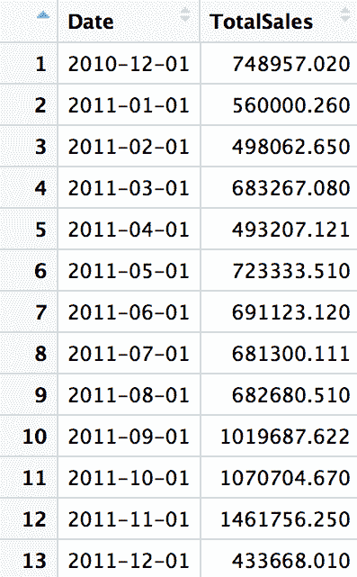

你还可以通过折线图报告时间序列的销售收入数据，如下所示：

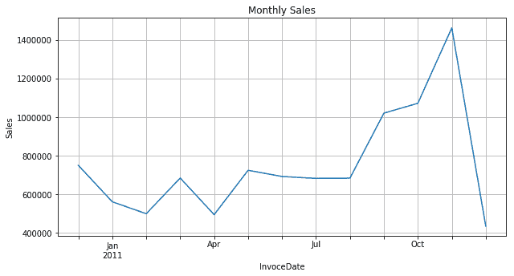

我们将在本章末的 Python 和 R 练习中讨论更多关于报告 KPI 时可以使用的不同类型的图表和数据可视化方式。

# 每客户获取成本（CPA）

另一个衡量营销效果的方法是 CPA（每客户获取成本）。这个 KPI 指标告诉你，通过营销活动获取一个客户的成本是多少。高 CPA 意味着获取新客户的成本较高，而低 CPA 显然意味着获取新客户的成本较低。根据不同的业务类型，即使 CPA 较高，你仍然可以拥有一个非常有利可图的营销活动。例如，如果你销售的是非常奢华且高端的产品，目标客户群体较小，获取这些客户的成本较高，那么你的 CPA 可能较高，但你所获得的每个客户的价值可能更高，从而导致一个有利可图的营销活动。

我们将看一下以下这个假设案例：

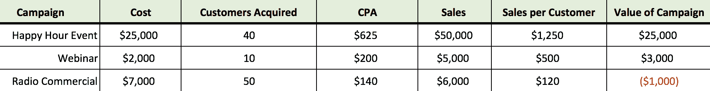

如果你查看这个电子表格，**欢乐时光活动**是最昂贵的营销活动，无论是从总成本还是 CPA 来看。然而，它产生了最多的**销售额**和**每客户销售额**；因此，它是最有价值的活动。另一方面，**广播广告**的 CPA 最低，尽管总成本是第二高的，因为它帮助企业获得了最多的客户。然而，这些客户的总销售额并没有超过该活动的总成本，并给公司带来了净亏损。

即使这是一个假设情境，类似的情况也可能发生在现实生活中。营销活动，比如**欢乐时光活动**和**网络研讨会**，比**广播广告**更能精准地瞄准客户。通过高度精准的营销活动获取的客户质量比通过非精准营销活动获取的客户好得多。

现在我们已经看到如何分解营销活动结果，以更深入地分析成本效益，我们将看看一些常用的数字营销 KPI。

# 数字营销 KPI

随着营销渠道选择的增加，如社交网络服务、博客和搜索引擎，报告数字营销效果变得越来越重要。之前讨论过的 KPI、销售收入和获取成本，同样适用于数字营销领域。

作为一个例子，基于单一归因逻辑，你可以分析通过不同社交网络服务（如 Facebook、LinkedIn 和 Instagram）生成了多少销售。你还可以分析通过这些营销渠道获得了多少客户，并查看各个数字营销活动的 CPA 和所生成的价值。让我们来讨论更多的数字营销 KPI：

+   **点击率**（**CTR**）是另一个数字营销中常常关注的 KPI。CTR 是观看了广告并点击广告的人的百分比。公式如下：

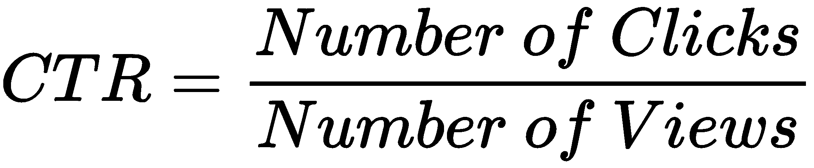

点击率（CTR）是数字营销渠道中的一个重要指标，因为它衡量了你的在线营销在将流量引导到你的网站方面的效果。

+   然后，你可以使用**潜在客户比率**来衡量有多少网站流量可以转化为潜在客户。通常，只有一部分网站流量适合成为你的客户。这些**营销合格潜在客户**（**MQL**）是那些已经准备好接受营销的潜在客户，符合特定商业标准，有可能成为会购买的客户，基于他们的特征。当你开始对这些合格的潜在客户进行营销时，你也应该关注转化率。

+   **转化率**是将潜在客户转化为活跃客户的百分比。你可以根据你的营销目标来定义什么应当视为转化。如果你的目标是查看有多少潜在客户变成了付费客户，那么你可以按照类似下面的公式计算转化率：

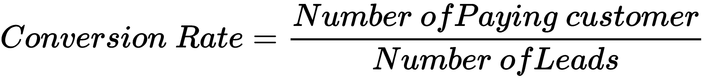

如果你的目标是查看有多少潜在客户在你的网站上注册，那么你可以按照以下公式计算转化率：

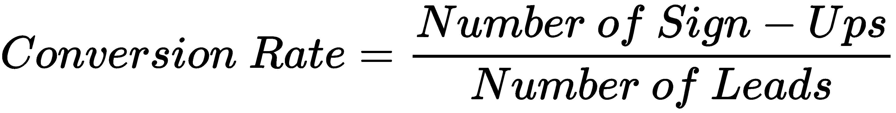

到目前为止，我们已经查看了各种 KPI，并讨论了这些 KPI 如何帮助你跟踪营销工作的进展和效果。接下来，我们将看看如何使用 Python 和/或 R 来计算这些 KPI 并进行可视化。如果你计划使用本书中介绍的两种编程语言之一，Python 或 R，你可以跳过并直接进入你想要学习的部分。

# 使用 Python 计算和可视化 KPI

在本节中，我们将讨论如何使用 Python 计算和可视化我们在前几节中讨论的关键绩效指标（KPI）。我们将主要集中于使用银行营销数据分析转化率。对于那些希望使用 R 进行本次练习的读者，您可以跳到下一节。我们将使用`pandas`和`matplotlib`库来操作和分析数据，并构建各种图表，以准确报告营销工作的进展和表现。

在本节的练习中，我们将使用*UCI 的银行营销数据集*，可以通过以下链接找到：[`archive.ics.uci.edu/ml/datasets/bank+marketing`](https://archive.ics.uci.edu/ml/datasets/bank+marketing)。您可以访问该链接，并通过点击左上角的`Data Folder`链接下载数据。对于本次练习，我们下载了`bank-additional.zip`数据，并将使用其中的`bank-additional-full.csv`文件。

当您打开这个`bank-additional-full.csv`文件时，您会注意到使用分号（`;`）作为分隔符，而不是逗号（`,`）。为了加载这些数据，您可以使用以下代码将数据读取到`pandas`的`DataFrame`中：

```py
import pandas as pd

df = pd.read_csv('../data/bank-additional-full.csv', sep=';')
```

正如您在这段代码中看到的，我们导入了`pandas`库，并使用别名`pd`，我们还使用`read_csv`函数来加载数据。对于除逗号外的其他分隔符，您可以在`read_csv`函数中使用`sep`参数来定义自定义分隔符。

如果您查看数据下载页面中的字段描述（[`archive.ics.uci.edu/ml/datasets/bank+marketing`](https://archive.ics.uci.edu/ml/datasets/bank+marketing)），您会发现输出变量`y`（它包含客户是否订阅定期存款的信息）被编码为`'yes'`或`'no'`。为了简化我们的转化率计算，我们将把该变量编码为`'yes'`对应`1`，`'no'`对应`0`。您可以使用以下代码进行编码：

```py
df['conversion'] = df['y'].apply(lambda x: 1 if x == 'yes' else 0)
```

正如您在这段代码中看到的，我们使用`apply`函数将变量`y`中的`'yes'`编码为`1`，将`'no'`编码为`0`，然后将这些编码后的数据作为新列`conversion`添加进去。代码和我们在 Jupyter Notebook 中加载的数据如下所示：

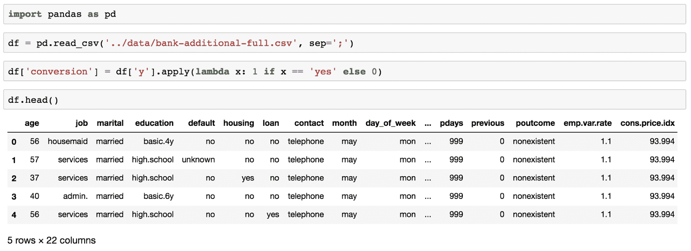

现在我们已经成功将数据读取到`pandas`的`DataFrame`中，我们将开始查看如何使用各种方法和图表来分析和可视化转化率。

# 聚合转化率

首先，我们将查看聚合转化率。我们可以通过将订阅定期存款的客户总数除以数据中客户的总数来计算这个指标。由于我们已经将输出变量编码为`1`（表示已转化）和`0`（表示未转化），并将其存储在名为`conversion`的列中，我们可以简单地对这一列求和来获得转化的总数。

以下代码片段展示了我们如何对`conversion`列进行求和，并获得数据中客户的总数：

```py
# total number of conversions
df.conversion.sum()
# total number of clients in the data (= number of rows in the data)
df.shape[0]
```

以下是我们在 Jupyter Notebook 中进行转化率计算的代码：

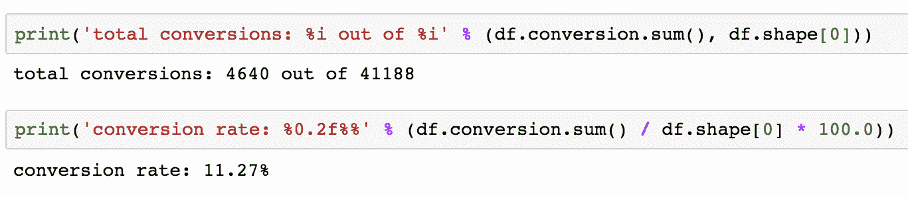

如你所见，在 Jupyter Notebook 中的代码输出结果中，我们从总计`41188`名银行客户中转换了`4640`名客户，这表明总体转化率为`11.27%`。在接下来的部分，我们将分析这些转化率如何根据不同年龄组的变化。

# 按年龄的转化率

总体转化率告诉我们营销活动的整体表现。然而，它并没有给我们太多的洞察。当我们报告并跟踪营销进展时，通常需要深入分析数据，将客户群体细分为多个部分，并计算每个部分的关键绩效指标（KPI）。我们将首先按`age`将数据划分为更小的细分，并查看不同年龄组的转化率差异。

我们首先来看以下代码：

```py
conversions_by_age = df.groupby(
    by='age'
)['conversion'].sum() / df.groupby(
    by='age'
)['conversion'].count() * 100.0
```

如你所见，在这段代码中，我们使用了`groupby`函数按年龄计算转化率。

我们首先根据变量名`age`进行分组，并使用`sum`函数对`conversion`列进行求和，以获得每个年龄段的总转化数。然后，我们再次按`age`进行分组，使用`count`函数统计每个年龄段记录的数量。

使用这两项计算，我们可以按`age`计算每个年龄段的转化率，如代码所示。以下是每个`age`的部分转化率计算结果：

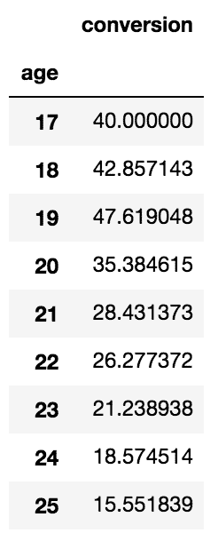

另一种查看不同客户年龄段转化率的方法是通过绘制折线图，如下图所示：

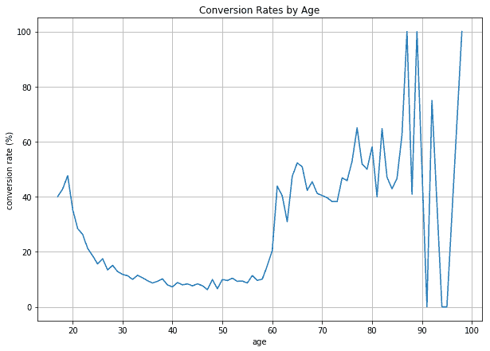

用于可视化不同年龄段转化率的代码如下所示：

```py
ax = conversions_by_age.plot(
    grid=True,
    figsize=(10, 7),
    title='Conversion Rates by Age'
)

ax.set_xlabel('age')
ax.set_ylabel('conversion rate (%)')

plt.show()
```

如代码所示，我们使用了之前构建的`conversions_by_age`变量和`plot`函数来绘制折线图。如你从代码中看到的那样，可以通过名为`figsize`的参数改变图形的大小，通过名为`title`的参数改变图表的标题。为了更改*X*轴和*Y*轴的标签，可以使用`set_xlabel`和`set_ylabel`函数。

在之前的折线图中，有一点值得注意的是，老年组的数据显示似乎有很多噪音。对于`70`岁或以上的人群，转化率波动较大，如果你查看数据，会发现这主要是因为这个年龄组的客户数量相对较少，和其他年龄组相比差距较大。

为了减少这种不必要的噪音，我们可以将多个年龄组合并。在本练习中，我们将银行客户根据年龄分为六个不同的组——`18`到`30`岁，`30`到`40`岁，`40`到`50`岁，`50`到`60`岁，`60`到`70`岁，以及`70`岁及以上。可以使用以下代码将客户分组：

```py
df['age_group'] = df['age'].apply(
    lambda x: '[18, 30)' if x < 30 else '[30, 40)' if x < 40 \
        else '[40, 50)' if x < 50 else '[50, 60)' if x < 60 \
        else '[60, 70)' if x < 70 else '70+'
)
```

如果你查看这段代码，我们正在对`age`列应用`apply`函数，将客户分为六个不同的年龄组，并将这些数据添加到一个名为`age_group`的新列中。为了计算这些新创建的年龄组的转化率，我们可以使用以下代码：

```py
conversions_by_age_group = df.groupby(
    by='age_group'
)['conversion'].sum() / df.groupby(
    by='age_group'
)['conversion'].count() * 100.0
```

与之前的情况类似，我们使用`groupby`、`sum`和`count`函数来计算这六个不同年龄组的转化率。结果数据如下所示：

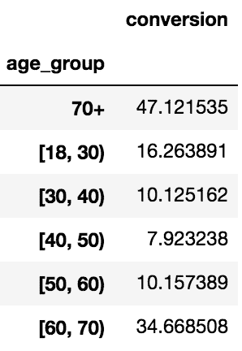

从这个结果可以看出，各年龄组之间的差异比之前要小得多，尤其是在老年组。我们可以使用条形图来可视化这些数据，如下所示的屏幕截图所示：

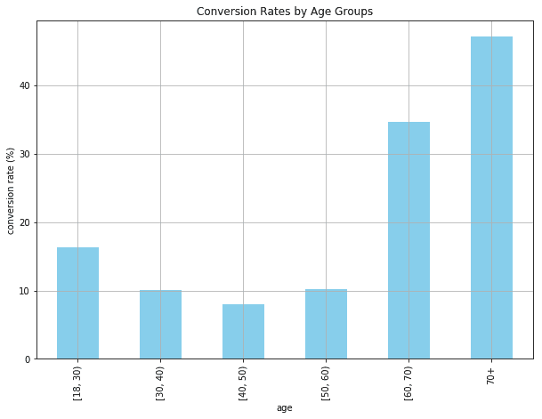

构建此条形图的代码如下所示：

```py
ax = conversions_by_age_group.loc[
    ['[18, 30)', '[30, 40)', '[40, 50)', '[50, 60)', '[60, 70)', '70+']
].plot(
    kind='bar',
    color='skyblue',
    grid=True,
    figsize=(10, 7),
    title='Conversion Rates by Age Groups'
)

ax.set_xlabel('age')
ax.set_ylabel('conversion rate (%)')

plt.show()
```

正如你从这段代码中看到的，我们使用了之前用来绘制线形图的相同`plot`函数。唯一的区别是`kind`参数，通过它我们可以定义想要绘制的不同类型的图形。在这里，我们将`kind`参数的值设置为`bar`，以绘制条形图。

你可以在以下仓库中找到完整的代码：[`github.com/yoonhwang/hands-on-data-science-for-marketing/blob/master/ch.2/python/ConversionRate.ipynb`](https://github.com/yoonhwang/hands-on-data-science-for-marketing/blob/master/ch.2/python/ConversionRate.ipynb)。

# 转化与未转化

另一个我们可以观察的方面是已转化客户与未转化客户之间的人口统计差异。这种分析可以帮助我们识别在营销活动中，已转化组与未转化组之间的区别，帮助我们更好地了解目标客户以及哪些类型的客户更容易响应我们的营销活动。在本练习中，我们将比较已转化组与未转化组之间婚姻状况的分布。

我们将首先计算每个婚姻状况的转化和未转化的数量。以下代码展示了如何使用`pandas`函数来计算这一点：

```py
pd.pivot_table(df, values='y', index='marital', columns='conversion', aggfunc=len)
```

从这段代码中可以看出，我们正在使用`pandas`库中的`pivot_table`函数。我们根据`marital`和`conversion`列进行分组，其中`marital`将成为新`DataFrame`的索引，`conversion`将成为列。通过`aggfunc`参数，我们可以指定要执行的聚合类型。在这里，我们使用`len`函数简单地计算每个组的客户数量。生成的数据如下所示：

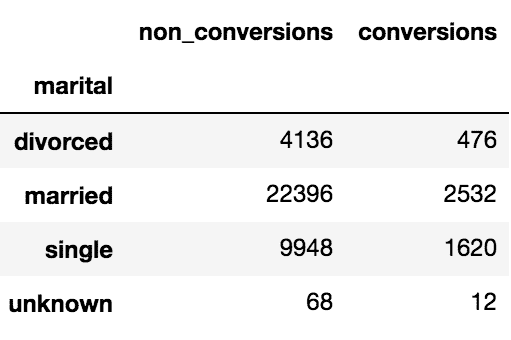

另一种表示这些数据的方式是使用饼图，如下所示：

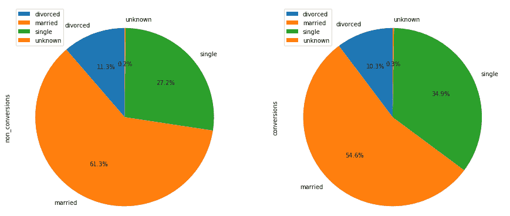

以下代码展示了我们如何构建这些饼图：

```py
conversions_by_marital_status_df.plot(
    kind='pie',
    figsize=(15, 7),
    startangle=90,
    subplots=True,
    autopct=lambda x: '%0.1f%%' % x
)

plt.show()
```

从这段代码中可以看出，我们使用了与之前相同的`plot`函数，但使用`pie`作为我们希望构建的图表类型。你可以使用`autopct`参数来格式化饼图中每个群体的标签。

与数据输出的表格格式相比，饼图使得理解数据的整体分布变得更加容易。通过饼图，我们可以轻松看到`married`群体在转化组和非转化组中占据最大的比例，而`single`群体则排在第二。使用饼图，我们可以轻松地可视化两个群体之间的相似性和差异。

# 按年龄和婚姻状况的转化

到目前为止，我们已经根据一个标准对数据进行了汇总。然而，有时你可能希望根据多个列来对数据进行分组。在本节中，我们将讨论如何根据多个标准分析和报告转化率。作为一个练习，我们将使用前一节中构建的年龄组和婚姻状况作为两个列进行分组。

让我们首先看看代码：

```py
age_marital_df = df.groupby(['age_group', 'marital'])['conversion'].sum().unstack('marital').fillna(0)

age_marital_df = age_marital_df.divide(
    df.groupby(
        by='age_group'
    )['conversion'].count(), 
    axis=0
)
```

从这段代码中可以看出，我们正在根据两个列`age_group`和`marital`对数据进行分组，并求出转化的数量。然后，我们将这个数量除以每个群体中的客户总数。生成的数据如下所示：

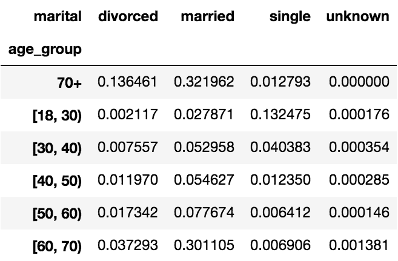

如您从这些数据中看到的，我们现在可以根据两个标准（年龄组和婚姻状况）看到转化率的分布。例如，单身且年龄在**18**到**30**岁之间的客户转化率为 13.25%，而已婚且年龄在**60**到**70**岁之间的客户转化率为 30.11%。另一种可视化这些数据的方式是使用如下所示的条形图：

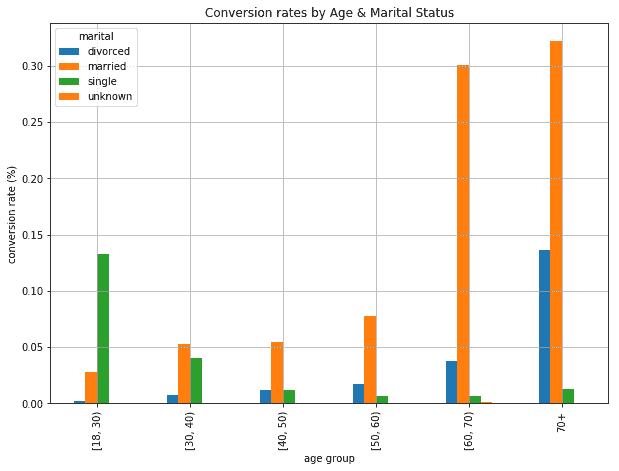

在这张条形图中，我们可以清楚地看到每个年龄和婚姻状态群体的转化率分布。我们用来构建这张条形图的代码如下所示：

```py
ax = age_marital_df.loc[
    ['[18, 30)', '[30, 40)', '[40, 50)', '[50, 60)', '[60, 70)', '70+']
].plot(
    kind='bar', 
    grid=True,
    figsize=(10,7)
)

ax.set_title('Conversion rates by Age & Marital Status')
ax.set_xlabel('age group')
ax.set_ylabel('conversion rate (%)')

plt.show()
```

与之前的情况类似，我们使用了`pandas`库的`plot`函数，并将`bar`传递给该函数的`kind`参数。由于`DataFrame`对象`age_marital_df`对于每种婚姻状态有四列，并且按年龄组进行索引，因此`plot`函数为每个年龄组的每种婚姻状态构建了一个包含四个条形的条形图。

如果您想要将每个年龄组的四个条形图叠加起来，您可以使用以下代码绘制堆叠条形图：

```py
ax = age_marital_df.loc[
    ['[18, 30)', '[30, 40)', '[40, 50)', '[50, 60)', '[60, 70)', '70+']
].plot(
    kind='bar', 
    stacked=True,
    grid=True,
    figsize=(10,7)
)

ax.set_title('Conversion rates by Age & Marital Status')
ax.set_xlabel('age group')
ax.set_ylabel('conversion rate (%)')

plt.show()
```

如您在这段代码中看到的，唯一的区别是我们在代码中使用的参数`stacked`。当此参数设置为`True`时，它将构建一个堆叠条形图，效果如下：

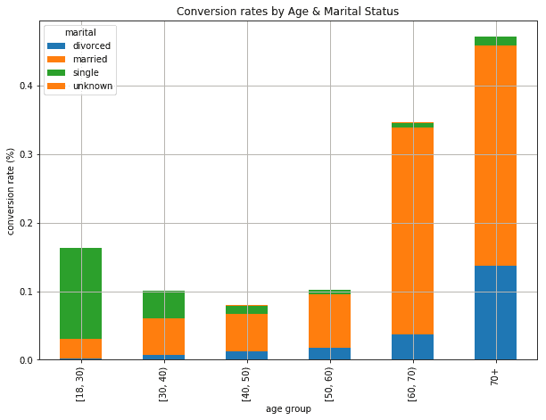

从这个堆叠条形图中可以看到，不同的婚姻状态在每个年龄组中被叠加在一起。通过这种方式，我们不仅可以轻松看到不同年龄组的转化率的整体趋势，还可以看到每个年龄组中不同婚姻状态的转化客户的比例。

我们在此 Python 练习中使用的完整代码和 Jupyter Notebook 可以在以下仓库中找到：[`github.com/yoonhwang/hands-on-data-science-for-marketing/blob/master/ch.2/python/ConversionRate.ipynb`](https://github.com/yoonhwang/hands-on-data-science-for-marketing/blob/master/ch.2/python/ConversionRate.ipynb)。

# 使用 R 计算和可视化 KPI

在本节中，我们将讨论如何使用 R 计算和可视化我们在前几节中讨论的 KPI。我们将主要专注于使用银行营销数据分析转化率。对于那些希望使用 Python 进行此练习的读者，您可以在前一节中找到 Python 的练习代码。我们将使用 R 中的`dplyr`和`ggplot2`库来处理和分析数据，并构建各种图表，以准确报告营销工作中的进展和效果。`dplyr`库提供了多种用于数据科学和机器学习任务的数据处理功能。

本节练习中，我们将使用**UCI**的**银行营销数据集**，可以通过以下链接找到：[`archive.ics.uci.edu/ml/datasets/bank+marketing`](https://archive.ics.uci.edu/ml/datasets/bank+marketing)。您可以点击此链接，在左上角点击`Data Folder`链接下载数据。为了进行此练习，我们下载了`bank-additional.zip`数据，并将在该压缩文件中的`bank-additional-full.csv`文件中使用数据。

当您打开这个`bank-additional-full.csv`文件时，您会注意到文件中使用分号（`;`）作为分隔符，而不是逗号（`,`）。为了加载此数据，您可以使用以下代码将数据读取到一个`DataFrame`中：

```py
conversionsDF <- read.csv(
  file="~/Documents/data-science-for-marketing/ch.2/data/bank-additional-full.csv", 
  header=TRUE, 
  sep=";"
)
```

从这段代码中可以看出，我们使用`read.csv`函数来加载数据。对于逗号以外的分隔符，你可以在`read.csv`函数中通过`sep`参数定义自定义分隔符。如果你的数据文件包含标题行，你可以将`header`参数设置为`TRUE`。另一方面，如果数据文件没有标题行，并且数据从第一行开始，你可以将其设置为`FALSE`。

如果你查看数据下载页面中的字段描述（[`archive.ics.uci.edu/ml/datasets/bank+marketing`](https://archive.ics.uci.edu/ml/datasets/bank+marketing)），输出变量`y`表示客户是否订阅了定期存款，其信息编码为`'yes'`或`'no'`。为了简化我们的转化率计算，我们将该变量编码为`'yes'`对应`1`，`'no'`对应`0`。你可以使用以下代码来进行编码：

```py
# Encode conversions as 0s and 1s
conversionsDF$conversion <- as.integer(conversionsDF$y) - 1
```

从这段代码片段可以看出，我们使用了`as.integer`函数将`'yes'`编码为`1`，将`'no'`编码为`0`，并将这个编码后的数据作为新列`conversion`添加到数据中。由于`as.integer`函数默认会将`'no'`和`'yes'`分别编码为`1`和`2`，所以我们将其值减去`1`。现在，数据在 RStudio 中的显示情况如下：

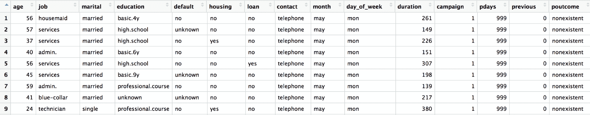

现在我们已经成功将数据读取到`R`的`DataFrame`中，接下来我们将开始探索如何分析和可视化转化率，使用不同的方法和图表。

# 总体转化率

首先，我们要查看的是总体转化率。我们可以通过将订阅了定期存款的客户数量除以数据中总客户数量来计算这个指标。由于我们已经将输出变量编码为 1（表示已转化）和 0（表示未转化），并将其存储在名为`conversion`的列中，我们可以简单地对该列求和，得到转化的总客户数量。以下代码片段展示了我们如何对`conversion`列求和并得到数据中的总客户数：

```py
# total number of conversions
sum(conversionsDF$conversion)

# total number of clients in the data (= number of records in the data)
nrow(conversionsDF)
```

从这段代码中可以看出，我们使用了 R 中的`sum`函数来计算总的转化数量，并使用`nrow`函数来统计数据集中行的数量。顺便提一句，和`nrow`类似，你可以使用`ncol`函数来统计`DataFrame`的列数。

以下截图展示了我们在 RStudio 中的代码显示情况：

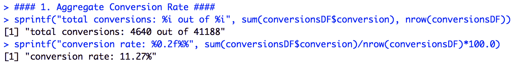

从 RStudio 中的代码输出可以看出，我们在`41188`个银行客户中，共有`4640`个客户进行了转化，这表明总体转化率为`11.27%`。在接下来的部分，我们将分析不同年龄组的转化率差异。我们使用了`sprintf`函数来格式化包含整数和浮点数的字符串。

# 按年龄分组的转化率

聚合转化率告诉我们营销活动的整体表现。然而，它并没有给我们太多的洞察。在报告和跟踪营销进展时，我们通常希望更深入地分析数据，将客户基础拆分为多个细分市场，并计算各个细分市场的 KPI。我们将首先按年龄将数据拆分成更小的段，并查看不同年龄组的转化率差异。

我们首先来看以下这段代码：

```py
conversionsByAge <- conversionsDF %>% 
  group_by(Age=age) %>% 
  summarise(TotalCount=n(), NumConversions=sum(conversion)) %>%
  mutate(ConversionRate=NumConversions/TotalCount*100.0)
```

这段代码中的管道操作符`%>%`是你可以按顺序应用不同函数的方式。在这段代码中，我们将`conversionDF`传递给`group_by`函数，然后将`group_by`函数的结果传递给`summarise`函数，最后传递给`mutate`函数。

在`group_by`函数中，我们通过`age`列对`DataFrame`进行分组。然后，针对每个年龄组，我们使用函数`n()`计算每组的记录数，并将其命名为`TotalCount`。同时，我们使用`sum`函数对每个年龄组的`conversion`列求和，并将其命名为`NumConversions`。

最后，我们使用`mutate`函数，该函数添加新的变量，同时保留原始的`DataFrame`，来计算每个年龄组的转化率。如你所见，我们只是将`NumConversion`除以`TotalCount`，然后乘以`100.0`来获得转化率。

结果数据如下所示：

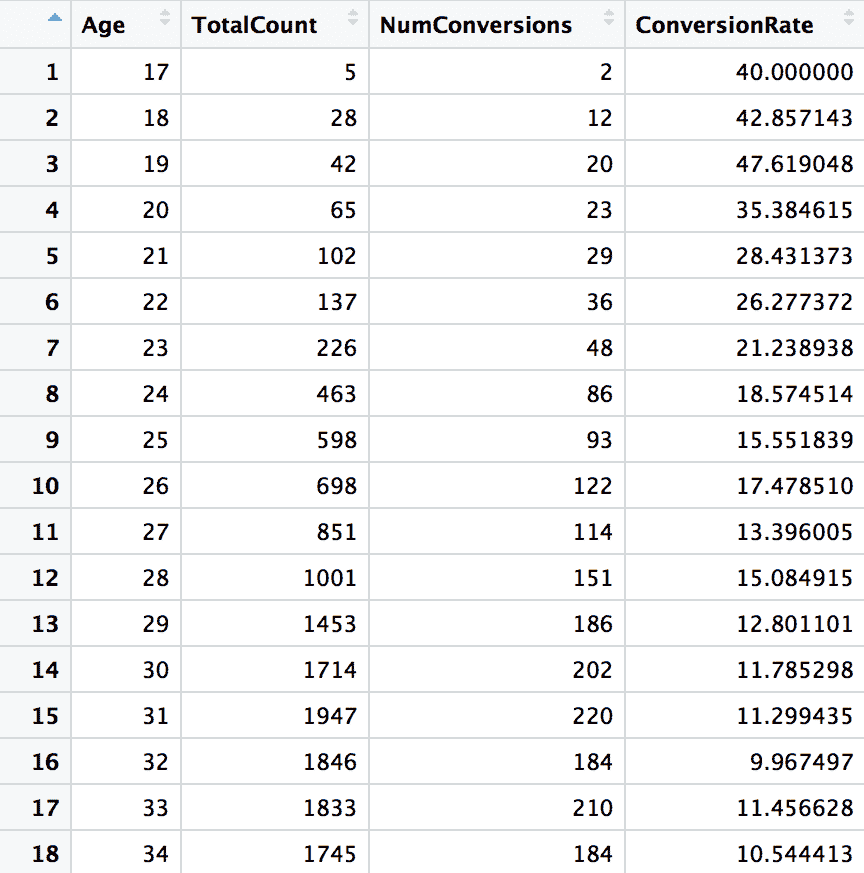

查看不同年龄段客户的转化率的另一种方法是绘制折线图，如下图所示：

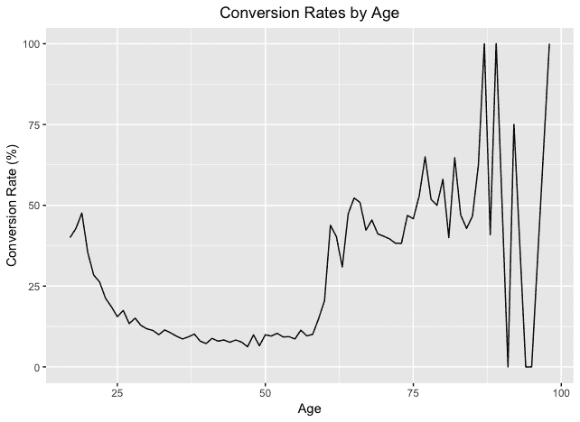

用于可视化不同年龄段转化率的代码如下所示：

```py
# line chart
ggplot(data=conversionsByAge, aes(x=Age, y=ConversionRate)) +
  geom_line() +
  ggtitle('Conversion Rates by Age') +
  xlab("Age") +
  ylab("Conversion Rate (%)") +
  theme(plot.title = element_text(hjust = 0.5))
```

从这段代码中可以看出，我们使用`ggplot`函数初始化一个`ggplot`对象，数据为`conversionsByAge`，其中`Age`列作为*x*轴，`ConversionRate`列作为*y*轴。

然后，我们使用`geom_line`函数连接观测值，绘制折线图。你可以使用`ggtitle`函数更改图表标题。此外，你还可以使用`xlab`和`ylab`函数分别重命名 x 轴和 y 轴标签。

在前一张折线图中，显而易见的一点是，较高年龄组的噪声似乎很多。70 岁或以上的转化率变化较大，如果你查看数据，会发现这主要是因为该年龄组的客户数量相对较少，与其他年龄组相比。

为了减少这种不必要的噪音，我们可以将多个年龄段合并。在本练习中，我们根据银行客户的年龄将其分为六个不同的组——`18`到`30`岁之间、`30`到`40`岁之间、`40`到`50`岁之间、`50`到`60`岁之间、`60`到`70`岁之间、以及`70`岁及以上。以下代码可以用于将客户分组：

```py
# b. by age groups
conversionsByAgeGroup <- conversionsDF %>% 
  group_by(AgeGroup=cut(age, breaks=seq(20, 70, by = 10)) ) %>% 
  summarise(TotalCount=n(), NumConversions=sum(conversion)) %>%
  mutate(ConversionRate=NumConversions/TotalCount*100.0)

conversionsByAgeGroup$AgeGroup <- as.character(conversionsByAgeGroup$AgeGroup)
conversionsByAgeGroup$AgeGroup[6] <- "70+"
```

与之前的情况一样，我们使用了`group_by`函数根据`age`列将`conversionsDF`数据分组。这里的不同之处在于，我们如何使用`cut`函数为每个年龄组创建年龄范围。

`breaks`参数定义了`cut`函数将如何划分`DataFrame`。参数`seq(20, 70, by = 10)`表示我们将从`20`到`70`以`10`为增量创建一个序列。一旦数据按这些年龄段分组，其他操作与之前相同。我们使用`summarise`和`mutate`函数来计算`TotalCount`、`NumConversions`和`ConversionRate`列。

生成的`DataFrame`在以下截图中展示：

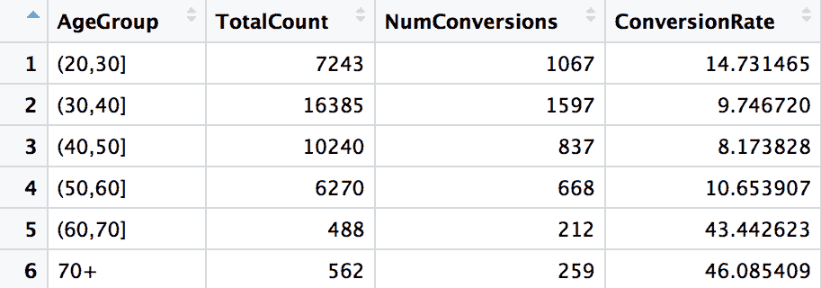

从中可以看出，每个年龄组的差异远小于之前，尤其是在老年组。我们可以通过条形图来可视化这些数据，如下所示：

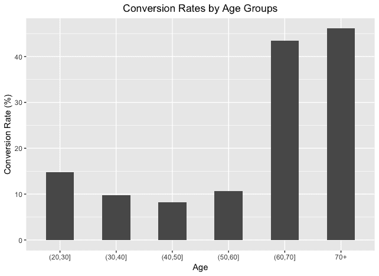

构建此条形图的代码如下所示：

```py
# bar chart
ggplot(conversionsByAgeGroup, aes(x=AgeGroup, y=ConversionRate)) +
  geom_bar(width=0.5, stat="identity") +
  ggtitle('Conversion Rates by Age Groups') +
  xlab("Age") +
  ylab("Conversion Rate (%)") +
  theme(plot.title = element_text(hjust = 0.5)) 
```

从这段代码可以看出，我们将`conversionsByAgeGroup`数据传递给了`ggplot`对象，*x*轴使用了`AgeGroup`列，*y*轴使用了`ConversionRate`列。我们使用了`geom_bar`函数来构建条形图。

`width`参数定义了条形图中每个条形的宽度。与之前的折线图类似，你可以使用`ggtitle`来重新命名图表标题，使用`xlab`和`ylab`函数来重新命名* x *轴和* y *轴的标签。

你可以在以下仓库中找到完整的代码：[`github.com/yoonhwang/hands-on-data-science-for-marketing/blob/master/ch.2/R/ConversionRate.R`](https://github.com/yoonhwang/hands-on-data-science-for-marketing/blob/master/ch.2/R/ConversionRate.R)。

# 转化与非转化

另一个我们可以查看的方面是转化客户与非转化客户之间的群体差异。这种类型的分析可以帮助我们识别在市场营销活动中，转化组与非转化组的不同之处，帮助我们更好地理解目标客户，并了解哪些类型的客户对我们的营销活动反应更好。在本练习中，我们将比较转化组与非转化组之间婚姻状况的分布。

我们将首先计算每个婚姻状况下的转化和非转化数量。以下代码展示了我们如何使用`R`函数来计算这一点：

```py
conversionsByMaritalStatus <- conversionsDF %>% 
 group_by(Marital=marital, Conversion=conversion) %>% 
 summarise(Count=n())
```

从这段代码可以看出，我们正在使用`dplyr`包中的管道操作符`%>%`将`DataFrame`，`conversionsDF`传递给`group_by`函数，然后传递给`summarise`函数。在`group_by`函数中，我们按两个列进行分组，`marital`和`conversion`。在`summarise`函数中，我们只是通过使用`n`函数计算每个组中的记录数量。

结果数据显示在以下截图中：

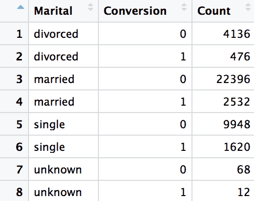

另一种表示这些数据的方式是使用饼图：

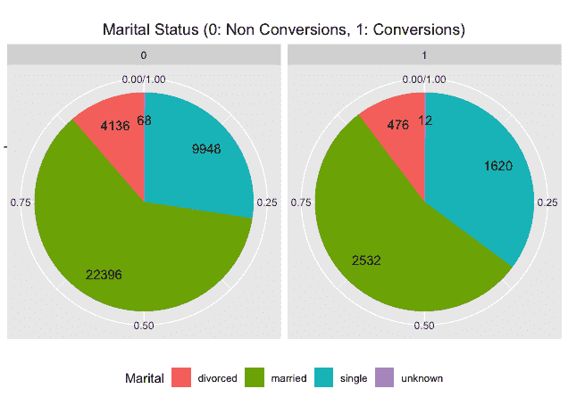

以下代码展示了我们如何在 R 中构建这些饼图：

```py
# pie chart
ggplot(conversionsByMaritalStatus, aes(x="", y=Count, fill=Marital)) + 
  geom_bar(width=1, stat = "identity", position=position_fill()) +
  geom_text(aes(x=1.25, label=Count), position=position_fill(vjust = 0.5)) +
  coord_polar("y") +
  facet_wrap(~Conversion) +
  ggtitle('Marital Status (0: Non Conversions, 1: Conversions)') +
  theme(
    axis.title.x=element_blank(),
    axis.title.y=element_blank(),
    plot.title=element_text(hjust=0.5),
    legend.position='bottom'
  )
```

在 R 中构建饼图时，我们使用相同的`geom_bar`函数，就像我们在构建柱状图时一样。这里的区别在于`coord_polar("y")`，它将柱状图转换为饼图。接着，我们使用`facet_wrap`函数根据`Conversion`列创建两列饼图。这会生成两个饼图，一个用于转化组，另一个用于非转化组。

与数据输出的表格格式相比，饼图更容易理解数据的整体分布。通过饼图，我们可以很容易看到`married`组在转化组和非转化组中都占据了最大的比例，而`single`组位居第二。通过饼图，我们可以轻松地可视化两个组之间的相似性和差异。

# 按年龄和婚姻状况分组的转化情况

到目前为止，我们已经根据一个标准对数据进行了汇总。然而，有时你可能希望根据多个列来分组数据。在本节中，我们将讨论如何根据多个标准来分析和报告转化率。作为练习，我们将使用上一节中构建的年龄组和婚姻状况作为两个分组标准。

让我们先看一下代码：

```py
#### 5\. Conversions by Age Groups & Marital Status ####
conversionsByAgeMarital <- conversionsDF %>% 
  group_by(AgeGroup=cut(age, breaks= seq(20, 70, by = 10)), Marital=marital) %>% 
  summarise(Count=n(), NumConversions=sum(conversion)) %>%
  mutate(TotalCount=sum(Count)) %>%
  mutate(ConversionRate=NumConversions/TotalCount)

conversionsByAgeMarital$AgeGroup <- as.character(conversionsByAgeMarital$AgeGroup)
conversionsByAgeMarital$AgeGroup[is.na(conversionsByAgeMarital$AgeGroup)] <- "70+"
```

类似于我们构建自定义年龄组时，我们在`group_by`中使用`cut`函数，将年龄分组为从`20`到`70`，每 10 岁一组。然而，这次我们也按`marital`列进行分组。

然后，我们使用`summarise`函数计算每个组中的记录数量`Count`，以及每个组中的转化次数`NumConversions`。接着，使用`mutate`函数计算每个年龄组的总记录数，命名为`TotalCount`，以及每个组的转化率，命名为`ConversionRate`。

结果数据显示在以下截图中：

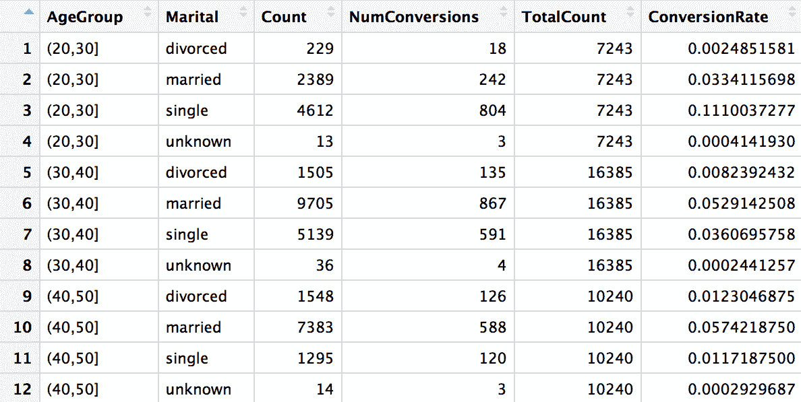

从这些数据中可以看出，我们现在可以根据两个标准来查看转化率的分布：年龄组和婚姻状况。例如，单身且年龄在**20**到**30**岁之间的客户转化率为 11.10%，而已婚且年龄在**40**到**50**岁之间的客户转化率为 5.74%。

另一种可视化这些数据的方法是使用条形图：

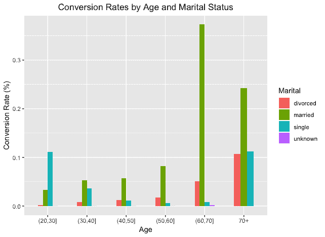

在这个条形图中，我们可以轻松地看到每个年龄组和婚姻状况组的转化率分布。我们用来构建这个条形图的代码如下：

```py
# bar chart
ggplot(conversionsByAgeMarital, aes(x=AgeGroup, y=ConversionRate, fill=Marital)) + 
  geom_bar(width=0.5, stat="identity", position="dodge") +
  ylab("Conversion Rate (%)") +
  xlab("Age") +
  ggtitle("Conversion Rates by Age and Marital Status") +
  theme(plot.title=element_text(hjust=0.5))
```

在这里，我们创建了一个`ggplot`对象，使用了`conversionsByAgeMarital`数据。我们使用`AgeGroup`作为*X*轴，`ConversionRate`作为*Y*轴，同时用`Marital`列为不同的婚姻状况类型指定不同的颜色。接着，我们通过使用`geom_bar`函数来构建条形图。通过这个配置，`ggplot`会构建一个按婚姻状况细分的转化率与年龄组之间的堆积条形图，这一点在之前的条形图中已经展示过了。

如果你想要为每个年龄组堆叠这四个条形图，可以使用以下代码来绘制堆积条形图：

```py
# stacked bar chart
ggplot(conversionsByAgeMarital, aes(x=AgeGroup, y=ConversionRate, fill=Marital)) + 
  geom_bar(width=0.5, stat="identity", position="stack") +
  ylab("Conversion Rate (%)") +
  xlab("Age") +
  ggtitle("Conversion Rates by Age and Marital Status") +
  theme(plot.title=element_text(hjust=0.5))
```

从这段代码中可以看出，唯一的不同之处在于`geom_bar`函数中的代码`position="stack"`。如果你将值`"dodge"`传递给`geom_bar`函数的`position`参数，它将创建一个未堆叠的条形图。而如果你将值`"stack"`传递给`geom_bar`函数的`position`参数，它将创建一个堆积条形图，效果如下：

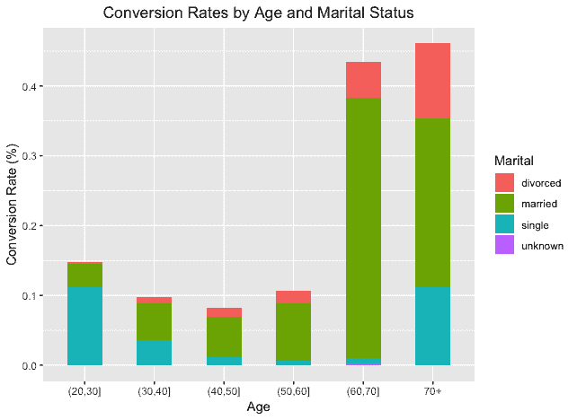

从这个堆积条形图中可以看到，不同的婚姻状况在每个年龄组中堆叠在一起。这样，我们不仅可以轻松地看到不同年龄组之间转化率的总体趋势，还可以看到每个年龄组中不同婚姻状况的转化客户比例。

我们在这个 R 练习中使用的完整代码可以在以下仓库中找到：[`github.com/yoonhwang/hands-on-data-science-for-marketing/blob/master/ch.2/R/ConversionRate.R`](https://github.com/yoonhwang/hands-on-data-science-for-marketing/blob/master/ch.2/R/ConversionRate.R)。

# 总结

在本章中，我们讨论了如何使用描述性分析来报告和分析营销努力的进展和表现。我们讨论了营销中常用的各种关键绩效指标（KPIs），用以跟踪营销活动的进展。我们了解到，评估每个营销策略产生的销售收入有多么重要。在分析销售收入指标时，我们发现从不同角度进行分析非常关键。你可能不仅想查看总销售收入，还要查看时间序列（按月、季度或年度）的销售收入。你还可能希望查看归因于每个营销活动的销售收入，并分析每个活动为公司带来了多少收入。我们还讨论了 CPA 指标，通过这些指标你可以评估营销策略的成本效益。我们也学习了用于数字营销渠道的各种指标，比如点击率（CTR）、潜在客户转化率和转化率。正如我们在 Python 和 R 练习中所看到和实验的那样，我们可以对这些 KPI 指标进行更深入的多层次分析。

在下一章中，我们将学习如何应用数据科学和机器学习技术进行解释性分析。更具体地说，我们将讨论如何使用回归分析和模型来理解营销参与背后的驱动因素。我们还将在下一章中讲解如何解读回归分析结果。
