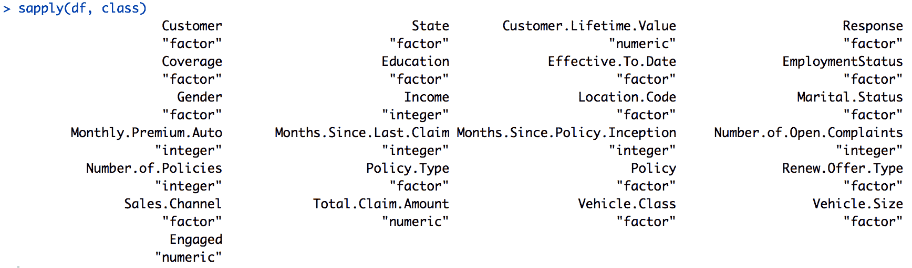

# 第三章：驱动营销参与度的因素

当你进行营销活动时，你需要重点关注并分析的一个重要指标是客户对营销活动的参与度。例如，在电子邮件营销中，客户参与度可以通过客户打开或忽略你的营销邮件的数量来衡量。客户参与度还可以通过单个客户访问网站的次数来衡量。成功的营销活动会吸引大量客户参与，而无效的营销活动不仅会导致客户参与度较低，还会对你的业务产生负面影响。客户可能会将你的邮件标记为垃圾邮件或取消订阅你的邮件列表。

为了理解是什么影响了客户的参与度，本章我们将讨论如何使用解释性分析（更具体地说，是回归分析）。我们将简要介绍解释性分析的定义，回归分析是什么，以及如何使用逻辑回归模型进行解释性分析。接着，我们将讨论如何在 Python 中使用`statsmodels`包来构建和解释回归分析结果。对于 R 程序员，我们将讨论如何使用`glm`来构建和解释回归分析结果。

本章将涵盖以下主题：

+   使用回归分析进行解释性分析

+   使用 Python 进行回归分析

+   使用 R 进行回归分析

# 使用回归分析进行解释性分析

在第二章中，*关键绩效指标与可视化*，我们讨论了**描述性分析**是什么，以及它如何帮助我们更好地理解数据集。我们通过使用各种可视化技术，并在 Python 和 R 中构建不同类型的图表进行了实验。

在本章中，我们将扩展我们的知识，开始讨论在营销中何时、如何以及为什么使用**解释性分析**。

# 解释性分析与回归分析

正如我们在第一章中简要讨论的，*数据科学与营销*，解释性分析的目的是回答我们为何使用数据，而描述性分析的目的是回答我们用数据做什么，如何使用数据。当你进行不同的营销活动时，你通常会发现某些营销活动的表现比其他活动好得多；你可能会想知道，为什么有些营销活动效果如此之好，而有些却没有。例如，你可能想了解哪些类型和群体的客户比其他人更频繁地打开你的营销邮件。另一个例子是，你可能想分析客户群体的哪些属性与更高的转化率和商品购买率密切相关。

通过解释性分析，你可以分析并理解与所需结果高度相关的关键因素。**回归分析**和回归模型常用于建模属性与结果之间的关系。简而言之，回归分析通过找到最能近似输出值的属性或特征函数来估算输出变量的值。回归分析中一种常用的形式是**线性回归**。顾名思义，在线性回归中，我们尝试通过特征的线性组合来估计输出变量。如果我们用*Y*表示输出变量，用*X[i]*表示每个特征，其中*i*是第*i*个特征，那么线性回归公式如下：


从上述公式中可以看到，输出变量*Y*表示为特征*X[i]*的线性组合。线性回归模型的目的是找到最能估算输出变量的截距*a*和系数*b[i]*，并利用给定的特征进行拟合。拟合的线性回归线大致如下所示（图片来源于 [`towardsdatascience.com/linear-regression-using-python-b136c91bf0a2`](https://towardsdatascience.com/linear-regression-using-python-b136c91bf0a2)）：


该图中的蓝色点表示数据点，红色线是拟合的或训练过的线性回归线。正如图表所示，线性回归试图通过特征的线性组合来估计目标变量。

在本章中，我们将讨论如何使用回归分析，尤其是**逻辑回归**模型，来理解是什么驱动了更高的客户参与度。

# 逻辑回归

**逻辑回归**是一种回归分析方法，通常用于输出变量是二元的情况（表示正面结果为 1，负面结果为 0）。与其他线性回归模型类似，逻辑回归模型通过特征变量的线性组合来估算输出。唯一的区别是模型估算的内容。与其他线性回归模型不同，逻辑回归模型估算的是事件的对数机会，或者换句话说，是正面事件和负面事件概率之间的对数比率。其公式如下：


左边的比率是成功的机会，表示成功的概率与失败的概率之间的比率。对数机会的曲线，也称为**logit 曲线**，如下所示：


逻辑回归模型的输出只是 logit 的逆，它的值范围从零到一。在本章中，我们将使用回归分析来理解是什么推动了客户参与度，输出变量将是客户是否对营销电话作出回应。因此，逻辑回归在这种情况下非常适用，因为输出是一个二元变量，可以取两个值：响应和未响应。在接下来的章节中，我们将讨论如何在 Python 和 R 中使用和构建逻辑回归模型，然后我们将讲解如何解读回归分析结果，以理解哪些客户属性与更高的营销参与度高度相关。

# 使用 Python 进行回归分析

在本节中，你将学习如何在 Python 中使用`statsmodels`包进行回归分析。对于那些希望使用 R 而非 Python 的读者，可以跳到下一节。在本节开始时，我们将通过使用`pandas`和`matplotlib`包更仔细地查看数据，然后我们将讨论如何使用`statsmodels`库构建回归模型并解读结果。

在本练习中，我们将使用 IBM Watson 提供的公开数据集之一，数据集可以在[`www.ibm.com/communities/analytics/watson-analytics-blog/marketing-customer-value-analysis/`](https://www.ibm.com/communities/analytics/watson-analytics-blog/marketing-customer-value-analysis/)找到。你可以点击链接下载 CSV 格式的数据文件。为了将该数据加载到你的 Jupyter Notebook 中，你可以运行以下代码：

```py
import matplotlib.pyplot as plt
import pandas as pd

df = pd.read_csv('../data/WA_Fn-UseC_-Marketing-Customer-Value-Analysis.csv')
```

与我们在第二章中做的类似，*关键绩效指标与可视化*，我们首先导入`matplotlib`和`pandas`包；使用`pandas`中的`read_csv`函数，我们可以将数据读取到`pandas` DataFrame 中。稍后我们将使用`matplotlib`进行数据分析和可视化。

加载后的 DataFrame，`df`，如下所示：


如我们在第二章中讨论的，*关键绩效指标与可视化*，DataFrame 的`shape`属性告诉我们 DataFrame 中行和列的数量，而`head`函数会显示数据集的前五条记录。一旦成功将数据读取到`pandas` DataFrame 中，数据应呈现如截图所示。

# 数据分析与可视化

在进行回归分析之前，我们首先要更详细地查看数据，以便更好地理解我们拥有的数据点以及数据中可以看到的模式。如果你查看数据，你会注意到有一列名为`Response`，它包含客户是否响应营销呼叫的信息。我们将使用这个字段作为客户参与度的衡量标准。为了进行后续的计算，最好将这个字段编码为数值型。让我们看一下以下代码：

```py
df['Engaged'] = df['Response'].apply(lambda x: 0 if x == 'No' else 1)
```

正如你在这段代码中看到的，我们使用`pandas`数据框的`apply`函数，将未响应营销呼叫的客户（`No`）编码为`0`，而响应的客户（`Yes`）编码为`1`。我们创建了一个名为`Engaged`的新字段，存储这些编码值。

# 参与率

我们首先要查看的是总体参与率。这个参与率简单来说就是响应营销呼叫的客户百分比。请看下面的代码：

```py
engagement_rate_df = pd.DataFrame(
    df.groupby('Engaged').count()['Response'] / df.shape[0] * 100.0
)
```

正如你从这段代码中看到的，我们使用`pandas`数据框的`groupby`函数按新创建的字段`Engaged`进行分组。接着，我们使用`count`函数统计每个`Engaged`组中的记录数（或客户数）。通过除以数据框中客户的总数并乘以`100.0`，我们得到参与率。结果如下所示：


为了更容易阅读，我们可以转置数据框（DataFrame），这意味着我们可以翻转数据框中的行和列。你可以通过使用数据框的`T`属性来转置`pandas`数据框。其效果如下所示：


如你所见，大约 14%的客户响应了营销呼叫，其余 86%的客户未做响应。

# 销售渠道

现在，让我们看看是否能在销售渠道和客户参与度之间找到任何明显的模式。我们将分析参与和未参与的客户在不同销售渠道中的分布。首先看一下以下代码：

```py
engagement_by_sales_channel_df = pd.pivot_table(
    df, values='Response', index='Sales Channel', columns='Engaged', aggfunc=len
).fillna(0.0)

engagement_by_sales_channel_df.columns = ['Not Engaged', 'Engaged']
```

正如你在这段代码中看到的，我们正在使用`pandas`库的`pivot_table`函数按`Sales Channel`和`Response`变量进行分组。运行这段代码后，`engagement_by_sales_channel_df`将包含如下数据：


正如你在上一节中已经注意到的，未参与营销活动的客户明显更多，因此在原始数据中很难直接看出参与客户与未参与客户在销售渠道分布上的差异。为了让这些差异更加直观地显现出来，我们可以使用以下代码构建饼图：

```py
engagement_by_sales_channel_df.plot(
    kind='pie',
    figsize=(15, 7),
    startangle=90,
    subplots=True,
    autopct=lambda x: '%0.1f%%' % x
)

plt.show()
```

一旦你运行这段代码，你将看到以下饼图，展示了已参与和未参与客户在不同销售渠道中的分布情况：


与之前显示每个销售渠道中已参与和未参与客户原始计数的表格相比，这些饼图帮助我们更轻松地可视化并发现分布差异。如你从这些图表中看到的，超过一半的已参与客户来自代理商，而未参与客户则更均匀地分布在所有四个不同的渠道中。正如你从这些图表中看到的，分析和可视化数据能够帮助我们发现数据中的有趣模式，这将在本章后续的回归分析中提供帮助。

# 总赔付金额

在我们进入回归分析之前，我们要先看一下`Total Claim Amount`在已参与和未参与组之间分布的差异。我们将通过箱形图来可视化这一点。首先，让我们看一下如何在 Python 中构建箱形图，如下所示：

```py
ax = df[['Engaged', 'Total Claim Amount']].boxplot(
    by='Engaged',
    showfliers=False,
    figsize=(7,5)
)

ax.set_xlabel('Engaged')
ax.set_ylabel('Total Claim Amount')
ax.set_title('Total Claim Amount Distributions by Engagements')

plt.suptitle("")
plt.show()
```

如你在这段代码中看到的，从`pandas` DataFrame 中构建箱形图非常简单。你只需调用`boxplot`函数。箱形图是可视化连续变量分布的一个极好的方式。它们展示了最小值、最大值、第一个四分位数、中位数和第三个四分位数，一目了然。以下箱形图展示了`Total Claim Amount`在已参与和未参与组之间的分布：


中央矩形从第一个四分位数到第三个四分位数，绿色线条显示中位数。下边和上边分别显示分布的最小值和最大值。需要注意的是，在之前的代码中使用了`showfliers=False`参数。让我们看看当我们将该参数设置为`True`时会发生什么，使用以下代码：

```py
ax = df[['Engaged', 'Total Claim Amount']].boxplot(
    by='Engaged',
    showfliers=True,
    figsize=(7,5)
)

ax.set_xlabel('Engaged')
ax.set_ylabel('Total Claim Amount')
ax.set_title('Total Claim Amount Distributions by Engagements')

plt.suptitle("")
plt.show()
```

使用这段代码并设置`showfliers=True`标志，生成的箱形图如下所示：


正如你在这些箱形图中所注意到的，它们在上边界线之上绘制了许多点，这些点代表了之前箱形图中的最大值。上边界线上的点显示了基于**四分位距**（**IQR**）判定的疑似异常值。IQR 即第一个四分位数和第三个四分位数之间的范围，任何超过第三个四分位数`1.5*IQR`或低于第一个四分位数`1.5*IQR`的点都被认为是疑似异常值，并通过这些点显示出来。

# 回归分析

到目前为止，我们已经分析了数据中字段的类型以及参与组和非参与组之间的模式差异。现在，我们将讨论如何使用 `statsmodels` 包在 Python 中进行回归分析及其解释。我们将首先用连续变量构建一个逻辑回归模型，并学习如何解释结果。接着，我们将讨论在拟合回归模型时如何处理分类变量，以及这些分类变量对拟合的逻辑回归模型的影响。

# 连续变量

在线性回归中，包括逻辑回归，当特征变量是连续的时，拟合回归模型非常简单，因为它只需要找到特征变量的线性组合，利用数值特征来估计输出变量。为了用连续变量拟合回归模型，首先让我们看看如何获取 `pandas` DataFrame 中列的数据类型。请看以下内容：


如你从这张 Jupyter Notebook 截图中看到的，`pandas` `Series` 对象的 `dtype` 属性告诉你它包含的数据类型。从这张截图可以看出，`Income` 变量是整数，而 `Customer Lifetime Value` 特征是浮点数。为了快速查看具有数值的变量的分布，你也可以执行以下操作：


如你在这个 Jupyter Notebook 截图中看到的，`pandas` DataFrame 的 `describe` 函数显示了所有数值列的分布。例如，你可以看到 `Customer Lifetime Value` 列中共有 `9134` 条记录，均值为 `8004.94`，范围从 `1898.01` 到 `83325.38`。

我们将把这些连续变量的名称存储在一个单独的变量中，命名为 `continuous_vars`。请看以下代码：

```py
continuous_vars = [
    'Customer Lifetime Value', 'Income', 'Monthly Premium Auto', 
    'Months Since Last Claim', 'Months Since Policy Inception', 
    'Number of Open Complaints', 'Number of Policies', 
    'Total Claim Amount'
]
```

现在我们已经知道哪些列是连续变量，让我们开始拟合逻辑回归模型。为此，我们需要先导入 `statsmodels` 包，如下代码所示：

```py
import statsmodels.formula.api as sm
```

导入 `statsmodels` 包后，启动一个逻辑回归模型的代码非常简单，如下所示：

```py
logit = sm.Logit(
    df['Engaged'], 
    df[continuous_vars]
)
```

如你从这段代码中看到的，我们正在使用 `statsmodels` 包中的 `Logit` 函数。我们将 `Engaged` 列作为输出变量，模型将学习如何估计该输出，而 `continuous_vars` 列包含所有的连续变量，作为输入变量。定义了输出和输入变量后，一旦创建了逻辑回归对象，我们可以使用以下代码来训练或拟合这个模型：

```py
logit_fit = logit.fit()
```

如你在这段代码中看到的，我们正在使用逻辑回归对象`logit`的`fit`函数来训练逻辑回归模型。运行这段代码后，训练好的模型`logit_fit`将学习出最佳解决方案，通过使用输入变量来最佳估计输出变量`Engaged`。若要获得已训练模型的详细描述，可以使用以下代码：

```py
logit_fit.summary()
```

当你运行这段代码时，`summary`函数将在 Jupyter Notebook 中显示以下输出：


让我们更仔细地看看这个模型输出。`coef`表示每个输入变量的系数，`z`表示*z*-分数，它是离均值的标准差个数。`P>|z|`列表示*p*-值，它表示通过偶然性观察到特征与输出变量之间关系的可能性。因此，`P>|z|`的值越低，给定特征与输出变量之间的关系越强，且不太可能是偶然的。通常，`0.05`是一个良好的*p*-值临界点，任何小于`0.05`的值都表示给定特征与输出变量之间存在强关系。

从这个模型输出中，我们可以看到，`Income`、`Monthly Premium Auto`、`Months Since Last Claim`、`Months Since Policy Inception`和`Number of Policies`变量与输出变量`Engaged`有显著的关系。例如，`Number of Policies`变量是显著的，并且与`Engaged`呈负相关。这表明，客户拥有的保单越多，他们响应营销电话的可能性越小。另一个例子是，`Months Since Last Claim`变量也是显著的，并且与输出变量`Engaged`呈负相关。这意味着，自上次理赔以来的时间越长，客户回应营销电话的可能性就越低。

从这些例子中你可以看出，通过查看模型输出中特征的*p*-值和系数，你可以轻松地解释回归分析结果。这是理解哪些客户特征与我们关心的结果显著相关的好方法。

# 分类变量

正如你在上一节中看到的连续变量的例子，理解输入和输出变量之间的关系是相当直接的，尤其是通过系数和*p*-值。然而，当我们引入**类别变量**时，情况就变得不那么直观了。类别变量通常没有任何自然顺序，或者它们被编码为非数值型的值，但在回归分析中，我们需要输入变量具有数值型的值，这些值能够表示变量的顺序或大小。例如，我们无法轻松地为数据集中的`State`变量编码出某种顺序或数值。这就是为什么在进行回归分析时，我们需要与连续变量不同地处理类别变量。在 Python 中，当使用`pandas`包时，有多种方式来处理类别变量。我们首先来看一下如何对类别变量进行因子化，如下面的代码所示：

```py
gender_values, gender_labels = df['Gender'].factorize()
```

`pandas`的`factorize`函数通过枚举值对类别变量进行数值编码。我们先来看一下下面的输出：


从这个输出中可以看出，`Gender`变量的值被用零和一编码，其中`0`表示女性（`F`），`1`表示男性（`M`）。这是一种快速地将类别变量编码为数值型值的方法。然而，当我们希望将自然顺序嵌入编码值时，这个函数就不起作用了。例如，我们数据集中的`Education`变量有五个不同的类别：`High School or Below`、`Bachelor`、`College`、`Master`和`Doctor`。我们可能希望在对`Education`变量内的不同类别进行编码时，能够嵌入顺序关系。

以下代码展示了另一种在使用`pandas`时对类别变量进行排序编码的方法：

```py
categories = pd.Categorical(
    df['Education'], 
    categories=['High School or Below', 'Bachelor', 'College', 'Master', 'Doctor']
)
```

如你在这段代码中看到的，我们使用`pd.Categorical`函数对`df['Education']`的值进行编码。我们可以通过参数`categories`来定义我们希望的排序。在我们的例子中，我们为`High School or Below`、`Bachelor`、`College`、`Master`和`Doctor`这些类别分别赋予了`0`、`1`、`2`、`3`和`4`的值。输出如下所示：

我们现在将这些编码后的变量添加到 pandas DataFrame `df`中，如下面的代码所示：

```py
df['GenderFactorized'] = gender_values
df['EducationFactorized'] = categories.codes
```

使用这两个类别变量，`Gender`和`Education`的编码后，我们可以使用以下代码来拟合逻辑回归模型：

```py
logit = sm.Logit(
    df['Engaged'], 
    df[[
        'GenderFactorized',
        'EducationFactorized'
    ]]
)

logit_fit = logit.fit()
```

类似于之前如何使用连续变量拟合逻辑回归模型，我们可以使用`statsmodels`包中的`Logit`函数，利用编码后的类别变量`GenderFactorized`和`EducationFactorized`来拟合逻辑回归模型。使用拟合后的逻辑回归模型对象的`summary`函数，我们将得到如下输出：


如你所见，从输出结果中以及查看`P>|z|`列中的*p*-值，`GenderFactorized`和`EducationFactorized`这两个变量似乎与输出变量`Engaged`之间存在显著关系。如果我们查看这两个变量的系数，可以看到它们与输出变量呈负相关。这表明，与女性客户（在`GenderFactorized`变量中编码为`0`）相比，男性客户（在`GenderFactorized`变量中编码为`1`）更不可能参与营销电话。同样，客户的教育水平越高，他们参与营销电话的可能性就越低。

我们已经讨论了在`pandas`中处理分类变量的两种方法，分别是使用`factorize`和`Categorical`函数。通过这些技术，我们可以了解不同类别的分类变量与输出变量之间的相关性。

# 结合连续变量和分类变量

本章我们将进行的最后一个 Python 练习涉及将连续变量和分类变量结合起来进行回归分析。我们可以通过同时使用分类变量和连续变量来拟合逻辑回归模型，代码如下所示：

```py
logit = sm.Logit(
    df['Engaged'], 
    df[['Customer Lifetime Value',
        'Income',
        'Monthly Premium Auto',
        'Months Since Last Claim',
        'Months Since Policy Inception',
        'Number of Open Complaints',
        'Number of Policies',
        'Total Claim Amount',
        'GenderFactorized',
        'EducationFactorized'
    ]]
)

logit_fit = logit.fit()
```

与之前的代码唯一不同的是我们选择的特征，用于拟合逻辑回归模型。如你所见，在这段代码中，我们现在使用连续变量以及之前部分章节中创建的两个编码后的分类变量`GenderFactorized`和`EducationFactorized`来拟合逻辑回归模型。结果如下所示：


让我们仔细看看这个输出。`Income`、`Monthly Premium Auto`、`Months Since Last Claim`、`Months Since Policy Inception`、`Number of Open Complaints`、`Number of Policies`和`GenderFactorized`这些变量在`0.05`的显著性水平下具有显著性，且它们与输出变量`Engaged`之间的关系都是负相关的。因此，收入越高，客户参与营销电话的可能性就越低。同样，客户拥有的保单越多，他们参与营销电话的可能性就越低。

最后，男性客户比女性客户更不可能参与营销电话，我们可以从`GenderFactorized`的系数中看到这一点。从这个回归分析的输出结果来看，我们可以轻松看到输入变量与输出变量之间的关系，并且可以理解哪些客户的属性与他们是否参与营销电话之间是正相关还是负相关。

本章中 Python 练习的完整代码可以在 [`github.com/yoonhwang/hands-on-data-science-for-marketing/blob/master/ch.3/python/RegressionAnalysis.ipynb`](https://github.com/yoonhwang/hands-on-data-science-for-marketing/blob/master/ch.3/python/RegressionAnalysis.ipynb) 找到。

# 使用 R 进行回归分析

在本节中，你将学习如何使用 R 中的 `glm` 函数进行回归分析。对于那些希望使用 Python 而非 R 进行此练习的读者，Python 的逐步操作说明可以在上一节找到。我们将从更仔细地分析数据开始，使用 `dplyr` 包，然后讨论如何使用 `glm` 函数构建回归模型并解读结果。

在本次练习中，我们将使用来自 IBM Watson 的一个公开数据集，可以在 [`www.ibm.com/communities/analytics/watson-analytics-blog/marketing-customer-value-analysis/`](https://www.ibm.com/communities/analytics/watson-analytics-blog/marketing-customer-value-analysis/) 找到。你可以点击此链接并下载 CSV 格式的数据文件。为了将数据加载到你的 RStudio 中，你可以运行以下代码：

```py
library(dplyr)
library(ggplot2)

# Load data
df <- read.csv(
  file="~/Documents/data-science-for-marketing/ch.3/data/WA_Fn-UseC_-Marketing-Customer-Value-Analysis.csv", 
  header=TRUE, 
  sep=","
)
```

类似于我们在 第二章 *关键绩效指标与可视化* 中所做的那样，我们将在接下来的章节中首先导入 `dplyr` 和 `ggplot2` 包，以进行数据分析和绘图。通过在 R 中使用 `read.csv` 函数，我们可以将数据读取到 DataFrame 中。由于此 CSV 文件的第一行包含标题，且字段由逗号分隔，我们使用 `header=TRUE` 和 `sep=","` 标志以确保正确解析数据。

以下截图展示了数据在 DataFrame 中的原始样子：


现在我们已经将数据加载到 DataFrame 中，让我们开始更仔细地查看和分析数据，以便更好地理解数据的结构。

# 数据分析与可视化

在我们深入回归分析之前，让我们先更详细地查看数据，以便更好地了解我们拥有的数据点以及可以在数据中看到的模式。如果你查看数据，会注意到一个名为 `Response` 的列，它包含客户是否回应营销电话的信息。我们将使用这个字段作为客户参与度的衡量标准。为了进行未来的计算，最好将这个字段编码为数值类型。让我们来看一下以下代码：

```py
# Encode Response as 0s and 1s
df$Engaged <- as.integer(df$Response) - 1
```

如您在这段代码中所见，我们使用`as.integer`函数将未回应营销电话（`No`）的客户编码为`0`，将回应营销电话（`Yes`）的客户编码为`1`。由于`as.integer`函数默认将值编码为`1`和`2`，我们通过减去`1`来将回应值编码为零和一。然后，我们创建了一个名为`Engaged`的新字段，其中包含这些编码后的值。

# 参与率

我们首先要看的内容是汇总的参与率。这个参与率简单来说就是回应了营销电话的客户所占的百分比。请看以下代码：

```py
engagementRate <- df %>% 
  group_by(Engaged) %>% 
  summarise(Count=n()) %>%
  mutate(Percentage=Count/nrow(df)*100.0)
```

如您在这段代码中所见，我们通过使用`group_by`函数按新创建的`Engaged`字段进行分组。然后，我们使用`n()`函数统计每个`Engaged`组中的记录或客户数量。通过将其除以数据框`df`中的总客户数，并乘以`100.0`，我们得到了参与率。结果如下所示：


为了更方便地阅读，我们可以转置数据框，这意味着我们将数据框中的行和列进行交换。您可以使用 R 中的`t`函数来转置数据框。代码如下所示：

```py
# Transpose
transposed <- t(engagementRate)

colnames(transposed) <- engagementRate$Engaged
transposed <- transposed[-1,]
```

转置后的数据框如下所示：


如您所见，通过转置数据框，我们可以更容易地查看参与和未参与客户的总数和百分比。从这些数据中，我们可以看到大约 14%的客户回应了营销电话，剩余的 86%的客户未回应。

# 销售渠道

现在，让我们看看是否能发现销售渠道和参与之间的明显模式。我们将分析参与和未参与的客户在不同销售渠道中的分布。首先请看以下代码：

```py
salesChannel <- df %>% 
  group_by(Engaged, Channel=Sales.Channel) %>% 
  summarise(Count=n())
```

如您在这段代码中所见，我们使用了 R 中的`group_by`函数对`Sales Channel`和`Engaged`变量进行分组。然后，使用`n()`函数，我们将统计每个组中的客户数量。运行这段代码后，`salesChannel`数据框将如下所示：


正如您在上一节中所注意到的，未参与营销活动的客户明显更多，因此，单凭原始数字很难比较并查看参与和未参与客户在销售渠道分布上的差异。为了更直观地区分这些差异，我们可以使用以下代码绘制饼图：

```py
# pie chart
ggplot(salesChannel, aes(x="", y=Count, fill=Channel)) + 
  geom_bar(width=1, stat = "identity", position=position_fill()) +
  geom_text(aes(x=1.25, label=Count), position=position_fill(vjust = 0.5)) +
  coord_polar("y") +
  facet_wrap(~Engaged) +
  ggtitle('Sales Channel (0: Not Engaged, 1: Engaged)') +
  theme(
    axis.title.x=element_blank(),
    axis.title.y=element_blank(),
    plot.title=element_text(hjust=0.5),
    legend.position='bottom'
  )
```

与我们在第二章《关键绩效指标和可视化》中所做的类似，我们使用`ggplot`来在 R 中构建图表。如果你还记得那一章，我们可以通过使用`geom_bar`和`coord_polar("y")`来构建饼图。通过使用`facet_wrap(~Engaged)`，我们可以将饼图分成两部分：一部分是未参与的客户，另一部分是已参与的客户。一旦你运行了这段代码，你会看到如下饼图，展示了已参与和未参与的客户在不同销售渠道中的分布：


与之前展示的每个销售渠道中已参与和未参与客户的原始计数数据表相比，这些饼图可以帮助我们更直观地看到分布差异。如你从这些图表中所看到的，超过一半的已参与客户来自代理商，而未参与的客户则在所有四个销售渠道中分布较为均匀。从这些图表中可以看出，数据分析和可视化帮助我们发现数据中的有趣模式，这将进一步帮助我们在本章后续进行回归分析时。

# 总赔偿金额

在我们深入回归分析之前，最后要看的内容是`Total Claim Amount`在已参与和未参与组之间的分布差异。我们将通过箱线图来可视化这一点。首先，我们来看一下如何在 R 中构建箱线图：

```py
ggplot(df, aes(x="", y=Total.Claim.Amount)) + 
  geom_boxplot() +
  facet_wrap(~Engaged) +
  ylab("Total Claim Amount") +
  xlab("0: Not Engaged, 1: Engaged") +
  ggtitle("Engaged vs. Not Engaged: Total Claim Amount") +
  theme(plot.title=element_text(hjust=0.5))
```

正如你在这段代码中所看到的，在 R 中构建箱线图非常简单。你只需调用`ggplot`函数，并使用`geom_boxplot`。箱线图是可视化连续变量分布的一个好方法。它显示了最小值、最大值、第一个四分位数、中位数和第三个四分位数，所有这些都能一目了然地呈现。以下箱线图展示了`Total Claim Amount`在已参与和未参与组之间的分布：


中央矩形从第一个四分位数到第三个四分位数，矩形内的线表示中位数。矩形的上下端点分别表示分布的最小值和最大值。你还会注意到这些箱线图中，线的上方有一些点。

超过上边线的点表示疑似异常值，这些值是基于 IQR（四分位距）来判断的。IQR 是指第一个四分位数和第三个四分位数之间的范围，也就是箱线图中从第一个四分位数到第三个四分位数的矩形高度。数据点如果高于第三个四分位数`1.5*IQR`或低于第一个四分位数`1.5*IQR`，就被认为是疑似异常值，并用点表示。

根据你的分析目标，你可能不在乎（或者你可能不想显示）箱线图中的异常值。我们来看一下以下代码，看看如何从箱线图中去除这些异常值：

```py
# without outliers
ggplot(df, aes(x="", y=Total.Claim.Amount)) + 
  geom_boxplot(outlier.shape = NA) +
  scale_y_continuous(limits = quantile(df$Total.Claim.Amount, c(0.1, 0.9))) +
  facet_wrap(~Engaged) +
  ylab("Total Claim Amount") +
  xlab("0: Not Engaged, 1: Engaged") +
  ggtitle("Engaged vs. Not Engaged: Total Claim Amount") +
  theme(plot.title=element_text(hjust=0.5))
```

如你在这段代码中所注意到的，这段代码与之前的唯一区别是`geom_boxplot`函数中的`outlier.shape=NA`。我们来看一下现在箱线图的样子：


在这些图中，我们不再看到超出上限的点。根据你想要展示和分析的内容，箱线图中是否包含异常值可能会有所不同。

# 回归分析

到目前为止，我们已经分析了数据中的字段类型以及参与组和非参与组之间的模式差异。接下来，我们将讨论如何使用`glm`函数进行回归分析并解释结果。我们将首先构建一个包含连续变量的逻辑回归模型，并学习如何解释其结果。然后，我们将讨论在`R`中拟合回归模型时如何处理分类变量，以及这些分类变量对拟合的逻辑回归模型的影响。

# 连续变量

在线性回归中，包括逻辑回归，当特征变量是连续变量时，拟合回归模型非常简单，因为它只需要找到特征变量的线性组合来估计输出变量。为了拟合一个包含连续变量的回归模型，我们首先来看一下如何获取`R`数据框中各列的数据类型。请看以下代码：

```py
# get data types of each column
sapply(df, class)
```

在`R`中使用`sapply`函数，我们可以将`class`函数应用于数据框的各列，`class`函数告诉我们每列的数据类型。此代码的输出如下所示：



如前面的截图所示，我们可以轻松看出哪些列包含数值，哪些列不包含数值。例如，`State`列的类型是`"factor"`，这意味着该变量是一个分类变量。另一方面，`Customer.Lifetime.Value`列的类型是`"numeric"`，这意味着该变量是一个具有数值的连续变量。除此之外，我们还可以使用`R`函数`summary`来获取数据框中每列的汇总统计信息，这样我们不仅可以查看每列的数据类型，还能看到每列的分布概况。代码如下：

```py
# summary statistics per column
summary(df)
```

当你运行此代码时，输出将如下所示：


在这个输出中，我们可以轻松地看到每列在`R`数据框中的分布情况。例如，对于`State`变量，我们可以看到来自`Arizona`的记录或客户有`1703`条，来自`California`的客户有`3150`条。另一方面，我们可以看到`Customer.Lifetime.Value`变量的最小值是`1898`，均值是`8005`，最大值是`83325`。

根据前面代码中的信息，我们可以轻松地通过以下代码只选择数值型列：

```py
# get numeric columns
continuousDF <- select_if(df, is.numeric)
colnames(continuousDF)
```

如你在这段代码中所见，我们使用了`select_if`函数，传入的参数是数据框`df`和条件语句`is.numeric`，用于定义我们希望从数据框中子选的列类型。使用这个函数，数据框`df`中只有数值型的列会被选中，并作为一个名为`continuousDF`的单独变量存储。通过`colnames`函数，我们可以查看新创建的数据框`continuousDF`中有哪些列。你应该会看到类似以下的输出：


我们现在准备使用连续变量拟合逻辑回归模型。首先让我们看看以下代码：

```py
# Fit regression model with continuous variables
logit.fit <- glm(Engaged ~ ., data = continuousDF, family = binomial)
```

在 R 中，你可以通过使用`glm`函数来拟合回归模型，`glm`代表**广义线性模型**。R 的`glm`函数可以用于各种线性模型。默认情况下，`family`参数的值是`gaussian`，这会告诉算法拟合一个简单的线性回归模型。另一方面，如我们在此案例中所示，如果将`family`设置为`binomial`，则会拟合一个逻辑回归模型。有关`family`参数可以使用的不同值的详细描述，你可以参考[`stat.ethz.ch/R-manual/R-devel/library/stats/html/family.html`](https://stat.ethz.ch/R-manual/R-devel/library/stats/html/family.html)。

我们传递给`glm`函数的另外两个参数是`formula`和`data`。第一个参数`formula`是定义模型拟合方式的地方。`~`左侧的变量是输出变量，右侧的变量是输入变量。在我们的案例中，我们告诉模型通过使用其他所有变量作为输入变量来学习如何估计输出变量`Engaged`。如果你只想使用部分变量作为输入变量，则可以像下面这样编写公式：

```py
Engaged ~ Income + Customer.Lifetime.Value
```

在这个公式中，我们告诉模型通过仅使用`Income`和`Customer.Lifetime.Value`作为特征来学习如何估计输出变量`Engaged`。最后，`glm`函数中的第二个参数`data`定义了用于训练回归模型的数据。

现在我们已经有了一个训练好的逻辑回归模型，让我们来看看以下的代码，它展示了我们如何从这个模型对象中获取详细的回归分析结果：

```py
summary(logit.fit)
```

R 中的`summary`函数提供了回归分析结果的详细描述，结果如下所示：


让我们更详细地看看这个输出。`Coefficients`部分的`Estimate`列给出了每个特征系数的计算值。例如，`Income`变量的系数是`0.000002042`，`Number.of.Policies`的系数是`-0.02443`。我们还可以看到估计的`Intercept`值是`-1.787`。`z value`列给出了*z*-值，它是人口均值的标准差数，而`Pr(>|z|)`列是*p*-值，它表示通过偶然性观察到特征与输出变量之间关系的可能性。因此，`Pr(>|z|)`值越低，给定特征与输出变量之间的关系就越可能是强烈的，而不是偶然的。通常，`0.05`是*p*-值的一个良好的分界点，任何小于`0.05`的值都表示给定特征与输出变量之间存在强关系。

从输出中`Coefficients`部分下的`Signif. codes`部分可以看出，`***`符号位于`Coefficients`部分的*p*-值旁边，表示*p*-值为`0`时的最强关系；`**`表示*p*-值小于`0.001`；`*`表示*p*-值小于`0.05`，以此类推。如果你再看一下回归分析输出，只有三个变量——`Income`、`Number.of.Policies`和`Total.Claim.Amount`——在`0.1`的显著性水平下与输出变量`Engaged`有显著的关系。此外，我们可以看到，`Income`和`Total.Claim.Amount`与`Engaged`呈正相关，意味着收入越高或总索赔金额越高，客户与营销电话互动的可能性就越大。另一方面，`Number.of.Policies`与`Engaged`呈负相关，这表明客户拥有的保单数量越多，客户参与营销电话的可能性就越小。

正如你在这些示例中看到的，通过查看模型输出中各特征的*p*-值和系数，你可以很容易地解释回归分析结果。这是一种很好地理解哪些客户属性与感兴趣的结果有显著和高度相关性的方法。

# 类别变量

如您在上一节关于连续变量的案例中看到的那样，从系数和*p*-值中理解输入变量与输出变量之间的关系是非常直接的。然而，当我们引入分类变量时，这就变得不那么直观了。分类变量通常没有自然的顺序，但在进行线性回归时，我们需要输入变量具有数值，这些数值表示变量的顺序或大小。例如，我们不能轻易地给我们的数据集中的`State`变量编码特定的顺序或数值。这就是为什么在进行回归分析时，我们需要与连续变量不同地处理分类变量。在 R 语言中，`factor`函数帮助您轻松处理这些分类变量，以便进行回归分析。请看以下代码：

```py
# a. Education
# Fit regression model with Education factor variables
logit.fit <- glm(Engaged ~ factor(Education), data = df, family = binomial)
summary(logit.fit)
```

如您在这段代码中所见，我们正在拟合一个以`Engaged`作为输出变量、以因子化的`Education`作为输入变量的逻辑回归模型。在我们深入了解这意味着什么之前，先让我们看看以下的回归分析结果：


如您在此输出中所见，`factor`函数创建了四个额外的变量：`factor(Education)College`、`factor(Education)Doctor`、`factor(Education)High School or Below`和`factor(Education)Master`。如果给定的客户不属于某一类别，这些变量会被编码为`0`；如果客户属于某一类别，这些变量则会被编码为`1`。这样，我们就可以理解每个`Education`类别与`output`变量`Engaged`之间的正向或负向关系。例如，因子变量`factor(Education)Doctor`具有正系数，这表明如果一个客户拥有博士学位，那么该客户更可能参与营销电话。

如果仔细观察，您会发现这个输出中，`Education`变量的`Bachelor`类别没有单独的因子变量。这是因为`(Intercept)`包含了`Bachelor`类别的信息。如果一个客户拥有学士学位，那么所有其他的因子变量都会被编码为`0`。因此，所有系数值都会被抵消，只有`(Intercept)`的值保留。由于估计的`(Intercept)`值为负数，如果一个客户拥有学士学位，那么该客户参与营销电话的可能性较低。

让我们来看另一个例子：

```py
# b. Education + Gender
# Fit regression model with Education & Gender variables
logit.fit <- glm(Engaged ~ factor(Education) + factor(Gender), data = df, family = binomial)

summary(logit.fit)
```

如您在这段代码中所见，我们现在正在拟合一个包含`Education`和`Gender`变量的回归模型，输出结果如下：


如果仔细查看此输出，您只会看到一个额外的因子变量 `factor(Gender)M`，它表示男性客户，而数据中明显包含女性客户。这是因为 `Education` 变量中的 `Bachelor` 类别和 `Gender` 变量中的 `F`（女性）类别被归为该回归模型的 `(Intercept)`。因此，当所有因子变量的值为 `0` 时，基本情况是具有 `Bachelor` 学位的 `female` 客户。

对于具有 `Bachelor` 学位的男性客户，因子变量 `factor(Gender)M` 将具有值 `1`，因此，输出变量 `Engaged` 的估计值将是 `(Intercept)` 加上 `factor(Gender)M` 的系数值。

如我们到目前为止所讨论的那样，我们可以通过在 R 中使用 `factor` 函数来处理分类变量。它本质上与为每个分类变量的每个类别创建一个单独的输入变量相同。使用这种技术，我们可以理解不同类别的分类变量如何与输出变量相关联。

# 结合连续变量和分类变量

本章我们要做的最后一个练习涉及将连续变量和分类变量结合起来进行回归分析。我们首先将前一节中讨论的两个分类变量 `Gender` 和 `Education` 进行因子化，并通过以下代码将它们存储在一个数据框中：

```py
continuousDF$Gender <- factor(df$Gender)
continuousDF$Education <- factor(df$Education)
```

现在，数据框 `continuousDF` 包含以下列：


现在，我们将使用以下代码来拟合一个包含分类变量和连续变量的逻辑回归模型：

```py
# Fit regression model with Education & Gender variables
logit.fit <- glm(Engaged ~ ., data = continuousDF, family = binomial)
summary(logit.fit)
```

您应该得到如下输出：


让我们更仔细地查看此输出。`Total.Claim.Amount` 变量和 `EducationDoctor` 变量在 `0.05` 显著性水平下显著，并且它们与输出变量 `Engaged` 存在正相关关系。因此，理赔总金额越高，客户与营销电话互动的可能性越大。此外，博士学位的客户比其他教育背景的客户更可能参与营销电话。在 `0.1` 显著性水平下，我们可以看到 `Income`、`Number.of.Policies` 和 `EducationMaster` 现在与输出变量 `Engaged` 存在显著关系。从这个回归分析输出中，我们可以轻松看到输入变量和输出变量之间的关系，并理解哪些客户属性与客户对营销电话的互动正相关或负相关。

R 练习的完整代码可以在这个仓库中找到：[`github.com/yoonhwang/hands-on-data-science-for-marketing/blob/master/ch.3/R/RegressionAnalysis.R`](https://github.com/yoonhwang/hands-on-data-science-for-marketing/blob/master/ch.3/R/RegressionAnalysis.R)。

# 总结

本章中，我们讨论了如何使用解释性分析来洞察客户行为。我们探讨了回归分析如何用于深入理解客户行为。更具体地，你学习了如何使用逻辑回归来理解哪些客户属性会推动更高的互动率。在 Python 和 R 的练习中，我们运用了在第二章《*关键绩效指标与可视化*》中讨论的描述性分析方法，并结合回归分析进行解释性分析。我们从分析数据开始，以便更好地理解和识别数据中的明显模式。在分析数据时，你还学习了通过箱线图（box plot）来可视化数据，使用 Python 中的`matplotlib`和`pandas`包，以及 R 中的`ggplot2`库。

在拟合回归模型时，我们讨论了两种不同类型的变量：连续变量和分类变量。你学习了在拟合逻辑回归模型时，处理分类变量所面临的挑战，以及如何处理这些变量。对于 Python，我们介绍了处理分类变量的两种方法：`factorize`和`Categorical`函数，均来自`pandas`包。对于 R，我们讨论了如何在拟合逻辑回归模型时使用`factor`函数处理分类变量。通过回归分析结果，我们展示了如何通过查看系数和*p*-值来解释结果和输入输出变量之间的关系。通过查看回归分析输出，我们可以了解哪些客户属性与客户营销互动之间存在显著关系。

在下一章，我们将扩展你对解释性分析的知识。我们将分析客户互动后，哪些因素推动了转化。你还将学习另一种机器学习算法——决策树，以及如何将其应用于解释性分析。
