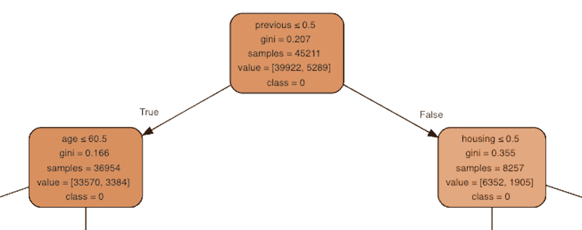

# 第四章：从参与到转化

在本章中，我们将扩展你对说明性分析的知识，并向你展示如何使用**决策树**来理解消费者行为的驱动因素。我们将从比较和解释逻辑回归和决策树模型之间的区别开始，然后我们将讨论决策树是如何构建和训练的。接下来，我们将讨论如何使用训练好的决策树模型来提取有关单个消费者属性（或特征）与目标输出变量之间关系的信息。

在编程练习中，我们将使用 UCI 机器学习库中的银行营销数据集来理解转化的驱动因素。我们将从数据分析开始，以便你更好地理解数据集；然后，我们将使用 Python 中的`scikit-learn`包和 R 中的`rpart`包构建决策树模型。最后，你将学会如何通过 Python 中的`graphviz`包和 R 中的`rattle`包来可视化这些训练过的决策树模型，从而理解它们的解读方式。到本章结束时，你将熟悉决策树，并且更好地理解何时以及如何使用 Python 或 R 来应用它们。

在本章中，我们将讨论以下主题：

+   决策树

+   决策树与 Python 的解释

+   决策树与 R 的解释

# 决策树

在上一章中，我们讨论了说明性分析和回归分析。我们将继续这个主题，并介绍另一个机器学习算法，利用它可以从数据中提取客户行为的洞察。在本章中，我们将讨论一种机器学习算法——**决策树**：它是如何从数据中学习的，以及我们如何解读它们的结果。

# 逻辑回归与决策树的对比

如果你还记得上一章的内容，**逻辑回归**模型通过找到特征变量的线性组合来学习数据，从而最好地估计事件发生的对数几率。顾名思义，决策树通过生长一棵树来学习数据。我们将在接下来的章节中详细讨论决策树模型是如何生长的以及如何构建树，但逻辑回归和决策树模型之间的主要区别在于：逻辑回归算法在特征集中搜索一个最佳的线性边界，而决策树算法则通过划分数据来找到发生事件可能性较高的数据子群体。通过一个例子来解释会更容易。让我们来看一下以下图示：


这是一个决策树模型的示例。如你在这个图中所见，它通过某些标准来划分数据。在这个例子中，根节点通过 `previous < 0.5` 这个标准划分成子节点。如果这个条件成立且为真，那么它会遍历到左子节点。如果不成立，它则遍历到右子节点。左子节点随后通过 `age < 61` 这个标准进一步划分。树会一直生长，直到找到纯净的节点（即每个节点中的所有数据点都属于同一类）或满足某些停止标准，例如树的最大深度。

如你所见，在这个例子中，数据被划分为七个分区。最左边的节点或分区是针对那些 `previous` 变量值小于 `0.5` 且 `age` 变量值小于 `61` 的数据点。另一方面，最右边的节点位于底部，针对的是那些 `previous` 变量值大于 `0.5` 且 `housing` 变量值不是 `yes` 的数据点。

这里需要注意的一点是，不同变量之间有很多交互作用。在这个示例树中，没有任何一个叶节点是通过一个条件来划分的。树中的每个分区都是通过多个标准以及不同`feature`变量之间的交互作用来形成的。这与逻辑回归模型的主要区别在于，逻辑回归模型在数据中没有线性结构时，表现会很差，因为它们试图在特征变量之间找到线性组合。另一方面，决策树模型对于非线性数据集表现更好，因为它们仅仅是尝试在最纯净的水平上划分数据。

# 构建决策树

在构建决策树时，树需要提出逻辑来将一个节点划分为子节点。通常用于数据划分的两种主要方法是：**Gini 不纯度**和**熵信息增益**。简而言之，*Gini* 不纯度度量一个分区的不纯度，而熵信息增益度量的是根据所测试的标准划分数据后，所获得的信息量。

让我们快速看一下计算 *Gini* 不纯度度量的公式：


这里，*c* 代表类标签，*P[i]* 代表记录被选择时属于类标签 *i* 的概率。通过从 1 中减去概率的平方和，*Gini* 不纯度度量达到零，即当树的每个分区或节点中的所有记录都是纯净的，且只有一个目标类时。

计算 *熵* 的公式如下：


和之前一样，*c*代表类标签，*P[i]*代表记录具有类标签*i*被选择的概率。构建树时，需要计算每个可能分割的熵，并与分割前的熵进行比较。然后，选择熵度量变化最大或信息增益最高的分割来继续构建树。这个过程将重复，直到所有节点都是纯净的，或满足停止标准。

# 使用 Python 进行决策树构建与解释

在本节中，你将学习如何使用 Python 的`scikit-learn`包构建决策树模型，并通过 Python 的`graphviz`包进行可视化解释结果。对于那些希望使用 R 而非 Python 进行此练习的读者，你可以跳过到下一节。我们将从分析银行营销数据集开始，使用`pandas`和`matplotlib`包进行深入分析，随后讨论如何构建和解释决策树模型。

对于这个练习，我们将使用 UCI 机器学习库中的一个公开数据集，地址为[`archive.ics.uci.edu/ml/datasets/bank+marketing`](https://archive.ics.uci.edu/ml/datasets/bank+marketing)。你可以通过链接下载 ZIP 格式的数据。我们将使用`bank.zip`文件进行本次练习。当你解压缩该文件时，你会看到两个 CSV 文件：`bank.csv`和`bank-full.csv`。我们将在此次 Python 练习中使用`bank-full.csv`文件。

为了将数据加载到 Jupyter Notebook 中，你可以运行以下代码：

```py
%matplotlib inline

import matplotlib.pyplot as plt
import pandas as pd

df = pd.read_csv('../data/bank-full.csv', sep=";")
```

从这段代码片段可以看出，我们使用`%matplotlib inline`命令在 Jupyter Notebook 中显示图表。接下来，我们导入了用于数据分析步骤的`matplotlib`和`pandas`包。最后，我们可以通过使用`pandas`包中的`read_csv`函数轻松读取数据文件。这里需要注意的是`read_csv`函数中的`sep`参数。如果仔细查看数据，你会发现`bank-full.csv`文件中的字段是由分号（`;`）分隔的，而不是逗号（`,`）。为了正确地将数据加载到`pandas`数据框中，我们需要告诉`read_csv`函数使用分号作为分隔符，而不是逗号。

一旦加载了数据，它应该看起来像下图所示：


# 数据分析与可视化

在我们开始分析数据之前，我们将首先对输出变量`y`进行编码，`y`包含关于客户是否已转化或订阅定期存款的信息，使用数值表示。你可以使用以下代码将输出变量`y`编码为零和一：

```py
df['conversion'] = df['y'].apply(lambda x: 0 if x == 'no' else 1)
```

从这段代码片段可以看出，你可以使用`apply`函数对输出变量进行编码。我们将这些编码后的值存储在一个新列中，命名为`conversion`。

# 转化率

首先，让我们看一下总的转化率。**转化率**是指订阅定期存款的客户所占的百分比。请看以下代码：

```py
conversion_rate_df = pd.DataFrame(
    df.groupby('conversion').count()['y'] / df.shape[0] * 100.0
)
```

从这段代码中你可以看到，我们按`conversion`列进行分组，`conversion`列用`1`表示那些已经订阅定期存款的客户，`0`表示那些没有订阅的客户。然后，我们计算每个组别中的客户数量，并将其除以数据集中客户的总数。结果如下所示：


为了更容易查看，你可以通过使用`pandas` DataFrame 的`T`属性来转置数据框。正如你所看到的，只有大约 11.7%的客户进行了转化或订阅了定期存款。从这些结果来看，我们可以发现转化组和非转化组之间存在较大的不平衡，这种情况在各种营销数据集中是常见的，并且经常出现。

# 按工作类别的转化率

可能某些工作类别的转化率确实比其他类别更高。让我们看一下不同工作类别之间的转化率。你可以通过以下代码来实现：

```py
conversion_rate_by_job = df.groupby(
    by='job'
)['conversion'].sum() / df.groupby(
    by='job'
)['conversion'].count() * 100.0
```

让我们深入了解一下这段代码。我们首先按`job`列进行分组，`job`列包含了每个客户所属的工作类别信息。然后，我们对每个工作类别的`conversion`列进行求和，从中得到每个工作类别的转化总数。最后，我们将这些转化数除以每个工作类别的客户总数，从而得到每个工作类别的转化率。

结果如下所示：


从这些结果中你可以看到，`student`组的转化率明显高于其他组，而`retired`组排在其后。然而，从原始输出中进行比较有些困难，我们可以通过使用图表来更好地展示这些数据。我们可以通过以下代码构建一个水平条形图：

```py
ax = conversion_rate_by_job.plot(
    kind='barh',
    color='skyblue',
    grid=True,
    figsize=(10, 7),
    title='Conversion Rates by Job'
)

ax.set_xlabel('conversion rate (%)')
ax.set_ylabel('Job')

plt.show()
```

如果你查看这段代码，你会发现我们正在使用`pandas` DataFrame 的`plot`函数，并通过将`barh`作为`kind`参数的输入，定义了图表的类型为水平条形图。你可以轻松调整图表的颜色、大小和标题，分别使用`color`、`figsize`和`title`参数。你还可以通过`set_xlabel`和`set_ylabel`函数轻松更改*x*轴和*y*轴的标签。

生成的图表如下所示：


如你所见，使用水平条形图可以更容易地看到不同工作类别之间的转化率差异。我们可以清楚地看到，`student`和`retired`组是转化率最高的两个组，而`blue-collar`和`entrepreneur`组则是转化率最低的两个组。

# 按转换情况划分的违约率

另一个值得关注的客户属性是违约率，看看订阅定期存款的客户与未订阅的客户之间的违约率差异。我们将使用`pandas`库中的`pivot_table`函数来分析按转换情况划分的违约率。让我们来看一下下面的代码：

```py
default_by_conversion_df = pd.pivot_table(
    df, 
    values='y', 
    index='default', 
    columns='conversion', 
    aggfunc=len
)
```

如你所见，这段代码中，我们通过`y`和`default`列对数据框`df`进行透视。通过使用`len`作为聚合函数，我们可以计算每个透视表单元格下的客户数量。结果如下所示：


仅凭这些原始数据，很难比较转换组和非转换组之间的违约率差异。通过饼图来可视化这些数据是一种可行的方式。你可以使用以下代码来生成饼图：

```py
default_by_conversion_df.plot(
    kind='pie',
    figsize=(15, 7),
    startangle=90,
    subplots=True,
    autopct=lambda x: '%0.1f%%' % x
)

plt.show()
```

如你所见，这段代码中，我们只是将`'pie'`作为输入传递给`plot`函数的`kind`参数。生成的饼图如下所示：


从这些饼图中可以看出，比较转换组和非转换组的违约率要容易得多。尽管两组的总体违约率都较低，但非转换组的违约率大约是转换组的两倍。

# 按转换情况划分的银行余额

接下来，我们将尝试查看转换组和非转换组之间银行余额分布是否存在差异。箱型图通常是可视化变量分布的好方法。让我们来看一下下面的代码：

```py
ax = df[['conversion', 'balance']].boxplot(
    by='conversion',
    showfliers=True,
    figsize=(10, 7)
)

ax.set_xlabel('Conversion')
ax.set_ylabel('Average Bank Balance')
ax.set_title('Average Bank Balance Distributions by Conversion')

plt.suptitle("")
plt.show()
```

你应该已经熟悉这段代码，因为我们已经讨论了如何使用`pandas`包构建箱型图。通过使用`boxplot`函数，我们可以轻松构建如下的箱型图：


由于存在许多异常值，很难发现两个分布之间的差异。让我们构建一个不包含异常值的箱型图。你需要做的唯一更改就是在`boxplot`函数中将`showfliers=True`，如下所示：

```py
ax = df[['conversion', 'balance']].boxplot(
    by='conversion',
    showfliers=False,
    figsize=(10, 7)
)

ax.set_xlabel('Conversion')
ax.set_ylabel('Average Bank Balance')
ax.set_title('Average Bank Balance Distributions by Conversion')

plt.suptitle("")
plt.show()
```

使用这段代码，你将看到如下的两个组别银行余额分布箱型图：


从这些箱型图中，我们可以看到，相比非转换组，转换组的银行余额中位数略高。此外，转换客户的银行余额波动似乎比非转换客户更大。

# 按联系次数划分的转换率

最后，我们将看看转化率如何随联系方式的数量变化。通常在营销中，更多的营销接触可能会导致营销疲劳，即随着您更频繁地联系客户，转化率下降。让我们看看我们的数据中是否存在营销疲劳。请查看以下代码：

```py
conversions_by_num_contacts = df.groupby(
    by='campaign'
)['conversion'].sum() / df.groupby(
    by='campaign'
)['conversion'].count() * 100.0
```

在这段代码中，您可以看到我们是通过`campaign`列（该列包含了此客户在营销活动中进行的联系方式数量的信息）进行分组，并计算每个联系方式数量的转化率。结果数据如下所示：


和之前一样，查看图表比直接查看原始数据更容易。我们可以使用以下代码通过柱状图绘制这些数据：

```py
ax = conversions_by_num_contacts.plot(
    kind='bar',
    figsize=(10, 7),
    title='Conversion Rates by Number of Contacts',
    grid=True,
    color='skyblue'
)

ax.set_xlabel('Number of Contacts')
ax.set_ylabel('Conversion Rate (%)')

plt.show()
```

图表如下所示：


在联系方式数量较高的情况下会有一些噪声，因为这些样本的数量较少，但从这张柱状图中您可以很容易看到整体的下降趋势。随着联系方式数量的增加，转化率缓慢下降。这表明，在给定的营销活动中，随着您与客户的联系更频繁，预期的转化率会下降。

# 编码类别变量

该数据集包含八个类别变量：`job`、`marital`、`education`、`default`、`housing`、`loan`、`contact`和`month`。在我们开始构建决策树之前，需要将这些类别变量编码为数值。在本节中，我们将展示如何编码一些类别变量。

# 编码月份

我们都知道，`month`变量只能有 12 个唯一值。让我们快速看看数据集中有哪些值。查看以下代码：

```py
df['month'].unique()
```

`pandas`函数`unique`帮助您快速获取给定列中的唯一值。运行此代码后，您将看到以下输出：


如预期的那样，`month`列中有 12 个唯一值，从一月到十二月。由于`month`值之间有自然的顺序关系，我们可以用相应的数字对每个值进行编码。以下是将`month`的字符串值编码为数字的一种方式：

```py
months = ['jan', 'feb', 'mar', 'apr', 'may', 'jun', 'jul', 'aug', 'sep', 'oct', 'nov', 'dec']

df['month'] = df['month'].apply(
    lambda x: months.index(x)+1
)
```

使用这段代码，`month`列的唯一值如下所示：


为了查看每个月的记录数，我们可以使用以下代码：

```py
df.groupby('month').count()['conversion']
```

结果如下所示：


# 编码作业

接下来，让我们看看如何编码`job`列中的不同类别。我们首先使用以下代码查看该列中的唯一值：

```py
df['job'].unique()
```

`job`列中的唯一值如下所示：


从这个输出中可以看出，该变量没有自然的顺序。一个 `job` 类别并不先于另一个，因此我们不能像对待 `month` 变量那样对该变量进行编码。我们将为每个 `job` 类别创建虚拟变量。如果你还记得上一章的内容，**虚拟变量**是一个变量，如果给定记录属于该类别，则编码为 `1`，否则编码为 `0`。我们可以使用以下代码轻松完成此操作：

```py
jobs_encoded_df = pd.get_dummies(df['job'])
jobs_encoded_df.columns = ['job_%s' % x for x in jobs_encoded_df.columns]
```

从这段代码中可以看出，`pandas` 包中的 `get_dummies` 函数为 `job` 变量中的每个类别创建一个虚拟变量，并且如果给定记录属于相应的类别，则编码为 `1`，如果不属于则编码为 `0`。然后，我们通过在每个列名前加上 `job_` 前缀来重命名列。结果如下所示：


从这张截图中可以看出，第一条记录（或客户）属于 `management` 工作类别，而第二条记录属于 `technician` 工作类别。现在我们已经为每个工作类别创建了虚拟变量，我们需要将这些数据附加到现有的 DataFrame 中。请看下面的代码：

```py
df = pd.concat([df, jobs_encoded_df], axis=1)
df.head()
```

使用 `pandas` 包中的 `concat` 函数，您可以轻松地将新创建的包含虚拟变量的 DataFrame `jobs_encoded_df` 添加到原始 DataFrame `df` 中。`axis=1` 参数告诉 `concat` 函数将第二个 DataFrame 作为列连接到第一个 DataFrame，而不是作为行连接。结果的 DataFrame 如下所示：


如您所见，新创建的虚拟变量被添加到原始 DataFrame 中，作为每条记录的新列。

# 对婚姻状况进行编码

类似于我们如何对类别变量 `job` 进行编码，我们将为 `marital` 变量的每个类别创建虚拟变量。与之前一样，我们使用以下代码对 `marital` 列进行编码：

```py
marital_encoded_df = pd.get_dummies(df['marital'])
marital_encoded_df.columns = ['marital_%s' % x for x in marital_encoded_df.columns]
```

编码结果如下：


如您所见，为原始变量 `marital` 创建了三个新变量：`marital_divorced`、`marital_married` 和 `marital_single`，分别表示客户是否离婚、已婚或单身。为了将这些新创建的虚拟变量添加到原始 DataFrame 中，我们可以使用以下代码：

```py
df = pd.concat([df, marital_encoded_df], axis=1)
```

到此为止，您的原始 DataFrame `df` 应该包含所有原始列，以及为 `job` 和 `marital` 列新创建的虚拟变量。

# 对住房和贷款变量进行编码

本节我们将要编码的最后两个分类变量是`housing`和`loan`。`housing`变量有两个独特的值，`'yes'`和`'no'`，它包含关于客户是否有住房贷款的信息。另一个变量`loan`也有两个独特的值，`'yes'`和`'no'`，它告诉我们客户是否有个人贷款。我们可以通过以下代码轻松编码这两个变量：

```py
df['housing'] = df['housing'].apply(lambda x: 1 if x == 'yes' else 0)

df['loan'] = df['loan'].apply(lambda x: 1 if x == 'yes' else 0)
```

如你所见，我们正在使用`apply`函数将`yes`编码为`1`，将`no`编码为`0`，用于`housing`和`loan`两个变量。对于本节未讨论的其他分类变量，如果你希望深入探索，可以使用我们讨论过的相同技术来对其进行编码。

# 构建决策树

现在我们已经编码了所有分类变量，终于可以开始构建决策树模型了。我们将使用以下变量作为决策树模型的特征：


为了使用 Python 构建和训练一个决策树模型，我们将使用`scikit-learn`（`sklearn`）包中的`tree`模块。你可以通过以下代码导入所需的模块：

```py
from sklearn import tree
```

在`sklearn`包的`tree`模块下，有一个名为`DecisionTreeClassifier`的类，我们可以使用它来训练决策树模型。请看以下代码：

```py
dt_model = tree.DecisionTreeClassifier(
    max_depth=4
)
```

除了我们在这里使用的`max_depth`参数之外，`DecisionTreeClassifier`类还有许多其他参数。`max_depth`参数控制决策树的最大深度，在这里我们将其限制为`4`，意味着从根节点到叶节点的最大距离为`4`。你还可以使用`criterion`参数在基尼不纯度和信息增益的熵度量之间进行选择，这用于衡量分裂的质量。还有许多其他方法可以调整你的决策树模型，我们建议你查阅[`scikit-learn.org/stable/modules/generated/sklearn.tree.DecisionTreeClassifier.html`](http://scikit-learn.org/stable/modules/generated/sklearn.tree.DecisionTreeClassifier.html)的文档以获取更多信息。

为了训练这个决策树模型，你可以使用以下代码：

```py
dt_model.fit(df[features], df[response_var])
```

如你从这段代码中看到的，`fit`函数接受两个参数：`predictor`或`feature`变量和`response`或`target`变量。在我们的例子中，`response_var`是 DataFrame `df`中的`conversion`列。运行这段代码后，决策树模型将学习如何进行分类。在接下来的部分中，我们将讨论如何解读训练好的决策树模型的结果。

# 解释决策树

现在我们已经训练了一个决策树模型，接下来需要从模型中提取洞察。在这一部分，我们将使用一个名为`graphviz`的包。你可以通过在终端中使用以下命令来安装此包：

```py
conda install python-graphviz
```

一旦正确安装了这个包，你应该能够按如下方式导入该包：

```py
import graphviz
```

现在，我们已经使用新包`graphviz`设置好了环境，接下来让我们看看以下代码，了解如何可视化训练好的决策树：

```py
dot_data = tree.export_graphviz(
    dt_model, 
    feature_names=features, 
    class_names=['0', '1'], 
    filled=True, 
    rounded=True, 
    special_characters=True
) 

graph = graphviz.Source(dot_data)
```

如你所见，我们首先使用`sklearn`包中的`tree`模块的`export_graphviz`函数导出了训练好的决策树模型`dt_model`。我们可以通过`feature_names`参数定义用于训练该模型的特征变量。然后，我们可以定义该模型被训练用于分类的类别（转换与非转换）。`export_graphviz`函数将训练好的决策树模型以 DOT 格式导出，DOT 是一种图形描述语言。然后，你可以将`dot_data`传递给`graphviz`的`Source`类。`graph`变量现在包含了一个可渲染的图。根节点及其直接子节点如下所示：



左半部分的树（或根节点左子节点的子节点）如下所示：


右半部分的树（或根节点右子节点的子节点）如下所示：


让我们仔细看看这个图。每个节点包含五行信息，描述了该节点的相关信息。第一行告诉我们分裂的标准。例如，根节点是基于`previous`变量的值进行分裂的。如果`previous`变量的值小于或等于`0.5`，则它会进入左子节点。另一方面，如果`previous`变量的值大于`0.5`，则它会进入右子节点。

第二行告诉我们分裂的质量度量值。在这里，我们选择了`gini`不纯度作为标准，因此我们可以在第二行中看到每个节点中不纯度度量值的变化。第三行告诉我们属于该节点的记录总数。例如，根节点中有`45,211`个样本，根节点的右子节点中有`8,257`个样本。

每个节点的第四行告诉我们两个不同类别中的记录组成。第一个元素表示非转化组中的记录数，第二个元素表示转化组中的记录数。例如，在根节点中，非转化组有`39,922`条记录，转化组有`5,289`条记录。最后，每个节点的第五行告诉我们该节点的预测或分类结果是什么。例如，如果一个样本属于最左侧的叶节点，那么该决策树模型的分类结果将是`0`，即非转化。另一方面，如果一个样本属于从左数第八个叶节点，那么该决策树模型的分类结果将是`1`，即转化。

现在我们知道了每个节点中的每一行意味着什么，让我们来讨论如何从这棵树图中提取洞见。为了理解属于每个叶节点的客户，我们需要沿着树走一遍。例如，那些属于从左数第八个叶节点的客户是`previous`变量值为`0`，`age`大于`60.5`，`marital_divorced`变量值为`1`，以及`job_self-employed`变量值为`1`的客户。换句话说，之前未曾联系过、年龄大于`60.5`、已离婚并且是自雇人士的客户属于这个节点，并且他们有较高的转化几率。

让我们来看另一个例子。那些属于从右数第二个叶节点的客户是`previous`变量值为`1`、`housing`变量值为`1`、`age`大于`60.5`、并且`balance`小于或等于`4,660.5`的客户。换句话说，之前曾联系过、拥有住房贷款、年龄大于`60.5`并且银行存款少于`4,660.5`的客户属于这个节点，并且其中`20`个中的`29`个客户已经转化并订阅了定期存款。

正如你从这两个例子中会注意到的，通过可视化训练好的决策树，你可以从中获得关于谁更可能或更不可能转化的有用洞见。你只需要沿着树的节点走一遍，并理解哪些属性与目标类别高度相关。为了这次练习，我们将树的深度限制为`4`，但是你可以选择将树生长得比我们在本次练习中使用的更大或更小。

本章节的 Python 练习完整代码可以在仓库中找到：[`github.com/yoonhwang/hands-on-data-science-for-marketing/blob/master/ch.4/python/From%20Engagement%20to%20Conversions.ipynb`](https://github.com/yoonhwang/hands-on-data-science-for-marketing/blob/master/ch.4/python/From%20Engagement%20to%20Conversions.ipynb)。

# 使用 R 语言的决策树及其解释

在本节中，您将学习如何使用 R 中的`rpart`包构建决策树模型，并通过 R 的`rattle`包通过可视化来解释结果。对于那些希望使用 Python 而不是 R 进行练习的读者，您可以参考上一节中的 Python 示例。我们将通过使用`dplyr`和`ggplot2`库深入分析银行营销数据集来开始本节，然后我们将讨论如何构建和解释决策树模型。

对于这个练习，我们将使用来自 UCI 机器学习库的一个公开数据集，您可以在[`archive.ics.uci.edu/ml/datasets/bank+marketing`](https://archive.ics.uci.edu/ml/datasets/bank+marketing)找到。您可以访问该链接并下载 ZIP 格式的数据。我们将使用`bank.zip`文件进行此练习。当您解压这个文件时，您会看到两个 CSV 文件：`bank.csv`和`bank-full.csv`。我们将使用`bank-full.csv`文件进行此练习。

为了将这些数据加载到您的 RStudio 中，您可以运行以下代码：

```py
df <- read.csv(
  file="../data/bank-full.csv", 
  header=TRUE, 
  sep=";"
)
```

正如您从这段代码中看到的，我们可以通过使用 R 中的`read.csv`函数轻松读取数据文件。需要注意的一点是`read.csv`函数中的`sep`参数。如果仔细查看数据，您会发现`bank-full.csv`文件中的字段是由分号（`;`）而不是逗号（`,`）分隔的。为了正确加载数据到 DataFrame 中，我们需要告诉`read.csv`函数使用分号作为分隔符，而不是逗号。

一旦您加载了这些数据，它应该看起来像以下截图：


# 数据分析和可视化

在开始分析数据之前，我们将首先对输出变量`y`进行编码，该变量包含关于客户是否已转换或订阅定期存款的信息，并用数值表示。您可以使用以下代码将输出变量`y`编码为零和一：

```py
# Encode conversions as 0s and 1s
df$conversion <- as.integer(df$y) - 1
```

正如您从这段代码中看到的，您可以使用`as.integer`函数对输出变量进行编码。由于该函数会将`y`变量中的`no`值编码为`1`，而`y`变量中的`yes`值编码为`2`，我们通过减去`1`来将其编码为`0`和`1`，分别存储这些编码值到一个新列中，名为`conversion`。

# 转化率

我们将首先关注的是汇总的转化率。转化率简单地是那些订阅了定期存款的客户的百分比，或者那些在`conversion`列中被编码为`1`的客户。请查看以下代码：

```py
sprintf("conversion rate: %0.2f%%", sum(df$conversion)/nrow(df)*100.0)
```

正如您从这段代码中看到的，我们只是将`conversion`列中的所有值相加，并除以 DataFrame `df`中的记录或客户的数量。使用`sprintf`函数，我们将此转化率数字格式化为两位小数。结果如下：


从这个输出中可以看到，只有约`11.7%`的客户转化或订阅了定期存款。从这些结果中，我们可以看到转化组和非转化组之间存在较大不平衡，这在各种营销数据集中是常见的现象。

# 按职业分类的转化率

可能确实存在某些职业类别的转化率比其他职业类别更高的情况。让我们看看不同职业类别之间的转化率。你可以通过运行以下代码来实现：

```py
conversionsByJob <- df %>% 
  group_by(Job=job) %>% 
  summarise(Count=n(), NumConversions=sum(conversion)) %>%
  mutate(ConversionRate=NumConversions/Count*100.0)
```

让我们更详细地看一下这段代码。我们首先根据`job`列进行分组，该列包含每个客户所属的职业类别信息。然后，我们使用`n()`函数计算每个职业类别中的客户总数，并使用`sum`函数对每个职业类别的`conversion`列进行求和。最后，我们将转化总数`NumConversion`除以每个职业类别中的客户总数`Count`，并将结果乘以`100.0`，以计算每个职业类别的转化率。

结果如下所示：


从这些结果可以看出，`student`组的转化频率明显高于其他组，而`retired`组排在其后。然而，直接比较这些数据和原始输出有些困难，我们可以通过使用图表更好地呈现这些数据。我们可以使用以下代码构建一个水平条形图：

```py
ggplot(conversionsByJob, aes(x=Job, y=ConversionRate)) +
  geom_bar(width=0.5, stat="identity") +
  coord_flip() +
  ggtitle('Conversion Rates by Job') +
  xlab("Job") +
  ylab("Conversion Rate (%)") +
  theme(plot.title = element_text(hjust = 0.5)) 
```

如果你查看这段代码，我们使用了`ggplot`和`geom_bar`函数，利用`conversionsByJob`数据（我们在之前的代码中构建的）生成条形图，并将`Job`变量放在*X*轴，将`ConversionRate`变量放在*Y*轴。然后，我们使用`coord_flip`函数将垂直条形图转换为水平条形图。你可以使用`ggtitle`、`xlab`和`ylab`函数来更改标题、*X*轴标签和*Y*轴标签。

结果图表如下所示：


正如你所看到的，使用水平条形图更容易观察到不同职业类别之间的转化率差异。我们可以清晰地看到，`student`和`retired`组是转化率最高的两个组，而`blue-collar`和`entrepreneur`组则是转化率最低的两个组。

# 按转化率分类的违约率

另一个值得关注的客户属性是违约率，以及已订阅定期存款和未订阅定期存款的客户之间的差异。让我们看一下以下的 R 代码：

```py
defaultByConversion <- df %>% 
  group_by(Default=default, Conversion=conversion) %>% 
  summarise(Count=n())
```

从这段代码中可以看到，我们使用 `group_by` 函数将 DataFrame `df` 按 `default` 和 `conversion` 两列进行分组。通过使用 `n()` 作为聚合函数，我们可以统计每个四个情况中的客户数量。让我们来看一下以下结果：


从这些原始数据来看，比较转化组和非转化组之间的默认率差异有点困难。可视化这个数据的一种方法是通过饼图。你可以使用以下代码来构建饼图：

```py
ggplot(defaultByConversion, aes(x="", y=Count, fill=Default)) + 
  geom_bar(width=1, stat = "identity", position=position_fill()) +
  geom_text(aes(x=1.25, label=Count), position=position_fill(vjust = 0.5)) +
  coord_polar("y") +
  facet_wrap(~Conversion) +
  ggtitle('Default (0: Non Conversions, 1: Conversions)') +
  theme(
    axis.title.x=element_blank(),
    axis.title.y=element_blank(),
    plot.title=element_text(hjust=0.5),
    legend.position='bottom'
  )
```

如你所见，我们在这里使用了三个函数：`ggplot`、`geom_bar` 和 `coord_polar("y")`。通过使用 `coord_polar("y")` 函数，我们可以从条形图生成饼图。然后，我们可以使用 `facet_wrap` 函数将其拆分成两个饼图：一个是转化组，另一个是非转化组。

看看下面的饼图：


从这些饼图中，你可以更容易地比较转化组和非转化组之间的默认率。尽管两个组中以往的默认比例都较低，但非转化组的默认率大约是转化组的两倍。

# 按转化次数划分的银行余额

接下来，我们将尝试查看转化组和非转化组之间的银行余额分布是否存在差异。箱线图通常是一种很好的可视化变量分布的方式。我们来看一下下面的代码：

```py
ggplot(df, aes(x="", y=balance)) + 
  geom_boxplot() +
  facet_wrap(~conversion) +
  ylab("balance") +
  xlab("0: Non-Conversion, 1: Conversion") +
  ggtitle("Conversion vs. Non-Conversions: Balance") +
  theme(plot.title=element_text(hjust=0.5))
```

你现在应该已经熟悉这段代码了，因为我们在上一章讨论过如何使用 `ggplot` 和 `geom_boxplot` 函数构建箱线图。当你运行这段代码时，你将看到以下箱线图：


由于有很多异常值，识别两组分布之间的差异变得相当困难。让我们构建另一个没有异常值的箱线图。你只需要修改上一段代码中的 `outlier.shape = NA` 参数，如下所示：

```py
ggplot(df, aes(x="", y=balance)) + 
  geom_boxplot(outlier.shape = NA) +
  scale_y_continuous(limits = c(-2000, 5000)) +
  facet_wrap(~conversion) +
  ylab("balance") +
  xlab("0: Non-Conversion, 1: Conversion") +
  ggtitle("Conversion vs. Non-Conversions: Balance") +
  theme(plot.title=element_text(hjust=0.5))
```

使用这段代码，你将看到以下关于两组银行余额分布的箱线图：


从这些箱线图中，我们可以看到转化组的银行余额中位数略高于非转化组。此外，转化客户的银行余额似乎比非转化客户的余额波动更大。

# 按联系人数量划分的转化率

最后，我们将查看转化率如何随着联系人数的变化而变化。通常在营销中，较高的营销联系人数可能导致营销疲劳，即当你更频繁地联系客户时，转化率会下降。让我们看看我们的数据中是否存在营销疲劳现象。请查看以下代码：

```py
conversionsByNumContacts <- df %>% 
  group_by(Campaign=campaign) %>% 
  summarise(Count=n(), NumConversions=sum(conversion)) %>%
  mutate(ConversionRate=NumConversions/Count*100.0)
```

从这段代码中可以看到，我们是通过 `campaign` 列（该列包含了在该营销活动中对该客户进行的联系次数信息）进行分组，并计算每个联系次数对应的转化率。结果数据如下所示：


和之前一样，查看图表比查看原始数据更为直观。我们可以使用以下代码通过柱状图来绘制这些数据：

```py
ggplot(conversionsByNumContacts, aes(x=Campaign, y=ConversionRate)) +
  geom_bar(width=0.5, stat="identity") +
  ggtitle('Conversion Rates by Number of Contacts') +
  xlab("Number of Contacts") +
  ylab("Conversion Rate (%)") +
  theme(plot.title = element_text(hjust = 0.5)) 
```

绘图结果如下所示：


在较高联系次数的情况下，由于样本量较小，会有一些噪声，但从这张柱状图中可以明显看到总体的下降趋势。随着联系次数的增加，转化率逐渐下降。这表明，当你在一个营销活动中更频繁地联系客户时，预期的转化率会降低。

# 对类别变量进行编码

数据集中有八个类别变量：`job`、`marital`、`education`、`default`、`housing`、`loan`、`contact` 和 `month`。在构建决策树之前，我们需要将其中一些类别变量编码为数值。我们将在本节中看看如何对这些类别变量进行编码。

# 对月份进行编码

我们都知道，`month` 变量最多只能有 12 个唯一值。让我们快速查看一下数据集中的内容。请查看以下代码：

```py
unique(df$month)
```

`unique` 函数帮助你快速获取给定列中的唯一值。当你运行这段代码时，你将获得以下输出：


正如我们所预期的，`month` 列中有 12 个唯一值，从一月到十二月。由于 `month` 的值有自然顺序，我们可以用对应的数字对每个值进行编码。将 `month` 的字符串值编码为数字的一种方式如下：

```py
months = lapply(month.abb, function(x) tolower(x))
df$month <- match(df$month, months)
```

让我们仔细看看这段代码。`month.abb` 是一个内置的 R 常量，包含了月份名称的三字母缩写，具体如下：


如你所见，每个缩写的`month`名称的首字母都被大写。然而，我们数据中的`month`列的月份名称都是小写的。这就是为什么我们使用`tolower`函数将`month.abb`常量中的所有值转换为小写。使用`lapply`函数，我们可以将这个`tolower`函数应用于`month.abb`列表。接着，我们使用`match`函数，它返回匹配字符串在数组中的位置，将 DataFrame 中`month`列的字符串值转换为对应的数值。

使用这段代码，`month`列的唯一值如下所示：


为了查看每个月份的记录数量，我们可以使用以下代码：

```py
df %>% 
  group_by(month) %>% 
  summarise(Count=n())
```

结果如下：


# 对工作、住房和婚姻变量进行编码

接下来，我们将编码三个变量：`job`、`housing`和`marital`。由于这些变量没有自然的顺序，我们不需要担心哪个类别被编码为哪个值。编码没有顺序的类别变量在 R 中的最简单方法是使用`factor`函数。让我们看一下以下代码：

```py
df$job <- factor(df$job)
df$housing <- factor(df$housing)
df$marital <- factor(df$marital)
```

如你所见，我们只是将`factor`函数应用于这三个变量：`job`、`housing`和`marital`，并将编码后的值存储回 DataFrame `df`中。对于我们在本节中未讨论的类别变量，如果你希望进一步探索，可以使用我们在本节中讨论的相同技术对它们进行编码。

# 构建决策树

现在我们已经编码了所有类别变量，终于可以开始构建决策树模型了。我们将使用这些变量作为决策树模型的特征：`age`、`balance`、`campaign`、`previous`、`housing`、`job`和`marital`。为了使用 R 构建并训练决策树模型，我们将使用`rpart`包。你可以使用以下代码导入所需的库：

```py
library(rpart)
```

如果你没有安装`rpart`包，你可以使用以下命令安装它：

```py
install.packages("rpart")
```

一旦你导入了所需的库，你可以使用以下代码来构建决策树模型：

```py
fit <- rpart(
  conversion ~ age + balance + campaign + previous + housing + job + marital,
  method="class", 
  data=df,
  control=rpart.control(maxdepth=4, cp=0.0001)
)
```

如您所见，`rpart` 模型的第一个参数是 `formula`，它定义了特征和目标变量。在这里，我们使用上述变量作为特征，`conversion` 作为目标变量。然后，我们将此决策树模型定义为一个分类模型，并使用 `method="class"` 输入。最后，您可以使用 `control` 输入来微调决策树模型。有许多参数可以通过 `control` 输入进行调整。在此示例中，我们仅通过 `maxdepth` 参数将树的最大深度限制为 `4`，并将复杂度参数 `cp` 设置为足够小，以便树能够进行分裂。还有许多其他方法可以微调您的决策树模型，我们建议您通过运行 `help(rpart)` 或 `help(rpart.control)` 命令，详细查看 R 文档以获取更多信息。

# 解读决策树

现在我们已经训练了一个决策树模型，接下来需要从模型中提取洞察。在本节中，我们将使用一个名为 `rattle` 的库：

1.  您可以通过在 RStudio 中使用以下命令来安装此包：

```py
install.packages("rattle")
```

1.  一旦正确安装了此库，您应该能够按照以下方式导入该库：

```py
library(rattle)
```

1.  一旦您在 R 环境中设置了这个新的库 `rattle`，只需一行代码就能可视化训练好的决策树。请查看以下代码：

```py
fancyRpartPlot(fit)
```

1.  如您所见，`fancyRpartPlot` 函数接受一个 `rpart` 模型对象。在这里，模型对象 `fit` 是我们在前一步构建的决策树模型。一旦您运行这个命令，它将显示以下图表：


让我们更仔细地看一下这个树形图。每个节点包含三行信息，描述了该节点所具有的信息。节点顶部的数字是标签，表示该节点构建的顺序。我们将使用这个标签来引用树图中的每个节点。然后，每个节点的顶行告诉我们该节点的预测或分类结果。例如，如果一个样本属于标签为 `4` 的节点，则此决策树模型的分类结果为零，表示未转换。另一方面，如果一个样本属于标签为 `23` 的节点，则此决策树模型的分类结果为一，表示已转换。

每个节点中的第二行告诉我们该节点中每个类的记录百分比。例如，节点`22`中的`52%`记录属于类`0`，即非转化组，剩下的`48%`属于类`1`，即转化组。另一方面，节点`13`中的`39%`客户属于类`0`，剩下的`61%`属于类`1`。最后，每个节点中的底部行告诉我们属于每个节点的总记录百分比。例如，大约`80%`的客户属于节点`4`，而接近`0%`的客户属于节点`13`。

现在我们知道每个节点中每一行的含义了，让我们讨论一下如何从这个树状图中提取见解。为了理解属于每个叶节点的客户，我们需要沿着树走下去。例如，属于节点`13`的客户是那些`previous`变量值大于`0.5`，拥有住房贷款并且`age`大于或等于`61`的客户。换句话说，那些在此活动之前已被联系过、年龄超过`61`且拥有住房贷款的客户属于节点`13`，他们有较高的转化机会。

让我们来看另一个例子。为了从根节点到达节点`22`，我们需要使`previous`变量的值为`0`，`age`大于或等于`61`，`marital`状态不是`married`或`single`，并且`job`属于以下类别之一：`admin`、`blue-collar`、`entrepreneur`、`housemaid`、`retired`或`unknown`。换句话说，那些在此活动之前未被联系过、年龄超过`61`、已离婚并且在上述类别中有工作的客户属于节点`22`，他们有大约`50%`的转化机会。

正如你从这两个例子中注意到的，你可以通过可视化训练过的决策树模型，得出关于哪些客户更有可能或更不可能转化的有用见解。你只需沿着节点走下去，理解与目标类高度相关的属性是什么。对于这个练习，我们将树的深度限制为`4`，但你可以选择让树的深度比我们在这个练习中使用的树大或小。

本章节 R 语言练习的完整代码可以在该仓库中找到：[`github.com/yoonhwang/hands-on-data-science-for-marketing/blob/master/ch.4/R/FromEngagementToConversions.R`](https://github.com/yoonhwang/hands-on-data-science-for-marketing/blob/master/ch.4/R/FromEngagementToConversions.R)。

# 总结

在这一章中，我们介绍了一种新的机器学习算法——决策树，它可以用于营销分析，以更好地理解数据并洞察客户行为。我们讨论了决策树模型与上章介绍的逻辑回归模型的不同之处。你了解到，决策树模型通过基于某些标准对数据点进行划分来学习数据。我们还讨论了在生长决策树时常用的两种衡量标准：基尼不纯度和信息增益熵。通过使用这两种衡量标准中的任何一种，决策树可以一直生长，直到所有节点都纯净，或者直到满足停止标准。

在我们的 Python 和 R 编程练习中，我们使用了 UCI 机器学习库中的银行营销数据集。我们通过深入分析数据来开始编程练习，使用了 Python 中的`pandas`和`matplotlib`包，以及 R 中的`dplyr`和`ggplot2`库。接着，你学习了如何使用 Python 中的`sklearn`包和 R 中的`rpart`库来训练和生长决策树。通过这些训练好的决策树模型，你还学习了如何可视化和解释结果。为了进行可视化，我们使用了 Python 中的`graphviz`包和 R 中的`rattle`库。此外，你还看到如何通过遍历训练过的决策树来解释决策树结果，理解哪些客户群体更可能转化或订阅定期存款，这在我们进行客户行为的解释性分析时非常有用。

在接下来的几章中，我们将改变方向，专注于产品分析。在下一章中，我们将讨论可以进行的探索性分析，以理解和识别产品数据中的模式和趋势。基于下一章的产品分析结果，我们将展示如何构建产品推荐模型。
