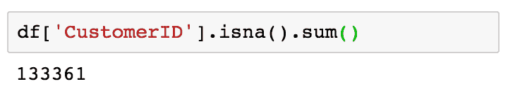

# 第六章：推荐合适的产品

在本章中，我们将深入探讨如何构建产品推荐系统，通过为个别客户量身定制的产品推荐来更好地定位客户。研究表明，个性化的产品推荐能够提高转化率和客户留存率。随着我们可以利用数据科学和机器学习进行目标营销的数据越来越多，定制化产品推荐在营销信息中的重要性和有效性显著增长。在本章中，我们将讨论常用的机器学习算法，以开发推荐系统，协同过滤，以及实现协同过滤算法进行产品推荐的两种方法。

在本章中，我们将涵盖以下主题：

+   协同过滤与产品推荐

+   使用 Python 构建产品推荐算法

+   使用 R 构建产品推荐算法

# 协同过滤与产品推荐

根据 Salesforce 进行的一项研究，那些收到个性化产品推荐的客户驱动了 24%的订单和 26%的收入。这表明，产品推荐对订单量和整体销售收入有多大的影响。在 Salesforce 发布的报告中，他们还发现，产品推荐会导致重复访问，通过推荐进行的购买会产生更高的平均订单价值，且客户确实会购买推荐的商品。你可以查看此报告：[`www.salesforce.com/blog/2017/11/personalized-product-recommendations-drive-just-7-visits-26-revenue`](https://www.salesforce.com/blog/2017/11/personalized-product-recommendations-drive-just-7-visits-26-revenue)。

# 产品推荐系统

**产品推荐系统**是一个旨在预测并编制出客户可能购买的商品列表的系统。推荐系统近年来已经获得了广泛的应用，并且为各种商业用例开发和实施。例如，音乐流媒体服务 Pandora 使用推荐系统为听众推荐音乐；电子商务公司 Amazon 使用推荐系统预测并显示客户可能购买的产品列表；媒体服务提供商 Netflix 使用推荐系统为个别用户推荐他们可能观看的电影或电视剧。推荐系统的使用不仅限于此，它还可以用来推荐相关的文章、新闻或书籍。由于可以应用于多种领域，推荐系统在许多行业中扮演着关键角色，特别是在电子商务和媒体行业，因为它们直接影响销售收入和用户参与度。

通常有两种方式来生成推荐列表：

+   协同过滤

+   基于内容的过滤

**协同过滤**方法基于用户之前的行为，例如他们浏览过的页面、购买过的产品或他们对不同物品给出的评分。协同过滤方法利用这些数据来寻找用户或物品之间的相似性，并向用户推荐最相似的物品或内容。协同过滤方法背后的基本假设是，过去浏览或购买过相似内容或产品的用户，未来也很可能会浏览或购买相似的内容或产品。因此，基于这一假设，如果一个人曾经购买过 A、B、C 三件物品，另一个人购买过 A、B、D 三件物品，那么第一个人很可能会购买 D，而另一个人则可能会购买 C，因为他们之间有很多相似之处。

另一方面，**基于内容的过滤**方法根据物品或用户的特征生成推荐列表。它通常会查看描述物品特征的关键词。基于内容的过滤方法背后的基本假设是，用户很可能会浏览或购买与他们过去购买或浏览过的物品相似的物品。例如，如果一个用户过去听过一些歌曲，那么基于内容的过滤方法会推荐与该用户已经听过的歌曲特征相似的其他歌曲。

在这一章节中，我们将使用协同过滤算法来构建一个产品推荐系统。接下来，我们将仔细看看如何在以下部分构建协同过滤算法。

# 协同过滤

如上一节所讨论的，协同过滤算法是根据用户行为的历史和用户之间的相似性来推荐产品的。实现协同过滤算法的第一步是构建一个**用户到物品的矩阵**。用户到物品的矩阵由行中的单个用户和列中的单个物品组成。通过一个示例来解释会更容易。请看以下矩阵：


该矩阵中的行代表每个用户，列代表每个物品。每个单元格中的值表示该用户是否购买了该物品。例如，用户**1**购买了物品**B**和**D**，而用户**2**购买了物品**A**、**B**、**C**和**E**。为了构建基于协同过滤的产品推荐系统，我们需要首先建立这种用户到物品的矩阵。在接下来的编程练习部分，我们将通过一个示例更详细地讨论如何通过编程构建这样的矩阵。

通过这个用户到物品的矩阵，构建基于协同过滤的产品推荐系统的下一步是计算用户之间的相似性。为了衡量相似性，**余弦相似度**通常被使用。计算两个用户之间余弦相似度的公式如下：


在这个公式中，*U[1]* 和 *U[2]* 分别代表用户 **1** 和用户 **2**。*P[1i]* 和 *P[2i]* 分别代表用户 **1** 和用户 **2** 购买的每一个产品 *i*。如果你使用这个公式，你将得到 `0.353553` 作为用户 **1** 和用户 **2** 之间的余弦相似度，以及 `0.866025` 作为用户 **2** 和用户 **4** 之间的余弦相似度。正如你所想，余弦相似度越大，两个用户的相似性越高。所以，在我们的例子中，用户 **2** 和用户 **4** 比用户 **1** 和用户 **2** 更为相似。我们将在接下来的编程练习部分讨论如何使用 Python 和 R 计算用户之间的余弦相似度。

最后，在使用协同过滤算法进行产品推荐时，你可以采取两种方法——基于用户的方法和基于物品的方法。顾名思义，基于用户的协同过滤方法使用用户之间的相似性。另一方面，基于物品的协同过滤方法使用物品之间的相似性。这意味着，当我们在基于用户的方法中计算两个用户之间的相似性时，我们需要构建并使用用户到物品的矩阵，正如我们之前所讨论的。然而，在基于物品的方法中，我们需要计算两个物品之间的相似性，这意味着我们需要构建并使用物品到用户的矩阵，这个矩阵可以通过简单地转置用户到物品的矩阵获得。在接下来的编程练习部分，我们将更详细地讨论这两种方法之间的区别，以及如何使用 Python 和 R 基于这两种方法构建推荐系统。

# 使用 Python 构建产品推荐算法

在本节中，我们将讨论如何使用 Python 构建产品推荐系统。更具体地说，我们将学习如何使用机器学习库 `scikit-learn` 在 Python 中实现协同过滤算法。对于那些想使用 R 而非 Python 完成本次练习的读者，可以跳过到下一节。本节的开始，我们将分析一些电子商务业务数据，然后讨论使用协同过滤构建产品推荐系统的两种方法。

对于本练习，我们将使用 UCI 机器学习库中的一个公开数据集，您可以通过以下链接找到它：[`archive.ics.uci.edu/ml/datasets/online+retail#`](http://archive.ics.uci.edu/ml/datasets/online+retail#)。您可以点击该链接并下载名为`Online Retail.xlsx`的 Microsoft Excel 格式数据。下载完数据后，您可以通过运行以下命令将其加载到您的 Jupyter Notebook 中：

```py
import pandas as pd

df = pd.read_excel(io='../data/Online Retail.xlsx', sheet_name='Online Retail')
```

类似于第五章，*产品分析*，我们在`pandas`包中使用`read_excel`函数来加载 Excel 格式的数据。我们将数据的路径传递给参数`io=`，并将 Excel 工作表的名称传递给参数`sheet_name`。

一旦你将数据加载到`pandas`的`DataFrame`中，它应该如下所示：


如果你还记得上一章的内容，`Quantity`列中有一些记录的值为负数，表示取消的订单。我们将忽略并移除这些记录。我们可以使用以下代码从`DataFrame`中过滤掉所有这些记录：

```py
df = df.loc[df['Quantity'] > 0]
```

# 数据准备

在我们开始使用协同过滤算法构建产品推荐引擎之前，我们需要完成以下几件事情：

+   处理数据集中的`NaN`值

+   构建客户-商品矩阵

首先，我们需要处理数据集中的`NaN`值，特别是在`CustomerID`字段中的`NaN`值。没有正确的`CustomerID`值，我们就无法构建一个正确的推荐系统，因为协同过滤算法依赖于单个客户的历史购买数据。

其次，在我们继续实现协同过滤算法进行产品推荐之前，我们需要构建客户-商品矩阵。客户-商品矩阵就是一张表格数据，其中每一列代表一个产品或商品，每一行代表一个客户，每个单元格中的值表示该客户是否购买了该商品。

# 处理`CustomerID`字段中的 NaN 值

仔细查看数据后，你会发现有一些记录没有`CustomerID`。由于我们需要构建一个客户-商品矩阵，其中每一行代表一个客户，因此我们不能将没有`CustomerID`的记录包含在数据中。让我们首先看看有多少条记录没有`CustomerID`。

看一下以下代码：

```py
df['CustomerID'].isna().sum()
```

我们这里使用的`isna`函数可以检测缺失值，并为每个缺失值返回`True`。通过对这些值求和，我们可以计算出没有`CustomerID`的记录数。结果如下所示：



从输出结果可以看到，有`133,361`条记录没有`CustomerID`。缺少`CustomerID`的数据如下所示：


现在我们知道有一些记录缺少`CustomerID`，我们需要将它们排除在进一步分析之外。将它们从`DataFrame`中删除的一种方法是使用`dropna`函数，代码如下：

```py
df = df.dropna(subset=['CustomerID'])
```

`pandas`包中的`dropna`函数会删除给定`DataFrame`中缺失值的记录。从这个代码片段可以看出，使用`subset`参数，我们可以基于特定的列来删除缺失值。在这里，我们删除了没有`CustomerID`的记录。一旦运行这段代码，`DataFrame`中的所有记录，`df`，将会有`CustomerID`值。删除缺失值前后，`DataFrame`的维度应该如下面的截图所示：


从这个输出中可以看出，原始`DataFrame`中没有`CustomerID`值的`133,361`条记录被删除了。

# 构建客户-商品矩阵

我们现在拥有的数据表示客户购买的单个商品。然而，为了使用协同过滤算法构建产品推荐系统，我们需要的数据格式是每条记录包含每个客户购买的商品信息。在本节中，我们将把数据转换成客户-商品矩阵，其中每一行代表一个客户，列对应不同的商品。

让我们看看下面的代码：

```py
customer_item_matrix = df.pivot_table(
    index='CustomerID', 
    columns='StockCode', 
    values='Quantity',
    aggfunc='sum'
)
```

从这个代码片段可以看出，我们正在使用`pivot_table`函数将数据转换为客户-商品矩阵。在这里，我们将`index`定义为`CustomerID`，并用`columns`表示每个`StockCode`。通过将`aggfunc`设为`sum`，并使用`Quantity`字段作为`values`，我们可以对每个商品的购买数量进行求和。生成的`customer_item_matrix`的快照如下所示：


让我们更仔细地看看这些数据。`CustomerID`为`12481`的客户购买了`StockCode`为`15036`的商品`36`件。同样，`CustomerID`为`12484`的客户购买了`StockCode`为`11001`的商品`16`件，`CustomerID`为`12488`的客户购买了`StockCode`为`10135`的商品`10`件。通过这些数据，可以看出，我们现在有了一个矩阵，其中每一行表示每个客户购买的每个商品的总数量。

现在，让我们对数据进行`0`-`1`编码，使得`1`表示该商品已被给定客户购买，而`0`表示该商品未曾被该客户购买。请看下面的代码：

```py
customer_item_matrix = customer_item_matrix.applymap(lambda x: 1 if x > 0 else 0)
```

从这段代码可以看出，我们正在使用`applymap`函数，该函数将给定的函数应用到 DataFrame 的每个元素上。我们在这段代码中使用的 Lambda 函数会将所有值大于`0`的元素编码为`1`，其余的编码为`0`。这个转换后的 DataFrame 快照如下所示：


现在我们有了一个客户-物品矩阵，可以用于协同过滤算法。接下来，我们将进入构建产品推荐引擎的步骤。

# 协同过滤

在这一部分中，我们将探索构建产品推荐引擎的两种方法——基于用户的和基于物品的。在基于用户的方法中，我们根据用户的物品购买历史计算用户之间的相似度。而在基于物品的方法中，我们根据哪些物品经常和其他物品一起购买来计算物品之间的相似度。

为了衡量用户之间或物品之间的相似度，我们将使用`cosine_similarity`方法，该方法来自`scikit-learn`包。你可以使用以下代码导入此函数：

```py
from sklearn.metrics.pairwise import cosine_similarity
```

`sklearn`包中的`cosine_similarity`函数计算给定数据中每对样本之间的余弦相似度。现在让我们深入了解一下！

# 基于用户的协同过滤与推荐

为了构建基于用户的协同过滤算法，我们需要计算用户之间的余弦相似度。让我们看一下以下代码：

```py
user_user_sim_matrix = pd.DataFrame(
    cosine_similarity(customer_item_matrix)
)
```

从这段代码可以看出，我们正在使用`sklearn`包中`metrics.pairwise`模块的`cosine_similarity`函数。该函数计算样本之间的成对余弦相似度，并将结果输出为`array`类型。然后，我们用这个输出数组创建一个`pandas`的`DataFrame`，并将其存储在名为`user_user_sim_matrix`的变量中，这代表*用户-用户相似度矩阵*。结果如下所示：


从这个用户-用户相似度矩阵的快照中可以看到，索引和列名并不容易理解。由于每一列和每一行的索引代表的是个别客户，我们将使用以下代码重命名索引和列名：

```py
user_user_sim_matrix.columns = customer_item_matrix.index

user_user_sim_matrix['CustomerID'] = customer_item_matrix.index
user_user_sim_matrix = user_user_sim_matrix.set_index('CustomerID')
```

现在结果如下所示：


让我们仔细看看这个用户与用户之间的相似度矩阵。正如你所想，客户与自己之间的余弦相似度是`1`，这是我们从这个相似度矩阵中可以观察到的。这个用户与用户之间的相似度矩阵中的对角线元素的值为`1`。其余的表示两个客户之间的成对余弦相似度。例如，客户`12347`和`12348`之间的余弦相似度为`0.063022`。另一方面，客户`12347`和`12349`之间的余弦相似度为`0.046130`。这表明，基于他们购买的产品，客户`12348`与客户`12347`更为相似，而客户`12349`与客户`12347`的相似度较低。通过这种方式，我们可以轻松地判断哪些客户彼此相似，哪些客户购买了与其他客户相似的商品。

这些成对的余弦相似度测量值就是我们将用于产品推荐的依据。我们通过选择一个客户作为示例来进行操作。我们将首先使用以下代码，对与客户 ID 为`12350`的客户最相似的客户进行排名：

```py
user_user_sim_matrix.loc[12350.0].sort_values(ascending=False)
```

当你运行这段代码时，你将得到以下输出：


这些是与客户`12350`最相似的前 10 个客户。我们选择客户`17935`，并讨论如何根据这些结果推荐产品。策略如下。首先，我们需要确定客户`12350`和`17935`已经购买的商品。然后，我们将找到目标客户`17935`尚未购买，但客户`12350`已购买的商品。由于这两位客户过去购买了相似的商品，我们假设目标客户`17935`有很高的几率购买那些他或她尚未购买，但客户`12350`已经购买的商品。最后，我们将使用这份商品列表，并将其推荐给目标客户`17935`。

首先，我们来看一下如何检索客户`12350`过去购买的商品。代码如下所示：

```py
items_bought_by_A = set(customer_item_matrix.loc[12350.0].iloc[
    customer_item_matrix.loc[12350.0].nonzero()
].index)
```

从这段代码中可以看出，我们使用了`pandas`包中的`nonzero`函数。该函数返回非零元素的整数索引。我们可以通过在给定客户`12350`的`customer_item_matrix`上使用这个函数，得到该客户购买的商品列表。我们也可以对目标客户`17935`应用相同的代码，如下所示：

```py
items_bought_by_B = set(customer_item_matrix.loc[17935.0].iloc[
    customer_item_matrix.loc[17935.0].nonzero()
].index)
```

现在，我们有了客户`12350`和`17935`购买的两个商品集合。通过简单的集合操作，我们可以找到客户`12350`购买了，但客户`17935`没有购买的商品。代码如下所示：

```py
items_to_recommend_to_B = items_bought_by_A - items_bought_by_B
```

现在，`items_to_recommend_to_B`变量中的商品是客户`12350`购买的商品，但客户`17935`尚未购买（可能还没有）。根据我们的假设，这些商品是客户`17935`可能会购买的。推荐给客户`17935`的商品列表如下所示：


为了获取这些项目的描述，你可以使用以下代码：

```py
df.loc[
    df['StockCode'].isin(items_to_recommend_to_B), 
    ['StockCode', 'Description']
].drop_duplicates().set_index('StockCode')
```

正如你从这段代码中可以注意到的，我们使用`isin`运算符来获取与`items_to_recommend_to_B`变量中的商品匹配的记录。

一旦你运行这段代码，你将得到如下输出：


使用基于用户的协同过滤方法，我们已经讨论了如何为每个客户进行有针对性的产品推荐。你可以定制并包含每个目标客户可能购买的产品到你的营销信息中，这样可能会提高客户的转化率。正如之前所讨论的，使用基于用户的协同过滤算法，你可以轻松地为目标客户做产品推荐。

然而，使用基于用户的协同过滤存在一个主要的缺点。正如我们在这个练习中所看到的，推荐是基于个别客户的购买历史进行的。对于新客户，我们没有足够的数据将这些新客户与其他客户进行比较。为了解决这个问题，我们可以使用基于项目的协同过滤，接下来我们将讨论这一方法。

# 基于商品的协同过滤和推荐

基于商品的协同过滤与基于用户的方法相似，区别在于它使用的是商品之间的相似性度量，而不是用户或客户之间的相似性。之前我们需要计算用户之间的余弦相似性，但现在我们将计算商品之间的余弦相似性。请查看以下代码：

```py
item_item_sim_matrix = pd.DataFrame(
    cosine_similarity(customer_item_matrix.T)
)
```

如果你将这段代码与之前计算用户间相似度矩阵的代码进行比较，唯一的区别是我们在这里对`customer_item_matrix`进行了转置，这样行索引表示的是个别商品，而列表示的是客户。我们仍然使用`sklearn`包中的`metrics.pairwise`模块的`cosine_similarity`函数。为了正确命名带有产品代码的索引和列，你可以使用以下代码：

```py
item_item_sim_matrix.columns = customer_item_matrix.T.index

item_item_sim_matrix['StockCode'] = customer_item_matrix.T.index
item_item_sim_matrix = item_item_sim_matrix.set_index('StockCode')
```

现在结果如下所示：


如之前所示，对角线元素的值为`1`。这是因为一个商品与其自身的相似度为`1`，意味着两者是完全相同的。其余的元素则包含基于余弦相似度计算的商品间相似度值。例如，查看前面的商品间相似度矩阵，`StockCode` `10002`和`StockCode` `10120`之间的余弦相似度为`0.094868`。另一方面，`10002`和`10125`之间的余弦相似度为`0.090351`。这表明，`StockCode` `10120`的商品与`StockCode` `10002`的商品更相似，而`StockCode` `10125`的商品与`StockCode` `10002`的商品则相对较不相似。

使用这种商品间相似度矩阵进行产品推荐的策略类似于我们在上一节中使用基于用户的推荐方法。首先，对于目标客户购买的给定商品，我们将从刚刚建立的商品间相似度矩阵中找到最相似的商品。然后，我们会推荐这些相似商品给客户，因为这些相似商品是其他购买了目标客户最初购买的商品的顾客购买的。让我们通过一个例子来说明。

假设一位新客户刚购买了`StockCode` `23166`的产品，我们希望在营销邮件中包含一些该客户最有可能购买的产品。我们需要做的第一件事是找到与`StockCode` `23166`产品最相似的商品。你可以使用以下代码获取与`StockCode` `23166`产品最相似的前 10 个商品：

```py
top_10_similar_items = list(
   item_item_sim_matrix\
        .loc[23166]\
        .sort_values(ascending=False)\
        .iloc[:10]\
    .index
)
```

结果如下所示：


我们可以使用以下代码获取这些相似商品的描述：

```py
df.loc[
    df['StockCode'].isin(top_10_similar_items), 
    ['StockCode', 'Description']
].drop_duplicates().set_index('StockCode').loc[top_10_similar_items]
```

如你所见，在这段代码中，我们使用`isin`操作符来筛选出与`top_10_similar_items`变量中的相似商品列表匹配的商品。一旦你运行这段代码，你将看到以下输出：


这里的第一个商品是目标客户刚购买的商品，其他九个商品是那些购买了第一个商品的顾客经常购买的商品。如你所见，购买陶瓷顶储物罐的人通常还会购买果冻模具、香料罐和蛋糕模具。通过这些数据，你可以在营销信息中为该目标客户提供这些商品作为进一步的产品推荐。通过有针对性的产品推荐个性化营销信息，通常能提高客户的转化率。利用基于商品的协同过滤算法，你现在可以轻松地为新老客户提供产品推荐。

这个 Python 练习的完整细节可以在以下网址找到：[`github.com/yoonhwang/hands-on-data-science-for-marketing/blob/master/ch.6/python/ProductRecommendation.ipynb`](https://github.com/yoonhwang/hands-on-data-science-for-marketing/blob/master/ch.6/python/ProductRecommendation.ipynb)

# 使用 R 构建产品推荐算法

在本节中，我们将讨论如何使用 R 构建产品推荐系统。更具体地说，我们将学习如何使用`dplyr`、`reshape2`和`coop`包在 R 中实现协同过滤算法。对于那些希望使用 Python 而非 R 进行此练习的读者，可以参考上一节。我们将从分析一些电子商务业务数据开始，然后讨论使用协同过滤构建产品推荐系统的两种方法。

在这个练习中，我们将使用来自 UCI 机器学习库的公开数据集之一，数据集可以在以下网址找到：[`archive.ics.uci.edu/ml/datasets/online+retail#`](http://archive.ics.uci.edu/ml/datasets/online+retail#)。你可以访问此链接并下载数据，数据为 Microsoft Excel 格式，名为`Online Retail.xlsx`。下载数据后，你可以通过运行以下命令将其加载到你的 RStudio 中：

```py
library(dplyr)
library(readxl)

df <- read_excel(
  path="~/Documents/research/data-science-marketing/ch.6/data/Online Retail.xlsx", 
  sheet="Online Retail"
)
```

和上一章类似，我们使用`readxl`包中的`read_excel`函数加载 Excel 格式的数据。我们将数据的路径提供给`path`参数，将 Excel 表格的名称提供给`sheet`参数。

一旦你将这些数据加载到`DataFrame`中，它应该如下所示：


如果你还记得上一章的内容，`Quantity`列中有一些负值记录，表示取消的订单。我们将忽略并删除这些记录。我们可以使用以下代码在`DataFrame`中筛选出所有这些记录：

```py
# ignore cancel orders
df <- df[which(df$Quantity > 0),]
```

# 数据准备

在我们开始构建使用协同过滤算法的产品推荐引擎之前，我们需要做几件事。首先，我们需要处理数据集中的`NaN`值，特别是那些在`CustomerID`字段中有`NA`值的记录。如果`CustomerID`字段中的值不正确，我们就无法构建一个正确的推荐系统，因为协同过滤算法依赖于单个客户的历史商品购买数据。其次，在实现产品推荐的协同过滤算法之前，我们需要构建客户与商品的矩阵。客户-商品矩阵实际上是表格数据，其中每列代表一个商品或项目，每行代表一个客户，每个单元格中的值表示该客户是否购买了给定的商品。

# 处理`CustomerID`字段中的`NA`值

如果您仔细查看数据，您会注意到一些没有`CustomerID`的记录。由于我们需要构建一个客户-商品矩阵，其中每行特定于每个客户，我们不能包括那些没有`CustomerID`的记录在我们的数据中。让我们首先看一下有多少条记录没有`CustomerID`。

请查看以下代码：

```py
# there are 133,361 records with no CustomerID
sum(is.na(df$CustomerID))
```

我们在此使用的`is.na`函数用于检测缺失值，并对每个缺失值返回`TRUE`。通过使用`sum`函数对这些值进行求和，我们可以计算没有`CustomerID`的记录数。结果如下所示：


从此输出中可以看出，有`133,361`条没有`CustomerID`的记录。为了查看那些没有`CustomerID`的记录，您可以使用以下代码：

```py
# sneak peek at records with no CustomerID
head(df[which(is.na(df$CustomerID)),])
```

输出如下所示：


现在我们知道有记录缺少`CustomerID`值，我们需要从进一步分析中排除它们。从我们的`DataFrame`中删除它们的一种方法是使用`na.omit`函数，如下所示：

```py
# remove records with NA
df <- na.omit(df)
```

在 R 语言中，`na.omit`函数会从`DataFrame`中删除缺失值（`NA`）。运行此代码后，`df`的`DataFrame`中所有记录现在都将有`CustomerID`值。在删除缺失值之前和之后，`DataFrame` `df`的维度应如以下截图所示：


如您所见，从`dim(df)`命令的输出可以看出，原始`DataFrame`中`133,361`条没有`CustomerID`值的记录已被删除。

# 构建客户-商品矩阵

现在我们手头的数据表示客户购买的个别商品。然而，为了使用协同过滤算法构建产品推荐系统，我们需要有每条记录包含客户购买的哪个商品的数据。在本节中，我们将把数据转换成客户-商品矩阵，其中每行代表一个客户，列对应不同的产品。

为了将我们的数据转换成客户-商品矩阵，我们将使用`reshape2`包中的`dcast`函数。如果您的 R 环境中尚未安装此包，您可以运行以下命令来安装并包含此包：

```py
install.packages("reshape2")

library(reshape2)
```

让我们看一下以下代码：

```py
customerItemMatrix <- dcast(
  df, CustomerID ~ StockCode, value.var="Quantity"
)
```

`dcast`函数来自`reshape2`包，使用公式将`DataFrame`重塑为另一种形式的`DataFrame`。在我们的案例中，我们希望数据的重塑方式是：行表示单个客户，列表示不同的产品。通过将公式定义为`CustomerID ~ StockCode`，`dcast`函数将重塑数据，使得每个`StockCode`的代码映射为列，而每一行则代表一个单独的客户。`value.var`参数定义了要取的值。在这里，我们告诉`dcast`函数将`Quantity`字段的值作为重塑后`DataFrame`中元素的值。结果如下所示：


让我们仔细看看这些数据。`CustomerID`为`12731`的客户购买了`StockCode`为`10002`的商品`3`件。同样，`CustomerID`为`12748`的客户购买了`StockCode`为`10080`的商品`2`件，而`CustomerID`为`12735`的客户购买了`StockCode`为`10125`的商品`1`件。正如您从中看到的，我们现在拥有一个矩阵，其中每一行表示每个客户购买的每个产品的总数量。

现在，让我们对这些数据进行`0`-`1`编码，使得`1`表示该产品被给定客户购买，而`0`表示该产品从未被该客户购买。请看以下代码：

```py
# 0-1 encode 
encode_fn <- function(x) {as.integer(x > 0)}

customerItemMatrix <- customerItemMatrix %>% 
  mutate_at(vars(-CustomerID), funs(encode_fn))
```

正如您从代码中看到的，我们首先定义了编码函数`encode_fn`。该函数简单地将每个值编码为`1`（如果大于`0`），否则编码为`0`。然后，我们使用`dplyr`包中的`mutate_at`函数，该函数将`encode_fn`编码函数应用于矩阵中的每个元素，除了`CustomerID`列。结果应如下所示：


我们现在拥有了一个客户-商品矩阵，可以用于协同过滤算法。接下来，让我们继续构建产品推荐引擎。

# 协同过滤

在本节中，我们将探索两种建立产品推荐引擎的方法——基于用户的与基于项目的。在基于用户的方法中，我们根据用户的商品购买历史计算用户之间的相似性。另一方面，在基于项目的方法中，我们计算项目之间的相似性，这些项目通常与其他商品一起购买。为了衡量用户或项目之间的相似性，我们将使用`coop`库中的`cosine`函数，这是一个在 R 中实现快速余弦相似度计算的库。您可以使用以下代码安装该 R 库：

```py
install.packages("coop")

library(coop)
```

`coop`库中的`cosine`函数能够高效地计算 R 中的余弦相似度矩阵。现在让我们深入了解吧！

# 基于用户的协同过滤与推荐

为了构建基于用户的协同过滤算法，我们需要计算用户之间的余弦相似度。让我们来看一下下面的代码：

```py
# User-to-User Similarity Matrix
userToUserSimMatrix <- cosine(
  as.matrix(
    # excluding CustomerID column
    t(customerItemMatrix[, 2:dim(customerItemMatrix)[2]])
  )
)
colnames(userToUserSimMatrix) <- customerItemMatrix$CustomerID
```

从这段代码中可以看出，使用`coop`库中的`cosine`函数，可以计算并构建余弦相似度矩阵。需要注意的是，在计算余弦相似度之前，我们对`customerItemMatrix`进行了转置。这是为了计算用户之间的相似度。如果没有转置，`cosine`函数将计算商品之间的相似度。最后，在代码的最后一行，我们通过顾客 ID 重命名了列名。

结果如下所示：


让我们仔细看看这个用户与用户之间的相似度矩阵。正如你可以想象的那样，一个客户与他或她自己的余弦相似度是`1`，这可以从这个相似度矩阵中看到。这个用户与用户相似度矩阵中的对角线元素的值为`1`。其余部分表示两个客户之间的成对余弦相似度。例如，客户`12347`和`12348`之间的余弦相似度为`0.06302187`。另一方面，客户`12347`和`12349`之间的余弦相似度为`0.04612963`。这表明，基于他们之前购买的商品，客户`12348`与客户`12347`比客户`12349`与客户`12347`更相似。通过这种方式，我们可以轻松地判断哪些客户与哪些其他客户相似，以及哪些客户购买了哪些其他客户也购买过的相似商品。

这些成对的余弦相似度度量将用于产品推荐。让我们通过选择一个客户作为例子来操作。我们首先使用以下代码对与客户 ID`12350`最相似的客户进行排序：

```py
top10SimilarCustomersTo12350 <- customerItemMatrix$CustomerID[
 order(userToUserSimMatrix[,"12350"], decreasing = TRUE)[1:11]
]
```

正如你从这段代码中看到的，我们使用`order`函数对`userToUserSimMatrix`中的`12350`列的值进行排序。通过设置`decreasing = TRUE`标志，我们可以按降序排序这些值。

当你运行这段代码时，你会得到以下输出：


这是与客户`12350`最相似的前 10 个客户。我们选择客户`17935`并讨论如何利用这些结果来推荐产品。策略如下。首先，我们需要识别客户`12350`和`17935`已经购买的商品。然后，我们要找出目标客户`17935`尚未购买但客户`12350`已购买的产品。由于这两位客户之前购买了相似的商品，我们假设目标客户`17935`有很大机会购买这些他或她尚未购买的商品，而客户`12350`已经购买了。最后，我们将使用这个商品清单并将其推荐给目标客户`17935`。

让我们首先来看一下如何获取客户`12350`过去购买的商品。代码如下所示：

```py
itemsBoughtByA <- customerItemMatrix[
  which(customerItemMatrix$CustomerID == "12350"),
]

itemsBoughtByA <- colnames(customerItemMatrix)[which(itemsBoughtByA != 0)]
```

如你所见，我们使用了`which`操作符来查找非零元素的列索引。该代码的输出结果如下：


使用以下代码，我们可以获取客户`17935`所购买的商品列表：

```py
itemsBoughtByB <- customerItemMatrix[
  which(customerItemMatrix$CustomerID == "17935"),
]

itemsBoughtByB <- colnames(customerItemMatrix)[which(itemsBoughtByB != 0)]
```

客户`17935`购买的商品如下：


现在我们有了客户`12350`和`17935`购买的两组商品。通过简单的集合操作，我们可以找到客户`12350`购买的但客户`17935`未购买的商品。代码如下所示：

```py
itemsToRecommendToB <- setdiff(itemsBoughtByA, itemsBoughtByB)
```

现在在`itemsToRecommendToB`变量中的商品是客户`12350`购买的，但客户`17935`尚未购买的商品。根据我们的假设，这些是客户`17935`可能会购买的商品。推荐给客户`17935`的商品列表如下所示：


为了获取这些商品的描述，你可以使用以下代码：

```py
itemsToRecommendToBDescriptions <- unique(
  df[
    which(df$StockCode %in% itemsToRecommendToB), 
    c("StockCode", "Description")
    ]
)
itemsToRecommendToBDescriptions <- itemsToRecommendToBDescriptions[
  match(itemsToRecommendToB, itemsToRecommendToBDescriptions$StockCode),
]
```

如你从代码中看到的，我们使用了`%in%`操作符来获取与`itemsToRecommendToB`变量中的物品匹配的记录。运行此代码后，你将得到以下包含推荐商品描述的输出：


使用基于用户的协同过滤，我们已经讨论了如何为单个客户做出针对性的产品推荐。你可以根据客户的兴趣定制并在营销信息中包含每个目标客户可能购买的产品，这样可以有效地推动更多的转化。如前所述，使用基于用户的协同过滤算法，你可以轻松为目标客户创建产品推荐。

然而，使用基于用户的协同过滤方法有一个主要缺点。正如我们在这个练习中所看到的，推荐是基于单个客户的购买历史进行的。对于新客户，我们没有足够的数据与其他客户进行对比。为了应对这个问题，我们可以使用基于物品的协同过滤，接下来我们将讨论这个方法。

# 基于物品的协同过滤和推荐

基于物品的协同过滤与基于用户的方法类似，不同之处在于它使用的是物品之间的相似度度量，而不是用户或顾客之间的相似度。我们之前需要计算用户之间的余弦相似度，但现在我们要计算物品之间的余弦相似度。请看以下代码：

```py
# Item-to-Item Similarity Matrix
itemToItemSimMatrix <- cosine(
  as.matrix(
    # excluding CustomerID column
    customerItemMatrix[, 2:dim(customerItemMatrix)[2]]
  )
)
```

如果将这段代码与之前计算用户间相似度矩阵的代码进行比较，唯一的区别在于这次我们没有转置`customerItemMatrix`。我们仍然使用`coop`库中的`cosine`函数。

结果如下所示：


与之前一样，对角线元素的值为`1`。这是因为一个商品与其自身的相似度为`1`，即这两个商品是完全相同的。其他元素则包含根据余弦相似度计算的商品间相似度值。例如，观察前面的商品间相似度矩阵，`StockCode`为`10002`的商品与`StockCode`为`10120`的商品之间的余弦相似度为`0.09486833`。另一方面，`10002`与`10125`之间的余弦相似度为`0.09035079`。这表明，`StockCode`为`10120`的商品与`10002`的商品比`StockCode`为`10125`的商品更为相似。

使用这个商品间相似度矩阵进行产品推荐的策略与我们在上一节中使用基于用户的方法类似。首先，对于目标客户购买的特定产品，我们将从刚刚构建的商品间相似度矩阵中找到最相似的商品。然后，我们将这些相似商品推荐给客户，因为这些相似商品是由其他购买了目标客户最初购买的产品的客户所购买的。让我们通过一个例子来说明。

假设一个新客户刚刚购买了一款`StockCode`为`23166`的商品，我们希望在营销邮件中推荐一些该客户最有可能购买的商品。我们首先需要做的是找到与`StockCode`为`23166`的商品最相似的商品。你可以使用以下代码来获取与`StockCode`为`23166`的商品最相似的前 10 个商品：

```py
top10SimilarItemsTo23166 <- colnames(itemToItemSimMatrix)[
  order(itemToItemSimMatrix[,"23166"], decreasing = TRUE)[1:11]
]
```

使用`order`函数并设置`decreasing = TRUE`标志，我们可以按降序排列相似商品。然后，借助这个反向排序的索引列表，我们可以找到与`StockCode`为`23166`的商品最相似的前 10 个商品。

结果如下所示：


我们可以使用以下代码获取这些相似商品的描述：

```py
top10SimilarItemDescriptions <- unique(
  df[
    which(df$StockCode %in% top10SimilarItemsTo23166), 
    c("StockCode", "Description")
  ]
)
top10SimilarItemDescriptions <- top10SimilarItemDescriptions[
  match(top10SimilarItemsTo23166, top10SimilarItemDescriptions$StockCode),
]
```

正如你从这段代码中看到的，我们使用`%in%`操作符来筛选与变量`top10SimilarItemsTo23166`中列出的相似商品匹配的商品。一旦运行这段代码，你将看到以下输出：


这里的第一个项目是目标客户刚刚购买的商品，剩余的 10 个项目是其他购买了第一个商品的顾客常买的物品。正如你所看到的，购买陶瓷顶存储罐的人通常会购买果冻模具、香料罐和蛋糕模具。有了这些数据，你可以在针对目标客户的营销信息中加入这些商品，作为进一步的产品推荐。通过个性化营销信息和定向产品推荐，通常能提高客户的转化率。通过基于商品的协同过滤算法，你现在可以轻松地为新客户和现有客户做产品推荐。

本 R 练习的完整代码可以通过以下链接找到：[`github.com/yoonhwang/hands-on-data-science-for-marketing/blob/master/ch.6/R/ProductRecommendation.R`](https://github.com/yoonhwang/hands-on-data-science-for-marketing/blob/master/ch.6/R/ProductRecommendation.R)

# 摘要

在本章中，我们讨论了产品推荐系统。我们学习了根据 Salesforce 进行的一项研究，个性化产品推荐如何提高转化率和客户保持率。我们讨论了构建产品推荐系统的两种方法：协同过滤和基于内容的过滤；它们的不同之处，以及它们的假设。接着，我们深入探讨了如何构建基于协同过滤的推荐系统。正如你可能还记得的，构建基于协同过滤的推荐系统的第一步是建立一个用户与商品的矩阵，接下来的步骤是使用余弦相似度来计算用户之间的相似性。我们还讨论了利用协同过滤算法进行产品推荐的两种不同方法——基于用户的方法和基于商品的方法。

从下章开始，我们将转变方向，重点利用客户行为数据来提升我们的营销策略。在下一章中，我们将讨论进行客户分析的好处和重要性。
