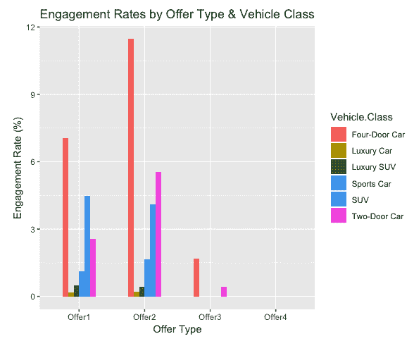
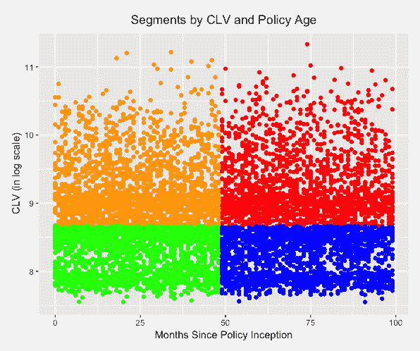

# 第七章：客户行为探索性分析

本章作为未来章节的第一步，我们将讨论什么是客户分析、分析并更好地理解客户群体的重要性和好处，以及客户分析在营销各个方面的使用案例。随着我们收集并跟踪更多关于客户及其在各个销售、营销平台和渠道中的行为的数据，营销人员可以更容易地分析和理解不同客户对不同营销策略的反应。客户分析通过利用这些数据帮助营销人员更好地理解他们的客户。此外，它还可以帮助营销人员制定更好的营销策略，从而提升客户参与度、留存率和转化率。

本章将涵盖以下主题：

+   客户分析：理解客户行为

+   使用 Python 进行客户分析

+   使用 R 进行客户分析

# 客户分析——理解客户行为

**客户分析**是通过分析客户行为数据来理解并获得客户行为洞察的过程。它涵盖了从简单的数据分析和可视化到更高级的客户细分和预测分析等多种内容。通过客户分析获得的信息和洞察可以用于制定营销策略、优化销售渠道以及做出其他关键的商业决策。

客户分析的重要性日益增加。因为许多企业更容易访问客户数据，而且客户现在也更容易获取关于其他竞争对手提供的类似产品和内容的数据和信息，所以能够理解和预测客户可能会购买或查看的内容对许多企业至关重要。你对客户的理解越深入，你就能在与竞争对手的竞争中拥有更强的竞争力。

# 客户分析的使用案例

客户分析可以在营销过程中的任何阶段使用。它可以用来监控和跟踪客户如何与产品互动或对不同的营销策略做出反应。这通常需要使用数据分析和可视化技术来生成报告或仪表板，便于展示**关键绩效指标**（**KPIs**）。

# 销售漏斗分析

客户分析的常见使用案例之一是**销售漏斗分析**。通过分析销售漏斗数据，我们可以监控和跟踪客户的生命周期，获取例如他们通过哪个营销渠道注册、他们多频繁登录系统、浏览和购买了哪些产品，或者他们在漏斗的每个步骤中如何流失等洞察。

# 客户细分

客户分析还可以用来根据客户的行为识别不同的客户群体。**客户细分**是客户分析的一个良好例子和结果。通过识别相似客户的子群体，你可以更好地理解目标群体。例如，低参与度客户的营销策略应该与高参与度客户的营销策略有所不同。通过根据参与度对客户群体进行有效细分，你可以更深入地了解不同客户群体如何对不同的营销策略做出反应。这进一步帮助你更好地定位特定的客户子群体。

# 预测分析

另一个客户分析的好用例是对客户数据进行**预测分析**。通过客户数据，你可以更深入地理解客户的哪些属性和特征与目标结果高度相关。例如，如果你希望提高响应率和参与率，可以分析数据，找出那些能导致更高响应率和参与率的客户特征。然后，你可以建立预测模型，预测客户对你的营销信息做出响应的可能性。

另一个预测分析的应用例子是营销渠道优化。通过从客户分析中获得的洞察，你可以建立预测模型来优化营销渠道。客户对不同的营销渠道会有不同的反应。例如，使用智能手机比其他群体更频繁的年轻群体，更有可能通过智能手机响应营销。另一方面，更年长的群体则更可能对传统媒体上的营销（如电视或报纸广告）做出更好的反应。通过客户分析，你可以识别客户的某些属性与不同营销渠道表现之间的关联。

正如我们到目前为止所讨论的，客户分析的应用范围广泛，可以在营销过程的任何阶段使用。在接下来的编程练习中，我们将讨论如何使用客户分析来监控和跟踪不同的营销策略，并查看一些细分和分析客户群体以获得洞察的方法。然后，在接下来的章节中，我们将探索客户分析的其他用例，例如优化参与率和留存率，以及客户细分。

# 使用 Python 进行客户分析

在本节中，我们将讨论如何使用 Python 进行客户分析。我们将主要使用 `pandas` 和 `matplotlib` 包来分析和可视化数据集中观察到的客户行为。对于那些希望使用 R 而非 Python 的读者，可以跳过到下一节。我们将从分析和理解已参与客户的行为开始，然后讨论通过某些标准对客户群体进行细分的简单方法。

在本次练习中，我们将使用 IBM 提供的公开数据集，可以通过以下链接找到：[`www.ibm.com/communities/analytics/watson-analytics-blog/marketing-customer-value-analysis/`](https://www.ibm.com/communities/analytics/watson-analytics-blog/marketing-customer-value-analysis/)。您可以访问此链接并下载以 CSV 格式提供的数据，文件名为 `WA_Fn UseC_ Marketing Customer Value Analysis.csv`。下载数据后，您可以通过运行以下命令将其加载到 Jupyter Notebook 中：

```py
import pandas as pd

df = pd.read_csv('../data/WA_Fn-UseC_-Marketing-Customer-Value-Analysis.csv')
```

类似于第六章，*推荐合适的产品*，我们使用 `pandas` 包中的 `read_csv` 函数来加载 CSV 格式的数据。一旦将数据加载到 `pandas` 的 `DataFrame` 中，数据应如下所示：


如从这份数据中所见，有一列名为 `Response`，包含客户是否响应了营销活动的信息。此外，`Renew Offer Type` 和 `Sales Channel` 列分别表示向客户提供的续约优惠类型和用于联系客户的销售渠道。还有许多其他列表示客户的社会经济背景以及客户当前拥有的保险类型。我们将利用这些信息更好地分析和理解客户行为，特别是在客户如何回应和参与营销及销售活动方面。

# 已参与客户分析

现在我们已经将数据加载到 Python 环境中，接下来我们将分析这些数据，以理解不同客户如何表现以及如何回应不同的营销策略。我们将按照以下步骤进行：

1.  总体参与率

1.  按优惠类型划分的参与率

1.  按优惠类型和车辆类别划分的参与率

1.  按销售渠道划分的参与率

1.  按销售渠道和车辆大小划分的参与率

# 总体参与率

我们首先需要理解的是总体市场响应或参与率。我们可以使用以下代码获取总的响应客户数量：

```py
df.groupby('Response').count()['Customer']
```

从数据中可以看到，`Response` 列包含了客户是否响应了营销呼叫的信息（`Yes` 表示响应的客户，`No` 表示没有响应的客户）。我们简单地使用 `pandas` DataFrame 中的 `groupby` 函数按此列进行分组，并使用 `pandas` 包中的 `count` 函数统计每个类别中的客户数量。

结果如下所示：


为了在图表中可视化这个结果，你可以使用以下代码：

```py
ax = df.groupby('Response').count()['Customer'].plot(
    kind='bar',
    color='skyblue',
    grid=True,
    figsize=(10, 7),
    title='Marketing Engagment'
)

ax.set_xlabel('Engaged')
ax.set_ylabel('Count')

plt.show()
```

图表如下所示：


从这些结果中可以看出，大多数客户没有响应营销呼叫。让我们用百分比的方式来看这些数字，使用以下代码：

```py
df.groupby('Response').count()['Customer']/df.shape[0]
```

当你运行这段代码时，结果如下所示：


从这些结果中我们可以看出，只有大约 14% 的客户响应了营销呼叫。让我们更深入分析响应的客户，进一步了解哪些因素对他们最有效。

# 按优惠类型的参与率

不同类型的优惠对客户的效果不同。在这一部分，我们将查看哪些类型的优惠对参与的客户最有效。请看以下代码：

```py
by_offer_type_df = df.loc[
    df['Response'] == 'Yes'
].groupby([
    'Renew Offer Type'
]).count()['Customer'] / df.groupby('Renew Offer Type').count()['Customer']
```

从这段代码中可以看出，我们正在按 `Renew Offer Type` 列进行分组，在该列中有四种不同类型的优惠。我们首先通过筛选 `Response` 列中为 `Yes` 的值来统计每种续约优惠类型中参与的客户数量。然后，我们将这些数字除以每种续约优惠类型中客户的总数，从而得到每种续约优惠类型的参与率。结果如下所示：


我们可以通过以下代码在条形图中可视化这些结果：

```py
ax = (by_offer_type_df*100.0).plot(
    kind='bar',
    figsize=(7, 7),
    color='skyblue',
    grid=True
)

ax.set_ylabel('Engagement Rate (%)')

plt.show()
```

条形图如下所示：


从这个图表中你可以很容易地看到，`Offer2` 在客户中的参与率最高。在进行客户分析时，如前所述，我们通常希望了解每个事件中客户的 demographics 和属性，以便理解哪些方案对哪类客户最有效。这可以通过更好地定位那些客户子群体，进而在下一次营销活动中实现进一步的改进。让我们进一步分析这些数据。

# 按优惠类型和车辆类别的参与率

在上一节中，我们了解到`Renewal Offer Type 2`对客户的效果最好。营销人员可以从这一发现中受益，因为它提供了有关哪种类型的优惠最有效并且具有最高客户响应率的有用见解。然而，我们还可以获得更多关于不同背景或特征的客户如何对不同优惠类型做出反应的见解。在这一节中，我们将展示作为营销人员，您可以如何了解具有不同属性的客户如何对不同的营销信息做出不同的反应。

让我们看看针对不同车辆类别的客户，每种优惠类型的响应率是否有明显差异。我们将使用以下代码查看按每种优惠类型和`Vehicle Class`计算的参与率：

```py
by_offer_type_df = df.loc[
    df['Response'] == 'Yes'
].groupby([
    'Renew Offer Type', 'Vehicle Class'
]).count()['Customer']/df.groupby('Renew Offer Type').count()['Customer']
```

从这段代码中可以看到，我们按两列数据进行分组，分别是`Renew Offer Type`和`Vehicle Class`，并计算每个组的参与率。

结果如下所示：


为了提高可读性，我们可以使用以下代码来转换这些数据：

```py
by_offer_type_df = by_offer_type_df.unstack().fillna(0)
```

从这段代码中可以看到，我们在`pandas`的`DataFrame`中使用了`unstack`函数来透视数据，将内层分组提取并转换为列。这样查看结果会更加方便。结果如下所示：


如您所见，在应用`unstack`函数后，`Vehicle Class`现在变成了列。我们可以使用以下代码将此数据可视化为条形图：

```py
ax = (by_offer_type_df*100.0).plot(
    kind='bar',
    figsize=(10, 7),
    grid=True
)

ax.set_ylabel('Engagement Rate (%)')

plt.show()
```

图表如下所示：


让我们仔细看看这张图表。我们在上一节中看到，`Offer2`在客户中具有最高的响应率。在这里，我们可以看到不同车辆类别的客户如何对其他类型的续约优惠做出不同的反应。例如，拥有`Four-Door Car`的客户对所有优惠类型的响应频率最高。然而，拥有`SUV`的客户对`Offer1`的响应率明显高于`Offer2`。从这些结果中可以看出，通过进一步细分客户群体，我们可以获得更多的见解。如果我们在不同客户细分群体之间看到响应率的显著差异，我们可以对不同优惠类型的目标人群进行微调。在我们的示例中，如果我们认为拥有`SUV`的客户对`Offer1`的参与度明显高于对`Offer2`的参与度，那么我们可以将`Offer1`目标定向为`SUV`客户。另一方面，如果我们认为拥有`Two-Door Car`的客户对`Offer2`的参与度显著高于其他优惠类型，那么我们可以将`Offer2`目标定向为`Two-Door Car`车主。

# 按销售渠道的参与率

我们来看另一个例子。我们将分析不同销售渠道的参与率差异。请看以下代码：

```py
by_sales_channel_df = df.loc[
    df['Response'] == 'Yes'
].groupby([
    'Sales Channel'
]).count()['Customer']/df.groupby('Sales Channel').count()['Customer']
```

结果如下所示：


使用可视化展示这些结果会更容易理解。你可以使用以下代码将这些数据可视化：

```py
ax = (by_sales_channel_df*100.0).plot(
    kind='bar',
    figsize=(7, 7),
    color='skyblue',
    grid=True
)

ax.set_ylabel('Engagement Rate (%)')

plt.show()
```

图表如下所示：


从这个图表中你可以看到，`Agent`在获取客户回应方面表现最佳，其次是通过`Web`渠道的销售表现。和之前一样，我们可以进一步分析这一结果，看看不同特征的客户是否会有行为上的变化。

# 按销售渠道和车辆大小划分的参与率

本节将查看不同车辆大小的客户是否对不同销售渠道有不同的响应。请查看以下代码，计算每个销售渠道和车辆大小的参与率：

```py
by_sales_channel_df = df.loc[
    df['Response'] == 'Yes'
].groupby([
    'Sales Channel', 'Vehicle Size'
]).count()['Customer']/df.groupby('Sales Channel').count()['Customer']
```

结果如下所示：


和之前一样，我们可以将这些数据通过以下代码`unstack`为一个更易于查看的格式：

```py
by_sales_channel_df = by_sales_channel_df.unstack().fillna(0)
```

结果如下所示：


我们可以使用以下代码将这些结果可视化为条形图：

```py
ax = (by_sales_channel_df*100.0).plot(
    kind='bar',
    figsize=(10, 7),
    grid=True
)

ax.set_ylabel('Engagement Rate (%)')

plt.show()
```

现在图表如下所示：


从这个图表中可以看到，`Medsize`车辆的客户对所有销售渠道的反应最好。在不同销售渠道中，`Large`和`Small`车辆的车主在参与率上有所不同。例如，`Small`车辆的车主在通过`Agent`和`Call Center`渠道时反应更好，而`Large`车辆的车主则更倾向于通过`Branch`和`Web`渠道进行响应。正如之前讨论的，我们可以将这些见解运用到下一轮的营销中。例如，由于`Small`车主通过`Agent`和`Call Center`响应的可能性较高，我们可以在面向`Small`车主时更加重视这两个渠道。

# 客户群体细分

本节将简要讨论如何对客户群体进行细分。我们将在第十章《数据驱动的客户细分》中扩展这一概念，并深入讨论如何运用机器学习进行客户细分，但本节会让你对客户细分的基本概念和表现形式有一个大致了解。

本节中，我们将通过`Customer Lifetime Value`（客户生命周期价值）和`Months Since Policy Inception`（自保单生效以来的月份数）对客户群体进行细分。你可以尝试使用不同的特征来细分客户群体。请查看以下`Customer Lifetime Value`列的分布：


根据这些信息，我们将定义那些`Customer Lifetime Value`高于中位数的客户为高 CLV 客户，而那些 CLV 低于中位数的客户为低 CLV 客户。你可以使用以下代码进行编码：

```py
df['CLV Segment'] = df['Customer Lifetime Value'].apply(
    lambda x: 'High' if x > df['Customer Lifetime Value'].median() else 'Low'
)
```

我们将对`Months Since Policy Inception`字段进行相同的处理。请查看以下关于`Months Since Policy Inception`的分布：


类似地，我们将定义那些`Months Since Policy Inception`大于中位数的客户为高`Policy Age Segment`客户，而那些低于中位数的客户为低`Policy Age Segment`客户。你可以使用以下代码进行编码：

```py
df['Policy Age Segment'] = df['Months Since Policy Inception'].apply(
    lambda x: 'High' if x > df['Months Since Policy Inception'].median() else 'Low'
)
```

我们可以使用以下代码来可视化这些段：

```py
ax = df.loc[
    (df['CLV Segment'] == 'High') & (df['Policy Age Segment'] == 'High')
].plot.scatter(
    x='Months Since Policy Inception',
    y='Customer Lifetime Value',
    logy=True,
    color='red'
)

df.loc[
    (df['CLV Segment'] == 'Low') & (df['Policy Age Segment'] == 'High')
].plot.scatter(
    ax=ax,
    x='Months Since Policy Inception',
    y='Customer Lifetime Value',
    logy=True,
    color='blue'
)

df.loc[
    (df['CLV Segment'] == 'High') & (df['Policy Age Segment'] == 'Low')
].plot.scatter(
    ax=ax,
    x='Months Since Policy Inception',
    y='Customer Lifetime Value',
    logy=True,
    color='orange'
)

df.loc[
    (df['CLV Segment'] == 'Low') & (df['Policy Age Segment'] == 'Low')
].plot.scatter(
    ax=ax,
    x='Months Since Policy Inception',
    y='Customer Lifetime Value',
    logy=True,
    color='green',
    grid=True,
    figsize=(10, 7)
)

ax.set_ylabel('CLV (in log scale)')
ax.set_xlabel('Months Since Policy Inception')

ax.set_title('Segments by CLV and Policy Age')

plt.show()
```

让我们仔细看看这段代码。在第一个代码块中，我们使用`pandas`包中的`plot.scatter`函数为那些位于`High CLV`和`High Policy Age`段的客户创建散点图。通过使用`logy=True`标志，我们可以轻松地将尺度转换为对数尺度。对数尺度通常用于货币值，因为它们的值常常具有很大的偏斜性。我们对之前创建的四个段重复这个过程四次。

结果散点图如下所示：


从这个散点图中你可以看到，红色的数据点代表那些位于`High CLV`和`High Policy Age`段的客户。橙色代表`High CLV`和`Low Policy Age`组，蓝色代表`Low CLV`和`High Policy Age`组，最后，绿色代表`Low CLV`和`Low Policy Age`组。

现在我们已经创建了这四个段，让我们看看这些段之间的参与率是否存在明显差异。请查看以下代码：

```py
engagment_rates_by_segment_df = df.loc[
    df['Response'] == 'Yes'
].groupby(
    ['CLV Segment', 'Policy Age Segment']
).count()['Customer']/df.groupby(
    ['CLV Segment', 'Policy Age Segment']
).count()['Customer']
```

从这段代码中你可以看到，我们通过两个新创建的列`CLV Segment`和`Policy Age Segment`进行分组，并计算这四个段的参与率。结果如下所示：


在图表中查看差异会更加直观。你可以使用以下代码为这些数据创建一个条形图：

```py
ax = (engagment_rates_by_segment_df.unstack()*100.0).plot(
    kind='bar',
    figsize=(10, 7),
    grid=True
)

ax.set_ylabel('Engagement Rate (%)')
ax.set_title('Engagement Rates by Customer Segments')

plt.show()
```

现在，图表如下所示：


从此图中可以看出，`高保单年龄段`的参与度高于`低保单年龄段`。这表明那些在该公司投保较长时间的客户响应更好。还可以注意到，`高保单年龄`和`低客户生命周期价值`这一群体的参与率在四个群体中最高。通过根据客户属性创建不同的客户群体，我们可以更好地理解不同客户群体的行为差异。我们将在第九章《客户生命周期价值》中进一步深入探讨客户细分的概念，并进行实验。

本次 Python 练习的完整代码可以在以下链接中找到：[`github.com/yoonhwang/hands-on-data-science-for-marketing/blob/master/ch.7/python/CustomerBehaviors.ipynb`](https://github.com/yoonhwang/hands-on-data-science-for-marketing/blob/master/ch.7/python/CustomerBehaviors.ipynb)

# 使用 R 进行客户分析

在本节中，我们将讨论如何使用 R 进行客户分析。我们将主要使用`dplyr`和`ggplot2`库来分析和可视化数据集中观察到的客户行为。对于那些希望使用 Python 而非 R 进行练习的读者，可以参考前一节内容。我们将通过分析和理解活跃客户的行为开始本节内容，然后讨论通过某些标准对客户基础进行简单划分的方法。

对于本次练习，我们将使用**IBM**提供的公开数据集，您可以通过以下链接找到：[`www.ibm.com/communities/analytics/watson-analytics-blog/marketing-customer-value-analysis/`](https://www.ibm.com/communities/analytics/watson-analytics-blog/marketing-customer-value-analysis/)。您可以访问该链接并下载名为`WA_Fn UseC_ Marketing Customer Value Analysis.csv`的 CSV 格式数据。下载数据后，您可以通过运行以下命令将其加载到 RStudio 中：

```py
library(dplyr)
library(ggplot2)

#### 1\. Load Data ####
df <- read.csv(
  file="~/Documents/data-science-for-marketing/ch.7/data/WA_Fn-UseC_-Marketing-Customer-Value-Analysis.csv", 
  header=TRUE
)
```

与上一章类似，我们在 R 中使用`read.csv`函数加载 CSV 格式的数据。一旦将数据加载到`DataFrame`中，它应如下所示：


从这些数据中可以看到，有一列名为 `Response`，其中包含了客户是否回应了营销活动的信息。此外，`Renew.Offer.Type` 和 `Sales.Channel` 列分别代表了呈现给客户的续约优惠类型和用于联系客户的销售渠道。还有许多其他列代表了客户的社会经济背景以及客户当前拥有的保险类型。我们将利用这些信息来分析和更好地理解客户行为，尤其是他们对营销和销售活动的响应和参与情况。

在我们深入数据之前，我们将 `Response` 列编码为数值——`0` 表示 `No`，`1` 表示 `Yes`。这样可以使我们未来的计算更简便。你可以使用以下代码进行编码：

```py
# Encode engaged customers as 0s and 1s
df$Engaged <- as.integer(df$Response) - 1
```

# 已参与客户的分析

现在我们已经将数据加载到环境中，我们将对其进行分析，以了解不同客户如何对不同的营销策略做出反应。我们将按照以下步骤进行：

1.  总体参与率

1.  按优惠类型的参与率

1.  按优惠类型和车辆类别的参与率

1.  按销售渠道的参与率

1.  按销售渠道和车辆大小的参与率

# 总体参与率

我们首先需要理解的是整体的营销响应或参与率。我们可以使用以下代码来获取总的响应客户数量：

```py
## - Overall Engagement Rates ##
engagementRate <- df %>% group_by(Response) %>%
  summarise(Count=n()) %>%
  mutate(EngagementRate=Count/nrow(df)*100.0)
```

正如你从数据中看到的，`Response` 列包含了客户是否回应了营销呼叫的信息（`Yes` 表示有回应，`No` 表示没有回应）。我们通过在 `dplyr` 库中使用 `group_by` 函数对该列进行分组，并利用 `n()` 函数统计每个类别中的客户数量。接着，使用 `mutate` 函数，我们通过将 `Count` 除以 `DataFrame` 中的总记录数来计算参与率。

结果如下所示：


为了在图表中可视化这一点，你可以使用以下代码：

```py
ggplot(engagementRate, aes(x=Response, y=EngagementRate)) +
  geom_bar(width=0.5, stat="identity") +
  ggtitle('Engagement Rate') +
  xlab("Engaged") +
  ylab("Percentage (%)") +
  theme(plot.title = element_text(hjust = 0.5)) 
```

绘图结果如下所示：


从这些结果中可以看到，大多数客户没有回应营销呼叫。数据表明，只有大约 14% 的客户回应了营销呼叫。接下来，我们将深入了解那些回应的客户，进一步了解对他们来说什么最有效。

# 按优惠类型的参与率

不同类型的优惠对不同客户的效果不同。在这一部分，我们将研究哪些类型的优惠对参与过的客户最有效。请看以下代码：

```py
## - Engagement Rates by Offer Type ##
engagementRateByOfferType <- df %>% 
  group_by(Renew.Offer.Type) %>%
  summarise(Count=n(), NumEngaged=sum(Engaged)) %>%
  mutate(EngagementRate=NumEngaged/Count*100.0)
```

如你从这段代码中可以看到，我们按`Renew.Offer.Type`列进行分组，其中有四种不同类型的优惠。然后，在`summarise`函数中，我们使用`n()`函数统计记录的总数，并通过对编码列`Engaged`求和，统计参与的客户数量。最后，在`mutate`函数中，我们通过将`NumEngaged`除以`Count`并乘以`100.0`来计算`EngagementRate`。

结果如下所示：


我们可以通过以下代码将这些结果可视化为条形图：

```py
ggplot(engagementRateByOfferType, aes(x=Renew.Offer.Type, y=EngagementRate)) +
  geom_bar(width=0.5, stat="identity") +
  ggtitle('Engagement Rates by Offer Type') +
  xlab("Offer Type") +
  ylab("Engagement Rate (%)") +
  theme(plot.title = element_text(hjust = 0.5)) 
```

现在的条形图如下所示：


从这个图中你可以轻松看出，`Offer 2`在客户中拥有最高的参与率。在进行客户分析时，如前所述，我们通常希望了解每个事件中客户的群体特征和属性，以便了解什么对哪类客户最有效。这将帮助我们在下一次营销活动中更好地针对这些客户子群体进行优化。让我们进一步分析这些数据。

# 按优惠类型和车辆类别的参与率

在上一节中，我们已经了解到`Renewal Offer Type 2`对客户最有效。市场营销人员可以从这一信息中受益，因为这一发现提供了有价值的见解，说明哪种类型的优惠最有效，并且收到了客户的最高响应率。然而，我们还可以进一步洞察不同背景或特征的客户如何对不同的优惠类型做出不同反应。在本节中，我们将展示作为市场营销人员，如何理解不同属性的客户如何对不同的营销信息做出不同的反应。

让我们看看对于不同车辆类别的客户，是否存在优惠类型响应率的显著差异。我们将使用以下代码查看每种优惠类型和车辆类别的参与率：

```py
## - Offer Type & Vehicle Class ##
engagementRateByOfferTypeVehicleClass <- df %>% 
  group_by(Renew.Offer.Type, Vehicle.Class) %>%
  summarise(NumEngaged=sum(Engaged)) %>%
  left_join(engagementRateByOfferType[,c("Renew.Offer.Type", "Count")], by="Renew.Offer.Type") %>%
  mutate(EngagementRate=NumEngaged/Count*100.0)
```

如你从这段代码中可以看到，我们按`Renew.Offer.Type`和`Vehicle.Class`两列进行分组，并统计每组中的参与客户数量。然后，我们通过`Renew.Offer.Type`列将此数据与`engagementRateByOfferType`变量进行连接，以获得每种优惠类型的参与客户总数。最后，在`mutate`函数中计算参与率。

结果如下所示：


为了使这更加易读，我们可以使用条形图来可视化这些数据。请看以下代码：

```py
ggplot(engagementRateByOfferTypeVehicleClass, aes(x=Renew.Offer.Type, y=EngagementRate, fill=Vehicle.Class)) +
  geom_bar(width=0.5, stat="identity", position = "dodge") +
  ggtitle('Engagement Rates by Offer Type & Vehicle Class') +
  xlab("Offer Type") +
  ylab("Engagement Rate (%)") +
  theme(plot.title = element_text(hjust = 0.5)) 
```

使用这段代码，我们可以生成如下所示的条形图：



让我们仔细看看这个图表。在上一节中我们看到`Offer2`在客户中具有最高的响应率。在这里，我们可以看到不同车辆类别的客户如何以不同方式响应其他类型的续约优惠。例如，拥有`四门轿车`的客户在所有优惠类型中反应最为频繁。然而，拥有`SUV`的客户对`Offer1`的反应几乎高于`Offer2`。从这些结果中可以看出，我们可以通过进一步细分客户的人口统计信息获得更多的洞察。如果我们看到不同客户群体之间的响应率有显著差异，我们可以细化不同优惠针对的目标群体。例如，如果我们认为拥有`SUV`的客户对`Offer1`的响应率明显高于`Offer2`，那么我们可以将`Offer1`针对`SUV`客户。另一方面，如果我们认为拥有`两厢车`的客户对`Offer2`的响应率明显高于其他优惠类型，那么我们可以将`Offer2`针对`两厢车`车主。

# 按销售渠道的参与率

让我们来看一个另一个例子。我们将分析不同销售渠道的参与率差异。请查看以下代码：

```py
## - Engagement Rates by Sales Channel ##
engagementRateBySalesChannel <- df %>% 
  group_by(Sales.Channel) %>%
  summarise(Count=n(), NumEngaged=sum(Engaged)) %>%
  mutate(EngagementRate=NumEngaged/Count*100.0)
```

结果如下所示：


使用可视化图表可以更容易地理解这一结果。您可以使用以下代码来可视化这些数据：

```py
ggplot(engagementRateBySalesChannel, aes(x=Sales.Channel, y=EngagementRate)) +
  geom_bar(width=0.5, stat="identity") +
  ggtitle('Engagement Rates by Sales Channel') +
  xlab("Sales Channel") +
  ylab("Engagement Rate (%)") +
  theme(plot.title = element_text(hjust = 0.5)) 
```

图表如下所示：


从这个图表中可以看到，`Agent`在获得客户反馈方面效果最好。其次是通过`Web`的销售。接下来，我们将深入分析这一结果，看看不同特征的客户之间的行为是否有所不同。

# 按销售渠道和车辆尺寸的参与率

在本节中，我们将探讨不同车辆尺寸的客户是否在不同销售渠道上的反应有所不同。请查看以下代码，以计算每个销售渠道和车辆尺寸的参与率：

```py
## - Sales Channel & Vehicle Size ##
engagementRateBySalesChannelVehicleSize <- df %>% 
  group_by(Sales.Channel, Vehicle.Size) %>%
  summarise(NumEngaged=sum(Engaged)) %>%
  left_join(engagementRateBySalesChannel[,c("Sales.Channel", "Count")], by="Sales.Channel") %>%
  mutate(EngagementRate=NumEngaged/Count*100.0)
```

结果如下所示：


和之前一样，我们可以通过条形图来可视化这些数据，以便更容易阅读。您可以使用以下代码来可视化这些数据：

```py
ggplot(engagementRateBySalesChannelVehicleSize, aes(x=Sales.Channel, y=EngagementRate, fill=Vehicle.Size)) +
  geom_bar(width=0.5, stat="identity", position = "dodge") +
  ggtitle('Engagement Rates by Sales Channel & Vehicle Size') +
  xlab("Sales Channel") +
  ylab("Engagement Rate (%)") +
  theme(plot.title = element_text(hjust = 0.5)) 
```

该图表现在如下所示：


从这个图表中可以看出，拥有`Medsize`车辆的客户对所有销售渠道的反应最佳。不同销售渠道之间，`Large`和`Small`车辆所有者的参与率略有不同。例如，`Small`车辆所有者更倾向于通过`Agent`和`Call Center`渠道做出反应，而`Large`车辆所有者则更倾向于通过`Branch`和`Web`渠道做出反应。如前所述，我们可以在下一步的营销工作中利用这些洞察。例如，既然`Small`车辆所有者通过`Agent`和`Call Center`渠道表现出更高的参与度，我们可以在这两个渠道上更密集地接触`Small`车辆所有者。

# 客户细分

在本节中，我们将简要讨论如何进行客户细分。我们将在第九章中进一步扩展这一概念，并讨论如何利用机器学习进行客户细分，*客户生命周期价值*，但本节将为你提供一些关于客户细分是什么以及它的表现形式的基本概念。

在本节中，我们将通过`Customer.Lifetime.Value`和`Months.Since.Policy.Inception`来进行客户细分。你可以尝试不同的特征来细分客户群体。首先，让我们来看一下`Customer.Lifetime.Value`列的分布：


+   基于这些信息，我们将 CLV 高于中位数的客户定义为高 CLV 客户，将 CLV 低于中位数的客户定义为低 CLV 客户。你可以使用以下代码进行编码：

```py
clv_encode_fn <- function(x) {if(x > median(df$Customer.Lifetime.Value)) "High" else "Low"}
df$CLV.Segment <- sapply(df$Customer.Lifetime.Value, clv_encode_fn)
```

从这段代码中可以看到，我们定义了`clv_encode_fn`函数，将 CLV 高于中位数的客户编码为`High`，将 CLV 低于中位数的客户编码为`Low`。然后，使用`sapply`函数，我们对`Customer.Lifetime.Value`列中的值进行编码，并将编码后的值存储为一个名为`CLV.Segment`的新列。

我们将按照相同的过程处理`Months.Since.Policy.Inception`字段。请查看以下关于`Months.Since.Policy.Inception`的分布：


同样地，我们将`Months.Since.Policy.Inception`值高于中位数的客户定义为高`Policy.Age.Segment`客户，将值低于中位数的客户定义为低`Policy.Age.Segment`客户。你可以使用以下代码进行编码：

```py
policy_age_encode_fn <- function(x) {if(x > median(df$Months.Since.Policy.Inception)) "High" else "Low"}
df$Policy.Age.Segment <- sapply(df$Months.Since.Policy.Inception, policy_age_encode_fn)
```

我们可以使用以下代码来可视化这些细分：

```py
ggplot(
  df[which(df$CLV.Segment=="High" & df$Policy.Age.Segment=="High"),], 
  aes(x=Months.Since.Policy.Inception, y=log(Customer.Lifetime.Value))
) +
  geom_point(color='red') +
  geom_point(
    data=df[which(df$CLV.Segment=="High" & df$Policy.Age.Segment=="Low"),], 
    color='orange'
  ) +
  geom_point(
    data=df[which(df$CLV.Segment=="Low" & df$Policy.Age.Segment=="Low"),], 
    color='green'
  ) +
  geom_point(
    data=df[which(df$CLV.Segment=="Low" & df$Policy.Age.Segment=="High"),], 
    color='blue'
  ) +
  ggtitle('Segments by CLV and Policy Age') +
  xlab("Months Since Policy Inception") +
  ylab("CLV (in log scale)") +
  theme(plot.title = element_text(hjust = 0.5)) 
```

让我们仔细看一下这段代码。首先，我们将`High CLV`和`High Policy Age`群体绘制成红色的散点图。然后，我们重复相同的过程，分别为`High CLV`和`Low Policy Age`群体绘制橙色的散点图，`Low CLV`和`Low Policy Age`群体绘制绿色的散点图，最后为`Low CLV`和`High Policy Age`群体绘制蓝色的散点图。这里有一点需要注意的是我们在`aes`函数中是如何定义`y`值的。如代码所示，`y=log(Customer.Lifetime.Value)`，我们将 CLV 值转换为对数刻度。对数刻度常用于货币数值，因为它们的值通常具有较高的偏态。

生成的散点图如下所示：



从这个散点图中可以看到，红色的数据点代表的是`High CLV`和`High Policy Age`群体的客户。橙色的数据点代表的是`High CLV`和`Low Policy Age`群体，蓝色的数据点代表的是`Low CLV`和`High Policy Age`群体，最后，绿色的数据点代表的是`Low CLV`和`Low Policy Age`群体。

现在我们已经创建了这四个群体，接下来我们来看看这些群体之间的参与率是否有明显差异。请查看以下代码：

```py
engagementRateBySegment <- df %>% 
  group_by(CLV.Segment, Policy.Age.Segment) %>%
  summarise(Count=n(), NumEngaged=sum(Engaged)) %>%
  mutate(EngagementRate=NumEngaged/Count*100.0)
```

从这段代码中可以看到，我们正在根据两个新创建的列`CLV.Segment`和`Policy.Age.Segment`进行分组，并计算这四个群体的参与率。结果如下所示：


通过图表，理解差异会更加直观。你可以使用以下代码为这些数据创建条形图：

```py
ggplot(engagementRateBySegment, aes(x=CLV.Segment, y=EngagementRate, fill=Policy.Age.Segment)) +
  geom_bar(width=0.5, stat="identity", position = "dodge") +
  ggtitle('Engagement Rates by Customer Segments') +
  ylab("Engagement Rate (%)") +
  theme(plot.title = element_text(hjust = 0.5)) 
```

现在图表看起来如下：


从这个图中可以看出，`High Policy.Age.Segment`的参与率高于`Low Policy.Age.Segment`。这表明那些与公司合作时间较长的客户回应更积极。还可以注意到，`High Policy Age`和`Low CLV`群体的参与率在四个群体中最高。通过根据客户属性创建不同的客户群体，我们可以更好地理解不同群体的客户行为差异。我们将在第九章中进一步扩展和深入实验客户细分的概念，*客户生命周期价值*。

这次 R 语言练习的完整代码可以在以下链接找到：[`github.com/yoonhwang/hands-on-data-science-for-marketing/blob/master/ch.7/R/CustomerBehaviors.R`](https://github.com/yoonhwang/hands-on-data-science-for-marketing/blob/master/ch.7/R/CustomerBehaviors.R)。

# 总结

在这一章中，我们讨论了客户分析。我们了解了客户分析的定义，以及进行客户分析的重要性和好处，还介绍了客户分析的不同应用场景。我们探讨了随着客户数据对企业的可及性提高以及关于客户的丰富数据的增多导致竞争加剧的现象，并强调了了解客户喜好的重要性。进行客户分析是获取客户行为洞察的重要步骤，有助于形成更好的营销策略，优化销售渠道以及做出其他关键业务决策。利用客户分析，您可以监测和追踪客户对不同产品和营销策略的反应指标（KPI），有效地构建类似客户群体，并建立预测模型以提高客户参与和保留率，同时优化营销渠道。

在下一章中，我们将学习如何使用预测分析来预测营销参与的可能性。我们将讨论一些常用的机器学习算法，用于构建预测模型，并在数据集上实验它们的预测性能。
