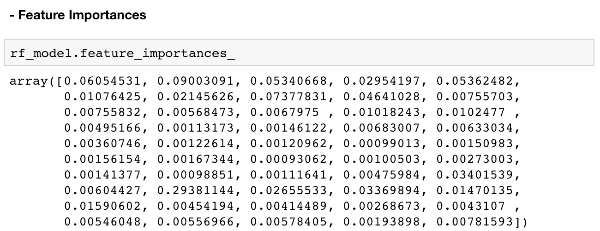
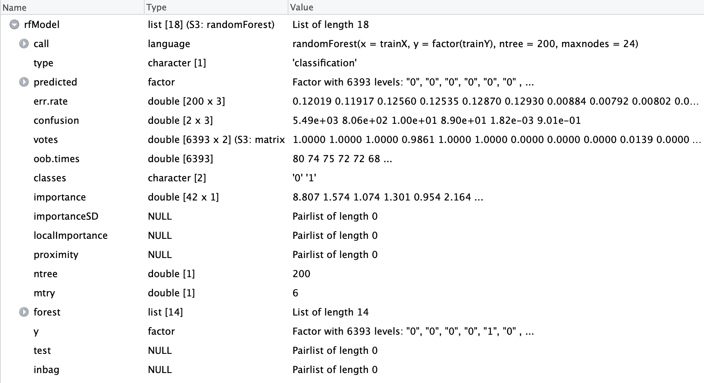

# 第八章：预测营销互动的可能性

在本章中，我们将扩展上一章的知识以及我们在第七章中进行的客户分析练习，*客户行为的探索性分析*。为了实现更成功、更智能的营销策略，我们不能仅仅停留在分析客户数据这一层面。借助数据科学和机器学习的先进技术，我们现在可以对客户的未来行为做出智能的猜测和估计，例如哪些类型的客户更可能参与营销活动，客户可能购买多少商品，或者哪些客户可能会流失。这些基于历史客户数据建立的预测或智能猜测可以帮助你提升营销表现，并进一步为不同目标受众量身定制营销策略。在本章中，我们将学习如何利用数据科学和机器学习来预测未来的结果，以及这些预测如何帮助你的未来营销工作。

在本章中，我们将涵盖以下主题：

+   营销中的预测分析

+   评估分类模型

+   使用 Python 预测营销互动的可能性

+   使用 R 预测营销互动的可能性

# 营销中的预测分析

**预测分析**是一个分析并从历史数据中提取信息的过程，旨在识别模式并对未来结果做出预测。通常会使用大量的统计和机器学习模型，找出数据集中属性或特征与目标变量或行为之间的关系。这些预测分析可以在许多不同行业中得到应用。

例如，它常常被用于金融行业的欺诈检测，其中机器学习模型被训练来检测和防止潜在的欺诈交易。医疗行业也可以从预测分析中受益，帮助医生做出决策。此外，营销的各个方面也能从预测分析中获益，例如客户获取、客户保持以及追加销售和交叉销售等。

在预测分析中，广义上讲，存在两种类型的问题：

+   **分类问题**：分类问题是指观察值可以属于一组类别。例如，预测客户是否会打开一封营销邮件就是一个分类问题。只有两种可能的结果——打开营销邮件或不打开邮件。

+   **回归问题**：另一方面，回归问题是指结果可以取任何实数范围的情况。例如，预测客户终身价值就是一个回归问题。一个客户的终身价值可能是 $0，而另一个客户的终身价值可能是 $10,000。这种结果可以取连续值的问题，称为回归问题。

在本章中，我们将重点讨论营销行业中常见的分类问题之一——预测客户参与的可能性。在下一章，第九章，*客户终身价值*，我们将探讨营销行业中经常出现的回归问题。

# 预测分析在营销中的应用

如前所述，预测分析在营销中的应用方式多种多样。本节中，我们将讨论预测分析在营销中的四个常见应用案例：

+   **客户参与的可能性**：预测分析可以帮助营销人员预测客户与他们的营销策略互动的可能性。例如，如果你的营销活动主要通过电子邮件进行，你可以利用预测分析来预测哪些客户有较高的可能性打开你的营销邮件，并根据这些高可能性客户定制营销策略，从而最大化营销效果。再举一个例子，如果你在社交媒体上展示广告，预测分析可以帮助你识别那些可能点击广告的客户类型。

+   **客户终身价值**：预测分析可以帮助你预测客户的预期终身价值。通过历史交易数据，预测分析可以帮助你识别客户群体中的高价值客户。通过这些预测，你和你的公司可以更加专注于与这些高价值客户建立良好的关系。我们将在下一章中更详细地讨论如何为客户终身价值预测构建预测模型。

+   **推荐正确的产品和内容**：正如我们在第六章，*推荐正确的产品*中所讨论的那样，我们可以利用数据科学和机器学习来预测哪些客户可能购买产品或查看内容。通过这些预测，你可以通过向个人客户推荐合适的产品和内容来提高客户转化率。

+   **客户获取与保持**：预测分析也在客户获取和保持方面得到了广泛应用。根据你收集的潜在客户资料和现有客户的历史数据，你可以应用预测分析来识别高质量的潜在客户，或者根据潜在客户转化为活跃客户的可能性对其进行排名。另一方面，你可以使用客户流失数据以及现有客户的历史数据，开发预测模型来预测哪些客户可能会流失或取消订阅你的产品。我们将在第十一章《客户保持》中详细讨论如何将预测分析应用于客户保持，*保持客户*。

除了这四种常见的市场营销预测分析应用外，还有许多其他方法可以将预测分析应用于你的营销策略。你应该发挥创意，思考如何以及在哪些方面将预测分析运用于未来的营销策略。

# 评估分类模型

在开发预测模型时，了解如何评估这些模型非常重要。在本节中，我们将讨论五种评估分类模型性能的不同方法。第一个可用于衡量预测性能的指标是**准确度**。准确度就是所有预测中正确预测的百分比，如下所示的公式所示：


第二个常用于分类问题的指标是**精确度**。精确度定义为真正例的数量除以真正例和假正例的总数。真正例是指模型正确预测为正的情况，而假正例是指模型预测为正，但真实标签为负的情况。公式如下所示：


除了精确度，**召回率**也是评估分类模型性能的常用指标。召回率定义为真正例的数量除以真正例加上假负例的数量。假负例是指模型预测为负，但真实标签为正的情况。召回率可以看作是模型找回或发现正例的程度。公式如下所示：


我们将要讨论的最后两个指标是**接收者操作特征**（**ROC**）曲线和**曲线下面积**（**AUC**）。ROC 曲线展示了在不同阈值下，真正率和假正率的变化。AUC 只是 ROC 曲线下的总面积。AUC 的值范围从 0 到 1，AUC 数值越高，表示模型性能越好。随机分类器的 AUC 值为 0.5，因此任何 AUC 高于 0.5 的分类器都表明该模型的表现优于随机预测。典型的 ROC 曲线如下所示：


在接下来的编程练习中，我们将使用我们刚刚讨论的这五个指标来评估我们在 Python 和 R 中构建的模型的性能。现在让我们开始构建机器学习模型，以预测市场营销参与的可能性！

# 使用 Python 预测市场营销参与的可能性

在本节中，我们将讨论如何使用 Python 中的机器学习算法构建预测模型。更具体地，我们将学习如何使用随机森林算法构建预测模型，以及如何调整随机森林模型并评估模型性能。我们将主要使用 `pandas`、`matplotlib` 和 `scikit-learn` 包来分析、可视化和构建预测客户市场营销参与可能性的机器学习模型。对于那些希望使用 R 而非 Python 进行本次练习的读者，可以跳到下一节。

在本次练习中，我们将使用 IBM 提供的一个公开数据集，您可以通过以下链接找到该数据集：[`www.ibm.com/communities/analytics/watson-analytics-blog/marketing-customer-value-analysis/`](https://www.ibm.com/communities/analytics/watson-analytics-blog/marketing-customer-value-analysis/)。您可以访问此链接并下载以 CSV 格式提供的数据，文件名为 `WA_Fn UseC_ Marketing Customer Value Analysis.csv`。下载数据后，您可以通过运行以下命令将其加载到您的 Jupyter notebook 中：

```py
import pandas as pd

df = pd.read_csv('../data/WA_Fn-UseC_-Marketing-Customer-Value-Analysis.csv')
```

`df` 数据框如下所示：


如你所见，这是我们在上一章中使用的相同数据集，当时我们进行了客户分析。通过上一章所学到的关于该数据集的知识，我们将首先通过对目标变量和其他将用作机器学习模型特征的分类变量进行编码来准备我们的数据。

# 变量编码

为了使用 Python 中的`scikit-learn`包构建机器学习模型，数据集中的所有特征必须具有数值型值。然而，在数据集中，我们有许多列具有非数值型值。例如，目标变量`Response`，我们将使用机器学习模型预测的内容，是非数值型的。它包含两个字符串值——`Yes`和`No`。为了能够构建机器学习模型，我们需要用数值型值对这个`Response`目标变量进行编码。再举一个例子，`Gender`列，我们可以将其作为预测模型的特征之一，也没有数值型值。它包含两个字符串值——`F`表示女性，`M`表示男性。在本节中，我们将讨论如何对这些非数值型列进行编码，以便可以将它们用作机器学习模型的特征。

# 响应变量编码

我们要做的第一件事是对响应变量`Response`进行编码。我们将`Yes`值编码为`1`，`No`值编码为`0`。看看以下代码：

```py
df['Engaged'] = df['Response'].apply(lambda x: 1 if x == 'Yes' else 0)
```

如你所见，从这段代码中，我们使用`pandas` `DataFrame`的`apply`函数来对`Response`列应用我们的`lambda`函数，以便将`Yes`值编码为`1`，将`No`值编码为`0`。然后，我们将这些编码后的值存储在新创建的列`Engaged`中。为了使用这个新创建的列来获取整体响应或参与率，你可以使用以下代码：

```py
tdf['Engaged'].mean()
```

整体参与率如下所示：


# 分类变量编码

如果你仔细观察数据，以下变量是分类变量：

```py
columns_to_encode = [
    'Sales Channel', 'Vehicle Size', 'Vehicle Class', 'Policy', 'Policy Type', 
    'EmploymentStatus', 'Marital Status', 'Education', 'Coverage'
]
```

这些变量具有一组可以取值的不同值，而这些值之间不一定有区分顺序。

如果你还记得第四章《从参与到转化》中提到的内容，*从参与到转化*，其实有不止一种方法可以对分类变量进行编码。在本章中，我们将使用的方法是为每个单独的分类变量类别创建虚拟变量，方法是使用`pandas`包中的`get_dummies`函数。看看以下代码：

```py
categorical_features = []
for col in columns_to_encode:
   encoded_df = pd.get_dummies(df[col])
    encoded_df.columns = [col.replace(' ', '.') + '.' + x for x in encoded_df.columns]

    categorical_features += list(encoded_df.columns)

    df = pd.concat([df, encoded_df], axis=1)
```

如你所见，在这段代码片段中，我们正在遍历定义在`columns_to_encode`中的分类变量列名列表。然后，对于每一列，我们使用`pandas`包中的`get_dummies`函数来构建虚拟变量。为了使事情更清楚并减少混淆，我们正在重命名新创建的和编码过的`DataFrame` `encoded_df`中的列，其中每一列包含关于原始列名和它所表示的类别的信息。例如，对于`Sale Channel`列，新创建的`encoded_df`将如下所示：


如您从这个例子中所见，新的`DataFrame`的每一列代表原始`Sales Channel`列中的每个类别，值是经过独热编码的，这意味着如果给定记录属于某个类别，则该列值为`1`，否则为`0`。

一旦我们为给定的列创建了虚拟变量，我们将把新创建的列存储到一个名为`categorical_features`的变量中。最后，我们使用`pandas`包的`concat`函数将这个新创建的`DataFrame`与原始的`DataFrame`进行拼接。`concat`函数的一个参数`axis=1`告诉`pandas`通过列来拼接这两个`DataFrame`。

到目前为止，我们已经成功编码了除了`Gender`之外的所有分类变量。由于`Gender`列只包含两种性别，因此我们不需要为该列创建两个虚拟变量。我们将创建一个包含给定记录性别信息的变量。请看下面的代码：

```py
df['Is.Female'] = df['Gender'].apply(lambda x: 1 if x == 'F' else 0)

categorical_features.append('Is.Female')
```

如您从这段代码中所见，我们正在创建一个名为`Is.Female`的新列。我们使用`pandas`的`DataFrame`的`apply`函数，将所有女性编码为`1`，所有男性编码为`0`。

# 构建预测模型

我们几乎准备好开始构建和训练机器学习模型，以预测客户的响应或参与度了。在此之前，我们的数据还有一些需要清理的地方。请看下面的代码：

```py
all_features = continuous_features + categorical_features
response = 'Engaged'

sample_df = df[all_features + [response]]
sample_df.columns = [x.replace(' ', '.') for x in sample_df.columns]
all_features = [x.replace(' ', '.') for x in all_features]
```

如您从这段代码中看到的，我们正在创建一个新的`DataFrame` `sample_df`，它包含了所有的特征`all_features`和响应变量`response`。然后，我们通过将列名和特征名中的所有空格替换为点号，来清理列名和特征名。经过这些清理后，`DataFrame` `sample_df`现在如下所示：


现在，我们有了一个可以用来训练和测试机器学习模型的样本集，接下来我们将把这个样本集分成两个子集——一个用于训练模型，另一个用于测试和评估训练好的模型。Python 机器学习包`scikit-learn`有一个函数，可以将给定的样本集拆分成训练集和测试集。请看下面的代码：

```py
from sklearn.model_selection import train_test_split

x_train, x_test, y_train, y_test = train_test_split(sample_df[all_features], sample_df[response], test_size=0.3)
```

在`scikit-learn`包的`model_selection`模块中，有一个名为`train_test_split`的函数。这个函数接受样本集和所需的训练集和测试集大小的划分作为输入参数，并返回随机划分的训练集和测试集。从这段代码中可以看到，我们使用`70%`的样本集进行训练，剩下的`30%`用于测试。以下是样本集的训练集和测试集的划分情况：


如您所见，`sample_df` 中共有 `9,134` 条记录，`x_train` 中有 `6,393` 条记录，`x_test` 中有 `2,741` 条记录，这意味着大约 `70%` 的样本集用于训练集，剩余的 `30%` 样本集用于测试集。我们将在接下来的章节中使用这些训练集和测试集来构建和评估模型。

# 随机森林模型

基于我们目前准备好的数据，我们将构建一个预测模型，使用随机森林算法，预测客户是否会响应或参与市场营销活动。在 Python 的 `scikit-learn` 包中，随机森林算法被实现于 `ensemble` 模块，您可以使用以下代码导入随机森林类：

```py
from sklearn.ensemble import RandomForestClassifier
```

您可以使用以下代码创建一个随机森林分类器：

```py
rf_model = RandomForestClassifier()
```

然而，您可以调整许多超参数来优化随机森林模型。超参数是您在训练机器学习模型之前定义的参数。例如，在随机森林算法中，您可以定义您希望在随机森林模型中使用的树木数量。另一个例子是，您可以定义森林中每棵树的最大深度，从而限制每棵树的最大生长深度。

在 `scikit-learn` 的 `RandomForestClassifier` 类中，您可以定义许多超参数。我们将查看以下几个超参数的例子：

+   `n_estimators`：该参数定义了您希望在森林中构建的树木数量。一般来说，树木越多，性能表现越好。然而，随着森林中树木数量的增加，每增加一棵树带来的性能提升会逐渐减少。由于森林中树木的增加意味着训练额外树木的计算成本更高，您应该尝试找到平衡点，并在训练额外树木的计算成本超过性能提升时停止添加树木。

+   `max_depth`：该参数定义了单棵树的最大深度。深度越大，树可以从训练集捕获的信息越多，这意味着较大的树比较小的树学习训练集的能力更强。然而，树的深度越大，它就越可能会过拟合训练集。这意味着训练好的树在训练集中的表现和预测很好，但在未见过的数据集上预测较差。为了避免过拟合，我们希望限制树的深度，确保它不会对训练集过拟合，同时能够足够好地预测结果。

+   `min_samples_split`：此参数定义了拆分树节点所需的最小数据点数量。例如，如果您将`min_samples_split`设置为`50`，但节点只有`40`个记录，那么该节点将不会进一步拆分。另一方面，如果节点的样本数超过预定义的最小值，那么它将拆分成子节点。类似于`max_depth`超参数，这有助于管理树中发生的过拟合程度。

+   `max_features`：此参数定义了拆分节点时考虑的最大特征数。这个参数在随机森林模型中创造了*随机性*。在考虑拆分节点的最大特征数的情况下，随机森林算法会随机选择一个特征子集，最多为指定的最大特征数，并决定如何拆分树的某个节点。这样可以让每棵树从训练集中学习到不同的信息。当这些从略有不同特征集的训练集中学习到信息的树进行集成（bagging）或集成（ensemble）时，最终的森林将变得更加准确且具有鲁棒性。

若要获取更详细的描述和其他超参数的信息，您可以参考其官方文档，链接如下：[`scikit-learn.org/stable/modules/generated/sklearn.ensemble.RandomForestClassifier.html`](https://scikit-learn.org/stable/modules/generated/sklearn.ensemble.RandomForestClassifier.html)。

# 训练随机森林模型

使用`scikit-learn`训练随机森林模型非常简单。请查看以下代码：

```py
rf_model = RandomForestClassifier(
    n_estimators=200,
    max_depth=5
)

rf_model.fit(X=x_train, y=y_train)
```

使用`scikit-learn`包的`ensemble`模块中的`RandomforestClasifier`类，您首先需要创建一个带有超参数的`RandomforestClasifier`对象。为了演示，我们指示模型构建`200`棵树，每棵树的深度最大为`5`。然后，您可以使用`fit`函数训练该模型，该函数接受两个参数，`X`和`y`，其中`X`是训练样本，`y`是训练标签或目标值。

当您运行此代码时，您将看到如下输出：


一旦随机森林模型训练或拟合完成，模型对象将包含许多有用的信息。您可以从训练好的`scikit-learn`随机森林模型中提取一个有用的属性，那就是关于森林中各个单独树的信息。通过使用`estimators_`属性，您可以检索森林中构建的单独树。请查看以下输出：


从这个输出中可以看出，`estimators_` 属性返回的是一个子估计器列表，这些子估计器是决策树。通过这些信息，你可以模拟每个子估计器对每个输入的预测。例如，以下代码展示了如何获取森林中第一个子估计器的预测：

```py
rf_model.estimators_[0].predict(x_test)
```

以下输出显示了前五个子估计器的一些预测：


从这个输出中可以看出，不同的树对测试集中的每一条记录的预测是不同的。这是因为每棵树是通过随机选择不同的特征子集进行训练的。我们来看一下这些单独子估计器的预测结果。第一棵树预测测试集中的第`6`条记录为`1`类，其他则为`0`类。而第二棵树则预测测试集前 10 条记录为`0`类。通过这些信息，你可以看到随机森林模型的最终预测是如何由这些独立的子估计器或树形成的。

从训练好的 `RandomForestClassifier` 对象中，我们还可以获得特征重要性信息，这能帮助我们理解每个特征对最终预测的影响。你可以通过以下代码获取每个特征的重要性：

```py
rf_model.feature_importances_
```

这段代码的输出结果如下：



为了将这些特征重要性与对应的特征关联起来，你可以使用以下代码：

```py
feature_importance_df = pd.DataFrame(list(zip(rf_model.feature_importances_, all_features)))
feature_importance_df.columns = ['feature.importance', 'feature']
```

结果如下所示：


从这个输出中可以看出，`EmploymentStatus.Retired` 特征似乎是做出最终预测的最重要因素，`Income`、`Total.Claim.Amount` 和 `Customer.Lifetime.Value` 特征依次排在第二、第三和第四重要特征的位置。

# 评估分类模型

在本章早些时候，我们讨论了五种不同的方式来评估分类模型的性能。在这一节中，我们将学习如何在 Python 中计算并可视化评估分类模型的指标，使用的是我们刚刚建立的随机森林模型。

我们将要查看的前三个指标是准确率、精确率和召回率。Python 的 `scikit-learn` 包已经实现了这些指标的函数。你可以通过以下代码行导入这些函数：

```py
from sklearn.metrics import accuracy_score, precision_score, recall_score
```

从这段代码中可以看到，`scikit-learn` 包的 `metrics` 模块有一个 `accuracy_score` 函数用于计算模型的准确率，一个 `precision_score` 函数用于精确率计算，还有一个 `recall_score` 函数用于计算召回率。

在继续评估模型性能之前，我们需要模型的预测结果。为了让我们在前一部分中构建的随机森林模型对数据集进行预测，我们可以简单地使用模型的`predict`函数。看看以下代码：

```py
in_sample_preds = rf_model.predict(x_train)
out_sample_preds = rf_model.predict(x_test)
```

利用这些预测结果，我们将评估随机森林模型在训练集和测试集上的表现。以下代码展示了如何在`scikit-learn`包中使用`accuracy_score`、`precision_score`和`recall_score`函数：

```py
# accuracy
accuracy_score(actual, predictions)

# precision 
precision_score(actual, predictions)

# recall 
recall_score(actual, predictions)
```

如你所见，`accuracy_score`、`precision_score`和`recall_score`函数都接受两个参数——真实标签和预测标签。看看以下输出：


该输出简要概述了我们模型在预测响应方面的表现。对于训练集，整体预测的准确率为`0.8724`，这意味着模型预测正确的概率约为`87%`。对于测试集，整体预测的准确率为`0.8818`，大致与训练集中的预测准确率相当。你还可以看到，样本内和样本外预测的精度分别为`0.9919`和`0.9423`，召回率分别为`0.1311`和`0.1324`。由于随机性和可能使用的不同超参数，你可能会得到不同的结果。

接下来我们要查看的指标是 ROC 曲线和 AUC。`scikit-learn`包中的`metrics`模块为 ROC 曲线和 AUC 提供了方便的函数。看看以下代码行：

```py
from sklearn.metrics import roc_curve, auc
```

`scikit-learn`包中的`metrics`模块中的`roc_curve`函数计算 ROC，而`auc`函数计算 AUC。为了使用这些函数计算 ROC 和 AUC，我们需要首先从我们的随机森林模型中获取预测概率。以下代码展示了如何获得随机森林模型在训练集和测试集上的预测概率：

```py
in_sample_preds = rf_model.predict_proba(x_train)[:,1]
out_sample_preds = rf_model.predict_proba(x_test)[:,1]
```

如你所见，我们正在使用随机森林模型`rf_model`的`predict_proba`函数。该函数输出每个记录属于每个类别的预测概率。由于我们的情况只有两个可能的类别，`0`代表无响应，`1`代表有响应，因此`predict_proba`函数的输出有两列，其中第一列代表负类的预测概率，即每个记录无响应的概率，第二列代表正类的预测概率，即每个记录有响应的概率。由于我们只关心响应营销活动的概率，因此我们可以选择第二列作为正类的预测概率。

使用这两个训练集和测试集的正类预测概率，我们现在可以计算 ROC 曲线和 AUC。让我们首先看看如何通过以下代码使用 `roc_curve` 函数计算 ROC 曲线：

```py
in_sample_fpr, in_sample_tpr, in_sample_thresholds = roc_curve(y_train, in_sample_preds)
out_sample_fpr, out_sample_tpr, out_sample_thresholds = roc_curve(y_test, out_sample_preds)
```

从这段代码中可以看出，`roc_curve` 函数接受两个参数——观测标签和预测概率。该函数返回三个变量，`fpr`、`tpr` 和 `thresholds`。`fpr` 值代表每个给定阈值的假阳性率，`tpr` 值代表每个给定阈值的真正阳性率。`thresholds` 值代表在这些阈值下测量的 `fpr` 和 `tpr`。

接下来，使用这些 `fpr` 和 `tpr` 值，我们可以通过以下代码计算 AUC：

```py
in_sample_roc_auc = auc(in_sample_fpr, in_sample_tpr)
out_sample_roc_auc = auc(out_sample_fpr, out_sample_tpr)

print('In-Sample AUC: %0.4f' % in_sample_roc_auc)
print('Out-Sample AUC: %0.4f' % out_sample_roc_auc)
```

从这段代码中可以看到，`auc` 函数接受两个参数——`fpr` 和 `tpr`。利用之前通过 `roc_curve` 函数计算得到的 `fpr` 和 `tpr` 值，我们可以轻松计算出训练集和测试集的 AUC 数值。输出结果如下所示：


根据超参数和随机森林算法中的随机性，你的 AUC 数值可能与这些示例不同。然而，在我们的例子中，样本内训练集的 AUC 为 `0.8745`，样本外测试集的 AUC 为 `0.8425`。如果你看到这两个数字之间有很大的差距，那是过拟合的迹象，你应该通过修剪森林中的树木来调整超参数，例如最大深度和分裂所需的最小样本数，从而解决这个问题。

我们将在评估机器学习模型时，最后看一下实际的 ROC 曲线。通过 `roc_curve` 函数的输出，我们可以使用 `matplotlib` 包绘制实际的 ROC 曲线。请查看以下代码：

```py
plt.figure(figsize=(10,7))

plt.plot(
    out_sample_fpr, out_sample_tpr, color='darkorange', label='Out-Sample ROC curve (area = %0.4f)' % in_sample_roc_auc
)
plt.plot(
    in_sample_fpr, in_sample_tpr, color='navy', label='In-Sample ROC curve (area = %0.4f)' % out_sample_roc_auc
)
plt.plot([0, 1], [0, 1], color='gray', lw=1, linestyle='--')
plt.grid()
plt.xlim([0.0, 1.0])
plt.ylim([0.0, 1.05])
plt.xlabel('False Positive Rate')
plt.ylabel('True Positive Rate')
plt.title('RandomForest Model ROC Curve')
plt.legend(loc="lower right")

plt.show()
```

从这段代码中可以看出，我们绘制了三条折线图——一条是样本外测试集的 ROC 曲线，另一条是样本内训练集的 ROC 曲线，最后一条是基准的直线。结果如下所示：


从这个图中可以看出，通过 ROC 曲线，更容易观察和比较模型在训练集和测试集之间的整体表现。训练集 ROC 曲线和测试集 ROC 曲线之间的差距越大，模型越有可能对训练集过拟合，无法将发现推广到未知数据中。

这个 Python 练习的完整代码可以在以下链接找到： [`github.com/yoonhwang/hands-on-data-science-for-marketing/blob/master/ch.8/python/PredictingEngagement.ipynb`](https://github.com/yoonhwang/hands-on-data-science-for-marketing/blob/master/ch.8/python/PredictingEngagement.ipynb)

# 使用 R 预测营销参与的可能性

在本节中，我们将讨论如何使用 R 中的机器学习算法构建预测模型。更具体地说，我们将学习如何使用随机森林算法构建预测模型，如何调整随机森林模型，并评估模型的性能。我们将主要使用 `caTools`、`ROCR` 和 `randomForest` 包来评估、可视化和构建预测客户营销参与度的机器学习模型。如果读者希望使用 Python 而非 R 来进行此练习，可以参考前一节内容。

在本练习中，我们将使用 **IBM** 提供的公开数据集，链接如下：[`www.ibm.com/communities/analytics/watson-analytics-blog/marketing-customer-value-analysis/`](https://www.ibm.com/communities/analytics/watson-analytics-blog/marketing-customer-value-analysis/)。你可以点击这个链接下载以 CSV 格式提供的数据，文件名为 `WA_Fn UseC_ Marketing Customer Value Analysis.csv`。下载数据后，你可以通过运行以下命令将其加载到 RStudio 中：

```py
#### 1\. Load Data ####
df <- read.csv(
  file="~/Documents/data-science-for-marketing/ch.8/data/WA_Fn-UseC_-Marketing-Customer-Value-Analysis.csv", 
  header=TRUE
)
```

`df` 看起来如下：


正如你可能已经注意到的，这是我们在上一章中使用的相同数据集，在那一章中我们进行了客户分析。借助上一章中我们对该数据集的了解，我们将首先通过编码目标变量和其他作为特征的分类变量来准备数据，以便应用于我们的机器学习模型。

# 变量编码

为了在 R 中构建机器学习模型，数据集中的所有特征必须具有数值型数据。然而，在我们拥有的数据集中，有许多列包含非数值型数据。例如，目标变量 `Response`，即我们将尝试使用机器学习模型预测的内容，是非数值型的。它包含两个字符串值——`Yes` 或 `No`。我们需要将这个 `Response` 目标变量编码为数值，以便能够构建机器学习模型。另一个例子是 `Gender` 列，它可以作为预测模型的特征之一，也没有数值型数据。它包含两个字符串值——`F` 表示女性，`M` 表示男性。在这一节中，我们将讨论如何编码这些非数值列，以便我们能够将它们用作机器学习模型的特征。

# 响应变量编码

我们要做的第一件事是编码响应变量 `Response`。我们将 `Yes` 值编码为 `1`，将 `No` 值编码为 `0`。请看以下代码：

```py
## 2.1\. Response Variable: Response
df$Engaged <- as.integer(df$Response) - 1
```

从这段代码可以看出，我们只是使用`as.integer`函数将`Response`列的值转换为整数值。之所以减去`1`，是因为它将值编码为`1`表示`No`，`2`表示`Yes`，而不是将`No`编码为`0`，`Yes`编码为`1`，这是我们所期望的。然后我们将这些编码后的值存储在新创建的列`Engaged`中。为了使用这个新创建的列获取整体响应或参与率，可以使用以下代码：

```py
mean(df$Engaged)
```

整体参与率如下所示：


# 分类变量编码

如果仔细查看数据，以下列是我们数据集中的分类变量：

```py
## 2.2\. Categorical Features

categoricalVars = c(
  'Sales.Channel', 'Vehicle.Size', 'Vehicle.Class', 'Policy', 'Policy.Type',
  'EmploymentStatus', 'Marital.Status', 'Education', 'Coverage', 'Gender'
)
```

这些变量具有一组不同的值，这些值之间不一定有顺序来区分它们。

如果你还记得第四章《从参与到转化》中的内容，我们讨论了如何在 R 中为这些分类变量创建因子变量。在本章中，我们将使用的方法是为每个类别的单独分类变量创建虚拟变量，使用 R 中的`model.matrix`函数。请看以下代码：

```py
encodedDF <- model.matrix(~.-1, df[categoricalVars])
```

从这段代码可以看到，在 R 中为分类变量创建虚拟变量非常简单。你需要做的就是对 R `DataFrame`的分类变量列应用`model.matrix`函数。如果仔细查看代码，你会注意到我们在这里使用的`~.-1`公式。如果没有这个公式，`model.matrix`函数将在输出矩阵中创建一个名为`Intercept`的多余列。为了避免出现这个不必要的列，我们可以在这段代码示例中使用这个公式。现在，新创建的`DataFrame` `encodedDf`的前几列如下所示：


从这个输出可以看到，这个新`DataFrame`的每一列代表了原始列中的每个类别。例如，第一列`Sales.ChannelAgent`如果给定的记录或客户是由销售代理联系的，则编码为`1`，否则为`0`。再比如，第五列`Vehicle.SizeMedsize`如果给定的记录或客户拥有中型车辆，则编码为`1`，否则为`0`。

现在我们已经成功地用数值编码了所有的分类变量，我们需要将连续变量附加到这个新创建的`DataFrame`，`encodedDF`。请看以下代码：

```py
## 2.3\. Continuous Features
continuousFeatures <- c(
  'Customer.Lifetime.Value', 'Income', 'Monthly.Premium.Auto',
  'Months.Since.Last.Claim', 'Months.Since.Policy.Inception',
  'Number.of.Open.Complaints', 'Number.of.Policies', 'Total.Claim.Amount'
)

encodedDF <- cbind(encodedDF, df[continuousFeatures])
```

从这段代码可以看出，我们正在使用`cbind` R 函数，它通过列将两个 DataFrame 结合在一起。我们正在将之前创建的包含所有编码过的分类变量的 DataFrame `encodedDF`与包含连续变量的 DataFrame 结合在一起。然后，我们将这个合并后的`DataFrame`存回`encodedDF`变量中。

# 构建预测模型

我们已经几乎准备好开始构建和训练机器学习模型来预测客户的响应或参与情况。在我们开始训练随机森林模型之前，有一件事需要做。我们需要将样本集`encodedDF`变量拆分成两个子集——一个用于训练模型，另一个用于测试和评估训练好的模型。`caTools` R 包提供了一个便捷的函数，可以将给定的样本集拆分成训练集和测试集。如果您的 R 环境中未安装此库，可以使用以下命令进行安装：

```py
install.packages('caTools')
```

现在，看看下面的代码，了解如何将样本集拆分为训练集和测试集：

```py
library(caTools)

sample <- sample.split(df$Customer, SplitRatio = .7)

trainX <- as.matrix(subset(encodedDF, sample == TRUE))
trainY <- as.double(as.matrix(subset(df$Engaged, sample == TRUE)))

testX <- as.matrix(subset(encodedDF, sample == FALSE))
testY <- as.double(as.matrix(subset(df$Engaged, sample == FALSE)))
```

让我们仔细看一下这段代码。`caTools`包中的`sample.split`函数允许我们将数据集按我们希望的比例拆分。从这段代码可以看到，我们将`SplitRatio`定义为`0.7`，这意味着我们将`70%`的样本集作为训练集，剩余的`30%`作为测试集。生成的变量`sample`现在包含一个布尔值数组，`TRUE`或`FALSE`，其中`70%`的数组为`TRUE`，其余的`30%`为`FALSE`。

使用这些数据，我们可以创建训练集和测试集。如您所见，我们在 R 中使用`subset`函数来创建训练集和测试集。首先，我们将对应`sample`变量中`TRUE`值的记录作为训练集。然后，我们将对应`sample`变量中`FALSE`值的记录作为测试集。以下显示了样本集的训练集和测试集的划分：


如您所见，`encodedDF`中总共有`9,134`条记录，`trainX`中有`6,393`条记录，`testX`中有`2,741`条记录，这意味着大约`70%`的样本集进入了训练集，剩下的`30%`样本集进入了测试集。我们将在接下来的部分使用这些训练集和测试集来构建和评估模型。

# 随机森林模型

使用我们目前准备的数据，我们将使用随机森林算法构建一个预测模型，该模型预测客户是否会对营销活动做出回应或参与。我们将使用`randomForest` R 库。如果您的 R 环境中未安装此库，可以使用以下命令进行安装：

```py
install.packages('randomForest')
```

一旦安装了这个包，您可以使用以下代码来构建随机森林模型：

```py
library(randomForest)

rfModel <- randomForest(x=trainX, y=factor(trainY))
```

然而，随机森林模型有许多超参数可以调优。超参数是在训练机器学习模型之前你所定义的参数。例如，在随机森林算法中，你可以定义想要在随机森林模型中使用的树的数量。另一个例子是，你可以定义每棵树的最大终端节点数量，从而限制森林中每棵树的生长大小。

你可以定义并微调许多超参数。我们将看看其中的一些超参数：

+   **ntree**：此参数定义了你想要在森林中构建的树的数量。一般来说，更多的树意味着更好的性能。然而，随着树的数量增加，每增加一棵树带来的性能提升会逐渐减小。由于在森林中增加更多的树意味着在训练额外的树时需要更高的计算成本，因此你应该尝试找到平衡点，当训练额外树木的计算成本超过性能提升时，就停止增加树木。

+   **sampsize**：此参数定义了为训练每棵树所抽取的样本大小。在训练随机森林模型时，这会引入森林中的随机性。较大的样本大小会导致森林的随机性较小，且更容易发生过拟合。这意味着训练出来的树在训练集中的表现和预测效果良好，但在未见过的数据集上预测效果较差。减小样本大小可以帮助避免过拟合，但通常会导致模型性能下降。

+   **nodesize**：此参数定义了终端节点的最小样本数，意味着每个终端节点至少需要有多少样本。这个数字越大，树可以生长得越小。随着这个数字的增加，你可以缓解过拟合问题，但代价是模型性能的下降。

+   **maxnodes**：此参数定义了森林中每棵树可以拥有的最大终端节点数量。如果不设置此参数，算法会将树生长到最大程度。这可能导致训练集过拟合。减少终端节点的最大数量有助于解决过拟合问题。

有关更详细的描述和其他超参数的信息，你可以参考官方文档，文档地址为：[`www.rdocumentation.org/packages/randomForest/versions/4.6-14/topics/randomForest`](https://www.rdocumentation.org/packages/randomForest/versions/4.6-14/topics/randomForest)。

# 训练一个随机森林模型

使用`randomForest`包训练一个随机森林模型非常简单。请看以下代码：

```py
rfModel <- randomForest(x=trainX, y=factor(trainY), ntree=200, maxnodes=24)
```

使用 `randomForest` 包中的 `randomForest` 函数，你可以轻松训练一个随机森林模型。你只需将训练集传递给该函数。为了说明，我们让模型构建 `200` 棵树，每棵树最多只能生长到 `24` 个终端节点。

当你运行这段代码时，你的模型对象将如下所示：



一旦随机森林模型被训练或拟合，模型对象会包含大量有用的信息。你可以从训练好的随机森林模型中提取出关于森林中单棵树的信息。通过使用 `getTree` 函数，你可以查看森林中各个树是如何构建的。看看以下示例：


这里我们查看的是关于森林中第一棵树的信息。这些信息告诉我们树的结构。`left daughter` 和 `right daughter` 列告诉我们该节点在树中的位置。`status` 列告诉我们该节点是否是终端节点（`-1`）或非终端节点（`1`）。`prediction` 列则告诉我们该节点的预测结果。

我们还可以从拟合的随机森林模型中获取每棵树的预测结果。看看以下代码：

```py
predict(rfModel, trainX, predict.all=TRUE)
```

通过使用 `predict.all=TRUE` 参数，`prediction` 函数将返回森林中每棵树的预测结果。看看以下输出：


该输出展示了前 20 棵树对训练集前五个记录的预测结果。正如你从输出中看到的，森林中的第 `10^(th)` 棵树预测训练集中的第 `5^(th)` 条记录属于 `1` 类，但其他 19 棵树都预测该记录属于 `0` 类。从输出中可以看到，每棵树对测试集中的每个记录的预测不同。这是因为每棵树都是用随机选择的不同特征子集进行训练的。利用这些信息，你可以看到随机森林模型的最终预测是如何由这些单独的子估计器或树组成的。

从训练好的 `randomForest` 对象中，我们还可以获得特征重要性，从而了解每个特征对最终预测的影响或重要性。你可以使用以下代码获取每个特征的特征重要性：

```py
# - Feature Importances
importance(rfModel)
```

这段代码的输出部分如下所示：


正如你从输出中看到的，`EmploymentStatusRetired` 特征似乎是最终预测中最重要的因素，而 `Income`、`Total.Claim.Amount` 和 `Customer.Lifetime.Value` 特征分别位列第二、第三和第四重要特征。

# 评估分类模型

在本章之前，我们讨论了五种不同的方法来评估分类模型的性能。在本节中，我们将学习如何使用我们刚刚构建的随机森林模型来计算和可视化评估分类模型的度量标准。

我们将要查看的前三个度量标准是准确率、精确度和召回率。在我们继续评估模型性能之前，我们需要模型的预测结果。为了让我们在前一节中构建的随机森林模型对数据集进行预测，我们可以简单地使用`predict`函数。请查看以下代码：

```py
inSamplePreds <- as.double(predict(rfModel, trainX)) - 1
outSamplePreds <- as.double(predict(rfModel, testX)) - 1
```

有了这些预测结果，我们将评估我们的随机森林模型在训练集和测试集中的表现。以下代码展示了如何在 R 中计算准确率、精确度和召回率：

```py
# - Accuracy
accuracy <- mean(testY == outSamplePreds)

# - Precision
precision <- sum(outSamplePreds & testY) / sum(outSamplePreds)

# - Recall
recall <- sum(outSamplePreds & testY) / sum(testY)
```

使用这种方法，我们可以将样本内训练集的`accuracy`（准确率）、`precision`（精确度）和`recall`（召回率）与样本外测试集的`accuracy`、`precision`和`recall`进行比较。请查看以下输出：


该输出为我们提供了模型在预测响应时表现的简要概述。对于训练集，整体预测的准确率为`0.8756`，意味着模型的预测在大约`88%`的时间内是正确的。对于测试集，整体预测的准确率为`0.8636`。你还可以发现样本内和样本外预测的精确度分别为`0.9717`和`0.8980`，召回率分别为`0.1151`和`0.1065`。由于随机性和你可能使用的不同超参数，你可能会得到不同的结果。

接下来我们要看的度量标准是 ROC 曲线和 AUC 值。我们将使用`ROCR` R 包。如果你的 R 环境中尚未安装该包，可以使用以下命令进行安装：

```py
install.packages('ROCR')
```

首先查看以下关于 ROC 曲线和 AUC 值的代码：

```py
library(ROCR)

inSamplePredProbs <- as.double(predict(rfModel, trainX, type='prob')[,2])
outSamplePredProbs <- as.double(predict(rfModel, testX, type='prob')[,2])

pred <- prediction(outSamplePredProbs, testY)
perf <- performance(pred, measure = "tpr", x.measure = "fpr") 
auc <- performance(pred, measure='auc')@y.values[[1]]

plot(
  perf, 
  main=sprintf('Random Forest Model ROC Curve (AUC: %0.2f)', auc), 
  col='darkorange', 
  lwd=2
) + grid()
abline(a = 0, b = 1, col='darkgray', lty=3, lwd=2)
```

我们需要做的第一件事是从我们构建的模型中获取预测概率。使用`predict`函数和`type='prob'`标志，我们可以从随机森林模型中获取预测概率。然后，我们使用`ROCR`包中的`prediction`函数。这个函数会计算在不同概率阈值下的真正例和假正例数量，这是我们绘制 ROC 曲线所需要的。使用`prediction`函数的输出，我们可以通过`ROCR`包中的`performance`函数，获取不同概率阈值下的真正例率和假正例率。最后，为了获得 AUC 值，我们可以使用相同的`performance`函数，只需使用不同的标志`measure='auc'`。

有了这些数据，我们现在可以绘制 ROC 曲线。使用`plot`函数和`perf`变量（它是`performance`函数的输出），我们可以绘制 ROC 曲线。绘图如下所示：

  

从这个图表中可以看到，我们的随机森林模型的 AUC 为`0.76`。与代表随机线的基准直线相比，该模型表现得要好得多，这表明模型的预测远优于随机预测。  

该 R 练习的完整代码可以通过以下链接找到：[`github.com/yoonhwang/hands-on-data-science-for-marketing/blob/master/ch.8/R/PredictingEngagement.R`](https://github.com/yoonhwang/hands-on-data-science-for-marketing/blob/master/ch.8/R/PredictingEngagement.R)。  

# 概述  

本章我们讨论了预测分析及其在营销中的应用。我们首先讨论了什么是预测分析，以及它在金融和医疗等其他行业中的应用。然后我们讨论了预测分析在营销中的四个常见应用场景——参与可能性、客户生命周期价值、推荐合适的产品和内容，以及客户获取和保持。预测分析在营销中还有许多其他应用场景，因此我们建议您跟进最新的新闻，了解预测分析在营销行业中的应用。接着我们讨论了评估预测模型表现的五种不同方法——准确度、精确度、召回率、ROC 曲线和 AUC。

在接下来的章节中，我们将扩展我们对预测分析的知识。我们将讨论衡量客户生命周期价值的概念和重要性，以及为客户生命周期价值预测构建机器学习模型。  
