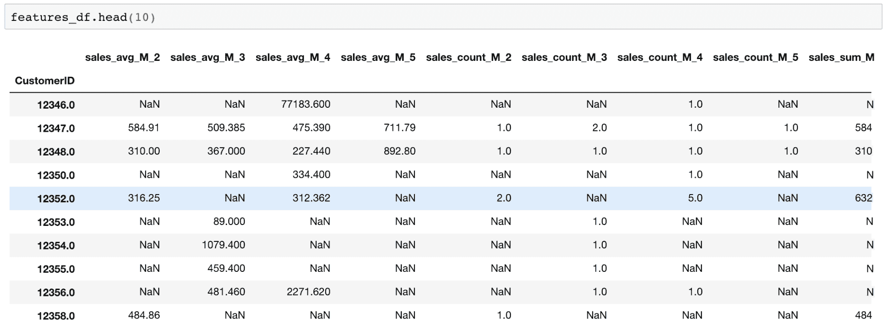

# 第九章：客户生命周期价值

本章将重点讨论预测分析在营销中的第二个应用案例，即我们在上一章讨论的客户生命周期价值。在营销中，确定营销活动的预算总是一个挑战。我们不希望花费过多而导致负的投资回报率（ROI），但我们也不希望花费过少而没有显著的影响或结果。在确定营销策略的预算时，了解运行某一营销活动所期望的回报非常重要。了解**客户生命周期价值**（**CLV**）对于单个客户而言，可以帮助营销人员为其营销预算提供依据，并且能够有针对性地寻找潜在的高价值客户。在本章中，我们将更详细地讨论计算 CLV 的概念与优势，以及如何在 Python 和 R 中构建预测机器学习模型，以预测单个客户的预期 CLV。

在本章中，我们将涵盖以下主题：

+   CLV

+   回归模型的评估指标

+   使用 Python 预测 3 个月的 CLV

+   使用 R 预测 3 个月的 CLV

# CLV

在营销中，CLV 是一个必须拥有并监控的关键指标。CLV 衡量的是客户在与公司关系的整个生命周期中，对企业的总价值。这个指标对于获取新客户尤其重要。获取新客户的成本通常比维持现有客户更高，因此了解客户生命周期价值以及获取新客户的相关成本对于制定具有正投资回报率的营销策略至关重要。例如，如果你的客户的平均 CLV 是$100，而获取一个新客户的成本仅为$10，那么随着新客户的获得，你的业务将创造更多收入。

然而，如果获取一个新客户的成本是$150，而你的客户平均 CLV 仍然是$100，那么你每获得一个客户就会亏损。简单来说，如果你的新客户获取营销支出超过了 CLV，你就会在每次获取客户时亏损，最好是只与现有客户合作。

计算 CLV 有多种方法。一种方法是找到客户的平均购买金额、购买频率和生命周期，然后通过简单计算得到 CLV。例如，假设有一个假设情况，某客户的平均购买金额是 100 美元，并且他或她每个月平均购买五次。那么，这个客户的每月平均价值是 500 美元，计算方法就是将平均购买金额与平均购买频率相乘。现在，我们需要知道该客户的生命周期。估算客户生命周期的一种方法是查看平均月流失率，即离开并终止与您业务关系的客户所占的百分比。您可以通过将 1 除以流失率来估算客户的生命周期。假设在我们的假设情况下流失率为 5%，那么估算的客户生命周期为 20 年。根据客户每月平均价值 500 美元和生命周期 20 年的数据，该客户的 CLV 为 120,000 美元。这个最终的 CLV 金额是通过将 500 美元（每月平均值）乘以 12 个月，再乘以 20 年的生命周期计算得出的。

因为我们通常不知道客户的生命周期，所以我们经常尝试估计在某一特定时期内的客户生命周期价值（CLV）。这可以通过估算客户的 12 个月 CLV、24 个月 CLV，或者也可以是 3 个月 CLV 来实现。除了我们通过示例讨论的方法外，CLV 还可以通过构建预测模型来估算。利用机器学习算法和客户的购买历史数据，我们可以构建预测客户在某一特定时期内 CLV 的机器学习模型。在本章的编程练习中，我们将学习如何构建一个回归模型来预测客户的 3 个月 CLV。

# 评估回归模型

我们在评估回归模型时需要使用一组与分类模型评估不同的指标。这是因为回归模型的预测输出是连续值，意味着它可以取任何值，并且不受限于预定义的值集合。而另一方面，正如我们在第八章《预测营销互动的可能性》中所见，分类模型的预测输出只能取有限的几个值。就像在之前的互动预测中，我们的分类模型只能取两个值——0 表示没有互动，1 表示有互动。由于这种差异，我们需要使用不同的指标来评估回归模型。

在本节中，我们将讨论四种常用的回归模型评估方法——**均方误差**（**MSE**）、**中位数绝对误差**（**MAE**）、*R²*和预测值与实际值散点图。顾名思义，MSE 衡量的是平方误差的平均值，其中误差是预测值与实际值之间的差异。*MSE*的公式如下所示：


这个方程中的*Y*值是实际值，*Y'*值是预测值。因为 MSE 是平方误差的平均值，这个度量对异常值非常敏感，容易受到异常值的强烈影响。

另一方面，MAE 对异常值的敏感性较低，因此被认为更为稳健，因为中位数受异常值或尾部极端值的影响远低于平均数。这个公式来自于`scikit-learn`文档页面，[`scikit-learn.org/stable/modules/model_evaluation.html#median-absolute-error`](https://scikit-learn.org/stable/modules/model_evaluation.html#median-absolute-error)，如下所示：


这个方程中的*y*值表示实际值，而值表示预测值。

另一个常用的回归模型评估度量是*R²*，也称为决定系数。*R²*衡量拟合优度。换句话说，它衡量回归模型与数据的拟合程度。简而言之，*R²*是回归模型解释目标变量变异性的百分比。该公式如下所示：


*R²*的值通常在零和一之间。*R²*值为零意味着模型根本没有解释或捕捉到目标变量的变异性，且不适合数据。另一方面，*R²*值为一意味着模型捕捉到目标变量 100%的变异性，完美地拟合数据。*R²*值越接近一，模型的拟合度越好。

最后，预测值与实际值的散点图也用于可视化模型拟合的紧密程度。这个散点图的示例如下：


对于一个良好的拟合，你会在这个散点图中看到靠近对角线的点。如果模型的*R²*值较高，点会靠近对角线。另一方面，如果模型的*R²*值较低，点会分散在对角线附近。在接下来的编程练习中，我们将讨论如何在 Python 和 R 中计算和可视化这些度量，并利用这些度量来评估我们的回归模型。

# 用 Python 预测 3 个月的 CLV

在本节中，我们将讨论如何使用 Python 中的机器学习算法构建和评估回归模型。在本节结束时，我们将使用线性回归算法构建一个预测模型，来预测**CLV**，更具体地说，是预测 3 个月的客户价值。我们将主要使用`pandas`、`matplotlib`和`scikit-learn`这三个包来分析、可视化并构建预测 3 个月客户价值的机器学习模型。如果有读者希望使用 R 语言进行这个练习，你可以跳到下一节。

在本练习中，我们将使用来自 UCI 机器学习库的公开数据集之一，数据集可以通过这个链接访问：[`archive.ics.uci.edu/ml/datasets/online+retail`](http://archive.ics.uci.edu/ml/datasets/online+retail)。

你可以通过点击这个链接下载以 XLSX 格式提供的数据，文件名为`Online Retail.xlsx`。下载完数据后，你可以通过运行以下命令将其加载到你的 Jupyter Notebook 中：

```py
import pandas as pd

df = pd.read_excel('../data/Online Retail.xlsx', sheet_name='Online Retail')
```

数据框`df`如下所示：


正如你可能注意到的，我们在前面的章节中已经多次使用了这个数据集。凭借我们从前几章学到的知识，我们将首先通过清理数据来准备它。

# 数据清理

如你所记得，数据集中有一些我们需要清理的内容。清理步骤如下：

1.  **处理负数量**：数据中有些交易的`Quantity`值为负，表示已取消的订单。为了这个练习，我们将忽略这些已取消的订单，因此需要将它们从`pandas`数据框中排除。排除`Quantity`列中负值的代码如下所示：

```py
        df = df.loc[df['Quantity'] > 0]
```

我们只是将所有`Quantity`值为正的行提取出来，并重新存储到`df`变量中。

1.  **删除`NaN`记录**：我们需要删除没有`CustomerID`的记录。因为我们要构建一个机器学习模型来预测 3 个月的客户价值，我们需要按`CustomerID`列对数据进行分组。如果没有`CustomerID`，我们就无法为这个项目正确构建模型。删除没有`CustomerID`的记录的代码如下所示：

```py
        df = df[pd.notnull(df['CustomerID'])]
```

从这段代码中你可以看到，我们使用了`pandas`包中的`notnull`函数。该函数返回一个数组列表，其中`True`表示给定索引处的值不是`null`，`False`表示给定索引处的值是`null`。我们将`CustomerID`列中非空值的记录重新存储回`df`变量中。

1.  **处理不完整数据**：我们需要做的另一项清理工作是处理不完整的数据。如果你还记得之前章节的内容，上一月的交易数据是不完整的。请看一下下面的输出：


如您从此输出中看到的，数据集包含了 2010 年 12 月 1 日至 2011 年 12 月 9 日之间的所有交易。2011 年 12 月的数据是不完整的。为了正确构建 3 个月客户价值预测模型，我们将忽略最后一个月的交易。请查看以下代码，展示如何从我们的 DataFrame 中删除这些记录：

```py
        df = df.loc[df['InvoiceDate'] < '2011-12-01']
```

我们只是将 2011 年 12 月 01 日之前发生的所有交易提取出来，并存储回`df`变量中。

1.  **总销售额**：最后，我们需要为每笔交易创建一个列来记录总销售额。请查看以下代码：

```py
        df['Sales'] = df['Quantity'] * df['UnitPrice']
```

我们将`Quantity`列与`UnitPrice`列相乘，以获得每笔交易的总购买金额。然后，我们将这些值存储到一个名为`Sales`的列中。我们现在已经完成了所有的清理任务。

现在我们已经清理了所有交易数据，接下来让我们总结每个订单或`InvoiceNo`的数据。请查看以下代码：

```py
        orders_df = df.groupby(['CustomerID', 'InvoiceNo']).agg({
            'Sales': sum,
            'InvoiceDate': max
        })
```

如您从此代码中看到的，我们正在通过两列，`CustomerID`和`InvoiceNo`，对`DataFrame` `df`进行分组。然后，我们为每个客户和订单求和所有的`Sales`值，并取该订单的最后交易时间作为`InvoiceDate`。这样，我们就得到了一个`DataFrame`，`orders_df`，它包含了我们需要了解的每个客户的订单数据。数据如下所示：


在我们开始构建模型之前，先来仔细看看这个客户购买历史数据。

# 数据分析

为了计算 CLV，我们需要知道每个客户的购买频率、最近一次购买时间和总购买金额。我们将计算每个客户的平均购买金额、生命周期购买金额，以及每个客户的购买时长和购买频率。请查看以下代码：

```py
def groupby_mean(x):
    return x.mean()

def groupby_count(x):
    return x.count()

def purchase_duration(x):
    return (x.max() - x.min()).days

def avg_frequency(x):
    return (x.max() - x.min()).days/x.count()

groupby_mean.__name__ = 'avg'
groupby_count.__name__ = 'count'
purchase_duration.__name__ = 'purchase_duration'
avg_frequency.__name__ = 'purchase_frequency'

summary_df = orders_df.reset_index().groupby('CustomerID').agg({
    'Sales': [min, max, sum, groupby_mean, groupby_count],
    'InvoiceDate': [min, max, purchase_duration, avg_frequency]
})
```

我们首先按`CustomerID`列进行分组，并根据`Sales`和`InvoiceDate`列对数据进行聚合。如果您仔细观察聚合函数，我们使用了四个客户聚合函数：`groupby_mean`、`groupby_count`、`purchase_duration`和`avg_frequency`。第一个函数`groupby_mean`简单地计算每个组的平均值，第二个函数`groupby_count`则计算每个组中的记录数。`purchase_duration`函数计算每个组中第一笔和最后一笔发票日期之间的天数，`avg_frequency`函数通过将`purchase_duration`除以订单数量来计算订单之间的平均天数。

结果`DataFrame`如下所示：


这些数据让我们了解了每个客户的购买情况。例如，ID 为 `12346` 的客户只在 2011 年 1 月 18 日进行了一次购买。然而，ID 为 `12347` 的客户在 2010 年 12 月 7 日至 2011 年 10 月 31 日之间共进行了六次购买，时间跨度为 `327` 天。该客户每次订单的平均花费为 `680`，平均每 `54.5` 天进行一次购买。

让我们更仔细地看看重复购买客户的购买次数分布情况。

看一下以下代码：

```py
summary_df.columns = ['_'.join(col).lower() for col in summary_df.columns]
summary_df = summary_df.loc[summary_df['invoicedate_purchase_duration'] > 0]

ax = summary_df.groupby('sales_count').count()['sales_avg'][:20].plot(
    kind='bar', 
    color='skyblue',
    figsize=(12,7), 
    grid=True
)

ax.set_ylabel('count')

plt.show()
```

从这段代码可以看到，首先我们清理了 `summary_df` 数据框中的列名。然后，我们仅选择那些至少进行过两次或更多次购买的客户，这代表了重复购买的客户。最后，我们按 `sales_count` 列进行分组，并统计每个类别下的客户数量。结果图如下所示：


从这张图可以看出，大多数客户的历史购买次数不超过 10 次。接下来，我们来看一下这些重复购买客户之间购买的平均天数。首先看一下以下代码：

```py
ax = summary_df['invoicedate_purchase_frequency'].hist(
    bins=20,
    color='skyblue',
    rwidth=0.7,
    figsize=(12,7)
)

ax.set_xlabel('avg. number of days between purchases')
ax.set_ylabel('count')

plt.show()
```

我们正在使用 `pandas` 包中的 `hist` 函数构建购买频率数据的直方图。`bins` 参数定义了要构建的直方图的区间数。结果如下所示：


这张图展示了重复购买客户历史购买频率的整体情况。从这张图可以看出，大多数重复购买客户每隔 20 到 50 天进行一次购买。

# 预测 3 个月的 CLV

在本节中，我们将使用 Python 中的 `pandas` 和 `scikit-learn` 包构建一个预测 3 个月客户价值的模型。我们将首先将数据切分为 3 个月为一组，并将最后 3 个月的数据作为预测目标，其余的数据作为特征。我们将首先为模型构建准备数据，然后训练一个线性回归模型，以预测 3 个月的客户价值。

# 数据准备

为了构建预测模型，我们首先需要准备数据，以便将相关数据输入模型。看看以下代码：

```py
clv_freq = '3M'

data_df = orders_df.reset_index().groupby([
    'CustomerID',
    pd.Grouper(key='InvoiceDate', freq=clv_freq)
]).agg({
    'Sales': [sum, groupby_mean, groupby_count],
})

data_df.columns = ['_'.join(col).lower() for col in data_df.columns]
data_df = data_df.reset_index()
```

由于我们想要预测未来三个月的客户价值，我们将数据拆分成每个客户的三个月时间段。如你所见，在`groupby`函数中，我们通过`CustomerID`和自定义的`Grouper`将之前构建的`orders_df`数据框按每三个月进行分组。然后，对于每个三个月的时间窗口，我们将所有销售额求和，以获得总购买金额，计算购买金额的平均值，并统计给定时间段内每个客户的购买总数。通过这种方式，我们得到了每个客户每三个月的购买信息的汇总数据。最后，我们对列名进行了清理。`data_df`中的数据现在如下所示：


为了简化操作，让我们对`InvoiceDate`列的值进行编码，使其比当前日期格式更易于阅读。请查看以下代码：

```py
date_month_map = {
    str(x)[:10]: 'M_%s' % (i+1) for i, x in enumerate(
        sorted(data_df.reset_index()['InvoiceDate'].unique(), reverse=True)
    )
}

data_df['M'] = data_df['InvoiceDate'].apply(lambda x: date_month_map[str(x)[:10]])
```

从这段代码中可以看到，我们正在将日期值编码为`M_1`、`M_2`、`M_3`等，其中较小的数字代表较近的日期。例如，日期`2011-12-31`现在被编码为`M_1`，日期`2011-09-30`被编码为`M_2`。结果如下所示：


现在我们已经准备好构建一个包含特征和目标变量的样本集。如前所述，我们将使用最近的三个月作为目标变量，其余的作为特征，这意味着我们将训练一个机器学习模型，用来预测未来三个月的客户价值，基于其余数据。为了训练这个模型，我们需要将数据转化为表格数据，其中行表示单个客户，列表示每个特征。请查看以下代码：

```py
features_df = pd.pivot_table(
    data_df.loc[data_df['M'] != 'M_1'], 
    values=['sales_sum', 'sales_avg', 'sales_count'], 
    columns='M', 
    index='CustomerID'
)

features_df.columns = ['_'.join(col) for col in features_df.columns]
```

从这段代码中可以看到，我们使用了`pandas`函数`pivot_table`，其中索引将是`CustomerID`，列将是每个三个月周期的`sales_sum`、`sales_avg`和`sales_count`。我们在这里创建的`features_df`数据框如下所示：



你可能会注意到这些数据中有`NaN`值。我们可以使用以下代码将这些`NaN`值编码为`0.0`：

```py
features_df = features_df.fillna(0)
```

现在我们已经构建了特征数据框，接下来我们来构建目标变量。请查看以下代码：

```py
response_df = data_df.loc[
    data_df['M'] == 'M_1',
    ['CustomerID', 'sales_sum']
]

response_df.columns = ['CustomerID', 'CLV_'+clv_freq]
```

从这段代码中可以看到，我们正在选择最近的三个月时间段，即`M_1`组，作为目标变量。目标列将是`sales_sum`，因为我们想要预测下一个三个月的客户价值，也就是预测一个给定客户在接下来的三个月内可能进行的总购买金额。目标变量如下所示：


现在只剩下最后一步了，那就是构建一个样本集，用于构建机器学习模型，将特征和响应数据结合在一起。请查看以下代码：

```py
sample_set_df = features_df.merge(
    response_df, 
    left_index=True, 
    right_on='CustomerID',
    how='left'
)

sample_set_df = sample_set_df.fillna(0)
```

如您所见，我们通过使用`merge`函数在`CustomerID`上将两个`DataFrames`进行连接。通过设置`how='left'`标志，我们将获取特征数据中的所有记录，即使响应数据中没有对应的数据。这是一个例子，其中给定的客户在过去 3 个月内没有进行任何购买，因此我们将其编码为零。最终的样本集现在如下所示：


有了这些数据，我们现在可以建立一个模型，通过历史购买数据预测未来 3 个月的客户价值。

# 线性回归

与上一章类似，我们将使用以下代码将样本集分割成训练集和测试集：

```py
from sklearn.model_selection import train_test_split

target_var = 'CLV_'+clv_freq
all_features = [x for x in sample_set_df.columns if x not in ['CustomerID', target_var]]

x_train, x_test, y_train, y_test = train_test_split(
    sample_set_df[all_features], 
    sample_set_df[target_var], 
    test_size=0.3
)
```

如您从这段代码中所见，我们使用样本集的 70%来训练模型，其余 30%用于测试和评估模型性能。在本节中，我们将使用线性回归模型。然而，我们建议您尝试其他机器学习算法，例如随机森林和**支持向量机**（**SVM**）。

关于如何使用`scikit-learn`包训练这些模型的更多细节，可以参考以下链接：[`scikit-learn.org/stable/modules/generated/sklearn.ensemble.RandomForestRegressor.html`](https://scikit-learn.org/stable/modules/generated/sklearn.ensemble.RandomForestRegressor.html) 和 [`scikit-learn.org/stable/modules/generated/sklearn.svm.SVR.html`](https://scikit-learn.org/stable/modules/generated/sklearn.svm.SVR.html)。

为了使用我们的数据集训练线性回归模型，您可以使用以下代码：

```py
from sklearn.linear_model import LinearRegression

reg_fit = LinearRegression()
reg_fit.fit(x_train, y_train)
```

这就是最简单的实现方式。您导入`scikit-learn`包中的`LinearRegression`类，并初始化一个`LinearRegression`对象。然后，您可以使用`fit`函数和`x_train`特征与`y_train`目标来训练线性回归模型。

一旦训练了线性回归模型，您可以在`LinearRegression`对象中找到一些有用的信息。首先，您可以使用`LinearRegression`对象的`intercept_`属性来获取线性回归方程的截距，如下所示：

```py
reg_fit.intercept_
```

同样，您可以使用`coef_`属性来查找拟合的线性回归模型的系数，如以下代码所示：

```py
reg_fit.coef_
```

拟合回归模型中每个特征的系数如下所示：


从这个系数输出中可以看出，你可以轻松地找到与目标变量呈负相关和正相关的特征。例如，前 3 个月的平均购买金额 `sales_avg_M_2` 对接下来的 3 个月客户价值有负面影响。这意味着，前 3 个月的购买金额越高，接下来 3 个月的购买金额越低。另一方面，第二和第三最近的 3 个月期间的平均购买金额 `sales_avg_M_3` 和 `sales_avg_M_4` 与接下来 3 个月的客户价值呈正相关。换句话说，客户在 3 到 9 个月前的购买金额越多，接下来 3 个月的客户价值越高。查看系数是了解给定某些特征时，预期值如何变化的一种方式。

使用 3 个月客户价值预测的输出，你可以根据不同方式定制你的营销策略。由于你已经知道了来自单个客户在接下来的 3 个月内的预期收入或购买金额，你可以为你的营销活动制定更为合理的预算。预算应该足够高，以便能够接触到目标客户，但又不能超过预期的 3 个月客户价值，这样才能确保你有一个正向投资回报率的营销活动。另一方面，你也可以利用这些 3 个月客户价值的预测输出，专门针对这些高价值客户进行营销。这可以帮助你制定出具有更高投资回报率的营销活动，因为根据该模型预测，这些高价值客户可能带来的收入会比其他客户更多。

# 评估回归模型性能

现在我们已经有了一个拟合好的机器学习模型，用于预测 3 个月的客户价值。接下来，我们来讨论如何评估这个模型的性能。如前所述，我们将使用 *R²*、MAE 和预测值与实际值的散点图来评估我们的模型。我们首先需要从模型中获取预测结果，代码如下所示：

```py
train_preds = reg_fit.predict(x_train)
test_preds = reg_fit.predict(x_test)
```

`scikit-learn` 包已经实现了用于计算 *R²* 和 MAE 的函数，这些函数位于其 `metrics` 模块中。你可以通过将它们导入到你的环境中来使用这些函数，代码如下：

```py
from sklearn.metrics import r2_score, median_absolute_error
```

正如名称所示，`r2_score` 函数计算 *R²*，而 `median_absolute_error` 函数计算 MAE。你可以使用以下代码计算 *R²* 和 MAE 的数值：

```py
r2_score(y_true=y_train, y_pred=train_preds)
median_absolute_error(y_true=y_train, y_pred=train_preds)
```

从这里可以看到，这两个函数都需要两个参数，`y_true` 和 `y_pred`。`y_true` 参数是实际的目标值，`y_pred` 参数是预测的目标值。使用这些代码，在我们的案例中，样本内和样本外的 R² 和 MAE 数值输出如下：


由于将样本集随机分割为训练集和测试集，您的结果可能与这些结果有所不同。在我们的情况下，训练集中的 R²为`0.4445`，测试集中的 R²为`0.7947`。另一方面，训练集中的 MAE 为`178.2854`，测试集中的 MAE 为`178.7393`。从这些数字来看，我们并没有看到明显的过拟合迹象，也没有在训练集和测试集的表现之间看到很大的差距。

最后，我们来看看预测值与实际值的散点图。您可以使用以下代码来生成该散点图：

```py
plt.scatter(y_test, test_preds)
plt.plot([0, max(y_test)], [0, max(test_preds)], color='gray', lw=1, linestyle='--')

plt.xlabel('actual')
plt.ylabel('predicted')
plt.title('Out-of-Sample Actual vs. Predicted')
plt.grid()

plt.show()
```

结果图表如下所示：


正如您从这个图中看到的，*x*轴的值是实际值，*y*轴的值是预测值。如前所述，点越多位于直线附近，预测效果越好。这是因为直线上的点表明实际值和预测值非常接近。从这个图来看，点似乎围绕着直线分布，这表明预测值和实际值之间并没有太大的差距。

本次 Python 练习的完整代码可以在以下仓库中找到：[`github.com/yoonhwang/hands-on-data-science-for-marketing/blob/master/ch.9/python/CustomerLifetimeValue.ipynb`](https://github.com/yoonhwang/hands-on-data-science-for-marketing/blob/master/ch.9/python/CustomerLifetimeValue.ipynb)。

# 使用 R 预测未来 3 个月的 CLV

在本节中，我们将讨论如何使用 R 中的机器学习算法构建和评估回归模型。到本节结束时，我们将使用线性回归算法构建一个预测模型，以预测**CLV**，更具体地说，预测未来 3 个月的客户价值。我们将使用一些 R 包，如`dplyr`、`reshape2`和`caTools`，来分析、转换和准备数据，以构建机器学习模型，预测未来 3 个月的客户价值。对于那些希望使用 Python 而非 R 来进行本次练习的读者，可以参考上一节。

对于本次练习，我们将使用一个来自 UCI 机器学习库的公开数据集，您可以通过以下链接找到：[`archive.ics.uci.edu/ml/datasets/online+retail`](http://archive.ics.uci.edu/ml/datasets/online+retail)。您可以点击此链接并下载以 XLSX 格式提供的数据，文件名为`Online Retail.xlsx`。下载数据后，您可以通过运行以下命令将其加载到您的 R 环境中：

```py
library(dplyr)
library(readxl)

#### 1\. Load Data ####
df <- read_excel(
  path="~/Documents/data-science-for-marketing/ch.9/data/Online Retail.xlsx", 
  sheet="Online Retail"
)
```

数据框`df`如下所示：


正如您可能已经注意到的，我们在前几章中已经多次使用了这个数据集。凭借我们从前几章中获得的关于这个数据集的知识，我们将首先通过清理数据来准备数据。

# 数据清理

如你所记得，数据集中有一些需要清理的地方。清理步骤如下：

1.  **处理负数量**：有些交易的`Quantity`值为负数，表示已取消的订单。我们将忽略这些取消的订单，因此需要从我们的`DataFrame`中排除它们。排除这些负值的`Quantity`列的代码如下：

```py
        df <- df[which(df$Quantity > 0),]
```

我们只需要将所有`Quantity`值为正的行提取出来，并将它们存储回变量`df`中。

1.  **删除 NA 记录**：我们需要删除在`CustomerID`列中没有值的记录。因为我们将构建一个机器学习模型来预测 3 个月的客户价值，所以需要按`CustomerID`列对数据进行分组。没有这个字段，我们就无法为这个项目构建合适的模型。删除这些空值记录的代码如下：

```py
        df <- na.omit(df)
```

从这段代码中可以看到，我们在 R 语言中使用了`na.omit`函数。这个函数会返回一个去除了`null`或`NA`值的对象。然后，我们将输出结果重新存储到原始的`DataFrame`变量`df`中。

1.  **处理不完整数据**：如果你还记得前几章提到的，最后一个月的交易数据是不完整的。请看以下输出：


从这个输出中可以看到，数据集包含了 2010 年 12 月 1 日到 2011 年 12 月 9 日之间的所有交易数据。2011 年 12 月的数据是不完整的。为了能够正确地构建 3 个月客户价值预测的模型，我们将忽略最后一个月的交易数据。请看以下代码，了解如何从我们的`DataFrame`中删除这些记录：

```py
        df <- df[which(df$InvoiceDate < '2011-12-01'),]
```

我们只需将 2011 年 12 月 1 日之前发生的所有交易提取出来，并将它们存储回变量`df`中。

1.  **总销售额**：最后，我们需要为每笔交易创建一个列，表示每笔交易的总销售额。请看以下代码：

```py
        df$Sales <- df$Quantity * df$UnitPrice
```

我们仅仅是将`Quantity`列与`UnitPrice`列相乘，以得到每笔交易的总购买金额。然后，我们将这些值存储到名为`Sales`的列中。现在，我们已经完成了所有的清理任务。

现在我们已经清理了所有交易数据，让我们为每个订单或`InvoiceNo`总结一下这些数据。请看以下代码：

```py
# per order data
ordersDF <- df %>% 
  group_by(CustomerID, InvoiceNo) %>% 
  summarize(Sales=sum(Sales), InvoiceDate=max(InvoiceDate))
```

从这段代码可以看到，我们正在按`CustomerID`和`InvoiceNo`两个列对`df`进行分组。接着，我们对每个客户和订单的`Sales`值进行求和，并将该订单的最后交易时间作为`InvoiceDate`。这样，我们就得到了一个名为`ordersDF`的`DataFrame`，它包含了每个客户所下的每个订单的相关信息。数据如下所示：


在我们深入构建模型之前，先来仔细查看一下这个客户购买历史数据。

# 数据分析

为了计算 CLV（客户终身价值），我们需要了解每个客户的购买频率、最近购买时间和总购买金额。我们将计算每个客户的平均购买金额和生命周期购买金额，以及每个客户的购买持续时间和频率。请查看以下代码：

```py
# order amount & frequency summary
summaryDF <- ordersDF %>%
  group_by(CustomerID) %>%
  summarize(
    SalesMin=min(Sales), SalesMax=max(Sales), SalesSum=sum(Sales), 
    SalesAvg=mean(Sales), SalesCount=n(),
    InvoiceDateMin=min(InvoiceDate), InvoiceDateMax=max(InvoiceDate), 
    PurchaseDuration=as.double(floor(max(InvoiceDate)-min(InvoiceDate))),
    PurchaseFrequency=as.double(floor(max(InvoiceDate)-min(InvoiceDate)))/n()
  )
```

我们首先按照`CustomerID`列进行分组，并对`Sales`和`InvoiceDate`列进行聚合。通过使用 R 中的`min`、`max`、`sum`、`mean`和`n`函数，我们可以计算每个客户的最小、最大、总购买金额、平均购买金额以及购买次数。我们还使用`min`和`max`函数来获取每个客户的首次和最后一次订单日期。对于`PurchaseDuration`，我们计算的是每个客户最后一次和首次订单日期之间的天数。对于`PurchaseFrequency`，我们将`PurchaseDuration`的天数除以购买次数，从而得到平均购买间隔天数。

生成的`DataFrame`，`summaryDF`，如下所示：


这些数据让我们了解了每个客户的购买情况。例如，客户 ID 为`12346`的客户仅在 2011 年 1 月 18 日进行了单次购买。而客户 ID 为`12347`的客户则在 2010 年 12 月 7 日至 2011 年 10 月 31 日之间进行了六次购买，总计跨越了`327`天。该客户每次购买的平均金额约为`681`，而且平均每`54.5`天购买一次。

让我们更仔细地查看重复购买客户的购买次数分布。请查看以下代码：

```py
summaryDF <- summaryDF[which(summaryDF$PurchaseDuration > 0),]

salesCount <- summaryDF %>% 
  group_by(SalesCount) %>% 
  summarize(Count=n())

ggplot(salesCount[1:19,], aes(x=SalesCount, y=Count)) +
  geom_bar(width=0.5, stat="identity") +
  ggtitle('') +
  xlab("Sales Count") +
  ylab("Count") +
  theme(plot.title = element_text(hjust = 0.5))
```

我们首先在代码的第一行中排除了仅进行过一次购买的客户。然后，我们统计了每个`SalesCount`对应的客户数量。最后，我们使用`ggplot`和`geom_bar`创建了一个条形图来展示这些数据。结果如下所示：


从这张图中可以看出，大多数客户的历史购买次数都在 10 次以下。接下来，我们来看看这些重复购买客户的平均购买间隔天数。首先，请查看以下代码：

```py
hist(
  summaryDF$PurchaseFrequency, 
  breaks=20,
  xlab='avg. number of days between purchases',
  ylab='count',
  main=''
)
```

我们正在使用 R 中的`hist`函数构建购买频率数据的直方图。`breaks`参数定义了直方图的分箱数。结果如下所示：


该图展示了历史上重复购买客户的购买频率的总体情况。从图中可以看出，大多数重复购买客户每隔 20 到 50 天进行一次购买。

# 预测 3 个月的 CLV

在这一部分，我们将构建一个预测 3 个月客户价值的 R 模型。我们将首先将数据划分为 3 个月一组，并将最后 3 个月的数据作为预测的目标，其余的数据作为特征。我们将首先准备好数据来构建模型，然后训练一个线性回归模型来预测 3 个月的客户价值。

# 数据准备

为了构建预测模型，我们需要先准备数据，以便将相关数据输入模型。请查看以下代码：

```py
# group data into every 3 months
library(lubridate)

ordersDF$Quarter = as.character(round_date(ordersDF$InvoiceDate, '3 months'))

dataDF <- ordersDF %>%
  group_by(CustomerID, Quarter) %>%
  summarize(SalesSum=sum(Sales), SalesAvg=mean(Sales), SalesCount=n())
```

如你所见，在这段代码中，我们使用了`lubridate`包，它可以帮助我们更轻松地处理日期数据。通过`lubridate`包中的`round_date`函数，我们首先将`InvoiceDate`四舍五入到最接近的季度。接着，我们按`CustomerID`和新创建的列`Quarter`对数据进行分组，以获取每个客户的季度销售数据。对于每个 3 个月的时间窗口，我们将所有销售额求和以获得总购买金额，并计算该期间每个客户的平均购买金额和总购买次数。通过这种方式，我们得到了每个客户每 3 个月的聚合数据。`dataDF`中的数据现在如下所示：


为了简化操作，我们将对`Quarter`列的值进行编码，使其比当前的日期格式更易于阅读。请查看以下代码：

```py
dataDF$Quarter[dataDF$Quarter == "2012-01-01"] <- "Q1"
dataDF$Quarter[dataDF$Quarter == "2011-10-01"] <- "Q2"
dataDF$Quarter[dataDF$Quarter == "2011-07-01"] <- "Q3"
dataDF$Quarter[dataDF$Quarter == "2011-04-01"] <- "Q4"
dataDF$Quarter[dataDF$Quarter == "2011-01-01"] <- "Q5"
```

如你所见，在这段代码中，我们将日期值编码为`Q1`、`Q2`、`Q3`等，其中较小的数字表示较新的日期。例如，日期`2012-01-01`现在编码为`Q1`，而日期`2011-10-01`现在编码为`Q2`。结果如下所示：


现在我们准备好构建包含特征和目标变量的样本集。正如之前简要提到的，我们将使用过去 3 个月作为目标变量，其余的数据作为特征，这意味着我们将训练一个机器学习模型，该模型利用其他数据预测过去 3 个月的客户价值。为了训练这样的模型，我们需要将数据转换为表格数据，其中行表示单个客户，列表示每个特征。请查看以下代码：

```py
# install.packages('reshape2')
library(reshape2)

salesSumFeaturesDF <- dcast(
  dataDF[which(dataDF$Quarter != "Q1"),], 
  CustomerID ~ Quarter, 
  value.var="SalesSum"
)
colnames(salesSumFeaturesDF) <- c("CustomerID", "SalesSum.Q2", "SalesSum.Q3", "SalesSum.Q4", "SalesSum.Q5")

salesAvgFeaturesDF <- dcast(
  dataDF[which(dataDF$Quarter != "Q1"),], 
  CustomerID ~ Quarter, 
  value.var="SalesAvg"
)
colnames(salesAvgFeaturesDF) <- c("CustomerID", "SalesAvg.Q2", "SalesAvg.Q3", "SalesAvg.Q4", "SalesAvg.Q5")

salesCountFeaturesDF <- dcast(
  dataDF[which(dataDF$Quarter != "Q1"),], 
  CustomerID ~ Quarter, 
  value.var="SalesCount"
)
colnames(salesCountFeaturesDF) <- c("CustomerID", "SalesCount.Q2", "SalesCount.Q3", "SalesCount.Q4", "SalesCount.Q5")

featuresDF <- merge(
  merge(salesSumFeaturesDF, salesAvgFeaturesDF, by="CustomerID"),
  salesCountFeaturesDF, by="CustomerID"
)
featuresDF[is.na(featuresDF)] <- 0
```

正如您从这段代码中看到的，我们正在使用`reshape2`包来旋转数据。例如，使用`reshape2`包中的`dcast`函数，我们首先转换`SalesSum`数据，其中行索引代表每个客户或`CustomerID`，列表示每个季度，值则是给定客户和季度的总销售额或购买金额。我们对`SalesSum`、`SalesAvg`和`SalesCount`列分别执行这一过程三次，并最终合并这些数据。通过使用`merge`函数，我们可以按`CustomerID`索引合并这些 DataFrame。最后，我们使用`is.na`函数将`null`或`NA`值编码为 0。结果如下所示：


现在我们已经建立了特征`DataFrame`，接下来让我们建立目标变量。请查看以下代码：

```py
responseDF <- dataDF[which(dataDF$Quarter == "Q1"),] %>% 
    select(CustomerID, SalesSum)

colnames(responseDF) <- c("CustomerID", "CLV_3_Month")
```

正如您从这段代码中看到的，我们将最后 3 个月的时间段，即`Q1`组，作为目标变量。目标列将是`SalesSum`，因为我们想预测下 3 个月的客户价值，即给定客户在接下来的 3 个月内可能的总购买金额。结果如下所示：


只剩下一件事需要完成，那就是构建一个样本集，将特征数据和响应数据结合在一起，用于构建机器学习模型。请查看以下代码：

```py
sampleDF <- merge(featuresDF, responseDF, by="CustomerID", all.x=TRUE)
sampleDF[is.na(sampleDF)] <- 0
```

正如您在这里看到的，我们只是通过`merge`函数根据`CustomerID`将两个`DataFrame`连接起来。通过设置`all.x=TRUE`标志，即使响应数据中没有对应的数据，我们也会保留特征数据中的所有记录。这是一个示例，表示给定客户在过去 3 个月内没有进行任何购买，因此我们将其编码为 0。最终的样本集如下所示：


有了这些数据，我们现在可以建立一个模型，预测下 3 个月的客户价值，基于历史购买数据。

# 线性回归

与前一章类似，我们将使用以下代码将样本集拆分为训练集和测试集：

```py
# train/test set split
library(caTools)

sample <- sample.split(sampleDF$CustomerID, SplitRatio = .8)

train <- as.data.frame(subset(sampleDF, sample == TRUE))[,-1]
test <- as.data.frame(subset(sampleDF, sample == FALSE))[,-1]
```

正如您从这段代码中看到的，我们将样本集的 80%用于训练模型，剩余的 20%用于测试和评估模型性能。在本节中，我们将使用线性回归模型。然而，我们建议尝试其他机器学习算法，例如**随机森林**和**支持向量机（SVM）**。您可以使用`randomForest`包训练一个随机森林模型，使用`e1071`包训练一个 SVM 模型。我们强烈建议查看它们的使用文档。

为了使用我们的数据集训练线性回归模型，您可以使用以下代码：

```py
# Linear regression model
regFit <- lm(CLV_3_Month ~ ., data=train)
```

这非常简单。您只需要提供一个公式，即我们这个例子中的`CLV_3_Month ~ .`，以及训练数据，即我们这个例子中的`train`变量，传递给`lm`函数。这样就可以指示机器用给定的数据训练一个线性回归模型。

一旦线性回归模型训练完成，您可以从模型对象中找到一些有用的信息。您可以使用以下命令获取关于模型的详细信息：

```py
summary(regFit)
```

输出如下所示：


从这个输出中可以看到，您可以轻松找到每个特征的系数，以及哪些特征与目标有正相关或负相关。例如，前一个三个月的总购买金额`SalesSum.Q2`对下一个三个月的客户价值有正面影响。这意味着，前一个三个月的总购买金额越高，接下来的三个月购买金额也越高。另一方面，第二和第四个最近的三个月的总购买金额`SalesSum.Q3`和`SalesSum.Q5`与下一个三个月的客户价值呈负相关。换句话说，客户在两季度或四季度前的购买金额越大，接下来三个月内他们带来的价值就越低。通过查看系数，您可以获得有关如何根据某些特征来预测期望值变化的洞察。

使用三个月客户价值的预测输出，您可以根据不同的方式定制您的营销策略。由于您知道每个客户在接下来的三个月内预期的收入或购买量，您可以为您的营销活动设定一个更有根据的预算。预算应该足够高，以便覆盖您的目标客户，但又要低于预计的三个月客户价值，以确保您能够实现正向投资回报率（ROI）的营销活动。另一方面，您还可以利用这些三个月客户价值的预测输出，专门针对这些高价值客户进行营销，这有助于您创建更高 ROI 的营销活动，因为这些通过模型预测的高价值客户，可能会带来比其他客户更多的收入。

# 评估回归模型的表现

现在我们已经有了一个训练好的机器学习模型，可以预测三个月后的客户价值，接下来我们来讨论如何评估这个模型的表现。正如前面所讨论的，我们将使用 R²、MAE 和预测值与实际值的散点图来评估我们的模型。我们首先需要从模型中获取预测输出，如下面的代码所示：

```py
train_preds <- predict(regFit, train)
test_preds <- predict(regFit, test)
```

我们将使用`miscTools`包来计算样本内和样本外的 R²值。请看以下代码：

```py
# R-squared
# install.packages('miscTools')
library(miscTools)

inSampleR2 <- rSquared(train$CLV_3_Month, resid=train$CLV_3_Month - train_preds)
outOfSampleR2 <- rSquared(test$CLV_3_Month, resid=test$CLV_3_Month - test_preds)
```

在我们的案例中，R²值看起来像以下输出：


由于在将样本集分割为训练集和测试集时存在随机性，你的结果可能与这些结果不同。在我们的案例中，样本内的 R²为`0.4557`，样本外的 R²为`0.1235`。样本内和样本外 R²值之间相当大的差距表明存在过拟合的情况，其中模型在训练集上的表现明显优于在测试集上的表现。遇到过拟合的情况时，你可以尝试不同的特征组合或使用更多的样本进行训练。

接下来，我们来看一下样本内和样本外预测的 MAE。请看下面的代码：

```py
# Median Absolute Error
inSampleMAE <- median(abs(train$CLV_3_Month - train_preds))
outOfSampleMAE <- median(abs(test$CLV_3_Month - test_preds))
```

如你从这段代码中看到的，我们使用了`median`和`abs`函数来获取样本内和样本外预测的绝对误差的中位数。我们案例中的结果如下：


最后，让我们来看一下预测值与实际值的散点图。你可以使用以下代码生成这个散点图：

```py
plot(
  test$CLV_3_Month, 
  test_preds, 
  xlab='actual', 
  ylab='predicted', 
  main='Out-of-Sample Actual vs. Predicted'
)
abline(a=0, b=1)
```

结果图表如下所示：


如你从这个图表中看到的，*x*值是实际值，*y*值是预测值。正如之前讨论的，点越接近直线，预测效果越好。这是因为直线上的点表明实际值和预测值非常接近。看这个图表，点似乎没有分布在直线附近，这表明预测效果较差。这与我们之前观察到的低外样本*R²*值一致。预测值与实际值的散点图是可视化模型性能的好方法。

本次 R 语言练习的完整代码可以在以下仓库中找到：[`github.com/yoonhwang/hands-on-data-science-for-marketing/blob/master/ch.9/R/CustomerLifetimeValue.R`](https://github.com/yoonhwang/hands-on-data-science-for-marketing/blob/master/ch.9/R/CustomerLifetimeValue.R)

# 总结

在本章中，我们了解了什么是 CLV（客户生命周期价值），以及它在营销中的重要性和应用。特别是在验证客户获取成本时，了解每个新客户将为公司带来多少价值至关重要。我们讨论了 CLV 计算如何帮助营销人员制定正向投资回报率（ROI）的营销策略。接着，我们通过一个假设的例子展示了如何计算 CLV，使用了平均购买金额、购买频率和客户生命周期。我们还提到了另一种方法，即使用机器学习和预测模型来估算 CLV。

在编程练习中，我们学习了如何构建回归模型来预测 3 个月期间的客户终身价值（CLV）。在 Python 中，我们使用了`scikit-learn`包来构建`LinearRegression`模型。在 R 中，我们使用了内置的`lm`函数，利用我们的数据训练线性回归模型。在回归模型评估中，我们讨论了四个常用的指标：MSE、MAE、R²和预测值与实际值的散点图，并解释了这些指标分别衡量了什么，以及它们告诉我们回归模型的表现。在我们的编程练习中，我们讨论了如何在 Python 和 R 中计算和可视化 MAE、R²，以及预测值与实际值的散点图。

在接下来的章节中，我们将讨论客户细分。我们将探讨如何通过细分客户群体，帮助营销人员更好地了解他们的客户，并制定更加高效的营销策略。
