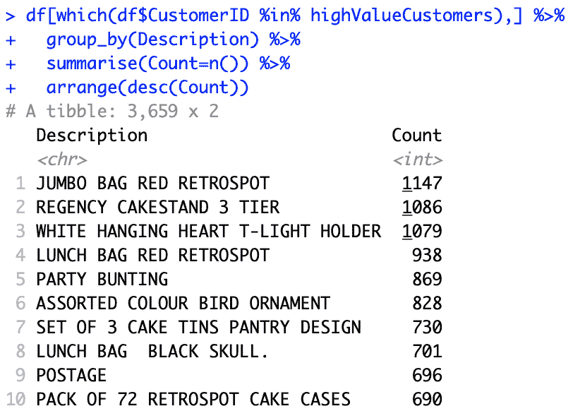

# 第十章：数据驱动的客户细分

在营销中，我们通常试图理解客户群体中某些子群体的行为。尤其是在精准营销中，营销人员尝试以某些方式对客户群体进行细分，并专注于每个目标细分群体或客户群体。专注于特定目标客户群体有助于提升营销效果，因为目标群体内的客户需求和兴趣与业务的产品、服务或内容更为契合，从而带来更好的业绩表现。

在本章中，我们将深入探讨客户细分的概念。我们将讨论什么是客户细分，了解不同客户群体的细分的重要性和好处，以及如何利用客户细分分析结果制定不同的营销策略。除了传统的客户群体细分方法，通过查看客户某些属性的关键统计数据并手动将客户群体切分为多个细分群体，我们还可以使用机器学习，让机器找到将客户群体分割为期望数量细分群体的最佳方法。在本章中，我们将学习如何使用 k-means 聚类算法基于历史数据构建客户细分。

在本章中，我们将涵盖以下主题：

+   客户细分

+   聚类算法

+   使用 Python 进行客户细分

+   使用 R 进行客户细分

# 客户细分

鉴于当前市场中的竞争，理解客户的不同行为、类型和兴趣至关重要。尤其是在精准营销中，理解并分类客户是制定有效营销策略的必要步骤。通过细分客户群体，营销人员可以一次专注于一个客户群体。这也有助于营销人员将营销信息精准地传递给一个特定的受众。客户细分是成功精准营销的基础，通过细分，您可以以最具成本效益的方式，针对特定客户群体提供不同的定价选项、促销活动和产品布局，最大程度地吸引目标受众的兴趣。

任何行业或企业都可以通过更好地理解不同的顾客群体而受益。例如，针对全美播放的电视广告，如果是某个销售冬季服饰（如大衣、雪地靴和帽子）的外套品牌，这样的广告可能并不具有成本效益。居住在那些从不寒冷的地区，如佛罗里达、南加州或夏威夷的人们，可能不会对购买冬季服装感兴趣。然而，居住在寒冷冬季地区的人们，比如阿拉斯加、明尼苏达或北达科他州的人们，可能更倾向于购买能保暖的衣物。因此，对于这个外套品牌而言，与其向所有顾客发送营销邮件或电子邮件，不如基于顾客的地理信息，锁定那些生活在需要冬季服装的地方的顾客群体。

另一个例子是，如果你拥有一栋靠近大学的出租楼，可能希望根据顾客的年龄和教育背景来精准定位你的客户。将营销对象锁定在 20 到 30 岁之间并且就读于周边大学的顾客群体，回报将高于向其他人群体进行营销。对于酒店业来说，你可能希望将目标顾客定位为即将庆祝周年纪念的情侣，推出浪漫套餐。通过使用社交媒体平台，如 Facebook 或 Instagram，你可以精准定位这一部分顾客。

正如我们在这三个案例中简要讨论的那样，了解你的顾客以及哪一类顾客群体最能代表他们，有助于你制定有效和高效的营销策略。在将顾客群体细分为子群体时，你可以使用某些特征及其统计数据，如在第七章《顾客行为的探索性分析》中所示。然而，当你试图通过多个属性来细分顾客时，事情变得越来越复杂。在接下来的部分，我们将讨论如何使用机器学习进行顾客细分。

# 聚类算法

**聚类算法**在市场营销中经常用于顾客细分。这是一种无监督学习方法，通过数据来学习不同群体之间的共性。与有监督学习不同，有监督学习有明确的目标和标签变量，旨在预测这些目标和标签变量，而无监督学习则是在没有任何目标或标签变量的情况下从数据中学习。在众多聚类算法中，我们将在本章中探讨 k-means 聚类算法的使用。

k-means 聚类算法将数据记录划分为预定义数量的聚类，每个聚类内的数据点彼此接近。为了将相似的记录分组，k-means 聚类算法会尝试寻找聚类的中心点，即聚类的中心或均值，以最小化数据点与聚类中心之间的距离。目标方程（来自[`scikit-learn.org/stable/modules/clustering.html#k-means`](https://scikit-learn.org/stable/modules/clustering.html#k-means)）如下所示：


这里*n*是数据集中的记录数，*x[i]*是第*i*个数据点，*C*是聚类的数量，*µ[j]*是第*j*个中心点。

使用 k-means 聚类进行客户细分的一个缺点或难点是，您需要事先知道聚类的数量。然而，通常情况下，您并不知道最优的聚类数量是多少。轮廓系数可以用来评估并帮助您做出关于细分问题最佳聚类数量的决策。简单来说，轮廓系数衡量的是数据点与其聚类之间的接近程度，与其他聚类的接近程度相比。公式如下：


这里`b`是某点与其最近的聚类之间的平均距离，而`a`是同一聚类内数据点之间的平均距离。轮廓系数的值范围从-1 到 1，其中值越接近 1，表示越好。在接下来的编程练习中，我们将使用 k-means 聚类算法和轮廓系数对我们的数据集进行客户群体划分。

# 使用 Python 进行客户细分

在本节中，我们将讨论如何使用 Python 中的聚类算法将客户群体划分为子群体。在本节结束时，我们将使用 k-means 聚类算法建立一个客户细分模型。我们将主要使用`pandas`、`matplotlib`和`scikit-learn`包来分析、可视化和构建机器学习模型。对于那些希望使用 R 语言而非 Python 的读者，可以跳过到下一节。

在本次练习中，我们将使用 UCI 机器学习库中一个公开可用的数据集，您可以通过以下链接找到：[`archive.ics.uci.edu/ml/datasets/online+retail`](http://archive.ics.uci.edu/ml/datasets/online+retail)。您可以点击该链接并下载数据，数据为 XLSX 格式，名为`Online Retail.xlsx`。下载数据后，您可以通过运行以下命令将其加载到您的 Jupyter Notebook 中：

```py
import pandas as pd

df = pd.read_excel('../data/Online Retail.xlsx', sheet_name='Online Retail')
```

DataFrame，`df`，如下所示：


如你所注意到的，我们在前面的章节中已经多次使用了这份数据集。正如你在前面章节中记得的，继续之前，我们需要清理一些数据。

# 数据清理

在我们开始构建聚类模型之前，有五个任务需要完成，以清理数据并为建模做准备。清理步骤如下：

1.  **删除已取消的订单**：我们将删除`Quantity`列中为负值的记录，使用以下代码：

```py
        df = df.loc[df['Quantity'] > 0]
```

1.  **删除没有`CustomerID`的记录**：有`133,361`条记录没有`CustomerID`，我们将使用以下代码删除这些记录：

```py
        df = df[pd.notnull(df['CustomerID'])]
```

1.  **排除不完整的月份**：正如你在前面章节中记得的，2011 年 12 月的数据是不完整的。你可以用以下代码排除这些数据：

```py
        df = df.loc[df['InvoiceDate'] < '2011-12-01']
```

1.  **从`Quantity`和`UnitPrice`列计算总销售额**：对于我们的分析，我们需要总销售额，因此我们将`Quantity`和`UnitPrice`两列相乘，得到总销售额，具体代码如下：

```py
          df['Sales'] = df['Quantity'] * df['UnitPrice']
```

1.  **每个客户的数据**：为了分析客户群体，我们需要转化数据，使每条记录代表单个客户的购买历史。请查看以下代码：

```py
        customer_df = df.groupby('CustomerID').agg({
            'Sales': sum,
            'InvoiceNo': lambda x: x.nunique()
        })

        customer_df.columns = ['TotalSales', 'OrderCount']
        customer_df['AvgOrderValue'] =     
        customer_df['TotalSales']/customer_df['OrderCount']
```

如你从这段代码中看到的，我们通过`CustomerID`对`DataFrame`（`df`）进行分组，并计算每个客户的总销售额和订单数量。然后，我们还计算每个订单的平均值`AvgOrderValue`，方法是将`TotalSales`列除以`OrderCount`列。结果如下图所示：


如你从这份数据中看到的，`TotalSales`、`OrderCount`和`AvgOrderValue`这三列数据的尺度不同。`TotalSales`的取值范围从`0`到`26,848`，而`OrderCount`的取值范围是从`1`到`201`。聚类算法对数据的尺度非常敏感，因此我们需要将这些数据归一化，使其具有相同的尺度。我们将采取两个步骤来归一化数据。首先，我们将对数据进行排名，使每一列的值范围从`1`到`4298`（即记录的总数）。请查看以下代码：

```py
rank_df = customer_df.rank(method='first')
```

结果显示在以下截图中：


接下来，我们将对这些数据进行归一化，使其集中在均值周围，均值为`0`，标准差为`1`。请查看以下代码：

```py
normalized_df = (rank_df - rank_df.mean()) / rank_df.std()
```

结果显示在以下截图中：


查看每一列的统计数据，如下图所示：


如你所见，数据值集中在`0`周围，标准差为`1`。我们将使用这些数据进行接下来的聚类分析。

# k-means 聚类

**k-means 聚类**算法是一个常用的算法，用于挖掘数据中的分布和分离。在营销中，它常被用来构建客户细分，并理解不同细分的行为。让我们深入了解如何在 Python 中构建聚类模型。

为了在`scikit-learn`包中使用 k-means 聚类算法，我们需要导入`kmeans`模块，如下所示的代码：

```py
from sklearn.cluster import KMeans
```

接下来，你可以使用以下代码构建并拟合一个 k-means 聚类模型：

```py
kmeans = KMeans(n_clusters=4).fit(normalized_df[['TotalSales', 'OrderCount', 'AvgOrderValue']])
```

从这段代码中可以看到，我们正在构建一个聚类模型，将数据分成四个部分。你可以通过`n_clusters`参数来更改所需的聚类数量。使用`fit`函数，你可以训练一个 k-means 聚类算法，让它学会分割给定的数据。在这段代码中，我们基于`TotalSales`、`OrderCount`和`AvgOrderValue`值构建了四个聚类。训练后的模型对象`kmeans`将聚类的标签和中心存储在模型对象的`labels_`和`cluster_centers_`属性中。你可以通过以下代码来获取这些值：

```py
kmeans.labels_
kmeans.cluster_centers_
```

现在我们已经构建了第一个聚类模型，让我们来可视化这些数据。首先，看看以下代码：

```py
four_cluster_df = normalized_df[['TotalSales', 'OrderCount', 'AvgOrderValue']].copy(deep=True)
four_cluster_df['Cluster'] = kmeans.labels_
```

我们将每条记录的聚类标签信息存储到一个新创建的 DataFrame `four_cluster_df`中。通过这个`DataFrame`，我们可以使用以下代码来可视化这些聚类：

```py
plt.scatter(
    four_cluster_df.loc[four_cluster_df['Cluster'] == 0]['OrderCount'], 
    four_cluster_df.loc[four_cluster_df['Cluster'] == 0]['TotalSales'],
    c='blue'
)

plt.scatter(
    four_cluster_df.loc[four_cluster_df['Cluster'] == 1]['OrderCount'], 
    four_cluster_df.loc[four_cluster_df['Cluster'] == 1]['TotalSales'],
    c='red'
)

plt.scatter(
    four_cluster_df.loc[four_cluster_df['Cluster'] == 2]['OrderCount'], 
    four_cluster_df.loc[four_cluster_df['Cluster'] == 2]['TotalSales'],
    c='orange'
)

plt.scatter(
    four_cluster_df.loc[four_cluster_df['Cluster'] == 3]['OrderCount'], 
    four_cluster_df.loc[four_cluster_df['Cluster'] == 3]['TotalSales'],
    c='green'
)

plt.title('TotalSales vs. OrderCount Clusters')
plt.xlabel('Order Count')
plt.ylabel('Total Sales')

plt.grid()
plt.show()
```

如你所见，在这段代码中，我们正在通过散点图来可视化数据。结果如下所示：


让我们仔细看看这个图。蓝色聚类是低价值客户群体，这些客户购买我们的产品较少。另一方面，红色聚类是高价值客户群体，这些客户购买了最多的产品并且购买频率较高。我们还可以使用其他变量从不同角度来可视化聚类。请看以下图：

 

第一个图显示了基于`AvgOrderValue`和`OrderCount`可视化的聚类。另一方面，第二个图显示了基于`AvgOrderValue`和`TotalSales`可视化的聚类。从这些图中可以看出，蓝色聚类的每单平均值最低，订单数也最少。然而，红色聚类的每单平均值最高，订单数也最多。通过可视化聚类，你可以更加容易和清晰地理解不同聚类的特征。

# 选择最佳的聚类数量

通常，在构建 k-means 聚类模型时，我们并不知道最佳的聚类数。正如本章前面部分所讨论的，我们可以使用轮廓系数来确定将数据分割成最佳聚类数。在 `scikit-learn` 包中，你可以使用 `sklearn.metrics` 模块中的 `silhouette_score` 函数来计算轮廓分数，从而衡量聚类的质量。看看以下代码：

```py
from sklearn.metrics import silhouette_score

for n_cluster in [4,5,6,7,8]:
    kmeans = KMeans(n_clusters=n_cluster).fit(
        normalized_df[['TotalSales', 'OrderCount', 'AvgOrderValue']]
    )
    silhouette_avg = silhouette_score(
        normalized_df[['TotalSales', 'OrderCount', 'AvgOrderValue']], 
        kmeans.labels_
    )

    print('Silhouette Score for %i Clusters: %0.4f' % (n_cluster, silhouette_avg))
```

从这段代码中可以看到，我们正在尝试五个不同数量的聚类：`4`、`5`、`6`、`7` 和 `8`。对于每一个聚类数，我们都会衡量轮廓分数，并选择分数最高的聚类数。该代码的输出如下所示：


在我们的案例中，在我们尝试的五个不同的聚类数中，轮廓分数最高的最佳聚类数是 `4`。在接下来的部分中，我们将使用 `4` 作为聚类数，展示如何解释聚类分析的结果。

# 解释客户细分

在这一部分中，我们将讨论从前面的聚类分析结果中提取洞察的不同方法。首先，让我们构建一个包含四个聚类的 k-means 聚类模型。你可以使用以下代码：

```py
kmeans = KMeans(n_clusters=4).fit(
    normalized_df[['TotalSales', 'OrderCount', 'AvgOrderValue']]
)

four_cluster_df = normalized_df[['TotalSales', 'OrderCount', 'AvgOrderValue']].copy(deep=True)
four_cluster_df['Cluster'] = kmeans.labels_
```

从这段代码中可以看到，我们正在使用基于三个属性：`TotalSales`（总销售额）、`OrderCount`（订单数）和 `AvgOrderValue`（每单平均值）的 `4` 个聚类来拟合 k-means 聚类模型。然后，我们将聚类标签信息存储到一个 DataFrame `four_cluster_df` 中。这个 DataFrame 如下图所示：


我们首先要查看的是每个聚类的中心。你可以使用以下代码获取聚类中心：

```py
kmeans.cluster_centers_
```

这段代码的输出如下面的截图所示：


让我们仔细看看这一点。第四个聚类在所有三个属性上都具有最低的值。这表明第四个聚类包含销售额最少、订单数量最少、每单平均值最低的客户。这组客户是低价值客户。另一方面，第三个聚类在所有三个属性上都有最高的数值。第三个聚类中的客户拥有最高的销售额、最多的订单数和最高的每单平均值。因此，第三个聚类中的客户购买高价商品，并为业务带来了最高的收入。你通常会希望将营销重点放在这一部分客户身上，因为这样会带来最高的回报。

第二个聚类的客户非常有趣。他们购买频率相对较高，因为他们的`OrderCount`的聚类中心值属于中高范围，但他们的每单平均消费较低，因为`AvgOrderValue`的聚类中心值较低。这些客户经常购买低价值商品。因此，向这一客户群体推广单价较低的商品将是非常合适的。第一个聚类的客户也很有意思。从聚类中心来看，他们对收入和订单数量的贡献属于中低水平，但他们的每单平均消费较高。这些客户购买昂贵商品的频率较低。因此，向这一客户群体推广昂贵商品将是非常合适的。

从这个例子中可以看出，观察聚类中心有助于我们理解不同类型和细分的客户，以及如何针对不同群体进行差异化营销。最后，我们还可以找出每个客户细分市场的畅销商品。看看以下代码：

```py
high_value_cluster = four_cluster_df.loc[four_cluster_df['Cluster'] == 2]

pd.DataFrame(
    df.loc[
        df['CustomerID'].isin(high_value_cluster.index)
    ].groupby('Description').count()[
        'StockCode'
    ].sort_values(ascending=False).head()
)
```

如我们之前所见，第三个聚类是高价值客户群体，我们将查看该群体的前五个畅销商品。此代码的输出如下：


对于这一高价值细分市场，最畅销的商品是`JUMBO BAG RED RETROSPOT`，第二畅销商品是`REGENCY CAKESTAND 3 TIER`。当你针对这一客户群体制定营销策略时，可以利用这些信息。在营销活动中，你可以向这一客户群体推荐与这些畅销商品相似的商品，因为他们对这类商品最感兴趣。

你可以在以下仓库找到本次练习的完整代码：[`github.com/yoonhwang/hands-on-data-science-for-marketing/blob/master/ch.10/python/CustomerSegmentation.ipynb`](https://github.com/yoonhwang/hands-on-data-science-for-marketing/blob/master/ch.10/python/CustomerSegmentation.ipynb)。

# 使用 R 进行客户细分

在本节中，我们将讨论如何使用 R 语言中的聚类算法将客户群体划分为子群体。到本节结束时，我们将使用 k-means 聚类算法构建一个客户细分模型。对于那些希望使用 Python 而非 R 完成此练习的读者，请参阅上一节内容。

对于本次练习，我们将使用来自 UCI 机器学习库的一个公开数据集，数据集可以通过以下链接找到：[`archive.ics.uci.edu/ml/datasets/online+retail`](http://archive.ics.uci.edu/ml/datasets/online+retail)。你可以点击此链接下载数据，数据以 XLSX 格式提供，名为`Online Retail.xlsx`。下载完数据后，你可以通过运行以下命令将其加载到 RStudio 中：

```py
library(readxl)

#### 1\. Load Data ####
df <- read_excel(
  path="~/Documents/data-science-for-marketing/ch.10/data/Online Retail.xlsx", 
  sheet="Online Retail"
)
```

以下截图显示了数据框`df`：


正如你可能已经注意到的，我们在前面的章节中多次使用了这个数据集。你可能还记得，在继续之前，我们需要清理一些数据。

# 数据清理

在我们开始构建聚类模型之前，有五个任务需要完成，以清理数据并为建模做好准备。清理步骤如下：

1.  **删除取消的订单**：我们将使用以下代码删除 `Quantity` 为负数的记录：

```py
        df <- df[which(df$Quantity > 0),]
```

1.  **删除没有 CustomerID 的记录**：有 `133,361` 条记录没有 `CustomerID`，我们将使用以下代码删除这些记录：

```py
        df <- na.omit(df)
```

1.  **排除不完整的月份**：你可能还记得，在前面的章节中，2011 年 12 月的数据是不完整的。你可以使用以下代码排除这些数据：

```py
        df <- df[which(df$InvoiceDate < '2011-12-01'),]
```

1.  **从 Quantity 和 UnitPrice 列计算总销售额**：为了进行分析，我们需要总销售额，因此我们将 `Quantity` 和 `UnitPrice` 列相乘，得到总销售额，如以下代码所示：

```py
        df$Sales <- df$Quantity * df$UnitPrice
```

1.  **按客户数据**：为了分析客户细分，我们需要转换数据，使每条记录代表单个客户的购买历史。请看以下代码：

```py
        # per customer data
        customerDF <- df %>% 
          group_by(CustomerID) %>% 
          summarize(TotalSales=sum(Sales),      
        OrderCount=length(unique(InvoiceDate))) %>%
          mutate(AvgOrderValue=TotalSales/OrderCount)
```

如你所见，在这段代码中，我们将数据框 `df` 按 `CustomerID` 分组，计算每个客户的总销售额和订单数量。然后，我们还计算每个订单的平均订单值 `AvgOrderValue`，通过将 `TotalSales` 列除以 `OrderCount` 列来获得。结果如下所示：


如你所见，在这些数据中，`TotalSales`、`OrderCount` 和 `AvgOrderValue` 列的尺度不同。`TotalSales` 的值范围从 `0` 到 `26,848`，而 `OrderCount` 的值介于 `1` 和 `201` 之间。聚类算法高度依赖数据的尺度，因此我们需要对这些数据进行归一化处理，使其具有相同的尺度。我们将采取两步来归一化这些数据。首先，我们将对数据进行排名，使每一列的值范围从 `1` 到 `4298`，即记录的总数。请看以下代码：

```py
rankDF <- customerDF %>%
  mutate(TotalSales=rank(TotalSales), OrderCount=rank(OrderCount, ties.method="first"), AvgOrderValue=rank(AvgOrderValue))
```

结果如下所示：


接下来，我们将对这些数据进行归一化，使其围绕均值进行中心化，均值为 `0`，标准差为 `1`，使用 R 中的 `scale` 函数。请看以下代码：

```py
normalizedDF <- rankDF %>%
  mutate(TotalSales=scale(TotalSales), OrderCount=scale(OrderCount), AvgOrderValue=scale(AvgOrderValue))
```

结果如下所示：


查看每一列的统计数据，如下所示：


你可以看到这些值围绕 `0` 中心，并且标准差为 `1`。我们将使用这些数据进行接下来的聚类分析。

# k-means 聚类

**k-means 聚类**算法是一个常用的算法，用于分析数据中的分布和分离。在营销中，它常被用于构建客户细分，并理解这些不同细分的行为。让我们深入了解如何在 R 中构建聚类模型。

你可以使用以下代码来构建和拟合一个 k-means 聚类模型：

```py
cluster <- kmeans(normalizedDF[c("TotalSales", "OrderCount", "AvgOrderValue")], 4)
```

如你所见，这段代码中我们正在构建一个聚类模型，将数据分成`4`个部分。`kmeans`函数的第一个参数用于指定进行 k 均值聚类的数据，第二个参数定义了期望的聚类数量。在这段代码中，我们构建了`4`个聚类，基于`TotalSales`、`OrderCount`和`AvgOrderValue`值。训练后的 k 均值聚类模型对象`cluster`将聚类标签和中心存储在模型对象的`cluster`和`centers`变量中。你可以通过以下代码来提取这些值：

```py
cluster$cluster
cluster$centers
```

现在我们已经构建了第一个聚类模型，让我们来可视化这些数据。首先，我们将聚类标签存储为一个名为`Cluster`的单独列，放入`normalizedDF`变量中，如以下代码所示：

```py
# cluster labels
normalizedDF$Cluster <- cluster$cluster
```

然后，我们可以使用以下代码来可视化聚类：

```py
ggplot(normalizedDF, aes(x=AvgOrderValue, y=OrderCount, color=Cluster)) +
  geom_point()
```

如你所见，这段代码中我们正在使用散点图来可视化数据。结果如以下截图所示：


让我们仔细看看这个图。左下角的聚类是低价值客户群体，这些客户购买我们的产品较少。另一方面，右上角颜色最深的聚类是高价值客户群体，这些客户购买的数量最多，而且购买频率很高。我们还可以使用其他变量，从不同的角度来可视化这些聚类。请看以下几个图：


第一个图展示了基于`AvgOrderValue`和`OrderCount`可视化的聚类。第二个图展示了基于`AvgOrderValue`和`TotalSales`可视化的聚类。正如你从这些图中看到的，左下角颜色第二浅的聚类，具有最低的每单平均值和最低的订单数量。然而，右上角颜色最深的聚类，具有最高的每单平均值和最多的订单数。聚类的可视化帮助你更轻松、更清晰地理解不同聚类的特征。

# 选择最佳的聚类数量

很多时候，在构建 k-means 聚类模型时，我们并不知道最佳的聚类数量。正如本章前面部分所讨论的那样，我们可以使用轮廓系数来确定最适合划分数据的聚类数量。在 R 中，你可以使用`cluster`库中的`silhouette`函数来计算轮廓系数并衡量聚类质量。看看下面的代码：

```py
# Selecting the best number of cluster
library(cluster)

for(n_cluster in 4:8){
  cluster <- kmeans(normalizedDF[c("TotalSales", "OrderCount", "AvgOrderValue")], n_cluster)

  silhouetteScore <- mean(
    silhouette(
      cluster$cluster, 
      dist(normalizedDF[c("TotalSales", "OrderCount", "AvgOrderValue")], method = "euclidean")
    )[,3]
  )
  print(sprintf('Silhouette Score for %i Clusters: %0.4f', n_cluster, silhouetteScore))
}
```

如你从这段代码中所见，我们正在实验五种不同数量的聚类：`4`、`5`、`6`、`7` 和 `8`。对于每种聚类数量，我们将衡量轮廓系数并选择得分最高的聚类数量。此代码的输出结果如下所示：


在我们的实验中，五种不同聚类数量中，得分最高的聚类数量是`4`。在接下来的部分中，我们将使用`4`作为聚类数量，展示如何解读聚类分析的结果。

# 解读客户细分

在本节中，我们将讨论从前面聚类分析结果中提取不同洞察的方法。首先，我们将构建一个`4`个聚类的 k-means 聚类模型。你可以使用以下代码：

```py
# Interpreting customer segments
cluster <- kmeans(normalizedDF[c("TotalSales", "OrderCount", "AvgOrderValue")], 4)
normalizedDF$Cluster <- cluster$cluster
```

如你从这段代码中所见，我们正在根据三个属性：`TotalSales`、`OrderCount` 和 `AvgOrderValue`，拟合一个`4`个聚类的 k-means 聚类模型。然后，我们将聚类标签信息存储到一个 DataFrame 中，命名为`normalizedDF`。该 DataFrame 的内容如下所示：


我们首先要查看的是每个聚类的中心。你可以使用以下代码来获取聚类中心：

```py
# cluster centers
cluster$centers
```

此代码的输出结果如下所示：


让我们仔细看看这个。第三个聚类在所有三个属性上的数值都是最低的。这表明，第三个聚类包含的是销售额最低、订单数量最少、每单平均值最低的客户。这组客户是低价值客户。另一方面，第四个聚类在所有三个属性上的数值都是最高的。第四个聚类的客户拥有最高的销售额、最多的订单数量以及最高的每单平均值。这表明，这些客户购买了价格昂贵的商品，并为企业带来了最高的收入。你通常会希望将营销精力集中在这个客户群体上，因为这将带来最高的回报。

第一个聚类中的客户很有趣。他们的购买频率相对较高，因为他们在`OrderCount`上的聚类中心值处于中到高水平，但他们的每单平均消费较低，因为`AvgOrderValue`的聚类中心值较低。这类客户经常购买低价值商品。因此，向这一类客户推广单品价格较低的商品是非常合适的。第二个聚类的客户也很有意思。根据该聚类的中心，他们的收入贡献和订单数较低。然而，他们的每单平均消费较高。这类客户购买高价商品的频率较低。因此，向这一类客户推广昂贵的商品非常合适。

正如你从这个例子中看到的，通过查看聚类的中心，可以帮助我们理解不同类型和细分的客户，并了解如何采取不同的方式来针对他们。最后，我们还可以找到每个客户细分群体的畅销商品。请看以下代码：

```py
# High value cluster
highValueCustomers <- unlist(
  customerDF[which(normalizedDF$Cluster == 4),'CustomerID'][,1], use.names = FALSE
)

df[which(df$CustomerID %in% highValueCustomers),] %>%
  group_by(Description) %>%
  summarise(Count=n()) %>%
  arrange(desc(Count))
```

如我们之前所见，第四个聚类是高价值客户群体，我们将查看这一群体的畅销商品。此代码的输出结果如下图所示：



对于这个高价值群体，最畅销的商品是**JUMBO BAG RED RETROSPOT**，第二畅销商品是**REGENCY CAKESTAND 3 TIER**。当你针对这一客户群体时，可以将这些信息用于营销策略。在你的营销活动中，你可以推荐与这些畅销商品类似的商品给这一群体的客户，因为他们对这些类型的商品最感兴趣。

你可以在以下仓库中找到本练习的完整代码：[`github.com/yoonhwang/hands-on-data-science-for-marketing/blob/master/ch.10/R/CustomerSegmentation.R`](https://github.com/yoonhwang/hands-on-data-science-for-marketing/blob/master/ch.10/R/CustomerSegmentation.R)。

# 总结

在本章中，我们深入了解了客户细分。我们探讨了客户细分如何帮助不同的企业形成更好、更具成本效益的营销策略的三种简单场景。我们讨论了了解不同客户细分的重要性，理解不同细分群体中的客户行为，以及他们的需求和兴趣如何帮助你更好地定位受众。我们还学习了 k-means 聚类算法，它是用于客户细分的最常用的聚类算法之一。为了评估聚类的质量，我们展示了如何使用轮廓系数。

在编程练习中，我们实验了如何在 Python 和 R 中构建 k-means 聚类模型。在 Python 中，我们可以使用 `scikit-learn` 包中的`KMeans`模块，而在 R 中，我们可以使用 `kmeans` 函数来构建聚类模型。通过使用 Python 中的 `silhouette_score` 函数和 R 中的 `silhouette` 函数，我们了解了如何利用轮廓系数来评估聚类的质量，并看到了如何通过查看轮廓分数来帮助我们确定最佳的聚类数量。最后，我们讨论了如何解读聚类分析结果，使用散点图和聚类中心，并看到如何为每个客户群体找出最畅销的商品。

在下一章，我们将讨论面临流失风险的客户以及如何留住这些客户。我们将共同在 Python 和 R 中使用 `keras` 包构建神经网络模型，以识别那些可能流失的客户。
