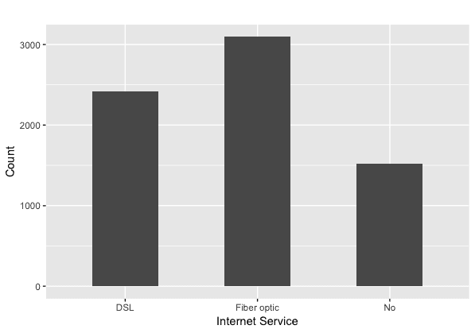

# 第十一章：客户留存

由于客户有更多选择可以消费类似内容或购买类似产品和服务，许多企业发现留住客户变得越来越困难，且客户很容易被其他竞争对手吸引。因为获取新客户的成本通常高于留住现有客户的成本，所以客户流失问题比以往任何时候都更加令人担忧。为了保留现有客户并防止他们流失到竞争对手，企业不仅需要了解客户及其需求和兴趣，还应能够识别出哪些客户可能会流失，并采取措施留住这些面临流失风险的客户。

在本章中，我们将深入探讨客户流失及其对企业的影响，以及如何留住现有客户。我们将讨论一些客户离开企业的常见原因，并研究数据科学如何帮助减少客户流失的风险。作为预测客户流失的一种方法，我们将了解人工神经网络模型及其在不同领域的应用，并学习如何使用 Python 和 R 构建一个模型。

在本章中，我们将涵盖以下主题：

+   客户流失与客户留存

+   人工神经网络

+   使用 Python 预测客户流失

+   使用 R 预测客户流失

# 客户流失与客户留存

**客户流失**是指客户决定停止使用某公司提供的服务、内容或产品。正如我们在第七章中简要讨论过的，*客户行为的探索性分析*，当我们讨论客户分析时，保留现有客户的成本远低于获取新客户的成本，且来自重复客户的收入通常高于新客户的收入。在竞争激烈的行业中，企业面临众多竞争者，新客户获取的成本更高，因此，对于这些企业来说，保留现有客户变得尤为重要。

客户离开企业背后有很多原因。一些常见的客户流失原因包括服务质量差、产品或服务未能提供足够的价值、缺乏沟通和客户忠诚度低。留住这些客户的第一步是监控客户流失率的变化。如果流失率普遍较高或随着时间推移有所增加，那么分配一些资源来改善客户留存率将是一个好主意。

为了提高客户留存率，首要任务是更好地了解客户。你可以对已经流失的客户进行调查，了解他们离开的原因。你还可以对现有客户进行调查，了解他们的需求是什么，痛点在哪里。数据科学和数据分析方法是通过数据来寻找答案。例如，你可以查看客户的网页活动数据，了解他们花费最多时间的页面，是否在他们浏览的页面上出现了错误，或者他们的搜索结果是否没有返回好的内容。你还可以查看客户服务通话记录，了解他们的等待时间有多长，投诉了哪些问题，以及这些问题是如何被处理的。对这些数据点进行深入分析可以揭示企业在保持现有客户方面面临的挑战。

在分析客户流失时，你还可以利用本书中讨论的一些主题。你可以运用我们在第五章《*产品分析*》和第六章《*推荐合适的产品*》中学到的知识，了解哪些产品最能满足客户的需求和兴趣，并推荐合适的产品，从而提供更个性化的内容。你还可以运用我们在第七章《*客户行为的探索性分析*》和第十章《*基于数据的客户细分*》中学到的知识，更好地理解客户行为和不同的客户群体。另一种方法是构建一个机器学习模型，预测哪些客户可能流失，并针对这些流失风险较高的特定客户进行定向干预，争取留住他们。在接下来的章节中，我们将讨论如何构建一个神经网络模型，识别那些高流失风险的客户，以实现客户留存。

# 人工神经网络

**人工神经网络**（**ANN**）模型是一种受人脑运作启发的机器学习模型。近年来，ANN 模型在图像识别、语音识别和机器人技术等领域的成功应用，证明了它们在各个行业中的预测能力和实用性。你可能听说过“**深度学习**”这个术语。它是 ANN 模型的一种，其中输入层和输出层之间的层数较多。下面的图示可以更好地解释这一概念：


该图展示了一个具有单一隐藏层的人工神经网络（ANN）模型的简单示例。图中的圆圈代表人工神经元或节点，模拟的是人脑中的神经元。这些箭头表示信号如何从一个神经元传递到另一个神经元。正如该图所示，ANN 模型通过寻找每个输入神经元到下一层神经元之间的信号模式或权重来学习，从而最佳地预测输出。

在接下来的编程练习中，我们将使用的具体 ANN 模型是**多层感知器**（**MLP**）模型。简单来说，MLP 模型是一种至少有一个或多个隐藏层节点的神经网络模型。包括一个输入层和一个输出层，MLP 模型至少包含三个或更多层节点。我们刚才看到的图是 MLP 模型的最简单情况，其中只有一个隐藏层。

ANN 模型可以应用于许多营销领域。通过使用 BrainMaker 的神经网络模型，微软将其直邮响应率从 4.9% 提高到了 8.2%。这帮助微软在成本减少 35% 的情况下实现了相同的收入。同样地，在我们在第八章《预测营销参与可能性》中讨论的营销参与预测问题中，我们本可以使用神经网络模型，而不是随机森林模型。我们也可以使用神经网络模型解决我们在第十章《数据驱动的客户细分》中讨论的客户细分问题。在接下来的编程练习中，我们将讨论如何使用 ANN 模型预测哪些客户可能流失。

# 使用 Python 预测客户流失

在本节中，我们将讨论如何使用 ANN 模型预测有离职风险的客户，或者是那些高度可能流失的客户。在本节结束时，我们将使用 ANN 模型构建一个客户流失预测模型。我们将主要使用`pandas`、`matplotlib` 和 `keras` 包来进行分析、可视化以及构建机器学习模型。对于那些希望使用 R 而非 Python 进行此练习的读者，你可以跳到下一节。

对于本次练习，我们将使用来自 IBM Watson Analytics 社区的公开数据集之一，数据集链接如下：[`www.ibm.com/communities/analytics/watson-analytics-blog/predictive-insights-in-the-telco-customer-churn-data-set/`](https://www.ibm.com/communities/analytics/watson-analytics-blog/predictive-insights-in-the-telco-customer-churn-data-set/)。你可以点击该链接下载数据，数据以 XLSX 格式提供，文件名为 `WA_Fn-UseC_-Telco-Customer-Churn.xlsx`。下载数据后，你可以通过运行以下命令将其加载到 Jupyter Notebook 中：

```py
import pandas as pd

df = pd.read_excel('../data/WA_Fn-UseC_-Telco-Customer-Churn.xlsx')
```

`df`数据框如下截图所示：


该数据集包含 21 个变量，其中我们的目标是预测目标变量`Churn`。

# 数据分析与准备

如你所见，在查看数据后，我们需要做一些工作，才能开始构建机器学习模型。在本节中，我们将转换具有货币值的连续变量，并编码目标变量`Churn`以及其他分类变量。为此，请执行以下步骤：

1.  **目标变量编码**：正如你从数据中看到的，目标变量`Churn`有两个值：`Yes`和`No`。我们将这些值编码为`1`代表`Yes`，`0`代表`No`。编码目标变量的代码如下所示：

```py
        df['Churn'] = df['Churn'].apply(lambda x: 1 if x == 'Yes' else 0)
```

要获得整体流失率，你可以简单地运行以下代码：

```py
        df['Churn'].mean()
```

该代码的输出约为 0.27，这意味着大约 27%的客户流失。27%的流失率并不是一个小数字；相反，它足够高，足以让企业担心整体客户流失并采取措施留住这些客户。在接下来的建模部分，我们将讨论如何利用这些数据预测可能流失的客户，并利用这些预测来保留客户。

1.  **处理 TotalCharges 列中的缺失值**：如果你查看数据集中的`TotalCharges`列，可能会注意到有些记录的`TotalCharges`值是缺失的。由于只有`11`条记录缺失`TotalCharges`值，我们将简单地忽略并删除这些缺失值的记录。请查看以下代码：

```py
        df['TotalCharges'] = df['TotalCharges'].replace(' ',   
                             np.nan).astype(float)

        df = df.dropna()
```

从这段代码可以看到，我们只是将空格值替换为`nan`值。然后，我们通过使用`dropna`函数删除所有包含`nan`值的记录。

1.  **转换连续变量**：下一步是对连续变量进行缩放。以下是连续变量的汇总统计信息：


你可以使用以下代码获取这些汇总统计信息：

```py
        df[['tenure', 'MonthlyCharges', 'TotalCharges']].describe()
```

从汇总统计中可以看到，三个`tenure`、`MonthlyCharges`和`TotalCharges`连续变量的尺度不同。`tenure`变量的范围是从`1`到`72`，而`TotalCharges`变量的范围是从`18.8`到`8684.8`。通常，ANN 模型在使用缩放或归一化特征时表现更好。请查看以下代码，用于归一化这三个特征：

```py
        df['MonthlyCharges'] = np.log(df['MonthlyCharges'])
        df['MonthlyCharges'] = (df['MonthlyCharges'] -    
        df['MonthlyCharges'].mean())/df['MonthlyCharges'].std()

        df['TotalCharges'] = np.log(df['TotalCharges'])
        df['TotalCharges'] = (df['TotalCharges'] -       
        df['TotalCharges'].mean())/df['TotalCharges'].std()

        df['tenure'] = (df['tenure'] - df['tenure'].mean())/df['tenure'].std()
```

从这段代码可以看到，我们首先应用对数转换，然后通过减去均值并除以标准差来归一化连续变量。结果如下所示：


如你所见，所有变量现在的均值为`0`，标准差为`1`。我们将使用这些标准化的变量来进行未来的模型构建。

1.  **独热编码分类变量**：从数据中可以看出，存在许多分类变量。我们首先来看一下每列有多少独特值。请查看以下代码：

```py
        for col in list(df.columns):
            print(col, df[col].nunique())
```

你可以使用`nunique`函数来计算每一列的独特值数量。这段代码的输出如下所示：


正如这个输出所示，存在`7032`个独特的客户 ID，`2`个独特的性别，`3`个独特的`MultipleLines`值，以及`6530`个独特的`TotalCharges`值。我们已经在前一步处理了`tenure`、`MonthlyCharges`和`TotalCharges`变量，因此接下来我们将专注于那些具有`2`到`4`个独特值的变量。

让我们来看一下这些分类变量的一些分布情况。首先，为了查看数据在男性和女性之间的分布情况，你可以使用以下代码进行可视化：

```py
df.groupby('gender').count()['customerID'].plot(
    kind='bar', color='skyblue', grid=True, figsize=(8,6), title='Gender'
)
plt.show()
```

该图如下所示：


从这张条形图中可以看出，不同性别的数据分布大致均匀。你可以使用相同的代码来查看`InternetService`和`PaymentMethod`不同值之间的数据分布。请查看以下图表：


第一个图显示了数据在`InternetService`变量的三种不同类别之间的分布，第二个图显示了数据在`PaymentMethod`变量的四种不同类别之间的分布。从这些图中可以看出，我们可以通过条形图轻松地可视化和理解分类变量的分布情况。我们建议你为其他分类变量绘制条形图，以便更好地理解数据分布。

现在，我们将对这些分类变量应用独热编码。请查看以下代码：

```py
dummy_cols = []

sample_set = df[['tenure', 'MonthlyCharges', 'TotalCharges', 'Churn']].copy(deep=True)

for col in list(df.columns):
    if col not in ['tenure', 'MonthlyCharges', 'TotalCharges', 'Churn'] and df[col].nunique() < 5:
        dummy_vars = pd.get_dummies(df[col])
        dummy_vars.columns = [col+str(x) for x in dummy_vars.columns] 
        sample_set = pd.concat([sample_set, dummy_vars], axis=1)
```

如你所见，我们在这段代码中使用了`pandas`包中的`get_dummies`函数为每个分类变量创建虚拟变量。然后，我们将这些新创建的虚拟变量与`sample_set`变量合并，这些数据将用于接下来建模阶段的训练。结果如下所示：


一旦完成这四个步骤，就可以开始构建用于客户流失预测的人工神经网络（ANN）模型了。请进入下一部分进行 ANN 建模！

# 使用 Keras 的人工神经网络（ANN）

在 Python 中构建人工神经网络（ANN）模型，我们将使用`keras`包，这是一个高级的神经网络库。欲了解更多详细信息，我们建议您访问他们的官方文档：[`keras.io/`](https://keras.io/)。在我们使用这个包构建 ANN 模型之前，我们需要安装两个包：`tensorflow`和`keras`。`keras`包使用`tensorflow`作为构建神经网络模型的后台，因此我们需要先安装`tensorflow`。你可以通过以下`pip`命令在终端中安装这两个包：

```py
pip install tensorflow
pip install keras
```

一旦你安装了这两个包，我们就可以开始构建我们的第一个神经网络模型了。在这个练习中，我们将构建一个具有一个隐藏层的神经网络模型。首先看看下面的代码：

```py
from keras.models import Sequential
from keras.layers import Dense

model = Sequential()
model.add(Dense(16, input_dim=len(features), activation='relu'))
model.add(Dense(8, activation='relu'))
model.add(Dense(1, activation='sigmoid'))
```

让我们更详细地看一下这段代码。首先，我们这里使用的是`Sequential`模型，这是层按线性顺序堆叠的模型类型，类似于我们在前面关于 MLP 模型部分中看到的图示。第一层是输入层，其中`input_dim`仅仅是样本集中的特征数或列数，而输出单元的数量是`16`。我们为这个输入层使用的是`relu`激活函数。接下来，在隐藏层中，输出单元的数量是`8`，并且使用的激活函数是`relu`。最后，输出层有一个输出单元，表示客户流失的概率，我们在这个层中使用的是`sigmoid`激活函数。你可以尝试不同数量的输出单元和激活函数进行实验。

使用`keras`包构建神经网络模型的最后一步是编译这个模型。看看下面的代码：

```py
model.compile(loss='binary_crossentropy', optimizer='adam', metrics=['accuracy'])
```

在这里，我们使用的是`adam`优化器，这是最常用和频繁使用的优化算法之一。由于我们的目标变量是二元的，因此我们使用`binary_crossentropy`作为损失函数。最后，这个模型将使用`accuracy`作为评估训练过程中模型性能的指标。

在开始训练这个神经网络模型之前，我们需要将我们的样本集分为训练集和测试集。请看一下下面的代码：

```py
from sklearn.model_selection import train_test_split

target_var = 'Churn'
features = [x for x in list(sample_set.columns) if x != target_var]

X_train, X_test, y_train, y_test = train_test_split(
    sample_set[features], 
    sample_set[target_var], 
    test_size=0.3
)
```

从这段代码中可以看出，我们正在使用`scikit-learn`包中的`train_test_split`函数。在我们的练习中，我们将使用 70%的样本集进行训练，30%进行测试。现在，我们可以使用以下代码训练我们的神经网络模型：

```py
model.fit(X_train, y_train, epochs=50, batch_size=100)
```

在这里，我们使用`100`个样本作为`batch_size`，即每次模型学习的样本数量，`50`作为`epochs`的数量，即通过整个训练集的完整遍历次数。运行这段代码后，你将看到类似如下的输出：


正如您从输出中看到的，`loss`通常会在每个周期减少，准确率（`acc`）会提高。然而，模型性能提升的速率随着时间的推移会逐渐减缓。正如您从输出中看到的，在前几个周期中，损失和准确率指标有显著改善，但随着时间的推移，性能提升的幅度逐渐变小。您可以监控这个过程，并决定在性能增益最小的时候停止训练。

# 模型评估

现在我们已经建立了第一个神经网络模型，让我们来评估它的性能。我们将查看总体准确率、精确度和召回率，以及**接收者操作特征**（**ROC**）曲线和曲线下面积（AUC）。首先，来看一下计算准确率、精确度和召回率的代码：

```py
from sklearn.metrics import accuracy_score, precision_score, recall_score

in_sample_preds = [round(x[0]) for x in model.predict(X_train)]
out_sample_preds = [round(x[0]) for x in model.predict(X_test)]

# Accuracy
print('In-Sample Accuracy: %0.4f' % accuracy_score(y_train, in_sample_preds))
print('Out-of-Sample Accuracy: %0.4f' % accuracy_score(y_test, out_sample_preds))

# Precision
print('In-Sample Precision: %0.4f' % precision_score(y_train, in_sample_preds))
print('Out-of-Sample Precision: %0.4f' % precision_score(y_test, out_sample_preds))

# Recall
print('In-Sample Recall: %0.4f' % recall_score(y_train, in_sample_preds))
print('Out-of-Sample Recall: %0.4f' % recall_score(y_test, out_sample_preds))
```

您应该已经熟悉这段代码，因为我们在第八章《预测营销参与的可能性》中使用了相同的评估指标。对于我们这个案例，该代码的输出结果如下：


由于模型中存在一定的随机性，您的结果可能与这些数字有所不同。从这个输出中可以看到，测试集中预测客户是否流失的准确率约为`0.79`，这意味着模型大约有 80%的时间是正确的。样本外的精确度表明，模型在预测客户流失时大约有 66%的准确性，而样本外的召回率则表明，模型大约能捕捉到 52%的流失案例。

接下来，我们可以使用以下代码计算 AUC 值：

```py
from sklearn.metrics import roc_curve, auc

in_sample_preds = [x[0] for x in model.predict(X_train)]
out_sample_preds = [x[0] for x in model.predict(X_test)]

in_sample_fpr, in_sample_tpr, in_sample_thresholds = roc_curve(y_train, in_sample_preds)
out_sample_fpr, out_sample_tpr, out_sample_thresholds = roc_curve(y_test, out_sample_preds)

in_sample_roc_auc = auc(in_sample_fpr, in_sample_tpr)
out_sample_roc_auc = auc(out_sample_fpr, out_sample_tpr)

print('In-Sample AUC: %0.4f' % in_sample_roc_auc)
print('Out-Sample AUC: %0.4f' % out_sample_roc_auc)
```

该代码的输出结果如下：


为了在 ROC 曲线中可视化这些数据，您可以使用以下代码：

```py
plt.figure(figsize=(10,7))

plt.plot(
    out_sample_fpr, out_sample_tpr, color='darkorange', label='Out-Sample ROC curve (area = %0.4f)' % in_sample_roc_auc
)
plt.plot(
    in_sample_fpr, in_sample_tpr, color='navy', label='In-Sample ROC curve (area = %0.4f)' % out_sample_roc_auc
)
plt.plot([0, 1], [0, 1], color='gray', lw=1, linestyle='--')
plt.grid()
plt.xlim([0.0, 1.0])
plt.ylim([0.0, 1.05])
plt.xlabel('False Positive Rate')
plt.ylabel('True Positive Rate')
plt.title('ROC Curve')
plt.legend(loc="lower right")

plt.show()
```

输出结果如下：


除了之前查看的准确率、精确度和召回率指标外，AUC 和 ROC 曲线也表明该模型能够很好地捕捉并预测流失风险较高的客户。正如你从这些评估输出中看到的，与简单地猜测哪些客户可能流失相比，使用该模型的输出来识别可能流失的客户更为有效。通过在市场营销策略中重点关注该模型预测的高流失概率客户，您可以以更具成本效益的方式留住这些有流失风险的客户。

本练习的完整代码可以在此代码库中找到：[`github.com/yoonhwang/hands-on-data-science-for-marketing/blob/master/ch.11/python/CustomerRetention.ipynb`](https://github.com/yoonhwang/hands-on-data-science-for-marketing/blob/master/ch.11/python/CustomerRetention.ipynb)。

# 使用 R 预测客户流失

在本节中，我们将讨论如何使用 ANN 模型预测有可能流失的客户或高度可能流失的客户。在本节结束时，我们将构建一个使用 ANN 模型的客户流失预测模型。我们将主要使用`dplyr`、`ggplot2`和`keras`库来分析、可视化和构建机器学习模型。对于那些希望使用 Python 而非 R 的读者，可以参阅前一节。

在这个练习中，我们将使用 IBM Watson Analytics 社区中公开的一个数据集，链接地址是：[`www.ibm.com/communities/analytics/watson-analytics-blog/predictive-insights-in-the-telco-customer-churn-data-set/`](https://www.ibm.com/communities/analytics/watson-analytics-blog/predictive-insights-in-the-telco-customer-churn-data-set/)。你可以通过这个链接下载数据，数据格式为 XLSX，文件名为`WA_Fn-UseC_-Telco-Customer-Churn.xlsx`。下载数据后，你可以通过运行以下命令将其加载到你的 RStudio 环境中：

```py
library(readxl)

#### 1\. Load Data ####
df <- read_excel(
  path="~/Documents/data-science-for-marketing/ch.11/data/WA_Fn-UseC_-Telco-Customer-Churn.xlsx"
)
```

DataFrame，`df`，应该像下面的截图一样：


这个数据集共有 21 个变量，我们的目标是预测目标变量`Churn`。

# 数据分析与准备

正如你可能从数据中看到的那样，在开始构建机器学习模型之前，我们需要做一些准备工作。在本节中，我们将转换具有货币值的连续变量，并编码目标变量`Churn`以及其他分类变量。为此，请执行以下步骤：

1.  **处理数据中的缺失值**：如果你查看了数据集中的`TotalCharges`列，你可能会注意到有些记录没有`TotalCharges`值。由于只有`11`条记录缺少`TotalCharges`值，我们将简单地忽略并删除这些缺失值的记录。请看下面的代码：

```py
        library(tidyr)

        df <- df %>% drop_na()
```

正如你从这段代码中可以看到的，我们使用了`tidyr`包中的`drop_na`函数，这个函数会删除所有含有`NA`值的记录。

1.  **分类变量**：如你从数据中看到的，有许多分类变量。我们首先来看一下每一列中有多少个唯一值。请看下面的代码：

```py
       apply(df, 2, function(x) length(unique(x)))
```

你可以使用`unique`函数获取每一列的唯一值。通过将这个函数应用于`df`中的所有列，代码输出结果如下：


从输出结果来看，数据集中有`7032`个唯一的客户 ID，`2`个唯一的性别，`3`个唯一的`MultipleLines`值，和`6530`个唯一的`TotalCharges`值。`tenure`、`MonthlyCharges`和`TotalCharges`变量是连续变量，每个变量可以取任意值，其他则是分类变量。

我们将查看一些分类变量的分布情况。首先，为了查看男性和女性之间的数据分布，你可以使用下面的代码进行可视化：

```py
        ggplot(df %>% group_by(gender) %>% summarise(Count=n()),
         aes(x=gender, y=Count)) +
          geom_bar(width=0.5, stat="identity") +
          ggtitle('') +
          xlab("Gender") +
          ylab("Count") +
          theme(plot.title = element_text(hjust = 0.5))
```

绘图如下所示：


从这张条形图中可以看出，两个性别的数据分布大致均衡。你可以使用相同的代码查看不同`InternetService`和`PaymentMethod`值下数据的分布。请查看下面的图：




第一个图展示了`InternetService`变量的三个不同类别下数据的分布，第二个图展示了`PaymentMethod`变量的四个不同类别下数据的分布。通过这些图，我们可以轻松地通过条形图可视化和理解分类变量的分布情况。我们建议你为其他分类变量绘制条形图，以便更好地了解数据分布。

1.  **变换和编码变量**：下一步是转化连续变量并编码二元分类变量。请看下面的代码：

```py
        # Binary & Continuous Vars
        sampleDF <- df %>%
         select(tenure, MonthlyCharges, TotalCharges, gender, Partner,    
        Dependents, PhoneService, PaperlessBilling, Churn) %>%
         mutate(
          # transforming continuous vars
         tenure=(tenure - mean(tenure))/sd(tenure),
          MonthlyCharges=(log(MonthlyCharges) -      
        mean(log(MonthlyCharges)))/sd(log(MonthlyCharges)),
         TotalCharges=(log(TotalCharges) -     
         mean(log(TotalCharges)))/sd(log(TotalCharges)),

          # encoding binary categorical vars
         gender=gender %>% as.factor() %>% as.numeric() - 1,
         Partner=Partner %>% as.factor() %>% as.numeric() - 1,
        Dependents=Dependents %>% as.factor() %>% as.numeric() - 1,
         PhoneService=PhoneService %>% as.factor() %>% as.numeric() - 1,
         PaperlessBilling=PaperlessBilling %>% as.factor() %>% as.numeric() - 1,
          Churn=Churn %>% as.factor() %>% as.numeric() - 1
          )
```

从这段代码可以看出，我们仅对那些只有两个类别的变量进行编码，分别是`gender`、`Partner`、`Dependents`、`PhoneService`、`PaperlessBilling`和`Churn`，使用`0`和`1`。然后，我们对两个具有货币值的连续变量，`MonthlyCharges`和`TotalCharges`，应用对数变换。同时，我们标准化所有三个连续变量，`tenure`、`MonthlyCharges`和`TotalCharges`，使这些变量的均值为`0`，标准差为`1`。这是因为 ANN 模型通常在特征经过缩放或归一化后表现更好。经过变换后，这三个连续变量的分布如下图所示：


如你所见，这三个变换后的变量的均值是`0`，标准差是`1`。而在此之前，这些分布看起来如下所示：


1.  **独热编码分类变量**：我们需要转化的最后一组变量是：具有三个或更多类别的多类别分类变量。我们将应用独热编码，为这些变量创建虚拟变量。请看下面的代码：

```py
        # Dummy vars
         # install.packages('dummies')
          library(dummies)

        sampleDF <- cbind(sampleDF, dummy(df$MultipleLines, sep="."))
         names(sampleDF) = gsub("sampleDF", "MultipleLines", names(sampleDF))
```

如你所见，这段代码中我们使用了`dummies`库来创建虚拟变量。通过该包的`dummy`函数，我们可以应用独热编码并为每个多类别分类变量创建虚拟变量。由于`dummy`函数会将`sampleDF`前缀加到新创建的虚拟变量名称前，我们可以使用`gsub`函数将其替换为相应的变量名称。我们将对其余的分类变量应用相同的逻辑，如下所示：

```py
        sampleDF <- cbind(sampleDF, dummy(df$InternetService, sep="."))
        names(sampleDF) = gsub("sampleDF", "InternetService", names(sampleDF))

        sampleDF <- cbind(sampleDF, dummy(df$OnlineSecurity, sep="."))
        names(sampleDF) = gsub("sampleDF", "OnlineSecurity", names(sampleDF))

        sampleDF <- cbind(sampleDF, dummy(df$OnlineBackup, sep="."))
         names(sampleDF) = gsub("sampleDF", "OnlineBackup", names(sampleDF))

        sampleDF <- cbind(sampleDF, dummy(df$DeviceProtection, sep="."))
        names(sampleDF) = gsub("sampleDF", "DeviceProtection", names(sampleDF))

         sampleDF <- cbind(sampleDF, dummy(df$TechSupport, sep="."))
         names(sampleDF) = gsub("sampleDF", "TechSupport", names(sampleDF))

         sampleDF <- cbind(sampleDF, dummy(df$StreamingTV, sep="."))
         names(sampleDF) = gsub("sampleDF", "StreamingTV", names(sampleDF))

         sampleDF <- cbind(sampleDF, dummy(df$StreamingMovies, sep="."))
          names(sampleDF) = gsub("sampleDF", "StreamingMovies", names(sampleDF))

          sampleDF <- cbind(sampleDF, dummy(df$Contract, sep="."))
          names(sampleDF) = gsub("sampleDF", "Contract", names(sampleDF))

         sampleDF <- cbind(sampleDF, dummy(df$PaymentMethod, sep="."))
        names(sampleDF) = gsub("sampleDF", "PaymentMethod", names(sampleDF))
```

结果显示在以下输出中：


完成这四个步骤后，就可以开始构建用于客户流失预测的 ANN 模型了。继续下一节，进行 ANN 建模！

# 使用 Keras 构建 ANN

在 R 中构建 ANN 模型时，我们将使用`keras`包，它是一个高级神经网络库。欲了解更多详细信息，建议访问其官方文档：[`keras.io/`](https://keras.io/)。在使用这个包构建 ANN 模型之前，我们需要安装两个库：`tensorflow`和`keras`。`keras`包使用`tensorflow`作为构建神经网络模型的后端，因此我们需要先安装`tensorflow`。你可以使用以下命令在 RStudio 中安装这两个包：

```py
install.packages("devtools")
devtools::install_github("rstudio/tensorflow")
library(tensorflow)
install_tensorflow()

devtools::install_github("rstudio/keras")
library(keras)
install_keras()
```

安装完这两个库后，我们终于可以开始构建我们的第一个神经网络模型了。在这个练习中，我们将构建一个具有一个隐藏层的神经网络模型。首先看一下下面的代码：

```py
model <- keras_model_sequential() 
model %>% 
  layer_dense(units = 16, kernel_initializer = "uniform", activation = 'relu', input_shape=ncol(train)-1) %>% 
  layer_dense(units = 8, kernel_initializer = "uniform", activation = 'relu') %>%
  layer_dense(units = 1, kernel_initializer = "uniform", activation = 'sigmoid') %>% 
  compile(
    optimizer = 'adam',
    loss = 'binary_crossentropy',
    metrics = c('accuracy')
  )
```

让我们仔细看看这段代码。首先，我们在这里构建了一个`Sequential`模型，`keras_model_sequential`，这是一种层次线性堆叠的模型，类似于我们在前面关于 MLP 模型部分看到的图示。第一层，`layer_dense`，是一个输入层，其中`input_shape`只是样本集中特征或列的数量，而输出单元的数量是`16`。我们在这个输入层使用的是`relu`激活函数。然后，在隐藏层中，输出单元的数量是`8`，并且使用的激活函数是`relu`。最后，输出层有一个输出单元，它表示客户流失的概率，我们在这一层使用`sigmoid`激活函数。你可以尝试不同数量的输出单元和激活函数进行练习。最后，我们需要编译这个模型，使用`compile`函数。在这里，我们使用`adam`优化器，它是最常用的优化算法之一。由于我们的目标变量是二元的，我们使用`binary_crossentropy`作为`loss`函数。最后，模型将使用`accuracy`指标来评估训练过程中的模型性能。

在开始训练这个神经网络模型之前，我们需要将样本集拆分成训练集和测试集。看一下下面的代码：

```py
library(caTools)

sample <- sample.split(sampleDF$Churn, SplitRatio = .7)

train <- as.data.frame(subset(sampleDF, sample == TRUE))
test <- as.data.frame(subset(sampleDF, sample == FALSE))

trainX <- as.matrix(train[,names(train) != "Churn"])
trainY <- train$Churn
testX <- as.matrix(test[,names(test) != "Churn"])
testY <- test$Churn
```

从这段代码中可以看到，我们正在使用 `caTools` 包的 `sample.split` 函数。在我们的练习中，我们将使用 70% 的样本集用于训练，30% 用于测试。现在，我们可以使用以下代码训练神经网络模型：

```py
history <- model %>% fit(
  trainX, 
  trainY, 
  epochs = 50, 
  batch_size = 100, 
  validation_split = 0.2
)
```

在这里，我们使用 `100` 个样本作为 `batch_size`，每次模型都将从中学习预测，并且使用 `50` 作为 `epochs` 的数量，即整个训练集的完整遍历次数。运行这段代码后，你将看到以下输出：


从这个输出中可以看到，`loss` 通常在每个 epoch 中减少，准确率（`acc`）提高。然而，模型性能改进的速度随着时间的推移而减慢。从输出中可以看出，在前几个 epoch 中，损失和准确度指标有很大的改善，而随着时间推移，性能提升的幅度逐渐减少。你可以监控这个过程，并在性能提升最小时决定停止训练。

# 模型评估

现在我们已经构建了第一个神经网络模型，让我们评估其性能。我们将查看整体准确率、精度和召回率，以及 ROC 曲线和 AUC。首先，查看以下计算准确率、精度和召回率的代码：

```py
# Evaluating ANN model
inSamplePreds <- as.double(model %>% predict_classes(trainX))
outSamplePreds <- as.double(model %>% predict_classes(testX))

# - Accuracy, Precision, and Recall
inSampleAccuracy <- mean(trainY == inSamplePreds)
outSampleAccuracy <- mean(testY == outSamplePreds)
print(sprintf('In-Sample Accuracy: %0.4f', inSampleAccuracy))
print(sprintf('Out-Sample Accuracy: %0.4f', outSampleAccuracy))

inSamplePrecision <- sum(inSamplePreds & trainY) / sum(inSamplePreds)
outSamplePrecision <- sum(outSamplePreds & testY) / sum(outSamplePreds)
print(sprintf('In-Sample Precision: %0.4f', inSamplePrecision))
print(sprintf('Out-Sample Precision: %0.4f', outSamplePrecision))

inSampleRecall <- sum(inSamplePreds & trainY) / sum(trainY)
outSampleRecall <- sum(outSamplePreds & testY) / sum(testY)
print(sprintf('In-Sample Recall: %0.4f', inSampleRecall))
print(sprintf('Out-Sample Recall: %0.4f', outSampleRecall))
```

你应该熟悉这段代码，因为我们在第八章《预测营销互动的可能性》中使用了相同的评估指标。我们在本例中的代码输出如下：


由于模型中的一些随机性，你的结果可能与这些数字有所不同。从这个输出中可以看到，预测客户是否会流失的准确率约为 `0.83`，表明该模型大约 83% 的时间是正确的。样本外精度表明，在预测客户会流失时，模型约有 72% 的正确率，样本外召回率表明，模型捕捉到大约 58% 的流失案例。

接下来，我们可以计算 AUC 并绘制 ROC 曲线，使用以下代码：

```py
# - ROC & AUC
library(ROCR)

outSamplePredProbs <- as.double(predict(model, testX))

pred <- prediction(outSamplePredProbs, testY)
perf <- performance(pred, measure = "tpr", x.measure = "fpr") 
auc <- performance(pred, measure='auc')@y.values[[1]]

plot(
  perf, 
  main=sprintf('Model ROC Curve (AUC: %0.2f)', auc), 
  col='darkorange', 
  lwd=2
) + grid()
abline(a = 0, b = 1, col='darkgray', lty=3, lwd=2)
```

输出结果如下：


除了我们之前查看的准确率、精度和召回率指标外，AUC 和 ROC 曲线还表明该模型很好地捕捉和预测了那些面临流失风险的客户。从这些评估结果中可以看出，使用该模型的输出来识别可能流失的客户，比单纯地猜测他们是谁要好得多。通过将营销策略集中在该模型预测的高流失概率客户身上，你可以更具成本效益地留住这些有流失风险的客户。

本练习的完整代码可以在以下仓库找到：[`github.com/yoonhwang/hands-on-data-science-for-marketing/blob/master/ch.11/R/CustomerRetention.R`](https://github.com/yoonhwang/hands-on-data-science-for-marketing/blob/master/ch.11/R/CustomerRetention.R)。

# 总结

在本章中，我们已经学习了客户流失和客户保持的相关内容。我们讨论了客户流失对企业的危害。更具体地说，我们了解了保持现有客户比获取新客户的成本要低得多。我们展示了客户离开公司的常见原因，例如：糟糕的客户服务、没有在产品或服务中找到足够的价值、沟通不畅和缺乏客户忠诚度。为了了解客户流失的原因，我们可以通过调查或分析客户数据来更好地了解他们的需求和痛点。我们还讨论了如何训练人工神经网络（ANN）模型来识别那些有流失风险的客户。通过编程练习，我们学习了如何使用`keras`库在 Python 和 R 中构建和训练 ANN 模型。

在接下来的章节中，我们将学习 A/B 测试及其如何帮助确定在不同选项中最佳的营销策略。我们将讨论如何在 Python 和 R 中计算统计显著性，帮助营销人员决定在多个营销策略中选择哪一个。
