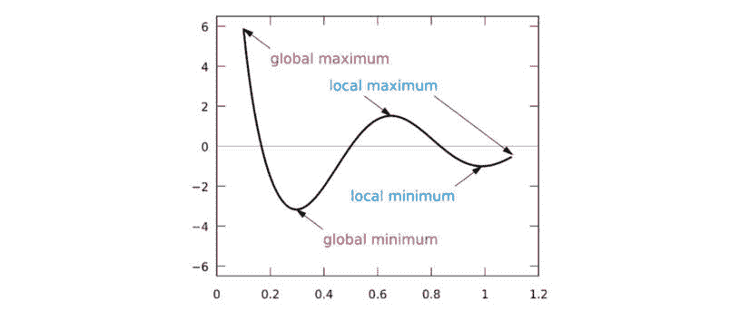

# 第一章：遗传算法简介

从查尔斯·达尔文的自然进化理论中汲取灵感，解决问题的最具魅力的技术之一就是被恰当地命名为进化计算的算法家族。在这个家族中，最突出且广泛应用的分支被称为遗传算法。本章将是你掌握这一既极其强大又极其简单的技术的起点。

在本章中，我们将介绍遗传算法及其与达尔文进化的类比，然后深入探讨其基本操作原理和基础理论。接着，我们将讲解遗传算法与传统算法的区别，并讨论遗传算法的优缺点及其应用。最后，我们将回顾使用遗传算法可能带来益处的案例。

在本章节的介绍中，我们将涵盖以下主题：

+   什么是遗传算法？

+   遗传算法背后的理论

+   遗传算法与传统算法的区别

+   遗传算法的优点和局限性

+   何时使用遗传算法

# 什么是遗传算法？

遗传算法是一类受自然进化原理启发的搜索算法。通过模仿自然选择和繁殖的过程，遗传算法能够为各种涉及搜索、优化和学习的问题提供高质量的解决方案。同时，遗传算法与自然进化的类比使其能够克服传统搜索和优化算法所面临的一些障碍，特别是对于具有大量参数和复杂数学表示的问题。

在本节的其余部分，我们将回顾遗传算法的基本思想，以及它们与自然界中发生的进化过程的类比。

## 达尔文进化

遗传算法实现了自然界中达尔文进化的简化版本。达尔文进化理论的原理可以通过以下原则来概括：

+   **变异原理**：属于同一群体的个体的特征（属性）可能会有所不同。因此，个体之间在某种程度上有所差异，例如在行为或外观上。

+   **遗传原理**：某些特征会持续从个体传递给其后代。因此，后代更像其父母，而不像无关的个体。

+   **选择原理**：群体通常会在其所处环境中争夺资源。那些具有更好适应环境特征的个体，将更有可能存活，并且会为下一代贡献更多的后代。

换句话说，进化保持了一个个体样本群体，这些个体彼此之间存在差异。那些更适应环境的个体有更大的生存、繁殖并将其特征传递给下一代的机会。通过这种方式，随着代际的更替，物种会越来越适应其环境以及面临的挑战。

进化的一个重要推动因素是交叉或重组——通过将父母特征混合来创造后代。交叉有助于维持群体的多样性，并随着时间的推移将更好的特征结合在一起。此外，突变——特征上的随机变化——通过引入变化，偶尔也能在进化中起到推动作用，从而实现跃进。

## 基因算法类比

基因算法旨在为给定的问题寻找最优解，而达尔文进化则保持一个个体样本群体。基因算法保持一个候选解群体，称为**个体**，用于给定的问题。这些候选解会经过反复评估，并用于创建新一代的解。那些更擅长解决这个问题的候选解有更大的机会被选中，并将它们的特质传递给下一代候选解。通过这种方式，随着代际更替，候选解在解决当前问题时会变得越来越优秀。

在接下来的章节中，我们将描述基因算法的各个组成部分，这些组成部分使得达尔文进化类比成为可能。

### 基因型

在自然界中，繁殖、交配和突变是通过基因型来实现的——基因型是由一组基因组成的染色体集合。如果两个个体交配并产生后代，每个后代的染色体都会携带来自两个父母的基因混合。模仿这一概念，在基因算法中，每个个体由一个染色体表示，染色体代表一组基因。例如，染色体可以表示为一个二进制字符串，其中每个比特代表一个基因：

图 1.1：简单的二进制编码染色体

*图 1.1* 展示了一个这样的二进制编码染色体的例子，表示一个特定个体。

### 群体

在任何时刻，基因算法都会保持一个个体群体——即一组当前问题的候选解。由于每个个体由某种染色体表示，因此这些个体的群体可以看作是这些染色体的集合：

图 1.2：由二进制编码染色体表示的个体群体

该群体持续代表当前的世代，并在当前世代被新一代替换时发生进化。

### 适应度函数

在算法的每次迭代中，使用适应度函数（也称为目标函数）来评估个体。这是我们要优化的函数或我们尝试解决的问题。

达到更高适应度得分的个体代表更好的解决方案，更有可能被选择进行繁殖，并在下一代中得到体现。随着时间的推移，解决方案的质量提高，适应度值增加，一旦找到满意的适应度值，过程就可以停止。

### 选择

在计算每个个体的适应度后，使用选择过程来确定种群中的哪些个体将进行繁殖，并产生下一代的后代。

这个选择过程是基于个体的适应度得分。得分较高的个体更有可能被选择，并将其遗传物质传递给下一代。

适应度较低的个体仍然可以被选择，但概率较低。通过这种方式，它们的遗传物质不会完全被排除，从而保持遗传多样性。

### 交叉

为了创造一对新个体，通常从当前一代中选择两个父母，并交换它们染色体的一部分（交叉），以产生两条新的染色体，代表后代。这个操作称为交叉或重组：

图 1.3：两个二进制编码染色体之间的交叉操作

来源：[`commons.wikimedia.org/wiki/File:Computational.science.Genetic.algorithm.Crossover.One.Point.svg`](https://commons.wikimedia.org/wiki/File:Computational.science.Genetic.algorithm.Crossover.One.Point.svg)

图片来源：Yearofthedragon

*图 1**.3* 展示了一个简单的交叉操作，通过两个父母创造两个后代。

### 变异

变异算子的目的是刷新种群，将新的模式引入染色体中，并定期和随机地鼓励在解决方案空间的未知区域进行搜索。

变异可能表现为基因的随机变化。变异是通过对染色体值中的一个或多个进行随机更改来实现的；例如，在二进制串中翻转一个比特：

图 1.4：应用于二进制编码染色体的变异算子

*图 1**.4* 显示了变异操作的示例。

现在，让我们来看看遗传算法背后的理论。

# 遗传算法背后的理论

遗传算法的基础假设是，当前问题的最优解由小的构建块组成，随着我们将更多的构建块组合在一起，我们会越来越接近这个最优解。

种群中的个体，通过其优越的得分，识别出包含部分期望基因片段的个体。反复进行选择和交叉操作，使得优良个体将这些基因片段传递给下一代，同时可能与其他成功的基因片段组合。这种过程形成遗传压力，引导种群朝向拥有更多期望基因片段的方向，最终形成最优解。

因此，每一代都会比上一代更好，包含更多接近最优解的个体。

例如，考虑一个四位二进制字符串的种群，其中我们的目标是找到和数字之和最高的字符串。这被称为**OneMax**问题，并将在本书后面详细讨论。在这种情况下，出现在四个可能数字位置的 1 是一个很好的基因片段。随着算法的推进，它会识别出含有这些基因片段的解并将它们组合在一起。每一代会有更多个体在不同位置包含 1 值，最终产生包含所有期望基因片段的字符串 1111。该过程如下图所示：

图 1.5：交叉操作展示了如何将最优解的基因片段结合在一起

*图 1.5* 展示了两个对于该问题来说是优秀解的个体（每个个体有三个 1 值）如何通过交叉操作，结合父母双方的期望基因片段，从而产生最佳解（四个 1 位，也就是右边的后代）。

## 该模式定理

构建块假设的更正式表达是**霍兰德的模式定理**，也叫做**遗传算法的基本定理**。

该定理涉及到模式（模式的复数形式），它们是可以在染色体中找到的模式（或模板）。每个模式表示一组染色体，它们在某些方面具有相似性。

例如，如果四位二进制字符串表示染色体集合，那么模式*1*01*表示所有那些在最左端位置有 1、在最右端两个位置有 01、以及在从左数第二的位置可能有 1 或 0 的染色体，因为*表示**通配符**值。

对于每个模式，我们可以分配两个测量值：

+   **阶数**：固定数字的数量（非通配符）

+   **定义长度**：两个最远固定数字之间的距离

以下表格提供了几个四位二进制模式及其测量值的示例：

| **模式** | **阶数** | **定义长度** |
| --- | --- | --- |
| 1101 | 4 | 3 |
| 1*01 | 3 | 3 |
| *101 | 3 | 2 |
| *1*1 | 2 | 2 |
| **01 | 2 | 1 |
| 1*** | 1 | 0 |
| **** | 0 | 0 |

表 1.1：四位二进制模式及其对应的度量示例

种群中的每个染色体都对应着多个模式，就像给定的字符串与正则表达式匹配一样。例如，染色体 1101 对应于该表中所有出现的模式，因为它与这些模式所代表的每一个模式都匹配。如果该染色体的得分较高，它更有可能在选择操作中存活下来，并且所有它代表的模式也会一起存活。当该染色体与另一个染色体交叉，或发生变异时，一些模式会存活下来，而其他模式则会消失。低阶和短定义长度的模式更有可能存活。

因此，模式定理指出，低阶、短定义长度和优于平均适应度的模式的频率会在后代中呈指数增长。换句话说，代表使得解更好的小而简单的构建块将在遗传算法的进程中越来越频繁地出现在种群中。我们将在下一节讨论遗传算法和传统算法之间的区别。

# 与传统算法的区别

遗传算法与传统的搜索和优化算法（如基于梯度的算法）之间有几个重要的区别。

关键的区分因素如下：

+   维持一个解的种群

+   使用解的遗传表示

+   利用适应度函数的结果

+   展现出概率行为

我们将在以下章节中更详细地描述这些因素。

## 基于种群

遗传搜索是在候选解的种群（个体）上进行的，而不是单一候选解。在搜索的任何时刻，算法会保留一组个体，形成当前的世代。遗传算法的每次迭代都会创造出下一个世代的个体。

相比之下，大多数其他搜索算法保持一个单一解，并通过迭代修改该解来寻找最佳解。例如，梯度下降算法通过在最陡下降方向上迭代地移动当前解来优化解，该方向由给定函数的梯度的负值定义。

## 遗传表示

遗传算法不是直接作用于候选解，而是作用于它们的表示（或编码），通常称为**染色体**。一个简单染色体的例子是一个固定长度的二进制字符串。

这些染色体使我们能够进行交叉和变异的遗传操作。交叉通过交换两个父本的染色体部分来实现，而变异则通过修改染色体的部分来实现。

使用遗传表示法的一个副作用是将搜索与原始问题域解耦。遗传算法并不关心染色体代表的内容，也不会试图解释它们。

## 适应度函数

适应度函数表示我们希望解决的问题。遗传算法的目标是找到在该函数计算后获得最高分的个体。

与许多传统搜索算法不同，遗传算法只考虑通过适应度函数得到的值，而不依赖于导数或任何其他信息。这使得它们适合处理那些难以或无法数学上求导的函数。

## 概率行为

虽然许多传统算法是确定性的，但遗传算法通过的规则是概率性的，即从一代到下一代的进化过程是基于概率的。

例如，在选择用于创建下一代的个体时，选择某个个体的概率会随着该个体适应度的提高而增加，但在选择过程中仍然存在随机元素。适应度较低的个体也可能被选择，但概率较低。

突变也具有概率驱动特性，通常以较低的概率发生，并在染色体的一个或多个随机位置进行改变。

交叉算子也可以包含一个概率元素。在某些遗传算法的变种中，交叉只会在一定的概率下发生。如果没有发生交叉，两个父代将直接复制到下一代，保持不变。

尽管这一过程具有概率性，但基于遗传算法的搜索并非完全随机；相反，它利用随机元素将搜索引导至搜索空间中更有可能改进结果的区域。现在，让我们看看遗传算法的优势。

# 遗传算法的优势

我们在前面讨论的遗传算法独特特性提供了相对于传统搜索算法的几个优势。

遗传算法的主要优势如下：

+   全局优化能力

+   能处理具有复杂数学表示的问题

+   能处理缺乏数学表示的问题

+   对噪声的韧性

+   支持并行处理和分布式处理

+   适合持续学习

我们将在接下来的章节中讨论这些内容。

## 全局优化

在许多情况下，优化问题存在局部最大值和最小值点；这些点代表比周围更好的解，但并非整体最优。

以下图示说明了全局最大值和最小值与局部最大值和最小值的区别：

图 1.6：函数的全局和局部最大值与最小值。

来源：[`commons.wikimedia.org/wiki/File:Computational.science.Genetic.algorithm.Crossover.One.Point.svg`](https://commons.wikimedia.org/wiki/File:Computational.science.Genetic.algorithm.Crossover.One.Point.svg)

图片由 KSmrq 提供

大多数传统的搜索和优化算法，尤其是基于梯度的算法，容易陷入局部最大值，而不是找到全局最大值。这是因为在局部最大值附近，任何小的变化都会导致评分下降。

另一方面，遗传算法对这种现象不太敏感，更容易找到全局最大值。这是因为遗传算法使用的是一组候选解，而不是单一解，并且交叉和变异操作通常会导致候选解与之前的解相距较远。只要我们能保持种群的多样性，避免**过早收敛**，正如我们将在下一节中提到的那样，这种情况就成立。

## 处理复杂问题

由于遗传算法只需要每个个体的适应度函数结果，并且不关心适应度函数的其他方面（例如导数），它们可以用于具有复杂数学表示的问题，或者用于那些难以或无法求导的函数。

遗传算法在其他复杂案例中表现出色，包括具有大量参数的问题和混合参数类型的问题——例如，连续参数和离散参数的组合。

## 处理缺乏数学表示的问题

遗传算法可以用于完全缺乏数学表示的问题。一个特别值得关注的情况是，当适应度评分基于人类意见时。例如，假设我们希望找到一个最具吸引力的色彩调色板来应用于网站。我们可以尝试不同的颜色组合，并要求用户评价网站的吸引力。我们可以应用遗传算法来搜索得分最高的组合，同时使用这种基于意见的评分作为适应度函数的输出。即使适应度函数缺乏数学表示，并且无法直接从给定的颜色组合中计算得分，遗传算法仍然可以正常工作。

正如我们将在下一章中看到的那样，遗传算法甚至可以处理每个个体的得分无法获得的情况，只要我们有办法比较两个个体并确定哪一个更好。一个例子是，基于机器学习算法的模拟赛车驾驶。基于遗传算法的搜索可以通过让不同版本的算法相互竞争，来优化和调优该机器学习算法，以确定哪个版本更好。

## 对噪声的鲁棒性

一些问题表现出噪声行为。这意味着，即使是相似的输入参数值，每次测量时输出值可能会有所不同。例如，当使用的数据来自传感器输出，或者在分数基于人类意见的情况下（如前一节所讨论的）就会发生这种情况。

虽然这种行为可能会扰乱许多传统的搜索算法，但由于遗传算法在重新组装和重新评估个体时的重复操作，它通常对这种情况具有较强的抵抗力。

## 并行性

遗传算法非常适合并行化和分布式处理。适应度是针对每个个体独立计算的，这意味着种群中的所有个体都可以同时进行评估。

此外，选择、交叉和变异操作可以在种群中的个体和个体对上并行执行。

这使得遗传算法成为分布式和云端实现的天然候选者。

## 持续学习

在自然界中，进化永不停息。随着环境条件的变化，种群会相应适应这些变化。同样，遗传算法可以在不断变化的环境中持续运行，并且在任何时刻，都可以获取并使用当前最优解。

为了使其有效，环境的变化相较于遗传算法搜索的代际周转速率应该是缓慢的。现在我们已经讨论了遗传算法的优势，接下来让我们看看它的局限性。

# 遗传算法的局限性

为了最大限度地发挥遗传算法的作用，我们需要了解它们的局限性和潜在的陷阱。

遗传算法的局限性如下：

+   对特殊定义的需求

+   需要超参数调优

+   计算密集型操作

+   提前收敛的风险

+   无法保证得到最优解

我们将在接下来的章节中逐一讨论这些问题。

## 特殊定义

在将遗传算法应用于特定问题时，我们需要为其创建一个合适的表示——定义适应度函数和染色体结构，并为该问题设计合适的选择、交叉和变异操作符。这往往是一项既具有挑战性又费时的任务。

幸运的是，遗传算法已经应用于无数种不同类型的问题，许多定义已经标准化。本书涵盖了许多现实生活中的问题及其如何通过遗传算法解决。遇到新问题时，可以参考这些内容作为指导。

## 超参数调优

遗传算法的行为由一组超参数控制，例如种群大小和变异率。在将遗传算法应用于当前问题时，并没有确切的规则来做出这些选择。

然而，这对于几乎所有的搜索和优化算法都是如此。在本书中的示例和你自己的实验之后，你将能够为这些值做出明智的选择。

## 计算密集型

在（潜在较大）种群上操作以及遗传算法的重复性质可能会导致计算密集型和耗时，在获得良好结果之前需要较长时间。

这些问题可以通过良好的超参数选择、实现并行处理，且在某些情况下通过缓存中间结果来缓解。

## 早熟收敛

如果某个个体的适应度远高于其余种群，它可能会被复制足够多次，导致其占据整个种群。这可能会导致遗传算法过早地陷入局部最优解，而不是找到全局最优解。

为了防止这种情况发生，保持种群的多样性非常重要。维持多样性的方法将在下一章讨论。

## 没有保证的解决方案

使用遗传算法并不能保证找到当前问题的全局最优解。

然而，这几乎是所有搜索和优化算法的通病，除非它是某类特定问题的解析解。

通常，遗传算法在适当使用时，能够在合理的时间内提供良好的解决方案。现在，让我们来看一下遗传算法的一些应用案例。

# 遗传算法的应用案例

基于我们在前面章节中涵盖的内容，遗传算法最适用于以下类型的问题：

+   **具有复杂数学表示的问题**：由于遗传算法只需要适应度函数的结果，因此它们可以用于具有难以或不可能微分的目标函数的问题（例如规划和调度问题）、具有大量参数的问题（例如图像重建）以及具有混合参数类型的问题（例如超参数优化）。

+   **没有数学表示的问题**：遗传算法不需要问题的数学表示，只要能够获得评分值或提供比较两个解决方案的方法即可。这在解决强化学习任务或优化深度学习模型架构时非常有用。

+   **涉及噪声环境的问题**：遗传算法对于数据可能不一致的情况具有较强的适应性，例如来自传感器输出或基于人工评分的信息；例如，根据客户反馈和使用模式选择网站的最佳配色方案。

+   **涉及到随时间变化的环境问题**：遗传算法能够通过不断产生新一代来应对环境中的缓慢变化，从而适应这些变化。回到前面提到的网站配色方案示例，客户的偏好颜色可能会随着时尚趋势的变化而发生变化。另一方面，当一个问题有已知且专门的解决方法时，使用现有的传统或分析方法通常是更高效的选择。

至此，本章结束。

# 总结

本章首先介绍了遗传算法，它与达尔文进化论的类比以及其基本操作原理，包括使用种群、基因型、适应度函数，以及选择、交叉和变异的遗传操作符。

接着，我们通过讲解构建模块假设和模式定理，阐述了遗传算法背后的理论，并通过将优越的小模块组合在一起，展示了遗传算法如何工作，以创造最佳的解决方案。

接下来，我们讲解了遗传算法与传统算法的不同之处，比如保持解决方案种群和使用这些解决方案的遗传表示。

我们接着介绍了遗传算法的优点，包括其全球优化能力、处理复杂或没有数学表示的问题的能力，以及对噪声的韧性，随后是其缺点，包括对特殊定义和超参数调整的需求，以及过早收敛的风险。

我们总结时回顾了使用遗传算法可能带来好处的情形，例如在数学复杂的问题和噪声或不断变化的环境中的优化任务。

在下一章，我们将深入探讨遗传算法的关键组件和实现细节，为接下来的章节做准备，在那些章节中我们将使用遗传算法来编码解决各种类型的问题。

# 深入阅读

欲了解更多关于本章内容的信息，请参考 Amita Kapoor 于 2019 年 1 月出版的《*Hands-On Artificial Intelligence for IoT*》一书中的*遗传算法入门*，该书可通过[`subscription.packtpub.com/book/big_data_and_business_intelligence/9781788836067`](https://subscription.packtpub.com/book/data/9781788836067/1)获取。
