# 第二章：理解遗传算法的关键组成部分

在本章中，我们将深入探讨遗传算法的关键组成部分及其实现细节，为接下来的章节做准备，在这些章节中我们将使用遗传算法为各种类型的问题创建解决方案。

首先，我们将概述遗传算法的基本流程，然后将其拆解为不同的组成部分，并展示选择方法、交叉方法和变异方法的各种实现。接下来，我们将探讨实数编码的遗传算法，这些算法便于在连续参数空间中进行搜索。接下来是对精英主义、物种分化和共享等遗传算法中的有趣话题的概述。最后，我们将学习如何利用遗传算法解决问题。

到本章结束时，你将能够做到以下几点：

+   熟悉遗传算法的关键组成部分

+   理解遗传算法流程的各个阶段

+   理解遗传操作符，并熟悉它们的几种变体

+   了解停止条件的各种选择

+   理解当遗传算法应用于实数时需要做出哪些修改

+   理解精英主义的机制

+   理解物种分化和共享的概念与实现

+   了解在开始处理新问题时需要做出的选择

# 遗传算法的基本流程

基本遗传算法流程的主要阶段如下图所示：

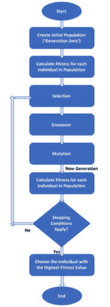

图 2.1：遗传算法的基本流程

这些阶段将在接下来的部分中详细描述。

## 创建初始种群

初始种群是一组有效的候选解（个体），它们是随机选择的。由于遗传算法使用染色体来表示每个个体，初始种群就是一组染色体。这些染色体应该符合我们为当前问题选择的染色体格式——例如，某个长度的二进制字符串。

## 计算适应度

每个个体的适应度函数值都会被计算出来。初始种群会进行一次这样的计算，之后每一代新的个体会在应用选择、交叉和变异的遗传操作符后再进行计算。由于每个个体的适应度与其他个体无关，这一计算可以并行执行。

由于适应度计算后进行的选择阶段通常认为具有更高适应度的个体是更好的解，因此遗传算法天然倾向于寻找适应度函数的最大值。如果我们遇到一个要求最小值的问题，那么适应度计算应该将原始值反向处理——例如，将其乘以(-1)。

## 应用选择、交叉和变异

应用选择、交叉和变异的遗传算子到种群中，能够生成一个新的世代，该世代基于比当前个体更优秀的个体。

+   **选择**算子负责以一种有利于优秀个体的方式，从当前种群中选择个体。选择算子的例子在*选择* *方法*部分中给出。

+   **交叉**（或**重组**）算子通过将选定个体的染色体部分交换，创造出新的后代。通常是每次选择两个个体，并交换它们的部分染色体，生成两个新的染色体，代表后代。选择算子的例子在*交叉* *方法*部分中给出。

+   **变异**算子可以随机地对每个新生成个体的一个或多个染色体值（基因）进行变化。变异通常以非常低的概率发生。变异算子的例子在*变异* *方法*部分中给出。

## 检查停止条件

在判断过程是否可以停止时，可能会有多个条件需要检查。以下是最常用的两种停止条件：

+   达到最大代数。这也有助于限制算法消耗的运行时间和计算资源。

+   在最近几代中没有明显的改进。这可以通过存储每代获得的最佳适应度值，并将当前最佳值与预定义代数之前的最佳值进行比较来实现。如果它们之间的差异小于某个阈值，则算法可以停止。

这里还有一些可能的停止条件：

+   当前最佳个体的表现已经达到了或超过了特定应用场景的要求

+   自过程开始以来已经经过了预定的时间

+   已消耗了某些成本或预算，例如 CPU 时间和/或内存

+   最优解已经占据了超过预设阈值的一部分种群

总结来说，遗传算法的流程从一群随机生成的候选解（个体）开始，这些个体会根据适应度函数进行评估。流程的核心是一个循环，在循环中，遗传算子的选择、交叉和变异会依次应用，然后再对个体进行重新评估。该循环会持续进行，直到遇到停止条件，此时会选择现有种群中最优的个体作为我们的解。现在，让我们来看一下选择方法。

# 选择方法

在遗传算法流程的每个周期开始时使用选择，从当前种群中选择个体作为下一代个体的父母。选择是基于概率的，个体被选中的概率与其适应度值相关联，这样有助于高适应度值的个体获得优势。

下面的章节描述了一些常用的选择方法及其特点。

## 轮盘赌选择

在轮盘赌选择方法中，也称为**适应度比例选择**（**FPS**），选择个体的概率与其适应度值成正比。这类似于在赌场使用轮盘赌的方式，为每个个体分配一个与其适应度值成比例的轮盘部分。当轮盘转动时，每个个体被选中的概率与其所占轮盘部分的大小成正比。

例如，假设我们有一个六个个体的种群，其适应度值如下表所示。基于这些适应度值计算每个个体所占轮盘的相对部分：

| **个体** | **适应度** | **相对部分** |
| --- | --- | --- |
| A | 8 | 7% |
| B | 12 | 11% |
| C | 27 | 24% |
| D | 4 | 3% |
| E | 45 | 40% |
| F | 17 | 15% |

表 2.1：适应度值表

匹配的轮盘图如下所示：

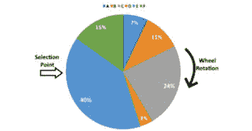

图 2.2：轮盘赌选择示例

每次转动轮盘时，选择点用于从整个种群中选择一个个体。然后再次转动轮盘以选择下一个个体，直到选出足够的个体填充下一代。因此，同一个个体可以被多次选择。

## 随机全局采样

**随机全局采样**（**SUS**）是前述轮盘赌选择的略微修改版本。仍然使用相同的轮盘赌，具有相同的比例，但不同的是，我们只转动一次轮盘并使用多个等间隔的选择点，以一次性选择所有需要的个体，如下图所示：

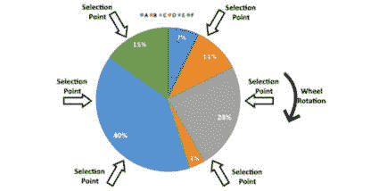

图 2.3：SUS 示例

该选择方法防止具有特别高适应度值的个体在过多次选择中主导下一代。因此，它为较弱的个体提供了被选中的机会，减少了原始轮盘赌选择方法的某种不公平性。

## 基于排名的选择

排名选择方法类似于轮盘赌选择，但它并不是直接使用适应度值来计算每个个体的选择概率，而是仅仅使用适应度值对个体进行排序。一旦排序完成，每个个体就会被分配一个表示其位置的排名，轮盘赌的概率则基于这些排名计算。

例如，假设我们使用之前的六个个体的种群，并且他们的适应度值相同。然后，我们会为每个个体添加一个排名。因为在我们的例子中，种群大小为六，所以排名最高的个体获得排名 6，第二个获得排名 5，依此类推。现在，每个个体在轮盘赌中的相对部分是基于这些排名值计算的，而不是使用适应度值：

| **个体** | **适应度** | **排名** | **相对部分** |
| --- | --- | --- | --- |
| A | 8 | 2 | 9% |
| B | 12 | 3 | 14% |
| C | 27 | 5 | 24% |
| D | 4 | 1 | 5% |
| E | 45 | 6 | 29% |
| F | 17 | 4 | 19% |

表 2.2：基于相对部分的适应度值表

匹配的轮盘赌如以下图所示：

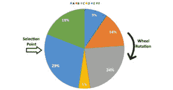

图 2.4：基于排名的选择示例

当少数个体的适应度值远大于其他个体时，排名选择是有用的。使用排名代替原始适应度可以防止这些少数个体在下一代中占据主导地位，因为排名消除了大差异。

另一个有用的情况是当所有个体的适应度值相似时。在这种情况下，排名选择将把它们分开，即使适应度差异很小，也能给更优秀的个体更清晰的优势。

## 适应度缩放

排名选择通过将每个适应度值替换为个体的排名，而适应度缩放则对原始适应度值应用缩放变换，并用变换后的结果替换原始值。该变换将原始适应度值映射到一个期望的范围，如下所示：

*缩放后的适应度 = a × (原始适应度) + b*

在这里，*a* 和 *b* 是我们可以选择的常数，用来实现所期望的缩放适应度范围。

例如，如果我们使用之前示例中的相同值，原始适应度值的范围是从 4（最低适应度值，个体 D）到 45（最高适应度值，个体 E）。假设我们想将这些值映射到一个新的范围，介于 50 和 100 之间。我们可以使用以下方程计算*a*和*b*常数，这代表这两个个体：

+   *50 = a × 4 + b*（最低适应度值）

+   *100 = a × 45 + b*（最高适应度值）

解这个简单的线性方程组将得到以下缩放参数值：

*a = 1.22, b =* *45.12*

这意味着缩放后的适应度值可以通过以下方式计算：

*缩放后的适应度 = 1.22 × (原始适应度) +* *45.12*

在表格中新增一个包含缩放适应度值的列后，我们可以看到适应度值的范围确实在 50 到 100 之间，如预期的那样：

| **个体** | **适应度** | **缩放后的适应度** | **相对比例** |
| --- | --- | --- | --- |
| A | 8 | 55 | 13% |
| B | 12 | 60 | 15% |
| C | 27 | 78 | 19% |
| D | 4 | 50 | 12% |
| E | 45 | 100 | 25% |
| F | 17 | 66 | 16% |

匹配的轮盘在以下图示中展示：

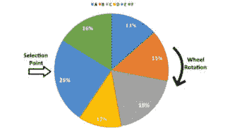

图 2.5：适应度缩放后轮盘选择示例

如*图 2.5*所示，将适应度值缩放到新的范围后，相比原始的分割，轮盘的分割更为温和。最佳个体（缩放适应度值为 100）现在仅有原最差个体（缩放适应度值为 50）的两倍机会被选择，而不是在使用原始适应度值时有超过 11 倍的选择概率。

## 锦标赛选择

在每轮锦标赛选择方法中，会从种群中随机挑选两个或更多个体，拥有最高适应度分数的个体获胜并被选中。

例如，假设我们有相同的六个个体，并使用与之前示例中相同的适应度值。以下图示展示了随机选择其中三个个体（A、B 和 F），然后宣布 F 为赢家，因为在这三者中，它的适应度值（17）是最大的：

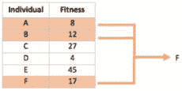

图 2.6：锦标赛规模为三的锦标赛选择示例

每轮锦标赛选择中参与的个体数量（在我们的示例中为三人）通常被称为**锦标赛规模**。锦标赛规模越大，最佳个体参与锦标赛的机会越高，低分个体赢得锦标赛并被选中的机会越小。

这种选择方法的一个有趣方面是，只要我们能够比较任意两个个体并确定哪个个体更优秀，就不需要实际的适应度函数值。接下来，我们将讨论交叉方法。

# 交叉方法

交叉算子，也称为重组，类似于生物学中性繁殖过程中发生的交叉，用于将两个个体的遗传信息结合起来，作为父母产生（通常是两个）后代。

交叉算子通常以某个（较高的）概率值应用。每当交叉*不*被应用时，两个父代个体将直接克隆到下一代中。

以下部分描述了一些常用的交叉方法及其典型应用场景。然而，在某些情况下，你可能会选择使用特定问题的交叉方法，这样会更适合特定的案例。

## 单点交叉

在单点交叉方法中，随机选择父母染色体上的某个位置，称为**交叉点**或**切割点**。交叉点右侧的基因在两个父母染色体之间交换。因此，我们得到两个后代，每个后代都携带来自两个父母的一些遗传信息。

以下图示演示了在一对二进制染色体上进行单点交叉操作，交叉点位于第五和第六基因之间：

图 2.7：单点交叉示例

来源：[`commons.wikimedia.org/wiki/File:Computational.science.Genetic.algorithm.Crossover.One.Point.svg`](https://commons.wikimedia.org/wiki/File:Computational.science.Genetic.algorithm.Crossover.One.Point.svg)。

图片由 Yearofthedragon 提供。

在下一节中，我们将介绍这种方法的扩展，即两点交叉和 k 点交叉。

## 两点交叉和 k 点交叉

在两点交叉方法中，随机选择父母染色体上的两个交叉点。在这两个交叉点之间的基因将在两个父母染色体之间交换。

以下图示演示了在一对二进制染色体上进行两点交叉操作，第一次交叉点位于第三和第四基因之间，第二次交叉点位于第七和第八基因之间：

图 2.8：两点交叉示例

来源：[`commons.wikimedia.org/wiki/File:Computational.science.Genetic.algorithm.Crossover.Two.Point.svg`](https://commons.wikimedia.org/wiki/File:Computational.science.Genetic.algorithm.Crossover.Two.Point.svg)。

图片由 Yearofthedragon 提供。

两点交叉方法可以通过执行两个单点交叉来实现，每次使用不同的交叉点。此方法的推广是 k 点交叉，其中*k*表示正整数，使用*k*个交叉点。

## 均匀交叉

在均匀交叉方法中，每个基因通过随机选择一个父母的基因来独立决定。当随机分布为 50%时，每个父母对后代的影响机会相同，具体如以下图所示：

图 2.9：均匀交叉示例

请注意，在这个示例中，第二个后代是通过补充第一个后代的选择而生成的。然而，两个后代也可以彼此独立地创建。

重要说明

在这个示例中，我们使用了基于整数的染色体，但如果使用二进制染色体也会类似。

由于这种方法不会交换整个染色体的片段，因此它在产生后代时具有更大的多样性潜力。

## 有序列表的交叉

在前面的例子中，我们看到对两个基于整数的染色体进行交叉操作的结果。虽然每个父代的基因值在 0 到 9 之间各自出现一次，但每个后代的基因值中某些出现了多次（例如，顶部的后代中有 2，另一个后代中有 1），而其他基因值则缺失（例如，顶部的后代缺少 4，另一个后代缺少 5）。

然而，在某些任务中，基于整数的染色体可能表示有序列表的索引。例如，假设我们有几个城市，我们知道每两个城市之间的距离，需要找出穿越所有城市的最短路径。这就是旅行商问题，在接下来的章节中将详细讲解。

举例来说，如果我们有四个城市，一个方便的方法是用四个整数表示这个问题的可能解，显示访问这些城市的顺序——例如，（1,2,3,4）或（3,4,2,1）。如果一个染色体中有两个相同的值或缺失其中一个值，比如（1,2,2,4），则不能表示一个有效的解。

对于这种情况，设计了替代的交叉方法，以确保产生的后代仍然有效。其中一种方法，**有序交叉**（**OX1**），将在接下来的章节中进行介绍。

### OX1

OX1 方法力图尽可能保持父代基因的相对顺序。我们将通过使用长度为六的染色体来展示这一方法。

在这个例子中，我们使用了基于整数的染色体，但对于二进制染色体，操作也类似。

第一步是进行一个带有随机切点的两点交叉，如下图所示（父代基因在左侧表示）：

图 2.10：OX1 示例 – 第 1 步

接下来，我们将开始按照原始顺序遍历每个父代基因，从第二个切点后开始填充每个后代的基因。对于第一个父代，我们发现了一个*6*，但这个基因已经存在于后代中，因此继续（循环回绕）到*1*；这个基因也已经存在。接下来是*2*，由于*2*还没有出现在后代中，我们将它添加进去，如下图所示。对于第二个父代-后代配对，我们从父代的*5*开始，这个基因已经存在于后代中，然后移动到*4*，这个基因也存在，最后是*2*，它还没有出现，因此被添加到后代中。这一点在下图中也有展示：

图 2.11：OX1 示例 – 第 2 步

对于上面的父代，我们接着处理*3*（已在后代中），然后是*4*，这个基因被添加到后代中。对于另一个父代，下一个基因是*6*。由于它在匹配的后代中尚不存在，因此被添加到后代中。结果如下面的图所示：

图 2.12: OX1 示例 – 步骤 3

我们继续类似地处理下一些尚未出现在后代中的基因，并填补最后可用的位置，如下图所示：

图 2.13: OX1 示例 – 步骤 4

如下图所示，这完成了生成两个有效后代染色体的过程：

图 2.14: OX1 示例 – 步骤 5

实现交叉操作的方法有很多种，其中一些将在本书后面讨论。然而，得益于遗传算法的多样性，你总是可以提出自己的方法。在下一节，我们将讨论突变方法。

# 突变方法

突变是创造新一代过程中应用的最后一个遗传算子。突变算子应用于通过选择和交叉操作产生的后代。

突变算子是基于概率的，通常以（非常）低的概率发生，因为它有可能损害应用于任何个体的表现。在某些版本的遗传算法中，突变概率会随着代数的推进逐渐增加，以防止停滞并确保种群的多样性。另一方面，如果突变率过高，遗传算法将变成相当于随机搜索的算法。

以下几节将介绍一些常用的突变方法及其典型应用场景。不过，记住你始终可以选择使用自己认为更适合特定用例的、针对问题的突变方法。

## 翻转位突变

在对二进制染色体应用翻转位突变时，随机选择一个基因并翻转（取反）它的值，如下图所示：

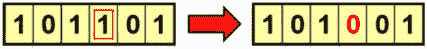

图 2.15: 翻转位突变示例

这可以扩展为多个随机基因的翻转，而不仅仅是一个。

## 交换突变

在对二进制或基于整数的染色体应用交换突变时，随机选择两个基因并交换它们的值，如下图所示：

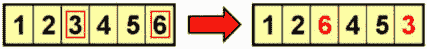

图 2.16: 交换突变示例

这种突变操作适用于有序列表的染色体，因为新染色体仍然携带与原染色体相同的基因。

## 反转突变

在对二进制或基于整数的染色体应用反转突变时，随机选择一组基因并反转该序列中的基因顺序，如下图所示：

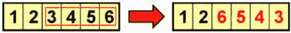

图 2.17: 反转突变示例

与交换变异类似，反转变异操作适用于有序列表的染色体。

## 交换变异

另一种适用于有序列表染色体的变异操作是交换变异。当应用时，会随机选择一段基因序列，并打乱该序列中基因的顺序（或交换），如下所示：

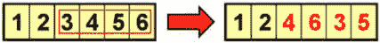

图 2.18：交换变异示例

在下一节中，我们将讨论一些为实数编码遗传算法创建的其他专门操作符。

# 实数编码遗传算法

到目前为止，我们已经看到表示二进制或整数参数的染色体。因此，遗传操作符适合用于这些类型的染色体。然而，我们经常遇到解空间是连续的问题。换句话说，个体由实数（浮动点数）构成。

历史上，遗传算法使用二进制字符串表示整数和实数；然而，这并不理想。使用二进制字符串表示实数的精度受到字符串长度（位数）的限制。由于我们需要预先确定这个长度，可能会出现二进制字符串过短，导致精度不足，或者过长的情况。

此外，当使用二进制字符串表示数字时，每个位的意义因其位置而异——最重要的位在最左边。这可能导致与模式相关的失衡——即在染色体中出现的模式。例如，模式 1****（表示所有以 1 开头的五位二进制字符串）和模式****1（表示所有以 1 结尾的五位二进制字符串）都有一个顺序 1 和定义长度 0；然而，第一个模式比第二个模式更具意义。

替代使用二进制字符串，实值数字的数组被发现是更简单且更好的方法。例如，如果我们有一个涉及三个实值参数的问题，染色体看起来像 *[x1, x2, x3]*，其中 *x1*、*x2* 和 *x3* 表示实数，如[1.23, 7.2134, -25.309] 或 [-30.10, 100.2, 42.424]。

本章前面提到的各种选择方法对于实数编码的染色体同样适用，因为它们只依赖个体的适应度，而与表示方式无关。

然而，至今为止我们所讨论的交叉和变异方法不适合实数编码的染色体，因此需要使用专门的方法。一个重要的要点是，这些交叉和变异操作是分别应用于构成实数编码染色体的每个维度的数组。例如，如果[1.23, 7.213, -25.39]和[-30.10, 100.2, 42.42]是已选择用于交叉操作的父代，那么交叉操作将分别应用于以下对：

+   1.23 和-30.10（第一维度）

+   7.213 和 100.2（第二维度）

+   -25.39 和 42.42（第三维度）

这在下图中进行了说明：

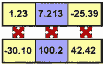

图 2.19：实数编码染色体交叉示例

同样，当变异算子应用于实数编码染色体时，它将分别作用于每一维度。

接下来的章节将描述几种实数编码交叉和变异方法。稍后，在 *第六章* *优化连续函数* 中，我们将看到这些方法的实际应用。

## 混合交叉

在**混合交叉**（**BLX**）方法中，每个后代从由父代创建的以下区间中随机选择：

[父代 1 − α（父代 2 − 父代 1），父代 2 + α（父代 2 − 父代 1）]

参数α是一个常数，其值介于 0 和 1 之间。随着α值的增大，区间会变得更宽。

例如，如果父代的值分别为 1.33 和 5.72，则情况如下：

+   α值为 0 时，将生成区间[1.33, 5.72]（类似于父代之间的区间）

+   α值为 0.5 时，将生成区间[-0.865, 7.915]（是父代之间区间的两倍宽）

+   α值为 1.0 时，将生成区间[-3.06, 10.11]（比父代之间的区间宽三倍）

这些示例在下图中进行了说明，父代标记为*p1*和*p2*，交叉区间为黄色：

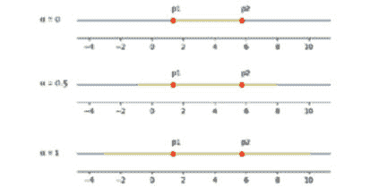

图 2.20：混合交叉示例

使用此交叉方法时，α值通常设置为 0.5。

## 模拟二进制交叉

**模拟二进制交叉**（**SBX**）的思想是模仿常用于二进制编码染色体的单点交叉的特性。其中一个特性是父代值的平均值等于后代值的平均值。

在应用 SBX 时，两个后代是通过以下公式由两个父代生成的：

后代 1 =  1_2 [(1 + β) 父代 1 + (1 − β) 父代 2]

后代 2 =  1_2 [(1 − β) 父代 1 + (1 + β) 父代 2]

这里，β是一个称为扩展因子的随机数。此公式有以下显著特性：

+   两个后代的平均值等于父代的平均值，无论β值如何

+   当β值为 1 时，后代与父代相同

+   当β值小于 1 时，后代比父代更接近彼此

+   当β值大于 1 时，后代比父代之间的距离更远

例如，如果父代的值分别为 1.33 和 5.72，则情况如下：

+   β值为 0.8 时，后代将为 1.769 和 5.281

+   β值为 1.0 时，后代将为 1.33 和 5.72

+   β值为 1.2 时，后代将为 0.891 和 6.159

这些案例在下图中有所展示，其中父代标记为*p1*和*p2*，后代标记为*o1*和*o2*：

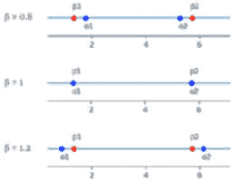

图 2.21：模拟二进制交叉示例

在前述的每种情况中，两个后代的平均值为 3.525，等于两个父代的平均值。

我们还希望保持二进制单点交叉的另一个特性，即后代与父母之间的相似性。这意味着β值的随机分布。β的概率应该在接近 1 的值附近更高，在这些值下，后代与父母相似。为了实现这一点，β值通过另一个随机值 u 计算，u 在区间[0, 1]上均匀分布。一旦选定*u*的值，β值的计算公式如下：

如果*u* ≤ 0.5，得到以下结果：β = (2u) 1 _ 1−η

否则，我们得到如下结果：β = [ 1 _ 2(1 − u)] 1 _ 1−η

## 实变异

在实值编码遗传算法中应用变异的一种选择是用一个全新的、随机生成的实值替换任何实值。然而，这可能会导致变异后的个体与原始个体没有任何关系。

另一种方法是生成一个随机实数，位于原个体的附近。这种方法的一个例子是**正态分布**（或**高斯**）**变异**：使用均值为零、标准差为预定值的正态分布生成一个随机数，如下图所示：

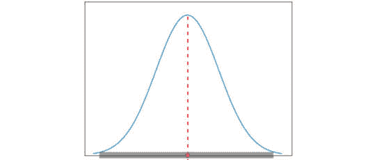

图 2.21：高斯变异分布示例

在接下来的两节中，我们将介绍几个高级话题，即**精英策略**和**生态位分化**。

# 理解精英策略

尽管遗传算法种群的平均适应度通常随着代数的增加而提高，但在任何时候，当前代最优秀的个体可能会丢失。这是因为选择、交叉和变异操作会在创建下一代的过程中改变个体。在许多情况下，这种丧失是暂时的，因为这些个体（或更优秀的个体）将在未来的代中重新引入种群。

然而，如果我们想确保最优秀的个体始终能够进入下一代，可以采用可选的精英策略。这意味着前* n *个个体（*n*是一个小的预定参数）会在我们通过选择、交叉和变异创造后代之前，复制到下一代。被复制的精英个体仍然有资格参与选择过程，因此它们仍然可以作为新个体的父母。

精英主义有时可以对算法的性能产生显著的积极影响，因为它避免了在遗传流中重新发现丢失的优秀解所需的潜在时间浪费。

增强遗传算法结果的另一种有趣方法是使用生态位化，下一节将对此进行描述。

# 生态位化与共享

在自然界中，所有环境进一步划分为多个子环境或生态位，由各种物种组成，这些物种利用各自生态位中的独特资源，如食物和栖息地。例如，森林环境由树顶、灌木丛、森林地面、树根等组成；这些不同部分分别适应不同物种，这些物种专门适应在各自的生态位中生活，并利用该生态位中的资源。

当多个不同物种在同一个生态位中共存时，它们会争夺相同的资源，从而形成一种倾向，即寻找新的、未被占据的生态位并进行填充。

在遗传算法的领域中，这种生态位化现象可以用于维持种群的多样性，并找到多个最优解，每个最优解被视为一个生态位。

例如，假设我们的遗传算法旨在最大化一个具有多个不同高度峰值的适应度函数，如下图所示：

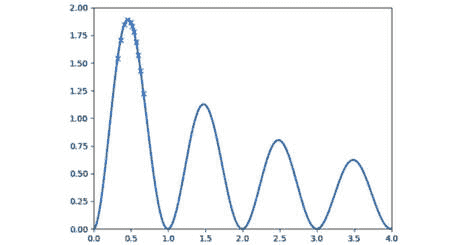

图 2.22：没有生态位化的预期遗传算法结果

随着遗传算法趋向于找到全局最大值，我们预计，经过一段时间后，种群的大部分个体会集中在最高峰值附近。这一点在前面的图中通过函数图上的 × 标记表示，这些标记代表当前代中的个体。

然而，也有一些实现方式，除了寻找全局最大值之外，我们还希望找到其他一些（或所有）峰值。为了实现这一点，我们可以将每个峰值视为一个生态位，提供与其高度成比例的资源。然后，我们找到一种方法，将这些资源在占据这些生态位的个体之间共享（或分配）。理想情况下，这将推动种群按比例分布，最高的峰值吸引最多的个体，因为它提供了最多的奖励，而其他峰值则随着奖励的减少而被越来越少的个体占据。

这种理想情况在以下图中有所描述：

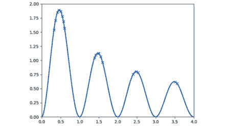

图 2.23：带有生态位化的理想遗传算法结果

现在的挑战是实现这种共享机制。一种实现共享的方式是将每个个体的原始适应度值与（某个函数）所有其他个体的综合距离进行除法。另一种选择是将每个个体的原始适应度值除以其周围一定半径内的其他个体数量。

## 串行生态位与并行生态位

不幸的是，如前所述，细分概念可能难以实现，因为它增加了适应度计算的复杂性。在实践中，它还要求种群大小是原始种群大小与预期峰值数量的乘积（通常是未知的）。

克服这些问题的一种方法是一次找到一个峰值（串行细分），而不是尝试同时找到所有峰值（并行细分）。为了实现串行细分，我们像往常一样使用遗传算法，找到最佳解。然后，我们更新适应度函数，将找到的最大点区域进行平滑处理，并重复遗传算法的过程。

理想情况下，我们现在将找到下一个最佳峰值，因为原始峰值不再存在。我们可以迭代地重复这个过程，在每次迭代中找到下一个最佳峰值。

# 使用遗传算法解决问题的艺术

遗传算法为我们提供了一个强大而多用途的工具，可以用来解决各种各样的问题和任务。当我们着手处理一个新问题时，我们需要定制这个工具并使其与问题相匹配。这是通过做出几个选择来实现的，如下文所述。

首先，我们需要确定**适应度函数**。这是评估每个个体的标准，其中较大的值代表更优秀的个体。该函数不必是数学函数。它可以通过算法、调用外部服务，甚至是游戏结果来表示，举几个例子。我们只需要一种方法，能够程序化地获取任何给定方案（个体）的适应度值。

接下来，我们需要选择一个合适的**染色体编码**。这基于我们传递给适应度函数的参数。到目前为止，我们见过二进制、整数、有序列表和实数编码的示例。然而，对于一些问题，我们可能需要混合参数类型，甚至决定创建我们自己的自定义染色体编码。

接下来，我们需要选择一个**选择**方法。大多数选择方法适用于任何类型的染色体。如果适应度函数无法直接访问，但我们仍然能够判断多个候选解中哪个是最好的，我们可以考虑使用锦标赛选择方法。

正如我们在前面的章节中看到的，**交叉**和**变异**算子的选择将与个体的染色体编码相关联。二进制编码的染色体与适合实数编码问题的染色体交叉和变异方案会有所不同。与染色体编码的选择类似，在这里，你也可以为交叉和变异设计适合你独特用例的方法。

最后，还有算法的超参数。我们需要设置的最常见参数值如下：

+   种群大小

+   交叉率

+   变异率

+   最大代数

+   其他停止条件

+   优胜劣汰（是否使用；大小）

对于这些参数，我们可以选择我们认为合理的值，然后进行调整，类似于在几乎所有其他优化和学习算法中处理超参数的方式。

如果做出所有这些选择看起来是个压倒性的任务，不用担心！在接下来的章节中，我们将一次又一次地重复这一选择过程，以应对我们将要解决的各种类型的问题。读完本书后，你将能够面对新的问题并做出明智的选择。

# 总结

在本章中，你被介绍了遗传算法的基本流程。然后我们回顾了该流程的关键组成部分，包括创建种群、计算适应度函数、应用遗传操作符，以及检查停止条件。

接下来，我们讨论了各种选择方法，包括轮盘赌选择、SUS、基于排名的选择、适应度缩放和锦标赛选择，并演示了它们之间的差异。

我们接着回顾了几种交叉方法，包括单点交叉、双点交叉和 k 点交叉，以及 OX1 交叉和部分匹配交叉。

然后，你被介绍了几种变异方法，包括翻转位变异，接着是交换、逆转和扰动变异。

接下来介绍了实数编码遗传算法，以及它们的专用染色体编码和自定义的交叉和变异遗传操作符。

随后介绍了遗传算法中的精英主义、分群和共享等概念。

在本章的最后部分，你被介绍了在使用遗传算法解决问题时需要做出的各种选择，这一过程将在全书中一次次重复。

在下一章，真正的乐趣开始了——用 Python 编程！你将被介绍到 DEAP，一个进化计算框架，可以作为应用遗传算法解决广泛任务的强大工具。在本书的其余部分，我们将使用 DEAP 来开发 Python 程序，解决许多不同的挑战。

# 进一步阅读

欲了解更多信息，请参考*第八章*，*遗传算法*，出自 Prateek Joshi 所著《Python 人工智能》，2017 年 1 月出版，详见[`subscription.packtpub.com/book/big_data_and_business_intelligence/9781786464392/8`](https://subscription.packtpub.com/book/big_data_and_business_intelligence/9781786464392/8)。
