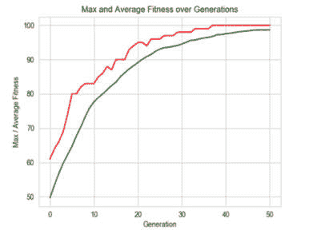

# 第三章：使用 DEAP 框架

在本章中——如前所述——真正有趣的部分开始了！你将了解**Python 中的分布式进化算法**（**DEAP**）——一个强大且灵活的进化计算框架，能够通过遗传算法解决实际问题。经过简要介绍后，你将熟悉其中的两个主要模块——创建器和工具箱——并学习如何创建遗传算法流程所需的各个组件。接下来，我们将编写一个 Python 程序，使用 DEAP 框架解决 OneMax 问题——遗传算法的“Hello World”。然后是一个简化版本的相同程序，我们将利用该框架的内置算法。最后一部分是本章最精彩的部分，我们将尝试调整我们创建的遗传算法的各种设置，并发现这些修改的效果。

本章结束时，你将能够做到以下几点：

+   表达你对 DEAP 框架及其遗传算法模块的熟悉程度

+   理解 DEAP 框架中创建器和工具箱模块的概念

+   将一个简单问题转化为遗传算法表示

+   使用 DEAP 框架创建一个遗传算法解决方案

+   理解如何使用 DEAP 框架的内置算法编写简洁的代码

+   使用 DEAP 框架编写的遗传算法解决 OneMax 问题

+   尝试遗传算法的各种设置，并解读结果中的差异

# 技术要求

以下是本章的技术要求。

重要提示：

有关技术要求的最新信息，请参考 README 文件：[`github.com/PacktPublishing/Hands-On-Genetic-Algorithms-with-Python-Second-Edition/blob/main/README.md`](https://github.com/PacktPublishing/Hands-On-Genetic-Algorithms-with-Python-Second-Edition/blob/main/README.md)

## Python 版本

本书将使用 Python 3，版本 3.11 或更新版本。可以从 Python 软件基金会的官方网站下载 Python：[`www.python.org/downloads/`](https://www.python.org/downloads/)。更多有用的安装说明可以在这里找到：[`realpython.com/installing-python/`](https://realpython.com/installing-python/)。

## 使用虚拟环境

在进行基于 Python 的项目时，使用虚拟环境通常是一个好习惯，因为它可以将项目的依赖与其他 Python 项目以及系统现有的设置和依赖隔离开来。

创建虚拟环境的常用方法之一是使用**venv**，详细说明见：[`docs.python.org/3/library/venv.html`](https://docs.python.org/3/library/venv.html)。

另一种流行的 Python 环境和软件包管理方式是使用 **conda**，详细介绍见此处：[`conda.io/projects/conda/en/latest/user-guide/tasks/manage-environments.html`](https://conda.io/projects/conda/en/latest/user-guide/tasks/manage-environments.html)。

重要提示

使用虚拟环境时，确保在安装所需库之前先**激活**虚拟环境，如以下部分所述。

## 安装必要的库

本书将使用 DEAP 库以及其他各种 Python 软件包。有几种方法可以安装这些依赖项，具体方法在以下小节中列出。

### 使用 `requirements.txt`

无论你是否选择使用虚拟环境，都可以使用我们提供的 `requirements.txt` 文件，一次性安装所有必需的依赖项。该文件包含本书中将使用的所有软件包，并可在本书的 GitHub 仓库中找到，链接：[`github.com/PacktPublishing/Hands-On-Genetic-Algorithms-with-Python-Second-Edition/blob/main/requirements.txt`](https://github.com/PacktPublishing/Hands-On-Genetic-Algorithms-with-Python-Second-Edition/blob/main/requirements.txt)。

通常，`requirements.txt` 文件与 `pip` 工具一起使用，可以通过以下命令进行安装：

```py
pip install -r /path/to/requirements.txt
```

### 安装单个软件包

如果你更喜欢在阅读本书的过程中逐个安装所需的软件包，每章的技术要求部分会提到该章节中将使用的特定软件包。

首先，我们需要安装 DEAP 库。推荐的安装 DEAP 方法是使用 `easy_install` 或 `pip`，如下所示：

```py
pip install deap
```

欲了解更多信息，请查看 DEAP 文档：[`deap.readthedocs.io/en/master/installation.html`](https://deap.readthedocs.io/en/master/installation.html)。

如果你更倾向于通过 Conda 安装 DEAP，请参阅以下链接：[`anaconda.org/conda-forge/deap`](https://anaconda.org/conda-forge/deap)。

此外，本章需要以下软件包：

+   **NumPy**: [`www.numpy.org/`](https://www.numpy.org/)

+   **Matplotlib**: [`matplotlib.org/`](https://matplotlib.org/)

+   **Seaborn**: [`seaborn.pydata.org/`](https://seaborn.pydata.org/)

我们现在准备好使用 DEAP。框架中最有用的工具和实用程序将在接下来的两部分中介绍。但首先，我们将了解 DEAP，并理解为什么我们选择这个框架来处理遗传算法。

本章中将使用的程序可以在本书的 GitHub 仓库中找到，链接：[`github.com/PacktPublishing/Hands-On-Genetic-Algorithms-with-Python-Second-Edition/tree/main/chapter_03`](https://github.com/PacktPublishing/Hands-On-Genetic-Algorithms-with-Python-Second-Edition/tree/main/chapter_03)。

查看以下视频，了解代码的实际应用：[`packt.link/OEBOd`](https://packt.link/OEBOd)。

# DEAP 介绍

正如我们在前面的章节中所看到的，遗传算法和遗传流的基本思想相对简单，许多遗传操作符也是如此。因此，从零开始开发一个程序来实现遗传算法以解决特定问题是完全可行的。

然而，正如在开发软件时常见的那样，使用经过验证的专用库或框架可以让我们的工作变得更加轻松。它帮助我们更快地创建解决方案并减少错误，并且为我们提供了许多现成的选择（以及可以实验的选项），无需重新发明轮子。

已经创建了许多用于遗传算法的 Python 框架——如 PyGAD、GAFT、Pyevolve 和 PyGMO，仅举几例。经过对多个选项的研究，我们选择使用 DEAP 框架，因为它易于使用，功能丰富，且具有良好的扩展性和大量文档支持。

DEAP 是一个 Python 框架，支持使用遗传算法以及其他进化计算技术快速开发解决方案。DEAP 提供了各种数据结构和工具，这些工具在实现基于遗传算法的多种解决方案时至关重要。

DEAP 自 2009 年起在加拿大拉瓦尔大学开发，并且采用 GNU **Lesser General Public** **License** (**LGPL**) 许可证。

DEAP 的源代码可在 [`github.com/DEAP/deap`](https://github.com/DEAP/deap) 上找到，文档可在 [`deap.readthedocs.io/en/master/`](https://deap.readthedocs.io/en/master/) 查看。

# 使用 creator 模块

DEAP 框架提供的第一个强大工具是 `creator` 模块。`creator` 模块用作元工厂，允许我们通过增加新属性来扩展现有的类。

例如，假设我们有一个名为 `Employee` 的类。通过 `creator` 工具，我们可以通过创建一个 `Developer` 类来扩展 `Employee` 类，如下所示：

```py
from deap import creator
creator.create("Developer", Employee,\
                position="Developer", \
                programmingLanguages=set)
```

`create()` 函数的第一个参数是新类的期望名称。第二个参数是要扩展的现有基类。然后，每个额外的参数定义了新类的一个属性。如果参数被分配了一个数据结构（例如 `dict` 或 `set`），它将作为实例属性添加到新类中，并在构造函数中进行初始化。如果参数是一个简单类型，如字面量，它将作为类属性添加，并且在该类的所有实例之间共享。

因此，创建的 `Developer` 类将扩展 `Employee` 类，并且将拥有一个类属性 `position`，其值为 `Developer`，以及一个实例属性 `programmingLanguages`，其类型为 `set`，并在构造函数中进行初始化。因此，实际上，新类等同于以下代码：

```py
class Developer(Employee):
    position = "Developer"
    def __init__(self):
        self.programmingLanguages = set()
```

重要说明

1. 这个新类存在于**creator**模块中，因此需要引用为**creator.Developer**。

2. 扩展**numpy.ndarray**类是一个特殊情况，稍后将在本书中讨论。

在使用 DEAP 时，`creator`模块通常用于创建`Fitness`类和`Individual`类，以供遗传算法使用，正如我们接下来将看到的。

## 创建 Fitness 类

在使用 DEAP 时，适应度值被封装在一个`Fitness`类中。DEAP 允许将适应度合并为多个组件（也称为目标），每个组件都有自己的权重。这些权重的组合定义了适应度在给定问题中的行为或策略。

### 定义适应度策略

为了帮助定义这个策略，DEAP 提供了抽象的`base.Fitness`类，该类包含一个`weights`元组。这个元组需要被赋值，以定义策略并使类可用。这可以通过使用`creator`扩展基础的`Fitness`类来实现，方式类似于我们之前为`Developer`类所做的：

```py
creator.create("creator.FitnessMax class that extends the base.Fitness class, with the weights class attribute initialized to a value of (1.0,).
Important note
Note the trailing comma in the **weights** definition when a single weight is defined. The comma is required because **weights** is a **tuple**.
The strategy of this `FitnessMax` class is to *maximize* the fitness values of the single-objective solutions throughout the genetic algorithm. Conversely, if we have a single-objective problem where we need to find a solution that *minimizes* the fitness value, we can use the following definition to create the appropriate minimizing strategy:

```

creator.create("FitnessMin", base.Fitness, weights=(-1.0,))

```py

 We can also define a class with a strategy for optimizing more than one objective, and with varying degrees of importance:

```

creator.create("FitnessCompound", base.Fitness,

creator.FitnessCompound 类，它将使用三个不同的适应度组件。第一个将赋予权重 1.0，第二个赋予 0.2，第三个赋予-0.5。这个适应度策略将倾向于最大化第一个和第二个组件（或目标），并最小化第三个。从重要性来看，第一个组件最重要，其次是第三个组件，最后是第二个组件。

存储适应度值

当`weights`元组定义了适应度策略时，一个匹配的元组，称为`values`，用于包含`base.Fitness`类中的实际适应度值。这些值通过一个单独定义的函数获取，通常称为`evaluate()`，将在本章后续部分介绍。与`weights`元组类似，`values`元组包含每个适应度组件（目标）的一个值。

第三个元组`wvalues`包含通过将`values`元组的每个组件与其对应的`weights`元组组件相乘而得到的加权值。每当设置一个实例的适应度值时，加权值会被计算并插入到`wvalues`中。这些值在内部用于个体之间的比较操作。

权重适应度值可以使用以下运算符按字典顺序进行比较：

```py
>, <, >=, <=, ==, !=
```

一旦创建了`Fitness`类，我们可以在定义`Individual`类时使用它，如下一小节所示。

创建 Individual 类

`creator`工具在 DEAP 中的第二个常见用途是定义构成遗传算法种群的个体。正如我们在前几章所看到的，遗传算法中的个体是通过一个染色体表示的，可以通过遗传操作符进行操作。在 DEAP 中，`Individual`类是通过扩展一个表示染色体的基类来创建的。此外，DEAP 中的每个实例都需要将其适应度函数作为一个属性。

为了满足这两个要求，我们可以利用`creator`创建`creator.Individual`类，如下例所示：

```py
creator.create("Individual", list, \
                fitness=creator.FitnessMax)
```

这一行提供了以下两个效果：

+   创建的**Individual**类扩展了 Python 的**list**类。这意味着使用的染色体是**list**类型的。

+   这个**Individual**类的每个实例都会有一个叫做**fitness**的属性，属于我们之前创建的**FitnessMax**类。

我们将在下一节中学习如何使用`Toolbox`类。

使用 Toolbox 类

DEAP 框架提供的第二种机制是`base.Toolbox`类。`Toolbox`用作函数（或操作符）的容器，使我们能够通过别名和自定义现有函数来创建新操作符。

例如，假设我们有一个函数`sumOfTwo()`，其定义如下：

```py
def sumOfTwo(a, b):
    return a + b
```

使用`toolbox`，我们现在可以创建一个新的操作符`incrementByFive()`，它

自定义`sumOfTwo()`函数，如下所示：

```py
from deap import base
toolbox= base.Toolbox()
toolbox.register("register() toolbox function is the desired name (or alias) for the new operator. The second argument is the existing function to be customized. Then, each additional (optional) argument is automatically passed to the customized function whenever we call the new operator. For example, look at this definition:

```

toolbox.incrementByFive(10)

```py

 Calling the preceding function is equivalent to calling this:

```

sumOfTwo(10, 5)

```py

 This is because the `b` argument has been fixed to a value of `5` by the definition of the `incrementByFive` operator.
Creating genetic operators
In many cases, the `Toolbox` class is used to customize existing functions from the `tools` module. The `tools` module contains numerous handy functions related to the genetic operations of *selection*, *crossover*, and *mutation*, as well as initialization utilities.
For example, the following code defines three aliases that will be later used as genetic operators:

```

from deap import tools

toolbox.register("select",tools.selTournament,tournsize=3)

toolbox.register("mate", tools.cxTwoPoint)

toolbox.register("mutate", tools.mutFlipBit, indpb=0.02)

```py

 The three aliases are defined as follows:

*   **select** is registered as an alias to the existing **tools** function, **selTournament()**, with the **tournsize** argument set to **3**. This creates a **toolbox.select** operator that performs *tournament selection* with a tournament size of 3.
*   **mate** is registered as an alias to the existing **tools** function, **cxTwoPoint()**. This results in a **toolbox.mate** operator that performs *two-point crossover*.
*   **mutate** is registered as an alias to the existing **tools** function, **mutFlipBit**, with the **indpb** argument set to **0.02**, providing a **toolbox.mutate** operator that performs *flip-bit mutation* with 0.02 as the probability for each attribute to be flipped.

The `tools` module provides implementations of various genetic operators, including several of the ones we mentioned in the previous chapter.
`selection.py` file. Some of them are as follows:

*   **selRoulette()** implements **roulette** **wheel selection**
*   **selStochasticUniversalSampling()** implements **Stochastic Universal** **Sampling** (**SUS**)
*   **selTournament()** implements **tournament selection**

`crossover.py` file:

*   **cxOnePoint()** implements **single-point crossover**
*   **cxUniform()** implements **uniform crossover**
*   **cxOrdered()** implements **ordered** **crossover** (**OX1**)
*   **cxPartialyMatched()** implements **partially matched** **crossover** (**PMX**)

A couple of the `mutation.py` file are as follows:

*   **mutFlipBit()** implements **flip-bit mutation**
*   **mutGaussian()** implements **normally** **distributed mutation**

Creating the population
The `init.py` file of the `tools` module contains several functions that can be useful for creating and initializing the population for the genetic algorithm. One particularly useful function is `initRepeat()`, which accepts three arguments:

*   The container type in which we would like to put the resulting objects
*   The function that’s used to generate objects that will be put into the container
*   The number of objects we want to generate

For example, the following line of code will produce a list of 30 random numbers between 0 and 1:

```

randomList = tools.initRepeat(list 是作为容器填充的类型，random.random 是生成器函数，30 是我们调用函数生成值并填充容器的次数。

如果我们想用整数随机数填充列表，而这些随机数*要么*是 0，要么是 1，我们可以创建一个函数，利用`random.randint()`生成一个 0 或 1 的单个随机值，然后将其作为`initRepeat()`的生成器函数，如下代码片段所示：

```py
def zeroOrOne():
    return random.randint(0, 1)
randomList = tools.initRepeat(list, toolbox, as follows:

```

toolbox.register("zeroOrOne", random.randint, 0, 1)

randomList = tools.initRepeat(list, zeroOrOne()函数，我们创建了 zeroOrOne 操作符（或别名），它调用 random.randint()并使用固定参数 0 和 1。

计算适应度

如前所述，尽管`Fitness`类定义了决定其策略的适应度*权重*（如*最大化*或*最小化*），实际的适应度值是通过一个单独定义的函数获得的。这个适应度计算函数通常会使用`evaluate`别名注册到`toolbox`模块，如下代码片段所示：

```py
def someFitnessCalculationFunction(individual):
    return _some_calculation_of_the_fitness
toolbox.register("evaluate",someFitnessCalculationFunction() calculates the fitness for any given individual, while evaluate is registered as its alias.
We are finally ready to put our knowledge to use and solve our first problem using a genetic algorithm written with DEAP. We’ll do this in the next section.
The OneMax problem
The OneMax (or One-Max) problem is a simple optimization task that is often used as the *Hello World* of genetic algorithm frameworks. We will use this problem for the rest of this chapter to demonstrate how DEAP can be used to implement a genetic algorithm.
The OneMax task is to find the binary string of a given length that maximizes the sum of its digits. For example, the OneMax problem of length 5 will consider candidates such as the following:

*   10010 (sum of digits = 2)
*   01110 (sum of digits = 3)
*   11111 (sum of digits = 5)

Obviously (to us), the solution to this problem is always the string that comprises all 1s. However, the genetic algorithm does not have this knowledge and needs to blindly look for the solution using its genetic operators. If the algorithm does its job, it will find this solution, or at least one close to it, within a reasonable amount of time.
The DEAP framework’s documentation uses the OneMax problem as its introductory example ([`github.com/DEAP/deap/blob/master/examples/ga/onemax.py`](https://github.com/DEAP/deap/blob/master/examples/ga/onemax.py)). In the following sections, we will describe our version of DEAP’s OneMax example.
Solving the OneMax problem with DEAP
In the previous chapter, we mentioned several choices that need to be made when solving a problem using the genetic algorithm approach. As we tackle the OneMax problem, we will make these choices in a series of steps. In the chapters to follow, we will keep using the same series of steps as we apply the genetic algorithms approach to various types of problems.
Choosing the chromosome
Since the OneMax problem deals with binary strings, the choice of chromosome is easy – each individual will be represented with a binary string that directly represents a candidate solution. In the actual Python implementation, this will be implemented as a list containing integer values of either 0 or 1\. The length of the chromosome matches the size of the OneMax problem. For example, for a OneMax problem of size 5, the 10010 individual will be represented by `[1, 0, 0,` `1, 0]`.
Calculating the fitness
Since we want to find the individual with the largest sum of digits, we are going to use the `FitnessMax` strategy. As each individual is represented by a list of integer values of either 0 or 1, the fitness value will be directly calculated as the sum of the elements in the list – for example, `sum([1, 0, 0, 1, 0]) =` `2`.
Choosing the genetic operators
Now, we need to decide on the genetic operators to be used – *selection*, *crossover*, and *mutation*. In the previous chapter, we examined several different types of each of these operators. Choosing these genetic operators is not an exact science, and we can usually experiment with several choices. But while selection operators can typically work with any chromosome type, the crossover and mutation operators we choose need to match the chromosome type we use; otherwise, they could produce invalid chromosomes.
For the selection operator, we can start with *tournament* selection because it is simple and efficient. Later, we can experiment with other selection strategies, such as *roulette wheel* selection and *SUS*.
For the *crossover* operator, either the *single-point* or *two-point* crossover operator will be suitable as the result of crossing over two binary strings using these methods will produce a valid binary string.
The *mutation* operator can be the simple *flip-bit* mutation, which works well for binary strings.
Setting the stopping condition
It is always a good idea to put a limit on the number of generations to guarantee that the algorithm doesn’t run forever. This gives us one stopping condition.
In addition, since we happen to know the best solution for the OneMax problem – a binary string with all 1s, and a fitness value equal to the length of the individual – we can use that as a second stopping condition.
Important note
For a real-world problem, we typically don’t have this kind of knowledge in advance.
If either of these conditions is met – that is, the number of generations reaches the limit *or* the best solution is found – the genetic algorithm will stop.
Implementing with DEAP
Putting it all together, we can finally start coding our solution to the OneMax problem using the DEAP framework.
The complete program containing the code snippets shown in this section can be found here: [`github.com/PacktPublishing/Hands-On-Genetic-Algorithms-with-Python-Second-Edition/blob/main/chapter_03/01_OneMax_long.py`](https://github.com/PacktPublishing/Hands-On-Genetic-Algorithms-with-Python-Second-Edition/blob/main/chapter_03/01_OneMax_long.py).
Setting up
Before we start the actual genetic algorithm flow, we need to set things up. The DEAP framework has quite a distinct way of doing this, as shown in the rest of this section:

1.  We start by importing the essential modules of the DEAP framework, followed by a couple of useful utilities:

    ```

    from deap import base

    from deap import creator

    from deap import tools

    import random

    import matplotlib.pyplot as plt

    ```py

     2.  Next, we must declare a few constants that set the parameters for the problem and control the behavior of the genetic algorithm:

    ```

    # 问题常量：

    ONE_MAX_LENGTH = 100   # 位字符串的长度

    # 优化

    # 遗传算法常数：

    POPULATION_SIZE = 200 # 种群个体数量

    # 种群

    P_CROSSOVER = 0.9     # 交叉概率

    P_MUTATION = 0.1      # 突变概率

    # 一个个体

    MAX_GENERATIONS = 50  # 最大代数

    # 停止条件

    ```py

     3.  One important aspect of the genetic algorithm is the use of probability, which introduces a random element to the behavior of the algorithm. However, when experimenting with the code, we may want to be able to run the same experiment several times and get repeatable results. To accomplish this, we must set the random **seed** function to a constant number of some value, as shown in the following code snippet:

    ```

    RANDOM_SEED = 42

    random.seed(RANDOM_SEED)

    ```py

Tip
At some point, you may decide to remove these lines of code, so separate runs could produce somewhat different results.

1.  As we saw earlier in this chapter, the **Toolbox** class is one of the main utilities provided by the DEAP framework, enabling us to register new functions (or operators) that customize existing functions using pre-set arguments. Here, we’ll use it to create the **zeroOrOne** operator, which customizes the **random.randomint(a, b)** function. This function normally returns a random integer, **N**, such that **a ≤ N ≤ b**. By fixing the two arguments, **a** and **b**, to the values **0** and **1**, the **zeroOrOne** operator will randomly return either **0** or **1** when it’s called later in the code. The following code snippet defines the **toolbox** variable, and then uses it to register the **zeroOrOne** operator:

    ```

    toolbox = base.Toolbox()

    toolbox.register("zeroOrOne", random.randint, 0, 1)

    ```py

     2.  Next, we need to create the **Fitness** class. Since we only have one objective here – the sum of digits – and our goal is to maximize it, we’ll choose the **FitnessMax** strategy and use a **weights** tuple with a single positive weight, as shown in the following code snippet:

    ```

    creator.create("FitnessMax", base.Fitness, \

    weights=1.0,))

    ```py

     3.  in DEAP, the convention is to use a class called **Individual** to represent each of the population’s individuals. This class is created with the help of the **creator** tool. In our case, **list** serves as the base class, which is used as the individual’s chromosome. The class is augmented with the **fitness** attribute, initialized to the **FitnessMax** class that we defined earlier:

    ```

    creator.create("Individual", list, \

    fitness=creator.FitnessMax)

    ```py

     4.  Next, we must register the `zeroOrOne` operator are integers with random values of `0` or `1`, the resulting `individualCreator` operator will fill an `Individual` instance with 100 randomly generated values of `0` or `1`:

    ```

    toolbox.register("individualCreator",\

    tools.initRepeat,\

    creator.Individual,\

    toolbox.zeroOrOne, ONE_MAX_LENGTH)

    ```py

     5.  Lastly, we must register the `initRepeat` – the number of objects we want to generate – is not given here. This means that when using the `populationCreator` operator, this argument will be expected and used to determine the number of individuals that are created – in other words, the population size:

    ```

    toolbox.register("populationCreator", \

    tools.initRepeat, \

    list, toolbox.individualCreator)

    ```py

     6.  To facilitate the fitness calculation (or **evaluation**, in DEAP terminology), we must define a standalone function that accepts an instance of the **Individual** class and returns the fitness for it. Here, we defined a function named **oneMaxFitness** that computes the number of 1s in the individual. Since the individual is essentially a list with values of either **1** or **0**, the Python **sum()** function can be used for this purpose:

    ```

    def oneMaxFitness(individual):

    return sum(individual), # 返回一个元组

    ```py

Tip
As mentioned previously, fitness values in DEAP are represented as tuples, and therefore a comma needs to follow when a single value is returned.

1.  Next, we must define the evaluate operator as an alias to the **oneMaxfitness()** function we defined earlier. As you will see later, using the **evaluate** alias to calculate the fitness is a DEAP convention:

    ```

    toolbox.register("tools module and setting the argument values as needed. Here, we chose the following:*   锦标赛选择，锦标赛大小为 3*   单点交叉*   翻转位突变请注意`mutFlipBit`函数的`indpb`参数。该函数会遍历个体的所有属性——在我们的情况下是包含 1 和 0 的列表——每个属性会使用该参数值作为翻转（应用`not`操作符）该属性值的概率。该值独立于突变概率，突变概率由我们之前定义的`P_MUTATION`常量设置，但尚未使用。突变概率用于决定是否对种群中的个体调用`mutFlipBit`函数：

    ```py
    toolbox.register("select",tools.selTournament,\
                      tournsize=3)
    toolbox.register("mate", tools.cxOnePoint)
    toolbox.register("mutate", tools.mutFlipBit,\
                      indpb=1.0/ONE_MAX_LENGTH)
    ```

    ```py

We are finally done with our settings and definitions. Now, we’re ready to start the genetic flow, as described in the next section.
Evolving the solution
The genetic flow is implemented in the `main()` function, as described in the following steps:

1.  We start the flow by creating the initial population using the **populationCreator** operator we defined earlier, and then using the **POPULATION_SIZE** constant as the argument for this operator. The **generationCounter** variable, which will be used later, is initialized here as well:

    ```

    population = toolbox.populationCreator(n=POPULATION_SIZE)

    generationCounter = 0

    ```py

     2.  To calculate the fitness for each individual in the initial population, we can use the Python **map()** function to apply the **evaluate** operator to each item in the population. As the **evaluate** operator is an alias for the **oneMaxFitness()** function, the resulting **iterable** consists of the calculated fitness tuple of each individual. It is then converted into a **list** type of tuples:

    ```

    fitnessValues = list(map(toolbox.evaluate,\

    population))

    ```py

     3.  Since the items of **fitnessValues** match those in the population (which is a list of individuals), we can use the **zip()** function to combine them and assign the matching fitness tuple to each individual:

    ```

    for individual, fitnessValue in zip(population, fitnessValues):

    individual.fitness.values = fitnessValue

    ```py

     4.  Next, since we have single-objective fitness, we must extract the first value out of each fitness to gather statistics:

    ```

    fitnessValues = [

    individual.fitness.values[0] for individual in population

    ]

    ```py

     5.  The statistics that are collected will be the max fitness value and the mean (average) fitness value for each generation. Two lists will be used for this purpose. Let’s create them:

    ```

    maxFitnessValues = []

    meanFitnessValues = []

    ```py

     6.  We are finally ready for the main loop of the genetic flow. At the top of the loop, we have the stopping conditions. As we decided earlier, one stopping condition will be set by putting a limit on the number of generations, and the other will be set by detecting that we have reached the best solution (a binary string containing all 1s):

    ```

    while max(fitnessValues) < ONE_MAX_LENGTH and \

    generationCounter < MAX_GENERATIONS:

    ```py

     7.  The generation counter is updated next. It is used by the stopping condition, as well as the **print** statements we will see soon:

    ```

    generationCounter = generationCounter + 1

    ```py

     8.  At the heart of the genetic algorithm are the *genetic operators*, which are applied next. The first is the *selection* operator, which can be applied using the **toolbox.select** operator we defined as the *tournament selection* earlier. Since we already set the tournament size when the operator was defined, we only need to send the population and its length as arguments now:

    ```

    offspring = toolbox.select(population, len(population))

    ```py

     9.  The selected individuals, now residing in a list called **offspring**, must be cloned so that we can apply the next genetic operators without affecting the original population:

    ```

    offspring = list(map(toolbox.clone, offspring))

    ```py

Important note
Despite the name **offspring**, these are still clones of individuals from the previous generation, and we still need to mate them using the **crossover** operator to create the actual offspring.

1.  The next genetic operator is **crossover**. It was defined as the **toolbox.mate** operator earlier, and is aliasing a single-point crossover. We use Python extended slices to pair every even-indexed item of the **offspring** list with the one following it. Then, we utilize the **random()** function to flip a coin using the *crossover probability* set by the **P_CROSSOVER** constant. This will decide if the pair of individuals will be crossed over or remain intact. Lastly, we delete the fitness values of the children since they have been modified and their existing fitness values are no longer valid:

    ```

    for child1, child2 in zip(offspring[::2], offspring[1::2]):

    if random.random() < P_CROSSOVER:

    toolbox.mate(child1, child2)

    del child1.fitness.values

    del child2.fitness.values

    ```py

Important note
The **mate** function takes two individuals as arguments and modifies them in place, meaning they don’t need to be reassigned.

1.  The final genetic operator to be applied is the *mutation*, which we registered earlier as the **toolbox.mutate** operator, and was set to be a *flip-bit* mutation operation. Iterating over all **offspring** items, the mutation operator will be applied at the probability set by the mutation probability constant, **P_MUTATION**. If the individual gets mutated, we must delete its fitness value (if it exists). This value could have carried over with the individual from the previous generation, and after mutation, it is no longer correct and needs to be recalculated:

    ```

    for mutant in offspring:

    if random.random() < P_MUTATION:

    toolbox.mutate(mutant)

    del mutant.fitness.values

    ```py

     2.  Individuals that were not crossed over or mutated remained intact, and therefore their existing fitness values, which were already calculated in a previous generation, don’t need to be calculated again. The rest of the individuals will have this value empty. Now, we must find those fresh individuals using the **Fitness** class’ **valid** property, then calculate the new fitness for them similarly to how to did the original calculation for fitness values:

    ```

    freshIndividuals = [

    ind for ind in offspring if not ind.fitness.valid]

    freshFitnessValues = list(map(toolbox.evaluate,

    freshIndividuals))

    for individual, fitnessValue in zip(freshIndividuals,

    freshFitnessValues

    ):

    individual.fitness.values = fitnessValue

    ```py

     3.  Now that the genetic operators are done, it is time to replace the old population with the new one:

    ```

    population[:] = offspring

    ```py

     4.  Before we continue to the next round, the current fitness values are collected to allow for statistical gathering. Since the fitness value is a (single element) tuple, we need to select the **[****0]** index:

    ```

    fitnessValues = [ind.fitness.values[0] for ind in population]

    ```py

     5.  The max and mean fitness values are then found, at which point their values get appended to the statistics accumulators and a summary line is printed out:

    ```

    maxFitness = max(fitnessValues)

    meanFitness = sum(fitnessValues) / len(population)

    maxFitnessValues.append(maxFitness)

    meanFitnessValues.append(meanFitness)

    print(f"- 代数 {generationCounter}:

    最大适应度 = {maxFitness}, \

    平均适应度 = {meanFitness}")

    ```py

     6.  In addition, we must locate the index of the (first) best individual using the max fitness value we just found and print this individual out:

    ```

    best_index = fitnessValues.index(max(fitnessValues))

    print("最佳个体 = ", *population[best_index], "\n")

    ```py

     7.  Once a stopping condition is activated and the genetic algorithm flow concludes, we can use the statistics accumulators to plot a couple of graphs using the **matplotlib** library. We can use the following code snippet to draw a graph illustrating the progress of the best and average fitness values throughout the generations:

    ```

    plt.plot(maxFitnessValues, color='red')

    plt.plot(meanFitnessValues, color='green')

    plt.xlabel('代数')

    plt.ylabel('最大/平均适应度')

    plt.title('代数中的最大与平均适应度')

    plt.show()

    ```py

We are finally ready to test our first genetic algorithm – let’s run it to find out if it finds the OneMax solution.
Running the program
When running the program described in the previous sections, we get the following output:

```

- 代数 1: 最大适应度 = 65.0, 平均适应度 = 53.575

最佳个体 = 1 1 0 1 0 1 0 0 1 0 0 0 1 1 1 0 1 0 0 1 0 1 0 0 0 1 1 1 1 1 0 1 1 1 1 0 1 0 1 1 1 1 0 0 1 1 111101111101111111000 0 1 0 1 0 1 1 1 0 1 1 0 0 0 1 1 1 0011111111111100

...

- 代数 40: 最大适应度 = 100.0, 平均适应度 = 98.29

最佳个体 = 1 1 1 1 1 1 1 1 1 1 1 1 1 1 1 1 1 1 1 1 1 1 1 1 1 1 1 1 1 1 1 1 1 1 1 1 1 1 1 1 1 1 1 1 1 1 111111111111111111111 1 1 1 1 1 1 1 1 1 1 1 1 1 1 1 1 1 1111111111111111

```py

 As you can see, after 40 generations, an *all-1* solution was found, which yielded a fitness of 100 and stopped the genetic flow. The *average fitness*, which started at a value of around 53, ended at a value close to 100.
The graph that’s plotted by `matplotlib` is shown here:


Figure 3.1: Stats of the program solving the OneMax problem
This plot illustrates how max fitness (the red line) increases over generations with incremental leaps, while the average fitness (the green line) keeps progressing smoothly.
Now that we’ve solved the OneMax problem using the DEAP framework, let’s move on to the next section and find out how we can make our code more concise.
Using built-in algorithms
The DEAP framework comes with several built-in evolutionary algorithms provided by the `algorithms` module. One of them, `eaSimple`, implements the genetic algorithm flow we have been using, and can replace most of the code we had in the main method. Other useful DEAP objects, `Statistics` and `Logbook`, can be used for statistics gathering and printing, as we will soon see.
The program described in this section implements the same solution to the OneMax problem as the program discussed in the previous section but with less code. The only differences can be found in the `main` method. We will describe these differences in the following code snippets.
The complete program can be found here: [`github.com/PacktPublishing/Hands-On-Genetic-Algorithms-with-Python-Second-Edition/blob/main/chapter_03/02_OneMax_short.py`](https://github.com/PacktPublishing/Hands-On-Genetic-Algorithms-with-Python-Second-Edition/blob/main/chapter_03/02_OneMax_short.py).
The Statistics object
The first change we will make is in the way statistics are being gathered. To this end, we will now take advantage of the `tools.Statistics` class provided by DEAP. This utility enables us to create a `statistics` object using a key argument, which is a function that will be applied to the data on which the statistics are computed:

1.  Since the data we plan to provide is the population of each generation, we’ll set the key function to one that extracts the fitness value(s) from each individual:

    ```

    stats = tools.Statistics(lambda ind: ind.fitness.values)

    ```py

     2.  We can now register various functions that can be applied to these values at each step. In our example, we only use the **max** and **mean** NumPy functions, but others (such as **min** and **std**) can be registered as well:

    ```

    stats.register("max", numpy.max)

    stats.register("avg", numpy.mean)

    ```py

As we will see soon, the collected statistics will be returned in an object called `logbook` at the end of the run.
The algorithm
Now, it’s time for the actual flow. This is done with a single call to the `algorithms.eaSimple` method, one of the built-in evolutionary algorithms provided by the `algorithms` module of DEAP. When we call the method, we provide it with `population`, `toolbox`, and the `statistics` object, among other parameters:

```

种群，日志 = 算法.eaSimple(种群, 工具箱,

cxpb=P_CROSSOVER,

mutpb=P_MUTATION,

ngen=MAX_GENERATIONS,

stats=stats,

verbose=True)

```py

 The `algorithms.eaSimple` method assumes that we previously used `toolbox` to register the following operators – `evaluate`, `select`, `mate`, and `mutate` – something we did when we created the original program. The stopping condition here is set by the value of `ngen`, which specifies the number of generations to run the algorithm for.
The logbook
When the flow is done, the algorithm returns two objects – the final population and a `logbook` object containing the statistics that were collected. We can now extract the desired statistics from the logbook using the `select()` method so that we can use them for plotting, as we did previously:

```

maxFitnessValues, meanFitnessValues = logbook.select("max", "avg")

```py

 We are now ready to run this slimmer version of the program.
Running the program
When running the program with the same parameter values and settings that we used previously, the printouts will be as follows:

```

代数   评估次数  最大    平均

0     200     61     49.695

1     193     65     53.575

...

39    192     99     98.04

40    173     100    98.29

...

49    187     100    99.83

50    184     100    99.89

```py

 These printouts are automatically generated by the `algorithms.eaSimple` method, according to the way we defined the `statistics` object sent to it, as the `verbose` argument was set to `True`.
The results are numerically similar to what we saw in the previous program, with two differences:

*   There is a printout for generation 0; this was not included in the previous program.
*   The genetic flow here continues to the 50th generation as this was the only stopping condition. In the previous program, there was an additional stopping condition that stopped the flow at the 40th generation since the best solution (that we happened to know beforehand) was reached.

We can observe the same behavior in the new graph plot. This graph is similar to the one we saw before but it continues to the 50th generation, even though the best result was already reached at the 40th generation:


Figure 3.2: Stats of the program solving the OneMax problem using the built-in algorithm
Consequently, starting at the 40th generation, the value of the best fitness (the red line) no longer changes, while the average fitness (the green line) keeps climbing until it almost reaches the same max value. This means that by the end of this run, nearly all individuals are identical to the best one.
Adding the hall of fame feature
One additional feature of the built-in `algorithms.eaSimple` method is the `tools` module, the `HallOfFame` class can be used to retain the best individuals that ever existed in the population during the evolution, even if they have been lost at some point due to selection, crossover, or mutation. The hall of fame is continuously sorted so that the first element is the first individual that has the best fitness value ever seen.
The complete program containing the code snippets shown in this section can be found here: [`github.com/PacktPublishing/Hands-On-Genetic-Algorithms-with-Python-Second-Edition/blob/main/chapter_03/03_OneMax_short_hof.py`](https://github.com/PacktPublishing/Hands-On-Genetic-Algorithms-with-Python-Second-Edition/blob/main/chapter_03/03_OneMax_short_hof.py).
To add the hall of fame functionality, let’s make a few modifications to the previous program:

1.  We start by defining a constant for the number of individuals we want to keep in the hall of fame. We will add this line to the constant definition section:

    ```

    HALL_OF_FAME_SIZE = 10

    ```py

     2.  Just before calling the **eaSimple** algorithm, we’ll create the **HallOfFame** object with that size:

    ```

    hof = tools.HallOfFame(HALL_OF_FAME_SIZE)

    ```py

     3.  The **HallOfFame** object is sent as an argument to the **eaSimple** algorithm, which internally updates it during the run of the genetic algorithm flow:

    ```

    种群，日志 = 算法.eaSimple(\

    种群，工具箱，cxpb=P_CROSSOVER, \

    mutpb=P_MUTATION, ngen=MAX_GENERATIONS, \

    stats=stats, halloffame=hof, verbose=True)

    ```py

     4.  When the algorithm is done, we can use the **HallOfFame** object’s **items** attribute to access the list of individuals who were inducted into the hall of fame:

    ```

    print("名人堂个体 = ", *hof.items, sep="\n")

    print("最佳历史个体 = ", hof.items[0])

    ```py

    The printed results look as follows – the best individual consists of all 1s, followed by various individuals that have a 0 value in various locations:

    ```

    名人堂个体 =

    [1, 1, 1, 1, 1, 1, 1, 1, 1, 1, 1, 1, 1, 1, 1, 1, 1, 1, 1, 1, 1, 1, 1, 1, 1,1, 1, 1, 1, 1, 1, 1, 1, 1, 1, 1, 1, 1, 1, 1, 1, 1, 1, 1, 1, 1, 1, 1, 1,1, 1, 1, 1, 1, 1, 1, 1, 1, 1, 1, 1, 1, 1, 1, 1, 1, 1, 1, 1, 1, 1, 1, 1, 1, 1, 1, 1, 1, 1, 1, 1, 1, 1, 1, 1, 1, 1, 1, 1, 1, 1, 1, 1, 1, 1, 1, 1, 1, 1, 1, 1, 1]  [1, 1, 1, 1, 1, 1, 1, 1, 1, 1, 1, 1, 1, 1, 1, 0, 1, 1, 1, 1, 1, 1, 1, 1, 1, 1, 1, 1, 1, 1, 1, 1, 1, 1, 1, 1, 1, 1, 1, 1, 1, 1, 1, 1, 1, 1, 1, 1, 1, 1, 1, 1, 1, 1, 1, 1, 1, 1, 1, 1, 1, 1, 1, 1, 1, 1, 1, 1, 1, 1, 1, 1, 1, 1, 1, 1, 1, 1, 1, 1, 1, 1, 1, 1, 1, 1, 1, 1, 1, 1, 1, 1, 1, 1, 1, 1, 1, 1, 1, 1]

    ...

    ```py

     5.  The best individual is the same one that was printed first previously:

    ```

    最佳个体 = [1, 1, 1, 1, ..., 0, ..., 1]

    ```py

     6.  From now on, we will use these features – the **statistics** object and **logbook**, the built-in **eaSimple** algorithm, and **HallOfFame** – in all the programs we create.

Now that we’ve learned how to use the inbuilt algorithms, we’ll experiment with them to find their differences and find the best algorithm for various uses.
Experimenting with the algorithm’s settings
We can now experiment with the various settings and definitions we placed into the program and observe any changes in their behavior and results.
In each of the following subsections, we’ll start from the original program settings and make one or more changes. You are encouraged to experiment with making your own modifications, as well as combining several modifications to be made to the same program.
Bear in mind that the effects of changes we make may be specific to the problem at hand – a simple *OneMax*, in our case – and may be different for other types of problems.
Population size and number of generations
We will start our experimentation by making modifications to the **population size** and the number of generations used by the genetic algorithm:

1.  The size of the population is determined by the **POPULATION_SIZE** constant. We will start by increasing the value of this constant from 200 to 400:

    ```

    POPULATION_SIZE = 400

    ```py

    This modification accelerates the genetic flow. The best solution is now found after 22 generations, as shown in the following figure:


Figure 3.3: Stats of the program solving the OneMax problem after increasing the population size to 400

1.  Next, we will try reducing the population size to 100:

    ```

    POPULATION_SIZE = 100

    ```py

     2.  This modification slows down the convergence of the algorithm, which will no longer reach the best possible value after 50 generations:


Figure 3.4: Stats of the program solving the OneMax problem after decreasing the population size to 100

1.  To compensate, let’s try increasing the value of **MAX_GENERATIONS** to 80:

    ```

    MAX_GENERATIONS = 80

    ```py

     2.  We find that the best solution is now reached after 68 generations:


Figure 3.5: Stats of the program solving the OneMax problem after increasing the number of generations to 80
This behavior is typical of genetic-algorithm-based solutions – increasing the population will require fewer generations to reach a solution. However, the computational and memory requirements increase with the population size, and we typically aspire to find a moderate population size that will provide a solution within a reasonable amount of time.
Crossover operator
Let’s reset our changes and go back to the original settings (50 generations, population size 200). We are now ready to experiment with the **crossover** operator, which is responsible for creating offspring from parent individuals.
Changing the crossover type from a `mate` operator as follows:

```

工具箱.register("配对", tools.cxTwoPoint)

```py

 The algorithm now finds the best solution after only 27 generations:


Figure 3.6: Stats of the program solving the OneMax problem after switching to a two-point crossover
This behavior is typical of genetic algorithms that utilize binary string representation as two-point crossover provides a more versatile way to combine two parents and mix their genes in comparison to the single-point crossover.
Mutation operator
We will now reset our changes again as we get ready to experiment with the **mutation** operator, which is responsible for introducing random modifications to offspring:

1.  We will start by increasing the value of the **P_MUTATION** constant to **0.9**. This results in the following plot:



Figure 3.7: Stats of the program solving the OneMax problem after increasing the mutation probability to 0.9
The results may seem surprising at first as increasing the mutation rate typically causes the algorithm to behave erratically, while here, the effect is seemingly unnoticeable. However, recall that there is another mutation-related parameter in our algorithm, `indpb`, which is an argument of the specific mutation operator we used here – `mutFlipBit`:

```

工具箱.register("变异", tools.mutFlipBit, \

P_MUTATION 决定个体变异的概率，indpb 决定给定个体中每位的翻转概率。在我们的程序中，我们将 indpb 的值设置为 1.0/ONE_MAX_LENGTH，这意味着在变异解中平均会翻转一位。对于我们的 100 位 OneMax 问题，这似乎限制了变异的效果，无论 P_MUTATION 常数值如何。

1.  现在，让我们将**indpb**的值增加十倍，如下所示：

    ```py
    toolbox.register("mutate", tools.mutFlipBit, \
        indpb=10.0/ONE_MAX_LENGTH)
    ```

    使用此值运行算法的结果有些不稳定，如下图所示：


图 3.8：在每位变异概率增加十倍后程序的统计数据

图表显示，尽管一开始算法可以改善结果，但很快陷入振荡状态，无法取得显著改进。

1.  进一步增加**indpb**值至**50.0/ONE_MAX_LENGTH**，得到如下不稳定的图表：


图 3.9：在每位变异概率增加五十倍后程序的统计数据

正如这张图所示，遗传算法已经变成了等效于随机搜索的过程 – 它可能偶然发现最佳解，但没有向更好的解决方案前进。

选择操作符

接下来，我们将查看**selection**操作符。首先，我们将改变锦标赛规模以观察该参数与变异概率的综合效果。然后，我们将考虑使用*轮盘*选择而不是*锦标赛*选择。

锦标赛规模及其与变异概率的关系

再次，我们将从程序的原始设置开始，进行新的修改和实验之前：

1.  首先，我们将修改锦标赛选择算法的**tournamentSize**参数，并将其改为**2**（而不是原来的**3**）：

    ```py
    toolbox.register("select", tools.selTournament, tournsize=2)
    ```

    这似乎对算法的行为没有明显影响：


图 3.10：在将锦标赛规模减少至 2 后程序解决 OneMax 问题的统计数据

1.  如果我们将锦标赛规模增加到一个非常大的值，比如**100**，会发生什么？

1.  让我们看看：

    ```py
    toolbox.register("select", tools.selTournament, tournsize=100)
    ```

    该算法仍然表现良好，并在不到 40 代中找到了最佳解。一个显著的效果是最大适应度现在与平均适应度非常接近，如下图所示：


图 3.11：在将锦标赛规模增加至 100 后程序的统计数据

这种行为发生的原因是，当锦标赛规模增大时，弱个体被选中的机会减少，较好的解法倾向于占据整个种群。在实际问题中，这种占据可能导致次优解充斥种群，从而阻止最佳解的出现（这种现象称为**过早收敛**）。然而，在简单的 OneMax 问题中，这似乎不是问题。一个可能的解释是，突变操作符提供了足够的多样性，确保解法朝着正确的方向前进。

1.  为了验证这个解释，我们将突变概率降低十倍，设为**0.01**：

    ```py
    P_MUTATION = 0.01
    ```

    如果我们再次运行算法，我们会看到结果在算法开始后很快停止改善，然后以更慢的速度改进，偶尔会有一些提升。整体结果比上一次运行差得多，因为最佳适应度大约是 80，而不是 100：


图 3.12：程序统计，锦标赛规模为 100，突变概率为 0.01

这一解释是，由于锦标赛规模较大，初始种群中的最佳个体在少数几代内就占据了主导地位，这在图表的初期迅速增长中得到了体现。之后，只有偶尔出现正确方向的突变——即将 0 翻转为 1——才能产生更好的个体；这一点在图表中通过红线的跃升表示。很快，这个个体又会占据整个种群，绿线会追赶上红线。

1.  为了使这种情况更加极端，我们可以进一步降低突变率：

    ```py
    P_MUTATION = 0.001
    ```

    我们现在可以看到相同的一般行为，但由于突变非常罕见，改进也很少且间隔较长：


图 3.13：程序统计，锦标赛规模为 100，突变概率为 0.001

1.  现在，如果我们将代数增加到 500 代，我们可以更清楚地看到这种行为：


图 3.14：程序统计，锦标赛规模为 100，突变概率为 0.001，经过 500 代

1.  出于好奇，我们将锦标赛规模再次调整为**3**，并将代数恢复为**50**代，同时保持较小的突变率：

    ```py
    MAX_GENERATIONS = 50
    toolbox.register("select", tools.selTournament, tournsize=3)
    ```

    最终的图表与原始图表更为接近：


图 3.15：程序在使用锦标赛规模为 3 和突变概率为 0.001 的情况下，在 50 代中的统计数据

在这里，似乎也发生了接管现象，但发生得较晚，大约是在第 30 代左右，当时最好的适应度已经接近 100 的最大值。在这种情况下，使用更合理的突变率将帮助我们找到最佳解决方案，就像在原始设置中发生的那样。

轮盘赌选择

让我们再一次回到原始设置，准备进行最后的实验，因为我们将尝试用**轮盘赌选择**替换锦标赛选择算法，这在*第二章*中有描述，*理解遗传算法的关键组件*。操作步骤如下：

```py
toolbox.register("select", tools.selRoulette)
```

这一变化似乎对算法的结果造成了负面影响。正如下面的图所示，在多个时刻，由于选择过程的影响，最佳解决方案被遗忘，并且最大适应度值至少在短期内下降，尽管平均适应度值仍在上升。这是因为轮盘赌选择算法以与适应度成比例的概率选择个体；当个体之间的差异较小的时候，较弱个体被选中的机会更大，这与我们之前使用的锦标赛选择方法不同：


图 3.16：使用轮盘赌选择的程序统计数据

为了弥补这种行为，我们可以使用在*第二章*中提到的**精英主义方法**，*理解遗传算法的关键组件*。该方法允许当前世代中最优秀的个体直接转移到下一代，并且保持不变，从而避免它们的丧失。在下一章中，我们将探讨在使用 DEAP 库时应用精英主义方法。

小结

在本章中，您介绍了 `creator` 和 `toolbox` 模块，以及如何使用它们来创建遗传算法流程所需的各种组件。接着，我们使用 DEAP 编写了两个版本的 Python 程序来解决 *OneMax* 问题，第一个版本是完整实现遗传算法流程，第二个版本则更简洁，利用了框架中内置的算法。第三个版本引入了 DEAP 提供的 HOF 特性。然后，我们通过不同的遗传算法设置进行实验，发现了改变种群大小、以及修改 *选择*、*交叉* 和 *突变* 运算符的效果。

在下一章中，基于本章的内容，我们将开始解决实际的组合优化问题，包括*旅行商问题*和*车辆路径规划问题*，并使用基于 DEAP 的 Python 程序来实现。

进一步阅读

如需更多信息，请参考以下资源：

+   DEAP 文档：[`deap.readthedocs.io/en/master/`](https://deap.readthedocs.io/en/master/)

+   DEAP 源代码在 GitHub 上：[`github.com/DEAP/deap`](https://github.com/DEAP/deap)

```py

```

```py

```

```py

```

```py

```
