# 第四章：组合优化

在本章中，你将学习如何在组合优化应用中利用遗传算法。我们将首先描述搜索问题和组合优化，并概述几个组合优化问题的实际操作示例。接下来，我们将分析这些问题，并通过使用 DEAP 框架的 Python 解决方案进行匹配。我们将涉及的优化问题包括著名的背包问题、**旅行商问题**（**TSP**）和**车辆调度问题**（**VRP**）。此外，我们还将讲解基因型到表型的映射以及探索与开发的主题。

到本章结束时，你将能够完成以下任务：

+   理解搜索问题和组合优化的性质

+   使用 DEAP 框架编写的遗传算法解决背包问题

+   使用 DEAP 框架编写的遗传算法解决旅行商问题（TSP）

+   使用 DEAP 框架编写的遗传算法解决车辆调度问题（VRP）

+   理解基因型到表型的映射

+   熟悉探索与开发的概念，并了解它与精英主义的关系

# 技术要求

在本章中，我们将使用 Python 3，并辅以以下支持库：

+   **deap**

+   **numpy**

+   **matplotlib**

+   **seaborn**

重要提示

如果你使用提供的**requirements.txt**文件（见*第三章*），这些库将已经安装在你的环境中。

此外，我们还将使用来自*Rosetta Code*（[`rosettacode.org/wiki/Rosetta_Code`](https://rosettacode.org/wiki/Rosetta_Code)）和*TSPLIB*（[`comopt.ifi.uni-heidelberg.de/software/TSPLIB95/`](http://comopt.ifi.uni-heidelberg.de/software/TSPLIB95/)）网页的基准数据。

本章将使用的程序可以在本书的 GitHub 仓库中找到：[`github.com/PacktPublishing/Hands-On-Genetic-Algorithms-with-Python-Second-Edition/tree/main/chapter_04`](https://github.com/PacktPublishing/Hands-On-Genetic-Algorithms-with-Python-Second-Edition/tree/main/chapter_04)。查看以下视频，观看代码演示：[`packt.link/OEBOd`](https://packt.link/OEBOd)

# 搜索问题和组合优化

遗传算法应用的一个常见领域是*搜索问题*，这些问题在物流、运营、人工智能和机器学习等领域具有重要应用。示例包括确定包裹投递的最佳路线、设计基于枢纽的航空网络、管理投资组合，以及将乘客分配给出租车车队中的可用司机。

搜索算法侧重于通过有序评估 **状态** 和 **状态转移** 来解决问题，目的是找到从初始状态到期望的最终（或“目标”）状态的路径。通常，每个状态转移都会涉及一个 **成本** 或 **收益**，相应的搜索算法目标是找到一条最小化成本或最大化收益的路径。由于最优路径只是众多可能路径中的一种，这类搜索与 *组合优化* 相关，组合优化涉及从一个有限但通常极为庞大的可能对象集合中找到最优解。

这些概念将在我们熟悉 *背包问题* 时得到说明，背包问题是下一节的主要内容。

# 解决背包问题

想象一个熟悉的场景——为一次长途旅行打包。你有许多想带上的物品，但受限于行李箱的容量。在你心中，每个物品都有一个它会给旅行带来的特定价值；同时，它也有与之相关的大小（和重量），并且它会与其他物品争夺行李箱中的有限空间。这种情况就是 *背包问题* 的一种现实生活中的例子，背包问题被认为是最古老、最被研究的组合搜索问题之一。

更正式地说，背包问题由以下几个部分组成：

+   一组 **物品**，每个物品都有一个特定的 **价值** 和 **重量**

+   一个具有特定 **重量容量** 的 **包/袋/容器**（“背包”）

我们的目标是选出一组物品，使得它们的总价值最大，同时不超过背包的总重量容量。

在搜索算法的背景下，每个物品的子集代表一个状态，所有可能的物品子集的集合被称为状态空间。对于一个具有 *n* 个物品的背包 0-1 问题，状态空间的大小为 2^n，随着 *n* 值的增加，状态空间的大小会迅速增大，即使是一个适中的 *n* 值也会如此。

在这个（原始）版本的背包问题中，每个物品只能被选择一次，或者根本不被选择，因此它有时被称为 **背包 0-1** 问题。然而，它可以扩展到其他变体——例如，物品可以多次（有限次或无限次）被选中，或者存在多个具有不同容量的背包。

背包问题的应用出现在许多实际过程当中，涉及资源分配和决策制定，例如在构建投资组合时选择投资、切割原材料时最小化浪费、以及在限时测试中选择哪些问题来解答，从而“花最少的钱得到最大的回报”。

为了更好地理解背包问题，我们将看一个广为人知的例子。

## Rosetta Code 背包 0-1 问题

*Rosetta Code*网站（[rosettacode.org](http://rosettacode.org)）提供了一系列编程任务，每个任务都有多种语言的解决方案。其中一个任务描述了[rosettacode.org/wiki/Knapsack_problem/0-1](http://rosettacode.org/wiki/Knapsack_problem/0-1)中的背包 0-1 问题，任务要求一个游客决定在周末旅行中应该带哪些物品。游客可以从 22 个物品中选择，每个物品都有一个价值，表示它对即将进行的旅行的重要性。

该问题中游客背包的重量容量为**400**。物品列表及其对应的价值和重量列在下表中：

| **物品** | **重量** | **价值** |
| --- | --- | --- |
| `map` | 9 | 150 |
| `compass` | 13 | 35 |
| `water` | 153 | 200 |
| `sandwich` | 50 | 160 |
| `glucose` | 15 | 60 |
| `tin` | 68 | 45 |
| `banana` | 27 | 60 |
| `apple` | 39 | 40 |
| `cheese` | 23 | 30 |
| `beer` | 52 | 10 |
| `suntan cream` | 11 | 70 |
| `camera` | 32 | 30 |
| `T-shirt` | 24 | 15 |
| `trousers` | 48 | 10 |
| `umbrella` | 73 | 40 |
| `waterproof trousers` | 42 | 70 |
| `waterproof overclothes` | 43 | 75 |
| `note-case` | 22 | 80 |
| `sunglasses` | 7 | 20 |
| `towel` | 18 | 12 |
| `socks` | 4 | 50 |
| `book` | 30 | 10 |

表 4.1：Rosetta Code 背包 0-1 物品列表

在我们开始解决这个问题之前，需要讨论一个重要问题——什么是潜在的解决方案？

## 解决方案表示

在解决背包 0-1 问题时，一种直接表示解决方案的方法是使用一个二进制值列表。该列表中的每个条目对应问题中的一个物品。对于 Rosetta Code 问题，解决方案可以通过一个包含 22 个整数值为`0`或`1`的列表表示。值为`1`表示选择了相应的物品，而值为`0`则意味着该物品没有被选中。在应用遗传算法方法时，这个二进制值列表将作为染色体使用。

然而，我们必须记住，所选择物品的总重量不能超过背包的容量。将这个限制纳入解决方案的一种方法是，等到解决方案进行评估时再考虑这一点。然后，通过逐一添加所选物品的重量来进行评估，同时忽略任何会导致累积重量超过最大允许值的物品。从遗传算法的角度来看，这意味着个体的染色体表示（*基因型*）在转换为实际解决方案（*表现型*）时可能无法完全表达自己，因为染色体中的一些`1`值可能会被忽略。这种情况有时被称为**基因型到表现型的映射**。

我们刚才讨论的解决方案表示法在下一个小节中描述的 Python 类中得到了实现。

## Python 问题表示

为了封装 Rosetta Code 的 0-1 背包问题，我们创建了一个名为`Knapsack01Problem`的 Python 类。这个类包含在`knapsack.py`文件中，文件可以在[`github.com/PacktPublishing/Hands-On-Genetic-Algorithms-with-Python-Second-Edition/blob/main/chapter_04/knapsack.py`](https://github.com/PacktPublishing/Hands-On-Genetic-Algorithms-with-Python-Second-Edition/blob/main/chapter_04/knapsack.py)找到。

该类提供了以下方法：

+   **__init_data()**：此方法通过创建一个元组列表来初始化**RosettaCode.org**的 0-1 背包问题数据。每个元组包含一个物品的名称，后面跟着它的重量和价值。

+   **getValue(zeroOneList)**：此方法计算列表中所选物品的价值，同时忽略那些会导致累计重量超过最大重量的物品。

+   **printItems(zeroOneList)**：此方法打印出列表中选择的物品，同时忽略那些会导致累计重量超过最大重量的物品。

类的`main()`方法创建了一个`Knapsack01Problem`类的实例。然后它创建一个随机解并打印出相关信息。如果我们将这个类作为独立的 Python 程序运行，示例输出可能如下所示：

```py
Random Solution =
[1 1 1 1 1 0 0 0 0 1 1 1 0 1 0 0 0 1 0 0 0 0]
- Adding map: weight = 9, value = 150, accumulated weight = 9, accumulated value = 150
- Adding compass: weight = 13, value = 35, accumulated weight = 22, accumulated value = 185
- Adding water: weight = 153, value = 200, accumulated weight = 175, accumulated value = 385
- Adding sandwich: weight = 50, value = 160, accumulated weight = 225, accumulated value = 545
- Adding glucose: weight = 15, value = 60, accumulated weight = 240, accumulated value = 605
- Adding beer: weight = 52, value = 10, accumulated weight = 292, accumulated value = 615
- Adding suntan cream: weight = 11, value = 70, accumulated weight = 303, accumulated value = 685
- Adding camera: weight = 32, value = 30, accumulated weight = 335, accumulated value = 715
- Adding trousers: weight = 48, value = 10, accumulated weight = 383, accumulated value = 725
- Total weight = 383, Total value = 725
```

请注意，在随机解中最后一次出现的`1`代表了`note-case`物品，这个物品遭遇了前一小节中讨论的*基因型到表型的映射*。由于该物品的重量为 22，它会导致总重量超过 400。因此，这个物品没有包含在解中。

这个随机解，正如你所预期的，远非最优解。接下来，让我们尝试通过遗传算法找到这个问题的最优解。

## 遗传算法解决方案

为了解决我们的 0-1 背包问题，我们使用遗传算法创建了一个名为`01-solve-knapsack.py`的 Python 程序，该程序位于[`github.com/PacktPublishing/Hands-On-Genetic-Algorithms-with-Python-Second-Edition/blob/main/chapter_04/01_solve_knapsack.py`](https://github.com/PacktPublishing/Hands-On-Genetic-Algorithms-with-Python-Second-Edition/blob/main/chapter_04/01_solve_knapsack.py)。

提醒一下，我们决定在这里使用的染色体表示法是一个包含 0 或 1 值的整数列表。从遗传算法的角度来看，这使得我们的问题类似于前一章中我们解决的 OneMax 问题。遗传算法并不关心染色体表示的是什么（也称为*表现型*）——可能是一个要打包的物品列表，一组布尔方程的系数，或者一个实际的二进制数；它关心的只是染色体本身（*基因型*）以及该染色体的适应度值。将染色体映射到其代表的解是由适应度评估函数完成的，该函数在遗传算法之外实现。在我们的案例中，这个染色体映射和适应度计算是通过`getValue()`方法实现的，该方法被封装在`Knapsack01Problem`类中。

所有这些的结果是，我们可以使用与之前解决 One-Max 问题相同的遗传算法实现，只需要做一些适配。

以下步骤描述了我们解决方案的主要要点：

1.  首先，我们需要创建一个我们希望解决的背包问题实例：

    ```py
    knapsack = knapsack.Knapsack01Problem()
    ```

1.  然后，我们必须指示遗传算法使用该实例的**getValue()**方法进行适应度评估：

    ```py
    def knapsackValue(individual):
        return knapsack.getValue(individual),
    toolbox.register("evaluate", knapsackValue)
    ```

1.  使用的遗传算子与二进制列表染色体兼容：

    ```py
    toolbox.register("select", tools.selTournament, tournsize=3)
    toolbox.register("mate", tools.cxTwoPoint)
    toolbox.register("mutate", tools.mutFlipBit, 
        indpb=1.0/len(knapsack))
    ```

1.  一旦遗传算法停止，我们可以使用**printItems()**方法打印出找到的最佳解：

    ```py
    best = hof.items[0]
    print("-- Knapsack Items = ")
    knapsack.printItems(best)
    ```

1.  我们还可以调整遗传算法的某些参数。由于这个特定问题使用的是长度为 22 的二进制字符串，它似乎比我们之前解决的 100 长度的 OneMax 问题要简单，因此我们可能可以减少人口规模和最大代数。

    在运行算法 50 代后，人口规模为 50 时，我们得到以下结果：

    ```py
    -- Best Ever Individual = [1, 1, 1, 1, 1, 0, 1, 0, 0, 0, 1, 0, 0, 0, 0, 1, 1, 1, 1, 0, 1, 1]
    -- Best Ever Fitness = 1030.0
    -- Knapsack Items =
    - Adding map: weight = 9, value = 150, accumulated weight = 9, accumulated value = 150
    - Adding compass: weight = 13, value = 35, accumulated weight = 22, accumulated value = 185
    - Adding water: weight = 153, value = 200, accumulated weight = 175, accumulated value = 385
    - Adding sandwich: weight = 50, value = 160, accumulated weight = 225, accumulated value = 545
    - Adding glucose: weight = 15, value = 60, accumulated weight = 240, accumulated value = 605
    - Adding banana: weight = 27, value = 60, accumulated weight = 267, accumulated value = 665
    - Adding suntan cream: weight = 11, value = 70, accumulated weight = 278, accumulated value = 735
    - Adding waterproof trousers: weight = 42, value = 70, accumulated weight = 320, accumulated value = 805
    - Adding waterproof overclothes: weight = 43, value = 75, accumulated weight = 363, accumulated value = 880
    - Adding note-case: weight = 22, value = 80, accumulated weight = 385, accumulated value = 960
    - Adding sunglasses: weight = 7, value = 20, accumulated weight = 392, accumulated value = 980
    - Adding socks: weight = 4, value = 50, accumulated weight = 396, accumulated value = 1030
    - Total weight = 396, Total value = 1030
    ```

`1030`的总值是该问题的已知最优解。

这里，我们也可以看到，最佳个体染色体中表示`book`项的最后一个 1 的出现被牺牲，以便在映射到实际解时保持累计重量不超过 400 的限制。

以下图表显示了代际中的最大和平均适应度，表明最优解在不到 10 代的情况下就找到了：

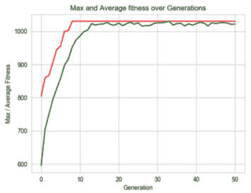

图 4.1：解决背包 0-1 问题的程序统计数据

在下一部分，我们将转向一个更复杂，但仍是经典的组合搜索任务，称为 TSP。

# 解决 TSP

假设你管理一个小型配送中心，需要用一辆车向一系列客户配送包裹。为了访问所有客户并返回起点，车辆应该走哪条最佳路线？这是经典的**TSP**问题的一个例子。

TSP 起源于 1930 年，从那时起，它成为了最深入研究的优化问题之一。它常常被用来作为优化算法的基准。这个问题有许多变种，但最初是在描述一个旅行商需要进行一个覆盖多个城市的旅行时提出的：

“给定一个城市列表和每对城市之间的距离，找到一条尽可能短的路径，这条路径需要经过所有城市并最终返回起点城市。”

使用组合数学，你可以发现，当给定*n*个城市时，经过所有城市的可能路径数量是(n − 1)! / 2。

下图展示了覆盖德国 15 个最大城市的旅行商问题的最短路径：

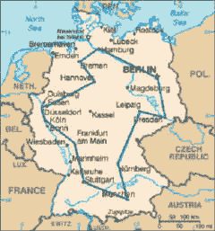

图 4.2：德国 15 个最大城市的最短 TSP 路径。

来源: [`commons.wikimedia.org/wiki/File:TSP_Deutschland_3.png`](https://commons.wikimedia.org/wiki/File:TSP_Deutschland_3.png)。

图片来源：Kapitän Nemo。

在这种情况下，*n=15*，所以可能的路径数量是*14!/2*，这将是一个惊人的数字——43,589,145,600。

在搜索算法的背景下，每一条路径（或部分路径）代表一个状态，所有可能路径的集合被认为是状态空间。每条路径都有一个对应的“成本”——路径的长度（距离）——我们正在寻找的是能够最小化该距离的路径。

正如我们所指出的，即使对于适度数量的城市，状态空间也非常庞大，这可能使得评估每一条可能路径变得极其昂贵。因此，尽管相对容易找到一条经过所有城市的路径，找到*最优*路径却可能非常困难。

## TSPLIB 基准测试文件

**TSPLIB**是一个包含基于城市实际地理位置的 TSP 样本问题的库。该库由海德堡大学维护，相关示例可以在此找到：[`comopt.ifi.uni-heidelberg.de/software/TSPLIB95/tsp/`](http://comopt.ifi.uni-heidelberg.de/software/TSPLIB95/tsp/)。

在这个网页上可以找到两种类型的文件：带有`.tsp.gz`后缀的文件，每个文件描述了一个特定的 TSP 问题，以及对应的`.opt.tour.gz`文件，包含每个问题的最优解。

问题描述文件是基于文本的，使用空格分隔。典型的文件包含几行信息，然后是城市数据。我们感兴趣的文件是包含参与城市的 x、y 坐标的文件，这样我们可以绘制城市并可视化它们的位置。例如，解压后的`burma14.tsp.gz`文件内容如下（此处省略了一些行以便简洁）：

```py
NAME: burma14
TYPE: TSP
...
NODE_COORD_SECTION
   1  16.47       96.10
   2  16.47       94.44
   3  20.09       92.54
   ...
  12  21.52       95.59
  13  19.41       97.13
  14  20.09       94.55
EOF
```

对我们来说，最有趣的部分是`NODE_COORD_SECTION`和`EOF`之间的行。在一些文件中，`DISPLAY_DATA_SECTION`被用来代替`NODE_COORD_SECTION`。

我们准备好解决一个示例问题了吗？好吧，在我们开始之前，我们仍然需要弄清楚如何表示潜在解。这将在下一小节中解决。

## 解的表示

在解决 TSP 时，城市通常用从 0 到 *n-1* 的数字表示，可能的解将是这些数字的序列。例如，一个有五个城市的问题，可能的解包括[0, 1, 2, 3, 4]、[2, 4, 3, 1, 0]，依此类推。每个解可以通过计算并汇总每两个连续城市之间的距离，然后加上最后一个城市到第一个城市的距离来进行评估。因此，在应用遗传算法解决这个问题时，我们可以使用类似的整数列表来作为染色体。

下一小节中描述的 Python 类读取 TSPLIB 文件的内容，并计算每两个城市之间的距离。此外，它还使用我们刚才讨论的列表表示法，计算给定潜在解的总距离。

## Python 问题表示

为了封装 TSP 问题，我们创建了一个名为`TravelingSalesmanProblem`的 Python 类。该类包含在`tsp.py`文件中，您可以在[`github.com/PacktPublishing/Hands-On-Genetic-Algorithms-with-Python-Second-Edition/blob/main/chapter_04/tsp.py`](https://github.com/PacktPublishing/Hands-On-Genetic-Algorithms-with-Python-Second-Edition/blob/main/chapter_04/tsp.py)找到它。

该类提供以下私有方法：

+   **__create_data()**：该方法读取所需的 TSPLIB 文件，提取所有城市的坐标，计算每两个城市之间的距离，并用它们填充一个距离矩阵（二位数组）。然后，它使用**pickle**工具将城市位置和计算出的距离序列化到磁盘中。

+   **__read_data()**：该方法读取序列化数据，如果数据不可用，则调用**__create_data()**进行准备。

这些方法由构造函数内部调用，因此数据在实例创建时就会初始化。

此外，该类还提供以下公共方法：

+   **getTotalDistance(indices)**：该方法计算由给定城市索引列表描述的路径的总距离。

+   **plotData(indices)**：该方法绘制由给定城市索引列表描述的路径。

该类的主要方法执行了之前提到的类方法：首先，它创建了`bayg29`问题（巴伐利亚的 29 个城市），然后计算了硬编码的最优解的距离（如匹配的`.opt.tour`文件中所述），最后绘制出来。因此，如果我们将此类作为独立的 Python 程序运行，输出将如下所示：

```py
Problem name: bayg29
Optimal solution = [0, 27, 5, 11, 8, 25, 2, 28, 4, 20, 1, 19, 9, 3, 14, 17, 13, 16, 21, 10, 18, 24, 6, 22, 7, 26, 15, 12, 23]
Optimal distance = 9074.147
```

最优解的图如下所示：

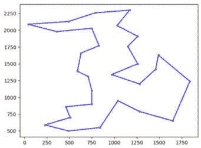

图 4.3：“bayg29” TSP 的最优解的图示。红色的点代表城市

接下来，我们将尝试使用遗传算法达到这个最优解。

## 遗传算法解决方案

对于我们第一次尝试使用遗传算法解决 TSP，我们创建了`02-solve-tsp-first-attempt.py` Python 程序，位于[`github.com/PacktPublishing/Hands-On-Genetic-Algorithms-with-Python-Second-Edition/blob/main/chapter_04/02_solve_tsp_first_attempt.py`](https://github.com/PacktPublishing/Hands-On-Genetic-Algorithms-with-Python-Second-Edition/blob/main/chapter_04/02_solve_tsp_first_attempt.py)。

我们解决方案的主要部分如下所述：

1.  程序通过创建**bayg29**问题的实例开始，如下所示：

    ```py
    TSP_NAME = "bayg29"
    tsp = tsp.TravelingSalesmanProblem(TSP_NAME)
    ```

1.  接下来，我们需要定义适应度策略。在这里，我们希望最小化距离，这意味着一个单目标最小化的**fitness**类，该类通过一个单一的负权重来定义：

    ```py
    creator.create("[0, 27, 5, 11, 8, 25, 2, 28, 4, 20, 1, 19, 9, 3, 14, 17, 13, 16, 21, 10, 18, 24, 6, 22, 7, 26, 15, 12, 23]The following code snippet is responsible for implementing this chromosome. It’s explained further after:

    ```

    creator.create("Individual", array.array, typecode='i',

    fitness=creator.FitnessMin)

    toolbox.register("randomOrder", random.sample,

    range(len(tsp)), len(tsp))

    toolbox.register("individualCreator", tools.initIterate,

    creator.Individual, toolbox.randomOrder)

    toolbox.register("populationCreator", tools.initRepeat, list,

    toolbox.individualCreator)

    ```py

    The `Individual` class is created first, extending an array of integers and augmenting it with the `FitnessMin` class.The `randomOrder` operator is then registered to provide the results of `random.sample()` invocation over a range defined by the length of the TSP problem (the number of cities, or *n*). This will result in a randomly generated list of indices between 0 and *n-1*.The `IndividualCreator` operator is created next. When called, it will invoke the `randomOrder` operator and iterate over the results to create a valid chromosome consisting of the city indices.The last operator, `populationCreator`, is created to produce a list of individuals using the `IndividualCreator` operator.
    ```

1.  现在，染色体已经实现，是时候定义适应度评估函数了。此操作由**tspDistance()**函数完成，它直接利用**TravelingSalesmanProblem**类的**getTotalDistance()**方法：

    ```py
    def tpsDistance(individual):
        return tsp.getTotalDistance(individual),  # return a tuple
    toolbox.register("evaluate", tpsDistance)
    ```

1.  接下来，我们需要定义遗传操作符。对于选择操作符，我们可以使用锦标赛选择，锦标赛的大小为**3**，就像我们在之前的案例中所做的那样：

    ```py
    toolbox.register("select", tools.selTournament, tournsize=3)
    ```

1.  然而，在选择交叉和变异操作符之前，我们需要记住我们使用的染色体不仅仅是一个整数列表，而是一个表示城市顺序的索引列表（或**有序列表**），因此我们不能仅仅混合两个列表的部分或随意改变列表中的索引。相反，我们需要使用专门设计的操作符，这些操作符旨在生成有效的索引列表。在*第二章*，*理解遗传算法的关键组成部分*中，我们探讨了其中的几个操作符，包括**有序交叉**和**打乱变异**。在这里，我们使用的是 DEAP 对这些操作符的相应实现，**cxOrdered**和**mutShuffleIndexes**：

    ```py
    toolbox.register("mate", tools.cxOrdered)
    toolbox.register("mutate", tools.mutShuffleIndexes, 
        indpb=1.0/len(tsp))
    ```

1.  最后，是时候调用遗传算法流程了。在这里，我们使用默认的 DEAP 内置**eaSimple**算法，并使用默认的**stats**和**halloffame**对象来提供我们稍后可以展示的信息：

    ```py
    population, logbook = algorithms.eaSimple(population, \
        toolbox, cxpb=P_CROSSOVER, mutpb=P_MUTATION, \
        ngen=MAX_GENERATIONS, stats=stats, halloffame=hof, \
        verbose=True)
    ```

使用文件顶部出现的常量值运行此程序（种群大小为 300，200 代，交叉概率为 0.9，突变概率为 0.1），会得到以下结果：

```py
-- Best Ever Individual = Individual('i', [0, 27, 11, 5, 20, 4, 8, 25, 2, 28, 1, 19, 9, 3, 14, 17, 13, 16, 21, 10, 18, 12, 23, 7, 26, 22, 6, 24, 15])
-- Best Ever Fitness = 9549.9853515625
```

所找到的最佳适应度（9549.98）与已知的最佳距离 9074.14 相差不远。

程序随后生成了两个图。第一个图展示了在运行过程中找到的最佳个体的路径：

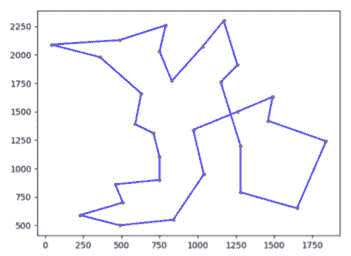

图 4.4：第一个程序尝试解决“bayg29”TSP 问题时找到的最佳解的图

第二个图显示了遗传流的统计数据。注意，这次我们选择收集*最小*适应度值的数据，而不是最大值，因为该问题的目标是最小化距离：

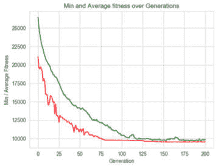

图 4.5：第一个程序尝试解决“bayg29”TSP 问题时的统计数据

现在我们已经找到了一个不错的解，但还不是最优解，我们可以尝试找出改进结果的方法。例如，我们可以尝试改变种群大小、代数和概率。我们还可以用其他兼容的遗传算子替代当前的遗传算子。我们甚至可以更改设置的随机种子，看看结果有何变化，或者使用不同的种子进行多次运行。在下一节中，我们将尝试结合**精英主义**和**增强探索**来改进我们的结果。

## 通过增强探索和精英主义来改进结果

如果我们尝试增加前一个程序中的代数，我们会发现解并没有改进——它停留在了大约 200 代之前达到的（稍微）次优解中。这一点在以下图中得到了展示，该图展示了 500 代的情况：

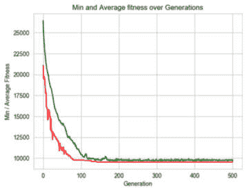

图 4.6：第一个程序运行 500 代的统计数据

从那时起，平均值与最佳值之间的相似性表明该解已经主导了种群，因此，除非出现幸运的突变，否则我们将不会看到任何改进。在遗传算法的术语中，这意味着**开发**已经压倒了**探索**。开发通常意味着利用当前可得的结果，而探索则强调寻找新的解决方案。两者之间的微妙平衡可以带来更好的结果。

增加探索的一个方法是将用于锦标赛选择的锦标赛大小从 3 减小到 2：

```py
toolbox.register("select", tools.selTournament, tournsize=2)
```

正如我们在*第二章*《理解遗传算法的关键组成部分》中讨论的那样，这将增加选中较不成功个体的几率。这些个体可能带有更好的未来解的关键。然而，如果我们在做了这个更改后运行相同的程序，结果却远远不如预期——最佳适应度值超过了 13,000，而最佳解的图形如下所示：

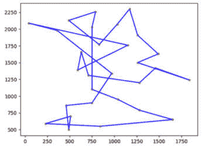

图 4.7：程序在锦标赛大小减少到 2 时找到的最佳解的图形

这些不理想的结果可以通过统计图来解释：

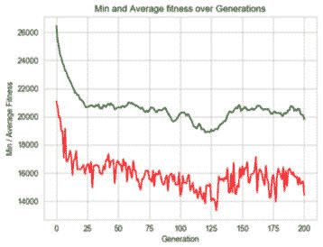

图 4.8：程序的统计数据，锦标赛大小减少到 2

该图说明了我们无法保留最好的解。正如“嘈杂”的图形所示，图形在更好的值和更差的值之间不断波动，好的解容易因为更宽松的选择机制而迅速“丢失”，这种机制往往允许较差的解被选中。这意味着我们让探索过度进行，为了平衡这一点，我们需要重新引入一定的开发度。这可以通过使用**精英主义**机制来实现，精英主义首次在*第二章*中介绍。

精英主义使我们能够保持最好的解不变，允许它们在遗传过程中“跳过”选择、交叉和变异的遗传操作。为了实现精英主义，我们需要“深入底层”，修改 DEAP 的`algorithms.eaSimple()`算法，因为该框架没有提供直接跳过这三种操作的方法。

修改后的算法，称为`eaSimpleWithElitism()`，可以在`elitism.py`文件中找到，文件位置在[`github.com/PacktPublishing/Hands-On-Genetic-Algorithms-with-Python-Second-Edition/blob/main/chapter_04/elitism.py`](https://github.com/PacktPublishing/Hands-On-Genetic-Algorithms-with-Python-Second-Edition/blob/main/chapter_04/elitism.py)。

`eaSimpleWithElitism()`方法与原始的`eaSimple()`类似，唯一的修改是现在使用`halloffame`对象来实现精英机制。`halloffame`对象中包含的个体会直接被注入到下一代，并且不受选择、交叉和变异的遗传操作影响。这本质上是以下修改的结果：

+   选择的个体数量不再等于种群大小，而是通过减少精英个体的数量来调整：

    ```py
    offspring = toolbox.select(population, 
        len(population) - hof_size)
    ```

+   在应用了遗传操作后，精英个体被重新加入到种群中：

    ```py
    offspring.extend(halloffame.items)
    ```

我们现在可以将对 `algorithms.eaSimple()` 的调用替换为对 `elitism.eaSimpleWithElitism()` 的调用，而不改变任何参数。然后，我们将 `HALL_OF_FAME_SIZE` 常量设置为 30，这意味着我们将始终保持种群中最优秀的 30 个个体。

修改后的 Python 程序 `03-solve-tsp.py` 可以在 [`github.com/PacktPublishing/Hands-On-Genetic-Algorithms-with-Python-Second-Edition/blob/main/chapter_04/03_solve_tsp.py`](https://github.com/PacktPublishing/Hands-On-Genetic-Algorithms-with-Python-Second-Edition/blob/main/chapter_04/03_solve_tsp.py) 找到。

运行这个新程序后，我们现在能够达到最优解：

```py
-- Best Ever Individual = Individual('i', [0, 23, 12, 15, 26, 7, 22, 6, 24, 18, 10, 21, 16, 13, 17, 14, 3, 9, 19, 1, 20, 4, 28, 2, 25, 8, 11, 5, 27])
-- Best Ever Fitness = 9074.146484375
```

解的图表与我们之前看到的最优解相同：

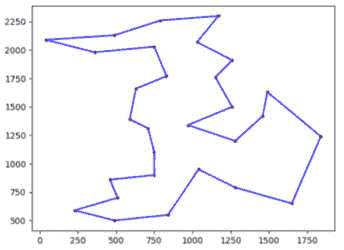

图 4.9：使用 2 个锦标赛大小和精英主义的程序找到的最佳解的图表

以下的统计图表表明，我们成功地消除了之前观察到的“噪声”。与原始尝试相比，我们还能够在更长的时间内保持平均值与最佳值之间的距离：

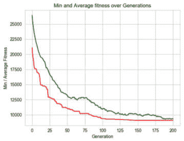

图 4.10：使用 2 个锦标赛大小和精英主义的程序统计数据

在下一节中，我们将讨论**VRP**，它为我们刚刚解决的问题增添了一个有趣的变化。

# 求解 VRP

假设你现在管理一个更大的配送中心。你仍然需要将包裹送到一份客户名单，但现在你可以使用一支多辆车组成的车队。怎样用这些车辆以最佳方式将包裹送到客户那里呢？

这是一个 VRP（车辆路径问题）的示例，它是上一节中描述的 TSP（旅行商问题）的推广。基本的 VRP 包括以下三个组件：

+   需要访问的地点列表

+   车辆数量

+   仓库的位置，用作每辆车的起点和终点

该问题有许多变种，例如多个仓库位置、时间敏感的交付、不同类型的车辆（不同的容量、不同的燃油消耗）等等。

该问题的目标是最小化成本，而成本的定义可以有许多不同的方式。例如，包括最小化交付所有包裹所需的时间、最小化燃料成本以及最小化各车辆之间的旅行时间差异。

这里展示了一个带有三辆车的 VRP 示例。城市用黑色圆圈标记，仓库位置用空白方块标记，而三辆车的路线则用三种不同的颜色标记：

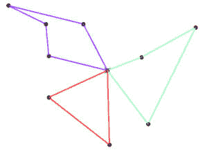

图 4.11：具有三辆车的 VRP 示例

在我们的例子中，我们将以优化所有包裹的送达时间为目标。由于所有车辆同时运作，这一度量标准由执行最长路线的车辆决定。因此，我们可以将目标设定为最小化参与车辆中最长路线的长度。例如，如果我们有三辆车，每个解决方案包含三条路线，我们将评估这三条路线，然后只考虑其中最长的一条进行评分——路线越长，得分越差。这将本质上鼓励三条路线尽量变短，同时彼此的长度更接近。

得益于这两个问题的相似性，我们可以利用之前编写的代码来解决 TSP 问题，从而解决 VRP 问题。

在我们为 TSP 创建的解决方案基础上，我们可以按如下方式表示车辆路线：

+   一个 TSP 实例，即城市及其坐标的列表（或它们之间的相互距离）

+   仓库位置，选择自现有城市，并用该城市的索引表示

+   使用的车辆数量

在接下来的两个小节中，我们将向您展示如何实现这个解决方案。

## 解决方案表示

像往常一样，我们首先需要解决的问题是如何表示这个问题的解决方案。

为了说明我们建议的表示方法，我们将查看下图中的 10 城市示例问题，其中城市位置用从 0 到 9 的数字标记：

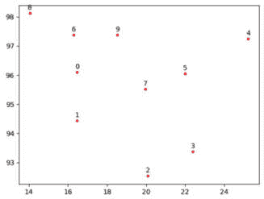

图 4.12：带有编号城市位置的 VRP 示例

一种创造性地表示候选 VRP 解决方案的方法，同时保持与先前解决的 TSP 相似性，是使用一个包含从 0 到 *(n-1) + (m-1)* 的数字的列表，其中 *n* 是城市的数量，*m* 是车辆的数量。例如，如果城市的数量是 10，车辆的数量是 3（*n = 10, m = 3*），我们将有一个包含从 0 到 11 的所有整数的列表，如下所示：

[0, 6, 8, 9, 11, 3, 4, 5, 7, 10, 1, 2]

前 *n* 个整数值，在我们的例子中是 0...9，依然代表城市，和之前一样。然而，最后的 *(m - 1)* 个整数值，在我们的例子中是 10 和 11，用作分隔符（或“分隔符”），将列表分成不同的路线。举个例子，[0, 6, 8, 9 **11**, 3, 4, 5, 7, **10**, 1, 2]将被分成以下三条路线：

[0, 6, 8, 9], [3, 4, 5, 7], [1, 2]

接下来，需要移除仓库位置的索引，因为它不是特定路线的一部分。如果仓库位置的索引是 **7**，那么得到的路线将如下所示：

[0, 6, 8, 9], [3, 4, 5], [1, 2]

在计算每条路线所覆盖的距离时，我们需要记住，每条路线都是从仓库位置（7）出发并以该位置结束的。所以，为了计算距离并绘制路线，我们将使用以下数据：

[**7**, 0, 6, 8, 9, **7**], [**7**, 3, 4, 5, **7**], [**7**, 1, 2, **7**]

这个候选解决方案在下图中有所体现：

![Figure 4.13: Visualization of the candidate solution [0, 6, 8, 9, 11, 3, 4, 5, 7, 10, 1, 2]](img/B20851_04_13.jpg)

图 4.13: 候选解决方案的可视化 [0, 6, 8, 9, 11, 3, 4, 5, 7, 10, 1, 2]

在下一小节中，我们将探讨这个思想的 Python 实现。

## Python 问题表示

为了封装 VRP 问题，我们创建了一个名为`VehicleRoutingProblem`的 Python 类。此类包含在`vrp.py`文件中，可以在[`github.com/PacktPublishing/Hands-On-Genetic-Algorithms-with-Python-Second-Edition/blob/main/chapter_04/vrp.py`](https://github.com/PacktPublishing/Hands-On-Genetic-Algorithms-with-Python-Second-Edition/blob/main/chapter_04/vrp.py)找到。

`VehicleRoutingProblem`类包含`TravelingSalesmanProblem`类的实例，后者用作包含城市索引及其对应位置和距离的容器。创建`VehicleRoutingProblem`类的实例时，内部会创建和初始化底层`TravelingSalesmanProblem`的实例。

使用底层`TravelingSalesmanProblem`的名称以及仓库位置索引和车辆数量来初始化`VehicleRoutingProblem`类。

另外，`VehicleRoutingProblem`类提供以下公共方法：

+   **getRoutes(indices)**: 这通过检测“分隔符”索引将给定索引列表分解为单独的路线

+   **getRouteDistance(indices)**: 这计算从仓库位置开始并经过给定索引描述的城市路径的总距离

+   **getMaxDistance(indices)**: 这在将索引分解为单独路线后，计算给定索引描述的各路径距离中的最大距离

+   **getTotalDistance(indices)**: 这计算由给定索引描述的各路径组合距离的总和

+   **plotData(indices)**: 这将索引列表分解为单独的路线并以不同颜色绘制每条路线

当作为独立程序执行时，通过创建`VehicleRoutingProblem`类的实例并将其基础 TSP 设置为“bayg29”（与前一节中使用的相同问题）的`main`方法，运行这些方法。车辆数量设置为 3，仓库位置索引设置为 12（映射到一个具有中心位置的城市）。以下图显示了城市位置（红色点）和仓库（绿色“x”）的位置：

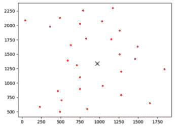

图 4.14: 基于“bayg29” TSP 的 VRP 图表。

红色点标记城市，绿色“X”标记仓库

然后，主方法生成一个随机解决方案，将其分解为路线，并计算距离，如下所示：

```py
random solution = [27, 23, 7, 18, 30, 14, 19, 3, 16, 2, 26, 9, 24, 22, 15, 17, 28, 11, 21, 12, 8, 4, 5, 13, 25, 6, 0, 29, 10, 1, 20]
route breakdown = [[27, 23, 7, 18], [14, 19, 3, 16, 2, 26, 9, 24, 22, 15, 17, 28, 11, 21, 8, 4, 5, 13, 25, 6, 0], [10, 1, 20]]
total distance = 26653.845703125
max distance = 21517.686
```

请注意，原始的随机解决方案索引列表是如何使用分隔符索引（29 和 30）被分解为独立的路线的。此随机解决方案的图形如下所示：

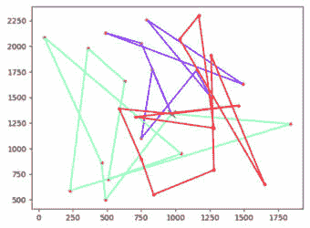

图 4.15：VRP 三辆车的随机解决方案图

正如我们从随机解决方案中预期的那样，它远未达到最优。这一点从长（绿色）路线中城市顺序的低效性以及一条路线（绿色）比另外两条（红色和紫色）明显更长可以看出。

在接下来的小节中，我们将尝试使用遗传算法方法生成良好的解决方案。

## 遗传算法解决方案

我们为 VRP 创建的遗传算法解决方案位于`04-solve-vrp.py` Python 文件中，文件可以通过[`github.com/PacktPublishing/Hands-On-Genetic-Algorithms-with-Python-Second-Edition/blob/main/chapter_04/04_solve_vrp.py`](https://github.com/PacktPublishing/Hands-On-Genetic-Algorithms-with-Python-Second-Edition/blob/main/chapter_04/04_solve_vrp.py)访问。

由于我们能够在 TSP 的基础上进行构建，并且使用了类似的解决方案表示方法——一个索引数组——我们可以使用与前一节相同的遗传算法方法。我们还可以通过重用为遗传流创建的精英版本来利用精英主义。这使得我们的遗传算法解决方案与我们为 TSP 所用的解决方案非常相似。

以下步骤详细描述了我们解决方案的主要部分：

1.  程序通过创建**VehicleRoutingProblem**类的一个实例开始，使用“bayg29”TSP 作为其底层数据，并将仓库位置设置为 12，车辆数量设置为 3：

    ```py
    TSP_NAME = "bayg29"
    NUM_OF_VEHICLES = 3
    DEPOT_LOCATION = 12
    vrp = vrp.VehicleRoutingProblem(TSP_NAME, NUM_OF_VEHICLES, 
        DEPOT_LOCATION)
    ```

1.  适应度函数设置为最小化三条路线中最长路线的距离：

    ```py
    def vrpDistance(individual):
        return vrp.getMaxDistance(individual),
    toolbox.register("evaluate", vrpDistance)
    ```

1.  对于遗传操作符，我们再次使用锦标赛选择，锦标赛大小为 2，并辅以精英主义方法，以及专门针对有序列表的交叉和变异操作符：

    ```py
    # Genetic operators:
    toolbox.register("select", tools.selTournament, tournsize=2)
    toolbox.register("mate", tools.cxUniformPartialyMatched, \
        indpb=2.0/len(vrp))
    toolbox.register("mutate", tools.mutShuffleIndexes, \
        indpb=1.0/len(vrp))
    ```

1.  由于 VRP 本质上比 TSP 更为复杂，我们选择了比之前更大的种群规模和更高的代数：

    ```py
    # Genetic Algorithm constants:
    POPULATION_SIZE = 500
    P_CROSSOVER = 0.9
    P_MUTATION = 0.2
    MAX_GENERATIONS = 1000
    HALL_OF_FAME_SIZE = 30
    ```

就是这样！我们准备好运行程序了。我们通过这些设置得到的结果如下：三条路线，最长路线长度为`3857`：

```py
-- Best Ever Individual =  Individual('i', [0, 20, 17, 16, 13, 21, 10, 14, 3, 29, 15, 23, 7, 26, 12, 22, 6, 24, 18, 9, 19, 30, 27, 11, 5, 4, 8, 25, 2, 28, 1])
-- Best Ever Fitness =  3857.36376953125
-- Route Breakdown =  [[0, 20, 17, 16, 13, 21, 10, 14, 3], [15, 23, 7, 26, 22, 6, 24, 18, 9, 19], [27, 11, 5, 4, 8, 25, 2, 28, 1]]
-- total distance =  11541.875
-- max distance =  3857.3638
```

请注意，解决方案是如何被分解为三条独立的路线的，使用最高的两个索引（29，30）作为分隔符，并忽略了仓库位置（12）。最终我们得到了三条路线，其中两条覆盖了九个城市，第三条覆盖了十个城市。

绘制解决方案时，得到以下图形，显示了三条结果路线：

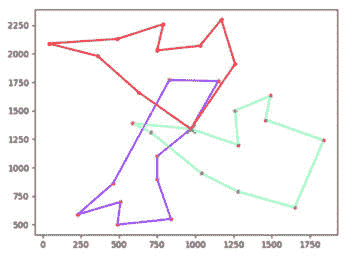

图 4.16：程序为 VRP 三辆车找到的最佳解决方案图

下图展示的统计数据表明，算法在达到 300 代之前进行了大部分优化。之后，有几个小幅改进：

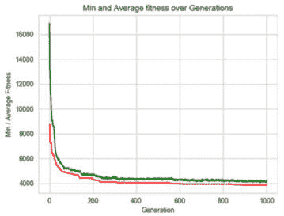

图 4.17：使用三辆车解决 VRP 程序的统计数据

如果改变车辆数量呢？让我们在不做其他更改的情况下，将车辆数量增加到六并重新运行算法：

```py
NUM_OF_VEHICLES = 6
```

本次运行的结果如下所示——六条路线，最大长度为`2803`：

```py
-- Best Ever Individual =  Individual('i', [27, 11, 5, 8, 4, 33, 12, 24, 6, 22, 7, 23, 29, 28, 20, 0, 26, 15, 32, 3, 18, 13, 17, 1, 31, 19, 25, 2, 30, 9, 14, 16, 21, 10])
-- Best Ever Fitness =  2803.584716796875
-- Route Breakdown =  [[27, 11, 5, 8, 4], [24, 6, 22, 7, 23], [28, 20, 0, 26, 15], [3, 18, 13, 17, 1], [19, 25, 2], [9, 14, 16, 21, 10]]
-- total distance =  16317.9892578125
-- max distance =  2803.5847
```

请注意，增加车辆数量两倍并没有以相似的方式减少最大距离（六辆车的`2803`与三辆车的`3857`相比）。这可能是因为每条单独的路线仍然需要在仓库位置开始和结束，这个位置也算在路线的城市之中。

绘制解决方案后，得到下图，展示了六条结果路线：

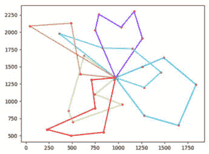

图 4.18：程序为六辆车解决 VRP 所找到的最佳解决方案图

这个图表展示的一个有趣点是，橙色路线似乎没有被优化。由于我们告诉遗传算法最小化最长路线，任何比最长路线短的路线可能不会进一步优化。鼓励你修改我们的解决方案，以进一步优化这些路线。

与三辆车的情况类似，下图展示的统计数据表明，算法在达到 200 代之前做了大部分优化，之后出现了几个小幅改进：

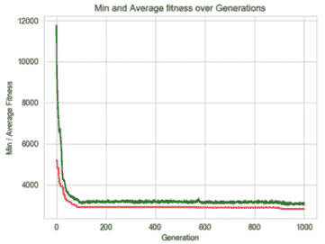

图 4.19：使用六辆车解决 VRP 程序的统计数据

我们找到的解决方案似乎是合理的。我们能做得更好吗？如果使用其他数量的车辆呢？或者其他仓库位置呢？不同的遗传操作符或不同的参数设置呢？甚至是不同的适应度标准？我们鼓励你尝试这些并从实验中学习。

# 总结

本章介绍了搜索问题和组合优化问题。然后，我们深入研究了三类经典的组合问题——它们在现实生活中有着广泛的应用——背包问题、旅行商问题（TSP）和车辆路径问题（VRP）。对于每个问题，我们都采用了类似的过程：找到一个合适的解决方案表示，创建一个封装问题并评估给定解决方案的类，然后创建一个利用该类的遗传算法解决方案。通过实验基因型到表现型的映射和精英主义支持的探索，我们为这三个问题都得到了有效的解决方案。

在下一章中，我们将研究一类密切相关的任务，即*约束满足问题*，从经典的*n-皇后问题*开始。

# 进一步阅读

如需更多信息，请参考以下资源：

+   使用动态规划解决背包问题，摘自 Giuseppe Ciaburro 的《*Keras 强化学习项目*》，2018 年 9 月

+   VRP，摘自 Giuseppe Ciaburro 的《*Keras 强化学习项目*》，2018 年 9 月
