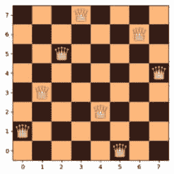
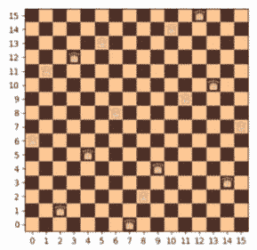
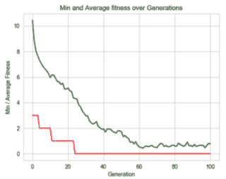
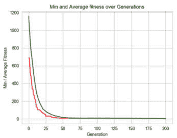
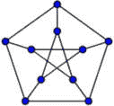
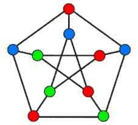
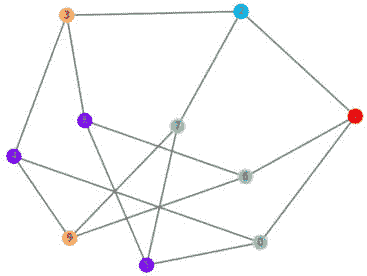
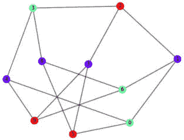
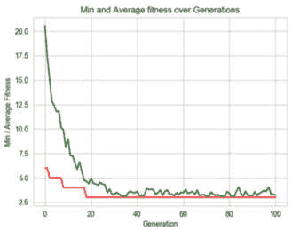
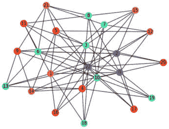

# 第五章：约束满足

在本章中，您将学习如何利用遗传算法解决约束满足问题。我们将从描述约束满足的概念开始，并讨论它如何应用于搜索问题和组合优化。然后，我们将通过几个实际示例，展示约束满足问题及其基于 Python 的解决方案，使用 DEAP 框架。我们将讨论的问题包括著名的**N-皇后**问题，接着是**护士排班**问题，最后是**图着色**问题。在此过程中，我们将了解**硬约束和软约束**之间的区别，并学习如何将它们纳入解决过程。

在本章中，我们将涵盖以下主题：

+   理解约束满足问题的性质

+   使用 DEAP 框架编写的遗传算法解决 N-皇后问题

+   使用 DEAP 框架编写的遗传算法解决护士排班问题的示例

+   使用 DEAP 框架编写的遗传算法解决图着色问题

+   理解硬约束和软约束的概念，以及在解决问题时如何应用它们

# 技术要求

在本章中，我们将使用 Python 3 和以下支持库：

+   **deap**

+   **numpy**

+   **matplotlib**

+   **seaborn**

+   **networkx** – 本章介绍

重要提示

如果您使用的是我们提供的 **requirements.txt** 文件（参见 *第三章*），这些库将在您的环境中。

本章中将使用的程序可以在本书的 GitHub 仓库中找到，链接为 [`github.com/PacktPublishing/Hands-On-Genetic-Algorithms-with-Python-Second-Edition/tree/main/chapter_05`](https://github.com/PacktPublishing/Hands-On-Genetic-Algorithms-with-Python-Second-Edition/tree/main/chapter_05)。

查看以下视频，了解代码的实际应用：[`packt.link/OEBOd`](https://packt.link/OEBOd)。

# 搜索问题中的约束满足

在上一章中，我们研究了如何解决搜索问题，重点是有条不紊地评估状态及其状态之间的转变。每个状态转变通常涉及到成本或收益，搜索的目标是最小化成本或最大化收益。约束满足问题是搜索问题的一种*变体*，其中状态必须满足多个约束或限制。如果我们能将各种约束违反转化为成本，并努力最小化成本，那么解决约束满足问题就可以类似于解决一般的搜索问题。

像组合优化问题一样，约束满足问题在人工智能、运筹学和模式匹配等领域有重要应用。更好地理解这些问题有助于解决看似无关的各种问题。约束满足问题通常具有高度复杂性，这使得遗传算法成为解决它们的合适候选方法。

**N 皇后**问题将在下一节中介绍，展示了约束满足问题的概念，并演示了如何以与我们在上一章中研究的问题非常相似的方式来解决这些问题。

# 解决 N 皇后问题

最初被称为 *八皇后谜题* 的经典 N 皇后问题源自国际象棋游戏，*8x8* 棋盘是它的早期舞台。任务是将八个国际象棋皇后放置在棋盘上，确保它们之间没有任何威胁。换句话说，任何两只皇后都不能在同一行、同一列或同一对角线上。N 皇后问题类似，使用一个 *N×N* 的棋盘和 *N* 个国际象棋皇后。

已知对于任何自然数 *n*，除了 *n=2* 和 *n=3* 的情况外，该问题都有解。对于最初的八皇后问题，有 92 种解，或者如果将对称解视为相同，则有 12 种唯一解。以下是其中一种解：



图 5.1：八皇后谜题的 92 种可能解之一

通过应用组合数学，计算在 *8×8* 棋盘上放置八个棋子的所有可能方式，得到 4,426,165,368 种组合。然而，如果我们能以确保没有两只皇后被放置在同一行或同一列的方式来生成候选解，则可能的组合数量会大大减少，变为 *8!*（8 的阶乘），即 40,320。我们将在下一小节中利用这一思想来选择我们解决此问题的表示方式。

## 解的表示

在解决 N 皇后问题时，我们可以利用每一行都会恰好放置一只皇后，且没有两只皇后会在同一列的知识。这意味着我们可以将任何候选解表示为一个有序整数列表——或者一个索引列表，每个索引表示当前行中皇后所在的列。

例如，在一个 4×4 的棋盘上解决四后问题时，我们有以下索引列表：

```py
[3, 2, 0, 1]
```

这转换为以下位置：

+   在第一行，皇后被放置在位置 3（第四列）。

+   在第二行，皇后被放置在位置 2（第三列）。

+   在第三行，皇后被放置在位置 0（第一列）。

+   在第四行，皇后被放置在位置 1（第二列）。

如下图所示：

![图 5.2：由列表[3, 2, 0, 1]表示的皇后排列示意图](img/B20851_05_02.jpg)

图 5.2：由列表[3, 2, 0, 1]表示的皇后排列示意图

同样，索引的另一种排列可能如下所示：

```py
[1, 3, 0, 2]
```

该排列表示以下图示中的候选解：

![图 5.3：由列表[1, 3, 0, 2]表示的皇后排列示意图](img/B20851_05_03.jpg)

图 5.3：由列表[1, 3, 0, 2]表示的皇后排列示意图

以这种方式表示的候选解中唯一可能的约束冲突是皇后对之间共享的对角线。

例如，我们讨论的第一个候选解包含两个违反约束条件的情况，如下所示：

![图 5.4：由列表[3, 2, 0, 1]表示的皇后排列示意图，标明了约束条件冲突](img/B20851_05_04.jpg)

图 5.4：由列表[3, 2, 0, 1]表示的皇后排列示意图，标明了约束条件冲突

然而，前面的排列没有违反任何约束条件。

这意味着，在评估以这种方式表示的解时，我们只需要找到并计算它们所代表位置之间共享的对角线。

我们刚刚讨论的解表示方法是 Python 类的核心部分，我们将在下一小节中描述该类。

## Python 问题表示

为了封装 N 皇后问题，我们创建了一个名为`NQueensProblem`的 Python 类。该类可以在本书 GitHub 仓库中的`queens.py`文件找到：[`github.com/PacktPublishing/Hands-On-Genetic-Algorithms-with-Python-Second-Edition/blob/main/chapter_05/queens.py`](https://github.com/PacktPublishing/Hands-On-Genetic-Algorithms-with-Python-Second-Edition/blob/main/chapter_05/queens.py)。

该类以问题的期望大小进行初始化，并提供以下公共方法：

+   **getViolationsCount(positions)**：此函数计算给定解中违反约束条件的数量，该解由索引列表表示，如前一小节所述

+   **plotBoard(positions)**：此函数根据给定的解绘制皇后在棋盘上的位置

该类的`main`方法通过创建一个八皇后问题并测试以下候选解来运用该类方法：

```py
[1, 2, 7, 5, 0, 3, 4, 6]
```

随后绘制候选解并计算违反约束条件的数量。

结果输出如下：

```py
Number of violations =  3
```

下面是该问题的图示——你能找出所有三个违反约束条件的情况吗？

![图 5.5：由列表[1, 2, 7, 5, 0, 3, 4, 6]表示的八皇后排列示意图](img/B20851_05_05.jpg)

图 5.5：由列表[1, 2, 7, 5, 0, 3, 4, 6]表示的八皇后排列示意图

在下一小节中，我们将应用遗传算法方法来解决 N 皇后问题。

## 遗传算法解法

为了使用遗传算法解决 N 皇后问题，我们创建了一个名为`01-solve-n-queens.py`的 Python 程序，该程序位于[`github.com/PacktPublishing/Hands-On-Genetic-Algorithms-with-Python-Second-Edition/blob/main/chapter_05/01_solve_n_queens.py`](https://github.com/PacktPublishing/Hands-On-Genetic-Algorithms-with-Python-Second-Edition/blob/main/chapter_05/01_solve_n_queens.py)。

由于我们为此问题选择的解决方案表示是一个索引的列表（或数组），类似于我们在*第四章*中为**旅行商问题**（**TSP**）和**车辆路径规划问题**（**VRP**）使用的表示，我们可以利用类似的遗传方法，正如我们在那里使用的那样。此外，我们将再次利用**精英主义**，通过重用我们为 DEAP 的简单遗传流程创建的精英版本。

以下步骤描述了我们解决方案的主要部分：

1.  我们的程序通过使用我们希望解决的问题的大小，创建**NQueensProblem**类的实例来开始：

    ```py
    nQueens = queens.NQueensProblem(NUM_OF_QUEENS)
    ```

1.  由于我们的目标是最小化冲突数量（希望达到 0），我们定义了一个单一目标，即最小化适应度策略：

    ```py
    creator.create("FitnessMin", base.Fitness, weights=(-1.0,))
    ```

1.  由于解决方案由一个有序的整数列表表示，其中每个整数表示一个皇后的列位置，我们可以使用以下工具箱定义来创建初始种群：

    ```py
    # create an operator that generates randomly shuffled indices:
    toolbox.register("randomOrder", random.sample, \
        range(len(nQueens)), len(nQueens))
    toolbox.register("individualCreator", tools.initIterate, \
        creator.Individual, toolbox.randomOrder)
    toolbox.register("populationCreator", tools.initRepeat, \
        list, toolbox.individualCreator)
    ```

1.  实际的适应度函数设置为计算由于皇后在棋盘上的放置所引起的冲突数量，每个解决方案代表一个冲突：

    ```py
    def getViolationsCount(individual):
        return nQueens.getViolationsCount(individual),
    toolbox.register("evaluate", getViolationsCount)
    ```

1.  至于遗传操作符，我们使用*tournament selection*（锦标赛选择），其锦标赛大小为**2**，以及*交叉*和*突变*操作符，这些操作符是针对有序列表的：

    ```py
    # Genetic operators:
    toolbox.register("select", tools.selTournament, \
        tournsize=2)
    toolbox.register("mate", tools.cxUniformPartialyMatched, \
        indpb=2.0/len(nQueens))
    toolbox.register("mutate", tools.mutShuffleIndexes, \
        indpb=1.0/len(nQueens))
    ```

1.  此外，我们继续使用**精英主义**方法，其中**名人堂**（**HOF**）成员——当前最好的个体——始终不受影响地传递到下一代。正如我们在上一章中发现的那样，这种方法与大小为 2 的锦标赛选择非常匹配：

    ```py
    population, logbook = elitism.eaSimpleWithElitism(population,
        toolbox,
        cxpb=P_CROSSOVER,
        mutpb=P_MUTATION,
        ngen=MAX_GENERATIONS,
        stats=stats,
        halloffame=hof,
        verbose=True)
    ```

1.  由于每个 N 皇后问题可以有多个可能的解决方案，我们打印出所有 HOF 成员，而不仅仅是顶部的一个，以便我们可以看到找到多少个有效解决方案：

    ```py
    print("- Best solutions are:")
    for i in range(HALL_OF_FAME_SIZE):
        print(i, ": ", hof.items[i].fitness.values[0], " -> ", 
            hof.items[i])
    ```

正如我们之前看到的那样，我们的解决方案表示将八皇后情况简化为大约 40,000 个可能的组合，这使得问题相对较小。为了增加趣味性，让我们将大小增加到 16 个皇后，其中可能的候选解决方案数量将是*16!*。这个值计算为一个巨大的数字：20,922,789,888,000。这个问题的有效解决方案数量也相当大，接近 1500 万个。然而，与可能的组合数相比，寻找有效解决方案仍然像是在大海捞针。

在运行程序之前，让我们设置算法常量，如下所示：

```py
NUM_OF_QUEENS = 16
POPULATION_SIZE = 300
MAX_GENERATIONS = 100
HALL_OF_FAME_SIZE = 30
P_CROSSOVER = 0.9
P_MUTATION = 0.1
```

使用这些设置运行程序将得到以下输出：

```py
gen nevals min avg
0 300 3 10.4533
1 246 3 8.85333
..
23 250 1 4.38
24 227 0 4.32
..
- Best solutions are:
0 : 0.0 -> Individual('i', [7, 2, 8, 14, 9, 4, 0, 15, 6, 11, 13, 1, 3, 5, 10, 12])
1 : 0.0 -> Individual('i', [7, 2, 6, 14, 9, 4, 0, 15, 8, 11, 13, 1, 3, 5, 12, 10])
..
7 : 0.0 -> Individual('i', [14, 2, 6, 12, 7, 4, 0, 15, 8, 11, 3, 1, 9, 5, 10, 13])
8 : 1.0 -> Individual('i', [2, 13, 6, 12, 7, 4, 0, 15, 8, 14, 3, 1, 9, 5, 10, 11])
..
```

从打印输出中，我们可以看到第一个解在第 24 代找到，其中适应度值显示为`0`，这意味着没有违反规则。此外，最佳解的打印输出表明在运行过程中找到的八个不同解，这些解的编号是`0`到`7`，它们的适应度值都是`0`。下一个解的适应度值已经为`1`，表示存在违规。

程序生成的第一个图表展示了根据找到的第一个有效解所定义的*16x16*国际象棋棋盘上 16 个皇后的位置，[7, 2, 8, 14, 9, 4, 0, 15, 6, 11, 13, 1, 3, 5, 10, 12]：



图 5.6：程序找到的有效 16 皇后排列的图示

第二个图表包含了随着代数增加，最大和平均适应度值的图表。从该图表中，我们可以看到，尽管最佳适应度值为零在早期就找到——大约在第 24 代——但随着更多解的出现，平均适应度值不断下降：



图 5.7：程序解决 16 皇后问题的统计数据

将`MAX_GENERATIONS`的值增加到 400 而不做其他任何更改，将会找到 38 个有效解。如果我们将`MAX_GENERATIONS`增加到 500，HOF 中的所有 50 个成员将包含有效解。鼓励你尝试基因算法设置的各种组合，同时也可以解决其他规模的 N 皇后问题。

在下一部分，我们将从安排棋盘上的棋子过渡到为工作安排排班。

# 解决护士排班问题

假设你负责为医院科室安排本周的护士班次。一天有三个班次——早班、午班和晚班——每个班次你需要安排一个或多个在科室工作的八名护士。如果这听起来像是一个简单的任务，那你可以看看以下相关的医院规定：

+   护士不能连续工作两个班次

+   护士每周不得工作超过五个班次

+   科室中每个班次的护士数量应在以下限制范围内：

    +   早班：2-3 名护士

    +   午班：2-4 名护士

    +   晚班：1-2 名护士

此外，每个护士可能有班次偏好。例如，一名护士只愿意上早班，另一名护士不愿意上下午班，等等。

这个任务是**护士排班问题**（**NSP**）的一个示例，它可以有许多变种。可能的变种包括不同护士的不同专科、加班班次（超时工作）的安排，甚至是不同类型的班次——例如 8 小时班次和 12 小时班次。

到现在为止，可能已经觉得编写一个程序来为你排班是个不错的主意。为什么不运用我们对遗传算法的了解来实现这样一个程序呢？和往常一样，我们将从表示问题的解法开始。

## 解法表示

为了解决护士排班问题，我们决定使用二进制列表（或数组）来表示排班，因为这样直观易懂，而且我们已经看到遗传算法可以自然地处理这种表示。

对于每个护士，我们可以有一个**二进制字符串**，表示该周的 21 个班次。值为 1 表示该护士被安排工作的班次。例如，看看以下的二进制列表：

```py
[0, 1, 0, 1, 0, 1, 0, 1, 1, 0, 0, 0, 0, 0, 1, 1, 0, 0, 0, 1, 0]
```

这个列表可以被拆分为以下三个值一组，表示该护士每周每天将要工作的班次：

| **周日** | **周一** | **周二** | **周三** | **周四** | **周五** | **周六** |
| --- | --- | --- | --- | --- | --- | --- |
| [0, 1, 0] | [1, 0, 1] | [0, 1, 1] | [0, 0, 0] | [0, 0, 1] | [1, 0, 0] | [0, 1, 0] |
| 下午 | 早晚班 | 下午晚班 | 无 | 夜班 | 早班 | 下午 |

表 5.1：将二进制序列转换为每日班次

所有护士的排班可以被连接在一起，形成一个长的二进制列表，表示整个解法。

在评估解法时，这个长列表可以被拆分成各个护士的排班，并检查是否违反约束条件。例如，前面提供的护士排班中，包含了两次连续的 1 值，表示连续的班次（下午接夜班，夜班接早班）。该护士的每周班次数可以通过将列表中的二进制值相加来计算，结果是 8 个班次。我们还可以通过检查每一天的班次与该护士的偏好班次来轻松验证是否遵循了班次偏好。

最后，为了检查每个班次护士数量的约束条件，我们可以将所有护士的周排班加总，并查找那些超出最大允许值或低于最小允许值的条目。

但在继续实施之前，我们需要讨论**硬约束**与**软约束**之间的区别。

## 硬约束与软约束

在解决护士排班问题时，我们应该牢记，某些约束条件代表了医院规则，是无法违反的。包含一个或多个违反这些规则的排班将被视为无效。更一般地来说，这些被称为**硬约束**。

另一方面，护士的偏好可以视为**软约束**。我们希望尽可能遵守这些偏好，包含没有违规或较少违规这些约束的解被认为优于包含更多违规的解。然而，违反这些约束并不会使解无效。

对于 N 皇后问题，所有的约束——行、列和对角线——都是硬约束。如果我们没有找到一个违规数为零的解，那么我们就没有有效的解。而在这里，我们寻求一个既不会违反任何医院规则，又能最小化护士偏好违规次数的解。

处理软约束与我们在任何优化问题中所做的类似——也就是说，我们努力将它们最小化——那么，我们该如何处理伴随其产生的硬约束呢？有几种可能的策略：

+   找到一种特定的解的表示（编码），**消除**硬约束违规的可能性。在解决 N 皇后问题时，我们能够以一种消除两个约束（行和列）违规可能性的方式表示解，这大大简化了我们的解法。但一般来说，这种编码可能很难找到。

+   在评估解时，**丢弃**违反任何硬约束的候选解。这种方法的缺点是丢失这些解中包含的信息，而这些信息对问题可能是有价值的。这可能会显著减慢优化过程。

+   在评估解时，**修复**违反任何硬约束的候选解。换句话说，找到一种方法来操作解并修改它，使其不再违反约束条件。为大多数问题创建这样的修复过程可能会很困难甚至不可能，同时，修复过程可能会导致大量信息丢失。

+   在评估解时，**惩罚**违反任何硬约束的候选解。这将降低解的得分，使其不那么理想，但不会完全排除该解，因此其中包含的信息没有丢失。实际上，这使得硬约束被视为类似于软约束，但惩罚更重。使用这种方法时，挑战可能是找到适当的惩罚幅度。惩罚过重可能会导致这些解实际上被排除，而惩罚过轻则可能使这些解看起来像是最优解。

在我们的案例中，我们选择应用第四种方法，并对硬约束的违规行为施加比软约束更大的惩罚。我们通过创建一个成本函数来实现这一点，其中硬约束违规的成本大于软约束违规的成本。然后，使用总成本作为要最小化的适应度函数。这是在接下来的子节中将讨论的“问题表示”中实现的。

## Python 问题表示

为了封装我们在本节开始时描述的护士排班问题，我们创建了一个名为`NurseSchedulingProblem`的 Python 类。该类位于`nurses.py`文件中，可以在[`github.com/PacktPublishing/Hands-On-Genetic-Algorithms-with-Python-Second-Edition/blob/main/chapter_05/nurses.py`](https://github.com/PacktPublishing/Hands-On-Genetic-Algorithms-with-Python-Second-Edition/blob/main/chapter_05/nurses.py)找到。

该类构造函数接受`hardConstraintPenalty`参数，该参数表示硬约束违规的惩罚因子（而软约束违规的惩罚固定为 1）。然后，它继续初始化描述排班问题的各种参数：

```py
# list of nurses:
self.nurses = ['A', 'B', 'C', 'D', 'E', 'F', 'G', 'H']
# nurses' respective shift preferences - morning, evening, night:
self.shiftPreference = [[1, 0, 0], [1, 1, 0], [0, 1, 1], [0, 1, 0], 
    [0, 0, 1], [1, 1, 1], [0, 1, 1], [1, 1, 1]]
# min and max number of nurses allowed for each shift - morning, evening, night:
self.shiftMin = [2, 2, 1]
self.shiftMax = [3, 4, 2]
# max shifts per week allowed for each nurse:
self.maxShiftsPerWeek = 5
```

该类使用以下方法将给定的排班转换为每个护士的单独排班字典：

+   **getNurseShifts(schedule)**

以下方法用于计算各种类型的违规行为：

+   **countConsecutiveShiftViolations(nurseShiftsDict)**

+   **countShiftsPerWeekViolations(nurseShiftsDict)**

+   **countNursesPerShiftViolations(nurseShiftsDict)**

+   **countShiftPreferenceViolations(nurseShiftsDict)**

此外，该类还提供了以下公共方法：

+   **getCost(schedule)**：计算给定排班中各种违规行为的总成本。该方法使用**hardConstraintPenalty**变量的值。

+   **printScheduleInfo(schedule)**：打印排班和违规详情。

该类的主要方法通过创建护士排班问题的实例并测试随机生成的解决方案来执行该类的方法。生成的输出可能如下所示，其中`hardConstraintPenalty`的值设置为`10`：

```py
Random Solution =
[0 1 0 0 0 1 0 0 0 1 0 0 0 0 1 0 1 1 1 0 1 0 1 1 1 1 1 1 1 1 0 0 1 1 1 0 1 0 0 0 0 0 1 1 1 1 1 0 1 1 0 1 0 1 0 1 1 0 0 0 0 0 0 0 0 1 1 0 1 1 1 1 0 1 0 1 1 1 0 1 0 1 0 1 0 0 1 0 1 1 1 1 1 1 1 1 1 1 1 0 0 1 1 1 1 1 1 1 1 0 1 0 1 1 0 1 0 1 1 0 1 0 1 0 0 1 1 0 1 1 1 0 0 0 0 0 0 0 0 0 1 0 1 1 1 0 0 0 0 1 0 0 0 0 0 1 0 1 0 1 0 0 1 1 1 0 1 0]
Schedule for each nurse:
A : [0 1 0 0 0 1 0 0 0 1 0 0 0 0 1 0 1 1 1 0 1]
B : [0 1 1 1 1 1 1 1 1 0 0 1 1 1 0 1 0 0 0 0 0]
C : [1 1 1 1 1 0 1 1 0 1 0 1 0 1 1 0 0 0 0 0 0]
D : [0 0 1 1 0 1 1 1 1 0 1 0 1 1 1 0 1 0 1 0 1]
E : [0 0 1 0 1 1 1 1 1 1 1 1 1 1 1 0 0 1 1 1 1]
F : [1 1 1 1 0 1 0 1 1 0 1 0 1 1 0 1 0 1 0 0 1]
G : [1 0 1 1 1 0 0 0 0 0 0 0 0 0 1 0 1 1 1 0 0]
H : [0 0 1 0 0 0 0 0 1 0 1 0 1 0 0 1 1 1 0 1 0]
consecutive shift violations =  47
weekly Shifts =  [8, 12, 11, 13, 16, 13, 8, 8]
Shifts Per Week Violations =  49
Nurses Per Shift =  [3, 4, 7, 5, 4, 5, 4, 5, 5, 3, 4, 3, 5, 5, 5, 3, 4, 5, 4, 2, 4]
Nurses Per Shift Violations =  28
Shift Preference Violations =  39
Total Cost =  1279
```

从这些结果可以明显看出，随机生成的解决方案很可能会导致大量违规行为，从而产生较大的成本值。在下一个子节中，我们将尝试通过基于遗传算法的解决方案来最小化成本并消除所有硬约束违规。

## 遗传算法解决方案

为了使用遗传算法解决护士排班问题，我们创建了一个名为`02-solve-nurses.py`的 Python 程序，该程序位于[`github.com/PacktPublishing/Hands-On-Genetic-Algorithms-with-Python-Second-Edition/blob/main/chapter_05/02_solve_nurses.py`](https://github.com/PacktPublishing/Hands-On-Genetic-Algorithms-with-Python-Second-Edition/blob/main/chapter_05/02_solve_nurses.py)。

由于我们为这个问题选择的解表示方法是一个二进制值的列表（或数组），我们能够使用我们已经用于解决多个问题的相同遗传算法方法，例如我们在*第四章*中描述的 0-1 背包问题，*组合优化*。

我们解决方案的主要部分在以下步骤中描述：

1.  我们的程序首先创建一个**NurseSchedulingProblem**类的实例，并为**hardConstraintPenalty**设置期望值，该值由**HARD_CONSTRAINT_PENALTY**常量设置：

    ```py
    nsp = nurses.NurseSchedulingProblem(HARD_CONSTRAINT_PENALTY)
    ```

1.  由于我们的目标是最小化成本，我们必须定义一个单一目标，即最小化适应度策略：

    ```py
    creator.create("FitnessMin", base.Fitness, weights=(-1.0,))
    ```

1.  由于解表示为 0 或 1 值的列表，我们必须使用以下工具箱定义来创建初始种群：

    ```py
    creator.create("Individual", list, fitness=creator.FitnessMin)
    toolbox.register("zeroOrOne", random.randint, 0, 1)
    toolbox.register("individualCreator", tools.initRepeat, \
        creator.Individual, toolbox.zeroOrOne, len(nsp))
    toolbox.register("populationCreator", tools.initRepeat, \
        list, toolbox.individualCreator)
    ```

1.  实际的适应度函数设置为计算排班中各种违规的成本，由每个解决方案表示：

    ```py
    def getCost(individual):
        return nsp.getCost(individual),
    toolbox.register("evaluate", getCost)
    ```

1.  至于遗传算子，我们必须使用**2**的锦标赛选择，并结合两点交叉和翻转位变异，因为这适用于二进制列表：

    ```py
    toolbox.register("select", tools.selTournament, tournsize=2)
    toolbox.register("mate", tools.cxTwoPoint)
    toolbox.register("mutate", tools.mutFlipBit, indpb=1.0/len(nsp))
    ```

1.  我们继续使用精英主义方法，其中 HOF 成员——当前最优秀的个体——始终被无修改地传递到下一代：

    ```py
    population, logbook = elitism.eaSimpleWithElitism(
        population, toolbox, cxpb=P_CROSSOVER, \
        mutpb=P_MUTATION, ngen=MAX_GENERATIONS, \
        stats=stats, halloffame=hof, verbose=True)
    ```

1.  当算法完成时，我们打印出找到的最佳解决方案的详细信息：

    ```py
    nsp.printScheduleInfo(best)
    ```

在运行程序之前，我们设置算法常量，如下所示：

```py
POPULATION_SIZE = 300
P_CROSSOVER = 0.9
P_MUTATION = 0.1
MAX_GENERATIONS = 200
HALL_OF_FAME_SIZE = 30
```

此外，让我们从将违反硬约束的惩罚设置为`1`开始，这使得违反硬约束的成本与违反软约束的成本相似：

```py
HARD_CONSTRAINT_PENALTY = 1
```

使用这些设置运行程序会产生以下输出：

```py
-- Best Fitness = 3.0
-- Schedule =
Schedule for each nurse:
A : [0, 0, 0, 0, 0, 0, 1, 0, 0, 1, 0, 0, 1, 0, 0, 1, 0, 0, 1, 0, 0]
B : [1, 0, 0, 1, 0, 0, 1, 0, 0, 1, 0, 0, 0, 1, 0, 0, 0, 0, 1, 0, 0]
C : [0, 1, 0, 0, 0, 0, 0, 0, 0, 0, 0, 1, 0, 0, 0, 0, 0, 0, 0, 0, 0]
D : [0, 1, 0, 0, 0, 0, 0, 0, 0, 0, 1, 0, 0, 1, 0, 0, 1, 0, 0, 1, 0]
E : [0, 0, 1, 0, 1, 0, 0, 0, 0, 0, 0, 0, 0, 0, 1, 0, 0, 1, 0, 0, 0]
F : [0, 0, 0, 0, 0, 1, 0, 1, 0, 0, 1, 0, 0, 0, 0, 0, 0, 1, 0, 1, 0]
G : [0, 0, 0, 0, 1, 0, 0, 0, 1, 0, 0, 1, 0, 0, 0, 0, 1, 0, 0, 0, 1]
H : [1, 0, 0, 1, 0, 0, 0, 1, 0, 0, 0, 0, 1, 0, 0, 1, 0, 0, 0, 0, 0]
consecutive shift violations = 0
weekly Shifts = [5, 6, 2, 5, 4, 5, 5, 5]
Shifts Per Week Violations = 1
Nurses Per Shift = [2, 2, 1, 2, 2, 1, 2, 2, 1, 2, 2, 2, 2, 2, 1, 2, 2, 2, 2, 2, 1]
Nurses Per Shift Violations = 0
Shift Preference Violations = 2
```

这看起来是一个不错的结果，因为我们最终只出现了三次约束违规。然而，其中一个是**每周轮班违规**—护士 B 被安排了六个班次，超过了每周最多五个班次的限制。这足以使整个解决方案不可接受。

为了消除这种类型的违规，我们将继续将硬约束惩罚值增加到`10`：

```py
HARD_CONSTRAINT_PENALTY = 10
```

现在，结果如下：

```py
-- Best Fitness = 3.0
-- Schedule =
Schedule for each nurse:
A : [0, 0, 0, 1, 0, 0, 1, 0, 0, 1, 0, 0, 0, 0, 0, 0, 0, 0, 1, 0, 0]
B : [1, 0, 0, 1, 0, 0, 0, 0, 0, 1, 0, 0, 1, 0, 0, 1, 0, 0, 0, 0, 0]
C : [0, 0, 1, 0, 0, 0, 0, 0, 1, 0, 0, 0, 0, 0, 1, 0, 0, 1, 0, 0, 1]
D : [0, 1, 0, 0, 0, 0, 0, 0, 0, 0, 1, 0, 0, 1, 0, 0, 1, 0, 0, 1, 0]
E : [0, 0, 0, 0, 1, 0, 0, 1, 0, 0, 0, 0, 0, 1, 0, 0, 0, 0, 0, 0, 0]
F : [0, 0, 0, 0, 0, 0, 1, 0, 0, 0, 1, 0, 1, 0, 0, 0, 1, 0, 1, 0, 0]
G : [0, 1, 0, 0, 1, 0, 0, 0, 1, 0, 0, 1, 0, 0, 0, 0, 0, 1, 0, 0, 0]
H : [1, 0, 0, 0, 0, 1, 0, 1, 0, 0, 0, 0, 0, 0, 0, 1, 0, 0, 0, 1, 0]
consecutive shift violations = 0
weekly Shifts = [4, 5, 5, 5, 3, 5, 5, 5]
Shifts Per Week Violations = 0
Nurses Per Shift = [2, 2, 1, 2, 2, 1, 2, 2, 2, 2, 2, 1, 2, 2, 1, 2, 2, 2, 2, 2, 1]
Nurses Per Shift Violations = 0
Shift Preference Violations = 3
```

再次，我们得到了三次违规，但这次它们都是软约束违规，这使得这个解决方案有效。

下图显示了代际间的最小和平均适应度，表明在前 40-50 代中，算法成功消除了所有硬约束违规，从那时起只有少量的增量改进，发生在每次消除一个软约束时：



图 5.8：解决护士排班问题的程序统计数据

看起来，在我们的情况下，仅对硬约束违规设置 10 倍的惩罚就足够了。在其他问题中，可能需要更高的值。建议你通过改变问题的定义以及遗传算法的设置进行实验。

我们刚才看到的软约束和硬约束之间的权衡将在我们接下来的任务——图着色问题中发挥作用。

# 求解图着色问题

在图论的数学分支中，**图**是一个结构化的对象集合，表示这些对象对之间的关系。图中的对象表现为**顶点**（或节点），而对象对之间的关系则通过**边**表示。常见的图形表示方式是将顶点画为圆圈，边画为连接线，如下图所示，这是一幅*彼得森图*，以丹麦数学家尤利乌斯·彼得森的名字命名：



图 5.9：彼得森图

来源：[`commons.wikimedia.org/wiki/File:Petersen1_tiny.svg`](https://commons.wikimedia.org/wiki/File:Petersen1_tiny.svg)

图片来自 Leshabirukov。

图是非常有用的对象，因为它们可以表示并帮助我们研究各种现实生活中的结构、模式和关系，例如社交网络、电网布局、网站结构、语言构成、计算机网络、原子结构、迁徙模式等。

**图着色**任务是为图中的每个节点分配颜色，确保任何一对连接（相邻）节点不会共享相同的颜色。这也被称为图的**正确着色**。

下图显示了相同的彼得森图，但这次进行了正确的着色：



图 5.10：彼得森图的正确着色

来源：[`en.wikipedia.org/wiki/File:Petersen_graph_3-coloring.svg`](https://en.wikipedia.org/wiki/File:Petersen_graph_3-coloring.svg)

着色分配通常伴随着优化要求——使用**最少的颜色**。例如，彼得森图可以使用三种颜色进行正确着色，如前面的图示所示。但如果只使用两种颜色，正确着色是不可能的。从图论的角度来看，这意味着该图的*色数*为三。

为什么我们要关心图的节点着色？许多现实生活中的问题可以通过图的表示来转换，其中图的着色代表一个解决方案——例如，为学生安排课程或为员工安排班次都可以转换为一个图，其中相邻的节点代表存在冲突的课程或班次。这样的冲突可能是同一时间段的课程，或是连续的班次（是不是很熟悉？）。由于这种冲突，将同一个人分配到两门课程（或两班次）中会使得时间表无效。如果每种颜色代表不同的人，那么将不同的颜色分配给相邻节点就能解决冲突。本章开始时遇到的 N 皇后问题可以表示为一个图着色问题，其中图中的每个节点代表棋盘上的一个方格，每一对共享同一行、列或对角线的节点通过一条边相连。其他相关的例子还包括为广播电台分配频率、电网冗余规划、交通信号灯时序，甚至是数独解题。

希望这已经说服你，图着色是一个值得解决的问题。像往常一样，我们将从制定一个合适的可能解法表示开始。

## 解法表示

在常用的二进制列表（或数组）表示法的基础上，我们可以使用整数列表，每个整数代表一种独特的颜色，而列表中的每个元素对应图中的一个节点。

例如，由于彼得森图有 10 个节点，我们可以为每个节点分配一个从 0 到 9 之间的索引。然后，我们可以使用一个包含 10 个元素的列表来表示该图的节点着色。

例如，让我们看看在这个特定的表示法中我们得到了什么：

```py
[0, 2, 1, 3, 1, 2, 0, 3, 3, 0]
```

让我们详细讨论一下这里的内容：

+   使用了四种颜色，分别由整数**0**、**1**、**2**和**3**表示

+   图的第一个、第七个和第十个节点被涂上了第一种颜色（**0**）

+   第三和第五个节点被涂上了第二种颜色（**1**）

+   第二和第六个节点被涂上了第三种颜色（**2**）

+   第四、第八和第九个节点被涂上了第四种颜色（**3**）

为了评估解法，我们需要遍历每一对相邻节点，检查它们是否有相同的颜色。如果有相同的颜色，就发生了着色冲突，我们需要尽量减少冲突的数量，直到为零，从而实现图的正确着色。

然而，你可能记得我们还希望最小化使用的颜色数。如果我们已经知道这个数字，我们可以直接使用与已知颜色数相等的整数值。但如果我们不知道呢？一种方法是从一个估计值（或只是猜测）开始。如果我们使用这个数字找到一个合适的解决方案，我们可以减少这个数字并重试。如果没有找到解决方案，我们可以增加数字并继续尝试，直到找到最小的数字。虽然如此，通过使用软约束和硬约束，我们可能能更快地找到这个数字，正如下一小节中所描述的。

## 使用硬约束和软约束解决图着色问题

在本章早些时候解决护士排班问题时，我们注意到硬约束——即我们必须遵守的约束才能使解决方案有效——和软约束——即我们尽力最小化的约束，以便获得最佳解决方案。图着色问题中的**颜色分配**要求——即相邻的两个节点不能具有相同的颜色——是一个**硬约束**。为了实现有效的解决方案，我们必须将此约束的违背次数最小化为零。

然而，最小化**使用的颜色数**可以作为**软约束**引入。我们希望最小化这个数字，但不能以违反硬约束为代价。

这将允许我们使用比估计值更多的颜色启动算法，并让算法最小化直到——理想情况下——达到实际的最小颜色数。

就像我们在护士排班问题中做的那样，我们将通过创建一个成本函数来实现这个方法，其中硬约束违背的成本大于使用更多颜色所带来的成本。总成本将作为目标函数进行最小化。此功能可以集成到 Python 类中，并将在下一小节中描述。

## Python 问题表示

为了封装图着色问题，我们创建了一个名为`GraphColoringProblem`的 Python 类。此类可以在`graphs.py`文件中找到，文件链接为[`github.com/PacktPublishing/Hands-On-Genetic-Algorithms-with-Python-Second-Edition/blob/main/chapter_05/graphs.py`](https://github.com/PacktPublishing/Hands-On-Genetic-Algorithms-with-Python-Second-Edition/blob/main/chapter_05/graphs.py)。

为了实现这个类，我们将利用开源的 Python 包`graph`类。我们可以利用这个库中已有的许多图形，而不是从头创建图形，比如我们之前看到的*佩特森图*。

`GraphColoringProblem`类的构造函数接受作为参数的要着色的图。此外，它还接受`hardConstraintPenalty`参数，表示硬约束违背的惩罚因子。

构造函数接着创建了一个图的节点列表以及一个邻接矩阵，这使我们可以快速判断图中任意两个节点是否相邻：

```py
self.nodeList = list(self.graph.nodes)
self.adjMatrix = nx.adjacency_matrix(graph).todense()
```

该类使用以下方法计算给定颜色排列中的着色违规数量：

+   **getViolationsCount****(colorArrangement)**

以下方法用于计算给定颜色排列所使用的颜色数量：

+   **getNumberOfColors****(colorArrangement)**

此外，该类提供了以下公共方法：

+   **getCost****(colorArrangement)**：计算给定颜色排列的总成本

+   **plotGraph****(colorArrangement)**：根据给定的颜色排列绘制图形，节点按给定颜色排列着色

该类的主要方法通过创建一个彼得森图实例并测试一个随机生成的颜色排列来执行类的方法，该排列最多包含五种颜色。此外，它将`hardConstraintPenalty`的值设置为`10`：

```py
gcp = GraphColoringProblem(nx.petersen_graph(), 10)
solution = np.random.randint(5, size=len(gcp))
```

结果输出可能如下所示：

```py
solution = [2 4 1 3 0 0 2 2 0 3]
number of colors = 5
Number of violations = 1
Cost = 15
```

由于这个特定的随机解决方案使用了五种颜色并导致了一个着色违规，因此计算出的成本为 15。

该解决方案的图示如下——你能找到唯一的着色违规吗？



图 5.11：五种颜色错误着色的彼得森图

在下一个小节中，我们将应用基于遗传算法的解决方案，尝试消除任何着色违规，同时最小化使用的颜色数量。

## 遗传算法解决方案

为了解决图着色问题，我们创建了一个名为`03-solve-graphs.py`的 Python 程序，程序位于[`github.com/PacktPublishing/Hands-On-Genetic-Algorithms-with-Python-Second-Edition/blob/main/chapter_05/03_solve_graphs.py`](https://github.com/PacktPublishing/Hands-On-Genetic-Algorithms-with-Python-Second-Edition/blob/main/chapter_05/03_solve_graphs.py)。

由于我们为这个问题选择的解决方案表示方式是一个整数列表，我们需要扩展遗传算法方法，改为使用二进制列表。

以下步骤描述了我们解决方案的主要步骤：

1.  程序通过创建一个**GraphColoringProblem**类的实例开始，使用要解决的*NetworkX*图（在此案例中为熟悉的*彼得森图*）和所需的**hardConstraintPenalty**值，该值由**HARD_CONSTRAINT_PENALTY**常量设置：

    ```py
    gcp = graphs.GraphColoringProblem(nx.petersen_graph(), 
        HARD_CONSTRAINT_PENALTY)
    ```

1.  由于我们的目标是最小化成本，我们将定义一个单一目标，即最小化适应度策略：

    ```py
    creator.create("FitnessMin", base.Fitness, weights=(-1.0,))
    ```

1.  由于解决方案是由表示参与颜色的整数值列表表示的，我们需要定义一个随机生成器，它会生成一个介于 0 和颜色数减 1 之间的整数。这个随机整数表示参与颜色之一。然后，我们必须定义一个解决方案（个体）创建器，生成一个与给定图长度匹配的这些随机整数的列表——这就是我们如何为图中的每个节点随机分配颜色。最后，我们必须定义一个操作符，创建一个完整的个体种群：

    ```py
    toolbox.register("Integers", random.randint, 0, MAX_COLORS - 1)
    toolbox.register("individualCreator", tools.initRepeat, \
        creator.Individual, toolbox.Integers, len(gcp))
    toolbox.register("populationCreator", tools.initRepeat, \
        list, toolbox.individualCreator)
    ```

1.  适应度评估函数被设置为通过调用**GraphColoringProblem**类的**getCost()**方法，计算与每个解决方案相关的着色违规成本和使用颜色数量的组合：

    ```py
    def getCost(individual):
        return gcp.getCost(individual),
    toolbox.register("evaluate", getCost)
    ```

1.  至于遗传操作符，我们仍然可以使用我们为二进制列表使用的相同*选择*和*交叉*操作；然而，变异操作需要改变。用于二进制列表的*翻转位变异*会在 0 和 1 之间翻转，而在这里，我们需要将给定的整数变换为另一个——随机生成的——整数，且该整数在允许的范围内。**mutUniformInt**操作符正是执行这个操作——我们只需像前面的整数操作符一样设置范围：

    ```py
    toolbox.register("select", tools.selTournament, tournsize=2)
    toolbox.register("mate", tools.cxTwoPoint)
    toolbox.register("mutate", tools.mutUniformInt, low=0, \
        up=MAX_COLORS - 1, indpb=1.0/len(gcp))
    ```

1.  我们继续使用*精英策略*，即 HOF 成员——当前最优秀的个体——总是无任何改动地传递到下一代：

    ```py
    population, logbook = elitism.eaSimpleWithElitism(\
        population, toolbox, cxpb=P_CROSSOVER, \
        mutpb=P_MUTATION, ngen=MAX_GENERATIONS, \
        stats=stats, halloffame=hof, verbose=True)
    ```

1.  当算法结束时，我们会打印出找到的最佳解决方案的详细信息，然后再绘制图表。

    ```py
    gcp.plotGraph(best)
    ```

在运行程序之前，让我们设置算法常量，如下所示：

```py
POPULATION_SIZE = 100
P_CROSSOVER = 0.9
P_MUTATION = 0.1
MAX_GENERATIONS = 100
HALL_OF_FAME_SIZE = 5
```

此外，我们需要将违反硬约束的惩罚设置为`10`，并将颜色数量设置为`10`：

```py
HARD_CONSTRAINT_PENALTY = 10
MAX_COLORS = 10
```

使用这些设置运行程序会输出以下结果：

```py
-- Best Individual = [5, 0, 6, 5, 0, 6, 5, 0, 0, 6]
-- Best Fitness = 3.0
Number of colors = 3
Number of violations = 0
Cost = 3
```

这意味着算法能够使用三种颜色为图着色，分别由整数`0`、`5`和`6`表示。如前所述，实际的整数值并不重要——重要的是它们之间的区分。三是已知的 Petersen 图的色数。

前面的代码生成了以下图表，说明了解决方案的有效性：



图 5.12：由程序使用三种颜色正确着色的 Petersen 图的绘图

下图展示了每代的最小和平均适应度，表明算法很快就达到了解决方案，因为 Petersen 图相对较小：



图 5.13：程序解决 Petersen 图着色问题的统计数据

为了尝试更大的图形，我们将*彼得森图*替换为一个阶数为`5`的*梅西尔斯基图*。该图包含 23 个节点和 71 条边，并且已知其染色数为 5：

```py
gcp = graphs.GraphColoringProblem(nx.mycielski_graph(5), 
    HARD_CONSTRAINT_PENALTY)
```

使用与之前相同的参数，包括设置为 10 种颜色，我们得到了以下结果：

```py
-- Best Individual = [9, 6, 9, 4, 0, 0, 6, 5, 4, 5, 1, 5, 1, 1, 6, 6, 9, 5, 9, 6, 5, 1, 4]
-- Best Fitness = 6.0
Number of colors = 6
Number of violations = 0
Cost = 6
```

由于我们知道该图的染色数为 5，虽然这接近最优解，但这并不是最优解。我们该如何获得最优解呢？如果我们事先不知道染色数该怎么办？一种方法是改变遗传算法的参数——例如，我们可以增加种群规模（并可能增加 HOF 大小）和/或增加代数。另一种方法是重新开始相同的搜索，但减少颜色数量。由于算法找到了六色解决方案，我们将最大颜色数减少到`5`，看看算法是否仍然能够找到有效解：

```py
MAX_COLORS = 5
```

为什么算法现在能够找到一个五色解决方案，而在第一次时没有找到？随着我们将颜色数量从 10 减少到 5，搜索空间大大缩小——在这种情况下，从 10²³ 到 5²³（因为图中有 23 个节点）——即使在短时间运行和有限的种群规模下，算法找到最优解的机会也大大增加。因此，虽然算法的第一次运行可能已经接近解决方案，但将颜色数量不断减少，直到算法无法找到更好的解决方案，可能是一个好的做法。

在我们的例子中，当从五种颜色开始时，算法能够相对容易地找到一个五色解决方案：

```py
-- Best Individual = [0, 3, 0, 2, 4, 4, 2, 2, 2, 4, 1, 4, 3, 1, 3, 3, 4, 4, 2, 2, 4, 3, 0]
-- Best Fitness = 5.0
Number of colors = 5
Number of violations = 0
Cost = 5
```

着色图的图形如下所示：



图 5.14：程序用五种颜色正确着色的梅西尔斯基图

现在，如果我们尝试将最大颜色数减少到四种，我们将始终得到至少一个违反条件的情况。

鼓励你尝试其他图形，并实验算法的各种设置。

# 概述

在本章中，我们介绍了约束满足问题，它们是之前研究的组合优化问题的亲戚。然后，我们探讨了三种经典的约束满足问题——*N 皇后*问题、*护士排班*问题和*图着色*问题。对于每个问题，我们遵循了现在熟悉的过程：为解决方案找到合适的表示，创建一个封装该问题并评估给定解决方案的类，并创建一个利用该类的遗传算法解决方案。最终，我们得到了这些问题的有效解决方案，同时了解了**硬约束**与**软约束**的概念。

到目前为止，我们一直在研究由状态和状态转移组成的离散搜索问题。在下一章，我们将研究连续空间中的搜索问题，以展示遗传算法方法的多功能性。

# 深入阅读

如需了解本章涉及的更多主题，请参考以下资源：

+   *约束满足问题*，摘自 Prateek Joshi 的书籍《*Python 人工智能*》，2017 年 1 月

+   *图论入门*，摘自 Alberto Boschetti 和 Luca Massaron 的书籍《*Python 数据科学基础 - 第二版*》，2016 年 10 月

+   NetworkX 教程: [`networkx.github.io/documentation/stable/tutorial.html`](https://networkx.github.io/documentation/stable/tutorial.html)
