# 第六章：优化连续函数

本章描述了如何通过遗传算法解决**连续搜索空间**优化问题。我们将首先描述常用于基于实数种群的遗传算法的染色体和遗传操作符，并介绍**Python 中的分布式进化算法**（**DEAP**）框架在该领域提供的工具。接下来，我们将通过几个实际案例，讲解连续函数优化问题及其基于 Python 的解决方案，这些案例包括*Eggholder 函数*的优化、*Himmelblau 函数*的优化以及*Simionescu 函数*的约束优化。在此过程中，我们将学习如何利用**细分**和**共享**来寻找多个解，并处理**约束条件**。

本章结束时，您将能够执行以下操作：

+   了解用于实数的染色体和遗传操作符

+   使用 DEAP 优化连续函数

+   优化 Eggholder 函数

+   优化 Himmelblau 函数

+   使用 Simionescu 函数进行约束优化

# 技术要求

在本章中，我们将使用 Python 3 并配合以下支持库：

+   **deap**

+   **numpy**

+   **matplotlib**

+   **seaborn**

重要提示

如果使用我们提供的**requirements.txt**文件（请参见*第三章*），这些库已包含在您的环境中。

本章中使用的程序可以在本书的 GitHub 仓库中找到，链接如下：

[`github.com/PacktPublishing/Hands-On-Genetic-Algorithms-with-Python-Second-Edition/tree/main/chapter_06`](https://github.com/PacktPublishing/Hands-On-Genetic-Algorithms-with-Python-Second-Edition/tree/main/chapter_06)

查看以下视频，看看代码的实际效果：

[`packt.link/OEBOd`](https://packt.link/OEBOd)

# 用于实数的染色体和遗传操作符

在前几章中，我们关注的是本质上处理状态评估和状态间转换的搜索问题。因此，这些问题的解决方案最好用二进制或整数参数的列表（或数组）表示。与此不同，本章讨论的是解空间为**连续**的问题，即解由实数（浮动点数）构成。如我们在*第二章*中提到的，*理解遗传算法的关键组成部分*，发现用二进制或整数列表表示实数远非理想，反而使用实值数的列表（或数组）被认为是一种更简单、更好的方法。

重述*第二章*中的示例，如果我们有一个涉及三个实值参数的问题，那么染色体将如下所示：

[x 1, x 2, x 3]

在这里，x 1、x 2、x 3 表示实数，例如以下值：

[1.23, 7.2134, -25.309] 或者 [-30.10, 100.2, 42.424]

此外，我们提到过，虽然各种*选择*方法对于整数型和实值型染色体的工作方式相同，但实值编码的染色体需要专门的*交叉*和*变异*方法。这些算子通常是逐维应用的，示例如下。

假设我们有两个父代染色体：父 x = [x 1, x 2, x 3] 和父 y = [y 1, y 2, y 3]。由于交叉操作是分别应用于每个维度，因此将创建一个后代 [o 1, o 2, o 3]，如下所示：

+   o 1 是 x 1 和 y 1 之间交叉算子的结果。

+   o 2 是 x 2 和 y 2 之间交叉算子的结果。

+   o 3 是 x 3 和 y 3 之间交叉算子的结果。

同样，*变异*算子将分别应用于每个维度，使得每个组件 o 1、o 2 和 o 3 都可以进行变异。

一些常用的实值算子如下：

+   **混合交叉**（也称为**BLX**），其中每个后代是从父母之间创建的以下区间中随机选择的：

    [父 x − α（父 y − 父 x），父 y + α（父 y − 父 x）]

    α值通常设置为 0.5，导致选择区间的宽度是父母区间的两倍。

+   **模拟二进制交叉**（**SBX**），其中使用以下公式从两个父代生成两个后代，确保后代值的平均值等于父代值的平均值：

    后代 1 =  1 _ 2 [(1 + β）父 x + (1 − β）父 y]

    后代 2 =  1 _ 2 [(1 − β）父 x + (1 + β）父 y]

    β的值，也称为*扩展因子*，是通过随机选择的一个值和预定的参数η（eta）、*分布指数*或*拥挤因子*的组合计算得到的。随着η值的增大，后代将更倾向于与父母相似。常见的η值在 10 到 20 之间。

+   **正态分布**（或**高斯**）**变异**，其中原始值被替换为使用正态分布生成的随机数，并且有预定的均值和标准差。

在下一节中，我们将看到 DEAP 框架如何支持实值编码的染色体和遗传算子。

# 使用 DEAP 优化连续函数

DEAP 框架可以用来优化连续函数，方式与我们之前解决离散搜索问题时非常相似。所需的只是一些细微的修改。

对于染色体编码，我们可以使用一个浮动点数的列表（或数组）。需要注意的一点是，DEAP 现有的遗传算子将使用`numpy.ndarray`类，因为这些对象是通过切片的方式操作的，以及它们之间的比较方式。

使用 `numpy.ndarray` 类型的个体将需要相应地重新定义遗传操作符。关于这方面的内容，可以参考 DEAP 文档中的 *从 NumPy 继承* 部分。出于这个原因，以及性能方面的考虑，通常建议在使用 DEAP 时使用 **普通** 的 Python 列表或浮点数数组。

至于实数编码的遗传操作符，DEAP 框架提供了多个现成的实现，包含在交叉和变异模块中：

+   **cxBlend()** 是 DEAP 的 *混合交叉* 实现，使用 **alpha** 参数作为 α 值。

+   **cxSimulatedBinary()** 实现了 *模拟二进制交叉*，使用 **eta** 参数作为 η（拥挤因子）值。

+   **mutGaussian()** 实现了 *正态分布变异*，使用 **mu** 和 **sigma** 参数分别作为均值和标准差的值。

此外，由于连续函数的优化通常在特定的 **有界区域** 内进行，而不是在整个空间中，DEAP 提供了几个接受边界参数的操作符，确保生成的个体位于这些边界内：

+   **cxSimulatedBinaryBounded()** 是 **cxSimulatedBinary()** 操作符的有界版本，接受 **low** 和 **up** 参数，分别作为搜索空间的下界和上界。

+   **mutPolynomialBounded()** 是一个有界的 *变异* 操作符，它使用多项式函数（而不是高斯函数）作为概率分布。该操作符还接受 **low** 和 **up** 参数，分别作为搜索空间的下界和上界。此外，它使用 **eta** 参数作为拥挤因子，较高的值会使变异体接近原始值，而较小的值则会生成与原始值差异较大的变异体。

在下一节中，我们将演示在优化经典基准函数时使用有界操作符的方法。

# 优化 Eggholder 函数

Eggholder 函数，如下图所示，常被用作函数优化算法的基准。由于具有大量局部最小值，这使得找到该函数的单一 **全局最小值** 成为一项艰巨的任务，正因如此，它呈现出蛋托形状：

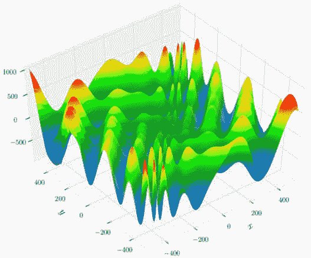

图 6.1：Eggholder 函数

来源：[`en.wikipedia.org/wiki/File:Eggholder_function.pdf`](https://en.wikipedia.org/wiki/File:Eggholder_function.pdf)

该函数的数学表达式如下：

f(x, y) = − (y + 47) ⋅ sin √ ___________ | x _ 2  + (y + 47)|  − x ⋅ sin √ ___________ |x − (y + 47)|

它通常在每个维度的搜索空间范围 [-512, 512] 上进行评估。已知该函数的全局最小值位于 *x=512, y = 404.2319*，此时函数值为 *-959.6407*。

在接下来的小节中，我们将尝试使用遗传算法方法找到全局最小值。

## 使用遗传算法优化 Eggholder 函数

我们为优化 Eggholder 函数创建的基于遗传算法的程序位于以下链接的`01_optimize_eggholder.py` Python 程序中：

[`github.com/PacktPublishing/Hands-On-Genetic-Algorithms-with-Python-Second-Edition/blob/main/chapter_06/01_optimize_eggholder.py`](https://github.com/PacktPublishing/Hands-On-Genetic-Algorithms-with-Python-Second-Edition/blob/main/chapter_06/01_optimize_eggholder.py)

以下步骤突出显示了该程序的主要部分：

1.  程序开始时设置函数常量，即输入维度的数量（2，因为该函数在*x*-*y*平面上定义），以及前面提到的搜索空间边界：

    ```py
    DIMENSIONS = 2  # number of dimensions
    # boundaries, same for all dimensions
    BOUND_LOW, BOUND_UP = -512.0, 512.0  
    ```

1.  由于我们处理的是受特定边界限制的浮动点数，接下来我们定义一个辅助函数来生成在给定范围内均匀分布的随机浮动点数：

注

这个函数假设所有维度的上限和下限是相同的。

```py
def randomFloat(low, up):
    return [random.uniform(l, u) for l, \
        u in zip([low] * DIMENSIONS, [up] * DIMENSIONS)]
```

1.  接下来，我们定义**attrFloat**操作符。该操作符利用先前的辅助函数在给定边界内创建一个单一的随机浮动点数。然后，**attrFloat**操作符由**individualCreator**操作符使用，用于创建随机个体。接着是**populationCreator**，它可以生成所需数量的个体：

    ```py
    toolbox.register("attrFloat", randomFloat, BOUND_LOW, BOUND_UP)
    toolbox.register("individualCreator", tools.initIterate, \
        creator.Individual, toolbox.attrFloat)
    toolbox.register("populationCreator", tools.initRepeat, \
        list, toolbox.individualCreator)
    ```

1.  由于待最小化的对象是 Eggholder 函数，我们直接使用它作为适应度评估函数。由于个体是一个浮动点数的列表，维度（或长度）为 2，我们相应地从个体中提取**x**和**y**值，然后计算该函数：

    ```py
    def eggholder(individual):
        x = individual[0]
        y = individual[1]
        f = (
            -(y + 47.0) * np.sin(np.sqrt(abs(x / 2.0 + (y + 47.0))))
            - x * np.sin(np.sqrt(abs(x - (y + 47.0))))
        )
        return f,   # return a tuple
    toolbox.register("evaluate", eggholder)
    ```

1.  接下来是遗传操作符。由于*选择*操作符与个体类型无关，并且到目前为止我们在使用*锦标赛选择*（锦标赛大小为 2）结合*精英主义方法*方面经验良好，因此我们将在此继续使用它。另一方面，*交叉*和*变异*操作符需要针对给定边界内的浮动点数进行专门化，因此我们使用 DEAP 提供的**cxSimulatedBinaryBounded**操作符进行交叉，使用**mutPolynomialBounded**操作符进行变异：

    ```py
    # Genetic operators:
    toolbox.register("select", tools.selTournament, tournsize=2)
    toolbox.register("mate", tools.cxSimulatedBinaryBounded, \
        low=BOUND_LOW, up=BOUND_UP, eta=CROWDING_FACTOR)
    toolbox.register("mutate", tools.mutPolynomialBounded, \
        low=BOUND_LOW, up=BOUND_UP, eta=CROWDING_FACTOR, \
        indpb=1.0/DIMENSIONS)
    ```

1.  如我们多次操作所示，我们使用了修改过的 DEAP 简单遗传算法流程，我们在其中加入了*精英主义*——保留最好的个体（名人堂成员），并将它们传递到下一代，不受遗传操作符的影响：

    ```py
    population, logbook = elitism.eaSimpleWithElitism(population,
        toolbox,
        cxpb=P_CROSSOVER,
        mutpb=P_MUTATION,
        ngen=MAX_GENERATIONS,
        stats=stats,
        halloffame=hof,
        verbose=True)
    ```

1.  我们将从以下遗传算法设置参数开始。由于 Eggholder 函数可能有些难以优化，考虑到低维度的数量，我们使用相对较大的种群大小：

    ```py
    # Genetic Algorithm constants:
    POPULATION_SIZE = 300
    P_CROSSOVER = 0.9
    P_MUTATION = 0.1
    MAX_GENERATIONS = 300
    HALL_OF_FAME_SIZE = 30
    ```

1.  除了之前的常规遗传算法常数外，我们现在需要一个新的常数——**拥挤因子**（eta），它被交叉和变异操作使用：

    ```py
    CROWDING_FACTOR = 20.0
    ```

重要提示

也可以为交叉和变异分别定义不同的拥挤因子。

我们终于准备好运行程序了。使用这些设置得到的结果如下所示：

```py
-- Best Individual = [512.0, 404.23180541839946]
-- Best Fitness = -959.6406627208509
```

这意味着我们已经找到了全局最小值。

如果我们查看程序生成的统计图（如下所示），可以看出算法一开始就找到了某些局部最小值，随后进行了小幅度的增量改进，直到最终找到了全局最小值：

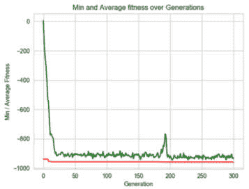

图 6.2: 优化 Eggholder 函数的第一个程序的统计数据

一个有趣的区域是第 180 代左右——让我们在下一个小节中进一步探讨。

## 通过增加变异率来提高速度

如果我们放大适应度轴的下部区域，会注意到在第 180 代左右，最佳结果（红线）有了相对较大的改善，同时平均结果（绿线）发生了较大波动：

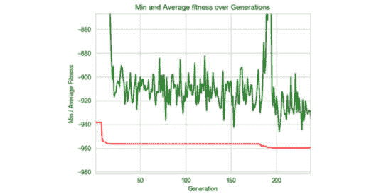

图 6.3: 第一个程序的统计图放大部分

解释这个现象的一种方式是，或许引入更多噪声能够更快地得到更好的结果。这可能是我们之前讨论过的**探索与开发**原则的另一种表现——增加探索（在图中表现为噪声）可能帮助我们更快地找到全局最小值。增加探索度的一个简单方法是提高变异的概率。希望使用精英主义——保持最佳结果不变——可以防止我们过度探索，这会导致类似随机搜索的行为。

为了验证这个想法，我们将变异概率从 0.1 提高到 0.5：

```py
P_MUTATION = 0.5
```

运行修改后的程序后，我们再次找到了全局最小值，但速度要快得多，从输出结果以及接下来展示的统计图中可以明显看出，红线（最佳结果）很快就达到了最优，而平均分数（绿色）比之前更嘈杂，并且离最佳结果更远：

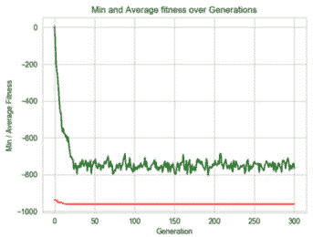

图 6.4: 优化 Eggholder 函数的程序统计数据，变异概率增大

我们在处理下一个基准函数——Himmelblau 函数时会牢记这一点。

# 优化 Himmelblau 函数

另一个常用的优化算法基准函数是 Himmelblau 函数，如下图所示：

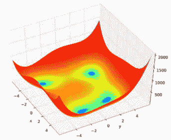

图 6.5: Himmelblau 函数

来源：[`commons.wikimedia.org/wiki/File:Himmelblau_function.svg`](https://commons.wikimedia.org/wiki/File:Himmelblau_function.svg)

图片由 Morn the Gorn 提供

该函数可以用以下数学表达式表示：

f(x, y) = (x 2 + y − 11) 2 + (x + y 2 − 7) 2

它通常在每个维度边界为[-5, 5]的搜索空间中进行评估。

尽管与 Eggholder 函数相比，这个函数看起来更简单，但它引起了人们的兴趣，因为它是**多模态**的；换句话说，它有多个全局最小值。准确来说，这个函数有四个全局最小值，值为 0，分别位于以下位置：

+   x=3.0, y=2.0

+   x=−2.805118, y=3.131312

+   x=−3.779310, y=−3.283186

+   x=3.584458, y=−1.848126

这些位置在以下的函数等高线图中进行了描述：

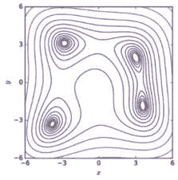

图 6.6：Himmelblau 函数的等高线图

来源：[`commons.wikimedia.org/wiki/File:Himmelblau_contour.svg`](https://commons.wikimedia.org/wiki/File:Himmelblau_contour.svg)

图片由 Nicoguaro 提供

在优化多模态函数时，我们通常希望找到所有（或大多数）最小值的位置。然而，让我们先从找到一个最小值开始，这将在下一小节中完成。

## 使用遗传算法优化 Himmelblau 函数

我们为找到 Himmelblau 函数的单一最小值所创建的基于遗传算法的程序位于`02_optimize_himmelblau.py` Python 程序中，具体位置见以下链接：

[`github.com/PacktPublishing/Hands-On-Genetic-Algorithms-with-Python-Second-Edition/blob/main/chapter_06/02_optimize_himmelblau.py`](https://github.com/PacktPublishing/Hands-On-Genetic-Algorithms-with-Python-Second-Edition/blob/main/chapter_06/02_optimize_himmelblau.py)

该程序与我们用来优化 Eggholder 函数的程序类似，下面列出了几个主要的区别：

1.  我们为此函数设定了边界为[-5.0, 5.0]：

    ```py
    BOUND_LOW, BOUND_UP = -5.0, 5.0  # boundaries for all dimensions
    ```

1.  现在我们使用 Himmelblau 函数作为适应度评估器：

    ```py
    def himmelblau(individual):
        x = individual[0]
        y = individual[1]
        f = (x ** 2 + y - 11) ** 2 + (x + y ** 2 - 7) ** 2
        return f,  # return a tuple
    toolbox.register("evaluate", himmelblau)
    ```

1.  由于我们优化的函数有多个最小值，因此观察运行结束后找到的解的分布可能很有趣。因此，我们添加了一个散点图，显示了四个全局最小值的位置以及最终种群在同一*x*-*y*平面上的分布：

    ```py
    plt.figure(1)
    globalMinima = [[3.0, 2.0], [-2.805118, 3.131312],
         [-3.779310, -3.283186], [3.584458, -1.848126]]
    plt.scatter(*zip(*globalMinima), marker='X', color='red', 
        zorder=1)
    plt.scatter(*zip(*population), marker='.', color='blue', 
        zorder=0)
    ```

1.  我们还打印了名人堂成员——在运行过程中找到的最佳个体：

    ```py
    print("- Best solutions are:")
    for i in range(HALL_OF_FAME_SIZE):
        print(i, ": ", hof.items[i].fitness.values[0],
               " -> ", hof.items[i])
    ```

运行程序后，结果显示我们找到了四个最小值中的一个（x=3.0, y=2.0）：

```py
-- Best Individual = [2.9999999999987943, 2.0000000000007114]
-- Best Fitness = 4.523490304795033e-23
```

名人堂成员的输出表明它们都代表相同的解：

```py
- Best solutions are:
0 : 4.523490304795033e-23 -> [2.9999999999987943, 2.0000000000007114]
1 : 4.523732642865117e-23 -> [2.9999999999987943, 2.000000000000697]
2 : 4.523900512465748e-23 -> [2.9999999999987943, 2.0000000000006937]
3 : 4.5240633333565856e-23 -> [2.9999999999987943, 2.00000000000071]
...
```

下图展示了整个种群的分布，进一步确认了遗传算法已经收敛到四个函数最小值中的一个——即位于(x=3.0, y=2.0)的最小值：

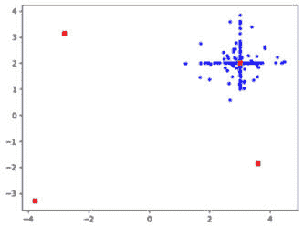

图 6.7：第一次运行结束时种群的散点图，显示了四个函数的最小值

此外，可以明显看出，种群中的许多个体具有我们找到的最小值的`x`或`y`分量。

这些结果代表了我们通常从遗传算法中期望的结果——识别全局最优解并向其收敛。由于在此情况下我们有多个最小值，因此预计算法会收敛到其中一个。最终会收敛到哪个最小值，主要取决于算法的随机初始化。正如你可能记得的，我们迄今为止在所有程序中都使用了固定的随机种子（值为 42）：

```py
RANDOM_SEED = 42
random.seed(RANDOM_SEED)
```

这样做是为了使结果具有可重复性；然而，在现实中，我们通常会为不同的运行使用不同的随机种子值，方法是注释掉这些行或显式地将常量设置为不同的值。

例如，如果我们将种子值设置为 13，我们将得到解(x=−2.805118, y=3.131312)，如下图所示：

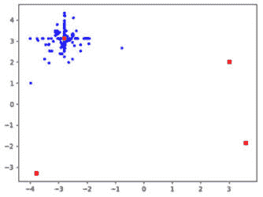

图 6.8：第二次运行结束时种群的散点图，显示了四个函数的最小值

如果我们将种子值更改为 17，程序执行将得到解(x=3.584458, y=−1.848126)，如下图所示：

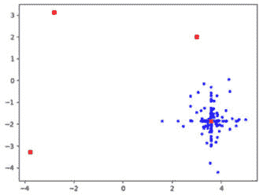

图 6.9：第三次运行结束时种群的散点图，显示了四个函数的最小值

然而，如果我们想在一次运行中找到*所有*的全局最小值呢？正如我们将在下一小节中看到的，遗传算法为我们提供了一种追求这一目标的方法。

## 使用分区和共享来寻找多个解

在*第二章*《理解遗传算法的关键组件》中，我们提到过遗传算法中的**分区**和**共享**模拟了自然环境被划分为多个子环境或*生态位*的方式。这些生态位由不同的物种或子种群填充，利用每个生态位中独特的资源，而在同一生态位中的个体则必须竞争相同的资源。在遗传算法中实现共享机制将鼓励个体探索新的生态位，并可用于寻找多个最优解，每个解都被认为是一个生态位。实现共享的常见方法是将每个个体的原始适应度值与所有其他个体的距离的（某些函数的）合并值相除，从而通过在个体之间共享局部资源来有效地惩罚拥挤的种群。

让我们尝试将这个思路应用于 Himmelblau 函数的优化过程，看看它是否能帮助在一次运行中找到所有四个极小值。这个尝试实现于`03_optimize_himmelblau_sharing.py`程序中，位于以下链接：

[`github.com/PacktPublishing/Hands-On-Genetic-Algorithms-with-Python-Second-Edition/blob/main/chapter_06/03_optimize_himmelblau_sharing.py`](https://github.com/PacktPublishing/Hands-On-Genetic-Algorithms-with-Python-Second-Edition/blob/main/chapter_06/03_optimize_himmelblau_sharing.py)

该程序基于之前的程序，但我们必须做了一些重要的修改，描述如下：

1.  首先，实现共享机制通常需要我们优化一个产生正适应度值的函数，并寻找*最大值*，而不是*最小值*。这使我们能够通过划分原始适应度值来减少适应度，并实际在相邻个体之间共享资源。由于 Himmelblau 函数产生的值介于 0 到（大约）2,000 之间，我们可以使用一个修改后的函数，该函数返回 2,000 减去原始值，这样可以保证所有函数值都是正的，同时将极小值转换为极大值，返回值为 2,000。由于这些点的位置不会改变，找到它们仍然能达到我们最初的目的：

    ```py
    def himmelblauInverted(individual):
        x = individual[0]
        y = individual[1]
        f = (x ** 2 + y - 11) ** 2 + (x + y ** 2 - 7) ** 2
        return 2000.0 - f,  # return a tuple
    toolbox.register("evaluate", himmelblauInverted)
    ```

1.  为了完成转换，我们将适应度策略重新定义为*最大化*策略：

    ```py
    creator.create("FitnessMax", base.Fitness, weights=(1.0,))
    ```

1.  为了实现*共享*，我们首先创建了两个额外的常量：

    ```py
    DISTANCE_THRESHOLD = 0.1
    SHARING_EXTENT = 5.0
    ```

1.  接下来，我们需要实现共享机制。一个便捷的实现位置是在*选择*遗传算子中。选择算子是检查所有个体适应度值并用于选择下一代父母的位置。这使得我们能够注入一些代码，在选择操作发生之前重新计算这些适应度值，然后在继续之前恢复原始的适应度值，以便进行跟踪。为了实现这一点，我们实现了一个新的**selTournamentWithSharing()**函数，它与我们一直使用的原始**tools.selTournament()**函数具有相同的函数签名：

    ```py
    def selTournamentWithSharing(individuals, k, tournsize, 
        fit_attr="fitness"):
    ```

    该函数首先将原始的适应度值存放在一旁，以便稍后可以恢复。接着，它遍历每个个体，通过计算一个数字`sharingSum`来决定如何划分其适应度值。这个和是通过计算当前个体与种群中每个其他个体位置之间的距离来累加的。如果距离小于`DISTANCE_THRESHOLD`常量定义的阈值，则会将以下值加到累积和中：

    1 −  𝒹𝒾𝓈𝓉𝒶𝓃𝒸ℯ  ___________________  DISTANCE − THRESHOLD ×  1  ______________  SHARING − EXTENT

    这意味着在以下情况下，适应度值的*下降*会更大：

    +   个体之间的（归一化）距离较小

    +   **SHARING_EXTENT**常数的值较大

    在重新计算每个个体的适应度值后，使用新的适应度值进行*锦标赛选择*：

    ```py
    selected = tools.selTournament(individuals, k, tournsize, 
        fit_attr)
    ```

    最后，检索原始适应度值：

    ```py
    for i, ind in enumerate(individuals):
        ind.fitness.values = origFitnesses[i],
    ```

1.  最后，我们添加了一个图表，展示了最佳个体——名人堂成员——在*x*-*y*平面上的位置，并与已知的最优位置进行对比，类似于我们对整个种群所做的操作：

    ```py
    plt.figure(2)
    plt.scatter(*zip(*globalMaxima), marker='x', color='red', 
        zorder=1)
    plt.scatter(*zip(*hof.items), marker='.', color='blue', 
        zorder=0)
    ```

当我们运行这个程序时，结果并没有让人失望。通过检查名人堂成员，似乎我们已经找到了所有四个最优位置：

```py
- Best solutions are:
0 : 1999.9997428476076 -> [3.00161237138945, 1.9958270919300878]
1 : 1999.9995532774788 -> [3.585506608049694, -1.8432407550446581]
2 : 1999.9988186889173 -> [3.585506608049694, -1.8396197402430106]
3 : 1999.9987642838498 -> [-3.7758887140006174, -3.285804345540637]
4 : 1999.9986563457114 -> [-2.8072634380293766, 3.125893564009283]
...
```

以下图示展示了名人堂成员的分布，进一步证实了这一点：

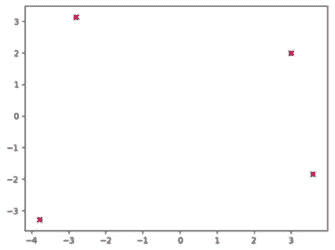

图 6.10：使用生态位分割法时，在运行结束时最佳解的散点图，以及四个函数的最小值。

同时，展示整个种群分布的图表表明，种群是如何围绕四个解散布的：

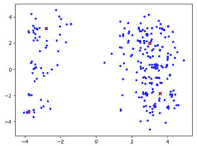

图 6.11：使用生态位分割法时，在运行结束时种群的散点图，以及四个函数的最小值。

尽管这看起来令人印象深刻，但我们需要记住，我们所做的事情在实际情况中可能更难以实现。首先，我们对选择过程所做的修改增加了计算复杂度和算法的耗时。此外，通常需要增加种群规模，以便它能够充分覆盖所有感兴趣的区域。在某些情况下，共享常数的值可能很难确定——例如，如果我们事先不知道各个峰值之间可能有多近。然而，我们可以始终使用这一技术大致确定感兴趣区域，然后使用标准版本的算法进一步探索每一个区域。

寻找多个最优点的另一种方法属于**约束优化**的范畴，这是下一节的内容。

# Simionescu 的函数与约束优化

初看之下，Simionescu 的函数可能看起来并不特别有趣。然而，它附带的约束条件使得它在处理时既富有挑战性，又令人赏心悦目。

该函数通常在每个维度由[-1.25, 1.25]限定的搜索空间内进行评估，可以用以下数学表达式表示：

f(x, y) = 0.1xy

在这里，*x, y*的值满足以下条件：

x 2 + y 2 ≤ [1 + 0.2 ⋅ cos(8 ⋅ arctan  x _ y )] 2

该约束有效地限制了被认为对该函数有效的*x*和*y*值。结果如下图所示：

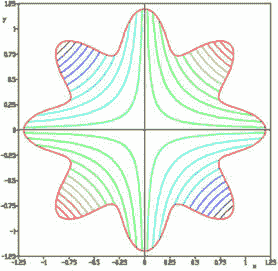

图 6.12：受约束的 Simionescu 函数的轮廓图

来源：[`commons.wikimedia.org/wiki/File:Simionescu%27s_function.PNG`](https://commons.wikimedia.org/wiki/File:Simionescu%27s_function.PNG)

图片来自 Simiprof

花朵状的边界是由约束所形成的，而轮廓的颜色表示实际值——红色表示最高值，紫色表示最低值。如果没有约束，最小值点将位于(1.25, -1.25)和(-1.25, 1.25)的位置。然而，在应用约束后，函数的全局最小值位于以下位置：

+   *x*=0.84852813, *y*=–0.84852813

+   *x*=−0.84852813, *y*=0.84852813

这些代表了包含紫色轮廓的两个相对花瓣的尖端。两个最小值的评估结果均为-0.072。

在接下来的小节中，我们将尝试使用实值编码的遗传算法方法来寻找这些最小值。

## 受约束优化与遗传算法

我们已经在*第五章*《约束满足》中处理过约束问题，当时我们讨论了搜索问题中的约束条件。然而，虽然搜索问题为我们呈现了无效状态或组合，但在这里，我们需要处理的是连续空间中的约束，这些约束被定义为数学不等式。

然而，两个案例的处理方法相似，差异在于实现方式。让我们重新回顾这些方法：

+   最好的方法是在可能的情况下消除约束违规的可能性。实际上，在本章中我们一直在这样做，因为我们使用了带有边界的区域来处理函数。这些实际上是对每个输入变量的简单约束。我们通过在给定边界内生成初始种群，并利用如**cxSimulatedBinaryBounded()**等有界遗传算子，使得结果保持在给定的边界内。不幸的是，当约束比仅仅是输入变量的上下限更复杂时，这种方法可能难以实现。

+   另一种方法是丢弃违反任何给定约束条件的候选解。正如我们之前提到的，这种方法会导致这些解中包含的信息丧失，并可能显著减慢优化过程的速度。

+   下一种方法是修复任何违反约束的候选解，通过修改它使其不再违反约束。这可能会证明很难实现，同时也可能导致显著的信息丧失。

+   最后，适用于我们在*第五章*中的方法，*约束满足*，是通过降低违反约束的候选解的得分并使其不那么可取来惩罚违反约束的解。对于搜索问题，我们通过创建一个成本函数来实现这一方法，该函数为每个约束违反加上一个固定的成本。在连续空间的情况下，我们可以使用固定的惩罚，也可以根据违反约束的程度增加惩罚。

当采取最后一种方法——对约束违反进行惩罚——时，我们可以利用 DEAP 框架提供的一个特性，即**惩罚函数**，我们将在下一小节中演示这一点。

## 使用遗传算法优化 Simionescu 函数

我们为优化 Simionescu 函数创建的基于遗传算法的程序位于`04_optimize_simionescu.py` Python 程序中，链接如下：

[`github.com/PacktPublishing/Hands-On-Genetic-Algorithms-with-Python-Second-Edition/blob/main/chapter_06/04_optimize_simionescu.py`](https://github.com/PacktPublishing/Hands-On-Genetic-Algorithms-with-Python-Second-Edition/blob/main/chapter_06/04_optimize_simionescu.py)

这个程序与我们在本章中第一次使用的程序非常相似，最初是为 Eggholder 函数创建的，具有以下突出差异：

1.  设置边界的常量已调整，以匹配 Simionescu 函数的域：

    ```py
    BOUND_LOW, BOUND_UP = -1.25, 1.25
    ```

1.  此外，一个新的常量决定了违反约束时的固定惩罚（或成本）：

    ```py
    PENALTY_VALUE = 10.0
    ```

1.  适应度现在由 Simionescu 函数的定义决定：

    ```py
    def simionescu(individual):
        x = individual[0]
        y = individual[1]
        f = 0.1 * x * y
        return f,  # return a tuple
    toolbox.register("evaluate",simionescu)
    ```

1.  有趣的部分从这里开始：我们现在定义一个新的**feasible()**函数，该函数通过约束条件指定有效的输入域。对于符合约束条件的*x, y*值，该函数返回**True**，否则返回**False**：

    ```py
    def feasible(individual):
        x = individual[0]
        y = individual[1]
        return x**2 + y**2 <= 
            (1 + 0.2 * math.cos(8.0 * math.atan2(x, y)))**2
    ```

1.  然后，我们使用 DEAP 的**toolbox.decorate()**操作符与**tools.DeltaPenalty()**函数结合，以修改（*装饰*）原始的适应度函数，使得每当不满足约束条件时，适应度值会受到惩罚。**DeltaPenalty()**接受**feasible()**函数和固定惩罚值作为参数：

    ```py
    toolbox.decorate("evaluate", tools.DeltaPenalty(
    feasible,PENALTY_VALUE))
    ```

重要提示

**DeltaPenalty()**函数还可以接受第三个参数，表示距离可行区域的距离，使得惩罚随着距离的增加而增加。

现在，程序已经可以使用了！结果表明，我们确实找到了已知的两个最小值之一：

```py
-- Best Individual = [0.8487712463169383, -0.8482833185888866]
-- Best Fitness = -0.07199984895485578
```

第二个位置怎么样？继续阅读——我们将在下一小节中寻找它。

## 使用约束条件找到多个解

在本章早些时候，优化 Himmelblau 函数时，我们寻求多个最小解，并观察到两种可能的做法——一种是改变随机种子，另一种是使用**分区和共享**。在这里，我们将展示第三种方法，通过...约束来实现！

我们为 Himmelblau 函数使用的分区技术有时被称为*并行分区*，因为它试图同时定位多个解。正如我们之前提到的，它存在一些实际缺陷。另一方面，*串行分区*（或*顺序分区*）是一种每次寻找一个解的方法。为了实现串行分区，我们像往常一样使用遗传算法来找到最佳解。然后我们更新适应度函数，以便惩罚已找到解的区域，从而鼓励算法探索问题空间中的其他区域。这一过程可以重复多次，直到没有找到额外的可行解。

有趣的是，通过对搜索空间施加约束，惩罚靠近先前找到的解的区域是可实现的，正如我们刚刚学会如何向函数应用约束，我们可以利用这些知识来实现串行分区，示例如下：

为了找到 Simionescu 函数的第二个最小值，我们创建了`05_optimize_simionescu_second.py` Python 程序，位于以下链接：

[`github.com/PacktPublishing/Hands-On-Genetic-Algorithms-with-Python-Second-Edition/blob/main/chapter_06/05_optimize_simionescu_second.py`](https://github.com/PacktPublishing/Hands-On-Genetic-Algorithms-with-Python-Second-Edition/blob/main/chapter_06/05_optimize_simionescu_second.py)

该程序几乎与之前的程序相同，只做了以下几个小修改：

1.  我们首先添加了一个常数，用于定义*距离阈值*，该阈值用于与先前找到的解的距离——新解如果距离任何旧解小于此阈值，则会受到惩罚：

    ```py
    DISTANCE_THRESHOLD = 0.1
    ```

1.  我们接着通过使用一个带有多个子句的条件语句，向**feasible()**函数的定义中添加了第二个约束条件。新的约束适用于距离已经找到的解（x=0.848, y = -0.848）阈值更近的输入值：

    ```py
    def feasible(individual): 
        x = individual[0] 
        y = individual[1] 
        if x**2 + y**2 > (1 + 0.2 * math.cos(
            8.0 * math.atan2(x, y))
        )**2: 
            return False
        elif (x - 0.848)**2 + (y + 0.848)**2 < 
            DISTANCE_THRESHOLD**2:
            return False
        else:
            return True
    ```

运行该程序时，结果表明我们确实找到了第二个最小值：

```py
-- Best Individual = [-0.8473430282562487, 0.8496942440090975]
-- Best Fitness = -0.07199824938105727
```

鼓励你将这个最小点作为另一个约束添加到`feasible()`函数中，并验证再次运行程序时，*不会*找到输入空间中任何其他同样的最小值位置。

# 总结

在本章中，我们介绍了连续搜索空间优化问题，以及如何使用遗传算法表示并解决这些问题，特别是通过利用 DEAP 框架。接着，我们探索了几个实际的连续函数优化问题——埃格霍尔德函数、希梅尔布劳函数和西蒙内斯库函数——以及它们基于 Python 的解决方案。此外，我们还讲解了寻找多重解和处理约束的方法。

在本书接下来的四章中，我们将演示我们目前所学的各种技术如何应用于解决**机器学习**（**ML**）和**人工智能**（**AI**）相关问题。这些章节的第一章将提供一个关于**监督学习**（**SL**）的快速概述，并展示遗传算法如何通过选择给定数据集的最相关部分来改善学习模型的结果。

# 进一步阅读

如需更多信息，请参考以下资源：

+   *数学优化：寻找* *函数的最小值*：

    [`scipy-lectures.org/advanced/mathematical_optimization/`](http://scipy-lectures.org/advanced/mathematical_optimization/)

+   *优化测试函数* *和数据集*：

    [`www.sfu.ca/~ssurjano/optimization.html`](https://www.sfu.ca/~ssurjano/optimization.html)

+   *约束优化简介*：

    [`web.stanford.edu/group/sisl/k12/optimization/MO-unit3-pdfs/3.1introandgraphical.pdf`](https://web.stanford.edu/group/sisl/k12/optimization/MO-unit3-pdfs/3.1introandgraphical.pdf)

+   DEAP 中的约束处理：

    [`deap.readthedocs.io/en/master/tutorials/advanced/constraints.html`](https://deap.readthedocs.io/en/master/tutorials/advanced/constraints.html)
