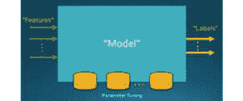
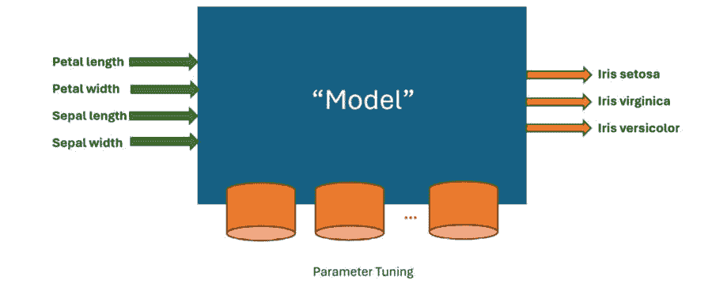
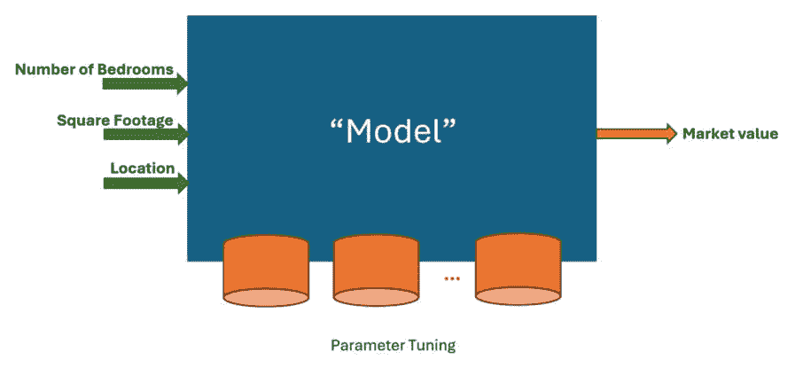

# 第七章：使用特征选择增强机器学习模型

本章介绍了如何通过遗传算法选择提供输入数据中的最佳特征，从而提高 **有监督机器学习** 模型的性能。我们将首先简要介绍机器学习，然后描述两种主要的有监督学习任务——**回归** 和 **分类**。接着，我们将讨论在这些模型的性能方面，**特征选择**的潜在好处。随后，我们将演示如何利用遗传算法确定由 **Friedman-1 测试** 回归问题生成的真正特征。然后，我们将使用真实的 **Zoo 数据集** 创建一个分类模型，并通过遗传算法来隔离任务的最佳特征，从而提高其准确性。

本章我们将涵盖以下主题：

+   理解有监督机器学习的基本概念，以及回归和分类任务

+   理解特征选择对有监督学习模型性能的影响

+   使用通过 DEAP 框架编码的遗传算法进行特征选择，增强 Friedman-1 测试回归问题的回归模型性能

+   使用通过 DEAP 框架编码的遗传算法进行特征选择，增强 Zoo 数据集分类问题的分类模型性能

我们将从对有监督机器学习的快速回顾开始本章内容。如果你是经验丰富的数据科学家，可以跳过这些入门部分。

# 技术要求

在本章中，我们将使用 Python 3 和以下支持库：

+   **deap**

+   **numpy**

+   **pandas**

+   **matplotlib**

+   **seaborn**

+   **scikit-learn** – 本章介绍

重要提示

如果你使用我们提供的 **requirements.txt** 文件（参见 *第三章*），这些库已经包含在你的环境中。

此外，我们还将使用 *UCI Zoo* *数据集*（[`archive.ics.uci.edu/ml/datasets/zoo`](https://archive.ics.uci.edu/ml/datasets/zoo)）。

本章中使用的程序可以在本书的 GitHub 仓库中找到，地址为 [`github.com/PacktPublishing/Hands-On-Genetic-Algorithms-with-Python-Second-Edition/tree/main/chapter_07`](https://github.com/PacktPublishing/Hands-On-Genetic-Algorithms-with-Python-Second-Edition/tree/main/chapter_07)。

查看以下视频，看看代码是如何运行的：

[`packt.link/OEBOd`](https://packt.link/OEBOd)。

# 有监督的机器学习

**机器学习** 这个术语通常指的是一个接收输入并生成输出的计算机程序。我们的目标是训练这个程序，也称为 **模型**，使其能够对给定的输入生成正确的输出，*而无需明确* *编程*。

在此训练过程中，模型通过调整其内部参数来学习输入与输出之间的映射。训练模型的一种常见方法是为它提供一组已知正确输出的输入。对于这些输入，我们告诉模型正确的输出是什么，以便它可以调整或调优自己，最终为每个给定输入产生期望的输出。这种调优是学习过程的核心。

多年来，已经开发出许多类型的机器学习模型。每种模型都有其独特的内部参数，这些参数可以影响输入与输出之间的映射，并且这些参数的值可以进行调整，如下图所示：


图 7.1：机器学习模型的参数调整

例如，如果模型正在实现一个*决策树*，它可能包含几个`IF-THEN`语句，可以按如下方式表示：

```py
IF <input value> IS LESS THEN <some threshold value>
    THEN <go to some target branch>
```

在这种情况下，阈值和目标分支的身份都是可以在学习过程中调整或调优的参数。

为了调整内部参数，每种类型的模型都有一个相应的*学习算法*，该算法会遍历给定的输入和输出值，并尝试使每个输入的输出与给定的输出相匹配。为了实现这一目标，典型的学习算法会衡量实际输出与期望输出之间的差异（也称为*误差*，或更广义的*损失*）；然后，算法会通过调整模型的内部参数来最小化这个误差。

监督学习的两种主要类型是**分类**和**回归**，将在以下小节中进行描述。

## 分类

在执行分类任务时，模型需要决定某个输入属于哪个*类别*。每个类别由一个单独的输出（称为**标签**）表示，而输入被称为**特征**：



图 7.2：机器学习分类模型

例如，在著名的*鸢尾花数据集*（[`archive.ics.uci.edu/ml/datasets/Iris`](https://archive.ics.uci.edu/ml/datasets/Iris)）中，有四个特征：**花瓣长度**、**花瓣宽度**、**萼片长度**和**萼片宽度**。这些代表了实际鸢尾花的手动测量值。

在输出方面，有三个标签：**鸢尾花 Setosa**、**鸢尾花 Virginica**和**鸢尾花 Versicolor**。这些代表了数据集中三种不同类型的鸢尾花。

当输入值代表从某个鸢尾花中获取的测量值时，我们期望正确标签的输出值变高，而其他两个标签的输出值变低：



图 7.3：鸢尾花分类器示意图

分类任务有许多现实生活中的应用，例如银行贷款和信用卡审批、电子邮件垃圾邮件检测、手写数字识别和人脸识别。本章后面将演示使用*动物园数据集*进行动物类型分类。

监督学习的第二种主要类型，**回归**，将在下一个子节中描述。

## 回归

与分类任务相比，回归任务的模型将输入值映射为**单一输出**，以提供一个连续值，如下图所示：


图 7.4：机器学习回归模型

给定输入值，模型预计会预测输出的正确值。

回归的实际应用实例包括预测股票价值、葡萄酒质量或房屋市场价格，如下图所示：



图 7.5：房价回归模型

在前面的图像中，输入是描述给定房屋信息的特征，而输出是预测的房屋价值。

有许多类型的模型用于执行分类和回归任务——其中一些将在下一个子节中描述。

## 监督学习算法

如前所述，每个监督学习模型由一组内部可调参数和一个调整这些参数的算法组成，旨在实现所需结果。

一些常见的监督学习模型/算法如下：

+   **支持向量机**（**SVMs**）：将给定输入映射为空间中的点，使得属于不同类别的输入通过尽可能大的间隔被分开。

+   **决策树**：一类利用树状图的算法，其中分支点代表决策，分支代表其后果。

+   **随机森林**：在训练阶段创建大量决策树，并使用它们输出的组合。

+   **人工神经网络**：由多个简单节点或神经元组成的模型，这些神经元可以以不同方式互联。每个连接可以有一个权重，控制从一个神经元到下一个神经元的信号强度。

有一些技术可以用来提高和增强这些模型的性能。一种有趣的技术——**特征选择**——将在下一节中讨论。

# 监督学习中的特征选择

正如我们在上一节所看到的，监督学习模型接收一组输入，称为**特征**，并将它们映射到一组输出。假设特征所描述的信息对于确定相应输出的值是有用的。乍一看，似乎我们使用的输入信息越多，正确预测输出的机会就越大。然而，在许多情况下，事实恰恰相反；如果我们使用的一些特征无关紧要或是冗余的，结果可能是模型准确性的（有时是显著的）下降。

特征选择是从给定的所有特征集中选择最有益和最重要的特征的过程。除了提高模型的准确性外，成功的特征选择还可以带来以下优势：

+   模型的训练时间较短。

+   结果训练得到的模型更简单，更易于解释。

+   结果模型可能提供更好的泛化能力，也就是说，它们在处理与训练数据不同的新输入数据时表现更好。

在查看执行特征选择的方法时，遗传算法是一个自然的候选方法。我们将在下一节中演示如何将它们应用于从人工生成的数据集中找到最佳特征。

# 为 Friedman-1 回归问题选择特征

*Friedman-1*回归问题由 Friedman 和 Breiman 创建，描述了一个单一的输出值 y，该值是五个输入值 x 0、x 1、x 2、x 3、x 4 和随机生成噪声的函数，按照以下公式：

y(x 0, x 1, x 2, x 3, x 4)

= 10 ∙ sin(π ∙ x 0 ∙ x 1) + 20 (x 2 − 0.5) 2 + 10 x 3 + 5 x 4 + 噪声

∙ N(0, 1)

输入变量 x 0 . .x 4 是独立的，且在区间[0, 1]内均匀分布。公式中的最后一个组成部分是随机生成的噪声。噪声是**正态分布**的，并与常数*噪声*相乘，后者决定了噪声的水平。

在 Python 中，`scikit-learn`（`sklearn`）库提供了`make_friedman1()`函数，我们可以使用它来生成包含所需样本数量的数据集。每个样本由随机生成的 x0...x4 值及其对应的计算 y 值组成。然而，值得注意的是，我们可以通过将`n_features`参数设置为大于五的值，告诉函数向原来的五个特征中添加任意数量的无关输入变量。例如，如果我们将`n_features`的值设置为 15，我们将得到一个包含原始五个输入变量（或特征）的数据集，这些特征根据前面的公式生成了*y*值，并且还有另外 10 个与输出完全无关的特征。这可以用于测试各种回归模型对噪声和数据集中无关特征存在的抗干扰能力。

我们可以利用这个功能来测试遗传算法作为特征选择机制的有效性。在我们的测试中，我们将使用`make_friedman1()`函数创建一个包含 15 个特征的数据集，并使用遗传算法搜索提供最佳性能的特征子集。因此，我们预计遗传算法会选择前五个特征，并去除其余的特征，假设当仅使用相关特征作为输入时，模型的准确性会更好。遗传算法的适应度函数将使用回归模型，对于每一个潜在解，都会使用仅包含选择特征的数据集训练原始特征的子集。

和往常一样，我们将从选择合适的解决方案表示开始，如下一小节所述。

## 解决方案表示

我们算法的目标是找到一个能够提供最佳性能的特征子集。因此，一个解决方案需要指示哪些特征被选择，哪些被丢弃。一个明显的方法是使用**二进制值列表**来表示每个个体。列表中的每一项对应数据集中的一个特征。值为 1 表示选择相应的特征，而值为 0 表示该特征未被选择。这与我们在 *第四章**,* *组合优化*中描述的**背包 0-1 问题**方法非常相似。

解决方案中每个 0 的存在将被转换为从数据集中删除相应特征的数据列，正如我们在下一小节中所看到的那样。

## Python 问题表示

为了封装 Friedman-1 特征选择问题，我们创建了一个名为 `Friedman1Test` 的 Python 类。该类可以在 `friedman.py` 文件中找到，文件位置在 [`github.com/PacktPublishing/Hands-On-Genetic-Algorithms-with-Python-Second-Edition/blob/main/chapter_07/friedman.py`](https://github.com/PacktPublishing/Hands-On-Genetic-Algorithms-with-Python-Second-Edition/blob/main/chapter_07/friedman.py)。

该类的主要部分如下：

1.  类的 **__init__()** 方法创建了数据集，具体如下：

    ```py
    self.X, self.y = datasets.make_friedman1(
        n_samples=self.numSamples,
        n_features=self.numFeatures,
        noise=self.NOISE,
        random_state=self.randomSeed)
    ```

1.  然后，使用 **scikit-learn** **model_selection.train_test_split()** 方法将数据划分为两个子集——训练集和验证集：

    ```py
    self.X_train,self.X_validation,self.y_train,self.y_validation = \
        model_selection.train_test_split(self.X, self.y,
            test_size=self.VALIDATION_SIZE,
            random_state=self.randomSeed)
    ```

    将数据分为 **训练集** 和 **验证集**，使我们能够在训练集上训练回归模型，其中为训练提供正确的预测，然后在单独的验证集上测试模型，在验证集中不提供正确的预测，而是将其与模型产生的预测进行比较。通过这种方式，我们可以测试模型是否能够泛化，而不是仅仅记住训练数据。

1.  接下来，我们创建回归模型，并选择了 **梯度提升回归器** (**GBR**) 类型。该模型在训练阶段创建了一个 **集成**（或聚合）决策树：

    ```py
    self.regressor = GradientBoostingRegressor(\
        random_state=self.randomSeed)
    ```

重要提示

在我们的示例中，我们传递了随机种子，以便回归器可以在内部使用它。通过这种方式，我们可以确保得到的结果是可重复的。

1.  该类的 **getMSE()** 方法用于确定我们为一组选定特征训练的梯度提升回归模型的性能。它接受一个对应于数据集中各特征的二进制值列表——值为 1 表示选择相应特征，值为 0 则表示该特征被丢弃。然后该方法删除训练集和验证集中与未选择特征对应的列：

    ```py
    zeroIndices = [i for i, n in enumerate(zeroOneList) if n == 0]
    currentX_train = np.delete(self.X_train, zeroIndices, 1)
    currentX_validation = np.delete(self.X_validation, 
        zeroIndices, 1)
    ```

1.  修改后的训练集——仅包含所选特征——用于训练回归器，而修改后的验证集用于评估回归器的预测：

    ```py
    self.regressor.fit(currentX_train, self.y_train)
    prediction = self.regressor.predict(currentX_validation)
    return mean_squared_error(self.y_validation, prediction)
    ```

    这里用于评估回归器的度量叫做 **均方误差** (**MSE**)，它计算模型预测值与实际值之间的平均平方差。该度量的 *较低* 值表示回归器的 *更好* 性能。

1.  类的 **main()** 方法创建了一个包含 15 个特征的 **Friedman1Test** 类的实例。然后，它反复使用 **getMSE()** 方法评估回归器在前 *n* 个特征上的性能，*n* 从 1 递增到 15：

    ```py
    for n in range(1, len(test) + 1):
        nFirstFeatures = [1] * n + [0] * (len(test) - n)
        score = test.getMSE(nFirstFeatures)
    ```

在运行 main 方法时，结果显示，当我们逐一添加前五个特征时，性能有所提高。然而，之后每增加一个特征都会降低回归器的性能：

```py
1 first features: score = 47.553993
2 first features: score = 26.121143
3 first features: score = 18.509415
4 first features: score = 7.322589
5 first features: score = 6.702669
6 first features: score = 7.677197
7 first features: score = 11.614536
8 first features: score = 11.294010
9 first features: score = 10.858028
10 first features: score = 11.602919
11 first features: score = 15.017591
12 first features: score = 14.258221
13 first features: score = 15.274851
14 first features: score = 15.726690
15 first features: score = 17.187479
```

这一点通过生成的图表进一步说明，图中显示了使用前五个特征时的最小 MSE 值：


图 7.6：Friedman-1 回归问题的误差值图

在接下来的小节中，我们将探讨遗传算法是否能够成功识别这五个特征。

## 遗传算法解决方案

为了使用遗传算法识别回归测试中最优的特征集，我们创建了 Python 程序`01_solve_friedman.py`，可以在[`github.com/PacktPublishing/Hands-On-Genetic-Algorithms-with-Python-Second-Edition/blob/main/chapter_07/01_solve_friedman.py`](https://github.com/PacktPublishing/Hands-On-Genetic-Algorithms-with-Python-Second-Edition/blob/main/chapter_07/01_solve_friedman.py)找到。

提醒一下，这里使用的染色体表示是一个整数列表，值为 0 或 1，表示某个特征是否应被使用或舍弃。从遗传算法的角度来看，这使得我们的任务类似于*OneMax*问题，或我们之前解决过的*背包 0-1*问题。不同之处在于适应度函数返回的是回归模型的 MSE，该值是在`Friedman1Test`类中计算的。

以下步骤描述了我们解决方案的主要部分：

1.  首先，我们需要创建一个**Friedman1Test**类的实例，并设置所需的参数：

    ```py
    friedman = friedman.Friedman1Test(NUM_OF_FEATURES, \
        NUM_OF_SAMPLES, RANDOM_SEED)
    ```

1.  由于我们的目标是最小化回归模型的 MSE，因此我们定义了一个单一目标，即最小化适应度策略：

    ```py
    creator.create("FitnessMin", base.Fitness, weights=(-1.0,))
    ```

1.  由于解是通过一个 0 或 1 的整数值列表来表示的，因此我们使用以下工具箱定义来创建初始种群：

    ```py
    toolbox.register("zeroOrOne", random.randint, 0, 1)
    toolbox.register("individualCreator",\
        tools.initRepeat, creator.Individual, \
        toolbox.zeroOrOne, len(friedman))
    toolbox.register("populationCreator", tools.initRepeat, \
        list, toolbox.individualCreator)
    ```

1.  然后，我们指示遗传算法使用**Friedman1Test**实例的**getMSE()**方法来进行适应度评估：

    ```py
    def friedmanTestScore(individual):
        return friedman.getMSE(individual),  # return a tuple
    toolbox.register("evaluate", friedmanTestScore)
    ```

1.  至于遗传操作符，我们使用*锦标赛选择*（锦标赛规模为 2），以及专门为二进制列表染色体设计的*交叉*和*变异*操作符：

    ```py
    toolbox.register("select", tools.selTournament, tournsize=2)
    toolbox.register("mate", tools.cxTwoPoint)
    toolbox.register("mutate", tools.mutFlipBit, \
        indpb=1.0/len(friedman))
    ```

1.  此外，我们继续使用*精英主义方法*，即**名人堂**（**HOF**）成员——当前最优秀的个体——始终不变地传递到下一代：

    ```py
    population, logbook = elitism.eaSimpleWithElitism(
        population,
        toolbox,
        cxpb=P_CROSSOVER,
        mutpb=P_MUTATION,
        ngen=MAX_GENERATIONS,
        stats=stats,
        halloffame=hof,
        verbose=True)
    ```

通过运行 30 代，种群大小为 30，我们得到以下结果：

```py
-- Best Ever Individual = [1, 1, 1, 1, 1, 0, 0, 0, 0, 0, 0, 0, 0, 0, 0]
-- Best Ever Fitness = 6.702668910463287
```

这表明前五个特征被选择出来，以提供我们测试的最佳 MSE（大约为 6.7）。请注意，遗传算法并不假设它要找的特征集是什么，这意味着它并不知道我们在寻找前*n*个特征的子集。它仅仅是寻找最优的特征子集。

在接下来的章节中，我们将从使用人工生成的数据转向实际数据集，并利用遗传算法为分类问题选择最佳特征。

# 为分类 Zoo 数据集选择特征

UCI 机器学习库（[`archive.ics.uci.edu/`](https://archive.ics.uci.edu/)）为机器学习社区提供了超过 600 个数据集。这些数据集可以用于不同模型和算法的实验。一个典型的数据集包含若干个特征（输入）和期望的输出，通常以列的形式呈现，并且会附有描述这些特征的含义。

在本节中，我们将使用 UCI 动物园数据集（[`archive.ics.uci.edu/dataset/111/zoo`](https://archive.ics.uci.edu/dataset/111/zoo)）。此数据集描述了 101 种不同的动物，使用以下 18 个特征：

| **编号** | **特征名称** | **数据类型** |
| --- | --- | --- |
| 1 | 动物名称 | 每个实例唯一 |
| 2 | 毛发 | 布尔值 |
| 3 | 羽毛 | 布尔值 |
| 4 | 鸡蛋 | 布尔值 |
| 5 | 牛奶 | 布尔值 |
| 6 | 空中 | 布尔值 |
| 7 | 水生 | 布尔值 |
| 8 | 捕食者 | 布尔值 |
| 9 | 有齿 | 布尔值 |
| 10 | 脊椎 | 布尔值 |
| 11 | 呼吸 | 布尔值 |
| 12 | 有毒 | 布尔值 |
| 13 | 鳍 | 布尔值 |
| 14 | 腿数 | 数值型（值集合 {0,2,4,5,6,8}） |
| 15 | 尾巴 | 布尔值 |
| 16 | 驯养 | 布尔值 |
| 17 | 猫大小 | 布尔值 |
| 18 | 类型 | 数值型（整数值范围 [1..7]） |

表 7.1：动物园数据集的特征列表

大多数特征是 `布尔值`（1 或 0），表示某种属性的存在或不存在，如 `毛发`、`鳍` 等。第一个特征，`动物名称`，仅提供附加信息，不参与学习过程。

该数据集用于测试分类任务，其中输入特征需要映射到两个或更多的类别/标签。在这个数据集中，最后一个特征，称为 `类型`，表示类别，例如，`类型` 值为 `5` 表示包括青蛙、蝾螈和蟾蜍在内的动物类别。

总结来说，使用此数据集训练的分类模型将使用特征 2-17（`毛发`、`羽毛`、`鳍` 等）来预测特征 18（动物 `类型`）的值。

我们再次希望使用遗传算法来选择能够给出最佳预测的特征。我们从创建一个代表分类器的 Python 类开始，该分类器已通过此数据集进行训练。

## Python 问题表示

为了封装动物园数据集分类任务中的特征选择过程，我们创建了一个名为 `Zoo` 的 Python 类。这个类位于 `zoo.py` 文件中，文件路径为：

[`github.com/PacktPublishing/Hands-On-Genetic-Algorithms-with-Python-Second-Edition/blob/main/chapter_07/zoo.py`](https://github.com/PacktPublishing/Hands-On-Genetic-Algorithms-with-Python-Second-Edition/blob/main/chapter_07/zoo.py)

这个类的主要部分如下所示：

1.  类的 **__init__()** 方法从网络加载动物园数据集，同时跳过第一个特征——**动物名称**，具体如下：

    ```py
    self.data = read_csv(self.DATASET_URL, header=None, 
        usecols=range(1, 18))
    ```

1.  然后，它将数据分离为输入特征（前 16 列）和结果类别（最后一列）：

    ```py
    self.X = self.data.iloc[:, 0:16]
    self.y = self.data.iloc[:, 16]
    ```

1.  我们不再像上一节那样仅将数据分割为训练集和测试集，而是使用**k 折交叉验证**。这意味着数据被分割成**k**个相等的部分，每次评估时，使用**(k-1)**部分作为训练集，剩余部分作为测试集（或**验证集**）。在 Python 中，可以使用**scikit-learn**库的**model_selection.KFold()**方法轻松实现：

    ```py
    self.kfold = model_selection.KFold(
        n_splits=self.NUM_FOLDS,
        random_state=self.randomSeed)
    ```

1.  接下来，我们基于**决策树**创建一个分类模型。这种类型的分类器在训练阶段创建一个树形结构，将数据集分割成更小的子集，最终生成一个预测：

    ```py
    self.classifier = DecisionTreeClassifier(
        random_state=self.randomSeed)
    ```

重要提示

我们传递一个随机种子，以便它可以被分类器内部使用。这样，我们可以确保获得的结果是可重复的。

1.  该类的**getMeanAccuracy()**方法用于评估分类器在一组选定特征下的性能。类似于**Friedman1Test**类中的**getMSE()**方法，该方法接受一个与数据集中的特征对应的二进制值列表——值为**1**表示选择了对应的特征，而值为**0**表示丢弃该特征。该方法随后丢弃数据集中与未选择特征对应的列：

    ```py
    zeroIndices = [i for i, n in enumerate(zeroOneList) if n == 0]
    currentX = self.X.drop(self.X.columns[zeroIndices], axis=1)
    ```

1.  这个修改后的数据集——仅包含选定的特征——随后用于执行**k 折交叉验证**过程，并确定分类器在数据分区上的表现。我们类中的**k**值设置为**5**，因此每次进行五次评估：

    ```py
    cv_results = model_selection.cross_val_score(
        self.classifier, currentX, self.y, cv=self.kfold,
        scoring='accuracy')
    return cv_results.mean()
    ```

    这里用来评估分类器的指标是准确度——即分类正确的案例所占的比例。例如，准确度为 0.85，意味着 85%的案例被正确分类。由于在我们的情况下，我们训练并评估分类器**k**次，因此我们使用在这些评估中获得的平均（均值）准确度值。

1.  该类的主方法创建了一个**Zoo**类的实例，并使用全一解决方案表示法评估所有 16 个特征的分类器：

    ```py
    allOnes = [1] * len(zoo)
    print("-- All features selected: ", allOnes, ", accuracy = ", 
        zoo.getMeanAccuracy(allOnes))
    ```

在运行类的主方法时，输出显示，在使用所有 16 个特征进行 5 折交叉验证测试我们的分类器后，获得的分类准确度大约为 91%：

```py
-- All features selected:  [1, 1, 1, 1, 1, 1, 1, 1, 1, 1, 1, 1, 1, 1, 1, 1], accuracy =  0.9099999999999999
```

在下一个小节中，我们将尝试通过从数据集中选择一个特征子集来提高分类器的准确性，而不是使用所有特征。我们将使用——你猜对了——遗传算法来为我们选择这些特征。

## 遗传算法解决方案

为了使用遗传算法确定用于 Zoo 分类任务的最佳特征集，我们创建了 Python 程序`02_solve_zoo.py`，该程序位于[`github.com/PacktPublishing/Hands-On-Genetic-Algorithms-with-Python-Second-Edition/blob/main/chapter_07/02_solve_zoo.py`](https://github.com/PacktPublishing/Hands-On-Genetic-Algorithms-with-Python-Second-Edition/blob/main/chapter_07/02_solve_zoo.py)。与前一节一样，这里使用的染色体表示是一个整数列表，值为`0`或`1`，表示某个特征是否应被使用或丢弃。

以下步骤突出了程序的主要部分：

1.  首先，我们需要创建一个**Zoo**类的实例，并传递我们的随机种子，以确保结果可重复：

    ```py
    zoo = zoo.Zoo(RANDOM_SEED)
    ```

1.  由于我们的目标是最大化分类器模型的准确性，我们定义了一个单一目标，即最大化适应度策略：

    ```py
    creator.create("FitnessMax", base.Fitness, weights=(1.0,))
    ```

1.  就像在前一节中一样，我们使用以下工具箱定义来创建初始种群，每个个体由**0**或**1**整数值组成：

    ```py
    toolbox.register("zeroOrOne", random.randint, 0, 1)
    toolbox.register("individualCreator", tools.initRepeat, \
        creator.Individual, toolbox.zeroOrOne, len(zoo))
    toolbox.register("populationCreator", tools.initRepeat, \
        list, toolbox.individualCreator)
    ```

1.  然后，我们指示遗传算法使用**Zoo**实例的**getMeanAccuracy()**方法进行适应度评估。为此，我们需要进行两个修改：

    +   我们排除了未选择任何特征（全零个体）的可能性，因为在这种情况下我们的分类器将抛出异常。

    +   我们对每个被使用的特征添加一个小的*惩罚*，以鼓励选择较少的特征。惩罚值非常小（0.001），因此它仅在两个表现相同的分类器之间起到决胜作用，导致算法偏好使用较少特征的分类器：

        ```py
        def zooClassificationAccuracy(individual):
            numFeaturesUsed = sum(individual)
            if numFeaturesUsed == 0:
                return 0.0,
            else:
                accuracy = zoo.getMeanAccuracy(individual)
            return accuracy - FEATURE_PENALTY_FACTOR * 
                numFeaturesUsed,  # return a tuple
        toolbox.register("evaluate", zooClassificationAccuracy)
        ```

1.  对于遗传算子，我们再次使用**锦标赛选择**，锦标赛大小为**2**，并且使用专门针对二进制列表染色体的**交叉**和**变异**算子：

    ```py
    toolbox.register("select", tools.selTournament, tournsize=2)
    toolbox.register("mate", tools.cxTwoPoint)
    toolbox.register("mutate", tools.mutFlipBit, indpb=1.0/len(zoo))
    ```

1.  再次，我们继续使用**精英主义方法**，即 HOF 成员——当前最佳个体——总是被直接传递到下一代，而不做改变：

    ```py
    population, logbook = elitism.eaSimpleWithElitism(population,
        toolbox,
        cxpb=P_CROSSOVER,
        mutpb=P_MUTATION,
        ngen=MAX_GENERATIONS,
        stats=stats,
        halloffame=hof,
        verbose=True)
    ```

1.  在运行结束时，我们打印出 HOF 的所有成员，以便查看算法找到的最佳结果。我们打印出适应度值（包括特征数量的惩罚）和实际的准确度值：

    ```py
    print("- Best solutions are:")
    for i in range(HALL_OF_FAME_SIZE):
        print(
            i, ": ", hof.items[i],
            ", fitness = ", hof.items[i].fitness.values[0],
            ", accuracy = ", zoo.getMeanAccuracy(hof.items[i]),
            ", features = ", sum(hof.items[i])
        )
    ```

通过运行该算法 50 代，种群大小为 50，HOF 大小为 5，我们得到了以下结果：

```py
- Best solutions are:
0 : [0, 1, 0, 1, 1, 0, 0, 0, 1, 0, 0, 1, 0, 1, 0, 0] , fitness = 0.964 , accuracy = 0.97 , features = 6
1 : [0, 1, 0, 1, 1, 0, 0, 0, 1, 0, 0, 1, 0, 1, 0, 1] , fitness = 0.963 , accuracy = 0.97 , features = 7
2 : [0, 1, 0, 1, 1, 0, 0, 0, 1, 0, 1, 1, 0, 1, 0, 0] , fitness = 0.963 , accuracy = 0.97 , features = 7
3 : [1, 1, 0, 1, 1, 0, 0, 0, 1, 0, 0, 1, 0, 1, 0, 0] , fitness = 0.963 , accuracy = 0.97 , features = 7
4 : [0, 1, 0, 1, 1, 0, 0, 0, 1, 0, 0, 1, 0, 1, 1, 0] , fitness = 0.963 , accuracy = 0.97 , features = 7
```

这些结果表明，所有五个最佳解的准确率值均达到了 97%，使用的是从可用的 16 个特征中选择的六个或七个特征。由于对特征数量的惩罚因素，最佳解是由六个特征组成，具体如下：

+   **羽毛**

+   **牛奶**

+   **空中**

+   **脊柱**

+   **鳍**

+   **尾巴**

总结而言，通过从数据集中选择这 16 个特定特征，我们不仅减少了问题的维度，还成功地将模型的准确率从 91%提高到了 97%。如果乍一看这似乎不是一个巨大的提升，那么可以把它看作是将错误率从 9%降低到 3%——在分类性能方面，这是一个非常显著的改进。

# 摘要

本章中，您将了解到机器学习以及两种主要的有监督机器学习任务——*回归*和*分类*。然后，您将了解到*特征选择*在执行这些任务的模型性能中的潜在好处。本章的核心内容是通过遗传算法如何利用特征选择来提升模型性能的两个演示。在第一个案例中，我们确定了由*Friedman-1 测试*回归问题生成的真实特征，而在另一个案例中，我们选择了*Zoo* *分类数据集*中最有益的特征。

在下一章中，我们将探讨另一种可能的方式来提升有监督机器学习模型的性能，即**超参数调优**。

# 深入阅读

欲了解本章所涉及的更多内容，请参考以下资源：

+   *Python 应用监督学习*，Benjamin Johnston 和 Ishita Mathur，2019 年 4 月 26 日

+   *特征工程简明指南*，Sinan Ozdemir 和 Divya Susarla，2018 年 1 月 22 日

+   *分类特征选择*，M.Dash 和 H.Liu，1997 年：[`doi.org/10.1016/S1088-467X(97)00008-5`](https://www.sciencedirect.com/science/article/abs/pii/S1088467X97000085?via%3Dihub)

+   *UCI 机器学习* *数据集库*：[`archive.ics.uci.edu/`](https://archive.ics.uci.edu/)
