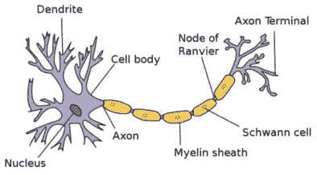

# 第九章：深度学习网络的架构优化

本章介绍了如何通过优化**人工神经网络**（**ANN**）模型的**网络架构**，利用遗传算法来提高这些模型的性能。我们将首先简要介绍**神经网络**（**NNs**）和**深度学习**（**DL**）。在介绍了*鸢尾花数据集*和**多层感知器**（**MLP**）分类器后，我们将展示如何通过基于遗传算法的解决方案来进行**网络架构优化**。随后，我们将扩展此方法，将网络架构优化与模型**超参数调优**相结合，二者将通过基于遗传算法的解决方案共同完成。

本章将涉及以下主题：

+   理解人工神经网络和深度学习的基本概念

+   通过网络架构优化来提升深度学习分类器的性能

+   通过将网络架构优化与超参数调优相结合，进一步增强深度学习分类器的性能

本章将从人工神经网络的概述开始。如果你是经验丰富的数据科学家，可以跳过介绍部分。

# 技术要求

本章将使用 Python 3，并配合以下支持库：

+   **deap**

+   **numpy**

+   **scikit-learn**

重要提示

如果你使用我们提供的**requirements.txt**文件（见*第三章*），这些库已经包含在你的环境中。

此外，我们将使用 UCI 鸢尾花数据集（[`archive.ics.uci.edu/ml/datasets/Iris`](https://archive.ics.uci.edu/ml/datasets/Iris)）。

本章将使用的程序可以在本书的 GitHub 仓库中找到，链接如下：

[`github.com/PacktPublishing/Hands-On-Genetic-Algorithms-with-Python-Second-Edition/tree/main/chapter_09`](https://github.com/PacktPublishing/Hands-On-Genetic-Algorithms-with-Python-Second-Edition/tree/main/chapter_09)

查看以下视频，查看代码实际操作：[`packt.link/OEBOd`](https://packt.link/OEBOd)

# 人工神经网络和深度学习

受人脑结构的启发，神经网络是**机器学习**（**ML**）中最常用的模型之一。这些网络的基本构建块是节点或**神经元**，它们基于生物神经元细胞，如下图所示：



图 9.1：生物神经元模型

来源：[`simple.wikipedia.org/wiki/Neuron#/media/File:Neuron.svg`](https://simple.wikipedia.org/wiki/Neuron#/media/File:Neuron.svg) 由 Dhp1080 提供

神经元细胞的**树突**，在前图左侧围绕**细胞体**，用作来自多个相似细胞的输入，而从**细胞体**出来的长**轴突**则作为输出，可以通过其**末端**连接到多个其他细胞。

这种结构通过一个人工模型——**感知器**来模拟，如下所示：


图 9.2：人工神经元模型——感知器

感知器通过将每个输入值与一定的**权重**相乘来计算输出；结果会累加，然后加上一个**偏置**值。一个非线性的**激活函数**随后将结果映射到输出。这种功能模仿了生物神经元的运作，当输入的加权和超过某个阈值时，神经元会“激发”（从其输出端发送一系列脉冲）。

如果我们调整感知器的权重和偏置值，使其将某些输入映射到期望的输出水平，则可以使用感知器模型进行简单的分类和回归任务。然而，通过将多个感知器单元连接成一个叫做 MLP 的结构，可以构建一个功能更强大的模型，下一小节将对其进行描述。

## MLP

MLP 通过使用多个节点扩展了感知器的概念，每个节点实现一个感知器。MLP 中的节点按**层**排列，每一层与下一层相连接。MLP 的基本结构如下图所示：


图 9.3：MLP 的基本结构

MLP 由三个主要部分组成：

+   **输入层**：接收输入值，并将每个输入值与下一个层中的每个神经元相连接。

+   **输出层**：传递 MLP 计算的结果。当 MLP 用作**分类器**时，每个输出表示一个类别。当 MLP 用于**回归**时，将只有一个输出节点，产生一个连续值。

+   **隐藏层**：提供该模型的真正力量和复杂性。尽管前面的图示只显示了两个隐藏层，但可以有多个隐藏层，每个隐藏层的大小可以是任意的，这些隐藏层位于输入层和输出层之间。随着隐藏层数量的增加，网络变得更深，能够执行越来越复杂的非线性映射，连接输入和输出。

训练这个模型涉及调整每个节点的权重和偏置值。通常，这通过一类被称为**反向传播**的算法来实现。反向传播的基本原理是通过将输出误差从输出层向内传播到 MLP 模型的各个层，最小化实际输出与期望输出之间的误差。该过程从定义一个成本（或“损失”）函数开始，通常是预测输出与实际目标值之间差异的度量。通过调整各个节点的权重和偏置，使得那些对误差贡献最大节点的调整最大。通过迭代减少成本函数，算法逐步优化模型参数，提高性能。

多年来，反向传播算法的计算限制使得 MLP 的隐藏层数不超过两层或三层，直到新的发展极大地改变了这一局面。相关内容将在下一节中详细说明。

## 深度学习和卷积神经网络

近年来，反向传播算法取得了突破，允许在单个网络中使用大量的隐藏层。在这些**深度神经网络**（**DNNs**）中，每一层可以解释前一层节点所学到的多个更简单的抽象概念，并产生更高层次的概念。例如，在实现人脸识别任务时，第一层将处理图像的像素并学习检测不同方向的边缘。下一层可能将这些边缘组合成线条、角点等，直到某一层能够检测面部特征，如鼻子和嘴唇，最后，一层将这些特征结合成完整的“面部”概念。

进一步的发展催生了**卷积神经网络**（**CNNs**）的概念。这些结构通过对相邻输入与远离的输入进行不同处理，能够减少处理二维信息（如图像）的深度神经网络（DNNs）中的节点数量。因此，这些模型在图像和视频处理任务中尤为成功。除了与多层感知器（MLP）中的隐藏层类似的全连接层外，这些网络还使用池化（下采样）层，池化层将前面层的神经元输出进行汇总，以及卷积层，卷积层通过在输入图像上有效滑动滤波器来检测特定特征，例如各种方向的边缘。

使用`scikit-learn`库和一个简单的数据集进行训练。然而，所使用的原理仍适用于更复杂的网络和数据集。

在下一节中，我们将探讨如何使用遗传算法优化多层感知器（MLP）的架构。

# 优化深度学习分类器的架构

在为给定的机器学习任务创建神经网络模型时，一个关键的设计决策是**网络架构**的配置。对于多层感知机（MLP）而言，输入层和输出层的节点数由问题的特征决定。因此，待决策的部分是隐藏层——有多少层，每一层有多少个节点。可以使用一些经验法则来做出这些决策，但在许多情况下，识别最佳选择可能会变成一个繁琐的试错过程。

处理网络架构参数的一种方法是将它们视为模型的超参数，因为它们需要在训练之前确定，并且因此会影响训练结果。在本节中，我们将应用这种方法，并使用遗传算法来搜索最佳的隐藏层组合，类似于我们在上一章选择最佳超参数值的方式。我们从我们想要解决的任务开始——**鸢尾花** **分类**。

## 鸢尾花数据集

可能是研究得最透彻的数据集，*鸢尾花数据集*（[`archive.ics.uci.edu/ml/datasets/Iris`](https://archive.ics.uci.edu/ml/datasets/Iris)）包含了三种鸢尾花（鸢尾花、弗吉尼亚鸢尾花、和变色鸢尾花）的`萼片`和`花瓣`的测量数据，这些数据由生物学家在 1936 年收集。

数据集包含来自三种物种的每种 50 个样本，并由以下四个特征组成：

+   **萼片长度 (cm)**

+   **萼片宽度 (cm)**

+   **花瓣长度 (cm)**

+   **花瓣宽度 (cm)**

该数据集可以通过`scikit-learn`库直接获得，并可以通过如下方式初始化：

```py
from sklearn import datasets
data = datasets.load_iris()
X = data['data']
y = data['target']
```

在我们的实验中，我们将使用多层感知机（MLP）分类器与此数据集结合，并利用遗传算法的力量来寻找最佳的网络架构——隐藏层的数量和每层节点的数量——以获得最佳的分类准确率。

由于我们使用遗传算法的方法，首先需要做的是找到一种方法，通过染色体表示这种架构，如下一个小节所述。

## 表示隐藏层配置

由于多层感知器（MLP）的结构由隐藏层配置决定，让我们来探讨如何在我们的解决方案中表示这一配置。`sklearn` MLP 的隐藏层配置（[`scikit-learn.org/stable/modules/neural_networks_supervised.html`](https://scikit-learn.org/stable/modules/neural_networks_supervised.html)）通过 `hidden_layer_sizes` 元组传递，这个元组作为参数传递给模型的构造函数。默认情况下，这个元组的值为 `(100,)`，意味着只有一个包含 100 个节点的隐藏层。如果我们想要将 MLP 配置为三个每个包含 20 个节点的隐藏层，则该参数的值应为 `(20, 20, 20)`。在我们实现基于遗传算法的优化器来调整隐藏层配置之前，我们需要定义一个可以转换为这种模式的染色体。

为了实现这一目标，我们需要设计一种染色体，既能够表示层的数量，又能表示每层的节点数。一种可行的方案是使用一个可变长度的染色体，该染色体可以直接转换为用作模型 `hidden_layer_sizes` 参数的可变长度元组；然而，这种方法需要定制且可能繁琐的遗传操作符。为了能够使用我们的标准遗传操作符，我们将使用一个固定长度的表示法。采用这种方法时，最大层数是预先确定的，所有层始终被表示，但不一定会在解决方案中得到体现。例如，如果我们决定将网络限制为四个隐藏层，染色体将如下所示：

[n 1, n 2, n 3, n 4]

这里，n i 表示第 i 层的节点数。然而，为了控制网络中实际的隐藏层数量，这些值中的一些可能是零或负数。这样的值意味着不会再添加更多的层到网络中。以下示例展示了这种方法：

+   染色体 [10, 20, -5, 15] 被转换为元组 (10, 20)，因为 -5 终止了层的计数

+   染色体 [10, 0, -5, 15] 被转换为元组 (10, )，因为 0 终止了层的计数

+   染色体 [10, 20, 5, -15] 被转换为元组 (10, 20, 5)，因为 -15 终止了层的计数

+   染色体 [10, 20, 5, 15] 被转换为元组 (10, 20, 5, 15)

为了保证至少有一个隐藏层，我们可以确保第一个参数始终大于零。其他参数可以围绕零分布变化，以便我们能够控制它们作为终止参数的可能性。

此外，尽管该染色体由整数构成，我们选择改用浮动数字，就像我们在上一章中对各种类型的变量所做的那样。使用浮动数字的列表非常方便，因为它允许我们使用现有的遗传算子，同时能够轻松扩展染色体，以便包含其他不同类型的参数，稍后我们会这样做。浮动数字可以通过`round()`函数转换回整数。以下是这种通用方法的几个示例：

+   染色体[9.35, 10.71, -2.51, 17.99]被转换为元组(9, 11)

+   染色体[9.35, 10.71, 2.51, -17.99]被转换为元组(9, 11, 3)

为了评估给定的表示架构的染色体，我们需要将其转换回层的元组，创建一个实现这些层的 MLP 分类器，训练它并进行评估。我们将在下一小节中学习如何做到这一点。

## 评估分类器的准确性

让我们从一个 Python 类开始，该类封装了 Iris 数据集的 MLP 分类器准确性评估。该类被称为`MlpLayersTest`，可以在以下链接的`mlp_layers_test.py`文件中找到：

[`github.com/PacktPublishing/Hands-On-Genetic-Algorithms-with-Python-Second-Edition/blob/main/chapter_09/mlp_layers_test.py`](https://github.com/PacktPublishing/Hands-On-Genetic-Algorithms-with-Python-Second-Edition/blob/main/chapter_09/mlp_layers_test.py)

该类的主要功能如下所示：

1.  该类的**convertParam()**方法接收一个名为**params**的列表。实际上，这就是我们在上一小节中描述的染色体，它包含表示最多四个隐藏层的浮动值。该方法将这些浮动值的列表转换为**hidden_layer_sizes**元组：

    ```py
    if round(params[1]) <= 0:
        hiddenLayerSizes = round(params[0]),
    elif round(params[2]) <= 0:
        hiddenLayerSizes = (round(params[0]),
                            round(params[1]))
    elif round(params[3]) <= 0:
        hiddenLayerSizes = (round(params[0]),
                            round(params[1]),
                            round(params[2]))
    else:
        hiddenLayerSizes = (round(params[0]),
                            round(params[1]),
                            round(params[2]),
                            round(params[3]))
    ```

1.  **getAccuracy()**方法接受表示隐藏层配置的**params**列表，使用**convertParam()**方法将其转换为**hidden_layer_sizes**元组，并使用该元组初始化 MLP 分类器：

    ```py
    hiddenLayerSizes = self.convertParams(params)
    self.classifier = MLPClassifier(
        hidden_layer_sizes=hiddenLayerSizes)
    ```

    然后，它使用与我们在 *第八章*中为*葡萄酒数据集*创建的相同*k 折交叉验证*计算来找到分类器的准确性，*机器学习模型的超参数调优*：

    ```py
    cv_results = model_selection.cross_val_score(self.classifier,
                                    self.X,
                                    self.y,
                                    cv=self.kfold,
                                    scoring='accuracy')
    return cv_results.mean()
    ```

`MlpLayersTest`类被基于遗传算法的优化器所使用。我们将在下一节中解释这一部分。

## 使用遗传算法优化 MLP 架构

现在我们有了一种表示用于分类 Iris 花卉数据集的 MLP 架构配置的方法，并且有了一种确定每个配置的 MLP 准确性的方法，我们可以继续并创建一个基于遗传算法的优化器，来搜索最佳的配置——隐藏层的数量（在我们的例子中最多为 4 层）以及每层的节点数量——以获得最佳的准确性。这个解决方案通过位于以下链接的`01_optimize_mlp_layers.py` Python 程序实现：

[`github.com/PacktPublishing/Hands-On-Genetic-Algorithms-with-Python-Second-Edition/blob/main/chapter_09/01_optimize_mlp_layers.py`](https://github.com/PacktPublishing/Hands-On-Genetic-Algorithms-with-Python-Second-Edition/blob/main/chapter_09/01_optimize_mlp_layers.py)

以下步骤描述了该程序的主要部分：

1.  我们首先为表示隐藏层的每个浮动值设置上下边界。第一个隐藏层的范围为[5, 15]，而其余的层从逐渐增大的负值开始，这增加了它们终止层数的几率：

    ```py
    # [hidden_layer_layer_1_size, hidden_layer_2_size
    #  hidden_layer_3_size, hidden_layer_4_size]
    BOUNDS_LOW =  [ 5,  -5, -10, -20]
    BOUNDS_HIGH = [15,  10,  10,  10]
    ```

1.  然后，我们创建一个**MlpLayersTest**类的实例，这将允许我们测试不同的隐藏层架构组合：

    ```py
    test = mlp_layers_test.MlpLayersTest(RANDOM_SEED)
    ```

1.  由于我们的目标是最大化分类器的准确性，我们定义了一个单一的目标，即最大化适应度策略：

    ```py
    creator.create("FitnessMax", base.Fitness, weights=(1.0,))
    ```

1.  现在，我们采用与上一章相同的方法——由于解决方案由一个浮动数值列表表示，每个数值的范围不同，我们使用以下循环遍历所有的下限和上限值对，并且对于每个范围，我们创建一个单独的**toolbox**操作符**layer_size_attribute**，该操作符将用于在适当的范围内生成随机浮动数值：

    ```py
    for i in range(NUM_OF_PARAMS):
        toolbox.register("layer_size_attribute_" + str(i),
                          random.uniform,
                          BOUNDS_LOW[i],
                          BOUNDS_HIGH[i])
    ```

1.  然后，我们创建一个**layer_size_attributes**元组，其中包含我们为每个隐藏层刚刚创建的单独浮动数值生成器：

    ```py
    layer_size_attributes = ()
    for i in range(NUM_OF_PARAMS):
        layer_size_attributes = layer_size_attributes + \
        (toolbox.__getattribute__("layer_size_attribute_" + \
            str(i)),)
    ```

1.  现在，我们可以将这个**layer_size_attributes**元组与 DEAP 内置的**initCycle()**操作符结合使用，来创建一个新的**individualCreator**操作符，该操作符将通过随机生成的隐藏层大小值的组合填充一个个体实例：

    ```py
    toolbox.register("individualCreator",
                      tools.initCycle,
                      creator.Individual,
                      layer_size_attributes,
                      n=1)
    ```

1.  然后，我们指示遗传算法使用**MlpLayersTest**实例的**getAccuracy()**方法进行适应度评估。提醒一下，**getAccuracy()**方法（我们在上一小节中描述过）将给定个体——一个包含四个浮动数值的列表——转换为一个隐藏层大小的元组。这些元组将用于配置 MLP 分类器。然后，我们训练分类器并使用 k 折交叉验证评估其准确性：

    ```py
    def classificationAccuracy(individual):
        return test.getAccuracy(individual),
    toolbox.register("evaluate", classificationAccuracy)
    ```

1.  至于遗传操作符，我们重复了上一章的配置。对于*选择*操作符，我们使用常规的锦标赛选择，锦标赛大小为 2，选择适用于有界浮动列表染色体的*交叉*和*变异*操作符，并为每个隐藏层提供我们定义的边界：

    ```py
    toolbox.register("select",
                      tools.selTournament,
                      tournsize=2)
    toolbox.register("mate",
                      tools.cxSimulatedBinaryBounded,
                      low=BOUNDS_LOW,
                      up=BOUNDS_HIGH,
                      eta=CROWDING_FACTOR)
    toolbox.register("mutate",
                      tools.mutPolynomialBounded,
                      low=BOUNDS_LOW,
                      up=BOUNDS_HIGH,
                      eta=CROWDING_FACTOR,
                      indpb=1.0 / NUM_OF_PARAMS)
    ```

1.  此外，我们继续使用*精英*方法，其中**名人堂**（**HOF**）成员——当前最佳个体——总是被不加修改地传递到下一代：

    ```py
    population, logbook = elitism.eaSimpleWithElitism(population,
        toolbox,
        cxpb=P_CROSSOVER,
        mutpb=P_MUTATION,
        ngen=MAX_GENERATIONS,
        stats=stats,
        halloffame=hof,
        verbose=True)
    ```

当我们用 20 个个体运行算法 10 代时，得到的结果如下：

```py
gen nevals max avg
0 20 0.666667 0.416333
1 17 0.693333 0.487
2 15 0.76 0.537333
3 14 0.76 0.550667
4 17 0.76 0.568333
5 17 0.76 0.653667
6 14 0.76 0.589333
7 15 0.76 0.618
8 16 0.866667 0.616667
9 16 0.866667 0.666333
10 16 0.866667 0.722667
- Best solution is: 'hidden_layer_sizes'=(15, 5, 8) , accuracy = 0.8666666666666666
```

之前的结果表明，在我们定义的范围内，找到的最佳组合是三个隐藏层，大小分别为 15、5 和 8。我们使用这些值所获得的分类准确率大约为 86.7%。

这个准确率似乎是对于当前问题的合理结果。然而，我们还有更多的工作可以做，以进一步提高其准确性。

# 将架构优化与超参数调优结合

在优化网络架构配置——即隐藏层参数——时，我们一直使用 MLP 分类器的默认（超）参数。然而，正如我们在上一章中所看到的，调优各种超参数有可能提高分类器的性能。我们能否将超参数调优纳入我们的优化中？如你所猜测的，答案是肯定的。但在此之前，让我们先来看一下我们希望优化的超参数。

`scikit-learn`实现的 MLP 分类器包含许多可调的超参数。为了展示，我们将集中在以下超参数上：

| **名称** | **类型** | **描述** | **默认值** |
| --- | --- | --- | --- |
| 激活函数 | 枚举类型 | 隐藏层的激活函数：`{'identity', 'logistic', 'tanh', 'relu'}` | `'relu'` |
| 求解器 | 枚举类型 | 权重优化的求解器：`{'lbfgs', 'sgd', 'adam'}` | `'adam'` |
| alpha | 浮动型 | L2 正则化项的强度 | `0.0001` |
| 学习率 | 枚举类型 | 权重更新的学习率计划：{‘constant’, ‘invscaling’, ‘adaptive’} | `'constant'` |

表 9.1：MLP 超参数

正如我们在上一章所看到的，基于浮动点的染色体表示使我们能够将各种类型的超参数结合到基于遗传算法的优化过程中。由于我们已经使用基于浮动点的染色体来表示隐藏层的配置，我们现在可以通过相应地扩展染色体，将其他超参数纳入优化过程中。让我们来看看我们如何做到这一点。

## 解的表示

对于现有的四个浮动值，表示我们的网络架构配置——

[n 1, n 2, n 3, n 4]——我们可以添加以下四个超参数：

+   **activation**可以有四个值之一：**'tanh'**、**'relu'**、**'logistic'**或**'identity'**。可以通过将其表示为[0, 3.99]范围内的浮点数来实现。为了将浮点值转换为上述值之一，我们需要对其应用**floor()**函数，这将得到 0、1、2 或 3。然后，我们将 0 替换为**'tanh'**，将 1 替换为**'relu'**，将 2 替换为**'logistic'**，将 3 替换为**'identity'**。

+   **solver**可以有三个值之一：**'sgd'**、**'adam'**或**'lbfgs'**。与激活参数一样，它可以使用[0, 2.99]范围内的浮点数表示。

+   **alpha**已经是一个浮点数，因此无需转换。它将被限制在[0.0001, 2.0]的范围内。

+   **learning_rate**可以有三个值之一：**'constant'**、**'invscaling'**或**'adaptive'**。同样，我们可以使用[0, 2.99]范围内的浮点数来表示其值。

## 评估分类器的准确性

用于评估给定隐藏层和超参数组合的 MLP 分类器准确性的类叫做`MlpHyperparametersTest`，并包含在`mlp_hyperparameters_test.py`文件中，该文件位于以下链接：

[`github.com/PacktPublishing/Hands-On-Genetic-Algorithms-with-Python-Second-Edition/blob/main/chapter_09/mlp_hyperparameters_test.py`](https://github.com/PacktPublishing/Hands-On-Genetic-Algorithms-with-Python-Second-Edition/blob/main/chapter_09/mlp_hyperparameters_test.py)

这个类基于我们用于优化隐藏层配置的类`MlpLayersTest`，但做了一些修改。我们来看看这些修改：

1.  **convertParam()**方法现在处理一个**params**列表，其中前四个条目（**params[0]**到**params[3]**）代表隐藏层的大小，和之前一样，但另外，**params[4]**到**params[7]**代表我们为评估添加的四个超参数。因此，方法已通过以下代码行进行了扩展，允许它将其余给定的参数（**params[4]**到**params[7]**）转换为相应的值，然后可以传递给 MLP 分类器：

    ```py
    activation = ['tanh', 'relu', 'logistic', 'identity'][floor(params[4])]
    solver = ['sgd', 'adam', 'lbfgs'][floor(params[5])]
    alpha = params[6]
    learning_rate = ['constant', 'invscaling',
        'adaptive'][floor(params[7])]
    ```

1.  同样，**getAccuracy()**方法现在处理扩展后的**params**列表。它使用所有这些参数的转换值来配置 MLP 分类器，而不是仅仅配置隐藏层的设置：

    ```py
    hiddenLayerSizes, activation, solver, alpha, learning_rate = \
        self.convertParams(params)
    self.classifier = MLPClassifier(
        random_state=self.randomSeed,
        hidden_layer_sizes=hiddenLayerSizes,
        activation=activation,
        solver=solver,
        alpha=alpha,
        learning_rate=learning_rate)
    ```

这个`MlpHyperparametersTest`类被基于遗传算法的优化器使用。我们将在下一节中讨论这个内容。

## 使用遗传算法优化 MLP 的组合配置

基于遗传算法的最佳隐藏层和超参数组合搜索由`02_ptimize_mlp_hyperparameters.py` Python 程序实现，该程序位于以下链接：

[`github.com/PacktPublishing/Hands-On-Genetic-Algorithms-with-Python-Second-Edition/blob/main/chapter_09/02_optimize_mlp_hyperparameters.py`](https://github.com/PacktPublishing/Hands-On-Genetic-Algorithms-with-Python-Second-Edition/blob/main/chapter_09/02_optimize_mlp_hyperparameters.py)

由于所有参数都使用统一的浮点数表示，这个程序与我们在前一节中用来优化网络架构的程序几乎相同。主要的区别在于`BOUNDS_LOW`和`BOUNDS_HIGH`列表的定义，它们包含了参数的范围。除了之前定义的四个范围（每个隐藏层一个），我们现在添加了另外四个范围，代表我们在本节中讨论的额外超参数：

```py
# 'hidden_layer_sizes': first four values
# 'activation'        : 0..3.99
# 'solver'            : 0..2.99
# 'alpha'             : 0.0001..2.0
# 'learning_rate'     : 0..2.99
BOUNDS_LOW =  [ 5,  -5, -10, -20, 0,     0,     0.0001, 0]
BOUNDS_HIGH = [15,  10,  10,  10, 3.999, 2.999, 2.0,    2.999]
```

就这么简单——程序能够处理新增的参数而无需进一步修改。

运行此程序将产生以下结果：

```py
gen     nevals  max     avg
0       20      0.94    0.605667
1       15      0.94    0.667
2       16      0.94    0.848667
3       17      0.94    0.935
4       17      0.94    0.908667
5       15      0.94    0.936
6       15      0.94    0.889667
7       16      0.94    0.938333
8       17      0.946667        0.938333
9       13      0.946667        0.938667
10      15      0.946667        0.940667
- Best solution is:
'hidden_layer_sizes'=(7, 4, 6)
'activation'='tanh'
'solver'='lbfgs'
'alpha'=1.2786182334834102
'learning_rate'='constant'
=> accuracy =  0.9466666666666667
```

重要提示

请注意，由于操作系统之间的差异，当你在自己的系统上运行该程序时，可能会得到与此处展示的结果略有不同的输出。

前述结果表明，在我们定义的范围内，找到的最佳组合如下：

+   三个隐藏层，分别为 7、4 和 6 个节点。

+   **'tanh'**类型的**激活函数**参数——而不是默认的**'relu'**

+   **'lbfgs'**类型的**求解器**参数——而不是默认的**'adam'**

+   **alpha**值约为**1.279**——比默认值 0.0001 大得多

+   **'constant'**类型的**learning_rate**参数——与默认值相同

这种联合优化最终达到了约 94.7%的分类准确率——比之前的结果有了显著提升，而且使用的节点比之前更少。

# 总结

在本章中，你了解了人工神经网络（ANN）和深度学习（DL）的基本概念。熟悉了 Iris 数据集和 MLP 分类器后，我们介绍了网络架构优化的概念。接下来，我们演示了基于遗传算法的 MLP 分类器网络架构优化。最后，我们能够将网络架构优化与模型超参数调优结合起来，使用相同的遗传算法方法，从而进一步提升分类器的性能。

到目前为止，我们集中讨论了**监督学习**（**SL**）。在下一章中，我们将探讨将遗传算法应用于**强化学习**（**RL**），这是一个令人兴奋且快速发展的机器学习分支。

# 深入阅读

如需了解本章内容的更多信息，请参考以下资源：

+   *Python 深度学习——第二版*, *Gianmario Spacagna, Daniel Slater, 等*, *2019 年 1 月 16 日*

+   *使用 Python 的神经网络项目*, *James Loy*, *2019 年 2 月 28 日*

+   **scikit-learn** MLP 分类器：

+   [`scikit-learn.org/stable/modules/generated/sklearn.neural_network.MLPClassifier.html`](https://scikit-learn.org/stable/modules/generated/sklearn.neural_network.MLPClassifier.html)

+   *UCI 机器学习* *数据集库*：[`archive.ics.uci.edu/`](https://archive.ics.uci.edu/)
