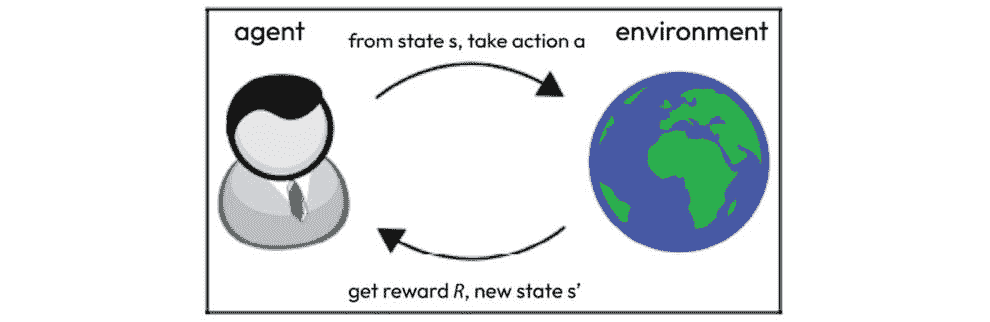
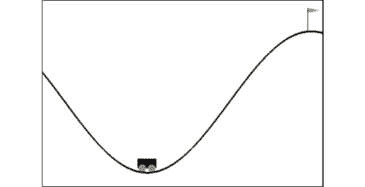
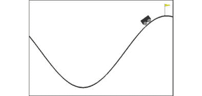
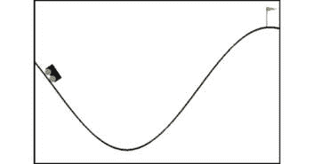
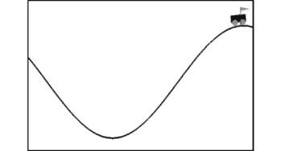
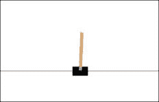
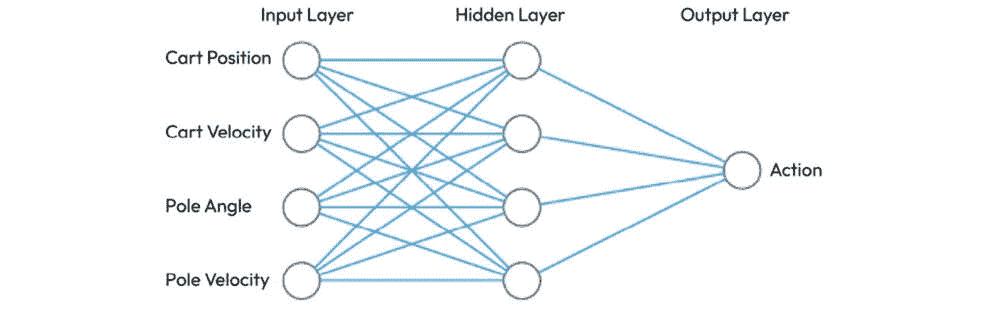

# 第十章：使用遗传算法进行强化学习

在本章中，我们将展示如何将遗传算法应用于**强化学习**——这一快速发展的机器学习分支，能够解决复杂的任务。我们将通过解决来自*Gymnasium*（前身为*OpenAI Gym*）工具包的两个基准环境来实现这一目标。我们将首先概述强化学习，随后简要介绍*Gymnasium*，这是一个可用于比较和开发强化学习算法的工具包，并描述其基于 Python 的接口。接下来，我们将探索两个 Gymnasium 环境，*MountainCar*和*CartPole*，并开发基于遗传算法的程序来解决它们所面临的挑战。

在本章中，我们将涵盖以下主题：

+   理解强化学习的基本概念

+   熟悉*Gymnasium*项目及其共享接口

+   使用遗传算法解决*Gymnasium*的*MountainCar*环境

+   使用遗传算法结合神经网络解决*Gymnasium*的*CartPole*环境

我们将通过概述强化学习的基本概念来开始本章。如果你是经验丰富的数据科学家，可以跳过这一介绍部分。

# 技术要求

在本章中，我们将使用 Python 3 及以下支持库：

+   **deap**

+   **numpy**

+   **scikit-learn**

+   **gymnasium** – *在本章中介绍*

+   **pygame** – *在本章中介绍*

重要提示

如果你使用我们提供的**requirements.txt**文件（参见*第三章*），这些库已经包含在你的环境中了。

本章将使用的*Gymnasium*环境是*MountainCar-v0*（[`gymnasium.farama.org/environments/classic_control/mountain_car/`](https://gymnasium.farama.org/environments/classic_control/mountain_car/)）和*CartPole-v1*（[`gymnasium.farama.org/environments/classic_control/cart_pole/`](https://gymnasium.farama.org/environments/classic_control/cart_pole/)）。

本章中使用的程序可以在本书的 GitHub 仓库中找到：[`github.com/PacktPublishing/Hands-On-Genetic-Algorithms-with-Python-Second-Edition/tree/main/chapter_10`](https://github.com/PacktPublishing/Hands-On-Genetic-Algorithms-with-Python-Second-Edition/tree/main/chapter_10)。

查看以下视频，看看代码如何运行：[`packt.link/OEBOd`](https://packt.link/OEBOd)。

# 强化学习

在前几章中，我们讨论了与机器学习相关的多个主题，重点介绍了**监督学习**任务。尽管监督学习非常重要，并且有许多现实生活中的应用，但目前看来，强化学习是机器学习中最令人兴奋和最有前景的分支。人们对这一领域的兴奋之情源自于强化学习能够处理的复杂且类似于日常生活的任务。2016 年 3 月，基于强化学习的*AlphaGo*系统成功战胜了被认为是过去十年最强围棋选手的选手，并且这一比赛得到了广泛的媒体报道。

虽然监督学习需要**标注数据**进行训练——换句话说，需要输入与匹配输出的对——但强化学习并不会立即给出对错反馈；相反，它提供了一个寻求长期、累积**奖励**的环境。这意味着，有时算法需要暂时后退一步，才能最终实现长期目标，正如我们将在本章的第一个例子中展示的那样。

强化学习任务的两个主要组件是**环境**和**智能体**，如下面的图示所示：



图 10.1: 强化学习表示为智能体与环境之间的互动

*智能体*代表了一种与*环境*互动的算法，它通过最大化累积奖励来尝试解决给定的问题。

智能体与环境之间发生的交换可以表示为一系列的**步骤**。在每一步中，环境会向智能体呈现一个特定的**状态**（*s*），也称为观察。智能体则执行一个**动作**（*a*）。环境会回应一个新的状态（*s’*），以及一个中间奖励值（*R*）。这一交换会一直重复，直到满足某个停止条件。智能体的目标是最大化沿途收集的奖励值的总和。

尽管这一表述非常简单，但它可以用来描述极其复杂的任务和情境，这也使得强化学习适用于广泛的应用场景，如博弈论、医疗保健、控制系统、供应链自动化和运筹学。

本章将再次展示遗传算法的多功能性，因为我们将利用它们来辅助强化学习任务。

## 遗传算法与强化学习

为了执行强化学习任务，已经开发了多种专用算法——如 *Q-Learning*、*SARSA* 和 *DQN* 等。然而，由于强化学习任务涉及最大化长期奖励，我们可以将它们视为优化问题。正如本书中所展示的，遗传算法可以用于解决各种类型的优化问题。因此，遗传算法也可以用于强化学习，并且有几种不同的方式——本章将演示其中的两种。在第一种情况下，我们基于遗传算法的解决方案将直接提供智能体的最佳动作序列。在第二种情况下，它将为提供这些动作的神经控制器提供最佳参数。

在我们开始将遗传算法应用于强化学习任务之前，让我们先了解将用于执行这些任务的工具包——**Gymnasium**。

# Gymnasium

*Gymnasium* ([`gymnasium.farama.org/`](https://gymnasium.farama.org/)) —— 这是 *OpenAI Gym* 的一个分支和官方继任者 —— 是一个开源库，旨在提供对标准化强化学习任务集合的访问。它提供了一个工具包，用于比较和开发强化学习算法。

*Gymnasium* 是由一系列环境组成的集合，这些环境都呈现一个共同的接口，称为 `env`。这个接口将各种环境与智能体解耦，智能体可以以任何我们喜欢的方式实现——智能体唯一的要求是能够通过 `env` 接口与环境进行交互。这个内容将在下一小节中进行描述。

基本包 `gymnasium` 提供对多个环境的访问，可以通过以下方式进行安装：

```py
pip install gymnasium
```

为了使我们能够渲染和动画化测试环境，还需要安装 *PyGame* 库。可以使用以下命令进行安装：

```py
pip install pygame
```

还有一些其他的包可用，例如“Atari”、“Box2D”和“MuJoCo”，它们提供对多个多样化环境的访问。这些包有些具有系统依赖性，可能只适用于某些操作系统。更多信息请访问 [`github.com/Farama-Foundation/Gymnasium#installation`](https://github.com/Farama-Foundation/Gymnasium#installation)。

下一小节将描述如何与 `env` 接口进行交互。

## env 接口

要创建一个环境，我们需要使用 `make()` 方法并提供所需环境的名称，如下所示：

```py
import gymnasium as gym
env = gym.reset() method, as shown in the following code snippet:

```

observation, info = env.observation 对象，描述环境的初始状态，以及一个字典 info，可能包含补充 observation 的辅助信息。observation 的内容依赖于环境。

与我们在上一节中描述的强化学习周期一致，与环境的持续互动包括发送一个 *动作*，然后接收一个 *中间奖励* 和一个新的 *状态*。这一过程通过 `step()` 方法实现，如下所示：

```py
observation, reward, terminated, truncated, info = \
    env.observation object, which describes the new state and the float reward value that represent the interim reward, this method returns the following values:

*   **terminated**: A Boolean that turns **true** when the current run (also called *episode*) reaches the terminal state – for example, the agent lost a life, or successfully completed a task.
*   **truncated**: A Boolean that can be used to end the episode prematurely before a terminal state is reached – for example, due to a time limit, or if the agent went out of bounds.
*   **info**: A dictionary containing optional, additional information that may be useful for debugging. However, it should not be used by the agent for learning.

At any point in time, the environment can be rendered for visual presentation, as follows:

```

`env.render_mode` 可以在创建环境时进行设置。例如，设置为 "human" 会使环境在当前显示器或终端中持续渲染，而默认值 None 则不会进行渲染。

最后，可以关闭环境以调用任何必要的清理操作，如下所示：

```py
env.close()
```

如果没有调用此方法，环境将在下一次 Python 执行 *垃圾回收* 进程（即识别并释放程序不再使用的内存）时自动关闭，或者当程序退出时关闭。

注意

有关 env 接口的详细信息，请参见 [`gymnasium.farama.org/api/env/`](https://gymnasium.farama.org/api/env/)。

与环境的完整交互周期将在下一节中演示，在那里我们将遇到第一个 Gymnasium 挑战——*MountainCar* 环境。

解决 MountainCar 环境

`MountainCar-v0` 环境模拟了一辆位于两座山丘之间的单维轨道上的汽车。模拟开始时，汽车被放置在两座山丘之间，如下图所示：



图 10.2：MountainCar 模拟——起点

目标是让汽车爬上更高的山丘——右侧的山丘——并最终触碰到旗帜：



图 10.3：MountainCar 模拟——汽车爬上右侧山丘

这个模拟设置的情景是汽车的引擎太弱，无法直接爬上更高的山丘。达到目标的唯一方法是让汽车前后行驶，直到积累足够的动能以供攀爬。爬上左侧山丘有助于实现这一目标，因为到达左侧山顶会使汽车反弹到右侧，以下截图展示了这一过程：



图 10.4：MountainCar 模拟——汽车从左侧山丘反弹

这个模拟是一个很好的例子，表明中间的损失（向左移动）可以帮助实现最终目标（完全向右移动）。

这个模拟中的预期 *动作* 值是一个整数，取以下三个值之一：

+   0: 向左推动

+   1: 不推动

+   2: 向右推动

`observation` 对象包含两个浮动值，描述了汽车的位置和速度，如下所示：

```py
[-1.0260268, -0.03201975]
```

最后，`reward`值在每个时间步为-1，直到达到目标（位于位置 0.5）。如果在 200 步之前没有达到目标，模拟将会停止。

该环境的目标是尽可能快速地到达位于右侧山丘顶部的旗帜，因此，智能体在每个时间步上都会被扣除-1 的奖励。

关于*MountainCar-v0*环境的更多信息可以在这里找到：

[`gymnasium.farama.org/environments/classic_control/mountain_car/`](https://gymnasium.farama.org/environments/classic_control/mountain_car/)。

在我们的实现中，我们将尝试使用最少的步数来撞击旗帜，因为我们会从固定的起始位置应用一系列预选的动作。为了找到一个能够让小车爬上高山并撞击旗帜的动作序列，我们将设计一个基于遗传算法的解决方案。像往常一样，我们将首先定义这个挑战的候选解应如何表现。

解的表示

由于*MountainCar*是通过一系列动作来控制的，每个动作的值为 0（向左推动）、1（不推动）或 2（向右推动），并且在单个回合中最多可以有 200 个动作，因此表示候选解的一种显而易见的方法是使用长度为 200 的列表，列表中的值为 0、1 或 2。一个示例如下：

```py
[0, 1, 2, 0, 0, 1, 2, 2, 1, ... , 0, 2, 1, 1]
```

列表中的值将用作控制小车的动作，并且希望能够把它驱动到旗帜。如果小车在少于 200 步的时间内到达了旗帜，列表中的最后几项将不会被使用。

接下来，我们需要确定如何评估这种形式的给定解。

评估解的质量

在评估给定解时，或者在比较两个解时，很明显，单独的奖励值可能无法提供足够的信息。根据当前奖励的定义，如果我们没有撞到旗帜，它的值将始终为-200。当我们比较两个没有撞到旗帜的候选解时，我们仍然希望知道哪一个更接近旗帜，并将其视为更好的解。因此，除了奖励值外，我们还将使用小车的最终位置来确定解的得分：

+   如果小车没有撞到旗帜，得分将是与旗帜的距离。因此，我们将寻找一个能够最小化得分的解。

+   如果小车撞到旗帜，基础得分将为零，从此基础上根据剩余未使用的步骤数扣除一个额外的值，使得得分为负。由于我们寻求最低的得分，这种安排将鼓励解通过尽可能少的动作撞击旗帜。

该评分评估过程由`MountainCar`类实现，下面的子章节中将对其进行详细探讨。

Python 问题表示

为了封装 MountainCar 挑战，我们创建了一个名为`MountainCar`的 Python 类。该类包含在`mountain_car.py`文件中，文件位于[`github.com/PacktPublishing/Hands-On-Genetic-Algorithms-with-Python-Second-Edition/blob/main/chapter_10/mountain_car.py`](https://github.com/PacktPublishing/Hands-On-Genetic-Algorithms-with-Python-Second-Edition/blob/main/chapter_10/mountain_car.py)。

该类通过一个随机种子初始化，并提供以下方法：

+   **getScore(actions)**：计算给定解决方案的得分，解决方案由动作列表表示。得分是通过启动一个**MountainCar**环境的回合并用提供的动作运行它来计算的，如果在少于 200 步的情况下击中目标，得分可能为负值。得分越低越好。

+   **saveActions(actions)**：使用**pickle**（Python 的对象序列化和反序列化模块）将动作列表保存到文件。

+   **replaySavedActions()**：反序列化最后保存的动作列表，并使用**replay**方法重放它。

+   **replay(actions)**：使用“human”**render_mode**渲染环境，并重放给定的动作列表，展示给定的解决方案。

类的主要方法可以在找到解决方案、序列化并使用`saveActions()`方法保存后使用。主方法将初始化类并调用`replaySavedActions()`以渲染和动画展示最后保存的解决方案。

我们通常使用主方法来展示由遗传算法程序找到的最佳解决方案的动画。接下来的小节将详细探讨这一点。

遗传算法解决方案

为了使用遗传算法方法解决*MountainCar*挑战，我们创建了一个 Python 程序`01_solve_mountain_car.py`，该程序位于[`github.com/PacktPublishing/Hands-On-Genetic-Algorithms-with-Python-Second-Edition/blob/main/chapter_10/01_solve_mountain_car.py`](https://github.com/PacktPublishing/Hands-On-Genetic-Algorithms-with-Python-Second-Edition/blob/main/chapter_10/01_solve_mountain_car.py)。

由于我们为此问题选择的解决方案表示方法是包含 0、1 或 2 整数值的列表，因此这个程序与我们在*第四章*《组合优化》中用来解决 0-1 背包问题的程序相似，在那里解决方案是以包含 0 和 1 的列表表示的。

以下步骤描述了如何创建该程序的主要部分：

1.  我们通过创建**MountainCar**类的实例开始，这将允许我们为*MountainCar*挑战打分，评估各种解决方案：

    ```py
    car = mountain_car.MountainCar(RANDOM_SEED)
    ```

    2.  由于我们的目标是最小化得分——换句话说，使用最少的步数击中旗帜，或者尽可能接近旗帜——我们定义了一个单一目标，最小化适应度策略：

    ```py
    creator.create("FitnessMin", base.Fitness, weights=(-1.0,))
    ```

    3.  现在，我们需要创建一个工具箱操作符，用来生成三个允许的动作值之一——0、1 或 2：

    ```py
    toolbox.register("zeroOneOrTwo", random.randint, 0, 2)
    ```

    4.  接下来是一个操作符，它用这些值填充个体实例：

    ```py
    toolbox.register("individualCreator",
                     tools.initRepeat,
                     creator.Individual,
                     toolbox.zeroOneOrTwo,
                     len(car))
    ```

    5.  然后，我们指示遗传算法使用`getScore()`方法，该方法在前一小节中描述过，启动一个*MountainCar*环境的回合，并使用给定的个体——一组动作——作为环境的输入，直到回合结束。然后，根据汽车的最终位置评估分数——分数越低越好。如果汽车撞到旗帜，分数甚至可能是负数，具体取决于剩余未使用步骤的数量：

    ```py
    def carScore(individual):
        return car.getScore(individual),
    toolbox.register("evaluate", carScore)
    ```

    6.  至于遗传操作符，我们从通常的*锦标赛选择*开始，锦标赛规模为 2。由于我们的解表示是由 0、1 或 2 组成的整数值列表，我们可以像解表示为 0 和 1 值列表时那样，使用*二点交叉*操作符。

    对于*变异*，与通常用于二进制情况的*FlipBit*操作符不同，我们需要使用*UniformInt*操作符，它适用于一系列整数值，并将其配置为 0 到 2 的范围：

    ```py
    toolbox.register("select", tools.selTournament, tournsize=2)
    toolbox.register("mate", tools.cxTwoPoint)
    toolbox.register("mutate", tools.mutUniformInt, low=0, up=2, 
        indpb=1.0/len(car))
    ```

    7.  此外，我们继续使用*精英方法*，即**名人堂**（**HOF**）成员——当前的最佳个体——总是会原封不动地传递到下一代：

    ```py
    population, logbook = elitism.eaSimpleWithElitism(population,
        toolbox,
        cxpb=P_CROSSOVER,
        mutpb=P_MUTATION,
        ngen=MAX_GENERATIONS,
        stats=stats,
        halloffame=hof,
        verbose=True)
    ```

    8.  运行结束后，我们打印出最佳解并将其保存，以便稍后使用我们在**MountainCar**类中构建的重放功能进行动画演示：

    ```py
    best = hof.items[0]
    print("Best Solution = ", best)
    print("Best Fitness = ", best.fitness.values[0])
    car.saveActions(best)
    ```

    运行该算法 80 代，种群规模为 100 时，我们得到以下结果：

    ```py
    gen nevals min avg
    0       100     0.708709        1.03242
    1       78      0.708709        0.975704
    ...
    47      71      0.000170529     0.0300455
    48      74      4.87566e-05     0.0207197
    49      75      -0.005          0.0150622
    50      77      -0.005          0.0121327
    ...
    56      77      -0.02           -0.00321379
    57      74      -0.025          -0.00564184
    ...
    79      76      -0.035          -0.0342
    80      76      -0.035          -0.03425
    Best Solution =  [1, 0, 2, 1, 1, 2, 0, 2, 2, 2, 0, ... , 2, 0, 1, 1, 1, 1, 1, 0]
    Best Fitness =  -0.035
    ```

从前面的输出中，我们可以看到，在大约 50 代之后，最佳解开始撞击旗帜，产生零分或更低的分数值。从此以后，最佳解在更少的步骤中撞击旗帜，导致越来越低的分数值。

如我们之前提到的，最佳解在运行结束时被保存，现在我们可以通过运行`mountain_car`程序来重放它。这个重放展示了我们的解如何驱动汽车在两个山峰之间来回摆动，每次都爬得更高，直到汽车能够爬上左侧的低山。然后，它会反弹回来，这意味着我们已经积累了足够的动能，可以继续爬上右侧的更高山峰，最终撞击旗帜，以下面的截图所示：



图 10.5：MountainCar 仿真——汽车到达目标

尽管解决它非常有趣，但这个环境的设置并不要求我们与其进行动态交互。我们能够通过一系列由我们算法根据小车的初始位置组成的动作来爬上山坡。与此不同，我们即将面对的下一个环境——名为*CartPole*——要求我们根据最新的观察结果，在任何时间步骤动态计算我们的动作。继续阅读，了解如何实现这一点。

解决 CartPole 环境

*CartPole-v1*环境模拟了一个杆平衡的过程，杆底部铰接在一个小车上，小车沿着轨道左右移动。保持杆竖直通过施加 1 个单位的力到小车上——每次向右或向左。

在这个环境中，杆像一个摆锤一样开始竖立，并以一个小的随机角度出现，如下图所示：



图 10.6：CartPole 仿真—起始点

我们的目标是尽可能长时间地保持摆锤不倾倒到任一侧——即，最多 500 个时间步骤。每当杆保持竖直时，我们将获得+1 的奖励，因此最大总奖励为 500。若在运行过程中发生以下任何情况，回合将提前结束：

+   杆的角度偏离垂直位置超过 15 度

+   小车距离中心的距离超过 2.4 单位

因此，在这些情况下，最终的奖励将小于 500。

在这个仿真中，期望的`action`值是以下两个值之一的整数：

+   0：将小车推向左侧

+   1：将小车推向右侧

`observation`对象包含四个浮动值，保存以下信息：

+   **小车位置**，在-2.4 到 2.4 之间

+   **小车速度**，在-Inf 到 Inf 之间

+   **杆角度**，在-0.418 弧度（-24°）到 0.418 弧度（24°）之间

+   **杆角速度**，在-Inf 到 Inf 之间

例如，我们可以有一个`observation`为`[0.33676587, 0.3786464, -0.00170739, -0.36586074]`。

有关 CartPole-v1 环境的更多信息，请访问[`gymnasium.farama.org/environments/classic_control/cart_pole/`](https://gymnasium.farama.org/environments/classic_control/cart_pole/)。

在我们提出的解决方案中，我们将在每个时间步骤使用这些值作为输入，以决定采取什么行动。我们将借助基于神经网络的控制器来实现这一点。详细描述见下一个小节。

使用神经网络控制 CartPole

为了成功地完成*CartPole*挑战，我们希望能够动态响应环境的变化。例如，当杆子开始向一个方向倾斜时，我们可能应该把小车朝那个方向移动，但当杆子开始稳定时，可能需要停止推动。因此，这里的强化学习任务可以被看作是教一个控制器通过将四个可用的输入——小车位置、小车速度、杆子角度和杆子速度——映射到每个时间步的适当动作，来保持杆子的平衡。我们如何实现这种映射呢？

实现这种映射的一个好方法是使用**神经网络**。正如我们在*第九章*《深度学习网络的架构优化》中看到的那样，神经网络，比如**多层感知器**（**MLP**），可以实现其输入和输出之间的复杂映射。这个映射是通过网络的参数来完成的——即，网络中活跃节点的*权重和偏置*，以及这些节点实现的*传递函数*。在我们的案例中，我们将使用一个包含四个节点的单一*隐藏层*的网络。此外，*输入层*由四个节点组成，每个节点对应环境提供的一个输入值，而*输出层*则有一个节点，因为我们只有一个输出值——即需要执行的动作。这个网络结构可以通过以下图示来表示：



图 10.7：用于控制小车的神经网络结构

正如我们已经看到的，神经网络的权重和偏置值通常是在网络训练的过程中设置的。值得注意的是，到目前为止，我们仅仅看到了在使用反向传播算法实施*监督学习*的过程中训练神经网络——也就是说，在之前的每一种情况中，我们都有一组输入和匹配的输出，网络被训练来将每个给定的输入映射到其匹配的输出。然而，在这里，当我们实践*强化学习*时，我们并没有这种训练信息。相反，我们只知道网络在每一轮训练结束时的表现如何。这意味着我们需要一种方法来根据通过运行环境的训练轮次获得的结果来找到最佳的网络参数——即权重和偏置，而不是使用传统的训练算法。这正是遗传算法擅长的优化任务——找到一组能够为我们提供最佳结果的参数，只要你有评估和比较这些参数的方法。为了做到这一点，我们需要弄清楚如何表示网络的参数，并且如何评估一组给定的参数。这两个问题将在下一个小节中讨论。

解决方案表示与评估

由于我们决定使用*MLP*类型的神经网络来控制 CartPole 挑战中的小车，因此我们需要优化的参数集合为网络的权重和偏置，具体如下：

+   **输入层**：该层不参与网络映射；相反，它接收输入值并将其传递给下一层的每个神经元。因此，这一层不需要任何参数。

+   **隐藏层**：这一层中的每个节点与四个输入完全连接，因此除了一个偏置值外，还需要四个权重。

+   **输出层**：这一层的单个节点与隐藏层中的每个四个节点相连，因此除了一个偏置值外，还需要四个权重。

总共有 20 个权重值和 5 个偏置值需要找到，所有值都为`float`类型。因此，每个潜在解决方案可以表示为 25 个`float`值的列表，如下所示：

```py
[0.9505049282421143, -0.8068797228337171, -0.45488246459260073, ... ,0.6720551701599038]
```

评估给定的解决方案意味着创建一个具有正确维度的 MLP——四个输入，一个四节点的隐藏层和一个输出——并将我们浮动列表中的权重和偏置值分配到不同的节点上。然后，我们需要使用这个 MLP 作为小车摆杆的控制器，运行一个回合。回合的总奖励作为此解决方案的得分值。与之前的任务相比，在这里我们旨在*最大化*得分。这个得分评估过程由`CartPole`类实现，接下来将深入讨论。

Python 问题表示

为了封装*CartPole*挑战，我们创建了一个名为`CartPole`的 Python 类。该类包含在`cart_pole.py`文件中，位于[`github.com/PacktPublishing/Hands-On-Genetic-Algorithms-with-Python-Second-Edition/blob/main/chapter_10/cart_pole.py`](https://github.com/PacktPublishing/Hands-On-Genetic-Algorithms-with-Python-Second-Edition/blob/main/chapter_10/cart_pole.py)。

该类通过一个可选的随机种子初始化，并提供以下方法：

+   **initMlp()**：使用所需的网络架构（层）和网络参数（权重和偏置）初始化一个 MLP *回归器*，这些参数来自表示候选解决方案的浮动列表。

+   **getScore()**：计算给定解决方案的得分，该解决方案由一组浮点值表示的网络参数表示。通过创建一个相应的 MLP 回归器，初始化*CartPole*环境的一个回合，并在使用观察作为输入的同时，利用 MLP 控制行动来实现这一点。得分越高，效果越好。

+   **saveParams()**：使用**pickle**序列化并保存网络参数列表。

+   **replayWithSavedParams()**：反序列化最新保存的网络参数列表，并使用这些参数通过**replay**方法重放一个回合。

+   **replay()**：渲染环境，并使用给定的网络参数重放一个回合，展示给定的解决方案。

类的主要方法应该在解决方案已序列化并保存后使用，使用`saveParams()`方法。主方法将初始化类并调用`replayWithSavedParams()`来渲染并动画化保存的解决方案。

我们通常会使用主方法来动画化遗传算法驱动的解决方案所找到的最佳解决方案，正如下面小节所探讨的那样。

遗传算法解决方案

为了与*CartPole*环境进行交互并使用遗传算法来解决它，我们创建了一个 Python 程序`02_solve_cart-pole.py`，该程序位于[`github.com/PacktPublishing/Hands-On-Genetic-Algorithms-with-Python-Second-Edition/blob/main/chapter_10/02_solve_cart_pole.py`](https://github.com/PacktPublishing/Hands-On-Genetic-Algorithms-with-Python-Second-Edition/blob/main/chapter_10/02_solve_cart_pole.py)。

由于我们将使用浮动数值列表来表示解决方案——即网络的权重和偏差——这个程序与我们在*第六章*中看到的函数优化程序非常相似，*优化连续函数*，例如我们用于*Eggholder* *函数*优化的程序。

以下步骤描述了如何创建此程序的主要部分：

1.  我们首先创建一个**CartPole**类的实例，这将使我们能够测试*CartPole*挑战的各种解决方案：

    ```py
    cartPole = cart_pole.CartPole(RANDOM_SEED)
    ```

    2.  接下来，我们设置浮动数值的上下边界。由于我们所有的数值表示神经网络中的权重和偏差，因此这个范围应该在每个维度内都介于-1.0 和 1.0 之间：

    ```py
    BOUNDS_LOW, BOUNDS_HIGH = -1.0, 1.0
    ```

    3.  如你所记得，我们在这个挑战中的目标是*最大化*分数——即我们能保持杆子平衡的时间。为此，我们定义了一个单一目标，最大化适应度策略：

    ```py
    creator.create("FitnessMax", base.Fitness, weights=(1.0,))
    ```

    4.  现在，我们需要创建一个辅助函数，用于在给定范围内均匀分布地生成随机实数。此函数假设每个维度的范围都是相同的，就像我们解决方案中的情况一样：

    ```py
    def randomFloat(low, up):
        return [random.uniform(l, u) for l, u in zip([low] * \ 
            NUM_OF_PARAMS, [up] * NUM_OF_PARAMS)]
    ```

    5.  现在，我们使用此函数创建一个操作符，它会随机返回一个在我们之前设定的范围内的浮动数值列表：

    ```py
    toolbox.register("attrFloat", randomFloat, BOUNDS_LOW, 
        BOUNDS_HIGH)
    ```

    6.  紧接着是一个操作符，使用之前的操作符填充个体实例：

    ```py
    toolbox.register("individualCreator",
                     tools.initIterate,
                     creator.Individual,
                     toolbox.getScore() method, which we described in the previous subsection, initiates an episode of the *CartPole* environment. During this episode, the cart is controlled by a single-hidden layer MLP. The weight and bias values of this MLP are populated by the list of floats representing the current solution. Throughout the episode, the MLP dynamically maps the observation values of the environment to an action of *right* or *left*. Once the episode is done, the score is set to the total reward, which equates to the number of time steps that the MLP was able to keep the pole balanced – the higher, the better:

    ```

    def score(individual):

    return cartPole.getScore(individual),

    toolbox.register("evaluate", score)

    ```py

    ```

    7.  现在是选择遗传操作符的时候了。我们将再次使用*锦标赛选择*，并且锦标赛大小为 2，作为我们的*选择*操作符。由于我们的解决方案表示为一个在给定范围内的浮动数值列表，我们将使用 DEAP 框架提供的专用*连续有界交叉*和*变异*操作符——分别是**cxSimulatedBinaryBounded**和**mutPolynomialBounded**：

    ```py
    toolbox.register("select", tools.selTournament, tournsize=2)
    toolbox.register("mate",
                     tools.cxSimulatedBinaryBounded,
                     low=BOUNDS_LOW,
                     up=BOUNDS_HIGH,
                     eta=CROWDING_FACTOR)
    toolbox.register("mutate",
                     tools.mutPolynomialBounded,
                     low=BOUNDS_LOW,
                     up=BOUNDS_HIGH,
                     eta=CROWDING_FACTOR,
                     indpb=1.0/NUM_OF_PARAMS)
    ```

    另外，像往常一样，我们使用*精英策略*，即当前最好的个体——HOF 成员——始终会直接传递到下一代：

    ```py
    population, logbook = elitism.eaSimpleWithElitism(
        population,
        toolbox,
        cxpb=P_CROSSOVER,
        mutpb=P_MUTATION,
        ngen=MAX_GENERATIONS,
        stats=stats,
        halloffame=hof,
        verbose=True)
    ```

    运行结束后，我们打印出最佳解并保存，以便通过我们在**MountainCar**类中构建的回放功能进行动画演示：

    ```py
    best = hof.items[0]
    print("Best Solution = ", best)
    print("Best Score = ", best.fitness.values[0])
    cartPole.saveParams(best)
    ```

    此外，我们将使用我们最好的个体运行 100 次连续的实验，每次都随机初始化 CartPole 问题，因此每个实验都从稍微不同的起始条件开始，可能会得到不同的结果。然后我们将计算所有结果的平均值：

    ```py
    scores = []
    for test in range(100):
        scores.append(cart_pole.CartPole().getScore(best))
    print("scores = ", scores)
    print("Avg. score = ", sum(scores) / len(scores))
    ```

现在是时候看看我们在这个挑战中表现得如何了。通过运行 10 代，每代 30 个个体的遗传算法，我们得到了以下结果：

```py
gen     nevals  max     avg
0       30      68      14.4333
1       26      77      21.7667
...
4       27      381     57.2667
5       26      500     105.733
...
9       22      500     207.133
10      26      500     293.267
Best Solution =  [-0.7441543221198176, 0.34598771744315737, -0.4221171254602347, ...
Best Score =  500.0
```

从前面的输出中可以看到，在仅仅五代之后，最好的解达到了 500 的最高分，在整个实验期间平衡了杆子。

从我们额外测试的结果来看，似乎所有 100 次测试都以完美的 500 分结束：

```py
Running 100 episodes using the best solution...
scores = [500.0, 500.0, 500.0, 500.0, 500.0, 500.0, 500.0, 500.0, 500.0, 500.0, 500.0, 500.0, ... , 500.0]
Avg. score = 500.0
```

正如我们之前提到的，每次这 100 次实验都以略有不同的随机起始点开始。然而，控制器足够强大，可以每次都在整个实验过程中保持杆子的平衡。为了观察控制器的实际效果，我们可以通过启动`cart_pole`程序来播放 CartPole 实验——或播放多个实验——并查看保存的结果。动画展示了控制器如何通过采取行动动态地响应杆子的运动，使其在整个实验过程中保持在小车上的平衡。

如果你想将这些结果与不完美的结果进行对比，建议你在`CartPole`类中将`HIDDEN_LAYER`常量的值改为三（甚至两个）个节点，而不是四个。或者，你可以减少遗传算法的代数和/或种群规模。

总结

在本章中，你了解了**强化学习**的基本概念。在熟悉了**Gymnasium**工具包后，你遇到了*MountainCar*挑战，在这个挑战中，需要控制一辆车使其能够爬上两座山中的较高一座。在使用遗传算法解决了这个挑战后，你接着遇到了下一个挑战——*CartPole*，在这个挑战中，需要精确控制一辆小车以保持竖直的杆子平衡。我们通过结合基于神经网络的控制器和遗传算法引导的训练成功解决了这个挑战。

虽然我们迄今为止主要关注的是涉及结构化数值数据的问题，但下一章将转向遗传算法在**自然语言处理**（**NLP**）中的应用，这是机器学习的一个分支，使计算机能够理解、解释和处理人类语言。

进一步阅读

欲了解更多信息，请参考以下资源：

+   *用 Python 精通强化学习*，Enes Bilgin，2020 年 12 月 18 日

+   *深度强化学习实战，第 2 版*，Maksim Lapan，2020 年 1 月 21 日

+   Gymnasium 文档：

+   [`gymnasium.farama.org/`](https://gymnasium.farama.org/)

+   *OpenAI Gym*（白皮书），Greg Brockman，Vicki Cheung，Ludwig Pettersson，Jonas Schneider，John Schulman，Jie Tang，Wojciech Zaremba：

+   [`arxiv.org/abs/1606.01540`](https://arxiv.org/abs/1606.01540)

```py

```

```py

```
