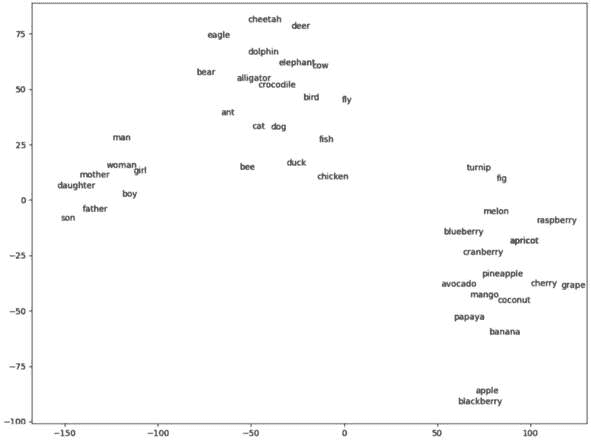
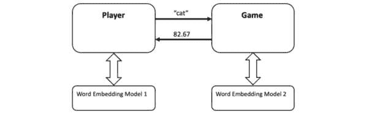
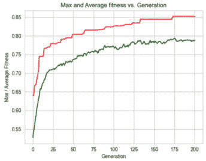

# 第十一章：自然语言处理

本章探讨了遗传算法如何增强**自然语言处理**（**NLP**）任务的性能，并深入了解其潜在机制。

本章通过介绍 NLP 领域并解释**词嵌入**的概念开始。我们运用这一技术，利用遗传算法来玩类似*Semantle*的神秘词游戏，挑战算法猜测神秘词。

随后，我们研究了**n-gram**和**文档分类**。我们利用遗传算法来确定一个紧凑而有效的特征子集，揭示分类器的运作原理。

到本章结束时，你将达到以下目标：

+   熟悉 NLP 领域及其应用

+   理解了词嵌入的概念及其重要性

+   使用词嵌入实现了一个神秘词游戏，并创建了一个由遗传算法驱动的玩家来猜测神秘词

+   获取了有关 n-gram 及其在文档处理中的作用的知识

+   开发了一种过程，显著减少了用于消息分类的特征集大小

+   使用最小特征集来洞察分类器的运作

本章将以快速概述自然语言处理（NLP）开始。如果你是经验丰富的数据科学家，可以跳过引言部分。

# 技术要求

本章将使用 Python 3，并配备以下支持库：

+   **deap**

+   **numpy**

+   **pandas**

+   **matplotlib**

+   **seaborn**

+   **scikit-learn**

+   **gensim**——在本章中介绍

重要提示

如果你使用我们提供的**requirements.txt**文件（参见*第三章*），这些库已经包含在你的环境中。

本章的代码可以在这里找到：

[`github.com/PacktPublishing/Hands-On-Genetic-Algorithms-with-Python-Second-Edition/tree/main/chapter_11`](https://github.com/PacktPublishing/Hands-On-Genetic-Algorithms-with-Python-Second-Edition/tree/main/chapter_11)

查看以下视频，看看代码如何运行：

[`packt.link/OEBOd`](https://packt.link/OEBOd)

# 理解 NLP

自然语言处理（NLP）是**人工智能**的一个迷人分支，专注于计算机与人类语言之间的互动。NLP 结合了语言学、计算机科学和**机器学习**，使机器能够理解、解释和生成有意义且有用的人类语言。在过去几年中，NLP 在我们的日常生活中扮演着越来越重要的角色，应用范围涵盖多个领域，从虚拟助手和聊天机器人到情感分析、语言翻译和信息检索等。

自然语言处理（NLP）的主要目标之一是弥合人类与机器之间的沟通鸿沟；这是至关重要的，因为语言是人们进行互动和表达思想、观点和愿望的主要媒介。弥合人类与机器之间沟通鸿沟的目标推动了 NLP 领域的显著进展。最近这一领域的一个重要里程碑是**大型语言模型**（**LLMs**）的开发，例如 OpenAI 的**ChatGPT**。

为了创造人机沟通的桥梁，必须有一种方法能够将人类语言转化为数值表示，使机器能够更有效地理解和处理文本数据。一个这样的技术就是使用**词嵌入**，在下一节中将对此进行描述。

## 词嵌入

词嵌入是英语（或其他语言）中单词的数值表示。每个单词都使用一个固定长度的实数向量进行编码。这些向量有效地捕捉了与它们所表示的单词相关的语义和上下文信息。

词嵌入是通过训练**神经网络**（**NNs**）来创建单词的数值表示，这些神经网络从大量的书面或口语文本中学习，其中具有相似上下文的单词会映射到连续向量空间中的相邻点。

创建词嵌入的常见技术包括**Word2Vec**、**全局词向量表示**（**GloVe**）和**fastText**。

词嵌入的典型维度可以变化，但常见的选择是 50、100、200 或 300 维。更高维度的嵌入可以捕捉到更多细微的关系，但可能需要更多的数据和计算资源。

例如，“dog”这个词在 50 维的 Word2Vec 嵌入空间中的表示可能如下所示：

```py
[0.11008 -0.38781 -0.57615 -0.27714 0.70521 0.53994 -1.0786 -0.40146 1.1504 -0.5678 0.0038977 0.52878 0.64561 0.47262  0.48549 -0.18407 0.1801 0.91397 -1.1979 -0.5778 -0.37985  0.33606 0.772 0.75555 0.45506 -1.7671 -1.0503 0.42566 0.41893 -0.68327 1.5673 0.27685 -0.61708 0.64638 -0.076996 0.37118 0.1308 -0.45137 0.25398 -0.74392 -0.086199 0.24068 -0.64819 0.83549 1.2502 -0.51379 0.04224 -0.88118 0.7158 0.38519]
```

这些 50 个值中的每一个代表了在训练数据上下文中“dog”这个词的不同方面。相关的词汇，如“cat”或“pet”，在这个空间中的词向量会接近“dog”向量，表示它们在语义上的相似性。这些嵌入不仅捕捉了语义信息，还保持了单词之间的关系，使得 NLP 模型能够理解单词关系、上下文，甚至句子和文档级的语义。

下图是 50 维向量的二维可视化，代表了各种英语单词。此图是使用**t-分布随机邻域嵌入**（**t-SNE**）创建的，t-SNE 是一种常用于可视化和探索词嵌入的降维技术。t-SNE 将词嵌入投影到一个低维空间，同时保持数据点之间的关系和相似性。此图展示了某些单词组（例如水果或动物）之间的接近关系。单词之间的关系也显而易见——例如，“son”和“boy”之间的关系类似于“daughter”和“girl”之间的关系：



图 11.1：词嵌入的二维 t-SNE 图

除了在自然语言处理中的传统作用，词嵌入还可以应用于遗传算法，正如我们在下一节中将看到的那样。

## 词嵌入和遗传算法

在本书的前几章中，我们实现了多个使用固定长度实值向量（或列表）作为候选解染色体表示的遗传算法示例。鉴于词嵌入使我们能够使用固定长度的实值数字向量来表示单词（如“dog”），这些向量可以有效地作为遗传算法应用中的单词遗传表示。

这意味着我们可以利用遗传算法来解决候选解是英语单词的问题，利用词嵌入作为单词及其遗传表示之间的翻译机制。

为了展示这一概念，我们将通过一个有趣的词汇游戏来演示如何使用遗传算法解决问题，如下节所述。

# 使用遗传算法找出谜底词

近年来，在线谜词游戏获得了显著的流行。其中一个突出的例子是*Semantle*，这是一款根据词义来挑战你猜测每日词汇的游戏。

这款游戏会根据你猜测的词与目标词的语义相似度提供反馈，并且具有一个“热与冷”指示器，显示你的猜测与秘密词的接近程度。

在幕后，Semantle 使用词嵌入，特别是 Word2Vec 来表示谜词和玩家的猜测。它通过计算它们表示之间的差异来衡量它们的语义相似度：向量越接近，词汇之间的相似度就越高。游戏返回的相似度分数范围从-100（与答案差异很大）到 100（与答案完全相同）。

在接下来的子章节中，我们将创建两个 Python 程序。第一个程序模拟了 Semantle 游戏，另一个程序则是一个由遗传算法驱动的玩家或解算器，旨在通过最大化游戏的相似度分数来揭示谜底。两个程序都依赖于词嵌入模型；然而，为了保持清晰的区分，模拟现实世界的场景，每个程序都使用其独特的模型。玩家和游戏之间的互动仅限于交换实际的猜测单词及其对应的分数，且不交换嵌入向量。以下是示意图：



图 11.2：Python 模块的组件图及其交互

为了增加额外的神秘感，我们决定使每个程序使用完全不同的嵌入模型。为了使其工作，我们假设两个嵌入模型在词汇表中有显著的重叠。

下一节详细介绍了这些程序的 Python 实现。

## Python 实现

我们将首先使用`gensim`库创建单词嵌入模型的 Python 实现，如下一小节所述。

### gensim 库

`gensim`库是一个多才多艺的 Python 包，主要用于自然语言处理和文本分析任务。`gensim`通过提供一整套工具，使得处理单词向量的创建、训练和使用变得高效。其主要特点之一是作为预训练单词嵌入模型的提供者，我们将在第一个 Python 模块中利用它，如下所述。

### **Embeddings** 类

我们从一个名为`Embeddings`的 Python 类开始，该类封装了基于`gensim`的预训练单词嵌入模型。可以在以下链接找到这个类，它位于`embeddings.py`文件中：

[`github.com/PacktPublishing/Hands-On-Genetic-Algorithms-with-Python-Second-Edition/blob/main/chapter_11/embeddings.py`](https://github.com/PacktPublishing/Hands-On-Genetic-Algorithms-with-Python-Second-Edition/blob/main/chapter_11/embeddings.py)

此类的主要功能如下所示：

1.  类的 **__init__()** 方法初始化随机种子（如果有），然后使用 **_init_model()** 和 **_download_and_save_model()** 私有方法初始化选择的（或默认的）**gensim**模型。前者从本地文件上传模型的嵌入信息（如果可用）。否则，后者从**gensim**仓库下载模型，分离用于嵌入的关键部分**KeyedVectors**，并将其保存在本地以便下次使用：

    ```py
    if not isfile(model_path):
        self._download_and_save_model(model_path)
    print(f"Loading model '{self.model_name}' from local file...")
    self.model = KeyedVectors.load_word2vec_format(model_path, 
        binary=True)
    ```

1.  **pick_random_embedding()** 方法可用于从模型的词汇表中随机选择一个词。

1.  **get_similarity()** 方法用于检索模型在两个指定词之间的相似性值。

1.  **vec2_nearest_word()** 方法利用 **gensim** 模型的 **similar_by_vector()** 方法检索与指定嵌入向量最接近的词。很快我们将看到，这使得遗传算法可以使用任意向量（例如随机生成的向量），并使它们代表模型词汇表中的现有词。

1.  最后，**list_models()** 方法可用于检索和显示**gensim**库提供的可用嵌入模型的信息。

如前所述，这个类被`Player`和`Game`组件共同使用，将在下一小节中讨论。

### **MysteryWordGame** 类

`MysteryWordGame` Python 类封装了 `Game` 组件。它可以在以下链接的 `mystery_word_game.py` 文件中找到：

[`github.com/PacktPublishing/Hands-On-Genetic-Algorithms-with-Python-Second-Edition/blob/main/chapter_11/mystery_word_game.py`](https://github.com/PacktPublishing/Hands-On-Genetic-Algorithms-with-Python-Second-Edition/blob/main/chapter_11/mystery_word_game.py)

该类的主要功能如下：

1.  该类使用了斯坦福大学开发的**glove-twitter-50** **gensim** 预训练嵌入模型。该模型专门为 Twitter 文本数据设计，使用了 50 维的嵌入向量。

1.  该类的 **__init__()** 方法初始化它将内部使用的嵌入模型，然后随机选择一个神秘单词或使用作为参数传递的指定单词：

    ```py
    self.embeddings = Embeddings(model_name=MODEL)
         self.mystery_word = given_mystery_word if
              given_mystery_word else
              self.embeddings.pick_random_embedding()
    ```

1.  **score_guess()** 方法计算游戏返回的给定猜测单词的得分。如果该单词不在模型的词汇表中（可能是因为玩家模块使用了一个可能不同的模型），则得分设置为最小值 -100。否则，计算出的得分值将是一个介于 -100 和 100 之间的数字：

    ```py
    if self.embeddings.has_word(guess_word):
        score = 100 *
        self.embeddings.get_similarity(self.mystery_word,
        guess_word)
    else:
        score = -100
    ```

1.  **main()** 方法通过创建游戏的实例来测试该类的功能，选择单词 **"dog"**，并评估与其相关的多个猜测单词，例如 **"canine"** 和 **"hound"**。它还包括一个不相关的单词（**"computer"**）和一个在词汇表中不存在的单词（**"asdghf"**）：

    ```py
    game = MysteryWordGame(given_mystery_word="dog")
    print("-- Checking candidate guess words:")
    for guess_word in ["computer", "asdghf", "canine", "hound", 
        "poodle", "puppy", "cat", "dog"]:
        score = game.score_guess(guess_word)
        print(f"- current guess: {guess_word.ljust(10)} => 
            score = {score:.2f}")
    ```

执行该类的 `main()` 方法会产生以下输出：

```py
Loading model 'glove-twitter-50' from local file...
--- Mystery word is 'dog' — game on!
-- Checking candidate guess words:
- current guess: computer   => score = 54.05
- current guess: asdghf     => score = -100.00
- current guess: canine     => score = 47.07
- current guess: hound      => score = 64.93
- current guess: poodle     => score = 65.90
- current guess: puppy      => score = 87.90
- current guess: cat        => score = 94.30
- current guess: dog        => score = 100.00
```

我们现在已经准备好进入有趣的部分——试图解决游戏的程序。

### 基于遗传算法的玩家程序

如前所述，该模块使用了与游戏中使用的模型不同的嵌入模型，尽管它也可以选择使用相同的模型。在这种情况下，我们选择了 `glove-wiki-gigaword-50` `gensim` 预训练嵌入模型，该模型是在来自英语 *Wikipedia* 网站和 *Gigaword* 数据集的大量语料库上训练的。

#### 解的表示

在此案例中，遗传算法中的解表示为一个实值向量（或列表），其维度与嵌入模型相同。这使得每个解可以作为一个嵌入向量，尽管并不完全完美。最初，算法使用随机生成的向量，并通过交叉和变异操作，至少可以保证部分向量不会直接与模型词汇中的现有单词对应。为了解决这个问题，我们使用 `Embedding` 类中的 `vec2_nearest_word()` 方法，该方法返回词汇中最接近的单词。这种方法体现了**基因型到表型映射**的概念，如在*第四章*《组合优化》中讨论的那样。

#### 早期收敛标准

在迄今讨论的大多数情况下，解决方案并不知道在优化过程中可以达到的最佳得分。然而，在这种情况下，我们知道最佳得分是 100。一旦达到，就找到了正确的单词，继续进化循环就没有意义了。因此，我们修改了遗传算法的主循环以在达到最大分数时中断。修改后的方法称为 `eaSimple_modified()`，可以在 `elitism_modified.py` 模块中找到。它接受一个名为 `max_fitness` 的可选参数。当此参数提供了一个值时，如果迄今为止找到的最佳适应度值达到或超过此值，则主循环中断：

```py
if max_fitness and halloffame.items[0].fitness.values[0] >= 
    max_fitness:
    break
```

#### 打印出当前猜测最佳单词

此外，`eaSimple_modified()` 方法包括打印与迄今为止找到的最佳适应度个体对应的猜测单词，作为为每个个体生成的统计摘要的一部分：

```py
if verbose:
    print(f"{logbook.stream} => {embeddings.vec2_nearest_word(
        np.asarray(halloffame.items[0]))}")
```

#### 遗传算法实现

基于遗传算法的玩家为神秘单词游戏寻找最佳超参数值，由位于以下链接的 `01_find_mystery_word.py` Python 程序实现：

[`github.com/PacktPublishing/Hands-On-Genetic-Algorithms-with-Python-Second-Edition/blob/main/chapter_11/01_find_mystery_word.py`](https://github.com/PacktPublishing/Hands-On-Genetic-Algorithms-with-Python-Second-Edition/blob/main/chapter_11/01_find_mystery_word.py)

以下步骤描述了这个程序的主要部分：

1.  我们首先创建一个 **Embeddings** 类的实例，它将作为解决程序的词嵌入模型： 

    ```py
    embeddings = Embeddings(model_name='glove-wiki-gigaword-50', 
        randomSeed=RANDOM_SEED)
    VECTOR_SIZE = embeddings.get_vector_size()
    ```

1.  接下来，我们创建 **MysteryWordGame** 类的一个实例，代表我们将要玩的游戏。我们指示它使用单词“dog”作为演示目的。稍后可以用其他单词替换这个词，或者如果省略 **given_mystery_word** 参数，我们可以让游戏选择一个随机单词：

    ```py
    game = MysteryWordGame(given_mystery_word='dog')
    ```

1.  由于我们的目标是最大化游戏的得分，我们定义了一个单目标策略来最大化适应度：

    ```py
    creator.create("FitnessMax", base.Fitness, weights=(1.0,))
    ```

1.  要创建表示词嵌入的随机个体，我们创建一个 **randomFloat()** 函数，并将其注册到工具箱中：

    ```py
    def randomFloat(low, up):
        return [random.uniform(l, u) for l, u in zip([low] * 
            VECTOR_SIZE, [up] * VECTOR_SIZE)]
    toolbox.register("attrFloat", randomFloat, BOUNDS_LOW, 
        BOUNDS_HIGH)
    ```

1.  **score()** 函数用于评估每个解决方案的适应度，这个过程包括两个步骤：首先，我们使用本地 **embeddings** 模型找到评估向量最接近的词汇单词（这是基因型到表现型映射发生的地方）。接下来，我们将这个词汇发送到 **Game** 组件，并请求其评分作为猜测的单词。游戏返回的分数，一个从 -100 到 100 的值，直接用作适应度值：

    ```py
    def score(individual):
        guess_word = embeddings.vec2_nearest_word(
            np.asarray(individual))
        return game.score_guess(guess_word),
    toolbox.register("evaluate", score)
    ```

1.  现在，我们需要定义遗传操作符。对于*选择*操作符，我们使用常见的*tournament selection*（锦标赛选择），锦标赛大小为 2；而对于*交叉*和*变异*操作符，我们选择专门针对有界浮动列表染色体的操作符，并为每个超参数定义了相应的边界：

    ```py
    toolbox.register("select", tools.selTournament, tournsize=2)
    toolbox.register("mate",
                     tools.cxSimulatedBinaryBounded,
                     low=BOUNDS_LOW,
                     up=BOUNDS_HIGH,
                     eta=CROWDING_FACTOR)
    toolbox.register("mutate",
                     tools.mutPolynomialBounded,
                     low=BOUNDS_LOW,
                     up=BOUNDS_HIGH,
                     eta=CROWDING_FACTOR,
                     indpb=1.0 / NUM_OF_PARAMS)
    ```

1.  此外，我们继续使用精英主义方法，其中**名人堂**（**HOF**）成员——当前最优个体——始终被无修改地传递到下一代。然而，在本次迭代中，我们使用了**eaSimple_modified**算法，其中——此外——主循环将在得分达到已知的最高分时终止：

    ```py
    population, logbook = eaSimple_modified(
        population,
        toolbox,
        cxpb=P_CROSSOVER,
        mutpb=P_MUTATION,
        ngen=MAX_GENERATIONS,
        max_fitness=MAX_SCORE,
        stats=stats,
        halloffame=hof,
        verbose=True)
    ```

通过运行算法，种群大小为 30，得到了以下结果：

```py
Loading model 'glove-wiki-gigaword-50' from local file...
Loading model 'glove-twitter-50' from local file...
--- Mistery word is 'dog' — game on!
gen     nevals  max     avg
0       30      51.3262 -43.8478 => stories
1       25      51.3262 -17.5409 => stories
2       26      51.3262 -1.20704 => stories
3       26      51.3262 11.1749  => stories
4       26      64.7724 26.23    => bucket
5       25      64.7724 40.0518  => bucket
6       26      67.487  42.003   => toys
7       26      69.455  37.0863  => family
8       25      69.455  48.1514  => family
9       25      69.455  38.5332  => family
10      27      87.2265 47.9803  => pet
11      26      87.2265 46.3378  => pet
12      27      87.2265 40.0165  => pet
13      27      87.2265 52.6842  => pet
14      26      87.2265 59.186   => pet
15      27      87.2265 41.5553  => pet
16      27      87.2265 49.529   => pet
17      27      87.2265 50.9414  => pet
18      27      87.2265 44.9691  => pet
19      25      87.2265 30.8624  => pet
20      27      100     63.5354  => dog
Best Solution = dog
Best Score = 100.00
```

从这个输出中，我们可以观察到以下几点：

+   加载了两个不同的词嵌入模型，一个用于玩家，另一个用于游戏，按照设计进行。

+   设置为**‘狗’**的神秘词汇，在 20 代之后被遗传算法驱动的玩家正确猜测。

+   一旦找到词汇，玩家就停止了游戏，尽管最大代数设置为 1000。

+   我们可以看到当前最优猜测词汇的演变过程：

+   **故事** → **桶** → **玩具** → **家庭** → **宠物** → **狗**

这看起来很棒！不过，请记住这只是一个示例。我们鼓励你尝试其他词汇，以及调整遗传算法的不同设置；也许还可以改变嵌入模型。是否有某些模型对比其他模型兼容性差呢？

本章的下一部分，我们将探索**文档分类**。

# 文档分类

文档分类是自然语言处理中的一项关键任务，涉及根据文本内容将文档分到预定义的类别或类目中。这个过程对于组织、管理和从大量文本数据中提取有意义的信息至关重要。文档分类的应用广泛，涵盖各行各业和领域。

在信息检索领域，文档分类在**搜索引擎**中扮演着至关重要的角色。通过将网页、文章和文档分类到相关的主题或类型，搜索引擎可以为用户提供更精确、更有针对性的搜索结果。这提升了整体用户体验，确保用户能够快速找到所需信息。

在客户服务和支持中，文档分类能够实现**自动路由**客户咨询和信息到相关部门或团队。例如，公司收到的电子邮件可以分类为“账单查询”、“技术支持”或“一般咨询”，确保每一条消息都能及时传达给正确的团队进行处理。

在法律领域，文档分类在**电子发现**等任务中至关重要，其中需要分析大量的法律文档以确定它们是否与案件相关。分类有助于识别潜在与法律事务相关的文档，从而简化审查过程，减少法律程序所需的时间和资源。

此外，文档分类在**情感分析**中至关重要，可以用来将社交媒体帖子、评论和意见分类为正面、负面或中性情感。这些信息对于希望评估客户反馈、监控品牌声誉并做出数据驱动决策以改进产品或服务的企业来说是无价的。

执行文档分类的一个有效方法是利用 n-gram，详细内容将在接下来的部分中讲解。

## N-gram

n-gram 是由*n*个项目组成的连续序列，这些项目可以是字符、单词或甚至短语，从更大的文本中提取出来。通过将文本分解成这些较小的单位，n-gram 能够提取出有价值的语言模式、关系和语境。

例如，在*字符 n-gram*的情况下，3-gram 可能会将单词“apple”拆分为“app”，“ppl”和“ple”。

这里有一些*单词 n-gram*的示例：

+   **单元组（1-gram）**：

    *文本*：“我爱编程。”

    *单元组*：[“我”，“爱”，“编程”]

+   **二元组（2-gram）**：

    *文本*：“自然语言处理是迷人的。”

    *二元组*：[“自然语言”，“语言处理”，“处理是”，“是迷人”]

+   **三元组（3-gram）**：

    *文本*：“机器学习模型可以泛化。”

    *三元组*：[“机器学习模型”，“学习模型可以”，“模型可以泛化”]

N-gram 通过揭示单词或字符的顺序排列，识别频繁的模式并提取特征，从而提供对文本内容的洞察。它们有助于理解语言结构、语境和模式，使其在文档分类等文本分析任务中非常有价值。

## 选择 n-gram 的一个子集

在*第七章*，“*通过特征选择增强机器学习模型*”中，我们展示了选择有意义特征子集的重要性，这一过程在文档分类中同样具有价值，尤其是当处理大量提取的 n-gram 时，这在大型文档中很常见。识别相关 n-gram 子集的优势包括以下几点：

+   **降维**：减少 n-gram 的数量可以提高计算效率，防止过拟合

+   **关注关键特征**：选择具有区分性的 n-gram 有助于模型集中关注关键特征

+   **噪声减少**：过滤掉无信息的 n-gram 最小化数据中的噪声

+   **增强泛化能力**：精心选择的子集提高了模型处理新文档的能力

+   **效率**：较小的特征集加速模型的训练和预测

此外，在文档分类中识别相关的 n-gram 子集对于模型可解释性非常重要。通过将特征缩小到一个可管理的子集，理解和解释影响模型预测的因素变得更加容易。

类似于我们在*第七章*中所做的，我们将在这里应用基因算法搜索，以识别相关的 n-gram 子集。然而，考虑到我们预期的 n-gram 数量远大于我们之前使用的常见数据集中的特征数量，我们不会寻找整体最好的子集。相反，我们的目标是找到一个固定大小的特征子集，例如最好的 1,000 个或 100 个 n-gram。

## 使用基因算法搜索固定大小的子集

由于我们需要在一个非常大的群体中识别一个良好的、固定大小的子集，下面我们尝试定义基因算法所需的常见组件：

+   **解空间表示**：由于子集的大小远小于完整数据集，因此使用表示大数据集中项索引的固定大小整数列表更加高效。例如，如果我们旨在从 100 个项目中创建一个大小为 3 的子集，则一个可能的解决方案可以表示为列表，如[5, 42, 88]或[73, 11, 42]。

+   **交叉操作**：为了确保有效的后代，我们必须防止同一个索引在每个后代中出现多次。在前面的示例中，项“42”出现在两个列表中。如果我们使用单点交叉，可能会得到后代[5, 42, 42]，这实际上只有两个唯一的项，而不是三个。一种克服这个问题的简单交叉方法如下：

    1.  创建一个集合，包含两个父代中所有唯一的项。在我们的示例中，这个集合是{5, 11, 42, 73, 88}。

    1.  通过从前面提到的集合中随机选择生成后代。每个后代应该选择三个项（在本例中）。可能的结果可以是[5, 11, 88]和[11, 42, 88]。

+   **变异操作**：生成一个有效变异个体的简单方法如下：

    +   对于列表中的每个项，按指定的概率，将该项替换为当前列表中存在的项。

    +   例如，如果我们考虑列表[11, 42, 88]，则有可能将第二个项（42）替换为 27，得到列表[11, 27, 88]。

## Python 实现

在接下来的章节中，我们将实现以下内容：

+   一个文档分类器，它将在来自两个新闻组的文档数据上训练，并使用 n-gram 来预测每个文档属于哪个新闻组

+   一个由基因算法驱动的优化器，旨在根据所需的子集大小，寻找用于此分类任务的最佳 n-gram 子集

我们将从实现分类器的类开始，如下一个子章节所述：

### 新闻组文档分类器

我们从一个名为`NewsgroupClassifier`的 Python 类开始，实现一个基于`scikit-learn`的文档分类器，该分类器使用 n-gram 作为特征，并学习区分来自两个不同新闻组的帖子。该类可以在`newsgroup_classifier.py`文件中找到，该文件位于以下链接：

[`github.com/PacktPublishing/Hands-On-Genetic-Algorithms-with-Python-Second-Edition/blob/main/chapter_11/newsgroup_classifier.py`](https://github.com/PacktPublishing/Hands-On-Genetic-Algorithms-with-Python-Second-Edition/blob/main/chapter_11/newsgroup_classifier.py)

该类的主要功能如下所示：

1.  该类的**init_data()**方法由**__init__()**调用，从**scikit-learn**的内置新闻组数据集中创建训练集和测试集。它从两个类别**'rec.autos'**和**'rec.motorcycles'**中检索帖子，并进行预处理，去除标题、页脚和引用：

    ```py
    categories = ['rec.autos', 'rec.motorcycles']
    remove = ('headers', 'footers', 'quotes')
    newsgroups_train = fetch_20newsgroups(subset='train', 
        categories=categories, remove=remove, shuffle=False)
    newsgroups_test = fetch_20newsgroups(subset='test', 
        categories=categories, remove=remove, shuffle=False)
    ```

1.  接下来，我们创建两个**TfidfVectorizer**对象：一个使用 1 到 3 个词的词 n-gram，另一个使用 1 到 10 个字符的字符 n-gram。这些向量化器根据每个文档中 n-gram 的相对频率与整个文档集合进行比较，将文本文档转换为数值特征向量。然后，这两个向量化器被合并成一个**vectorizer**实例，以从提供的新闻组消息中提取特征：

    ```py
    word_vectorizer = TfidfVectorizer(analyzer='word', 
        sublinear_tf=True, max_df=0.5, min_df=5, 
        stop_words="english", ngram_range=(1, 3))
    char_vectorizer = TfidfVectorizer(analyzer='char', 
        sublinear_tf=True, max_df=0.5, 
        min_df=5, ngram_range=(1, 10))
    vectorizer = FeatureUnion([('word_vectorizer', word_vectorizer), 
        ('char_vectorizer', char_vectorizer)])
    ```

1.  我们通过允许**vectorizer**实例从训练数据中“学习”相关的 n-gram 信息，然后将训练数据和测试数据转换为包含相应 n-gram 特征的向量数据集：

    ```py
    self.X_train = vectorizer.fit_transform(newsgroups_train.data)
    self.y_train = newsgroups_train.target
    self.X_test = vectorizer.transform(newsgroups_test.data)
    self.y_test = newsgroups_test.target
    ```

1.  **get_predictions()**方法生成“简化”版本的训练集和测试集，利用通过**features_indices**参数提供的特征子集。随后，它使用**MultinomialNB**的一个实例，这是一个在文本分类中常用的分类器，它在简化后的训练集上进行训练，并为简化后的测试集生成预测：

    ```py
    reduced_X_train = self.X_train[:, features_indices]
    reduced_X_test = self.X_test[:, features_indices]
    classifier = MultinomialNB(alpha=.01)
    classifier.fit(reduced_X_train, self.y_train)
    return classifier.predict(reduced_X_test)
    ```

1.  **get_accuracy()**和**get_f1_score()**方法使用**get_predictions()**方法来分别计算和返回分类器的准确率和 f-score：

1.  `main()`方法产生以下输出：

    ```py
    Initializing newsgroup data...
    Number of features = 51280, train set size = 1192, test set size = 794
    f1 score using all features: 0.8727376310606889
    f1 score using random subset of 100 features: 0.589931144127823
    ```

我们可以看到，使用所有 51,280 个特征时，分类器能够达到 0.87 的 f1-score，而使用 100 个随机特征子集时，得分降至 0.59。让我们看看使用遗传算法选择特征子集是否能帮助我们接近更高的得分。

### 使用遗传算法找到最佳特征子集

基于遗传算法的搜索，用于寻找 100 个特征的最佳子集（从原始的 51,280 个特征中挑选），是通过`02_solve_newsgroups.py` Python 程序实现的，程序位于以下链接：

[`github.com/PacktPublishing/Hands-On-Genetic-Algorithms-with-Python-Second-Edition/blob/main/chapter_11/02_solve_newsgroups.py`](https://github.com/PacktPublishing/Hands-On-Genetic-Algorithms-with-Python-Second-Edition/blob/main/chapter_11/02_solve_newsgroups.py)

以下步骤描述了该程序的主要部分：

1.  我们通过创建**NewsgroupClassifier**类的一个实例，来测试不同的固定大小特征子集：

    ```py
    ngc = NewsgroupClassifier(RANDOM_SEED)
    ```

1.  然后，我们定义了两个专门的固定子集遗传操作符，**cxSubset()**——实现交叉——和**mutSubset()**——实现变异，正如我们之前所讨论的那样。

1.  由于我们的目标是最大化分类器的 f1 分数，我们定义了一个单一目标策略来最大化适应度：

    ```py
    creator.create("FitnessMax", base.Fitness, weights=(1.0,))
    ```

1.  为了创建表示特征索引的随机个体，我们创建了**randomOrder()**函数，该函数利用**random.sample()**在 51,280 的期望范围内生成一个随机的索引集。然后，我们可以使用这个函数来创建个体：

    ```py
    toolbox.register("randomOrder", random.sample, range(len(ngc)), 
        SUBSET_SIZE)
    toolbox.register("individualCreator", tools.initIterate, 
        creator.Individual, toolbox.randomOrder)
    ```

1.  **get_score()**函数用于评估每个解（或特征子集）的适应度，它通过调用**NewsgroupClassifier**实例的**get_f1_score()**方法来实现：

    ```py
    def get_score(individual):
        return ngc.get_f1_score(individual),
    toolbox.register("evaluate", get_score)
    ```

1.  现在，我们需要定义遗传操作符。对于*选择*操作符，我们使用常规的*锦标赛选择*，锦标赛大小为 2；而对于*交叉*和*变异*操作符，我们选择之前定义的专用函数：

    ```py
    toolbox.register("select", tools.selTournament, tournsize=2)
    toolbox.register("mate", cxSubset)
    toolbox.register("mutate", mutSubset, indpb=1.0/SUBSET_SIZE)
    ```

1.  最后，是时候调用遗传算法流程，我们继续使用精英主义方法，其中 HOF 成员——当前最佳个体——始终不加修改地传递到下一代：

    ```py
    population, logbook = eaSimple(
        population,
        toolbox,
        cxpb=P_CROSSOVER,
        mutpb=P_MUTATION,
        ngen=MAX_GENERATIONS,
        stats=stats,
        halloffame=hof,
        verbose=True)
    ```

通过运行该算法 5 代，种群大小为 30，我们得到以下结果：

```py
Initializing newsgroup data...
Number of features = 51280, train set size = 1192, test set size = 794
gen     nevals  max             avg
0       200     0.639922        0.526988
1       166     0.639922        0.544121
2       174     0.663326        0.557525
3       173     0.669138        0.574895
...
198     170     0.852034        0.788416
199     172     0.852034        0.786208
200     167     0.852034        0.788501
-- Best Ever Fitness =  0.8520343720882079
-- Features subset selected =
1:    5074 = char_vectorizer__ crit
2:    12016 = char_vectorizer__=oo
3:    18081 = char_vectorizer__d usi
...
```

结果表明，我们成功识别出了一个包含 100 个特征的子集，f1 分数为 85.2%，这一结果与使用全部 51,280 个特征得到的 87.2%分数非常接近。

在查看显示最大适应度和平均适应度随代数变化的图表时，接下来的结果显示，如果我们延长进化过程，可能会获得进一步的改进：



图 11.3：程序搜索最佳特征子集的统计数据

#### 进一步减少子集大小

如果我们希望进一步将子集大小减少到仅有 10 个特征呢？结果可能会让你惊讶。通过将`SUBSET_SIZE`常数调整为 10，我们依然取得了一个值得称赞的 f1 得分：76.1%。值得注意的是，当我们检查这 10 个选定的特征时，它们似乎是一些熟悉单词的片段。在我们的分类任务中，任务是区分专注于摩托车的新闻组和与汽车相关的帖子，这些特征开始展现出它们的相关性：

```py
-- Features subset selected =
1:    16440 = char_vectorizer__car
2:    18813 = char_vectorizer__dod
3:    50905 = char_vectorizer__yamah
4:    18315 = char_vectorizer__dar
5:    10373 = char_vectorizer__. The
6:    6586 = char_vectorizer__ mu
7:    4747 = char_vectorizer__ bik
8:    4439 = char_vectorizer__ als
9:    15260 = char_vectorizer__ave
10:    40719 = char_vectorizer__rcy
```

#### 移除字符 n-gram

以上结果引发了一个问题：我们是否应该仅使用单词 n-gram，而去除字符 n-gram 呢？我们可以通过使用一个单一的向量化器来实现，具体方法如下：

```py
newsgroup_classifier.py program are as follows:

```

正在初始化新闻组数据...

特征数量 = 2666，训练集大小 = 1192，测试集大小 = 794

使用所有特征的 f1 得分：0.8551359241014413

使用 100 个随机特征子集的 f1 得分：0.6333756056319708

```py

 These results suggest that exclusively using word n-grams can achieve comparable performance to the original approach while using a significantly smaller feature set (2,666 features).
If we now run the genetic algorithm again, the results are the following:

```

-- 最佳健身得分 = 0.750101164515984

-- 选定的特征子集 =

1:    1669 = 换油

2:    472 = 汽车

3:    459 = 汽车

4:    361 = 自行车

5:    725 = 检测器

6:    303 = 汽车

7:    296 = 自动

8:    998 = 福特

9:    2429 = 丰田

10:    2510 = v6

```py

 This set of selected features makes a lot of sense within the context of our classification task and provides insights into how the classifier operates.
Summary
In this chapter, we delved into the rapidly evolving field of NLP. We began by exploring word embeddings and their diverse applications. Our journey led us to experiment with solving the mystery-word game using genetic algorithms, where word embedding vectors served as the genetic chromosome. Following this, we ventured into n-grams and their role in document classification through a newsgroup message classifier. In this context, we harnessed the power of genetic algorithms to identify a compact yet effective subset of n-gram features derived from the dataset.
Finally, we endeavored to minimize the feature subset, aiming to gain insights into the classifier’s operations and interpret the factors influencing its predictions. In the next chapter, we will delve deeper into the realm of explainable and interpretable AI while applying genetic algorithms.
Further reading
For more information on the topics that were covered in this chapter, please refer to the following resources:

*   *Hands-On Python Natural Language Processing* by *Aman Kedia* and *Mayank Rasu*, *June* *26, 2020*
*   *Semantle* word game: [`semantle.com/`](https://semantle.com/)
*   **scikit-learn** 20 newsgroups dataset: [`scikit-learn.org/stable/modules/generated/sklearn.datasets.fetch_20newsgroups.html`](https://scikit-learn.org/stable/modules/generated/sklearn.datasets.fetch_20newsgroups.html)
*   **scikit-learn** **TfidfVectorizer**: [`scikit-learn.org/stable/modules/generated/sklearn.feature_extraction.text.TfidfVectorizer.html`](https://scikit-learn.org/stable/modules/generated/sklearn.feature_extraction.text.TfidfVectorizer.html)

```
