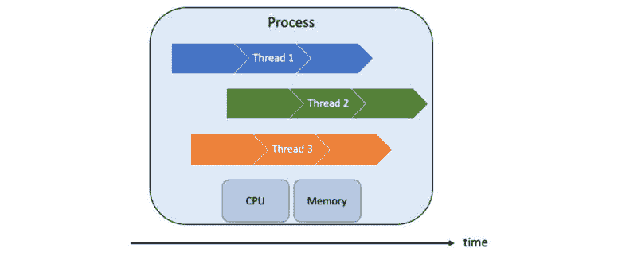
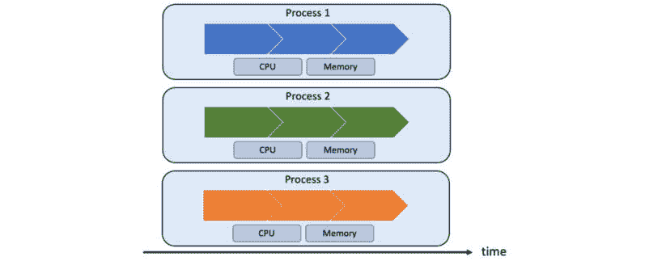
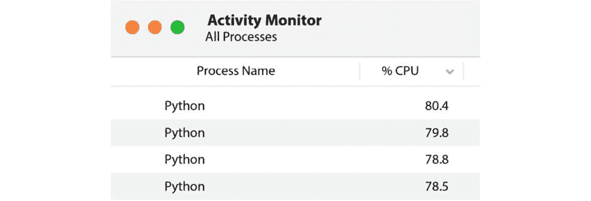
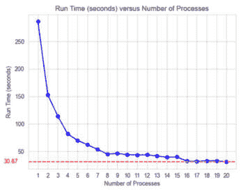
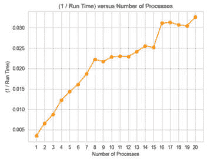

# 第十三章：加速遗传算法——并发的力量

本章深入探讨了如何通过并发，特别是多进程，来提升遗传算法的性能。我们将探索 Python 内置的功能以及外部库来实现这一改进。

本章首先强调了将 **并发** 应用于遗传算法的潜在好处。接着，我们通过尝试各种 **多进程** 方法来解决计算密集型的 One-Max 问题，将这一理论付诸实践。这使我们能够衡量通过这些技术实现的性能提升程度。

本章结束时，你将能够做到以下几点：

+   了解为什么遗传算法可能计算密集且耗时

+   认识到为什么遗传算法非常适合并发执行

+   实现一个计算密集型的 One-Max 问题版本，我们之前已经探索过

+   学习如何使用 Python 内置的多进程模块加速遗传算法的过程

+   熟悉 SCOOP 库，学习如何将其与 DEAP 框架结合使用，进一步提高遗传算法的效率

+   尝试两种方法，深入了解如何将多进程应用于当前问题

# 技术要求

在本章中，我们将使用 Python 3 并配合以下支持库：

+   **deap**

+   **numpy**

+   **scoop** —— 本章介绍

重要提示

如果你使用我们提供的 **requirements.txt** 文件（见 *第三章*），这些库已经包含在你的环境中了。

本章中将使用的程序可以在本书的 GitHub 仓库中找到，链接如下：[`github.com/PacktPublishing/Hands-On-Genetic-Algorithms-with-Python-Second-Edition/tree/main/chapter_13`](https://github.com/PacktPublishing/Hands-On-Genetic-Algorithms-with-Python-Second-Edition/tree/main/chapter_13)。

查看以下视频，了解代码的实际运行：

[`packt.link/OEBOd`](https://packt.link/OEBOd)

# 实际应用中遗传算法的长时间运行

到目前为止，我们探讨的示例程序虽然解决了实际问题，但它们故意设计得可以迅速收敛到一个合理的解。然而，在实际应用中，由于遗传算法的工作方式——通过考虑多样化的潜在解决方案来探索解空间——它通常会非常耗时。影响典型遗传算法运行时间的主要因素如下：

+   **世代数**：遗传算法通过一系列世代来运行，每一代都涉及对种群的评估、选择和操作。

+   **种群大小**：遗传算法保持一个潜在解的种群；更复杂的问题通常需要更大的种群。这增加了每一代中需要评估、选择和操作的个体数量。

+   **适应度评估**：必须评估种群中每个个体的适应度，以确定其解决问题的效果。根据适应度函数的复杂性或优化问题的性质，评估过程可能既计算密集又耗时。

+   **遗传操作**：选择用于选择作为每代父母的个体对。交叉和变异应用于这些个体对，并且根据算法的设计，可能会计算密集，特别是在处理复杂数据结构时。然而，在实践中，适应度函数的持续时间通常是每个个体所消耗时间的主导因素。

减少遗传算法长时间运行的一个显而易见的方式是使用并行化，正如我们将在以下小节中进一步探讨的。

# 并行化遗传算法

在单一代际内，遗传算法可以被认为是**显然可并行化**的——它们可以轻松地分解为多个独立任务，这些任务之间几乎没有或完全没有依赖关系或交互。这是因为种群中个体的适应度评估和操作通常是独立的任务。每个个体的适应度是根据其自身特征评估的，而遗传操作符（交叉和变异）是独立地应用于每一对个体的。这种独立性使得这些任务能够轻松并行执行。

有两种并行化方法——**多线程**和**多进程**——是我们将在以下小节中探讨的内容。

## 多线程

多线程是一种并发执行模型，允许多个线程在同一进程内存在，共享相同的资源，如内存空间，但独立运行。每个线程代表一个独立的控制流，使程序能够并发执行多个任务。

在多线程环境中，线程可以被看作是共享相同地址空间的轻量级进程。多线程特别适用于可以分解为较小、独立工作单元的任务，使得可用资源的使用更加高效，并增强响应性。以下图示了这一点：



图 13.1：多个线程在单一进程内并发运行

然而，Python 中的多线程面临一些限制，这些限制影响了它在我们用例中的效果。一个主要因素是**全局解释器锁**（**GIL**），这是 CPython（Python 的标准实现）中的一个关键部分。GIL 是一个**互斥锁**（mutex），用于保护对 Python 对象的访问，防止多个本地线程同时执行 Python 字节码。因此，多线程的好处主要体现在 I/O 密集型任务中，正如我们将在下一章中探讨的那样。对于那些计算密集型任务，这些任务不经常释放 GIL，且在许多数值计算中比较常见，多线程可能无法提供预期的性能提升。

注意

Python 社区的讨论和持续的研究表明，GIL 带来的限制可能会在未来的 Python 版本中解除，从而提高多线程的效率。

幸运的是，接下来描述的方法是一个非常可行的选择。

## 多进程

多进程是一种并发计算范式，涉及计算机系统内多个进程的同时执行。与多线程不同，多进程允许创建独立的进程，每个进程都有独立的内存空间。这些进程可以在不同的 CPU 核心或处理器上并行运行，使其成为一种强大的并行化任务的技术，能够充分利用现代多核架构，如下图所示：



图 13.2：多个进程在独立的核心上同时运行

每个进程独立运行，避免了与共享内存模型相关的限制，例如 Python 中的全局解释器锁（GIL）。多进程对于 CPU 密集型任务尤其有效，这类任务在遗传算法中常见，其中计算工作负载可以被划分为可并行化的单元。

由于多进程似乎是一种提高遗传算法性能的可行方法，我们将在本章剩余部分探讨其实现，使用 OneMax 问题的新版本作为我们的基准。

# 回到 OneMax 问题

在*第三章*，《使用 DEAP 框架》中，我们使用了 OneMax 问题作为遗传算法的“Hello World”。简要回顾一下，目标是发现一个指定长度的二进制字符串，使其数字之和最大。例如，在处理一个长度为 5 的 OneMax 问题时，考虑到的候选解包括 10010（数字之和=2）和 01110（数字之和=3），最终的最优解是 11111（数字之和=5）。

在*第三章*中，我们使用了问题长度为 100、种群大小为 200、50 代的参数，而在这里我们将处理一个大幅缩小的版本，问题长度为 10、种群大小为 20，且只有 5 代。这一调整的原因很快就会显现出来。

## 一个基准程序

该 Python 程序的初始版本为`01_one_max_start.py`，可在[`github.com/PacktPublishing/Hands-On-Genetic-Algorithms-with-Python-Second-Edition/blob/main/chapter_13/01_one_max_start.py`](https://github.com/PacktPublishing/Hands-On-Genetic-Algorithms-with-Python-Second-Edition/blob/main/chapter_13/01_one_max_start.py)找到。

该程序的主要功能概述如下：

1.  候选解通过一个由 0 和 1 组成的整数列表来表示。

1.  **oneMaxFitness()**函数通过对列表元素求和来计算适应度：

    ```py
    def oneMaxFitness(individual):
        return sum(individual), # return a tuple
    toolbox.register("evaluate", oneMaxFitness)
    ```

1.  对于遗传操作，我们采用*锦标赛选择*（锦标赛大小为 4）、*单点交叉*和*翻转位变异*。

1.  采用了*精英主义*方法，利用**elitism.eaSimpleWithElitism()**函数。

1.  程序的运行时间通过调用**time.time()**函数来测量，包围着**main()**函数的调用：

    ```py
    if __name__ == "__main__":
        start = time.time()
        main()
        end = time.time()
    print(f"Elapsed time = {(end - start):.2f} seconds")
    ```

运行该程序会产生以下输出：

```py
gen     nevals  max     avg
0       20      7       4.35
1       14      7       6.1
2       16      9       6.85
3       16      9       7.6
4       16      9       8.45
5       13      10      8.9
Best Individual =  [1, 1, 1, 1, 1, 1, 1, 1, 1, 1]
Elapsed time = 0.00 seconds
```

输出表明程序在第 5 代时达到了最优解 1111111111，运行时间不到 10 毫秒（仅考虑经过时间的小数点后两位）。

另一个值得注意的细节，这将在后续实验中起作用，是每代进行的适应度评估次数。相关值可以在从左数第二列`nevals`中找到。尽管种群大小为 20，每代的评估次数通常少于 20 次。这是因为如果某个个体的适应度已被计算过，算法会跳过该适应度函数。将这一列的数值加起来，我们可以发现，在程序运行过程中执行的总适应度评估次数为 95 次。

# 模拟计算密集度

如前所述，遗传算法中最消耗计算资源的任务通常是对个体的适应度评估。为了模拟这一方面，我们将故意延长适应度函数的执行时间。

该修改已在 Python 程序`02_one_max_busy.py`中实现，程序可在[`github.com/PacktPublishing/Hands-On-Genetic-Algorithms-with-Python-Second-Edition/blob/main/chapter_13/02_one_max_busy.py`](https://github.com/PacktPublishing/Hands-On-Genetic-Algorithms-with-Python-Second-Edition/blob/main/chapter_13/02_one_max_busy.py)找到。

该程序基于之前的版本，进行了如下修改：

1.  添加了一个**busy_wait()**函数。该函数通过执行一个空循环来消耗指定时长（以秒为单位）：

    ```py
    def busy_wait(duration):
        current_time = time.time()
        while (time.time() < current_time + duration):
            pass
    ```

1.  更新原始适应度函数，以便在计算数字之和之前调用**busy_wait()**函数：

    ```py
    def oneMaxFitness(individual):
        busy_wait(DELAY_SECONDS)
        return sum(individual), # return a tuple
    ```

1.  添加了**DELAY_SECONDS**常量，并将其值设置为 3：

    ```py
          DELAY_SECONDS = 3
    ```

运行修改后的程序会产生以下输出：

```py
gen     nevals  max     avg
0       20      7       4.35
1       14      7       6.1
2       16      9       6.85
3       16      9       7.6
4       16      9       8.45
5       13      10      8.9
Best Individual =  [1, 1, 1, 1, 1, 1, 1, 1, 1, 1]
Elapsed time = 285.01 seconds
```

正如预期的那样，修改后的程序输出与原始程序相同，唯一显著的不同是经过的时间显著增加，约为 285 秒。

这个持续时间是完全合理的；正如前面部分所强调的那样，在程序的执行过程中有 95 次适应度函数的调用（`nevals`列中的值之和）。由于每次执行现在需要额外的 3 秒，因此预期的额外时间为 95 次乘以 3 秒，总计 285 秒。

在检查这些结果时，让我们也确定一下理论上的限制，或者我们可以追求的最佳情况。如输出所示，执行基准遗传算法涉及六个“轮次”的适应度计算——一次用于初始代（“代零”），另外五次用于随后的五代。在每代内完全并发的情况下，最佳的执行时间为 3 秒，即单次适应度评估的时间。因此，理论上我们可以达到的最佳结果是 18 秒，即 6 次乘以每轮 3 秒。

以这个理论上的限制为基础，我们现在可以继续探索将多进程应用到基准测试中的方法。

# 使用 Pool 类进行多进程

在 Python 中，`multiprocessing.Pool`模块提供了一种方便的机制，可以将操作并行化到多个进程中。通过`Pool`类，可以创建一组工作进程，并将任务分配给这些进程。

`Pool`类通过提供`map`和`apply`方法来抽象化管理单个进程的细节。相反，DEAP 框架使得利用这种抽象变得非常简单。`toolbox`模块中指定的所有操作都通过默认的`map`函数在内部执行。将这个`map`替换为`Pool`类中的`map`意味着这些操作，包括适应度评估，现在将分配到池中的工作进程上。

让我们通过将多进程应用到之前的程序来进行说明。此修改在`03_one_max_pool.py` Python 程序中实现，可以在[`github.com/PacktPublishing/Hands-On-Genetic-Algorithms-with-Python-Second-Edition/blob/main/chapter_13/03_one_max_pool.py`](https://github.com/PacktPublishing/Hands-On-Genetic-Algorithms-with-Python-Second-Edition/blob/main/chapter_13/03_one_max_pool.py)找到。

只需进行少量修改，具体如下：

1.  导入**multiprocessing**模块：

    ```py
    import multiprocessing
    ```

1.  **multiprocessing.Pool**类实例的**map**方法被注册为 DEAP 工具箱模块中使用的**map**函数：

    ```py
    toolbox.register("map", pool.map)
    ```

1.  遗传算法流程，实现在**main()**函数中，现在在**with**语句下运行，该语句管理**multiprocessing.Pool**实例的创建和清理：

    ```py
    def main():
        with multiprocessing.Pool() as pool:
            toolbox.register("map", pool.map)
            # create initial population (generation 0):
            population = toolbox.populationCreator(
                n=POPULATION_SIZE)
            ...
    ```

在四核计算机上运行修改后的程序，输出结果如下：

```py
gen     nevals  max     avg
0       20      7       4.35
1       14      7       6.1
2       16      9       6.85
3       16      9       7.6
4       16      9       8.45
5       13      10      8.9
Best Individual =  [1, 1, 1, 1, 1, 1, 1, 1, 1, 1]
Elapsed time = 78.49 seconds
```

如预期的那样，输出结果与原始程序相同，而运行时间明显比之前短。

重要提示

该程序的运行时间可能会因不同计算机之间的差异而有所不同，甚至在同一台机器上的连续运行之间也会有所变化。如前所述，此基准测试的最佳结果大约是 18 秒。如果您的计算机已经接近这个理论极限，您可以通过将种群大小加倍（或根据需要更多）来使基准程序变得更加 CPU 密集型。记得调整本章和下一章中的所有基准程序版本，以反映新的种群大小。

假设使用四核计算机，您可能期望运行时间是之前的四分之一。然而，在这种情况下，我们可以看到持续时间的比率大约是 3.6（≈285/79），低于预期的 4。

有几个因素导致我们没有完全实现节省时间的潜力。其中一个重要因素是与并行化过程相关的开销，在将任务分配给多个进程并协调它们的执行时，会引入额外的计算负担。

此外，任务的粒度也起着作用。虽然适应度函数消耗了大部分处理时间，但像交叉和变异等遗传操作可能会遇到并行化开销大于收益的情况。

此外，算法中的某些部分，如处理名人堂和计算统计数据，并没有并行化。这一限制限制了并行化可以发挥的程度。

为了说明最后一点，我们来看一下程序运行时，Mac 上 Activity Monitor 应用程序的快照：



图 13.3：Activity Monitor 展示四个遗传算法进程在运行

正如预期的那样，处理多处理器程序的四个 Python 进程得到了大量利用，尽管还没有达到 100%。这引出了一个问题，能否“榨取”更多 CPU 的潜力，进一步缩短程序的运行时间？在接下来的部分中，我们将探讨这一可能性。

## 增加进程数

由于我们手头的四个 CPU 并未被充分利用，问题随之而来：是否可以通过使用超过四个并发进程来进一步提高利用率？

当我们通过调用 `multiprocessing.Pool()` 创建 `Pool` 类的实例时，如果没有任何参数，默认创建的进程数将与可用 CPU 的数量相同——在我们的案例中是四个。然而，我们可以使用可选的 `processes` 参数来设置所需的进程数量，如下所示：

```py
multiprocessing.Pool(processes=<number of processes>)
```

在我们的下一个实验中，我们将利用这个选项来改变进程数量，并比较结果时长。这将在 Python 程序 `04_one_max_pool_loop.py` 中实现，程序可通过 [`github.com/PacktPublishing/Hands-On-Genetic-Algorithms-with-Python-Second-Edition/blob/main/chapter_13/04_one_max_pool_loop.py`](https://github.com/PacktPublishing/Hands-On-Genetic-Algorithms-with-Python-Second-Edition/blob/main/chapter_13/04_one_max_pool_loop.py) 获取。

这个程序对前一个程序做了一些修改，具体如下：

1.  **main()** 函数被重命名为 **run()**，因为我们将多次调用它。它现在接受一个参数，**num_processes**。

1.  **Pool** 对象的实例化会传递此参数，以创建所请求大小的进程池：

    ```py
    with multiprocessing.Pool(processes=num_processes) as pool:
    ```

1.  **plot_graph()** 函数被添加用来帮助展示结果。

1.  程序的启动代码位于文件底部，现在创建了一个循环，多次调用 **run()** 函数，**num_processes** 参数从 1 增加到 20。它还将结果时长收集到列表 **run_times** 中：

    ```py
        run_times = []
        for num_processes in range(1, 21):
            start = time.time()
            run(num_processes)
            end = time.time()
            run_time = end – start
            run_times.append(run_time)
    ```

1.  在循环结束时，利用 **run_times** 列表中的值绘制两个图表，借助 **plot_graph()** 函数：

    ```py
    plot_graph(1, run_times, "Number of Processes", 
        "Run Time (seconds)", hr=33)
    plot_graph(2, [1/rt for rt in run_times], "Number of Processes", 
        "(1 / Run Time)", "orange")
    ```

在我们继续描述这个实验的结果之前，请记住，实际的数值可能因不同的计算机而有所不同。因此，您的具体结果可能会有所不同。然而，主要的观察结果应该是成立的。

在我们的四核计算机上运行此程序将产生以下输出：

```py
num_processes = 1
gen     nevals  max     avg
0       20      7       4.35
1       14      7       6.1
2       16      9       6.85
3       16      9       7.6
4       16      9       8.45
5       13      10      8.9
Best Individual =  [1, 1, 1, 1, 1, 1, 1, 1, 1, 1]
Number of Processes = 1 => Run time = 286.62 seconds
num_processes = 2
gen     nevals  max     avg
0       20      7       4.35
1       14      7       6.1
2       16      9       6.85
3       16      9       7.6
4       16      9       8.45
5       13      10      8.9
Best Individual =  [1, 1, 1, 1, 1, 1, 1, 1, 1, 1]
Number of Processes = 2 => Run time = 151.75 seconds
...
num_processes = 20
gen     nevals  max     avg
0       20      7       4.35
1       14      7       6.1
2       16      9       6.85
3       16      9       7.6
4       16      9       8.45
5       13      10      8.9
Best Individual =  [1, 1, 1, 1, 1, 1, 1, 1, 1, 1]
Number of Processes = 20 => Run time = 33.30 seconds
```

此外，还生成了两个图表。第一个图表，如下图所示，展示了不同进程数量下程序的运行时间。正如预期的那样，随着进程数量的增加，运行时间持续减少，超出了四个可用 CPU 的容量。值得注意的是，超过八个进程后，性能提升变得非常有限：



图 13.4：程序在不同进程数量下的运行时长

图中虚线红线表示我们测试中取得的最短时长——约 31 秒。为了进行对比，我们回顾一下本次测试的理论极限：在每轮 3 秒的适应度计算中，6 轮的计算总时间最好的结果是 18 秒。

第二个图表，如下图所示，描绘了时长的倒数（即 1/时长），表示程序在不同进程数量下的“速度”：



图 13.5：程序在不同进程数下的运行时长

这张图表明，程序的速度随着进程数增加到 8 个时几乎呈线性增长，但超过这个点后，增长速率减缓。值得注意的是，图表显示在从 15 个进程增加到 16 个进程时，性能显著提升，这一趋势在之前的图表中也有所体现。

当进程数超过可用的物理 CPU 核心数时，所观察到的性能提升现象，称为“过度订阅”，可以与多种因素相关。这些因素包括任务重叠、I/O 和等待时间、多线程、超线程以及操作系统的优化。从 15 个进程到 16 个进程的显著性能提升可能受计算机硬件架构和操作系统进程调度策略的影响。此外，程序工作负载的特定结构，也由三分之二的适应度计算轮次中涉及正好 16 次适应度评估（如`nevals`列所示）可见，也可能有助于这种增加。需要注意的是，这些效果会因计算机架构和所解决问题的性质而有所不同。

这个实验的主要收获是，实验不同的进程数以找到程序的最佳配置非常重要。幸运的是，你不需要每次都重新运行整个遗传算法——几代就足够用来比较并找出最佳设置。

# 使用 SCOOP 库进行多进程处理

另一种引入多进程的方法是使用**SCOOP**，这是一个旨在将代码执行并行化和分布到多个进程的 Python 库。**SCOOP**，即**Python 中的简单并发操作**，为 Python 中的并行计算提供了一个简单的接口，我们稍后会详细探讨。

将 SCOOP 应用到基于 DEAP 的程序中与使用`multiprocessing.Pool`模块非常相似，如 Python 程序`05_one_max_scoop.py`所示，可以在[`github.com/PacktPublishing/Hands-On-Genetic-Algorithms-with-Python-Second-Edition/blob/main/chapter_13/05_one_max_scoop.py`](https://github.com/PacktPublishing/Hands-On-Genetic-Algorithms-with-Python-Second-Edition/blob/main/chapter_13/05_one_max_scoop.py)查看。

这个程序只需要对原始的非多进程版本`02_one_max_busy.py`进行几个修改；这些修改在此列出：

1.  导入 SCOOP 的**futures**模块：

    ```py
    from scoop import futures
    ```

1.  将 SCOOP 的**futures**模块的**map**方法注册为 DEAP 工具箱模块中使用的“map”函数：

    ```py
    toolbox.register("map", futures.map)
    ```

就这样！但是，启动这个程序需要通过以下命令使用 SCOOP 作为主模块：

```py
python3 -m scoop 05_one_max_scoop.py
```

在同一台四核计算机上运行该程序，得到如下输出：

```py
SCOOP 0.7 2.0 on darwin using Python 3.11.1
Deploying 4 worker(s) over 1 host(s).
Worker distribution:
127.0.0.1: 3 + origin
Launching 4 worker(s) using /bin/zsh.
gen     nevals  max     avg
0       20      7       4.35
1       14      7       6.1
2       16      9       6.85
3       16      9       7.6
4       16      9       8.45
5       13      10      8.9
Best Individual =  [1, 1, 1, 1, 1, 1, 1, 1, 1, 1]
03_one_max_pool.py program, as both programs employed four concurrent processes.
However, we have seen that “oversubscription” (i.e., using more concurrent processes than the number of available cores) could yield better results. Luckily, SCOOP enables us to control the number of processes, or “workers,” via a command-line argument. Let’s run the program again but, this time, use 16 workers:

```

python3 -m scoop -n 16 05_one_max_scoop.py

```py

 The resulting output is as follows:

```

SCOOP 0.7 2.0 在 darwin 上使用 Python 3.11.1

在 1 台主机上部署 16 个工作进程。

工作进程分配：

127.0.0.1: 15 + 原点

使用 /bin/zsh 启动 16 个工作进程。

gen     nevals  max     avg

0       20      7       4.35

1       14      7       6.1

2       16      9       6.85

3       16      9       7.6

4       16      9       8.45

5       13      10      8.9

最佳个体 =  [1, 1, 1, 1, 1, 1, 1, 1, 1, 1]

忘记了未来的进度或接收到了意外的未来。这些警告表示通信问题，通常与由于过度订阅而导致的资源限制有关。尽管有这些警告，SCOOP 通常能够恢复并成功地重现预期的结果。

一些实验表明，当使用 20 个以上进程时，SCOOP 可以在 20 秒内完成任务，相较于我们在相同问题上使用 `multiprocessing.Pool` 模块时达到的 31 秒，取得了显著的提升。

这个改进可能源自于 SCOOP 在并行化方面的独特方法。例如，其动态任务分配可能比 `multiprocessing.Pool` 使用的静态方法更有效。此外，SCOOP 可能在进程管理开销上表现得更高效，且在可用核心上调度任务的能力更强。然而，这并不意味着 SCOOP 总是会优于 `multiprocessing.Pool`。建议试用两种方法，看看它们在你特定算法和问题上的表现。好消息是，在两者之间切换相对简单。

话虽如此，值得一提的是，SCOOP 提供了一个使其与 `multiprocessing.Pool` 区别开来的关键特性——**分布式计算**。这一特性允许在多台机器上进行并行处理。我们将在接下来的部分简要探讨这一功能。

使用 SCOOP 进行分布式计算

SCOOP 不仅支持单机上的多进程计算，还能够在多个互联的节点之间进行分布式计算。这一功能可以通过两种方式进行配置：

+   **使用** **--hostfile** **参数**：此参数后面应跟随一个包含主机列表的文件名。该文件中每行的格式为**<主机名或 IP 地址> <进程数>**，其中每一行指定了一个主机及该主机上要运行的进程数。

+   **使用** **--hosts** **参数**：此选项需要一个主机名列表。每个主机名应根据你打算在该主机上运行的进程数量列出。

如需更详细的信息和实际示例，建议查阅 SCOOP 的官方文档。

下一章将探讨一种超越单机限制的不同方法。

总结

在本章中，我们介绍了通过多进程将并发应用于遗传算法的概念，这是一种缓解其计算密集型特征的自然策略。展示了两种主要方法——使用 Python 内建的 `multiprocessing.Pool` 类和 SCOOP 库。我们采用了一个 CPU 密集型的经典 One-Max 问题作为基准，从中获得了一些洞见。本章的最后部分讨论了使用 SCOOP 库进行分布式计算的潜力。

在下一章，我们将通过采用客户端-服务器模型，将并发的概念提升到一个新的层次。这种方法将结合使用多进程和多线程，最终利用云计算的力量进一步提升性能。

深入阅读

要了解本章中涉及的更多内容，请参考以下资源：

+   *《高级 Python 编程：使用经过验证的设计模式构建高性能、并发和多线程的 Python 应用程序》*，作者：Dr. Gabriele Lanaro、Quan Nguyen 和 Sakis Kasampalis，2019 年 2 月

+   SCOOP 框架文档：[`scoop.readthedocs.io/en/latest/`](https://scoop.readthedocs.io/en/latest/)

+   Python 多进程模块文档：[`docs.python.org/3/library/multiprocessing.html`](https://docs.python.org/3/library/multiprocessing.html)

```py

```
