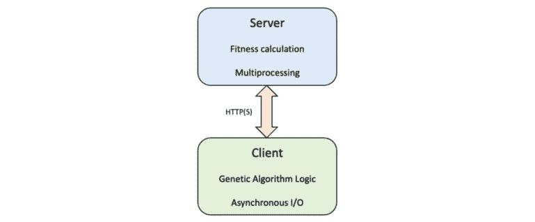
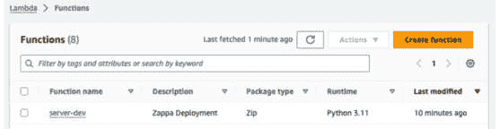
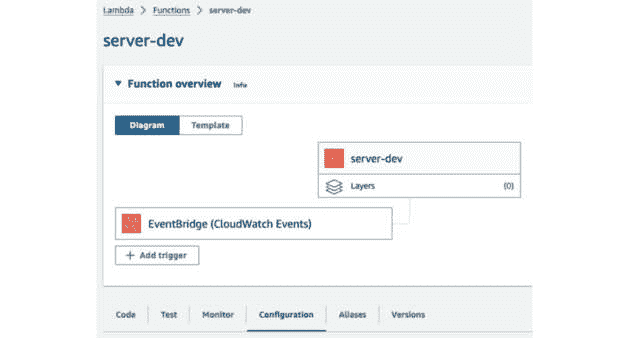
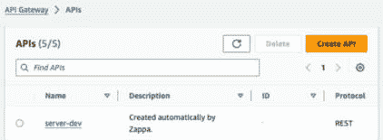
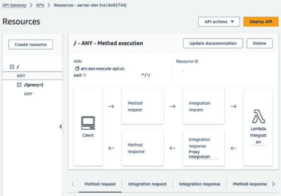

# 第十四章：超越本地资源——在云端扩展遗传算法

本章在上一章的基础上进行扩展，上一章专注于使用多进程来提高遗传算法的性能。本章将遗传算法重构为**客户端-服务器**模型，其中客户端采用**异步 I/O**，服务器管理适应度函数计算。然后，服务器组件通过**AWS Lambda**部署到云端，展示了无服务器架构在优化遗传算法计算中的实际应用。

本章首先讨论将遗传算法划分为客户端和服务器组件的优势。然后，逐步实现这一客户端-服务器模型，同时使用上一章的相同 One-Max 基准问题。服务器使用 Flask 构建，客户端则利用 Python 的 `asyncio` 库进行异步操作。本章包括在生产级服务器上部署 Flask 应用程序的实验，最后将其部署到 AWS Lambda（一个无服务器计算服务），展示如何利用云资源提升遗传算法的计算效率。

在本章中，您将执行以下任务：

+   理解遗传算法如何重构为客户端-服务器模型

+   学习如何使用 Flask 创建一个执行适应度计算的服务器

+   在 Python 中开发一个异步 I/O 客户端，与 Flask 服务器进行交互以进行遗传算法评估

+   熟悉 Python WSGI HTTP 服务器，如 Gunicorn 和 Waitress

+   学习如何使用 Zappa 将 Flask 服务器组件部署到云端，实现 AWS Lambda 上的无服务器执行

# 技术要求

在本章中，我们将使用 Python 3 以及以下支持库：

+   **deap**

+   **numpy**

+   **aiohttp** —— 本章介绍

重要说明

如果您使用我们提供的**requirements.txt**文件（请参见 *第三章*），这些库已经包含在您的环境中。

此外，将为独立的服务器模块创建并使用一个单独的虚拟环境，并包含以下支持库：

+   **flask**

+   **gunicorn**

+   **服务员**

+   **zappa**

本章使用的程序可以在本书的 GitHub 仓库中找到，链接为 [`github.com/PacktPublishing/Hands-On-Genetic-Algorithms-with-Python-Second-Edition/tree/main/chapter_14`](https://github.com/PacktPublishing/Hands-On-Genetic-Algorithms-with-Python-Second-Edition/tree/main/chapter_14)。

请观看以下视频，查看代码演示：

[`packt.link/OEBOd`](https://packt.link/OEBOd)

# 遗传算法性能的下一阶段——采用客户端-服务器架构

在前一章中，我们以多处理器方式实现了遗传算法，利用遗传算法的“极易并行化”特性，显著减少了每一代的计算时间。考虑到算法中最耗时的部分通常是适应度函数的计算，我们建立了一个模拟 CPU 密集型适应度函数的基准测试。通过利用 Python 内置的多进程功能以及名为 SCOOP 的外部库，我们成功地大幅减少了运行时间。

然而，这些实现仅限于在单台机器上运行的单一程序。在处理实际问题时，这种方法很可能会遇到机器资源的限制——不仅仅是可用的 CPU 核心，还包括内存和存储等基本资源。与我们的基准程序主要消耗 CPU 时间不同，实际的适应度函数可能对处理能力和内存都有较大的需求，这带来了巨大的挑战。

我们观察到 SCOOP 库支持通过利用网络中的其他机器来进行分布式计算。然而，在本章中，我们将探索另一种方法，即将程序分为两个独立的组件。这种方法将使我们在选择这些组件的运行平台时具有更大的灵活性。这样的策略为更丰富、更强大的计算解决方案打开了可能性，包括基于云的服务或专用硬件，从而克服了仅依赖网络机器的一些固有限制。

接下来的章节将详细介绍这一新结构的设计和实现过程，我们将分几个阶段进行。

# 实现客户端-服务器模型

我们的计划是将遗传算法的执行分为两个独立的部分——客户端和服务器，具体如下：

+   **客户端组件**：客户端将集中管理进化逻辑，包括种群初始化、选择过程，以及交叉和变异等遗传操作。

+   **服务器组件**：服务器将负责执行资源密集型的适应度函数计算。它将利用多进程技术充分发挥计算资源，绕过 Python 的**全局解释器锁**（**GIL**）所带来的限制。

+   **客户端的异步 I/O 使用**：此外，客户端将采用异步 I/O，它基于单线程、事件驱动模型运行。这种方法可以高效地处理 I/O 绑定的任务，使程序在等待 I/O 进程完成时能够同时处理其他操作。在服务器通信中采用异步 I/O 后，客户端能够发送请求并继续进行其他任务，而无需被动等待响应。这就像一个服务员将客人的订单送到厨房，然后在等待的同时接收另一桌的订单，而不是呆在厨房旁等待。类似地，我们的客户端通过在等待服务器响应时不阻塞主执行线程，优化了工作流程。

这个客户端-服务器模型及其操作动态在下图中有所说明：



图 14.1：所提议的客户端-服务器设置框图

在我们深入实现该模型之前，强烈建议为服务器组件设置一个单独的 Python 环境，具体内容将在下一节中介绍。

## 使用单独的环境

如我们在*第三章*《使用 DEAP 框架》中开始编码时所建议的，我们推荐为我们的程序创建一个虚拟环境，使用`venv`或`conda`等工具。使用虚拟环境是 Python 开发中的最佳实践，因为它使我们能够将项目的依赖项与其他 Python 项目及系统的默认设置和依赖项隔离开来。

鉴于客户端部分管理遗传算法的逻辑并使用 DEAP 框架，我们可以继续在我们目前使用的相同环境中开发它。然而，建议为服务器组件创建一个单独的环境。原因有两个：首先，服务器将不使用 DEAP 依赖项，而是依赖于一组不同的 Python 库；其次，我们最终计划将服务器部署到本地计算机之外，因此最好将这个部署保持尽可能轻量级。

作为参考，您可以在此查看使用`venv`创建虚拟环境的过程：[`docs.python.org/3/library/venv.html`](https://docs.python.org/3/library/venv.html)。

类似地，使用`conda`进行环境管理的过程可以参考此链接：[`conda.io/projects/conda/en/latest/user-guide/tasks/manage-environments.html`](https://conda.io/projects/conda/en/latest/user-guide/tasks/manage-environments.html)。

服务器模块的代码最好也保存在一个单独的目录中；在我们的代码库中，我们将其保存在`chapter_13`目录下的`server`目录中。

一旦我们为服务器组件创建并激活了虚拟环境，就可以开始编写组件代码。但在此之前，让我们先回顾一下我们正在解决的基准问题。

# 再次回顾 One-Max 问题

提醒一下，在*第十三章*《加速遗传算法》中，我们使用了 OneMax 问题的一个版本作为基准。这个程序的目标是找到一个指定长度的二进制字符串，使其数字之和最大。为了我们的实验，我们使用了一个简化的 10 位问题长度，同时选择了较小的种群规模和代数。另外，我们在原始的适应度评估函数中加入了一个 `busy_wait()` 函数。该函数在每次评估时让 CPU 忙碌三秒钟，显著增加了程序的执行时间。这个设置让我们能够实验不同的多进程方案，并比较它们的运行时长。

对于我们在客户端-服务器模型中的实验，我们将继续使用这个相同的程序，尽管会根据当前需求进行一些修改。这个方法让我们能够直接将结果与上一章得到的结果进行对比。

我们终于可以开始写一些代码了——从基于 Flask 的服务器模块开始，Flask 是一个 Python Web 应用框架。

## 创建服务器组件

Flask 以其轻量级和灵活性著称，将是我们在 Python 环境中服务器组件的基石。它的简洁性和用户友好的设计使其成为流行的选择，尤其适用于需要跨平台和云端安装的项目。

若要安装 Flask，确保你处于服务器的虚拟环境中，并使用以下命令：

```py
pip install Flask
```

使用 Flask 的一个关键优势是它几乎不需要我们编写大量代码。我们只需要编写处理请求的处理函数，而 Flask 高效地管理所有其他底层过程。由于我们服务器组件的主要职责是处理适应度函数的计算，因此我们需要编写的代码量非常少。

我们创建的相关 Python 程序是 `fitness_evaluator.py`，可以通过以下链接获取：

[`github.com/PacktPublishing/Hands-On-Genetic-Algorithms-with-Python-Second-Edition/blob/main/chapter_14/server/fitness_evaluator.py`](https://github.com/PacktPublishing/Hands-On-Genetic-Algorithms-with-Python-Second-Edition/blob/main/chapter_14/server/fitness_evaluator.py)

该程序扩展了 Flask 快速入门文档中概述的最小应用，详细内容见此处：

1.  首先，我们导入 **Flask** 类并创建这个类的一个实例。**__name__** 参数表示应用模块或包的名称：

    ```py
    from flask import Flask
    app = Flask(__name__)
    ```

1.  接下来，我们定义**welcome()**函数，用于“健康检查”目的。该函数返回一个 HTML 格式的欢迎消息。当我们将浏览器指向服务器的根 URL 时，此消息将显示，确认服务器正在运行。**@app.route("/")** 装饰器指定该函数应由根 URL 触发：

    ```py
    @app.route("/")
    def welcome():
        return "<p>Welcome to our Fitness Evaluation Server!</p>"
    ```

1.  然后，我们重用上一章中的**busy_wait()**函数。此函数模拟一个计算密集型的适应性评估，持续时间由**DELAY_SECONDS**常量指定：

    ```py
    def busy_wait(duration):
        current_time = time.time()
        while (time.time() < current_time + duration):
            pass
    ```

1.  最后，我们定义实际的适应性评估函数**oneMaxFitness()**。该函数通过**/one_max_fitness**路由进行装饰，期望在 URL 中传递一个值（即遗传个体），然后由该函数进行处理。该函数调用**busy_wait**模拟处理过程，然后计算提供字符串中 1 的总和，并将该总和作为字符串返回。我们使用字符串作为该函数的输入和输出，以适应 HTTP 在 Web 应用中的基于文本的数据传输：

    ```py
    @app.route("/one_max_fitness/<individual_as_string>")
    def oneMaxFitness(individual_as_string):
        busy_wait(DELAY_SECONDS)
        individual = [int(char) for char in individual_as_string]
        return str(sum(individual))
    ```

要启动基于 Flask 的 Web 应用程序，首先需要进入`server`目录，然后激活服务器的虚拟环境。激活后，可以使用以下命令启动应用程序，该命令需要在该环境的终端中执行：

```py
flask --app fitness_evaluator run
```

这将产生以下输出：

```py
* Serving Flask app 'fitness_evaluator'
* Debug mode: off
WARNING: This is a development server. Do not use it in a production deployment. Use a production WSGI server instead.
* Running on http://127.0.0.1:5000
Press CTRL+C to quit
```

关于 Flask 内置服务器的警告是提醒我们，它并非为性能优化设计，仅供开发用途。然而，对于我们当前的需求，这个服务器完全适合用来测试和验证应用程序的逻辑。为此，我们只需在本地计算机上使用一个网页浏览器即可。

打开浏览器并访问指定的 URL（`http://127.0.0.1:5000`）时，我们应看到“欢迎”消息出现，表明我们的服务器正在运行，如图所示：


图 14.2：在服务器根 URL 显示欢迎消息

接下来，让我们通过访问以下网址来测试适应性函数：[`127.0.0.1:5000/one_max_fitness/1100110010`](http://127.0.0.1:5000/one_max_fitness/1100110010)。

访问此 URL 会内部触发对`oneMaxFitness()`函数的调用，参数为`1100110010`。如预期的那样，在经过几秒钟的延迟后（由`busy_wait()`函数模拟处理时间），我们收到响应。浏览器显示数字`5`，表示输入字符串中 1 的总和，如图所示：


图 14.3：通过浏览器测试服务器的适应性函数

现在我们已经成功设置并验证了服务器，接下来让我们开始实现客户端。

## 创建客户端组件

要开始工作在客户端模块上，我们需要切换回原本用于基因算法程序的虚拟环境。这可以通过使用一个单独的终端或在 IDE 中打开一个新窗口来实现，在该环境中激活此虚拟环境。实现客户端模块的各个程序可以在以下位置找到：

[`github.com/PacktPublishing/Hands-On-Genetic-Algorithms-with-Python-Second-Edition/tree/main/chapter_14`](https://github.com/PacktPublishing/Hands-On-Genetic-Algorithms-with-Python-Second-Edition/tree/main/chapter_14)

我们将首先检查的程序是 `01_one_max_client.py`，它作为一个简单的（同步）客户端。该程序可以在以下位置找到：

[`github.com/PacktPublishing/Hands-On-Genetic-Algorithms-with-Python-Second-Edition/blob/main/chapter_14/01_one_max_client.py`](https://github.com/PacktPublishing/Hands-On-Genetic-Algorithms-with-Python-Second-Edition/blob/main/chapter_14/01_one_max_client.py)

这个程序改编自上一章的 `01_one_max_start.py`——基本的 OneMax 问题求解器。为了支持将适应度计算委托给服务器，我们做了以下修改：

1.  Python 的 **urllib** 模块被导入。该模块提供了一套用于处理 URL 的函数和类，我们将使用这些工具向服务器发送 HTTP 请求并获取响应。

1.  **BASE_URL** 常量被定义为指向服务器的基础 URL：

    ```py
    BASE_URL="http://127.0.0.1:5000"
    ```

1.  **oneMaxFitness()** 函数被重命名为 **oneMaxFitness_client()**。该函数将给定的个体——一个整数列表（**0** 或 **1**）——转换为一个单一的字符串。然后，它使用来自 **urllib** 的 **urlopen()** 函数，将该字符串发送到服务器上的适应度计算端点，通过将基础 URL 与函数的路由组合，并附加表示个体的字符串。该函数等待（同步）响应并将其转换回整数：

    ```py
    def oneMaxFitness_client(individual):
        individual_as_str = ''.join(str(bit) for bit in individual)
        response = urlopen(f'{BASE_URL}/one_max_fitness/{individual_as_str}')
        if response.status != 200:
            print("Exception!")
        sum_digits_str = response.read().decode('utf-8')
        return int(sum_digits_str),
    ```

我们现在可以在 Flask 服务器启动的同时启动这个客户端程序，并观察服务器的输出，显示请求的到来。显然，请求是一个接一个到来的，每个请求之间有明显的三秒延迟。与此同时，在客户端侧，输出与我们在上一章引入多进程之前观察到的情况相似：

```py
gen     nevals  max     avg
0       20      7       4.35
1       14      7       6.1
2       16      9       6.85
3       16      9       7.6
4       16      9       8.45
5       13      10      8.9
Best Individual =  [1, 1, 1, 1, 1, 1, 1, 1, 1, 1]
Elapsed time = 285.53 seconds
```

经过的时间也差不多，大约是 3 秒乘以适应度函数调用次数（95），这再次确认了我们当前客户端-服务器交互的同步性质。

现在操作已经成功，且适应度函数已被有效地分离并移至服务器，我们接下来的步骤是将客户端转变为异步客户端。

### 创建异步客户端

为了支持异步 I/O，我们将使用`aiohttp`，这是一个强大的 Python 库，用于异步 HTTP 客户端/服务器网络通信。该库及其依赖项可以通过以下命令在客户端的虚拟环境中安装：

```py
pip install aiohttp
```

修改过的客户端异步版本模块不仅包括`02_one_max_async_client.py`程序，还包括`elitism_async.py`，它替代了我们迄今为止大多数程序中使用的`elitism.py`。`02_one_max_async_client.py`包含了发送适应度计算请求到服务器的函数，而`elitism_async.py`则管理主要的遗传算法循环，并负责调用该函数。以下小节将详细探讨这两个程序的细节。

#### 更新 OneMax 求解器

我们从`02_one_max_async_client.py`开始，该程序可以在这里找到：

[`github.com/PacktPublishing/Hands-On-Genetic-Algorithms-with-Python-Second-Edition/blob/main/chapter_14/02_one_max_async_client.py`](https://github.com/PacktPublishing/Hands-On-Genetic-Algorithms-with-Python-Second-Edition/blob/main/chapter_14/02_one_max_async_client.py)

与之前的同步程序`01_one_max_client.py`相比，以下差异被突出了：

1.  **oneMaxFitness_client()**函数已经重命名为**async_oneMaxFitness_client()**。除了**individual**，新函数还接收一个**session**参数，其类型为**aiohttp.ClientSession**；该对象负责管理异步请求并重用连接。函数签名前加上**async**关键字，标志着它是一个*协程*。这一标记使得该函数能够暂停执行，并将控制权交还给事件循环，从而实现请求的并发发送：

    ```py
    async def async_oneMaxFitness_client(session, individual):
    ```

1.  使用**session**对象发送 HTTP GET 请求到服务器。当收到响应时，响应内容将存储在**response**变量中：

    ```py
    async with session.get(url) as response:
        ...
    ```

1.  **main()**函数现在利用异步函数调用，并用**async**关键字定义。

1.  遗传算法主循环的调用现在使用**elitism_async**模块，而不是原来的**elitism**。这个模块稍后将进行详细讨论。此外，调用前加上了**await**关键字，这是调用异步函数时必须使用的，以表明该函数可以将控制权交回事件循环：

    ```py
    population, _ = await elitism_async.eaSimpleWithElitism(
        population, toolbox, cxpb=P_CROSSOVER, mutpb=P_MUTATION, 
        ngen=MAX_GENERATIONS, stats=stats, 
        halloffame=hof, verbose=True)
    ```

1.  对**main()**函数的调用是通过**asyncio.run()**进行的。这种调用方法用于指定异步程序的主入口点。它启动并管理**asyncio**事件循环，从而允许异步任务的调度和执行：

    ```py
    asyncio.run(main())
    ```

#### 更新遗传算法循环

相应的程序`elitism_async.py`可以在这里找到：

[`github.com/PacktPublishing/Hands-On-Genetic-Algorithms-with-Python-Second-Edition/blob/main/chapter_14/elitism_async.py`](https://github.com/PacktPublishing/Hands-On-Genetic-Algorithms-with-Python-Second-Edition/blob/main/chapter_14/elitism_async.py)

如前所述，该程序是熟悉的`elitism.py`的修改版，旨在异步执行遗传算法的主循环并管理对适应度函数的异步调用。以下是关键的修改部分：

1.  首先，在循环开始之前会创建一个**aiohttp.TCPConnector**对象。这个对象负责创建和管理用于发送 HTTP 请求的 TCP 连接。**limit**参数在这里用来控制与服务器的并发连接数：

    ```py
    connector = aiohttp.TCPConnector(limit=100)
    ```

1.  接下来，创建一个**aiohttp.ClientSession**对象。这个会话对象用于异步发送 HTTP 请求，并在代码的其余部分中使用。它也会被传递到**async_oneMaxFitness_client()**函数中，在那里它用来向服务器发送请求。会话在整个循环中保持活跃，从而确保响应与相应的请求能够匹配：

    ```py
    async with aiohttp.ClientSession(connector=connector) as session:
    ```

1.  原先通过**map()**函数调用适应度评估函数，使用该函数对所有需要更新适应度值的个体（**invalid_ind**）进行**evaluate**操作，现在已被以下两行代码替代。这些代码行创建了一个名为**evaluation_tasks**的**Task**对象列表，表示调度的异步适应度函数调用，然后等待所有任务完成：

    ```py
    evaluation_tasks = [asyncio.ensure_future(
        toolbox.evaluate(session, ind)) for ind in invalid_ind]
    fitnesses = await asyncio.gather(*evaluation_tasks)
    ```

我们现在已经准备好使用新的异步客户端，接下来将详细介绍。

## 运行异步客户端

首先，确保 Flask 服务器正在运行。如果它还没有启动，可以使用以下命令来启动：

```py
flask --app fitness_evaluator run
```

接下来，让我们启动`02_one_max_async_client.py`程序，并观察来自服务器和客户端窗口的输出。

与之前的实验相比，现在可以明显看到请求一次性到达服务器，并且是并发处理的。在客户端，尽管输出看起来与上次运行相似，但运行时间大大提高——速度提升超过 10 倍：

```py
gen     nevals  max     avg
0       20      7       4.35
1       14      7       6.1
2       16      9       6.85
3       16      9       7.6
4       16      9       8.45
5       13      10      8.9
Best Individual =  [1, 1, 1, 1, 1, 1, 1, 1, 1, 1]
Elapsed time = 25.61 seconds
```

现在我们已经学会了如何使用客户端-服务器模型解决 OneMax 问题，接下来我们将学习如何使用生产环境应用服务器来托管模型。

# 使用生产级应用服务器

如我们之前所提到的，Flask 自带的内置服务器并没有针对性能进行优化，主要用于开发目的。虽然它在我们的异步实验中表现尚可，但当将应用程序迁移到生产环境时，强烈建议使用生产级别的`mod_wsgi`。这些服务器专为满足生产环境的需求而设计，提供增强的性能、安全性、稳定性和可扩展性。正如我们接下来将展示的，迁移到这些服务器之一是一个相对简单的任务。

## 使用 Gunicorn 服务器

我们将探索的第一个服务器选项是**Gunicorn**，即**绿色独角兽**的缩写。它是一个广泛使用的 Python WSGI HTTP 服务器，专为 Unix 系统设计，以其简单和高效而著称，是部署 Python Web 应用程序的热门选择。

尽管 Gunicorn 在 Windows 上没有原生支持，但它可以通过**Windows Subsystem for Linux**（**WSL**）来使用，WSL 由 Windows 10 及更高版本支持。WSL 允许你在 Windows 上直接运行 GNU/Linux 环境，而无需传统虚拟机或双启动设置的开销。Gunicorn 可以在这个 Linux 环境中安装和运行。

要安装 Gunicorn，确保你处于服务器的虚拟环境中，并使用以下命令：

```py
pip install gunicorn
```

然后，使用以下命令启动服务器：

```py
gunicorn -b 127.0.0.1:5000 --workers 20 fitness_evaluator:app
```

`-b`参数是可选的，用于在本地 URL `127.0.0.1:5000` 上运行服务器，与原 Flask 服务器配置保持一致。默认情况下，Gunicorn 运行在端口`8000`上。

`--workers`参数指定了工作进程的数量。如果没有这个参数，Gunicorn 默认使用一个工作进程。

一旦 Gunicorn 服务器启动，运行客户端将产生以下输出：

```py
gen     nevals  max     avg
0       20      7       4.35
1       14      7       6.1
2       16      9       6.85
3       16      9       7.6
4       16      9       8.45
5       13      10      8.9
Best Individual =  [1, 1, 1, 1, 1, 1, 1, 1, 1, 1]
Elapsed time = 18.71 seconds
```

回想一下，在这个实验中我们可以达到的最佳理论结果是 18 秒，因为我们有 6 个“轮次”的适应度计算，而每个轮次的最佳可能结果是 3 秒，即单次适应度评估的时间。我们在这里获得的结果令人印象深刻，接近这一理论极限。

如果你希望使用原生 Windows 服务器，我们将在下一小节介绍 Waitress 服务器。

## 使用 Waitress 服务器

**Waitress** 是一个生产级别的纯 Python WSGI 服务器。它是一个跨平台的服务器，兼容多种操作系统，包括 Unix、Windows 和 macOS。

Waitress 常作为 Gunicorn 的替代品使用，特别是在 Gunicorn 不可用或不被偏好的环境中，如 Windows，或者当需要纯 Python 解决方案时。

要安装 Waitress，确保你处于服务器的虚拟环境中，并使用以下命令：

```py
pip install waitress
```

接下来，我们需要对 Flask 应用进行一些修改。修改后的程序`fitness_evaluator_waitress.py`可以在这里找到：

[`github.com/PacktPublishing/Hands-On-Genetic-Algorithms-with-Python-Second-Edition/blob/main/chapter_14/server/fitness_evaluator_waitress.py`](https://github.com/PacktPublishing/Hands-On-Genetic-Algorithms-with-Python-Second-Edition/blob/main/chapter_14/server/fitness_evaluator_waitress.py)

与原始程序`fitness_evaluator.py`的不同之处在此处突出显示：

1.  首先，我们从 Waitress 模块中导入**serve**函数：

    ```py
    from waitress import serve
    ```

1.  然后，我们使用**serve()**函数从程序内部启动服务器。该函数允许我们通过参数指定服务器的配置。在我们的例子中，我们设置了主机、端口和处理请求的线程数：

    ```py
    if __name__ == "__main__":
        serve(app, host='0.0.0.0', port=5000, threads=20)
    ```

通过运行以下程序可以启动服务器：`fitness_evaluator_waitress.py`。

## 打破局限

下一步的逻辑选择是将应用程序的服务器组件部署到一个单独的平台。这样做带来几个关键优势，包括可扩展性、增强的性能和更高的可靠性。虽然可以选择使用自己的硬件在本地部署服务器，但利用**云计算服务**通常能提供更高效和有效的解决方案。我们将在下一节中详细讨论这一点。

# 通过云计算触及天空

云计算服务为企业和个人提供了按需访问各种应用程序、存储解决方案和计算能力的机会。这些服务消除了对物理基础设施的大量前期投资需求，使用户只需为所使用的资源付费。云计算支持广泛的应用，包括数据存储、网站托管、先进分析和人工智能等，彻底改变了组织管理和部署 IT 解决方案的方式。

云平台的额外优势包括高级安全措施、数据冗余和全球覆盖，确保全球用户低延迟。此外，云服务减少了对硬件的前期资本投资需求，并最小化了持续维护和升级的负担。这种方法使得我们能更多地专注于应用程序开发，而非基础设施管理。

在考虑将基于 Flask 的服务器组件部署到云平台时，重要的是要注意大多数主要云服务提供商都提供了简便的方法来部署 Flask 应用程序。例如，可以轻松将 Flask 应用程序部署到**Azure App Service**，这是微软 Azure 云计算服务提供的一个完全托管的平台，用于托管 Web 应用程序。该平台简化了许多部署和管理过程，使其成为 Flask 部署的便捷选择。有关如何将 Flask 应用程序部署到 Azure App Service 的详细说明和指南，可以在此链接中找到：

[`learn.microsoft.com/zh-cn/azure/app-service/quickstart-python`](https://learn.microsoft.com/zh-cn/azure/app-service/quickstart-python)

**亚马逊网络服务**（**AWS**）提供了其他多个选项。您可以使用**Amazon EC2**来全面控制虚拟服务器，或者选择**AWS Fargate**，如果您更喜欢一种不需要管理底层服务器的基于容器的计算服务。一个更简单的选择是使用**AWS Elastic Beanstalk**，这是一个用户友好的服务，用于部署和扩展 Web 应用程序。Elastic Beanstalk 自动化了诸如容量配置、负载均衡、自动扩展和应用程序健康监控等各种部署细节。使用 AWS **命令行界面**（**CLI**）将现有的 Flask 应用程序部署到 Elastic Beanstalk 是直接的，具体步骤如下：

[`docs.aws.amazon.com/elasticbeanstalk/latest/dg/create-deploy-python-flask.html`](https://docs.aws.amazon.com/elasticbeanstalk/latest/dg/create-deploy-python-flask.html)

然而，在本章的其余部分，我们的重点转向第四个选项——**AWS Lambda**。AWS Lambda 代表了应用程序部署和管理的范式转变。作为一项无服务器计算服务，它允许在无需配置或管理服务器的情况下执行代码，并根据传入的请求自动扩展。这个无服务器的方法为部署 Flask 应用程序提供了一套独特的优势。

重要——Lambda 的限制

在继续之前，必须记住，尽管 AWS Lambda 服务功能强大且灵活，但它确实存在一些限制和约束。其中最重要的是每次函数调用的最大执行时间限制，目前为 15 分钟。这意味着，对于一个基因算法，如果单次适应度函数评估的时间预计超过该时限，则我们接下来描述的方法将不适用，应该考虑使用上述替代方法之一，如 AWS Elastic Beanstalk。

Lambda 的其他限制包括内存和计算资源的限制、部署包大小的限制以及并发执行数量的限制，具体描述如下：

[`docs.aws.amazon.com/lambda/latest/dg/gettingstarted-limits.html`](https://docs.aws.amazon.com/lambda/latest/dg/gettingstarted-limits.html).

尽管存在上述限制，AWS Lambda 仍然是许多基因算法问题的可行选项。在许多情况下，完成一次适应度函数评估所需的时间远远在 Lambda 规定的 15 分钟执行时间限制之内。此外，Lambda 服务提供的资源通常足够支持这些应用程序。这种兼容性使得 AWS Lambda 成为高效执行基因算法的一个具有吸引力的选择，我们将在接下来的章节中探讨这一点。

## AWS Lambda 与 API Gateway——完美组合

AWS Lambda 是 AWS 提供的一项无服务器计算服务，允许执行代码而无需服务器的配置或管理。作为**功能即服务**（**FaaS**）的典型例子，Lambda 使开发者能够编写和更新响应特定事件的代码。在这种模型中，底层的物理硬件、服务器操作系统维护、自动扩展和容量配置都由平台管理，允许开发人员专注于应用代码中的各个功能。Lambda 的自动扩展根据每次触发调整计算能力，确保高可用性。

使用 AWS Lambda 的成本效益体现在其计费结构上，按实际使用的计算时间收费，当代码未运行时不会产生任何费用。此外，Lambda 与其他 AWS 服务的无缝集成使其成为开发复杂应用程序的宝贵工具。一个关键的集成是与**AWS API Gateway**，这是一个完全托管的服务，作为应用程序的“前门”，使 API Gateway 能够在 HTTP 请求响应中触发 Lambda 函数。这个集成促进了无服务器架构的创建，其中 Lambda 函数通过 API Gateway 的 API 调用触发。

这个强大的组合使我们能够将现有的 Flask 应用程序部署到 AWS 云中，利用 API Gateway 和 Lambda 服务。更重要的是，得益于 Zappa 框架（将在下一节中介绍），我们可以在不做任何修改的情况下部署 Flask 应用，充分利用无服务器架构的优势。

## 无服务器 Python 与 Zappa

**Zappa**是一个开源框架，简化了在 AWS Lambda 上部署 Python Web 应用程序的过程。它特别适用于 Flask（以及 Django——另一个 Python Web 框架）应用程序。Zappa 处理所有运行 Web 应用程序所需的设置和配置，将其转变为无服务器应用程序。这包括打包应用程序、设置必要的 AWS 配置并将其部署到 Lambda 上。

此外，Zappa 还提供数据库迁移、功能执行调度和与各种 AWS 服务的集成，使其成为一个综合性的工具，用于在 AWS Lambda 上部署 Python Web 应用程序。

要安装 Zappa，确保你在服务器的虚拟环境中，然后使用以下命令：

```py
pip install zappa
```

在继续之前，确保你有一个有效的 AWS 账户，具体步骤将在下一个小节中说明。

### 设置 AWS 账户

为了能够将我们的服务器部署到 AWS 云，你需要一个有效的 AWS 账户。**AWS 免费套餐**，新 AWS 用户可以使用，允许你在一定的使用限制内免费探索和使用 AWS 服务。

如果你目前还没有 AWS 账户，可以在这里注册一个免费账户：

[`aws.amazon.com/free/`](https://aws.amazon.com/free/)

接下来，通过以下链接的说明安装 AWS CLI：

[`docs.aws.amazon.com/cli/latest/userguide/cli-chap-getting-started.html`](https://docs.aws.amazon.com/cli/latest/userguide/cli-chap-getting-started.html)

你还需要设置你的 AWS 凭证文件，具体方法请参阅以下内容：

[`wellarchitectedlabs.com/common/documentation/aws_credentials/`](https://wellarchitectedlabs.com/common/documentation/aws_credentials/)

这些将在后台由 Zappa 使用，随着我们继续部署服务。

## 部署服务器模块到 Lambda 服务

现在是时候使用 Zappa 将我们的 Flask 应用程序部署到 AWS 了。进入服务器目录，确保服务器的虚拟环境已激活，然后执行以下命令：

```py
zappa init
```

这将启动一个交互式对话框。Zappa 会提示你提供各种详细信息，例如生产环境名称（默认值为 `dev`）、用于存储文件的唯一 S3 桶名称（它会为你建议一个唯一名称），以及你的应用程序名称（在你的案例中应该设置为 `fitness_evaluator.app`）。它还会询问全局部署选项，默认选择是 `n`。在此设置过程中，你通常可以接受 Zappa 提供的所有默认值。

该初始化过程的结果是一个名为 `zappa_settings.json` 的文件。此文件包含应用程序的部署配置。如果需要，你可以手动编辑此文件以修改配置或添加其他选项。

现在我们已经准备好部署应用程序。如果在 Zappa 配置过程中选择了 `dev` 作为生产环境的名称，请使用以下命令：

```py
zappa deploy dev
```

部署过程可能需要几分钟。完成后，你将看到一个显示 `部署完成！` 的消息，并附有一个 URL。*此 URL 作为你新部署应用程序的基本 URL*。

我们现在可以通过将浏览器指向新 URL 来手动测试部署。响应 `/one_max_fitness/1100110010` 会返回基本 URL。几秒钟后，响应 `5` 应该会显示出来。

在我们继续使用异步客户端模块与新部署的服务器进行交互之前，我们可以登录到 AWS 控制台查看已部署的内容。此步骤是可选的——如果你已经熟悉 AWS 控制台，可以跳过并直接进入下一节。

### 审查在 AWS 上的部署

要查看 Zappa 部署的主要组件，请首先登录到 AWS 控制台：[`aws.amazon.com/console/`](https://aws.amazon.com/console/)

登录后，导航到 Lambda 服务，你可以查看可用的 Lambda 函数列表。你应该可以看到你的新部署函数，类似于以下屏幕截图：



图 14.4: Zappa 部署创建的 Lambda 函数

在我们的例子中，Zappa 创建的 Lambda 函数名为 `server-dev`。这个名字来源于应用程序所在目录的名称（`server`）和我们选择的生产环境名称（`dev`）的组合。

点击函数名称将带我们进入**函数概览**屏幕，在这里我们可以进一步探索详细信息，如函数的运行时环境、触发器、配置设置和监控指标，如下所示：



图 14.5：Lambda 函数概览屏幕

接下来，我们进入 API 网关服务，您可以查看可用 API 的列表。您应该能看到我们新部署的 API，名称与 Lambda 函数相同，如下所示：



图 14.6：Zappa 部署创建的 API

点击 API 名称将带我们进入**资源**屏幕；然后，选择**ANY**链接将展示一个图表，说明 API 网关如何将传入的请求路由到 Lambda 函数，并将响应返回给客户端，如下图所示：



图 14.7：API 网关资源屏幕

当您点击右侧的 Lambda 图标时，它将显示我们的 Lambda 函数的名称。此名称包括一个超链接，点击后会带我们回到 Lambda 函数的页面。

## 运行基于 Lambda 的客户端服务器

为了更新我们的异步客户端程序 `02_one_max_async_client.py` 以适应我们新部署的基于 Lambda 的服务器，我们只需要做一个更改：将现有的 `BASE_URL` 变量值替换为 Zappa 部署提供的新 URL。

完成这些操作后，运行客户端会得到与之前相似的输出，表明即使服务器基础设施发生变化，遗传算法的运行方式没有改变：

```py
gen     nevals  max     avg
0       20      7       4.35
1       14      7       6.1
2       16      9       6.85
3       16      9       7.6
4       16      9       8.45
5       13      10      8.9
Best Individual =  [1, 1, 1, 1, 1, 1, 1, 1, 1, 1]
Elapsed time = 19.54 seconds
```

多次重新运行客户端，结果显示经过的时间值在 19 到 21 秒之间，考虑到服务器在云环境中运行，并且存在固有的网络延迟和无服务器功能初始化时间，这个时间是合理的。

## 退部署服务器

一旦我们使用完通过 Zappa 部署的服务器，最好通过在服务器的虚拟环境中执行 `zappa undeploy` 命令来退部署其基础设施：

```py
zappa undeploy dev
```

这个操作通过移除不再使用的 AWS 部署资源，帮助高效地管理成本和资源。

# 总结

在本章中，你学习了如何将遗传算法重构为客户端-服务器模型。客户端使用异步 I/O，而服务器则使用 Flask 构建，负责处理适应度函数的计算。然后，服务器组件通过 Zappa 成功地部署到云端，并作为 AWS Lambda 服务运行。这种方法展示了无服务器计算在提升遗传算法性能方面的有效应用。

在下一章中，我们将探讨遗传算法如何在艺术领域中得到创造性应用。具体来说，我们将学习如何利用这些算法，通过半透明的重叠形状重建著名画作的图像。这种方法不仅为艺术与技术提供了独特的结合，而且还为遗传算法在传统计算以外的领域提供了深刻的应用洞察。

# 进一步阅读

欲了解本章涵盖的更多内容，请参考以下资源：

+   *使用 Flask 构建 Web 应用程序* 由 Italo Maia 编写，2015 年 6 月

+   *专家级 Python 编程：通过学习最佳编码实践和高级编程概念掌握 Python，第 4 版* 由 Michal Jaworski 和 Tarek Ziade 编写，2021 年 5 月（*异步* *编程* 章节）

+   *AWS Lambda 快速入门指南：学习如何在 AWS 上构建和部署无服务器应用程序* 由 Markus Klems 编写，2018 年 6 月

+   *掌握 AWS Lambda：学习如何构建和部署无服务器应用程序* 由 Yohan Wadia 和 Udita Gupta 编写，2017 年 8 月

+   Zappa 框架文档：

    [`github.com/zappa/Zappa`](https://github.com/zappa/Zappa)

+   Python **asyncio** 库：

    [`docs.python.org/3/library/asyncio.html`](https://docs.python.org/3/library/asyncio.html)
