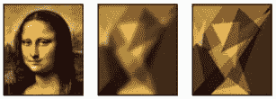

# 第十五章：使用遗传算法进行图像进化重建

本章将尝试遗传算法在图像处理中的一种应用方式——用一组半透明的多边形重建图像。在这个过程中，我们将获得有用的**图像处理**经验，并且对进化过程有直观的了解。

我们将首先概述 Python 中的图像处理，并熟悉两个有用的库——*Pillow* 和 *OpenCV-Python*。接下来，我们将了解如何从零开始使用多边形绘制图像，并计算两张图像之间的差异。然后，我们将开发一个基于遗传算法的程序，使用多边形重建一幅著名画作的一部分，并检查结果。

本章将涵盖以下主题：

+   熟悉几个用于 Python 的图像处理库

+   理解如何通过编程使用多边形绘制图像

+   了解如何通过编程比较两张给定的图像

+   使用遗传算法，结合图像处理库，通过多边形重建图像

本章将通过概述图像重建任务开始。

# 技术要求

本章将使用 Python 3 和以下支持库：

+   **deap**

+   **numpy**

+   **matplotlib**

+   **seaborn**

+   **pillow** – 本章介绍

+   **opencv-python (cv2)** – 本章介绍

重要提示

如果你使用我们提供的**requirements.txt**文件（参见*第三章*），这些库已经包含在你的环境中了。

本章使用的程序可以在本书的 GitHub 仓库中找到：[`github.com/PacktPublishing/Hands-On-Genetic-Algorithms-with-Python-Second-Edition/tree/main/chapter_15`](https://github.com/PacktPublishing/Hands-On-Genetic-Algorithms-with-Python-Second-Edition/tree/main/chapter_15)。

查看以下视频，查看代码的实际运行：

[`packt.link/OEBOd`](https://packt.link/OEBOd)

# 用多边形重建图像

遗传算法在图像处理中的一个最引人注目的应用是通过一组半透明、重叠的形状重建给定图像。这种方法不仅在图像处理经验方面令人愉快且富有教育意义，还提供了进化过程的直观视觉呈现。此外，这些实验可能会加深对视觉艺术的理解，并有助于图像分析和压缩的进展。

在这些图像重建实验中——其中有许多变种可以在互联网上找到——通常使用一张熟悉的图像，往往是著名的画作或其一部分，作为参考。目标是通过拼接一组重叠的形状，通常是多边形，且这些形状具有不同的颜色和透明度，来构建一张相似的图像。

在这里，我们将通过使用遗传算法方法和 `deap` 库来应对这一挑战，就像我们在本书中为多种类型的问题所做的那样。然而，由于我们需要绘制图像并将其与参考图像进行比较，因此让我们先了解一下 Python 中的图像处理基础知识。

# Python 中的图像处理

为了实现我们的目标，我们需要进行各种图像处理操作；例如，我们需要从头开始创建一张图像，在图像上绘制形状，绘制图像，打开图像文件，将图像保存到文件，比较两幅图像，并可能调整图像大小。在接下来的部分中，我们将探讨在使用 Python 时，如何执行这些操作。

## Python 图像处理库

在众多可供 Python 程序员使用的图像处理库中，我们选择了两个最为突出的库。以下小节将简要讨论这些库。

### Pillow 库

*Pillow* 是原始 *Python Imaging Library*（`PIL`）的一个当前维护版本。它支持打开、处理和保存多种格式的图像文件。由于它允许我们处理图像文件、绘制形状、控制透明度并操作像素，我们将使用它作为重建图像的主要工具。

该库的主页可以在这里找到：[`python-pillow.org/`](https://python-pillow.org/)。Pillow 的典型安装使用 `pip` 命令，如下所示：

```py
pip install Pillow
```

Pillow 库使用 `PIL` 命名空间。如果你已经安装了原始的 `PIL` 库，你需要先卸载它。更多信息可以在文档中找到，文档地址是 [`pillow.readthedocs.io/en/stable/index.html`](https://pillow.readthedocs.io/en/stable/index.html)。

### OpenCV-Python 库

*OpenCV* 是一个复杂的库，提供与计算机视觉和机器学习相关的众多算法。它支持多种编程语言，并且在不同的平台上可用。*OpenCV-Python* 是该库的 Python 接口。它结合了 C++接口的速度和 Python 语言的易用性。在这里，我们将主要利用这个库来计算两幅图像之间的差异，因为它允许我们将图像表示为数值数组。我们还将使用其 `GaussianBlur` 函数，该函数会产生图像的模糊版本。

OpenCV-Python 的主页可以在这里找到：[`github.com/opencv/opencv-python`](https://github.com/opencv/opencv-python)

该库包含四个不同的包，它们都使用相同的命名空间（`cv2`）。在单个环境中，应该只选择安装其中一个包。为了我们的目的，可以使用以下命令，只安装主要模块：

```py
pip install opencv-python
```

更多信息可以在 OpenCV 文档中找到，文档地址为 [`docs.opencv.org/master/`](https://docs.opencv.org/master/)。

## 使用多边形绘制图像

要从头绘制一张图像，我们可以使用 *Pillow* 的 `Image` 和 `ImageDraw` 类，代码如下：

```py
image = Image.new('RGB', (width, height))
draw = 'RGB' and 'RGBA' are the values for the mode argument. The 'RGB' value indicates three 8-bit values per pixel – one for each of the colors of red (R), green (G), and blue (B). The 'RGBA' value adds a fourth 8-bit value (A) representing the *alpha* (opacity) level of the drawings to be added. The combination of an RGB base image and an RGBA drawing will allow us to draw polygons of varying degrees of transparency on top of a black background.
Now, we can add a polygon to the base image by using the `ImageDraw` class’s `polygon` function, as shown in the following example. The following statement will draw a triangle on the image:

```

draw.polygon([(x1, y1), (x2, y2), (x3, y3)], (red, green, blue,

alpha))

```py

 The following list explains the `polygon` function arguments in more detail:

*   The **(x1, y1)**, **(x2, y2)**, and **(x3, y3)** tuples represent the triangle’s three vertices. Each tuple contains the *x, y* coordinates of the corresponding vertex within the image.
*   **red**, **green**, and **blue** are integer values in the range of [0, 255], each representing the intensity of the corresponding color of the polygon.
*   **Alp~ha** is an integer value in the range of [0, 255], representing the opacity value of the polygon (a lower value means more transparency).

Note
To draw a polygon with more vertices, we would need to add more (x i, y i) tuples to the list.
Using the `polygon` function repetitively, we can add more and more polygons, all drawn onto the same image and possibly overlapping each other, as shown in the following figure:


Figure 15.1: A plot of overlapping polygons with varying colors and opacity values
Once we draw an image using polygons, we need to compare it to the reference image, as described in the next subsection.
Measuring the difference between images
Since we would like to construct an image that is as similar as possible to the original one, we need a way to evaluate the similarity or the difference between the two given images. The most common method to evaluate the similarity between images is the pixel-based **mean squared error** (**MSE**), which involves conducting a pixel-by-pixel comparison. This requires, of course, that both images are of the same dimensions. The MSE metric can be calculated as follows:

1.  Calculate the square of the difference between each pair of matching pixels from both images. Since each pixel in the drawing is represented using three separate values – red, green, and blue – the difference for each pixel is calculated across these three dimensions.
2.  Compute the sum of all these squares.
3.  Divide the sum by the total number of pixels.

When both images are represented using the OpenCV (cv2) library, which essentially represents an image as a numeric array, this calculation can be performed in a straightforward manner as follows:

```

MSE = np.sum(

(cv2Image1.astype("float") -

cv2Image2.astype("float"))**2)/float(numPixels)

```py

 When the two images are identical, the MSE value will be zero. Consequently, minimizing this metric can be used as the objective of our algorithm, which will be further discussed in the next section.
Using genetic algorithms to reconstruct images
As we discussed previously, our goal in this experiment is to use a familiar image as a reference and create a second image, as similar as possible to the reference, using a collection of overlapping polygons of varying colors and transparencies. Using the genetic algorithms approach, each candidate solution is a set of such polygons, and evaluating the solution is carried out by creating an image using these polygons and comparing it to the reference image.
As usual, the first decision we need to make is how these solutions are represented. We will discuss this in the next subsection.
Solution representation and evaluation
As we mentioned previously, our solution consists of a set of polygons within the image boundaries. Each polygon has its own color and transparency. Drawing such a polygon using the Pillow library requires the following arguments:

*   A list of tuple, [(x 1, y 1), (x 2, y 2), … , (x n, y n)], representing the vertices of the polygon. Each tuple contains the *x, y* coordinates of the corresponding vertex within the image. Therefore, the values of the *x* coordinates are in the range [0, image width – 1], while the values of the *y* coordinates are in the range [0, image height – 1].
*   Three integer values in the range of [0, 255], representing the *red*, *green*, and *blue* components of the polygon’s color.
*   An additional integer value in the range of [0, 255], representing the *alpha* – or opacity – value of the polygon.

This means that for each polygon in our collection, we will need [2 × (polygo n − size) + 4] parameters. A *triangle*, for example, will require 10 parameters (2x3+4), while a *hexagon* will require 16 parameters (2x6+4). Consequently, a collection of triangles will be represented using a list in the following format, where every 10 parameters represent a single triangle:
[x 11, y 11, x 12, y 12, x 13, y 13, r 1, g 1, b 1, alph a 1, x 21, y 21, x 22, y 22, x 23, y 23, r 2, g 2, b 2, alph a 2, …]
To simplify this representation, we will use float numbers in the range of [0, 1] for each of the parameters. Before drawing the polygons, we will expand each parameter accordingly so that it fits within its required range – image width and height for the coordinates of the vertices and [0, 255] for the colors and opacity values.
Using this representation, a collection of 50 triangles will be represented as a list of 500 float values between 0 and 1, like so:

```

[0.1499488467959301, 0.3812631075049196, 0.000439458056299,

0.9988170920722447, 0.9975357316889601, 0.9997461395379549,

...

0.9998952203500615, 0.48148512088979356, 0.083285509827404]

```py

 Evaluating a given solution means dividing this long list into “chunks” representing individual polygons – in the case of triangles, each chunk will have a length of 10\. Then, we need to create a new, blank image and draw the various polygons from the list on top of it, one by one.
Finally, the difference between the resulting image and the original (reference) image needs to be calculated. As discussed in the previous section, this will be done using the pixel-based MSE.
This (somewhat elaborate) score evaluation procedure is implemented by a Python class, which will be described in the next subsection.
Python problem representation
To encapsulate the image reconstruction challenge, we’ve created a Python class called `ImageTest`. This class is contained in the `image_test.py` file, which is located at [`github.com/PacktPublishing/Hands-On-Genetic-Algorithms-with-Python-Second-Edition/blob/main/chapter_15/image_test.py`](https://github.com/PacktPublishing/Hands-On-Genetic-Algorithms-with-Python-Second-Edition/blob/main/chapter_15/image_test.py).
The class is initialized with two parameters: the path of the file containing the reference image and the number of vertices of the polygons that are being used to construct the image. The class provides the following public methods:

*   **polygonDataToImage()**: Accepts the list containing the polygon data we discussed in the previous subsection, divides this list into chunks representing individual polygons, and creates an image containing these polygons by drawing the polygons one by one onto a blank image.
*   **getDifference()**: Accepts polygon data, creates an image containing these polygons, and calculates the difference between this image and the reference image using the *MSE* method.
*   **blur()**: Accepts an image in PIL format, converts it to OpenCV (cv2) format, and then applies Gaussian blurring. The intensity of the blur is determined by the **BLUR_KERNEL_SIZE** constant.
*   **plotImages()**: For visual comparison purposes, creates a side-by-side plot of three images:
    *   The reference image (to the left)
    *   The given, polygon-reconstructed image (to the right)
    *   A blurred version of the reconstructed image (in the middle)
*   **saveImage()**: Accepts polygon data, creates an image containing these polygons, creates a side-by-side plot of this image next to the reference image, and saves the plot in a file.

During the run of the genetic algorithm, the `saveImage()` method will be called every 100 generations in order to save a side-by-side image comparison representing a snapshot of the reconstruction process. Calling this method will be carried out by a callback function, as described in the next subsection.
Genetic algorithm implementation
To reconstruct a given image with a set of semi-transparent overlapping polygons using a genetic algorithm, we’ve created a Python program called `01_reconstruct_with_polygons.py`, which is located at [`github.com/PacktPublishing/Hands-On-Genetic-Algorithms-with-Python-Second-Edition/blob/main/chapter_15/01_reconstruct_with_polygons.py`](https://github.com/PacktPublishing/Hands-On-Genetic-Algorithms-with-Python-Second-Edition/blob/main/chapter_15/01_reconstruct_with_polygons.py).
Since we are using a list of floats to represent a solution – the polygons’ vertices, colors, and transparency values – this program is very similar to the function optimization programs we saw in *Chapter 6**, Optimizing Continuous Functions*, such as the one we used for the *Eggholder* *function*’s optimization.
The following steps describe the main parts of this program:

1.  We start by setting the problem-related constant values. **POLYGON_SIZE** determines the number of vertices for each polygon, while **NUM_OF_POLYGONS** determines the total number of polygons that will be used to create the reconstructed image:

    ```

    POLYGON_SIZE = 3

    NUM_OF_POLYGONS = 100

    ```py

     2.  After setting the genetic algorithm constants, we continue by creating an instance of the **ImageTest** class, which will allow us to create images from polygons and compare these images to the reference image, as well as save snapshots of our progress:

    ```

    imageTest = image_test.ImageTest(MONA_LISA_PATH, POLYGON_SIZE)

    ```py

     3.  Next, we set the upper and lower boundaries for the float values we will be searching for. As we mentioned previously, we will use float values for all our parameters and set them all to the same range, between 0.0 and 1.0, for convenience. When evaluating a solution, the values will be expanded to their actual range, and converted into integers when needed:

    ```

    BOUNDS_LOW, BOUNDS_HIGH = 0.0, 1.0

    ```py

     4.  Since our goal is to minimize the difference between the images – the reference image and the one we are creating using polygons – we define a single objective, *minimizing* fitness strategy:

    ```

    creator.create("FitnessMin", base.Fitness, weights=(-1.0,))

    ```py

     5.  Now, we need to create a helper function that will create random real numbers that are uniformly distributed within a given range. This function assumes that the range is the same for every dimension, as is the case in our solution:

    ```

    def randomFloat(low, up):

    return [random.uniform(l, u) for l, u in zip([low] * \

    NUM_OF_PARAMS, [up] * NUM_OF_PARAMS)]

    ```py

     6.  Next, we use the preceding function to create an operator that randomly returns a list of floats, all in the desired range of [0, 1]:

    ```

    toolbox.register("attrFloat", randomFloat, BOUNDS_LOW,

    BOUNDS_HIGH)

    ```py

     7.  This is followed by defining an operator that fills up an individual instance using the preceding operator:

    ```

    toolbox.register("individualCreator",

    tools.initIterate,

    creator.Individual,

    toolbox.attrFloat)

    ```py

     8.  Then, we instruct the genetic algorithm to use the **getDiff()** method for fitness evaluation. This, in turn, calls the **getDifference()** method of the **ImageTest** instance. As a reminder, this method, which we described in the previous subsection, accepts an individual representing a list of polygons, creates an image containing these polygons, and calculates the difference between this image and the reference image using the *MSE* method:

    ```

    def getDiff(individual):

    return imageTest.getDifference(individual, METRIC),

    toolbox.register("evaluate", getDiff)

    ```py

     9.  It’s time to choose our genetic operators. For the selection operator, we will use *tournament selection* with a tournament size of 2\. As we saw in *Chapter 4**, Combinatorial Optimization*, this selection scheme works well in conjunction with the *elitist approach* that we plan to utilize here as well:

    ```

    toolbox.register("select", tools.selTournament, tournsize=2)

    ```py

     10.  As for the *crossover* operator (aliased with **mate**) and the *mutation* operator (**mutate**), since our solution representation is a list of floats bounded to a range, we will use the specialized continuous bounded operators provided by the DEAP framework – **cxSimulatedBinaryBounded** and **mutPolynomialBounded**, respectively – which we first saw in *Chapter 6**, Optimizing* *Continuous Functions*:

    ```

    toolbox.register("mate",

    tools.cxSimulatedBinaryBounded,

    low=BOUNDS_LOW,

    up=BOUNDS_HIGH,

    eta=CROWDING_FACTOR)

    toolbox.register("mutate",

    tools.mutPolynomialBounded,

    low=BOUNDS_LOW,

    up=BOUNDS_HIGH,

    eta=CROWDING_FACTOR,

    indpb=1.0/NUM_OF_PARAMS)

    ```py

     11.  As we have done multiple times before, we will use the *elitist approach*, where the **hall of fame** (**HOF**) members – the current best individuals – are always passed untouched to the next generation. However, this time, we’re going to add a new feature to this implementation – a *callback function* that will be used to save the image every 100 generations (we will discuss this callback in more detail in the next subsection):

    ```

    population, logbook = \

    elitism_callback.eaSimpleWithElitismAndCallback(

    population,

    toolbox,

    cxpb=P_CROSSOVER,

    mutpb=P_MUTATION,

    ngen=MAX_GENERATIONS,

    callback=saveImage,

    stats=stats,

    halloffame=hof,

    verbose=True)

    ```py

     12.  At the end of the run, we print the best solution and use the **plotImages()** function to show a side-by-side visual comparison to the reference image:

    ```

    best = hof.items[0]

    print("Best Solution = ", best)

    print("Best Score = ", best.fitness.values[0])

    imageTest.plotImages(imageTest.polygonDataToImage(best))

    ```py

     13.  In addition, we have employed the multiprocessing method of using a process pool, as demonstrated and tested in *Chapter 13**, Accelerating Genetic Algorithms: The Power of Concurrency*. This approach is a straightforward way to accelerate the execution of our algorithm. It simply involves adding the following lines to encapsulate the call to **eaSimpleWithElitismAndCallback()**:

    ```

    with multiprocessing.Pool(processes=20) as pool:

    toolbox.register("map", pool.map)

    ```py

Before we look at the results, let’s discuss the implementation of the callback function.
Adding a callback to the genetic run
To be able to save the best current image every 100 generations, we need to introduce a modification to the main genetic loop. As you may recall, toward the end of *Chapter 4**, Combinatorial Optimization*, we already made one modification to `deap`’s simple genetic algorithm main loop that allowed us to introduce the *elitist approach*. To be able to introduce that change, we created the `eaSimpleWithElitism()` method, which is contained in a file called `elitism.py`. This method was a modified version of the DEAP framework’s `eaSimple()` method, which is contained in the `algorithms.py` file. We modified the original method by adding the elitism functionality, which takes the members of the HOF – the current best individuals – and passes them untouched to the next generation at every iteration of the loop. Now, for the purpose of implementing a callback, we will introduce another small modification and change the name of the method to `eaSimpleWithElitismAndCallback()`. We will also rename the file containing it to `elitism_and_callback.py`.
There are two parts to this modification, as follows:

1.  The first part of the modification consists of adding an argument called **callback** to the main-loop method:

    ```

    def eaSimpleWithElitismAndCallback(population,

    toolbox, cxpb, mutpb, ngen, callback=None,

    stats=None, halloffame=None, verbose=__debug__):

    ```py

    This new argument represents an external function that will be called after each iteration.

     2.  The other part is within the method. Here, the callback function is called after the new generation has been created and evaluated. The current generation number and the current best individual are passed to the callback as arguments:

    ```

    if callback:

    callback(gen, halloffame.items[0])

    ```py

Being able to define a callback function that will be called after each generation may prove useful in various situations. To take advantage of it here, we’ll define the `saveImage()` function back in our `01_reconstruct_with_polygons.py` program. We will use it to save a side-by-side image of the current best image and the reference image, every 100 generations, as follows:

1.  We use the *modulus* (**%**) operator to activate the method only once every 100 generations:

    ```

    if gen % 100 == 0:

    ```py

     2.  If this is one of these generations, we create a folder for the images if one does not exist. The folder’s name references the polygon size and the number of polygons – for example, **run-3-100** or **run-6-50**, under the **images/results/** path:

    ```

    RESULTS_PATH = os.path.join(BASE_PATH, "results",

    f"run-{POLYGON_SIZE}-{NUM_OF_POLYGONS}")

    ...

    if not os.path.exists(RESULTS_PATH):

    os.makedirs(RESULTS_PATH)

    ```py

     3.  Next, we save the image of the best current individual in that folder. The name of the image contains the number of generations that have been passed – for example, **after-300-generations.png**:

    ```

    imageTest.imageTest.saveImage(polygonData,

    os.path.join(RESULTS_PATH, f"after-{gen}-gen.png"),

    f"After {gen} Generations")

    ```py

We are finally ready to run this algorithm with reference images and check out the results.
Image reconstruction results
To test our program, we will use a section of the famous Mona Lisa portrait by *Leonardo da Vinci*, considered the most well-known painting in the world, as seen here:


Figure 15.2: Head crop of the Mona Lisa painting
Source: [`commons.wikimedia.org/wiki/File:Mona_Lisa_headcrop.jpg`](https://commons.wikimedia.org/wiki/File:Mona_Lisa_headcrop.jpg)
Artist: Leonardo da Vinci. Licensed under Creative Commons CC0 1.0: [`creativecommons.org/publicdomain/zero/1.0/`](https://creativecommons.org/publicdomain/zero/1.0/)
Before proceeding with the program, it’s important to note that the extensive polygon data and complex image processing operations involved make the running time for our genetic image reconstruction experiments significantly longer than other programs tested earlier in this book. These experiments could take several hours each to complete.
We will begin our image reconstruction using 100 triangles as the polygons:

```

POLYGON_SIZE = 3

NUM_OF_POLYGONS = 100

```py

 The algorithm will run for 5,000 generations with a population size of 200\. As discussed earlier, a side-by-side image comparison is saved every 100 generations. At the end of the run, we can review these saved images to observe the evolution of the reconstructed image.
The following figure showcases various milestones from the resulting side-by-side saved images. As mentioned before, the middle image in each row presents a blurred version of the reconstructed image. This blurring aims to soften the sharp corners and straight lines that are typical of polygon-based reconstructions, creating an effect akin to squinting when viewing the image:


Figure 15.3: Milestone results of Mona Lisa reconstruction using 100 triangles
The end result bears a close resemblance to the original image and can be readily recognized as the Mona Lisa.
Reducing the triangle count
It is reasonable to assume that the results would be even better when increasing the number of triangles. But what if we wanted to *minimize* this number? If we reduce the number of triangles to 20, we might still be able to tell that this is the Mona Lisa, as the following results show:


Figure 15.4: Results of Mona Lisa reconstruction using 20 triangles and MSE
However, when the triangle count is further reduced to 15, the results are no longer recognizable, as seen here:


Figure 15.5: Results of Mona Lisa reconstruction using 15 triangles and MSE
A possible way to improve these results is described in the next subsection.
Blurring the fitness
Since the reconstruction becomes significantly cruder when the triangle count is low, perhaps we can improve this result by basing the fitness on the similarity between the original image and the *blurred version* of the reconstructed image, which is less crude. To try this out, we’ve created a slightly modified version of the original Python program, called `02_reconstruct_with_polygons_blur.py`, which is located at [`github.com/PacktPublishing/Hands-On-Genetic-Algorithms-with-Python-Second-Edition/blob/main/chapter_15/02_reconstruct_with_polygons_blur.py`](https://github.com/PacktPublishing/Hands-On-Genetic-Algorithms-with-Python-Second-Edition/blob/main/chapter_15/02_reconstruct_with_polygons_blur.py).
The modifications are highlighted as follows:

1.  The image comparison results of this program are saved into a separate directory called **blur**.
2.  The fitness function calculation now includes an optional argument, **blur=True**, when calling the **getDifference()** function. Consequently, this function will call **getMseBlur()** instead of the original **getMse()**. The **getMseBlur()** function blurs the given image before calculating the MSE:

    ```

    def getMseBlur(self, image):

    return np.sum(

    (self.blur(image).astype("float") -

    self.refImageCv2.astype("float")) ** 2

    ) / float(self.numPixels)

    ```py

The results of running this program for 20 triangles are shown in the following figure:


Figure 15.6: Results of Mona Lisa reconstruction using 20 triangles and MSE with blur
Meanwhile, the results for 15 triangles are shown here:


Figure 15.7: Results of Mona Lisa reconstruction using 15 triangles and MSE with blur
The resulting images appear more recognizable, which makes this method a potentially viable way to achieve a lower polygon count.
Other experiments
There are many variations that you can explore. One straightforward variation is increasing the number of vertices in the polygons. We anticipate more accurate results from this approach, as the shapes become more versatile. However, it’s important to note that the size of the individual polygons grows, which typically necessitates a larger population and/or more generations to achieve reasonable results.
Another interesting variation is to apply the “blur” fitness, previously used to minimize the number of polygons, to a large polygon count. This approach might lead to a somewhat “erratic” reconstruction, which is then smoothed by the blur function. The following result illustrates this, using 100 hexagons with 400 individuals and 5,000 generations, employing the “blur” MSE-based fitness:


Figure 15.8: Results of Mona Lisa reconstruction using 100 hexagons and MSE with blur
There are many other possibilities and combinations to experiment with, such as the following:

*   Increasing the number of polygons
*   Changing the population size and the number of generations
*   Using non-polygonal shapes (such as circles or ellipses) or regular shapes (such as squares or equilateral triangles)
*   Using different types of reference images (including paintings, drawings, photos, and logos)
*   Opting for grayscale images instead of colored ones

Have fun creating and experimenting with your own variations!
Summary
In this chapter, you were introduced to the popular concept of reconstructing existing images with overlapping, semi-transparent polygons. You explored various image processing libraries in Python, learning how to programmatically create images from scratch using polygons and calculate the difference between two images. Subsequently, we developed a genetic algorithm-based program to reconstruct a segment of a famous painting using polygons and explored several variations in the process. We also discussed numerous possibilities for further experimentation.
In the next chapter, we will describe and demonstrate several problem-solving techniques related to genetic algorithms, as well as other biologically inspired computational algorithms.
Further reading
For more information about the topics that were covered in this chapter, please refer to the following resources:

*   *Hands-On Image Processing with Python*, Sandipan Dey, November 30, 2018
*   *Grow Your Own* *Picture*: [`chriscummins.cc/s/genetics`](https://chriscummins.cc/s/genetics)
*   *Genetic Programming: Evolution of Mona* *Lisa*: [`rogerjohansson.blog/2008/12/07/genetic-programming-evolution-of-mona-lisa/`](https://rogerjohansson.blog/2008/12/07/genetic-programming-evolution-of-mona-lisa/)

```
