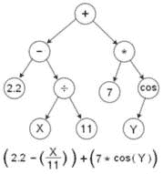
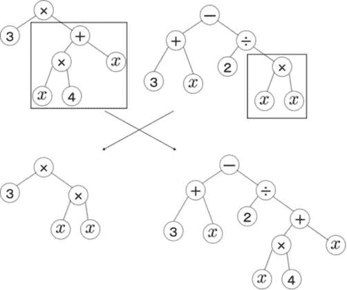
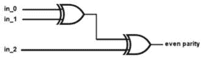
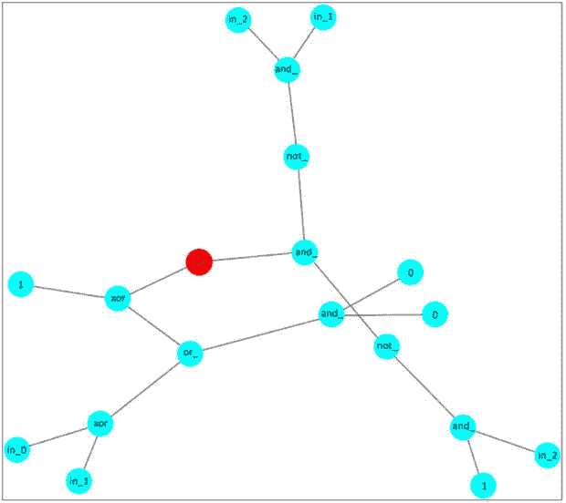
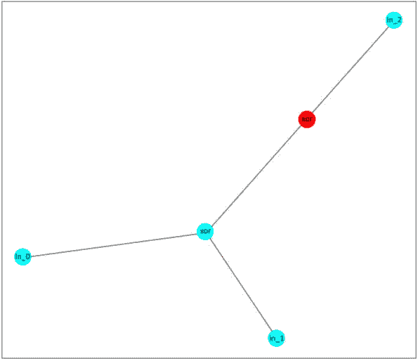
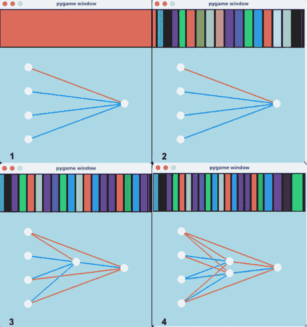
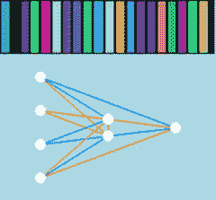
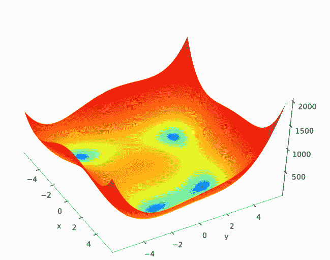

# 第十六章：其他进化和生物启发式计算技术

在本章中，你将拓宽视野，发现与遗传算法相关的几种新的问题解决和优化技术。通过实现问题解决的 Python 程序，我们将展示这一扩展家族的三种不同技术——**遗传编程**、**神经进化拓扑增强**（**NEAT**）和**粒子群优化**。最后，我们还将简要概述几种其他相关的计算范式。

本章将涉及以下主题：

+   进化计算家族算法

+   理解**遗传编程**的概念及其与遗传算法的区别

+   使用遗传编程解决**偶校验** **检查**问题

+   理解**NEAT**的概念及其与遗传算法的区别

+   使用 NEAT 解决偶校验检查问题

+   理解粒子群优化的概念

+   使用粒子群优化算法优化**Himmelblau 函数**

+   理解其他几种进化和**生物学启发式**技术的原理

我们将从本章开始，揭示**进化计算**的扩展家族，并讨论其成员共享的主要特点。

# 技术要求

在本章中，我们将使用 Python 3，并搭配以下支持库：

+   **deap**

+   **numpy**

+   **networkx**

+   **neatpy**——在本章中介绍

+   **pygame**

重要说明

如果你使用的是我们提供的**requirements.txt**文件（见*第三章*），这些库会已经存在于你的环境中。

本章中使用的程序可以在本书的 GitHub 库中找到：[`github.com/PacktPublishing/Hands-On-Genetic-Algorithms-with-Python-Second-Edition/tree/main/chapter_16`](https://github.com/PacktPublishing/Hands-On-Genetic-Algorithms-with-Python-Second-Edition/tree/main/chapter_16)。

查看以下视频，看看代码的实际应用：

[`packt.link/OEBOd`](https://packt.link/OEBOd)。

# 进化计算与生物启发式计算

本书中，我们已经介绍了名为*遗传算法*的求解技术，并将其应用于多种类型的问题，包括**组合优化**、**约束满足**、**连续函数优化**，以及**机器学习**和**人工智能**。然而，正如我们在*第一章*《遗传算法简介》中提到的那样，遗传算法只是一个更大算法家族——**进化计算**中的一支。这个家族包括各种相关的问题解决和优化技术，所有这些技术都从查尔斯·达尔文的自然进化理论中汲取灵感。

这些技术共享的主要特征如下：

+   起点是一个初始集（**种群**）的候选解。

+   候选解（**个体**）会通过迭代更新，生成新的代。

+   创建新一代涉及淘汰不太成功的个体（**选择**），并对一些个体引入小的随机变化（**突变**）。也可以应用其他操作，如与其他个体的交互（**交叉**）。

+   结果是，随着代数的增加，种群的**适应度**提高；换句话说，候选解在解决当前问题上变得更加有效。

更广泛地说，由于进化计算技术基于各种生物系统或行为，它们通常与被称为**生物启发计算**的算法家族有所重叠。

在接下来的章节中，我们将介绍一些进化计算和生物启发计算中最常用的成员——有些会详细介绍，而其他则仅简要提及。我们将从详细介绍一个有趣的技术开始，它使我们能够进化实际的计算机程序：**遗传编程**。

# 遗传编程

遗传编程是遗传算法的一种特殊形式——也就是我们在本书中应用的技术。在这种特殊情况下，我们正在进化的候选解——或者说个体——是计算机程序，因此得名。换句话说，当我们应用遗传编程时，我们在进化*计算机程序*，以找到能够出色完成特定任务的程序。

如你所记得，遗传算法使用候选解的表示，通常称为*染色体*。这个表示受基因操作符的作用，即*选择*、*交叉*和*突变*。将这些操作符应用于当前代时，结果是产生一个新的解代，预计比前代产生更好的结果。在我们到目前为止所研究的大多数问题中，这种表示通常是某种类型值的列表（或数组），如整数、布尔值或浮点数。然而，为了表示*程序*，我们通常使用*树结构*，如以下图示所示：



图 16.1：简单程序的树结构表示

来源：[`commons.wikimedia.org/wiki/File:Genetic_Program_Tree.png`](https://commons.wikimedia.org/wiki/File:Genetic_Program_Tree.png)

图片来自 Baxelrod。

前面的树形结构表示了树下方展示的计算过程。这个计算等同于一个接受两个参数 *X* 和 *Y* 的短程序（或函数），并根据它们的值返回一个特定的输出。为了创建和进化这样的树结构，我们需要定义两个不同的集合：

+   **终端**，或者是树的*叶节点*。这些是可以在树中使用的参数和常量值。在我们的示例中，**X** 和 **Y** 是参数，而 **2.2**、**11** 和 **7** 是常量。在树创建时，常量也可以在某个范围内随机生成。

+   **基本操作符**，或者是树的*内部节点*。这些是接受一个或多个参数并生成单一输出值的函数（或运算符）。在我们的示例中，**+**、**-**、****、**÷** 是接受两个参数的基本操作符，而 **cos** 是接受一个参数的基本操作符。

在*第二章*，《理解遗传算法的关键组件》中，我们展示了遗传操作符*单点交叉*如何作用于二进制值列表。交叉操作通过切割每个父节点的一部分并交换父节点之间的切割部分，创建了两个后代。类似地，树形表示的交叉操作符可以从每个父节点中分离出一个*子树*（一个分支或一组分支），并交换这些被分离的分支来创建后代树，示例如下图所示：



图 16.2：表示程序的两个树结构之间的交叉操作

来源：[`commons.wikimedia.org/wiki/File:GP_crossover.png`](https://commons.wikimedia.org/wiki/File:GP_crossover.png)

图片由 U-ichi 提供

在这个例子中，顶行的两个父节点有交换了子树，形成了第二行的两个后代。交换的子树用矩形框标出。

类似地，*变异*操作符旨在对单个个体引入随机变化，它的实现方式是从候选解中选择一个子树，并将其替换为一个随机生成的子树。

我们在本书中一直使用的 **deap** 库原生支持遗传编程。在下一节中，我们将使用该库实现一个简单的遗传编程示例。

## 遗传编程示例——偶校验检查

对于我们的示例，我们将使用遗传编程创建一个实现偶校验检查的程序。在此任务中，输入的可能值为 0 或 1。若输入中值为 1 的数量为奇数，则输出值应为 1，从而得到一个偶数个 1 的总数；否则，输出值应为 0。下表列出了三输入情况下，输入值的各种可能组合及其对应的偶校验输出值：

| **in_0** | **in_1** | **in_2** | **偶校验** |
| --- | --- | --- | --- |
| 0 | 0 | 0 | 0 |
| 0 | 0 | 1 | 1 |
| 0 | 1 | 0 | 1 |
| 0 | 1 | 1 | 0 |
| 1 | 0 | 0 | 1 |
| 1 | 0 | 1 | 0 |
| 1 | 1 | 0 | 0 |
| 1 | 1 | 1 | 1 |

表 16.1：三输入偶校验的真值表

这种表格通常被称为*真值表*。从这个真值表可以看出，偶校验经常作为基准使用的原因之一是，输入值的任何单一变化都会导致输出值发生变化。

偶校验还可以通过逻辑门来表示，例如`AND`、`OR`、`NOT`和异或（`XOR`）。`NOT`门接受一个输入并将其反转，而其他三种门类型每种都接受两个输入。为了使输出为 1，`AND`门要求两个输入都为 1，`OR`门要求至少一个输入为 1，而`XOR`门要求恰好一个输入为 1，如下表所示：

| **in_0** | **in_1** | **AND** | **OR** | **XOR** |
| --- | --- | --- | --- | --- |
| 0 | 0 | 0 | 0 | 0 |
| 0 | 1 | 0 | 1 | 1 |
| 1 | 0 | 0 | 1 | 1 |
| 1 | 1 | 1 | 1 | 0 |

表 16.2：两输入的 AND、OR 和 XOR 操作的真值表

实现三输入偶校验有多种可能的方法。最简单的方法是使用两个`XOR`门，如下图所示：



图 16.3：使用两个 XOR 门实现的三输入偶校验

在接下来的小节中，我们将使用遗传编程创建一个小程序，该程序通过使用`AND`、`OR`、`NOT`和`XOR`逻辑运算实现偶校验。

## 遗传编程实现

为了进化出实现偶校验逻辑的程序，我们创建了一个基于遗传编程的 Python 程序，名为`01_gp_even_parity.py`，可以在[`github.com/PacktPublishing/Hands-On-Genetic-Algorithms-with-Python-Second-Edition/blob/main/chapter_16/01_gp_even_parity.py`](https://github.com/PacktPublishing/Hands-On-Genetic-Algorithms-with-Python-Second-Edition/blob/main/chapter_16/01_gp_even_parity.py)找到。

由于遗传编程是遗传算法的一种特例，如果你已经浏览过本书前几章中展示的程序，那么这个程序的很多部分应该会对你来说非常熟悉。

以下步骤描述了该程序的主要部分：

1.  我们首先设置与问题相关的常量值。这里，**NUM_INPUTS**决定了偶校验检查器的输入数量。为了简化，我们使用**3**作为值；但也可以设置更大的值。**NUM_COMBINATIONS**常量表示输入值的可能组合数，它类似于我们之前看到的真值表中的行数：

    ```py
    NUM_INPUTS = 3
    NUM_COMBINATIONS = 2 ** NUM_INPUTS
    ```

1.  接下来是我们之前多次见过的熟悉的遗传算法常量：

    ```py
    POPULATION_SIZE = 60
    P_CROSSOVER = 0.9
    P_MUTATION = 0.5
    MAX_GENERATIONS = 20
    HALL_OF_FAME_SIZE = 10
    ```

1.  然而，遗传编程需要一些额外的常量，这些常量指的是候选解的树表示形式。它们在以下代码中定义。我们将在检查本程序的其余部分时看到它们是如何使用的：

    ```py
    MIN_TREE_HEIGHT = 3
    MAX_TREE_HEIGHT = 5
    MUT_MIN_TREE_HEIGHT = 0
    MUT_MAX_TREE_HEIGHT = 2
    LIMIT_TREE_HEIGHT = 17
    ```

1.  接下来，我们计算*真值表*的偶校验，以便在需要检查给定候选解的准确性时可以作为参考。**parityIn**矩阵表示真值表的输入列，而**parityOut**向量表示输出列。Python 的**itertools.product()**函数是嵌套**for**循环的优雅替代，它可以遍历所有输入值的组合：

    ```py
    parityIn = list(itertools.product([0, 1], repeat=NUM_INPUTS))
    parityOut = [sum(row) % 2 for row in parityIn]
    ```

1.  现在，是时候创建*原始元素*集合了——也就是将用于我们进化程序的运算符。第一个声明使用以下三个参数创建一个集合：

    +   使用集合中的原始元素生成的程序名称（在这里，我们称之为**main**）

    +   程序的输入数量

    +   用于命名输入的前缀（可选）

    这三个参数用于创建以下原始元素集合：

    ```py
    primitiveSet = gp.PrimitiveSet("main", NUM_INPUTS, "in_")
    ```

1.  现在，我们用将作为程序构建块的各种函数（或运算符）填充原始集合。对于每个运算符，我们将引用实现它的函数以及它期望的参数个数。尽管我们可以为此定义自己的函数，但在本例中，我们利用了现有的 Python **operator**模块，它包含了许多有用的函数，包括我们所需的逻辑运算符：

    ```py
    primitiveSet.addPrimitive(operator.and_, 2)
    primitiveSet.addPrimitive(operator.or_, 2)
    primitiveSet.addPrimitive(operator.xor, 2)
    primitiveSet.addPrimitive(operator.not_, 1)
    ```

1.  以下定义设置了要使用的*终止*值。如前所述，这些是可以作为树的输入值的常量。在我们的例子中，使用**0**和**1**作为值是合适的：

    ```py
    primitiveSet.addTerminal(1)
    primitiveSet.addTerminal(0)
    ```

1.  由于我们的目标是创建一个实现*偶校验真值表*的程序，我们将尽量减少程序输出与已知输出值之间的差异。为此，我们将定义一个单一的目标——即最小化适应度策略：

    ```py
    creator.create("FitnessMin", base.Fitness, weights=(-1.0,))
    ```

1.  现在，我们将创建**Individual**类，基于**deap**库提供的**PrimitiveTree**类：

    ```py
    creator.create("Individual", gp.PrimitiveTree,\
        fitness=creator.FitnessMin)
    ```

1.  为了帮助我们构建种群中的个体，我们将创建一个辅助函数，使用之前定义的原始集合生成随机树。在这里，我们利用了**deap**提供的**genFull()**函数，并为其提供了原始集合，以及定义生成树的最小和最大高度的值：

    ```py
    toolbox.register("expr",
                      gp.genFull,
                      pset=primitiveSet,
                      min_=MIN_TREE_HEIGHT,
                      max_=MAX_TREE_HEIGHT)
    ```

1.  接下来定义了两个操作符，第一个通过前面的辅助操作符创建个体实例。另一个生成这样个体的列表：

    ```py
    toolbox.register("individualCreator",
                      tools.initIterate,
                      creator.Individual,
                      toolbox.expr)
    toolbox.register("populationCreator",
                      tools.initRepeat,
                      list,
                      toolbox.individualCreator)
    ```

1.  接下来，我们创建一个操作符，用于*编译*给定的原始树为 Python 代码，使用**compile()**函数，这个函数是由**deap**提供的。因此，我们将在我们创建的一个函数中使用这个编译操作符，叫做**parityError()**。对于给定的个体——表示一个表达式的树——这个函数会统计在真值表中，计算结果与预期结果不同的行数：

    ```py
    toolbox.register("compile", gp.compile, pset=primitiveSet)
    def parityError(individual):
        func = toolbox.compile(expr=individual)
        return sum(func(*pIn) != pOut for pIn,
            pOut in zip(parityIn, parityOut))
    ```

1.  然后，我们必须指示遗传编程算法使用**getCost()**函数进行适应度评估。该函数返回我们刚才看到的奇偶错误，作为元组形式，这是底层进化算法所需的：

    ```py
    def getCost(individual):
        return parityError(individual),
    toolbox.register("evaluate", getCost)
    ```

1.  现在是选择我们的遗传操作符的时候了，从*选择*操作符（别名为**select**）开始。对于遗传编程，这个操作符通常是我们在本书中一直使用的*锦标赛选择*。在这里，我们使用的锦标赛大小为**2**：

    ```py
    toolbox.register("select", tools.selTournament, tournsize=2)
    ```

1.  至于*交叉*操作符（别名为**mate**），我们将使用 DEAP 提供的专用遗传编程**cxOnePoint()**操作符。由于进化程序由树表示，这个操作符接受两个父树，并交换它们的部分内容，从而创建两个有效的后代树：

    ```py
    toolbox.register("mate", gp.cxOnePoint)
    ```

1.  接下来是*变异*操作符，它引入对现有树的随机变化。变异定义为两个阶段。首先，我们指定一个辅助操作符，利用由**deap**提供的专用遗传编程**genGrow()**函数。这个操作符在由两个常量定义的限制内创建一个子树。然后，我们定义变异操作符本身（别名为**mutate**）。该操作符利用 DEAP 的**mutUniform()**函数，随机替换给定树中的一个子树，替换成通过辅助操作符生成的随机子树：

    ```py
    toolbox.register("expr_mut",
                      gp.genGrow,
                      min_=MUT_MIN_TREE_HEIGHT,
                      max_=MUT_MAX_TREE_HEIGHT)
    toolbox.register("mutate",
                      gp.mutUniform,
                      expr=toolbox.expr_mut,
                      pset=primitiveSet)
    ```

1.  为了防止种群中的个体树木过度增长，可能包含过多的原始元素，我们需要引入*膨胀控制*措施。我们可以通过使用 DEAP 的**staticLimit()**函数来实现，它对*交叉*和*变异*操作的结果施加树的高度限制：

    ```py
    toolbox.decorate("mate",
        gp.staticLimit(
            key=operator.attrgetter("height"),
            max_value=LIMIT_TREE_HEIGHT))
    toolbox.decorate("mutate",
        gp.staticLimit(
            key=operator.attrgetter("height"),
            max_value=LIMIT_TREE_HEIGHT))
    ```

1.  程序的主循环与我们在前几章中看到的非常相似。在创建初始种群、定义统计度量和创建 HOF 对象之后，我们调用进化算法。像之前做过的多次一样，我们必须采用*精英方法*，即将 HOF 成员——当前最优个体——始终传递给下一代，保持不变：

    ```py
    population, logbook = elitism.eaSimpleWithElitism(
        population,
        toolbox,
        cxpb=P_CROSSOVER,
        mutpb=P_MUTATION,
        ngen=MAX_GENERATIONS,
        stats=stats,
        halloffame=hof,
        verbose=True)
    ```

1.  在运行结束时，我们打印出最佳解决方案，以及用于表示它的树的高度和长度——即树中包含的运算符总数：

    ```py
    best = hof.items[0]
    print("-- Best Individual = ", best)
    print(f"-- length={len(best)}, height={best.height}")
    print("-- Best Fitness = ", best.fitness.values[0])
    ```

1.  最后我们需要做的事情是绘制表示最佳解决方案的树的图形插图。为此，我们必须使用图形和网络库*NetworkX*（**nx**），它在*第五章*《约束满足》中有所介绍。我们首先调用**deap**提供的**graph()**函数，它将单个树分解为构建图所需的节点、边和标签，然后使用适当的**networkx**函数创建图：

    ```py
    nodes, edges, labels = gp.graph(best)
    g = nx.Graph()
    g.add_nodes_from(nodes)
    g.add_edges_from(edges)
    pos = nx.spring_layout(g)
    ```

1.  接下来，我们绘制节点、边和标签。由于该图的布局不是经典的层次树结构，我们必须通过将顶部节点着色为红色并放大它来区分它：

    ```py
    nx.draw_networkx_nodes(g, pos, node_color='cyan')
    nx.draw_networkx_nodes(g, pos, nodelist=[0],
        node_color='red', node_size=400)
    nx.draw_networkx_edges(g, pos)
    nx.draw_networkx_labels(g, pos, **{"labels": labels, 
        "font_size": 8})
    ```

    运行此程序时，我们得到以下输出：

    ```py
    gen nevals min avg
    0 60 2 3.91667
    1 50 1 3.75
    2 47 1 3.45
    ...
    5 47 0 3.15
    ...
    20 48 0 1.68333
    -- Best Individual = xor(and_(not_(and_(in_1, in_2)), not_(and_(1, in_2))), xor(or_(xor(in_1, in_0), and_(0, 0)), 1))
    -- length=19, height=4
    -- Best Fitness = 0.0
    ```

由于这是一个简单的问题，适应度很快达到了最小值 0，这意味着我们成功找到了一个正确地重现*偶校验检查*真值表的解决方案。然而，结果表达式由 19 个元素和四个层次组成，看起来过于复杂。下面的图表显示了程序生成的结果：



图 16.4：表示初始程序找到的奇偶校验解决方案的图表

如前所述，图中的红色节点表示程序树的顶部，它映射到表达式中的第一个`XOR`操作。

这个相对复杂的图表的原因是使用更简单的表达式没有优势。只要它们符合树高度的限制，被评估的表达式不会因复杂性而受到惩罚。在下一个子章节中，我们将通过对程序进行小的修改来尝试改变这种情况，期望以更简洁的解决方案实现相同的结果——偶校验检查的实现。

### 简化解决方案

在我们刚刚看到的实现中，已经采取了措施来限制表示候选解的树的大小。然而，我们找到的最佳解似乎过于复杂。强制算法生成更简单结果的一种方法是对复杂性施加小的成本惩罚。这种惩罚应该足够小，以避免偏好于未能解决问题的更简单解决方案。相反，它应该作为两个良好解决方案之间的决胜局，从而优先选择更简单的解决方案。这种方法已经在位于[`github.com/PacktPublishing/Hands-On-Genetic-Algorithms-with-Python-Second-Edition/blob/main/chapter_16/02_gp_even_parity_reduced.py`](https://github.com/PacktPublishing/Hands-On-Genetic-Algorithms-with-Python-Second-Edition/blob/main/chapter_16/02_gp_even_parity_reduced.py)的`02_gp_even_parity_reduced.py` Python 程序中实施。

这个程序几乎与之前的程序相同，除了几个小的变化：

1.  主要的变化是引入到*成本函数*中，该算法试图最小化。在原始计算的错误之上，增加了依赖于树高度的小惩罚措施：

    ```py
    def getCost(individual):
        return parityError(individual) +
                   individual.height / 100,
    ```

1.  唯一的其他变化发生在运行结束后，在打印找到的最佳解决方案之后。在这里，除了打印健身价值外，我们还打印了实际的*奇偶错误*，而没有出现在健身中的惩罚：

    ```py
    print("-- Best Parity Error = ", parityError(best))
    ```

运行这个修改版本，我们得到以下输出：

```py
gen nevals min avg
0 60 2.03 3.9565
1 50 2.03 3.7885
...
5 47 0.04 3.45233
...
10 48 0.03 3.0145
...
15 49 0.02 2.57983
...
20 45 0.02 2.88533
-- Best Individual = xor(xor(in_0, in_1), in_2)
-- length=5, height=2
-- Best Fitness = 0.02
-- Best Parity Error = 0
```

从前面的输出中，我们可以看出，经过五代的迭代后，该算法能够找到一个正确重现偶校验检查真值表的解决方案，因为此时的健身价值几乎为 0。然而，随着算法的继续运行，树的高度从四（0.04 的惩罚）降低到了二（0.02 的惩罚）。因此，最佳解决方案非常简单，仅包含五个元素 - 三个输入和两个`XOR`运算符。我们找到的解决方案代表了我们之前看到的最简单已知解决方案，其中包含两个`XOR`门。这由程序生成的以下绘图所示：



图 16.5：代表由修改后程序找到的奇偶校验解的绘图

尽管遗传编程被认为是遗传算法的一个子集，但下一节描述了一种更专门的进化计算形式 - 专门用于创建神经网络架构。

# NEAT

在*第九章*，*深度学习网络的架构优化*，我们展示了如何使用简单的遗传算法来找到适合特定任务的前馈神经网络（也称为**多层感知器**或**MLP**）的最佳架构。为此，我们限制了三个隐藏层，并使用了一个具有每个层占位符的固定大小染色体来编码每个网络，其中 0 或负值表示该层不存在。

将这个想法进一步发展，**NEAT**是一种专门用于更灵活和渐进创建神经网络的进化技术，由*Kenneth Stanley*和*Risto Miikkulainen*于 2002 年创建。

NEAT 从小而简单的神经网络开始，并允许它们通过在几代中添加和修改神经元和连接来进化。与使用固定大小的染色体不同，NEAT 将解决方案表示为直接映射到人工神经网络的*有向图*，其中节点表示神经元，节点之间的连接表示突触。这使得 NEAT 不仅可以进化连接的权重，还可以进化网络的结构本身，包括添加和删除神经元和连接。

NEAT 的*交叉*运算符专门设计用于神经网络。它对齐并结合来自父网络的匹配神经元和连接，同时保持独特的‘创新’标识符。为了实现这种匹配，通过使用**全局创新编号**跟踪基因的历史，随着新基因的添加，此编号会增加。

此外，NEAT 采用一种**物种化**机制，根据它们的结构相似性将个体（神经网络）分组为物种。这种分组鼓励物种内的竞争，而不是物种之间的竞争。该机制有助于确保创新在其各自的生态位中有机会繁荣，然后再受到激烈竞争的影响。

NEAT（以及其他相关的神经进化技术）已被应用于许多领域，包括财务预测、药物发现、进化艺术、电子电路设计和机器人技术；然而，它最常见的应用是在*强化学习*应用中，如游戏玩法。

## NEAT 示例 - 偶数奇偶校验

我们将通过解决与前一节中使用的相同的三输入*偶数奇偶校验*问题，使用 NEAT 技术进行说明，来创建同一奇偶校验函数的前馈神经网络实现。

关于神经网络，偶校验检查，也称为**XOR 问题**，已知单个感知器无法实现它，因为它形成的模式无法用一条直线或简单的线性函数分开。为了捕捉这种非线性，所需的最小网络包括输入层和输出层，外加一个包含两个神经元的隐藏层。在下一小节中，我们将设置并查看 NEAT 是否能找到这个最小解决方案。

## NEAT 实现

为了利用 NEAT 技术演化一个实现偶校验逻辑的神经网络，我们创建了一个名为`03_neat_even_parity.py`的 Python 程序，存放在[`github.com/PacktPublishing/Hands-On-Genetic-Algorithms-with-Python-Second-Edition/blob/main/chapter_16/03_neat_even_parity.py`](https://github.com/PacktPublishing/Hands-On-Genetic-Algorithms-with-Python-Second-Edition/blob/main/chapter_16/03_neat_even_parity.py)。

### Python NEAT 库

有几个强大的 Python 库实现了 NEAT 技术，其中最著名的是**NEAT-Python**库。然而，在我们的示例中，我们将使用轻量级的**neatpy**库，因为它简洁且易于使用。如果该库尚未安装，可以使用以下命令进行安装：

```py
pip install neatpy
```

此外，**PyGame**库是可视化解决方案进展所必需的。如果尚未安装，可以使用以下命令进行安装：

```py
pip install pygame
```

### 程序

以下步骤描述了该程序的主要部分：

1.  与遗传编程示例类似，我们将首先设置与问题相关的常量值。**NUM_INPUTS**决定了偶校验检查器的输入数量。

1.  由于我们希望在程序结束时保存一个包含最佳解决方案的网络结构的图像，因此需要确保已创建一个用于存放图像的文件夹：

    ```py
    IMAGE_PATH = os.path.join(
        os.path.dirname(os.path.realpath(__file__)),
        "images")
    if not os.path.exists(IMAGE_PATH):
        os.makedirs(IMAGE_PATH)
    ```

1.  现在，我们必须使用*PyGame*库的功能设置图形显示，以实时“动画”方式展示算法的进度：

    ```py
    pg.init()
    screen = pg.display.set_mode((400, 400))
    screen.fill(colors['lightblue'])
    ```

1.  接下来，我们必须为 NEAT 算法设置几个选项：

    +   我们网络的输入数量（这将与**NUM_INPUTS**相同）。

    +   输出的数量（在我们的例子中为 1）。

    +   种群大小（在我们的例子中为 150）。

    +   适应度阈值。如果最佳解决方案超过此值，算法就认为问题已解决并停止。由于最佳适应度等于真值表中的行数（表示我们对所有行得出了正确的结果），因此我们必须将阈值设置为一个略低于该值的数字：

        ```py
        Options.set_options(NUM_INPUTS, 1, 150, 2**NUM_INPUTS - 0.1)
        ```

1.  接下来，我们必须在实现所需偶校验的输入和输出时计算**parityIn**和**parityOut**，这与我们在遗传编程示例中所做的类似：

    ```py
    parityIn = list(itertools.product([0, 1], repeat=NUM_INPUTS))
    parityOut = [sum(row) % 2 for row in parityIn]
    ```

1.  现在，是时候定义**parityScore()**函数了，该函数用于评估给定的神经网络（由**nn**参数表示）。由于得分需要为正数，我们从最大得分开始，然后减去每个期望网络输出与网络实际（浮动）输出值之间差的平方：

    ```py
    score = 2**NUM_INPUTS
    for pIn, pOut in zip(parityIn, parityOut):
        output = nn.predict(pIn)[0]
        score-= (output - pOut) ** 2
    ```

    此外，评分还包括每个网络节点的小额惩罚项，使得较小的架构占据优势：

    ```py
    score -= len(nn.nodes) * 0.01
    ```

1.  接下来是另一个工具函数，**draw_current()**。它通过调用**neatpy**库的**draw_brain_pygame()**绘制当前最佳解的架构（节点和连接）；此外，它还通过使用**draw_species_bar_pygame()**函数绘制当前物种的状态，展示了*物种分化*机制。

1.  创建初始**种群**后，我们进入了 NEAT 算法的主循环。得益于**neatpy**库的简洁性，这个循环非常简明。它从对当前种群进行评分开始，这也是进化算法中的常见步骤：

    ```py
    for nn in p.pool:
        nn.fitness = parityScore(nn)
    ```

1.  主循环通过调用库中的**epoch()**函数继续进行，这个函数执行一次 NEAT 进化步骤，产生新的种群。然后，它会打印当前种群，并通过调用**draw_current()**绘制当前最佳个体及物种状态。

1.  一旦循环退出，结果会被打印出来，真值表会被检查，最新的图形也会保存为图片文件。

    在运行程序时，包含网络可视化和物种演化的图形会出现，并在每一代更新自身，从而创建出一个“动画”视图来显示状态。下图包含了在运行过程中捕捉的四个“快照”：



图 16.6：三输入偶数奇偶校验问题的 NEAT 解的演化阶段

这些快照展示了网络如何从仅有输入层和输出层节点及一个物种开始，然后发展出多个物种，接着增加了一个隐藏层节点，再增加第二个隐藏层节点。

在运行结束时，程序会将最后一个快照保存为图片，保存在`images`文件夹中。如下所示：



图 16.7：三输入偶数奇偶校验问题的 NEAT 解的最终演化阶段

在图示中，白色圆圈代表网络的节点，左上角的圆圈表示隐藏层和输出层节点的*偏置*值。蓝色边代表正权重（或正偏置值）连接，而橙色边代表负权重（或负偏置值）连接。与传统的 MLP 不同，NEAT 算法创建的网络可以有“跳跃”某一层的连接，例如橙色边直接将底部输入节点连接到输出节点，以及层内连接。

程序的打印输出显示，找到的最佳网络能够解决问题：

```py
best fitness = 7.9009068332812635
Number of nodes = 7
Checking the truth table:
input (0, 0, 0), expected output 0, got 0.050 -> 0
input (0, 0, 1), expected output 1, got 0.963 -> 1
input (0, 1, 0), expected output 1, got 0.933 -> 1
input (0, 1, 1), expected output 0, got 0.077 -> 0
input (1, 0, 0), expected output 1, got 0.902 -> 1
input (1, 0, 1), expected output 0, got 0.042 -> 0
input (1, 1, 0), expected output 0, got 0.029 -> 0
input (1, 1, 1), expected output 1, got 0.949 -> 1
```

如我们所见，找到的最佳架构包括一个包含两个节点的单一隐藏层。

在下一节中，我们将研究另一个受生物启发的基于群体的算法。然而，这个算法偏离了使用传统的选择、交叉和变异基因操作符，而是采用了一套不同的规则，在每一代中修改种群——欢迎来到群体行为的世界！

# 粒子群优化

**粒子群优化**（**PSO**）的灵感来源于自然界中个体有机体的群体，例如鸟群或鱼群，通常称为*群体*。这些有机体在没有中央监督的情况下在群体中相互作用，共同朝着一个共同的目标努力。这种观察到的行为催生了一种计算方法，可以通过使用一组候选解来解决或优化给定问题，这些候选解由类似于群体中有机体的*粒子*表示。粒子在搜索空间中移动，寻找最佳解，它们的移动遵循简单的规则，这些规则涉及它们的位置和*速度*（方向速度）。

PSO 算法是迭代的，每次迭代中，都会评估每个粒子的位置，并在必要时更新其迄今为止的最佳位置，以及整个粒子群体中的最佳位置。然后，按照以下信息更新每个粒子的速度：

+   粒子当前的速度和运动方向——代表*惯性*

+   粒子迄今为止找到的最佳位置（局部最佳）——代表*认知力*

+   整个群体迄今为止找到的最佳位置（全局最佳）——代表*社会力*

接下来，根据新计算的速度更新粒子的位置。

这个迭代过程持续进行，直到满足某个停止条件，例如*迭代次数限制*。此时，算法将当前群体的最佳位置作为解。

这个简单但高效的过程将在下一节中详细说明，我们将讨论一个使用 PSO 算法优化函数的程序。

## PSO 示例——函数优化

为了演示，我们将使用粒子群优化算法来寻找*Himmelblau 函数*的最小位置，这个函数是一个常用的基准，之前我们在*第六章*中使用遗传算法进行了优化，标题为*优化连续函数*。这个函数可以表示如下：



图 16.8：Himmelblau 函数

来源：[`commons.wikimedia.org/wiki/File:Himmelblau_function.svg`](https://commons.wikimedia.org/wiki/File:Himmelblau_function.svg)

图片由 Morn the Gorn 提供。

提醒一下，这个函数可以通过数学公式表达如下：

f(x, y) = (x 2 + y − 11) 2 + (x + y 2 − 7) 2

它有四个全局最小值，评估结果为 0，图中用蓝色区域表示。这些最小值位于以下坐标：

+   *x=3.0, y=2.0*

+   *x=−2.805118, y=3.131312*

+   *x=−3.779310, y=−3.283186*

+   *x=3.584458, y=−1.848126*

在我们的示例中，我们将尝试找到这些最小值中的任何一个。

## 粒子群优化实现

为了使用粒子群优化算法定位*Himmelblau 函数*的最小值，我们创建了一个名为`04_pso_himmelblau.py`的 Python 程序，地址：[`github.com/PacktPublishing/Hands-On-Genetic-Algorithms-with-Python-Second-Edition/blob/main/chapter_16/04_pso_himmelblau.py`](https://github.com/PacktPublishing/Hands-On-Genetic-Algorithms-with-Python-Second-Edition/blob/main/chapter_16/04_pso_himmelblau.py)。

以下步骤描述了程序的主要部分：

1.  我们首先设置程序中将使用的各种常量。首先，我们有当前问题的*维度*—在我们这里是**2**—它决定了每个粒子的*位置*和*速度*的维度。接下来是种群大小——即群体中粒子的总数——以及运行算法的代数或迭代次数：

    ```py
    DIMENSIONS = 2
    POPULATION_SIZE = 20
    MAX_GENERATIONS = 500
    ```

1.  然后是一些额外的常量，它们影响粒子的创建和更新。我们将在分析程序的其余部分时看到它们的作用：

    ```py
    MIN_START_POSITION, MAX_START_POSITION = -5, 5
    MIN_SPEED, MAX_SPEED = -3, 3
    MAX_LOCAL_UPDATE_FACTOR = MAX_GLOBAL_UPDATE_FACTOR = 2.0
    ```

1.  由于我们的目标是定位*Himmelblau 函数*的最小值，我们需要定义一个单一目标——即，最小化适应度策略：

    ```py
    creator.create("Particle class creator looks as follows:

    ```

    creator.create("Particle",

    np.ndarray,

    fitness=creator.FitnessMin,

    speed=None,

    best=None)

    ```py

    ```

1.  为了帮助我们构建种群中的单个粒子，我们需要定义一个辅助函数，用于创建并初始化一个随机粒子。我们将使用**numpy**库的**random.uniform()**函数，随机生成新粒子的位置信息和速度数组，在给定的边界范围内：

    ```py
    def createParticle():
        particle = creator.Particle(
            np.random.uniform(
                MIN_START_POSITION,
                MAX_START_POSITION,
                DIMENSIONS))
        particle.speed = np.random.uniform(
            MIN_SPEED,
            MAX_SPEED,
            DIMENSIONS)
        return particle
    ```

1.  该函数用于定义创建粒子实例的操作符。这反过来被种群创建操作符使用：

    ```py
    toolbox.register("particleCreator", createParticle)
    toolbox.register("populationCreator",
                      tools.initRepeat,
                      list,
                      toolbox.particleCreator)
    ```

1.  接下来是作为算法核心的方法，在我们这里，`ndarray`类型是*二维*的，计算是逐元素进行的，每次处理一个维度。

1.  更新后的粒子速度实际上是粒子原始速度（代表*惯性*）、粒子已知的最佳位置（*认知力*）和整个群体的最佳已知位置（*社交力*）的结合：

    ```py
    def updateParticle(particle, best):
        localUpdateFactor = np.random.uniform(
            0,
            MAX_LOCAL_UPDATE_FACTOR,
            particle.size)
        globalUpdateFactor = np.random.uniform(
            0,
            MAX_GLOBAL_UPDATE_FACTOR,
            particle.size)
        localSpeedUpdate = localUpdateFactor *
            (particle.best - particle)
        globalSpeedUpdate = globalUpdateFactor * (best - particle)
        particle.speed = particle.speed +
            (localSpeedUpdate + lobalSpeedUpdate)
    ```

1.  **updateParticle()**方法继续执行，确保新的速度不超过预设的限制，并使用更新后的速度更新粒子的位置。如前所述，**位置**和**速度**都是**ndarray**类型，并且每个维度都有单独的组件：

    ```py
    particle.speed = np.clip(particle.speed, MIN_SPEED, MAX_SPEED)
    particle[:] = particle + particle.speed
    ```

1.  然后，我们必须将**updateParticle()**方法注册为工具箱操作符，该操作符将在后续的主循环中使用：

    ```py
    toolbox.register("update", updateParticle)
    ```

1.  我们仍然需要定义要优化的函数——在我们的例子中是*Himmelblau 函数*——并将其注册为适应度评估操作符：

    ```py
    def himmelblau(particle):
        x = particle[0]
        y = particle[1]
        f = (x ** 2 + y - 11) ** 2 + (x + y ** 2 - 7) ** 2
        return f,  # return a tuple
    toolbox.register("evaluate", himmelblau)
    ```

1.  现在我们终于到达了**main()**方法，可以通过创建粒子群体来开始它：

    ```py
    population = toolbox.populationCreator(
        n=POPULATION_SIZE)
    ```

1.  在开始算法的主循环之前，我们需要创建**stats**对象，用于计算群体的统计数据，以及**logbook**对象，用于记录每次迭代的统计数据：

    ```py
    stats = tools.Statistics(lambda ind: ind.fitness.values)
    stats.register("min", np.min)
    stats.register("avg", np.mean)
    logbook = tools.Logbook()
    logbook.header = ["gen", "evals"] + stats.fields
    ```

1.  程序的主循环包含一个外部循环，用于迭代生成/更新周期。在每次迭代中，有两个内部循环，每个循环遍历群体中的所有粒子。第一个循环，如下代码所示，评估每个粒子与要优化的函数的关系，并在必要时更新*局部最佳*和*全局最佳*：

    ```py
    particle.fitness.values = toolbox.evaluate(particle)
    # local best:
    if (particle.best is None or particle.best.size == 0 or 
        particle.best.fitness < particle.fitness):
        particle.best = creator.Particle(particle)
        particle.best.fitness.values = particle.fitness.values
    # global best:
    if (best is None or best.size == 0 or 
        best.fitness < particle.fitness):
        best = creator.Particle(particle)
        best.fitness.values = particle.fitness.values
    ```

1.  第二个内部循环调用**update**操作符。如前所述，该操作符使用*惯性*、*认知力*和*社交力*的结合来更新粒子的速度和位置：

    ```py
    toolbox.update(particle, best)
    ```

1.  在外部循环结束时，我们记录当前代的统计数据并将其打印出来：

    ```py
    logbook.record(gen=generation,
                   evals=len(population),
                   **stats.compile(population))
    print(logbook.stream)
    ```

1.  一旦外部循环完成，我们会打印出在运行过程中记录的最佳位置的信息。这被认为是算法为当前问题找到的解决方案：

    ```py
    print("-- Best Particle = ", best)
    print("-- Best Fitness = ", best.fitness.values[0])
    ```

运行此程序后，我们得到如下输出：

```py
gen evals min avg
0 20 8.74399 167.468
1 20 19.0871 357.577
2 20 32.4961 219.132
...
479 20 3.19693 316.08
480 20 0.00102484 322.134
481 20 3.32515 254.994
...
497 20 7.2162 412.189
498 20 6.87945 273.712
499 20 16.1034 272.385
-- Best Particle = [-3.77695478 -3.28649153]
-- Best Fitness = 0.0010248367255068806
```

这些结果表明，算法能够定位到一个最小值，大约位于 x=−3.77 和 y=−3.28。通过查看我们在过程中记录的统计数据，我们可以看到最佳结果是在第 480 代时获得的。还可以明显看出，粒子在过程中有较大的移动，并在运行期间围绕最佳结果进行振荡。

为了找到其他最小值位置，您可以使用不同的随机种子重新运行算法。您还可以像我们在第*6 章*中对*Simionescu 函数*所做的那样，对已找到的最小值周围的区域进行惩罚，*优化连续函数*。另一种方法是使用多个同时进行的群体来在同一次运行中找到多个最小值——我们鼓励您自己尝试一下（有关更多信息，请参阅*进一步阅读*部分）。

在接下来的章节中，我们将简要回顾扩展进化计算家族中的其他几种成员。

# 其他相关技术

除了我们目前所讨论的技术外，还有许多其他的求解和优化技术，其灵感来源于达尔文进化理论，以及各种生物系统和行为。以下小节将简要介绍其中几种技术。

## 进化策略

**进化策略**（**ES**）是一种强调*变异*而非*交叉*作为进化驱动因素的遗传算法。变异是自适应的，其强度会随着世代的推移进行学习。ES 中的选择操作符始终是基于*排名*而非实际的适应度值。该技术的一个简单版本叫做*(1 + 1)*，它仅包括两个个体——一个父代和其变异后的后代。最优秀的个体将继续作为下一个变异后代的父代。在更一般的情况下，称为*(1 + λ)*，它包括一个父代和λ个变异后的后代，最优秀的后代将继续作为下一个λ个后代的父代。一些新的算法变种包括多个父代，并且有一个*交叉*操作符。

## 差分进化

**差分进化**（**DE**）是遗传算法的一个专门变种，用于优化实数值函数。DE 与遗传算法的区别在于以下几个方面：

+   DE 种群始终表示为实值向量的集合。

+   与其用新一代完全替换当前的整代，DE 更倾向于在种群中不断迭代，每次修改一个个体，或者如果修改后的个体不如原个体，则保留原个体。

+   传统的*交叉*和*变异*操作符被专门的操作符所替代，从而通过随机选择的三只个体的值来修改当前个体的值。

## 蚁群优化

**蚁群优化**（**ACO**）算法的灵感来源于某些蚂蚁寻找食物的方式。蚂蚁们首先随机游走，当其中一只找到食物时，它们会回到巢穴并在路上留下信息素，标记出路径供其他蚂蚁参考。其他蚂蚁如果在相同位置找到食物，就会通过留下自己的信息素来加强这条路径。信息素标记随着时间的推移逐渐消失，因此较短的路径和经过频繁使用的路径更具优势。

ACO 算法使用人工蚂蚁在搜索空间中寻找最佳解的位置。这些“蚂蚁”会跟踪它们的当前位置以及它们在过程中找到的候选解。这些信息被后续迭代中的蚂蚁利用，从而帮助它们找到更好的解。通常，这些算法会与*局部搜索*方法结合使用，在找到感兴趣区域后激活局部搜索。

## 人工免疫系统

**人工免疫系统**（**AIS**）的灵感来源于哺乳动物适应性免疫系统的特性。这些系统能够识别和学习新威胁，并且应用所学知识，下一次类似威胁出现时能更快作出反应。

最近的 AIS 可以用于各种机器学习和优化任务，通常属于以下三大子领域之一：

+   **克隆选择**：这模仿了免疫系统选择最佳细胞来识别并消除入侵抗原的过程。细胞是从一池具有不同特异性的预存细胞中选出的，选中后被克隆以创建一个能够消除入侵抗原的细胞群体。这一范式通常应用于优化和模式识别任务。

+   **负选择**：这一过程旨在识别并删除可能攻击自体组织的细胞。这些算法通常用于异常检测任务，其中通过正常模式“负向”训练过滤器，从而能够检测异常模式。

+   **免疫网络算法**：这受到免疫系统使用特定类型抗体与其他抗体结合来调节的理论启发。在这种算法中，抗体代表网络中的节点，学习过程涉及在节点之间创建或删除边，从而形成一个不断演化的网络图结构。这些算法通常用于无监督机器学习任务，以及控制和优化领域。

## 人工生命

**人工生命**（**ALife**）不是进化计算的一个分支，而是一个更广泛的领域，涉及以不同方式模拟自然生命的系统和过程，如计算机仿真和机器人系统。

进化计算可以被视为人工生命（ALife）的应用，其中寻求优化某一适应度函数的种群可以看作是寻找食物的生物体。这些在*第二章*中描述的“共享和分配机制”，*理解遗传算法的关键组件*，直接源自于食物隐喻。

人工生命的主要分支如下：

+   **软**：代表基于软件的（数字）仿真

+   **硬**：代表基于硬件的（物理）机器人技术

+   **湿**：代表基于生化操作或合成生物学的技术

人工生命也可以被看作是人工智能的自下而上的对应物，因为人工生命通常基于生物环境、机制和结构，而不是高层次的认知。

# 总结

在本章中，你了解了*进化计算*的扩展家族以及其成员的一些常见特征。然后，我们使用*遗传编程*——遗传算法的一个特例——通过布尔逻辑构建块实现了*偶校验检查*任务。

接下来，我们通过使用 NEAT 技术，创建了一个神经网络实现，用于相同的偶校验任务。

接下来，我们创建了一个程序，利用*粒子群优化*技术来优化*Himmelblau 函数*。

我们以简要概述其他几种相关的解决问题技巧结束了这一章。

现在这本书已经结束，我想感谢你在我带领下共同探索遗传算法和进化计算的各个方面和应用案例。我希望你发现这本书既有趣又发人深省。正如本书所示，遗传算法及其相关技术可以应用于几乎任何计算和工程领域的众多任务，包括——很可能——你当前涉及的领域。记住，遗传算法开始处理问题所需要的只是表示解决方案的方式和评估解决方案的方式——或者比较两个解决方案的方式。既然这是人工智能和云计算的时代，你会发现遗传算法在这两者方面都有很好的应用，可以成为你解决新挑战时的强大工具。

# 进一步阅读

欲了解更多信息，请参考以下资源：

+   *遗传编程：生物启发的机器* *学习*：[`geneticprogramming.com/tutorial/`](http://geneticprogramming.com/tutorial/)

+   *大数据中的人工智能*，作者：Manish Kumar 和 Anand Deshpande，2018 年 5 月 21 日

+   *Python 神经进化实践*，作者：Iaroslav Omelianenko，2019 年 12 月 24 日

+   *使用粒子群优化算法的多模态优化*：CEC 2015 单目标多小 niche 优化竞赛：[`ieeexplore.ieee.org/document/7257009`](https://ieeexplore.ieee.org/document/7257009)
