# 第三章：使用 PyCUDA 入门

在上一章中，我们设置了我们的编程环境。现在，随着我们的驱动程序和编译器的稳定，我们将开始实际的 GPU 编程！我们将从学习如何使用 PyCUDA 进行一些基本和基本操作开始。我们首先将了解如何查询我们的 GPU——也就是说，我们将编写一个小型的 Python 程序，它会告诉我们我们 GPU 的特性，例如核心数量、架构和内存。然后，我们将花一些时间熟悉如何使用 PyCUDA 的 `gpuarray` 类在 Python 和 GPU 之间传输内存，以及如何使用此类进行基本计算。本章的其余部分将展示如何编写一些基本函数（我们将它们称为 **CUDA 内核**），我们可以直接在 GPU 上启动这些函数。

本章的学习成果如下：

+   使用 PyCUDA 确定 GPU 特性，如内存容量或核心数量

+   理解主机（CPU）和设备（GPU）内存之间的区别以及如何使用 PyCUDA 的 `gpuarray` 类在主机和设备之间传输数据

+   如何仅使用 `gpuarray` 对象进行基本计算

+   如何使用 PyCUDA 的 `ElementwiseKernel` 函数在 GPU 上执行基本的元素级操作

+   理解 reduce/scan 操作的函数式编程概念以及如何创建基本的 reduce 或 scan CUDA 内核

# 技术要求

本章需要一台配备现代 NVIDIA GPU（2016 年及以后）的 Linux 或 Windows 10 PC，并安装所有必要的 GPU 驱动程序和 CUDA Toolkit（9.0 及以后版本）。还需要一个合适的 Python 2.7 安装（例如 Anaconda Python 2.7），并包含 PyCUDA 模块。

本章的代码也可在 GitHub 上找到，链接为 [`github.com/PacktPublishing/Hands-On-GPU-Programming-with-Python-and-CUDA`](https://github.com/PacktPublishing/Hands-On-GPU-Programming-with-Python-and-CUDA)。

更多关于先决条件的信息，请参阅本书的 *前言*；关于软件和硬件要求，请查看 [`github.com/PacktPublishing/Hands-On-GPU-Programming-with-Python-and-CUDA`](https://github.com/PacktPublishing/Hands-On-GPU-Programming-with-Python-and-CUDA) 中的 `README` 部分。

# 查询您的 GPU

在我们开始编写我们的 GPU 程序之前，我们真的应该了解一些关于其技术能力和限制的知识。我们可以通过执行所谓的 **GPU 查询** 来确定这一点。GPU 查询是一个非常基本的操作，它将告诉我们我们 GPU 的具体技术细节，例如可用的 GPU 内存和核心数量。NVIDIA 在 `samples` 目录中包含了一个名为 `deviceQuery` 的纯 CUDA-C 命令行示例（适用于 Windows 和 Linux），我们可以运行此操作。让我们看看作者在 Windows 10 笔记本电脑（这是一台配备 GTX 1050 GPU 的 Microsoft Surface Book 2）上产生的输出：

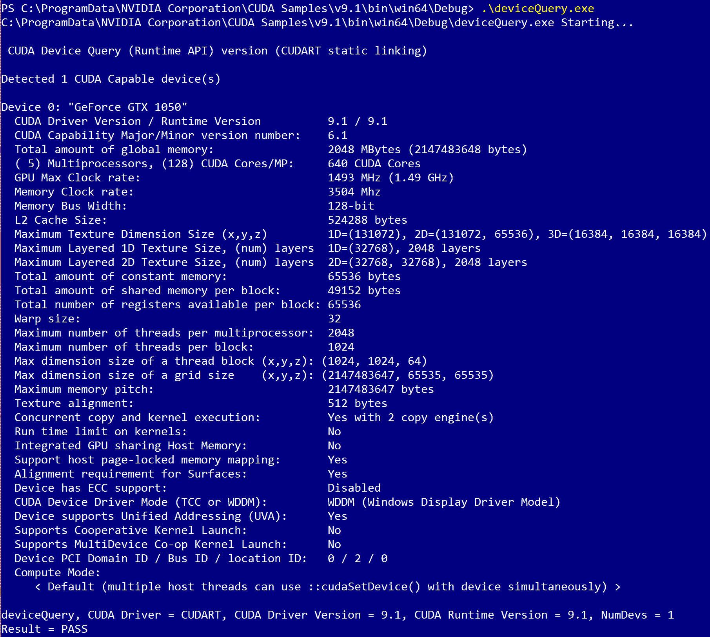

让我们来看看这里显示的所有技术信息的要点。首先，我们看到只有一个 GPU 安装，设备 0——可能主机计算机有多个 GPU 并使用它们，因此 CUDA 将为每个*GPU 设备*分配一个单独的编号。在某些情况下，我们可能需要具体指定设备编号，所以了解这一点总是好的。我们还可以看到我们拥有的特定设备类型（在这里，GTX 1050），以及我们正在使用的 CUDA 版本。目前，我们还将注意两件事：核心总数（在这里，640），以及设备上的全局内存总量（在这种情况下，2,048 兆字节，即 2 千兆字节）。

虽然你可以从`deviceQuery`中看到许多其他技术细节，但核心数和内存量通常是你在新 GPU 上第一次运行此程序时应该首先关注的前两件事，因为它们可以给你关于新设备容量的最直接的想法。

# 使用 PyCUDA 查询 GPU

现在，最后，我们将通过编写我们自己的`deviceQuery`版本来开始我们的 GPU 编程之旅。在这里，我们主要关注设备上的可用内存量、计算能力、多处理器数量以及 CUDA 核心总数。

我们将首先按照以下方式初始化 CUDA：

```py
import pycuda.driver as drv
drv.init()
```

注意，我们总是必须使用`pycuda.driver.init()`或通过导入 PyCUDA 的`autoinit`子模块`import pycuda.autoinit`来初始化 PyCUDA！

我们现在可以立即检查我们的主机计算机上有多少 GPU 设备，使用以下行：

```py
print 'Detected {} CUDA Capable device(s)'.format(drv.Device.count())
```

让我们将其输入到 IPython 中，看看会发生什么：

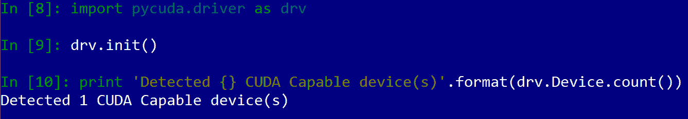

太好了！到目前为止，我已经验证了我的笔记本电脑确实有一个 GPU。现在，让我们通过添加一些额外的代码来迭代每个可以通过`pycuda.driver.Device`（按编号索引）单独访问的设备，以提取有关此 GPU（以及系统上的任何其他 GPU）的一些更有趣的信息。设备的名称（例如，GeForce GTX 1050）由`name`函数给出。然后我们使用`compute_capability`函数获取设备的**计算能力**，以及使用`total_memory`函数获取设备内存的总量。

**计算能力**可以被视为每个 NVIDIA GPU 架构的*版本号*；这将给我们一些重要的信息，这些信息我们无法通过其他方式查询，正如我们将在下面看到的那样。

这是我们将如何编写它的：

```py
for i in range(drv.Device.count()):

     gpu_device = drv.Device(i)
     print 'Device {}: {}'.format( i, gpu_device.name() )
     compute_capability = float( '%d.%d' % gpu_device.compute_capability() )
     print '\t Compute Capability: {}'.format(compute_capability)
     print '\t Total Memory: {} megabytes'.format(gpu_device.total_memory()//(1024**2))
```

现在，我们已经准备好查看 GPU 的一些剩余属性，PyCUDA 以 Python 字典类型的形式提供给我们。我们将使用以下行将其转换为按表示属性的字符串索引的字典：

```py
    device_attributes_tuples = gpu_device.get_attributes().iteritems()
     device_attributes = {}

     for k, v in device_attributes_tuples:
         device_attributes[str(k)] = v
```

我们现在可以使用以下方式确定设备上的多处理器数量：

```py
    num_mp = device_attributes['MULTIPROCESSOR_COUNT']
```

GPU 将其单个核心划分为更大的单元，称为 **流式多处理器 (SMs)**；一个 GPU 设备将具有多个 SMs，每个 SM 将根据设备的计算能力具有特定数量的 CUDA 核心。为了明确：每个多处理器的核心数不是直接由 GPU 指示的——这是通过计算能力隐式给出的。我们将不得不查阅一些来自 NVIDIA 的技术文档来确定每个多处理器的核心数（见 [`docs.nvidia.com/cuda/cuda-c-programming-guide/index.html#compute-capabilities`](http://docs.nvidia.com/cuda/cuda-c-programming-guide/index.html#compute-capabilities)），然后创建一个查找表以给出每个多处理器的核心数。我们使用 `compute_capability` 变量来查找核心数：

```py
    cuda_cores_per_mp = { 5.0 : 128, 5.1 : 128, 5.2 : 128, 6.0 : 64, 6.1 : 128, 6.2 : 128}[compute_capability]
```

现在我们可以通过将这两个数字相乘来最终确定我们设备上的核心总数：

```py
    print '\t ({}) Multiprocessors, ({}) CUDA Cores / Multiprocessor: {} CUDA Cores'.format(num_mp, cuda_cores_per_mp, num_mp*cuda_cores_per_mp)
```

现在我们可以通过遍历字典中剩余的键并打印相应的值来完成我们的程序：

```py
    device_attributes.pop('MULTIPROCESSOR_COUNT')

     for k in device_attributes.keys():
         print '\t {}: {}'.format(k, device_attributes[k])
```

因此，现在我们终于完成了文本中的第一个真正的 GPU 程序！（也可在 [`github.com/PacktPublishing/Hands-On-GPU-Programming-with-Python-and-CUDA/blob/master/3/deviceQuery.py`](https://github.com/PacktPublishing/Hands-On-GPU-Programming-with-Python-and-CUDA/blob/master/3/deviceQuery.py) 找到。）现在，我们可以按照以下方式运行它：

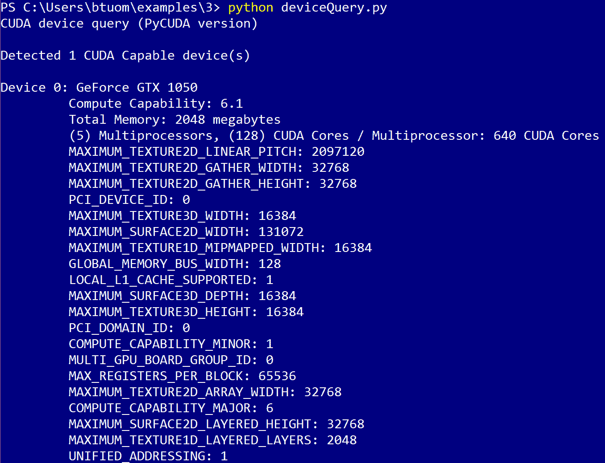

现在，我们可以有点自豪，因为我们确实可以编写一个查询我们的 GPU 的程序！现在，让我们真正开始学习如何 *使用* 我们的 GPU，而不仅仅是观察它。

# 使用 PyCUDA 的 gpuarray 类

就像 NumPy 的 `array` 类是 NumPy 环境中数值编程的基石一样，PyCUDA 的 `gpuarray` 类在 Python 的 GPU 编程中扮演着类似突出的角色。它具有您所熟知和喜爱的所有 NumPy 功能——多维向量/矩阵/张量形状结构、数组切片、数组展开，以及用于点运算的重载运算符（例如，`+`、`-`、`*`、`/` 和 `**`）。

`gpuarray` 真的是任何初学者 GPU 程序员不可或缺的工具。在本节中，我们将详细介绍这个特定的数据结构，并在继续前进之前对其有一个牢固的理解。

# 使用 gpuarray 在 GPU 之间传输数据

正如我们从先前的 Python 编写的`deviceQuery`程序中注意到的，GPU 有自己的内存，除了主机计算机的内存之外，这被称为**设备内存**。（有时这更具体地被称为**全局设备内存**，以区分 GPU 上额外的缓存内存、共享内存和寄存器内存。）大部分情况下，我们将 GPU 上的（全局）设备内存视为 C（使用`malloc`和`free`函数）或 C++（使用`new`和`delete`运算符）中的动态分配堆内存；在 CUDA C 中，这由于需要在 CPU 和 GPU 之间来回传输数据（使用如`cudaMemcpyHostToDevice`和`cudaMemcpyDeviceToHost`等命令）而变得更加复杂，同时还要在 CPU 和 GPU 空间中跟踪多个指针，并执行适当的内存分配（`cudaMalloc`）和释放（`cudaFree`）。

幸运的是，PyCUDA 通过`gpuarray`类涵盖了所有内存分配、释放和数据传输的开销。正如所述，这个类与 NumPy 数组类似，使用向量/矩阵/张量形状结构信息来处理数据。`gpuarray`对象甚至根据生命周期自动清理，因此当我们完成使用时，我们不需要担心在`gpuarray`对象中释放任何 GPU 内存。

我们究竟如何使用这个方法将数据从主机传输到 GPU 呢？首先，我们必须以某种形式将主机数据包含在 NumPy 数组中（让我们称它为`host_data`），然后使用`gpuarray.to_gpu(host_data)`命令将数据传输到 GPU 并创建一个新的 GPU 数组。

现在我们将在 GPU 内部执行一个简单的计算（在 GPU 上对常数进行逐点乘法），然后使用`gpuarray.get`函数将 GPU 数据检索到一个新的数组中。让我们加载 IPython 来看看这是如何工作的（注意，在这里我们将使用`import pycuda.autoinit`初始化 PyCUDA）：

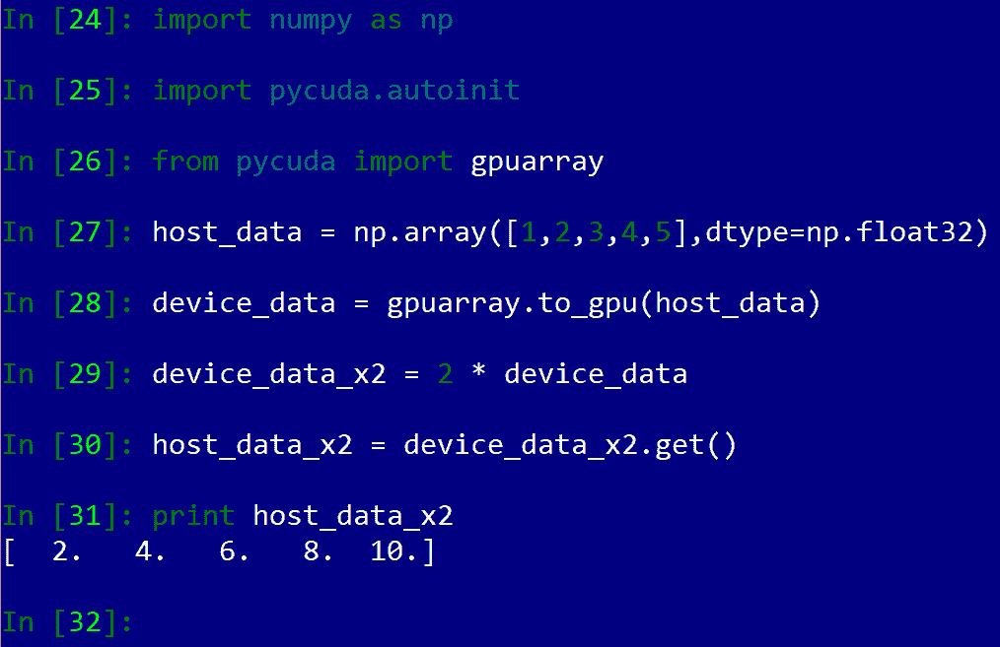

有一个需要注意的事项是，当我们设置 NumPy 数组时，我们特别指定了主机上的数组类型被设置为 NumPy 的`float32`类型，这是通过`dtype`选项来实现的；这直接对应于 C/C++中的浮点类型。一般来说，当我们向 GPU 发送数据时，明确设置数据类型是一个好主意。这样做的原因有两方面：首先，因为我们使用 GPU 来提高应用程序的性能，我们不希望使用任何不必要的类型，这可能会占用更多的计算时间或内存；其次，由于我们很快将编写部分 CUDA C 代码，我们必须非常具体地指定类型，否则我们的代码将无法正确运行，考虑到 C 是一种静态类型语言。

记住要为将要传输到 GPU 的 NumPy 数组明确设置数据类型。这可以通过`numpy.array`类的构造函数中的`dtype`选项来完成。

# 使用 gpuarray 进行基本点对点算术运算

在最后一个例子中，我们看到了我们可以使用（重载的）Python 乘法运算符（`*`）将`gpuarray`对象中的每个元素乘以一个标量值（这里为 2）；请注意，点对点操作本质上是可并行化的，因此当我们对`gpuarray`对象使用此操作时，PyCUDA 能够将每个乘法操作卸载到单个线程，而不是按顺序串行计算每个乘法（公平地说，某些版本的 NumPy 可以使用现代 x86 芯片中发现的先进 SSE 指令进行这些计算，因此在某些情况下性能将与 GPU 相当）。为了明确：在 GPU 上执行这些点对点操作是并行的，因为一个元素的计算不依赖于任何其他元素的计算。

为了了解操作符的工作方式，我建议读者加载 IPython 并在 GPU 上创建几个`gpuarray`对象，然后花几分钟时间对这些操作进行实验，以确认这些操作符的工作方式与 NumPy 中的数组相似。以下是一些灵感：


现在，我们可以看到`gpuarray`对象的行为可预测，并且与 NumPy 数组的行为一致。（请注意，我们将必须使用`get`函数将输出从 GPU 拉取！）现在，让我们做一些 CPU 和 GPU 计算时间的比较，看看是否以及何时在 GPU 上执行这些操作有任何优势。

# 速度测试

让我们编写一个小程序（`time_calc0.py`），它将在 CPU 上执行标量乘法，然后在 GPU 上执行相同的操作。然后我们将使用 NumPy 的`allclose`函数来比较两个输出值。我们将生成一个包含 5000 万个随机 32 位浮点数的数组（这将大约是 48 兆字节的数据，所以这应该在任何稍微现代的主机和 GPU 设备上使用几个 GB 的内存都是完全可行的），然后我们将测量在两个设备上对数组进行标量乘以 2 所需的时间。最后，我们将比较输出值以确保它们相等。以下是具体操作方法：

```py
import numpy as np
import pycuda.autoinit
from pycuda import gpuarray
from time import time
host_data = np.float32( np.random.random(50000000) )

t1 = time()
host_data_2x =  host_data * np.float32(2)
t2 = time()

print 'total time to compute on CPU: %f' % (t2 - t1)
device_data = gpuarray.to_gpu(host_data)

t1 = time()
device_data_2x =  device_data * np.float32( 2 )
t2 = time()

from_device = device_data_2x.get()
print 'total time to compute on GPU: %f' % (t2 - t1)

print 'Is the host computation the same as the GPU computation? : {}'.format(np.allclose(from_device, host_data_2x) )
```

（您可以在您之前提供的存储库中找到`time_calc0.py`文件。）

现在，让我们加载 IPython 并运行几次，以了解这些操作的总体速度，并看看是否有任何变化。（这里是在 2017 年的 Microsoft Surface Book 2 上运行的，配备 Kaby Lake i7 处理器和 GTX 1050 GPU。）

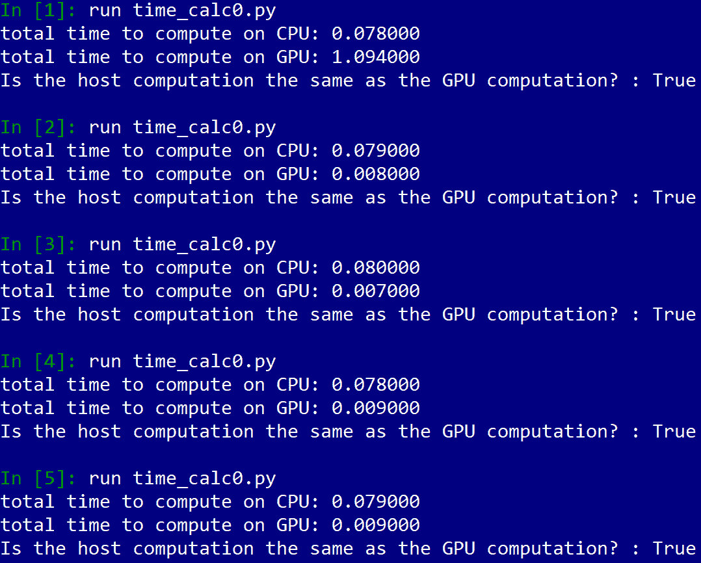

我们首先注意到，对于每次计算，CPU 计算时间大致相同（大约 0.08 秒）。然而，我们注意到，第一次运行这个程序时，GPU 计算时间远慢于 CPU 计算时间（1.09 秒），而在随后的运行中变得更快，并且在每次随后的运行中保持大致恒定（在 7 或 9 毫秒的范围内）。如果你退出 IPython，然后再次运行程序，同样的事情会发生。这种现象的原因是什么？好吧，让我们使用 IPython 内置的 `prun` 分析器做一些调查工作。（这与在第一章，*为什么进行 GPU 编程？*中介绍的 `cProfiler` 模块的工作方式类似。）

首先，让我们使用以下行在 IPython 中将我们的程序作为文本加载，然后我们可以通过 Python 的 `exec` 命令使用我们的分析器运行它：

```py
with open('time_calc0.py','r') as f:
     time_calc_code = f.read()
```

现在，我们在 IPython 控制台中输入 `%prun -s cumulative exec(time_calc_code)`（带有前导 `%`）并查看哪些操作花费了最多时间：

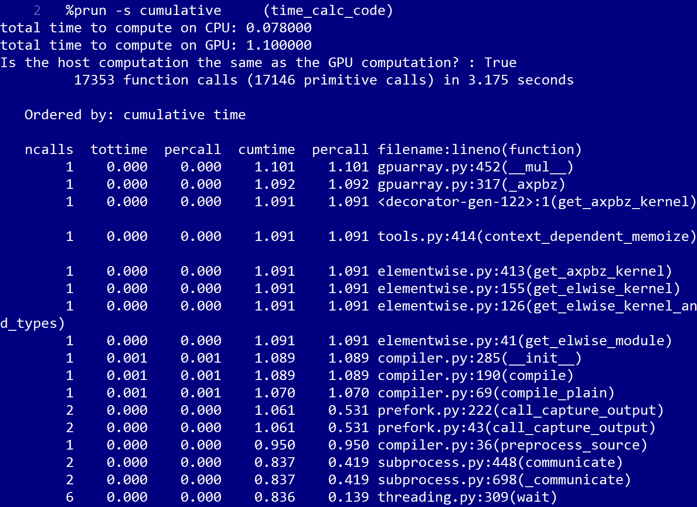

现在，有一些可疑的对 Python 模块文件 `compiler.py` 的调用；这些调用总共花费大约一秒钟，略少于在这里进行 GPU 计算所需的时间。现在让我们再次运行并看看是否有任何差异：

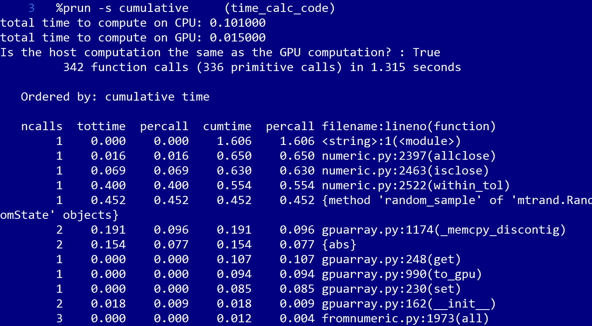

注意，这次没有对 `compiler.py` 的调用。为什么是这样？根据 PyCUDA 库的性质，GPU 代码在给定 Python 会话中第一次运行时通常使用 NVIDIA 的 `nvcc` 编译器进行编译和链接；然后它被缓存起来，如果代码再次被调用，则不需要重新编译。这甚至可能包括像这样的标量乘法这样的简单操作！（我们最终会看到，这可以通过在第十章，*与编译的 GPU 代码一起工作*中使用预编译的代码来改善，或者通过使用 Scikit-CUDA 模块与 NVIDIA 自己的线性代数库，我们将在第七章，*使用 CUDA 库与 Scikit-CUDA*中看到）。

在 PyCUDA 中，GPU 代码通常在运行时使用 NVIDIA `nvcc` 编译器进行编译，然后由 PyCUDA 从外部调用。这可能导致意外的减速，通常是在给定 Python 会话中第一次运行程序或 GPU 操作时。

# 使用 PyCUDA 的 ElementWiseKernel 进行逐点计算

我们现在将看到如何使用 PyCUDA 的 `ElementWiseKernel` 函数直接在我们的 GPU 上编程我们的自己的逐点（或等价地，*逐元素*）操作。这是我们的先前 C/C++ 编程知识变得有用的地方——我们将不得不编写一些 *内联代码*，这些代码由 NVIDIA 的 `nvcc` 编译器外部编译，然后通过我们的代码通过 PyCUDA 在运行时启动。

在本文中，我们经常使用术语**内核**；通过**内核**，我们始终指的是由 CUDA 直接在 GPU 上启动的函数。我们将使用 PyCUDA 的几个函数来生成不同类型内核的模板和设计模式，这将有助于我们过渡到 GPU 编程。

让我们直接深入探讨；我们将首先明确重写代码，以在 CUDA-C 中将`gpuarray`对象的每个元素乘以 2；我们将使用 PyCUDA 的`ElementwiseKernel`函数来生成我们的代码。你应该尝试直接在 IPython 控制台中输入以下代码。（不那么冒险的人可以从中下载这个文本的 Git 仓库中的文件，文件名为`simple_element_kernel_example0.py`）：

```py
import numpy as np
import pycuda.autoinit
from pycuda import gpuarray
from time import time
from pycuda.elementwise import ElementwiseKernel
host_data = np.float32( np.random.random(50000000) )
gpu_2x_ker = ElementwiseKernel(
"float *in, float *out",
"out[i] = 2*in[i];",
"gpu_2x_ker")
```

让我们看看这是如何设置的；这当然是一段内联 C 代码。我们首先在第一行设置输入和输出变量（`"float *in, float *out"`），这通常是以 C 指针的形式在 GPU 上分配的内存。在第二行，我们定义了我们的逐元素操作`"out[i] = 2*in[i];"`，这将把`in`中的每个点乘以 2，并将其放置在`out`的相应索引中。

注意 PyCUDA 会自动为我们设置整数索引`i`。当我们使用`i`作为索引时，`ElementwiseKernel`将自动在我们的 GPU 的许多核心之间并行化我们的计算。最后，我们给我们的代码块赋予其内部的 CUDA C 内核名称（`"gpu_2x_ker"`）。由于这指的是 CUDA C 的命名空间而不是 Python 的，所以给它取与 Python 中相同的名字是完全可以的（并且也很方便）。

现在，让我们进行速度比较：

```py
def speedcomparison():
    t1 = time()
    host_data_2x =  host_data * np.float32(2)
    t2 = time()
    print 'total time to compute on CPU: %f' % (t2 - t1)
    device_data = gpuarray.to_gpu(host_data)
    # allocate memory for output
    device_data_2x = gpuarray.empty_like(device_data)
    t1 = time()
    gpu_2x_ker(device_data, device_data_2x)
    t2 = time()
    from_device = device_data_2x.get()
    print 'total time to compute on GPU: %f' % (t2 - t1)
    print 'Is the host computation the same as the GPU computation? : {}'.format(np.allclose(from_device, host_data_2x) )

if __name__ == '__main__':
    speedcomparison()
```

现在，让我们运行这个程序：

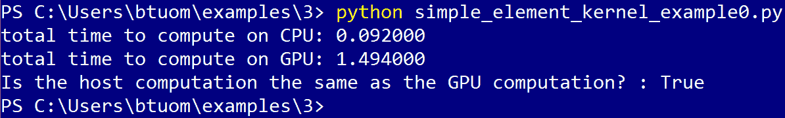

哇！这看起来不太好。让我们在 IPython 中多次运行`speedcomparison()`函数：

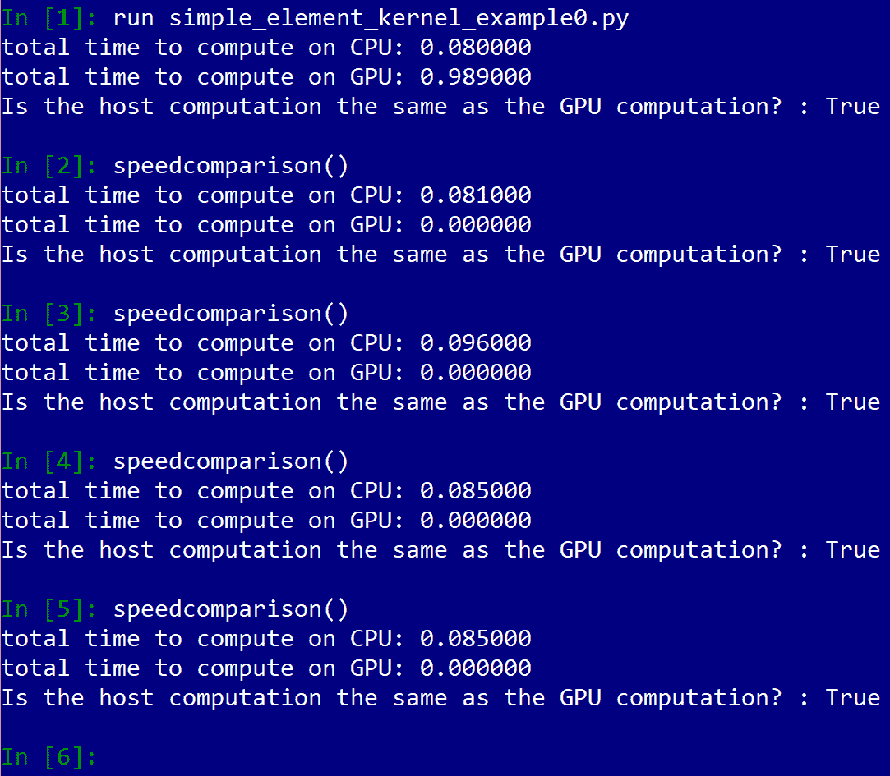

如我们所见，在第一次使用给定的 GPU 函数之后，速度会显著增加。同样，正如先前的例子一样，这是因为 PyCUDA 在第一次使用`nvcc`编译器调用给定的 GPU 内核函数时编译我们的内联 CUDA C 代码。代码编译后，它会被缓存并用于整个 Python 会话的剩余部分。

现在，在我们继续之前，让我们先讨论另一个重要但非常微妙的问题。我们定义的小内核函数操作 C 浮点指针；这意味着我们将在 GPU 上分配一些空内存，这些内存由`out`变量指向。再次查看`speedcomparison()`函数中的这部分代码：

```py
device_data = gpuarray.to_gpu(host_data)
# allocate memory for output
device_data_2x = gpuarray.empty_like(device_data)
```

如同之前，我们通过 `gpuarray.to_gpu` 函数将 NumPy 数组发送到 GPU (`host_data`)，该函数自动在 GPU 上分配数据并将其从 CPU 空间复制过来。我们将把这个插入到内核函数的 `in` 部分。在下一行，我们使用 `gpuarray.empty_like` 函数在 GPU 上分配空内存。这相当于 C 中的 `malloc`，分配一个与 `device_data` 相同大小和数据类型的数组，但不复制任何内容。现在我们可以使用这个数组作为内核函数的 `out` 部分。我们现在查看 `speedcomparison()` 中的下一行，看看如何将内核函数启动到 GPU 上（忽略我们用于计时的行）：

```py
gpu_2x_ker(device_data, device_data_2x)
```

再次，我们设置的变量直接对应于我们使用 `ElementwiseKernel` 定义的第一个行（这里是指，`"float *in, float *out"`）。

# 重新审视曼德布罗特

让我们再次看看从第一章，“为什么进行 GPU 编程？”中生成曼德布罗特集的问题。原始代码存储在存储库中的 `1` 文件夹下，文件名为 `mandelbrot0.py`，在我们继续之前你应该再次查看它。我们注意到这个程序有两个主要组成部分：第一个是生成曼德布罗特集，第二个是将曼德布罗特集输出到 PNG 文件。在第一章中，我们意识到我们只能并行化生成曼德布罗特集的部分，考虑到这部分占程序运行时间的大部分，这将是一个很好的候选算法，可以将这部分工作卸载到 GPU 上。让我们找出如何做到这一点。（我们将避免重复曼德布罗特集的定义，所以如果你需要更深入的了解，请重新阅读第一章，“为什么进行 GPU 编程？”中的*曼德布罗特* *重新审视*部分。）

首先，让我们基于原始程序中的 `simple_mandelbrot` 创建一个新的 Python 函数。我们将称之为 `gpu_mandelbrot`，并且它将接受与之前完全相同的输入：

```py
def gpu_mandelbrot(width, height, real_low, real_high, imag_low, imag_high, max_iters, upper_bound):
```

从这里开始，我们将采取稍微不同的方法。我们将首先构建一个复数格子，它由我们将要分析的复平面上的每个点组成。

在这里，我们将使用一些 NumPy 矩阵类型的技巧来轻松生成格子，然后将结果从 NumPy `matrix` 类型转换为二维 NumPy `array`（因为 PyCUDA 只能处理 NumPy `array` 类型，不能处理 `matrix` 类型）。注意我们是如何非常小心地设置我们的 NumPy 类型的：

```py
    real_vals = np.matrix(np.linspace(real_low, real_high, width), dtype=np.complex64)
    imag_vals = np.matrix(np.linspace( imag_high, imag_low, height), dtype=np.complex64) * 1j
    mandelbrot_lattice = np.array(real_vals + imag_vals.transpose(), dtype=np.complex64)  
```

因此，我们现在有一个表示我们将从中生成曼德布罗特集的格子的二维复数数组；正如我们将看到的，我们可以在 GPU 中非常容易地操作这个数组。现在让我们将我们的格子传输到 GPU，并分配一个我们将用来表示曼德布罗特集的数组：

```py
    # copy complex lattice to the GPU
    mandelbrot_lattice_gpu = gpuarray.to_gpu(mandelbrot_lattice)    
    # allocate an empty array on the GPU
    mandelbrot_graph_gpu = gpuarray.empty(shape=mandelbrot_lattice.shape, dtype=np.float32)
```

为了重申——`gpuarray.to_array`函数只能操作 NumPy `array`类型，所以我们确保在将其发送到 GPU 之前先进行了类型转换。接下来，我们必须使用`gpuarray.empty`函数在 GPU 上分配一些内存，指定数组的大小/形状和类型。同样，你可以将其视为与 C 中的`malloc`类似的行为；记住，由于`gpuarray`对象在作用域结束时自动处理内存清理，我们不需要释放或`free`此内存。

当你使用 PyCUDA 函数`gpuarray.empty`或`gpuarray.empty_like`在 GPU 上分配内存时，由于`gpuarray`对象的析构函数管理所有内存清理，你不需要在之后释放此内存。

我们现在可以启动内核了；我们唯一需要做的更改是更改

我们还没有编写生成 Mandelbrot 集的内核函数，但让我们先写一下我们希望这个函数的其他部分如何进行：

```py
    mandel_ker( mandelbrot_lattice_gpu, mandelbrot_graph_gpu, np.int32(max_iters), np.float32(upper_bound))

    mandelbrot_graph = mandelbrot_graph_gpu.get()

    return mandelbrot_graph
```

所以这是我们希望我们的新内核如何工作的——第一个输入将是生成的复数点阵（NumPy `complex64`类型），第二个将是一个指向二维浮点数组的指针（NumPy `float32`类型），它将指示哪些元素是 Mandelbrot 集的成员，第三个将是一个整数，表示每个点的最大迭代次数，最后一个输入将用于确定每个点是否属于 Mandelbrot 类的上界。请注意，我们对所有输入到 GPU 中的类型转换都非常小心！

下一行将我们从 GPU 生成的 Mandelbrot 集检索回 CPU 空间，并返回结束值。（注意，`gpu_mandelbrot`的输入和输出与`simple_mandelbrot`完全相同）。

现在我们来看看如何正确地定义我们的 GPU 内核。首先，让我们在头文件中添加适当的`include`语句：

```py
import pycuda.autoinit
from pycuda import gpuarray
from pycuda.elementwise import ElementwiseKernel
```

我们现在可以编写我们的 GPU 内核了！我们将在这里展示它，然后逐行解释：

```py
mandel_ker = ElementwiseKernel(
"pycuda::complex<float> *lattice, float *mandelbrot_graph, int max_iters, float upper_bound",
"""
mandelbrot_graph[i] = 1;
pycuda::complex<float> c = lattice[i]; 
pycuda::complex<float> z(0,0);
for (int j = 0; j < max_iters; j++)
    {  
     z = z*z + c;     
     if(abs(z) > upper_bound)
         {
          mandelbrot_graph[i] = 0;
          break;
         }
    }         
""",
"mandel_ker")
```

首先，我们使用传递给`ElementwiseKernel`的第一个字符串设置我们的输入。我们必须意识到，当我们使用 CUDA-C 时，特定的 C 数据类型将直接对应于特定的 Python NumPy 数据类型。再次注意，当数组传递到 CUDA 内核时，它们被 CUDA 视为 C 指针。在这里，CUDA C `int`类型正好对应于 NumPy `int32`类型，而 CUDA C `float`类型对应于 NumPy `float32`类型。然后使用内部 PyCUDA 类模板用于复杂数据类型——这里 PyCUDA `::complex<float>`对应于 Numpy `complex64`。

让我们看看第二个字符串的内容，它由三个引号(`"""`)分隔。这允许我们在字符串中使用多行；当我们用 Python 编写较大的内联 CUDA 内核时，我们会用到这个功能。

虽然我们传递的数组在 Python 中是二维数组，但 CUDA 只会将其视为一维数组，并通过`i`索引。再次强调，`ElementwiseKernel`会自动为我们跨多个核心和线程索引`i`。我们将输出中的每个点初始化为 1，使用`mandelbrot_graph[i] = 1;`，因为`i`将索引曼德布罗特集的每个元素；我们将假设每个点都是成员，除非有其他证明。 （再次强调，曼德布罗特集跨越两个维度，实部和复数，但`ElementwiseKernel`会自动将所有内容转换为一维集。当我们再次在 Python 中与数据交互时，曼德布罗特集的二维结构将被保留。）

我们将`c`值设置为 Python 中的适当格点，使用`pycuda::complex<float> c = lattice[i];`，并将`z`值初始化为`0`，使用`pycuda::complex<float> z(0,0);`（第一个零对应于实部，而第二个对应于虚部）。然后，我们使用新的迭代器`j`执行循环，`for(int j = 0; j < max_iters; j++)`。（请注意，此算法不会在`j`或任何其他索引上并行化——只有`i`！这个`for`循环将按顺序在`j`上运行——但整个代码块将在`i`上并行化。）

然后，我们按照曼德布罗特算法设置新的`*z*`值，使用`z = z*z + c;`。如果这个元素的绝对值超过上限（`if(abs(z) > upper_bound)`），我们将这个点设置为 0（`mandelbrot_graph[i] = 0;`），并使用`break`关键字跳出循环。

在传递给`ElementwiseKernel`的最终字符串中，我们给出内核其内部的 CUDA C 名称，这里为`"mandel_ker"`。

我们现在准备好启动内核；我们唯一要做的更改是将主函数中的`simple_mandelbrot`引用更改为`gpu_mandelbrot`，然后我们就可以出发了。让我们从 IPython 中启动它：

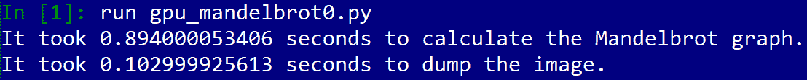

让我们检查导出的图像以确保这是正确的：

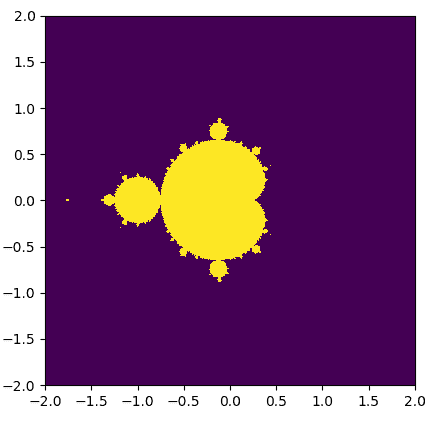

这确实是与第一章中产生的相同曼德布罗特图像，因此我们成功将其在 GPU 上实现了！现在让我们看看我们获得的速度提升：在第一章中，我们用了 14.61 秒来生成这个图表；在这里，它只用了 0.894 秒。记住，PyCUDA 还必须在运行时编译和链接我们的 CUDA C 代码，以及将内存从 GPU 传输到和从 GPU 传输回来的时间。尽管如此，即使有所有这些额外的开销，这仍然是一个非常值得的速度提升！（您可以通过 Git 仓库中名为`gpu_mandelbrot0.py`的文件查看我们 GPU 曼德布罗特的代码。）

# 函数式编程的简要探索

在我们继续之前，让我们简要回顾一下 Python 中用于函数式编程的两个函数——**`map` 和 `reduce`**。这两个函数都被认为是**函数式**的，因为它们都作用于**函数**进行操作。我们发现这些很有趣，因为它们都对应于编程中的常见设计模式，因此我们可以替换输入中的不同函数以获得多种不同（且有用）的操作。

让我们首先回忆一下 Python 中的 `lambda` 关键字。这允许我们定义一个**匿名函数**——在大多数情况下，这些可以被视为一次性的“丢弃”函数，或者可以单行定义的函数。让我们现在打开 IPython 并定义一个简单的函数，它将数字平方——`pow2 = lambda x : x**2`。让我们在几个数字上测试它：

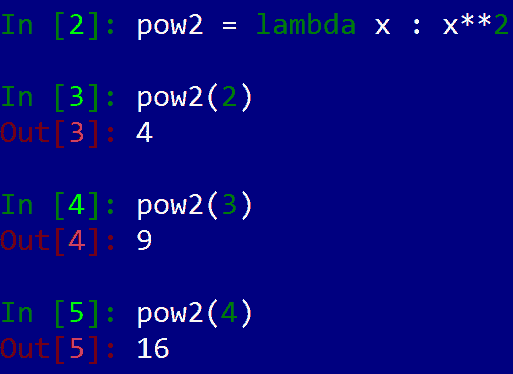

让我们回忆一下 `map` 作用于两个输入值：一个函数和一个对象列表，该函数可以作用于这些对象。`map` 输出一个列表，其中包含函数对原始列表中每个元素的输出。现在，让我们将平方操作定义为匿名函数，并将其输入到 `map` 中，以及以下我们检查的最后几个数字列表——`map(lambda x : x**2, [2,3,4])`：

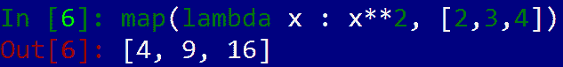

我们看到 `map` 作为 `ElementwiseKernel`！这实际上是函数式编程中的一个标准设计模式。现在，让我们看看 `reduce`；与直接接受一个列表并输出一个直接对应的列表不同，`reduce` 接受一个列表，对其执行递归二进制操作，并输出一个单例。让我们通过输入 `reduce(lambda x, y : x + y, [1,2,3,4])` 来理解这种设计模式。当我们输入 IPython 时，我们会看到这将输出一个单一的数字，10，这确实是 *1+2+3+4* 的和。您可以尝试将上面的求和替换为乘法，并看到这确实适用于递归地将一长串数字相乘。一般来说，我们使用具有**结合二进制操作**的缩减操作；这意味着，无论我们以何种顺序在列表的连续元素之间执行操作，只要列表保持有序，总会得到相同的结果。（这不同于**交换律**。）

我们现在将看到 PyCUDA 如何处理类似于 `reduce` 的编程模式——使用**并行扫描**和**缩减内核**。

# 并行扫描和缩减内核基础

让我们看看 PyCUDA 中一个基本的函数，它实现了 reduce 的功能——`InclusiveScanKernel`。（您可以在名为 `simple_scankernal0.py` 的文件下找到代码。）让我们执行一个基本的示例，在 GPU 上对一组小数字进行求和：

```py
import numpy as np
import pycuda.autoinit
from pycuda import gpuarray
from pycuda.scan import InclusiveScanKernel
seq = np.array([1,2,3,4],dtype=np.int32)
seq_gpu = gpuarray.to_gpu(seq)
sum_gpu = InclusiveScanKernel(np.int32, "a+b")
print sum_gpu(seq_gpu).get()
print np.cumsum(seq)
```

我们通过首先指定输入/输出类型（这里，NumPy `int32`）和在字符串 `"a+b"` 中，来构建我们的内核。在这里，`InclusiveScanKernel` 会自动在 GPU 空间中设置名为 `a` 和 `b` 的元素，所以你可以将这个字符串输入看作是 Python 中的 `lambda a,b: a + b` 的类似物。我们真的可以在这里放置任何（结合）二元运算，只要我们记得用 C 语言来编写它。

当我们运行 `sum_gpu` 时，我们看到我们将得到一个与输入数组大小相同的数组。数组中的每个元素代表计算中的每个步骤的值（NumPy 的 `cumsum` 函数给出相同的输出，正如我们所看到的）。最后一个元素将是我们要寻找的最终输出，这对应于 reduce 的输出：

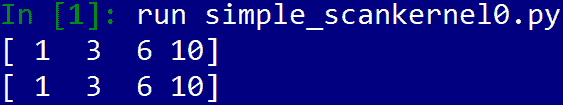

让我们尝试一个更有挑战性的东西；让我们在一个 `float32` 数组中找到最大值：

```py
import numpy as np
import pycuda.autoinit
from pycuda import gpuarray
from pycuda.scan import InclusiveScanKernel
seq = np.array([1,100,-3,-10000, 4, 10000, 66, 14, 21],dtype=np.int32)
seq_gpu = gpuarray.to_gpu(seq)
max_gpu = InclusiveScanKernel(np.int32, "a > b ? a : b")
print max_gpu(seq_gpu).get()[-1]
print np.max(seq)
```

（你可以在名为 `simple_scankernal1.py` 的文件中找到完整的代码。）

在这里，我们做的主要改变是将字符串 `a + b` 替换为 `a > b ? a : b`。（在 Python 中，这将在 `reduce` 语句中呈现为 `lambda a, b: max(a,b)`）。在这里，我们使用了一个技巧，利用 C 语言的 `?` 操作符来给出 `a` 和 `b` 中的最大值。我们最终在输出数组中显示结果的最后一个元素，这将是最后一个元素（我们总是可以用 Python 中的 `[-1]` 索引检索到它）。

现在，让我们最后看看一个 PyCUDA 函数，用于生成 GPU 内核——`ReductionKernel`。实际上，`ReductionKernel` 类似于一个 `ElementwiseKernel` 函数，后面跟着一个并行扫描内核。用 `ReductionKernel` 实现哪种算法是好的候选者？首先想到的是线性代数中的点积。让我们记住计算两个向量的点积有两个步骤：

1.  点积向量

1.  求点积的结果之和

这两个步骤也被称为 *乘法和累加*。现在，让我们设置一个内核来完成这个计算：

```py
dot_prod = ReductionKernel(np.float32, neutral="0", reduce_expr="a+b", map_expr="vec1[i]*vec2[i]", arguments="float *vec1, float *vec2")

```

首先，注意我们用于内核的数据类型（一个 `float32`）。然后，我们使用 `arguments` 设置 CUDA C 内核的输入参数（这里有两个表示每个向量的浮点数组 `float *`），并使用 `map_expr` 设置点积计算。与 `ElementwiseKernel` 一样，这是在 `i` 上索引的。我们按照与 `InclusiveScanKernel` 相同的方式设置 `reduce_expr`。这将从逐元素操作的结果中取出输出，并在数组上执行 reduce 类型的操作。最后，我们使用 `neutral` 设置 *中性元素*。这是一个在 `reduce_expr` 中充当恒等元的元素；在这里，我们设置 `neutral=0`，因为 `0` 在加法下总是恒等元（在乘法下，1 是恒等元）。我们将在本书后面更深入地介绍并行前缀时看到为什么必须设置这个。

# 摘要

我们首先看到了如何从 PyCUDA 查询我们的 GPU，并使用这个方法在 Python 中重新创建 CUDA 的 `deviceQuery` 程序。然后我们学习了如何使用 PyCUDA 的 `gpuarray` 类及其 `to_gpu` 和 `get` 函数在 GPU 的内存之间传输 NumPy 数组。我们通过观察如何使用它们在 GPU 上进行基本计算来感受 `gpuarray` 对象的使用，并且我们学会了使用 IPython 的 `prun` 分析器进行一些调查工作。我们看到了有时在会话中第一次从 PyCUDA 运行 GPU 函数时，由于 PyCUDA 启动 NVIDIA 的 `nvcc` 编译器来编译内联 CUDA C 代码，所以会有一些任意的减速。然后我们看到了如何使用 `ElementwiseKernel` 函数编译和启动元素级操作，这些操作会自动从 Python 并行到 GPU 上。我们对 Python 中的函数式编程（特别是 `map` 和 `reduce` 函数）进行了简要回顾，最后，我们介绍了如何使用 `InclusiveScanKernel` 和 `ReductionKernel` 函数在 GPU 上进行一些基本的 reduce/scan 类型的计算。

现在我们已经掌握了编写和启动内核函数的绝对基础知识，我们应该意识到 PyCUDA 已经通过其模板覆盖了大量编写内核时的开销。我们将在下一章学习 CUDA 内核执行的原则，以及 CUDA 如何将内核中的并发线程安排成抽象的 **网格** 和 **块**。

# 问题

1.  在 `simple_element_kernel_example0.py` 中，我们在测量 GPU 计算的时间时没有考虑从 GPU 到 GPU 的内存传输。尝试使用 Python 的 `time` 命令测量 `gpuarray` 函数 `to_gpu` 和 `get` 所花费的时间。考虑到内存传输时间，你认为将这个特定函数卸载到 GPU 上是否值得？

1.  在 第一章 *为什么进行 GPU 编程？* 中，我们讨论了 Amdahl 的定律，它给我们一些关于通过将程序的部分卸载到 GPU 上可能获得的收益的想法。在本章中，我们看到了两个 Amdahl 的定律没有考虑的问题。

1.  将 `gpu_mandel0.py` 修改为使用越来越小的复数格点，并将其与程序的相同格点的 CPU 版本进行比较。我们能否选择足够小的格点，使得 CPU 版本实际上比 GPU 版本更快？

1.  使用 `ReductionKernel` 创建一个内核，该内核接受两个长度相同的 `complex64` 数组，并返回两个数组中绝对最大的元素。

1.  如果一个 `gpuarray` 对象在 Python 中达到作用域的末尾会发生什么？

1.  你认为为什么在使用 `ReductionKernel` 时我们需要定义 `neutral`？

1.  如果在 `ReductionKernel` 中我们设置 `reduce_expr = "a > b ? a : b"`，并且我们操作的是 int32 类型，那么我们应该将 "`neutral`" 设置为什么？
