# 第七章：使用 Scikit-CUDA 与 CUDA 库

在本章中，我们将游览三个旨在简化数值和科学计算的标准化 CUDA 库。我们将首先查看的是 **cuBLAS**，这是 NVIDIA 对 CUDA 的 **基本线性代数子程序**（**BLAS**）规范的实现。（cuBLAS 是 NVIDIA 对各种基于 CPU 的优化 BLAS 实现的回应，例如免费/开源的 OpenBLAS 或英特尔专有的数学内核库。）我们将查看的下一个库是 **cuFFT**，它可以在 GPU 上执行几乎所有的 **快速傅里叶变换**（**FFT**）变体。我们将特别探讨如何使用 cuFFT 进行图像处理中的滤波。然后我们将查看 **cuSolver**，它可以执行比 cuBLAS 中提供的更复杂的线性代数操作，例如 **奇异值分解**（**SVD**）或 Cholesky 分解。

到目前为止，我们主要处理的是一个充当我们进入 CUDA 的门户的单个 Python 模块——PyCUDA。虽然 PyCUDA 是一个非常强大且多功能的 Python 库，但其主要目的是提供进入程序、编译和启动 CUDA 内核的门户，而不是提供对 CUDA 库的接口。为此，幸运的是，有一个免费的 Python 模块可用，它提供了一个用户友好的包装器接口来访问这些库。这被称为 Scikit-CUDA。

即使你不需要了解 PyCUDA 或甚至理解 GPU 编程就能欣赏 Scikit-CUDA，但它与 PyCUDA 的兼容性非常方便；例如，Scikit-CUDA 可以轻松地与 PyCUDA 的 `gpuarray` 类一起操作，这允许你轻松地在我们的 CUDA 内核例程和 Scikit-CUDA 之间传递数据。此外，大多数例程也将与 PyCUDA 的流类一起工作，这将使我们能够正确地同步我们的自定义 CUDA 内核与 Scikit-CUDA 的包装器。

请注意，除了这三个列出的库之外，Scikit-CUDA 还为专有的 CULA 库以及开源的 MAGMA 库提供了包装器。这两个库与官方 NVIDIA 库提供的功能有很多重叠。由于这些库不是默认与标准 CUDA 安装一起安装的，因此我们选择在本章中不涵盖它们。感兴趣的读者可以在 [`www.culatools.com`](http://www.culatools.com) 和 [`icl.utk.edu/magma/`](http://icl.utk.edu/magma/) 分别了解更多关于 CULA 和 MAGMA 的信息。

建议读者查看 Scikit-CUDA 的官方文档，该文档可在以下位置找到：[`media.readthedocs.org/pdf/scikit-cuda/latest/scikit-cuda.pdf`](https://media.readthedocs.org/pdf/scikit-cuda/latest/scikit-cuda.pdf)。

本章的学习成果如下：

+   学习如何安装 Scikit-CUDA

+   理解标准 CUDA 库的基本目的和区别

+   学习如何使用低级 cuBLAS 函数进行基本线性代数

+   要学习如何使用 SGEMM 和 DGEMM 操作来衡量 GPU 在 FLOPS 中的性能

+   要学习如何使用 cuFFT 在 GPU 上执行 1D 或 2D FFT 操作

+   要学习如何使用 FFT 创建 2D 卷积滤波器并将其应用于简单的图像处理

+   了解如何使用 cuSolver 执行奇异值分解（SVD）

+   要学习如何使用 cuSolver 的 SVD 算法进行基本的特征值分析

# 技术要求

为了完成本章内容，需要一个配备现代 NVIDIA GPU（2016 年及以后）的 Linux 或 Windows 10 PC，并安装所有必要的 GPU 驱动程序和 CUDA Toolkit（9.0 及以后版本）。还需要一个合适的 Python 2.7 安装（例如 Anaconda Python 2.7），其中包含 PyCUDA 模块。

本章的代码也托管在 GitHub 上，可以在[`github.com/PacktPublishing/Hands-On-GPU-Programming-with-Python-and-CUDA`](https://github.com/PacktPublishing/Hands-On-GPU-Programming-with-Python-and-CUDA)找到。

关于先决条件的信息，请参阅本书的序言。有关软件和硬件要求的信息，请参阅[`github.com/PacktPublishing/Hands-On-GPU-Programming-with-Python-and-CUDA`](https://github.com/PacktPublishing/Hands-On-GPU-Programming-with-Python-and-CUDA)的 README 文件。

# 安装 Scikit-CUDA

建议您直接从 GitHub 安装 Scikit-CUDA 的最新稳定版本：[`github.com/lebedov/scikit-cuda`](https://github.com/lebedov/scikit-cuda)。

解压包到目录中，然后在此处打开命令行，通过在命令行中输入`python setup.py install`来安装模块。然后，您可以通过输入`python setup.py test`来运行单元测试，以确保已正确安装。（此方法适用于 Windows 和 Linux 用户。）或者，您可以直接从 PyPI 仓库使用`pip install scikit-cuda`来安装 Scikit-CUDA。

# 使用 cuBLAS 进行基本线性代数

我们将从这个章节开始，学习如何使用 Scikit-CUDA 的 cuBLAS 封装器。让我们花一点时间来讨论 BLAS。BLAS（基本线性代数子例程）是一个关于基本线性代数库的规范，它最初在 20 世纪 70 年代被标准化。BLAS 函数被分为几个类别，这些类别被称为*级别*。

Level 1 BLAS 函数包括仅对向量进行的操作——向量加法和缩放（也称为*ax+y*操作，或 AXPY），点积和范数。Level 2 BLAS 函数包括通用矩阵-向量操作（GEMV），例如向量的矩阵乘法，而 level 3 BLAS 函数包括“通用矩阵-矩阵”操作（GEMM），例如矩阵-矩阵乘法。最初，这些库在 20 世纪 70 年代完全用 FORTRAN 编写，因此您应该考虑到在用法和命名中可能存在一些看似过时的遗留问题，这些可能对今天的初学者来说显得繁琐。

cuBLAS 是 NVIDIA 自行实现的 BLAS 规范，当然是为了充分利用 GPU 的并行性而进行了优化。Scikit-CUDA 为 cuBLAS 提供了包装器，这些包装器与 PyCUDA `gpuarray` 对象以及 PyCUDA 流兼容。这意味着我们可以通过 PyCUDA 将这些函数与我们的自定义 CUDA-C 内核耦合和接口，同时还可以通过多个流同步这些操作。

# cuBLAS 的 Level-1 AXPY

让我们从 cuBLAS 的基本 level-1 *ax + y*（或 AXPY）操作开始。让我们暂停一下，回顾一下线性代数，并思考这意味着什么。在这里，*a* 被认为是标量；也就是说，一个实数，例如 -10、0、1.345 或 100。*x* 和 *y* 被认为是某个向量空间中的向量，![img/47a6873c-3e1b-4b3c-95e8-d1a3a4f796eb.png]。这意味着 *x* 和 *y* 是由实数组成的 n-元组，所以在 ![img/d0e81dc7-0fa8-4bce-a264-941fee2e3ad7.png] 的情况下，这些可以是 `[1,2,3]` 或 `[-0.345, 8.15, -15.867]` 这样的值。*ax* 表示 *x* 通过 *a* 的缩放，所以如果 *a* 是 10 而 *x* 是先前的第一个值，那么 *ax* 就是 *x* 的每个单独值乘以 *a*；也就是说，`[10, 20, 30]`。最后，求和 *ax + y* 意味着我们将两个向量中每个槽位的每个单独值相加，以产生一个新的向量，如下所示（假设 *y* 是给出的第二个向量）——`[9.655, 28.15, 14.133]`。

让我们在 cuBLAS 中执行这个操作。首先，让我们导入适当的模块：

```py
import pycuda.autoinit
from pycuda import gpuarray
import numpy as np
```

现在让我们导入 cuBLAS：

```py
from skcuda import cublas
```

我们现在可以设置我们的向量数组并将它们复制到 GPU 上。请注意，我们正在使用 32 位（单精度）浮点数：

```py
a = np.float32(10)
x = np.float32([1,2,3])
y = np.float32([-.345,8.15,-15.867])
x_gpu = gpuarray.to_gpu(x)
y_gpu = gpuarray.to_gpu(y)
```

我们现在必须创建一个 **cuBLAS 上下文**。这与我们在 第五章 中讨论的 CUDA 上下文在本质上相似，即 *流、事件、上下文和并发*，但这次它是专门用于管理 cuBLAS 会话的。`cublasCreate` 函数创建一个 cuBLAS 上下文，并以句柄的形式返回它。我们将需要保留这个句柄，直到我们打算在这个会话中使用 cuBLAS：

```py
cublas_context_h = cublas.cublasCreate()
```

我们现在可以使用 `cublasSaxpy` 函数。其中的 `S` 代表单精度，这是我们需要的，因为我们正在处理 32 位浮点数组：

```py
cublas.cublasSaxpy(cublas_context_h, x_gpu.size, a, x_gpu.gpudata, 1, y_gpu.gpudata, 1)
```

让我们讨论我们刚才做了什么。同时，请注意，这是一个对低级 C 函数的直接包装，因此输入可能看起来更像 C 函数而不是真正的 Python 函数。简而言之，这执行了一个 "AXPY" 操作，最终将输出数据放入 `y_gpu` 数组中。让我们逐个检查每个输入参数。

第一个输入始终是 CUDA 上下文句柄。然后我们必须指定向量的大小，因为这个函数最终将在 C 指针上操作；我们可以通过使用 gpuarray 的`size`参数来完成这个操作。在我们已经将标量类型转换为 NumPy 的`float32`变量之后，我们可以直接将`a`变量作为标量参数传递。然后我们使用`gpudata`参数将`x_gpu`数组的底层 C 指针传递给这个函数。然后我们指定第一个数组的**步长**为 1：步长指定了我们在每个输入值之间应该采取的步数。（相比之下，如果你正在使用来自行矩阵列的向量，你会将步长设置为矩阵的宽度。）然后我们放入`y_gpu`数组的指针，并将其步长也设置为 1。

我们的计算已经完成；现在我们必须显式地销毁我们的 cuBLAS 上下文：

```py
cublas.cublasDestroy(cublas_context)
```

我们现在可以使用 NumPy 的`allclose`函数来验证这是否接近，如下所示：

```py
print 'This is close to the NumPy approximation: %s' % np.allclose(a*x + y , y_gpu.get())
```

再次注意，最终输出被放入了`y_gpu`数组，这同样也是一个输入。

总是记住，BLAS 和 CuBLAS 函数以原地方式操作以节省时间和内存，这意味着输入数组也将被用作输出！

我们刚刚看到了如何使用`cublasSaxpy`函数执行`AXPY`操作。

让我们讨论一下突出的大写 S。正如我们之前提到的，这代表单精度，即 32 位实浮点值（`float32`）。如果我们想操作 64 位实浮点值数组（NumPy 和 PyCUDA 中的`float64`），那么我们会使用`cublasDaxpy`函数；对于 64 位单精度复数值（`complex64`），我们会使用`cublasCaxpy`，而对于 128 位双精度复数值（`complex128`），我们会使用`cublasZaxpy`。

我们可以通过检查函数名中其余部分之前字母来判断 BLAS 或 CuBLAS 函数操作的数据类型。使用单精度实数的函数总是以 S 开头，双精度实数以 D 开头，单精度复数以 C 开头，双精度复数以 Z 开头。

# 其他 level-1 cuBLAS 函数

让我们看看几个其他的 level-1 函数。我们不会深入探讨它们的操作，但步骤与我们刚刚覆盖的类似：创建 cuBLAS 上下文，使用适当的数组指针调用函数（这些指针通过 PyCUDA 的`gpuarray`的`gpudata`参数访问），并相应地设置步长。另一件需要注意的事情是，如果一个函数的输出是一个单值而不是数组（例如，点积函数），该函数将直接将此值输出到主机，而不是在从 GPU 拉取的内存数组中。（我们在这里只涵盖单精度实数版本，但其他数据类型的相应版本可以通过将 S 替换为适当的字母来使用。）

我们可以在两个单精度浮点 `gpuarray`，`v_gpu` 和 `w_gpu` 之间执行点积。再次，1s 是为了确保我们在这种计算中使用步长-1！再次，回忆一下，点积是两个向量逐点乘积的和：

```py
dot_output = cublas.cublasSdot(cublas_context_h, v_gpu.size, v_gpu.gpudata, 1, w_gpu.gpudata, 1)
```

我们也可以这样计算向量的 L2-范数（回忆一下，对于向量 *x*，这是它的 L2-范数，或长度，使用 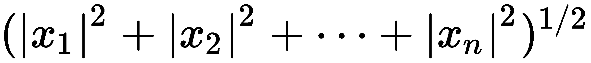 公式计算）：

```py
l2_output = cublas.cublasSnrm2(cublas_context_h, v_gpu.size, v_gpu.gpudata, 1)
```

# cuBLAS 中的 Level-2 GEMV

让我们看看如何进行 `GEMV` 矩阵-向量乘法。这定义为以下操作，对于一个 *m* x *n* 矩阵 *A*，一个 n 维向量 *x*，一个 *m* 维向量 *y*，以及标量 *alpha* 和 *beta*：

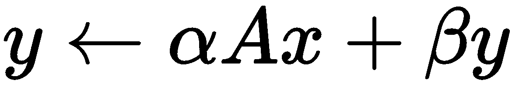

现在，在我们继续之前，让我们看看函数是如何布局的：

```py
cublasSgemv(handle, trans, m, n, alpha, A, lda, x, incx, beta, y, incy)  
```

让我们逐个检查这些输入：

+   `handle` 指的是 cuBLAS 上下文句柄。

+   `trans` 指的是矩阵的结构——我们可以指定我们是否想使用原始矩阵、直接转置或共轭转置（对于复数矩阵）。这一点很重要，因为这个函数将期望矩阵 `A` 以 **列主序** 格式存储。

+   `m` 和 `n` 是我们想要使用的矩阵 `A` 的行数和列数。

+   `alpha` 是 *α* 的浮点值。

+   `A` 是一个 *m x n* 矩阵 *A*。

+   `lda` 表示矩阵的领先维度，其中矩阵的总大小实际上是 `lda` x `n`。这在列主序格式中很重要，因为如果 `lda` 大于 `m`，当 cuBLAS 尝试访问 `A` 的值时，由于其矩阵的底层结构是一个一维数组，这可能会引起问题。

+   然后我们有 `x` 和它的步长，`incx`；`x` 是被 `A` 乘的向量的底层 C 指针。记住，`x` 将必须具有大小 `n`；即 `A` 的列数。

+   `beta`，是 *β* 的浮点值。

+   最后，我们有 `y` 和它的步长 `incy` 作为最后两个参数。我们应该记住，`y` 应该是大小为 `m`，即 `A` 的行数。

让我们通过生成一个 10 x 100 的随机值矩阵 `A` 和一个 100 个随机值的向量 `x` 来测试这个方法。我们将 `y` 初始化为一个 10 个零的矩阵。我们将 alpha 设置为 1，beta 设置为 0，只是为了得到没有缩放的直接矩阵乘法：

```py
m = 10
n = 100
alpha = 1
beta = 0
A = np.random.rand(m,n).astype('float32')
x = np.random.rand(n).astype('float32')
y = np.zeros(m).astype('float32')
```

接下来，我们必须将 `A` 转换为**列主序**（或列式）格式。NumPy 默认将矩阵存储为**行主序**（或行式），这意味着用于存储矩阵的底层一维数组会遍历第一行的所有值，然后是第二行的所有值，依此类推。你应该记住，转置操作会交换矩阵的列和行。然而，结果将是，转置矩阵的底层一维数组将以列主序格式表示原始矩阵。我们可以使用 `A.T.copy()` 如此复制 `A` 的转置矩阵，并将这个以及 `x` 和 `y` 复制到 GPU 上：

```py
A_columnwise = A.T.copy()
A_gpu = gpuarray.to_gpu(A_columnwise) 
x_gpu = gpuarray.to_gpu(x)
y_gpu = gpuarray.to_gpu(y)
```

由于我们现在已经将列矩阵正确存储在 GPU 上，我们可以通过使用 `_CUBLAS_OP` 字典来设置 `trans` 变量，使其不进行转置：

```py
trans = cublas._CUBLAS_OP['N']
```

由于矩阵的大小正好与我们想要使用的行数相同，我们现在将 `lda` 设置为 `m`。*x* 和 *y* 向量的步长再次为 1。我们现在已经设置了所有需要的值，现在可以创建我们的 CuBLAS 上下文并存储其句柄，如下所示：

```py
lda = m 
incx = 1
incy = 1
handle = cublas.cublasCreate()
```

我们现在可以启动我们的函数。记住，`A`、`x` 和 `y` 实际上是 PyCUDA `gpuarray` 对象，因此我们必须使用 `gpudata` 参数将其输入到这个函数中。除了这样做之外，这个过程相当直接：

```py
cublas.cublasSgemv(handle, trans, m, n, alpha, A_gpu.gpudata, lda, x_gpu.gpudata, incx, beta, y_gpu.gpudata, incy)
```

我们现在可以销毁我们的 cuBLAS 上下文并检查返回值以确保它是正确的：

```py
cublas.cublasDestroy(handle)
print 'cuBLAS returned the correct value: %s' % np.allclose(np.dot(A,x), y_gpu.get())
```

# cuBLAS 中的 Level-3 GEMM 用于测量 GPU 性能

接下来，我们将探讨如何使用 CuBLAS 执行一个**通用矩阵-矩阵乘法**（**GEMM**）。实际上，我们将尝试做一些比我们在 cuBLAS 中看到的最后几个例子更有实用性的东西——我们将使用这个作为我们 GPU 性能的指标，以确定它每秒可以执行的**浮点运算次数**（**FLOPS**），这将有两个不同的值：单精度和双精度。使用 GEMM 是评估计算硬件性能的标准技术，因为它比使用纯时钟速度（MHz 或 GHz）提供了对纯粹计算能力的更好理解。

如果你需要简要回顾，请记住我们在上一章中深入探讨了矩阵-矩阵乘法。如果你忘记了它是如何工作的，强烈建议你在继续本节之前复习这一章。

首先，让我们看看 GEMM 操作是如何定义的：

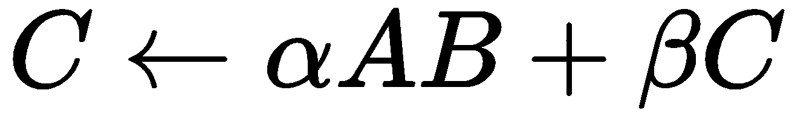

这意味着我们执行了矩阵 *A* 和 *B* 的乘法，将结果按 *alpha* 缩放，然后将其添加到我们按 *beta* 缩放的 *C* 矩阵中，最终结果放在 *C* 中。

让我们考虑执行实值 GEMM 操作的最终结果所需的浮点运算次数，假设*A*是一个*m* x *k*（其中*m*是行，*k*是列）的矩阵，*B*是一个*k* x *n*矩阵，而*C*是一个*m* x *n*矩阵。首先，让我们确定计算*AB*所需的操作次数。让我们取*A*的一个列并乘以*B*：这将涉及每行*m*个乘法和*k - 1*个加法，这意味着在*A*的*m*行中总共是*km + (k-1)m*个操作。*B*有*n*列，因此计算*AB*将总共是*kmn + (k-1)mn = 2kmn - mn*个操作。现在，我们使用*alpha*来缩放*AB*，这将涉及*m**n*个操作，因为这是矩阵*AB*的大小；同样，通过*beta*缩放*C*是另一个*m**n*操作。最后，我们将这两个结果矩阵相加，这又是另一个*m*个操作。这意味着在给定的 GEMM 操作中，我们将有*2kmn - mn + 3mn = 2kmn + 2mn = 2mn(k+1)*个浮点操作。

现在我们唯一要做的就是运行一个计时 GEMM 操作，注意矩阵的不同大小，并将`2kmn + 2mn`除以总时间来计算我们 GPU 的 FLOPS。得到的数字将非常大，因此我们将以 GFLOPS 的形式表示它——即每秒可以计算多少十亿（10⁹）个操作。我们可以通过将 FLOPS 值乘以 10^(-9)来计算这个值。

现在我们准备开始编写代码。让我们从导入语句以及`time`函数开始：

```py
import pycuda.autoinit
from pycuda import gpuarray
import numpy as np
from skcuda import cublas
from time import time
```

现在我们将为我们的矩阵大小设置`m`、`n`和`k`变量。我们希望我们的矩阵相对较大，这样时间跨度就足够大，以避免除以 0 的错误。以下值对于截至 2018 年中或更早发布的任何 GPU 都应该是足够的；使用较新卡的用户可能需要增加这些值：

```py
m = 5000
n = 10000
k = 10000
```

我们现在将编写一个函数来计算单精度和双精度下的 GFLOPS。如果我们想使用双精度，我们将输入值设置为`'D'`，否则设置为`'S'`：

```py
def compute_gflops(precision='S'):

if precision=='S':
    float_type = 'float32'
elif precision=='D':
    float_type = 'float64'
else:
    return -1
```

现在我们将生成一些随机矩阵，这些矩阵的精度与我们用于计时的精度相匹配。GEMM 操作与之前看到的 GEMV 操作类似，因此在我们将它们复制到 GPU 之前，我们必须对这些矩阵进行转置。（由于我们只是在计时，这一步不是必需的，但记住这一点是个好习惯。）

我们将为 GEMM 设置一些其他必要的变量，其目的在此点应该是显而易见的（`transa`、`lda`、`ldb`等）：

```py
A = np.random.randn(m, k).astype(float_type)
B = np.random.randn(k, n).astype(float_type)
C = np.random.randn(m, n).astype(float_type)
A_cm = A.T.copy()
B_cm = B.T.copy()
C_cm = C.T.copy()
A_gpu = gpuarray.to_gpu(A_cm)
B_gpu = gpuarray.to_gpu(B_cm)
C_gpu = gpuarray.to_gpu(C_cm)
alpha = np.random.randn()
beta = np.random.randn()
transa = cublas._CUBLAS_OP['N']
transb = cublas._CUBLAS_OP['N']
lda = m
ldb = k
ldc = m
```

我们现在可以开始计时了！首先，我们将创建一个 cuBLAS 上下文：

```py
t = time()
handle = cublas.cublasCreate()
```

我们现在将启动 GEMM。请注意，对于实数情况有两个版本：`cublasSgemm`用于单精度，`cublasDgemm`用于双精度。我们可以使用一点 Python 技巧执行适当的函数：我们将写一个带有`cublas%sgemm`的字符串，并带有适当的参数，然后通过在字符串中追加`% precision`来将`%s`替换为 D 或 S。然后我们将使用`exec`函数将此字符串作为 Python 代码执行，如下所示：

```py
exec('cublas.cublas%sgemm(handle, transa, transb, m, n, k, alpha, A_gpu.gpudata, lda, B_gpu.gpudata, ldb, beta, C_gpu.gpudata, ldc)' % precision)
```

我们现在可以销毁 cuBLAS 上下文，并获取我们计算的最后时间：

```py
cublas.cublasDestroy(handle)
t = time() - t
```

然后我们需要使用我们推导出的方程计算 GFLOPS，并将其作为此函数的输出返回：

```py
gflops = 2*m*n*(k+1)*(10**-9) / t 
return gflops
```

现在我们可以设置我们的主函数。我们将输出单精度和双精度情况下的 GFLOPS：

```py
if __name__ == '__main__':
    print 'Single-precision performance: %s GFLOPS' % compute_gflops('S')
    print 'Double-precision performance: %s GFLOPS' % compute_gflops('D')
```

现在我们运行这个程序之前，先做一点作业——去[`www.techpowerup.com`](https://www.techpowerup.com)搜索你的 GPU，并注意两件事——单精度浮点性能和双精度浮点性能。我现在使用的是 GTX 1050，它声称单精度性能为 1,862 GFLOPS，双精度性能为 58.20 GFLOPS。让我们现在运行这个程序，看看它是否与事实相符：

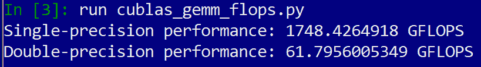

看看吧，它确实是这样！

此程序也作为`cublas_gemm_flops.py`文件包含在此书存储库的目录中。

# 使用 cuFFT 进行快速傅里叶变换

现在让我们看看我们如何使用 cuFFT 进行一些基本的**快速傅里叶变换**（**FFT**）。首先，让我们简要回顾一下傅里叶变换究竟是什么。如果你已经上过高级微积分或分析课程，你可能已经看到傅里叶变换被定义为积分公式，如下所示：

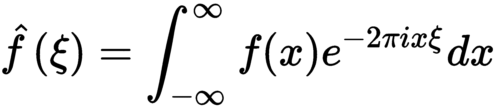

这所做的就是将*f*视为*x*上的时域函数。这给我们一个在"ξ"上的对应频域函数。这实际上是一个非常有用的工具，几乎触及了科学和工程的各个分支。

让我们记住，积分可以被视为求和；同样，也存在傅里叶变换的对应离散、有限版本，称为**离散傅里叶变换**（**DFT**）。它作用于有限长度的向量，并允许在频域内分析或修改它们。一个*n*-维向量*x*的 DFT 定义如下：

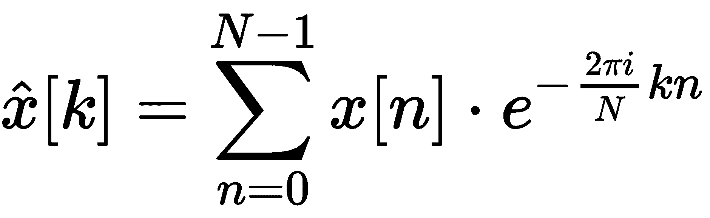

换句话说，我们可以将向量*x*乘以复数*N* x *N*矩阵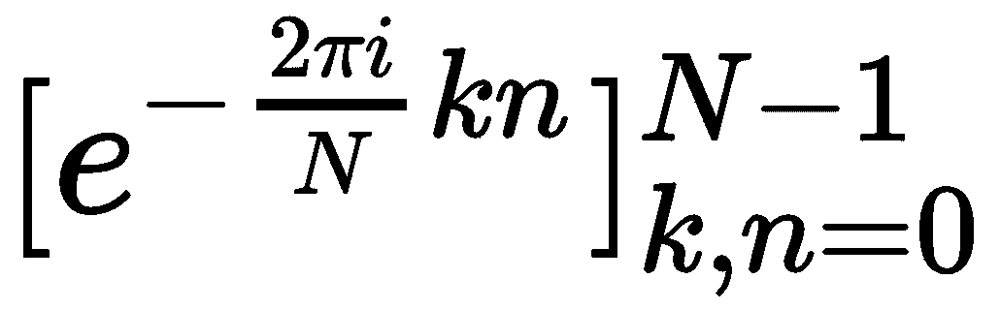

（在这里，*k*对应行号，而*n*对应列号）以找到其 DFT。我们还应该注意逆公式，它允许我们从 DFT 中检索*x*（在这里用*x*的 DFT 替换*y*，输出将是原始的*x*）：

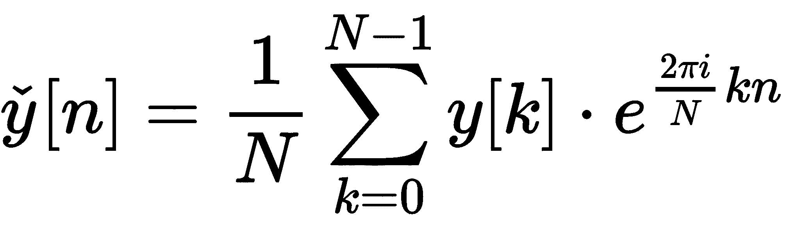

通常，计算矩阵-向量运算的计算复杂度为 O(*N²*)，其中 *N* 是向量的长度。然而，由于 DFT 矩阵中的对称性，这可以通过使用 FFT 总是减少到 O(*N log N*)。让我们看看我们如何使用 FFT 与 CuBLAS，然后我们将转向一个更有趣的例子。

# 简单的 1D FFT

让我们先看看如何使用 cuBLAS 来计算一个简单的 1D FFT。首先，我们将简要讨论 Scikit-CUDA 中的 cuFFT 接口。

这里有两个子模块，我们可以通过它们访问 cuFFT 库，分别是 `cufft` 和 `fft`。`cufft` 包含了 cuFFT 库的低级包装器集合，而 `fft` 提供了一个更友好的用户界面；在本章中，我们将仅使用 `fft`。

让我们从适当的导入开始，记得要包含 Scikit-CUDA 的 `fft` 子模块：

```py
import pycuda.autoinit
from pycuda import gpuarray
import numpy as np
from skcuda import fft
```

我们现在将设置一个随机数组并将其复制到 GPU。我们还将设置一个空的 GPU 数组，该数组将用于存储 FFT（注意我们使用的是实数 float32 数组作为输入，但输出将是 complex64 数组，因为傅里叶变换总是复值）：

```py
x = np.asarray(np.random.rand(1000), dtype=np.float32 )
x_gpu = gpuarray.to_gpu(x)
x_hat = gpuarray.empty_like(x_gpu, dtype=np.complex64)
```

我们现在将设置一个 cuFFT 计划用于前向 FFT 变换。这是一个 cuFFT 用来确定变换的形状以及输入和输出数据类型的对象：

```py
plan = fft.Plan(x_gpu.shape,np.float32,np.complex64)
```

我们还将为逆 FFT 计划对象设置一个计划。注意这次我们从 `complex64` 转换到实数 `float32`：

```py
inverse_plan = fft.Plan(x.shape, in_dtype=np.complex64, out_dtype=np.float32)
```

现在，我们必须将 `x_gpu` 中的前向 FFT 转换到 `x_hat`，并将 `x_hat` 的逆 FFT 转换回 `x_gpu`。注意我们在逆 FFT 中设置了 `scale=True`；我们这样做是为了指示 cuFFT 将逆 FFT 缩放为 1/N：

```py
fft.fft(x_gpu, x_hat, plan)
fft.ifft(x_hat, x_gpu, inverse_plan, scale=True)
```

我们现在将检查 `x_hat` 与 `x` 的 NumPy FFT 相比，以及 `x_gpu` 与 `x` 本身相比：

```py
y = np.fft.fft(x)
print 'cuFFT matches NumPy FFT: %s' % np.allclose(x_hat.get(), y, atol=1e-6)
print 'cuFFT inverse matches original: %s' % np.allclose(x_gpu.get(), x, atol=1e-6)
```

如果你运行这个程序，你会看到 `x_hat` 与 `y` 不匹配，然而，不可思议的是，`x_gpu` 与 `x` 匹配。这是怎么可能的？好吧，让我们记住 `x` 是实数；如果你看看离散傅里叶变换是如何计算的，你可以通过数学证明，实数向量的输出将在 N/2 后重复其复共轭。尽管 NumPy FFT 无论如何都会完全计算这些值，但 cuFFT 通过仅在输入是实数时只计算输出的一半来节省时间，并将剩余的输出设置为 `0`。你应该通过检查前面的变量来验证这一点。

因此，如果我们把前面代码中的第一个打印语句改为只比较 CuFFT 和 NumPy 之间的前 N/2 个输出，那么这将返回 true：

```py
print 'cuFFT matches NumPy FFT: %s' % np.allclose(x_hat.get()[0:N//2], y[0:N//2], atol=1e-6)
```

# 使用 FFT 进行卷积

我们现在将探讨如何使用 FFT 来执行 **卷积**。首先，让我们回顾一下卷积的确切含义：给定两个一维向量，*x* 和 *y*，它们的卷积定义为以下：

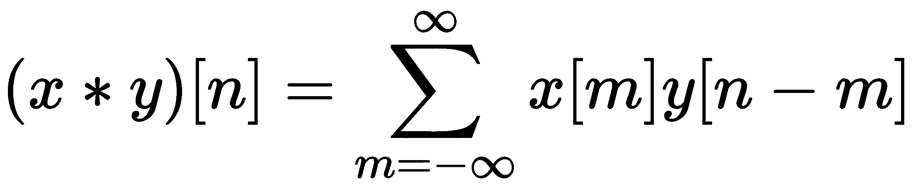

这对我们来说很有趣，因为如果*x*是某个长而连续的信号，而*y*只有少量局部非零值，那么*y*将作为*x*的滤波器；这本身就有很多应用。首先，我们可以使用滤波器来平滑信号*x*（这在数字信号处理和图像处理中很常见）。我们还可以用它来收集信号*x*的样本，以表示或压缩信号（这在数据压缩或压缩感知领域很常见），或者使用滤波器收集信号或图像识别中的特征（这在机器学习中很常见）。这个想法是卷积神经网络的基础）。

当然，计算机无法处理无限长的向量（至少目前还不能），因此我们将考虑**圆卷积**。在圆卷积中，我们处理的是两个长度为*n*的向量，其索引小于 0 或大于 n-1 将环绕到另一端；也就是说，*x*[-1] = *x*[n-1]，*x*[-2] = *x*[n-2]，*x*[n] = *x*[0]，*x*[n+1] = *x*[1]，依此类推。我们这样定义*x*和*y*的圆卷积：

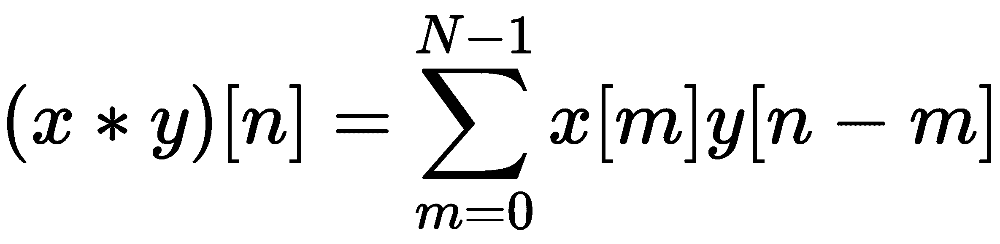

结果表明，我们可以非常容易地使用 FFT 执行圆卷积；我们可以通过在*x*和*y*上执行 FFT，逐点相乘输出，然后在最终结果上执行逆 FFT 来实现这一点。这个结果被称为**卷积定理**，也可以如下表示：

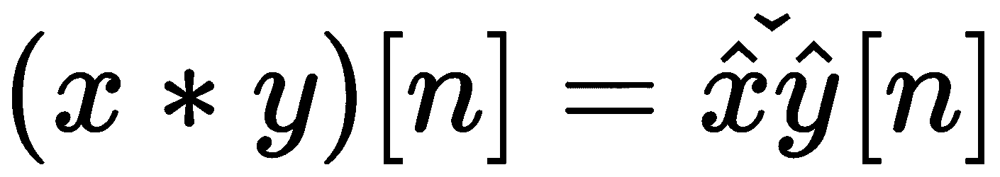

我们将在两个维度上执行此操作，因为我们希望将结果应用于信号处理。虽然我们只看到了一维 FFT 和卷积的数学公式，但二维卷积和 FFT 与它们的一维对应物非常相似，只是索引更加复杂。然而，我们将选择跳过这部分，以便直接进入应用。

# 使用 cuFFT 进行 2D 卷积

现在我们将编写一个小程序，使用基于 cuFFT 的二维卷积对图像进行**高斯滤波**。高斯滤波是一种使用高斯（正态）分布进行平滑的图像操作。之所以这样命名，是因为它基于统计学中的高斯（正态）分布。这是如何定义具有标准差σ的高斯滤波器在二维上的定义：


当我们将一个离散图像与一个滤波器卷积时，我们有时将这个滤波器称为**卷积核**。通常，图像处理工程师会直接称其为普通核，但为了避免与 CUDA 核混淆，我们总是使用全称，即卷积核。在这里，我们将使用高斯滤波器的离散版本作为我们的卷积核。

让我们从适当的导入开始；请注意，在这里我们将使用 Scikit-CUDA 子模块`linalg`。这将为我们的提供比 cuBLAS 更高层次的接口。由于我们在这里处理图像，我们还将导入 Matplotlib 的`pyplot`子模块。此外，请注意，我们将在这里使用 Python 3 风格的除法，从第一行开始；这意味着如果我们用`/`运算符除以两个整数，则返回值将是一个浮点数，无需类型转换（我们使用`//`运算符执行整数除法）：

```py
from __future__ import division
import pycuda.autoinit
from pycuda import gpuarray
import numpy as np
from skcuda import fft
from skcuda import linalg
from matplotlib import pyplot as plt
```

让我们直接开始编写卷积函数。这将接受两个大小相同的 NumPy 数组`x`和`y`。我们将将这些数组类型转换为 complex64 数组，然后如果它们的大小不同，则返回`-1`：

```py
def cufft_conv(x , y):
    x = x.astype(np.complex64)
    y = y.astype(np.complex64)

    if (x.shape != y.shape):
        return -1
```

现在，我们将设置 FFT 计划和逆 FFT 计划对象：

```py
plan = fft.Plan(x.shape, np.complex64, np.complex64)
inverse_plan = fft.Plan(x.shape, np.complex64, np.complex64)
```

现在，我们可以将我们的数组复制到 GPU。我们还将设置一些适当大小的空数组来存储这些数组的 FFT，以及一个额外的数组，它将存储最终卷积的输出`out_gpu`：

```py
 x_gpu = gpuarray.to_gpu(x)
 y_gpu = gpuarray.to_gpu(y)

 x_fft = gpuarray.empty_like(x_gpu, dtype=np.complex64)
 y_fft = gpuarray.empty_like(y_gpu, dtype=np.complex64)
 out_gpu = gpuarray.empty_like(x_gpu, dtype=np.complex64)
```

现在，我们可以执行我们的 FFT：

```py
fft.fft(x_gpu, x_fft, plan)
fft.fft(y_gpu, y_fft, plan)
```

现在，我们将使用`linalg.multiply`函数在`x_fft`和`y_fft`之间执行逐点（Hadamard）乘法。我们将设置`overwrite=True`，以便将最终值写入`y_fft`：

```py
linalg.multiply(x_fft, y_fft, overwrite=True)
```

现在，我们将调用逆 FFT，将最终结果输出到`out_gpu`。我们将此值传输到主机并返回：

```py
fft.ifft(y_fft, out_gpu, inverse_plan, scale=True)
conv_out = out_gpu.get()
return conv_out
```

我们还没有完成。我们的卷积核将比我们的输入图像小得多，因此我们必须调整我们两个二维数组（卷积核和图像）的大小，使它们相等，并在它们之间执行逐点乘法。我们不仅要确保它们相等，还需要确保我们在数组上执行**零填充**，并且适当地居中卷积核。零填充意味着我们在图像的两侧添加一个零缓冲区，以防止环绕错误。如果我们使用 FFT 来执行我们的卷积，请记住，它是一个循环卷积，因此边缘将始终实际环绕。当我们完成卷积后，我们可以从图像的外部移除缓冲区，以获得最终的输出图像。

让我们创建一个新的函数`conv_2d`，它接受一个卷积核`ker`和一个图像`img`。填充后的图像大小将是（`2*ker.shape[0] + img.shape[0]`，`2*ker.shape[1] + img.shape[1]`）。让我们首先设置填充后的卷积核。我们将创建一个大小为这个的零二维数组，然后设置左上角的子矩阵为我们自己的卷积核，如下所示：

```py
def conv_2d(ker, img):

    padded_ker = np.zeros( (img.shape[0] + 2*ker.shape[0], img.shape[1] + 2*ker.shape[1] )).astype(np.float32)
    padded_ker[:ker.shape[0], :ker.shape[1]] = ker
```

现在，我们必须将卷积核移动，使其中心精确地位于坐标（0,0）。我们可以使用 NumPy 的`roll`命令来完成此操作：

```py
padded_ker = np.roll(padded_ker, shift=-ker.shape[0]//2, axis=0)
padded_ker = np.roll(padded_ker, shift=-ker.shape[1]//2, axis=1)
```

现在，我们需要填充输入图像：

```py
padded_img = np.zeros_like(padded_ker).astype(np.float32)
padded_img[ker.shape[0]:-ker.shape[0], ker.shape[1]:-ker.shape[1]] = img
```

现在，我们有两个大小相同且格式适当的数组。我们现在可以使用我们刚刚编写的`cufft_conv`函数：

```py
out_ = cufft_conv(padded_ker, padded_img)
```

现在，我们可以移除图像外部的零缓冲区。然后我们返回结果：

```py
output = out_[ker.shape[0]:-ker.shape[0], ker.shape[1]:-ker.shape[1]]

return output
```

我们还没有完成。让我们编写一些小函数来设置我们的高斯滤波器，然后我们可以继续将其应用于图像。我们可以使用 lambda 函数在一行中编写基本的过滤器：

```py
gaussian_filter = lambda x, y, sigma : (1 / np.sqrt(2*np.pi*(sigma**2)) )*np.exp( -(x**2 + y**2) / (2 * (sigma**2) ))
```

我们现在可以编写一个函数，使用这个过滤器输出一个离散的卷积核。卷积核的高度和长度将是`2*sigma + 1`，这是相当标准的：

注意，我们通过将高斯核的值相加到`total_`中并将其除以来归一化高斯核的值。

```py
def gaussian_ker(sigma):
    ker_ = np.zeros((2*sigma+1, 2*sigma+1))
    for i in range(2*sigma + 1):
        for j in range(2*sigma + 1):
            ker_[i,j] = gaussian_filter(i - sigma, j - sigma, sigma)
    total_ = np.sum(ker_.ravel())
    ker_ = ker_ */* total*_* return ker_
```

我们现在准备好在一个图像上测试这个操作了！作为我们的测试案例，我们将使用高斯滤波来模糊这本书的编辑者*Akshada Iyer*的彩色 JPEG 图像。（此图像存储在 GitHub 仓库的`Chapter07`目录中，文件名为`akshada.jpg`。）我们将使用 Matplotlib 的`imread`函数来读取图像；默认情况下，它存储为一个从 0 到 255 的无符号 8 位整数数组。我们将将其类型转换为浮点数数组并归一化，以便所有值都介于 0 到 1 之间。

注意：本书印刷版的读者：尽管本书的印刷版是灰度图像，但这是一个彩色图像。

然后，我们将设置一个空的零数组来存储模糊后的图像：

```py
if __name__ == '__main__':
    akshada = np.float32(plt.imread('akshada.jpg')) / 255
    akshada_blurred = np.zeros_like(akshada)
```

让我们设置我们的卷积核。在这里，标准差为 15 应该足够：

```py
ker = gaussian_ker(15)
```

我们现在可以模糊图像了。由于这是一个彩色图像，我们必须对每个颜色层（红色、绿色和蓝色）分别应用高斯滤波；这在图像数组中由第三维索引：

```py
for k in range(3):
    akshada_blurred[:,:,k] = conv_2d(ker, akshada[:,:,k])
```

现在，让我们使用一些 Matplotlib 技巧来并排查看“之前”和“之后”的图像：

```py
fig, (ax0, ax1) = plt.subplots(1,2)
fig.suptitle('Gaussian Filtering', fontsize=20)
ax0.set_title('Before')
ax0.axis('off')
ax0.imshow(akshada)
ax1.set_title('After')
ax1.axis('off')
ax1.imshow(akshada_blurred)
plt.tight_layout()
plt.subplots_adjust(top=.85)
plt.show()
```

我们现在可以运行程序并观察高斯滤波的效果：

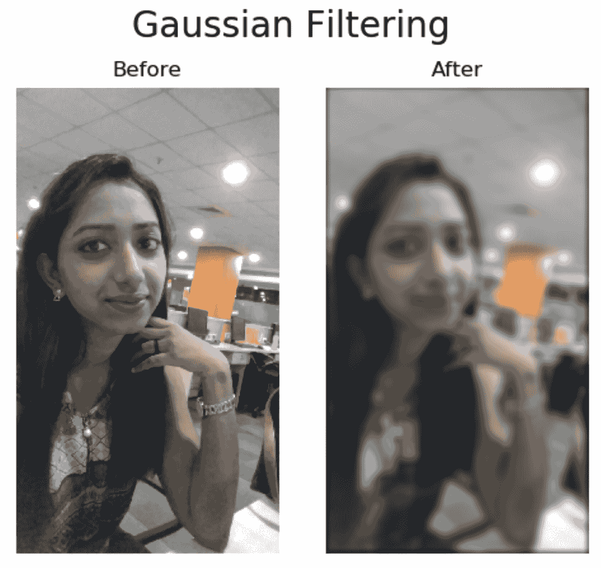

此程序存储在本书的`Chapter07`目录中，文件名为`conv_2d.py`。

# 使用 Scikit-CUDA 的 cuSolver

现在，我们将查看如何使用 Scikit-CUDA 的`linalg`子模块中的 cuSolver。同样，这为 cuBLAS 和 cuSolver 提供了一个高级接口，因此我们不必陷入细节。

正如我们在引言中提到的，cuSolver 是一个库，用于执行比 cuBLAS 更高级的线性代数运算，例如奇异值分解、LU/QR/Cholesky 分解和特征值计算。由于 cuSolver，就像 cuBLAS 和 cuFFT 一样，也是一个庞大的库，我们将只花时间查看数据科学和机器学习中最基本的一个操作——奇异值分解（SVD）。

如果您想了解更多关于这个库的信息，请参阅 NVIDIA 的官方 cuSOLVER 文档：[`docs.NVIDIA.com/cuda/cusolver/index.html`](https://docs.nvidia.com/cuda/cusolver/index.html)。

# 奇异值分解（SVD）

SVD 可以处理任何 *m* x *n* 矩阵 *A*，然后返回三个矩阵——*U*、*Σ* 和 *V*。在这里，*U* 是一个 *m* x *m* 的单位矩阵，*Σ* 是一个 *m* x *n* 的对角矩阵，而 *V* 是一个 *n* x *n* 的单位矩阵。当我们说 *单位* 时，意味着矩阵的列构成了一个正交归一基；当我们说 *对角* 时，意味着矩阵中的所有值都是零，除了可能的对角线上的值。

SVD 的意义在于，它将 *A* 分解成这些矩阵，使得我们有 *A = UΣV^T*；此外，*Σ* 对角线上的值都将为正或零，这些值被称为奇异值。我们很快将看到一些应用，但您应该记住，SVD 的计算复杂度为 O(*mn²*)——对于大型矩阵，使用 GPU 确实是一个好主意，因为这个算法是可并行的。

现在，我们将看看如何计算矩阵的 SVD。让我们编写适当的导入语句：

```py
import pycuda.autoinit
from pycuda import gpuarray
import numpy as np
from skcuda import linalg
```

现在，我们将生成一个相对较大的随机矩阵并将其传输到 GPU：

```py
a = np.random.rand(1000,5000).astype(np.float32)
a_gpu = gpuarray.to_gpu(a)
```

我们现在可以执行 SVD。这将产生三个输出，对应于我们刚才描述的矩阵。第一个参数将是刚刚复制到 GPU 的矩阵数组。然后我们需要指定我们想要使用 cuSolver 作为此操作的底层后端：

```py
U_d, s_d, V_d = linalg.svd(a_gpu,  lib='cusolver')
```

现在，让我们将这些数组从 GPU 复制到主机：

```py
U = U_d.get()
s = s_d.get()
V = V_d.get()
```

`s` 实际上存储为一个一维数组；我们需要创建一个大小为 1000 x 5000 的零矩阵，并将这些值沿对角线复制。我们可以使用 NumPy 的 `diag` 函数和一些数组切片来完成这个操作：

```py
S = np.zeros((1000,5000))
S[:1000,:1000] = np.diag(s)
```

我们现在可以使用 NumPy 的 `dot` 函数在主机上对这些值进行矩阵乘法，以验证它们是否与我们的原始数组匹配：

```py
print 'Can we reconstruct a from its SVD decomposition? : %s' % np.allclose(a, np.dot(U, np.dot(S, V)), atol=1e-5)
```

由于我们只使用 float32 并且我们的矩阵相对较大，引入了一些数值误差；我们不得不将“容差”级别（`atol`）设置得比通常稍高，但它仍然足够小，可以验证这两个数组足够接近。

# 使用 SVD 进行主成分分析（PCA）

**主成分分析**（**PCA**）是一种主要用于降维的工具。我们可以使用它来查看数据集，并找出哪些维度和线性子空间最为显著。虽然有多种实现方式，但我们将向您展示如何使用 SVD 来执行 PCA。

我们将这样做——我们将使用一个存在于 10 维的 dataset。我们首先将创建两个向量，它们在前面的权重很大，其他地方为 0：

```py
vals = [ np.float32([10,0,0,0,0,0,0,0,0,0]) , np.float32([0,10,0,0,0,0,0,0,0,0]) ]
```

我们将随后添加 9,000 个额外的向量：其中 6,000 个与最初的两个向量相同，只是增加了一点点随机白噪声，剩下的 3,000 个则完全是随机白噪声：

```py
for i in range(3000):
    vals.append(vals[0] + 0.001*np.random.randn(10))
    vals.append(vals[1] + 0.001*np.random.randn(10))
    vals.append(0.001*np.random.randn(10))
```

现在，我们将`vals`列表强制转换为`float32` NumPy 数组。我们对行取平均值，然后从每行减去这个值。（这是 PCA 的一个必要步骤。）然后我们转置这个矩阵，因为 cuSolver 要求输入矩阵的行数少于或等于列数：

```py
vals = np.float32(vals)
vals = vals - np.mean(vals, axis=0)
v_gpu = gpuarray.to_gpu(vals.T.copy())
```

现在，我们将像之前一样运行 cuSolver，并将输出值从 GPU 复制出来：

```py
U_d, s_d, V_d = linalg.svd(v_gpu, lib='cusolver')

u = U_d.get()
s = s_d.get()
v = V_d.get()
```

现在，我们已经准备好开始我们的调查工作了。让我们打开 IPython，更仔细地查看`u`和`s`。首先，让我们看看`s`；它的值实际上是**主值**的平方根，因此我们将它们平方然后查看：

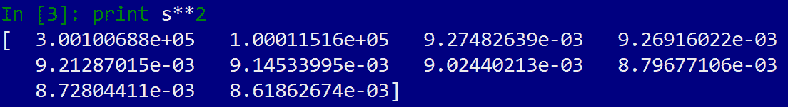

你会注意到前两个主值是 10⁵ 的数量级，而其余分量是 10^(-3)的数量级。这告诉我们，实际上只有一个二维子空间与这些数据相关，这并不令人惊讶。这些是第一个和第二个值，将对应于第一个和第二个主成分，即相应的向量。让我们看看这些向量，它们将存储在`U`中：

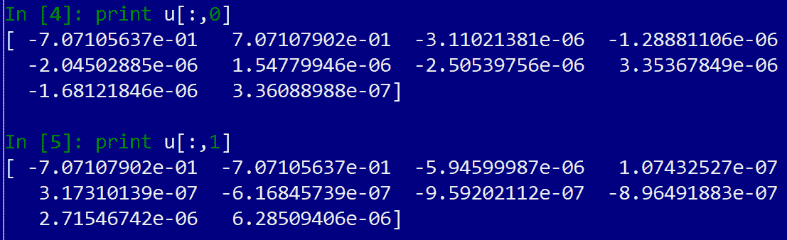

你会注意到这两个向量在前两个条目中权重非常高，它们的数量级是 10^(-1)；其余条目都是 10^(-6)或更低的数量级，相对不相关。考虑到我们在前两个条目中如何偏置数据，这正是我们所预期的。简而言之，这就是 PCA 背后的想法。

# 摘要

我们本章从如何使用 Scikit-CUDA 库的包装器开始，这里我们需要记住许多细节，例如何时使用列主存储，或者一个输入数组是否会被就地覆盖。然后我们探讨了如何使用 Scikit-CUDA 的 cuFFT 执行一维和二维 FFT，以及如何创建一个简单的卷积滤波器。接着我们展示了如何将此应用于图像的简单高斯模糊效果。最后，我们探讨了如何使用 cuSolver 在 GPU 上执行奇异值分解（SVD），这通常是一个非常计算密集的操作，但它在 GPU 上并行化得相当好。我们本章的结尾是探讨如何使用 SVD 进行基本的 PCA。

# 问题

1.  假设你得到一份工作，将一些旧的遗留 FORTRAN BLAS 代码翻译成 CUDA。你打开一个文件，看到一个名为 SBLAH 的函数，另一个名为 ZBLEH。你能不查阅它们来告诉这两个函数使用的数据类型吗？

1.  你能否修改 cuBLAS 级别-2 GEMV 示例，使其通过直接将矩阵`A`复制到 GPU 上工作，而不需要在主机上转置以设置列向？

1.  使用 cuBLAS 32 位实数点积(`cublasSdot`)，通过一个行矩阵和一个步长为 1 的向量实现矩阵-向量乘法。

1.  使用`cublasSdot`实现矩阵-矩阵乘法。

1.  你能实现一种方法来精确测量性能测量示例中的 GEMM 操作吗？

1.  在 1D FFT 的示例中，尝试将`x`类型转换为`complex64`数组，然后切换 FFT 和逆 FFT 计划，使其在两个方向上都是`complex64`值。然后确认`np.allclose(x, x_gpu.get())`是否为真，而不检查数组的前半部分。你认为为什么现在这种方法会起作用？

1.  注意到在卷积示例中，模糊图像周围有一个暗边。为什么这个暗边出现在模糊图像中，而不是原始图像中？你能想到一种可以用来减轻这种情况的方法吗？
