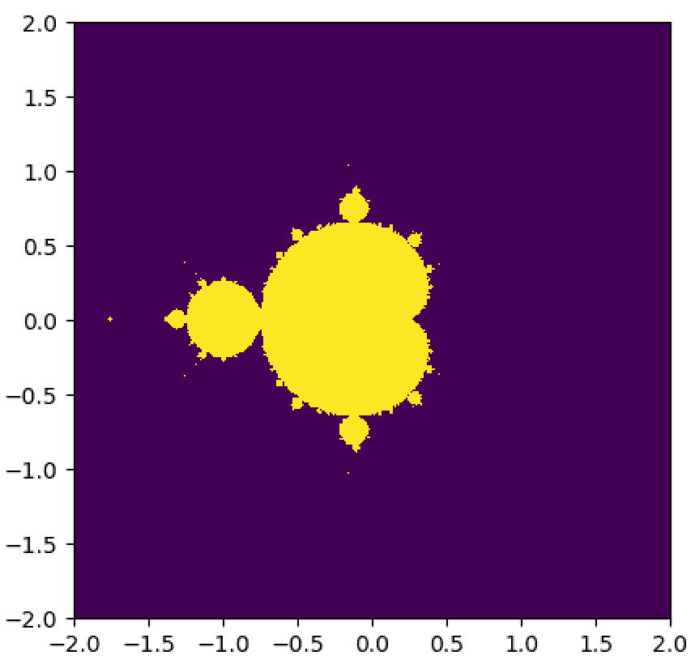

# 第十章：与编译后的 GPU 代码一起工作

在本书的整个过程中，我们通常依赖于 PyCUDA 库来自动为我们接口我们的内联 CUDA-C 代码，仅使用即时编译和与我们的 Python 代码链接。然而，我们可能会记得，有时编译过程可能需要一段时间。在第三章“开始使用 PyCUDA”中，我们甚至详细看到了编译过程如何导致减速，以及内联代码何时编译和保留可能具有一定的任意性。在某些情况下，考虑到应用程序，这可能会不方便且繁琐，甚至在实时系统中可能是不被接受的。

为了这个目的，我们最终将看到如何从 Python 中使用预编译的 GPU 代码。特别是，我们将探讨三种不同的方法来实现这一点。首先，我们将探讨如何通过编写一个主机端 CUDA-C 函数来间接启动 CUDA 内核。这种方法将涉及使用标准的 Python Ctypes 库调用主机端函数。其次，我们将编译我们的内核到一个称为 PTX 模块的东西，这实际上是一个包含编译后的 GPU 二进制的 DLL 文件。然后我们可以使用 PyCUDA 加载这个文件并直接启动我们的内核。最后，我们将通过探讨如何编写我们自己的完整的 Ctypes 接口到 CUDA 驱动程序 API 来结束这一章。然后我们可以使用驱动程序 API 中的适当函数来加载我们的 PTX 文件并启动内核。

本章的学习成果如下：

+   使用 Ctypes 模块启动编译后的（主机端）代码

+   使用 Ctypes 在 Python 中启动内核的主机端 CUDA C 包装器

+   如何将 CUDA C 模块编译成 PTX 文件

+   如何将 PTX 模块加载到 PyCUDA 中以启动预编译的内核

+   如何编写自己的自定义 Python 接口到 CUDA 驱动程序 API

# 使用 Ctypes 启动编译后的代码

现在我们将简要概述 Python 标准库中的 Ctypes 模块。Ctypes 用于调用 Linux `.so`（共享对象）或 Windows DLL（动态链接库）预编译的二进制文件中的函数。这将使我们能够跳出纯 Python 的世界，与用编译语言（尤其是 C 和 C++）编写的库和代码进行接口，碰巧的是，Nvidia 只为与我们的 CUDA 设备接口提供这样的预编译二进制文件，因此如果我们想绕过 PyCUDA，我们就必须使用 Ctypes。

让我们从一个非常基础的例子开始：我们将向您展示如何直接从 Ctypes 调用 `printf`。打开一个 IPython 实例并输入 `import ctypes`。现在我们将查看如何从 Ctypes 调用标准的 `printf` 函数。首先，我们需要导入适当的库：在 Linux 上，通过输入 `libc = ctypes.CDLL('libc.so.6')` 来加载 LibC 库（在 Windows 上，将 `'libc.so.6'` 替换为 `'msvcrt.dll'`）。现在我们可以直接在 IPython 提示符中通过输入 `libc.printf("Hello from ctypes!\n")` 来调用 `printf`。自己试试吧！

现在让我们尝试另一件事：从 IPython 中输入 `libc.printf("Pi is approximately %f.\n", 3.14)`；你应该会得到一个错误。这是因为 `3.14` 没有适当地从 Python 浮点变量转换为 C 双精度浮点变量——我们可以使用 Ctypes 如此完成：

```py
libc.printf("Pi is approximately %f.\n", ctypes.c_double(3.14)) 
```

输出应该是预期的。就像从 PyCUDA 启动 CUDA 内核的情况一样，我们必须同样小心地将输入类型转换为 Ctypes 中的函数，这些函数具有适当的 C 数据类型。

总是要确保将输入适当地类型转换为 Python 中使用 Ctypes 调用的任何函数的适当 C 数据类型（在 Ctypes 中，这些数据类型前面带有 c_：`c_float`、`c_double`、`c_char`、`c_int` 等）。

# 再次回顾曼德布罗特集（再次）

让我们回顾一下我们在 第一章 “为什么进行 GPU 编程？”和 第三章 “使用 PyCUDA 入门”中看到的曼德布罗特集。首先，我们将编写一个完整的 CUDA 内核，该内核将根据一组特定的参数计算曼德布罗特集，以及一个适当的主机端包装函数，我们可以在以后通过 Ctypes 接口。我们首先将这些函数写入一个单独的 CUDA-C `.cu` 源文件，然后使用 NVCC 编译器将此编译成 DLL 或 `.so` 二进制文件。最后，我们将编写一些 Python 代码，以便我们可以运行我们的二进制代码并显示曼德布罗特集。

现在，我们将应用我们对 Ctypes 的了解，从 Python 中启动预编译的 CUDA 内核，而不需要 PyCUDA 的任何帮助。这要求我们编写一个主机端 *内核启动器* 包装函数，我们可以直接调用它，该函数本身已被编译成动态库二进制文件，其中包含必要的 GPU 代码——即在 Windows 上的动态链接库 (DLL) 二进制文件，或在 Linux 上的共享对象 (so) 二进制文件。

当然，我们首先将编写我们的 CUDA-C 代码，所以请打开您喜欢的文本编辑器并跟随操作。我们将从标准的 `include` 语句开始：

```py
#include <cuda_runtime.h>
#include <stdio.h>
#include <stdlib.h>
#include <math.h>
```

现在，我们将直接编写我们的内核。注意代码中的 `extern "C"`，这将允许我们从外部链接到这个函数：

```py
extern "C" __global__ void mandelbrot_ker(float * lattice, float * mandelbrot_graph, int max_iters, float upper_bound_squared, int lattice_size)
{
```

让我们思考一下这将如何工作：我们将使用一个名为`lattice`的单维数组来存储实部和虚部，其长度为`lattice_size`。我们将使用这个数组来计算一个形状为(`lattice_size`, `lattice_size`)的二维曼德布罗特图，并将其写入预分配的数组`mandelbrot_graph`中。我们将使用`max_iters`指定每个点检查发散的迭代次数，通过提供其平方值`upper_bound_squared`来指定最大上限。（我们将在下一部分讨论使用平方的原因。）

我们将在一个一维网格/块结构上启动这个内核，每个线程对应于曼德布罗特集图形图像中的单个点。然后我们可以确定对应点的实/虚晶格值，如下所示：

```py
    int tid = blockIdx.x * blockDim.x + threadIdx.x;

    if ( tid < lattice_size*lattice_size )
    {
        int i = tid % lattice_size;
        int j = lattice_size - 1 - (tid / lattice_size);

        float c_re = lattice[i];
        float c_im = lattice[j];
```

让我们花一分钟来讨论这个问题。首先，记住我们可能需要使用比必要的稍微多一点线程，因此检查线程 ID 是否与输出图像中的某个点相对应是很重要的，我们可以使用`if`语句来完成这个检查。同时，我们也应该记住输出数组`mandelbrot_graph`将作为一个一维数组存储，它代表了一个以行格式存储的两维图像，我们将使用`tid`作为索引来写入这个数组。我们还将使用`i`和`j`，以及复平面上图形的`x`和`y`坐标。由于晶格是一系列从小到大排序的实数值，我们将需要反转它们的顺序以获得适当的虚数。此外，请注意，我们将在这里使用普通的浮点数，而不是某种结构或对象来表示复数值。由于每个复数都有实部和虚部，我们在这里将需要使用两个浮点数来存储对应于这个线程晶格点的复数（`c_re`和`c_im`）。

我们将设置两个额外的变量来处理发散检查，`z_re`和`z_im`，并在检查发散之前将这个线程在图上的初始值设置为`1`：

```py
        float z_re = 0.0f;
        float z_im = 0.0f;

        mandelbrot_graph[tid] = 1;
```

现在我们将进行发散检查；如果在`max_iters`次迭代后发散，我们将点设置为`0`。否则，它将保持在`1`：

```py
        for (int k = 0; k < max_iters; k++)
        {
            float temp;

            temp = z_re*z_re - z_im*z_im + c_re;
            z_im = 2*z_re*z_im + c_im;
            z_re = temp;

            if ( (z_re*z_re + z_im*z_im) > upper_bound_squared )
            {
                mandelbrot_graph[tid] = 0;
                break;
            }
        }
```

在我们继续之前，让我们花一点时间来讨论这段代码。让我们记住，曼德布罗特集的每一次迭代都是通过复数乘法和加法来计算的，例如，`z_new = z*z + c`。由于我们不是在处理一个会为我们处理复数值的类，所以前面的操作正是我们用来计算`z`的新实部和虚部的操作。我们还需要计算绝对值并查看它是否超过某个特定值——记住，复数*c = x + iy*的绝对值是通过*√(x²+y²)*计算的。实际上，在这里计算上限的平方并将其放入内核中可以节省我们一些时间，因为它将节省我们每次迭代计算`z_re*z_re + z_im*z_im`平方根的时间。

现在我们基本上完成了这个内核——我们只需要关闭`if`语句并从内核返回，我们就完成了：

```py
    }
    return;
}
```

然而，我们还没有完全完成。我们需要为 Linux 编写一个仅包含`extern "C"`的主机端包装函数，而在 Windows 的情况下，则需要`extern "C" __declspec(dllexport)`。（与编译后的 CUDA 内核相比，如果我们想在 Windows 中从 Ctypes 访问主机端函数，这个额外的关键字是必要的。）我们放入这个函数的参数将直接对应于进入内核的参数，除了这些将存储在主机上：

```py
extern "C" __declspec(dllexport) void launch_mandelbrot(float * lattice,  float * mandelbrot_graph, int max_iters, float upper_bound, int lattice_size)
{
```

现在，我们首先要做的是使用`cudaMalloc`为存储晶格和输出在 GPU 上分配足够的内存，然后使用`cudaMemcpy`将晶格复制到 GPU 上：

```py
    int num_bytes_lattice = sizeof(float) * lattice_size;
    int num_bytes_graph = sizeof(float)* lattice_size*lattice_size;

    float * d_lattice;
    float * d_mandelbrot_graph;

    cudaMalloc((float **) &d_lattice, num_bytes_lattice);
    cudaMalloc((float **) &d_mandelbrot_graph, num_bytes_graph);

    cudaMemcpy(d_lattice, lattice, num_bytes_lattice, cudaMemcpyHostToDevice);
```

就像我们其他许多内核一样，我们将在这个一维网格上以大小为 32 的一维块来启动。我们将计算输出点的数量的天花板值除以 32 来确定网格大小，如下所示：

```py
    int grid_size = (int)  ceil(  ( (double) lattice_size*lattice_size ) / ( (double) 32 ) );
```

现在，我们准备使用传统的 CUDA-C 三重三角形括号来指定网格和块大小来启动我们的内核。注意我们在这里先平方了上限：

```py
    mandelbrot_ker <<< grid_size, 32 >>> (d_lattice,  d_mandelbrot_graph, max_iters, upper_bound*upper_bound, lattice_size);
```

现在我们只需要在完成之后将输出复制到主机，然后对适当的数组调用`cudaFree`。然后我们可以从这个函数返回：

```py
    cudaMemcpy(mandelbrot_graph, d_mandelbrot_graph, num_bytes_graph, cudaMemcpyDeviceToHost);    
    cudaFree(d_lattice);
    cudaFree(d_mandelbrot_graph);
}
```

有了这些，我们就完成了所有需要的 CUDA-C 代码。将其保存为名为`mandelbrot.cu`的文件，然后继续下一步。

您也可以从[`github.com/btuomanen/handsongpuprogramming/blob/master/10/mandelbrot.cu`](https://github.com/btuomanen/handsongpuprogramming/blob/master/10/mandelbrot.cu)下载此文件。

# 编译代码和与 Ctypes 接口

现在，让我们将我们刚刚编写的代码编译成 DLL 或`.so`二进制文件。这实际上相当简单：如果您是 Linux 用户，请在命令行中输入以下内容以将此文件编译成`mandelbrot.so`：

```py
nvcc -Xcompiler -fPIC -shared -o mandelbrot.so mandelbrot.cu
```

如果您是 Windows 用户，请在命令行中输入以下内容以将文件编译成`mandelbrot.dll`：

```py
nvcc -shared -o mandelbrot.dll mandelbrot.cu
```

现在，我们可以编写我们的 Python 接口。我们将从适当的导入语句开始，完全排除 PyCUDA，只使用 Ctypes。为了方便使用，我们将直接将 Ctypes 中的所有类和函数导入到默认的 Python 命名空间中，如下所示：

```py
from __future__ import division
from time import time
import matplotlib
from matplotlib import pyplot as plt
import numpy as np
from ctypes import *
```

让我们使用 Ctypes 为 `launch_mandelbrot` 主机端函数设置一个接口。首先，我们必须以这种方式加载我们的编译好的 DLL 或 `.so` 文件（Linux 用户当然需要将文件名更改为 `mandelbrot.so`）：

```py
mandel_dll = CDLL('./mandelbrot.dll')
```

现在，我们可以从库中获取 `launch_mandelbrot` 的引用，如下所示；我们将简称为 `mandel_c`：

```py
mandel_c = mandel_dll.launch_mandelbrot
```

在调用 Ctypes 函数之前，我们必须让 Ctypes 了解输入的类型。让我们记住，对于 `launch_mandelbrot`，输入是 `float-pointer`、`float-pointer`、`integer`、`float` 和 `integer`。我们通过使用适当的 Ctypes 数据类型（`c_float`、`c_int`）以及 Ctypes 的 `POINTER` 类，通过 `argtypes` 参数来设置这些：

```py
mandel_c.argtypes = [POINTER(c_float), POINTER(c_float), c_int, c_float, c_int]
```

现在让我们编写一个 Python 函数来自动执行这个过程。我们将使用 `breadth` 指定正方形输出图像的宽度和高度，以及复数晶格中实部和虚部的最小值和最大值。我们还将指定最大迭代次数以及上限：

```py
def mandelbrot(breadth, low, high, max_iters, upper_bound):
```

现在，我们将使用 NumPy 的 `linspace` 函数创建我们的晶格数组，如下所示：

```py
 lattice = np.linspace(low, high, breadth, dtype=np.float32)
```

让我们记住，我们必须传递一个预先分配的浮点数组给 `launch_mandelbrot`，以获取以输出图形式的结果。我们可以通过调用 NumPy 的 `empty` 命令来设置适当形状和大小的数组，这在这里将充当 C 的 `malloc` 调用：

```py
    out = np.empty(shape=(lattice.size,lattice.size), dtype=np.float32)
```

现在，我们已经准备好计算曼德布罗特图了。请注意，我们可以通过使用它们的 `ctypes.data_as` 方法以及相应的类型将 NumPy 数组传递给 C。完成此操作后，我们可以返回输出；即，以二维 NumPy 数组形式的曼德布罗特图：

```py
 mandel_c(lattice.ctypes.data_as(POINTER(c_float)), out.ctypes.data_as(POINTER(c_float)), c_int(max_iters), c_float(upper_bound), c_int(lattice.size) ) 
 return out
```

现在，让我们编写我们的主函数来计算、计时并使用 Matplotlib 查看 Mandelbrot 图。

```py
if __name__ == '__main__':
    t1 = time()
    mandel = mandelbrot(512,-2,2,256, 2)
    t2 = time()
    mandel_time = t2 - t1
    print 'It took %s seconds to calculate the Mandelbrot graph.' % mandel_time
    plt.figure(1)
    plt.imshow(mandel, extent=(-2, 2, -2, 2))
    plt.show()
```

我们现在尝试运行这个程序。你应该得到一个输出，其外观与第一章“为什么进行 GPU 编程？”和第三章“使用 PyCUDA 入门”中的曼德布罗特图完全一样：



这个 Python 示例的代码也作为 GitHub 仓库中的文件 `mandelbrot_ctypes.py` 提供。

# 编译和启动纯 PTX 代码

我们刚刚看到了如何从 Ctypes 调用一个纯 C 函数。在某种程度上，这可能看起来有点不太优雅，因为我们的二进制文件必须包含主机代码以及编译后的 GPU 代码，这可能会显得有些繁琐。我们能否只使用纯编译后的 GPU 代码，然后适当地将其加载到 GPU 上，而不必每次都编写 C 包装器？幸运的是，我们可以。

NVCC 编译器将 CUDA-C 编译成 **PTX**（**并行线程执行**），这是一种与 NVIDIA 各类 GPU 架构兼容的解释型伪汇编语言。每当您使用 NVCC 编译包含 CUDA 内核的程序为可执行文件 EXE、DLL、`.so` 或 ELF 文件时，该文件中都会包含该内核的 PTX 代码。我们还可以直接编译扩展名为 PTX 的文件，该文件将只包含从编译的 CUDA .cu 文件编译出的 GPU 内核。幸运的是，PyCUDA 包含一个接口，可以直接从 PTX 加载 CUDA 内核，从而摆脱即时编译的束缚，同时仍然允许我们使用 PyCUDA 的所有其他优秀功能。

现在我们将把刚才编写的 Mandelbrot 代码编译成一个 PTX 文件；我们不需要对其做任何修改。只需在 Linux 或 Windows 的命令行中输入以下内容：

```py
nvcc -ptx -o mandelbrot.ptx mandelbrot.cu
```

现在我们将修改上一节中的 Python 程序，使其使用 PTX 代码。我们将从导入中移除 `ctypes` 并添加适当的 PyCUDA 导入：

```py
from __future__ import division
from time import time
import matplotlib
from matplotlib import pyplot as plt
import numpy as np
import pycuda
from pycuda import gpuarray
import pycuda.autoinit
```

现在，让我们使用 PyCUDA 的 `module_from_file` 函数加载 PTX 文件，如下所示：

```py
mandel_mod = pycuda.driver.module_from_file('./mandelbrot.ptx')
```

现在我们可以使用 `get_function` 获取我们的内核引用，就像使用 PyCUDA 的 `SourceModule` 一样：

```py
mandel_ker = mandel_mod.get_function('mandelbrot_ker')
```

我们现在可以重写 Mandelbrot 函数，使其能够使用适当的 `gpuarray` 对象和 `typecast` 输入来处理这个内核。（我们不会逐行解释这一行，因为在此阶段其功能应该是显而易见的。）：

```py
def mandelbrot(breadth, low, high, max_iters, upper_bound):
    lattice = gpuarray.to_gpu(np.linspace(low, high, breadth, dtype=np.   
    out_gpu = gpuarray.empty(shape=(lattice.size,lattice.size), dtype=np.float32)
    gridsize = int(np.ceil(lattice.size**2 / 32))
    mandel_ker(lattice, out_gpu, np.int32(256), np.float32(upper_bound**2), np.int32(lattice.size), grid=(gridsize, 1, 1), block=(32,1,1))
    out = out_gpu.get()

    return out
```

`main` 函数将与上一节中的完全相同：

```py
if __name__ == '__main__':
    t1 = time()
    mandel = mandelbrot(512,-2,2,256,2)
    t2 = time()
    mandel_time = t2 - t1
    print 'It took %s seconds to calculate the Mandelbrot graph.' % mandel_time
    plt.figure(1)
    plt.imshow(mandel, extent=(-2, 2, -2, 2))
    plt.show()
```

现在，尝试运行它以确保输出正确。您也可能注意到与 Ctypes 版本相比，速度有所提升。

此代码也包含在此书的 GitHub 仓库中 "10" 目录下的 `mandelbrot_ptx.py` 文件中。

# 为 CUDA 驱动 API 编写包装器

我们现在将探讨如何使用 Ctypes 为一些预包装的二进制 CUDA 库函数编写自己的包装器。特别是，我们将编写 CUDA 驱动 API 的包装器，这将使我们能够执行所有必要的操作，以实现基本的 GPU 使用——包括 GPU 初始化、内存分配/传输/释放、内核启动以及上下文创建/同步/销毁。这是一项非常强大的知识；它将使我们能够使用 GPU，而无需通过 PyCUDA，也无需编写任何繁琐的主机端 C 函数包装器。

我们现在将编写一个小的模块，它将作为**CUDA 驱动 API**的包装库。让我们先谈谈这意味着什么。驱动 API 与**CUDA 运行时 API**略有不同，后者是我们在这篇 CUDA-C 文本中一直在使用的，后者稍微技术性更强。驱动 API 旨在与常规的 C/C++编译器一起使用，而不是与 NVCC 一起使用，有一些不同的约定，例如使用`cuLaunchKernel`函数来启动内核，而不是使用`<<< gridsize, blocksize >>>`括号表示法。这将使我们能够直接访问从 PTX 文件启动内核所需的函数，使用 Ctypes。

让我们从将所有 Ctypes 导入模块命名空间开始编写这个模块，然后导入 sys 模块。我们将通过检查系统的 OS（`sys.platform`）来加载适当的库文件（`nvcuda.dll`或`libcuda.so`），使我们的模块在 Windows 和 Linux 上均可使用：

```py
from ctypes import *
import sys
if 'linux' in sys.platform:
 cuda = CDLL('libcuda.so')
elif 'win' in sys.platform:
 cuda = CDLL('nvcuda.dll')
```

我们已成功加载 CUDA 驱动 API，现在我们可以开始编写用于基本 GPU 使用的必要函数的包装器。我们将随着每个驱动 API 函数的原型一起查看，这在编写 Ctypes 包装器时通常是必要的。

鼓励读者查阅本节中我们将使用的所有函数的官方 Nvidia CUDA 驱动 API 文档，该文档可在以下链接找到：[`docs.nvidia.com/cuda/cuda-driver-api/`](https://docs.nvidia.com/cuda/cuda-driver-api/)。

让我们从驱动 API 中最基本的函数`cuInit`开始，该函数将初始化驱动 API。它接受一个用作标志的无符号整数作为输入参数，并返回一个类型为 CUresult 的值，实际上只是一个整数值。我们可以这样编写我们的包装器：

```py
cuInit = cuda.cuInit
cuInit.argtypes = [c_uint]
cuInit.restype = int
```

现在让我们开始编写下一个函数，`cuDeviceCount`，它将告诉我们我们在计算机上安装了多少 NVIDIA GPU。它接受一个整数指针作为其单一输入，实际上是一个返回的单一整数输出值，通过引用返回。返回值是另一个 CUresult 整数——所有函数都将使用 CUresult，这是所有驱动 API 函数错误值的标准化。例如，如果我们看到的任何函数返回`0`，这意味着结果是`CUDA_SUCCESS`，而非零结果将始终表示错误或警告：

```py
cuDeviceGetCount = cuda.cuDeviceGetCount
cuDeviceGetCount.argtypes = [POINTER(c_int)]
cuDeviceGetCount.restype = int
```

现在让我们编写一个`cuDeviceGet`的包装器，它将通过第一个输入返回一个设备句柄。这将对应于第二个输入中给出的序号 GPU。第一个参数是`CUdevice *`类型，实际上只是一个整数指针：

```py
cuDeviceGet = cuda.cuDeviceGet
cuDeviceGet.argtypes = [POINTER(c_int), c_int]
cuDeviceGet.restype = int
```

让我们记住，每个 CUDA 会话至少需要一个 CUDA 上下文，这可以被认为是与 CPU 上运行的进程类似。由于这是通过运行时 API 自动处理的，因此在这里我们将在使用它之前，必须手动在设备上（使用设备句柄）创建一个上下文，并且当我们的 CUDA 会话结束时，我们必须销毁这个上下文。

我们可以使用`cuCtxCreate`函数创建一个 CUDA 上下文，它当然会创建一个上下文。让我们看看文档中列出的原型：

```py
 CUresult cuCtxCreate ( CUcontext* pctx, unsigned int flags, CUdevice dev )
```

当然，返回值是`CUresult`。第一个输入是一个指向名为`CUcontext`的类型的指针，实际上它本身是一个指向 CUDA 内部使用的特定 C 结构的指针。由于我们从 Python 与`CUcontext`的唯一交互将是保留其值以在函数之间传递，因此我们可以将`CUcontext`存储为 C 的`void *`类型，它用于存储任何类型的通用指针地址。由于这实际上是一个指向 CU 上下文的指针（再次，它本身是一个指向内部数据结构的指针——这是另一个通过引用返回的值），我们可以将类型设置为纯`void *`，这在 Ctypes 中是`c_void_p`类型。第二个值是一个无符号整数，而最后一个值是在其上创建新上下文的设备句柄——让我们记住这本身只是一个整数。我们现在已经准备好为`cuCtxCreate`创建包装器：

```py
cuCtxCreate = cuda.cuCtxCreate
cuCtxCreate.argtypes = [c_void_p, c_uint, c_int]
cuCtxCreate.restype = int
```

在 C/C++中，您始终可以使用`void *`类型（在 Ctypes 中为`c_void_p`）来指向任何任意的数据或变量——甚至定义可能不可用的结构和对象。 

下一个函数是`cuModuleLoad`，它将为我们加载一个 PTX 模块文件。第一个参数是一个通过引用的 CUmodule（再次，我们在这里可以使用`c_void_p`），第二个参数是文件名，它将是一个典型的以 null 结尾的 C 字符串——这是一个`char *`，或者在 Ctypes 中为`c_char_p`：

```py
cuModuleLoad = cuda.cuModuleLoad
cuModuleLoad.argtypes = [c_void_p, c_char_p]
cuModuleLoad.restype = int
```

下一个函数用于同步当前 CUDA 上下文中所有启动的操作，它被称为`cuCtxSynchronize`（此函数不接受任何参数）：

```py
cuCtxSynchronize = cuda.cuCtxSynchronize
cuCtxSynchronize.argtypes = []
cuCtxSynchronize.restype = int
```

下一个函数用于从加载的模块中检索内核函数句柄，以便我们可以在 GPU 上启动它，这正好对应于 PyCUDA 的`get_function`方法，我们在此处已经多次见过。文档告诉我们原型是`CUresult cuModuleGetFunction ( CUfunction* hfunc, CUmodule hmod, const char* name )`。我们现在可以编写包装器：

```py
cuModuleGetFunction = cuda.cuModuleGetFunction
 cuModuleGetFunction.argtypes = [c_void_p, c_void_p, c_char_p ]
 cuModuleGetFunction.restype = int
```

现在我们来编写标准动态内存操作的包装器；这些将是有必要的，因为我们不会使用 PyCUDA 的 gpuarray 对象来炫耀。这些实际上与我们在之前工作中使用的 CUDA 运行时操作相同；也就是说，`cudaMalloc`、`cudaMemcpy`和`cudaFree`：

```py
cuMemAlloc = cuda.cuMemAlloc
cuMemAlloc.argtypes = [c_void_p, c_size_t]
cuMemAlloc.restype = int

cuMemcpyHtoD = cuda.cuMemcpyHtoD
cuMemcpyHtoD.argtypes = [c_void_p, c_void_p, c_size_t]
cuMemAlloc.restype = int

cuMemcpyDtoH = cuda.cuMemcpyDtoH
cuMemcpyDtoH.argtypes = [c_void_p, c_void_p, c_size_t]
cuMemcpyDtoH.restype = int

cuMemFree = cuda.cuMemFree
cuMemFree.argtypes = [c_void_p] 
cuMemFree.restype = int
```

现在，我们将为`cuLaunchKernel`函数编写一个包装器。当然，这是我们用来在 GPU 上启动 CUDA 内核的方法，前提是我们已经初始化了 CUDA 驱动 API，设置了一个上下文，加载了一个模块，分配了内存并配置了输入，并从加载的模块中提取了内核函数句柄。这个比其他函数要复杂一些，所以我们将看看原型：

```py
CUresult cuLaunchKernel ( CUfunction f, unsigned int gridDimX, unsigned int gridDimY, unsigned int gridDimZ, unsigned int blockDimX, unsigned int blockDimY, unsigned int blockDimZ, unsigned int sharedMemBytes, CUstream hStream, void** kernelParams, void** extra )  
```

第一个参数是我们想要启动的内核函数的句柄，我们可以将其表示为`c_void_p`。六个`gridDim`和`blockDim`参数用于指示网格和块维度。无符号整数`sharedMemBytes`用于指示在内核启动时为每个块分配多少字节的共享内存。`CUstream hStream`是一个可选参数，我们可以用它来设置一个自定义流，或者将其设置为 NULL（0），如果我们希望使用默认流，在 Ctypes 中我们可以将其表示为`c_void_p`。最后，`kernelParams`和`extra`参数用于设置内核的输入；这些有点复杂，所以现在只需知道我们也可以将这些表示为`c_void_p`：

```py
cuLaunchKernel = cuda.cuLaunchKernel
cuLaunchKernel.argtypes = [c_void_p, c_uint, c_uint, c_uint, c_uint, c_uint, c_uint, c_uint, c_void_p, c_void_p, c_void_p]
cuLaunchKernel.restype = int
```

现在，我们还有一个函数需要编写包装器，即`cuCtxDestroy`。我们在 CUDA 会话结束时使用这个函数来在 GPU 上销毁一个上下文。唯一的输入是一个`CUcontext`对象，它由`c_void_p`表示：

```py
cuCtxDestroy = cuda.cuCtxDestroy
cuCtxDestroy.argtypes = [c_void_p]
cuCtxDestroy.restype = int
```

让我们将这个保存到`cuda_driver.py`文件中。我们现在已经完成了我们的驱动 API 包装模块！接下来，我们将看看如何仅使用我们的模块和我们的 Mandelbrot PTX 来加载一个 PTX 模块并启动一个内核。

此示例也作为本书 GitHub 仓库中的`cuda_driver.py`文件提供。

# 使用 CUDA 驱动 API

现在，我们将翻译我们的 Mandelbrot 生成程序，以便我们可以使用我们的包装库。让我们从适当的导入语句开始；注意我们如何将所有的包装器加载到当前命名空间中：

```py
from __future__ import division
from time import time
import matplotlib
from matplotlib import pyplot as plt
import numpy as np
from cuda_driver import *
```

让我们把所有的 GPU 代码都放到`mandelbrot`函数中，就像我们之前做的那样。我们将从使用`cuInit`初始化 CUDA 驱动 API 开始，然后检查系统上是否至少安装了一个 GPU，如果没有，则抛出异常：

```py
def mandelbrot(breadth, low, high, max_iters, upper_bound):
 cuInit(0)
 cnt = c_int(0)
 cuDeviceGetCount(byref(cnt))
 if cnt.value == 0:
  raise Exception('No GPU device found!')
```

注意这里的`byref`：这是 C 编程中引用操作符（`&`）的 Ctypes 等价物。我们现在将再次应用这个想法，记住设备句柄和 CUDA 上下文可以用 Ctypes 表示为`c_int`和`c_void_p`：

```py
 cuDevice = c_int(0)
 cuDeviceGet(byref(cuDevice), 0)
 cuContext = c_void_p()
 cuCtxCreate(byref(cuContext), 0, cuDevice)
```

我们现在将加载我们的 PTX 模块，记住使用`c_char_p`将文件名转换为 C 字符串：

```py
 cuModule = c_void_p()
 cuModuleLoad(byref(cuModule), c_char_p('./mandelbrot.ptx'))
```

现在，我们将在主机端设置晶格，以及一个名为`graph`的零值 NumPy 数组，它将用于在主机端存储输出。我们还将为晶格和图形输出在 GPU 上分配内存，然后使用`cuMemcpyHtoD`将晶格复制到 GPU：

```py
 lattice = np.linspace(low, high, breadth, dtype=np.float32)
 lattice_c = lattice.ctypes.data_as(POINTER(c_float))
 lattice_gpu = c_void_p(0)
 graph = np.zeros(shape=(lattice.size, lattice.size), dtype=np.float32)
 cuMemAlloc(byref(lattice_gpu), c_size_t(lattice.size*sizeof(c_float)))
 graph_gpu = c_void_p(0)
 cuMemAlloc(byref(graph_gpu), c_size_t(lattice.size**2 * sizeof(c_float)))
 cuMemcpyHtoD(lattice_gpu, lattice_c, c_size_t(lattice.size*sizeof(c_float)))
```

现在，我们将使用`cuModuleGetFunction`获取 Mandelbrot 内核的句柄并设置一些输入：

```py
 mandel_ker = c_void_p(0)
 cuModuleGetFunction(byref(mandel_ker), cuModule, c_char_p('mandelbrot_ker'))
 max_iters = c_int(max_iters)
 upper_bound_squared = c_float(upper_bound**2)
 lattice_size = c_int(lattice.size)
```

下一步理解起来稍微复杂一些。在我们继续之前，我们必须了解如何使用 `cuLaunchKernel` 将参数传递给 CUDA 内核。让我们先看看在 CUDA-C 中它是如何工作的。

我们将输入参数以 `void *` 值的数组形式表示在 `kernelParams` 中，这些值本身是指向我们想要插入内核的输入的指针。在我们的 Mandelbrot 内核的情况下，它看起来像这样：

```py
void * mandel_params [] = {&lattice_gpu, &graph_gpu, &max_iters, &upper_bound_squared, &lattice_size};
```

现在，让我们看看我们如何在 Ctypes 中表达这一点，这并不立即明显。首先，让我们将所有输入放入一个 Python 列表中，按照正确的顺序：

```py
mandel_args0 = [lattice_gpu, graph_gpu, max_iters, upper_bound_squared, lattice_size ]
```

现在，我们需要每个这些值的指针，将其转换为 `void *` 类型。让我们使用 Ctypes 函数 `addressof` 来获取每个 Ctypes 变量的地址（类似于 `byref`，但未绑定到特定类型），然后将其转换为 `c_void_p`。我们将这些值存储在另一个列表中：

```py
mandel_args = [c_void_p(addressof(x)) for x in mandel_args0]
```

现在，让我们使用 Ctypes 将这个 Python 列表转换为 `void *` 指针的数组，如下所示：

```py
 mandel_params = (c_void_p * len(mandel_args))(*mandel_args)
```

现在，我们可以设置我们网格的大小，就像之前做的那样，并使用 `cuLaunchKernel` 这组参数启动我们的内核。然后我们同步上下文：

```py
 gridsize = int(np.ceil(lattice.size**2 / 32))
 cuLaunchKernel(mandel_ker, gridsize, 1, 1, 32, 1, 1, 10000, None, mandel_params, None)
 cuCtxSynchronize()
```

我们现在将使用 `cuMemcpyDtoH` 将数据从 GPU 复制到我们的 NumPy 数组中，使用 NumPy 的 `array.ctypes.data` 成员，这是一个 C 指针，它将允许我们直接将数组从 C 作为堆内存块访问。我们将使用 Ctypes 类型转换函数 `cast` 将其转换为 `c_void_p`：

```py
 cuMemcpyDtoH( cast(graph.ctypes.data, c_void_p), graph_gpu,  c_size_t(lattice.size**2 *sizeof(c_float)))
```

我们现在完成了！让我们释放我们在 GPU 上分配的数组，并通过销毁当前上下文来结束我们的 GPU 会话。然后我们将 NumPy 图形数组返回给调用函数：

```py
 cuMemFree(lattice_gpu)
 cuMemFree(graph_gpu)
 cuCtxDestroy(cuContext)
 return graph
```

现在，我们可以像以前一样设置我们的 `main` 函数：

```py
if __name__ == '__main__':
 t1 = time()
 mandel = mandelbrot(512,-2,2,256, 2)
 t2 = time()
 mandel_time = t2 - t1
 print 'It took %s seconds to calculate the Mandelbrot graph.' % mandel_time

 fig = plt.figure(1)
 plt.imshow(mandel, extent=(-2, 2, -2, 2))
 plt.show()
```

现在尝试运行这个函数，以确保它产生与我们所写的其他 Mandelbrot 程序相同的输出。

恭喜你——你刚刚编写了一个直接访问低级 CUDA 驱动 API 的接口，并成功使用它启动了一个内核！

此程序也作为 `mandelbrot_driver.py` 文件包含在此书 GitHub 仓库的目录下。

# 概述

我们在本章开始时简要概述了 Python Ctypes 库，该库用于直接与编译的二进制代码接口，特别是用 C/C++ 编写的动态库。然后我们探讨了如何使用 CUDA-C 编写一个包装器来启动 CUDA 内核，然后使用它通过编写 Ctypes 函数的接口间接从 Python 启动 CUDA 内核。然后我们学习了如何将 CUDA 内核编译成 PTX 模块二进制文件，这可以被视为 DLL，但包含 CUDA 内核函数，并看到了如何使用 PyCUDA 加载 PTX 文件并启动预编译的内核。最后，我们编写了一组 CUDA 驱动 API 的 Ctypes 包装器，并看到了如何使用这些包装器执行基本的 GPU 操作，包括从 PTX 文件启动预编译的内核到 GPU 上。

现在我们将进入本书可能最具技术性的章节：第十一章，*CUDA 中的性能优化*。在这一章中，我们将了解一些关于 NVIDIA GPU 的技术细节，这将帮助我们提高应用程序的性能水平。

# 问题

1.  假设你使用`nvcc`编译一个包含主机和内核代码的单一`.cu`文件，将其编译成 EXE 文件，同时也编译成 PTX 文件。哪个文件将包含主机函数，哪个文件将包含 GPU 代码？

1.  为什么在使用 CUDA 驱动程序 API 时，我们必须销毁上下文？

1.  在本章的开头，当我们第一次看到如何使用 Ctypes 时，请注意，在调用`printf`之前，我们必须将浮点值 3.14 强制转换为 Ctypes 的`c_double`对象，这样它才能正常工作。然而，在本章中我们可以看到许多不需要强制转换为 Ctypes 就能正常工作的案例。你认为为什么`printf`在这里是个例外？

1.  假设你想向我们的 Python CUDA 驱动程序接口模块添加功能以支持 CUDA 流。你将如何用 Ctypes 表示单个流对象？

1.  为什么我们在`mandelbrot.cu`中的函数使用`extern "C"`？

1.  再看看`mandelbrot_driver.py`。为什么我们在 GPU 内存分配和主机/GPU 内存传输之后，以及仅在单个内核调用之后才使用`cuCtxSynchronize`函数？
