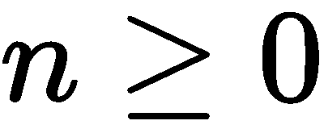
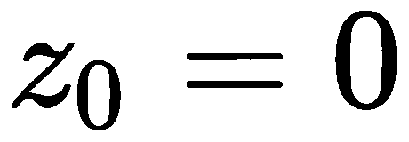
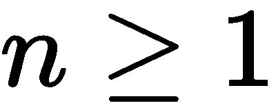
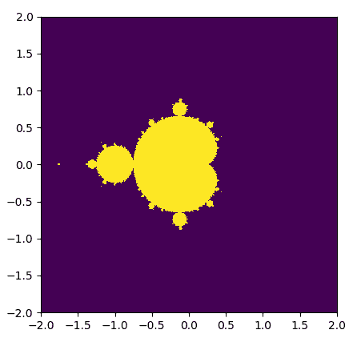
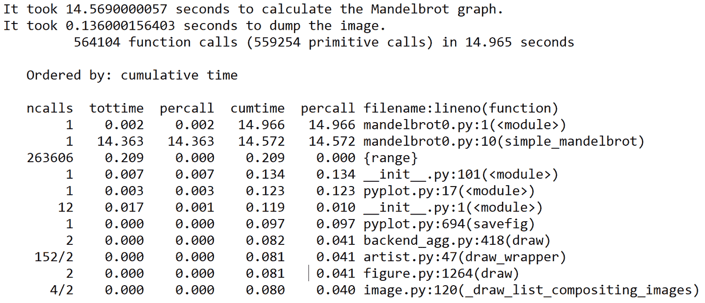

# 第一章：为什么要进行 GPU 编程？

事实证明，除了能够为视频游戏渲染图形外，**图形处理单元**（**GPU**）还为普通消费者提供了一种便捷的方式进行*大规模并行* *计算*——现在普通人可以在当地的电子商店购买一张价值 2000 美元的现代 GPU 卡，将其插入家中的个人电脑，几乎立即就可以用于计算能力，而这种计算能力在 5 年或 10 年前只能在顶级公司和大学的超级计算实验室中获得。近年来，GPU 的开放可访问性在许多方面已经显而易见，这可以通过简要观察新闻来揭示——加密货币挖矿者使用 GPU 生成比特币等数字货币，遗传学家和生物学家使用 GPU 进行 DNA 分析和研究，物理学家和数学家使用 GPU 进行大规模模拟，人工智能研究人员现在可以编程 GPU 来撰写剧本和作曲，而主要的互联网公司，如谷歌和 Facebook，使用带有 GPU 的服务器*农场*进行大规模机器学习任务……等等。

本书主要旨在让您迅速掌握 GPU 编程，以便您也可以尽快开始使用它们的强大功能，无论您的最终目标是什么。我们旨在涵盖如何编程 GPU 的核心要点，而不是提供 GPU 工作的复杂技术细节和原理图。在本书的末尾，我们将提供更多资源，以便您可以进一步专门化，并应用您对 GPU 的新知识。（有关特定所需的技术知识和硬件的进一步细节，请参阅本节后面的内容。）

在本书中，我们将使用**CUDA**，这是 NVIDIA 推出的**通用 GPU**（**GPGPU**）编程框架，最早发布于 2007 年。虽然 CUDA 专为 NVIDIA GPU 而设计，但它是一个成熟稳定的平台，相对容易使用，提供了一套无与伦比的第一方加速数学和人工智能相关库，并且在安装和集成方面几乎没有麻烦。此外，还有现成的标准化 Python 库，如 PyCUDA 和 Scikit-CUDA，使得渴望成为 GPU 程序员的人更容易接触 GPGPU 编程。出于这些原因，我们选择在本书中使用 CUDA。

CUDA 始终发音为 coo-duh，而不是缩写 C-U-D-A！CUDA 最初代表“计算统一设备架构”，但 Nvidia 已经放弃了这个缩写，现在将 CUDA 作为一个大写的专有名词。

我们现在将开始介绍 GPU 编程的旅程，并概述**阿姆达尔定律**。阿姆达尔定律是一种简单但有效的方法，用于估计将程序或算法转移到 GPU 上可以获得的潜在速度增益；这将帮助我们确定是否值得重新编写我们的代码以利用 GPU。然后，我们将简要回顾如何使用*cProfile*模块对我们的 Python 代码进行分析，以帮助我们找到代码中的瓶颈。

本章的学习成果如下：

+   了解阿姆达尔定律

+   在代码的上下文中应用阿姆达尔定律

+   使用*cProfile*模块对 Python 代码进行基本分析

# 技术要求

本章建议安装 Anaconda Python 2.7：

[`www.anaconda.com/download/`](https://www.anaconda.com/download/)

本章的代码也可以在 GitHub 上找到：

[`github.com/PacktPublishing/Hands-On-GPU-Programming-with-Python-and-CUDA`](https://github.com/PacktPublishing/Hands-On-GPU-Programming-with-Python-and-CUDA)

有关先决条件的更多信息，请查看本书的前言；有关软件和硬件要求，请查看[`github.com/PacktPublishing/Hands-On-GPU-Programming-with-Python-and-CUDA`](https://github.com/PacktPublishing/Hands-On-GPU-Programming-with-Python-and-CUDA)中的 README 部分。

# 并行化和阿姆达尔定律

在我们深入了解并发解锁 GPU 的潜力之前，我们首先要意识到它们的计算能力相对于现代英特尔/AMD 中央处理单元（CPU）的优势并不在于它的时钟速度比 CPU 更高，也不在于单个核心的复杂性或特定设计。一个单独的 GPU 核心实际上相当简单，并且与现代单个 CPU 核心相比处于劣势，后者使用了许多花哨的工程技巧，比如分支预测来减少计算的**延迟**。**延迟**指的是执行单个计算的开始到结束的持续时间。

GPU 的强大之处在于它的核心比 CPU 多得多，这意味着**吞吐量**有了巨大的提升。这里的**吞吐量**指的是可以同时执行的计算数量。让我们使用一个类比来更好地理解这意思。GPU 就像一条非常宽的城市道路，设计成可以同时处理许多行驶缓慢的汽车（高吞吐量，高延迟），而 CPU 就像一条狭窄的高速公路，一次只能容纳几辆车，但可以更快地将每辆车送到目的地（低吞吐量，低延迟）。

我们可以通过查看这些新 GPU 有多少核心来了解吞吐量的增加。举个例子，普通的英特尔或 AMD CPU 只有 2 到 8 个核心，而入门级的消费级 NVIDIA GTX 1050 GPU 有 640 个核心，而新的顶级 NVIDIA RTX 2080 Ti 有 4,352 个核心！我们可以利用这种大规模的吞吐量，只要我们知道如何正确地**并行化**任何我们希望加速的程序或算法。通过**并行化**，我们的意思是重写程序或算法，以便我们可以将工作负载并行地在多个处理器上同时运行。让我们从现实生活中想一个类比。

假设你正在建造一座房子，你已经准备好了所有的设计和材料。你雇了一个劳工，你估计需要 100 个小时来建造这座房子。假设这个特定的房子可以以这样的方式建造，即每增加一个劳工，工作就可以完美地分配给他们，也就是说，两个劳工需要 50 个小时，四个劳工需要 25 个小时，十个劳工需要 10 个小时来建造这座房子——建造你的房子所需的时间将是 100 除以你雇佣的劳工数量。这是一个**可并行化的任务**的例子。

我们注意到，这个任务对于两个劳工来说完成的速度是原来的两倍，对于十个劳工来说完成的速度是原来的十倍（也就是说，**并行**完成），而不是一个劳工独自建造房子（也就是说，**串行**完成）——也就是说，如果*N*是劳工的数量，那么速度将是*N*倍。在这种情况下，*N*被称为我们的任务并行化速度的**加速比**。

在我们开始编写给定算法的并行版本之前，我们经常首先估计一下并行化对我们任务可能带来的*潜在* *加速*。这可以帮助我们确定是否值得花费资源和时间来编写我们程序的并行版本。因为现实生活比我们在这里给出的例子更复杂，很明显我们不可能始终完美地并行化每个程序——大多数情况下，我们的程序只有一部分可以很好地并行化，而其余部分将不得不串行运行。

# 使用阿姆达尔定律

我们现在将推导**阿姆达尔定律**，这是一个简单的算术公式，用于估计将一部分串行程序代码并行化到多个处理器上可能带来的潜在速度增益。我们将继续使用我们之前建造房子的类比来做这件事。

上次，我们只考虑了房子的实际物理建造作为整个时间持续时间，但现在，我们还将把设计房子所需的时间考虑在内。假设世界上只有一个人有能力设计你的房子——也就是你——并且你需要 100 小时来设计你的房子的计划。世界上没有其他人能够与你的建筑才华相比，因此这部分任务无法在其他建筑师之间分配，因此无论你拥有什么资源或可以雇佣多少人，设计你的房子都需要 100 小时。因此，如果你只有一名劳工来建造你的房子，建造你的房子所需的整个时间将是 200 小时——你设计它需要 100 小时，一名劳工建造它需要 100 小时。如果我们雇佣两名劳工，这将需要 150 小时——设计房子的时间仍然是 100 小时，而建造将需要 50 小时。很明显，建造房子所需的总时间将是 100 + 100 / *N*，其中*N*是我们雇佣的劳工数量。

现在，让我们退一步思考一下，如果我们只雇用一名劳工来建造房子需要多少时间——我们最终使用这个来确定我们雇用额外劳工时的加速度；也就是说，这个过程变得快了多少倍。如果我们只雇用一名劳工，我们会发现设计和建造房子需要相同的时间——100 小时。因此，我们可以说，设计所花费的时间是.5（50%），建造房子所花费的时间也是.5（50%）——当然，这两部分加起来是 1，也就是 100%。当我们增加劳工时，我们想要与这个进行比较——如果我们有两名劳工，建造的时间减半，因此与我们任务的原始串行版本相比，这将花费.5 + .5/2 = .75（75%）的时间，原始任务的.75 x 200 小时是 150 小时，因此我们可以看到这是有效的。此外，我们可以看到，如果我们有*N*名劳工，我们可以使用公式.5 + .5 / N 来计算我们*并行化*的建造所需的时间百分比。

现在，让我们确定通过增加额外的劳工我们获得的*加速度*。如果有两名劳工，建造一座房子只需要 75%的时间，我们可以取.75 的倒数来确定我们并行化的加速度——也就是说，加速度将是 1 / .75，比我们只有一名劳工时快大约 1.33 倍。在这种情况下，我们可以看到，如果有*N*名劳工，加速度将是 1 / (.5 + .5 / *N*)。

我们知道，随着我们增加越来越多的劳工，.5 / N 会缩小到接近 0，因此我们可以看到在并行化这个任务时，你可以获得的加速度总是有一个上限，即 1 / (.5 + 0) = 2。我们可以将原始串行时间除以估计的最大加速度，以确定此任务将花费的绝对最短时间——200 / 2 = 100 小时。

我们刚刚应用的用于确定并行编程中加速度的原则被称为**阿姆达尔定律**。它只需要知道原始串行程序中可并行执行时间的比例，即*p*，以及我们可用的处理器核心数*N*。

在这种情况下，不可并行化代码的执行时间比例始终为*1-p*，因此我们只需要知道*p*。

我们现在可以使用**阿姆达尔定律**来计算加速度，如下所示：


总之，Amdahl's Law 是一个简单的公式，允许我们粗略（非常粗略）地估计一个可以至少部分并行化的程序的潜在加速。这可以提供一个大致的想法，即是否值得编写特定串行程序的并行版本，前提是我们知道我们可以并行化代码的比例（*p*），以及我们可以在其上运行并行化代码的核心数（*N*）。

# Mandelbrot 集

我们现在准备看一个非常标准的并行计算示例，我们将在本文中稍后重新讨论——一个生成*Mandelbrot 集*图像的算法。让我们首先确切地定义我们的意思。

对于给定的复数*c*，我们为定义一个递归序列，其中和对于。如果|*z[n]*|随着*n*增加到无穷大仍然受到 2 的限制，那么我们将说*c*是 Mandelbrot 集的成员。

回想一下，我们可以将复数可视化为驻留在二维笛卡尔平面上，其中*x*轴代表实部分量，y 轴代表虚部分量。因此，我们可以很容易地用一个非常吸引人（并且众所周知）的图形来可视化 Mandelbrot 集。在这里，我们将在复数笛卡尔平面上用浅色表示 Mandelbrot 集的成员，用深色表示非成员，如下所示：



现在，让我们考虑如何在 Python 中生成这个集合。首先，我们必须考虑一些事情——因为显然我们无法检查每一个复数是否在 Mandelbrot 集中，我们必须选择一个特定的范围进行检查；我们必须确定我们将考虑每个范围内的多少点（*宽度，高度*）；以及我们将检查的|*z[n]*|的最大值（`max_iters`）。我们现在可以准备实现一个生成 Mandelbrot 集图形的函数——在这里，我们通过在*串行*中迭代图中的每一个点来实现这一点。

我们将首先导入 NumPy 库，这是一个我们在本文中将大量使用的数值库。我们在`simple_mandelbrot`函数中实现这里。我们首先使用 NumPy 的`linspace`函数生成一个将充当离散复平面的格点（接下来的代码应该相当简单）：

```py
import numpy as np

def simple_mandelbrot(width, height, real_low, real_high, imag_low, imag_high, max_iters):

     real_vals = np.linspace(real_low, real_high, width)
     imag_vals = np.linspace(imag_low, imag_high, height)

     # we will represent members as 1, non-members as 0.

     mandelbrot_graph = np.ones((height,width), dtype=np.float32)

     for x in range(width):

         for y in range(height):

             c = np.complex64( real_vals[x] + imag_vals[y] * 1j  )           
             z = np.complex64(0)

             for i in range(max_iters):

                 z = z**2 + c

                 if(np.abs(z) > 2):
                     mandelbrot_graph[y,x] = 0
                     break

     return mandelbrot_graph
```

现在，我们想要添加一些代码来将 Mandelbrot 集的图像转储到 PNG 格式文件中，所以让我们在开头添加适当的标头：

```py
from time import time
import matplotlib
# the following will prevent the figure from popping up
matplotlib.use('Agg')
from matplotlib import pyplot as plt
```

现在，让我们添加一些代码来生成 Mandelbrot 集并将其转储到文件中，并使用时间函数来计算这两个操作的时间：

```py
if __name__ == '__main__':

     t1 = time()
     mandel = simple_mandelbrot(512,512,-2,2,-2,2,256, 2)
     t2 = time()
     mandel_time = t2 - t1

     t1 = time()
     fig = plt.figure(1)
     plt.imshow(mandel, extent=(-2, 2, -2, 2))
     plt.savefig('mandelbrot.png', dpi=fig.dpi)
     t2 = time()

     dump_time = t2 - t1

     print 'It took {} seconds to calculate the Mandelbrot graph.'.format(mandel_time)
     print 'It took {} seconds to dump the image.'.format(dump_time)
```

现在让我们运行这个程序（这也可以在 GitHub 存储库的文件夹`1`中的`mandelbrot0.py`文件中找到）：


生成 Mandelbrot 集大约需要 14.62 秒，转储图像大约需要 0.11 秒。正如我们所看到的，我们逐点生成 Mandelbrot 集；不同点的值之间没有相互依赖，因此，这是一个固有的可并行化函数。相比之下，转储图像的代码无法并行化。

现在，让我们从 Amdahl's Law 的角度来分析这个问题。如果我们在这里并行化我们的代码，我们可以得到什么样的加速？总的来说，程序的两部分共计大约需要 14.73 秒才能运行；因为我们可以并行化 Mandelbrot 集的生成，我们可以说可并行化代码的执行时间部分是 *p* = 14.62 / 14.73 = .99。这个程序有 99%的可并行性！

我们可能会得到什么样的加速？嗯，我目前正在使用一台配有 640 个核心的入门级 GTX 1050 GPU 的笔记本电脑；因此，当我们使用这个公式时，我们的*N*将是 640。我们计算速度提升如下：


这绝对非常好，这表明我们值得努力编程使我们的算法使用 GPU。请记住，阿姆达尔定律只是一个非常粗略的估计！当我们将计算卸载到 GPU 时，将会有其他考虑因素，比如 CPU 发送和接收数据到 GPU 的额外时间；或者卸载到 GPU 的算法只能部分并行化。

# 对代码进行性能分析

在前面的例子中，我们看到我们可以使用 Python 中的标准`time`函数来分别计时不同的函数和组件。虽然这种方法对我们的小例子程序效果很好，但对于调用许多不同函数的大型程序来说，这种方法并不总是可行，其中一些函数可能值得我们投入精力并行化，或者甚至在 CPU 上进行优化。我们的目标是找到程序的瓶颈和热点，即使我们在每个函数调用周围使用`time`，我们可能会错过一些东西，或者可能有一些系统或库调用我们甚至没有考虑到，这些调用可能会拖慢速度。在我们考虑重写代码在 GPU 上运行之前，我们必须始终遵循著名的美国计算机科学家唐纳德·克努斯的智慧话语：过早优化是万恶之源。

我们使用所谓的**分析器**来找到代码中的热点和瓶颈。**分析器**将方便地让我们看到程序花费最多时间的地方，并让我们相应地进行优化。

# 使用 cProfile 模块

我们将主要使用*cProfile*模块来检查我们的代码。这个模块是一个标准库函数，包含在每个现代 Python 安装中。我们可以从命令行运行分析器，使用`-m cProfile`，并指定我们要按每个函数花费的累积时间来组织结果，然后用`>`操作符将输出重定向到文本文件中。

这将在 Linux Bash 或 Windows PowerShell 命令行上都可以使用。

现在让我们试一试：


我们现在可以用我们喜欢的文本编辑器查看文本文件的内容。让我们记住，程序的输出将包含在文件的开头：



现在，由于我们没有删除原始示例中对`time`的引用，我们在开头的前两行看到了它们的输出。然后我们可以看到在程序中进行的函数调用总数，以及运行它所花费的累积时间。

随后，我们有一个程序中调用的函数列表，按照累积耗时最长的函数到最短的顺序排列；第一行是程序本身，而第二行是我们程序中的`simple_mandelbrot`函数。（请注意，这里的时间与我们用`time`命令测量的时间一致）。之后，我们可以看到许多与将 Mandelbrot 图形转储到文件相关的库和系统调用，所有这些调用所花费的时间相对较少。我们使用*cProfile*的输出来推断给定程序中的瓶颈在哪里。

# 总结

使用 GPU 而不是 CPU 的主要优势是其增加的吞吐量，这意味着我们可以在 GPU 上同时执行更多*并行*代码，而不是在 CPU 上；GPU 无法使递归算法或非并行化算法变得更快。我们看到一些任务，比如建房子的例子，只能部分并行化——在这个例子中，我们无法加快*设计*房子的过程（在这种情况下本质上是*串行*的），但我们可以通过雇佣更多的工人来加快*施工*的过程（在这种情况下是可并行化的）。

我们使用这个类比来推导阿姆达尔定律，这是一个公式，可以在我们知道可并行代码执行时间百分比以及我们将运行此代码所需的处理器数量时，给出程序潜在加速的粗略估计。然后，我们应用了阿姆达尔定律来分析一个生成曼德勃罗集并将其转储到图像文件的小程序，并且我们确定这将是一个很好的候选者，可以并行化到 GPU 上。最后，我们以简要概述使用*cPython*模块对代码进行性能分析结束；这使我们能够看到程序中的瓶颈在哪里，而无需显式计时函数调用。

现在我们已经有了一些基本概念，并且有了学习 GPU 编程的动力，我们将在下一章中设置基于 Linux 或 Windows 10 的 GPU 编程环境。然后我们将立即进入 GPU 编程的世界，在接下来的章节中，我们将实际编写一个基于 GPU 的曼德勃罗程序的版本，这是我们在本章中看到的。

# 问题

1.  本章的曼德勃罗示例中有三个`for`语句；然而，我们只能并行化前两个。为什么我们不能在所有的`for`循环上并行化呢？

1.  当我们将阿姆达尔定律应用于将串行 CPU 算法卸载到 GPU 时，有什么是阿姆达尔定律没有考虑到的吗？

1.  假设您独家获得了三个全新的绝密 GPU，它们在所有方面都相同，只是核心数量不同——第一个有 131,072 个核心，第二个有 262,144 个核心，第三个有 524,288 个核心。如果您将曼德勃罗示例并行化并卸载到这些 GPU 上（生成一个 512 x 512 像素的图像），第一个 GPU 和第二个 GPU 之间的计算时间会有区别吗？第二个 GPU 和第三个 GPU 之间呢？

1.  在阿姆达尔定律的背景下，您能想到指定某些算法或代码块为*可并行化*存在什么问题吗？

1.  为什么我们应该使用性能分析器而不只是使用 Python 的`time`函数？
