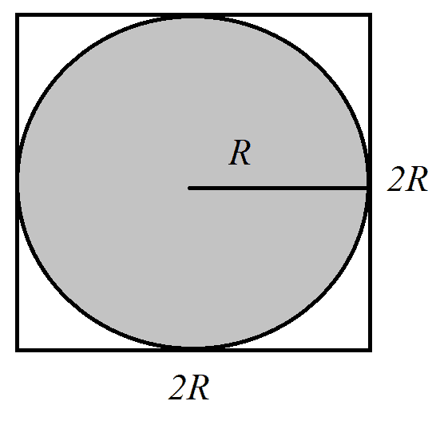
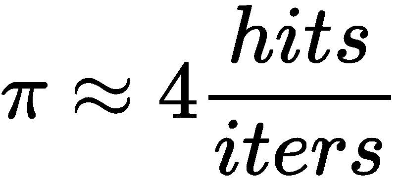
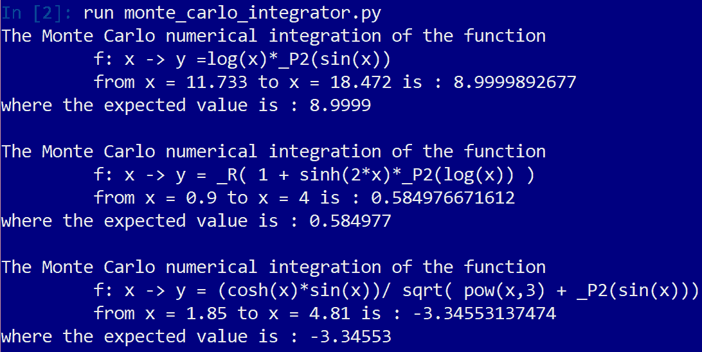

# 第八章：CUDA 设备函数库和 Thrust

在上一章中，我们对通过 Scikit-CUDA 包装器模块在 CUDA 中可用的库进行了相当广泛的概述。我们现在将看一下另外一些库，我们将不得不直接从 CUDA C 中使用这些库，而不是像 Scikit-CUDA 中的包装器那样。我们将首先看一下两个标准库，其中包含我们可以从任何 CUDA C 内核中调用的设备函数 cuRAND 和 CUDA Math API。通过学习如何使用这些库，我们将了解如何在蒙特卡罗积分的上下文中使用这些库。蒙特卡罗积分是一种众所周知的随机方法，可以提供来自微积分的定积分值的估计。我们首先将看一个基本示例，演示如何使用 cuRAND 实现简单的蒙特卡罗方法来对π的值进行基本估计（如众所周知的常数，π=3.14159...），然后我们将着手进行一个更有雄心的项目，我们将构建一个 Python 类，可以对任意数学函数执行定积分，并使用 Math API 创建这样的函数。我们还将看一下如何在设计这个类时有效地使用元编程的一些思想。

然后，我们将再次使用 Thrust C++库来编写一些纯 CUDA 程序。Thrust 是一个提供 C++模板容器的库，类似于 C++标准模板库（STL）中的容器。这将使我们能够以更接近 PyCUDA 的`gpuarray`和 STL 的向量容器的更自然的方式从 C++中操作 CUDA C 数组。这将使我们免受在 CUDA C 中以前不断使用指针（如*mallocs*和*frees*）的困扰。

在本章中，我们将讨论以下主题：

+   理解种子在生成伪随机数列表中的作用

+   在 CUDA 内核中使用 cuRAND 设备函数生成随机数

+   理解蒙特卡罗积分的概念

+   在 Python 中使用基于字典的字符串格式化进行元编程

+   使用 CUDA Math API 设备函数库

+   理解 functor 是什么

+   在纯 CUDA C 编程时使用 Thrust 向量容器

# 技术要求

本章需要具有现代 NVIDIA GPU（2016 年至今）的 Linux 或 Windows 10 PC，并安装了所有必要的 GPU 驱动程序和 CUDA Toolkit（9.0 及以上）。还需要适当的 Python 2.7 安装（如 Anaconda Python 2.7），并安装了 PyCUDA 模块。

本章的代码也可以在 GitHub 上找到，网址为[`github.com/PacktPublishing/Hands-On-GPU-Programming-with-Python-and-CUDA.`](https://github.com/PacktPublishing/Hands-On-GPU-Programming-with-Python-and-CUDA)

有关本章先决条件的更多信息，请查看本书的前言。有关软件和硬件要求，请查看[`github.com/PacktPublishing/Hands-On-GPU-Programming-with-Python-and-CUDA`](https://github.com/PacktPublishing/Hands-On-GPU-Programming-with-Python-and-CUDA)上的 README。

# cuRAND 设备函数库

让我们从 cuRAND 开始。这是一个标准的 CUDA 库，用于在 CUDA 内核中按线程生成伪随机值，通过调用每个线程内核中的设备函数进行初始化和调用。让我们再次强调，这是一个**伪随机**值序列——因为数字硬件始终是确定性的，从不是随机或任意的，我们使用算法从初始**种子值**生成一系列表面上随机的值。通常，我们可以将种子值设置为真正的随机值（例如毫秒级的时钟时间），这将产生一系列*随机*值。这些生成的随机值与由相同种子生成的序列中的先前或未来值没有相关性，尽管当您组合从不同种子生成的值时，可能会出现相关性和重复。因此，您必须小心，希望彼此*随机*的值是由相同的种子生成的。

让我们从`curand_init`的函数原型开始，我们将使用适当的种子进行初始化：

```py
__device__ void curand_init ( unsigned long long seed, unsigned long long sequence, unsigned long long offset, curandState_t *state)
```

在这里，所有的输入都是无符号长整型，在 C 中是无符号（非负值）的 64 位整数。首先，我们可以看到`seed`，这当然是种子值。一般来说，您将使用时钟值或某种变化来设置这个值。然后我们看到一个称为`sequence`的值，正如我们之前所述，cuRAND 生成的值只有在它们由相同的种子值生成时才是真正的数学上相互随机的。因此，如果我们有多个线程使用相同的种子值，我们使用`sequence`来指示当前线程使用长度为 2¹⁹⁰的随机数子序列的哪个子序列，而我们使用`offset`来指示从这个子序列的哪个点开始；这将在每个线程中生成所有数学上相互随机且没有相关性的值。最后，最后一个参数是指向`curandState_t`对象的指针；这将跟踪我们在伪随机数序列中的位置。

初始化类对象后，您将通过调用适当的设备函数从适当的随机分布生成随机值。最常见的两种分布是均匀分布和正态（高斯）分布。均匀分布（`curand_uniform`，在 cuRAND 中）是一个输出值在给定范围内都是等概率的函数：也就是说，对于 0 到 1 的均匀分布，值在 0 到 0.1 之间的概率是 10%，或者在 0.9 到 1 之间，或者在任何两个相距 0.1 的点之间。正态分布（`curand_normal`，在 cuRAND 中）具有以特定均值为中心的值，这些值将根据分布的标准差分布在众所周知的钟形曲线上。 （`curand_normal`的默认均值为`0`，标准差为 1，在 cuRAND 中，因此必须手动移位和缩放为其他值。）cuRAND 支持的另一个众所周知的分布是泊松分布（`curand_poisson`），用于对随机事件的发生进行建模。

在接下来的部分中，我们将主要研究如何在均匀分布的背景下使用 cuRAND，因为它们适用于蒙特卡罗积分。鼓励有兴趣学习如何使用 cuRAND 更多功能的读者查看 NVIDIA 的官方文档。

# 用蒙特卡洛法估算π

首先，我们将运用我们对 cuRAND 的新知识来估算众所周知的数学常数π，或圆周率，这当然是永不停止的无理数 3.14159265358979...

然而，要得到一个估计值，我们需要花点时间思考这意味着什么。让我们想想一个圆。记住，圆的半径是从圆心到圆上任意一点的长度；通常用 *R* 表示。直径被定义为 *D = 2R*，周长 *C* 是围绕圆的长度。然后，π 被定义为 *π = C / D*。我们可以使用欧几里得几何来找到圆的面积公式，结果是 *A = πR²*。现在，让我们考虑一个半径为 *R* 的圆被内切在边长为 *2R* 的正方形中：



因此，当然，我们知道正方形的面积是 *(2R)² = 4R²*。让我们考虑 *R=1*，这样我们就知道圆的面积恰好是 π，而正方形的面积恰好是 4。让我们进一步假设并声明，圆和正方形都以 (0,0) 为中心。现在，让我们在正方形内取一个完全随机的值 (*x,y*)，并查看它是否落在圆内。我们如何做到这一点？通过应用勾股定理公式：我们通过检查 *x² + y²* 是否小于或等于 1 来做到这一点。让我们用 *iters* 表示我们选择的随机点的总数，用 *hits* 表示命中的次数。

让我们再多想一下：在圆内选择一个点的概率应该与圆的面积与矩形的面积之比成比例；在这里，这是 π / 4。然而，如果我们选择一个非常大的随机点值，注意到我们将得到以下近似值：



这正是我们将估计 π 的方法！在我们能得出合理的 π 估计之前，我们将不得不进行非常多的迭代，但请注意这是多么好的可并行化：我们可以在不同的线程中检查“命中”，将总迭代次数分配给不同的线程。在一天结束时，我们只需将所有线程中的命中总数相加，即可得到我们的估计值。

现在，我们可以开始编写一个程序来进行蒙特卡洛估计。让我们首先导入我们在 PyCUDA 程序中需要的常规 Python 模块，再加上 SymPy 中的一个模块：

SymPy 用于在 Python 中进行完美的 *符号* 计算，因此当我们有非常大的整数时，我们可以使用 `Rational` 函数来对除法进行更准确的浮点估计。

```py
import pycuda.autoinit
import pycuda.driver as drv
from pycuda import gpuarray
from pycuda.compiler import SourceModule
import numpy as np
from sympy import Rational
```

现在，当我们构建内核时，我们必须做一些与正常情况不同的事情：我们需要在 `SourceModule` 中设置选项 `no_extern_c=True`。这会修改代码的编译方式，以便我们的代码可以正确地与 cuRAND 库所需的 C++ 代码链接。然后我们开始编写我们的内核并包含适当的头文件：

```py
ker = SourceModule(no_extern_c=True, source='''
#include <curand_kernel.h>
```

现在，让我们包含一个用于勾股定理距离的宏。由于我们只是检查这个值是否等于或小于 `1`，因此可以省略平方根。我们将使用大量的无符号 64 位整数，因此让我们再定义一个宏，以免我们一遍又一遍地输入 `unsigned long long`：

```py
#define _PYTHAG(a,b) (a*a + b*b)
#define ULL unsigned long long
```

现在，我们可以设置我们的内核。根据 PyCUDA 的性质，这将不得不编译为接口的真正的 C 函数，而不是 C++ 函数。我们可以通过 `extern "C"` 块来实现这一点：

```py
extern "C" {
```

现在，我们可以定义我们的内核。我们将有两个参数：一个是 `iters`，它是每个线程的总迭代次数，另一个是一个数组，将保存每个线程的命中总数。我们将需要一个 `curandState` 对象：

```py
__global__ void estimate_pi(ULL iters, ULL * hits)
{
    curandState cr_state;
```

让我们用一个名为 `tid` 的整数来保存全局线程 ID：

```py
int tid = blockIdx.x * blockDim.x + threadIdx.x;
```

`clock()`是一个设备函数，输出当前时间到毫秒。我们可以将`tid`添加到`clock()`的输出中，以获得每个线程的唯一种子。我们不需要使用不同的子序列或偏移量，所以让我们都设置为 0。我们还将在这里仔细地将所有内容强制转换为 64 位无符号整数：

```py
curand_init( (ULL) clock() + (ULL) tid, (ULL) 0, (ULL) 0, &cr_state);
```

让我们设置`x`和`y`值以保存矩形中的随机点：

```py
float x, y;
```

然后我们将迭代`iters`次，看看我们在圆中得到了多少次命中。我们使用`curand_uniform(&cr_state)`生成这些。请注意，我们可以在 0 到 1 之间生成它们，而不是从-1 到 1，因为在`_PYTHAG`宏中对它们进行平方运算将消除任何负值：

```py
for(ULL i=0; i < iters; i++)
 {
     x = curand_uniform(&cr_state);
     y = curand_uniform(&cr_state);

     if(_PYTHAG(x,y) <= 1.0f)
         hits[tid]++;
 }
```

我们现在可以结束并关闭我们的内核，以及`extern "C"`块，最后用另一个`}`括号结束：

```py
return;
}
}
''')
```

现在，让我们用`get_function`将 Python 包装函数传递给我们的内核。我们还将设置块和网格大小：每个块 32 个线程，每个网格 512 个块。让我们计算总线程数，并在 GPU 上设置一个数组来保存所有的命中（当然初始化为 0）：

```py
pi_ker = ker.get_function("estimate_pi")
threads_per_block = 32
blocks_per_grid = 512
total_threads = threads_per_block * blocks_per_grid
hits_d = gpuarray.zeros((total_threads,),dtype=np.uint64)
```

让我们设置每个线程的迭代总数为 2²⁴：

```py
iters = 2**24
```

我们现在可以像往常一样启动内核：

```py
pi_ker(np.uint64(iters), hits_d, grid=(blocks_per_grid,1,1), block=(threads_per_block,1,1))
```

现在，让我们对数组中的命中次数求和，这给我们了总命中次数。让我们还计算数组中所有线程的总迭代次数：

```py
total_hits = np.sum( hits_d.get() )
total = np.uint64(total_threads) * np.uint64(iters)
```

我们现在可以用`Rational`进行估计，就像这样：

```py
est_pi_symbolic =  Rational(4)*Rational(int(total_hits), int(total) )
```

我们现在可以将其转换为浮点值：

```py
est_pi = np.float(est_pi_symbolic.evalf())
```

让我们检查我们的估计与 NumPy 的常数值`numpy.pi`：

```py
print "Our Monte Carlo estimate of Pi is : %s" % est_pi
print "NumPy's Pi constant is: %s " % np.pi
print "Our estimate passes NumPy's 'allclose' : %s" % np.allclose(est_pi, np.pi)
```

我们现在完成了。让我们从 IPython 中运行并检查一下（这个程序也可以在本书的存储库中的`Chapter08`下的`monte_carlo_pi.py`文件中找到）。


# CUDA 数学 API

现在，我们将看一下**CUDA 数学 API**。这是一个库，由设备函数组成，类似于标准 C `math.h`库中的函数，可以从内核中的单个线程调用。这里的一个区别是，单精度和双精度浮点运算被重载，因此如果我们使用`sin(x)`，其中`x`是一个浮点数，sin 函数将产生一个 32 位浮点数作为输出，而如果`x`是一个 64 位双精度浮点数，那么`sin`的输出也将是一个 64 位值（通常，这是 32 位函数的正确名称，但它在末尾有一个`f`，比如`sinf`）。还有其他**内在**函数。内在函数是内置到 NVIDIA CUDA 硬件中的不太准确但更快的数学函数；通常，它们的名称与原始函数相似，只是在前面加上两个下划线—因此，内在的 32 位 sin 函数是`__sinf`。

# 明确积分的简要回顾

现在，我们将在 Python 中使用一些面向对象的编程，设置一个类，我们可以使用蒙特卡洛方法来评估函数的定积分。让我们停下来，谈谈我们的意思：假设我们有一个数学函数（就像你在微积分课上可能看到的那种类型），我们称之为*f(x)*。当我们在笛卡尔平面上在点*a*和*b*之间绘制它时，它可能看起来像这样：


现在，让我们仔细回顾一下定积分的确切含义——让我们将这个图中的第一个灰色区域表示为*I*，第二个灰色区域表示为*II*，第三个灰色区域表示为*III*。请注意，这里的第二个灰色区域是小于零的。这里的*f*的定积分，从*a*到*b*，将是值*I - II + III*，我们将在数学上表示为。一般来说，从*a*到*b*的定积分就是所有在*f*函数和 x 轴之间的总“正”区域的总和，其中 y > 0，减去所有在*f*函数和 x 轴之间的总“负”区域的总和，其中 y < 0，位于*a*和*b*之间。

有许多方法可以计算或估计两点之间函数的定积分。 在微积分课程中可能见过的一种方法是找到一个封闭形式的解：找到*f*的反导数*F*，并计算*F(b) - F(a)*。 然而，在许多领域，我们将无法找到确切的反导数，而必须以数值方式确定定积分。 这正是蒙特卡罗积分的想法：我们在*a*和*b*之间的许多随机点上评估*f*，然后使用这些点来估计定积分。

# 使用蒙特卡罗方法计算定积分

我们现在将使用 CUDA Math API 来表示任意数学函数*f*，同时使用 cuRAND 库来实现蒙特卡罗积分。 我们将使用**元编程**来实现这一点：我们将使用 Python 从代码模板生成设备函数的代码，这将插入适当的蒙特卡罗核心以进行积分。

这里的想法是它看起来和行为类似于我们在 PyCUDA 中看到的一些元编程工具，比如`ElementwiseKernel`。

让我们首先将适当的模块导入到我们的新项目中：

```py
import pycuda.autoinit
import pycuda.driver as drv
from pycuda import gpuarray
from pycuda.compiler import SourceModule
import numpy as np
```

我们将使用 Python 中称为**基于字典的字符串格式化**的技巧。 让我们在继续之前花一分钟来了解一下。 假设我们正在编写一段 CUDA C 代码，并且我们不确定是否希望特定的变量集是 float 还是 double；也许看起来像这样：`code_string="float x, y; float * z;"`。 我们实际上可能希望格式化代码，以便我们可以随时在浮点数和双精度之间切换。 让我们将字符串中所有对`float`的引用更改为`%(precision)s`—`code_string="%(precision)s x, y; %(precision)s * z;"`。 现在，我们可以设置一个适当的字典，它将用`double`交换`%(presision)s`，即`code_dict = {'precision' : 'double'}`，并使用`code_double = code_string % code_dict`获取新的双精度字符串。 让我们看一下：


现在，让我们想一想我们想要我们的新蒙特卡洛积分器如何工作。 我们还将使其接受一个使用 CUDA Math API 编写的数学方程的字符串，以定义我们想要积分的函数。 然后，我们可以使用我们刚学到的字典技巧将这个字符串嵌入到代码中，并使用它来积分任意函数。 我们还将使用模板在`float`和`double`精度之间进行切换，根据用户的自由裁量。

我们现在可以开始我们的 CUDA C 代码：

```py
MonteCarloKernelTemplate = '''
#include <curand_kernel.h>
```

我们将保留以前的无符号 64 位整数宏`ULL`。 让我们为 x 的倒数（`_R`）和平方（`_P2`）定义一些新的宏：

```py
#define ULL unsigned long long
#define _R(z) ( 1.0f / (z) )
#define _P2(z) ( (z) * (z) )
```

现在，让我们定义一个设备函数，我们的方程字符串将插入其中。 当我们必须从字典中交换文本时，我们将使用`math_function`值。 我们将有另一个值称为`p`，表示精度（将是`float`或`double`）。 我们将称这个设备函数为`f`。 我们将在函数的声明中放置一个`inline`，这将节省我们一些时间，因为从核心调用时会有一些分支：

```py
__device__ inline %(p)s f(%(p)s x)
{
    %(p)s y;
    %(math_function)s;
    return y;
}
```

现在，让我们考虑一下这将如何工作——我们声明一个名为`y`的 32 位或 64 位浮点值，调用`math_function`，然后返回`y`。 `math_function`，如果它是对输入参数`x`进行操作并将某个值设置为`y`的一些代码，那么这只有意义。 让我们记住这一点，然后继续。

我们现在将开始编写我们的蒙特卡洛积分核。 让我们记住，我们必须使用`extern "C"`关键字使我们的 CUDA 核可从普通 C 中访问。 然后我们将设置我们的核心。

首先，我们将用`iters`指示内核中每个线程应该采样多少随机样本；然后我们用`lo`指示积分的下界（*b*），用`hi`指示上界（*a*），并传入一个数组`ys_out`来存储每个线程的部分积分集合（我们稍后将对`ys_out`求和，以得到从主机端的`lo`到`hi`的完整定积分值）。再次注意我们将精度称为`p`：

```py
extern "C" {
__global__ void monte_carlo(int iters, %(p)s lo, %(p)s hi, %(p)s * ys_out)
{
```

我们将需要一个`curandState`对象来生成随机值。我们还需要找到全局线程 ID 和线程的总数。由于我们正在处理一维数学函数，因此在一维`x`中设置我们的块和网格参数是有意义的：

```py
curandState cr_state;
int tid = blockIdx.x * blockDim.x + threadIdx.x;
int num_threads = blockDim.x * gridDim.x;
```

现在我们将计算单个线程将处理的`lo`和`hi`之间的面积量。我们将通过将整个积分的长度（即`hi - lo`）除以线程的总数来实现这一点。:

再次注意我们如何使用模板技巧，以便这个值可以是多精度的。

```py
%(p)s t_width = (hi - lo) / ( %(p)s ) num_threads;
```

回想一下，我们有一个名为`iters`的参数；这表示每个线程将采样多少个随机值。我们需要稍后知道样本的密度是多少；也就是说，每单位距离的平均样本数。我们可以这样计算，记得将整数`iters`强制转换为浮点值：

```py
%(p)s density = ( ( %(p)s ) iters ) / t_width;
```

回想一下，我们正在将我们正在积分的区域按线程数进行划分。这意味着每个线程将有自己的起点和终点。由于我们正在为每个线程公平地划分长度，我们可以这样计算：

```py
%(p)s t_lo = t_width*tid + lo;
 %(p)s t_hi = t_lo + t_width;
```

现在我们可以像之前一样初始化 cuRAND，确保每个线程都从自己的个体种子生成随机值：

```py
curand_init( (ULL)  clock() + (ULL) tid, (ULL) 0, (ULL) 0, &cr_state);
```

在开始采样之前，我们需要设置一些额外的浮点值。`y`将保存从`t_lo`到`t_hi`的积分估计的最终值，`y_sum`将保存所有采样值的总和。我们还将使用`rand_val`变量来保存我们生成的原始随机值，`x`来存储我们将要从中采样的区域的缩放随机值：

```py
%(p)s y, y_sum = 0.0f;
%(p)s rand_val, x;
```

现在，让我们循环从我们的函数中取样值，将这些值加入`y_sum`中。需要注意的一点是`curand_uniform`末尾的`%(p_curand)`s——这个函数的 32 位浮点版本是`curand_uniform`，而 64 位版本是`curand_uniform_double`。稍后我们将根据这里使用的精度级别，用`_double`或空字符串来替换它。还要注意我们如何缩放`rand_val`，使得`x`落在`t_lo`和`t_hi`之间，记住 cuRAND 中的随机均匀分布只产生 0 到 1 之间的值：

```py
for (int i=0; i < iters; i++)
{
    rand_val = curand_uniform%(p_curand)s(&cr_state);
    x = t_lo + t_width * rand_val;
    y_sum += f(x);
}
```

现在我们可以通过密度将`y_sum`除以`t_hi`到`t_lo`的子积分的值：

```py
y = y_sum / density;
```

我们将这个值输出到数组中，并关闭我们的 CUDA 内核，以及`extern "C"`，以及最终的闭括号。我们已经写完了 CUDA C，所以我们将用三个引号结束这一部分：

```py
ys_out[tid] = y;
}
}
'''
```

现在我们要做一些不同的事情——我们将设置一个类来处理我们的定积分。让我们称之为`MonteCarloIntegrator`。当然，我们将首先编写构造函数，也就是`__init__`函数。这是我们将输入对象引用`self`的地方。让我们将`math_function`的默认值设置为`'y = sin(x)'`，默认精度为`'d'`，即双精度。我们还将把`lo`的默认值设置为 0，`hi`的默认值设置为π的 NumPy 近似值。最后，我们将有每个线程将采样的随机样本数（`samples_per_thread`）和我们将在其上启动内核的网格大小（`num_blocks`）的值。

让我们从将文本字符串`math_function`存储在`self`对象中开始这个函数，以便以后使用：

```py
def __init__(self, math_function='y = sin(x)', precision='d', lo=0, hi=np.pi, samples_per_thread=10**5, num_blocks=100):

        self.math_function = math_function
```

现在，让我们设置与我们选择的浮点精度相关的值，这将在以后设置我们的模板字典时特别需要，特别是为了存储`lo`和`hi`的值。让我们还在对象中存储`lo`和`hi`的值。如果用户输入无效的数据类型，或者`hi`实际上小于`lo`，让我们确保引发异常错误：

```py
         if precision in [None, 's', 'S', 'single', np.float32]:
             self.precision = 'float'
             self.numpy_precision = np.float32
             self.p_curand = ''
         elif precision in ['d','D', 'double', np.float64]:
             self.precision = 'double'
             self.numpy_precision = np.float64
             self.p_curand = '_double'
         else:
             raise Exception('precision is invalid datatype!')

     if (hi - lo <= 0):
         raise Exception('hi - lo <= 0!')
     else:
         self.hi = hi
         self.lo = lo
```

现在，我们可以设置我们的代码模板字典：

```py
MonteCarloDict = {'p' : self.precision, 'p_curand' : self.p_curand, 'math_function' : self.math_function}
```

现在我们可以使用基于字典的字符串格式生成实际的最终代码，并进行编译。让我们还通过在`SourceModule`中设置`options=['-w']`来关闭`nvcc`编译器的警告：

```py
self.MonteCarloCode = MonteCarloKernelTemplate % MonteCarloDict

self.ker = SourceModule(no_extern_c=True , options=['-w'], source=self.MonteCarloCode)
```

现在，我们将在我们的对象中设置一个函数引用到我们编译的内核，使用`get_function`。在继续之前，让我们保存对象中的剩余两个参数：

```py
self.f = self.ker.get_function('monte_carlo')
self.num_blocks = num_blocks
self.samples_per_thread = samples_per_thread
```

现在，虽然我们需要不同实例的`MonteCarloIntegrator`对象来评估不同数学函数或浮点精度的定积分，但我们可能希望在不同的`lo`和`hi`边界上评估相同的积分，改变线程/网格大小，或者改变我们在每个线程上取样的数量。幸运的是，这些都是容易进行的修改，并且都可以在运行时进行。

我们将设置一个特定的函数来评估给定对象的积分。我们将这些参数的默认值设置为在调用构造函数时存储的值：

```py
def definite_integral(self, lo=None, hi=None, samples_per_thread=None, num_blocks=None):
    if lo is None or hi is None:
        lo = self.lo
        hi = self.hi
    if samples_per_thread is None:
        samples_per_thread = self.samples_per_thread
    if num_blocks is None:
        num_blocks = self.num_blocks
        grid = (num_blocks,1,1)
    else:
        grid = (num_blocks,1,1)

    block = (32,1,1)
    num_threads = 32*num_blocks
```

我们可以通过设置一个空数组来存储部分子积分并启动内核来完成这个函数。然后我们需要对子积分求和以获得最终值，然后返回：

```py
self.ys = gpuarray.empty((num_threads,) , dtype=self.numpy_precision)

self.f(np.int32(samples_per_thread), self.numpy_precision(lo), self.numpy_precision(hi), self.ys, block=block, grid=grid)

self.nintegral = np.sum(self.ys.get() )

return np.sum(self.nintegral)
```

我们已经准备好尝试这个了。让我们只是设置一个具有默认值的类——这将从 0 到*π*积分`y = sin(x)`。如果您记得微积分，*sin(x)*的反导数是*-cos(x)*，所以我们可以这样评估定积分：


因此，我们应该得到一个接近 2 的数值。让我们看看我们得到了什么：


# 编写一些测试用例

现在，我们终于将看到如何使用 CUDA Math API 通过`math_function`参数编写一些测试用例来测试我们的类。如果您有 C/C++标准数学库的经验，这将会相当简单。同样，这些函数是重载的，这样当我们在单精度和双精度之间切换时，我们就不必更改任何名称。

我们已经看到了一个例子，即*y = sin(x)*。让我们尝试一些更有雄心的东西：


我们将从*a=*11.733 积分到*b=*18.472，然后检查我们的蒙特卡洛积分器的输出与另一个来源的已知值进行比较。在这里，Mathematica 指出这个定积分的值是 8.9999，所以我们将与其进行比较。

现在，让我们考虑如何表示这个函数：这里，*log*指的是自然对数（也称为*ln*），在 Math API 中就是`log(x)`。我们已经设置了一个宏来表示平方，所以我们可以用`_P2(sin(x))`来表示*sin²(x)*。现在我们可以用`y = log(x)*_P2(sin(x))`来表示整个函数。

让我们使用以下方程，从*a=.9*积分到*b=4*：


记住，`_R`是我们设置的倒数宏，我们可以这样用 Math API 来写这个函数：

```py
'y = _R( 1 + sinh(2*x)*_P2(log(x)) )' 
```

在我们继续之前，让我们注意到 Mathematica 告诉我们这个定积分的值是.584977。

让我们再检查一个函数。让我们有点雄心勃勃地说它是这样的：


我们可以将这表示为`'y = (cosh(x)*sin(x))/ sqrt( pow(x,3) + _P2(sin(x)))'`；自然地，`sqrt`是分母中的平方根，`pow`允许我们取任意幂的值。当然，`sin(x)`是*sin(x)*，`cosh(x)`是*cosh(x)*。我们从*a*=1.85 积分到*b*=4.81；Mathematica 告诉我们这个积分的真实值是-3.34553。

我们现在准备检查一些测试用例，并验证我们的蒙特卡洛积分是否有效！让我们迭代一个列表，其第一个值是指示函数（使用 Math API）的字符串，第二个值指示积分的下限，第三个值指示积分的上限，最后一个值指示用 Mathematica 计算出的预期值：

```py
if __name__ == '__main__':

    integral_tests = [('y =log(x)*_P2(sin(x))', 11.733 , 18.472, 8.9999), ('y = _R( 1 + sinh(2*x)*_P2(log(x)) )', .9, 4, .584977), ('y = (cosh(x)*sin(x))/ sqrt( pow(x,3) + _P2(sin(x)))', 1.85, 4.81, -3.34553) ]
```

我们现在可以迭代这个列表，看看我们的算法与 Mathematica 相比效果如何：

```py
for f, lo, hi, expected in integral_tests:
    mci = MonteCarloIntegrator(math_function=f, precision='d', lo=lo, hi=hi)
    print 'The Monte Carlo numerical integration of the function\n \t f: x -> %s \n \t from x = %s to x = %s is : %s ' % (f, lo, hi, mci.definite_integral())
    print 'where the expected value is : %s\n' % expected
```

现在就运行这个：



这也可以在本书存储库的`Chapter08`目录下的`monte_carlo_integrator.py`文件中找到。

# CUDA Thrust 库

我们现在将看一下 CUDA Thrust 库。这个库的核心特性是一个高级向量容器，类似于 C++自己的向量容器。虽然这听起来可能很琐碎，但这将使我们在 CUDA C 中编程时更少地依赖指针、malloc 和 free。与 C++向量容器一样，Thrust 的向量容器会自动处理元素的调整大小和连接，并且借助 C++析构函数的魔力，*释放*也会在 Thrust 向量对象超出范围时自动处理。

Thrust 实际上提供了两个向量容器：一个用于主机端，一个用于设备端。主机端的 Thrust 向量与 STL 向量几乎相同，主要区别在于它可以更轻松地与 GPU 交互。让我们用适当的 CUDA C 代码写一点代码，以了解它是如何工作的。

让我们从包含语句开始。我们将使用主机和设备端向量的头文件，并且还将包括 C++的`iostream`库，这将允许我们在终端上执行基本的 I/O 操作：

```py
#include <thrust/host_vector.h>
#include <thrust/device_vector.h>
#include <iostream>
```

让我们只使用标准的 C++命名空间（这样我们在检查输出时就不必输入`std::`分辨率运算符）：

```py
using namespace std;
```

我们现在将制作我们的主函数，并在主机端设置一个空的 Thrust 向量。同样，这些都是 C++模板，所以我们必须在声明时使用`< >`括号选择数据类型。我们将把这设置为一个整数数组：

```py
int main(void)
{
 thrust::host_vector<int> v;
```

现在，让我们通过使用`push_back`在`v`的末尾添加一些整数，就像我们用常规 STL 向量一样：

```py
v.push_back(1);
v.push_back(2);
v.push_back(3);
v.push_back(4);
```

我们现在将迭代向量中的所有值，并输出每个值：

这里的输出应该是`v[0] == 1`到`v[3] == 4`。

```py
for (int i = 0; i < v.size(); i++)
    cout << "v[" << i << "] == " << v[i] << endl;
```

到目前为止，这可能看起来很琐碎。让我们在 GPU 上设置一个 Thrust 向量，然后将内容从`v`复制过去：

```py
thrust::device_vector<int> v_gpu = v;
```

是的，就这样了——只有一行，我们就完成了。现在主机上的`v`的所有内容都将被复制到设备上的`v_gpu`！（如果这让你感到惊讶，请再看一下第六章，*调试和分析您的 CUDA 代码*，想想在这之前我们需要多少行。）

让我们尝试在我们的新 GPU 向量上使用`push_back`，看看我们是否可以将另一个值连接到它上面：

```py
v_gpu.push_back(5);
```

我们现在将检查`v_gpu`的内容，如下所示：

```py
for (int i = 0; i < v_gpu.size(); i++)
    std::cout << "v_gpu[" << i << "] == " << v_gpu[i] << std::endl;
```

这部分应该输出`v_gpu[0] == 1`到`v_gpu[4] == 5`。

再次感谢这些对象的析构函数，我们不必进行任何清理工作，释放任何已分配内存的块。现在我们可以从程序中返回，我们完成了：

```py
    return 0;
}
```

# 在 Thrust 中使用函数对象

让我们看看如何在 Thrust 中使用称为**functors**的概念。在 C++中，**functor**是一个看起来和行为像函数的类或结构对象；这让我们可以使用看起来和行为像函数的东西，但可以保存一些不必每次使用时都设置的参数。

让我们用适当的包含语句开始一个新的 Thrust 程序，并使用标准命名空间：

```py
#include <thrust/host_vector.h>
#include <thrust/device_vector.h>
#include <iostream>
using namespace std;
```

现在，让我们设置一个基本的函数对象。我们将使用`struct`来表示这个函数对象，而不是`class`。这将是一个加权乘法函数，我们将在一个名为`w`的浮点数中存储权重。我们将创建一个构造函数，用默认值`1`设置权重：

```py
struct multiply_functor {
 float w;
 multiply_functor(float _w = 1) : w(_w) {}
```

现在，我们将使用`operator()`关键字设置我们的函数对象；这将告诉编译器将以下代码块视为此类型对象的`default`函数。请记住，这将在 GPU 上作为设备函数运行，因此我们在整个代码块之前加上`__device__`。我们用括号指示输入，并输出适当的值，这只是一个缩放的倍数。现在，我们可以用`};`关闭我们的结构的定义：

```py
    __device__ float operator() (const float & x, const float & y) { 
        return w * x * y;
     }
};
```

现在，让我们使用这个来制作一个基本的点积函数；回想一下，这需要两个数组之间的逐点乘法，然后是一个`reduce`类型的求和。让我们首先声明我们的函数，并创建一个新的向量`z`，它将保存逐点乘法的值：

```py
float dot_product(thrust::device_vector<float> &v, thrust::device_vector<float> &w ), thrust::device_vector<float> &z)
{
 thrust::device_vector<float> z(v.size());
```

我们现在将使用 Thrust 的`transform`操作，它将对`v`和`w`的输入进行逐点操作，并输出到`z`。请注意，我们将函数对象输入到 transform 的最后一个槽中；通过这样使用普通的闭括号，它将使用构造函数的默认值（w = 1），因此这将作为一个普通的、非加权/缩放的点积：

```py
thrust::transform(v.begin(), v.end(), w.begin(), z.begin(), multiply_functor());
```

我们现在可以使用 Thrust 的 reduce 函数对`z`进行求和。让我们返回这个值：

```py
return thrust::reduce(z.begin(), z.end());
}
```

我们完成了。现在，让我们编写一些测试代码——我们将只计算向量`[1,2,3]`和`[1,1,1]`的点积，这对我们来说很容易检查。（结果将是 6。）

让我们使用`push_back`设置第一个向量`v`：

```py
int main(void)
{
    thrust::device_vector<float> v;
    v.push_back(1.0f);
    v.push_back(2.0f);
    v.push_back(3.0f);
```

现在，我们可以声明一个大小为`3`的向量`w`，并使用 Thrust 的 fill 函数将其默认值设置为`1`，如下所示：

```py
thrust::device_vector<float> w(3);
thrust::fill(w.begin(), w.end(), 1.0f);
```

让我们进行一次检查，确保我们的值被正确设置，通过将它们的值输出到`cout`：

```py
for (int i = 0; i < v.size(); i++)
 cout << "v[" << i << "] == " << v[i] << endl;

for (int i = 0; i < w.size(); i++)
 cout << "w[" << i << "] == " << w[i] << endl;
```

现在，我们可以检查我们的点积的输出，然后从程序中返回：

```py
cout << "dot_product(v , w) == " << dot_product(v,w) << endl;
return 0;
}
```

让我们编译这个程序（在 Linux 或 Windows 的命令行中使用`nvcc thrust_dot_product.cu -o thrust_dot_product`）并运行它：


这个代码也可以在本书存储库的`Chapter08`目录中的`thrust_dot_product.cu`文件中找到。

# 摘要

在本章中，我们看了如何通过选择适当的种子在 cuRAND 中初始化随机数流。由于计算机是确定性设备，它们只能生成伪随机数列表，因此我们的种子应该是真正随机的；通常，将线程 ID 添加到毫秒级的时钟时间中就足够满足大多数目的。

然后，我们看了如何使用 cuRAND 的均匀分布来对 Pi 进行基本估计。然后，我们承担了一个更有雄心的项目，创建一个可以计算任意函数的定积分的 Python 类；我们使用了一些元编程的思想，结合 CUDA Math API 来定义这些`任意`函数。最后，我们简要介绍了 CUDA Thrust 库，它通常用于在 Python 之外编写纯 CUDA C 程序。Thrust 最显著的提供了一个类似于标准 C++ `vector`的`device_vector`容器。这减少了在 CUDA C 中使用指针的一些认知开销。

最后，我们简要介绍了如何使用 Thrust 和适当的函数对象来执行简单的`point-wise`和`reduce`操作，即实现一个简单的点积函数。

# 问题

1.  尝试重写蒙特卡洛积分示例（在`monte_carlo_integrator.py`的`__main__`函数中）以使用 CUDA 的`intrinsic`函数。精度与以前相比如何？

1.  在我们所有的 cuRAND 示例中，我们只使用了均匀分布。你能说出在 GPU 编程中使用正态（高斯）随机分布的一个可能的用途或应用吗？

1.  假设我们使用两个不同的种子生成一个包含 100 个伪随机数的列表。我们应该将它们连接成一个包含 200 个数字的列表吗？

1.  在最后一个示例中，在`multiply_functor`结构体的`operator()`函数定义之前添加`__host__`，现在，看看是否可以直接使用这个函数对象实现一个主机端的点积函数，而不需要任何进一步的修改。

1.  看一下 Thrust `examples`目录中的`strided_range.cu`文件。你能想到如何使用这个来使用 Thrust 实现通用矩阵乘法吗？

1.  在定义一个函数对象时，`operator()`函数的重要性是什么？
