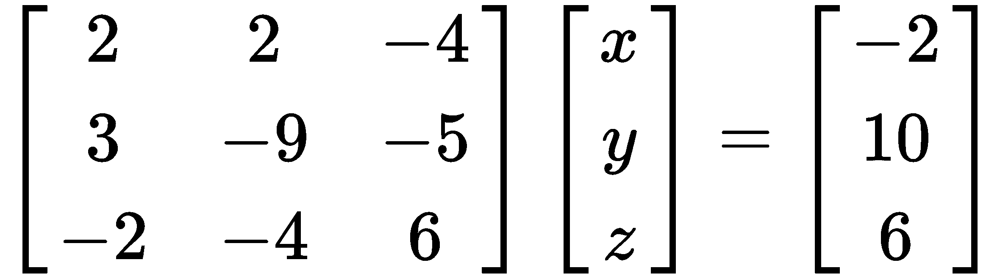
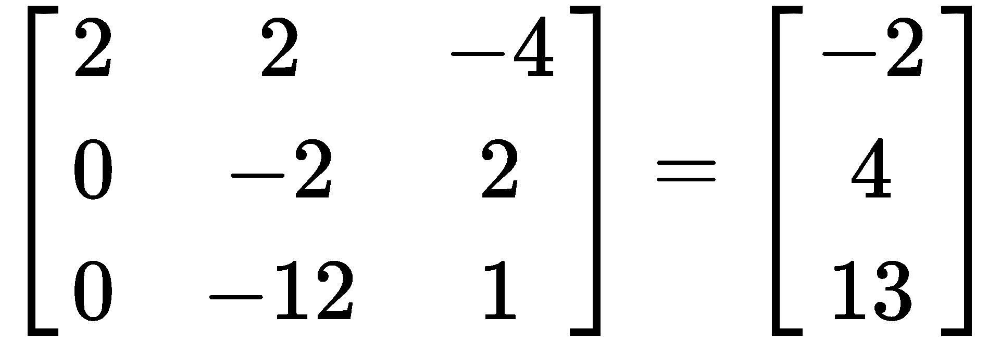
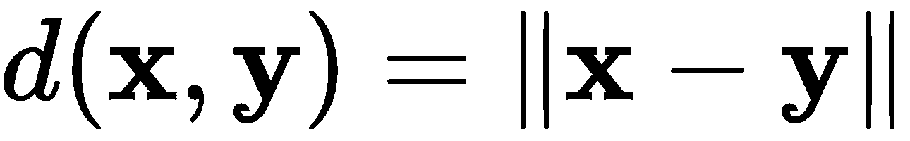

# 第一章：线性代数

在本章中，我们将讲解线性代数的主要概念，这些概念将成为我们学习接下来的各章内容的基础，因此你需要认真听讲。

你必须知道，这些章节无法替代数学教育；它们仅仅是为了帮助你更好地理解深度学习的概念以及各种架构如何工作，并培养你对这些概念的直觉，以便你能成为这个领域的更好实践者。

从本质上讲，代数不过是研究数学符号及其操作规则的学科。代数领域作为数学的统一体，为我们提供了一种思维方式。我们不再使用数字，而是使用字母来表示变量。

然而，线性代数只涉及线性变换和向量空间。它使我们能够通过向量、矩阵和张量表示信息，深入理解线性代数将大大推动你对深度学习的理解。人们常说，只有将一个数学问题转化为线性代数中的计算，它才有可能被解决。这体现了线性代数的强大力量和实用性。

本章将涉及以下主题：

+   比较标量和向量

+   线性方程

+   矩阵运算

+   向量空间与子空间

+   线性映射

+   矩阵分解

# 比较标量和向量

标量是常规数字，如 7、82 和 93,454。它们只有大小，用于表示时间、速度、距离、长度、质量、功、功率、面积、体积等。

另一方面，向量在许多维度上具有大小和方向。我们用向量表示速度、加速度、位移、力和动量等。我们用粗体字表示向量—例如 ***a*** 而不是 *a*—它们通常是多个数字的数组，这些数字中的每一个都是向量的一个元素。

我们用以下方式表示：

这里， 表示向量位于 *n* 维实数空间中，这是通过取  的 *n* 次笛卡尔积得到的；![] 表示每个元素是实数；*i* 是每个元素的位置；最后， 是自然数，表示向量中有多少个元素。

与常规数字一样，你可以对向量进行加法和减法运算。然而，向量有一些限制。

让我们拿之前看到的向量（*x*）和另一个向量（*y*）进行加法运算，它们都位于 ，因此可以得到以下结果：

然而，我们不能将维度不同的向量或标量相加。

请注意，当  在  中时，我们降维到二维（例如，纸张的表面），当 *n = 3* 时，我们降维到三维（现实世界）。

然而，我们可以将标量与向量相乘。设 λ 为任意标量，我们将其与向量  相乘，得到如下关系：

如我们所见，λ 被乘以向量中的每个 *x[i]*。这个操作的结果是，向量按标量的值进行了缩放。

例如，设 ，和 。然后，我们得到如下结果：

虽然这样乘以整数时没问题，但在处理分数时它就不起作用了，但你应该能够猜出它是如何工作的。让我们看一个例子。

令 ，和 。然后，我们得到如下结果：

存在一个非常特殊的向量，我们可以通过将任何向量乘以标量 **0** 来得到。我们将其表示为 **0**，并称其为 **零向量**（一个仅包含零的向量）。

# 线性方程

线性代数的核心是解一组线性方程，称为 **方程组**。许多问题可以表述为线性方程组。

我们有两个方程和两个未知数，如下所示：

两个方程都表示直线。两个方程的解是这两条直线交点的位置。在这种情况下，答案是点 (3, 1)。

但为了我们的目的，在线性代数中，我们将前面的方程写成一个向量方程，如下所示：

这里，**b** 是结果向量。

将点 (3, 1) 代入向量方程，我们得到如下结果：

如我们所见，左边等于右边，因此它实际上是一个解！不过，我个人更喜欢将其写成系数矩阵，形式如下：

使用系数矩阵，我们可以将方程组表示为如下矩阵问题 ，其中列向量 *v* 是变量向量。我们写成如下形式：

。

接下来，我们将以这种格式表示我们所有的问题。

为了更好地理解，我们将分解矩阵 *A* 和向量 *v* 的乘法。最简单的理解方法是将其看作是向量的线性组合。让我们看一下下面的例子，其中有一个 3x3 的矩阵和一个 3x1 的向量：

需要注意的是，矩阵与向量的乘法仅在矩阵的列数等于向量的行数（元素数）时才能进行。

例如，让我们看一下以下矩阵：

由于矩阵的列数等于向量的行数，因此可以进行乘法运算，但以下矩阵由于列数和行数不相等，不能进行乘法：

让我们通过一些向量运算来可视化它们，以帮助我们更直观地理解它们是如何工作的。请看以下截图：

我们之前处理的向量都位于 （二维空间中），并且这些向量的所有组合也将位于 。同样的情况也适用于位于 、 和  中的向量。

还有一种非常重要的向量运算，称为点积，它是一种乘法。让我们取两个任意向量 **v** 和 **w**，并计算它们的点积，如下所示：

以下是乘积：

。

让我们继续，使用之前处理的相同向量，如下所示：

通过计算它们的点积，我们得到了零，这告诉我们这两个向量是垂直的（它们之间有 90° 的角度），如图所示：

最常见的垂直向量例子是表示 *x* 轴、*y* 轴等的向量。在  中，我们将 *x* 轴向量写作 ![]，将 *y* 轴向量写作 ![]。如果我们计算 *i*•*j* 的点积，我们会发现结果为零，因此它们是垂直的。

通过将 *i* 和 *j* 组合成一个 2x2 矩阵，我们得到以下单位矩阵，这是一个非常重要的矩阵：

以下是我们在求解类型为  的线性方程时可能遇到的几种情况：

+   让我们考虑矩阵![]和方程![]以及![]。如果我们进行代数运算并将第一个方程乘以 3，我们得到![]。但是第二个方程等于零，这意味着这两个方程没有交点，因此没有解。当一个列向量依赖于另一个列向量——即它是另一个列向量的倍数时，![]和![]的所有组合都位于同一方向。然而，由于![]不是这两个列向量的组合，并且不在同一条直线上，它不能是方程的解。

+   我们采用之前相同的矩阵，但这次是![]。由于**b**在这条线上，并且是依赖向量的组合，因此存在无限多个解。我们说**b**在矩阵 A 的列空间中。虽然只有一种特定的**v**组合能够产生**b**，但存在无限多的列向量组合可以得到零向量（**0**）。例如，对于任意值*a*，我们有以下等式：

这引出了另一个非常重要的概念，即完全解。完全解是所有可能的产生![]的方式。我们将其表示为![]，其中![]。

# 求解 n 维空间中的线性方程组

现在我们已经处理了二维线性方程组并理解了它们，接下来我们进一步研究三维方程组。

之前，我们的方程在二维空间（*xy*平面）中产生了曲线。现在，我们将处理的方程将在三维空间（*xyz*平面）中产生平面。

让我们取一个任意的 3x3 矩阵，如下所示：

从之前处理二维线性方程组时我们知道，我们的解**b**，像以前一样，是三个列向量的线性组合，因此有![]。

方程![]（方程 1）产生一个平面，方程![]（方程 2）和![]（方程 3）也分别产生平面。

当两平面相交时，它们会在一条直线上相交；然而，当三平面相交时，它们会在一个点上相交。这个点就是向量![]，它是我们问题的解。

然而，如果三个平面没有在一个点相交，那么线性方程就没有解。解决线性方程的这个概念可以扩展到更多的维度。

假设我们现在有一个包含 15 个线性方程和 15 个未知数的系统。我们可以使用前述方法，并根据该方法，我们需要找到满足所有 15 个方程的点——也就是它们的交点（如果存在的话）。

它看起来将是这样的：

正如你所见，我们需要处理很多方程，而且维度越大，解起来就越困难。

# 使用消元法解线性方程

解决线性方程的一种最佳方法是通过一种系统化的方法，称为**消元法**。这是一种允许我们系统地消去变量并通过代入法解方程的方法。

让我们来看两个包含两个变量的方程，如下所示：

消元后，结果变为如下：

如我们所见，*x* 变量不再出现在第二个方程中。我们可以将 *y* 值代入第一个方程，解出 *x*。这样，我们得到 *x = 3* 和 *y = 1*。

我们称之为**三角形分解**。它有两种类型——下三角矩阵和上三角矩阵。我们通过一种叫做**回代法**的过程，从上到下解决上三角矩阵系统，这种方法适用于任何大小的系统。

虽然这是一个有效的方法，但并非万无一失。我们可能会遇到方程比变量多，或者变量比方程多的情况，这种情况是无法解的。或者，我们可能遇到像 *0x = 7* 这样的情况，正如我们所知，除以零是无法进行的。

让我们解决以下三个包含三个变量的方程：

我们将使用上三角形分解法并逐一消去变量，首先是 *y*，然后是 *z*。让我们首先将其表示为矩阵形式，如下所示：

为了简化问题并使其更易理解，我们将忽略***v***，即列向量，并得到以下结果：

然后，交换第二行和第三行，如下所示：

然后，将第二行与第一行相加，以消去第二行中的第一个值，如下所示：

接下来，将第一行乘以 3/2，并从第三行中减去，如下所示：

最后，将第二行乘以 6 并从第三行中减去，如下所示：

如你所见，矩阵中的值现在形成一个指向上方的三角形，这就是为什么我们称其为上三角矩阵。通过将值代入之前的方程并反向求解（从下到上），我们可以求得：![]，![]，以及![]。

总结来说，变成了，如下所示：

**注意**：在三角形分解矩阵的对角线上方的值被称为枢轴，当矩阵分解时，对角线下方的值全部为零。

为了验证我们找到的解是否正确，我们使用找到的*x*、*y*和*z*值来解这个方程：，像这样：

然后变成了如下方程：

正如我们所看到的，左侧等于右侧。

上三角分解后，任意一个 4x4 矩阵将会是这样的：

我们可以进一步分解上三角矩阵，直到得到一个仅包含对角线上的枢轴值，其他位置为零的矩阵。这个得到的矩阵**P**基本上完全解决了问题，无需进行前向或后向代入，结果如下所示：

但正如你所看到的，从**A**到**P**的过程中涉及了很多步骤。

还有一种非常重要的分解方法，叫做**下三角-上三角** (**LU 分解**)。其方法是将**A**分解为一个上三角矩阵**U**，并将高斯消元的步骤记录在下三角矩阵**L**中，最终得到如下结果：![]。

让我们重新审视之前进行的上三角矩阵分解，并将其转化为 LU 分解的形式，像这样：

如果我们将右侧的两个矩阵相乘，就能得到原始矩阵**A**。但是我们是怎么得到这个结果的呢？让我们一步步来看：

1.  我们从开始，得出如下结论：

1.  我们在原本是单位矩阵的*l[2,1]*位置上加上-1，以表示操作（第二行）-( -1 )(第一行)，因此它变成了如下所示：

1.  然后我们将![]加到*l[3,1]*的位置，表示![]操作，结果变成了如下所示：

1.  然后，我们将 6 加到矩阵的*l[3,2]*位置上，表示操作（行 3）-6（行 2），结果如下：

这是我们之前看到的 LU 分解矩阵。

你现在可能会想，这与解有什么关系，这个问题非常有效。消去法通常效果不错，但我们必须将对**A**做的所有操作同样应用于***b**，并且这涉及到额外的步骤。然而，LU 分解仅应用于**A**。

现在，让我们来看一下如何使用这个方法解线性方程组。

为了简化，我们省略了变量向量，直接将**A**和**b**写成如下：

但即便如此，随着推导的进行，这样写会变得繁琐，因此为了简化，我们将以如下方式书写：

然后我们两边同时乘以，得到以下结果：

这告诉我们，并且我们已经从之前的方程得知。通过回代法，我们可以求解出向量**v**。

在前面的例子中，你可能注意到一些我还未介绍的符号，但不用担心——我们将在下一节中观察所有必要的符号和操作。

# 矩阵运算

现在我们已经理解了如何解类型为的线性方程组，即我们将矩阵与列向量相乘，接下来我们将探讨如何进行一个或多个矩阵的运算。

# 矩阵加法

与标量和向量类似，有时我们需要将两个或多个矩阵相加，过程相当直接。我们以两个矩阵*A*和*B*为例，将它们相加：

需要注意的是，我们只能相加具有相同维度的矩阵，正如你可能已经注意到的，我们是按元素对矩阵进行加法运算的。

# 矩阵乘法

到目前为止，我们只进行了矩阵与列向量的乘法运算。但现在，我们将矩阵*A*与另一个矩阵*B*相乘。

这里列出了四个简单的规则，帮助我们进行矩阵乘法：

+   首先，当矩阵*A*的列数等于矩阵*B*的行数时，我们才能进行矩阵的乘法运算。

+   其次，矩阵*A*的第一行与矩阵*B*的第一列相乘，得到矩阵*AB*中的第一个元素，依此类推。

+   第三，当进行乘法运算时，顺序非常重要——具体来说，*AB* ≠ *BA*。

+   最后，位于第 *i* 行，第 *j* 列的元素是矩阵 *A* 的第 *i* 行与矩阵 *B* 的第 *j* 列的乘积。

让我们将一个任意的 4x5 矩阵与一个任意的 5x6 矩阵相乘，如下所示：

这将得到一个 4x6 的矩阵，如下所示：

从中我们可以推导出，一般来说，以下结论成立：

让我们将以下两个矩阵相乘，如下所示：

 和 

这将得到如下矩阵：

。

**注意**：在这个例子中，矩阵 *B* 是单位矩阵，通常表示为 *I*。

单位矩阵在矩阵乘法中有两个独特的性质。当它与任何矩阵相乘时，返回原始矩阵不变，并且乘法的顺序不影响结果——所以，*AI = IA = A*。

例如，假设我们使用之前的矩阵 *A*，并将其与另一个矩阵 *B* 相乘，如下所示：

另一个非常特殊的矩阵是逆矩阵，表示为 *A^(-1)*。当我们将 *A* 与 *A^(-1)* 相乘时，我们得到 *I*，即单位矩阵。

如前所述，乘法的顺序很重要。我们必须保持矩阵的顺序，但也有一些灵活性。正如我们在以下方程中看到的，括号可以移动：

这是矩阵运算的第一条法则，称为 **结合律**。

以下是三条重要的法则，必须遵守：

+   **交换律**：![]

+   **分配律**：![] 或 ![]

+   **结合律**：![]

作为证明 *AB ≠ BA* 的例子，让我们看一下以下示例：

这清楚地证明了这两个结果是不同的。

我们知道可以将数字进行幂运算，但我们也可以将矩阵进行幂运算。

如果我们将矩阵 *A* 提升到 *p* 次幂，我们得到以下结果：

（将矩阵乘以自己 *p* 次）

矩阵的幂运算还有两个额外的法则—![] 和 ![]。

# 逆矩阵

让我们重新审视逆矩阵的概念，并深入了解它们。我们之前知道 *AA^(-1)* = *I*，但并不是每个矩阵都有逆矩阵。

在求逆矩阵时，我们需要遵循一些规则，具体如下：

+   只有通过上三角或下三角分解的过程，得到所有主元值在对角线上时，才存在逆矩阵。

+   如果矩阵是可逆的，它只有一个唯一的逆矩阵——也就是说，如果 *AB* = *I* 且 *AC* = *I*，则 *B* = *C*。

+   如果 *A* 可逆，那么解 *Av* = *b* 时，我们可以两边同时乘以 *A^(-1)*，得到 *AA^(-1)v* = *A^(-1)b*，最终得到 *A^(-1)b*。

+   如果 *v* 非零且 *b* = 0，那么该矩阵没有逆矩阵。

+   2 x 2 矩阵只有在 *ad* - *bc* ≠ 0 时才可逆，具体规则如下：

而 *ad* - *bc* 被称为 **行列式**。 *A^(-1)* 涉及将矩阵中的每个元素除以行列式。

+   最后，如果矩阵的对角线有零值，则它是不可逆的。

有时，我们可能需要求两个矩阵的乘积的逆矩阵，但只有当两个矩阵本身都是可逆的时候才可能（遵循之前的规则）。

例如，假设我们有两个矩阵 A 和 B，它们都是可逆的。然后， ![]，因此 ![]。

**注意**：请密切注意逆矩阵的顺序——它也必须遵循顺序。左侧是右侧的镜像。

# 矩阵转置

假设我们有一个矩阵 *A*。如果该矩阵的转置是 *B*，那么 *B* 的维度为 ，如此： ![]。 这里是矩阵 *A*：

然后，矩阵 *B* 如下所示：

。

本质上，我们可以将 *A* 的列看作转置矩阵 *B* 的行。

我们通常将 *A* 的转置写作 *A^T*。

对称矩阵是一种特殊类型的矩阵。它是一个 *n×n* 的矩阵，当转置后，它与转置前完全相同。

以下是逆矩阵和转置的性质：

+   ![]

+   ![]

+   ![]

+   ![]

+   ![]

+   ![]

<q>如果 A 是可逆矩阵，那么 A^T 也是可逆的，因此 (A^(-1))^T = (A^T)^(-1) = A^(-T)。</q>

# 排列

在解线性方程组的例子中，我们交换了第 2 行和第 3 行的位置。这被称为 **排列**。

在进行三角分解时，我们希望将主元值放在矩阵的对角线上，但这并非每次都会发生——事实上，通常不会。所以，取而代之的是，我们交换行，以便将主元值放在我们想要的位置。

但这并不是它们唯一的应用场景。我们还可以用它们通过标量值对单独的行进行缩放，或将行加到其他行，或从其他行中减去行。

让我们从一些基本的置换矩阵开始，这些矩阵通过交换单位矩阵的行得到。通常，我们有 *n!* 种可能的置换矩阵，可以从一个 *n*×*n* 的单位矩阵中构建。在这个例子中，我们使用的是 3×3 矩阵，因此我们有六个置换矩阵，它们如下：

+   ![] 这个矩阵对它所应用的矩阵没有任何改变。

+   ![] 这个矩阵交换它所应用的矩阵的第二行和第三行。

+   ![] 这个矩阵交换它所应用的矩阵的第一行和第二行。

+   ![] 这个矩阵将第二行和第三行上移一行，并将第一行移至第三行的位置。

+   ![] 这个矩阵将第一行和第二行下移一行，并将第三行移到第一行的位置。

+   ![] 这个矩阵交换它所应用的矩阵的第一行和第三行。

需要注意的是，置换矩阵有一个特别迷人的性质，即如果我们有一个矩阵  并且它是可逆的，那么存在一个置换矩阵，当它作用于 *A* 时，会得到 *A* 的 LU 分解。我们可以这样表示：

# 向量空间和子空间

在本节中，我们将探讨向量空间和子空间的概念。这些对我们理解线性代数非常重要。实际上，如果我们不理解向量空间和子空间，我们就无法真正理解如何解决线性代数问题。

# 空间

向量空间是线性代数的基本设置之一，正如名称所示，它们是所有向量所在的空间。我们将向量空间表示为 V。

思考维度最简单的方式是计算列向量中的元素数量。假设我们有 ![]，那么 。  是一个直线，  是所有可能的点在 *xy* 平面上，  是所有可能的点在 *xyz* 平面上——即三维空间，以此类推。

以下是一些关于向量空间的规则：

+   在 *V* 中存在一个加法单位元素，使得  对所有  都成立。

+   对于所有 ![]，存在加法逆元，使得 ![]。

+   对于所有 ![]，存在一个乘法单位元，使得 ![]。

+   向量是可交换的，即对于所有 ![]，有 ![]。

+   向量是可结合的，例如 ![]。

+   向量具有分配性，即对于所有 ![] 和所有 ![]，有 ![] 和 ![]。

一组向量被称为线性无关，如果 ![]，这意味着 ![]。

另一个我们需要了解的重要概念是 **生成**。向量组 ![] 的生成是通过 *n* 个向量所能组成的所有线性组合的集合。因此， ![]，如果向量是线性无关并且完全生成 *V*，那么这些向量 ![] 就是 *V* 的基。

因此，*V* 的维度是我们拥有的基向量的数量，我们表示为 *dimV*。

# 子空间

子空间是另一个非常重要的概念，它表明我们可以在一个向量空间内拥有一个或多个子空间。假设 *V* 是一个向量空间，并且我们有一个子空间 ![]。那么，*S* 只有在遵循以下三个规则时，才能成为一个子空间：

+   ![]。

+   ![] 和 ![]，这意味着 *S* 在加法下是封闭的。

+   ![] 和 ![]，因此 ![]，这意味着 *S* 在标量乘法下是封闭的。

如果 ![]，那么它们的和是 ![]，其中结果也是 *V* 的子空间。

和的维度 ![] 如下所示：

![]。

# 线性映射

线性映射是一个函数 ![]，其中 *V* 和 *W* 都是向量空间。它们必须满足以下条件：

+   ![]，对于所有 ![]。

+   ![]，对于所有的  和 

线性映射通常会保持向量空间在加法和数乘下的性质。一个线性映射被称为 **向量空间同态**；然而，如果这个同态是可逆的（其中的逆映射也是同态），那么我们称这个映射为 **同构**。

当 *V* 和 *W* 是同构时，我们表示为 ![]，并且它们具有相同的代数结构。

如果 *V* 和 *W* 是  中的向量空间，且 ![]，那么它被称为 **自然同构**。我们可以写作：

这里，![] 和 ![] 是 *V* 和 *W* 的基。使用前面的方程，我们可以看到 ![]，这告诉我们  是一个同构。

假设我们再次使用相同的向量空间 *V* 和 *W*，它们的基分别为 ![] 和 ![]。我们知道 ![] 是一个线性映射，矩阵 *T* 的元素是 *A[ij]*，其中 ![] 和 ![] 可以定义如下：

。

根据我们对矩阵的了解，我们应该知道 A 的 *j^(th)* 列包含 *Tv[j]*，这是在 *W* 的基下的表示。

因此，![] 生成了一个线性映射 ![]，我们可以写作 ![]。

# 图像与核

在处理线性映射时，我们常常会遇到两个重要的术语：图像和核，它们都是具有非常重要性质的向量子空间。

**核**（有时称为 **零空间**）是 0（零向量），并且由线性映射生成，定义如下：

**图像**（有时称为 **值域**）的定义如下：

 使得 。

*V* 和 *W* 有时也被称为 *T* 的 **定义域** 和 **值域**。

最好将核视为一个线性映射，它将向量 ![] 映射到 ![]。然而，像是图像，是所有可能的线性组合的集合， 可以被映射到向量集合 ![]。

**秩-零空间定理**（有时称为**线性映射的基本定理**）指出，给定两个向量空间 *V* 和 *W* 以及一个线性映射 ![]，以下内容始终成立：

。

# 度量空间和范数空间

度量帮助定义欧几里得空间（用  表示）中的距离概念。然而，度量空间不一定总是向量空间。我们之所以使用它们，是因为它们使我们能够为除了实数以外的对象定义极限。

到目前为止，我们一直在处理向量，但我们尚不清楚如何计算一个向量的长度，或计算两个或多个向量之间的距离，以及它们之间的角度，因此也涉及正交（垂直）的概念。这时，欧几里得空间就派上用场了。事实上，它们是几何学的基本空间。现在看起来这可能显得有些琐碎，但随着我们进一步深入，本书会让你更加清楚它们的重要性。

<q>在欧几里得空间中，我们通常将向量称为点。</q>

集合 *S* 上的度量被定义为一个函数 ，并满足以下标准：

+   ![]，当 ![] 时 ![]

+   ![]

+   ![]（称为**三角不等式**）

对所有 ![]。

这些都很好，但我们到底该如何计算距离呢？

假设我们有两个点，![] 和 ![]；那么，它们之间的距离可以如下计算：

我们可以将此扩展到找到  中的点之间的距离，如下所示：

虽然度量有助于距离的概念，但范数定义了欧几里得空间中长度的概念。

向量空间上的范数是一个函数 ![]，并满足以下条件：

+   ![]，当  时，![]

+   ![]

+   ![] （也称为三角不等式）

对所有![] 和 ![]。

需要注意的是，向量空间上的任何范数都会在该向量空间上创建一个距离度量，具体如下所示：

这满足度量的规则，告诉我们范数空间也是度量空间。

一般来说，对于我们的目的，我们只关心在  上的四种范数，如下所示：

+   ![]

+   ![]

+   ![]

+   ![] （仅当 ![] 时适用）

仔细观察这四种范数，你可以注意到 1 范数和 2 范数是 p 范数的特例。然而，-范数是 p 范数的极限，当 p 趋于无穷大时。

使用这些定义，我们可以定义两个向量为正交，如果满足以下条件：

# 内积空间

向量空间上的内积是一个函数 ![]，并满足以下规则：

+   ![]

+   ![] 和 ![]

+   ![]

对所有 ![] 和 。

需要注意的是，向量空间上的任何内积都会在该向量空间上创建一个范数，具体如下所示：

我们可以从这些规则和定义中注意到，所有内积空间也是范数空间，因此也是度量空间。

另一个非常重要的概念是正交性，简而言之，意味着两个向量彼此垂直（即它们在欧几里得空间中相互成直角）。

如果两个向量的内积为零——即 ![]，则这两个向量是正交的。为了简化表示垂直性，我们写作 ![]。

此外，如果两个正交向量的长度为单位长度——即 ![]，则它们称为**正交归一**。

一般来说， 中的内积如下所示：

# 矩阵分解

矩阵分解是一组方法，我们用它们来描述矩阵，通过更易解释的矩阵给我们提供关于矩阵性质的洞见。

# 行列式

之前，我们简要地看了一下 2x2 方阵的行列式，当我们想要判断一个方阵是否可逆时。行列式是线性代数中的一个非常重要的概念，在解线性方程组时经常使用。

**注意**：只有在我们拥有方阵时，行列式才存在。

在符号表示上，行列式通常写作![]或![]。

让我们以一个任意的*n*×*n*矩阵 A 为例，表示如下：

我们还将计算它的行列式，具体如下：

行列式将矩阵简化为一个实数（换句话说，将*A*映射为一个实数）。

我们首先检查一个方阵是否可逆。让我们以一个 2x2 的矩阵为例，根据前面的定义，我们知道该矩阵与其逆矩阵相乘会得到单位矩阵。它的原理与我们将*a*与![]相乘时相同（仅在![]为真时），结果为 1，唯一的区别是应用在矩阵上。因此，*AA^(-1)* = *I*。

让我们继续求解我们矩阵的逆矩阵，具体如下：

A 只有在![]时才可逆，这个结果值就是我们所称的**行列式**。

现在我们知道如何在 2x2 的情况下找到行列式，让我们继续研究 3x3 矩阵并求解它的行列式。它的形式如下：

这会产生以下结果：

我知道这看起来可能更让人畏惧，但实际上并不是这样的。花点时间仔细看看我们做了什么，以及这对于更大的*n*×*n*矩阵是如何工作的。

如果我们有一个*n*×*n*矩阵，并且它可以被三角分解（上三角或下三角），那么它的行列式将是所有主元素值的乘积。为了简单起见，我们将所有可以三角分解的矩阵表示为*T*。因此，行列式可以这样表示：

看着前面的 3×3 矩阵示例，我敢肯定你已经明白，对于*n > 3*的矩阵，计算行列式是一个相当冗长的过程。幸运的是，有一种方法可以简化计算，这就是拉普拉斯展开式的作用。

当我们想找到一个 n×n 矩阵的行列式时，拉普拉斯展开通过对(*n*×*1*)×(*n*×*1*)矩阵的展开来计算行列式，并重复这一过程，直到得到 2×2 矩阵。一般来说，我们可以使用 2×2 矩阵来计算 n×n 矩阵的行列式。

让我们再考虑一个*n*维方阵，其中 。然后，我们对所有 ![]进行展开，如下所示：

+   沿第*i*行展开：

+   沿第*j*行展开：

并且 ![] 是 的一个子矩阵，它是通过去掉第*i*行和第*j*列得到的。

例如，我们有一个 3×3 矩阵，如下所示：

![]

我们希望通过沿第一行应用拉普拉斯展开来找到它的行列式。结果如下：

现在我们可以使用前面 2×2 情况的公式，计算 *A* 的行列式，如下所示：

。

以下是一些非常重要的行列式性质，了解这些性质非常重要：

+   ![]

+   ![]

+   ![]

+   ![]

+   ![]

行列式还有一个附加性质，即我们可以使用它来计算一个位于 中，顶点由矩阵中的列向量构成的物体的体积。

作为一个例子，我们来考虑一个平行四边形，位于 ，它由向量 ![] 和 ![] 组成。通过计算这个 2×2 矩阵的行列式，我们可以得到该形状的面积（对于高于二维的物体，我们只能找到体积），如下所示：

欢迎你自己动手尝试对任何 3×3 矩阵进行练习。

# 特征值和特征向量

假设我们有一个任意的实数 n×n 矩阵 A。当我们将此矩阵应用于某个向量时，很可能它们被一个常数值缩放。如果是这种情况，我们说该非零的 维向量是*A*的特征向量，并且它对应于特征值λ。我们可以表示为：

**注意**：零向量（0）不能是*A*的特征向量，因为 *A*0 = 0 = λ0 对所有λ都成立。

让我们再次考虑一个矩阵 *A*，它有一个特征向量 **x** 和相应的特征值 λ。那么，以下规则将适用：

+   如果我们有一个矩阵 *A*，并且它已从当前位置移动到 ![]，那么它有特征向量 **x** 和对应的特征值 ![]，对于所有 ![]，使得 ![]。

+   如果矩阵 *A* 可逆，那么 **x** 也是矩阵的逆的特征向量，![]，对应的特征值为 ![]。

+   ![] 对任何 ![]。

我们从本章之前知道，每当我们将一个矩阵与一个向量相乘时，向量的方向会发生变化，但特征向量并非如此。它们与 *A* 的方向相同，因此 **x** 保持不变。特征值作为标量值，告诉我们特征向量是否被缩放，如果是，缩放了多少，以及向量的方向是否发生了变化。

另一个非常有趣的性质是，行列式等于矩阵的特征值的乘积，可以写成如下形式：

但这并不是行列式与特征值之间唯一的关系。我们可以将  重写成 ![]。由于这等于零，这意味着它是一个不可逆矩阵，因此它的行列式也必须等于零。利用这一点，我们可以通过行列式来求特征值。让我们看看如何做到这一点。

假设我们有 ![]。然后，它的行列式表示如下：

我们可以将其重写为以下二次方程：

我们知道，二次方程会给出两个特征值 ![]。因此，我们将数值代入二次公式并得到根。

另一个有趣的性质是，当我们遇到如本章前面找到的三角矩阵时，它们的特征值就是主元值。因此，如果我们想找到一个三角矩阵的行列式，那么我们所要做的就是找到对角线上的所有元素的乘积。

# 迹

给定一个 *n*×*n* 矩阵 *A*，所有对角线元素的和称为 **迹**。我们写成这样：

以下是迹的四个重要性质：

+   ![]

+   ![]

+   ![]

+   ![]

迹的一个非常有趣的性质是，它等于其特征值的和，因此以下关系成立：

# 正交矩阵

正交性的概念在线性代数中经常出现。它其实只是“垂直”的一种更花哨的说法，只不过它不仅仅局限于二维或一对向量。

为了理解这一点，我们从两个列向量开始 ![]。如果它们是正交的，那么以下关系成立：

。

正交矩阵是一种特殊的矩阵，其中列是成对正交标准化的。这意味着我们有一个矩阵 ![]，它具有以下特性：

然后，我们可以推导出 ![] （即 *Q* 的转置也是 *Q* 的逆矩阵）。

与其他类型的矩阵一样，正交矩阵也有一些特殊的性质。

首先，它们保持内积，因此以下关系成立：

。

这引出了第二个特性，即正交矩阵保持 2-范数，如下所示：

当与正交矩阵相乘时，可以将其视为一种保持长度的变换，但向量可能会围绕原点旋转一定角度。

最著名的正交矩阵，也是标准化的正交矩阵，是我们已经处理过几次的特殊矩阵。它就是单位矩阵 *I*，由于它表示轴方向上的单位长度，我们通常称之为标准基。

# 对角化和对称矩阵

假设我们有一个矩阵 ![]，它具有  特征向量。我们将这些向量放入一个可逆矩阵 *X* 中并将两个矩阵相乘，结果如下：

我们从  知道，当处理矩阵时，这变成了 ，其中 ![] 和每个 *x[i]* 都有唯一的 λ*[i]*。因此， ![]。

让我们继续讨论对称矩阵。这些是特殊的矩阵，当转置后，它们与原矩阵相同，意味着 ![]，并且对所有 ![]，有 ![]。这看起来可能有些微不足道，但它的含义却相当深远。

谱定理指出，如果一个矩阵  是对称矩阵，则存在一个正交标准基用于 ，其中包含矩阵 A 的特征向量。

这个定理对我们很重要，因为它允许我们分解对称矩阵。我们称之为**谱分解**（有时也称为**特征分解**）。

假设我们有一个正交矩阵 *Q*，其特征向量的标准正交基为 ![] 和 ![]，对应的特征值矩阵为 ![]。

从之前的结果中，我们知道 ![] 对于所有 ![] 都成立；因此，我们得出以下结论：

**注意**：Λ 排在 *Q* 后面是因为它是一个对角矩阵，而 ![] 需要乘以 *Q* 的各个列。

通过两边同时乘以 *Q^T*，我们得到以下结果：

# 奇异值分解

**奇异值分解** (**SVD**) 在线性代数中广泛应用，并且因其强大而著称，特别是因为每个矩阵都有一个 SVD。其形式如下：

对于我们的目的，假设 ![]、![]、![] 和 ![]，并且 *U, V* 是正交矩阵，而 ∑ 是一个包含矩阵 A 奇异值（用 σ[i] 表示）沿对角线排列的矩阵。

上述方程中的 *∑* 看起来是这样的：

我们还可以将 SVD 写成如下形式：

这里，*u[i]*，*v[i]* 是 *U, V* 的列向量。

# Cholesky 分解

正如你现在应该已经明白的那样，矩阵分解有不止一种方法，而且对于特定矩阵，有专门的分解方法。

Cholesky 分解类似于平方根，只能应用于对称正定矩阵。

这种方法通过将 *A* 分解为 *LL^T* 形式来实现。在这里，*L*，如之前所述，是一个下三角矩阵。

为了培养一些直觉，它大概是这样的：

然而，在这里，*L* 被称为 **Cholesky 因子**。

让我们来看一下 ![] 的情况。

从之前的矩阵中我们知道 ![]；因此，我们得到以下结论：

让我们按如下方式相乘右边的上三角和下三角矩阵：

完全写出 *A* 并将其与我们之前的矩阵等式相比较，得到以下结果：

我们接下来可以逐元素地比较 *A* 和 *LL^T* 的对应项，并通过代数方法求解 ![, ]，如下所示：

我们可以对任何对称正定矩阵重复这个过程，并计算给定的 *a[i,j]* 值对应的 *l[i,j]* 值。

# 总结

通过这些内容，我们结束了关于线性代数的章节。到目前为止，我们已经学会了线性代数的所有基础概念，如矩阵乘法和因式分解，这将帮助你深入理解 **深度神经网络** (**DNNs**) 是如何工作的，以及它们为何如此强大。

在下一章，我们将学习微积分，并将其与本章前面学到的概念结合，来理解向量微积分。
